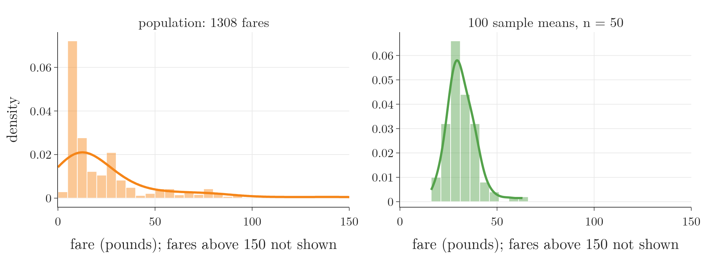
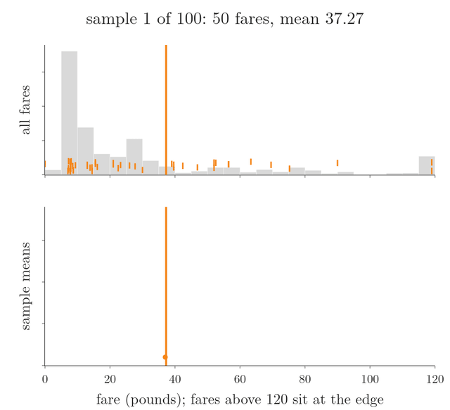
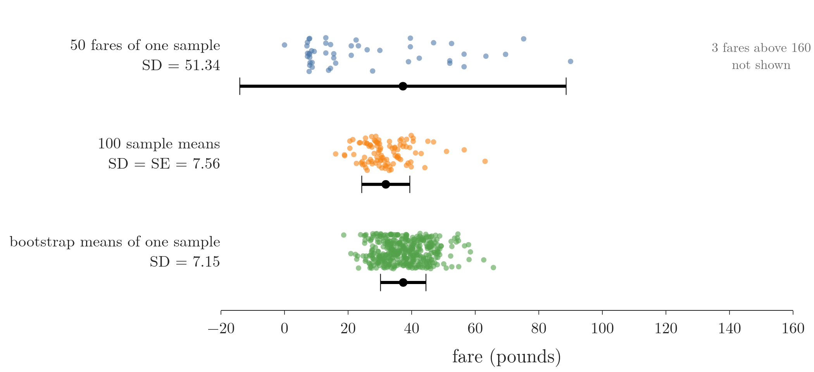
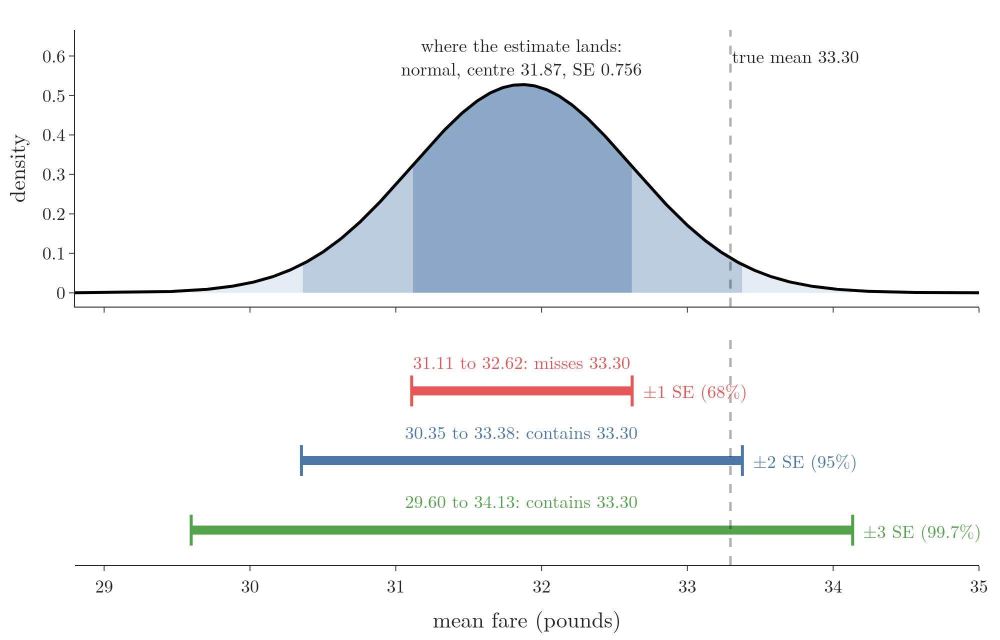
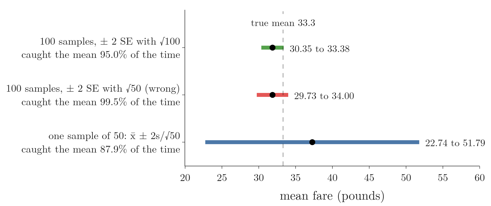
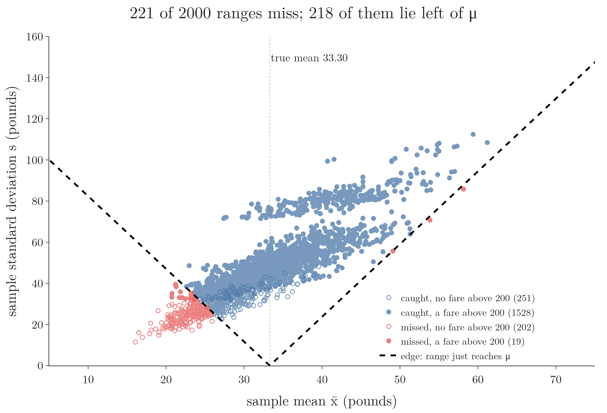
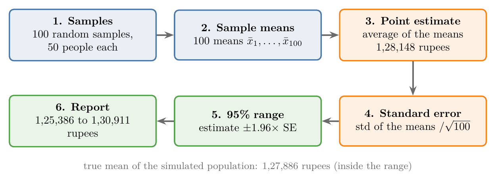

<!-- where-this-fits: generated by course_map/build_map.py; edit concepts.yaml, not this block -->
> **Where this fits:** Pipeline map step 0 (Foundations). See the [Course map](../../../00-course-map/00-course-map.md).
>
> 
>
> - **Builds on:** [Normal distribution](../../../MA/03-distributions/MA-020-random-variables-and-distributions/MA-020-random-variables-and-distributions.md#6-famous-distributions); [Sampling distribution and standard error](../../../MA/04-inference/MA-033-sampling-distribution-and-clt/MA-033-sampling-distribution-and-clt.md#3-sampling-distributions).
> - **Leads to:** [Confidence intervals](../../../MA/04-inference/MA-035-confidence-intervals-z-procedure/MA-035-confidence-intervals-z-procedure.md#4-confidence-intervals-and-confidence-levels); [Z-test and rejection regions](../../../MA/04-inference/MA-039-rejection-region-and-z-test/MA-039-rejection-region-and-z-test.md#6-the-rejection-region-and-the-critical-value).
<!-- /where-this-fits -->

## 1. Overview

> **Key point:** We pretend not to know the average Titanic fare, estimate it from random samples with the central limit theorem, and check the estimate against the truth.



[The central limit theorem](../MA-033-sampling-distribution-and-clt/MA-033-sampling-distribution-and-clt.md#4-the-central-limit-theorem) showed that sample means are approximately normal, centred on the population mean $\mu$, with standard error $\sigma/\sqrt{n}$. This Note uses that result on real data.

The Titanic carried 1309 passengers, and we know every fare. We act as if we did not, estimate the average fare from samples, and only at the end compare with the true value. Figure 1 shows why this is a fair test: the fares are far from normal, yet the sample means form a bell.

The Note covers:

- telling the standard deviation from the standard error (section 4);
- turning the sample means into a **point estimate** (G-1507) of $\mu$;
- turning the standard error into a **range** that probably contains $\mu$;
- a mistake in the divisor of the standard error, and the right one;
- the same steps as a template for estimating a country's average income.

## 2. The population: every Titanic passenger

> **Key point:** The Kaggle train file (891 passengers) and test file (418 passengers) together hold all 1309 passengers; their 1308 known fares are our population.

The Titanic data comes in two files. The train file has 891 passengers with a `Survived` column; the test file has the other 418 passengers without it. For the fares, the split does not matter: stacking both files gives every passenger on board, the whole population.

> **Python:** Building the population.
>
> ```python
> import pandas as pd
>
> train = pd.read_csv("data/titanic_train.csv")
> test = pd.read_csv("data/titanic_test.csv")
> df = pd.concat([train.drop(columns="Survived"), test])
> df = df.sample(frac=1, random_state=42)   # shuffle the rows
> fare = df["Fare"].dropna()                 # 1308 known fares
> ```
>
> `pd.concat` stacks the two tables. The `Survived` column is dropped first, because the test file has none. One fare is missing, so `dropna()` leaves 1308.

The fares are strongly right-skewed (Figure 1, left): skewness 4.37 (a number for how lopsided a distribution is: 0 means symmetric, large and positive means a long right tail), median 14.45 pounds, maximum 512.33 pounds. Most passengers paid little; a few first-class passengers paid a great deal. No one would call this distribution normal.

## 3. A sampling distribution of the mean fare

> **Key point:** 100 random samples of 50 passengers give 100 sample means, the sampling distribution of the mean fare.

We now draw samples as if surveying passengers:

1. Draw 50 passengers at random (sample size $n = 50$, above the usual threshold of 30).
2. Record their fares.
3. Repeat until we have 100 samples.
4. Compute the mean of each sample.

The first five sample means are 37.27, 25.21, 34.21, 28.85 and 27.57 pounds: every sample gives a different answer. Figure 1 (right) shows all 100. They are much closer to a bell than the fares, as the CLT predicts.

Figure 2 runs the experiment one sample at a time. Watch each sample's 50 fares (orange ticks) spread over the whole skewed range, while their mean (orange line) lands in a narrow pile below; at the end the pile's centre, its 2-standard-error range (sections 5 and 6) and the true mean appear.

{height=50%}

The bell is not perfect: the 100 means still have a skewness of 1.12. For a population as skewed as these fares, $n = 50$ gives a shape that is roughly normal, not exactly normal.

> **Python:** 100 samples of 50.
>
> ```python
> import numpy as np
>
> rng = np.random.default_rng(42)      # fixed seed
> samples = np.array([fare.sample(50, random_state=rng).to_numpy()
>                     for _ in range(100)])
> sample_means = samples.mean(axis=1)  # one mean per sample
> ```
>
> `samples` has shape `(100, 50)`: 100 samples, 50 fares each. Within one sample, `fare.sample(50)` never picks the same passenger twice.

## 4. Standard deviation and standard error

> **Key point:** The standard deviation measures how much single values vary within one sample; the standard error measures how much sample means vary from sample to sample, and it is much smaller.

Two spreads are easy to confuse here, and Figure 3 puts them on one axis.



1. **The spread of single fares.** The 50 fares of the first sample run from about 0 to over 160 pounds. Their standard deviation, $s = 51.34$ pounds, is the long bar in the top row.
2. **The spread of means.** The 100 sample means sit much closer together, in the middle row. A sample with one very expensive ticket moves its mean only a little, because the other 49 fares pull it back. For a mean to land far out, most of its 50 fares must be far out together, which is rare. The standard deviation of the 100 means is 7.56 pounds, the short bar.
3. **The name.** The standard deviation of the sample means is the **standard error** (G-1872) of the mean, introduced in [mean and variance of the sample means](../MA-033-sampling-distribution-and-clt/MA-033-sampling-distribution-and-clt.md#42-mean-and-variance-of-the-sample-means). The CLT predicts it as $\sigma/\sqrt{n}$, with $\sigma = 51.74$ and $n = 50$:

   $$\frac{51.74}{\sqrt{50}} = \frac{51.74}{7.071} = 7.32$$

   This is close to the observed 7.56 (section 6).

So the standard deviation describes the data, and belongs on a plot of the data; the standard error describes how precisely the mean is known, and belongs on a plot of an estimate (idea after StatQuest, "Standard Deviation vs Standard Error, Clearly Explained!!!").

**Another way: the bootstrap.** The formula $\sigma/\sqrt{n}$ works for the mean only. Every statistic, a median or a standard deviation too, has a standard error, and the **bootstrap** (G-320) estimates it from one sample without any formula:

1. draw 50 fares **from the sample itself**, with replacement, so some fares appear twice and some not at all;
2. compute the mean of this new sample;
3. repeat many times, here 10,000;
4. take the standard deviation of those means.

The draws in step 1 must be with replacement: drawing 50 fares out of 50 without replacement would give back the same 50 fares every time, with the same mean, and no spread to measure.

For the first sample, the bootstrap gives 7.15 pounds (Figure 3, bottom row), close to the true 7.32 and to the formula's value:

$$s/\sqrt{50} = 51.34/7.07 = 7.26$$

 [The bootstrap interval](../MA-035-confidence-intervals-z-procedure/MA-035-confidence-intervals-z-procedure.md#10-another-way-the-bootstrap-interval) builds a whole interval this way.

## 5. The point estimate

> **Key point:** The average of the sample means, 31.87 pounds, is our single best guess for the population mean: a point estimate.

By the CLT, the sample means are centred on the population mean. So their average is our best guess for $\mu$. A single number used as the best guess for an unknown parameter is a **point estimate**.

1. **In words:** average the $k$ sample means.
2. **Formula:**
   $$\hat{\mu} = \bar{\bar{x}} = \frac{1}{k}\sum_{j=1}^{k} \bar x_j$$
   The hat on $\hat{\mu}$ marks an estimate of $\mu$; $\bar{\bar{x}}$ ("x double bar") is the mean of the means.
3. **Example:** for our 100 sample means,

   $$\hat{\mu} = \frac{37.27 + 25.21 + 34.21 + \dots}{100}$$

   The dots stand for the other 97 sample means.

   $$\hat{\mu} = 31.87 \text{ pounds}$$


A point estimate is almost never exactly right. The CLT says it is close to $\mu$, not equal to it. So instead of claiming "the average fare is 31.87 pounds", we give a range, just as a weather forecast says "28 to 32 degrees tomorrow" rather than one exact temperature.

## 6. A range for the population mean

> **Key point:** About 95% of a normal distribution lies within 2 standard deviations of its centre, so "estimate $\pm$ 2 standard errors" gives a range that contains $\mu$ about 95% of the time.

The point estimate is itself a mean of normal-shaped values, so it follows a normal distribution around $\mu$. By the 68-95-99.7 rule (see [deriving the 68-95-99.7 rule](../../03-distributions/MA-025-standard-normal-and-z-table/MA-025-standard-normal-and-z-table.md#6-deriving-the-68-95-997-rule)), it lands within 2 of its standard deviations of $\mu$ about 95% of the time. Turned around: the range "estimate $\pm$ 2 standard deviations" contains $\mu$ about 95% of the time.

The standard deviation of an estimate is its standard error (SE). Our estimate averages 100 independent sample means, each with spread $s_{\bar{x}}$ (the standard deviation of the 100 sample means). By the variance-of-a-mean rule (the spread of an average of $k$ independent values is their spread divided by $\sqrt{k}$), averaging 100 of them divides that spread by $\sqrt{100}$.

1. **In words:** the standard error of the average of $k$ sample means is the standard deviation of the sample means divided by the square root of $k$, the number of samples.
2. **Formula:**

   $$SE = \frac{s_{\bar{x}}}{\sqrt{k}}$$

   $$\text{range} = \hat{\mu} \pm 2 \times SE$$

3. **Example:** the 100 sample means have standard deviation $s_{\bar{x}} = 7.56$ pounds, so:

   $$SE = \frac{7.56}{\sqrt{100}}$$

   $$SE = \frac{7.56}{10} = 0.756$$

   $$31.87 \pm 2 \times 0.756$$

   $$31.87 \pm 1.51$$

   The range is **30.35 to 33.38 pounds**.

Now we look at the truth: the mean fare of all 1308 passengers is **33.30 pounds**. The true mean lies inside the range, near its upper end. The point estimate alone (31.87) was off by 1.43 pounds; the range says honestly how far off it might be.

The 7.56 itself confirms the CLT: it should be $\sigma/\sqrt{50}$, and the population standard deviation of the fares is $\sigma = 51.74$. That gives:

$$51.74/\sqrt{50} = 7.32$$

> **Extra:** The value 2 is a rounded number. The exact multiplier that leaves 95% in the middle of a normal curve is 1.96, from the z-table: $\Phi(1.96) = 0.975$, where $\Phi(z)$ is the share of the standard normal curve below $z$ (see [the z-table](../../03-distributions/MA-025-standard-normal-and-z-table/MA-025-standard-normal-and-z-table.md#4-the-z-table)). With 1.96 the range here becomes $31.87 \pm 1.48$. [Finding the critical value](../MA-035-confidence-intervals-z-procedure/MA-035-confidence-intervals-z-procedure.md#9-finding-the-critical-value-z_alpha2) derives it.

### 6.1 Why 2 standard errors

> **Key point:** A wider range is more likely to contain $\mu$ but says less; 2 standard errors (95%) is the usual compromise.

We could use 1, 2 or 3 standard errors:

| Range | Share of a normal curve | Fare range (pounds) |
|---|---|---|
| $\pm 1$ SE | 68% | 31.11 to 32.62 |
| $\pm 2$ SE | 95% | 30.35 to 33.38 |
| $\pm 3$ SE | 99.7% | 29.60 to 34.13 |

With 1 SE, the range is narrow but wrong about a third of the time; here it misses 33.30. With 3 SE, we are almost never wrong, but the range is wider.

Figure 4 draws the table. Watch the dashed true mean: it lies just inside the blue 2-SE range, outside the red 1-SE range, and comfortably inside the wide green 3-SE range.



A range must be narrow enough to be useful. "The average salary in a company is between 10,000 and 15,000 rupees, and I am 95% sure" says more than "between 10,000 and 45,000 rupees, and I am 99% sure". The 95% level, about 2 standard errors, is the standard compromise.

## 7. A common mistake: dividing by the wrong square root

> **Key point:** The standard error of an average of 100 sample means divides by $\sqrt{100}$, the number of samples; dividing by $\sqrt{50}$, the sample size, mixes up the two sizes.

Two sizes appear in this method, and they are easy to swap:

- $n = 50$, the **sample size** (G-1727): the standard deviation of the sample means is already $\sigma/\sqrt{50}$; the division by $\sqrt{n}$ has happened once, inside the CLT.
- $k = 100$, the **number of samples**: averaging the 100 sample means divides their spread by $\sqrt{100}$.

Dividing $s_{\bar{x}} = 7.56$ by $\sqrt{50}$ instead gives:

$$7.56/7.07 = 1.07$$

The range is then 29.73 to 34.00. This wrong range also contains 33.30, but it is the wrong width. Figure 5 shows what each version does when the whole experiment is repeated 1000 times.



- **$\sqrt{100}$ (right):** the range contains the true mean in 95.0% of the repetitions, exactly as promised.
- **$\sqrt{50}$ (wrong):** 99.5%. The range is about 40% too wide, so the "95%" label is false.

## 8. With only one sample

> **Key point:** In practice we have one sample, and the range is $\bar{x} \pm 2s/\sqrt{n}$; for very skewed data, $n = 50$ is too small for this to be reliable.

Drawing 100 samples is a teaching device: it lets us see the sampling distribution. A real survey collects one sample. Then the CLT is used directly: the one sample mean $\bar{x}$ is the point estimate, and the standard error $\sigma/\sqrt{n}$ is estimated with the sample's own standard deviation $s$:

$$\bar{x} \pm 2\thinspace\frac{s}{\sqrt{n}}$$

For the first of our samples, $\bar{x} = 37.27$ and $s = 51.34$, so the range is:

$$37.27 \pm 2 \times 51.34/\sqrt{50}$$

$$37.27 \pm 14.52$$

That is **22.74 to 51.79 pounds** (Figure 5, blue). The one-sample range contains 33.30, and it is much wider. Its standard error is $\sigma/\sqrt{50}$. The average of 100 samples of 50 has a standard error ten times smaller:

$$(\sigma/\sqrt{50})/\sqrt{100} = \sigma/\sqrt{5000}$$

By the same formula, 100 samples of 50 give the same standard error, $\sigma/\sqrt{5000}$, as one large sample of 5000. If we have several samples, we can pool them into one.

> **Extra:** The one-sample range with $n = 50$ caught the true mean in only 87.9% of the 1000 repetitions of Figure 5, not 95%. The fares are so skewed that only 38 of the 1308 passengers paid more than 200 pounds. The Notebook tests whether missing those tickets is the cause, with 2000 fresh samples of 50. Of their 221 misses, 218 fell below the true mean. A sample with no fare above 200 missed 44.6% of the time; a sample with at least one missed 1.2% of the time. The sample mean and $s$ move together (correlation 0.86), so a sample without the expensive tickets has both $\bar{x}$ and $s$ too small at once: the range is too low and too narrow. With $n = 200$ the share rises to 95.6%. Figure 6 shows all 2000 samples as points. The $n \ge 30$ rule is not enough for extremely skewed data. Using $s$ in place of $\sigma$ also adds its own uncertainty; [Student's t distribution](../MA-037-t-procedure/MA-037-t-procedure.md#5-students-t-distribution) handles that part.



Watch where the red points sit in Figure 6: low and to the left, below the V, because a sample without an expensive ticket has both a small $\bar{x}$ and a small $s$.

## 9. Template: the average income of a country

> **Key point:** Random representative samples of at least 30, their means, the average of the means, its standard error, and a 95% range around it.

The same steps estimate any population mean, such as the average yearly income in India (Figure 7 shows them with the simulated numbers below):

{height=30%}

1. **Collect several random samples** of incomes, each with $n \ge 30$. They must be representative: not only from cities, not only from one state, not only from one age group.
2. **Compute the mean of each sample**, which gives the sampling distribution of the mean.
3. **Average the sample means**: this is the point estimate of the population mean.
4. **Compute the standard error**: the standard deviation of the sample means divided by the square root of the number of samples.
5. **Build the 95% range**: point estimate $\pm 1.96 \times$ SE.
6. **Report** the estimate together with the range.

We have no real income data, so the Notebook simulates a log-normal population of one million yearly incomes (see [the log-normal distribution](../../03-distributions/MA-029-uniform-and-log-normal/MA-029-uniform-and-log-normal.md#3-the-log-normal-distribution)). From 100 samples of 50 people, the estimate is 1,28,148 rupees with 95% range 1,25,386 to 1,30,911 rupees; the true mean of the simulated population is 1,27,886 rupees.

The result is only as good as the samples. Biased samples (see [sampling noise and sampling bias](../../../ML/01-foundations/ML-007-challenges-in-ml/ML-007-challenges-in-ml.md#42-sampling-noise-and-sampling-bias)) give a tight, confident range around the wrong value.

## 10. Summary

| Step | Formula | Titanic fares | Why it matters |
|---|---|---|---|
| Sample means | $\bar x_1, \dots, \bar x_{100}$, each from $n = 50$ | 37.27, 25.21, 34.21, ... | every sample gives a different answer, so we need their distribution |
| Point estimate | $\hat{\mu}$ = average of the sample means | 31.87 | the sample means centre on $\mu$, so their average is the best single guess |
| Spread of the sample means | $s_{\bar{x}} \approx \sigma/\sqrt{n}$ | 7.56 (CLT: 7.32) | far smaller than the spread of single fares, because the other fares in a sample pull an extreme one back |
| Standard error of the estimate | $s_{\bar{x}}/\sqrt{k}$ | $7.56/\sqrt{100} = 0.756$ | says how precisely the estimate is known |
| 95% range | $\hat{\mu} \pm 2\thinspace SE$ | 30.35 to 33.38 (truth 33.30) | says how far off the estimate might be; it caught the truth |
| One sample only | $\bar{x} \pm 2s/\sqrt{n}$ | 22.74 to 51.79 | what a real survey with one sample gets: much wider |

- The CLT works on the skewed fares: the sample means are close to a bell, so normal-curve ranges apply even though the fares are not normal.
- A range says how far off the point estimate might be; 2 standard errors is the 95% compromise, because 1 standard error misses too often and 3 give a range too wide to be useful.
- Divide by the square root of the number of samples when averaging sample means; the sample size is already inside $s_{\bar{x}}$, so dividing by $\sqrt{50}$ makes the range about 40% too wide and the "95%" label false.
- For extremely skewed data, a sample of 50 can be too small (the one-sample range caught the truth only 87.9% of the time, because many samples miss the rare expensive tickets); and no sample size fixes a biased sample.
- This answers the opening question: random samples and the CLT gave an estimate of the average fare, 31.87 pounds, and a 95% range that contained the true 33.30.

## 11. Sources

**Built from**

- CampusX, "Session 43 - Central Limit Theorem | DSMP 2023", YouTube, https://www.youtube.com/watch?v=-WmJDYBor7c
- StatQuest with Josh Starmer, "The standard error, Clearly Explained!!!", YouTube, https://www.youtube.com/watch?v=XNgt7F6FqDU
- StatQuest with Josh Starmer, "Standard Deviation vs Standard Error, Clearly Explained!!!", YouTube, https://www.youtube.com/watch?v=A82brFpdr9g

## 12. Key terms

| Term | Meaning |
|---|---|
| Point estimate | A single number computed from sample data as the best guess for an unknown population parameter |
| $\hat{\mu}$ | An estimate of the population mean $\mu$ |
| Number of samples ($k$) | How many samples are drawn; different from the sample size $n$ |
