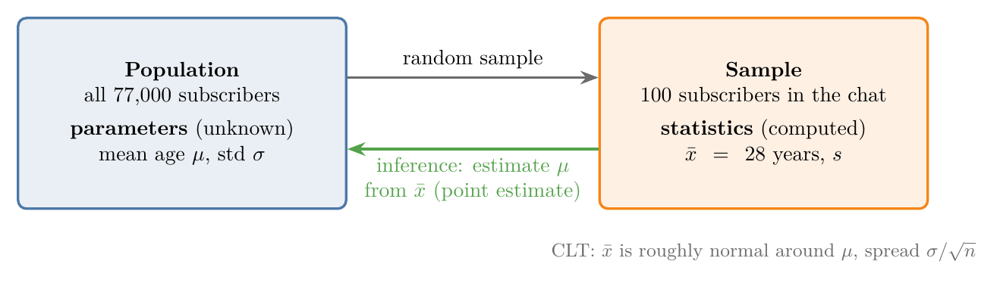
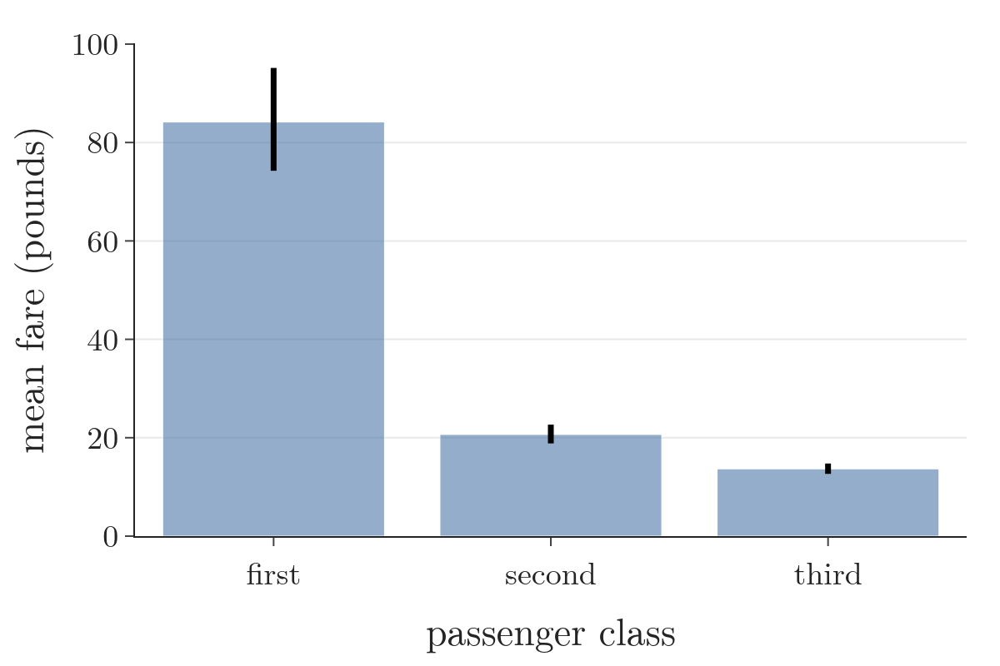
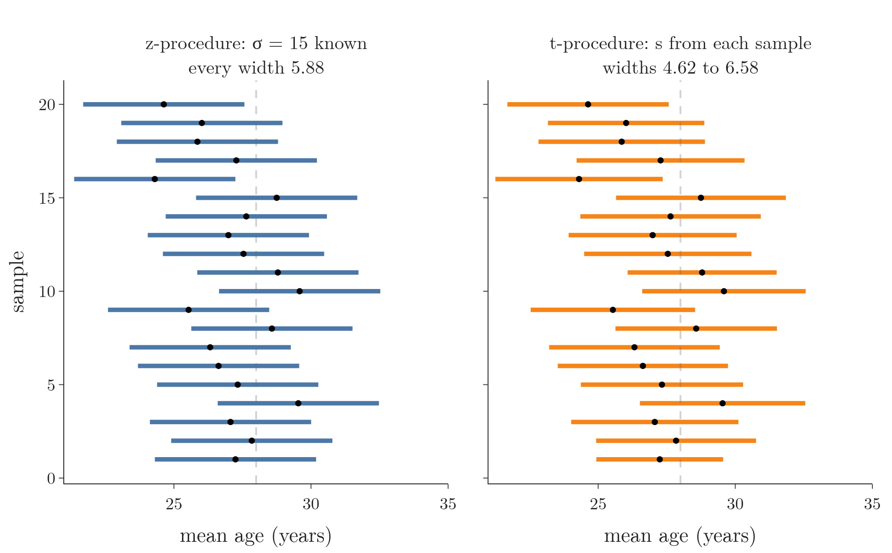
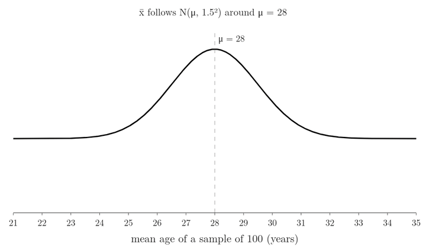
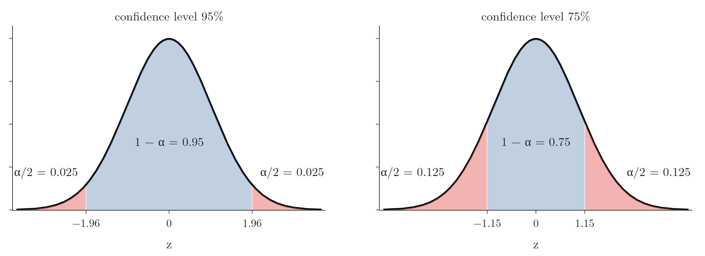

<!-- where-this-fits: generated by course_map/build_map.py; edit concepts.yaml, not this block -->
> **Where this fits:** Pipeline map step 0 (Foundations). See the [Course map](../../../00-course-map/00-course-map.md).
>
> 
>
> - **Builds on:** [Inferential statistics](../../../MA/01-descriptive-stats/MA-004-what-is-statistics/MA-004-what-is-statistics.md#3-descriptive-and-inferential-statistics); [Central limit theorem](../../../MA/04-inference/MA-033-sampling-distribution-and-clt/MA-033-sampling-distribution-and-clt.md#4-the-central-limit-theorem); [Standard normal and the z-table](../../../MA/03-distributions/MA-025-standard-normal-and-z-table/MA-025-standard-normal-and-z-table.md#2-the-standard-normal-distribution).
> - **Leads to:** [Student's t-distribution](../../../MA/04-inference/MA-037-t-procedure/MA-037-t-procedure.md#5-students-t-distribution).
> - **Compare with:** [Hypothesis testing: null and alternative](../../../MA/04-inference/MA-038-null-and-alternative-hypotheses/MA-038-null-and-alternative-hypotheses.md#2-the-problem-hypothesis-testing-solves).
<!-- /where-this-fits -->

## 1. Overview

> **Key point:** A confidence interval replaces a single guess with a range: point estimate $\pm$ margin of error, together with a confidence level such as 95%.


A sample mean is almost never exactly the population mean. A **confidence interval** admits this: it gives a range of plausible values for the parameter and says how confident we are in the method that built it. Figure 1 shows its parts for one example worked out in this Note.

This Note covers:

- why a point estimate alone is not reliable;
- what a confidence interval and a confidence level are;
- the **z-procedure**, used when the population standard deviation $\sigma$ is known: its assumptions, its formula, where the formula comes from, and how to find the critical value $z_{\alpha/2}$;
- the bootstrap interval, built without any formula (section 10).

[What "95% confident" means](../MA-036-interpreting-confidence-intervals/MA-036-interpreting-confidence-intervals.md#2-what-95-confident-means) and [what makes an interval wide or narrow](../MA-036-interpreting-confidence-intervals/MA-036-interpreting-confidence-intervals.md#4-what-sets-the-width-of-an-interval) are in the next Note. [The t-procedure](../MA-037-t-procedure/MA-037-t-procedure.md#3-replacing-sigma-by-s) handles the usual case where $\sigma$ is unknown.

## 2. Terms we build on

> **Key point:** Population and sample, parameter and statistic, inferential statistics, the central limit theorem and the point estimate.

Each of these is taught in an earlier Note; here is the one-line version.

- **Population and sample:** the population is the entire group we want to study; a sample is the part we measure, chosen at random and representative (see [population and sample](../../01-descriptive-stats/MA-004-what-is-statistics/MA-004-what-is-statistics.md#4-population-and-sample)).
- **Parameter and statistic:** a number describing the population (Greek letters: $\mu$, $\sigma$) and the same number computed from a sample (Latin letters: $\bar{x}$, $s$). Parameters are usually unknown and must be estimated from statistics.
- **Inferential statistics** (G-944): drawing conclusions about a population from a sample. Its tools include confidence intervals, hypothesis tests and regression, and it answers questions such as "can the sample mean tell us the population mean?".
- **Central limit theorem:** the means of large samples are approximately normal around $\mu$ with standard error $\sigma/\sqrt{n}$ (the standard deviation of the sample means; see [the central limit theorem](../MA-033-sampling-distribution-and-clt/MA-033-sampling-distribution-and-clt.md#4-the-central-limit-theorem)).
- **Point estimate:** a single number computed from sample data as the best guess for an unknown parameter (see [estimating a mean with the CLT](../MA-034-estimating-a-mean-with-the-clt/MA-034-estimating-a-mean-with-the-clt.md#5-the-point-estimate)).

Figure 2 puts these terms on the running example of this Note. Watch the two arrows: sampling goes from the population to the sample, and inference comes back the other way.

{height=26%}

The running example: an online channel has about 77,000 subscribers, and we want their average age $\mu$. Asking all of them is impossible. Instead, 100 subscribers in an online event type their age in the chat. Their mean age is $\bar{x} = 28$ years: a point estimate of $\mu$.

Averaging the means of 10 such events would give a better point estimate, as in [the point estimate](../MA-034-estimating-a-mean-with-the-clt/MA-034-estimating-a-mean-with-the-clt.md#5-the-point-estimate). The average would still be a single number.

## 3. Why a point estimate is not enough

> **Key point:** An exact guess is almost always wrong; a range is far more likely to be right.

Suppose we must guess how many runs MS Dhoni will score in today's match, with three ways to bet:

| Bet | Wins if | Prize |
|---|---|---|
| Exact score | the guess is exactly right | 1 crore rupees |
| Within $\pm 10$ runs | the score is within 10 of the guess | 75 lakh rupees |
| Within $\pm 20$ runs | the score is within 20 of the guess | 50 lakh rupees |

A sensible person takes the second or third bet. Hitting the exact score is very unlikely, while a range of 20 or 40 runs has a real chance. If we guess 35 and he scores 28, the difference is 7: the $\pm 10$ bet wins.

The same holds for estimates. Claiming that the mean age of 77,000 people is exactly 28, because 100 of them average 28, is not believable. So statisticians report a range that probably contains the parameter.

## 4. Confidence intervals and confidence levels

> **Key point:** A confidence interval is a range of plausible values for a population parameter; the confidence level, usually 95%, says how often the method that builds such intervals succeeds.

A **confidence interval (CI)** (G-446) is a range of values within which we expect a population parameter, such as $\mu$ or $\sigma$, to lie. The interval expresses the uncertainty of an estimate obtained from a sample.

Every confidence interval comes with a **confidence level** (G-447), a percentage such as 95%. "The mean age of the subscribers is between 25 and 32 years, at 95% confidence": the range 25 to 32 is the interval, and 95% is the level. The exact meaning of the level is subtle; [the meaning of the level](../MA-036-interpreting-confidence-intervals/MA-036-interpreting-confidence-intervals.md#2-what-95-confident-means) is devoted to it.

Every confidence interval has the same structure.

1. **In words:** start from the point estimate and go one **margin of error** (G-1162) down and one up.
2. **Formula:**
   $$\text{CI} = \text{point estimate} \pm \text{margin of error}$$
3. **Example:** a point estimate of 25 years and a margin of error of 4 years give
   $$25 - 4 = 21 \text{ (lower limit)}$$

   $$25 + 4 = 29 \text{ (upper limit)}$$

So building a confidence interval needs two things: a point estimate and a margin of error. The rest of this Note is about the margin of error.

A confidence interval is always about a **parameter** of the population (here $\mu$), never about a statistic. The statistic $\bar{x}$ is known exactly; it is the tool we use to build the interval.

### 4.1 Confidence intervals in practice

> **Key point:** Business forecasts and the error bars that seaborn draws on a bar chart are confidence intervals.

Companies, finance and economics rarely report a single projection. A sales forecast is a range: "between 4.2 and 4.8 crore rupees next quarter".

We have also drawn confidence intervals already without naming them. Figure 3 plots the mean Titanic fare of each passenger class, with the same error bars that seaborn (a Python plotting library) draws in [the bar plot](../../../ML/02-getting-data/ML-020-bivariate-multivariate-analysis/ML-020-bivariate-multivariate-analysis.md#4-bar-plot-a-numerical-column-across-categories). The black line on top of each bar is a 95% confidence interval for the mean fare of that class.

{height=36%}

The bars show the sample means; the lines show where the population means of passengers like these probably lie. First class has 216 passengers whose fares are very spread out (standard deviation about 78 pounds), and its interval is wide (about 74 to 95 pounds). Third class has 491 passengers with similar fares (standard deviation about 12 pounds), and its interval is narrow (about 12.6 to 14.7 pounds). Both match the standard error $s/\sqrt{n}$ of section 7: a larger spread or a smaller sample gives a wider interval.

> **Extra:** Seaborn builds these intervals by bootstrapping (see [bootstrap sampling in bagging](../../../ML/08-trees-and-ensembles/ML-099-bagging-intuition/ML-099-bagging-intuition.md#21-bootstrapping)): it resamples the data with replacement many times (1,000 by default in `seaborn.barplot`), recomputes the mean each time, and keeps the middle 95% of those means (Waskom 2021; seaborn docs v0.13). Figure 3 repeats this with 10,000 resamples, and section 10 builds such an interval step by step. In the notebook, the formula of this Note with $s$ in place of $\sigma$ gives almost the same ranges: 73.7 to 94.6 pounds for first class (bootstrap: 74.3 to 95.2) and 12.6 to 14.7 pounds for third class (bootstrap: 12.7 to 14.8).

## 5. Two ways to compute a confidence interval for a mean

> **Key point:** The z-procedure needs the population standard deviation $\sigma$; the t-procedure works with the sample standard deviation $s$.

There are several ways to compute a confidence interval. For a mean, the two standard ones are:

| Procedure | Use when | Spread used |
|---|---|---|
| **Z-procedure** (G-2138) ("sigma known") | the population standard deviation $\sigma$ is known | $\sigma$ |
| **T-procedure** (G-1938) ("sigma unknown") | $\sigma$ is unknown | the sample standard deviation $s$ |

Figure 4 shows the difference on 20 samples of 100 ages from the Notebook's population ($\mu = 28$, $\sigma = 15$). Watch the widths: with $\sigma$ known every z-interval is equally wide, while each t-interval takes its width from its own sample's $s$.

{height=45%}

In practice $\sigma$ is almost never known: if we do not know the mean age of 77,000 subscribers, we hardly know the standard deviation of their ages. So the t-procedure is the one used in real work. We start with the z-procedure; the t-procedure has the same form, with $s$ and a t critical value in place of $\sigma$ and $z$ (see [the t-procedure formula](../MA-037-t-procedure/MA-037-t-procedure.md#6-the-t-procedure-formula)).

## 6. Assumptions of the z-procedure

> **Key point:** A random sample, a known $\sigma$, and a normal population or a sample large enough for the central limit theorem.

The z-procedure gives correct intervals only when three assumptions hold:

1. **Random sample.** The sample is drawn at random and is representative. A sample of only Indian subscribers says little about a channel with subscribers in many countries.
2. **Known population standard deviation.** We know $\sigma$, here the standard deviation of the ages of all subscribers. We assume $\sigma = 15$ years.
3. **Normal sampling distribution.** Either the population itself is normal, or the sample is large, usually $n > 30$. Then, by the central limit theorem, the sample mean is approximately normal whatever the shape of the population (see [the central limit theorem](../MA-033-sampling-distribution-and-clt/MA-033-sampling-distribution-and-clt.md#4-the-central-limit-theorem)).

The third assumption is therefore mild. A population of ages with three peaks, at 26, 32 and 44, is clearly not normal; with a sample of 100 the z-procedure still works. With a non-normal population and only 20 people in the sample, it does not: neither the population nor the CLT gives a normal sample mean.

## 7. The z-procedure formula

> **Key point:** $\bar{x} \pm z_{\alpha/2}\thinspace\sigma/\sqrt{n}$, where $1 - \alpha$ is the confidence level and $z_{\alpha/2}$ is read from the standard normal curve.

The problem: a sample of $n = 100$ subscribers has mean age $\bar{x} = 28$ years, the population standard deviation is $\sigma = 15$ years, and we want a 95% confidence interval for $\mu$.

1. **In words:** go from the sample mean $z_{\alpha/2}$ standard errors down and up. The standard error is $\sigma/\sqrt{n}$, and the margin of error is $z_{\alpha/2}$ times it.
2. **Formula:**
   $$\bar{x} \pm z_{\alpha/2}\thinspace\frac{\sigma}{\sqrt{n}}$$
   - $\bar{x}$: the sample mean, our point estimate.
   - $1 - \alpha$: the confidence level. For 95%, $1 - \alpha$ is 0.95, so $\alpha$ (G-3; the share of intervals that miss the parameter) is 0.05 and $\alpha/2$ is 0.025.
   - $z_{\alpha/2}$: the **critical value** (G-504), the z-score that leaves an area of $\alpha/2$ in the upper tail of the standard normal curve. For 95% it is 1.96 (section 9).
   - $\sigma$: the population standard deviation; $n$: the sample size.
3. **Example:**
   $$SE = \frac{15}{\sqrt{100}}$$

   $$SE = \frac{15}{10} = 1.5$$

   $$E = 1.96 \times 1.5 = 2.94$$
   $$28 - 2.94 = 25.06$$
   $$28 + 2.94 = 30.94$$
   The 95% confidence interval for the mean age of all subscribers is **25.06 to 30.94 years** (Figure 1).

The formula leaves two questions: why this formula, and how to find $z_{\alpha/2}$. The next two sections answer them.

> **Python:** The z-interval with scipy.
>
> ```python
> import numpy as np
> from scipy import stats
>
> x_bar, sigma, n = 28, 15, 100
> se = sigma / np.sqrt(n)                  # 1.5
> z = stats.norm.ppf(0.975)                # 1.96
> x_bar - z * se, x_bar + z * se           # (25.06, 30.94)
> stats.norm.interval(0.95, loc=x_bar, scale=se)   # same
> ```

## 8. Where the formula comes from

> **Key point:** Standardize the sample mean, find the middle 95% of the standard normal curve, and rearrange the inequality so that $\mu$ stands alone.

**Step 1: the sample mean is normal.** By the assumptions (or the CLT), $\bar{X}$ follows a normal distribution with mean $\mu$ and standard deviation $\sigma/\sqrt{n}$. Imagine many online events of 100 subscribers each: their mean ages $\bar x_1, \bar x_2, \dots$ form this bell (see [mean and variance of the sample means](../MA-033-sampling-distribution-and-clt/MA-033-sampling-distribution-and-clt.md#42-mean-and-variance-of-the-sample-means)).

**Step 2: standardize.** Subtracting the mean and dividing by the standard deviation turns any normal variable into the standard normal $Z \sim N(0, 1)$ (see [standardizing](../../03-distributions/MA-025-standard-normal-and-z-table/MA-025-standard-normal-and-z-table.md#3-standardizing-a-normal-variable)); $\bar{X}$ is the sample mean as a random variable (it changes from sample to sample), and $Z$ is its z-score:
$$Z = \frac{\bar{X} - \mu}{\sigma/\sqrt{n}}$$

**Step 3: the middle $1 - \alpha$ of $Z$.** We want a range of $z$ values that contains $Z$ with probability $1 - \alpha$ (95%). The curve is symmetric, so the remaining $\alpha$ splits into $\alpha/2$ in each tail (Figure 6). The two cut-off points are $-z_{\alpha/2}$ and $+z_{\alpha/2}$:
$$P\negthinspace\left(-z_{\alpha/2} < Z < z_{\alpha/2}\right) = 1 - \alpha$$

Here $P(\dots)$ is the probability that the statement inside holds.

**Step 4: put $\bar{X}$ back in and isolate $\mu$.** Each step below rewrites the same event in a new form, so its probability stays $1 - \alpha$ throughout; we track only the inequality inside $P(\dots)$. Put $\bar{X}$ back in place of $Z$:

$$-z_{\alpha/2} < \frac{\bar{X} - \mu}{\sigma/\sqrt{n}} < z_{\alpha/2}$$

Multiply all three parts by $\sigma/\sqrt{n}$:

$$-z_{\alpha/2}\frac{\sigma}{\sqrt{n}} < \bar{X} - \mu < z_{\alpha/2}\frac{\sigma}{\sqrt{n}}$$

Subtract $\bar{X}$ from all three parts:

$$-\bar{X} - z_{\alpha/2}\frac{\sigma}{\sqrt{n}} < -\mu$$

$$-\mu < -\bar{X} + z_{\alpha/2}\frac{\sigma}{\sqrt{n}}$$

Multiply by $-1$, which flips both inequality signs:

$$\bar{X} - z_{\alpha/2}\frac{\sigma}{\sqrt{n}} < \mu < \bar{X} + z_{\alpha/2}\frac{\sigma}{\sqrt{n}}$$

and this event still has probability $1 - \alpha$.

The two ends are exactly the confidence interval $\bar{X} \pm z_{\alpha/2}\thinspace\sigma/\sqrt{n}$.

**Step 5: what the probability belongs to.** The last line looks like the claim that $\mu$ lies in this range with probability 95%, but $\mu$ is a fixed number: the true mean age of the subscribers does not vary. What varies is $\bar{X}$: the next online event brings different people and a different mean. The probability belongs to the random interval, not to $\mu$.

Figure 5 replays the argument with numbers. The Notebook's simulation uses $\mu = 28$, so $\bar{X}$ lands within 2.94 of 28 for 95% of samples. Watch the distance between a sample mean and $\mu$: measured from $\mu$ it decides whether $\bar{x}$ falls in the band, and measured from $\bar{x}$ it decides whether the interval reaches $\mu$. It is the same distance, so the two events always happen together.

{height=45%}

So once we compute one interval from one sample (25.06 to 30.94), we do not say that $\mu$ is in it with probability 95%. We say we are **95% confident**: 95% of intervals built this way contain $\mu$. [Seeing it by simulation](../MA-036-interpreting-confidence-intervals/MA-036-interpreting-confidence-intervals.md#21-seeing-it-by-simulation) shows this.

## 9. Finding the critical value $z_{\alpha/2}$

> **Key point:** Look up the area $1 - \alpha/2$ in the z-table: 0.975 gives $z = 1.96$ for 95%, and 0.875 gives $z = 1.15$ for 75%.



A z-table gives the area to the **left** of $z$, written $\Phi(z)$ (see [the z-table](../../03-distributions/MA-025-standard-normal-and-z-table/MA-025-standard-normal-and-z-table.md#4-the-z-table)). The area to the left of $+z_{\alpha/2}$ is the middle $1 - \alpha$ plus the left tail $\alpha/2$.

1. **In words:** add the left tail to the middle area, then find the $z$ with that area to its left.
2. **Formula:**
   $$\Phi(z_{\alpha/2}) = (1 - \alpha) + \frac{\alpha}{2} = 1 - \frac{\alpha}{2}$$
3. **Example:** for 95%, $\alpha = 0.05$:
   $$\Phi(z_{0.025}) = 0.95 + 0.025 = 0.975$$
   The z-table has 0.9750 in row 1.9, column 0.06, so $z_{0.025} = 1.96$. By symmetry the lower cut-off is $-1.96$.

For a 75% confidence level, $\alpha = 0.25$ and each tail holds 0.125. The area to the left is:

$$0.75 + 0.125 = 0.875$$

The z-table places this area at $z = 1.15$ (Figure 6, right). The margin of error for the subscribers is:

$$1.15 \times 1.5 = 1.73$$

The 75% interval is 28 plus and minus 1.73:

$$28 - 1.73 = 26.27$$

$$28 + 1.73 = 29.73$$

That is 26.27 to 29.73 years, narrower than the 95% interval.

| Confidence level | $\alpha/2$ | Area to the left | $z_{\alpha/2}$ |
|---|---|---|---|
| 50% | 0.25 | 0.75 | 0.674 |
| 75% | 0.125 | 0.875 | 1.150 |
| 80% | 0.10 | 0.90 | 1.282 |
| 90% | 0.05 | 0.95 | 1.645 |
| 95% | 0.025 | 0.975 | 1.960 |
| 99% | 0.005 | 0.995 | 2.576 |

The critical value completes the z-procedure: with $\bar{x}$, $\sigma$, $n$ and the critical value for the chosen confidence level, the interval follows from one formula. 95% is the usual level; the next Note shows why.

> **Python:** Critical values with scipy.
>
> ```python
> from scipy import stats
>
> level = 0.95
> stats.norm.ppf(1 - (1 - level) / 2)    # 1.96
> stats.norm.ppf(0.875)                  # 1.15, for 75%
> ```
>
> `ppf` is the inverse of the CDF: it takes an area and returns the $z$ with that area to its left.

## 10. Another way: the bootstrap interval

> **Key point:** Resample the one sample with replacement many times, compute the mean of each resample, and keep the middle 95% of those means: a confidence interval without $\sigma$, without a z-table and without a formula.

The z-procedure needs $\sigma$ and a normal sampling distribution. The **bootstrap** (G-320) needs neither. It treats the sample as a small copy of the population and draws new samples from it. Figure 7 builds one on 12 random Titanic ages: 45, 51, 11, 21, 22, 28, 26, 32, 30, 18, 30, 32, with mean 28.83 years.


1. **Resample.** Draw 12 ages from the 12, **with replacement**: after each draw the age goes back, so one age can be picked twice or three times and another not at all. In the top panel of Figure 7, a stack of orange dots is an age drawn more than once. Without replacement, 12 draws from 12 ages would give back the same 12 ages every time, with the same mean 28.83, and the means would have no spread to measure.
2. **Compute the mean** of the resample: 29.7 for the first one.
3. **Repeat** 10,000 times. The means pile up into a histogram (bottom panel): it shows how much the mean of 12 such ages moves from sample to sample.
4. **Keep the middle 95%.** Cut off the lowest 2.5% and the highest 2.5% of the 10,000 means. The cut points, the 2.5th and 97.5th percentiles, are the interval: **23.2 to 35.0 years**. It contains the true mean of all 714 known ages, 29.70.

This is called a **percentile bootstrap interval** (G-2234). The same four steps work for a median, a standard deviation or any other statistic, where no simple formula exists.

The formula route with this sample uses $s$ in place of the unknown $\sigma$, which [the t-procedure](../MA-037-t-procedure/MA-037-t-procedure.md#3-replacing-sigma-by-s) teaches: it gives 21.9 to 35.8 years (Figure 7, black). The bootstrap interval is a little narrower. With only 12 values that is a weakness: in the Notebook, over 2000 samples of 12 ages, the 95% bootstrap interval contained the true mean in 91.3% of samples, the t-interval in 95.1%. With small samples the formula is safer; the bootstrap shines for statistics that have no formula.

## 11. Summary

| Idea | Formula | Example | Why it matters |
|---|---|---|---|
| Confidence interval | point estimate $\pm$ margin of error | $25 \pm 4$: 21 to 29 | a range is far more likely to be right than one exact guess |
| Confidence level | $1 - \alpha$ | 0.95, so $\alpha = 0.05$ | says how often the method succeeds; $\alpha$ is split between the two tails |
| Standard error | $\sigma/\sqrt{n}$ | $15/\sqrt{100} = 1.5$ | the spread of the sample mean, from the CLT |
| Critical value | $\Phi(z_{\alpha/2}) = 1 - \alpha/2$ | $\Phi(1.96) = 0.975$ | the z-table gives left areas, so the middle $1 - \alpha$ plus the left tail is looked up |
| Margin of error | $E = z_{\alpha/2}\thinspace\sigma/\sqrt{n}$ | $1.96 \times 1.5 = 2.94$ | a higher level gives a larger $z_{\alpha/2}$ and so a wider interval (75%: 1.73) |
| Z-interval | $\bar{x} \pm z_{\alpha/2}\thinspace\sigma/\sqrt{n}$ | 25.06 to 30.94 years | the range of plausible values for the mean age $\mu$ |

- A point estimate is almost never exactly right; an interval states the uncertainty, so report a range, as with the bet on a range of runs rather than the exact score.
- A confidence interval is about a population parameter, built from sample statistics, because the statistic $\bar{x}$ is already known exactly; only $\mu$ is unknown.
- The z-procedure needs a random sample, a known $\sigma$, and a normal population or $n > 30$, because only then is the sample mean approximately normal with a known spread; when $\sigma$ is unknown, use the t-procedure.
- The probability of 95% belongs to the method (the random interval), not to the fixed $\mu$, because $\mu$ does not vary while $\bar{X}$ changes from sample to sample; so say "95% confident".
- This answers the opening question: instead of a single guess, report point estimate $\pm$ margin of error, with a confidence level such as 95%.

## 12. Sources

**Built from**

- CampusX, "Session 44 - Confidence Intervals | DSMP 2023", YouTube, https://www.youtube.com/watch?v=X52HK2qkiIE
- Khan Academy, "Confidence intervals and margin of error", YouTube, https://www.youtube.com/watch?v=hlM7zdf7zwU
- StatQuest with Josh Starmer, "Confidence Intervals, Clearly Explained!!!", YouTube, https://www.youtube.com/watch?v=TqOeMYtOc1w

**Other references**

- Waskom, M. L. (2021). "seaborn: statistical data visualization." *Journal of Open Source Software* 6(60), 3021.
- seaborn developers. *seaborn v0.13 documentation*: tutorial "Statistical estimation and error bars", and API reference `seaborn.barplot` (`errorbar=("ci", 95)`, `n_boot=1000`). seaborn.pydata.org.

## 13. Key terms

Terms taught in this Note come first; linked terms are recaps, taught in the Note the link opens.

| Term | Meaning |
|---|---|
| Confidence interval (G-446) | A range of values, computed from a sample, that we expect to contain a population parameter such as the mean, so it shows how uncertain the estimate is. The method captures the true value in a stated share of repeated samples, such as 95%. |
| Confidence level (G-447) | The share of intervals built by the method that contain the parameter, such as 95%; written $1 - \alpha$. |
| Margin of error (G-1162) | The distance from the point estimate to either end of a confidence interval. |
| Z-procedure (G-2138) | The way to build a confidence interval for a mean when the population standard deviation $\sigma$ is known: $\bar{x} \pm z_{\alpha/2}\thinspace\sigma/\sqrt{n}$. |
| $\alpha$ (G-3) | The share of confidence intervals that miss the true value they are meant to catch (the parameter). It equals one minus the confidence level. |
| Critical value (G-504) | The cut-off on a z (or t) curve that leaves $\alpha/2$ in each tail; a confidence interval reaches this many standard errors either side of the estimate. It is 1.96 for 95% on the standard normal curve. |
| Percentile bootstrap interval (G-2234) | A range for a population value built by resampling: draw many resamples with replacement from one sample, compute each one's mean, and keep the middle 95% (2.5th to 97.5th percentile); it works for any statistic, even with no formula. |
| Lower and upper limit (of a confidence interval) (G-1133) | The two ends of a confidence interval: the point estimate minus and plus the margin of error, the range in which the parameter is estimated to lie. |
| [Inferential statistics](../../../MA/01-descriptive-stats/MA-004-what-is-statistics/MA-004-what-is-statistics.md#3-descriptive-and-inferential-statistics) (G-944) | Statistics that draws conclusions about a population from a sample. |
| [T-procedure](../../../MA/04-inference/MA-037-t-procedure/MA-037-t-procedure.md#6-the-t-procedure-formula) (G-1938) | The way to build a confidence interval for a mean when the population standard deviation $\sigma$ is unknown: use the sample's $s$ and a t critical value in place of $z$, giving $\bar{x} \pm t_{\alpha/2,\thinspace n-1}\thinspace s/\sqrt{n}$. |
| [bootstrap](../../../ML/08-trees-and-ensembles/ML-100-bagging-classifier/ML-100-bagging-classifier.md#2-seeing-bagging-on-decision-surfaces) (G-320) | BaggingClassifier setting: draw rows with replacement (True, bagging) or without (False, pasting). |
