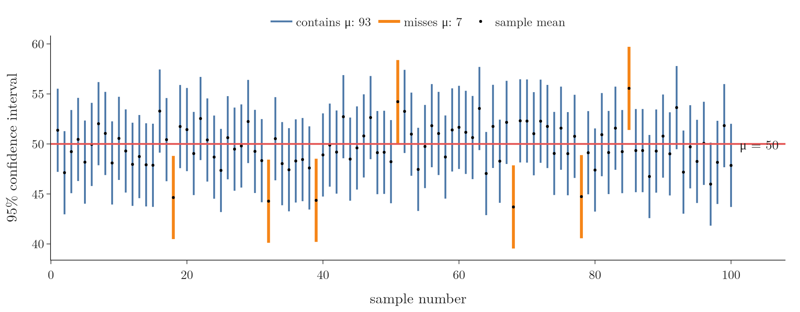
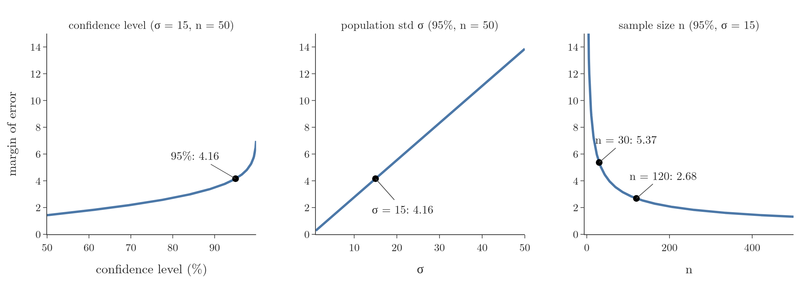
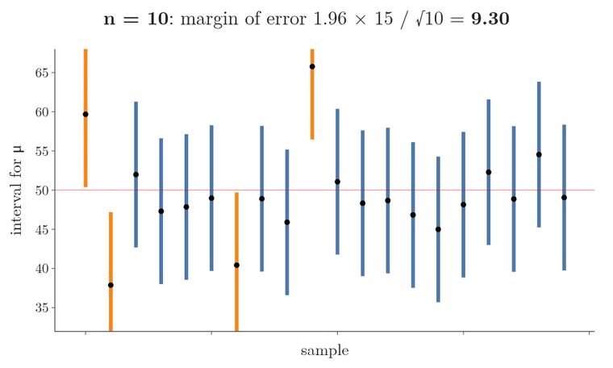

<!-- where-this-fits: generated by course_map/build_map.py; edit concepts.yaml, not this block -->
> **Where this fits:** Pipeline map step 0 (Foundations). See the [Course map](../../../00-course-map/00-course-map.md).
>
> 
>
> - **Builds on:** [Standard normal and the z-table](../../../MA/03-distributions/MA-025-standard-normal-and-z-table/MA-025-standard-normal-and-z-table.md#2-the-standard-normal-distribution); [Central limit theorem](../../../MA/04-inference/MA-033-sampling-distribution-and-clt/MA-033-sampling-distribution-and-clt.md#4-the-central-limit-theorem).
> - **Used here, taught in full later:** [Student's t-distribution](../../../MA/04-inference/MA-037-t-procedure/MA-037-t-procedure.md#5-students-t-distribution).
> - **Compare with:** [Hypothesis testing: null and alternative](../../../MA/04-inference/MA-038-null-and-alternative-hypotheses/MA-038-null-and-alternative-hypotheses.md#4-the-alternative-hypothesis).
<!-- /where-this-fits -->

## 1. Overview

> **Key point:** "95% confidence" describes the method: if we repeated the sampling many times, about 95% of the intervals built would contain the population mean.



We built the **confidence interval** (G-446; a range of plausible values for a population parameter) $\bar{x} \pm z_{\alpha/2}\thinspace\sigma/\sqrt{n}$ in [the z-procedure formula](../MA-035-confidence-intervals-z-procedure/MA-035-confidence-intervals-z-procedure.md#7-the-z-procedure-formula). Computing it is easy; saying correctly what it means is not, and it is a favourite interview question. Figure 1 shows the answer in one picture: each vertical line is one interval from one simulated sample, and the notation $N(50, 15^2)$ means a normal population with mean 50 and standard deviation 15.

This Note covers:

- what a 95% confidence level means, shown by simulation;
- the common misreadings, and why they are wrong;
- the three factors that set the width of an interval: confidence level, population standard deviation and sample size;
- why 95% is the usual choice, and how much a larger sample helps.

## 2. What "95% confident" means

> **Key point:** The population mean is fixed; each sample gives a different interval; 95% of those intervals contain the mean.

Suppose the subscribers' mean age has the 95% confidence interval 25.06 to 30.94 years (the example of [the z-procedure formula](../MA-035-confidence-intervals-z-procedure/MA-035-confidence-intervals-z-procedure.md#7-the-z-procedure-formula)). The true mean age $\mu$ of all 77,000 subscribers is one fixed number. The true mean is either inside this interval or not; we just do not know which.

What is random is the sample. Another online event brings other people, another $\bar{x}$ and another interval. A 95% **confidence level** (G-447) means:

- if we drew many random samples of the same size,
- and built a 95% confidence interval from each,
- then about 95% of those intervals would contain $\mu$, and about 5% would miss it. This share is the **coverage** (G-499) of the method.

So the 95% is the success rate of the **method**. Our one interval came from a method that works 95% of the time; that is what "95% confident" means.

### 2.1 Seeing it by simulation

> **Key point:** In 100 simulated samples, 93 intervals contain the true mean; with 100,000 samples the share settles at 94.94%, close to 95%.

To check this we need a population whose mean we know. We take a normal population with $\mu = 50$ and $\sigma = 15$, draw 100 samples of $n = 50$, and build a 95% z-interval from each (Figure 1):

- each vertical line is one interval, from its lower to its upper limit;
- each black dot is the sample mean, in the middle of its interval;
- the red line is the population mean, $\mu = 50$.

93 of the 100 intervals cross the red line (blue); 7 miss it (orange). The intervals that miss come from samples whose mean happened to land far from 50.

With more repetitions the share approaches 95%:

| Number of intervals | Share that contain $\mu = 50$ |
|---|---|
| 100 | 93.00% |
| 1,000 | 94.50% |
| 100,000 | 94.94% |

Figure 2 replays the same simulation one interval at a time and then keeps going. Watch the running share in the lower panel: it jumps around while there are few intervals, then flattens onto the 95% line.

{height=60%}

All intervals have the same width here, because $\sigma$ and $n$ are fixed: only their centres $\bar{x}$ move. The width of an interval shows the **precision** of the estimate: a narrow interval pins $\mu$ down tightly.

> **Python:** One simulated interval per sample.
>
> ```python
> import numpy as np
> from scipy import stats
>
> rng = np.random.default_rng(42)
> means = rng.normal(50, 15, (100, 50)).mean(axis=1)
> margin = stats.norm.ppf(0.975) * 15 / np.sqrt(50)   # 4.16
> low, high = means - margin, means + margin
> np.mean((low <= 50) & (50 <= high))                  # 0.93
> ```
>
> The Notebook's `coverage_plot(n, sims, level)` redraws Figure 1 for any sample size, number of samples and confidence level.

## 3. Common misreadings

> **Key point:** A 95% interval is not a 95% probability that $\mu$ lies in it, not where 95% of future sample means fall, and not where 95% of the values lie.

All three statements below sound reasonable and are wrong.

**Misreading 1: "There is a 95% probability that $\mu$ is between 25.06 and 30.94."** After the sample is drawn, nothing in this sentence is random: $\mu$ is fixed and so are 25.06 and 30.94. The interval either contains $\mu$ or it does not; the probability is 1 or 0, we just do not know which. The 95% belongs to the procedure before the sample is drawn (see [where the formula comes from](../MA-035-confidence-intervals-z-procedure/MA-035-confidence-intervals-z-procedure.md#8-where-the-formula-comes-from)).

**Misreading 2: "If we repeat the sampling, 95% of the new sample means will fall in this interval."** Misreading 2 is easy to slip into, because it also talks about repeating. But it fixes our one interval and moves the sample means, the wrong way round. Our interval is centred on our $\bar{x}$, not on $\mu$, so on average it catches only about 83% of new sample means, not 95%. Think of a dartboard: a ring drawn around where our first dart landed catches fewer later darts than a ring drawn around the bullseye.

Figure 3 measures misreadings 2 and 3 with the Notebook's simulation. One interval, 45.30 to 53.62, happened to land close to $\mu$:

- it catches 94.2% of 100,000 new sample means (left), but that is luck: over 2,000 different first samples the share averages 0.837 (right), close to the 0.834 derived in the Extra below, and some intervals catch fewer than half;
- it catches only 21.7% of 100,000 individual values (middle), because individual values spread with $\sigma = 15$, not with the **standard error** (G-1872; the standard deviation of sample means, $\sigma/\sqrt{n}$):
  $$15/\sqrt{50} = 2.12$$


> **Extra:** Where the 83% comes from. A new mean must land within $1.96$ standard errors of the first mean, and the difference of two independent means has $\sqrt{2}$ times the spread of one, so the share is $P(|Z| < 1.96/\sqrt{2})$. One step per line:
>
> $$\frac{1.96}{\sqrt{2}} = \frac{1.96}{1.414} = 1.386$$
>
> $$P(|Z| < 1.386) = 2 \times \Phi(1.386) - 1$$
>
> $$P(|Z| < 1.386) = 2 \times 0.917 - 1$$
>
> $$P(|Z| < 1.386) = 0.834$$
>
> Here $\Phi$ is the z-table area to the left (see [the z-table](../../03-distributions/MA-025-standard-normal-and-z-table/MA-025-standard-normal-and-z-table.md#4-the-z-table)). The share depends on where the first interval landed: for one simulated interval close to $\mu$ (45.30 to 53.62), 94.2% of 100,000 new sample means fell inside.

**Misreading 3: "95% of the subscribers are between 25.06 and 30.94 years old."** The interval is about the **mean** age, not about individual ages. Individual ages spread with $\sigma = 15$, a much wider range. In the simulation, only 21.7% of individual values fell inside the interval 45.30 to 53.62.

**The correct reading:** "We are 95% confident that the mean age of all subscribers is between 25.06 and 30.94 years", meaning that this interval came from a method which, over many samples, captures the true mean 95% of the time.

> **Extra:** The reading "95% probability that $\mu$ is in this interval" does belong to a different school, **Bayesian statistics** (G-271; reasoning that updates beliefs with data, see [the tools of inferential statistics](../../01-descriptive-stats/MA-004-what-is-statistics/MA-004-what-is-statistics.md#5-the-tools-of-inferential-statistics)), which treats $\mu$ itself as uncertain. Its intervals are called **credible intervals** (G-501): an interval $[a, b]$ is a 95% credible interval if the posterior probability (the probability after seeing the data) that the parameter lies in it is 0.95 (Pishro-Nik 2014, §9.1.9).

## 4. What sets the width of an interval

> **Key point:** The margin of error $z_{\alpha/2}\thinspace\sigma/\sqrt{n}$ grows with the confidence level and with $\sigma$, and shrinks with $\sqrt{n}$.

The z-interval is

$$\bar{x} \pm z_{\alpha/2}\thinspace\frac{\sigma}{\sqrt{n}}$$

The centre $\bar{x}$ moves from sample to sample. The width, twice the **margin of error** (G-1162), depends on three things:

- the **critical value** (G-504) $z_{\alpha/2}$, set by the confidence level;
- the **population standard deviation** $\sigma$;
- the **sample size** $n$.

The margin of error $E$ is half the distance between the limits:

$$E = (\text{upper} - \text{lower})/2$$

Figure 4 changes one factor at a time, starting from 95%, $\sigma = 15$ and $n = 50$, where:

$$E = 1.96 \times 15/\sqrt{50}$$
$$E = 4.16$$



### 4.1 Confidence level

> **Key point:** More confidence means a wider interval; 100% confidence needs an infinitely wide one.

A wider range is more likely to be right but says less, as [the betting game](../MA-035-confidence-intervals-z-procedure/MA-035-confidence-intervals-z-procedure.md#3-why-a-point-estimate-is-not-enough) shows. Figure 4 (left) puts numbers on this trade-off:

| Confidence level | $z_{\alpha/2}$ | Margin of error ($\sigma = 15$, $n = 50$) |
|---|---|---|
| 50% | 0.674 | 1.43 |
| 80% | 1.282 | 2.72 |
| 90% | 1.645 | 3.49 |
| 95% | 1.960 | 4.16 |
| 99% | 2.576 | 5.46 |
| 99.9% | 3.291 | 6.98 |

Near 100% the curve shoots up: $z_{\alpha/2}$ grows without limit, and a 100% interval runs from $-\infty$ to $+\infty$.

### 4.2 Population standard deviation

> **Key point:** The margin of error is proportional to $\sigma$: a more variable population gives a wider interval.

Doubling $\sigma$ doubles the margin of error: $\sigma = 5$ gives 1.39, $\sigma = 15$ gives 4.16, $\sigma = 30$ gives 8.32 (Figure 4, middle, a straight line).

The link between spread and width is common sense. A batsman whose scores swing wildly, 10 in one match and 200 in the next, is hard to predict: a 95% range might be 20 to 80 runs. A very consistent batsman, such as Rahul Dravid in his prime, could get a 95% range of 40 to 45. The more the data varies, the less precisely its mean can be pinned down.

### 4.3 Sample size

> **Key point:** The margin of error falls as $1/\sqrt{n}$: fast at first, then slowly; quadrupling the sample halves the margin.

Larger samples give narrower intervals, but not in proportion (Figure 4, right):

| $n$ | 10 | 30 | 50 | 120 | 500 | 1000 |
|---|---|---|---|---|---|---|
| Margin of error | 9.30 | 5.37 | 4.16 | 2.68 | 1.31 | 0.93 |

Figure 5 draws 20 intervals at each sample size, from the same 20 standardized sample means. Watch them shrink towards the red line. The same four miss at every $n$: every panel reuses the same 20 standardized sample means, and whether an interval misses depends only on its standardized mean and the confidence level, not on $n$. Going from 10 to 30 people cuts the margin from 9.30 to 5.37: a big gain for 20 more people. Going from 500 to 1000 cuts it only from 1.31 to 0.93, for 500 more people. This diminishing return is the $1/\sqrt{n}$ shape: to halve the margin we need four times the sample.

A larger sample keeps helping, though: from $n = 30$ to $n = 120$ the margin halves again, from 5.37 to 2.68. There is no point beyond which more data stops improving the interval; each improvement just costs more people.



> **Extra:** Solving the margin formula for $n$ gives the **required sample size** (G-1675), the sample size needed for a chosen margin of error.
>
> $$E = z_{\alpha/2}\thinspace\sigma/\sqrt{n}$$
>
> 1. **In words:** square the critical value times $\sigma$ divided by the target margin, then round up.
> 2. **Formula:**
>    $$n = \left(\frac{z_{\alpha/2}\thinspace\sigma}{E}\right)^2$$
> 3. **Example:** to know the mean age within $\pm 1$ year at 95%, with $\sigma = 15$:
>    $$n = \left(\frac{1.96 \times 15}{1}\right)^2$$
>    $$n = 29.4^2 = 864.4$$
>    So 865 subscribers.
>    Within $\pm 2$ years needs only 217: a quarter of the sample for twice the margin.

## 5. Why 95% is the usual level

> **Key point:** 95% is the common compromise between being right often and giving a useful, narrow range.

The trade-off between being right often and staying narrow is set out in [why 2 standard errors](../MA-034-estimating-a-mean-with-the-clt/MA-034-estimating-a-mean-with-the-clt.md#61-why-2-standard-errors). In Figure 4 (left), the margin of error climbs towards infinity as the level approaches 100%. At 95% we are right 19 times out of 20 while the margin of error is still moderate.

The 95% level is a convention, not a law: depending on the problem, 99%, 90% or 80% are also used.

## 6. Summary

| Statement | Correct? |
|---|---|
| 95% of intervals built this way contain $\mu$ | Yes: in 100,000 simulated samples 94.94% did |
| We are 95% confident that $\mu$ is between 25.06 and 30.94 | Yes, in the sense above |
| There is a 95% probability that $\mu$ is between 25.06 and 30.94 | No: $\mu$ is fixed |
| 95% of future sample means fall between 25.06 and 30.94 | No: about 83% on average |
| 95% of the subscribers are between 25.06 and 30.94 years old | No: the interval is about the mean |

| Factor | Effect on the margin of error $z_{\alpha/2}\thinspace\sigma/\sqrt{n}$ | Why |
|---|---|---|
| Higher confidence level | wider (to infinity at 100%) | a larger critical value $z_{\alpha/2}$ |
| Larger $\sigma$ | wider, in proportion | the more the data varies, the less precisely its mean is pinned down |
| Larger $n$ | narrower, as $1/\sqrt{n}$; four times $n$ halves it | $n$ sits under a square root, so each gain costs more people |

- The population mean is fixed; the interval is random, so the 95% describes how often the method catches $\mu$, not one interval.
- The width measures the precision of the estimate, so a larger sample, a lower level or less variable data narrows it.
- 95% is a convention balancing confidence and precision, because a higher level widens the interval until it says little.
- This answers the opening question: "95% confidence" describes the method, which over many samples catches the population mean about 95% of the time.

## 7. Sources

**Built from**

- CampusX, "Session 44 - Confidence Intervals | DSMP 2023", YouTube, https://www.youtube.com/watch?v=X52HK2qkiIE

**Other references**

- Kunin, D., Guo, J., Devlin, T. D. and Xiang, D. *Seeing Theory*, chapter "Frequentist Inference", Brown University. seeing-theory.brown.edu/frequentist-inference. Figure 2 follows its confidence-interval animation, redrawn with our simulation.
- Pishro-Nik, H. (2014). *Introduction to Probability, Statistics, and Random Processes*. Kappa Research. §9.1.9 "Bayesian Interval Estimation". Also at probabilitycourse.com.

## 8. Key terms

| Term | Meaning |
|---|---|
| Coverage | The share of intervals from repeated samples that contain the true parameter; equals the confidence level when the assumptions hold |
| Precision | How narrow a confidence interval is; a narrower interval is a more precise estimate |
| Required sample size | $n = (z_{\alpha/2}\thinspace\sigma/E)^2$: the smallest sample giving a margin of error $E$ |
| Credible interval | The Bayesian counterpart of a confidence interval: a range that, after seeing the data, holds the parameter with a stated probability such as 0.95. So it can be read as "95% probability the parameter is in here", which a confidence interval cannot. |
