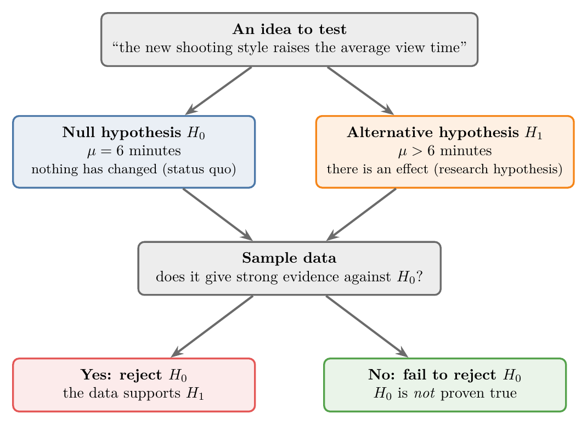
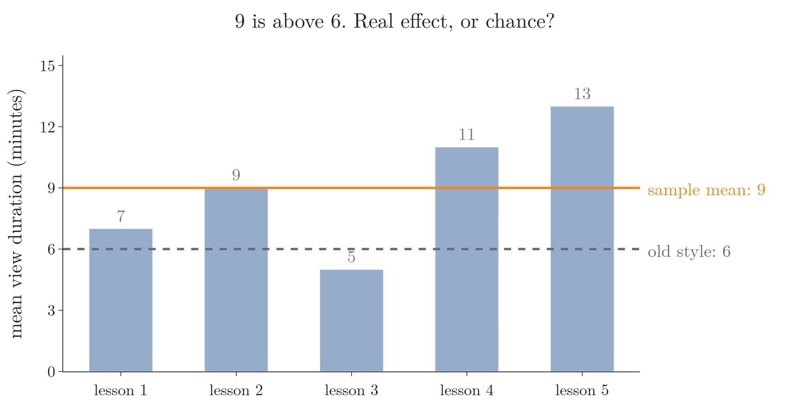
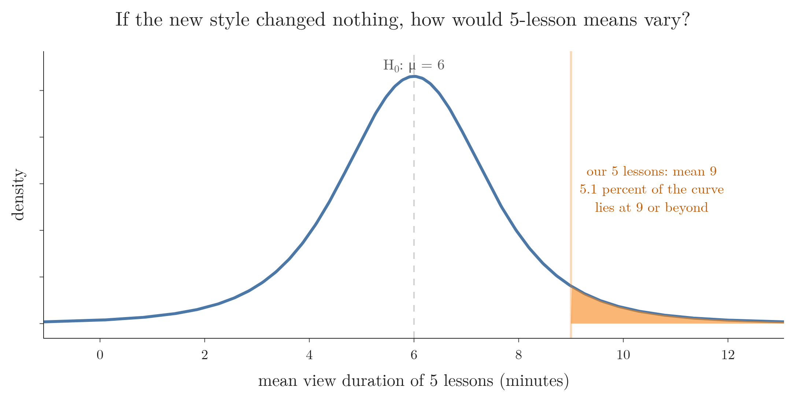
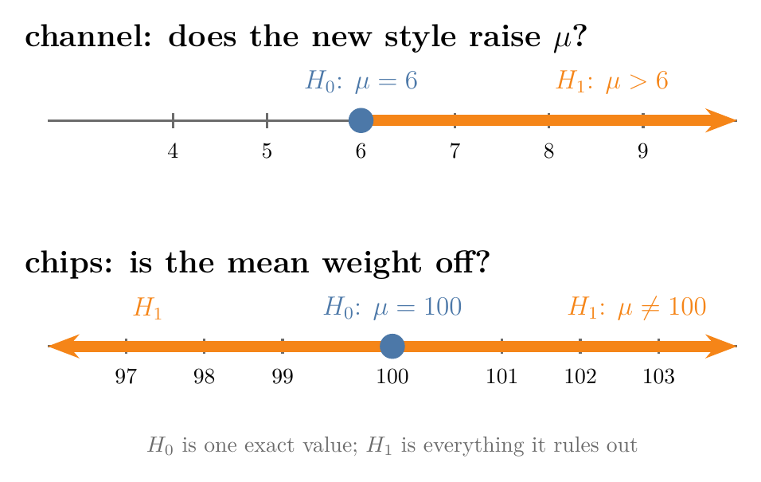
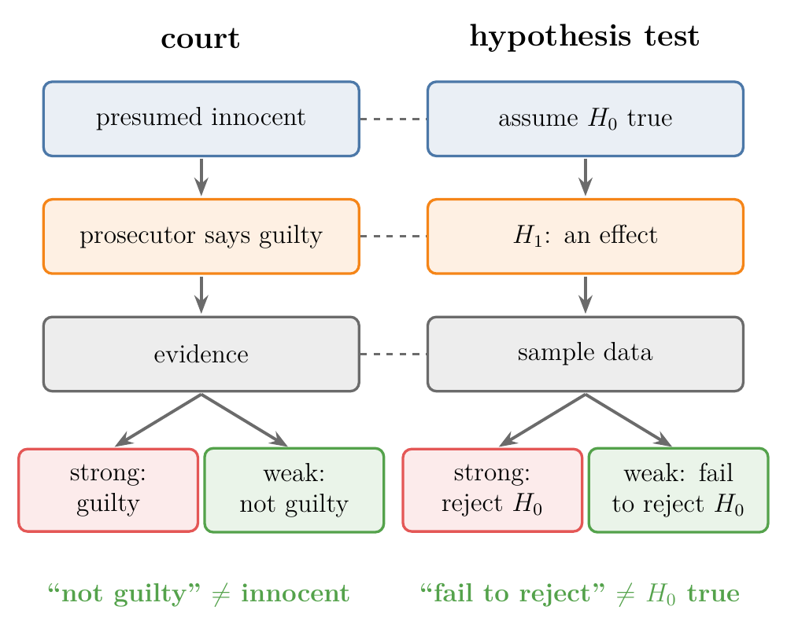
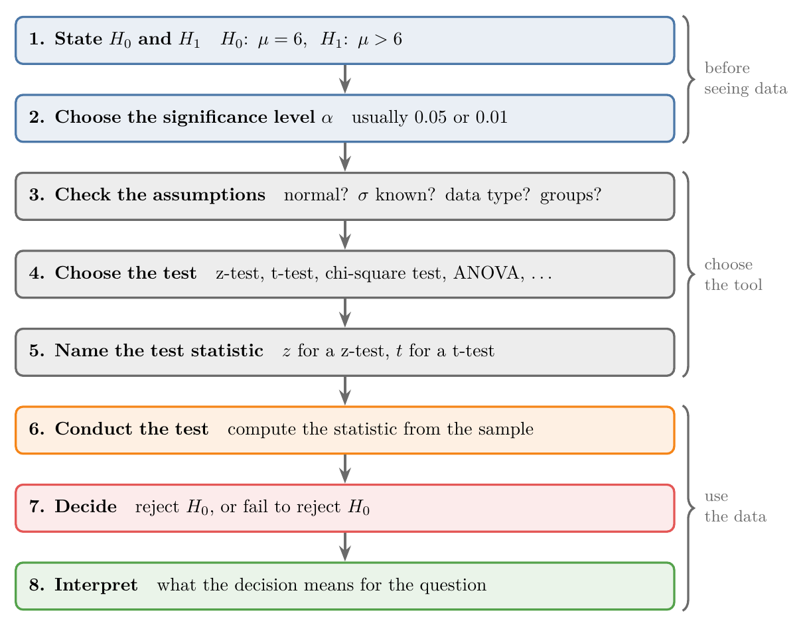

<!-- where-this-fits: generated by course_map/build_map.py; edit concepts.yaml, not this block -->
> **Where this fits:** Pipeline map step 0 (Foundations). See the [Course map](../../../00-course-map/00-course-map.md).
>
> 
>
> - **Builds on:** [Inferential statistics](../../../MA/01-descriptive-stats/MA-003-statistics-roadmap/MA-003-statistics-roadmap.md#33-inferential-statistics); [Sampling distribution and standard error](../../../MA/04-inference/MA-033-sampling-distribution-and-clt/MA-033-sampling-distribution-and-clt.md#3-sampling-distributions); [Type I and II errors, power, tails](../../../MA/04-inference/MA-040-errors-power-and-tails/MA-040-errors-power-and-tails.md#2-type-i-and-type-ii-errors); [P-values](../../../MA/04-inference/MA-041-p-values/MA-041-p-values.md#33-the-p-value-for-53-heads).
> - **Leads to:** [Z-test and rejection regions](../../../MA/04-inference/MA-039-rejection-region-and-z-test/MA-039-rejection-region-and-z-test.md#6-the-rejection-region-and-the-critical-value); [Beta and A/B testing](../../../MA/04-inference/MA-040-errors-power-and-tails/MA-040-errors-power-and-tails.md#1-overview); [T-tests: one-sample, two-sample, paired](../../../MA/04-inference/MA-042-one-sample-t-test/MA-042-one-sample-t-test.md#1-overview); [One-sample proportion test](../../../MA/04-inference/MA-044-choosing-a-hypothesis-test/MA-044-choosing-a-hypothesis-test.md#4-one-categorical-feature-the-one-sample-proportion-test); [Chi-square tests](../../../MA/04-inference/MA-045-chi-square-tests/MA-045-chi-square-tests.md#1-overview); [One-way ANOVA](../../../MA/04-inference/MA-046-one-way-anova/MA-046-one-way-anova.md#1-overview).
> - **Compare with:** [Confidence intervals](../../../MA/04-inference/MA-037-t-procedure/MA-037-t-procedure.md#1-overview).
<!-- /where-this-fits -->

## 1. Overview

> **Key point:** A hypothesis test turns an idea into two opposite statements, the null and the alternative hypothesis, and asks whether a sample gives strong enough evidence against the null.

{height=40%}

**Hypothesis testing** (G-913) checks a claim about a population parameter with a sample (see [population and sample](../../01-descriptive-stats/MA-004-what-is-statistics/MA-004-what-is-statistics.md#4-population-and-sample)). Figure 1 shows the whole idea on one example: we write the claim as two statements, look at the data, and either reject the first statement or fail to reject it.

This Note covers:

- the problem hypothesis testing solves;
- the null hypothesis and the alternative hypothesis, and how to write them;
- three rules for using them, with the courtroom analogy;
- the eight steps of a hypothesis test.

The next Notes run these steps on real numbers: [the logic of a test](../MA-039-rejection-region-and-z-test/MA-039-rejection-region-and-z-test.md#3-the-logic-of-a-test) with a z-test, and [the definition of a p-value](../MA-041-p-values/MA-041-p-values.md#2-definition) with the method used in practice.

## 2. The problem hypothesis testing solves

> **Key point:** One result, or a few, can be good or bad by chance; hypothesis testing tells us whether a sample is strong enough evidence for a claim about the whole population.

### 2.1 An online channel tries a new style

Suppose an online channel records its lessons on a digital writing pad. Its analytics show that, over all its recorded lessons, people watch for **6 minutes** on average. Successful channels seem to film in front of a whiteboard instead, so the owner has an idea: the whiteboard style would raise the average view duration.

The obvious test is to try it. The first whiteboard lesson is watched for 30 minutes on average. Can we conclude that the new style works?

No. One lesson proves very little:

- its topic may have been popular (say, a lesson on ChatGPT that the whole world wants to watch);
- the presenter may have looked especially good that day;
- any other random reason may have lifted that one lesson.

So the channel records five more lessons in the new style. Their average view durations are 7, 9, 5, 11 and 13 minutes. Their mean, 9 minutes, is above 6. Is that enough? The question has not changed: are five lessons enough evidence, or could the old style give such numbers by chance?

{width=85%}

Figure 2 shows the five lessons against the old average. The spread is the problem: with lessons ranging from 5 to 13 minutes, a mean of 9 might come from the old style by chance. The Extra at the end of Section 6 gives the verdict.

### 2.2 The same question in business

A chips company sells a green packet and launches a purple one. Before replacing green with purple everywhere, it wants to know whether the purple packet really sells better. It can ask customers for feedback, but then: how many customers, and how good must the feedback be before we believe it?

A small channel can afford to try and see. A company such as Amazon or Flipkart, where one wrong decision costs a lot of money, needs a method. That method is hypothesis testing.

### 2.3 Definition

A **statistical hypothesis test** (G-1881) is a method of statistical inference used to decide whether the data at hand sufficiently supports a particular hypothesis. Hypothesis testing lets us make probabilistic statements about population parameters.

In the channel example the population parameter is $\mu$, the mean view duration of all lessons the channel could record in the new style. The new lessons are a sample. Hypothesis testing tells us what the sample can say about $\mu$.

Hypothesis testing is **inferential statistics** (G-944): reasoning from a sample to a population (see [descriptive and inferential statistics](../../01-descriptive-stats/MA-004-what-is-statistics/MA-004-what-is-statistics.md#3-descriptive-and-inferential-statistics)). Inferential statistics is used constantly in business, finance and economics.

## 3. The null hypothesis

> **Key point:** The null hypothesis $H_0$ says that nothing has changed: no effect, no difference, no relationship.

Every hypothesis test starts with two statements. The first is the **null hypothesis** (G-1361), written $H_0$:

> a statement that assumes there is no significant effect or relationship between the variables being studied. It is the starting point of the test and stands for the status quo, "no effect until proven otherwise".

Two examples:

- **The channel.** We want to show that the new style raises the view duration. The null hypothesis says the opposite: the old and the new style make no difference, and the mean view duration is still 6 minutes.
- **A chips packet.** A packet says "100 g" on the back, and we suspect the true mean weight is different, either more or less. The null hypothesis says the mean weight of the packets is exactly 100 g.

In both cases $H_0$ is the boring statement: whatever was true before is still true. The test then tries to prove it wrong.

Why test "no change" and not the change we hope for? The five lessons average 9 minutes, so we could test the statement "the new style adds 3 minutes". But another five lessons might average 8.5 or 9.4, and "adds 2.5 minutes" and "adds 3.4 minutes" would then be just as reasonable. There is no end to such statements, and we cannot even write one down before we have data. "No change" is different: it is one statement, it is fixed before any data arrives, and its value is known exactly (the old mean, 6). So every test checks that one statement.

$H_0$ does not claim that every new lesson scores exactly 6. It claims that the mean is still 6 and that any difference in a sample is chance. Figure 3 draws what chance alone would do. If $H_0$ were true, the mean of 5 lessons would still wander around 6, because each lesson varies; with the spread of our five lessons, the one-sample t-test (see [the t statistic step by step](../MA-042-one-sample-t-test/MA-042-one-sample-t-test.md#41-the-t-statistic-step-by-step)) says that 5.1 percent of such means would land at 9 or beyond. The test asks whether our result is too far out to blame on chance.

## 4. The alternative hypothesis

> **Key point:** The alternative hypothesis $H_1$ contradicts $H_0$ and claims there is an effect; the two can never both be true.

The second statement is the **alternative hypothesis** (G-193), written $H_1$ or $H_a$:

> a statement that contradicts the null hypothesis and claims there is a significant effect or relationship between the variables being studied.

The two statements are **mutually exclusive** (G-1286): they cannot both be true, and the test ends by siding with one of them. They need not cover every case: for the channel, a mean below 6 fits neither statement (the grey part of the line in Figure 4). For our examples:

| Example | $H_0$ (no effect) | $H_1$ (an effect) |
|---|---|---|
| Channel: mean view duration in minutes | $\mu = 6$ | $\mu > 6$ |
| Chips: mean packet weight in grams | $\mu = 100$ | $\mu \neq 100$ |

{width=80%}

Figure 4 draws the table: the channel's $H_1$ points one way, the chips' $H_1$ points both ways.

Figure 5 shows what the test will weigh. Each lesson is a dot, and each bar is its distance to a horizontal line. The line starts at 6, the mean that $H_0$ claims, and moves to 9, the mean of the lessons themselves.

- **Our five lessons (left).** The distances to 6 add up to 17 minutes:
  $$1 + 3 + 1 + 5 + 7 = 17$$
  The distances to 9 add up to 12:
  $$2 + 0 + 4 + 2 + 4 = 12$$
  The line at 9 fits only a little better than the line at 6, because the lessons are spread out from 5 to 13. So $H_0$ is hard to reject: if $H_0$ were true, chance alone would give a mean this far above 6 in 5.1 percent of such samples (Figure 3).
- **Five steadier lessons (right).** Suppose the lessons had been 8, 9, 8, 10 and 10 minutes: the same mean 9, but close together. The total distance falls from 15 to 4. The line at 6 fits these lessons far worse than their own mean, and the same one-sample t-test says chance alone would do this in only 0.1 percent of such samples: strong evidence against $H_0$.

The same mean of 9 is weak evidence in one case and strong evidence in the other. A test compares how far the sample is from $H_0$ with how much the sample varies by itself.

{height=50%}

The channel's $H_1$ has a direction: the new style should **increase** the duration. The chips' $H_1$ has none: the weight is wrong, whether too high or too low. This difference decides between a **one-tailed test** (G-1385) and a two-tailed test (see the [one-tailed and two-tailed tests](../MA-040-errors-power-and-tails/MA-040-errors-power-and-tails.md#5-one-tailed-and-two-tailed-tests)).

Two other names are common in books and exam questions:

- $H_0$ is called the **status quo** (G-1887): the current state of things;
- $H_1$ is called the **research hypothesis** (G-1677): the idea that comes out of research. The channel owner studied other channels and concluded that the whiteboard style might help.

> **Extra:** The hypotheses are always about the **population** parameter ($\mu$), never about the sample mean ($\bar{x}$). We already know $\bar{x} = 9$ for the five new lessons; there is nothing to test about it. The open question is $\mu$, the mean of all future lessons. Writing $H_0: \bar{x} = 6$ is a common slip.

## 5. Three rules for $H_0$ and $H_1$

> **Key point:** $H_0$ says nothing new is happening; the test collects evidence against $H_0$; and failing to reject $H_0$ does not prove it true.

### 5.1 How to tell which statement is $H_0$

Faced with a new problem, we may wonder which statement should be $H_0$. The rule of thumb: **$H_0$ is the statement that nothing new is happening.**

- We changed the filming style, and the mean view duration is still 6 minutes: $H_0$.
- We opened packets and weighed them, and the mean is still 100 g: $H_0$.

The statement with the change, the difference or the effect is $H_1$.

> **Extra:** The equals sign always goes in $H_0$. The test needs one exact value to compute with ($\mu = 6$), and only $H_0$ provides it.

### 5.2 The goal: evidence against $H_0$

A hypothesis test does not try to prove $H_1$ directly. The test assumes $H_0$ and then uses the data to collect **evidence against $H_0$**. If the evidence is strong enough, we reject $H_0$, and $H_1$ is what remains.

### 5.3 Failing to reject $H_0$ does not prove it

The most important rule: **failing to reject the null hypothesis does not mean the null hypothesis is true.** Failing to reject only means the data did not bring enough evidence against it.

A courtroom makes this clear:

| Court | Hypothesis test |
|---|---|
| The accused is presumed innocent | $H_0$ is assumed true: no crime |
| The prosecutor claims the accused is guilty | $H_1$: there was a crime |
| The prosecutor brings evidence | We collect sample data |
| Strong evidence: verdict "guilty" | Reject $H_0$ |
| Weak evidence: verdict "not guilty" | Fail to reject $H_0$ |

{width=75%}

Figure 6 lines up the two procedures. Watch the green boxes: neither "not guilty" nor "fail to reject" is a proof.

A "not guilty" verdict does not prove that no crime happened. The verdict says the prosecutor could not prove it. In the same way, if the five lessons do not let us reject $H_0$, the new style may still work: our evidence was simply too weak to show it.

For the same reason, rejecting $H_0$ for the channel would not show that the whiteboard style is the best possible. Rejecting $H_0$ would only show that the new style beats the old average of 6 minutes.

> **Extra:** The courtroom logic is why we say "fail to reject $H_0$" and avoid "accept $H_0$". A small sample gives a test little power to detect a real effect: in [the power of a test](../MA-040-errors-power-and-tails/MA-040-errors-power-and-tails.md#3-power-of-a-test) the same test detects a true mean of 52 with probability 0.71 for 30 employees and 0.99 for 100. "Accepting" $H_0$ after such a test would turn weak evidence into a false certainty. Altman and Bland (1995) make the same point: a non-significant result does not show that there is no effect.

## 6. The eight steps of a hypothesis test

> **Key point:** State $H_0$ and $H_1$, choose $\alpha$, check assumptions, choose the test and its statistic, compute it, decide, and interpret.

{height=45%}

There are two ways to carry out a test. The **rejection region approach** (G-1663) compares the test statistic with a fixed boundary (see [the rejection region and the critical value](../MA-039-rejection-region-and-z-test/MA-039-rejection-region-and-z-test.md#6-the-rejection-region-and-the-critical-value)). The **p-value approach** (G-1431) computes one extra number that also measures how strong the evidence is (see [the definition of a p-value](../MA-041-p-values/MA-041-p-values.md#2-definition)); it is the approach used in practice. Both follow the steps in Figure 7.

1. **State $H_0$ and $H_1$.** For the channel: $H_0: \mu = 6$, $H_1: \mu > 6$.
2. **Choose a significance level $\alpha$** (G-1801). Usually 0.05 (5%), sometimes 0.01 (1%). The significance level is the probability of rejecting $H_0$ when $H_0$ is actually true: at 5%, about 5 tests in 100 with a true $H_0$ would wrongly reject it. [How rare is too rare](../MA-039-rejection-region-and-z-test/MA-039-rejection-region-and-z-test.md#5-how-rare-is-too-rare-the-significance-level) explains it fully.
3. **Check the assumptions about the data.** Is the data normally distributed? Do we know the population standard deviation $\sigma$? Is the data numerical or categorical? Do we have one **feature** (G-772; one measured variable, one column of the data table) or several, one group or several?
4. **Choose the test.** The assumptions decide it. For example:
   - normal data (or a large sample) and $\sigma$ known: the one-sample **z-test** (G-2143);
   - $\sigma$ unknown: the **t-test** (G-1940; see [from the z-test to the t-test](../MA-042-one-sample-t-test/MA-042-one-sample-t-test.md#2-from-the-z-test-to-the-t-test));
   - categorical data: the **chi-square test** (G-381);
   - several group means: **ANOVA** (G-203).
5. **Name the test statistic.** The **test statistic** (G-1963) is the number the test computes from the sample. A z-test computes a z-score, called the z statistic; a t-test computes the t statistic (as in [the t-procedure formula](../MA-037-t-procedure/MA-037-t-procedure.md#6-the-t-procedure-formula)).
6. **Conduct the test.** Compute the test statistic from the sample.
7. **Decide.** Based on the statistic, reject $H_0$ or fail to reject it.
8. **Interpret the result.** Translate the decision back into the real question. If the channel rejected $H_0$, the interpretation would be: "filming in the new style increases the mean view duration".

Steps 1 and 2 come before looking at the data: the decision needs a fixed boundary, and the boundary comes from $\alpha$ and the direction of $H_1$. Choosing them after seeing the results changes the error rate. For example, if we picked the direction of $H_1$ after seeing which side of 6 the sample mean fell on, a true $H_0$ would be rejected whenever $|z| > 1.645$ (here $z$ is the z statistic: how many standard errors the sample mean lies from 6; $|z|$ drops its sign). That has this probability:

$$2 \times 0.05 = 0.10$$

This is double the $\alpha$ we claimed.

> **Extra:** Are the five lessons (7, 9, 5, 11, 13 minutes) enough evidence that $\mu > 6$? [Back to the five lessons](../MA-042-one-sample-t-test/MA-042-one-sample-t-test.md#7-back-to-the-five-lessons) answers it: at the 5% level, just barely not.

## 7. Summary

| | Null hypothesis $H_0$ | Alternative hypothesis $H_1$ |
|---|---|---|
| Says | no effect, no difference | there is an effect or difference |
| Other name | status quo | research hypothesis |
| Contains | the equals sign ($\mu = 6$) | $>$, $<$ or $\neq$ |
| Role in the test | assumed true; we look for evidence against it | what remains if $H_0$ is rejected |
| Channel example | $\mu = 6$ minutes | $\mu > 6$ minutes |
| Chips example | $\mu = 100$ g | $\mu \neq 100$ g |

- The equals sign goes in $H_0$ because the test needs one exact value to compute with ($\mu = 6$), and only $H_0$ provides it.
- A single result, or a few, can be lucky; a hypothesis test asks whether a sample is strong enough evidence about a population parameter, so a costly decision (replace the green chips packet?) does not rest on chance.
- $H_0$ says nothing new is happening; $H_1$ contradicts it. They cannot both be true, so the test ends by siding with one of them.
- The test collects evidence against $H_0$, because "no change" is one fixed statement we can compute with, while the changes we hope for are endless. The two outcomes are "reject $H_0$" and "fail to reject $H_0$".
- Failing to reject $H_0$ does not prove $H_0$: "not guilty" is not "innocent", because a small sample may simply be too weak to show a real effect; so say "fail to reject", never "accept".
- Eight steps: hypotheses, $\alpha$, assumptions, test, statistic, compute, decide, interpret, so the assumptions about the data decide which test is used.
- This answers the opening question: a test turns an idea into $H_0$ and $H_1$ and asks whether the sample is strong enough evidence against $H_0$.

## 8. Sources

**Built from**

- CampusX, "Session 45 - Hypothesis Testing Part 1 | DSMP 2023", YouTube, https://www.youtube.com/watch?v=S94mx6OL7kM
- StatQuest with Josh Starmer, "Hypothesis Testing and The Null Hypothesis, Clearly Explained!!!", YouTube, https://www.youtube.com/watch?v=0oc49DyA3hU
- StatQuest with Josh Starmer, "Alternative Hypotheses: Main Ideas!!!", YouTube, https://www.youtube.com/watch?v=5koKb5B_YWo

**Other references**

- Altman, D. G. and Bland, J. M. (1995). "Absence of evidence is not evidence of absence." *BMJ* 311(7003), 485.

## 9. Key terms

| Term | Meaning |
|---|---|
| Statistical hypothesis test | A method that uses sample data to decide whether a claim about a whole population (a hypothesis about a population parameter) is supported strongly enough; it is a form of statistical inference. |
| Null hypothesis ($H_0$) | The statement of no effect, no difference or no relationship; assumed true until the data gives strong evidence against it |
| Alternative hypothesis ($H_1$, $H_a$) | The claim of an effect, difference or relationship: the statement that contradicts the null hypothesis $H_0$. |
| Status quo | Another name for the null hypothesis $H_0$: the current state of things, which the test keeps unless the data gives strong evidence against it. |
| Research hypothesis | Another name for the alternative hypothesis: the idea that came out of research |
| Reject $H_0$ | The decision that the data gives strong enough evidence against $H_0$ |
| Fail to reject $H_0$ | The decision that the evidence against the null hypothesis $H_0$ is not strong enough to drop it; it does not prove $H_0$. |
| Test statistic | The number a test computes from the sample to make its decision, such as $z$ or $t$ |
| Rejection region approach | Carrying out a test by checking whether the test statistic falls beyond a fixed boundary |
| P-value approach | Carrying out a test by computing a p-value, which also measures the strength of the evidence |
