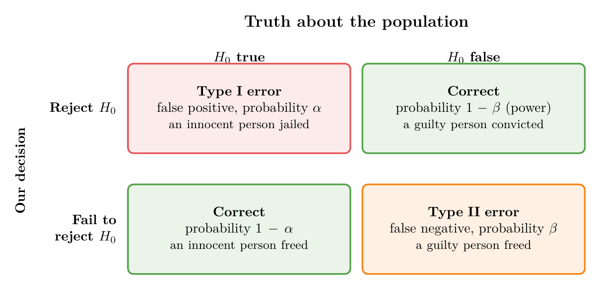
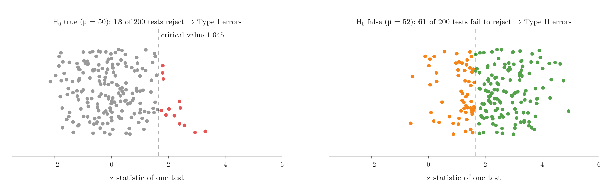
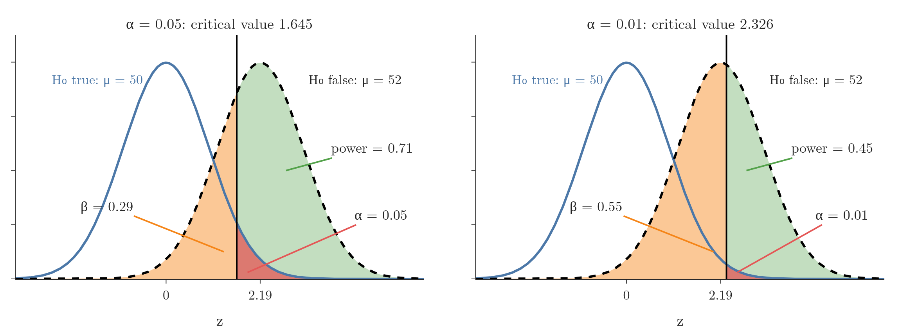
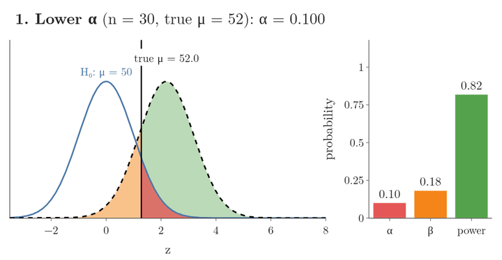
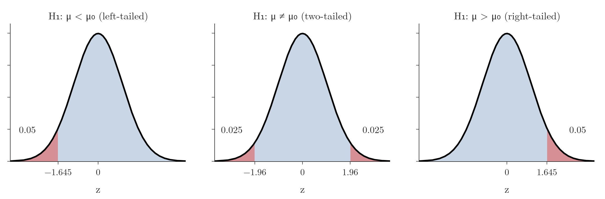
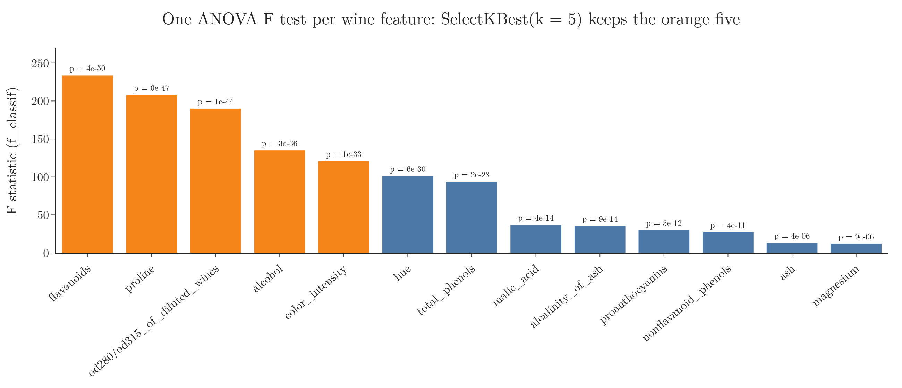

<!-- where-this-fits: generated by course_map/build_map.py; edit concepts.yaml, not this block -->
> **Where this fits:** Pipeline map step 0 (Foundations). See the [Course map](../../../00-course-map/00-course-map.md).
>
> 
>
> - **Compare with:** [Confusion matrix](../../../ML/07-classification/ML-075-accuracy-confusion-matrix/ML-075-accuracy-confusion-matrix.md#4-the-confusion-matrix).
<!-- /where-this-fits -->

## 1. Overview

> **Key point:** Every test decision can be wrong in two ways: rejecting a true $H_0$ (Type I) or failing to reject a false $H_0$ (Type II); the direction of $H_1$ decides whether the rejection region sits in one tail or two.

{height=32%}

A hypothesis test ends with one of two decisions, reject $H_0$ or fail to reject it (see [the eight steps of a hypothesis test](../MA-038-null-and-alternative-hypotheses/MA-038-null-and-alternative-hypotheses.md#6-the-eight-steps-of-a-hypothesis-test)). The truth is also one of two: $H_0$ true or $H_0$ false. Figure 1 crosses them into four outcomes, two of which are errors.

This Note covers:

- Type I and Type II errors, with their probabilities $\alpha$ (alpha, the significance level we choose in advance) and $\beta$ (beta, the chance of missing a real effect);
- the power of a test, $1 - \beta$;
- the trade-off between the two errors;
- one-tailed and two-tailed tests, and the pros and cons of each;
- where hypothesis testing is used, in general and in machine learning.

## 2. Type I and Type II errors

> **Key point:** A Type I error rejects a true $H_0$ (a false positive, probability $\alpha$); a Type II error fails to reject a false $H_0$ (a false negative, probability $\beta$).

Whatever we decide, the decision may be wrong:

- we say "reject $H_0$", but $H_0$ was actually true;
- we say "fail to reject $H_0$" for lack of evidence, but $H_0$ was actually false.

The other two outcomes are correct: rejecting a false $H_0$, and failing to reject a true one.

Figure 2 runs the training-program test of [the z-test example](../MA-039-rejection-region-and-z-test/MA-039-rejection-region-and-z-test.md#8-example-did-a-training-program-raise-productivity) ($H_0: \mu = 50$, $H_1: \mu > 50$, $\sigma = 5$, $n = 30$) 200 times in each of two worlds. Each dot is the **z statistic** of one test (how many standard errors the sample mean lies above 50); the **critical value** 1.645 is the boundary beyond which we reject $H_0$ (see [the rejection region and the critical value](../MA-039-rejection-region-and-z-test/MA-039-rejection-region-and-z-test.md#6-the-rejection-region-and-the-critical-value)):

- **$H_0$ true (left):** 13 of the 200 tests land beyond 1.645 and reject a true $H_0$ (red), close to the 5 percent that $\alpha$ promises;
- **$H_0$ false, true mean 52 (right):** 61 of the 200 tests stay below 1.645 and miss the real effect (orange), close to the 29 percent computed in section 3.

### 2.1 Type I error

A **Type I error** (G-2032) occurs when the sample leads us to reject $H_0$ although it is in fact true. A Type I error is the mistake of finding a significant effect or relationship when there is none, also called a **false positive** (G-748).

In the courtroom of [the three rules for $H_0$](../MA-038-null-and-alternative-hypotheses/MA-038-null-and-alternative-hypotheses.md#53-failing-to-reject-h_0-does-not-prove-it), $H_0$ says "no crime". A Type I error convicts an innocent person.

The probability of a Type I error is the significance level $\alpha$ (see [how rare is too rare](../MA-039-rejection-region-and-z-test/MA-039-rejection-region-and-z-test.md#5-how-rare-is-too-rare-the-significance-level)). The researcher chooses $\alpha$, so this risk is **under our control**. Lowering $\alpha$ from 5% to 1% pushes the critical values out and leaves more room for the innocent to go free.

### 2.2 Type II error

A **Type II error** (G-2033) occurs when the sample leads us to fail to reject $H_0$ although it is in fact false. The researcher fails to detect an effect or relationship that actually exists. A Type II error is also called a **false negative** (G-747).

In the courtroom: the accused did commit the crime, but the evidence was too weak and they walk free.

The probability of a Type II error is written $\beta$.

### 2.3 The error table

| | $H_0$ true | $H_0$ false |
|---|---|---|
| **Reject $H_0$** | Type I error (probability $\alpha$) | correct (probability $1 - \beta$) |
| **Fail to reject $H_0$** | correct (probability $1 - \alpha$) | Type II error (probability $\beta$) |

The second row is sometimes labelled "accept $H_0$". As [failing to reject $H_0$](../MA-038-null-and-alternative-hypotheses/MA-038-null-and-alternative-hypotheses.md#53-failing-to-reject-h_0-does-not-prove-it) showed, the correct wording is "fail to reject $H_0$": the test never proves $H_0$.

The same two errors appear in classification. In the **confusion matrix** (G-449) of [the confusion matrix](../../../ML/07-classification/ML-075-accuracy-confusion-matrix/ML-075-accuracy-confusion-matrix.md#4-the-confusion-matrix), a false positive is a Type I error and a false negative a Type II error. The link is direct: "positive" means "we flag an effect", which in a test is "reject $H_0$".

## 3. Power of a test

> **Key point:** The power, $1 - \beta$, is the probability that the test rejects $H_0$ when $H_0$ is false: its ability to detect a real effect.

The **power of a test** (G-1539) is $1 - \beta$: the probability of correctly rejecting a false $H_0$. A powerful test seldom misses a real effect. In practice, power matters more than $\beta$ itself.

$\beta$ and the power depend on how false $H_0$ is. Figure 3 works this out for the training program of [the z-test example](../MA-039-rejection-region-and-z-test/MA-039-rejection-region-and-z-test.md#8-example-did-a-training-program-raise-productivity) ($H_0: \mu = 50$, $H_1: \mu > 50$, $\sigma = 5$, $n = 30$). In each panel the horizontal axis is the z statistic. The blue bell is where it falls if $H_0$ is true (mean 50); the dashed bell is where it falls if the true mean is 52. The black line is the critical value. The red area (blue bell beyond the line) is $\alpha$, the orange area (dashed bell before the line) is $\beta$, and the green area (dashed bell beyond the line) is the power.

> **Extra:** Computing the power, assuming the true mean is 52.
>
> 1. **In words:** if $\mu = 52$, the z statistic is no longer centred at 0 but at the true difference in standard errors. Power is the chance that it still lands beyond the critical value.
> 2. **Formula:** with shift $d$ and right-tailed critical value $z_\alpha$,
>    $$d = \frac{\mu_{\text{true}} - \mu_0}{\sigma/\sqrt{n}}$$
>    $$\beta = \Phi(z_\alpha - d)$$
>    $$\text{power} = 1 - \beta$$
>    where $\Phi$ is the standard normal CDF.
> 3. **Example:** the shift is
>    $$d = \frac{52 - 50}{5/\sqrt{30}} = 2.19$$
>    At $\alpha = 0.05$:
>    $$\beta = \Phi(1.645 - 2.19)$$
>    $$\beta = \Phi(-0.55) = 0.29$$
>    $$\text{power} = 1 - 0.29 = 0.71$$
>    So even if the training really added 2 cars a day, this test would miss it 29% of the time.

## 4. The trade-off between Type I and Type II errors

> **Key point:** For a fixed sample, lowering $\alpha$ shrinks the rejection region and so raises $\beta$: we cannot push both errors down at once.

Lowering $\alpha$ protects against Type I errors, but it has a price. A smaller $\alpha$ widens the region where we fail to reject $H_0$. A future test statistic is then more likely to land there, including when $H_0$ is false: more guilty people walk free.

Figure 3 shows it with numbers. For the same true mean of 52:

| $\alpha$ | Critical value | $\beta$ | Power |
|---|---|---|---|
| 0.05 | 1.645 | 0.29 | 0.71 |
| 0.01 | 2.326 | 0.55 | 0.45 |

Cutting $\alpha$ from 5% to 1% almost doubles the chance of missing the effect. The two errors move in opposite directions, so we strike a balance, much as a smoke alarm is set sensitive enough to catch fires but not so sensitive that it sounds for every slice of toast. The usual setting, 0.05, is such a compromise, unless a domain expert has a specific reason to change it.

> **Extra:** The way to lower both errors is more data. Keeping $\alpha = 0.05$ and the true mean at 52, the power of the training test rises from 0.71 with 30 employees to 0.93 with 60 and 0.99 with 100. A larger sample shrinks the standard error, so the two curves of Figure 3 move apart. Less variable data does the same thing: with $\sigma = 4$ instead of 5 (and $n = 30$), the standard error is smaller and the power rises from 0.71 to 0.86.

Figure 4 turns the three knobs one at a time, using the power formula of section 3. Watch the bars on the right: lowering $\alpha$ moves the critical line right and swaps power for $\beta$; a bigger sample or a bigger true effect pushes the dashed curve away from $H_0$, and power climbs while $\alpha$ stays at 0.05.

{height=45%}

## 5. One-tailed and two-tailed tests

> **Key point:** $H_1$ with $>$ or $<$ gives a one-tailed test with all of $\alpha$ in one tail; $H_1$ with $\neq$ gives a two-tailed test with $\alpha/2$ in each tail.

The form of $H_1$ fixes where the rejection region goes (Figure 5).

- A **one-tailed test** (G-1385), or one-sided test, is used when we test for an effect in one specific direction. $H_1$ contains an inequality sign:
  - **right-tailed**, $H_1: \mu > \mu_0$: "the new filming style increases the mean view duration"; "a new medication increases the average recovery rate compared with the existing one";
  - **left-tailed**, $H_1: \mu < \mu_0$: "the new style decreases the mean view duration".
- A **two-tailed test** (G-2028), or two-sided test, is used when we test for an effect in either direction. $H_1$ contains $\neq$: "the chips packets do not weigh 100 g", more or less.

The rule of thumb: an $H_1$ that says "increases" or "decreases" is one-tailed; an $H_1$ that says "changes" or "differs" is two-tailed. At $\alpha = 0.05$ the critical values are 1.645 (or $-1.645$) for one tail and $\pm 1.96$ for two (see [one tail or two](../MA-039-rejection-region-and-z-test/MA-039-rejection-region-and-z-test.md#7-one-tail-or-two-the-same-data-two-questions)).

### 5.1 Two-tailed tests: pros and cons

Advantages:

- **They detect effects in both directions.** Wherever $z$ falls, far left or far right, the test can see it. They suit situations where the direction is uncertain, or where we want to know about any difference between groups.
- **They are more conservative in each direction.** Each tail gets only $\alpha/2$, so a result in a given direction must be more extreme (beyond 1.96 instead of 1.645) to count.

Disadvantages:

- **They are less powerful** for an effect in a known direction. Because $\alpha$ is split, a larger effect is needed to reject $H_0$. For the training program with a true mean of 52, a two-tailed test at 5% has power 0.59 against 0.71 for the right-tailed test.
- **They are not designed for a directional hypothesis.** The question "is the weight different from 100 g?" is not "is it lower?".

> **Extra:** The overall Type I error rate of a two-tailed test is still $\alpha$, only split across two tails. And when a two-tailed test rejects $H_0$, the sign of $z$ tells the direction: $z = -2.5$ means the mean is below 100 g.

### 5.2 One-tailed tests: pros and cons

Advantages:

- **They are more powerful in the chosen direction.** All of $\alpha$ sits in one tail, so the rejection region on that side is larger and a real effect there is easier to detect.
- **They fit a directional hypothesis.** When there is a strong theoretical or practical reason to expect one direction, such as a training program that can only help, the one-tailed test asks exactly that question.

Disadvantages:

- **They miss effects in the other direction.** If the new filming style actually lowers the view duration, a right-tailed test cannot see it: $z$ lands far in the left tail, which is not a rejection region, and we "fail to reject" a null that is wrong in the opposite way.
- **They are easy to misuse.** The direction must be fixed before seeing the data.

> **Extra:** The real Type I risk of one-tailed tests comes from choosing the tail after looking. With a correct one-tailed test the Type I error rate is exactly $\alpha$. But if we look at $z$ first and then test in the direction it points to, we reject whenever $|z| > 1.645$: in a simulation of 100,000 tests with a true $H_0$, that happens 10.0% of the time, double the promised 5%.

## 6. Where hypothesis testing is used

> **Key point:** Testing interventions, comparing groups, finding relationships, checking distributions, testing independence and A/B testing; in ML, comparing models, selecting features, tuning and checking assumptions.

### 6.1 In general

1. **Testing the effect of an intervention or treatment.** Does a new filming style raise view time? Does a new drug work? With $\sigma$ known we use a z-test, otherwise a t-test (see [the t statistic step by step](../MA-042-one-sample-t-test/MA-042-one-sample-t-test.md#41-the-t-statistic-step-by-step)).
2. **Comparing means and proportions** between two or more groups: customer satisfaction scores, conversion rates (proportions, i.e. percentages), employee performance, the average marks of section A and section B. The tools are t-tests (see [the independent two-sample t-test](../MA-043-two-sample-and-paired-t-tests/MA-043-two-sample-and-paired-t-tests.md#2-the-independent-two-sample-t-test)) and ANOVA (a test that compares the means of several groups at once).
3. **Relationships between variables.** Is the correlation between two numerical **features** (G-772; input variables, columns of the data table) real or chance? Pearson's correlation coefficient (see [reading a correlation](../../01-descriptive-stats/MA-009-covariance-and-correlation/MA-009-covariance-and-correlation.md#41-reading-a-correlation)) and Spearman's rank correlation each come with a test.
4. **Goodness of fit.** Does a dataset follow a normal, binomial or Poisson distribution? The chi-square test (which compares counts we observed with the counts a distribution predicts) is one tool.
5. **Independence of categorical variables.** On the Titanic, are sex (male, female) and survival (1, 0) related, or independent? Is the type of product related to whether customers return it? The chi-square test answers this.
6. **A/B testing.** Two versions of a web page, thumbnail or product (A and B) are shown to random groups of users, and a test decides which converts or engages better (see [the machine learning development life cycle](../../../ML/01-foundations/ML-009-mldlc/ML-009-mldlc.md#1-overview)). Tech companies run such tests constantly; A/B testing is hypothesis testing standardized for marketing, product development and website design.

### 6.2 In machine learning

1. **Model comparison.** We train XGBoost, a random forest and linear regression on the same data. Is one really better, or did it win by chance on this split? A **paired t-test** (G-1439) on the scores of the same **cross-validation** (G-510) folds (see [cross-validation with a pipeline](../../../ML/03-feature-engineering/ML-028-pipelines/ML-028-pipelines.md#8-cross-validation-with-a-pipeline)) answers it; [comparing two machine learning models](../MA-043-two-sample-and-paired-t-tests/MA-043-two-sample-and-paired-t-tests.md#8-comparing-two-machine-learning-models) runs one.
2. **Feature selection.** Which features are related to the **target** (G-1949; the output we predict), and which can we drop (see [feature selection](../../../ML/03-feature-engineering/ML-022-what-is-feature-engineering/ML-022-what-is-feature-engineering.md#8-feature-selection))? A t-test, chi-square test or ANOVA between each feature and the target gives a p-value per feature. scikit-learn's `f_classif` computes the ANOVA F statistic (a score that is large when a feature's values differ between the classes) and its p-value (the chance of a result this extreme if $H_0$ were true) for each feature, and `chi2` the chi-square statistic; `SelectKBest` (G-1762) keeps the $k$ features with the highest scores (scikit-learn §1.13). Figure 6 does this on scikit-learn's wine dataset (178 wines, 13 features, 3 classes): every feature's p-value is below 0.00001, so all are related to the class, and the F statistic ranks them; `SelectKBest(k=5)` keeps the five highest.

   
3. **Hyperparameter tuning.** Two settings of a model give different cross-validation scores (see [one split is not enough](../../../ML/08-trees-and-ensembles/ML-106-random-forest-tuning/ML-106-random-forest-tuning.md#4-one-split-is-not-enough)). A test says whether one setting is significantly better.
4. **Checking model assumptions.** Linear regression assumes, among other things, normally distributed residuals (see [normal residuals](../../../ML/06-regression/ML-055-linear-regression-assumptions/ML-055-linear-regression-assumptions.md#5-assumption-3-normal-residuals)). The Shapiro-Wilk test checks normality (Shapiro and Wilk 1965); if the assumptions fail, the model may not suit the data.

Libraries such as scikit-learn usually run these tests for us. Knowing what happens behind the scenes lets us use those tools better and make better-educated decisions.

## 7. Summary

| | One-tailed | Two-tailed |
|---|---|---|
| $H_1$ | $\mu > \mu_0$ or $\mu < \mu_0$ | $\mu \neq \mu_0$ |
| Rejection region | all of $\alpha$ in one tail | $\alpha/2$ in each tail |
| Critical value, $\alpha = 0.05$ | 1.645 or $-1.645$ | $\pm 1.96$ |
| Strength | more power in the chosen direction | detects effects in both directions |
| Weakness | blind to the other direction | less power in each direction |

- Use the table to choose: one-tailed only when there is a strong reason to expect one direction (a training program that can only help), two-tailed when the direction is uncertain.
- Type I error: reject a true $H_0$ (false positive), probability $\alpha$, chosen by us, so this risk is under our control.
- Type II error: fail to reject a false $H_0$ (false negative), probability $\beta$, which is why "fail to reject" never proves $H_0$.
- Power is $1 - \beta$: the chance of detecting a real effect; 0.71 for the training test if $\mu = 52$, so even a real gain of 2 cars a day would be missed 29% of the time.
- For a fixed sample, lowering $\alpha$ raises $\beta$, because a smaller rejection region also catches fewer real effects; more data (or less variable data) lowers both, because it shrinks the standard error.
- Fix the direction of $H_1$ before looking at the data, because choosing the tail after looking doubles the real Type I error rate (10.0% instead of 5%).
- This answers the opening question: a decision can be wrong in two ways, Type I with probability $\alpha$ and Type II with probability $\beta$, and the direction of $H_1$ puts the rejection region in one tail or two.

## 8. Sources

**Built from**

- CampusX, "Session 45 - Hypothesis Testing Part 1 | DSMP 2023", YouTube, https://www.youtube.com/watch?v=S94mx6OL7kM
- Khan Academy, "Introduction to power in significance tests", YouTube, https://www.youtube.com/watch?v=6_Cuz0QqRWc

**Other references**

- scikit-learn developers. *User Guide*, §1.13 "Feature selection" (univariate selection with `SelectKBest`, `f_classif`, `chi2`). scikit-learn.org, feature_selection.html.
- Shapiro, S. S. and Wilk, M. B. (1965). "An analysis of variance test for normality (complete samples)." *Biometrika* 52(3–4), 591–611.

## 9. Key terms

| Term | Meaning |
|---|---|
| Type I error (false positive) | A false alarm: the test declares an effect when there is none (rejecting $H_0$ when it is actually true); its probability is $\alpha$. |
| Type II error (false negative) | A miss: the test finds no effect when there really is one (failing to reject $H_0$ when it is actually false); its probability is $\beta$. |
| $\beta$ | The chance that a test misses a real effect, failing to reject a false $H_0$ (the probability of a Type II error). $1 - \beta$ is the test's power. |
| Power of a test | The probability that a test detects a real effect, that is, rejects $H_0$ when $H_0$ is false; it equals $1 - \beta$, where $\beta$ is the probability of a Type II error. |
| One-tailed test (one-sided test) | A test whose $H_1$ has a direction ($>$ or $<$), with the whole rejection region in one tail |
| Right-tailed and left-tailed test | One-tailed tests that count only one tail as evidence against $H_0$: a right-tailed test rejects for large values of the test statistic (as for $H_1: \mu > \mu_0$), a left-tailed test for small ones (as for $H_1: \mu < \mu_0$). |
| Two-tailed test (two-sided test) | A test that looks for an effect in either direction: $H_1$ uses $\neq$, and the significance level is split into $\alpha/2$ in each tail. |
