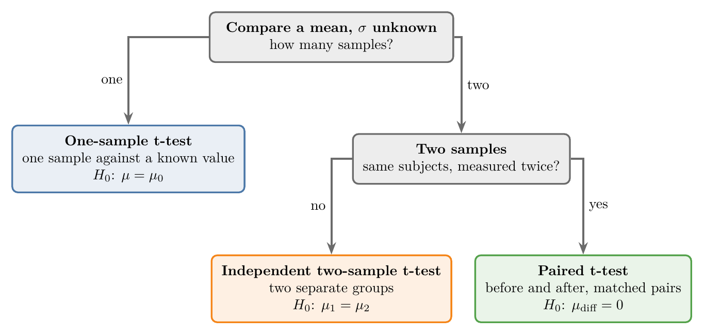
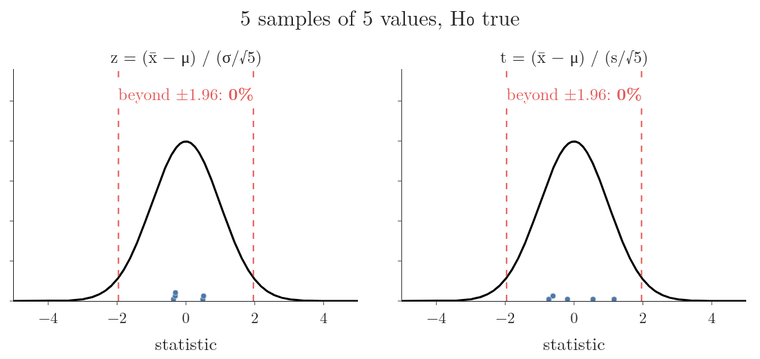
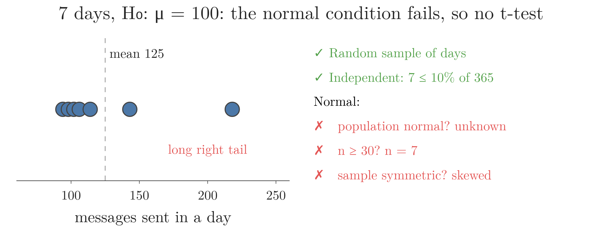
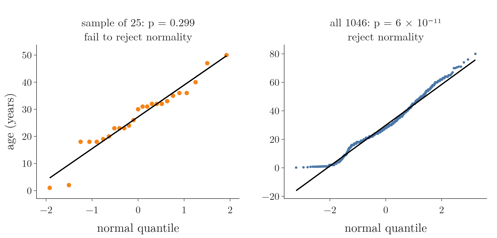
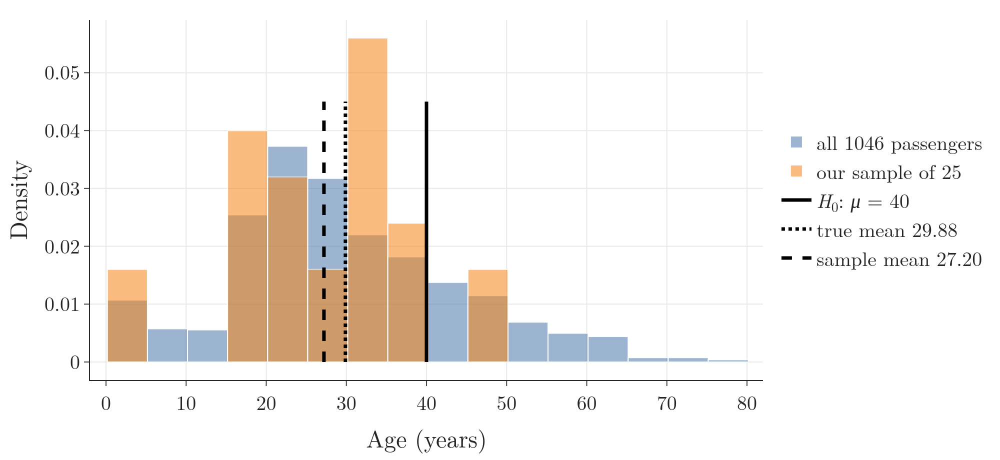
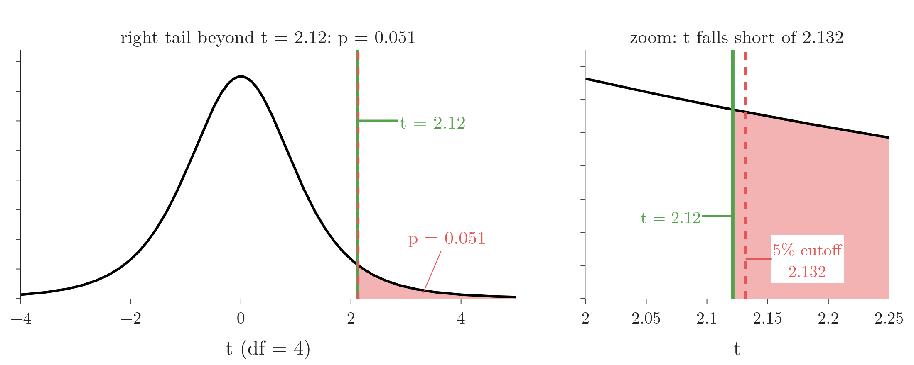

<!-- where-this-fits: generated by course_map/build_map.py; edit concepts.yaml, not this block -->
> **Where this fits:** Pipeline map step 0 (Foundations). See the [Course map](../../../00-course-map/00-course-map.md).
>
> 
>
> - **Builds on:** [Student's t-distribution](../../../MA/04-inference/MA-037-t-procedure/MA-037-t-procedure.md#5-students-t-distribution); [Hypothesis testing: null and alternative](../../../MA/04-inference/MA-038-null-and-alternative-hypotheses/MA-038-null-and-alternative-hypotheses.md#4-the-alternative-hypothesis).
> - **Leads to:** [Choosing a hypothesis test](../../../MA/04-inference/MA-044-choosing-a-hypothesis-test/MA-044-choosing-a-hypothesis-test.md#1-overview).
> - **Compare with:** [One-way ANOVA](../../../MA/04-inference/MA-046-one-way-anova/MA-046-one-way-anova.md#1-overview).
<!-- /where-this-fits -->

## 1. Overview

> **Key point:** A t-test is the z-test with the sample standard deviation $s$ in place of $\sigma$, and Student's t-distribution in place of the normal curve; it comes in three types.

{height=32%}

The [z-test](../MA-039-rejection-region-and-z-test/MA-039-rejection-region-and-z-test.md#4-the-z-statistic-counting-standard-errors) needs the population standard deviation $\sigma$, which we almost never know. The **t-test** (G-1940) works without it. Because $\sigma$ is usually unknown, the t-test is the test we use most often.

A t-test compares the means of two samples, or compares a sample mean with a known population mean. Figure 1 shows its three types. This Note covers:

- what changes from the z-test to the t-test;
- the three types of t-test (the two-sample ones are taught in [the independent two-sample t-test](../MA-043-two-sample-and-paired-t-tests/MA-043-two-sample-and-paired-t-tests.md#2-the-independent-two-sample-t-test) and [the paired t-test](../MA-043-two-sample-and-paired-t-tests/MA-043-two-sample-and-paired-t-tests.md#5-the-paired-t-test));
- the one-sample t-test: the t statistic step by step, the conditions (and a case where we must refuse the test), and a worked example with its p-value;
- checking normality with the Shapiro-Wilk test;
- a one-sample t-test on the ages of Titanic passengers.

## 2. From the z-test to the t-test

> **Key point:** Replace $\sigma$ by $s$; the statistic then follows Student's t-distribution with $n - 1$ degrees of freedom instead of the standard normal.

We already made this change for confidence intervals in [the t-procedure](../MA-037-t-procedure/MA-037-t-procedure.md#3-replacing-sigma-by-s), and reuse it unchanged:

- with $s$ in place of $\sigma$, the standardized sample mean follows **Student's t-distribution** (G-1906), bell-shaped like the standard normal but with fatter tails;
- its one parameter is the **degrees of freedom** (G-578), $df = n - 1$;
- as $n$ grows, the t-distribution approaches the standard normal.

{height=55%}

Figure 2 computes both statistics on the same 400 small samples. Watch the red dots beyond ±1.96: about 5% for z, but about 12% for t. The two statistics differ only in the spread they divide by:

$$t = z \cdot \frac{\sigma}{s}$$

A sample's own $s$ often falls below $\sigma$, and then $t$ is larger than $z$. The orange curve, Student's t with $df = 4$, matches that wider pile. Its area beyond ±1.96 is:

$$2\thinspace P(T > 1.96) = 0.12$$

| | Z-test | T-test |
|---|---|---|
| Spread used | population standard deviation $\sigma$ | sample standard deviation $s$ |
| Distribution of the statistic | standard normal | Student's t, $df = n - 1$ |
| Tail areas from | the z-table, `stats.norm` | the t-table, `stats.t` |
| Used when | $\sigma$ known (rare) | $\sigma$ unknown (usual) |

A rule of thumb also says the t-test suits small samples. The rule is a practical observation, not a mathematical requirement: the t-test works for any $n$ once $\sigma$ is unknown, and for large $n$ it gives nearly the same answer as the z-test.

## 3. The three types of t-test

> **Key point:** One sample against a known mean; two independent groups against each other; or the same subjects measured twice.

1. **One-sample t-test** (G-1382). Compares the mean of one sample with a known population mean. $H_0$: there is no difference between the population mean and the claimed value. The one-sample t-test is the z-test we already ran, but without $\sigma$.
2. **Independent two-sample t-test** (G-936). Compares the means of two independent samples, for example the marks of section A and section B. "Independent" means the groups do not overlap: no student is in both sections. $H_0$: the two population means are equal.
3. **Paired t-test** (G-1439) (dependent two-sample t-test). Compares two samples that are linked, such as the same students' marks in a test before and after a training program. $H_0$: the mean difference is zero.

The rest of this Note is about the first; the other two are covered in [the independent two-sample t-test](../MA-043-two-sample-and-paired-t-tests/MA-043-two-sample-and-paired-t-tests.md#2-the-independent-two-sample-t-test) and [the paired t-test](../MA-043-two-sample-and-paired-t-tests/MA-043-two-sample-and-paired-t-tests.md#5-the-paired-t-test).

## 4. The one-sample t-test

> **Key point:** The one-sample t-test checks whether a sample mean differs from a claimed population mean when $\sigma$ is unknown, using the statistic $t$ of section 4.1.

### 4.1 The t statistic, step by step

**The question.** We suspect that the teachers in a school district have **less than 5 years** of experience on average. A random sample of **25** teachers has a mean of **4 years** and a sample standard deviation of **2 years**.

$$H_0: \mu = 5$$

$$H_1: \mu < 5$$

**The idea in plain words.** As in the z-test, we assume $H_0$ and ask how far below 5 our sample mean of 4 lies, counted in **standard errors** (G-1872; the typical size of the gap between a sample mean and the population mean, see [mean and variance of the sample means](../MA-033-sampling-distribution-and-clt/MA-033-sampling-distribution-and-clt.md#42-mean-and-variance-of-the-sample-means)). A z statistic would divide the gap by $\sigma/\sqrt{n}$, but $\sigma$ is unknown. So we estimate the standard error with the sample's own spread, $s/\sqrt{n}$. The result is the **t statistic** (G-1937), and it follows Student's t-distribution, not the normal curve.

**The mechanism on the teachers.**

1. Gap between the sample mean and the claimed mean:

   $$4 - 5 = -1 \text{ year}$$

2. Estimated standard error:

   $$\frac{s}{\sqrt{n}} = \frac{2}{\sqrt{25}}$$

   $$\frac{2}{5} = 0.4 \text{ years}$$

3. Gap in estimated standard errors:

   $$t = \frac{-1}{0.4} = -2.5$$

   $$df = 25 - 1 = 24$$

4. $H_1$ points left, so the **p-value** (G-1433; the probability of a sample mean at least this far from the claim, if $H_0$ were true; see [the definition of a p-value](../MA-041-p-values/MA-041-p-values.md#2-definition)) is the area to the left of $-2.5$ under the t curve with 24 degrees of freedom:

   $$p = 0.0098$$

5. $0.0098 < 0.05$: reject $H_0$. The data suggests the mean experience is below 5 years.

{height=42%}

In Figure 3, watch the red area shrink as $t$ moves left: by $t = -2.5$ less than 1% of the curve is left, and in the last frame $t$ sits beyond the 5% cutoff $-1.711$. The dashed normal curve lies almost on top of the t curve at 24 degrees of freedom; on it the same tail would be 0.0062, a little smaller (notebook, section 0).

**The formula.**

$$t = \frac{\bar{x} - \mu_0}{s/\sqrt{n}}$$

$$df = n - 1$$

where $\bar{x}$ is the sample mean, $\mu_0$ the mean claimed by $H_0$, $s$ the sample standard deviation and $n$ the sample size.

### 4.2 Conditions: when the test may be used

The one-sample t-test needs four things:

1. **Random sampling.** The sample is a random, representative subset of the population. Picking all the chips packets from one shop shelf would not be.
2. **Independence.** One **observation** (one record, here one measured item) does not influence another. The weight of one chips packet does not affect the weight of the next. When we sample without replacement, a common check is the **10% condition** (G-2236): the sample is at most 10% of the population. Without replacement, each item drawn changes what is left for the next draw, so the draws are not quite independent; when the sample is a small share of the population, each draw changes what is left so little that the observations are nearly independent (OpenIntro Statistics §2.4).
3. **Normality.** The sampling distribution of $\bar{X}$ must be roughly normal. Any one of these is enough:
   - the population itself is normal;
   - $n \ge 30$, so the central limit theorem makes $\bar{X}$ approximately normal (see [the central limit theorem](../MA-033-sampling-distribution-and-clt/MA-033-sampling-distribution-and-clt.md#4-the-central-limit-theorem));
   - with a small sample, the sample is roughly symmetric with no strong outliers (checked with a plot or the test of section 5).
4. **Unknown $\sigma$.** If $\sigma$ were known, we would use the z-test.

**A case where we must refuse the test.** A group of friends suspects they send more than 100 messages a day on a chat app. A random sample of **7 days** from more than a year of history has mean **125** and standard deviation **44**, and the 7 values are strongly skewed to the right. We check the conditions one by one (Figure 4):

- random: yes, the days were drawn at random;
- independent: 10 percent of 365 days is 36.5, and 7 is below that, so yes;
- normal: the population is not known to be normal, $n = 7 < 30$, and the sample is skewed. None of the three routes holds.

The normal condition fails, so a t-test on these 7 days would give a p-value we cannot trust. We would need more days, or a test that does not assume normality.

{height=26%}

In Figure 4, watch the one day far to the right: that long tail is what breaks the "sample roughly symmetric" route.

### 4.3 Example: do chocolate bars weigh 50 g?


A manufacturer claims that its new chocolate bar weighs **50 g** on average. We doubt it, so we weigh a random sample of **25** bars: the sample mean is **49.7 g** and the sample standard deviation **1.2 g**. We use $\alpha = 0.05$.

1. **Hypotheses.** The weight is 50 g, against: it is not.
   $$H_0: \mu = 50$$
   $$H_1: \mu \neq 50$$
2. **Significance level.** $\alpha = 0.05$.
3. **Assumptions.** $n = 25 < 30$, so the central limit theorem does not cover us, and we only have summary numbers, not the 25 weights, so we cannot test normality. We assume it, along with independence and random sampling. $\sigma$ is unknown.
4. **Test.** One-sample t-test.
5. **Statistic.** As in section 4.1:
   $$t = \frac{49.7 - 50}{1.2/\sqrt{25}}$$
   $$t = \frac{-0.3}{0.24}$$
   $$t = -1.25$$
   $$df = 24$$
6. **P-value.** $H_1$ uses $\neq$, so both tails count (see [p-values for the z-test](../MA-041-p-values/MA-041-p-values.md#62-two-tailed-the-chips-packets)). Instead of a t-table we use the CDF (cumulative distribution function: the area under the curve to the left of a point) of the t-distribution with 24 degrees of freedom:
   $$P(T \le -1.25) = 0.112$$
   $$p = 2 \times 0.112 = 0.223$$
7. **Decide.** $0.223 > 0.05$: we fail to reject $H_0$.
8. **Interpret.** The sample gives no significant evidence that the mean weight differs from 50 g.

{height=30%}

Figure 5 shows the two red tails. The t-distribution with 24 degrees of freedom is already close to the standard normal (dashed), but its tails are slightly fatter, so the p-value is slightly larger than a z-test would give (0.211).

The degrees of freedom matter: they set the shape of the curve and so the tail areas. For this reason `stats.t.cdf` takes `df` as well as the point.

> **Python:** The t-distribution's CDF replaces the t-table.
>
> ```python
> from scipy import stats
>
> t = (49.7 - 50) / (1.2 / 25 ** 0.5)     # -1.25
> p = 2 * stats.t.cdf(-abs(t), df=24)     # 0.223
> # with only summary statistics, this is the whole test
> ```

## 5. Checking normality: the Shapiro-Wilk test

> **Key point:** The Shapiro-Wilk test is itself a hypothesis test with $H_0$: "the data comes from a normal distribution"; $p > 0.05$ means no evidence against normality, not proof of it.

When we have the raw values and $n < 30$, we check normality before the t-test. Plots work (a histogram, or a Q-Q plot, see [building a Q-Q plot](../../03-distributions/MA-028-kurtosis-and-qq-plots/MA-028-kurtosis-and-qq-plots.md#7-building-a-q-q-plot)). A formal option is the **Shapiro-Wilk test** (G-1788): we give it the numbers, and it returns a statistic and a p-value.

Since the Shapiro-Wilk test is itself a hypothesis test, everything from the earlier Notes applies:

- $H_0$: the data comes from a normal distribution; $H_1$: it does not;
- $p \le 0.05$: reject $H_0$, the data is not normal;
- $p > 0.05$: fail to reject $H_0$; we have no evidence against normality and may go on with the t-test.

Reading $p > 0.05$ as "the data is normal" is common, but it is the same mistake as "accepting" $H_0$. With 25 values the Shapiro-Wilk test has little power (little chance of detecting a real departure from normality; see section 6.3), so it passes many mildly non-normal samples. With thousands of values it rejects even harmless departures: all 1046 known Titanic ages give a tiny p-value:

$$p = 6 \times 10^{-11}$$

The test is best read together with a plot (Ghasemi and Zahediasl 2012 make all three points).

{height=30%}

Figure 6 puts the two cases side by side. Watch the tails: both plots bend away from the line at the young end, yet only the 1046 ages are rejected, because the test's verdict depends on $n$ as much as on the shape.

## 6. Case study: the mean age of Titanic passengers

> **Key point:** A random sample of 25 ages gives $t = -5.55$ and a one-tailed $p = 0.000005$, so we conclude that the mean age is below 40; the true mean is 29.88.

The Titanic carried 1309 passengers in the Kaggle train and test files together, and 1046 of them have a known age. Suppose we claim, without seeing all the data, that **the mean age of Titanic passengers is less than 40 years**. We test it on a random sample of 25 ages (`random_state=0`); afterwards we can check against all 1046.

### 6.1 The test

1. **Hypotheses.**
   $$H_0: \mu = 40$$
   $$H_1: \mu < 40$$
2. **Significance level.** $\alpha = 0.05$.
3. **Assumptions.** With only 25 values, normality must be checked. The Shapiro-Wilk test gives $p = 0.299 > 0.05$: no evidence against normality. The sample is random, ages of different passengers are independent, and $\sigma$ is unknown.
4. **Test.** One-sample t-test, left-tailed.
5. **Statistic.** The sample has $\bar{x} = 27.20$ and $s = 11.53$:
   $$t = \frac{27.20 - 40}{11.53/\sqrt{25}}$$
   $$t = \frac{-12.80}{2.31} = -5.55$$
   $$df = 24$$
6. **P-value.** $H_1$ uses $<$, so the p-value is the left tail:
   $$p = P(T \le -5.55) = 0.000005$$
7. **Decide.** $0.000005 \le 0.05$: reject $H_0$.
8. **Interpret.** The mean age of Titanic passengers is significantly less than 40 years.

{height=32%}

All 1046 known ages have a mean of **29.88** years (Figure 7): below 40, as the test concluded. The conclusion does not hang on this one sample: section 6.3 shows that 95% of random samples of 25 reach it.

> **Python:** `ttest_1samp` does steps 5 and 6. `alternative` says which tail $H_1$ points to: `"less"`, `"greater"` or `"two-sided"` (the default).
>
> ```python
> from scipy import stats
>
> stats.shapiro(sample_age).pvalue          # 0.299
> res = stats.ttest_1samp(sample_age, popmean=40,
>                         alternative="less")
> res.statistic, res.pvalue                 # -5.55, 0.000005
> ```

### 6.2 One-tailed p-values from a two-sided function

Without `alternative`, scipy's t-test functions return a **two-sided** p-value; here 0.00001. A common shortcut is to halve it for a one-tailed test. Halving is right only when $t$ falls on the side $H_1$ points to:

- $t$ on the side of $H_1$ (here $t < 0$ for $H_1: \mu < 40$): the one-tailed p-value is half the two-sided one.

  $$\frac{0.00001}{2} = 0.000005$$

- $t$ on the other side: the one-tailed p-value is large.

  $$p = 1 - \frac{\text{two-sided } p}{2}$$

Halving blindly would turn a sample mean of, say, 45 into "significant evidence that the mean is below 40". Passing `alternative` avoids the trap.

### 6.3 How often would a sample of 25 find it?

> **Extra:** Drawing 4000 random samples of 25 ages and testing each, **95%** reject $H_0: \mu = 40$ at the 5% level. That 95% is the power of this test (G-1539) (see [power of a test](../MA-040-errors-power-and-tails/MA-040-errors-power-and-tails.md#3-power-of-a-test); the chance that the test rejects $H_0$ when $H_0$ is false): the true mean, 29.88, is far from 40, so almost every sample sees the gap. A claim closer to the truth is harder to reject: against $H_0: \mu = 35$, only 53% of samples of 25 reject, and the other 47% make a Type II error (failing to reject a false $H_0$). A smaller gap needs a larger sample, just as a faint star needs a bigger telescope.

## 7. Back to the five lessons

> **Key point:** The five whiteboard lessons give $t = 2.12$ and one-tailed $p = 0.051$: just above 0.05, so the evidence that they beat 6 minutes is not quite significant.

> **Extra:** The example in [the null and alternative hypotheses](../MA-038-null-and-alternative-hypotheses/MA-038-null-and-alternative-hypotheses.md#21-an-online-channel-tries-a-new-style) asked whether five lessons with average view durations of 7, 9, 5, 11 and 13 minutes show that the new style beats the old average of 6 minutes. With $H_0: \mu = 6$, $H_1: \mu > 6$:
>
> 1. **In words:** a one-sample, right-tailed t-test on the five values.
> 2. **Formula:** with $n = 5$, the mean and the standard deviation are:
>    $$\bar{x} = \frac{7 + 9 + 5 + 11 + 13}{5} = 9$$
>    $$\text{squared gaps: } 4 + 0 + 16 + 4 + 16 = 40$$
>    $$s = \sqrt{40/4} = 3.16$$
>    Then:
>    $$t = \frac{9 - 6}{3.16/\sqrt{5}}$$
>    $$t = \frac{3}{1.41} = 2.12$$
>    $$df = 4$$
> 3. **Example:** the right tail of the t curve with 4 degrees of freedom:
>    $$p = P(T \ge 2.12) = 0.051$$
>
> At $\alpha = 0.05$ we fail to reject $H_0$, by a hair. On [the scale of evidence](../MA-041-p-values/MA-041-p-values.md#52-a-scale-of-evidence) this is weak evidence: worth a few more lessons before deciding, and certainly not proof that the new style fails.

{height=28%}

In Figure 8, watch the zoomed panel: the green $t$ stops 0.012 short of the dashed 5% cutoff, which is the same "by a hair" as $p = 0.051$ against 0.05.

## 8. Summary

| | Chocolate bars | Titanic ages |
|---|---|---|
| $H_0$ / $H_1$ | $\mu = 50$ / $\mu \neq 50$ | $\mu = 40$ / $\mu < 40$ |
| Data | $n = 25$, $\bar{x} = 49.7$, $s = 1.2$ | $n = 25$, $\bar{x} = 27.20$, $s = 11.53$ |
| Normality | assumed (only summary data) | Shapiro-Wilk $p = 0.299$ |
| $t$, $df$ | $-1.25$, 24 | $-5.55$, 24 |
| P-value | 0.223 (two-tailed) | 0.000005 (left-tailed) |
| Decision | fail to reject $H_0$ | reject $H_0$ |

- Reading the table: the chocolate bars' $p = 0.223$ is above 0.05, so the data does not show the mean differs from 50 g; the Titanic ages' tiny $p$ rejects $H_0$, and the true mean, 29.88, is indeed below 40.
- The t-test replaces $\sigma$ by $s$ and the normal curve by Student's t with $n - 1$ degrees of freedom, because $\sigma$ is almost never known; this makes it the test used most often.
- Three types: one-sample, independent two-sample, paired, so the design of the data (one group, two separate groups, the same subjects twice) picks the type.
- $t$ counts estimated standard errors; the teachers' sample gives $t = -2.5$ and a left-tail p-value of 0.0098, so we reject $H_0$: the mean experience is below 5 years.
- One-sample conditions: random sampling, independence (10% condition), normality (population normal, $n \ge 30$, or a symmetric sample without outliers), unknown $\sigma$. If normality fails on a small skewed sample, do not run the test, because none of the routes to normality holds and its p-value cannot be trusted.
- The Shapiro-Wilk test checks normality; $p > 0.05$ means no evidence against it, not proof, because with 25 values the test has little power; read it with a Q-Q plot.
- Use `alternative=` for one-tailed tests instead of halving a two-sided p-value, because halving is right only when $t$ falls on the side $H_1$ points to.
- This answers the opening question: a t-test is the z-test with $s$ for $\sigma$ and Student's t for the normal curve, so it works when $\sigma$ is unknown.

## 9. Sources

**Built from**

- CampusX, "Session 46 - Hypothesis Testing Part 2 | p-values | t-tests | DSMP 2023", YouTube, https://www.youtube.com/watch?v=xHTMjxx14sU. The z-to-t change, the three types, the four assumptions, the chocolate bars and the Titanic case (sections 2 to 6).
- Khan Academy, "Example calculating t statistic for a test about a mean", YouTube, https://www.youtube.com/watch?v=BJl9WA787-Q. The teachers' example (section 4.1).
- Khan Academy, "Conditions for a t test about a mean", YouTube, https://www.youtube.com/watch?v=GtokpL4f32s. The 10% condition, the three routes to normality and the messages example (section 4.2).

**Other references**

- Ghasemi, A. and Zahediasl, S. (2012). "Normality tests for statistical analysis: a guide for non-statisticians." *International Journal of Endocrinology and Metabolism* 10(2), 486–489.
- Diez, D. M., Barr, C. D. and Çetinkaya-Rundel, M. *OpenIntro Statistics*. OpenIntro. §2.4 "Sampling from a small population". Also at stats.libretexts.org.

## 10. Key terms

| Term | Meaning |
|---|---|
| T-test | A hypothesis test about means that uses the sample standard deviation and Student's t-distribution |
| One-sample t-test | Tests whether a population mean equals a claimed value, from one sample, with $\sigma$ unknown: $t = (\bar{x} - \mu_0)/(s/\sqrt{n})$ |
| T statistic | The value of $t$ computed from the sample in a t-test |
| Independent two-sample t-test | A t-test comparing the means of two separate, non-overlapping groups |
| Paired t-test (dependent t-test) | A t-test comparing two linked measurements of the same subjects, through their differences |
| 10% condition (G-2236) | When sampling without replacement, keep the sample at most 10% of the population so the observations are roughly independent |
| `alternative` (scipy) | The argument of scipy's tests that sets the direction of $H_1$: `"two-sided"`, `"less"` or `"greater"` |
