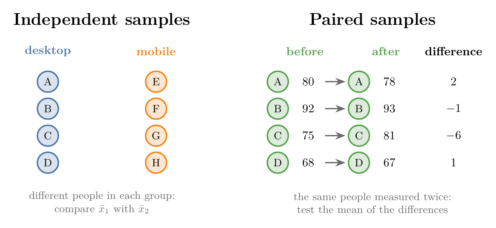
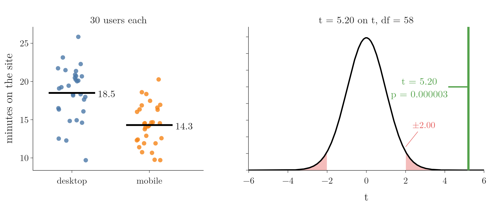
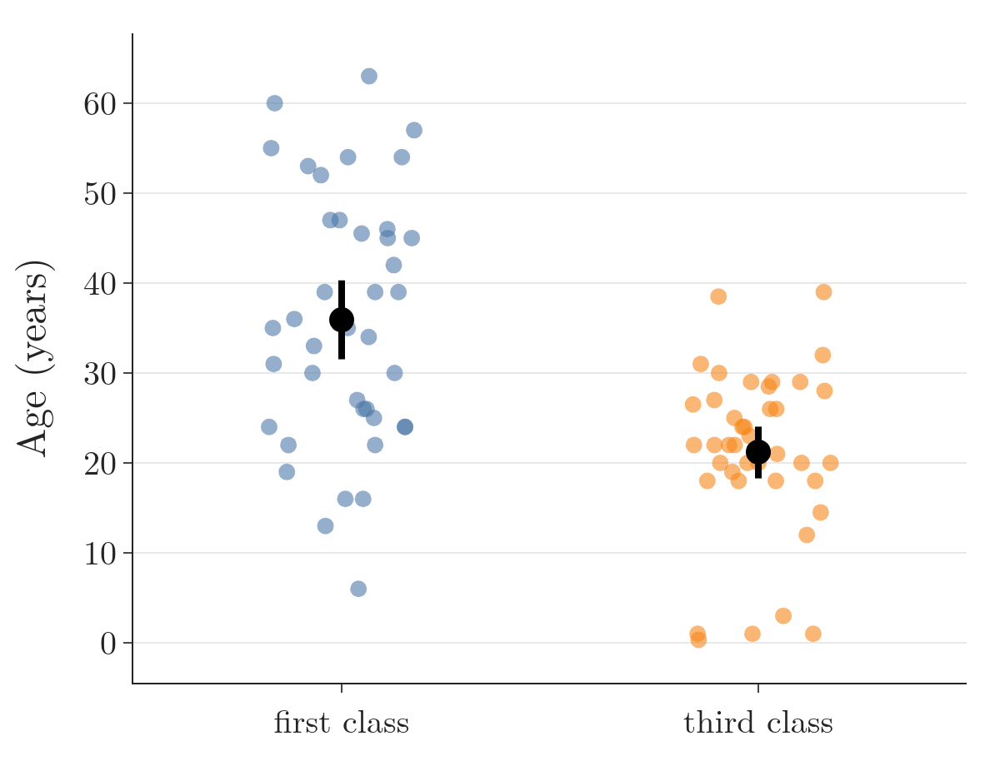
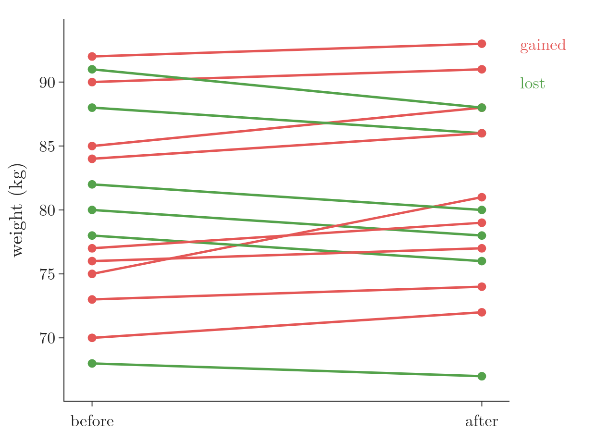
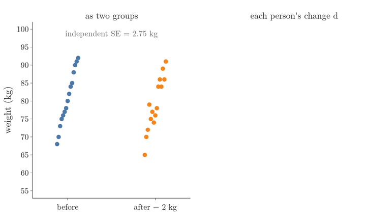
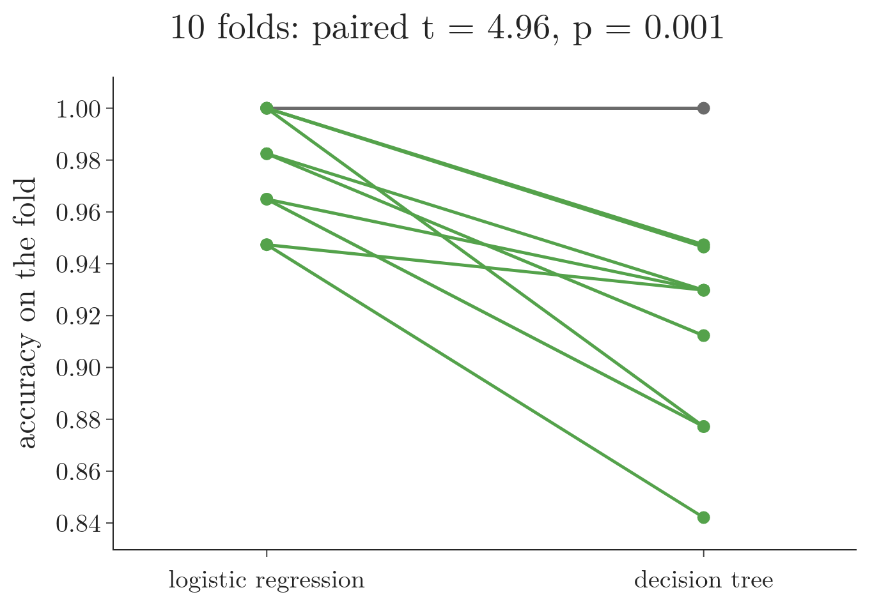

<!-- where-this-fits: generated by course_map/build_map.py; edit concepts.yaml, not this block -->
> **Where this fits:** Pipeline map step 0 (Foundations). See the [Course map](../../../00-course-map/00-course-map.md).
>
> 
>
> - **Builds on:** [Student's t-distribution](../../../MA/04-inference/MA-037-t-procedure/MA-037-t-procedure.md#5-students-t-distribution); [Hypothesis testing: null and alternative](../../../MA/04-inference/MA-038-null-and-alternative-hypotheses/MA-038-null-and-alternative-hypotheses.md#4-the-alternative-hypothesis).
> - **Leads to:** [Choosing a hypothesis test](../../../MA/04-inference/MA-044-choosing-a-hypothesis-test/MA-044-choosing-a-hypothesis-test.md#1-overview).
> - **Compare with:** [One-way ANOVA](../../../MA/04-inference/MA-046-one-way-anova/MA-046-one-way-anova.md#1-overview).
<!-- /where-this-fits -->

## 1. Overview

> **Key point:** Two separate groups are compared with the independent two-sample t-test; the same subjects measured twice are compared with the paired t-test, which tests the mean of the differences.

{height=30%}

The [one-sample t-test](../MA-042-one-sample-t-test/MA-042-one-sample-t-test.md#4-the-one-sample-t-test) compared one sample mean with a claimed value. Often we want to compare two samples instead. Figure 1 shows the two designs, and each has its own t-test.

Words from earlier hypothesis-testing Notes appear throughout. Each, with its plain meaning:

- **null hypothesis** $H_0$: the claim of "no difference" that the test tries to reject ([the null hypothesis](../MA-038-null-and-alternative-hypotheses/MA-038-null-and-alternative-hypotheses.md#3-the-null-hypothesis));
- **p-value**: the probability of a result at least as extreme as ours if $H_0$ were true ([definition](../MA-041-p-values/MA-041-p-values.md#2-definition));
- **significance level** $\alpha$: the cut-off for $p$ below which we reject $H_0$, here 0.05 ([how rare is too rare](../MA-039-rejection-region-and-z-test/MA-039-rejection-region-and-z-test.md#5-how-rare-is-too-rare-the-significance-level));
- **standard error**: how much a sample mean varies from sample to sample ([mean and variance of the sample means](../MA-033-sampling-distribution-and-clt/MA-033-sampling-distribution-and-clt.md#42-mean-and-variance-of-the-sample-means));
- **degrees of freedom** ($df$): the number that sets the width of the t-distribution, the bell-shaped curve that $t$ follows when $H_0$ is true ([degrees of freedom](../MA-037-t-procedure/MA-037-t-procedure.md#51-degrees-of-freedom));
- **central limit theorem**: sample means are close to normal when samples are large enough ([the central limit theorem](../MA-033-sampling-distribution-and-clt/MA-033-sampling-distribution-and-clt.md#4-the-central-limit-theorem));
- **Q-Q plot** and **Shapiro-Wilk test**: two ways to check whether data looks normal ([building a Q-Q plot](../../03-distributions/MA-028-kurtosis-and-qq-plots/MA-028-kurtosis-and-qq-plots.md#7-building-a-q-q-plot));
- **Type II error** and **power**: missing a real difference, and the chance of catching it ([power of a test](../MA-040-errors-power-and-tails/MA-040-errors-power-and-tails.md#3-power-of-a-test)).

**Which t-test? Two questions decide it.**

1. **Is each subject measured twice?** Blood pressure of the same people before and after a drug gives a pair of values per person: **paired data**, so the **paired t-test** (G-1439). Heights of one group of people against heights of a different group give **unpaired data**, so an unpaired, independent two-sample t-test (G-936).
2. **For unpaired data, may we assume equal variances?** Student's version assumes the two groups vary by the same amount; **Welch's t-test** (G-2122) does not. Welch's version is the safer default: it holds up when the variances differ and loses little when they are equal (section 2.2).

This Note covers:

- the independent two-sample t-test: assumptions, the equal-variance check with Levene's test, the formula and a worked example;
- a case study: were first-class Titanic passengers older than third-class ones?
- the paired t-test: assumptions, the formula and a weight-loss example;
- why pairing makes a test more powerful;
- comparing two machine learning models with a paired t-test.

## 2. The independent two-sample t-test

> **Key point:** The independent two-sample t-test compares the means of two independent groups. The null hypothesis is that the two means are equal, $H_0: \mu_1 = \mu_2$ (the same as a difference of 0).

The **independent two-sample t-test** (G-936), also called the **unpaired t-test**, compares the means of two independent groups to decide whether they differ significantly. Examples:

- the average marks of section A and section B of a class;
- the mean age of first-class and third-class Titanic passengers;
- the average time desktop users and mobile users spend on a website.

$H_0$ says the two population means are equal; $H_1$ says they differ (two-tailed) or that one is larger (one-tailed):

$$H_0: \mu_1 - \mu_2 = 0$$

$$H_1: \mu_1 - \mu_2 \neq 0$$

A t-test compares exactly **two** groups. To compare all three Titanic classes at once, we use **ANOVA** (a test for the means of three or more groups, see [one-way ANOVA](../MA-046-one-way-anova/MA-046-one-way-anova.md#1-overview)) instead.

### 2.1 Assumptions

1. **Independence of observations.** An **observation** is one record, here one person's value. There is no relationship between the observations in one group and those in the other. No Titanic passenger travelled in both first and third class, so the two age samples are independent. Independence fails if, say, we compare the marks of a Python course and a machine learning course when some students took both.
2. **Normality.** The data in each group is approximately normal. With 30 or more values per group the central limit theorem covers us; with fewer, we check each group, with a Q-Q plot, a histogram or the Shapiro-Wilk test (see [checking normality](../MA-042-one-sample-t-test/MA-042-one-sample-t-test.md#5-checking-normality-the-shapiro-wilk-test)).
3. **Equal variances** (homogeneity of variance). The two populations have about the same variance: $\sigma_1^2 = \sigma_2^2$. Section 2.2 shows how to check it.
4. **Random sampling.** Each sample is random and representative. Forty first-class passengers should be drawn from the whole first-class list, not only from those who boarded at one port.

The sample sizes may differ: 30 desktop users and 25 mobile users is fine.

### 2.2 Checking equal variances: Levene's test

**Levene's test** checks (G-1082) whether two or more groups have equal variances. Like the Shapiro-Wilk test, it is itself a hypothesis test:

- $H_0$: the population variances are equal; $H_1$: they are not;
- $p \le 0.05$: reject $H_0$, the variances differ;
- $p > 0.05$: no evidence that they differ, so we may keep the equal-variance assumption.

The **F-test** is another test for comparing variances.

If Levene's test says the variances differ, we use **Welch's t-test** (G-2122), which drops the equal-variance assumption: in scipy, `ttest_ind(a, b, equal_var=False)`. Section 4 uses it.

> **Extra:** Welch's test is still a parametric t-test. The usual non-parametric alternative, which does not assume normality at all, is the Mann-Whitney U test. Delacre, Lakens and Leys (2017) recommend Welch's test as the default: it controls Type I errors when the variances differ and loses little when they are equal. The website data of section 3 agrees: there the variances look equal: Welch's test gives a p-value of 0.0000030, against 0.0000027 for Student's.

### 2.3 The test statistic

**The idea, step by step.** A farmer grows tomatoes in two fields and asks whether the plants differ in height. A random sample of **22** plants from field A has mean **1.3 m** and standard deviation **0.5 m**; **24** plants from field B have mean **1.6 m** and standard deviation **0.3 m**. $H_0: \mu_A = \mu_B$, $H_1: \mu_A \neq \mu_B$, $\alpha = 0.05$.

1. The gap between the sample means:

   $$1.3 - 1.6 = -0.3 \text{ m}$$

2. How much would that gap wobble from sample to sample? Each sample mean wobbles with variance $s^2/n$, and the gap wobbles with **both**, so the two variance parts add:

   $$0.5^2/22 = 0.01136$$

   $$0.3^2/24 = 0.00375$$

   $$0.01136 + 0.00375 = 0.0151$$

3. The standard error of the gap is the square root:

   $$\sqrt{0.0151} = 0.123 \text{ m}$$

4. The gap in standard errors:

   $$t = -0.3/0.123 = -2.44$$

5. Both tails count ($H_1$ is $\neq$): the area beyond $\pm 2.44$ is $p = 0.020$ with Welch's degrees of freedom (33.8). Since $0.020 < 0.05$, we reject $H_0$: the plant heights differ between the fields.

{height=42%}

In Figure 2, watch the left bar: field A's part is three times field B's, because its plants vary more and there are fewer of them. On the right, the red tails shrink as $t$ moves out to $-2.44$.

Hand calculations often use a simpler, **conservative** degrees of freedom (G-2238), the smaller sample size minus one:

$$22 - 1 = 21$$

This gives $p = 0.024$. Software uses Welch's formula (33.8 here), which is closer to exact (Welch 1947); both give the same decision here (notebook, section 0).

**The formula.**

1. **In words:** the difference between the two sample means, in standard errors of that difference.
2. **Formula:**
   $$t = \frac{\bar x_1 - \bar x_2}{\sqrt{\dfrac{s_1^2}{n_1} + \dfrac{s_2^2}{n_2}}}$$

   $$df = n_1 + n_2 - 2$$
3. **Example:** the website data of section 3, $\bar x_1 = 18.5$, $s_1 = 3.5$, $\bar x_2 = 14.3$, $s_2 = 2.7$, $n_1 = n_2 = 30$:
   $$SE = \sqrt{\frac{3.5^2}{30} + \frac{2.7^2}{30}}$$

   $$SE = \sqrt{\frac{12.25 + 7.29}{30}}$$

   $$SE = \sqrt{0.651} = 0.807$$

   $$t = \frac{18.5 - 14.3}{0.807}$$

   $$t = \frac{4.2}{0.807} = 5.20$$

   $$df = 30 + 30 - 2 = 58$$

The standard error adds the two variances, each divided by its own sample size: the uncertainty of a difference comes from both means.

> **Extra:** Strictly, the formula above is the standard error of **Welch's** test, whose degrees of freedom come from a longer formula (54.5 here). The classic **Student's** test, which assumes equal variances and uses the simple $df$ of the formula above, uses a pooled standard deviation instead (G-1519):
>
> $$s_p^2 = \frac{(n_1 - 1)s_1^2 + (n_2 - 1)s_2^2}{n_1 + n_2 - 2}$$
>
> $$SE = s_p\sqrt{\frac{1}{n_1} + \frac{1}{n_2}}$$
>
> When $n_1 = n_2$ the two standard errors are identical, so here $t = 5.20$ either way:
>
> $$s_p^2 = (12.25 + 7.29)/2 = 9.77$$
>
> $$SE = 3.126 \times \sqrt{2/30} = 0.807$$
>
> With unequal sample sizes, use one version consistently; `ttest_ind` does this for us.

## 3. Example: desktop and mobile users

> **Key point:** $t = 5.20$ with 58 degrees of freedom gives $p = 0.000003$: desktop and mobile users spend different amounts of time on the site.

A website owner claims there is no difference in the average time spent on the site between desktop and mobile users. To test this, we collect data from **30 desktop users** and **30 mobile users**:

| | $n$ | Mean time (minutes) | Standard deviation |
|---|---|---|---|
| Desktop | 30 | 18.5 | 3.5 |
| Mobile | 30 | 14.3 | 2.7 |

The file `data/website_time.csv` holds 60 simulated values with exactly these summary numbers, so that we can run the checks.

1. **Hypotheses.** The null hypothesis is that the two means do not differ:

   $$H_0: \mu_{\text{desktop}} - \mu_{\text{mobile}} = 0$$

   $$H_1: \mu_{\text{desktop}} - \mu_{\text{mobile}} \neq 0$$

2. **Significance level.** $\alpha = 0.05$.
3. **Assumptions.**
   - independence: we assume each user uses only one device;
   - random sampling: assumed;
   - normality: Shapiro-Wilk gives $p = 0.51$ (desktop) and $p = 0.77$ (mobile), no evidence against normality;
   - equal variances: Levene's test gives $p = 0.30$, no evidence of unequal variances.
4. **Test.** Independent two-sample t-test, two-tailed.
5. **Statistic.** $t = 5.20$, $df = 58$ (section 2.3).
6. **P-value.** Both tails: $p = 2\thinspace P(T \ge 5.20) = 0.0000027$.
7. **Decide.** $p \le 0.05$: reject $H_0$.
8. **Interpret.** The owner's claim is wrong: average time on the site differs between desktop and mobile users.

{height=30%}

In Figure 3, watch the gap between the two black mean lines on the left become, on the right, a $t$ more than twice as far out as the red cutoffs.

The two-tailed test says only that the means differ. Here the sign of $t$ shows that desktop users spend longer; a one-tailed test with $H_1: \mu_{\text{desktop}} > \mu_{\text{mobile}}$, decided in advance, would be the test to run if that direction were the question.

> **Python:** `ttest_ind` runs the independent two-sample t-test; `ttest_ind_from_stats` works from summary numbers alone.
>
> ```python
> from scipy import stats
>
> stats.levene(desktop, mobile).pvalue          # 0.30
> stats.ttest_ind(desktop, mobile)              # t = 5.20, p = 2.7e-06
> stats.ttest_ind_from_stats(18.5, 3.5, 30,
>                            14.3, 2.7, 30)     # the same result
> ```

## 4. Case study: were first-class passengers older?

> **Key point:** Samples of 40 first-class and 40 third-class passengers give Welch's $t = 5.46$ and $p = 0.0000004$: first-class passengers were older on average, and the full passenger list confirms it.

### 4.1 Why a test and not just a plot

A t-test between a numerical **feature** (an input variable, one column of the data table), here age, and a two-category feature, here class, asks whether the two are related. If the mean age differs between the classes, age depends on class; if the means are about the same, there is no such relationship.

A bar chart of mean age by class would show the difference in our data. But our data is a sample, and the question is about the population. The test tells us whether the difference we see is larger than sampling noise, just as a referee checks the replay before trusting what one camera angle seemed to show.

### 4.2 The test

Our claim: first-class passengers were older on average than third-class passengers. Of the 1309 passengers in the Kaggle train and test files, 284 first-class and 501 third-class passengers have a known age. We draw a random sample of 40 of each (`random_state=5`).

1. **Hypotheses.**
   $$H_0: \mu_{\text{first}} = \mu_{\text{third}}$$

   $$H_1: \mu_{\text{first}} > \mu_{\text{third}}$$
2. **Significance level.** $\alpha = 0.05$.
3. **Assumptions.** Each group has 40 values, so the central limit theorem covers normality (Shapiro-Wilk does reject it for the third-class ages, $p = 0.004$, which is why the sample size matters). Levene's test gives $p = 0.003$: the variances differ (standard deviations 14.2 and 9.5). The groups are independent and randomly sampled.
4. **Test.** Because the variances differ, Welch's t-test (section 2.2), right-tailed.
5. **Statistic.** First class: $\bar{x} = 35.9$, $s = 14.2$. Third class: $\bar{x} = 21.2$, $s = 9.5$. Then $t = 5.46$, with Welch's $df = 68.1$.
6. **P-value.** $p = P(T \ge 5.46) = 0.0000004$.
7. **Decide.** $p \le 0.05$: reject $H_0$.
8. **Interpret.** First-class passengers were significantly older on average than third-class passengers.

{height=32%}

Figure 4 shows why: the two clouds of ages are shifted, and the confidence intervals of the means do not overlap.

> **Python:** Levene first, then Welch's test.
>
> ```python
> stats.levene(s_first, s_third).pvalue           # 0.003
> stats.ttest_ind(s_first, s_third, equal_var=False,
>                 alternative="greater")          # t = 5.46, p = 3.6e-07
> ```

### 4.3 Checking against the population

All 284 known first-class ages have a mean of **39.16** years and all 501 third-class ages **24.82**: a real gap of about 14 years, as the test concluded. The conclusion does not hang on our one sample: repeating the test on 4000 random pairs of samples of 40, **99.98%** reject $H_0$.

> **Extra:** A small gap needs a large sample. Men and women on the Titanic also differ in mean age, but only by 1.9 years (30.59 against 28.69), on ages with a standard deviation near 14. With samples of 25 men and 25 women, only **10%** of 4000 repeated tests reject $H_0$: the test has a power of about 0.10, and nine times out of ten it makes a Type II error (see [Type II error](../MA-040-errors-power-and-tails/MA-040-errors-power-and-tails.md#22-type-ii-error)). Failing to reject in such a test is not proof that the means are equal.

## 5. The paired t-test

> **Key point:** For two linked measurements of the same subjects, we take the difference per subject and run a one-sample t-test on the differences, with $H_0$: mean difference $= 0$.

### 5.1 When to use it

The **paired t-test** (G-1439), also called the **dependent two-sample t-test**, compares the means of two samples that are related or paired. Common cases:

- **before and after studies:** the performance of the same group before and after an intervention or treatment, such as students' test marks before and after extra classes;
- **matched or correlated groups:** two groups matched in pairs, such as siblings, or pairs of people chosen to be similar in age and health.

Before-and-after studies are the more common of the two.

**One population of differences.** The two designs ask different questions:

- **two-sample:** two populations, one independent sample from each; we estimate the difference of their means, $\mu_1 - \mu_2$;
- **paired:** one population; each subject is measured twice, we take each subject's difference, and we estimate the **mean difference** (G-2237) $\mu_d$.

For example, a running coach suspects that shoe brand H gives faster lap times than brand Z. Six runners each run one lap in each brand, in an order set by a coin flip. Each runner gives one difference, $d$ = time in Z $-$ time in H, so the six differences form one sample from one population. Faster in H means $d > 0$:

$$H_0: \mu_d = 0$$

$$H_1: \mu_d > 0$$

From here on, a paired test is a one-sample t-test on the differences (section 5.3); Figure 6 in section 7 shows the pairs collapsing into their differences.


### 5.2 Assumptions

A small class has 5 students, A to E. Their test marks are poor, so they get extra classes and then take the test again:

| Student | Before | After | $d$ = before $-$ after |
|---|---|---|---|
| A | 50 | 55 | $-5$ |
| B | 60 | 60 | 0 |
| C | 70 | 60 | 10 |
| D | 40 | 60 | $-20$ |
| E | 25 | 100 | $-75$ |

The same 5 students make up both samples. The three assumptions, on this example:

1. **Paired observations.** The two sets of measurements are linked: each value in one set belongs to the same subject (or matched pair) as one value in the other. Student A's mark before (50) and student A's mark after (55) form a pair.
2. **Normality of the differences.** The differences between paired observations are approximately normal. We test the differences (the last column), not the two samples separately.
3. **Independence of pairs.** Each pair is independent of the other pairs: student A's marks do not influence student B's (no copying in the test).

### 5.3 The test statistic

For each subject we compute the difference $d_i = x_{\text{before},i} - x_{\text{after},i}$. If $H_0$ is true, the mean difference $\mu_d = \mu_{\text{before}} - \mu_{\text{after}}$ is 0. The test is then a one-sample t-test of the differences against 0.

1. **In words:** the mean difference, in estimated standard errors of the mean difference.
2. **Formula:**
   $$t = \frac{\bar{d} - 0}{s_d/\sqrt{n}}$$

   $$df = n - 1$$
   where $\bar{d}$ and $s_d$ are the mean and standard deviation of the $n$ differences.
3. **Example:** the weight-loss data of section 6, $\bar{d} = -0.47$ kg, $s_d = 2.45$ kg, $n = 15$:
   $$SE = \frac{2.45}{\sqrt{15}} = 0.631$$
   $$t = \frac{-0.47}{0.631} = -0.74$$
   $$df = 15 - 1 = 14$$

## 6. Example: does a weight-loss program work?

> **Key point:** The 15 participants gained 0.47 kg on average; $t = -0.74$ and the right-tailed $p = 0.76$, so the data gives no evidence that the program reduces weight.

A fitness centre evaluates a new 8-week weight-loss program. It enrols **15 participants** and weighs each one before and after. The goal is to test whether the program leads to a significant **reduction** in weight. The data is in `data/weight_loss.csv`; in Figure 5 each participant is one line, from the weight before (left) to the weight after (right).

{height=33%}

| Participant | Before (kg) | After (kg) | $d$ = before $-$ after |
|---|---|---|---|
| A | 80 | 78 | 2 |
| B | 92 | 93 | $-1$ |
| C | 75 | 81 | $-6$ |
| D | 68 | 67 | 1 |
| E | 85 | 88 | $-3$ |
| F | 78 | 76 | 2 |
| G | 73 | 74 | $-1$ |
| H | 90 | 91 | $-1$ |
| I | 70 | 72 | $-2$ |
| J | 88 | 86 | 2 |
| K | 76 | 77 | $-1$ |
| L | 84 | 86 | $-2$ |
| M | 82 | 80 | 2 |
| N | 77 | 79 | $-2$ |
| O | 91 | 88 | 3 |

1. **Hypotheses.** No change, against a reduction (before larger than after, so $d > 0$):
   $$H_0: \mu_d = 0$$

   $$H_1: \mu_d > 0$$
2. **Significance level.** $\alpha = 0.05$.
3. **Assumptions.** The observations are paired (same people). Shapiro-Wilk on the 15 differences: $p = 0.16$, no evidence against normality. Participants do not influence each other.
4. **Test.** Paired t-test, right-tailed.
5. **Statistic.** $t = -0.74$, $df = 14$ (section 5.3).
6. **P-value.** $H_1$ points right, so $p = P(T \ge -0.74) = 0.76$.
7. **Decide.** $0.76 > 0.05$: fail to reject $H_0$.
8. **Interpret.** There is no evidence that the program reduces weight. In fact most participants gained a little.

The tail follows from $H_1$ and from how $d$ is defined, not from habit. With $d$ = before $-$ after, a reduction means $d > 0$, so the p-value is the right tail. Here $t$ is negative, on the "wrong" side for $H_1$, so the p-value is large. Taking the left tail, or halving scipy's two-sided p-value, would both be mistakes. Halving takes scipy's two-sided p-value, 0.47 (by chance the same digits as the 0.47 kg mean gain), and gives a wrongly small p:

$$p = 0.47 / 2 = 0.24$$

> **Python:** `ttest_rel` runs the paired t-test; `alternative` refers to the first sample minus the second.
>
> ```python
> from scipy import stats
>
> d = w["before"] - w["after"]
> stats.shapiro(d).pvalue                        # 0.16
> stats.ttest_rel(w["before"], w["after"],
>                 alternative="greater")        # t = -0.74, p = 0.76
> # identical to a one-sample t-test of d against 0
> stats.ttest_1samp(d, 0, alternative="greater")
> ```

## 7. Why pairing helps

> **Key point:** Pairing removes the large differences between people, so the standard error is far smaller and a real effect is far easier to detect.

People's weights range from 67 to 93 kg, but each person's weight changes by only a few kilograms. An independent two-sample test would treat the "before" and "after" columns as two unrelated groups, and that 26 kg spread between people would swamp a change of 1 or 2 kg. The paired test looks only at each person's own change, so the spread between people drops out.

To see this, suppose every "after" weight in our table were 2 kg lower, a real average loss of 1.53 kg. On the same 30 numbers:

| Test | $t$ | $p$ (right-tailed) |
|---|---|---|
| Paired t-test | 2.43 | **0.015**: significant |
| Independent t-test (wrong here) | 0.56 | 0.29: nothing |

The paired standard error is 0.63 kg:

$$SE = s_d/\sqrt{n} = 0.63$$

Treating the columns as independent gives 2.75 kg, more than four times larger:

$$SE = \sqrt{s_1^2/n + s_2^2/n} = 2.75$$

The result is typical, not a lucky table: averaged over 2000 simulated groups of 15 people like ours (weights spread by about 8 kg, a true loss of 1.5 kg), the median p-value is 0.017 for the paired test and 0.31 for the independent test. Analysing paired data as independent throws most of the power away (Rice 2007, §11.3).

{height=45%}

Figure 6 joins each person's two weights and drops their change $d$ into the right panel. Watch the spread: the left dots range over 27 kg, the green $d$ values over 9 kg, because each person's weight is compared only with their own.

> **Extra:** The variance of the mean difference shows when pairing pays off:
> $$\operatorname{Var}(\bar{d}) = \frac{\sigma_1^2 + \sigma_2^2 - 2\rho\thinspace\sigma_1\sigma_2}{n}$$
> Here $\rho$ is the correlation between the two measurements of a pair. The independent test ignores the last term, as if $\rho = 0$. A heavy person stays heavy, so $\rho$ is close to 1 and the paired variance is far smaller. If the pairs were barely linked ($\rho$ near 0), pairing would gain little.

## 8. Comparing two machine learning models

> **Key point:** Scores of two models on the same cross-validation folds are paired, so we compare them with a paired t-test, keeping in mind that the folds are not fully independent.

When two models are evaluated with k-fold cross-validation on the **same folds** (see [cross-validation with a pipeline](../../../ML/03-feature-engineering/ML-028-pipelines/ML-028-pipelines.md#8-cross-validation-with-a-pipeline)), each fold gives a pair of scores, one per model, measured on the same test data, just as each person gives a pair of weights. So the fold-by-fold comparison is a paired t-test, `stats.ttest_rel(scores_a, scores_b)`, the "k-fold cross-validated paired t test" (G-510) (Dietterich 1998), one of the machine learning uses listed in [hypothesis testing in machine learning](../MA-040-errors-power-and-tails/MA-040-errors-power-and-tails.md#62-in-machine-learning).

{height=32%}

Figure 7 runs the test on scikit-learn's breast cancer data (569 tumours): scaled logistic regression against a decision tree, on the same 10 folds. Watch the lines: on 9 folds logistic regression scores higher and on the tenth the two tie, so the paired test sees a consistent gap (mean accuracy 0.979 against 0.919).

> **Extra:** The folds share most of their training data, so the $k$ differences are not independent, and the third assumption of section 5.2 is broken. As a result the test finds a "significant" difference too often when there is none (Dietterich 1998). Nadeau and Bengio (2003) give a corrected version that enlarges the variance to account for the overlap.

## 9. Summary

| | One-sample | Independent two-sample | Paired |
|---|---|---|---|
| Data | one sample | two separate groups | the same subjects twice |
| $H_0$ | $\mu = \mu_0$ | $\mu_1 = \mu_2$ | $\mu_d = 0$ |
| Statistic | $\dfrac{\bar{x} - \mu_0}{s/\sqrt{n}}$ | $\dfrac{\bar x_1 - \bar x_2}{\sqrt{s_1^2/n_1 + s_2^2/n_2}}$ | $\dfrac{\bar{d}}{s_d/\sqrt{n}}$ |
| $df$ | $n - 1$ | $n_1 + n_2 - 2$ | $n - 1$ |
| Extra check | normality | normality of each group, equal variances (Levene) | normality of the differences |
| scipy | `ttest_1samp` | `ttest_ind` | `ttest_rel` |

- Use the table's "Data" row to choose the test, because the design of the data (one sample, two separate groups, the same subjects twice) decides which $H_0$ and statistic apply.
- The independent two-sample t-test compares two separate groups; Levene's test checks equal variances, and Welch's test drops that assumption, so when Levene rejects (Titanic ages, $p = 0.003$) use Welch's.
- Desktop against mobile: $t = 5.20$, $p = 0.000003$, a clear difference, because $t$ lies more than twice as far out as the cutoffs.
- Titanic first against third class, 40 each: Welch's $p = 0.0000004$; the true means differ by 14 years. A gap of 1.9 years (men against women) is detected only 10% of the time with 25 each, so a small gap needs a large sample, and failing to reject is no proof the means are equal.
- The paired t-test is a one-sample t-test on the differences; the tail follows from $H_1$ and the sign convention of $d$, so taking the other tail or halving a two-sided p-value gives a wrong answer.
- Pairing removes between-subject variation and greatly raises power when the pairs are strongly linked, because each person is compared only with themselves, which shrinks the standard error (0.63 kg against 2.75 kg).
- Weights 2 kg lower after: paired $p = 0.015$, independent $p = 0.29$, so analysing paired data as independent throws most of the power away. Model scores on shared folds are paired too, because each fold gives both models the same test data.
- This answers the opening question: compare two separate groups with the independent two-sample t-test, and the same subjects measured twice with the paired t-test on their differences.

## 10. Sources

**Built from**

- CampusX, "Session 46 - Hypothesis Testing Part 2 | p-values | t-tests | DSMP 2023", YouTube, https://www.youtube.com/watch?v=xHTMjxx14sU. The assumptions, Levene's test, the desktop and mobile example, the Titanic case and the weight-loss example (sections 2 to 6).
- Starmer, J. (StatQuest), "StatQuickie: Which t test to use", YouTube, https://www.youtube.com/watch?v=nnBJeb_I-q8. The two questions that choose a t-test (section 1).
- Khan Academy, "Two-sample t test for difference of means", YouTube, https://www.youtube.com/watch?v=NkGvw18zlGQ. The tomato example (section 2.3).
- Khan Academy, "Example of hypotheses for paired and two-sample t tests", YouTube, https://www.youtube.com/watch?v=X0gIJUXz6jc. One population of differences and the running-shoes example (section 5.1).

**Other references**

- Welch, B. L. (1947). "The generalization of 'Student's' problem when several different population variances are involved." *Biometrika* 34(1–2), 28–35.
- Rice, J. A. (2007). *Mathematical Statistics and Data Analysis*, 3rd ed. Duxbury. §11.3, Comparing paired samples.
- Delacre, M., Lakens, D. and Leys, C. (2017). "Why psychologists should by default use Welch's t-test instead of Student's t-test." *International Review of Social Psychology* 30(1), 92–101.
- Dietterich, T. G. (1998). "Approximate statistical tests for comparing supervised classification learning algorithms." *Neural Computation* 10(7), 1895–1923.
- Nadeau, C. and Bengio, Y. (2003). "Inference for the generalization error." *Machine Learning* 52(3), 239–281.

## 11. Key terms

| Term | Meaning |
|---|---|
| Unpaired t-test | Another name for the independent two-sample t-test: a t-test that compares the means of two separate groups whose values are not paired. |
| Equal variances (homogeneity of variance) | The assumption that two populations have the same variance, $\sigma_1^2 = \sigma_2^2$. Student's t-test needs it; Welch's t-test does not, and Levene's test checks it. |
| Levene's test | A check of whether two or more groups have the same spread (a hypothesis test for equal variances, $H_0$: they do). Used before a two-sample t-test to choose between the equal-variance test and Welch's t-test. |
| F-test | A check of whether two groups have the same spread, made from the ratio of the two sample variances (a hypothesis test of equal population variances); an alternative to Levene's test. |
| Welch's t-test | The two-sample t-test that works even when the two groups' spreads differ (it does not assume equal variances). |
| Pooled standard deviation | The combined standard deviation of two groups used by Student's two-sample t-test |
| Paired observations | Two measurements that belong to the same subject or matched pair |
| Mean difference ($\mu_d$) (G-2237) | The average of each subject's difference between its two measurements (a paired design); the paired t-test tests whether it is 0, $\mu_d = 0$. |
| Conservative degrees of freedom (G-2238) | The hand-calculation shortcut $\min(n_1, n_2) - 1$ for a two-sample t-test; Welch's formula is closer to exact |
