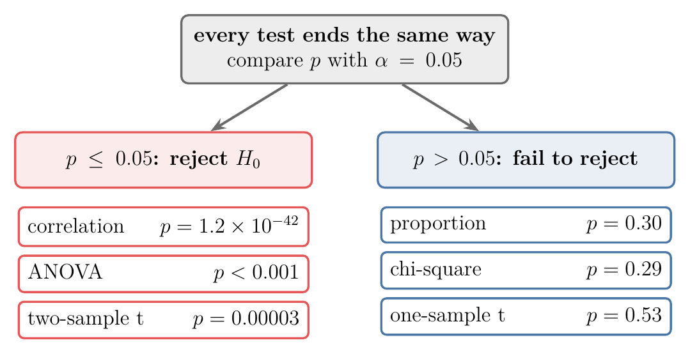
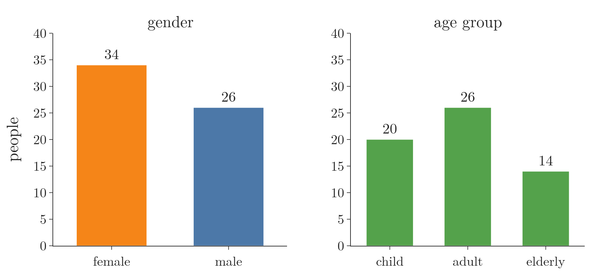
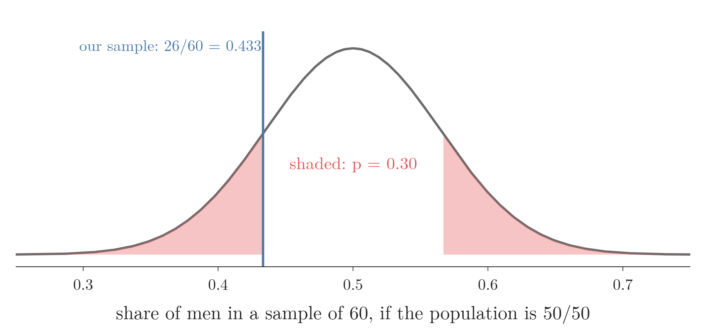
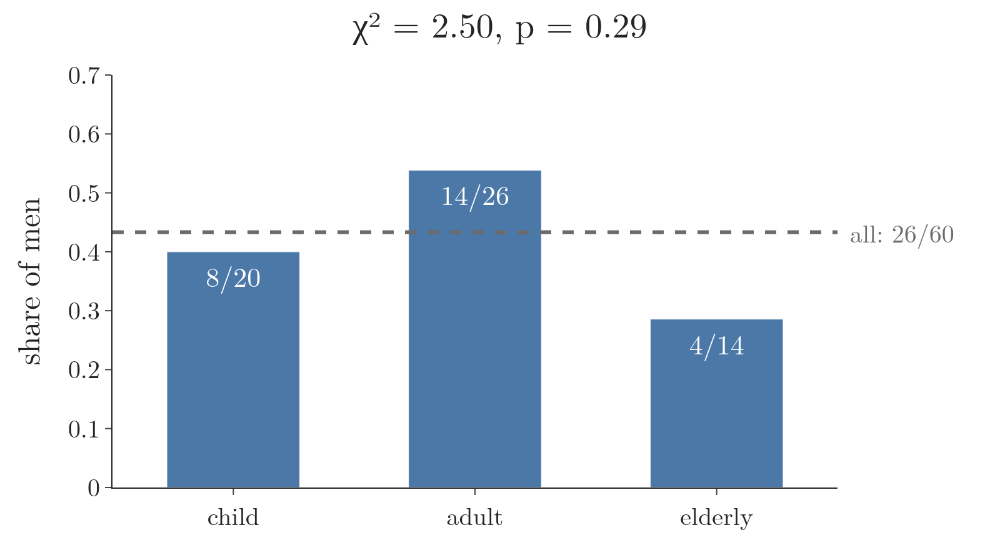
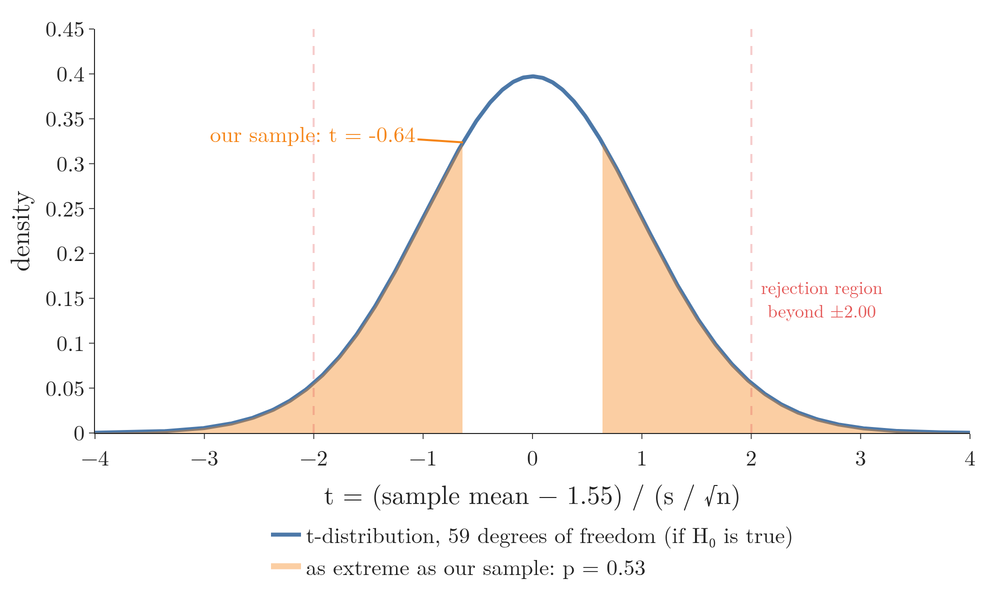
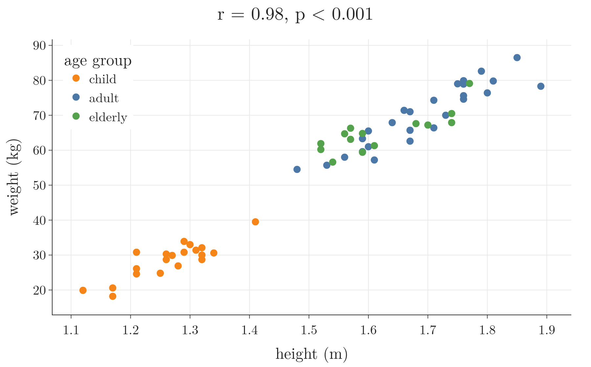
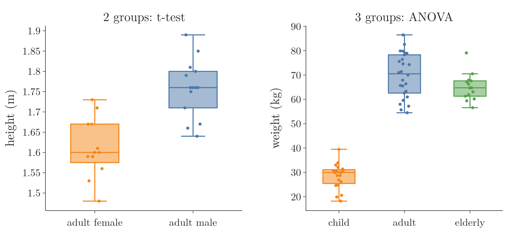

<!-- where-this-fits: generated by course_map/build_map.py; edit concepts.yaml, not this block -->
> **Where this fits:** Pipeline map steps 0 (Foundations), 3 (Understand data). See the [Course map](../../../00-course-map/00-course-map.md).
>
> 
>
> - **Builds on:** [Correlation](../../../ML/02-getting-data/ML-018-understanding-your-data/ML-018-understanding-your-data.md#91-correlation); [Student's t-distribution](../../../MA/04-inference/MA-037-t-procedure/MA-037-t-procedure.md#5-students-t-distribution); [Hypothesis testing: null and alternative](../../../MA/04-inference/MA-038-null-and-alternative-hypotheses/MA-038-null-and-alternative-hypotheses.md#4-the-alternative-hypothesis); [Z-test and rejection regions](../../../MA/04-inference/MA-039-rejection-region-and-z-test/MA-039-rejection-region-and-z-test.md#6-the-rejection-region-and-the-critical-value).
> - **Compare with:** [Chi-square tests](../../../ML/03-feature-engineering/ML-028-pipelines/ML-028-pipelines.md#1-overview); [One-way ANOVA](../../../MA/04-inference/MA-046-one-way-anova/MA-046-one-way-anova.md#1-overview).
<!-- /where-this-fits -->

## 1. Overview

> **Key point:** The kinds of features a question involves (categorical or numerical, one or two) decide which hypothesis test to run; every test then ends with the same rule, reject $H_0$ when $p \le \alpha$.


The earlier hypothesis-testing Notes built the z-test and three t-tests. Real questions come with data of many kinds: counts of men and women, heights, age groups. Figure 1 is the guide this Note follows: name the **features** (G-772) the question is about, and the test follows. A feature is a variable of the data, one column of the data table, such as gender or height.

This Note covers:

- the decision logic shared by every test, with three common misreadings;
- a small dataset with two categorical and two numerical features;
- one test for each kind of question: the one-sample proportion test, the chi-square test, the t-tests, the correlation test and ANOVA.

Two of these tests are new here and taught in full: the **one-sample proportion test** (G-1381) and the **correlation test** (G-489). The chi-square tests and ANOVA each get their own Note: [the chi-square statistic](../MA-045-chi-square-tests/MA-045-chi-square-tests.md#2-the-chi-square-statistic) and [the F statistic](../MA-046-one-way-anova/MA-046-one-way-anova.md#5-the-f-statistic).

## 2. One logic for every test

> **Key point:** State $H_0$ ("no difference") and $H_1$, fix $\alpha$ before looking, compute the p-value assuming $H_0$, and reject $H_0$ when $p \le \alpha$.

Every test in this Note follows the eight steps of a hypothesis test (see [the eight steps of a hypothesis test](../MA-038-null-and-alternative-hypotheses/MA-038-null-and-alternative-hypotheses.md#6-the-eight-steps-of-a-hypothesis-test)). In short:

1. **Hypotheses.** The **null hypothesis** $H_0$ (G-1361) says there is no difference or no relationship; the **alternative hypothesis** $H_1$ (G-193) says there is one.
2. **Significance level** (G-1801). Fix $\alpha$, usually 0.05, before running the test (see [the significance level](../MA-039-rejection-region-and-z-test/MA-039-rejection-region-and-z-test.md#5-how-rare-is-too-rare-the-significance-level)).
3. **Test.** Choose the test from the features involved (Figure 1) and compute its statistic.
4. **P-value.** The probability, if $H_0$ were true, of a result at least as extreme as ours (see [p-values](../MA-041-p-values/MA-041-p-values.md#2-definition)).
5. **Decision.** $p \le \alpha$: reject $H_0$. $p > \alpha$: fail to reject $H_0$.

With $\alpha = 0.05$ in a **two-tailed test** (G-2028), the **rejection region** (G-1662) is the outer 2.5% at each end of the test statistic's distribution, 5% in total (see [one-tailed and two-tailed tests](../MA-040-errors-power-and-tails/MA-040-errors-power-and-tails.md#5-one-tailed-and-two-tailed-tests)).

{width=80%}

Figure 2 previews the results of every test in this Note: the rule is the same, only the statistic behind each p-value differs.

### 2.1 Three misreadings to avoid

> **Key point:** $H_0$ is assumed, not known to be true; the p-value is not the probability that $H_1$ is true; and a large p-value does not let us "accept" $H_0$.

These three mix-ups are common enough to correct here; each is explained in the Note linked.

- **Misreading 1: $H_0$ is always true.** We **assume** $H_0$ while computing the p-value, as a starting point. The test exists because $H_0$ may be false.
- **Misreading 2: the p-value is the probability that $H_1$ is true.** The p-value is the probability of data this extreme if $H_0$ were true (see [reading a p-value correctly](../MA-041-p-values/MA-041-p-values.md#4-reading-a-p-value-correctly)). The p-value says nothing directly about how likely either hypothesis is.
- **Misreading 3: $p > 0.05$, so we accept $H_0$.** A large p-value means the sample gives too little evidence against $H_0$. We say we **fail to reject** $H_0$ (G-746); absence of evidence is not proof (see [the null hypothesis](../MA-038-null-and-alternative-hypotheses/MA-038-null-and-alternative-hypotheses.md#3-the-null-hypothesis)).

## 3. The example dataset

> **Key point:** 60 people with two categorical features (gender, age group) and two numerical features (height, weight); each pair of feature kinds leads to a different test.

We use one sample of 60 people with four features. Each person is one **observation** (G-1374; one record, a row of the table):

| gender | age_group | height (m) | weight (kg) |
|---|---|---|---|
| male | adult | 1.67 | 71.0 |
| male | adult | 1.76 | 75.6 |
| female | elderly | 1.57 | 63.1 |
| female | child | 1.29 | 33.9 |
| female | child | 1.17 | 18.2 |

The data is simulated (`data/make_people.py` builds `data/people.csv` with a fixed seed), so that every test has clean, reproducible numbers. The dataset has:

- **gender:** a categorical feature with two categories, 34 female and 26 male;
- **age_group:** a categorical feature with three categories, 20 child, 26 adult, 14 elderly;
- **height** and **weight:** numerical (continuous) features.

{width=85%}

Figure 3 shows the counts of the two categorical features, the raw material of Sections 4 and 5.

The dataset is a **sample**. A bar chart of gender shows the proportions in these 60 people; the test tells whether they say anything about the population the sample came from (see [population and sample](../../01-descriptive-stats/MA-004-what-is-statistics/MA-004-what-is-statistics.md#4-population-and-sample)).

## 4. One categorical feature: the one-sample proportion test

> **Key point:** Does the share of one category differ from a claimed value? Compare the sample proportion with the claim, in standard errors.

### 4.1 The question

> **Key point:** Is the proportion of men in the population different from 0.5?

With one categorical feature, the natural question is about proportions: is there a difference between the proportion of men and women? With two categories, the share of men $\pi$ settles the question. Here $\pi$ is a proportion (a number from 0 to 1), not the 3.14 of circles:

$$H_0: \pi = 0.5$$

$$H_1: \pi \neq 0.5$$

Our sample has 26 men out of 60, a **sample proportion** $\hat{p}$ (G-1726):

$$\hat{p} = 26/60 = 0.433$$

The sample proportion is below 0.5, but a sample of 60 can easily miss by that much.

### 4.2 The z statistic for a proportion

> **Key point:** The statistic $z$ is the distance of the sample proportion from the claim, in standard errors:
>
> $$z = \frac{\hat{p} - \pi_0}{\sqrt{\pi_0 (1 - \pi_0) / n}}$$

Our sample has 26 men in 60 people, so $\hat{p} = 0.433$, against a claim of 0.5. Is that gap big, or the kind of gap chance makes all the time? To judge, we ask how far the share of men would wander from 0.5 across many samples of 60, if the population really were 50/50. Then we measure our gap in those units of wandering. This unit is the **standard error** (G-1872). The number of standard errors between the sample proportion and the claim is the z statistic.

Figure 4 shows the idea. The bell curve is how the share of men would vary across samples of 60 if the population were 50/50. Our 0.433 sits close to the middle, so a gap this size is ordinary.

{width=85%}

Worked steps, one per line. First, give each person a 0/1 score: 1 for a man, 0 for a woman. The sample proportion is the mean of these 60 scores:

$$\hat{p} = \frac{26 \times 1 + 34 \times 0}{60} = \frac{26}{60} = 0.433$$

If the claim $\pi_0 = 0.5$ is true, each score has standard deviation (the Bernoulli standard deviation, see [the Bernoulli distribution](../../03-distributions/MA-031-bernoulli-and-binomial/MA-031-bernoulli-and-binomial.md#2-the-bernoulli-distribution)):

$$\sqrt{\pi_0 (1 - \pi_0)} = \sqrt{0.5 \times 0.5} = 0.5$$

The mean of $n = 60$ scores wanders by that standard deviation divided by $\sqrt{n}$ (see [sampling distributions](../MA-033-sampling-distribution-and-clt/MA-033-sampling-distribution-and-clt.md#3-sampling-distributions)). That is the standard error:

$$SE = \frac{0.5}{\sqrt{60}} = \frac{0.5}{7.746} = 0.0645$$

By the central limit theorem the sample proportion is close to normal for large $n$ (the [central limit theorem](../MA-033-sampling-distribution-and-clt/MA-033-sampling-distribution-and-clt.md#4-the-central-limit-theorem)), which is the bell curve in Figure 4, so the [z-test](../MA-039-rejection-region-and-z-test/MA-039-rejection-region-and-z-test.md#4-the-z-statistic-counting-standard-errors) applies. The gap, and the gap in standard errors:

$$\hat{p} - \pi_0 = 0.433 - 0.5 = -0.067$$

$$z = \frac{-0.067}{0.0645} = -1.03$$

The formal version names every symbol: $\hat{p}$ the sample proportion (0.433), $\pi_0$ the claimed proportion (0.5), $n$ the sample size (60).

$$z = \frac{\hat{p} - \pi_0}{\sqrt{\pi_0 (1 - \pi_0) / n}}$$

Check: the bottom is

$$\sqrt{0.25/60} = 0.0645$$

so

$$z = -0.067/0.0645 = -1.03$$

as above.

The standard error uses the claimed $\pi_0$, not $\hat{p}$: the test asks how the sample would behave if $H_0$ were true.

### 4.3 The decision

> **Key point:** $z = -1.03$ gives $p = 0.30 > 0.05$: we fail to reject $H_0$; the sample does not show that men and women occur in different proportions.

The test is two-tailed, so the p-value is both tails beyond $|z| = 1.03$:

$$p = 2\thinspace P(Z \ge 1.03) = 2 \times 0.151 = 0.30$$

Since $0.30 > 0.05$, we fail to reject $H_0$. A 26-to-34 split in 60 people is well within what a 50/50 population produces by chance.

In Figure 4 (section 4.2), the shaded tails are where the p-value comes from: our sample sits well inside the curve, so samples this far from 0.5 are common under $H_0$.

> **Python:** The z-test by hand, and scipy's exact version.
>
> ```python
> import numpy as np
> from scipy import stats
>
> p_hat, pi0, n = 26 / 60, 0.5, 60
> z = (p_hat - pi0) / np.sqrt(pi0 * (1 - pi0) / n)
> 2 * stats.norm.sf(abs(z))           # 0.30, z-test
> stats.binomtest(26, n=60, p=0.5)    # p = 0.37, exact
> ```

### 4.4 The exact version: the binomial test

> **Key point:** Under $H_0$ the number of men in 60 people is binomial; the p-value is the total probability of every count that is as rare as ours or rarer, on both sides.

The z-test replaces a bar chart by a smooth normal curve. We can also work with the bars themselves. If men and women are equally common, the number of men among 60 people follows the binomial distribution $B(60, 0.5)$ (see [the binomial distribution](../../03-distributions/MA-031-bernoulli-and-binomial/MA-031-bernoulli-and-binomial.md#3-the-binomial-distribution)). Figure 5 builds the p-value from it in three steps.

1. **All possible results.** Each bar is the probability of one count of men, from 0 to 60. The most likely count is 30.
2. **Our result.** We saw 26 men. The probability of exactly 26 is 0.061.
3. **Everything as rare or rarer.** A p-value counts every result that would surprise us at least as much: 26 or fewer men (0.183), and on the other side 34 or more (0.183). Together $p = 0.37$.

{height=50%}

Testing a proportion this way is the **binomial test** (G-2246), also called the exact test, because no normal approximation is used; `stats.binomtest` computes it. Both versions lead to the same decision here: 0.37 and 0.30 are far above 0.05. The z version is good when $n\pi_0$ and $n(1 - \pi_0)$ are both at least 5 (NIST Handbook §7.2.4); here both are 30. For a small sample, use the binomial test.

> **Extra:** With three or more categories (child, adult, elderly against claimed shares), one proportion no longer describes the feature. The test for that case is the **chi-square goodness-of-fit test** (see [the goodness-of-fit test](../MA-045-chi-square-tests/MA-045-chi-square-tests.md#4-the-goodness-of-fit-test)).

## 5. Two categorical features: the chi-square test

> **Key point:** Does the proportion of men differ between age groups? Two categorical features are tested with the chi-square test of independence.

Adding a second categorical feature changes the question: is there a difference between the proportion of men and women **across age groups**? Equivalently: are gender and age group related?

- $H_0$: gender and age group are independent (the share of men is the same in every age group);
- $H_1$: they are related.

The counts go in a **contingency table** (G-464), as in the [contingency tables](../../02-probability/MA-013-venn-diagrams-and-contingency-tables/MA-013-venn-diagrams-and-contingency-tables.md#3-contingency-tables); pandas builds it with `pd.crosstab` (see [two categorical columns](../../../ML/02-getting-data/ML-020-bivariate-multivariate-analysis/ML-020-bivariate-multivariate-analysis.md#7-heatmap-two-categorical-columns)):

| | child | adult | elderly |
|---|---|---|---|
| female | 12 | 12 | 10 |
| male | 8 | 14 | 4 |

The **chi-square test of independence** (G-380) compares each count with the count expected if gender and age group were independent. Row totals are 34 women and 26 men; column totals are 20 children, 26 adults and 14 elderly, out of 60. The expected count of a cell is its row total times its column total divided by 60. For example, the women who are children:

$$34 \times 20 / 60 = 11.33$$

Each cell then contributes (observed minus expected) squared, divided by expected:

| | child | adult | elderly |
|---|---|---|---|
| female | $(12 - 11.33)^2 / 11.33 = 0.04$ | $(12 - 14.73)^2 / 14.73 = 0.51$ | $(10 - 7.93)^2 / 7.93 = 0.54$ |
| male | $(8 - 8.67)^2 / 8.67 = 0.05$ | $(14 - 11.27)^2 / 11.27 = 0.66$ | $(4 - 6.07)^2 / 6.07 = 0.70$ |

The six contributions add up to $\chi^2 = 2.50$, with $p = 0.29$. Since $0.29 > 0.05$, we fail to reject $H_0$: the sample does not show that the gender mix changes with age group.

{width=75%}

Figure 6 shows the three shares from the table. They differ, from 4 in 14 to 14 in 26, but with groups this small the differences are within chance. How the statistic is built is the subject of [the chi-square statistic](../MA-045-chi-square-tests/MA-045-chi-square-tests.md#2-the-chi-square-statistic).

## 6. One numerical feature: the one-sample t-test

> **Key point:** Does the mean height differ from a known earlier value? One numerical feature against a claimed mean is the one-sample t-test.

Our sample's mean height is 1.533 m. An earlier sample from the same population had a mean of 1.55 m. Is there a difference?

$$H_0: \mu = 1.55$$

$$H_1: \mu \neq 1.55$$

The question calls for the **one-sample t-test** (G-1382) of [the one-sample t-test](../MA-042-one-sample-t-test/MA-042-one-sample-t-test.md#4-the-one-sample-t-test). It works like the proportion test: measure the gap between the sample mean and the claimed mean in standard errors. Here $\bar{x} = 1.5327$ m is the sample mean, $\mu_0 = 1.55$ the claimed mean, $s = 0.211$ the sample standard deviation and $n = 60$. One step per line:

$$\bar{x} - \mu_0 = 1.5327 - 1.55 = -0.0173$$

$$SE = \frac{s}{\sqrt{n}} = \frac{0.211}{\sqrt{60}} = \frac{0.211}{7.746} = 0.0273$$

$$t = \frac{\bar{x} - \mu_0}{s / \sqrt{n}} = \frac{-0.0173}{0.0273} = -0.64$$

The t statistic has $n - 1 = 59$ degrees of freedom, and $p = 0.53$.

We fail to reject $H_0$: the mean height is consistent with 1.55 m. Figure 7 shows why. Under $H_0$, the t statistic follows **Student's t-distribution** (G-1906) with 59 **degrees of freedom** (G-578). Our $t = -0.64$ sits near the middle of it, well short of the 5% rejection region beyond $\pm 2.00$, and the two tails at least that far out hold 53% of the area.



## 7. Two numerical features: the correlation test

> **Key point:** Are height and weight related? Pearson's $r$ measures the relationship; the correlation test asks whether $r$ is far enough from 0 to rule out chance.

### 7.1 Correlation as a test

> **Key point:** $H_0$: the population correlation $\rho$ is 0, no linear relationship; $H_1$: $\rho \neq 0$.

**Pearson's correlation coefficient** $r$ (G-1474) runs from $-1$ to $+1$; a value near 0 means no linear relationship (see [correlation](../../01-descriptive-stats/MA-009-covariance-and-correlation/MA-009-covariance-and-correlation.md#4-correlation)). But $r$ comes from a sample. Two unrelated features give a small non-zero $r$ in a sample by chance, so we test:

$$H_0: \rho = 0 \ \text{(no relationship)}$$

$$H_1: \rho \neq 0$$

Here $\rho$ (rho) is the **population correlation** (G-1522), and $r$ is its estimate from the sample.

### 7.2 The test statistic

> **Key point:** The statistic $t$ is the sample correlation divided by its standard error, compared with a t-distribution with $n - 2$ degrees of freedom:
>
> $$t = r\sqrt{n - 2}/\sqrt{1 - r^2}$$

Start with a puzzle. Draw any two points: a straight line passes through both, so $r$ is exactly $+1$ or $-1$ (see [correlation of two points](../../01-descriptive-stats/MA-009-covariance-and-correlation/MA-009-covariance-and-correlation.md#4-correlation)). So the same $r$ must count for more when it comes from many pairs than from few. The test statistic has to use both $r$ and the number of pairs $n$.

The plan is the same as for every test: the gap from 0 divided by its standard error. The gap is $r - 0 = r$. Under $H_0$, $r$ wanders around 0, and the wander shrinks as $n$ grows.

Figure 8 shows this. We keep $r = 0.30$ and add pairs. Each extra pair raises $t$ and narrows the t-distribution, so the statistic slides out towards the tail. From 44 pairs on, it lands in the rejection region (the red tails).


Where does the standard error of $r$ come from? Standardize both features (subtract the mean, divide by the standard deviation), so each has mean 0 and variance 1, and fit the straight line $\hat y = b\thinspace x$. Its slope is $b = r$. The line explains the share $r^2$ of the variation of $y$, and leaves the share $1 - r^2$ unexplained. Three steps, one per line:

$$\text{unexplained spread of } y = \frac{(n - 1)(1 - r^2)}{n - 2}$$

The $n - 2$ is there because the line used up 2 numbers.

$$\sum x_i^2 = n - 1 \quad (\text{standardized } x \text{ has variance 1})$$

$$SE(r) = \sqrt{\frac{\text{unexplained spread}}{\sum x_i^2}}$$

$$= \sqrt{\frac{1 - r^2}{n - 2}}$$

This is the standard error of a regression slope, with the slope equal to $r$ here. (Montgomery and Runger 2014, Section 11-4 for the slope's standard error and Section 11-8 for this test.) A bigger $n$ makes $SE(r)$ smaller, and a bigger $r^2$ makes it smaller too.

Now the worked numbers: $r = 0.30$ from $n = 30$ pairs.

$$1 - r^2 = 1 - 0.09 = 0.91$$

$$SE(r) = \sqrt{\frac{0.91}{30 - 2}} = \sqrt{0.0325} = 0.1803$$

$$t = \frac{r}{SE(r)} = \frac{0.30}{0.1803} = 1.66$$

With 28 degrees of freedom ($n - 2$), the p-value is:

$$p = 0.11$$

So $r = 0.30$ from 30 pairs is **not** significant at 5%. The same $r = 0.30$ from 100 pairs has:

$$SE(r) = \sqrt{0.91/98} = 0.0964$$

$$t = 0.30/0.0964 = 3.11$$

The p-value is 0.002, so it is significant. Sample size matters as much as the size of $r$.

The formal version: moving $\sqrt{n - 2}$ from the bottom of $SE(r)$ to the top gives the usual form. With $r$ the sample correlation, $n$ the number of pairs and $df$ the **degrees of freedom** (G-578),

$$t = \frac{r}{\sqrt{(1 - r^2)/(n - 2)}}$$

$$= \frac{r\sqrt{n - 2}}{\sqrt{1 - r^2}}$$

$$df = n - 2$$

Check:

$$0.30 \times \sqrt{28} / \sqrt{0.91}$$

$$= 0.30 \times 5.29 / 0.954 = 1.66$$

as above. Under $H_0$ this statistic follows Student's t-distribution (see [the t-procedure](../MA-037-t-procedure/MA-037-t-procedure.md#5-students-t-distribution)) with $n - 2$ degrees of freedom. So the correlation test is itself a t-test.

### 7.3 Height and weight

> **Key point:** $r = 0.98$ from 60 people gives $p < 0.001$: height and weight are strongly related.

{height=32%}

Figure 9 shows a tight upward pattern. Here $r = 0.980$ and $n = 60$. One step per line:

$$1 - r^2 = 1 - 0.961 = 0.039$$

$$SE(r) = \sqrt{\frac{0.039}{60 - 2}} = \sqrt{0.000672} = 0.0259$$

$$t = \frac{0.980}{0.0259} \approx 37.8$$

The same value from the other form of the formula, one step per line:

$$\sqrt{58} = 7.616$$

$$0.980 \times 7.616 = 7.46$$

$$\sqrt{0.039} = 0.197$$

$$7.46 / 0.197 = 37.8$$

The computer, using the unrounded $r$, reports 37.9.

$$df = 58$$

$$p = 1.2 \times 10^{-42}$$

We reject $H_0$: taller people in this population are heavier.

> **Python:** `pearsonr` returns $r$ and the p-value of the correlation test.
>
> ```python
> result = stats.pearsonr(people["height"], people["weight"])
> result.statistic     # r = 0.980
> result.pvalue        # 1.2e-42
> ```

> **Extra:** Part of this $r$ comes from the gap between children and adults in Figure 9: two clouds far apart make a long line. The notebook tests this by dropping everyone but the adults: $r$ falls from 0.98 to 0.92, lower but still strong. A significant correlation is also not causation (see [correlation does not imply causation](../../01-descriptive-stats/MA-009-covariance-and-correlation/MA-009-covariance-and-correlation.md#5-correlation-does-not-imply-causation)).

## 8. One numerical and one categorical feature: t-test or ANOVA

> **Key point:** A numerical feature compared across the groups of a categorical feature: two groups need a t-test, three or more need ANOVA.

### 8.1 Two groups: the two-sample t-test

> **Key point:** Do adult men and adult women differ in mean height? Two independent groups: the two-sample t-test.

Gender has two categories, so comparing the height of adult men and women is the independent two-sample t-test (see [the two-sample t-test](../MA-043-two-sample-and-paired-t-tests/MA-043-two-sample-and-paired-t-tests.md#2-the-independent-two-sample-t-test)). With 14 men (mean 1.758 m) and 12 women (mean 1.612 m):

The statistic is the gap between the two means divided by its standard error, as in section 6; software computes it from the 26 heights (the steps are in the linked Note):

$$t = 5.18$$

$$df = 24$$

$$p = 0.00003$$

We reject $H_0$: adult men and women differ in mean height. If the two measurements came from the same subjects (weight before and after a diet), the paired t-test of the same Note applies instead.

### 8.2 Three or more groups: ANOVA

> **Key point:** Does mean weight differ between children, adults and the elderly? Three groups: one-way ANOVA.

Age group has three categories. **One-way ANOVA** (G-1389; analysis of variance) tests whether all three group means are equal:

$$H_0: \mu_{\text{child}} = \mu_{\text{adult}} = \mu_{\text{elderly}}$$

$$H_1: \text{at least one mean differs}$$

The mean weights are 28.5, 69.8 and 65.0 kg. ANOVA computes $F$ as the spread between the group means divided by the spread inside the groups, from the individual weights (the nine-mark example of the linked Note shows every step), and gives $F = 203$ and $p < 0.001$, so we reject $H_0$. The [one-way ANOVA](../MA-046-one-way-anova/MA-046-one-way-anova.md#5-the-f-statistic) builds the F statistic and explains why three t-tests would not do.

The two tests of this section are one method. ANOVA also works with two groups, and on the adult heights of section 8.1 it gives $F = 26.9$ with $p = 0.00003$: the same p-value as the t-test, and $F = t^2 = 5.18^2$. A two-sample t-test is one-way ANOVA with two groups.

{width=95%}

Figure 10 shows both comparisons as [box plots](../../01-descriptive-stats/MA-008-percentiles-and-box-plots/MA-008-percentiles-and-box-plots.md#6-reading-box-plots): each box holds the middle half of one group, the line inside it is the group's median, and each dot is one person. On the left the two boxes do not overlap; on the right the child group sits far below the other two, which is why both tests reject $H_0$.

> **Extra:** With one numerical feature and **two** categorical features (weight by gender and age group together), the test is **two-way ANOVA**. Two-way ANOVA asks about each categorical feature and about their interaction (Montgomery, ch. 5).

## 9. Summary

| Features in the question | Test | Result here | What it tells us |
|---|---|---|---|
| one categorical, 2 categories | one-sample proportion test | share of men: $z = -1.03$, $p = 0.30$ | fail to reject: a 26-to-34 split is ordinary for a 50/50 population |
| one categorical, 3+ categories | chi-square goodness of fit | see [the goodness-of-fit test](../MA-045-chi-square-tests/MA-045-chi-square-tests.md#4-the-goodness-of-fit-test) | whether the category shares match claimed ones |
| two categorical | chi-square test of independence | gender by age group: $\chi^2 = 2.50$, $p = 0.29$ | fail to reject: no evidence the gender mix changes with age group |
| one numerical | one-sample t-test | mean height: $t = -0.64$, $p = 0.53$ | fail to reject: the mean height is consistent with 1.55 m |
| two numerical | correlation test | height and weight: $r = 0.98$, $p < 0.001$ | reject: taller people are heavier |
| numerical + 2 groups | two-sample t-test | adult height by gender: $p = 0.00003$ | reject: adult men and women differ in mean height |
| numerical + 3+ groups | one-way ANOVA | weight by age group: $F = 203$, $p < 0.001$ | reject: mean weight differs between the age groups |

- The kinds of features decide the test; the decision rule is always $p \le \alpha$ $\Rightarrow$ reject $H_0$, so naming the features is the first step and the last step never changes.
- $H_0$ is assumed while computing $p$; the p-value is not the probability of $H_1$; a large $p$ means "fail to reject", not "accept", because a large $p$ only shows too little evidence against $H_0$.
- The one-sample proportion test is a z-test on $\hat{p}$ with standard error $\sqrt{\pi_0(1 - \pi_0)/n}$, because $\hat{p}$ is the mean of 0/1 scores, so the central limit theorem makes it close to normal.
- The correlation test is a t-test on $r$ with $n - 2$ degrees of freedom; a weak $r$ needs a large sample to be significant, because the standard error of $r$ shrinks as $n$ grows ($r = 0.30$ is not significant from 30 pairs but is from 100).
- This answers the opening question: the kinds of features in the question pick the test, and every test ends with the same rule, reject $H_0$ when $p \le \alpha$.

## 10. Sources

**Built from**

- Krish Naik, "Tutorial 32- All About P Value,T test,Chi Square Test, Anova Test and When to Use What?", YouTube, https://www.youtube.com/watch?v=YrhlQB3mQFI
- Starmer, J. (StatQuest), "The Binomial Distribution and Test, Clearly Explained!!!", YouTube, https://www.youtube.com/watch?v=J8jNoF-K8E8
- Starmer, J. (StatQuest), "Using Linear Models for t tests and ANOVA, Clearly Explained!!!", YouTube, https://www.youtube.com/watch?v=R7xd624pR1A

**Other references**

- Montgomery, D. C. and Runger, G. C. (2014). *Applied Statistics and Probability for Engineers*, 6th ed. Wiley. Section 11-4, standard error of the slope; Section 11-8, testing for zero correlation.
- Montgomery, D. C. (2013). *Design and Analysis of Experiments*, 8th ed. Wiley. Chapter 5, factorial designs.
- NIST/SEMATECH (2012). *e-Handbook of Statistical Methods*. itl.nist.gov/div898/handbook. Section 7.2.4, testing a proportion (normal approximation when $\min(Np_0, N(1-p_0)) \ge 5$).

## 11. Key terms

| Term | Meaning |
|---|---|
| One-sample proportion test | A test of whether the share (proportion) of one category in the population equals a claimed value $\pi_0$, using a z statistic (a z-test). |
| Sample proportion $\hat{p}$ | The share of a sample that falls in one category, written $\hat{p}$, such as 26 men out of 60; it estimates that share in the whole population. |
| Binomial test (exact test) (G-2246) | A test of a proportion that adds up binomial probabilities of every count as rare as the observed one or rarer |
| Correlation test | A t-test of whether a sample correlation $r$ is strong enough to show that two numerical features are correlated in the population ($H_0: \rho = 0$). It uses $t = r\sqrt{n-2}/\sqrt{1-r^2}$ with $n - 2$ degrees of freedom. |
| Population correlation $\rho$ | The correlation between two features in the whole population; $r$ estimates it |
| Two-way ANOVA | ANOVA for one numerical feature and two categorical features |
