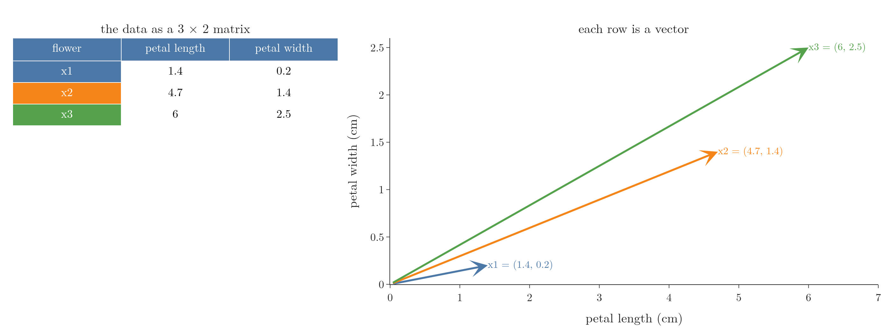
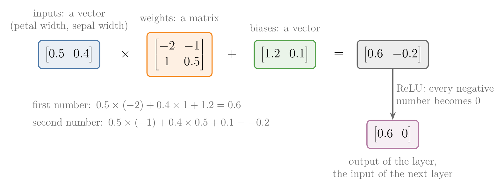
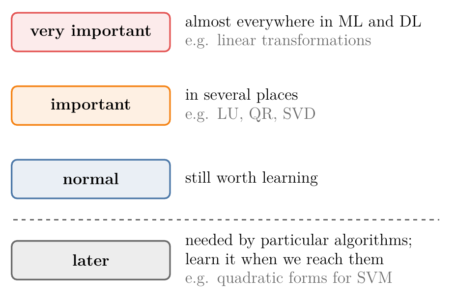

<!-- where-this-fits: generated by course_map/build_map.py; edit concepts.yaml, not this block -->
> **Where this fits:** Pipeline map step 0 (Foundations). See the [Course map](../../../00-course-map/00-course-map.md).
>
> 
>
<!-- /where-this-fits -->

## 1. Overview

> **Key point:** Linear algebra for ML splits into eight modules: scalars, vectors, matrices, tensors, eigenvalues and eigenvectors, matrix factorisation, advanced topics, and tools.

{height=62%}

Figure 1 shows the whole map. For each module this Note says:

- what it covers;
- why ML needs it;
- which topics can wait;
- where each topic is taught.

## 2. Why ML needs linear algebra

> **Key point:** Statistics and linear algebra are the two pillars of ML: statistics is how we see the data, linear algebra does the heavy lifting.

The first pillar, statistics, has its own [roadmap Note](../../01-descriptive-stats/MA-003-statistics-roadmap/MA-003-statistics-roadmap.md). If statistics is the eyes of an ML engineer, linear algebra is the hands and feet: it stores the data and does every calculation on it.

Figure 2 shows the starting point on real data. Three iris flowers form a table of numbers, a **matrix** (G-1180); each row of that table is a **vector** (G-2081), an arrow from the origin in the space of the features. Every ML algorithm works on such matrices and vectors.

{height=32%}

Why ML needs it (high dimensions, data as numbers, GPU speed) is explained in section 6 of the [vectors and feature vectors Note](../MA-048-vectors-and-feature-vectors/MA-048-vectors-and-feature-vectors.md).

### 2.1 A neural network is matrix maths

> **Key point:** One layer of a neural network is three steps of linear algebra: multiply a vector by a matrix, add a vector, and set the negative numbers to 0.

The models do their work with the same objects. Figure 3 follows one iris flower through one layer of a **neural network** (G-1316), with numbers picked by hand so that every step can be checked:

1. **Multiply.** The flower is the vector $[0.5, 0.4]$: its petal width and its sepal width. The layer's **weights** (G-2106) form a matrix. Multiplying the vector by the matrix gives two new numbers, each a sum of the inputs times one column of weights. In Figure 3 the weight matrix has the rows $[-2, -1]$ and $[1, 0.5]$, so, one entry per line:

   $$0.5 \times (-2) + 0.4 \times 1 = -1 + 0.4 = -0.6$$

   $$0.5 \times (-1) + 0.4 \times 0.5 = -0.5 + 0.2 = -0.3$$
2. **Add.** The layer's **biases** (G-284) form a second vector, added number by number. With the biases $[1.2, 0.1]$:

   $$-0.6 + 1.2 = 0.6, \qquad -0.3 + 0.1 = -0.2$$

   The result is $[0.6, -0.2]$.
3. **Cut.** The **ReLU** (G-1668) function turns every negative number into 0, which leaves $[0.6, 0]$.

The next layer repeats the same three steps on $[0.6, 0]$ with its own weights and biases. A whole network is this chain of matrix products and vector additions, which the [forward propagation Note](../../../DL/01-basics/DL-010-forward-propagation/DL-010-forward-propagation.md) works through in full.

{width=95%}

### 2.2 Two ways to know linear algebra

> **Key point:** Knowing how to compute a result and knowing what the result means are two different skills; the computer does the first, we need the second.

Every topic on the roadmap can be known in two ways:

- **Numerically:** how to carry out the operation, such as multiplying two matrices or finding an eigenvalue by hand.
- **Geometrically:** what the operation does to arrows and to space, such as a matrix turning and stretching every vector.

The numeric skill carries a calculation through. The geometric skill tells us which tool fits a problem, why the tool works and how to read its result. NumPy does the numeric half for us (section 4.8), so the geometric half is the one worth our time. The maths Notes that follow therefore start each topic from its picture and then give the numbers.

## 3. How to read the roadmap

> **Key point:** Each topic is marked by importance, and topics needed only by a few algorithms are marked "later".

{width=65%}

Figure 4 is the key to the marks; everything above the dashed line is worth covering in one go.

The roadmap marks every topic in three ways:

- **Importance.** A *very important* topic appears almost everywhere in ML and DL; an *important* topic appears in several places; a *normal* topic is still worth learning.
- **"Later".** A few specialised topics are needed only by particular algorithms. We can skip them now and learn them when we reach that algorithm. Most of them sit in the last modules.
- **Why it matters.** Every topic comes with a one-line description and where ML and DL use it. For example, vectors represent data points in ML, and features, weights and biases in DL.

Everything not marked "later" is worth covering in one go before moving deep into ML and DL.

## 4. The eight modules

> **Key point:** Vectors and matrices are the core; tensors, eigenvectors and factorisations build on them; a few advanced topics wait until an algorithm needs them.

{width=85%}

Figure 5 shows what each module looks like once we study it; the subsection numbers match the captions.

### 4.1 Scalars

> **Key point:** A scalar is a plain number.

**Scalars** (G-1743) are ordinary numbers such as 2, 5 or -6, and the arithmetic on them. The [tensors Note](../../../ML/01-foundations/ML-010-tensors/ML-010-tensors.md) places them as 0D tensors. They need no separate study.

### 4.2 Vectors

> **Key point:** Vectors are where linear algebra starts, and where ML data starts: every observation of a dataset is a vector.

Each **observation** (G-1374; one record, one row of the data table) is a vector. This module tries to cover everything about vectors that ML uses:

| Topic | Why ML needs it | Where it is taught |
|---|---|---|
| What vectors are, components, dimension | every data point is a vector | [Vectors and feature vectors Note](../MA-048-vectors-and-feature-vectors/MA-048-vectors-and-feature-vectors.md) |
| Types of vectors (row, column, ...) | data and parameters are written as rows or columns | [Vectors and feature vectors Note](../MA-048-vectors-and-feature-vectors/MA-048-vectors-and-feature-vectors.md) |
| Distance from origin (magnitude) | the length of a vector | [Magnitude, distance and scalar operations Note](../MA-049-magnitude-distance-and-scalar-operations/MA-049-magnitude-distance-and-scalar-operations.md) |
| Euclidean distance | KNN, K-means, recommender systems | [KNN imputer Note](../../../ML/04-missing-data-and-outliers/ML-038-knn-imputer/ML-038-knn-imputer.md), [magnitude Note](../MA-049-magnitude-distance-and-scalar-operations/MA-049-magnitude-distance-and-scalar-operations.md) |
| Operations with a scalar | shifting and scaling data, mean centring | [Magnitude, distance and scalar operations Note](../MA-049-magnitude-distance-and-scalar-operations/MA-049-magnitude-distance-and-scalar-operations.md) |
| Operations between two vectors, dot product | similarity, projection, matrix multiplication | [Dot product and cosine similarity Note](../MA-050-dot-product-and-cosine-similarity/MA-050-dot-product-and-cosine-similarity.md) |
| Equation of a line in n dimensions | linear models: linear and logistic regression, SVM | [Equation of a hyperplane Note](../MA-051-equation-of-a-hyperplane/MA-051-equation-of-a-hyperplane.md) |
| Vector norms | regularisation | norm in the [SVM maths Note](../../../ML/07-classification/ML-087-svm-maths/ML-087-svm-maths.md); penalties in the [Ridge](../../../ML/06-regression/ML-062-ridge-regression-intuition/ML-062-ridge-regression-intuition.md) and [Lasso](../../../ML/06-regression/ML-066-lasso-regression/ML-066-lasso-regression.md) Notes |
| Vector spaces | the setting for everything above | a later maths Note |

### 4.3 Matrices

> **Key point:** Matrices come in two parts: the school-level mechanics, then the intuition of what a matrix does.

The first part is the mechanics taught in school mathematics (classes 11 and 12): what matrices are, types of matrices, operations with a scalar and with a vector, the inverse and the determinant.

The second part is conceptual: the rank of a matrix, column space, change of basis, solving a system of linear equations, linear transformations, and the dot product seen as the engine of matrix multiplication. **Linear transformations** (G-1097) are marked very important.

So far, the inverse appears in the [normal equation](../../../ML/06-regression/ML-053-multiple-lr-maths/ML-053-multiple-lr-maths.md) of linear regression, and the idea of a matrix as a transformation in the [PCA step by step Note](../../../ML/05-dimensionality/ML-047-pca-step-by-step/ML-047-pca-step-by-step.md) (section 4.1). Linear transformations are taught in the [linear transformations and matrices Note](../MA-053-linear-transformations-and-matrices/MA-053-linear-transformations-and-matrices.md), matrix multiplication in the [matrix multiplication as composition Note](../MA-054-matrix-multiplication-as-composition/MA-054-matrix-multiplication-as-composition.md), and the determinant in the [eigenvectors and eigenvalues Note](../MA-056-eigenvectors-and-eigenvalues/MA-056-eigenvectors-and-eigenvalues.md).

### 4.4 Tensors

> **Key point:** Tensors are super important for deep learning, and for representing any kind of data.

What a **tensor** (G-1957) is, and how tables, text, images and videos become tensors, is taught in the [tensors Note](../../../ML/01-foundations/ML-010-tensors/ML-010-tensors.md).

### 4.5 Eigenvalues and eigenvectors

> **Key point:** Eigenvectors are the directions a matrix only stretches; PCA is built on them.

Anyone who has studied PCA has met **eigenvalues** (G-665) and **eigenvectors** (G-666). They are taught in the [PCA step by step Note](../../../ML/05-dimensionality/ML-047-pca-step-by-step/ML-047-pca-step-by-step.md) (section 4), and in depth in the [eigenvectors and eigenvalues Note](../MA-056-eigenvectors-and-eigenvalues/MA-056-eigenvectors-and-eigenvalues.md).

### 4.6 Matrix factorisation

> **Key point:** Factorising a matrix splits it into simpler matrices; LU, QR, eigen-decomposition and SVD are the ones ML meets.

**Matrix factorisation** (G-1177), or **decomposition**, writes one matrix as a product of simpler ones. Four techniques are marked important: LU decomposition, QR decomposition, eigen-decomposition and SVD (singular value decomposition). Eigen-decomposition appears in the [PCA step by step Note](../../../ML/05-dimensionality/ML-047-pca-step-by-step/ML-047-pca-step-by-step.md) and the [eigenvectors and eigenvalues Note](../MA-056-eigenvectors-and-eigenvalues/MA-056-eigenvectors-and-eigenvalues.md); SVD starts in the [SVD geometry Note](../MA-057-svd-geometry/MA-057-svd-geometry.md); LU and QR come in a later maths Note.

> **Extra:** Where these show up. scikit-learn's Ridge can solve its equation with SVD (`solver="svd"`, see the [Ridge gradient descent Note](../../../ML/06-regression/ML-064-ridge-gradient-descent/ML-064-ridge-gradient-descent.md)). Least-squares problems can be solved through a QR factorisation (Trefethen and Bau 1997, Lecture 11, Algorithm 11.2), and recommender systems use SVD-like factorisations of the user-item rating matrix to predict missing ratings (Koren, Bell and Volinsky 2009).

### 4.7 Advanced topics

> **Key point:** Quadratic forms and the pseudo-inverse are needed only by particular algorithms, so they can wait.

- **Quadratic forms** (G-1597) are used heavily when solving SVMs (see the [SVM maths Note](../../../ML/07-classification/ML-087-svm-maths/ML-087-svm-maths.md)).
- The **Moore-Penrose pseudo-inverse** (G-1262) gives an inverse for matrices that are not square, or that have no ordinary inverse. The [multiple linear regression maths Note](../../../ML/06-regression/ML-053-multiple-lr-maths/ML-053-multiple-lr-maths.md) mentions why libraries need it.

Both come in a later maths Note.

### 4.8 Tools and libraries

> **Key point:** NumPy is how linear algebra is done in Python; SciPy adds more.

All linear algebra in the ML and DL world runs through **NumPy** (G-1369), so a strong command of it pays off everywhere. **SciPy** (G-1751), built on NumPy, adds more routines; it is used less, but we should know it exists.

> **Python:** NumPy's linear algebra lives in `np.linalg`.
>
> ```python
> import numpy as np
>
> v = np.array([3, 4])
> np.linalg.norm(v)              # 5.0: length of v
> A = np.array([[2, 1], [1, 3]])
> np.linalg.inv(A)               # inverse of A
> np.linalg.eig(A)               # eigenvalues, eigenvectors
> ```
>
> Figure 6 draws what the last lines compute: the length of $v$ is 5, and $A$ has eigenvalues 1.38 and 3.62, so it stretches its two eigenvectors by those factors without turning them.

![Left: v = (3, 4) has length 5. Right: A = [[2, 1], [1, 3]] stretches its eigenvectors (thick arrows) by its eigenvalues 1.38 and 3.62 (thin arrows), along the same lines.](images/numpy_outputs.png){height=34%}

## 5. Resources

> **Key point:** The 3Blue1Brown series for intuition, Gilbert Strang for depth, and chapter 2 of the *Deep Learning* book as a summary.

**Lesson series:**

- **Sanderson, G., *Essence of Linear Algebra*, 3Blue1Brown, 3blue1brown.com.** An animated series that builds the geometric intuition for vectors, matrices and transformations. Each lesson is dense, so it pays to go through it more than once.
- **Strang, G., *18.06 Linear Algebra*, MIT OpenCourseWare, ocw.mit.edu.** About 35 lectures by a renowned professor. The course covers far more than ML needs, but it is the place for depth.

**Books:**

- **Gilbert Strang, *Introduction to Linear Algebra*.** The book behind his lectures.
- **NCERT mathematics textbooks (classes 11 and 12).** Light on intuition, but they cover the school-level topics well.
- **Goodfellow, Bengio and Courville, *Deep Learning*, chapter 2.** A compact summary of all the linear algebra deep learning needs; worth reading twice.

**Online courses:**

- **Khan Academy, Linear Algebra.**
- **Coursera, Mathematics for Machine Learning: Linear Algebra** (Imperial College London).

The vectors Notes that follow this one cover the first module in depth; the rest of the matrix and eigen topics come in later maths Notes.

> **Extra:** One more free book worth knowing: *Mathematics for Machine Learning* by Deisenroth, Faisal and Ong (mml-book.github.io). Its chapters 2 to 4 (Linear Algebra, Analytic Geometry, Matrix Decompositions) cover the vectors, matrices, eigenvalues and factorisations of this roadmap, including SVD in section 4.5.

## 6. Summary

| Module | What it covers | Status |
|---|---|---|
| Scalars | plain numbers | no study needed |
| Vectors | components, distance, operations, dot product, hyperplanes, norms | core |
| Matrices | mechanics, then rank, spaces, linear transformations | core |
| Tensors | data of any shape | core for DL |
| Eigenvalues and eigenvectors | directions a matrix only stretches | needed for PCA |
| Matrix factorisation | LU, QR, eigen-decomposition, SVD | important |
| Advanced topics | quadratic forms, pseudo-inverse | later |
| Tools | NumPy, SciPy | throughout |

- Statistics and linear algebra are the two pillars of ML and DL.
- Learn the unmarked topics in one go; leave the "later" topics until an algorithm needs them.
- For every topic, know where ML uses it.

## 7. Sources

**Built from**

- CampusX, "Linear Algebra Roadmap for Machine Learning and Deep Learning | Complete Guide | CampusX", YouTube, https://www.youtube.com/watch?v=rIsCKVyh4dI
- Sanderson, G. (3Blue1Brown), "Essence of linear algebra preview", YouTube, https://www.youtube.com/watch?v=kjBOesZCoqc
- Starmer, J. (StatQuest), "Essential Matrix Algebra for Neural Networks, Clearly Explained!!!", YouTube, https://www.youtube.com/watch?v=ZTt9gsGcdDo

**Other references**

- Trefethen, L. N. and Bau, D. (1997). *Numerical Linear Algebra*. SIAM. Lecture 11, "Least squares problems", Algorithm 11.2.
- Koren, Y., Bell, R. and Volinsky, C. (2009). "Matrix factorization techniques for recommender systems." *IEEE Computer* 42(8), 30–37.
- Deisenroth, M. P., Faisal, A. A. and Ong, C. S. (2020). *Mathematics for Machine Learning*. Cambridge University Press. Chapters 2–4; §4.5.

## 8. Key terms

| Term | Meaning |
|---|---|
| Matrix factorisation (decomposition) | Writing a matrix as a product of simpler matrices |
| SVD (singular value decomposition) (G-1813) | A factorisation that works for any matrix, square or not |
| Quadratic form | An expression like $x^{\mathsf T}Ax$: a sum of squared and cross terms of a vector's components |
| Moore-Penrose pseudo-inverse (G-1262) | A generalised inverse for matrices that are not square or have no inverse |
| NumPy | Python's library for arrays and linear algebra |
| SciPy | A library built on NumPy with more scientific routines |
