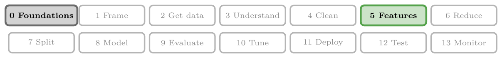
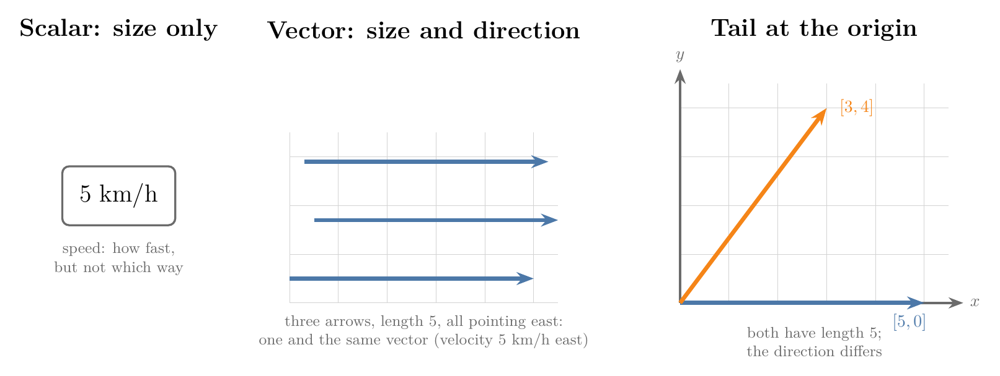
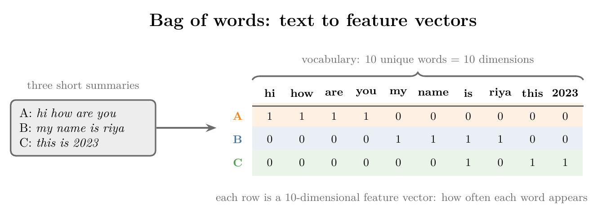
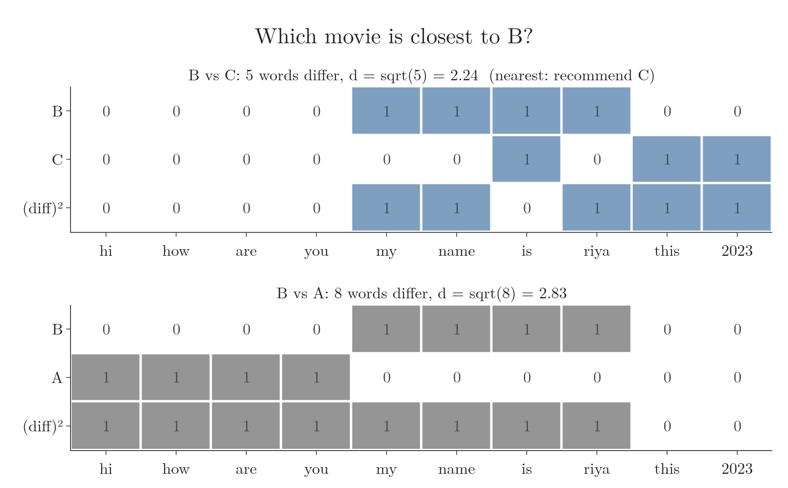
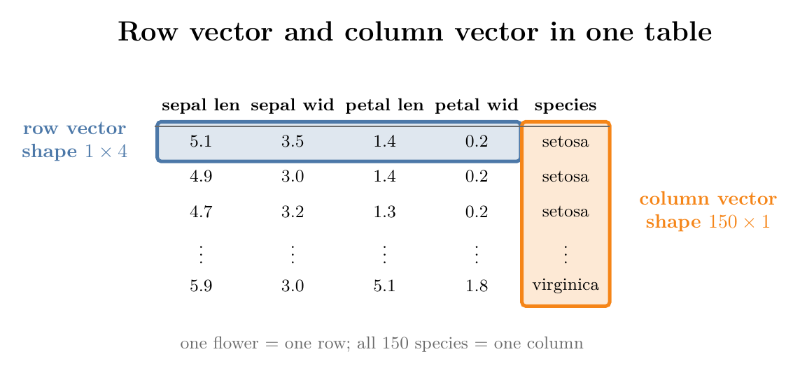
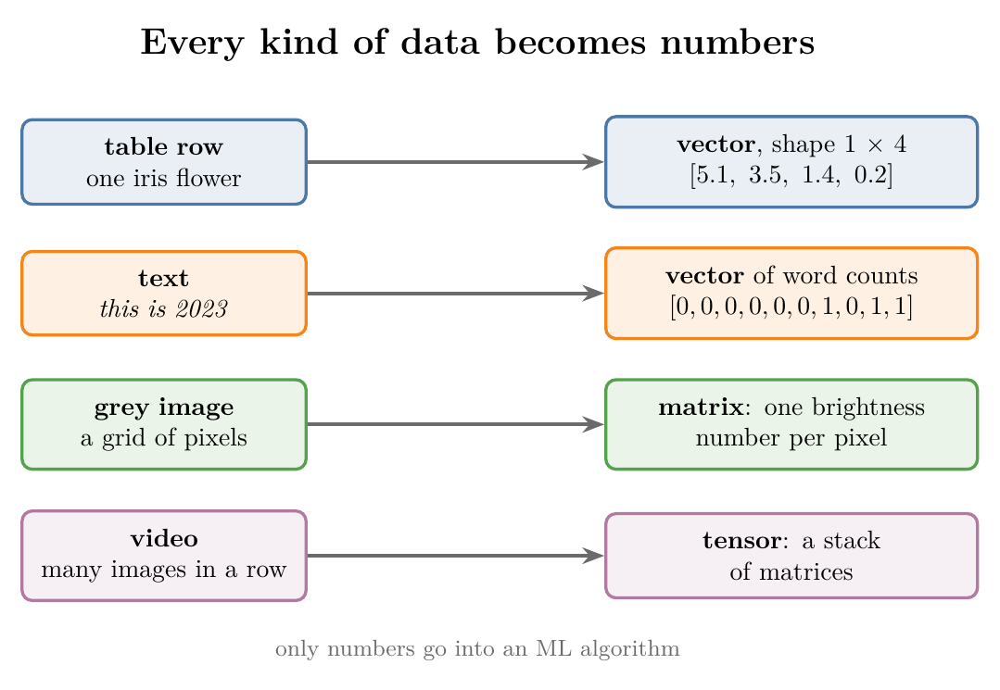

<!-- where-this-fits: generated by course_map/build_map.py; edit concepts.yaml, not this block -->
> **Where this fits:** Pipeline map steps 0 (Foundations), 5 (Engineer features). See the [Course map](../../../00-course-map/00-course-map.md).
>
> 
>
> - **Builds on:** Tensors ([Note ML-010](../../../ML/01-foundations/ML-010-tensors/ML-010-tensors.md)).
> - **Leads to:** Vector magnitude, distance and scalar operations ([Note MA-049](../../../MA/05-linear-algebra/MA-049-magnitude-distance-and-scalar-operations/MA-049-magnitude-distance-and-scalar-operations.md)); Dot product ([Note MA-050](../../../MA/05-linear-algebra/MA-050-dot-product-and-cosine-similarity/MA-050-dot-product-and-cosine-similarity.md)); Linear combinations, span and basis ([Note MA-052](../../../MA/05-linear-algebra/MA-052-linear-combinations-span-and-basis/MA-052-linear-combinations-span-and-basis.md)); Latent semantic analysis ([Note MA-060](../../../MA/05-linear-algebra/MA-060-svd-in-machine-learning/MA-060-svd-in-machine-learning.md)).
> - **Compare with:** One-hot encoding ([Note ML-026](../../../ML/03-feature-engineering/ML-026-one-hot-encoding/ML-026-one-hot-encoding.md)).
<!-- /where-this-fits -->

## 1. Overview

> **Key point:** A vector is an arrow with its tail at the origin; its tip is a point, and the point's coordinates are a list of numbers. In ML, every observation is turned into such a list, called a feature vector.

![The vector a = [3, 4]: 3 units along x, then 4 units along y](images/vector_point.png){height=42%}

Figure 1 shows the simplest vector there is: an arrow in a 2D plane from the origin to the point reached by moving 3 units along $x$ and 4 along $y$. **Linear algebra** (G-1090), the maths of vectors and matrices, is built on this object. This Note covers, in order:

- what a vector is: a size and a direction, an arrow, a point and a list (section 2);
- how every observation of a dataset becomes a feature vector (section 3), even a piece of text (section 4);
- the two ways of writing a vector, as a row or as a column (section 5);
- what linear algebra is, and why ML needs it (section 6).

## 2. What a vector is

> **Key point:** A vector has a size and a direction. We draw it as an arrow from the origin, read its tip as a point, and write that point as a list of numbers, one per axis.

### 2.1 Size and direction

> **Key point:** A number alone (a speed) is a scalar; a number with a direction (a velocity) is a vector.

Say a car moves at 5 km/h. That one number tells us how fast, but not which way. A single number like this is a **scalar** (G-1743). Now say the car moves at 5 km/h to the east. We have added a direction, and the pair "how much, which way" is a **vector** (G-2081). Speed is a scalar; velocity, speed with a direction, is a vector.

We draw a vector as an arrow. The length of the arrow is its size, called its **magnitude** (G-1028); the way the arrow points is its **direction** (G-613). In Figure 2, the left panel is the scalar: one number, no arrow. The middle panel draws "5 km/h east" three times, at three different places. All three arrows have length 5 and point east, so they are the same vector: only the size and the direction count, not where the arrow is drawn.



Linear algebra adds one habit. To compare vectors easily, it always draws the arrow with its tail at the **origin** (G-2240), the point where the axes cross (Figure 2, right). The arrow $[5, 0]$ moves 5 along $x$ and nothing along $y$: 5 km/h east. The arrow $[3, 4]$ has the same length, 5, but a different direction. How to compute that length is the topic of the [magnitude, distance and scalar operations Note](../MA-049-magnitude-distance-and-scalar-operations/MA-049-magnitude-distance-and-scalar-operations.md).

### 2.2 Three views: arrow, list and point

> **Key point:** The same vector can be read as an arrow, as an ordered list of numbers, or as the point at the arrow's tip; ML mostly starts from the list.

A vector can be seen in three ways:

1. **An arrow** in space, with a length and a direction (section 2.1). This is the physics view.
2. **An ordered list of numbers.** This is the computer-science view, and the one ML starts from. A student in a placement table might be described by two numbers, CGPA and IQ. The pair $[8, 80]$ is a 2-dimensional vector; "2-dimensional" just means the list has two numbers.
3. **Anything that can be added and scaled.** This is the mathematician's view. It only says that two operations, adding two vectors and multiplying a vector by a number, are what linear algebra is about. The [magnitude, distance and scalar operations Note](../MA-049-magnitude-distance-and-scalar-operations/MA-049-magnitude-distance-and-scalar-operations.md) and the [linear combinations, span and basis Note](../MA-052-linear-combinations-span-and-basis/MA-052-linear-combinations-span-and-basis.md) teach them.

Linear algebra is useful because we can move between the first two views. Figure 3 takes the student's list $[8, 80]$ and turns it into a picture: walk 8 along the CGPA axis, then 80 up the IQ axis. The point we reach is the student; the arrow from the origin to that point is the vector.

![One student's list [CGPA, IQ] = [8, 80] read as walking instructions, drawn as an arrow from the origin, and written as a column. Swapping the order gives a CGPA of 80, which cannot exist. Idea after 3Blue1Brown, "Vectors | Chapter 1"](images/student_vector.gif){height=50%}

At the end of Figure 3, watch the swapped list $[80, 8]$: it would mean a CGPA of 80, a student who cannot exist. The order of a list matters: the first number always means CGPA and the second always means IQ.

Many arrows at once make a crowded picture. So when we have many vectors, as in a dataset, we draw only the point at each arrow's tip. A vector and a point are then the same thing: the point is the tip of the arrow from the origin.

### 2.3 Coordinates: walking instructions

> **Key point:** The numbers of a vector, its components, say how far to walk along each axis from the origin to the tip; we write them in a column.

Start with 2D coordinate geometry from school: a horizontal $x$-axis, a vertical $y$-axis and the origin where they meet, with tick marks one unit apart. In Figure 1, the point $(3, 4)$ means: from the origin, move 3 units in the $x$ direction, then 4 units in the $y$ direction. The arrow from the origin to that point is the **vector** (G-2079) $a = [3, 4]$, with its tail at the origin and its head at the point.

The individual numbers of a vector are its **components** (G-429), also called its **coordinates** (G-2241). They are walking instructions:

1. The first component says how far to walk along the $x$-axis: positive to the right, negative to the left.
2. The second says how far to walk parallel to the $y$-axis after that: positive up, negative down.

Here 3 is the x-component and 4 is the y-component. For $[-2, 1]$ we would walk 2 to the left, then 1 up.

Every pair of numbers gives exactly one vector, and every vector gives exactly one pair. To tell a vector from a plain point, linear algebra books write the pair vertically in square brackets:

$$a = \begin{bmatrix} 3 \cr4 \end{bmatrix}$$

This column form, and the row form $[3, 4]$ used in this Note's running text, are compared in section 5.

> **Another way to see it:** Read from the tip, a vector is simply a point in a coordinate system: the point $(3, 4)$ is reached by moving 3 along $x$ and 4 along $y$, and the arrow is just the path from the origin to it. For a dataset with thousands of points, the point picture is the practical one.

### 2.4 From 2D to n dimensions

> **Key point:** A 3D vector has three components, one per axis; an n-dimensional vector has n.

Linear algebra always lets us start in small dimensions and grow:

- **3D:** add a third axis, the $z$-axis, at right angles to both $x$ and $y$. A vector now has three components, $a = [a_1, a_2, a_3]$: walk along $x$, then parallel to $y$, then parallel to $z$. Every triple of numbers gives one vector in space, and every vector gives one triple.
- **nD:** a vector in an $n$-dimensional space has $n$ components, $x = [x_1, x_2, \dots, x_n]$.

![The first iris flower's first three features, [5.1, 3.5, 1.4], reached one axis at a time](images/vector_walk.gif)

Figure 4 builds a 3D vector the same way as Figures 1 and 3: watch the vector fill in one component per axis walked, so three components need three axes. We cannot draw the $n$-dimensional case, but nothing about the vector changes.

The **dimension** (G-610) of a vector is the dimension of the coordinate system it lives in, which is its number of components. A vector in 2D space has dimension 2; in 3D, dimension 3; in $n$-dimensional space, dimension $n$. This dimension is the same "dimension of a vector" as in the [tensors Note](../../../ML/01-foundations/ML-010-tensors/ML-010-tensors.md) (section 5): the number of items in it, not the number of axes of the tensor.

In ML we usually write a vector in square brackets with its components separated by commas: $[x_1, x_2, \dots, x_n]$ is an $n$-dimensional vector.

## 3. Feature vectors

> **Key point:** The features of one observation form a feature vector; an ML model takes feature vectors in and gives predictions out.

### 3.1 The iris flowers

> **Key point:** Each of the 150 iris flowers becomes a 4-dimensional vector of its measurements.

The iris dataset, a classic first ML dataset, describes 150 flowers with five columns. Four are measurements in centimetres: sepal length, sepal width, petal length and petal width. The fifth is the species: setosa, versicolor or virginica.

Each flower is one **observation** (G-1374) (one record, one row of the table). The four measurements are the features; the species is the **target** (G-1949) (the output we predict; see the [types of ML Note](../../../ML/01-foundations/ML-003-types-of-ml/ML-003-types-of-ml.md)). The first flower in the dataset has measurements 5.1, 3.5, 1.4 and 0.2, and is a setosa.

A **feature vector** (G-771) is the vector formed by the feature values of one observation. For the first flower it is

$$x = [5.1,\ 3.5,\ 1.4,\ 0.2]$$

a vector in 4-dimensional space. To ask a model for this flower's species, we hand it this vector; the model works on it and returns a prediction, here "setosa". Every flower becomes its own feature vector, so the dataset is 150 feature vectors. The student $[8, 80]$ of Figure 3 was already a feature vector, with CGPA and IQ as its two features.

{height=48%}

We cannot draw 4D, so Figure 5 drops petal width and plots the other three features. Each of the 150 flowers is now a point in 3D, that is, a vector; two of them are drawn as arrows from the origin. Flowers of the same species sit close together, and that closeness alone is enough to tell the species apart. The Notebook tests this: predicting each flower's species as that of its nearest other flower (in all four dimensions) is right for 96.0% of the 150 flowers. With the species shuffled at random, so that closeness says nothing about species, the same rule is right only 34.7% of the time, about the one in three of a blind guess.

### 3.2 Feature vectors hold only numbers

> **Key point:** Text values such as "male" or "S" must be encoded as numbers before they can go into a feature vector.

The same works for any table. In the Titanic dataset, a passenger could be described by age, fare, sex, passenger class and port of embarkation: a 5-dimensional feature vector. But a feature vector is a collection of numbers; it cannot hold words like "male" or "S".

So we encode the text values as numbers. Say male = 0 and female = 1, and the ports Q, C and S are 0, 1 and 2. A 17-year-old male passenger who paid a fare of 52 in first class and embarked at S becomes

$$x = [17,\ 52,\ 0,\ 1,\ 2]$$

The encodings themselves are taught in the [ordinal and label encoding Note](../../../ML/03-feature-engineering/ML-025-ordinal-label-encoding/ML-025-ordinal-label-encoding.md) and the [one-hot encoding Note](../../../ML/03-feature-engineering/ML-026-one-hot-encoding/ML-026-one-hot-encoding.md).

> **Extra:** Coding Q, C and S as 0, 1 and 2 tells a model that S is "twice" C, which means nothing. The scikit-learn user guide (scikit-learn §8.3.4) warns that estimators would read such integer codes "as being ordered, which is often not desired", and offers one-hot encoding as the alternative for a feature with no natural order.

## 4. Text as vectors: a movie recommender

> **Key point:** Bag of words turns each text into a vector of word counts; similar texts become nearby vectors, so "recommend a similar movie" becomes "find the nearest vector".

### 4.1 The problem

> **Key point:** We have only movie names and summaries, and must recommend movies similar to the one a user picks.

A recommender system suggests items a user is likely to like. Suppose a user names a movie, say *The Matrix*, and we must recommend five similar movies, as streaming services do. Our data has just two columns: the movie's name and a short summary of its plot.

The summaries are text, and ML algorithms do not work with text. So we must turn every summary into numbers: into a feature vector.

### 4.2 Bag of words

> **Key point:** List every unique word (the vocabulary); each text becomes a vector with one count per vocabulary word.

There are many techniques for this in **NLP** (G-1305) (natural language processing, the part of ML that works with text). The simplest is **bag of words** (G-250):

1. Collect the vocabulary (see the [tensors Note](../../../ML/01-foundations/ML-010-tensors/ML-010-tensors.md)): every unique word in all the texts.
2. Give each vocabulary word one dimension.
3. Turn each text into a vector that counts how often each vocabulary word appears in it.

Take three toy "summaries": A = *hi how are you*, B = *my name is riya*, C = *this is 2023*. Their vocabulary has 10 unique words, so each summary becomes a 10-dimensional vector (Figure 6). We cannot draw 10 dimensions, but we can imagine them the same way we imagine 3D.



Real data is much bigger. With 5,000 movies the vocabulary might hold 50,000 words: we get 5,000 feature vectors, one per movie, each a vector in a 50,000-dimensional space. The idea is exactly the same.

> **Extra:** The order of the words is thrown away, which is why the method is called a "bag" of words: *dog bites man* and *man bites dog* get the same vector. The [tensors Note](../../../ML/01-foundations/ML-010-tensors/ML-010-tensors.md) (section 6.2) shows a different method, one-hot vectors per word, which keeps the order.

### 4.3 Recommending by distance

> **Key point:** Movies whose vectors lie close together have similar summaries, so we recommend the nearest ones.

Now every movie is a point in the same space. If a user likes movie B, we recommend the movie whose vector lies closest to B. Using the straight-line (Euclidean) distance from the [KNN imputer Note](../../../ML/04-missing-data-and-outliers/ML-038-knn-imputer/ML-038-knn-imputer.md):

1. **In words:** count the words that appear in one text but not the other; each adds $1^2 = 1$ to the sum of squares; take the square root.
2. **Formula:**
   $$d(u, v) = \sqrt{(u_1 - v_1)^2 + \dots + (u_{10} - v_{10})^2}$$
3. **Example:** the vocabulary order is *hi, how, are, you, my, name, is, riya, this, 2023*, so $B = [0, 0, 0, 0, 1, 1, 1, 1, 0, 0]$ and $C = [0, 0, 0, 0, 0, 0, 1, 0, 1, 1]$. Component by component, the difference $B - C$ and its square:

   | Word | hi | how | are | you | my | name | is | riya | this | 2023 |
   |---|---|---|---|---|---|---|---|---|---|---|
   | $B - C$ | 0 | 0 | 0 | 0 | 1 | 1 | 0 | 1 | $-1$ | $-1$ |
   | square | 0 | 0 | 0 | 0 | 1 | 1 | 0 | 1 | 1 | 1 |

   The squares add to 5 (the shared word *is* gives 0), so
   $$d(B, C) = \sqrt{5} \approx 2.24$$
   A and B share no word, so each of A's 4 words gives $1^2 = 1$ and each of B's 4 words gives $1^2 = 1$, a sum of 8:
   $$d(A, B) = \sqrt{8} \approx 2.83$$



In Figure 7, count the shaded cells in each "(diff)²" row: 5 for C, 8 for A. C is closer to B than A is, so a user who likes B gets C. Many real recommender systems work on exactly this idea:

1. turn items into high-dimensional vectors;
2. compute distances between them;
3. recommend the nearest.

The [dot product and cosine similarity Note](../MA-050-dot-product-and-cosine-similarity/MA-050-dot-product-and-cosine-similarity.md) gives a better measure of closeness for text.

> **Python:** Bag of words in scikit-learn.
>
> ```python
> from sklearn.feature_extraction.text import CountVectorizer
>
> texts = ["hi how are you", "my name is riya", "this is 2023"]
> cv = CountVectorizer()
> X = cv.fit_transform(texts).toarray()
> print(cv.get_feature_names_out())   # the vocabulary
> print(X)                            # one row per text
> ```
>
> `CountVectorizer` sorts the vocabulary alphabetically, so its columns come in a different order from Figure 6; the distances do not change. The Notebook for this Note (`notebook.ipynb`) runs the whole recommender.

## 5. Row vectors and column vectors

> **Key point:** The same vector can be written as a row (shape 1 x n) or as a column (shape n x 1); when nothing is said, a vector means a column.

A vector can be written in two ways. The components are the same; only the layout differs.

- A **row vector** (G-1714) writes the components side by side. Its shape is $1 \times n$: one row, $n$ columns.
  $$a = \begin{bmatrix} a_1 & a_2 & \cdots & a_n \end{bmatrix}$$
- A **column vector** (G-416) writes them one below the other. Its shape is $n \times 1$: $n$ rows, one column.
  $$b = \begin{bmatrix} b_1 \cr b_2 \cr\vdots \cr b_n \end{bmatrix}$$

Seeing the shape $1 \times n$ or $n \times 1$, we know at once which kind a vector is.



Both appear in the iris table (Figure 8). One flower's feature vector, $[5.1, 3.5, 1.4, 0.2]$, is a row of the table: a row vector of shape $1 \times 4$. One whole column of the table, such as the species of all 150 flowers, is a column vector of shape $150 \times 1$. In short: a row of the table is a row vector, a column of the table is a column vector. All the rows stacked together, one feature vector per observation, form the **data matrix** (G-536) of the [linear transformations and matrices Note](../MA-053-linear-transformations-and-matrices/MA-053-linear-transformations-and-matrices.md) (section 7.1).

In ML we use either form, depending on what a calculation needs. When a book or a formula says "vector" without saying which, it means a column vector. Turning a column into a row is called the transpose (see the [PCA step by step Note](../../../ML/05-dimensionality/ML-047-pca-step-by-step/ML-047-pca-step-by-step.md)); it becomes important for the dot product in the [dot product and cosine similarity Note](../MA-050-dot-product-and-cosine-similarity/MA-050-dot-product-and-cosine-similarity.md).

> **Python:** NumPy's plain 1D array has no row or column form; its shape is just `(n,)`. To make the form explicit, give it two axes.
>
> ```python
> import numpy as np
>
> x = np.array([5.1, 3.5, 1.4, 0.2])   # shape (4,)
> row = x.reshape(1, -1)               # shape (1, 4)
> col = x.reshape(-1, 1)               # shape (4, 1)
> ```
>
> `-1` tells NumPy to work out that size itself.

## 6. What linear algebra is, and why ML needs it

> **Key point:** Linear algebra studies vectors, matrices and the linear equations written with them; ML needs it because it works the same in any number of dimensions and turns every kind of data into numbers.

So far we have moved back and forth between lists of numbers and pictures of arrows. That translation is what makes linear algebra useful to a data analyst: thousands of lists become one picture of points in space, where patterns can be seen.

### 6.1 What linear algebra is

> **Key point:** Linear algebra is the branch of mathematics that studies linear equations and the objects used to write them: scalars, vectors, matrices and tensors.

Linear algebra (G-1090) is the branch of mathematics that deals with linear systems: sets of equations in which every variable appears only multiplied by a number and added up, such as $2x + 3y = 7$. We meet its first flavour in school, when we solve two equations in two unknowns.

Linear algebra is one of the most foundational subjects in mathematics; computer science, engineering, physics and economics all use it. Linear algebra studies four kinds of objects, each introduced in the [tensors Note](../../../ML/01-foundations/ML-010-tensors/ML-010-tensors.md):

- **Scalars:** single numbers, such as 2, 5 or -6.
- **Vectors:** 1D collections of numbers.
- **Matrices:** 2D collections of numbers.
- **Tensors:** collections in any number of dimensions.

### 6.2 Working in high dimensions

> **Key point:** What holds in 2D and 3D holds in any number of dimensions; linear algebra gives us the eyes we lack beyond 3D.

We can picture at most three dimensions. ML data rarely stops there.

Take predicting salary from years of experience. The data is 2D, and linear regression draws a line through it. Add a **feature** (G-772) (an input variable, one column of the data table) for education marks and the data becomes 3D: we can still picture the plane that fits it (see the [multiple linear regression Note](../../../ML/06-regression/ML-052-multiple-linear-regression/ML-052-multiple-linear-regression.md)). Add one more feature, or ten, and we can no longer picture anything.

Linear algebra solves this. Its ideas are written so that whatever is true in 2D and 3D stays true in $n$ dimensions: the line becomes a plane, and the plane becomes a hyperplane, with the same kind of equation. Datasets with 5,000 features are common, and linear algebra handles them the same way it handles two.

### 6.3 Representing data

> **Key point:** Tables, text, images and video can all be written as vectors, matrices and tensors, and ML algorithms only accept such objects.

ML meets many kinds of data: tables, text, images, even video. An algorithm can only learn from numbers, so each kind must first be written as a vector, matrix or tensor. Linear algebra is what makes this representation possible; once the data is in that form, any ML algorithm can take it in and make predictions.



In Figure 9, watch the right-hand column: whatever the data was, only numbers come out.

Linear algebra also suits the hardware. Its operations apply the same step to many numbers at once, which is what GPUs are built for: Goodfellow, Bengio and Courville (2016, §12.1.2) explain that graphics cards are designed for a high degree of parallelism, for example multiplying many vertices by the same matrix at once, and that neural networks need the same performance characteristics. Most modern neural network implementations run on GPUs for this reason.


## 7. Summary

| Idea | What it is | Example |
|---|---|---|
| Scalar | A single number: a size with no direction | a speed of 5 km/h |
| Vector | An arrow from the origin with a size and a direction; its tip is a point, its coordinates a list | $[3, 4]$ |
| Component | One number of a vector | 3 (x-component) |
| Dimension | Number of components | $[3, 4]$ has dimension 2 |
| Feature vector | The feature values of one observation | $[5.1, 3.5, 1.4, 0.2]$ |
| Bag of words | Text as word counts over a vocabulary | *this is 2023* $\rightarrow$ 10-dimensional vector |
| Row vector | Components side by side, shape $1 \times n$ | one flower |
| Data matrix | The feature vectors of a dataset stacked as rows |
| Column vector | Components stacked, shape $n \times 1$ | one column of the table |

- Linear algebra matters for ML because it works in any number of dimensions and can represent any data as numbers.
- A model takes feature vectors in and gives predictions out; feature vectors hold only numbers, so text must be encoded first.
- Similar items have nearby vectors, which is the basis of many recommender systems.

## 8. Sources

**Built from**

- CampusX, "Supercharge Your ML Journey: Mastering Vectors in Linear Algebra - Part 1", YouTube, https://www.youtube.com/watch?v=mQewAJb8oJ8
- CampusX, "Session on Linear Algebra for Machine Learning", YouTube, https://www.youtube.com/watch?v=e9h-ZZ_ahRg
- Sanderson, G. (3Blue1Brown), "Vectors | Chapter 1, Essence of linear algebra", 2016, https://www.youtube.com/watch?v=fNk_zzaMoSs
- Khan Academy, "Vector intro for linear algebra | Vectors and spaces | Linear Algebra | Khan Academy", YouTube, https://www.youtube.com/watch?v=br7tS1t2SFE

**Other references**

- Goodfellow, I., Bengio, Y. and Courville, A. (2016). *Deep Learning*. MIT Press. §12.1.2 "GPU Implementations".
- scikit-learn developers. *User Guide*, §8.3.4 "Encoding categorical features". scikit-learn.org, preprocessing.html.

## 9. Key terms

| Term | Meaning |
|---|---|
| Linear algebra | The branch of mathematics that studies linear equations, vectors and matrices |
| Scalar | A single number, with a size but no direction (a speed) |
| Vector (geometric view) | An arrow from the origin with a magnitude and a direction; its tip is a point in a coordinate system |
| Magnitude (G-1028) | The length of a vector's arrow: its size |
| Direction | The way a vector's arrow points |
| Origin (G-2240) | The point where the axes cross; the tail of every vector in linear algebra |
| Coordinates (of a vector) (G-2241) | Its components read as walking instructions from the origin to the tip |
| Component | One number of a vector, how far to walk along one axis |
| Dimension of a vector | The dimension of the space it lives in: its number of components |
| Feature vector | The vector of feature values of one observation |
| Recommender system (G-1644) | A system that suggests items a user is likely to like |
| NLP (G-1305) | Natural language processing: ML on text |
| Bag of words | Turning a text into a vector of word counts over the vocabulary |
| Row vector | A vector written as one row, shape $1 \times n$ |
| Data matrix | The feature vectors of a dataset stacked as rows |
| Column vector | A vector written as one column, shape $n \times 1$; the default meaning of "vector" |
