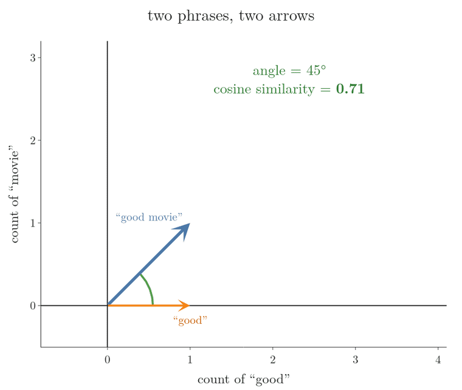
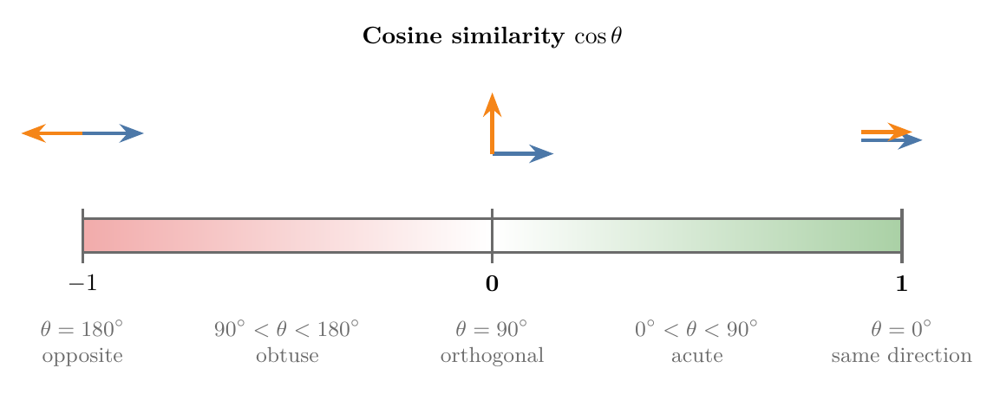
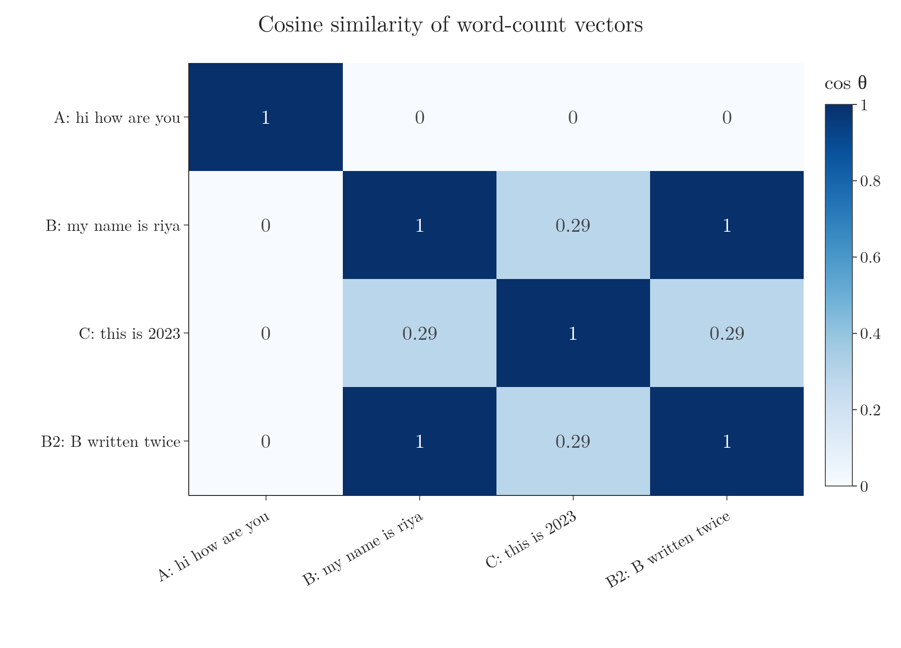

<!-- where-this-fits: generated by course_map/build_map.py; edit concepts.yaml, not this block -->
> **Where this fits:** Pipeline map steps 0 (Foundations), 8 (Model). See the [Course map](../../../00-course-map/00-course-map.md).
>
> 
>
> - **Builds on:** [Vectors and feature vectors](../../../MA/05-linear-algebra/MA-048-vectors-and-feature-vectors/MA-048-vectors-and-feature-vectors.md#2-what-a-vector-is).
> - **Leads to:** [Support vector machines](../../../ML/07-classification/ML-086-svm-intuition/ML-086-svm-intuition.md#9-sources); [Equation of a hyperplane](../../../MA/05-linear-algebra/MA-051-equation-of-a-hyperplane/MA-051-equation-of-a-hyperplane.md#4-the-vector-form); [Matrix multiplication as composition](../../../MA/05-linear-algebra/MA-054-matrix-multiplication-as-composition/MA-054-matrix-multiplication-as-composition.md#9-sources); [Perceptron](../../../DL/01-basics/DL-004-perceptron/DL-004-perceptron.md#3-the-parts-of-a-perceptron); [Meaning as direction in embedding space](../../../DL/06-transformers/DL-072-meaning-as-direction/DL-072-meaning-as-direction.md#1-overview).
> - **Compare with:** [Vector magnitude, distance and scalar operations](../../../MA/05-linear-algebra/MA-049-magnitude-distance-and-scalar-operations/MA-049-magnitude-distance-and-scalar-operations.md#2-magnitude-the-distance-from-the-origin).
<!-- /where-this-fits -->

## 1. Overview

> **Key point:** The dot product multiplies two vectors into one number; that number equals the two lengths times the cosine of the angle between them, so it measures how much two vectors point the same way.


Figure 1 shows the whole idea. As $b$ turns away from $a$, the dot product $a \cdot b$ falls from its largest value (same direction) through 0 (right angle) to negative values (pointing apart). This Note:

- computes the dot product and states its laws (section 3);
- lists what it is used for (section 4);
- explains this geometric meaning (section 5);
- turns it into cosine similarity, the standard way to compare texts in a recommender system (section 6).

Vectors (lists of numbers), magnitudes (lengths) and distances are covered in [what a vector is](../MA-048-vectors-and-feature-vectors/MA-048-vectors-and-feature-vectors.md#2-what-a-vector-is), [magnitude](../MA-049-magnitude-distance-and-scalar-operations/MA-049-magnitude-distance-and-scalar-operations.md#2-magnitude-the-distance-from-the-origin) and [Euclidean distance](../MA-049-magnitude-distance-and-scalar-operations/MA-049-magnitude-distance-and-scalar-operations.md#3-euclidean-distance).

## 2. Products of two vectors

> **Key point:** Two vectors have two products: the dot product gives a scalar, the cross product gives a vector; ML mostly uses the dot product.

Vectors can be multiplied, but not in the ordinary sense. There are two products of two vectors:

- The **dot product** (G-634), also called the **scalar product** (G-1742), because its result is a scalar (a single number).
- The **cross product** (G-506), also called the **vector product**, because its result is a vector (a list of numbers).

ML uses the dot product almost everywhere, and the cross product rarely. This Note is about the dot product.

> **Extra:** The usual cross product is defined for 3D vectors. For two 3D vectors it gives a third vector perpendicular to both, whose length is the area of the parallelogram they span. ML meets it only in a few places.

## 3. Computing the dot product

> **Key point:** Multiply matching components, then add the products.

**In plain words.** A vector is a list of numbers, such as $[1, 2, 3]$. The dot product turns two equal-length lists into one number by pairing them up. Think of a shop bill. The list $a = [1, 2, 3]$ is how many pens, notebooks and erasers you buy; the list $b = [4, 5, 6]$ is the price of one of each, in rupees. The bill is the quantity times the price for each item, added up. That bill is the dot product (Figure 2 builds it one pair at a time).

**Worked example**, one line per item:

| Item | Quantity (from $a$) | Price (from $b$) | Product |
|---|---|---|---|
| Pen | 1 | 4 | 4 |
| Notebook | 2 | 5 | 10 |
| Eraser | 3 | 6 | 18 |
| **Bill** | | | $4 + 10 + 18 = 32$ |

[Projecting one point](../../../ML/05-dimensionality/ML-047-pca-step-by-step/ML-047-pca-step-by-step.md#21-projecting-one-point) in PCA (principal component analysis, a method that finds the main directions of a dataset) defined the dot product as "multiply matching components and add". A component is one entry of the list. The standard term is the **dot product** (G-634).

**The formal version.** For two lists of $n$ numbers, $a$ and $b$, write $a_1$ for the first number of $a$ (here $a_1 = 1$), $a_2$ for the second ($a_2 = 2$), and so on up to $a_n$ ($n = 3$ here). The dot between the two vectors is the symbol of the dot product, and $\sum$ means "add up the terms for $i = 1$ to $n$":

$$a \cdot b = a_1 b_1 + a_2 b_2 + \dots + a_n b_n$$

$$a \cdot b = \sum_{i=1}^{n} a_i b_i$$

Check with the bill, one product per line:

$$a_1 b_1 = 1 \times 4 = 4$$

$$a_2 b_2 = 2 \times 5 = 10$$

$$a_3 b_3 = 3 \times 6 = 18$$

$$\text{total} = 4 + 10 + 18 = 32$$

Both vectors must have the same number of components; otherwise some component would have no partner. Figure 2 builds the sum one pair at a time: each green product is one row of the table, and the last frame is the bill, 32.

![The dot product of [1, 2, 3] and [4, 5, 6], one pair of components at a time: the products 4, 10 and 18 (green) add up to 32.](images/dot_steps.gif){height=30%}

### 3.1 The dot product as a matrix product

> **Key point:** A row of shape 1 x n times a column of shape n x 1 gives a 1 x 1 result: the dot product. So $a \cdot b = a^{\mathsf T} b$.

The dot product can also be written as a matrix multiplication. Write $a$ as a row vector (shape $1 \times n$) and $b$ as a column vector (shape $n \times 1$), as in [row vectors and column vectors](../MA-048-vectors-and-feature-vectors/MA-048-vectors-and-feature-vectors.md#5-row-vectors-and-column-vectors).


The school rule of matrix multiplication says a $1 \times n$ matrix can multiply an $n \times 1$ matrix because the inner sizes match, and the result has the outer sizes: $1 \times 1$, a single number (Figure 3). Each entry of the row meets its partner in the column, the products are added, and the result is exactly the dot product.

By default a vector is a column. So to put $a$ in the row position we **transpose** (G-2012) it, and write

$$a \cdot b = a^{\mathsf T} b$$

For $a = [1, 2, 3]$ and $b = [4, 5, 6]$, the row times the column is, one step per line:

$$a^{\mathsf T} b = \begin{bmatrix} 1 & 2 & 3 \end{bmatrix} \begin{bmatrix} 4 \cr5 \cr6 \end{bmatrix}$$

$$= 1 \times 4 + 2 \times 5 + 3 \times 6$$

$$= 32$$

This form, $a^{\mathsf T}b$, appears throughout the inner workings of ML algorithms, such as $u^{\mathsf T}x$ in [the projection step of PCA](../../../ML/05-dimensionality/ML-047-pca-step-by-step/ML-047-pca-step-by-step.md#51-the-projection-step).

### 3.2 Two laws

> **Key point:** The order of the two vectors does not matter, and the dot product spreads over a sum.

Two rules hold for the dot product:

- **Commutative law** (G-420): $a \cdot b = b \cdot a$. Swapping the vectors only swaps the factors in each product.
- **Distributive law** (G-627): $a \cdot (b + c) = a \cdot b + a \cdot c$.

With numbers, take $a = [1, 2, 3]$, $b = [4, 5, 6]$ and $c = [7, 8, 9]$.

Commutative law:

$$a \cdot b = 1 \times 4 + 2 \times 5 + 3 \times 6 = 32$$

$$b \cdot a = 4 \times 1 + 5 \times 2 + 6 \times 3 = 4 + 10 + 18 = 32$$

Distributive law, the left side first:

$$b + c = [4 + 7,\ 5 + 8,\ 6 + 9] = [11, 13, 15]$$

$$a \cdot (b + c) = 1 \times 11 + 2 \times 13 + 3 \times 15$$

$$a \cdot (b + c) = 11 + 26 + 45 = 82$$

and the right side:

$$a \cdot c = 1 \times 7 + 2 \times 8 + 3 \times 9 = 7 + 16 + 27 = 50$$

$$a \cdot b + a \cdot c = 32 + 50 = 82$$

Both sides are 82.

> **Python:** Three ways to get the same dot product.
>
> ```python
> import numpy as np
>
> a = np.array([1, 2, 3])
> b = np.array([4, 5, 6])
> np.sum(a * b)   # 32: multiply, then add
> np.dot(a, b)    # 32
> a @ b           # 32: the @ operator
> ```
>
> `a * b` multiplies component by component; `np.dot` and `@` also add the products. The Notebook for this Note (`MA-050-dot-product-and-cosine-similarity.ipynb`) checks both laws.

## 4. What the dot product is used for

> **Key point:** The dot product measures similarity, computes projections, and is the building block of matrix multiplication.

In linear algebra the dot product does three main jobs:

1. **Similarity.** It tells how similar two vectors are, and so which of several vectors are closest in direction. Section 6 builds this into cosine similarity.
2. **Projection** (G-1583). It gives the projection of one vector onto another: how far $a$ reaches along the direction of $b$. For $a = [3, 4]$ and $b = [7, 1]$ that distance is (Figure 4):

   $$\frac{a \cdot b}{\lVert b \rVert} = \frac{25}{7.07} = 3.54$$

    Projections are used in [the projection step of PCA](../../../ML/05-dimensionality/ML-047-pca-step-by-step/ML-047-pca-step-by-step.md#51-the-projection-step) and in [projecting a new point onto w](../../../ML/07-classification/ML-087-svm-maths/ML-087-svm-maths.md#22-projecting-a-new-point-onto-w) (the SVM, a classifier that separates classes with a line or plane). [The dot product as a projection](../MA-055-dot-product-and-duality/MA-055-dot-product-and-duality.md#2-the-dot-product-as-a-projection) builds the whole dot product from this shadow.
3. **Matrix multiplication.** Every entry of a matrix product is the dot product of a row with a column.

![The projection of a = [3, 4] onto b = [7, 1]: the shadow of a along b (green) has length a · b / ‖b‖ = 3.54.](images/projection.png){height=34%}

Two uses in ML follow from these. A recommender system turns items into vectors and recommends the most similar ones, measured with the dot product. And deep learning runs on matrix multiplications, so behind the scenes it is computing dot products all the time.

## 5. The geometric meaning

> **Key point:** The dot product is how far one arrow reaches along the other (its shadow), times the length of the other; the angle between the arrows controls the shadow.

### 5.1 The second formula

> **Key point:** The dot product is the shadow of one vector on the other times the other's length; the second formula writes this as the two lengths times the cosine of the angle.

So far the dot product was a recipe on components. The picture below gives it a meaning.

**In plain words.** Hold two arrows at the origin. Shine a light straight down onto the line of $b$, so that $a$ casts a **shadow** on it. This shadow is the **projection** (G-1583) of $a$ onto $b$. The dot product is the length of that shadow times the length of $b$. If $a$ leans the same way as $b$, the shadow is long and the product is large. At a right angle the shadow shrinks to a point and the product is 0. If $a$ leans away, the shadow points backwards and the product is negative. The projection figure of Section 4 shows one shadow.

**Worked example.** Take $a = [3, 4]$ and $b = [7, 1]$, as in that figure.

$$\lVert a \rVert = \sqrt{3^2 + 4^2} = \sqrt{25} = 5$$

$$\lVert b \rVert = \sqrt{7^2 + 1^2} = \sqrt{50} = 7.07$$

$$a \cdot b = 3 \times 7 + 4 \times 1 = 25$$

$$\text{length of the shadow} = \frac{a \cdot b}{\lVert b \rVert} = \frac{25}{7.07} = 3.54$$

Now the dot product from the shadow:

$$\text{shadow} \times \lVert b \rVert = 3.54 \times 7.07 = 25$$

This matches the component recipe. The shadow depends on the angle $\theta$ between the arrows. In Figure 4, $a$, its shadow and the dashed drop line form a right-angled triangle: $a$ is the longest side (the hypotenuse) and the shadow is the side next to the angle. The **cosine** of an angle in such a triangle is that side divided by the hypotenuse; it is 1 at $0^\circ$, 0 at $90^\circ$ and $-1$ at $180^\circ$. So the shadow's length is $\lVert a \rVert \cos\theta$. Here:

$$\cos\theta = \frac{\text{shadow}}{\lVert a \rVert} = \frac{3.54}{5} = 0.71$$

$$\theta = \cos^{-1}(0.71) = 45^\circ$$

**The formal version.** Combining "shadow times $\lVert b \rVert$" with "shadow = $\lVert a \rVert \cos\theta$":

$$a \cdot b = \lVert a \rVert\thinspace\lVert b \rVert \cos\theta$$

Here $\lVert a \rVert$ and $\lVert b \rVert$ are the magnitudes (lengths from the origin to the tips) and $\theta$ is the angle between $a$ and $b$. Check on the worked numbers:

$$5 \times 7.07 \times 0.71 = 25$$

A second example on other numbers: for $a = [3, 4]$ and $b = [4, 3]$, the component recipe gives:

$$a \cdot b = 3 \times 4 + 4 \times 3$$

$$a \cdot b = 12 + 12 = 24$$

Both have length 5, the angle between them is $16.26^\circ$, and its cosine is 0.96:

$$\lVert a \rVert\thinspace\lVert b \rVert \cos\theta = 5 \times 5 \times 0.96$$

$$\lVert a \rVert\thinspace\lVert b \rVert \cos\theta = 24$$

In Figure 1, $a = [3, 1]$ has length 3.16 and $b$ has length 2.5:

$$\lVert a \rVert = \sqrt{10} \approx 3.16$$

At $\theta = 30^\circ$ the dot product is:

$$3.16 \times 2.5 \times 0.87 \approx 6.85$$

At $\theta = 0^\circ$ it reaches its maximum:

$$3.16 \times 2.5 = 7.91$$

> **Extra:** Why the two formulas agree. The three vectors $a$, $b$ and $a - b$ form a triangle. The law of cosines gives:
>
> $$\lVert a - b \rVert^2 = \lVert a \rVert^2 + \lVert b \rVert^2 - 2\lVert a \rVert\lVert b \rVert\cos\theta$$
>
> Expanding the left side component by component gives:
>
> $$\lVert a - b \rVert^2 = \lVert a \rVert^2 + \lVert b \rVert^2 - 2\thinspace a \cdot b$$
>
> Comparing the two:
>
> $$a \cdot b = \lVert a \rVert\lVert b \rVert\cos\theta$$

### 5.2 Perpendicular vectors have dot product 0

> **Key point:** For two non-zero vectors, the dot product is 0 exactly when the angle between them is 90°.

The lengths of non-zero vectors are positive. So the sign of $a \cdot b$ is the sign of $\cos\theta$ (Figure 1):

- **Acute angle** ($0^\circ \le \theta < 90^\circ$): $\cos\theta > 0$, so $a \cdot b > 0$.
- **Right angle** ($\theta = 90^\circ$): $\cos\theta$ is 0, so the dot product is 0.
- **Obtuse angle** ($90^\circ < \theta \le 180^\circ$): $\cos\theta < 0$, so $a \cdot b < 0$.

So if the dot product of two non-zero vectors is 0, they are perpendicular. For example:

$$[3, 4] \cdot [-4, 3] = 3 \times (-4) + 4 \times 3$$

$$[3, 4] \cdot [-4, 3] = -12 + 12 = 0$$

 Perpendicular vectors are called **orthogonal** (G-1408); as data, they share nothing, and they are as dissimilar as two vectors can be without pointing apart. Algorithms such as SVM use this property heavily, and [the normal vector of a hyperplane](../MA-051-equation-of-a-hyperplane/MA-051-equation-of-a-hyperplane.md#6-what-w-means-the-normal-vector) relies on it.

### 5.3 The angle between two vectors

> **Key point:** Rearranging the formula gives $\cos\theta$ from the components, and the inverse cosine gives the angle.

If we know all the components of $a$ and $b$, in any number of dimensions, we can find the angle between them.

1. **In words:** compute the dot product, divide by the product of the two lengths; that is $\cos\theta$. The inverse cosine (arccos) turns it into the angle.
2. **Formula:**
   $$\cos\theta = \frac{a \cdot b}{\lVert a \rVert\thinspace\lVert b \rVert}$$

   $$\theta = \cos^{-1}(\cos\theta)$$
3. **Example:** for $a = [3, 4]$ and $b = [4, 3]$,
   $$\cos\theta = \frac{24}{5 \times 5} = 0.96$$

   $$\theta = \cos^{-1}(0.96) \approx 16.26^\circ$$

Figure 5 draws this pair next to the perpendicular pair of section 5.2.

![Left: [3, 4] and [4, 3], dot product 24, angle 16.26 degrees. Right: [3, 4] and [−4, 3], dot product 0, a right angle.](images/angle_examples.png){height=32%}

## 6. Cosine similarity

> **Key point:** Cosine similarity is $\cos\theta$ between two vectors: 1 for the same direction, 0 for orthogonal, -1 for opposite. Cosine similarity compares direction and ignores length.

### 6.1 Two phrases as two arrows

> **Key point:** Count the words of each phrase, draw the counts as an arrow, and compare the arrows by the angle between them; repeating words makes an arrow longer but does not turn it.

Take two words, *good* and *movie*, and count how often a phrase uses each. The two counts are the components of a 2D vector, so every phrase is an arrow. Figure 6 walks through four cases.

1. **Two phrases.** *good movie* has the counts $[1, 1]$ and *good* has $[1, 0]$. The angle between the two arrows is $45^\circ$, and $\cos 45^\circ = 0.71$.
2. **A longer phrase.** *good good good* has the counts $[3, 0]$. Its arrow is three times as long as the arrow of *good*, but points the same way. The angle with *good movie* is still $45^\circ$, so the cosine is still 0.71.
3. **The same words.** *good movie good movie* has the counts $[2, 2]$, on the same line as $[1, 1]$. The angle is $0^\circ$ and the cosine is 1.
4. **No shared word.** *good* is $[1, 0]$ and *movie* is $[0, 1]$. The arrows are at a right angle, and the cosine is 0.

So the cosine of the angle is a score of how alike two phrases are: 1 when they use the same words in the same proportions, 0 when they share no word. The length of a phrase does not enter the score. This score is the **cosine similarity** (G-491).

{height=45%}

A real text has thousands of different words, so its vector has thousands of components and cannot be drawn. The angle still exists, and the formula of section 5.3 computes its cosine from the components.

### 6.2 Definition and range

> **Key point:** Cosine similarity runs from -1 to 1, and its sign tells whether the angle is acute or obtuse.

The cosine similarity of two vectors is the cosine of the angle between them,

$$\cos\theta = \frac{a \cdot b}{\lVert a \rVert\thinspace\lVert b \rVert}$$

computed from the components exactly as in Section 5.3. In ML it is a standard **similarity measure** (G-1802): a number that says how alike two vectors are.



Figure 7 reads its values:

- **1:** $\theta = 0^\circ$. The vectors point in exactly the same direction, so they are completely similar, even if their lengths differ.
- **Between 0 and 1:** the angle is acute ($0^\circ$ to $90^\circ$); the closer to 1, the more similar.
- **0:** $\theta = 90^\circ$. The vectors are orthogonal: they have nothing in common.
- **Between -1 and 0:** the angle is obtuse ($90^\circ$ to $180^\circ$).
- **-1:** $\theta = 180^\circ$. The vectors point in opposite directions.

With numbers, take $p = [1, 2, 3]$, $q = [2, 4, 5]$ and $r = [-1, -2, 1]$:

| Pair | Dot product | Lengths | Cosine similarity | Angle |
|---|---|---|---|---|
| $p, q$ | $2 + 8 + 15 = 25$ | $3.742 \times 6.708$ | $25 / 25.10 = 0.996$ | $5.1^\circ$ |
| $p, r$ | $-1 - 4 + 3 = -2$ | $3.742 \times 2.449$ | $-2 / 9.165 = -0.218$ | $102.6^\circ$ |

$p$ and $q$ point almost the same way. $p$ and $r$ have an obtuse angle.

### 6.3 Recommending movies by angle

> **Key point:** Turn every summary into a vector, compute the cosine similarity with the movie the user liked, and recommend the movies with the smallest angles.

[Text as vectors](../MA-048-vectors-and-feature-vectors/MA-048-vectors-and-feature-vectors.md#4-text-as-vectors-a-movie-recommender) turned movie summaries into **bag-of-words** (G-250) vectors and recommended by Euclidean distance. Cosine similarity does the same job by angle. When a user picks a movie, we compute $\cos\theta$ between its vector and every other movie's vector, and recommend those with the smallest angle: ideally $0^\circ$, otherwise angles of $30^\circ$ or $60^\circ$ before ones near $90^\circ$.

For the three toy summaries A = *hi how are you*, B = *my name is riya* and C = *this is 2023*, the vector of a summary lists how often each word of the whole vocabulary appears in it (a count vector). A word that a summary lacks has count 0.

**Worked example.** B and C share exactly one word, *is*. The steps:

$$B \cdot C = (\text{count of } is \text{ in } B) \times (\text{count of } is \text{ in } C)$$

$$B \cdot C = 1 \times 1 = 1$$

All other words have count 0 in at least one of the two, so their products are 0. The lengths:

$$\lVert B \rVert = \sqrt{1^2 + 1^2 + 1^2 + 1^2} = \sqrt{4} = 2$$

$$\lVert C \rVert = \sqrt{1^2 + 1^2 + 1^2} = \sqrt{3} \approx 1.73$$

$$\cos\theta_{BC} = \frac{1}{2 \times 1.73} \approx 0.29$$

A shares no word with B, so their dot product and their cosine are both 0: orthogonal. A user who likes B gets C.

**The formal version.** The dot product of two count vectors counts the shared words (weighted by how often each appears); dividing by the two lengths removes the effect of length:

$$\cos\theta_{BC} = \frac{B \cdot C}{\lVert B \rVert\thinspace\lVert C \rVert} = \frac{1}{2 \times 1.73}$$

This reproduces the 0.29 above.

Word counts are never negative, so for texts the cosine similarity always lies between 0 and 1. Figure 8 shows the whole table for the three summaries, plus B written twice (the Extra below). It is a heat map of a table: each row and each column is one summary, the cell where they meet holds their cosine similarity, and a darker blue means a value closer to 1. The diagonal is 1 because every summary points exactly the same way as itself.

{height=40%}

> **Extra:** Why cosine beats distance for text. Write B twice in a row, *my name is riya my name is riya*. Its vector is $2B$: same direction, twice as long. Its cosine similarity with B is exactly 1, but its Euclidean distance from B is 2. A long review and a short review on the same topic should count as similar; the angle sees this and the distance does not. Manning, Raghavan and Schütze (2008, §6.3.1) make the same point: two documents with very similar content can be far apart "simply because one is much longer than the other", and the standard way to compare two documents is the cosine similarity of their vectors.

> **Python:** scikit-learn computes all pairwise cosine similarities at once.
>
> ```python
> from sklearn.feature_extraction.text import CountVectorizer
> from sklearn.metrics.pairwise import cosine_similarity
>
> texts = ["hi how are you", "my name is riya", "this is 2023"]
> X = CountVectorizer().fit_transform(texts)
> cosine_similarity(X).round(2)   # 3 x 3 table; B-C is 0.29
> ```
>
> Row $i$, column $j$ of the result is the cosine similarity of text $i$ and text $j$; the diagonal is all 1.

## 7. Summary

| Idea | Formula | Example | Why it matters |
|---|---|---|---|
| Dot product | $\sum a_i b_i$ | $[1,2,3] \cdot [4,5,6] = 32$ | turns two vectors into one number, like a shop bill |
| Matrix form | $a^{\mathsf T} b$: $(1 \times n)(n \times 1) = 1 \times 1$ | same 32 | the form ML formulas use, such as the projection step of PCA |
| Laws | $a \cdot b = b \cdot a$; $a \cdot (b + c) = a \cdot b + a \cdot c$ | 32 = 32; 82 = 82 | the vectors can be swapped and a sum split without changing the result |
| Geometric form | $\lVert a \rVert \lVert b \rVert \cos\theta$ | $5 \times 5 \times 0.96 = 24$ | gives the meaning: shadow times length, set by the angle |
| Orthogonal | $a \cdot b = 0$ | $[3,4] \cdot [-4,3] = 0$ | a one-line test for a right angle; the normal vector of a hyperplane relies on it |
| Cosine similarity | $\dfrac{a \cdot b}{\lVert a \rVert \lVert b \rVert}$, from $-1$ to 1 | B and C: 0.29 | ignores length, so a long and a short text on one topic still match |

- The dot product is one number: positive for an acute angle, 0 for a right angle, negative for an obtuse angle, because the lengths are positive and so the sign is the sign of $\cos\theta$.
- The dot product gives similarity, projections and matrix multiplication; deep learning runs on it, because every entry of a matrix product is a dot product.
- Cosine similarity compares direction only, which makes it the usual choice for comparing texts, because a text written twice gets cosine 1 with the original but a Euclidean distance of 2.
- So the dot product turns two vectors into one number that says how much they point the same way, and cosine similarity turns it into a score from $-1$ to 1.

## 8. Sources

**Built from**

- CampusX, "Supercharge Your ML Journey: Mastering Vectors in Linear Algebra - Part 1", YouTube, https://www.youtube.com/watch?v=mQewAJb8oJ8
- Starmer, J. (StatQuest), "Cosine Similarity, Clearly Explained!!!", YouTube, https://www.youtube.com/watch?v=e9U0QAFbfLI

**Other references**

- Manning, C. D., Raghavan, P. and Schütze, H. (2008). *Introduction to Information Retrieval*. Cambridge University Press. §6.3.1.

## 9. Key terms

| Term | Meaning |
|---|---|
| Scalar product | Another name for the dot product: multiply two vectors component by component and add, giving one number (a scalar) that is large when the vectors point the same way. |
| Cross product (vector product) | A product of two 3D vectors that gives a vector perpendicular to both |
| Commutative law | The rule that swapping the two vectors does not change their dot product: $a \cdot b = b \cdot a$. |
| Distributive law | The rule that multiplying a sum gives the same result as adding the separate products, $a \cdot (b + c) = a \cdot b + a \cdot c$; the dot product obeys it, so a dot product with a sum can be split into two. |
| Orthogonal | At right angles (perpendicular); two non-zero vectors are orthogonal when their dot product is 0, which as data means they share nothing. |
| Cosine similarity | A score from -1 to 1 for how closely two vectors point the same way: the cosine of the angle between them. It ignores their lengths, so it compares texts or word embeddings by direction only. |
| Similarity measure | A number that says how alike two vectors are, such as the cosine similarity; ML uses it to compare data points or words. |
