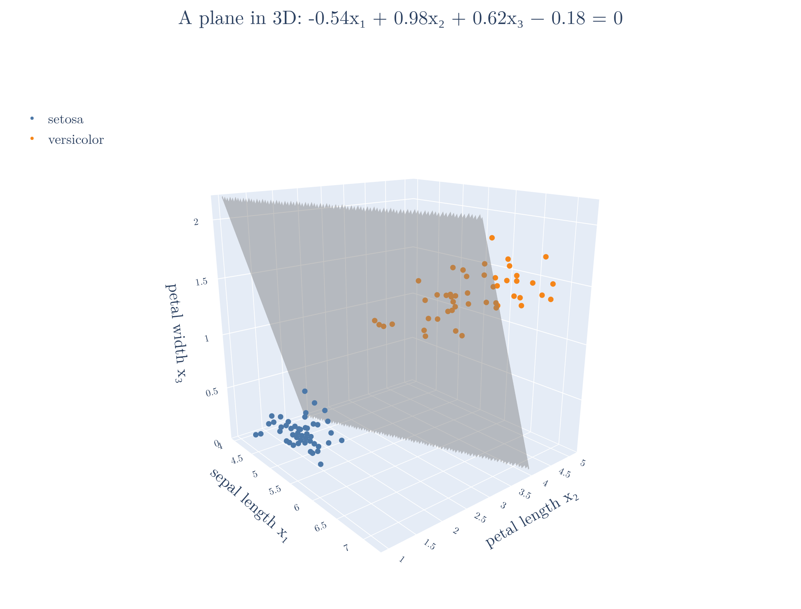
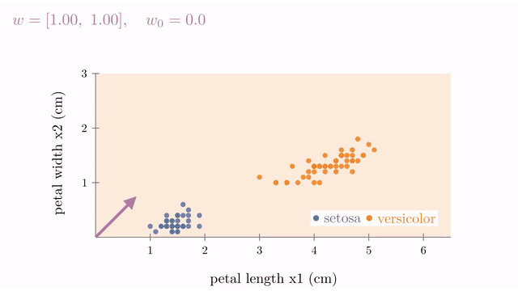

<!-- where-this-fits: generated by course_map/build_map.py; edit concepts.yaml, not this block -->
> **Where this fits:** Pipeline map step 0 (Foundations). See the [Course map](../../../00-course-map/00-course-map.md).
>
> 
>
> - **Builds on:** [Dot product](../../../MA/05-linear-algebra/MA-050-dot-product-and-cosine-similarity/MA-050-dot-product-and-cosine-similarity.md#3-computing-the-dot-product).
> - **Leads to:** [Perceptron trick](../../../ML/07-classification/ML-069-perceptron-trick/ML-069-perceptron-trick.md#5-the-perceptron-trick); [Support vector machines](../../../ML/07-classification/ML-086-svm-intuition/ML-086-svm-intuition.md#33-the-core-idea-of-svm); [Perceptron](../../../DL/01-basics/DL-004-perceptron/DL-004-perceptron.md#3-the-parts-of-a-perceptron).
<!-- /where-this-fits -->

## 1. Overview

> **Key point:** One equation, $w^{\mathsf T}x + w_0 = 0$, describes a line in 2D, a plane in 3D and a hyperplane in any number of dimensions; $w$ is perpendicular to it and $w_0$ moves it away from the origin.


Figure 1 shows the whole result in 2D. On the left, every vector $x$ on the line makes a right angle with $w$, so their dot product is zero. On the right, adding a number $w_0$ slides the line to a parallel position. This Note builds that equation step by step from the school equation of a line, and then reads off what $w$ and $w_0$ mean.

The symbols in the equation:

- $x$ is a point, written as a **vector** (a list of coordinates, such as $[3, 0]$);
- $w$ is a vector of coefficients, such as $[2, 3]$;
- $w^{\mathsf T}x$ is the **dot product** of the two: multiply matching entries and add. For these two vectors:

  $$w^{\mathsf T}x = 2 \times 3 + 3 \times 0$$

  $$w^{\mathsf T}x = 6$$

- $w_0$ is one number (a single value).

The dot product and its geometric form are taught in [the geometric meaning of the dot product](../MA-050-dot-product-and-cosine-similarity/MA-050-dot-product-and-cosine-similarity.md#5-the-geometric-meaning).

## 2. Why ML needs hyperplanes

> **Key point:** A line in 2D becomes a plane in 3D and a hyperplane beyond; models that classify with a straight boundary need its equation in any dimension.

In 2D a flat boundary is a line; in 3D it is a plane. In 4D, 5D or $n$-D the equivalent is a **hyperplane** (G-911; see [more inputs, a hyperplane](../../../ML/06-regression/ML-052-multiple-linear-regression/ML-052-multiple-linear-regression.md#22-more-inputs-a-hyperplane)).

ML data is very often high-dimensional. Each **feature** (G-772; an input variable, one column of the data table) adds one dimension. Even the iris toy dataset has 4 features, and MNIST, the handwritten digits dataset, has 784 (one per pixel of a 28 x 28 image). Classifiers that separate classes with a straight boundary, such as [logistic regression](../../../ML/07-classification/ML-069-perceptron-trick/ML-069-perceptron-trick.md#2-when-logistic-regression-works) and [SVM](../../../ML/07-classification/ML-086-svm-intuition/ML-086-svm-intuition.md#33-the-core-idea-of-svm), therefore work with hyperplanes. To use them, and to code such algorithms ourselves, we need one equation that works in every dimension.

Figure 2 shows one such boundary on real data. With three features of the iris flowers (sepal length, petal length and petal width), a linear SVM fitted with scikit-learn finds a **plane** (G-1502) with every setosa flower on one side and every versicolor flower on the other. With all four features the same boundary would be a hyperplane, which we can no longer draw but can still write down.

{height=45%}

## 3. From a line to a hyperplane

> **Key point:** Rename the general form of a line as $w_1x_1 + w_2x_2 + w_0 = 0$; each extra dimension adds one more term $w_ix_i$.

### 3.1 The general form of a line

> **Key point:** $y = mx + b$ and $ax + by + c = 0$ describe the same line; the general form is the one that grows into higher dimensions.

In school a line is $y = mx + b$, with **slope** (G-1823) $m$ and **intercept** (G-960) $b$. The same line has a general form, $ax + by + c = 0$, used in [the general form of a line](../../../ML/07-classification/ML-069-perceptron-trick/ML-069-perceptron-trick.md#31-the-general-form-of-a-line).

Solving the general form for $y$ links the two:

$$y = -\frac{a}{b}\thinspace x - \frac{c}{b}$$

So the slope and the intercept are:

$$m = -\frac{a}{b}$$

$$\text{intercept} = -\frac{c}{b}$$

(the $b$ of the general form is a different number from the intercept $b$ of $y = mx + b$). We use the general form, because it treats every axis the same way.

### 3.2 Renaming for n dimensions

> **Key point:** Call the axes $x_1, x_2, \dots$ and the coefficients $w_1, w_2, \dots$, with $w_0$ for the constant.

Letters $x, y, z$ run out after three dimensions, so we number the axes instead: $x_1, x_2, x_3, \dots$ We number the coefficients the same way, $w_1, w_2, \dots$, and call the constant term $w_0$. Then:

- **Line (2D):**

  $$w_1x_1 + w_2x_2 + w_0 = 0$$

- **Plane (3D):**

  $$w_1x_1 + w_2x_2 + w_3x_3 + w_0 = 0$$

- **Hyperplane ($n$-D):**

  $$w_1x_1 + w_2x_2 + \dots + w_nx_n + w_0 = 0$$

Each new dimension adds one term. With numbers, the line $2x + 3y - 6 = 0$ is renamed:

$$2x_1 + 3x_2 - 6 = 0$$

Here $w_1 = 2$, $w_2 = 3$ and $w_0 = -6$. Figure 3 (left) draws it in the school form, with a slope and an intercept:

$$\text{slope} = -\frac{a}{b} = -\frac{2}{3}$$

$$\text{intercept} = -\frac{c}{b} = 2$$

The right panel plugs points into the equation, which section 4 writes as a dot product.

![The line 2x₁ + 3x₂ − 6 = 0. Left: the same line as x₂ = −(2/3)x₁ + 2, with its slope triangle and intercept 2. Right: [3, 0], [0, 2] and [1.5, 1] give 0 and lie on the line; [3, 2] gives 6 and does not.](images/line_forms.png)

## 4. The vector form

> **Key point:** The sum of the products $w_ix_i$ is a dot product, so the hyperplane is written in vector form:
>
> $$w \cdot x + w_0 = 0$$
>
> $$w^{\mathsf T}x + w_0 = 0$$

Look at the sum of the first part of the equation:

$$w_1x_1 + w_2x_2 + \dots + w_nx_n$$

This sum multiplies matching components and adds them, which is exactly a dot product. Collect the coefficients into one vector and the coordinates into another:

$$w = \begin{bmatrix} w_1 \cr w_2 \cr\vdots \cr w_n \end{bmatrix}$$

$$x = \begin{bmatrix} x_1 \cr x_2 \cr\vdots \cr x_n \end{bmatrix}$$

Both are column vectors, the default. Writing the dot product as a row times a column, $w \cdot x = w^{\mathsf T}x$, gives the equation of a hyperplane:

1. **In words:** the dot product of the coefficient vector with any point on the hyperplane, plus the constant, is zero.
2. **Formula:**
   $$w^{\mathsf T}x + w_0 = 0$$
3. **Example:** for $w = [2, 3]$ and $w_0 = -6$, the point $x = [3, 0]$ gives
   $$w^{\mathsf T}x + w_0 = 2 \times 3 + 3 \times 0 - 6$$
   $$w^{\mathsf T}x + w_0 = 6 + 0 - 6 = 0$$
   so $[3, 0]$ lies on the line (Figure 3, right).

This one equation is valid in 2D, 3D and $n$-D: only the number of components of $w$ and $x$ changes. The equation is the same $w \cdot u + b$ that SVM uses in [the decision rule](../../../ML/07-classification/ML-087-svm-maths/ML-087-svm-maths.md#2-the-decision-rule), with $b = w_0$.

## 5. What $w_0$ means

> **Key point:** $w_0$ shifts the hyperplane away from the origin; $w_0 = 0$ exactly when the hyperplane passes through the origin.

To see what $w_0$ does, go back to 2D, where the line is both $x_2 = mx_1 + b$ and $w_1x_1 + w_2x_2 + w_0 = 0$. Section 3.1 matched the intercepts:

$$b = -\frac{w_0}{w_2}$$

Now slide the line down until it passes through the origin. Its intercept $b$ becomes 0, and since $w_2 \neq 0$, that forces $w_0 = 0$. So:

- A line, plane or hyperplane passes through the origin exactly when $w_0 = 0$.
- A non-zero $w_0$ moves it parallel to itself, away from the origin. In Figure 1 (right), this line passes through the origin:

  $$2x_1 + 3x_2 = 0$$

  This line, with $w_0 = -6$, is the same line shifted:

  $$2x_1 + 3x_2 - 6 = 0$$

  It crosses the $x_2$ axis at the intercept:

  $$b = -\frac{w_0}{w_2} = -\frac{-6}{3} = 2$$

Figure 4 turns both knobs on real data: the iris setosa and versicolor flowers, plotted by petal length $x_1$ and petal width $x_2$ (in cm). Watch the line while $w_0$ changes: it slides without turning, and the arrow $w$ keeps its direction. Turning $w$ instead tilts the line, which stays at 90° to $w$ (Section 6). The shaded side is where $w^{\mathsf T}x + w_0 > 0$, the side $w$ points to (the sign rule at the end of Section 6). With $w = [1, 1]$ and $w_0 = -3.2$, all 50 versicolor flowers fall on the shaded side and all 50 setosa flowers on the other.



So we often take the simplifying assumption that the hyperplane passes through the origin. The equation then shrinks to

$$w^{\mathsf T}x = 0$$

In 2D that is:

$$w_1x_1 + w_2x_2 = 0$$

In 4D it is:

$$w_1x_1 + w_2x_2 + w_3x_3 + w_4x_4 = 0$$

> **Extra:** The assumption costs nothing, because of a standard trick. Add a constant component 1 to every point, and put $w_0$ into $w$:
>
> $$x = [1, x_1, \dots, x_n]$$
>
> $$w = [w_0, w_1, \dots, w_n]$$
>
> Then the product contains the shift:
>
> $$w^{\mathsf T}x = w_0 + w_1x_1 + \dots + w_nx_n$$
>
> So the equation $w^{\mathsf T}x = 0$ already contains $w_0$. The constant component is the column of ones in the matrix form of [stacking the equations](../../../ML/06-regression/ML-053-multiple-lr-maths/ML-053-multiple-lr-maths.md#22-stacking-the-equations) in multiple linear regression.

## 6. What $w$ means: the normal vector

> **Key point:** $w^{\mathsf T}x = 0$ says $w$ makes a 90° angle with every point $x$ on the hyperplane, so $w$ is perpendicular to the hyperplane.

### 6.1 The argument

> **Key point:** A dot product of non-zero vectors is 0 only at 90°.

For a hyperplane through the origin, every point $x$ on it satisfies $w^{\mathsf T}x = 0$. Write the dot product in its geometric form:

$$w^{\mathsf T}x = w \cdot x = \lVert w \rVert\thinspace\lVert x \rVert \cos\theta = 0$$

For non-zero $w$ and $x$, the lengths are positive, so $\cos\theta = 0$ and $\theta = 90^\circ$. Each point $x$ on the hyperplane is a vector lying in the hyperplane, and $w$ is at a right angle to every one of them. So $w$ is perpendicular to the hyperplane itself. A vector perpendicular to a line, plane or hyperplane is called its **normal vector** (G-1346).

With numbers, take the line in Figure 1 (left):

$$2x_1 + 3x_2 = 0$$

Here $w = [2, 3]$, and the points $[3, -2]$ and $[-1.5, 1]$ lie on the line. Both give a dot product of zero:

$$2 \times 3 + 3 \times (-2) = 0$$

$$2 \times (-1.5) + 3 \times 1 = 0$$

### 6.2 The same in 3D

> **Key point:** The coefficients of a plane's equation, read as a vector, stick straight out of the plane.

![The plane x1 + 2x2 + 2x3 = 0 and its normal vector w = [1, 2, 2]](images/plane_normal.png){height=45%}

Figure 5 shows this plane:

$$x_1 + 2x_2 + 2x_3 = 0$$

Its coefficients form $w = [1, 2, 2]$, drawn in orange. The three blue vectors lie in the plane, for example $[2, -1, 0]$:

$$1 \times 2 + 2 \times (-1) + 2 \times 0 = 0$$

The orange $w$ stands at 90° to all of them.

So reading a hyperplane's equation tells us its direction at once: the coefficients are the normal vector. In $n$-D we cannot draw it, but the argument of Section 6.1 never used the number of dimensions.

> **Python:** Checking that points lie on a hyperplane is one dot product per point.
>
> ```python
> import numpy as np
>
> w = np.array([1, 2, 2])
> X = np.array([[2, -1, 0], [0, 1, -1], [-2, 2, -1]])
> # dot product of every row of X with w
> X @ w    # array([0, 0, 0]): all on the plane
> ```

### 6.3 A plane from a point and a normal vector

> **Key point:** A point $x_0$ and a normal vector $w$ fix a plane: it holds every $x$ whose arrow from $x_0$ is at right angles to $w$. Expanding gives the usual equation, with the constant $w_0$ set by the point, so $w$ is the normal vector for any $w_0$.

Sections 6.1 and 6.2 assumed $w_0 = 0$. The same result holds for a hyperplane anywhere in space, and Figure 6 shows why in four steps.

1. **One point is not enough.** Think of the plane as a sheet of cardboard pinned at one point, $x_0 = (1, 1, 1)$. The sheet can still pivot about the pin, so one point leaves the plane open.
2. **A normal vector fixes the plane.** Choose the direction that must stand at 90° to the sheet, here $w = [1, 2, 2]$. Only one position of the sheet fits.
3. **Arrows inside the plane.** Take any other point $x$ on the plane. The points $x_0$ and $x$ are vectors from the origin, and they do not lie in the plane. Their difference $x - x_0$ does: it is the arrow from the pin to $x$, drawn on the cardboard. So $w$ is at 90° to it, and their dot product is 0 (section 6.1).
4. **The constant slides the plane.** Changing $w_0$ moves the plane along $w$ without turning it.

![A plane from the point x0 = (1, 1, 1) and the normal vector w = [1, 2, 2]. The sheet can pivot about one point; the normal vector fixes it; the arrow from x0 to any point x of the plane stays at 90° to w; changing w0 slides the plane along w. Idea after Khan Academy, "Defining a plane in R3 with a point and normal vector".](images/point_normal.gif)

**Worked example.** With $w = [1, 2, 2]$ and $x_0 = (1, 1, 1)$, a point $x = (x_1, x_2, x_3)$ is on the plane when

$$w \cdot (x - x_0) = 0$$

$$1 (x_1 - 1) + 2 (x_2 - 1) + 2 (x_3 - 1) = 0$$

Multiplying out, one term per line:

$$1(x_1 - 1) = x_1 - 1$$

$$2(x_2 - 1) = 2x_2 - 2$$

$$2(x_3 - 1) = 2x_3 - 2$$

Adding the three terms:

$$x_1 + 2x_2 + 2x_3 - 1 - 2 - 2 = 0$$

$$x_1 + 2x_2 + 2x_3 - 5 = 0$$

The coefficients are again $w$, and the constant is $w_0 = -5$. The point $(3, 1, 0)$ lies on this plane:

$$3 + 2 + 0 - 5 = 0$$

**The formal version.** For any number of dimensions,

$$w^{\mathsf T}(x - x_0) = 0 \quad\Longleftrightarrow\quad w^{\mathsf T}x + w_0 = 0$$

$$w_0 = -w^{\mathsf T}x_0$$

Read from right to left, the same steps show that $w$ stays perpendicular when $w_0 \neq 0$. Take any two points $x$ and $y$ on the hyperplane:

$$w^{\mathsf T}x + w_0 = 0$$

$$w^{\mathsf T}y + w_0 = 0$$

Subtracting the second from the first:

$$w^{\mathsf T}(x - y) = 0$$

The vector $x - y$ runs along the hyperplane, so $w$ is perpendicular to every direction in it.

All hyperplanes with the same $w$ and different $w_0$ therefore share one normal vector and are parallel. The shared normal vector is why the two lines in Figure 1 (right) are parallel, and why the plane of Figure 5 is parallel to the plane of this example (both have $w = [1, 2, 2]$).

> **Extra:** For a point off the hyperplane, $w^{\mathsf T}x + w_0$ is not zero, and its sign says which side the point is on: positive on the side $w$ points to, negative on the other. To see this, start at a point $p$ on the hyperplane and step a distance $t$ along $w$: $x = p + t\thinspace w/\lVert w \rVert$. Then, one step per line:
>
> $$w^{\mathsf T}x + w_0 = (w^{\mathsf T}p + w_0) + t\thinspace\frac{w^{\mathsf T}w}{\lVert w \rVert}$$
>
> $$= 0 + t\thinspace\frac{\lVert w \rVert^2}{\lVert w \rVert} = t\lVert w \rVert$$
>
> which has the sign of $t$. This sign rule is the side test of [positive and negative sides](../../../ML/07-classification/ML-069-perceptron-trick/ML-069-perceptron-trick.md#32-positive-and-negative-sides) in the perceptron trick and [the decision rule](../../../ML/07-classification/ML-087-svm-maths/ML-087-svm-maths.md#2-the-decision-rule) of the SVM.

## 7. Summary

| Object | Equation | Normal vector |
|---|---|---|
| Line (2D) | $w_1x_1 + w_2x_2 + w_0 = 0$ | $[w_1, w_2]$ |
| Plane (3D) | $w_1x_1 + w_2x_2 + w_3x_3 + w_0 = 0$ | $[w_1, w_2, w_3]$ |
| Hyperplane ($n$-D) | $w^{\mathsf T}x + w_0 = 0$ | $w$ |
| Through the origin | $w^{\mathsf T}x = 0$ | $w$ |

- The general form of a line grows into a hyperplane by adding one term per dimension; the sum of terms is a dot product, so one vector equation covers every dimension.
- $w_0$ shifts the hyperplane; a zero $w_0$ means it passes through the origin, because the intercept is 0 exactly when $w_0$ is 0.
- $w$ is the normal vector: perpendicular to the hyperplane, because a zero dot product means a 90° angle.
- A point $x_0$ and a normal vector $w$ give the hyperplane through that point; its constant is minus the dot product of $w$ and $x_0$, so $w$ stays the normal vector for any $w_0$, and hyperplanes with the same $w$ are parallel.
- So one equation, $w^{\mathsf T}x + w_0 = 0$, describes a straight boundary in any number of dimensions, which is what classifiers such as logistic regression and SVM need.

## 8. Sources

**Built from**

- CampusX, "Equation of a Hyper-plane in N dimensions", YouTube, https://www.youtube.com/watch?v=10e-b8AgdVA
- CampusX, "Supercharge Your ML Journey: Mastering Vectors in Linear Algebra - Part 1", YouTube, https://www.youtube.com/watch?v=mQewAJb8oJ8
- Khan Academy, "Defining a plane in R3 with a point and normal vector | Linear Algebra | Khan Academy", YouTube, https://www.youtube.com/watch?v=UJxgcVaNTqY
- Khan Academy, "Normal vector from plane equation | Vectors and spaces | Linear Algebra | Khan Academy", YouTube, https://www.youtube.com/watch?v=gw-4wltP5tY

## 9. Key terms

Terms taught in this Note come first; linked terms are recaps, taught in the Note the link opens.

| Term | Meaning |
|---|---|
| Normal vector (G-1346) | A vector perpendicular to a line, plane or hyperplane; for $w^{\mathsf T}x + w_0 = 0$ it is $w$. |
| $w_0$ (G-38) | The fixed number in the equation of a line, plane or hyperplane (the constant term). It shifts the hyperplane away from the origin, and is 0 when the hyperplane passes through the origin. |
| Equation of a hyperplane (G-703) | One equation for a flat boundary in any number of dimensions, a line in 2D, a plane in 3D, a hyperplane beyond: $w^{\mathsf T}x + w_0 = 0$. |
| [Hyperplane](../../../ML/06-regression/ML-052-multiple-linear-regression/ML-052-multiple-linear-regression.md#22-more-inputs-a-hyperplane) (G-911) | A flat surface in more than three dimensions; the model for three or more input columns. |
| [Feature](../../../ML/01-foundations/ML-002-ai-vs-ml-vs-dl/ML-002-ai-vs-ml-vs-dl.md#52-features-chosen-by-us-or-learned) (G-772) | One piece of information about each example that a model uses (e.g. a student's CGPA). |
| [Plane](../../../ML/06-regression/ML-052-multiple-linear-regression/ML-052-multiple-linear-regression.md#21-two-inputs-a-plane) (G-1502) | A flat surface in 3D; the model for two input columns. |
| [Slope](../../../ML/06-regression/ML-049-simple-linear-regression/ML-049-simple-linear-regression.md#32-if-the-data-were-perfectly-linear) (G-1823) | How much the output changes for one unit of change in the input; $m$ in $y = mx + b$. |
| [Intercept](../../../ML/06-regression/ML-049-simple-linear-regression/ML-049-simple-linear-regression.md#32-if-the-data-were-perfectly-linear) (G-960) | The line's value when the input is 0; $b$ in $y = mx + b$. |
