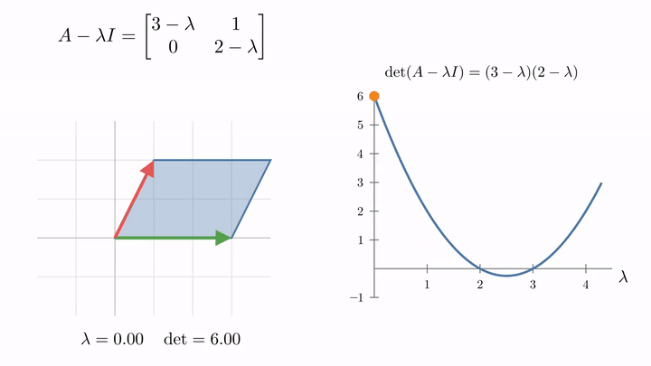
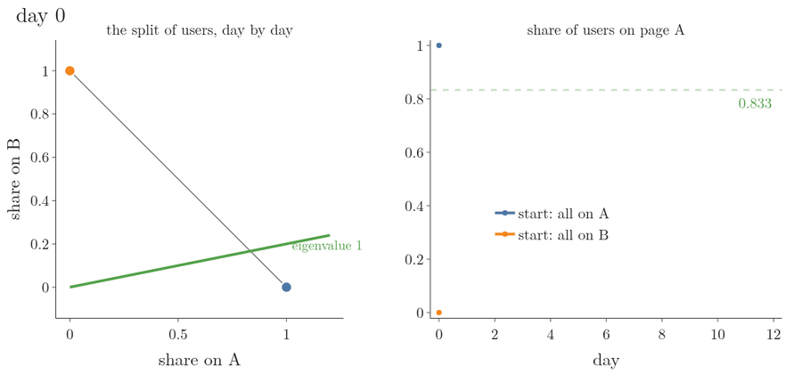

<!-- where-this-fits: generated by course_map/build_map.py; edit concepts.yaml, not this block -->
> **Where this fits:** Pipeline map step 0 (Foundations). See the [Course map](../../../00-course-map/00-course-map.md).
>
> 
>
> - **Builds on:** [Linear transformations and matrices](../../../MA/05-linear-algebra/MA-053-linear-transformations-and-matrices/MA-053-linear-transformations-and-matrices.md#7-where-ml-uses-linear-transformations).
> - **Leads to:** [PCA](../../../ML/01-foundations/ML-003-types-of-ml/ML-003-types-of-ml.md); [Hessian and multivariate Taylor](../../../MA/06-calculus/MA-064-hessian-and-multivariate-taylor/MA-064-hessian-and-multivariate-taylor.md#5-the-hessian); [Singular value decomposition](../../../MA/05-linear-algebra/MA-057-svd-geometry/MA-057-svd-geometry.md#1-overview).
> - **Compare with:** [Singular value decomposition](../../../MA/05-linear-algebra/MA-057-svd-geometry/MA-057-svd-geometry.md#1-overview).
<!-- /where-this-fits -->

## 1. Overview

> **Key point:** The eigenvalues of a matrix $A$ are the numbers $\lambda$ that make $A - \lambda I$ squish space flat (its determinant is 0), and the eigenvectors are the vectors it squishes to zero. When there are enough eigenvectors to form a basis, $A$ becomes a diagonal matrix in that basis.

[PCA](../../../ML/05-dimensionality/ML-047-pca-step-by-step/ML-047-pca-step-by-step.md#4-eigenvectors-and-eigenvalues) defined eigenvectors and eigenvalues: an **eigenvector** (G-666) of a matrix is a vector the matrix only stretches or shrinks, without turning it, and its **eigenvalue** (G-665) is the stretch factor, so $A\mathbf{v} = \lambda\mathbf{v}$. Its Figure 5 showed this for the matrix $A$ with columns $[3, 0]$ and $[1, 2]$: $[1, 0]$ is stretched by 3 and $[-1, 1]$ by 2. There, NumPy found them.

This Note goes deeper, with the same matrix:

- why eigenvectors come as whole lines, and what they tell us about a transformation (Section 2);
- how to find eigenvalues and eigenvectors by hand (Sections 3 and 4, and Figures 4 and 5);
- transformations with no eigenvectors, one line of them, or every vector (Section 5);
- the eigenbasis, which turns a matrix into a diagonal one and makes its powers easy (Section 6).

The Note reads matrices as **linear transformations** (G-1097), as in the [linear transformations and matrices](../MA-053-linear-transformations-and-matrices/MA-053-linear-transformations-and-matrices.md#5-the-matrix-of-a-transformation).

## 2. Eigenvectors stay on their own span

> **Key point:** An eigenvector is not knocked off its span: it stays on the line it spans. Every vector on that line is an eigenvector with the same eigenvalue.

Take any vector and look at its **span** (G-1838), the line through the origin and its tip (see the [span](../MA-052-linear-combinations-span-and-basis/MA-052-linear-combinations-span-and-basis.md#6-span)). During a transformation, most vectors are knocked off their span; it would be a coincidence for a vector to land on its own line. The eigenvectors are exactly the vectors that do stay on their span.

For $A$ with columns $[3, 0]$ and $[1, 2]$ (rows $[3, 1]$ and $[0, 2]$):

- **The x-axis.** $\hat{\imath}$ lands on $[3, 0]$ (the first column), 3 times itself. By linearity every vector on the x-axis is stretched by 3: $[2, 0]$ lands on $[6, 0]$.
- **The diagonal line through $[-1, 1]$.** $[-1, 1]$ lands on $[-2, 2]$, 2 times itself. Every vector on that line is stretched by 2: $[2, -2]$ lands on $[4, -4]$.
- **Every other vector** is turned off its line, like $[1, 1] \to [4, 2]$.


Figure 1 runs this test on eight directions at once. Watch the arrows, not the grid: after the matrix acts, six of them point off their dashed line, and only the arrows along the x-axis and along $[-1, 1]$ still lie on theirs. The picture follows the "Eigenvectors and eigenvalues" lesson of Sanderson's *Essence of Linear Algebra* (3Blue1Brown), redrawn with our matrix.

So "the eigenvectors" really means whole lines of them: any non-zero multiple of an eigenvector is an eigenvector with the same eigenvalue. The whole-line freedom is why NumPy returns them scaled to length 1, and why their sign can differ from what we expect.

Eigenvalues need not be positive. An eigenvalue of $-\tfrac{1}{2}$ means the eigenvector is flipped to point the other way and squished to half its length. What matters is that it stays on its line.

A reflection shows both kinds at once (Figure 2). The matrix with rows $[0, 1]$ and $[1, 0]$ swaps the two components of every vector, which mirrors the plane across the line $y = x$.

- A vector on the mirror line does not move: $[2, 2]$ lands on $[2, 2]$. It is an eigenvector with eigenvalue 1.
- A vector at 90° to the mirror line is flipped to the other side: $[1, -1]$ lands on $[-1, 1]$, which is $-1$ times $[1, -1]$:

  $$[-1, 1] = -1 \times [1, -1]$$

  It stays on its line, so it is an eigenvector with eigenvalue $-1$.
- Any other vector leaves its line: $[3, 1]$ lands on $[1, 3]$.

![Reflection across the line y = x. Green: the two eigenvector lines, one kept in place (eigenvalue 1) and one flipped (eigenvalue −1). Red: [3, 1] is knocked off its line. Example after Khan Academy, "Introduction to eigenvalues and eigenvectors", with our own mirror line.](images/reflection.png){height=38%}

### 2.1 Why eigenvectors describe a transformation well

> **Key point:** The columns of a matrix depend on the coordinate system; the eigenvectors and eigenvalues describe what the transformation itself does.

Picture a rotation in 3D. Its $3 \times 3$ matrix is nine numbers that are hard to read. But a vector that stays on its own span during a rotation is the **axis of rotation** (G-241), and its eigenvalue must be 1, because a rotation never stretches anything. "Turn by some angle around this axis" is a far clearer description than nine numbers.

Figure 3 shows one. The rotation turns space by up to 120° about the line through $[1, 1, 1]$. The three basis vectors sweep round on circles and leave their lines, but the green axis vector does not move at all:

$$R\mathbf{u} = 1 \cdot \mathbf{u}$$

At 120° the rotation sends $\hat{\imath}$ to $\hat{\jmath}$, $\hat{\jmath}$ to $\hat{k}$ and $\hat{k}$ to $\hat{\imath}$, and NumPy confirms that 1 is its only real eigenvalue.

![A rotation about the axis through [1, 1, 1], from 0 to 120 degrees. Red: the basis vectors x, y and z, turned off their lines. Green: the axis, an eigenvector with eigenvalue 1, which never moves.](images/rotation_axis.gif)

This pattern recurs across linear algebra. Reading the columns as landing spots of the basis vectors always works, but the eigenvectors and eigenvalues get at the heart of a transformation, independent of the coordinates we happen to use.

## 3. Finding eigenvalues

> **Key point:** $A\mathbf{v} = \lambda\mathbf{v}$ with a non-zero $\mathbf{v}$ is possible only when $A - \lambda I$ squishes space into a lower dimension, which means $\det(A - \lambda I) = 0$.

### 3.1 From $A\mathbf{v} = \lambda\mathbf{v}$ to $(A - \lambda I)\mathbf{v} = \mathbf{0}$

> **Key point:** Write $\lambda\mathbf{v}$ as the matrix $\lambda I$ times $\mathbf{v}$, then move everything to one side.

Finding eigenvectors means finding $\mathbf{v}$ and $\lambda$ with $A\mathbf{v} = \lambda\mathbf{v}$. The left side is a matrix times a vector, the right side a number times a vector. To compare them, we write the right side as a matrix too. The matrix that scales every vector by $\lambda$ sends $\hat{\imath}$ to $[\lambda, 0]$ and $\hat{\jmath}$ to $[0, \lambda]$:

$$\begin{bmatrix} \lambda & 0 \cr0 & \lambda \end{bmatrix} = \lambda I$$

where $I$ is the **identity matrix** (G-915; 1s on the diagonal). Now both sides are matrix-vector products:

$$A\mathbf{v} = (\lambda I)\mathbf{v}$$

Move the right side over:

$$A\mathbf{v} - \lambda I\mathbf{v} = \mathbf{0}$$

Take $\mathbf{v}$ out as a common factor:

$$(A - \lambda I)\thinspace\mathbf{v} = \mathbf{0}$$

$A - \lambda I$ is simply $A$ with $\lambda$ subtracted from each diagonal entry.

### 3.2 When can a matrix send a non-zero vector to zero?

> **Key point:** Only when it squishes space onto a line (or a point); that is exactly when its determinant is 0.

$\mathbf{v} = \mathbf{0}$ always solves $(A - \lambda I)\mathbf{v} = \mathbf{0}$, but the zero vector is not an eigenvector; we want a non-zero $\mathbf{v}$. A transformation can send a non-zero vector to the origin only if it squishes space into a lower dimension, like the dependent-columns case of [reading a matrix as a picture](../MA-053-linear-transformations-and-matrices/MA-053-linear-transformations-and-matrices.md#6-reading-a-matrix-as-a-picture). If it kept the plane two-dimensional, only the origin would land on the origin.

Squishing space into a lower dimension is measured by the determinant.

> **Extra:** The **determinant** (G-598) of a $2 \times 2$ matrix is the factor by which its transformation scales areas: the unit square spanned by $\hat{\imath}$ and $\hat{\jmath}$ becomes a parallelogram with area $\lvert\det\rvert$. A negative determinant means the plane is also flipped over (MML §4.1).
>
> 1. **In words:** multiply the diagonal entries and subtract the product of the other two.
> 2. **Formula:**
>    $$\det \begin{bmatrix} a & b \cr c & d \end{bmatrix} = ad - bc$$
> 3. **Example:** for the matrix $A$ with rows $[3, 1]$ and $[0, 2]$:
>
>    $$\det A = 3 \times 2 - 1 \times 0 = 6$$
>
>    The unit square becomes a parallelogram of area 6 (Figure 4 at $\lambda = 0$, det = 6). For the squishing matrix with rows $[2, -1]$ and $[1, -0.5]$:
>
>    $$\det = 2 \times (-0.5) - (-1) \times 1$$
>
>    $$\det = -1 + 1$$
>
>    $$\det = 0$$
>
>    Zero area: the plane is flat.
>
> A determinant of 0 means the transformation squishes space into a lower dimension, and that is exactly when it has no inverse (see [the cost of the inverse](../../../ML/06-regression/ML-053-multiple-lr-maths/ML-053-multiple-lr-maths.md#7-the-cost-of-the-inverse)). In NumPy: `np.linalg.det(A)`.

So $\lambda$ is an eigenvalue exactly when

$$\det(A - \lambda I) = 0$$



Figure 4 shows this with a knob. As $\lambda$ turns from 0 upwards, $A - \lambda I$ changes, and so does the area of the parallelogram it makes from the unit square. The area hits 0, the square squished flat, at $\lambda = 2$ and again at $\lambda = 3$: the eigenvalues.

### 3.3 Two worked examples

> **Key point:** Subtract $\lambda$ from the diagonal, take the determinant, and solve the resulting quadratic.

1. **In words:** subtract $\lambda$ from each diagonal entry, compute the determinant as a polynomial in $\lambda$, and find where it is zero.
2. **Formula:**
   $$\det \begin{bmatrix} a - \lambda & b \cr c & d - \lambda \end{bmatrix}$$
   $$= (a - \lambda)(d - \lambda) - bc$$
   $$= 0$$
3. **Example:** for $A$ with rows $[3, 1]$ and $[0, 2]$,
   $$\det(A - \lambda I) = (3 - \lambda)(2 - \lambda) - 1 \times 0$$
   $$= (3 - \lambda)(2 - \lambda)$$
   which is 0 only for $\lambda = 3$ and $\lambda = 2$, the two stretch factors of Section 2. This polynomial is the curve in Figure 4.

A second matrix, with columns $[2, 1]$ and $[2, 3]$:

$$\det \begin{bmatrix} 2 - \lambda & 2 \cr1 & 3 - \lambda \end{bmatrix}$$

$$= (2 - \lambda)(3 - \lambda) - 2$$

$$= \lambda^2 - 5\lambda + 4$$

$$= (\lambda - 1)(\lambda - 4)$$

So its eigenvalues are 1 and 4. An eigenvalue of 1 means its eigenvectors do not move at all. $[-2, 1]$ lands on:

$$\text{first: } 2 \times (-2) + 2 \times 1 = -2$$

$$\text{second: } 1 \times (-2) + 3 \times 1 = 1$$

$$\text{so } [-2, 1] \to [-2, 1]$$

And $[1, 1]$ lands on $[4, 4]$, stretched by 4.

A third matrix gives a negative eigenvalue by hand. For rows $[1, 2]$ and $[4, 3]$:

$$\det \begin{bmatrix} 1 - \lambda & 2 \cr4 & 3 - \lambda \end{bmatrix}$$

$$= (1 - \lambda)(3 - \lambda) - 8$$

$$= \lambda^2 - 4\lambda - 5$$

$$= (\lambda - 5)(\lambda + 1)$$

So its eigenvalues are 5 and $-1$. $[1, 2]$ lands on the following, stretched by 5:

$$[1 + 4,\ 4 + 6] = [5, 10]$$

$[1, -1]$ lands on the following, flipped:

$$[1 - 2,\ 4 - 3] = [-1, 1]$$

> **Extra:** The polynomial $\det(A - \lambda I)$ is called the **characteristic polynomial** (G-376) of $A$. For an $n \times n$ matrix it has degree $n$, so there are at most $n$ eigenvalues. Real libraries do not solve this polynomial: finding polynomial roots is very sensitive to rounding errors, so eigenvalue routines use iterative methods instead (Trefethen and Bau, Lecture 25). The polynomial is the idea, not the algorithm.

## 4. Finding the eigenvectors

> **Key point:** Plug each eigenvalue back in and find all vectors that $A - \lambda I$ sends to zero: they form the line of eigenvectors.

Once we know an eigenvalue, the eigenvectors are the solutions of $(A - \lambda I)\mathbf{v} = \mathbf{0}$.

1. **In words:** put the eigenvalue into $A - \lambda I$ and solve for the vectors it sends to the zero vector.
2. **Formula:**
   $$(A - \lambda I)\begin{bmatrix} x \cr y \end{bmatrix} = \begin{bmatrix} 0 \cr0 \end{bmatrix}$$
3. **Example:** for $A$ with rows $[3, 1]$ and $[0, 2]$, and $\lambda = 2$,

   $$A - 2I = \begin{bmatrix} 1 & 1 \cr0 & 0 \end{bmatrix}$$

   $$\begin{bmatrix} 1 & 1 \cr0 & 0 \end{bmatrix}\begin{bmatrix} x \cr y \end{bmatrix}$$

   $$= \begin{bmatrix} x + y \cr0 \end{bmatrix}$$

   $$= \begin{bmatrix} 0 \cr0 \end{bmatrix}$$

   So $y = -x$: every vector on the line through $[-1, 1]$. For $\lambda = 3$, $A - 3I$ has rows $[0, 1]$ and $[0, -1]$, so:

   $$(A - 3I)\begin{bmatrix} x \cr y \end{bmatrix} = \begin{bmatrix} y \cr-y \end{bmatrix}$$

   This is zero only when $y = 0$: the x-axis.

In Figure 4 (at $\lambda = 2$, "squished flat"), $A - 2I$ squishes the plane onto the x-axis, and the line $y = -x$ is what it crushes to the origin. Figure 5 shows the squish happening. The grid and the vectors move from where they start to where $A - \lambda I$ sends them. For $\lambda = 2$, every green vector on the line through $[-1, 1]$ shrinks to the origin, while $[1, 1]$ survives as $[2, 0]$. For $\lambda = 3$, the whole x-axis is crushed instead.

![The plane moves under A − 2I (top) and A − 3I (bottom). Green: vectors on the eigenvector line, sent to the origin. Red: [1, 1], which is not an eigenvector and survives.](images/null_line.gif)

> **Python:** `np.linalg.eig` returns the eigenvalues and, as columns, unit-length eigenvectors.
>
> ```python
> import numpy as np
>
> A = np.array([[3, 1], [0, 2]])
> values, vectors = np.linalg.eig(A)
> values           # array([3., 2.])
> vectors[:, 1]    # [-0.707, 0.707]: the line through [-1, 1]
> ```
>
> $[-0.707, 0.707]$ is $[-1, 1]$ scaled to length 1. As [the PCA eigenvector section](../../../ML/05-dimensionality/ML-047-pca-step-by-step/ML-047-pca-step-by-step.md#4-eigenvectors-and-eigenvalues) warns, the eigenvectors are the columns, not the rows.

## 5. Rotations, shears and uniform scaling

> **Key point:** A 2D transformation can have no real eigenvectors (rotation), only one line of them (shear), or every vector (uniform scaling).

Figure 6 shows three special cases, each checked with the determinant.


- **Rotation by 90°**, columns $[0, 1]$ and $[-1, 0]$. Every vector is turned off its span, so there is no eigenvector. The algebra agrees: $A - \lambda I$ has rows $[-\lambda, -1]$ and $[1, -\lambda]$, so its determinant is:

  $$(-\lambda)(-\lambda) - (-1)(1) = \lambda^2 + 1$$

  $\lambda^2 + 1$ is never 0 for a real $\lambda$. Its only roots are the imaginary numbers $i$ and $-i$ (where $i$ is the number whose square is $-1$), and no real root means no real eigenvector.
- **Shear**, columns $[1, 0]$ and $[1, 1]$. Vectors on the x-axis stay fixed, so they are eigenvectors with eigenvalue 1. The polynomial $(1 - \lambda)^2$ has only the root $\lambda = 1$, and those are the only eigenvectors: one line.
- **Scaling everything by 2**, columns $[2, 0]$ and $[0, 2]$. The only eigenvalue is 2, but every vector in the plane is an eigenvector. One eigenvalue can come with more than a line of eigenvectors.

> **Python:** NumPy reports the rotation's eigenvalues as complex numbers.
>
> ```python
> np.linalg.eigvals(np.array([[0, -1], [1, 0]]))   # [0.+1.j, 0.-1.j]
> np.linalg.eigvals(np.array([[1, 1], [0, 1]]))    # [1., 1.]
> ```
>
> `1.j` is Python's way to write the imaginary number $i$.

## 6. The eigenbasis

> **Key point:** If the eigenvectors span the whole space, we can use them as basis vectors; in that basis the matrix is diagonal, with the eigenvalues on the diagonal.

### 6.1 Diagonal matrices

> **Key point:** When the basis vectors are themselves eigenvectors, the matrix has zeros off the diagonal and its eigenvalues on the diagonal.

Suppose $\hat{\imath}$ and $\hat{\jmath}$ happen to be eigenvectors: say $\hat{\imath}$ is scaled by $-1$ and $\hat{\jmath}$ by 2. Their landing spots, $[-1, 0]$ and $[0, 2]$, are the columns of

$$D = \begin{bmatrix} -1 & 0 \cr0 & 2 \end{bmatrix}$$

a **diagonal matrix** (G-601; as in [feature scaling as a stretch along the axes](../MA-053-linear-transformations-and-matrices/MA-053-linear-transformations-and-matrices.md#72-feature-scaling-is-a-stretch-along-the-axes)). Read the other way round: in any diagonal matrix, every basis vector is an eigenvector, and the diagonal entries are the eigenvalues.

Diagonal matrices are easy to work with. Applying $D$ 100 times just scales each basis vector by its eigenvalue 100 times, so

$$D^{100} = \begin{bmatrix} (-1)^{100} & 0 \cr0 & 2^{100} \end{bmatrix}$$

$$D^{100} = \begin{bmatrix} 1 & 0 \cr0 & 2^{100} \end{bmatrix}$$

Computing the 100th power of a non-diagonal matrix by repeated multiplication, by contrast, is a nightmare by hand.

### 6.2 Changing to an eigenbasis

> **Key point:** Put the eigenvectors as the columns of $P$; then $P^{-1}AP$ is diagonal, and $A^k = P D^k P^{-1}$.

Usually the basis vectors are not eigenvectors. But if a matrix has enough eigenvectors to span the whole space, we can switch to a coordinate system whose basis vectors are eigenvectors. Such a **basis** (G-262) is called an **eigenbasis** (G-664).

1. **In words:** put the eigenvectors as the columns of a **change of basis matrix** (G-374) $P$. Sandwiching $A$ between $P^{-1}$ and $P$ gives the same transformation seen from the eigenbasis, and there it only scales each basis vector: a diagonal matrix of eigenvalues.
2. **Formula:**

   $$P^{-1} A P = D$$

   So:

   $$A = P D P^{-1}$$

   $$A^k = P\thinspace D^k\thinspace P^{-1}$$

3. **Example:** for $A$ with rows $[3, 1]$ and $[0, 2]$, the eigenvectors $[1, 0]$ and $[-1, 1]$ give:

   $$P = \begin{bmatrix} 1 & -1 \cr0 & 1 \end{bmatrix}$$

   $$P^{-1}AP = \begin{bmatrix} 3 & 0 \cr0 & 2 \end{bmatrix}$$

   The 10th power needs only these two numbers:

   $$3^{10} = 59049$$

   $$2^{10} = 1024$$

   $$A^{10} = P \begin{bmatrix} 59049 & 0 \cr0 & 1024 \end{bmatrix} P^{-1}$$

   $$P^{-1} = \begin{bmatrix} 1 & 1 \cr0 & 1 \end{bmatrix}$$

   The product, two steps. First $P D^{10}$, each entry a row times a column. Row 1:

   $$(1)(59049) + (-1)(0) = 59049$$

   $$(1)(0) + (-1)(1024) = -1024$$

   Row 2:

   $$(0)(59049) + (1)(0) = 0$$

   $$(0)(0) + (1)(1024) = 1024$$

   $$P D^{10} = \begin{bmatrix} 59049 & -1024 \cr0 & 1024 \end{bmatrix}$$

   Then multiply by $P^{-1}$. Row 1:

   $$(59049)(1) + (-1024)(0) = 59049$$

   $$(59049)(1) + (-1024)(1) = 58025$$

   Row 2:

   $$(0)(1) + (1024)(0) = 0$$

   $$(0)(1) + (1024)(1) = 1024$$

   $$A^{10} = \begin{bmatrix} 59049 & 58025 \cr0 & 1024 \end{bmatrix}$$


![A grid drawn along the eigenvectors $\mathbf e_1 = [1, 0]$ and $\mathbf e_2 = [-1, 1]$; applying $A$ only stretches its lines, so $\mathbf{v} = 1\thinspace\mathbf e_1 + 1\thinspace\mathbf e_2$ lands on $3\thinspace\mathbf e_1 + 2\thinspace\mathbf e_2$, then $9\thinspace\mathbf e_1 + 4\thinspace\mathbf e_2$](images/eigenbasis_grid.gif)

Figure 7 shows why the eigenbasis makes $A$ diagonal. Watch the coordinates in the corner: in the grid of eigenvectors, $A$ multiplies the first coordinate by 3 and the second by 2 and never mixes them, which is exactly what $D$ does. Applying $A$ a second time multiplies them by 3 and 2 again, so $A^2$ is $D^2$ in eigen-coordinates.

Reading $P D^k P^{-1}$ from right to left (as in [why the product is written right to left](../MA-054-matrix-multiplication-as-composition/MA-054-matrix-multiplication-as-composition.md#3-why-the-product-is-written-right-to-left)): convert to eigenbasis coordinates, scale each coordinate $k$ times, convert back.

Not every matrix has an eigenbasis. The shear of Figure 6 has only one line of eigenvectors, not enough to span the plane, so it cannot be made diagonal this way. Writing a matrix as $PDP^{-1}$ is the **eigen-decomposition**, or **diagonalisation** (G-602), listed among the factorisations of the [linear algebra roadmap](../MA-047-linear-algebra-roadmap/MA-047-linear-algebra-roadmap.md#4-the-eight-modules).

> **Python:** Checking the example.
>
> ```python
> P = np.array([[1, -1], [0, 1]])
> np.linalg.inv(P) @ A @ P                 # [[3, 0], [0, 2]]
> P @ np.diag([3**10, 2**10]) @ np.linalg.inv(P)
> np.linalg.matrix_power(A, 10)            # the same matrix
> ```

## 7. Where ML uses eigenvectors

> **Key point:** PCA is an eigen-decomposition of a covariance matrix, which always has an eigenbasis; repeated multiplication drifts towards the top eigenvector.

- **PCA.** The **principal components** (G-1563) are the eigenvectors of the **covariance matrix** (G-495), and the eigenvalues are the variances along them (see [the eigenvectors of the covariance matrix](../../../ML/05-dimensionality/ML-047-pca-step-by-step/ML-047-pca-step-by-step.md#43-the-eigenvectors-of-the-covariance-matrix)). A covariance matrix is symmetric (unchanged when its rows and columns are swapped), which guarantees a full eigenbasis of perpendicular eigenvectors (the spectral theorem, MML Thm 4.15): PCA never meets the shear problem. Projecting onto the top $k$ eigenvectors keeps the coordinates in the eigenbasis that carry the most variance.
- **Powers of a matrix.** Whenever a model applies the same matrix again and again, the eigenbasis explains the result: each step multiplies the eigenbasis coordinates by their eigenvalues, so the direction with the largest eigenvalue takes over.

> **Extra:** A small example of the second point. Suppose each day 90% of a website's users on page A stay there and 10% move to B, while B's users split 50/50. The matrix of one day, $T$, has columns $[0.9, 0.1]$ and $[0.5, 0.5]$ (each column says where one page's users go). Its eigenvalues come from Section 3.3:
>
> $$(0.9 - \lambda)(0.5 - \lambda) - 0.5 \times 0.1$$
>
> $$= \lambda^2 - 1.4\lambda + 0.4$$
>
> $$= (\lambda - 1)(\lambda - 0.4)$$
>
> So the eigenvalues are 1 and 0.4. Day after day, the 0.4 part shrinks to nothing:
>
> $$0.4^{30} \approx 10^{-12}$$
>
> Any starting split of users settles on the eigenvector of eigenvalue 1. The first row of $T - I$, $[-0.1, 0.5]$, gives $0.1x = 0.5y$, so $x = 5y$: the line through $[5, 1]$. Scaled to sum to 1:
>
> $$[5, 1] / 6 = [0.833, 0.167]$$
>
> Google's original PageRank ranked web pages with exactly this kind of eigenvector (Page et al. 1999), and the trick of multiplying repeatedly to find the top eigenvector is called **power iteration** (G-1537).
>
> Figure 8 runs it. Two very different starting splits, all users on A or all on B, are multiplied by $T$ day after day. Each day the eigenvalue-0.4 part of the split shrinks to 0.4 times its size, so both splits slide onto the green eigenvector line and settle at $[0.833, 0.167]$ within about ten days.



## 8. Summary

| Matrix | $\det(A - \lambda I)$ | Eigenvalues | Eigenvectors |
|---|---|---|---|
| columns $[3, 0]$, $[1, 2]$ | $(3 - \lambda)(2 - \lambda)$ | 3, 2 | x-axis; line through $[-1, 1]$ |
| columns $[2, 1]$, $[2, 3]$ | $(\lambda - 1)(\lambda - 4)$ | 1, 4 | line through $[-2, 1]$; line through $[1, 1]$ |
| rows $[1, 2]$, $[4, 3]$ | $(\lambda - 5)(\lambda + 1)$ | 5, $-1$ | line through $[1, 2]$; line through $[1, -1]$ |
| reflection across $y = x$ | $\lambda^2 - 1$ | 1, $-1$ | line through $[1, 1]$; line through $[1, -1]$ |
| rotation by 90° | $\lambda^2 + 1$ | none real | none |
| shear | $(1 - \lambda)^2$ | 1 | x-axis only |
| scaling by 2 | $(2 - \lambda)^2$ | 2 | every vector |

- The last rows show that not every matrix has an eigenbasis: the rotation has no real eigenvectors and the shear only one line of them, so neither can be made diagonal.
- An eigenvector stays on its own span; every vector on that line shares its eigenvalue, so NumPy can return each eigenvector scaled to length 1, sometimes with the sign flipped.
- $\lambda$ is an eigenvalue exactly when $A - \lambda I$ squishes space flat: $\det(A - \lambda I) = 0$, because only a transformation that squishes space can send a non-zero vector to zero.
- Plug each eigenvalue back into $(A - \lambda I)\mathbf{v} = \mathbf{0}$ to get its line of eigenvectors, because the eigenvectors are exactly the vectors $A - \lambda I$ crushes to the origin.
- With an eigenbasis, $P^{-1}AP$ is diagonal and powers become easy: $A^k = PD^kP^{-1}$, because in the eigenbasis $A$ only scales each coordinate by its eigenvalue and never mixes them.
- Covariance matrices are symmetric, so they always have an eigenbasis, which is why PCA's eigen-decomposition exists for any dataset.
- So eigenvectors and eigenvalues describe what a matrix itself does, free of the coordinate system, and an eigenbasis turns the matrix into a diagonal one.

## 9. Sources

**Built from**

- Sanderson, G. (3Blue1Brown), "Eigenvectors and eigenvalues | Chapter 14, Essence of linear algebra", 2016, 3blue1brown.com/lessons/eigenvalues, https://www.youtube.com/watch?v=PFDu9oVAE-g
- Khan Academy, "Introduction to eigenvalues and eigenvectors | Linear Algebra | Khan Academy", YouTube, https://www.youtube.com/watch?v=PhfbEr2btGQ
- Khan Academy, "Example solving for the eigenvalues of a 2x2 matrix | Linear Algebra | Khan Academy", YouTube, https://www.youtube.com/watch?v=pZ6mMVEE89g

**Other references**

- Deisenroth, M. P., Faisal, A. A. and Ong, C. S. (2020). *Mathematics for Machine Learning*. Cambridge University Press. Section 4.1 (determinant as signed volume, Example 4.2) and Theorem 4.15 (spectral theorem) (MML).
- Page, L., Brin, S., Motwani, R. and Winograd, T. (1999). "The PageRank Citation Ranking: Bringing Order to the Web". Stanford InfoLab technical report.
- Trefethen, L. N. and Bau, D. (1997). *Numerical Linear Algebra*. SIAM. Lecture 25, overview of eigenvalue algorithms.

## 10. Key terms

| Term | Meaning |
|---|---|
| Determinant | The factor by which a matrix scales areas (volumes in 3D); 0 when it squishes space into a lower dimension |
| Characteristic polynomial | A polynomial built from a square matrix $A$, $\det(A - \lambda I)$, whose roots are the eigenvalues of $A$, so solving it finds them. |
| Axis of rotation | The line a 3D rotation leaves in place: an eigenvector with eigenvalue 1 |
| Eigenbasis | A basis made of eigenvectors of a matrix. Seen in this basis the matrix only scales each basis vector, so it becomes a diagonal matrix, which makes powers such as $A^k$ easy to compute. |
| Change of basis matrix | A matrix $P$ that translates between two sets of axes: its columns are the new axes (basis vectors). $P^{-1}AP$ is the same transformation as $A$ seen in the new axes; in an eigenbasis it only scales. |
| Diagonalisation | Rewriting a matrix so that, seen along its eigenvectors, it only stretches each axis: $A = PDP^{-1}$, where $P$ holds its eigenvectors and $D$ is diagonal. This makes its powers easy to compute. |
| Power iteration | Finding the top eigenvector by multiplying a vector by the matrix again and again |
