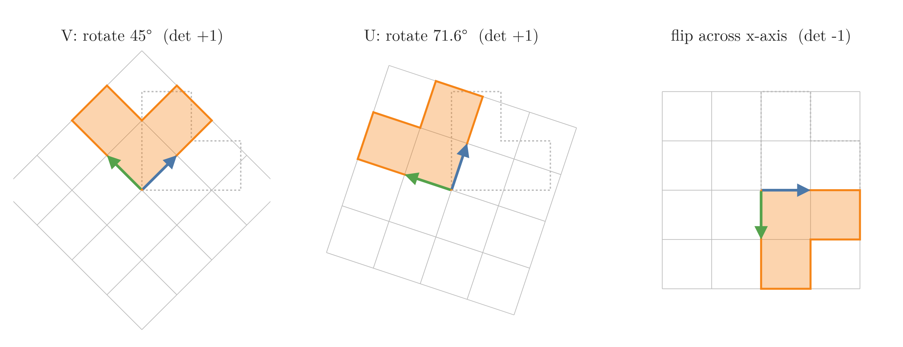
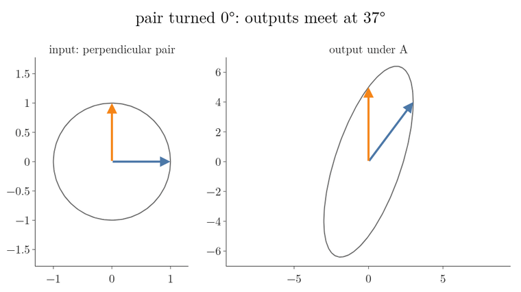
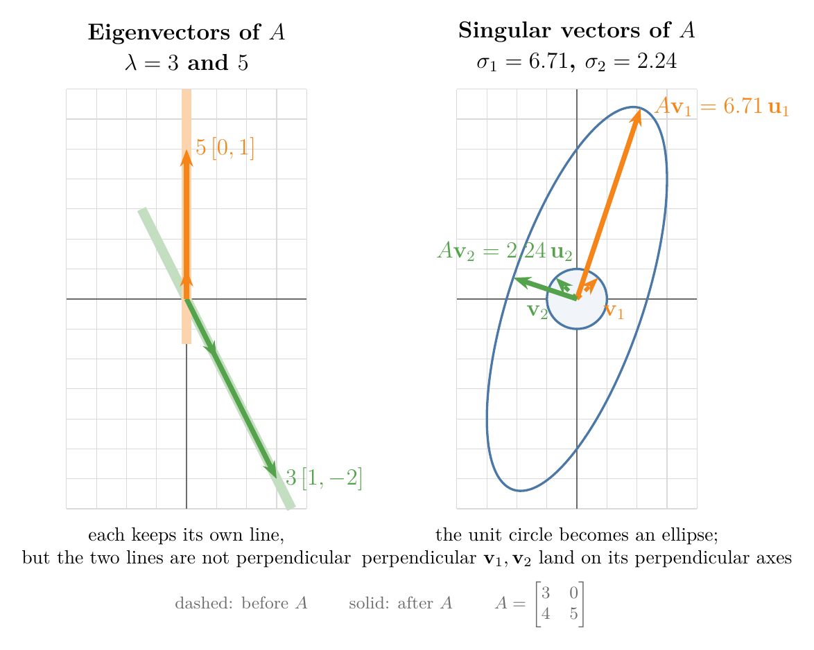
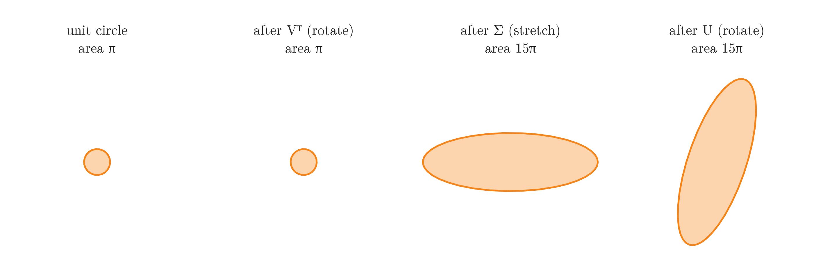
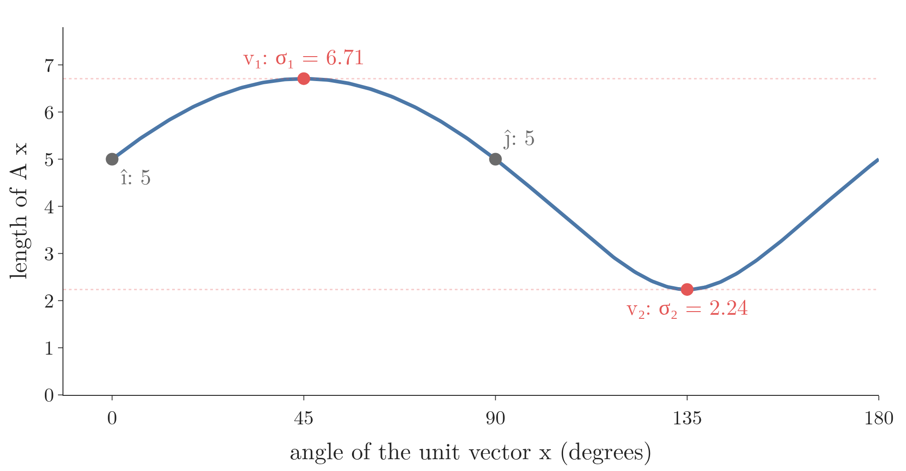
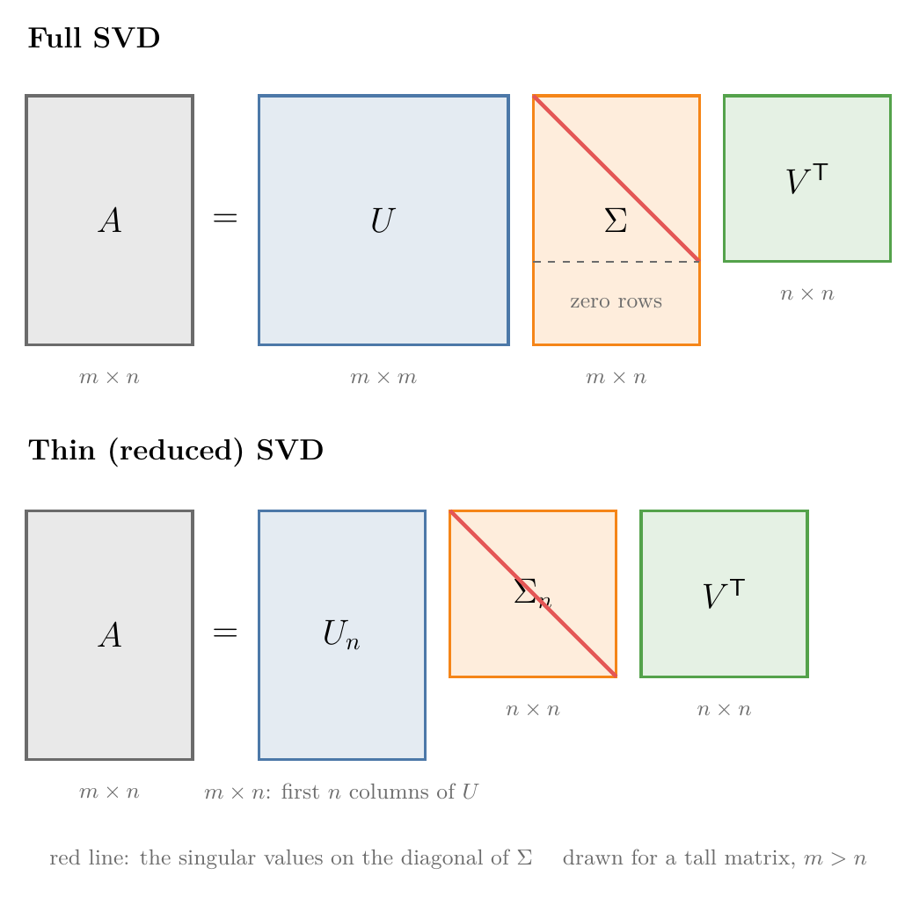

<!-- where-this-fits: generated by course_map/build_map.py; edit concepts.yaml, not this block -->
> **Where this fits:** Pipeline map step 0 (Foundations). See the [Course map](../../../00-course-map/00-course-map.md).
>
> 
>
> - **Builds on:** Linear transformations and matrices ([Note MA-053](../../../MA/05-linear-algebra/MA-053-linear-transformations-and-matrices/MA-053-linear-transformations-and-matrices.md)); Eigenvectors and eigenvalues ([Note MA-056](../../../MA/05-linear-algebra/MA-056-eigenvectors-and-eigenvalues/MA-056-eigenvectors-and-eigenvalues.md)).
> - **Leads to:** Low-rank approximation (truncated SVD) ([Note MA-059](../../../MA/05-linear-algebra/MA-059-low-rank-approximation/MA-059-low-rank-approximation.md)); Latent semantic analysis ([Note MA-060](../../../MA/05-linear-algebra/MA-060-svd-in-machine-learning/MA-060-svd-in-machine-learning.md)); Moore-Penrose pseudo-inverse ([Note MA-060](../../../MA/05-linear-algebra/MA-060-svd-in-machine-learning/MA-060-svd-in-machine-learning.md)).
> - **Compare with:** Eigenvectors and eigenvalues ([Note MA-056](../../../MA/05-linear-algebra/MA-056-eigenvectors-and-eigenvalues/MA-056-eigenvectors-and-eigenvalues.md)).
<!-- /where-this-fits -->

## 1. Overview

> **Key point:** Every matrix, square or not, can be written as $A = U\Sigma V^{\mathsf T}$: a rotation, then a stretch along the axes, then another rotation. The stretch factors are the singular values.

![The SVD of $A$ with rows $[3, 0]$ and $[4, 5]$ applied to the unit circle one factor at a time: $V^{\mathsf T}$ rotates, $\Sigma$ stretches, $U$ rotates](images/rotate_stretch_rotate.gif)

The [eigenvectors and eigenvalues Note](../MA-056-eigenvectors-and-eigenvalues/MA-056-eigenvectors-and-eigenvalues.md) wrote some square matrices as $A = PDP^{-1}$, with $D$ diagonal. That eigen-decomposition works only for square matrices with enough eigenvectors. The **singular value decomposition** (G-1813) (**SVD**) is a factorisation that works for every matrix. The [linear algebra roadmap Note](../MA-047-linear-algebra-roadmap/MA-047-linear-algebra-roadmap.md) listed it among the factorisations ML uses.

This Note builds it from the picture first:

- the matrices that only rotate or flip, called orthogonal matrices (Section 2);
- every matrix turns the unit circle into an ellipse (Section 3);
- $A = U\Sigma V^{\mathsf T}$ as rotate, stretch, rotate (Section 4 and Figure 1);
- singular values and singular vectors (Section 5);
- matrices that are not square, and the thin SVD (Section 6);
- how the SVD differs from the eigen-decomposition (Section 7).

How to compute the factors by hand comes in the [computing the SVD Note](../MA-058-computing-the-svd/MA-058-computing-the-svd.md).

One matrix runs through the whole Note:

$$A = \begin{bmatrix} 3 & 0 \cr4 & 5 \end{bmatrix}$$

Read as a transformation (as in the [linear transformations and matrices Note](../MA-053-linear-transformations-and-matrices/MA-053-linear-transformations-and-matrices.md)), $A$ sends $\hat{\imath}$ to $[3, 4]$ and $\hat{\jmath}$ to $[0, 5]$.

## 2. Orthogonal matrices: moves that only rotate or flip

> **Key point:** A square matrix whose columns are perpendicular unit vectors is an orthogonal matrix. It only rotates or flips space, keeps every length and angle, and its inverse is its transpose.

### 2.1 Recap: a matrix moves the grid

A matrix moves every point of the plane so that grid lines stay straight, parallel and evenly spaced, and the origin stays put: a **linear transformation** (G-1097). Its first column is where $\hat{\imath}$ lands and its second column is where $\hat{\jmath}$ lands. The [linear transformations and matrices Note](../MA-053-linear-transformations-and-matrices/MA-053-linear-transformations-and-matrices.md) teaches this picture; the SVD is built entirely from it.

### 2.2 Moves that keep every length and angle

> **Key point:** Some matrices turn the plane without stretching it: every arrow keeps its length, and every pair of arrows keeps its angle.

Draw two arrows with an angle between them, and let a matrix move the plane. Most matrices stretch the arrows and bend the angle. A few only turn the plane around, or turn it over, so that the arrows come out with the same lengths and the same angle as before: nothing is distorted.

![Two unit arrows, 60° apart, ride along as the grid moves. Under the rotation $V$ (45°) their lengths stay 1 and their angle stays 60°; under $A$ (rows $[3, 0]$, $[4, 5]$) they grow to 5 and 6.51 and close to 23.5°. Idea after Khan Academy, "Orthogonal matrices preserve angles and lengths"](images/orthogonal_keeps.gif)

In Figure 2, watch the three readouts. During the turn they never change. During $A$ all three change: $A$ is not one of these distortion-free moves.

### 2.3 Orthonormal columns

> **Key point:** Unit vectors that are all perpendicular to each other are called orthonormal. A matrix whose columns are orthonormal is an orthogonal matrix.

A set of vectors is **orthonormal** (G-1409) when each has length 1 and each pair is perpendicular (**orthogonal**, G-1408). A square matrix whose columns are orthonormal is an **orthogonal matrix** (G-1407). Our first example is

$$V = \frac{1}{\sqrt 2}\begin{bmatrix} 1 & -1 \cr1 & 1 \end{bmatrix}$$

Its columns $[0.707, 0.707]$ and $[-0.707, 0.707]$ each have length 1:

$$\sqrt{0.5 + 0.5} = 1$$

Their dot product is 0:

$$-0.5 + 0.5 = 0$$

Section 3 will meet these two columns again as the special input directions of $A$, and will build a second orthogonal matrix, $U$, from the special output directions.

("Orthonormal matrix" would be more accurate, but "orthogonal matrix" is the convention; MML Def. 3.8.)

### 2.4 What an orthogonal matrix does to space

> **Key point:** Its columns are where $\hat{\imath}$ and $\hat{\jmath}$ land; they stay perpendicular unit vectors, so the grid is only turned or mirrored.

Reading the columns as landing spots of $\hat{\imath}$ and $\hat{\jmath}$, an orthogonal matrix moves the two basis vectors to two other perpendicular unit vectors. The grid squares stay squares of the same size. So nothing is stretched or slanted; space is only rotated, or rotated and mirrored.

- $V$ sends $\hat{\imath}$ to $[0.707, 0.707]$: a **rotation** (G-1709) by 45° counterclockwise.
- $U$ of Section 3 sends $\hat{\imath}$ to $[0.316, 0.949]$: a rotation by 71.6°, since $\tan 71.6^\circ = 3$.
- A matrix with columns $[1, 0]$ and $[0, -1]$ is also orthogonal: a **reflection** (G-1651) that mirrors the plane across the x-axis.

{height=28%}

In Figure 3, watch the grid squares: each one stays a unit square, so lengths and angles survive. Only the flip turns the L into its mirror image. The determinant tells the two kinds apart: $+1$ for a rotation, $-1$ for a rotation combined with a flip. The determinant is never anything else, because areas do not change.

### 2.5 Why lengths and angles survive: the inverse is the transpose

> **Key point:** For an orthogonal matrix $Q$, $Q^{\mathsf T}Q = I$. That one fact keeps every length and angle, and makes undoing $Q$ free: $Q^{-1} = Q^{\mathsf T}$.

1. **In words:** entry $(i, j)$ of $Q^{\mathsf T}Q$ is the dot product of column $i$ with column $j$. The dot product is 1 when $i = j$ (unit length) and 0 otherwise (perpendicular), so the product is the **identity matrix** (G-915).
2. **Formula:**
   $$Q^{\mathsf T}Q = I, \qquad Q^{-1} = Q^{\mathsf T}$$
3. **Example:**
   $$V^{\mathsf T}V = \frac{1}{2}\begin{bmatrix} 1 & 1 \cr-1 & 1 \end{bmatrix}$$
   $$\qquad\times \begin{bmatrix} 1 & -1 \cr1 & 1 \end{bmatrix}$$
   $$V^{\mathsf T}V = \frac{1}{2}\begin{bmatrix} 2 & 0 \cr0 & 2 \end{bmatrix}$$
   $$V^{\mathsf T}V = I$$
   So $V^{\mathsf T}$ is the rotation by $-45^\circ$, the move that undoes $V$.
4. **Why lengths survive:** a squared length is a vector's dot product with itself, $\lVert\mathbf x\rVert^2 = \mathbf x^{\mathsf T}\mathbf x$. So
   $$\lVert Q\mathbf x\rVert^2 = (Q\mathbf x)^{\mathsf T}(Q\mathbf x) = \mathbf x^{\mathsf T}Q^{\mathsf T}Q\thinspace\mathbf x = \mathbf x^{\mathsf T}\mathbf x = \lVert\mathbf x\rVert^2$$
   In the same way $(Q\mathbf x)^{\mathsf T}(Q\mathbf y) = \mathbf x^{\mathsf T}\mathbf y$: dot products survive, and with them the cosine of every angle. This is what Figure 2 showed.

The **transpose** (G-2012) and the identity matrix were defined in the [PCA step by step Note](../../../ML/05-dimensionality/ML-047-pca-step-by-step/ML-047-pca-step-by-step.md), and the **inverse matrix** (G-968) in the [multiple linear regression maths Note](../../../ML/06-regression/ML-053-multiple-lr-maths/ML-053-multiple-lr-maths.md). Computing an inverse is normally expensive; for an orthogonal matrix it is free.

> **Extra:** The [eigenvectors and eigenvalues Note](../MA-056-eigenvectors-and-eigenvalues/MA-056-eigenvectors-and-eigenvalues.md) (section 7) said a covariance matrix always has perpendicular eigenvectors. Scaled to length 1 and placed as columns, they form an orthogonal matrix. The orthogonal eigenvector matrix is why PCA's projection onto the principal components is a pure rotation of the data, followed by dropping some coordinates.

## 3. Every matrix turns a circle into an ellipse

> **Key point:** A matrix sends the unit circle to an ellipse. There is always one perpendicular pair of input directions that lands exactly on the ellipse's two perpendicular axes.

### 3.1 Perpendicular in, usually not perpendicular out

> **Key point:** Most perpendicular pairs of vectors are not perpendicular any more after the matrix acts.

Take two perpendicular vectors and apply $A$. Usually the results are not perpendicular. The standard basis vectors are an example: $\hat{\imath}$ and $\hat{\jmath}$ meet at 90°, but they land on $[3, 4]$ and $[0, 5]$. Their dot product is:

$$3 \times 0 + 4 \times 5 = 20$$

This is not 0, so they are no longer at right angles (see the [dot product and cosine similarity Note](../MA-050-dot-product-and-cosine-similarity/MA-050-dot-product-and-cosine-similarity.md) for why a dot product of 0 means perpendicular).

### 3.2 The one pair that stays perpendicular

> **Key point:** For $A$, the unit vectors at 45° and 135° land on perpendicular vectors of lengths 6.71 and 2.24.

Turn the perpendicular pair around and at some angle the outputs become perpendicular too. Figure 4 turns the pair in 5° steps.



Watch the angle in the title: it starts at 37° for $\hat{\imath}, \hat{\jmath}$, reaches exactly 90° only at a turn of 45°, and passes it on the way to 136°. For $A$ the perpendicular pair is

$$\mathbf v_1 = \frac{1}{\sqrt 2}\begin{bmatrix} 1 \cr1 \end{bmatrix}$$
$$\mathbf v_1 \approx \begin{bmatrix} 0.707 \cr0.707 \end{bmatrix}$$

$$\mathbf v_2 = \frac{1}{\sqrt 2}\begin{bmatrix} -1 \cr1 \end{bmatrix}$$
$$\mathbf v_2 \approx \begin{bmatrix} -0.707 \cr0.707 \end{bmatrix}$$

Both are unit vectors (length 1), and they are perpendicular. Their outputs:

$$A\mathbf v_1 = \frac{1}{\sqrt 2}\begin{bmatrix} 3 \cr9 \end{bmatrix}$$
$$A\mathbf v_1 \approx \begin{bmatrix} 2.121 \cr6.364 \end{bmatrix}$$

$$A\mathbf v_2 = \frac{1}{\sqrt 2}\begin{bmatrix} -3 \cr1 \end{bmatrix}$$
$$A\mathbf v_2 \approx \begin{bmatrix} -2.121 \cr0.707 \end{bmatrix}$$

The dot product of the outputs is 0, so they are still perpendicular:

$$\tfrac{1}{2}(3 \times (-3) + 9 \times 1) = 0$$

Their lengths are:

$$\sqrt{90/2} = \sqrt{45} \approx 6.71$$
$$\sqrt{10/2} = \sqrt 5 \approx 2.24$$

### 3.3 The ellipse

> **Key point:** The unit circle becomes an ellipse whose long axis is $A\mathbf v_1$ and whose short axis is $A\mathbf v_2$.

Every point of the unit circle is a unit vector $\mathbf{x}$. Applying $A$ to all of them gives a closed curve, and for a linear transformation that curve is always an ellipse (Figure 5, right). Its two axes are perpendicular, and they are exactly $A\mathbf v_1$ and $A\mathbf v_2$.

{width=90%}

So the longest output any unit vector can reach is 6.71, along $A\mathbf v_1$, and the shortest is 2.24, along $A\mathbf v_2$. These two numbers are the **singular values** (G-1812) of $A$, written $\sigma_1 = 6.71$ and $\sigma_2 = 2.24$ ($\sigma$ is the Greek letter sigma).

Dividing each output by its length gives the directions of the ellipse's axes, as unit vectors:

$$\mathbf u_1 = \frac{A\mathbf v_1}{\sigma_1}$$
$$\mathbf u_1 = \frac{1}{\sqrt{10}}\begin{bmatrix} 1 \cr3 \end{bmatrix}$$
$$\mathbf u_1 \approx \begin{bmatrix} 0.316 \cr0.949 \end{bmatrix}$$

$$\mathbf u_2 = \frac{A\mathbf v_2}{\sigma_2}$$
$$\mathbf u_2 = \frac{1}{\sqrt{10}}\begin{bmatrix} -3 \cr1 \end{bmatrix}$$
$$\mathbf u_2 \approx \begin{bmatrix} -0.949 \cr0.316 \end{bmatrix}$$

### 3.4 The singular value equation

> **Key point:** $A\mathbf v_i = \sigma_i \mathbf u_i$: each input direction lands on its output direction, stretched by its singular value. This is the **singular value equation** (G-1814).

1. **In words:** $A$ takes the unit vector $\mathbf v_i$ to the unit vector $\mathbf u_i$, stretched by $\sigma_i$. The $\mathbf{v}$'s are perpendicular, and so are the $\mathbf{u}$'s.
2. **Formula:**
   $$A\mathbf v_i = \sigma_i \mathbf u_i$$
3. **Example:** for the first pair:
   $$A\mathbf v_1 = [2.121, 6.364]$$
   $$A\mathbf v_1 = 6.71 \times [0.316, 0.949] = \sigma_1 \mathbf u_1$$
   For the second pair:
   $$A\mathbf v_2 = [-2.121, 0.707]$$
   $$A\mathbf v_2 = 2.24 \times [-0.949, 0.316] = \sigma_2\mathbf u_2$$

The singular value equation looks like the eigenvector equation $A\mathbf{v} = \lambda\mathbf{v}$, with one difference: the vector on the right is a different vector, $\mathbf u_i$ instead of $\mathbf v_i$. Allowing the output direction to differ from the input direction is what makes this work for every matrix.

The $\mathbf v$'s are orthonormal, and so are the $\mathbf u$'s. Placed side by side as columns, the $\mathbf v$'s form the rotation $V$ of Section 2, and the $\mathbf u$'s form a second orthogonal matrix, the rotation by 71.6°:

$$V = \frac{1}{\sqrt 2}\begin{bmatrix} 1 & -1 \cr1 & 1 \end{bmatrix}$$

$$U = \frac{1}{\sqrt{10}}\begin{bmatrix} 1 & -3 \cr3 & 1 \end{bmatrix}$$

## 4. Rotate, stretch, rotate: $A = U\Sigma V^{\mathsf T}$

> **Key point:** $V^{\mathsf T}$ rotates $\mathbf v_1, \mathbf v_2$ onto the axes, $\Sigma$ stretches the axes by the singular values, and $U$ rotates the axes onto $\mathbf u_1, \mathbf u_2$.

### 4.1 From the singular value equation to the factorisation

> **Key point:** Stack the equations $A\mathbf v_i = \sigma_i\mathbf u_i$ side by side as $AV = U\Sigma$, then multiply by $V^{\mathsf T}$.

The two equations $A\mathbf v_1 = \sigma_1\mathbf u_1$ and $A\mathbf v_2 = \sigma_2\mathbf u_2$ can be written as one matrix equation. On the left, $A$ times the matrix with columns $\mathbf v_1, \mathbf v_2$ has columns $A\mathbf v_1, A\mathbf v_2$. On the right, the matrix with columns $\mathbf u_1, \mathbf u_2$ times a diagonal matrix scales column $i$ by $\sigma_i$:

Left side: $A$ times the matrix of the $\mathbf v$'s.

$$A \begin{bmatrix} \mathbf v_1 & \mathbf v_2 \end{bmatrix}$$

Right side: the matrix of the $\mathbf u$'s times the diagonal matrix.

$$\begin{bmatrix} \mathbf u_1 & \mathbf u_2 \end{bmatrix} \begin{bmatrix} \sigma_1 & 0 \cr0 & \sigma_2 \end{bmatrix}$$

The two sides are equal. In short:

$$AV = U\Sigma$$

Multiply both sides on the right by $V^{\mathsf T}$. Since $VV^{\mathsf T} = I$, the $V$ disappears from the left.

1. **In words:** every matrix is an orthogonal matrix, times a diagonal matrix of non-negative numbers, times another orthogonal matrix.
2. **Formula:**
   $$A = U\Sigma V^{\mathsf T}$$
   The columns of $U$ are the **left singular vectors** (G-1079) $\mathbf u_i$, the columns of $V$ are the **right singular vectors** (G-1692) $\mathbf v_i$, and the diagonal of $\Sigma$ holds the singular values $\sigma_i$.
3. **Example:**
   $$A = \begin{bmatrix} 3 & 0 \cr4 & 5 \end{bmatrix}$$
   The three factors:
   $$U = \frac{1}{\sqrt{10}}\begin{bmatrix} 1 & -3 \cr3 & 1 \end{bmatrix}$$
   $$\Sigma = \begin{bmatrix} 6.71 & 0 \cr0 & 2.24 \end{bmatrix}$$
   $$V^{\mathsf T} = \frac{1}{\sqrt 2}\begin{bmatrix} 1 & 1 \cr-1 & 1 \end{bmatrix}$$
   Their product is $A$:
   $$A = U\Sigma V^{\mathsf T}$$
   Multiplying out with the exact singular values gives back $A$ exactly:
   $$\sigma_1 = 3\sqrt5$$
   $$\sigma_2 = \sqrt5$$
   The [computing the SVD Note](../MA-058-computing-the-svd/MA-058-computing-the-svd.md) does it step by step.

### 4.2 Reading the three factors as moves

> **Key point:** Read $U\Sigma V^{\mathsf T}\mathbf{x}$ from right to left: rotate, stretch, rotate.

A product of matrices is one transformation after another, applied from right to left (see the [matrix multiplication as composition Note](../MA-054-matrix-multiplication-as-composition/MA-054-matrix-multiplication-as-composition.md)). The [eigenvectors and eigenvalues Note](../MA-056-eigenvectors-and-eigenvalues/MA-056-eigenvectors-and-eigenvalues.md) read $PDP^{-1}$ this way: translate into the coordinates of the eigenbasis with the **change of basis matrix** (G-374), scale each coordinate, translate back. $U\Sigma V^{\mathsf T}$ has the same "translate, transform, translate back" shape, with one difference: it uses two bases. $V^{\mathsf T}$ translates $\mathbf x$ into coordinates along $\mathbf v_1, \mathbf v_2$; $\Sigma$ scales each coordinate; $U$ translates the result out along $\mathbf u_1, \mathbf u_2$. Because both bases are orthonormal, both translations are rotations (or flips).

Figure 1 follows the unit circle through the three moves:

1. **$V^{\mathsf T}$ rotates.** $V^{\mathsf T}$ is the rotation by $-45^\circ$. It carries $\mathbf v_1$ onto $\hat{\imath}$ (written $\mathbf e_1$ in the figure) and $\mathbf v_2$ onto $\hat{\jmath}$ ($\mathbf e_2$). The circle looks the same, since a rotated circle is still a circle.
2. **$\Sigma$ stretches.** $\Sigma$ is a diagonal matrix, so it stretches along the axes only (as feature scaling did in the [linear transformations and matrices Note](../MA-053-linear-transformations-and-matrices/MA-053-linear-transformations-and-matrices.md), section 7.2): by 6.71 along x and 2.24 along y. The circle becomes an ellipse lying along the axes.
3. **$U$ rotates.** $U$ is the rotation by 71.6°. The rotation turns the ellipse so that its axes point along $\mathbf u_1$ and $\mathbf u_2$.

The final ellipse is exactly the one $A$ makes in one step (the dashed red curve in the last frame).

{height=24%}

Figure 6 tracks the area through the three moves: only the middle step changes it, which is the area check in the Extra box below. Every linear transformation of the plane is this simple underneath: a rotation, a stretch along two perpendicular directions, and another rotation. Either rotation may also include a flip.

> **Extra:** Each rotation preserves area, so all the area change happens in $\Sigma$. The area rule gives a check: $\lvert\det A\rvert = \sigma_1\sigma_2$. Here the determinant of $A$ is:
> $$\det A = 3 \times 5 - 0 \times 4 = 15$$
>
> The product of the singular values is the same:
>
> $$\sigma_1\sigma_2 = 3\sqrt5 \times \sqrt5 = 15$$
>
> A singular value of 0 means $\Sigma$ squishes one axis flat, which is the determinant-0 case of the [eigenvectors and eigenvalues Note](../MA-056-eigenvectors-and-eigenvalues/MA-056-eigenvectors-and-eigenvalues.md).

## 5. Singular values and singular vectors

> **Key point:** Singular values are never negative and are listed largest first; the number of non-zero ones is the rank; the largest is the most any unit vector can be stretched.

### 5.1 Ordering and sign

> **Key point:** We sort $\sigma_1 \ge \sigma_2 \ge \dots \ge 0$; a sign flip of a matching $\mathbf u_i$ and $\mathbf v_i$ gives an equally valid SVD.

- **Never negative.** A singular value is a length (of $A\mathbf v_i$), so $\sigma_i \ge 0$. If a stretch would need a negative number, we flip the sign of $\mathbf u_i$ instead.
- **Largest first.** By convention $\sigma_1 \ge \sigma_2 \ge \dots$. Then $\Sigma$ is unique for every matrix (MML Thm 4.22).
- **Signs of the vectors.** Changing both $\mathbf u_i$ and $\mathbf v_i$ to $-\mathbf u_i$ and $-\mathbf v_i$ keeps $A\mathbf v_i = \sigma_i\mathbf u_i$ true. So libraries may return vectors with signs opposite to ours, as NumPy does below. Flipping only one of the pair is wrong; the [computing the SVD Note](../MA-058-computing-the-svd/MA-058-computing-the-svd.md) shows what goes wrong.

### 5.2 Rank and the largest stretch

> **Key point:** The rank is the number of non-zero singular values; $\sigma_1$ is the longest $A\mathbf{x}$ can be for a unit vector $\mathbf{x}$.

- **Rank.** Each non-zero $\sigma_i$ gives one independent output direction $\mathbf u_i$; a zero $\sigma_i$ squishes its direction to nothing. So the **rank** (G-1627) of the matrix (see the [linear combinations, span and basis Note](../MA-052-linear-combinations-span-and-basis/MA-052-linear-combinations-span-and-basis.md), section 7) is the number of non-zero singular values. $A$ has two, so its rank is 2.
- **Largest stretch.** Every unit vector lands somewhere on the ellipse, and the farthest points of the ellipse are the ends of its long axis. So $\lVert A\mathbf{x}\rVert \le \sigma_1$ for every unit $\mathbf{x}$, and $\sigma_1$ is reached at $\mathbf{x} = \mathbf v_1$. In the same way, $\sigma_2$ is the smallest stretch of a $2 \times 2$ matrix.

For $A$: $\hat{\imath}$ lands on $[3, 4]$, of length 5; $\hat{\jmath}$ on $[0, 5]$, also of length 5. Both are below $\sigma_1 = 6.71$ and above $\sigma_2 = 2.24$.

{height=28%}

In Figure 7, watch the top and bottom of the curve: the top is $\sigma_1 = 6.71$ at 45° ($\mathbf v_1$), the bottom is $\sigma_2 = 2.24$ at 135° ($\mathbf v_2$), and $\hat{\imath}$ and $\hat{\jmath}$ sit in between at 5.

> **Python:** NumPy's `svd` returns $U$, the singular values as a 1D array, and $V^{\mathsf T}$ (called `Vh`).
>
> ```python
> import numpy as np
>
> A = np.array([[3, 0], [4, 5]])
> U, s, Vt = np.linalg.svd(A)
> s     # [6.708, 2.236]
> U     # [[-0.316, -0.949], [-0.949, 0.316]]
> Vt    # [[-0.707, -0.707], [-0.707, 0.707]]
> U @ np.diag(s) @ Vt     # gives back A
> ```
>
> The third output is already $V^{\mathsf T}$: its **rows** are the $\mathbf v_i$. NumPy's $\mathbf u_1$ and $\mathbf v_1$ are both the negatives of ours, an equally valid choice (Section 5.1).

## 6. Matrices that are not square

> **Key point:** For an $m \times n$ matrix, $U$ is $m \times m$, $\Sigma$ is $m \times n$ with zeros below (or beside) its diagonal, and $V$ is $n \times n$. The thin SVD drops the parts that only multiply zeros.

### 6.1 The full SVD

> **Key point:** $\Sigma$ has the same shape as $A$; its singular values sit on the diagonal, padded with zeros.

A matrix that is not square moves vectors between spaces of different dimensions. Its columns are still the landing spots of the basis vectors. A $3 \times 2$ matrix has two columns, so the input has two basis vectors (2D), and each landing spot has three coordinates, so the output is 3D: the whole input plane lands on a flat plane through the origin of 3D space, its **column space** (G-414). A $2 \times 3$ matrix does the reverse and squashes 3D space onto a plane.

A data matrix is rarely square: it has many more rows (**observations** (G-1374), one per record) than columns (**features** (G-772), one per input variable). The SVD still exists. For an $m \times n$ matrix $A$:

- $V$ is $n \times n$: an orthonormal basis of the input space $\mathbb{R}^n$;
- $U$ is $m \times m$: an orthonormal basis of the output space $\mathbb{R}^m$;
- $\Sigma$ is $m \times n$, the same shape as $A$, with $\sigma_1, \sigma_2, \dots$ on its diagonal and zeros everywhere else.

This factorisation is the **full SVD** (G-810) (Figure 9, top). Take the $3 \times 2$ matrix

$$B = \begin{bmatrix} 1 & 1 \cr0 & 1 \cr1 & 0 \end{bmatrix}$$

$B$ takes 2D vectors to 3D vectors. Its singular values are $\sqrt3 \approx 1.73$ and 1, so

$$\Sigma = \begin{bmatrix} 1.73 & 0 \cr0 & 1 \cr0 & 0 \end{bmatrix}$$

with a row of zeros at the bottom. $U$ is $3 \times 3$; its third column is a direction in 3D that no output of $B$ ever reaches.

Geometrically the picture is the same as in 2D, with one more dimension in the output. $V^{\mathsf T}$ rotates the unit circle in the plane; $\Sigma$ stretches it into an ellipse and places it in 3D space, on the flat floor where the third coordinate is 0; $U$ turns that flat ellipse to its final tilt in 3D. The outputs of $B$ fill only a tilted plane in 3D, never all of space.


In Figure 8, watch the floor: the first two moves never leave it, and only $U$, the $3 \times 3$ rotation, lifts the ellipse into 3D. It lands exactly on the dashed curve, and the red plane is everything $B$ can output.

{width=85%}

### 6.2 The thin (reduced) SVD

> **Key point:** Keep only the first $n$ columns of $U$ and the square top of $\Sigma$; the product is unchanged.

In the full SVD, the zero rows of $\Sigma$ multiply the last $m - n$ columns of $U$ by zero. Those columns never affect $A$, so we can drop them. The result is the **thin SVD** (G-1969), also called the **reduced SVD** (MML §4.5; Figure 9, bottom):

$$A = U_n \Sigma_n V^{\mathsf T}, \qquad U_n: m \times n, \quad \Sigma_n: n \times n, \quad V: n \times n$$

Now $\Sigma_n$ is a square diagonal matrix, as in an eigen-decomposition. For data with 10,000 rows and 5 columns, the full $U$ would be $10{,}000 \times 10{,}000$ (100 million numbers), while the thin $U_n$ is $10{,}000 \times 5$. The thin SVD is what we use in practice.

> **Extra:** For a wide matrix ($m < n$) everything mirrors: $\Sigma$ gets zero columns on the right, and the thin SVD keeps the first $m$ columns of $V$. Some books go one step further and keep only the $r$ columns that belong to non-zero singular values, where $r$ is the rank; all three versions describe the same factorisation.

> **Python:** `full_matrices=False` gives the thin SVD.
>
> ```python
> B = np.array([[1, 1], [0, 1], [1, 0]])
> U, s, Vt = np.linalg.svd(B)                       # full
> U.shape, s, Vt.shape        # (3, 3), [1.732, 1.0], (2, 2)
> Un, s, Vt = np.linalg.svd(B, full_matrices=False) # thin
> Un.shape                    # (3, 2)
> Un @ np.diag(s) @ Vt        # gives back B
> ```

## 7. SVD and eigen-decomposition compared

> **Key point:** The eigen-decomposition uses one basis that need not be perpendicular and exists only for some square matrices; the SVD uses two orthonormal bases and exists for every matrix.

Both factorisations have the same three-step shape: change of basis, scale each new axis, change basis again. Figure 5 shows the difference on $A$. Its eigenvectors, $[1, -2]$ (eigenvalue 3) and $[0, 1]$ (eigenvalue 5), each stay on their own line, but the two lines are not perpendicular. Its singular vectors are perpendicular and land on perpendicular vectors, but each one turns.

| | Eigen-decomposition $A = PDP^{-1}$ | SVD $A = U\Sigma V^{\mathsf T}$ |
|---|---|---|
| Which matrices | square, with an eigenbasis | every matrix, any shape |
| Bases | one basis, $P$, used in and out | two: $V$ for inputs, $U$ for outputs |
| Perpendicular? | not in general | always orthonormal |
| Undoing the basis | $P^{-1}$ must be computed | $V^{\mathsf T}$, free |
| Diagonal entries | eigenvalues: any sign, can be complex | singular values: real, $\ge 0$ |
| For $A$ | 3 and 5 | 6.71 and 2.24 |

The two agree for one important family. A **symmetric matrix** (G-1932) equals its own transpose. When it is also **positive semi-definite** (G-1532) (all its eigenvalues are 0 or positive), its eigenvectors are orthonormal and its eigenvalues are non-negative, so $P$ is orthogonal and $A = PDP^{\mathsf T}$ is already an SVD, with $U = V = P$. A covariance matrix is exactly such a matrix (see the [PCA step by step Note](../../../ML/05-dimensionality/ML-047-pca-step-by-step/ML-047-pca-step-by-step.md), section 4.3), so for it the eigenvalues and the singular values are the same numbers (MML §4.6).

> **Extra:** Even for a symmetric matrix the two can differ when an eigenvalue is negative. The matrix with rows $[0, 1]$ and $[1, 0]$ swaps x and y: its eigenvalues are 1 and $-1$, but its singular values are 1 and 1, because singular values ignore the flip and report only the stretch.

## 8. Summary

| Object | Meaning | For $A$ with rows $[3, 0]$, $[4, 5]$ |
|---|---|---|
| $\mathbf v_1, \mathbf v_2$ (columns of $V$) | perpendicular input directions that stay perpendicular | $[0.707, 0.707]$, $[-0.707, 0.707]$ |
| $\sigma_1, \sigma_2$ (diagonal of $\Sigma$) | stretch factors, largest first | 6.71, 2.24 |
| $\mathbf u_1, \mathbf u_2$ (columns of $U$) | axes of the output ellipse | $[0.316, 0.949]$, $[-0.949, 0.316]$ |
| $V^{\mathsf T}$, $\Sigma$, $U$ | rotate, stretch, rotate | $-45^\circ$; $\times 6.71$ and $\times 2.24$; $+71.6^\circ$ |

- Every matrix sends the unit circle to an ellipse; $A\mathbf v_i = \sigma_i\mathbf u_i$ names its axes.
- An orthogonal matrix has orthonormal columns, only rotates or flips, and has $Q^{-1} = Q^{\mathsf T}$.
- $A = U\Sigma V^{\mathsf T}$ for every matrix: rotate, stretch along the axes, rotate.
- Singular values are $\ge 0$; their count above zero is the rank; $\sigma_1$ is the largest stretch.
- For tall data, the thin SVD keeps only the first $n$ columns of $U$.
- For a covariance matrix, the SVD and the eigen-decomposition coincide.

## 9. Sources

**Built from**

- 3Blue1Brown (Sanderson, G.), "Linear transformations and matrices | Chapter 3, Essence of linear algebra", YouTube, https://www.youtube.com/watch?v=kYB8IZa5AuE
- Khan Academy (Khan, S.), "Orthogonal matrices preserve angles and lengths", YouTube, https://www.youtube.com/watch?v=yDwIfYjKEeo
- 3Blue1Brown (Sanderson, G.), "Nonsquare matrices as transformations between dimensions | Chapter 8, Essence of linear algebra", YouTube, https://www.youtube.com/watch?v=v8VSDg_WQlA
- 3Blue1Brown (Sanderson, G.), "Change of basis | Chapter 13, Essence of linear algebra", YouTube, https://www.youtube.com/watch?v=P2LTAUO1TdA

**Other references**

- Deisenroth, M. P., Faisal, A. A. and Ong, C. S. (2020). *Mathematics for Machine Learning*. Cambridge University Press. Definition 3.8, Theorem 4.22, sections 4.5–4.6 (MML): the circle-to-ellipse picture, the factorisation, singular values and the thin SVD, which no video in the list covers.
- Strang, G. (2016). *Introduction to Linear Algebra*, 5th ed. Wellesley-Cambridge Press. Sections 7.2 (bases and matrices in the SVD) and 7.4 (the geometry of the SVD).

## 10. Key terms

| Term | Meaning |
|---|---|
| Singular value decomposition (SVD) | Writing any matrix as $A = U\Sigma V^{\mathsf T}$: orthogonal, diagonal, orthogonal |
| Singular value ($\sigma_i$) | A stretch factor of a matrix: the length of $A\mathbf v_i$; never negative, listed largest first |
| Right singular vector ($\mathbf v_i$) (G-1692) | An input direction of the SVD; a column of $V$ |
| Left singular vector ($\mathbf u_i$) (G-1079) | An output direction of the SVD; a column of $U$ |
| Singular value equation | $A\mathbf v_i = \sigma_i\mathbf u_i$ |
| Orthonormal | Vectors of length 1 that are all perpendicular to each other |
| Orthogonal matrix | A square matrix with orthonormal columns; it rotates or flips, and its inverse is its transpose |
| Rotation | An orthogonal matrix with determinant $+1$: turns space without stretching or flipping |
| Reflection | An orthogonal transformation that mirrors space; determinant $-1$ |
| Full SVD | The SVD with square $U$ and $V$, and $\Sigma$ the same shape as $A$ |
| Thin (reduced) SVD | The SVD with only the columns of $U$ that meet the diagonal of $\Sigma$ |
| Symmetric matrix | A square matrix equal to its own transpose |
| Positive semi-definite | A symmetric matrix whose eigenvalues are all 0 or positive |
