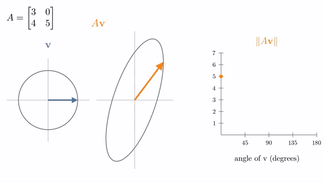
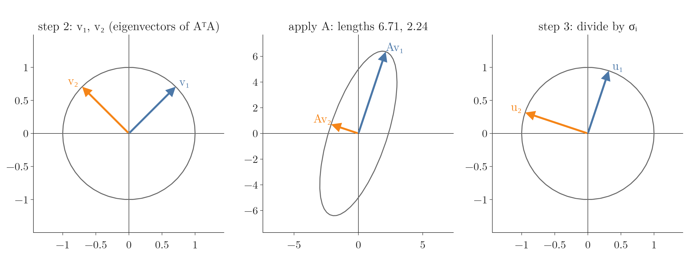
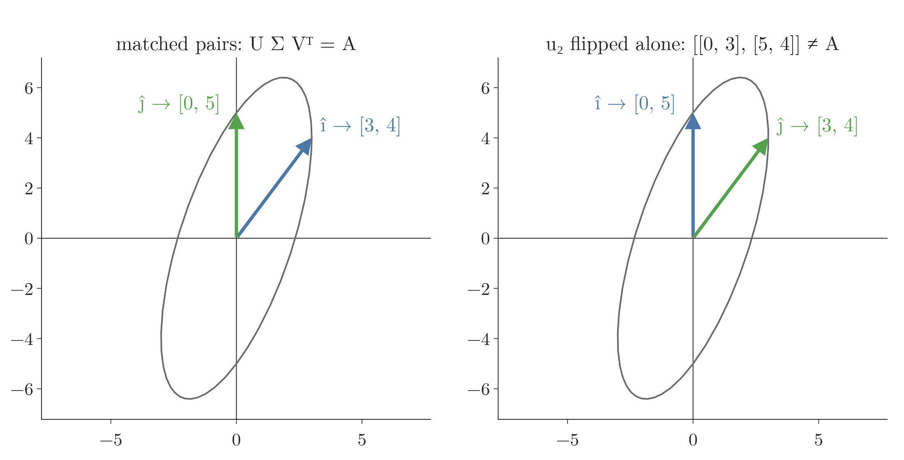
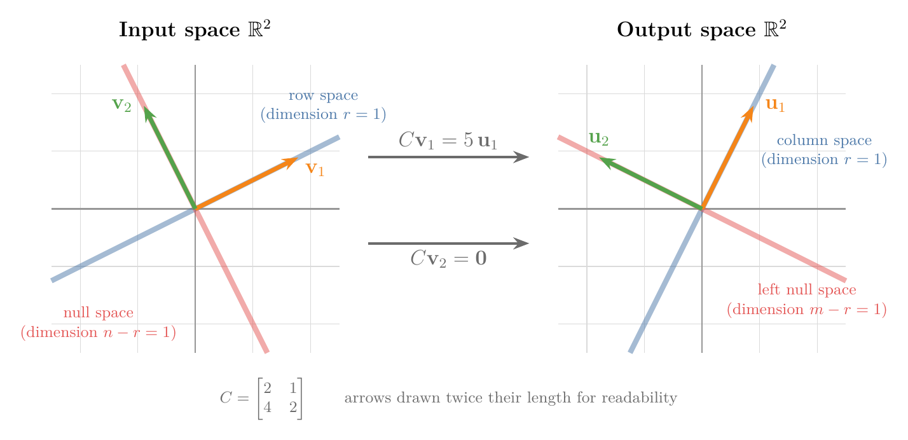
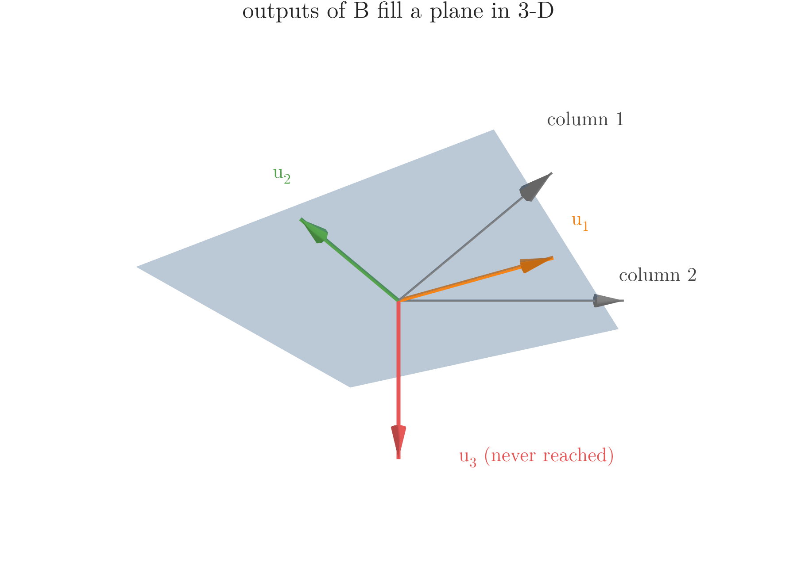

<!-- where-this-fits: generated by course_map/build_map.py; edit concepts.yaml, not this block -->
> **Where this fits:** Pipeline map step 0 (Foundations). See the [Course map](../../../00-course-map/00-course-map.md).
>
> 
>
> - **Builds on:** Linear transformations and matrices ([Note MA-053](../../../MA/05-linear-algebra/MA-053-linear-transformations-and-matrices/MA-053-linear-transformations-and-matrices.md)); Eigenvectors and eigenvalues ([Note MA-056](../../../MA/05-linear-algebra/MA-056-eigenvectors-and-eigenvalues/MA-056-eigenvectors-and-eigenvalues.md)).
> - **Leads to:** Low-rank approximation (truncated SVD) ([Note MA-059](../../../MA/05-linear-algebra/MA-059-low-rank-approximation/MA-059-low-rank-approximation.md)); Latent semantic analysis ([Note MA-060](../../../MA/05-linear-algebra/MA-060-svd-in-machine-learning/MA-060-svd-in-machine-learning.md)); Moore-Penrose pseudo-inverse ([Note MA-060](../../../MA/05-linear-algebra/MA-060-svd-in-machine-learning/MA-060-svd-in-machine-learning.md)).
> - **Compare with:** Eigenvectors and eigenvalues ([Note MA-056](../../../MA/05-linear-algebra/MA-056-eigenvectors-and-eigenvalues/MA-056-eigenvectors-and-eigenvalues.md)).
<!-- /where-this-fits -->

## 1. Overview

> **Key point:** A matrix stretches some directions more than others. To find the SVD by hand, we multiply the matrix by its own transpose. That new matrix keeps the stretching but forgets the final turn, so its eigenvectors are the directions of most and least stretch, and its eigenvalues are the squared stretches.

The first SVD Note, the [SVD geometry Note](../MA-057-svd-geometry/MA-057-svd-geometry.md), showed what $A = U\Sigma V^{\mathsf T}$ means: turn, stretch, turn. The three factors are:

- $V$, whose columns $\mathbf v_1, \mathbf v_2$ are the input directions (the **right singular vectors**, G-1692);
- $\Sigma$, the **diagonal matrix** (G-601) of stretches $\sigma_1, \sigma_2$ (the **singular values**, G-1812);
- $U$, whose columns $\mathbf u_1, \mathbf u_2$ are the output directions (the **left singular vectors**, G-1079).

It gave the factors of

$$A = \begin{bmatrix} 3 & 0 \cr4 & 5 \end{bmatrix}$$

without saying where they came from. This Note finds them, with a four-step recipe:


Figure 1 is the plan for the whole Note. Read it top to bottom: form a new symmetric matrix, take its eigenvectors and eigenvalues, turn the eigenvalues into stretches, then get the output directions from the input directions.

This Note covers:

- why $A^{\mathsf T}A$ and $AA^{\mathsf T}$ hold the answer (Section 2);
- the four-step recipe of Figure 1, worked on $A$ (Section 3);
- a sign trap, and how computing each $\mathbf u_i$ from its $\mathbf v_i$ avoids it (Section 4);
- a matrix of rank 1, where a singular value is 0 (Section 5);
- the four subspaces that the SVD gives bases for (Section 6);
- a matrix that is not square (Section 7);
- why computers do not use this recipe (Section 8).

Finding eigenvalues and eigenvectors by hand, with the determinant, is taught in the [eigenvectors and eigenvalues Note](../MA-056-eigenvectors-and-eigenvalues/MA-056-eigenvectors-and-eigenvalues.md); we use it here without repeating it.

## 2. Making one orthogonal matrix disappear

> **Key point:** The SVD has two unknown turning matrices, $U$ and $V$. In $A^{\mathsf T}A$, the turn $U$ cancels out, leaving a symmetric matrix whose eigenvectors and eigenvalues we can find by hand.

### 2.1 $A^{\mathsf T}A$ gives $V$ and the singular values

> **Key point:** The directions in which $A$ stretches most and least are the eigenvectors of $A^{\mathsf T}A$; the squared stretches are its eigenvalues.

**The idea in plain words.** Feed $A$ every arrow of length 1 and measure how long each output is. Some input directions get stretched a lot, others only a little. The longest and shortest stretches, and the directions that get them, are exactly the singular values and the right singular vectors.



Figure 2 does this for $A$. A unit arrow $\mathbf v$ goes round the circle (left), its output $A\mathbf v$ goes round an ellipse (middle), and the graph (right) tracks the length of $A\mathbf v$. Watch the peak and the trough:

- the longest stretch, 6.71, comes at the direction $\mathbf v_1 = [1, 1]/\sqrt2$;
- the shortest, 2.24, comes at $\mathbf v_2 = [-1, 1]/\sqrt2$, at a right angle to $\mathbf v_1$.

The question is how to find these two directions without sweeping every arrow.

**The trick on numbers.** The squared length of an output is the output dotted with itself, and that can be regrouped:

$$\lVert A\mathbf v\rVert^2 = (A\mathbf v)^{\mathsf T}(A\mathbf v)$$

$$= \mathbf v^{\mathsf T}(A^{\mathsf T}A)\mathbf v$$

So the matrix $A^{\mathsf T}A$ measures squared stretch. Here $A^{\mathsf T}$ is the **transpose** (G-2012) of $A$: the same numbers with rows and columns swapped. Compute $A^{\mathsf T}A$ entry by entry:

$$A^{\mathsf T} = \begin{bmatrix} 3 & 4 \cr0 & 5 \end{bmatrix}$$

| Entry of $A^{\mathsf T}A$ | Row of $A^{\mathsf T}$ times column of $A$ | Value |
|---|---|---|
| row 1, column 1 | $3 \times 3 + 4 \times 4$ | 25 |
| row 1, column 2 | $3 \times 0 + 4 \times 5$ | 20 |
| row 2, column 1 | $0 \times 3 + 5 \times 4$ | 20 |
| row 2, column 2 | $0 \times 0 + 5 \times 5$ | 25 |

$$A^{\mathsf T}A = \begin{bmatrix} 25 & 20 \cr20 & 25 \end{bmatrix}$$

Now apply $A^{\mathsf T}A$ to the peak direction of Figure 2, $\mathbf v_1 = [1, 1]/\sqrt2$:

$$A^{\mathsf T}A\begin{bmatrix} 1 \cr1 \end{bmatrix} = \begin{bmatrix} 25 + 20 \cr20 + 25 \end{bmatrix} = \begin{bmatrix} 45 \cr45 \end{bmatrix} = 45\begin{bmatrix} 1 \cr1 \end{bmatrix}$$

The direction did not change; it was only scaled by 45. So $\mathbf v_1$ is an **eigenvector** (G-666) of $A^{\mathsf T}A$ with **eigenvalue** (G-665) 45. And

$$\sqrt{45} = 6.71$$

is the peak stretch of Figure 2. The same check on the trough direction $[-1, 1]$:

$$A^{\mathsf T}A\begin{bmatrix} -1 \cr1 \end{bmatrix} = \begin{bmatrix} -25 + 20 \cr-20 + 25 \end{bmatrix} = \begin{bmatrix} -5 \cr5 \end{bmatrix} = 5\begin{bmatrix} -1 \cr1 \end{bmatrix}$$

$$\sqrt{5} = 2.24$$

the trough stretch.

**Why it works: the algebra, one step per line.** Start from $A = U\Sigma V^{\mathsf T}$. The transpose of a product is the product of the transposes in reverse order, and $U^{\mathsf T}U = I$, the **identity matrix** (G-915), because $U$ is an **orthogonal matrix** (G-1407) (see the [SVD geometry Note](../MA-057-svd-geometry/MA-057-svd-geometry.md), section 2.5):

$$A^{\mathsf T} = (U\Sigma V^{\mathsf T})^{\mathsf T} = V\Sigma^{\mathsf T}U^{\mathsf T}$$

$$A^{\mathsf T}A = V\Sigma^{\mathsf T}U^{\mathsf T}\thinspace U\Sigma V^{\mathsf T}$$

$$= V\Sigma^{\mathsf T}\thinspace I\thinspace\Sigma V^{\mathsf T}$$

$$= V\begin{bmatrix} \sigma_1^2 & & \cr& \ddots & \cr& & \sigma_n^2 \end{bmatrix}V^{\mathsf T}$$

The right side is exactly an eigen-decomposition $PDP^{-1}$ (see the [eigenvectors and eigenvalues Note](../MA-056-eigenvectors-and-eigenvalues/MA-056-eigenvectors-and-eigenvalues.md), section 6.2), with $P = V$ and $P^{-1} = V^{\mathsf T}$ (Strang §7.2; MML §4.5.2). So:

- the right singular vectors $\mathbf v_i$ are the eigenvectors of $A^{\mathsf T}A$;
- the squared singular values $\sigma_i^2$ are its eigenvalues $\lambda_i$, so $\sigma_i = \sqrt{\lambda_i}$.

Check: for $A$, the eigenvalues 45 and 5 give $\sigma_1 = 6.71$ and $\sigma_2 = 2.24$, the peak and trough of Figure 2.

### 2.2 Why this always works

> **Key point:** $A^{\mathsf T}A$ is symmetric with eigenvalues of at least 0, so it always has perpendicular eigenvectors and real square roots.

$A$ itself may have no useful eigenvectors, but $A^{\mathsf T}A$ always does, for two reasons.

**It is symmetric.** The matrix $A^{\mathsf T}A$ of Section 2.1 reads the same across its diagonal: 20 above and 20 below. That always happens, because its transpose is itself:

$$(A^{\mathsf T}A)^{\mathsf T} = A^{\mathsf T}(A^{\mathsf T})^{\mathsf T} = A^{\mathsf T}A$$

A **symmetric matrix** (G-1932) always has a full set of perpendicular eigenvectors (the same fact that makes PCA work on a covariance matrix, see the [PCA step by step Note](../../../ML/05-dimensionality/ML-047-pca-step-by-step/ML-047-pca-step-by-step.md), section 4.3). So $V$ can always be built as an orthogonal matrix. Check: $[1, 1]$ and $[-1, 1]$ have the dot product $-1 + 1 = 0$, so they are perpendicular.

**Its eigenvalues are never negative.** Take a unit eigenvector $\mathbf{v}$ with eigenvalue $\lambda$. Then, one step per line:

$$\lambda = \lambda\thinspace\mathbf v^{\mathsf T}\mathbf v = \mathbf{v}^{\mathsf T}(A^{\mathsf T}A\mathbf{v})$$

$$= (A\mathbf v)^{\mathsf T}(A\mathbf v)$$

$$= \lVert A\mathbf{v}\rVert^2 \ge 0$$

Here $\lVert A\mathbf v\rVert$ is the length of the output. Check with $\mathbf v_1$: the output $A\mathbf v_1 = [3, 9]/\sqrt2$ has squared length $(9 + 81)/2 = 45$, the eigenvalue. So the square root $\sigma = \sqrt\lambda$ is a real number of at least 0, and it is the length of $A\mathbf{v}$, as in Figure 2.

A symmetric matrix with no negative eigenvalues is **positive semi-definite** (G-1532). So $A^{\mathsf T}A$ is symmetric and positive semi-definite for every matrix $A$ of any shape.

### 2.3 $AA^{\mathsf T}$ gives $U$, with the same numbers

> **Key point:** Multiplying in the other order, $AA^{\mathsf T}$, cancels $V$ instead and keeps $U$; its non-zero eigenvalues are the same squared stretches.

**In plain words.** $A^{\mathsf T}A$ looks at the input side and finds the $\mathbf v$'s. Swapping the order looks at the output side and finds the $\mathbf u$'s.

**On numbers.** For $A$:

$$AA^{\mathsf T} = \begin{bmatrix} 3 & 0 \cr4 & 5 \end{bmatrix}\begin{bmatrix} 3 & 4 \cr0 & 5 \end{bmatrix} = \begin{bmatrix} 9 & 12 \cr12 & 41 \end{bmatrix}$$

a different matrix from $A^{\mathsf T}A$. Its eigenvalues still add up to the diagonal sum and multiply to the determinant:

$$9 + 41 = 50 = 45 + 5$$

$$9 \times 41 - 12 \times 12 = 369 - 144 = 225 = 45 \times 5$$

so they are 45 and 5 again.

**The algebra**, by the same steps as Section 2.1, using $V^{\mathsf T}V = I$:

$$AA^{\mathsf T} = U\Sigma V^{\mathsf T}\thinspace V\Sigma^{\mathsf T}U^{\mathsf T}$$

$$= U\thinspace\Sigma\Sigma^{\mathsf T}\thinspace U^{\mathsf T}$$

So the left singular vectors $\mathbf u_i$ are the eigenvectors of $AA^{\mathsf T}$, and its non-zero eigenvalues are the same $\sigma_i^2$. The match of 45 and 5 is no accident: $AB$ and $BA$ always share their non-zero eigenvalues.

## 3. The recipe, worked on a $2 \times 2$ matrix

> **Key point:** Find the eigenvectors and eigenvalues of $A^{\mathsf T}A$, take square roots, then get each $\mathbf u_i$ by applying $A$ to $\mathbf v_i$ and shrinking the result to length 1.

Figure 1 shows the four steps. We follow them for $A$ with rows $[3, 0]$ and $[4, 5]$.

**Step 1: form $A^{\mathsf T}A$.** As in Section 2.1:

$$A^{\mathsf T}A = \begin{bmatrix} 25 & 20 \cr20 & 25 \end{bmatrix}$$

**Step 2: eigenvalues and eigenvectors of $A^{\mathsf T}A$.**

*In words:* an eigenvalue $\lambda$ is a number for which $A^{\mathsf T}A - \lambda I$ (subtract $\lambda$ from the diagonal) squashes some arrow to zero; such a matrix has determinant 0.

*On numbers:*

$$\det\begin{bmatrix} 25 - \lambda & 20 \cr20 & 25 - \lambda \end{bmatrix} = (25 - \lambda)^2 - 20 \times 20$$

$$(25 - \lambda)^2 - 400 = 0$$

$$25 - \lambda = 20 \quad\text{or}\quad 25 - \lambda = -20$$

$$\lambda_1 = 45, \qquad \lambda_2 = 5 \quad \text{(largest first)}$$

$$\sigma_1 = \sqrt{45} = 3\sqrt5 \approx 6.708, \qquad \sigma_2 = \sqrt5 \approx 2.236$$

For each eigenvalue, find the line of arrows it squashes to zero:

| $\lambda$ | $A^{\mathsf T}A - \lambda I$ | sends $[x, y]$ to zero when |
|---|---|---|
| 45 | rows $[-20, 20]$, $[20, -20]$ | $x = y$ |
| 5 | rows $[20, 20]$, $[20, 20]$ | $y = -x$ |

Scaled to length 1 (divide by $\sqrt{1^2 + 1^2} = \sqrt2$):

$$\mathbf v_1 = \frac{1}{\sqrt2}\begin{bmatrix} 1 \cr1 \end{bmatrix}, \qquad \mathbf v_2 = \frac{1}{\sqrt2}\begin{bmatrix} -1 \cr1 \end{bmatrix}$$

The two vectors are perpendicular, as Section 2.2 promised.

*The formula:*

$$\det(A^{\mathsf T}A - \lambda I) = 0, \qquad \sigma_i = \sqrt{\lambda_i}$$

**Step 3: get each $\mathbf u_i$ from its $\mathbf v_i$.**

*In words:* apply $A$ to each right singular vector; the output points along an axis of the ellipse and has length $\sigma_i$. Shrink it back to length 1.

{height=26%}

In Figure 3, watch the middle panel: $A\mathbf v_1$ and $A\mathbf v_2$ already point along the ellipse's axes, so dividing by their lengths only shrinks them back onto the circle (right).

*On numbers:*

$$A\mathbf v_1 = \frac{1}{\sqrt2}\begin{bmatrix} 3 \times 1 + 0 \times 1 \cr4 \times 1 + 5 \times 1 \end{bmatrix} = \frac{1}{\sqrt2}\begin{bmatrix} 3 \cr9 \end{bmatrix}$$

$$\mathbf u_1 = \frac{1}{3\sqrt5}\cdot\frac{1}{\sqrt2}\begin{bmatrix} 3 \cr9 \end{bmatrix} = \frac{1}{\sqrt{10}}\begin{bmatrix} 1 \cr3 \end{bmatrix}$$

$$A\mathbf v_2 = \frac{1}{\sqrt2}\begin{bmatrix} 3 \times (-1) + 0 \times 1 \cr4 \times (-1) + 5 \times 1 \end{bmatrix} = \frac{1}{\sqrt2}\begin{bmatrix} -3 \cr1 \end{bmatrix}$$

$$\mathbf u_2 = \frac{1}{\sqrt5}\cdot\frac{1}{\sqrt2}\begin{bmatrix} -3 \cr1 \end{bmatrix} = \frac{1}{\sqrt{10}}\begin{bmatrix} -3 \cr1 \end{bmatrix}$$

*The formula:* the step is the **singular value equation** (G-1814) $A\mathbf v_i = \sigma_i\mathbf u_i$ solved for $\mathbf u_i$:

$$\mathbf u_i = \frac{1}{\sigma_i}A\mathbf v_i$$

The $\mathbf{u}$'s come out perpendicular without any extra work. Check on numbers: $[1, 3]$ and $[-3, 1]$ have the dot product $-3 + 3 = 0$. In symbols, one step per line:

$$(A\mathbf v_1)^{\mathsf T}(A\mathbf v_2) = \mathbf v_1^{\mathsf T}(A^{\mathsf T}A\mathbf v_2)$$

$$= \mathbf v_1^{\mathsf T}(\lambda_2\mathbf v_2) = \lambda_2\thinspace\mathbf v_1^{\mathsf T}\mathbf v_2 = 0$$

**Step 4: complete $U$.** Here there are already two $\mathbf{u}$'s for a $2 \times 2$ matrix, so nothing is missing. Sections 5 and 7 need this step.

**Check.** Multiplying the factors back together, one product at a time:

$$U\Sigma = \frac{1}{\sqrt{10}}\begin{bmatrix} 1 & -3 \cr3 & 1 \end{bmatrix}\begin{bmatrix} 3\sqrt5 & 0 \cr0 & \sqrt5 \end{bmatrix} = \frac{1}{\sqrt2}\begin{bmatrix} 3 & -3 \cr9 & 1 \end{bmatrix}$$

$$U\Sigma V^{\mathsf T} = \frac{1}{\sqrt2}\begin{bmatrix} 3 & -3 \cr9 & 1 \end{bmatrix}\cdot\frac{1}{\sqrt2}\begin{bmatrix} 1 & 1 \cr-1 & 1 \end{bmatrix} = \frac{1}{2}\begin{bmatrix} 6 & 0 \cr8 & 10 \end{bmatrix} = \begin{bmatrix} 3 & 0 \cr4 & 5 \end{bmatrix} = A$$

> **Python:** Checking each step with NumPy.
>
> ```python
> import numpy as np
>
> A = np.array([[3, 0], [4, 5]])
> lam, V = np.linalg.eigh(A.T @ A)   # eigh: for symmetric
> lam, V = lam[::-1], V[:, ::-1]     # largest first
> sigma = np.sqrt(lam)               # [6.708, 2.236]
> U = A @ V / sigma                  # column i = A v_i / sigma_i
> U @ np.diag(sigma) @ V.T           # gives back A
> ```
>
> `A @ V / sigma` divides column $i$ of $AV$ by $\sigma_i$: NumPy matches the 1D array `sigma` with the columns.

## 4. The sign trap

> **Key point:** Finding $U$ and $V$ separately as eigenvectors can pick mismatched signs and give a wrong product; computing $\mathbf u_i = A\mathbf v_i/\sigma_i$ always matches them.

Section 2.3 suggests a shortcut: take the $\mathbf{u}$'s as the eigenvectors of $AA^{\mathsf T}$, found on their own. For $A$, $AA^{\mathsf T}$ has rows $[9, 12]$ and $[12, 41]$, with eigenvalues 45 and 5. Its eigenvectors are the lines through $[1, 3]$ and through $[3, -1]$.

Every non-zero multiple of an eigenvector is an eigenvector too, so $\frac{1}{\sqrt{10}}[3, -1]$ is as correct an eigenvector as $\frac{1}{\sqrt{10}}[-3, 1]$. But it is the negative of the $\mathbf u_2$ that belongs with our $\mathbf v_2$. Using it gives

$$\frac{1}{\sqrt{10}}\begin{bmatrix} 1 & 3 \cr3 & -1 \end{bmatrix}\begin{bmatrix} 3\sqrt5 & 0 \cr0 & \sqrt5 \end{bmatrix}\frac{1}{\sqrt2}\begin{bmatrix} 1 & 1 \cr-1 & 1 \end{bmatrix} = \begin{bmatrix} 0 & 3 \cr5 & 4 \end{bmatrix} \ne A$$

{height=30%}

Each piece is a valid eigenvector, yet the product is a different matrix. Figure 4 shows why the mistake is easy to miss: both products have the singular values 6.71 and 2.24, so they draw the same ellipse; only where each input lands has changed. The pairs $(\mathbf u_i, \mathbf v_i)$ must match: flipping both signs is allowed, flipping one is not (see the [SVD geometry Note](../MA-057-svd-geometry/MA-057-svd-geometry.md), section 5.1). The eigenvalue problem for $AA^{\mathsf T}$ knows nothing about $V$, so it cannot keep the pairs matched.

The fix is Step 3: compute $\mathbf u_i = A\mathbf v_i / \sigma_i$ from the $\mathbf v_i$ already chosen. Then $A\mathbf v_i = \sigma_i\mathbf u_i$ holds by construction, whatever sign each $\mathbf v_i$ was given.

## 5. A matrix of rank 1

> **Key point:** A rank-1 matrix has one non-zero singular value; the zero one has no $\mathbf{u}$ from $A\mathbf{v}/\sigma$, so we complete $U$ with a perpendicular unit vector.

Some matrices squash the plane flat. Take

$$C = \begin{bmatrix} 2 & 1 \cr4 & 2 \end{bmatrix}$$

Its columns $[2, 4]$ and $[1, 2]$ both lie on the line through $[1, 2]$. Every output $C\mathbf{x}$ is a mix of the two columns, so every output lands on that one line: $C$ squishes the whole plane onto it.

- The set of all outputs is the **column space** (G-414) of $C$: here, the line through $[1, 2]$.
- The number of dimensions of the column space is the **rank** (G-1627) of the matrix: here 1. (The second row is twice the first, the algebraic sign of the same fact.)
- While the plane squashes onto a line, a whole other line of inputs, the one through $[-1, 2]$, lands on the origin. The set of inputs that land on $\mathbf{0}$ is the **null space** (G-1362).

![The rank-1 matrix $C$ moves the grid: the whole plane, and the unit circle (blue) with it, squashes onto the line through $[1, 2]$, while every point of the red line through $[-1, 2]$ lands on the origin. $\mathbf v_1$ (orange) ends at length 5 and $\mathbf v_2$ (purple) at length 0. Idea after 3Blue1Brown, "Inverse matrices, column space and null space | Chapter 7, Essence of linear algebra"](images/rank_one_squash.gif)

In Figure 5, watch the red line while the grid moves: it shrinks towards the origin and vanishes, while the circle flattens into a segment. The two readouts end at 5 and 0, the two singular values the recipe now computes.

**Step 1.**

$$C^{\mathsf T}C = \begin{bmatrix} 2 & 4 \cr1 & 2 \end{bmatrix}\begin{bmatrix} 2 & 1 \cr4 & 2 \end{bmatrix} = \begin{bmatrix} 20 & 10 \cr10 & 5 \end{bmatrix}$$

**Step 2.** The determinant and the diagonal sum give the two eigenvalues:

$$\det = 20 \times 5 - 10 \times 10 = 0 \quad\Longrightarrow\quad \lambda_2 = 0$$

$$\lambda_1 + \lambda_2 = 20 + 5 = 25 \quad\Longrightarrow\quad \lambda_1 = 25$$

$$\sigma_1 = \sqrt{25} = 5, \qquad \sigma_2 = 0$$

The eigenvectors are

$$\mathbf v_1 = \frac{1}{\sqrt5}\begin{bmatrix} 2 \cr1 \end{bmatrix}, \qquad \mathbf v_2 = \frac{1}{\sqrt5}\begin{bmatrix} -1 \cr2 \end{bmatrix}$$

$\mathbf v_2$ is the direction $C$ squishes to nothing:

$$C\begin{bmatrix} -1 \cr2 \end{bmatrix} = \begin{bmatrix} 2 \times (-1) + 1 \times 2 \cr4 \times (-1) + 2 \times 2 \end{bmatrix} = \begin{bmatrix} 0 \cr0 \end{bmatrix}$$

![$C$ flattens the unit circle onto a segment of the line through $[1, 2]$: $\mathbf v_1$ lands at length 5, $\mathbf v_2$ lands on the origin](images/rank_one.png){height=30%}

In Figure 6, the ellipse of the $2 \times 2$ case has collapsed: its short axis $\sigma_2$ is 0, so the whole circle lands on one line, reaching 5 on each side of the origin.

**Step 3.** Only $\sigma_1$ is non-zero:

$$\mathbf u_1 = \frac{1}{5}C\mathbf v_1 = \frac{1}{5\sqrt5}\begin{bmatrix} 5 \cr10 \end{bmatrix} = \frac{1}{\sqrt5}\begin{bmatrix} 1 \cr2 \end{bmatrix}$$

**Step 4.** Computing $\mathbf u_2 = C\mathbf v_2 / \sigma_2$ would divide zero by zero. Any unit vector perpendicular to $\mathbf u_1$ completes $U$ to an orthogonal matrix; we take $\mathbf u_2 = \frac{1}{\sqrt5}[-2, 1]$. This $\mathbf u_2$ is multiplied by $\sigma_2 = 0$, so it never affects the product.

**Result.**

$$C = \frac{1}{\sqrt5}\begin{bmatrix} 1 & -2 \cr2 & 1 \end{bmatrix}\begin{bmatrix} 5 & 0 \cr0 & 0 \end{bmatrix}\frac{1}{\sqrt5}\begin{bmatrix} 2 & 1 \cr-1 & 2 \end{bmatrix}$$

Only the first column of $U$ and the first row of $V^{\mathsf T}$ meet a non-zero number, so the product shrinks to

$$C = 5\cdot\frac{1}{\sqrt5}\begin{bmatrix} 1 \cr2 \end{bmatrix}\cdot\frac{1}{\sqrt5}\begin{bmatrix} 2 & 1 \end{bmatrix}$$

$$= \begin{bmatrix} 1 \cr2 \end{bmatrix}\begin{bmatrix} 2 & 1 \end{bmatrix} = \begin{bmatrix} 2 & 1 \cr4 & 2 \end{bmatrix}$$

A column times a row is a whole matrix of rank 1. The [low-rank approximation Note](../MA-059-low-rank-approximation/MA-059-low-rank-approximation.md) builds every matrix out of such pieces.

> **Python:** NumPy reports the zero singular value.
>
> ```python
> C = np.array([[2, 1], [4, 2]])
> np.linalg.svd(C)[1]      # [5., 0.]
> np.linalg.matrix_rank(C) # 1
> ```
>
> `matrix_rank` from the [linear combinations, span and basis Note](../MA-052-linear-combinations-span-and-basis/MA-052-linear-combinations-span-and-basis.md) works exactly this way: it counts the singular values that are not (almost) zero.

## 6. The four subspaces

> **Key point:** Every matrix splits its inputs into two perpendicular parts, the directions it uses and the directions it squashes to zero, and splits its outputs into the directions it reaches and the directions it never reaches. The SVD gives perpendicular bases for all four.

**The idea in plain words, on $C$.** Look again at the rank-1 matrix $C$ of Figures 5 and 6.

- On the input side, there are two perpendicular lines. Along the line through $[2, 1]$, $C$ does all its work: it stretches $\mathbf v_1$ by 5. Along the line through $[-1, 2]$, $C$ squashes everything to zero.
- On the output side, there are also two perpendicular lines. Every output lands on the line through $[1, 2]$. The perpendicular line through $[-2, 1]$ is never reached by any output.



Figure 7 draws these four lines. On the left is the input plane, on the right the output plane; the titles write each plane as $\mathbb{R}^2$, the space of all pairs of numbers such as $(2, 1)$. The arrow $\mathbf v_1$ on the left is carried to the line of $\mathbf u_1$ on the right; the arrow $\mathbf v_2$ goes to the origin.

**Worked check on numbers.** One line per subspace:

$$C\begin{bmatrix} 2 \cr1 \end{bmatrix} = \begin{bmatrix} 5 \cr10 \end{bmatrix} = 5\begin{bmatrix} 1 \cr2 \end{bmatrix} \qquad \text{(used direction, lands on the output line)}$$

$$C\begin{bmatrix} -1 \cr2 \end{bmatrix} = \begin{bmatrix} 0 \cr0 \end{bmatrix} \qquad \text{(squashed direction)}$$

$$[1, 2] \cdot [-2, 1] = -2 + 2 = 0 \qquad \text{(unreached direction is perpendicular to the output line)}$$

**The standard terms.** Together these are the **four fundamental subspaces** (G-799) of a matrix (Strang §7.2). A **subspace** here is a line, plane or higher flat set through the origin. We write $\mathbb{R}^n$ for the space of all lists of $n$ numbers: $\mathbb{R}^2$ holds pairs such as $(2, 1)$, $\mathbb{R}^3$ triples such as $(2, 1, 1)$. An $m \times n$ matrix ($m$ rows, $n$ columns) takes inputs from $\mathbb{R}^n$ and gives outputs in $\mathbb{R}^m$; for $C$, $m = n = 2$. For a matrix of rank $r$ (there are $r$ non-zero singular values):

| Subspace | Where | Basis from the SVD | Dimension | For $C$ |
|---|---|---|---|---|
| **Column space** (G-414) (span of the columns: every output) | output $\mathbb{R}^m$ | $\mathbf u_1, \dots, \mathbf u_r$ | $r$ | line through $[1, 2]$ |
| **Null space** (G-1362) (vectors sent to $\mathbf{0}$) | input $\mathbb{R}^n$ | $\mathbf v_{r+1}, \dots, \mathbf v_n$ | $n - r$ | line through $[-1, 2]$ |
| **Row space** (G-1713) (span of the rows) | input $\mathbb{R}^n$ | $\mathbf v_1, \dots, \mathbf v_r$ | $r$ | line through $[2, 1]$ |
| **Left null space** (G-1078) (outputs never reached, perpendicular to them) | output $\mathbb{R}^m$ | $\mathbf u_{r+1}, \dots, \mathbf u_m$ | $m - r$ | line through $[-2, 1]$ |

Check: for $C$, $r = 1$, so each subspace has dimension 1 (a line), as the last column says.

The first two are the ones Figure 5 showed moving: the column space is where every output lands (the **span** (G-1838) of the columns, from the [linear transformations and matrices Note](../MA-053-linear-transformations-and-matrices/MA-053-linear-transformations-and-matrices.md), section 6), and the null space is everything the matrix squishes to the origin. The other two are their partners: the row space is the input directions perpendicular to the null space, and the left null space is the output directions perpendicular to the column space.

What makes the SVD's bases special is that they line up in pairs: $A$ sends $\mathbf v_1$ to a multiple of $\mathbf u_1$, $\mathbf v_2$ to a multiple of $\mathbf u_2$, and so on, with no mixing. The null-space $\mathbf{v}$'s go to zero, which is where the zeros on the diagonal of $\Sigma$ come from. Any method of making perpendicular bases could give bases of the four subspaces; only the SVD's bases also make the matrix diagonal.

## 7. A matrix that is not square

> **Key point:** A tall matrix turns short lists into long lists, so its outputs cannot fill the bigger space. $A^{\mathsf T}A$ is the small matrix to work with, and the missing columns of $U$ point in the directions the outputs never reach.

**The idea in plain words.** Take the $3 \times 2$ matrix $B$ of the [SVD geometry Note](../MA-057-svd-geometry/MA-057-svd-geometry.md) (section 6):

$$B = \begin{bmatrix} 1 & 1 \cr0 & 1 \cr1 & 0 \end{bmatrix}$$

It takes an input of 2 numbers and gives an output of 3 numbers. For example:

$$B\begin{bmatrix} 2 \cr1 \end{bmatrix} = \begin{bmatrix} 2 + 1 \cr0 + 1 \cr2 + 0 \end{bmatrix} = \begin{bmatrix} 3 \cr1 \cr2 \end{bmatrix}$$

Every output is a mix of B's two columns, $[1, 0, 1]$ and $[1, 1, 0]$. Two arrows in 3D span a flat sheet through the origin, so all outputs lie on that sheet. One direction, sticking straight out of the sheet, is never reached.

{height=40%}

Figure 8 shows the sheet. The recipe will find $\mathbf u_1$ and $\mathbf u_2$ inside the sheet (Step 3), and Step 4 adds $\mathbf u_3$, the red arrow at a right angle to it.

**Steps 1 and 2.** $B^{\mathsf T}B$ is only $2 \times 2$:

$$B^{\mathsf T}B = \begin{bmatrix} 1 & 0 & 1 \cr1 & 1 & 0 \end{bmatrix}\begin{bmatrix} 1 & 1 \cr0 & 1 \cr1 & 0 \end{bmatrix} = \begin{bmatrix} 2 & 1 \cr1 & 2 \end{bmatrix}$$

$$(2 - \lambda)^2 - 1 = 0$$

$$2 - \lambda = 1 \quad\text{or}\quad 2 - \lambda = -1$$

$$\lambda_1 = 3, \qquad \lambda_2 = 1$$

So $\sigma_1 = \sqrt3 \approx 1.732$ and $\sigma_2 = 1$, with

$$\mathbf v_1 = \frac{1}{\sqrt2}\begin{bmatrix} 1 \cr1 \end{bmatrix}, \qquad \mathbf v_2 = \frac{1}{\sqrt2}\begin{bmatrix} 1 \cr-1 \end{bmatrix}$$

**Step 3.**

$$\mathbf u_1 = \frac{1}{\sqrt3}B\mathbf v_1 = \frac{1}{\sqrt3}\cdot\frac{1}{\sqrt2}\begin{bmatrix} 2 \cr1 \cr1 \end{bmatrix} = \frac{1}{\sqrt6}\begin{bmatrix} 2 \cr1 \cr1 \end{bmatrix} \approx \begin{bmatrix} 0.816 \cr0.408 \cr0.408 \end{bmatrix}$$

$$\mathbf u_2 = \frac{1}{1}B\mathbf v_2 = \frac{1}{\sqrt2}\begin{bmatrix} 0 \cr-1 \cr1 \end{bmatrix}$$

**Step 4.** $U$ is $3 \times 3$ and needs a third column, perpendicular to both. Try $[1, -1, -1]$:

$$[1, -1, -1] \cdot [2, 1, 1] = 2 - 1 - 1 = 0$$

$$[1, -1, -1] \cdot [0, -1, 1] = 0 + 1 - 1 = 0$$

Both dot products are 0, so

$$\mathbf u_3 = \frac{1}{\sqrt3}\begin{bmatrix} 1 \cr-1 \cr-1 \end{bmatrix}$$

The vector $\mathbf u_3$ spans the left null space, the one direction in 3D that $B$ never reaches (the red arrow of Figure 8).

The other route, eigenvectors of $BB^{\mathsf T}$, would mean a $3 \times 3$ eigenvalue problem (eigenvalues 3, 1 and 0), and would still risk the sign trap of Section 4. For a tall data matrix with thousands of rows, $A^{\mathsf T}A$ is the small one, so we always start from it.

## 8. How computers compute the SVD

> **Key point:** Forming $A^{\mathsf T}A$ squares the singular values, and small ones get lost in rounding. Libraries compute the SVD directly from $A$.

**In plain words.** A computer keeps only about 16 significant digits of each number. Squaring a tiny number makes it far tinier, and next to a big number it falls off the end of those 16 digits.

**On numbers.**

$$\text{a small singular value: } 10^{-9}$$

$$\text{its square, an eigenvalue of } A^{\mathsf T}A\text{: } 10^{-18}$$

$$\text{next to an eigenvalue of 4, the ratio is } 10^{-18} / 4 \approx 2.5 \times 10^{-19}$$

That is far below the 16th digit, so the small eigenvalue disappears in rounding.

> **Python:** A nearly rank-1 matrix: its second singular value is tiny but not zero.
>
> ```python
> M = np.array([[1, 1], [1, 1 + 1e-9]])
> np.linalg.svd(M)[1]              # [2.0, 5.0e-10]: correct
> np.sqrt(np.linalg.eigvalsh(M.T @ M))
> # [0.0, 2.0]: the small one is lost
> ```

{height=30%}

Figure 9 repeats the box for twelve values of the small number $\varepsilon$ (the $10^{-9}$ in the code). Watch the red line: it agrees with the blue one while $\sigma_2^2$ still fits in the 16 digits next to $\sigma_1^2 = 4$, then falls off a cliff. So `np.linalg.svd` never forms $A^{\mathsf T}A$; NumPy calls the LAPACK routine `gesdd` (NumPy docs, `numpy.linalg.svd`). That routine reduces $A$ itself step by step with orthogonal matrices, which do not magnify rounding errors, until the singular values can be read off (Trefethen and Bau, Lecture 31).

> **Extra:** The ratio of the largest to the smallest singular value is the **condition number** (G-441) of a matrix:
> $$\text{condition number} = \frac{\sigma_1}{\sigma_n}, \qquad \text{for } A\text{: } \frac{6.71}{2.24} = 3$$
> It measures how much errors in the input can be magnified by solving with that matrix. Forming $A^{\mathsf T}A$ squares it: a condition number of $10^8$ becomes $10^{16}$, which uses up all 16 digits (Trefethen and Bau, Lectures 12 and 19). The squaring is why the least-squares solvers of the [multiple linear regression code Note](../../../ML/06-regression/ML-054-multiple-lr-code/ML-054-multiple-lr-code.md) (section 6) prefer to work from $X$ itself rather than from $X^{\mathsf T}X$. `np.linalg.cond(A)` computes it.

## 9. Summary

| Step | What we compute | For $A$ (rows $[3,0]$, $[4,5]$) | For $C$ (rows $[2,1]$, $[4,2]$) |
|---|---|---|---|
| 1 | $A^{\mathsf T}A$ | rows $[25, 20]$, $[20, 25]$ | rows $[20, 10]$, $[10, 5]$ |
| 2 | eigenvalues, then $\sigma_i = \sqrt{\lambda_i}$ | $45, 5$ give $6.708, 2.236$ | $25, 0$ give $5, 0$ |
| 2 | eigenvectors $\mathbf v_i$ | $\frac{1}{\sqrt2}[1, 1]$, $\frac{1}{\sqrt2}[-1, 1]$ | $\frac{1}{\sqrt5}[2, 1]$, $\frac{1}{\sqrt5}[-1, 2]$ |
| 3 | $\mathbf u_i = A\mathbf v_i/\sigma_i$ | $\frac{1}{\sqrt{10}}[1, 3]$, $\frac{1}{\sqrt{10}}[-3, 1]$ | $\frac{1}{\sqrt5}[1, 2]$ |
| 4 | complete $U$ | nothing missing | $\frac{1}{\sqrt5}[-2, 1]$ |

- $A^{\mathsf T}A = V\Sigma^{\mathsf T}\Sigma V^{\mathsf T}$: eigenvectors are the $\mathbf v_i$, eigenvalues the $\sigma_i^2$.
- $A^{\mathsf T}A$ is always symmetric and positive semi-definite, so this always works.
- Get the $\mathbf u_i$ from $A\mathbf v_i/\sigma_i$, not from a separate eigen-problem: that keeps the signs matched.
- Zero singular values belong to the null space; the missing $\mathbf{u}$'s are any perpendicular completion.
- The SVD gives perpendicular bases for the row space, null space, column space and left null space.
- Computers compute the SVD from $A$ directly, because $A^{\mathsf T}A$ loses small singular values.

## 10. Sources

**Built from**

- 3Blue1Brown (Sanderson, G.), "Inverse matrices, column space and null space | Chapter 7, Essence of linear algebra", YouTube, https://www.youtube.com/watch?v=uQhTuRlWMxw
- Khan Academy (Khan, S.), "Column space of a matrix", YouTube, https://www.youtube.com/watch?v=st6D5OdFV9M
- Khan Academy (Khan, S.), "Rowspace and left nullspace", YouTube, https://www.youtube.com/watch?v=qBfc57x_RSg
- Strang, G., MIT OpenCourseWare 18.06 *Linear Algebra*, "Lecture 29: Singular value decomposition" (video, recorded 1999), ocw.mit.edu/courses/18-06-linear-algebra-spring-2010/resources/lecture-29-singular-value-decomposition. The recipe, the sign trap, the rank-1 example and the four subspaces (Sections 3 to 6).

**Other references**

- Strang, G. (2016). *Introduction to Linear Algebra*, 5th ed. Wellesley-Cambridge Press. Section 7.2, bases and matrices in the SVD: the recipe and the non-square example, which no video in the list works through.
- Deisenroth, M. P., Faisal, A. A. and Ong, C. S. (2020). *Mathematics for Machine Learning*. Cambridge University Press. Section 4.5.2 (MML).
- NumPy documentation. `numpy.linalg.svd` (uses LAPACK `gesdd`).
- Trefethen, L. N. and Bau, D. (1997). *Numerical Linear Algebra*. SIAM. Lecture 12 (conditioning), Lecture 19 (least squares and the normal equations), Lecture 31 (computing the SVD).

## 11. Key terms

| Term | Meaning |
|---|---|
| $A^{\mathsf T}A$ | The symmetric, positive semi-definite matrix whose eigenvectors are the right singular vectors and whose eigenvalues are the squared singular values |
| Row space | The span of the rows of a matrix; spanned by the $\mathbf v_i$ with $\sigma_i > 0$ |
| Null space | All vectors a matrix sends to $\mathbf{0}$; spanned by the $\mathbf v_i$ with $\sigma_i = 0$ |
| Column space | The span of the columns: every possible output; spanned by the $\mathbf u_i$ with $\sigma_i > 0$ |
| Left null space | The output directions perpendicular to every column; spanned by the remaining $\mathbf u_i$ |
| Rank (of a matrix) | The number of dimensions of the column space: how many dimensions the outputs fill |
| Four fundamental subspaces | Row space, null space, column space and left null space of a matrix |
| Condition number | $\sigma_1 / \sigma_n$: how much a matrix can magnify errors when we solve with it |
