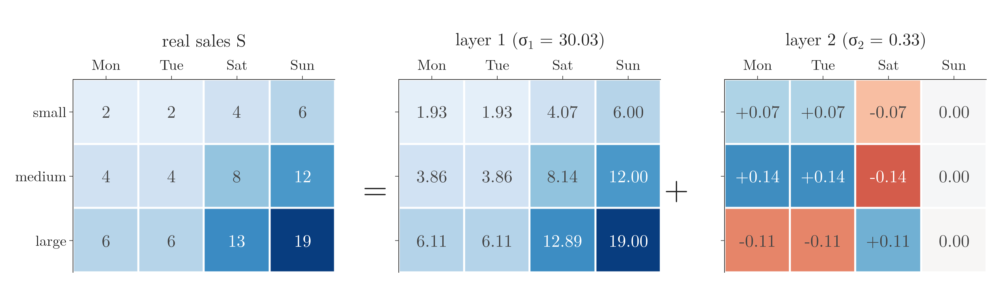
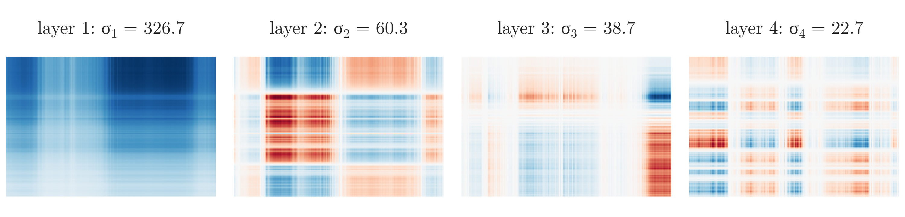
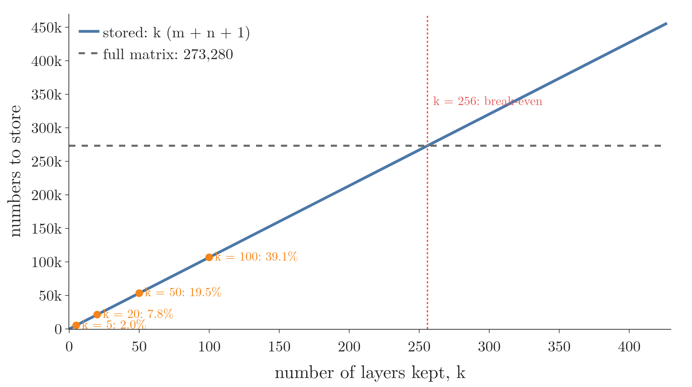
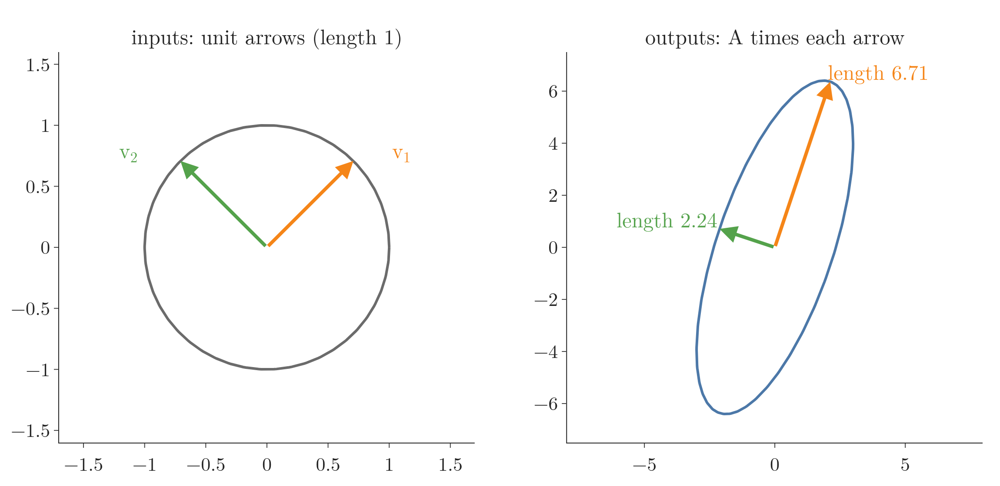
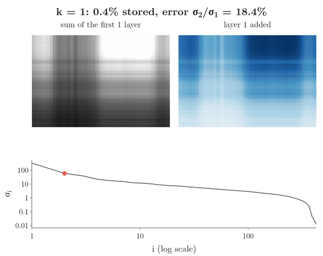
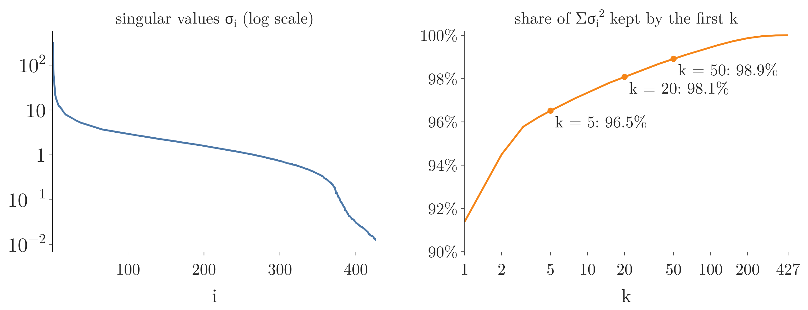

<!-- where-this-fits: generated by course_map/build_map.py; edit concepts.yaml, not this block -->
> **Where this fits:** Pipeline map step 6 (Reduce dimensions). See the [Course map](../../../00-course-map/00-course-map.md).
>
> 
>
> - **Builds on:** [Singular value decomposition](../../../MA/05-linear-algebra/MA-057-svd-geometry/MA-057-svd-geometry.md#1-overview).
> - **Compare with:** [PCA](../../../ML/01-foundations/ML-003-types-of-ml/ML-003-types-of-ml.md).
<!-- /where-this-fits -->

## 1. Overview

> **Key point:** Many tables of numbers are mostly one simple pattern plus small corrections. The SVD splits any matrix into layers, biggest first. Keeping only the big layers and dropping the small ones gives the best possible small summary of the matrix, and the size of its error is the biggest layer we dropped.

A small shop keeps a table of how many boxes of ice cream each of its three branches sells on each of four days. The large branch always sells about three times what the small branch sells, and Sunday is always about three times as busy as Monday. So the whole table is almost "branch size times day busyness": one simple pattern, plus a few small surprises. Writing down the pattern takes 7 numbers instead of 12. Keeping the pattern and dropping the surprises is what this Note calls a low-rank approximation.

A photo works the same way, only bigger.


Figure 1 shows the payoff. Each panel is the same photo rebuilt from its first $k$ layers: read the panels left to right, top row first, with $k$ growing from 1 to 100, and the last panel is the original. The grey photo is a table of 273,280 brightness values. Built from its first $k$ layers, it is recognisable from 8 percent of the numbers ($k = 20$), and close to the original from 20 percent ($k = 50$).

The SVD (singular value decomposition) writes a matrix (a table of numbers) as a product of three factors $U$, $\Sigma$ and $V$ ([rotate, stretch, rotate](../MA-057-svd-geometry/MA-057-svd-geometry.md#4-rotate-stretch-rotate-a--usigma-vmathsf-t)), and [the recipe worked on a 2 × 2 matrix](../MA-058-computing-the-svd/MA-058-computing-the-svd.md#3-the-recipe-worked-on-a-2-times-2-matrix) found them by hand. Now we use them. The formal grounding is *Mathematics for Machine Learning* (Deisenroth, Faisal, Ong, 2020; MML below), §4.6 Matrix Approximation.

This Note covers:

- a table that is one column times one row (Section 2.1), and any matrix as a sum of such layers (Section 2.2);
- keeping only the first $k$ layers, the rank $k$ approximation (Section 3);
- why it is the best one possible, the Eckart–Young theorem (Section 4);
- compressing an image (Section 5) and choosing $k$ (Section 6);
- removing noise (Section 7).

## 2. A matrix as a sum of rank-1 layers

> **Key point:** The simplest kind of table is one column of numbers times one row of numbers. The SVD writes every matrix as a sum of such tables, each scaled by a singular value, biggest first.

### 2.1 A table that is a column times a row

> **Key point:** If every row of a table is a multiple of the same row, the whole table is one column times one row: an outer product, a matrix of rank 1.

**The idea in plain words.** Start with the shop's plan. Each branch has a size, and each day has a busyness:

| Branch | Size |
|---|---|
| small | 1 |
| medium | 2 |
| large | 3 |

| Day | Mon | Tue | Sat | Sun |
|---|---|---|---|---|
| Busyness | 2 | 2 | 4 | 6 |

The plan says: boxes sold = branch size × day busyness. Each entry of the table is one size times one busyness.

![The plan table built row by row: each row is the branch size (orange, left) times the row of day busyness [2, 2, 4, 6] (top). The finished table has 12 entries but is fully described by 3 + 4 = 7 numbers](images/outer_product.gif)

**Worked example, row by row.** Figure 2 fills the table one row at a time. Watch the red box move down:

$$\text{small row} = 1 \times [2, 2, 4, 6] = [2, 2, 4, 6]$$

$$\text{medium row} = 2 \times [2, 2, 4, 6] = [4, 4, 8, 12]$$

$$\text{large row} = 3 \times [2, 2, 4, 6] = [6, 6, 12, 18]$$

Every row is a multiple of the same row $[2, 2, 4, 6]$, and every column is a multiple of the same column $[1, 2, 3]$. The table has 12 entries, but 7 numbers (3 sizes and 4 busyness values) describe it completely.

**The standard terms.** A column of numbers times a row of numbers is an **outer product** (G-1418). We write the column as $\mathbf u$ and the row as $\mathbf v^{\mathsf T}$, where the T (**transpose**, G-2012) turns the column $\mathbf v$ on its side into a row. Here

$$\mathbf u = \begin{bmatrix} 1 \cr2 \cr3 \end{bmatrix}$$

$$\mathbf v^{\mathsf T} = \begin{bmatrix} 2 & 2 & 4 & 6 \end{bmatrix}$$

The **rank** (G-1627) of a matrix counts how many different row patterns it really has (the number of dimensions its outputs fill; see [span](../MA-052-linear-combinations-span-and-basis/MA-052-linear-combinations-span-and-basis.md#6-span)). Every row of an outer product is a multiple of one row, so an outer product has rank 1.

**The formal version.** A matrix with $m$ rows and $n$ columns is called $m \times n$: the plan table is $3 \times 4$. For a column $\mathbf u$ with $m$ entries and a column $\mathbf v$ with $n$ entries, the outer product $\mathbf u\mathbf v^{\mathsf T}$ is the $m \times n$ matrix whose entry in row $i$, column $j$ is $u_i v_j$. With two entries each:

$$\mathbf{u}\mathbf{v}^{\mathsf T} = \begin{bmatrix} u_1 \cr u_2 \end{bmatrix}\begin{bmatrix} v_1 & v_2 \end{bmatrix}$$

$$\mathbf{u}\mathbf{v}^{\mathsf T} = \begin{bmatrix} u_1v_1 & u_1v_2 \cr u_2v_1 & u_2v_2 \end{bmatrix}$$

Check on the plan table: row 2, column 4 is

$$u_2 v_4 = 2 \times 6 = 12$$

as in Figure 2. A smaller example, used again below:

$$\begin{bmatrix} 1 \cr3 \end{bmatrix}\begin{bmatrix} 1 & 1 \end{bmatrix}$$

$$= \begin{bmatrix} 1 & 1 \cr3 & 3 \end{bmatrix}$$

An outer product needs only $m + n$ numbers to describe, instead of $m \times n$. The dot product does the multiplication the other way round, a row times a column, and gives one number (see [the dot product as a matrix product](../MA-050-dot-product-and-cosine-similarity/MA-050-dot-product-and-cosine-similarity.md#31-the-dot-product-as-a-matrix-product)).

### 2.2 Splitting any matrix into layers

> **Key point:** A real table is not exactly one outer product. The SVD splits it into a big outer product plus smaller ones, each weighted by a singular value.

**The idea in plain words.** Real sales never follow the plan exactly. Suppose the large branch, which sits next to a park, sold one extra box on Saturday and on Sunday. Its row is now $[6, 6, 13, 19]$, and that row is no longer a multiple of $[2, 2, 4, 6]$. The table is no longer a single outer product. But it is still almost one: a big pattern plus a small correction.



Figure 3 shows the split. Read it as a sum, entry by entry. For the large branch on Saturday:

$$\text{real sales} = 13$$

$$\text{layer 1} = 12.89$$

$$\text{layer 2} = +0.11$$

$$12.89 + 0.11 = 13.00$$

Layer 1 carries nearly everything: each of its entries is within 0.14 of the real table. Layer 2 is the small correction for the park.

**The standard terms.** Each piece is a **rank-1 layer** (G-1631). The weight of layer $i$ is its **singular value** (G-1812), written $\sigma_i$ (the Greek letter "sigma"): here $\sigma_1 = 30.03$ and $\sigma_2 = 0.33$. The column of layer $i$ is the **left singular vector** (G-1079) $\mathbf u_i$, and its row is the transposed **right singular vector** (G-1692) $\mathbf v_i^{\mathsf T}$; both have length 1, so all the size sits in $\sigma_i$. The singular values come out sorted, biggest first.

**Worked example on the 2 × 2 matrix.** The SVD Notes used

$$A = \begin{bmatrix} 3 & 0 \cr4 & 5 \end{bmatrix}$$

[The recipe worked on a 2 × 2 matrix](../MA-058-computing-the-svd/MA-058-computing-the-svd.md#3-the-recipe-worked-on-a-2-times-2-matrix) found its factors:

| $i$ | $\sigma_i$ | $\mathbf u_i$ | $\mathbf v_i$ |
|---|---|---|---|
| 1 | $3\sqrt5 = 6.71$ | $\frac{1}{\sqrt{10}}[1, 3]$ | $\frac{1}{\sqrt2}[1, 1]$ |
| 2 | $\sqrt5 = 2.24$ | $\frac{1}{\sqrt{10}}[-3, 1]$ | $\frac{1}{\sqrt2}[-1, 1]$ |

Layer 1, one step at a time:

$$\mathbf u_1 = \frac{1}{\sqrt{10}}\begin{bmatrix} 1 \cr3 \end{bmatrix}$$

$$\mathbf v_1^{\mathsf T} = \frac{1}{\sqrt2}\begin{bmatrix} 1 & 1 \end{bmatrix}$$

$$\frac{1}{\sqrt{10}}\cdot\frac{1}{\sqrt2} = \frac{1}{\sqrt{20}}$$

$$\begin{bmatrix} 1 \cr3 \end{bmatrix}\begin{bmatrix} 1 & 1 \end{bmatrix}$$

$$= \begin{bmatrix} 1 & 1 \cr3 & 3 \end{bmatrix}$$

$$\mathbf u_1\mathbf v_1^{\mathsf T} = \frac{1}{\sqrt{20}}\begin{bmatrix} 1 & 1 \cr3 & 3 \end{bmatrix}$$

Multiply by $\sigma_1$:

$$\sigma_1\mathbf u_1\mathbf v_1^{\mathsf T} = \frac{3\sqrt5}{\sqrt{20}}\begin{bmatrix} 1 & 1 \cr3 & 3 \end{bmatrix}$$

$$\sigma_1\mathbf u_1\mathbf v_1^{\mathsf T} = 1.5\begin{bmatrix} 1 & 1 \cr3 & 3 \end{bmatrix}$$

$$\sigma_1\mathbf u_1\mathbf v_1^{\mathsf T} = \begin{bmatrix} 1.5 & 1.5 \cr4.5 & 4.5 \end{bmatrix}$$

Layer 2:

$$\sigma_2\mathbf u_2\mathbf v_2^{\mathsf T} = \frac{\sqrt5}{\sqrt{20}}\begin{bmatrix} 3 & -3 \cr-1 & 1 \end{bmatrix}$$

$$\sigma_2\mathbf u_2\mathbf v_2^{\mathsf T} = 0.5\begin{bmatrix} 3 & -3 \cr-1 & 1 \end{bmatrix}$$

$$\sigma_2\mathbf u_2\mathbf v_2^{\mathsf T} = \begin{bmatrix} 1.5 & -1.5 \cr-0.5 & 0.5 \end{bmatrix}$$

The sum:

$$\begin{bmatrix} 1.5 & 1.5 \cr4.5 & 4.5 \end{bmatrix}$$

$$+ \begin{bmatrix} 1.5 & -1.5 \cr-0.5 & 0.5 \end{bmatrix}$$

$$= \begin{bmatrix} 3 & 0 \cr4 & 5 \end{bmatrix} = A$$

The first layer already has the right overall size: its bottom row $[4.5, 4.5]$ is close to $A$'s $[4, 5]$. The second layer is a smaller correction.

**The formal version.** A matrix of rank $r$ is the sum of $r$ rank-1 layers (MML §4.6):

$$A = U\Sigma V^{\mathsf T} = \sum_{i=1}^{r} \sigma_i\thinspace\mathbf u_i\mathbf v_i^{\mathsf T}$$

Here $U$ holds the columns $\mathbf u_i$, $V$ the columns $\mathbf v_i$, and $\Sigma$ (capital sigma) is the **diagonal matrix** (G-601) with $\sigma_1, \sigma_2, \dots$ on its diagonal and 0 elsewhere. The sign $\sum_{i=1}^{r}$ means "add the terms for $i = 1, 2, \dots, r$". Check: for $A$, $r = 2$ and the two terms are the two layers just added.

Why each $\mathbf u_i$ pairs only with its own $\mathbf v_i$: in the product $U\Sigma V^{\mathsf T}$, column $i$ of $U$ meets row $j$ of $V^{\mathsf T}$ through the entry of $\Sigma$ in row $i$, column $j$. That entry is 0 unless $i = j$, so all cross terms vanish. Layers with $\sigma_i = 0$ add nothing, so only the first $r$ count.



Figure 4 shows the first four layers of the photo of Figure 1. Each is a column times a row, so each is a pattern of horizontal and vertical stripes, like the plan table. The first one is a blurred brightness map; later ones add finer corrections, positive (blue) in some places and negative (red) in others.

> **Python:** One layer is `s[i] * np.outer(U[:, i], Vt[i])`.
>
> ```python
> import numpy as np
>
> A = np.array([[3, 0], [4, 5]])
> U, s, Vt = np.linalg.svd(A)
> L1 = s[0] * np.outer(U[:, 0], Vt[0])   # [[1.5, 1.5], [4.5, 4.5]]
> L2 = s[1] * np.outer(U[:, 1], Vt[1])   # [[1.5, -1.5], [-0.5, 0.5]]
> L1 + L2                                # gives back A
> ```
>
> NumPy's signs of $\mathbf u_i$ and $\mathbf v_i$ may both be flipped; their outer product, and so the layer, is the same.

## 3. The rank $k$ approximation

> **Key point:** Keep the first $k$ layers and drop the rest. The result has rank $k$ and needs only $k(m + n + 1)$ numbers.

**The idea in plain words.** Go back to Figure 3 and throw away layer 2, the park correction. What is left is layer 1 alone. Round its entries to whole boxes:

| Branch | Mon | Tue | Sat | Sun |
|---|---|---|---|---|
| small: 1.93, 1.93, 4.07, 6.00 rounded | 2 | 2 | 4 | 6 |
| medium: 3.86, 3.86, 8.14, 12.00 rounded | 4 | 4 | 8 | 12 |
| large: 6.11, 6.11, 12.89, 19.00 rounded | 6 | 6 | 13 | 19 |

The rounded layer 1 is exactly the real table, park extras included. One layer was enough here because the dropped layer was tiny ($\sigma_2 = 0.33$ against $\sigma_1 = 30.03$).

**The standard term.** Keeping the $k$ largest singular values with their vectors and dropping the rest gives the **rank $k$ approximation** of $A$, also called the **truncated SVD** (G-1630). It is written $\hat A_k$, read "A hat k".

**Worked example on the 2 × 2 matrix.** For $A$, the rank-1 approximation is its first layer:

$$\hat A_1 = \begin{bmatrix} 1.5 & 1.5 \cr4.5 & 4.5 \end{bmatrix}$$

**The formal version** (MML §4.6):

$$\hat A_k = \sum_{i=1}^{k} \sigma_i\thinspace\mathbf u_i\mathbf v_i^{\mathsf T} = U_k\Sigma_kV_k^{\mathsf T}$$

- $U_k$: the first $k$ columns of $U$;
- $\Sigma_k$: the top-left $k \times k$ block of $\Sigma$;
- $V_k$: the first $k$ columns of $V$.

Check: with $k = 1$ the sum has the one term $\sigma_1\mathbf u_1\mathbf v_1^{\mathsf T}$, the matrix $\hat A_1$ above.

**Storage.** Each kept layer costs one column $\mathbf u_i$ ($m$ numbers), one singular value $\sigma_i$ (1 number) and one column $\mathbf v_i$ ($n$ numbers). For the sales table, $m = 3$ and $n = 4$:

$$\text{one layer} = 3 + 1 + 4 = 8 \text{ numbers}$$

$$\text{full table} = 3 \times 4 = 12 \text{ numbers}$$

In general:

$$\text{numbers stored} = k(m + n + 1)$$

For the photo of Figure 1, $m = 427$, $n = 640$ and $k = 20$:

$$\text{full photo} = 427 \times 640 = 273{,}280$$

$$427 + 640 + 1 = 1{,}068 \text{ per layer}$$

$$\text{stored} = 20 \times 1{,}068 = 21{,}360$$

$$\text{share} = 21{,}360 / 273{,}280 = 7.8 \text{ percent}$$



The layered storage only pays off when $k$ is small. Figure 5 shows where the line is crossed for the photo. The blue line climbs by 1,068 numbers per layer; the flat line is the full photo. They meet at

$$256 \times 1{,}068 = 273{,}408 > 273{,}280$$

so from $k = 256$ on, the layers cost more than the matrix itself.

## 4. The best approximation: Eckart–Young

> **Key point:** No matrix of rank $k$ is closer to $A$ than $\hat A_k$. Its error, measured as the most the leftover can stretch an arrow, is exactly $\sigma_{k+1}$, the first singular value left out.

### 4.1 Measuring the size of a matrix

> **Key point:** The size of a matrix can be measured by the most it can stretch an arrow of length 1. That stretch is its largest singular value.

**The idea in plain words.** To say which approximation is "closest", we need to measure how big the leftover (the matrix minus its approximation) is. A vector has a length. A matrix is a machine that turns arrows into arrows (see [reading a matrix as a picture](../MA-053-linear-transformations-and-matrices/MA-053-linear-transformations-and-matrices.md#6-reading-a-matrix-as-a-picture)). So measure a matrix by feeding it every arrow of length 1 and seeing how long the longest output is.



Figure 6 does this for $A$. On the left, the tips of all arrows of length 1 form the unit circle. On the right, $A$ sends the circle to an ellipse. The longest output (orange) has length 6.71; it comes from the input $\mathbf v_1$. The shortest (green) has length 2.24, from $\mathbf v_2$.

**Worked example.** Feed $A$ the arrow $\mathbf v_1$ of length 1:

$$\mathbf v_1 = \frac{1}{\sqrt2}[1, 1]$$

$$\mathbf v_1 = [0.707, 0.707]$$

Top entry:

$$3 \times 0.707 + 0 \times 0.707 = 2.12$$

Bottom entry:

$$4 \times 0.707 + 5 \times 0.707 = 6.36$$

$$A\mathbf v_1 = \begin{bmatrix} 2.12 \cr6.36 \end{bmatrix}$$

$$\text{length} = \sqrt{2.12^2 + 6.36^2}$$

$$\text{length} = \sqrt{4.5 + 40.5}$$

$$\text{length} = \sqrt{45} = 6.71$$

That is $\sigma_1$. By [the ellipse picture](../MA-057-svd-geometry/MA-057-svd-geometry.md#33-the-ellipse), no other arrow of length 1 comes out longer.

**The standard term and the formula.** The largest stretch is the **spectral norm** (G-1852), written $\lVert M\rVert_2$ for a matrix $M$. Here $\mathbf x$ is any input arrow and $\lVert\mathbf x\rVert$ its length (the **L2 norm**, G-1028, the length of an arrow; see [magnitude](../MA-049-magnitude-distance-and-scalar-operations/MA-049-magnitude-distance-and-scalar-operations.md#2-magnitude-the-distance-from-the-origin)):

$$\lVert M\rVert_2 = \max_{\lVert\mathbf{x}\rVert = 1}\lVert M\mathbf{x}\rVert = \sigma_1(M)$$

Read it as: over all arrows $\mathbf x$ of length 1, the longest output $M\mathbf x$; and that equals the largest singular value of $M$. Check: $\lVert A\rVert_2 = 6.71 = \sigma_1$.

### 4.2 The Eckart–Young theorem

> **Key point:** Among all rank $k$ matrices, the truncated SVD leaves the smallest leftover, and the size of that leftover is $\sigma_{k+1}$.

**The idea in plain words.** When we keep the first $k$ layers, the leftover is exactly the layers we dropped. The biggest of those is layer $k + 1$, so the leftover can stretch an arrow by $\sigma_{k+1}$ at most. The surprising part is that no other way of picking a rank $k$ matrix, however clever, leaves a smaller leftover.


Figure 7 tests this on $A$ with $k = 1$. On the left, each leftover is applied to the unit circle. Both leftovers have rank 1, so they flatten the circle onto a line segment; the segment of the truncated SVD's leftover (green) reaches 2.24 from the centre, the one of another guess $B$ (red) reaches 3. On the right, we try 20,000 random rank-1 matrices instead. Their leftovers spread from 2.26 upwards; not one gets below $\sigma_2 = 2.236$.

**Worked example.** The leftover of the truncated SVD is the dropped layer 2:

$$A - \hat A_1 = \begin{bmatrix} 3 & 0 \cr4 & 5 \end{bmatrix}$$

$$- \begin{bmatrix} 1.5 & 1.5 \cr4.5 & 4.5 \end{bmatrix}$$

$$A - \hat A_1 = \begin{bmatrix} 1.5 & -1.5 \cr-0.5 & 0.5 \end{bmatrix}$$

$$\lVert A - \hat A_1\rVert_2 = \sigma_2$$

$$\sigma_2 = \sqrt5 = 2.24$$

A natural other rank-1 guess keeps the second row of $A$ and zeroes the first:

$$B = \begin{bmatrix} 0 & 0 \cr4 & 5 \end{bmatrix}$$

$$A - B = \begin{bmatrix} 3 & 0 \cr0 & 0 \end{bmatrix}$$

$$\lVert A - B\rVert_2 = 3$$

The leftover of $B$ stretches by 3, more than 2.24.

**The standard term and the formula.** The **Eckart–Young theorem** (G-657) (MML Thm 4.25; Eckart and Young 1936) says:

$$A - \hat A_k = \sum_{i=k+1}^{r}\sigma_i\thinspace\mathbf u_i\mathbf v_i^{\mathsf T}$$

$$\lVert A - \hat A_k\rVert_2 = \sigma_{k+1}$$

$$\sigma_{k+1} \le \lVert A - B\rVert_2$$

The third line holds for every matrix $B$ of rank $k$.

Check: for $A$ and $k = 1$, the first line is layer 2, the second gives 2.24, and the third holds for $B$ because $2.24 \le 3$.

The second line follows from the first. The leftover $A - \hat A_k$ is itself written in SVD form, with singular values $\sigma_{k+1}, \sigma_{k+2}, \dots$. Its largest one is $\sigma_{k+1}$, and the spectral norm of a matrix is its largest singular value. The harder part is the third line: that no other $B$ wins.

> **Extra:** Why no other rank $k$ matrix can win, in outline. Write $\mathbb{R}^n$ for the space of all lists of $n$ numbers: $\mathbb{R}^2$ holds pairs such as $(2, 3)$. A rank $k$ matrix $B$ sends at least an $(n - k)$-dimensional set of inputs to zero; on those inputs $A - B$ acts exactly like $A$. The first $k + 1$ right singular vectors span a $(k + 1)$-dimensional set on which $A$ stretches every vector by at least $\sigma_{k+1}$. Two subspaces of $\mathbb{R}^n$ with dimensions adding up to more than $n$ must share a non-zero vector $\mathbf{x}$. On that $\mathbf{x}$, $(A - B)\mathbf{x} = A\mathbf{x}$, which is at least $\sigma_{k+1}$ times as long as $\mathbf{x}$, so $\lVert A - B\rVert_2 \ge \sigma_{k+1}$.

> **Extra:** The theorem also holds for a second common size measure (Eckart and Young 1936), the **Frobenius norm** (G-809), written $\lVert M\rVert_F$: the square root of the sum of all squared entries, the L2 norm of the matrix read as one long vector. It also equals the square root of the sum of the squared singular values. For $A$:
> $$\lVert A\rVert_F = \sqrt{3^2 + 0^2 + 4^2 + 5^2}$$
> $$= \sqrt{9 + 0 + 16 + 25}$$
> $$= \sqrt{50}$$
> $$\sqrt{\sigma_1^2 + \sigma_2^2} = \sqrt{45 + 5} = \sqrt{50}$$
> The truncated SVD's Frobenius error is $\sqrt{\sigma_{k+1}^2 + \sigma_{k+2}^2 + \dots}$. In NumPy, `np.linalg.norm(M)` is the Frobenius norm and `np.linalg.norm(M, 2)` the spectral norm.

## 5. Compressing an image

> **Key point:** A grayscale image is a table of brightness values; its singular values fall fast, so a few layers carry most of the picture.

A grayscale photo is a matrix: one row per pixel row, one column per pixel column, each entry a brightness between 0 (black) and 1 (white). The photo of Figure 1 is scikit-learn's sample image `china.jpg` turned to grayscale: a $427 \times 640$ matrix of rank 427. Like the sales table, it has big patterns (a dark lower half, a bright sky) and small details on top.

Reading Figure 1 in order of $k$:

- **$k = 1$** (0.4 percent of the numbers): one column times one row. All we see is a brightness map made of stripes, with the dark lower half and the bright sky.
- **$k = 5$** (2.0 percent): the building appears as a dark block.
- **$k = 20$** (7.8 percent): the building and the trees are recognisable.
- **$k = 50$** (19.5 percent) and **$k = 100$** (39.1 percent): close to the original, with some graininess in the flat sky.

{height=55%}

Figure 8 replays the rebuild one layer at a time. Watch the right panel: the first layers are broad stripes that set the overall light and dark, later ones are fine detail, and the red dot on the singular values slides down as each added layer matters less.

The "error" in each title is the spectral error of Section 4, relative to the size of the image:

$$\text{error} = \frac{\sigma_{k+1}}{\sigma_1}$$

| $k$ | error |
|---|---|
| 1 | 18.4 percent |
| 20 | 2.3 percent |

> **Extra:** Real image formats such as JPEG do not use the SVD. They use a fixed set of patterns (cosine waves on small $8 \times 8$ blocks), which is faster and needs no $U$ and $V$ to be stored for each picture (Wallace 1991). The SVD example shows the idea of keeping the important directions, not how photos are actually compressed.

## 6. How many singular values to keep

> **Key point:** Plot the singular values: they usually fall steeply and then flatten. Keep the steep part, or keep enough to reach a chosen share of the sum of squared singular values.



Figure 9 (left) plots all 427 singular values of the photo on a log scale, where each step up the axis multiplies by 10:

| $i$ | $\sigma_i$ |
|---|---|
| 1 | 326.7 |
| 5 | 18.6 |
| 50 | about 4.4 |
| 427 | about 0.01 |

A few directions carry most of the picture. Two common ways to choose $k$:

- **The elbow.** Keep the singular values before the curve flattens: the steep part is structure, the flat part detail or noise.
- **A share of the total.** The sum of the squared singular values equals the sum of all squared entries of the matrix (the Frobenius norm squared, Section 4.2). Keep enough layers to reach a chosen share of it.

For the sales table the share is easy to read off:

$$\text{share} = \frac{\sigma_1^2}{\sigma_1^2 + \sigma_2^2}$$

$$\text{share} = \frac{30.03^2}{30.03^2 + 0.33^2}$$

$$\text{share} = 99.99 \text{ percent}$$

For the photo, Figure 9 (right) shows the share kept by the first $k$:

| $k$ | share kept |
|---|---|
| 5 | 96.5 percent |
| 20 | 98.1 percent |
| 50 | 98.9 percent |

The share rule is the same rule as choosing the number of principal components by explained variance in [how many components to keep](../../../ML/05-dimensionality/ML-048-pca-mnist/ML-048-pca-mnist.md#7-how-many-components-to-keep). The match is not a coincidence: [PCA through the SVD](../MA-060-svd-in-machine-learning/MA-060-svd-in-machine-learning.md#2-pca-through-the-svd) shows that PCA is the SVD of the centred data matrix (each column minus its mean).

> **Python:** The rank $k$ approximation of the photo.
>
> ```python
> from sklearn.datasets import load_sample_image
>
> rgb = load_sample_image("china.jpg")
> img = rgb.astype(float) @ [0.299, 0.587, 0.114] / 255
> U, s, Vt = np.linalg.svd(img, full_matrices=False)
> k = 20
> img_k = (U[:, :k] * s[:k]) @ Vt[:k]
> s[k] / s[0]                             # 0.023
> ```
>
> `U[:, :k] * s[:k]` scales column $i$ of $U_k$ by $\sigma_i$, which is $U_k\Sigma_k$ without building the diagonal matrix. The grayscale weights 0.299, 0.587 and 0.114 are the standard ones for red, green and blue (ITU-R BT.601). The Notebook has a slider that moves through the ranks.

## 7. Removing noise

> **Key point:** Random noise spreads thinly over all singular values, while structure piles up in a few large ones. Keeping only the large ones removes most of the noise.

**The idea in plain words.** Picture a clean drawing covered in random speckles. The drawing is made of a few big patterns, so it lives in a few big layers. The speckles have no pattern at all, so they spread a little into every layer. Keeping only the big layers keeps the drawing and throws away most of the speckles.


Figure 10 starts from a simple $120 \times 160$ picture made of a square and two bars (top left). Each shape is a rectangle of constant brightness, which is an outer product (a column of 1s and 0s times a row of 1s and 0s), so the picture has rank 3. We add random noise to every pixel, normal with standard deviation 0.3 (top middle).

The singular values of the noisy picture (Figure 10, bottom left) split into two groups:

- three large ones, 42.1, 21.4 and 13.3: the shapes;
- a flat **noise floor** (G-1328) of values near 5 to 7: the noise.

The noise has no structure, so no direction is special and its contribution spreads over all singular values at a low level. The shapes are concentrated in three directions, so they stand out above the floor. The height of the floor can be predicted: for an $m \times n$ matrix of pure noise with standard deviation $s$, the largest singular value is close to $s(\sqrt m + \sqrt n)$ (Gavish and Donoho 2014). Here:

$$\sqrt{120} + \sqrt{160} = 10.95 + 12.65 = 23.6$$

$$0.3 \times 23.6 = 7.1$$

the top of the observed floor.

**Worked numbers.** We measure the error as the size of the difference from the clean picture, relative to the size of the clean picture:

| Picture | error |
|---|---|
| noisy picture itself | 87 percent |
| rank-3 approximation | 19 percent |
| rank-4 approximation | 24 percent |
| rank-10 approximation | 41 percent |
| rank-50 approximation | 77 percent |

Keeping more than 3 layers makes it worse again (Figure 10, bottom right), because each extra layer adds back mostly noise.

**The formula.** With $A_{\text{clean}}$ the clean picture and both sizes in the Frobenius norm:

$$\text{error} = \frac{\lVert \hat A_k - A_{\text{clean}}\rVert_F}{\lVert A_{\text{clean}}\rVert_F}$$

The same idea, keeping only the singular values above the noise floor, is a standard way to remove noise from a data matrix (Gavish and Donoho 2014). Picking $k$ at the edge of the noise floor is the elbow rule of Section 6.

## 8. Summary

| Idea | Formula | Example | Why it matters |
|---|---|---|---|
| Outer product | $\mathbf{u}\mathbf{v}^{\mathsf T}$, entry $u_iv_j$; rank 1 | sizes $[1, 2, 3]$ times days $[2, 2, 4, 6]$: 12 entries from 7 numbers | a whole table from a few numbers |
| Layers | $A = \sum_i \sigma_i\mathbf u_i\mathbf v_i^{\mathsf T}$ | sales: $\sigma_1 = 30.03$, $\sigma_2 = 0.33$ | the big patterns come first |
| Rank $k$ approximation | $\hat A_k = U_k\Sigma_kV_k^{\mathsf T}$ | $\hat A_1$ of $A$ has rows $[1.5, 1.5]$, $[4.5, 4.5]$ | keeps the main pattern, drops the small corrections |
| Storage | $k(m + n + 1)$ | photo, $k = 20$: 21,360 of 273,280 (7.8 percent) | pays off only for small $k$: from $k = 256$ the photo's layers cost more than the photo |
| Spectral norm | $\lVert M\rVert_2 = \sigma_1(M)$ | $\lVert A\rVert_2 = 6.71$ | measures a matrix by the most it can stretch a unit arrow |
| Eckart–Young | $\lVert A - \hat A_k\rVert_2 = \sigma_{k+1}$, the smallest possible | error of $\hat A_1$: 2.24; another rank-1 guess: 3 | no rank $k$ matrix does better |
| Noise reduction | keep the $\sigma_i$ above the noise floor | error 87 percent to 19 percent at $k = 3$ | structure sits in a few large $\sigma_i$, noise spreads thinly over all |

- Every matrix is a weighted sum of rank-1 layers, largest weight first, so the first layers carry the main pattern.
- Dropping the small layers gives the best rank $k$ approximation, with error $\sigma_{k+1}$, so the first singular value left out says exactly how much is lost.
- Fast-falling singular values mean a matrix can be compressed well, because a few layers then carry most of it.
- Noise forms a flat floor of small singular values; truncating below it removes most of the noise, because noise has no special direction while the structure piles up in a few large layers.
- So keeping only the big layers of the SVD gives the best small summary of a table, whether the goal is to compress it or to clean it.

## 9. Sources

**Built from**

- Deisenroth, M. P., Faisal, A. A. and Ong, C. S. (2020). *Mathematics for Machine Learning*. Cambridge University Press. Section 4.6 and Theorem 4.25 (MML).

**Other references**

- Eckart, C. and Young, G. (1936). "The approximation of one matrix by another of lower rank". *Psychometrika* 1(3).
- Gavish, M. and Donoho, D. L. (2014). "The Optimal Hard Threshold for Singular Values is $4/\sqrt{3}$". *IEEE Transactions on Information Theory* 60(8).
- ITU-R Recommendation BT.601. *Studio encoding parameters of digital television*. Luma weights 0.299, 0.587, 0.114.
- Wallace, G. K. (1991). "The JPEG Still Picture Compression Standard". *Communications of the ACM* 34(4).

## 10. Key terms

| Term | Meaning |
|---|---|
| Outer product | A column vector times a row vector, $\mathbf{u}\mathbf{v}^{\mathsf T}$: a matrix of rank 1 with entries $u_iv_j$ |
| Rank-1 layer | One term $\sigma_i\mathbf u_i\mathbf v_i^{\mathsf T}$ of the SVD written as a sum |
| Rank $k$ approximation (truncated SVD) (G-1630) | The sum of the first $k$ layers, $\hat A_k = U_k\Sigma_kV_k^{\mathsf T}$ |
| Spectral norm | The largest stretch a matrix gives to any input of length 1, $\lVert M\rVert_2 = \sigma_1$; it is one way to measure the size of a matrix. |
| Frobenius norm | One number for the size of a matrix: the square root of the sum of all its squared entries, also equal to $\sqrt{\sum\sigma_i^2}$ over its singular values $\sigma_i$. |
| Eckart–Young theorem | The truncated SVD is the closest rank $k$ matrix to $A$; its spectral error is $\sigma_{k+1}$ |
| Noise floor | The flat run of small singular values that random noise produces; the few singular values standing above it carry the real structure, so keeping only those removes most of the noise. |
