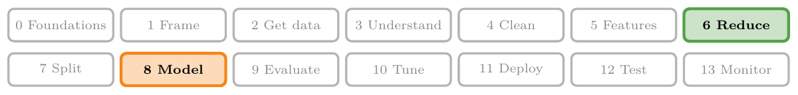
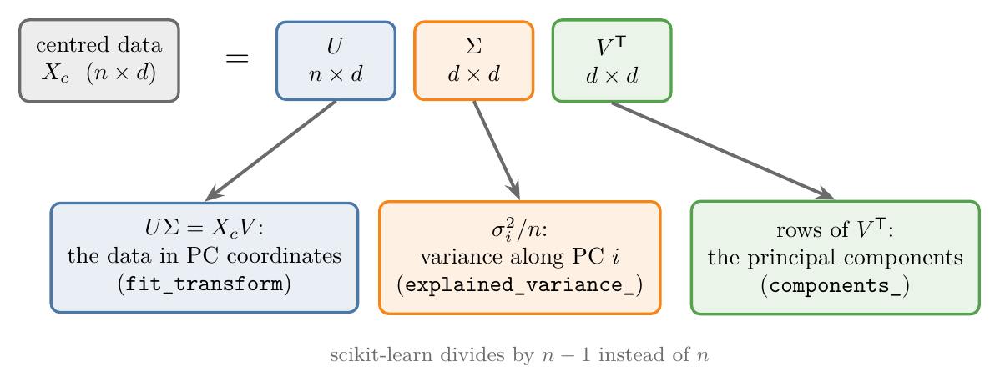
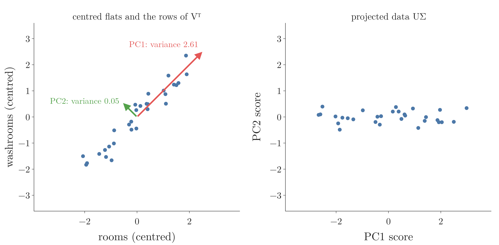
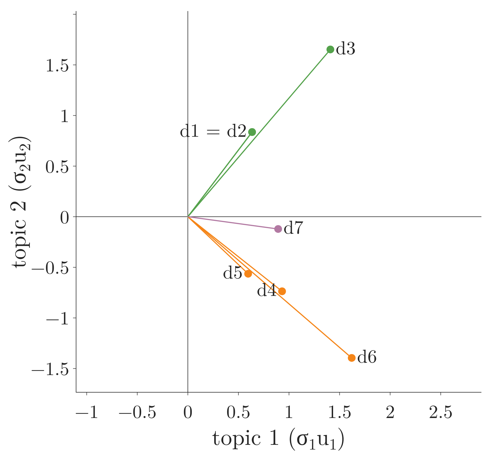
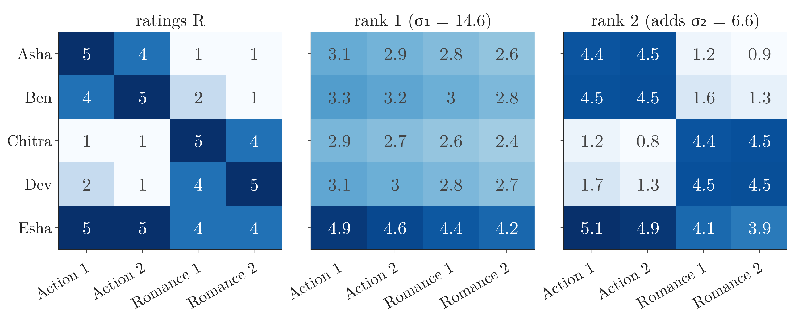
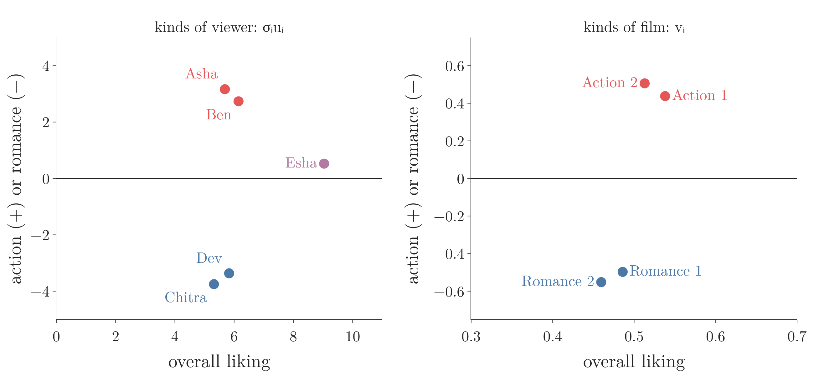
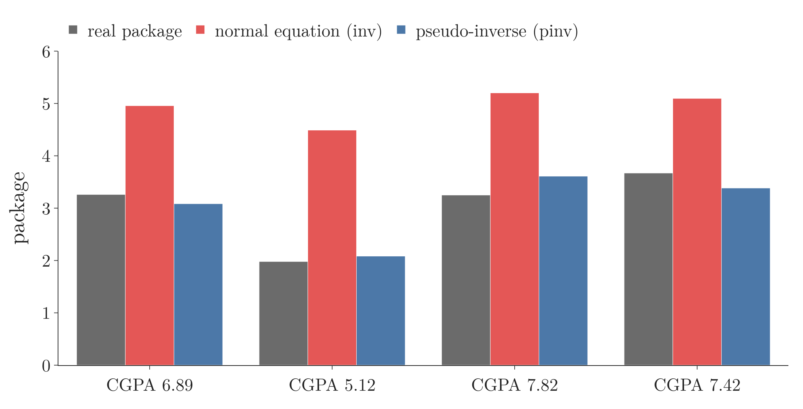

<!-- where-this-fits: generated by course_map/build_map.py; edit concepts.yaml, not this block -->
> **Where this fits:** Pipeline map steps 6 (Reduce dimensions), 8 (Model). See the [Course map](../../../00-course-map/00-course-map.md).
>
> 
>
> - **Builds on:** [Multicollinearity](../../../ML/03-feature-engineering/ML-026-one-hot-encoding/ML-026-one-hot-encoding.md#32-multicollinearity-inputs-must-not-depend-on-each-other); [Bag of words](../../../MA/05-linear-algebra/MA-048-vectors-and-feature-vectors/MA-048-vectors-and-feature-vectors.md#42-bag-of-words); [Singular value decomposition](../../../MA/05-linear-algebra/MA-057-svd-geometry/MA-057-svd-geometry.md#1-overview).
> - **Compare with:** [Normal equation](../../../ML/06-regression/ML-054-multiple-lr-code/ML-054-multiple-lr-code.md#1-overview).
<!-- /where-this-fits -->

## 1. Overview

> **Key point:** PCA, latent semantic analysis, recommender systems and least-squares regression all run on the SVD: PCA reads the principal components off $V$, text and ratings models keep the top singular directions as hidden "topics", and the pseudo-inverse solves regression even when the normal equation breaks.



The SVD (singular value decomposition) writes a matrix as $A = U\Sigma V^{\mathsf T}$ ([rotate, stretch, rotate](../MA-057-svd-geometry/MA-057-svd-geometry.md#4-rotate-stretch-rotate-a--usigma-vmathsf-t)), and [the rank $k$ approximation](../MA-059-low-rank-approximation/MA-059-low-rank-approximation.md#3-the-rank-k-approximation) showed that the first $k$ layers give the best rank $k$ approximation. This Note uses both in four ML tools (the figure shows the first, PCA: the centred data $X_c$ written as three factors, and below each factor what it means in PCA):

- PCA computed through the SVD (Section 2 and Figure 1);
- latent semantic analysis of text (Section 3);
- a ratings matrix, the core of SVD-style recommenders (Section 4);
- the pseudo-inverse and least squares (Section 5).

## 2. PCA through the SVD

> **Key point:** For centred data $X_c = U\Sigma V^{\mathsf T}$, the rows of $V^{\mathsf T}$ are the principal components, $\sigma_i^2/n$ are the variances along them, and $U\Sigma$ is the projected data. No covariance matrix is needed.

### 2.1 PC1 is the line with the largest sum of squared projections

> **Key point:** Turn a line through the centre of the data and add up the squared distances of the projected points from the centre. The line with the largest sum is PC1, and the square root of that sum is the first singular value.

[How PCA finds the new features](../../../ML/05-dimensionality/ML-046-pca-geometric-intuition/ML-046-pca-geometric-intuition.md#4-how-pca-finds-the-new-features) found the **first principal component** (G-1563) by turning a line through the centre of the data until the shadows of the points on it spread the most. The same search, with one change of bookkeeping, produces the SVD.

1. **In words:** centre the data, so that its centre sits on the origin (**centred data**, G-365). Draw a line through the origin. Drop each point onto the line; the foot is its **projection** (G-1583). Measure each foot's distance from the origin, square it and add over all points: call the sum SS. Turn the line and repeat. Instead of the variance of the shadows, we keep their sum of squares, which is the variance times $n$.
2. **Example:** for the 30 flats, SS is about 40 along the rooms axis (0°). As the line turns, SS rises to its peak, 78.2, at 45°, then falls to its lowest value, 1.55, at 135° (Figure 2).
3. **What the SVD calls each number:**
   - The unit vector along the best line, $[0.707, 0.707]$, is the first **right singular vector** (G-1692) $\mathbf v_1$. Its entries say the recipe of PC1: 0.707 parts rooms and 0.707 parts washrooms. These entries are the **loading scores**.
   - The square root of the peak is the first **singular value** (G-1812) $\sigma_1$ of the centred data:

     $$\sqrt{78.2} = 8.843$$

   - SS divided by $n$ is the variance along PC1: the eigenvalue of the covariance matrix found in [the eigenvectors of the covariance matrix](../../../ML/05-dimensionality/ML-047-pca-step-by-step/ML-047-pca-step-by-step.md#43-the-eigenvectors-of-the-covariance-matrix).

     $$78.2/30 = 2.61$$

   - PC2 is the line at right angles to PC1. Its SS, 1.55, is the lowest of all. Its square root is the second singular value:

     $$\sqrt{1.55} = 1.243 = \sigma_2$$


In Figure 2, watch the red curve while the line turns: it climbs to its peak, marked $\sigma_1^2$ (red dot, green label), exactly when the line runs along the cloud (45 degrees), and bottoms out at $\sigma_2^2$ (green dot) at right angles to it (135 degrees). The right panel plots SS, the sum of the squared distances of the red feet from the centre (vertical axis), against the angle of the line in degrees (horizontal axis). The curve is $\lVert X_c\mathbf v\rVert^2$ for every unit vector $\mathbf v$, the squared version of the stretch-by-angle curve in [the ellipse](../MA-057-svd-geometry/MA-057-svd-geometry.md#33-the-ellipse). So its top and bottom are the squared singular values.

### 2.2 Why the SVD of the data gives PCA

> **Key point:** The covariance matrix is $X_c^{\mathsf T}X_c/n$, and $X_c^{\mathsf T}X_c = V\Sigma^2V^{\mathsf T}$: its eigenvectors are the right singular vectors of the data.

[PCA in five steps](../../../ML/05-dimensionality/ML-047-pca-step-by-step/ML-047-pca-step-by-step.md#5-pca-in-five-steps) found the principal components as the eigenvectors of the covariance matrix, after centring each **feature** (G-772) (an input variable, one column of the data table). In matrix form, the covariance matrix of centred data with $n$ rows (one per **observation** (G-1374), a record) is $X_c^{\mathsf T}X_c / n$: entry $(j, k)$ is the sum of products of columns $j$ and $k$, divided by $n$.

[$A^{\mathsf T}A$ gives $V$](../MA-058-computing-the-svd/MA-058-computing-the-svd.md#2-making-one-orthogonal-matrix-disappear) showed that $A^{\mathsf T}A = V\Sigma^{\mathsf T}\Sigma V^{\mathsf T}$ for any matrix. With $A = X_c$:

1. **In words:** the covariance matrix is the data's $A^{\mathsf T}A$ divided by $n$, so its eigenvectors are the right singular vectors of $X_c$ and its eigenvalues are the squared singular values divided by $n$.
2. **Formula:**

   $$C = \frac{1}{n}X_c^{\mathsf T}X_c$$

   $$C = V\thinspace\frac{\Sigma^2}{n}\thinspace V^{\mathsf T}$$

   $$\text{variance along PC } i = \frac{\sigma_i^2}{n}$$

   $$Z = X_cV = U\Sigma$$

3. **Example:** for the 30 flats (rooms and washrooms) used in [PCA in five steps](../../../ML/05-dimensionality/ML-047-pca-step-by-step/ML-047-pca-step-by-step.md#5-pca-in-five-steps), the centred data has singular values 8.843 and 1.243:

   $$\frac{8.843^2}{30} = 2.61$$

   $$\frac{1.243^2}{30} = 0.05$$

   These are exactly the eigenvalues 2.61 and 0.05 found in [the eigenvectors of the covariance matrix](../../../ML/05-dimensionality/ML-047-pca-step-by-step/ML-047-pca-step-by-step.md#43-the-eigenvectors-of-the-covariance-matrix). The right singular vectors are $[0.707, 0.707]$ and $[-0.707, 0.707]$ (up to sign): PC1 at 45°, as there.

Section 2.1 found these numbers by turning a line; the formula finds them all at once. Figure 1 maps each part of the SVD to its PCA meaning:

- **$V^{\mathsf T}$:** its rows are the principal components, largest variance first. They are already sorted, because singular values come sorted.
- **$\Sigma$:** $\sigma_i^2/n$ is the variance along PC $i$. The **explained variance ratio** (G-727) is:

  $$\sigma_i^2 / \sum_j \sigma_j^2$$

  For the flats:

  $$\frac{8.843^2}{8.843^2 + 1.243^2} = 0.98$$
- **$U\Sigma$:** the projected data. Multiplying $X_c = U\Sigma V^{\mathsf T}$ by $V$ on the right gives $X_cV = U\Sigma$, which is the projection $Z = XW^{\mathsf T}$ of [the projection step](../../../ML/05-dimensionality/ML-047-pca-step-by-step/ML-047-pca-step-by-step.md#51-the-projection-step) with $W = V^{\mathsf T}$. The first flat, centred, lands at $[-0.639, 0.052]$.

{height=30%}

In Figure 3, watch the right panel: $U\Sigma$ is the left cloud turned so that PC1 lies along the horizontal axis. Almost all the spread is now horizontal, which is the variance ratio 0.98 seen as a picture.

### 2.3 Why compute it this way

> **Key point:** The SVD works on the data directly, which is more accurate, and gives the projected data for free.

Forming $X_c^{\mathsf T}X_c$ squares the singular values, and small ones lose accuracy (see [how computers compute the SVD](../MA-058-computing-the-svd/MA-058-computing-the-svd.md#8-how-computers-compute-the-svd)). The SVD of $X_c$ avoids that step. The squaring matters little for a few well-behaved features, but it matters for data with nearly dependent features.

> **Extra:** What scikit-learn does (version 1.9; scikit-learn docs, `PCA`). `PCA(svd_solver="auto")` picks a method from the shape of the data:
>
> - fewer than 1,000 columns and more than 10 times as many rows: scikit-learn eigen-decomposes the covariance matrix (`"covariance_eigh"`), because a small $d \times d$ matrix is fastest there;
> - otherwise, small data (no side above 500): a full SVD of the centred data (`"full"`, LAPACK through SciPy);
> - otherwise, when few components are wanted: a **randomized SVD** (G-1624), which finds only the top $k$ singular vectors.
>
> Each route gives the same components up to sign. `PCA` also divides by $n - 1$, so it reports 2.70 and 0.05 for the flats.

> **Python:** PCA through the SVD.
>
> ```python
> Xc = P - P.mean(axis=0)            # P: rooms, washrooms
> U, s, Vt = np.linalg.svd(Xc, full_matrices=False)
> s ** 2 / len(P)                    # [2.607, 0.052]: variances
> Vt                                 # rows: PC1, PC2
> Z = U * s                          # projected data, = Xc @ Vt.T
> ```
>
> The Notebook builds `P` with the same random seed as the PCA steps linked above and checks the result against scikit-learn.

## 3. Latent semantic analysis

> **Key point:** Keep the top $k$ singular directions of a document-word count matrix. Documents that use different words for the same topic end up pointing the same way.

### 3.1 The problem with word counts

> **Key point:** Bag-of-words vectors only see shared words, so two texts on the same topic with no word in common have cosine similarity 0.

[Text as vectors](../MA-048-vectors-and-feature-vectors/MA-048-vectors-and-feature-vectors.md#4-text-as-vectors-a-movie-recommender) turned texts into bag-of-words count vectors (the count of each word in a text), and [cosine similarity](../MA-050-dot-product-and-cosine-similarity/MA-050-dot-product-and-cosine-similarity.md#6-cosine-similarity) compared them by angle. The angle only sees shared words. Take seven short documents (common words such as "a" and "and" removed):

| | Document |
|---|---|
| d1 | batsman hits a century |
| d2 | bowler takes a wicket |
| d3 | batsman and bowler: century, wicket, match |
| d4 | chef cooks a curry |
| d5 | rice and dal |
| d6 | chef serves curry with rice and dal |
| d7 | chef watches the match |

d1 and d2 are both about cricket, but they share no word, so their cosine similarity is 0. The same holds for d4 and d5, both about food. A search for "batsman" would never find d2.

### 3.2 Topics from the SVD

> **Key point:** Words that appear together load on the same singular vector; the first $k$ singular directions act as $k$ topics.

Stack the count vectors as the rows of a $7 \times 14$ matrix $X$ (7 documents, 14 words). Its first two singular values are 2.73 and 2.64, and the rest are smaller. **Latent semantic analysis** (G-1049) (**LSA**) keeps the first $k$ and describes each document by its coordinates along them.

1. **In words:** each document's new coordinates are its row of $U_k\Sigma_k$: how strongly it uses each of the $k$ word patterns $\mathbf v_1, \dots, \mathbf v_k$.
2. **Formula:**
   $$Z = U_k\Sigma_k = XV_k$$
3. **Example:** with $k = 2$, d1 lands at $[0.635, 0.836]$ and d2 at exactly the same point. Their cosine similarity in this 2D topic space is 1.00, up from 0. d4 at $[0.932, -0.737]$ and d5 at $[0.596, -0.564]$ get 1.00 as well.

Figure 4 shows why. d3 contains all the cricket words together, so the SVD learns that "batsman", "bowler", "century" and "wicket" belong to one pattern. Through it, d1 and d2 are linked even though they share nothing directly. The food documents form the other pattern. d7 mixes "chef" with "match", and lands in between, closer to food (cosine 0.86 with d4) than to cricket (0.49 with d1).

{width=75%}

LSA is a rank $k$ approximation ([the rank $k$ approximation](../MA-059-low-rank-approximation/MA-059-low-rank-approximation.md#3-the-rank-k-approximation)) used for meaning rather than compression: dropping the small singular directions drops the accidents of word choice and keeps the shared themes. LSA was introduced for exactly this purpose, to find documents on a topic even when they use other words than the query (Deerwester et al. 1990).

> **Python:** `TruncatedSVD` keeps the top $k$ singular directions.
>
> ```python
> from sklearn.decomposition import TruncatedSVD
> from sklearn.feature_extraction.text import CountVectorizer
> from sklearn.metrics.pairwise import cosine_similarity
>
> X = CountVectorizer(stop_words="english").fit_transform(docs)
> Z = TruncatedSVD(n_components=2, random_state=0).fit_transform(X)
> cosine_similarity(Z)[0, 1]       # d1 vs d2: 1.0 (0 before)
> ```
>
> Unlike `PCA`, `TruncatedSVD` does not centre the columns. Centring would turn a sparse count matrix (mostly zeros, stored compactly) into a dense one (scikit-learn docs, `TruncatedSVD`), which is impossible for a real vocabulary of 50,000 words.

## 4. Ratings and recommenders

> **Key point:** In a viewers-by-films ratings matrix, the singular vectors become "kinds of viewer" and "kinds of film"; a rank-2 approximation rebuilds the table to within 0.55 of every rating.

### 4.1 A ratings matrix

> **Key point:** Five viewers rate four films; two like action, two like romance, one likes everything.

Recommender systems work on a table of ratings: one row per viewer, one column per item. Figure 5 (left) shows five viewers rating four films from 1 to 5. Asha and Ben like the action films, Chitra and Dev the romance films, and Esha likes everything.



### 4.2 Reading the singular vectors

> **Key point:** $\mathbf v_1$ is overall liking, $\mathbf v_2$ is action against romance; $\mathbf u_i$ says how much each viewer follows each pattern.

The singular values are 14.6, 6.6, 1.5 and 0.6. The first two dominate.

- **$\mathbf v_1 = [-0.54, -0.51, -0.49, -0.46]$:** all four films with the same sign and similar size. The first pattern is "how much a viewer likes films at all". The rank-1 approximation (Figure 5, middle) gives each viewer roughly the same rating for every film: Esha high, the others near 3.
- **$\mathbf v_2 = [0.44, 0.51, -0.50, -0.55]$:** positive for the action films, negative for the romance films. The second pattern is a taste axis. The matching $\mathbf u_2 = [0.48, 0.42, -0.57, -0.51, 0.08]$ puts Asha and Ben on the action side, Chitra and Dev on the romance side, and Esha near 0: she has no preference.

Adding the second layer (Figure 5, right) recovers the table: no entry is off by more than 0.55. The third and fourth layers carry only small details, so the data is essentially two-dimensional: one "general liking" axis and one "action or romance" axis.

{height=30%}

In Figure 6, viewers and films fall into the same two groups: Asha, Ben and the action films above the line, Chitra, Dev and the romance films below it, and Esha far right near the line, liking everything. In the language of the movie example of Deisenroth et al. (MML Example 4.14), the $\mathbf v_i$ are stereotypical films and the $\mathbf u_i$ stereotypical viewers; each real viewer is a mix of them.

1. **In words:** the predicted rating of viewer $a$ for film $b$ is the sum, over the kept layers, of (singular value) times (how much $a$ follows the pattern) times (how much $b$ fits it).
2. **Formula:**
   $$\hat r_{ab} = \sum_{i=1}^{k}\sigma_i\thinspace u_{ai}\thinspace v_{bi}$$
3. **Example:** for Asha and Action 1 with $k = 2$, one term per singular value:

   $$14.63 \times (-0.39) \times (-0.54) \approx 3.06$$

   $$6.57 \times 0.48 \times 0.44 \approx 1.39$$

   $$3.06 + 1.39 = 4.45$$

   Her real rating was 5.

> **Extra:** Real ratings tables are mostly empty: a viewer has rated a handful of thousands of films. The plain SVD needs every entry. Recommenders therefore fit the same form, $\hat r_{ab} = \sum_i p_{ai}q_{bi}$ (a viewer vector times a film vector), by gradient descent on the known ratings only, and use it to fill in the unknown ones. This **matrix factorisation** became widely used during the Netflix Prize (2006–2009) (Koren et al. 2009). The method is often called "SVD", although strictly it is not an SVD: its vectors are not forced to be orthonormal.

## 5. The pseudo-inverse and least squares

> **Key point:** Invert the SVD factor by factor, leaving zero singular values at zero: $A^{+} = V\Sigma^{+}U^{\mathsf T}$. Then $A^{+}\mathbf{b}$ is the least-squares solution, even when the normal equation has no inverse.

### 5.1 Inverting the SVD

> **Key point:** Undo each factor in reverse order: $U^{\mathsf T}$ for $U$, $1/\sigma_i$ for each $\sigma_i$, $V$ for $V^{\mathsf T}$; where $\sigma_i = 0$ there is nothing to undo, so keep 0.

The inverse of a product is the product of the inverses in reverse order. For $A = U\Sigma V^{\mathsf T}$, the orthogonal factors are undone by their transposes, and $\Sigma$ by replacing each $\sigma_i$ with $1/\sigma_i$. When some $\sigma_i$ is 0, $A$ has no inverse, but we can still invert everything that is not 0. The result is the **Moore–Penrose pseudo-inverse** (G-1262), listed under [matrix factorisation](../MA-047-linear-algebra-roadmap/MA-047-linear-algebra-roadmap.md#46-matrix-factorisation).

1. **In words:** transpose $\Sigma$, replace each non-zero $\sigma_i$ by $1/\sigma_i$ and leave the zeros; then sandwich it between $V$ and $U^{\mathsf T}$.
2. **Formula:**
   $$A^{+} = V\Sigma^{+}U^{\mathsf T}$$
   $$= \sum_{\sigma_i > 0}\frac{1}{\sigma_i}\thinspace\mathbf v_i\mathbf u_i^{\mathsf T}$$
3. **Example:** for the rank-1 matrix $C$ with rows $[2, 1]$ and $[4, 2]$, take these values from [a matrix of rank 1](../MA-058-computing-the-svd/MA-058-computing-the-svd.md#5-a-matrix-of-rank-1):

   $$\sigma_1 = 5$$

   $$\mathbf u_1 = \frac{1}{\sqrt5}[1, 2]$$

   $$\mathbf v_1 = \frac{1}{\sqrt5}[2, 1]$$

   The sum has one term, $\frac{1}{\sigma_1}\mathbf v_1\mathbf u_1^{\mathsf T}$. First the three numbers in front ($1/\sigma_1$ and the two $1/\sqrt5$):

   $$\frac{1}{5}\cdot\frac{1}{\sqrt5}\cdot\frac{1}{\sqrt5} = \frac{1}{25}$$

   Then the column $[2, 1]$ times the row $[1, 2]$:

   $$\begin{bmatrix} 2 \cr1 \end{bmatrix}\begin{bmatrix} 1 & 2 \end{bmatrix}$$

   $$= \begin{bmatrix} 2 & 4 \cr1 & 2 \end{bmatrix}$$

   Together:

   $$C^{+} = \frac{1}{25}\begin{bmatrix} 2 & 4 \cr1 & 2 \end{bmatrix}$$

   $$C^{+} = \begin{bmatrix} 0.08 & 0.16 \cr0.04 & 0.08 \end{bmatrix}$$

$C$ has no inverse (its determinant is 0), but $C^{+}$ undoes it as far as possible. Every output of $C$ lies on one line, the **column space** (G-414; all the outputs a matrix can produce, here the line through $[1, 2]$, as in [a matrix of rank 1](../MA-058-computing-the-svd/MA-058-computing-the-svd.md#5-a-matrix-of-rank-1)). $C^{+}$ sends each such output back to the one input on the line through $[2, 1]$ (the **row space**, the line along $\mathbf v_1$) that $C$ maps to it. For example, $C$ sends $[2, 1]$ to $[5, 10]$, and $C^{+}$ sends $[5, 10]$ back to $[2, 1]$. For a square matrix that does have an inverse, $A^{+} = A^{-1}$.

### 5.2 Least squares without the normal equation

> **Key point:** When $X^{\mathsf T}X$ has an inverse, $X^{+} = (X^{\mathsf T}X)^{-1}X^{\mathsf T}$, so $X^{+}\mathbf{y}$ is the normal-equation solution.

First the picture. Every prediction $X\beta$ is a mix of the columns of $X$, so all possible predictions fill the column space of $X$, and the target vector $\mathbf y$ usually pokes out of it. Least squares picks the point of the column space closest to $\mathbf y$: the foot of the perpendicular from $\mathbf y$. There the error $\mathbf y - X\beta$ is perpendicular to every column, $X^{\mathsf T}(\mathbf y - X\beta) = \mathbf 0$, which is the normal equation. [The picture: a projection](../../../ML/06-regression/ML-053-multiple-lr-maths/ML-053-multiple-lr-maths.md#62-the-picture-a-projection) draws and animates this projection.

[The normal equation](../../../ML/06-regression/ML-053-multiple-lr-maths/ML-053-multiple-lr-maths.md#6-the-normal-equation) found the least-squares coefficients with the normal equation $\beta = (X^{\mathsf T}X)^{-1}X^{\mathsf T}\mathbf{y}$. With the thin SVD $X = U\Sigma V^{\mathsf T}$ (all $\sigma_i > 0$), $X^{\mathsf T}X = V\Sigma^2V^{\mathsf T}$, and

$$(X^{\mathsf T}X)^{-1}X^{\mathsf T}$$
$$= V\Sigma^{-2}V^{\mathsf T}\thinspace V\Sigma U^{\mathsf T}$$
$$= V\Sigma^{-2}\Sigma U^{\mathsf T} \qquad (V^{\mathsf T}V = I)$$
$$= V\Sigma^{-1}U^{\mathsf T}$$
$$= X^{+}$$

1. **In words:** the least-squares coefficients are the pseudo-inverse of the design matrix times the vector of **target** (G-1949) values (the outputs we predict).
2. **Formula:**
   $$\beta = X^{+}\mathbf{y}$$
3. **Example:** the four students of the normal-equation example (CGPA 6.89, 5.12, 7.82, 7.42; packages 3.26, 1.98, 3.25, 3.67), with a column of 1s for the intercept. $X$ has singular values 13.92 and 0.30, and $X^{+}\mathbf{y} = [-0.81, 0.57]$: intercept $-0.81$ and slope $0.57$, the same as the normal equation.

### 5.3 When the normal equation breaks

> **Key point:** With a column that copies another, $X^{\mathsf T}X$ has no inverse and the normal equation can return nonsense; the pseudo-inverse still gives a sensible answer.

[The cost of the inverse](../../../ML/06-regression/ML-053-multiple-lr-maths/ML-053-multiple-lr-maths.md#7-the-cost-of-the-inverse) warned that $X^{\mathsf T}X$ has no inverse when one column can be built from others. Add a third feature to the student data: the percentage, computed as $9.5 \times$ CGPA. Now the columns are dependent.

- **The SVD shows it.** The singular values of the new $X$ are 131.65, 0.30 and $2 \times 10^{-15}$: the last is zero up to rounding, so the rank is 2, not 3.
- **The normal equation fails quietly.** Here NumPy's `inv` raised no error and returned $[3.14, 0.06, 0.02]$. Its predictions for the four students are about 4.5 to 5.2, against real packages of 2 to 3.7: garbage. (On another computer it may instead raise an error.)
- **The pseudo-inverse treats the tiny singular value as 0** and returns $[-0.81, 0.0062, 0.0589]$. Its predictions are exactly those of the two-column model, because the old slope is recovered:

  $$0.0062 + 9.5 \times 0.0589 = 0.565$$

  Of all coefficient vectors that fit equally well, it picks the one with the smallest length (Penrose 1956).

{height=28%}

Figure 7 puts the two answers side by side: the red bars miss every student by 1.4 to 2.5, while the blue bars stay close to the real packages. So the pseudo-inverse is the safe way to solve least squares. `np.linalg.lstsq`, and scikit-learn's `LinearRegression` (through SciPy's `lstsq`), use an SVD-based LAPACK routine (`gelsd`; NumPy docs, `numpy.linalg.lstsq`; SciPy docs, `scipy.linalg.lstsq`) and give the same $[-0.81, 0.0062, 0.0589]$ here.

> **Python:** The pseudo-inverse.
>
> ```python
> X = np.c_[np.ones(4), cgpa]
> U, s, Vt = np.linalg.svd(X, full_matrices=False)
> X_plus = Vt.T @ np.diag(1 / s) @ U.T     # V Sigma^-1 U^T
> X_plus @ y                               # [-0.811, 0.565]
> np.linalg.pinv(X) @ y                    # the same, built in
> ```
>
> `np.linalg.pinv` treats singular values below a small cut-off (relative to $\sigma_1$) as zero, which is what rescues the three-column case.

> **Extra:** Dropping tiny singular values is also a form of regularisation. Ridge regression, from [the ridge solution for many features](../../../ML/06-regression/ML-063-ridge-regression-maths/ML-063-ridge-regression-maths.md#33-solving-for-w), has a neat SVD form: it multiplies the contribution of each direction by $\sigma_i^2/(\sigma_i^2 + \lambda)$, which is close to 1 for large $\sigma_i$ and close to 0 for tiny ones (ESL §3.4.1). The pseudo-inverse keeps or drops a direction completely; ridge shrinks it smoothly. scikit-learn's Ridge can solve it this way, with `solver="svd"`.

## 6. Summary

| ML tool | Matrix we take the SVD of | What the SVD gives |
|---|---|---|
| PCA | centred data $X_c$ | PCs = rows of $V^{\mathsf T}$; variances $\sigma_i^2/n$; projected data $U\Sigma$ |
| Latent semantic analysis | document-word counts | topics = top $\mathbf v_i$; documents in topic space $U_k\Sigma_k$ |
| Ratings / recommenders | viewer-film ratings | viewer types $\mathbf u_i$, film types $\mathbf v_i$; predictions $\sum\sigma_iu_{ai}v_{bi}$ |
| Least squares | design matrix $X$ | $\beta = X^{+}\mathbf{y}$, safe even with dependent columns |
| Compression, noise reduction | any data matrix | best rank $k$ approximation (see [the rank $k$ approximation](../MA-059-low-rank-approximation/MA-059-low-rank-approximation.md#3-the-rank-k-approximation)) |

- PCA is the SVD of the centred data; the covariance matrix is never needed.
- Recent scikit-learn picks between the SVD and the covariance route by the shape of the data.
- LSA links documents that share a topic but no words, by keeping the top singular directions.
- A ratings matrix's top singular vectors read as viewer types and film types.
- The pseudo-inverse inverts only the non-zero singular values; it gives least squares without the normal equation's breakdowns.

## 7. Sources

**Built from**

- StatQuest (Starmer, J.), "Principal Component Analysis (PCA), Step-by-Step", YouTube, https://www.youtube.com/watch?v=FgakZw6K1QQ
- Khan Academy (Khan, S.), "Least squares approximation", YouTube, https://www.youtube.com/watch?v=MC7l96tW8V8

**Other references**

- Deisenroth, M. P., Faisal, A. A. and Ong, C. S. (2020). *Mathematics for Machine Learning*. Cambridge University Press. Sections 4.5–4.6, Examples 4.14 and 4.15 (MML): latent semantic analysis, the ratings example and the pseudo-inverse, which neither video covers.
- Deerwester, S., Dumais, S. T., Furnas, G. W., Landauer, T. K. and Harshman, R. (1990). "Indexing by Latent Semantic Analysis". *Journal of the American Society for Information Science* 41(6).
- Hastie, T., Tibshirani, R. and Friedman, J. (2009). *The Elements of Statistical Learning*, 2nd ed. Springer. Section 3.4.1, ridge regression and the SVD (ESL).
- Koren, Y., Bell, R. and Volinsky, C. (2009). "Matrix Factorization Techniques for Recommender Systems". *IEEE Computer* 42(8).
- NumPy documentation. `numpy.linalg.lstsq`, `numpy.linalg.pinv`. SciPy documentation. `scipy.linalg.lstsq` (default driver `gelsd`).
- Penrose, R. (1956). "On best approximate solutions of linear matrix equations". *Mathematical Proceedings of the Cambridge Philosophical Society* 52(1).
- scikit-learn documentation (version 1.9). `sklearn.decomposition.PCA` (the `svd_solver="auto"` policy) and `sklearn.decomposition.TruncatedSVD`.

## 8. Key terms

| Term | Meaning |
|---|---|
| Loading scores (G-2204) | The entries of a principal component's unit vector: how many parts of each feature make up the component |
| PCA through the SVD | Taking the principal components from $V$ of the centred data, with variances $\sigma_i^2/n$ and scores $U\Sigma$ |
| Randomized SVD | A fast method that finds only the top $k$ singular vectors, used by scikit-learn for large data |
| Latent semantic analysis (LSA) | Describing documents by their top $k$ singular directions of the document-word matrix, so that texts on one topic align |
| TruncatedSVD | scikit-learn's rank $k$ SVD without centring; works on sparse matrices |
| Matrix factorisation (recommenders) | Predicting ratings as a viewer vector times a film vector, fitted on the known ratings only |
| Moore–Penrose pseudo-inverse ($A^{+}$) | $V\Sigma^{+}U^{\mathsf T}$: the SVD inverted with zero singular values left at zero |
| Minimum-norm solution | Among all equally good least-squares solutions, the one with the smallest length; what $A^{+}\mathbf{b}$ returns |
