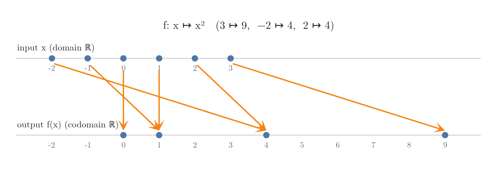
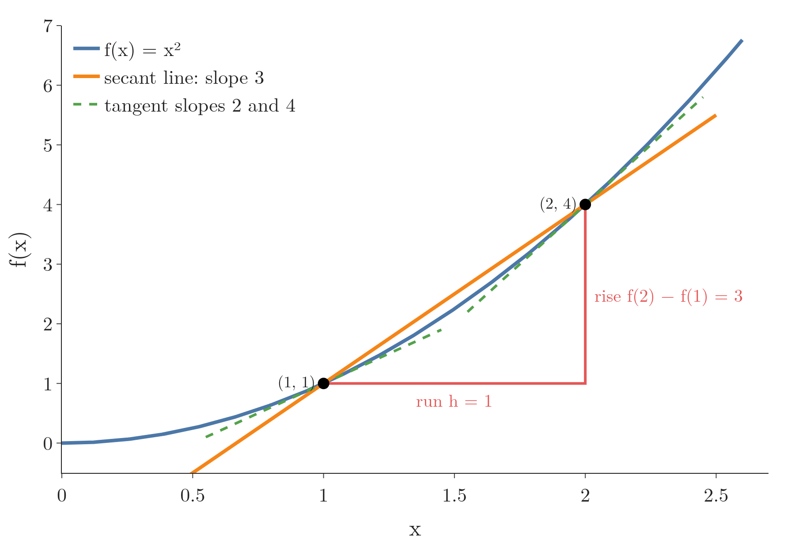
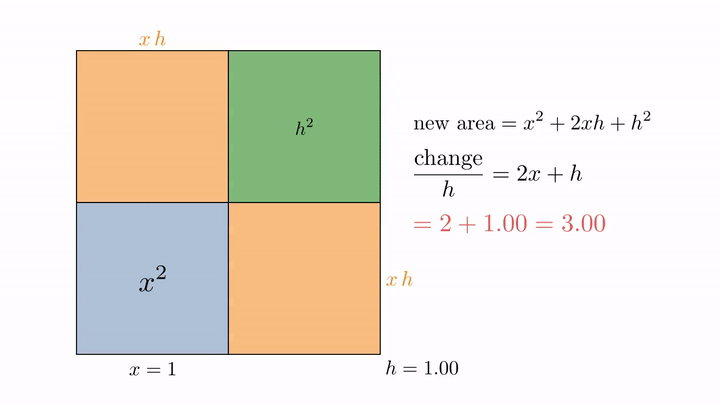
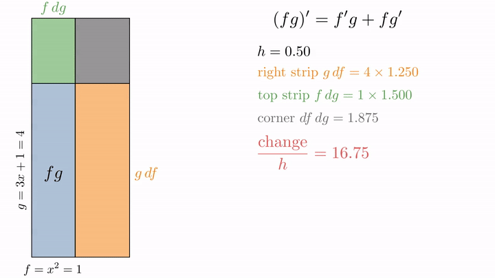
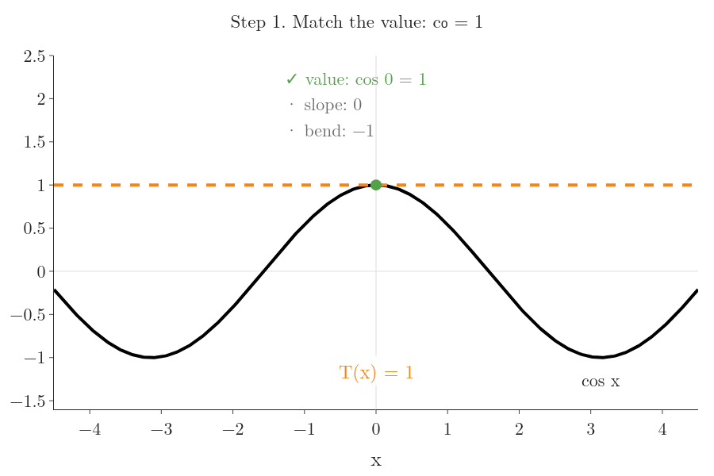
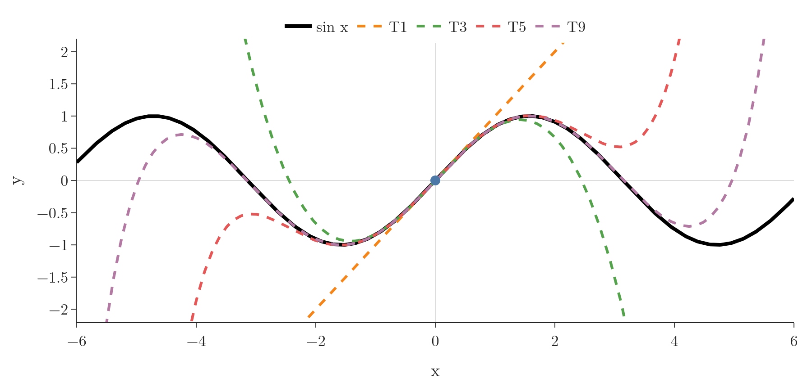
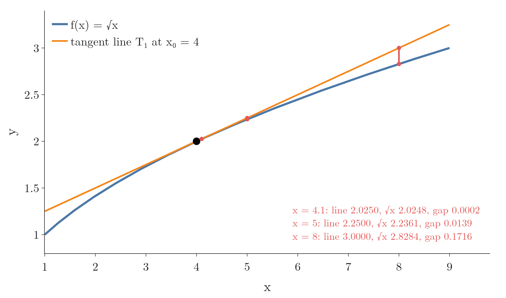

<!-- where-this-fits: generated by course_map/build_map.py; edit concepts.yaml, not this block -->
> **Where this fits:** Pipeline map step 0 (Foundations). See the [Course map](../../../00-course-map/00-course-map.md).
>
> 
>
> - **Leads to:** [Gradient descent](../../../ML/06-regression/ML-056-gradient-descent/ML-056-gradient-descent.md#7-gradient-descent-as-a-class); [XGBoost](../../../ML/08-trees-and-ensembles/ML-117-xgboost-intro/ML-117-xgboost-intro.md#3-what-xgboost-is); [Partial derivatives and gradients](../../../MA/06-calculus/MA-062-partial-derivatives-and-gradients/MA-062-partial-derivatives-and-gradients.md#12-the-gradient-on-the-map); [Maximum likelihood estimation (MLE)](../../../MA/08-likelihood/MA-070-maximum-likelihood-estimation/MA-070-maximum-likelihood-estimation.md#72-the-maximum-likelihood-estimate); [Backpropagation](../../../DL/01-basics/DL-015-backpropagation-what/DL-015-backpropagation-what.md#4-the-steps-of-backpropagation).
<!-- /where-this-fits -->

## 1. Overview

> **Key point:** The derivative of $f$ at $x$ is the slope of the tangent line there: the limit of the slope of a secant line as its two points move together.

This Note follows Chapter 5 (Section 5.1) of *Mathematics for Machine Learning* (Deisenroth, Faisal and Ong, 2020).


Figure 1 shows the whole idea of this Note. We draw a straight line through two points of a curve, a **secant line** (G-1758). As the second point slides towards the first, the secant line turns and settles on one line that only touches the curve: the **tangent line** (G-1945). Its slope is the **derivative** (G-595).

Earlier Notes already used derivatives as tools:

- the derivative as the slope of a function at a point, set to zero in [finding the minimum](../../../ML/06-regression/ML-050-linear-regression-maths/ML-050-linear-regression-maths.md#4-finding-the-minimum);
- stepping against the derivative in [gradient descent](../../../ML/06-regression/ML-056-gradient-descent/ML-056-gradient-descent.md#2-the-idea);
- the chain rule in [the derivation of the sigmoid derivative](../../../ML/07-classification/ML-073-sigmoid-derivative/ML-073-sigmoid-derivative.md#3-the-derivation);
- the Taylor series (a polynomial built from derivatives), in [the Taylor series of XGBoost](../../../ML/08-trees-and-ensembles/ML-120-xgboost-maths/ML-120-xgboost-maths.md#7-the-taylor-series).

This Note explains where the derivative comes from (Sections 3 and 4), collects the rules for computing it (Section 5) and adds the Taylor polynomial (Section 6). The next Notes extend all of this to functions of many variables, which is what ML losses are.

## 2. Functions: one number in, one number out

> **Key point:** A function assigns exactly one output to every input. In this Note both are single numbers.

A **function** (G-816) $f$ takes an input $x$ and gives exactly one output $f(x)$. Our first example squares its input:

$$f(x) = x^2$$

$$f(3) = 3^2 = 9$$

$$f(-2) = (-2)^2 = 4$$

In this Note the input and the output are single real numbers. The short way to say so is

$$f: \mathbb{R} \to \mathbb{R}, \qquad x \mapsto f(x)$$

Each piece, read in words:

- $\mathbb{R}$ is the set of real numbers: every number on the number line, such as $3$, $-2$ or $0.5$;
- $f: \mathbb{R} \to \mathbb{R}$ says "a number goes in, a number comes out";
- $x \mapsto f(x)$ is read as: $x$ maps to $f(x)$. It gives the rule; for our example, $x \mapsto x^2$ sends 3 to 9.

Figure 2 draws this map: each input on the top line sends exactly one arrow to the bottom line. Two inputs may land on the same output, as $-2$ and $2$ both land on 4; what a function never does is send one input to two outputs.



The set of allowed inputs is the **domain** (G-632); the set the outputs live in is the **codomain** (G-405). A loss is a number that scores how wrong a model is. ML losses take many numbers in (all the parameters) and give one number out. With $n$ parameters this is written $f: \mathbb{R}^n \to \mathbb{R}$, where $\mathbb{R}^n$ means "lists of $n$ numbers". For example, $\mathbb{R}^2$ holds pairs such as $(2, 3)$, and a loss of two parameters such as $f(x, y) = x^2 + y^2$ sends $(2, 3)$ to $13$. [Partial derivatives](../MA-062-partial-derivatives-and-gradients/MA-062-partial-derivatives-and-gradients.md#3-partial-derivatives) handle that case; this Note stays with one input.

## 3. The difference quotient: slope of a secant line

> **Key point:** Rise over run between two points of the curve, $x$ and $x + h$, is the slope of the secant line through them: the average slope of $f$ over that stretch.

Start with a car. It leaves a point A, speeds up, slows down and stops at a point B, 100 metres away, 10 seconds later. The top panel of Figure 3 plots the distance covered against time. The curve is shallow at the start (slow), steep in the middle (fast) and shallow again at the end.

How fast is the car going at exactly $t = 3$ seconds? A single instant gives nothing to measure: in one frozen moment the car covers no distance in no time. Speed needs **two** moments. A speedometer can take two moments very close together:

1. the car's position after $t$ seconds is given by our curve $s(t)$ (in metres), with $s(3) = 21.600$ and $s(3.01) = 21.726$;
2. so in 0.01 s it moved
   $$21.726 - 21.600 = 0.126 \text{ m}$$
3. and its speed is about
   $$\frac{0.126}{0.01} = 12.6 \text{ metres per second}$$

The curve itself, with a helper $u$ that is the time divided by 10:

$$u = t/10$$
$$s(t) = 100\thinspace(3u^2 - 2u^3)$$

At $t = 3$, $u = 0.3$:

$$3u^2 = 3 \times 0.09 = 0.27$$

$$2u^3 = 2 \times 0.027 = 0.054$$

$$s(3) = 100 \times (0.27 - 0.054) = 21.6$$

Doing the same division at every $t$ draws the whole speed curve, the bottom panel of Figure 3: low, high, low. "Change in distance divided by change in time" is a **rate of change** (G-1635), and the rest of this Note is about that one ratio.

{height=50%}

The same ratio works for any curve, with $x$ in place of time and $f(x)$ in place of distance. Pick a point $x$ on the curve and a second point a step $h$ further. The secant line through the two points has a slope we can compute from the two heights.

1. **In words:** the change in output divided by the change in input.
2. **Formula:** write $y = f(x)$ for the output. The Greek capital $\Delta$ (delta) means "change in": $\Delta x = h$ is the change in the input and $\Delta y = f(x + h) - f(x)$ the change in the output. The **difference quotient** (G-604) is
   $$\frac{\Delta y}{\Delta x} = \frac{f(x + h) - f(x)}{h}$$
3. **Example:** $f(x) = x^2$ at $x = 1$ with $h = 1$. The points are $(1, 1)$ and $(2, 4)$:
   $$\frac{f(2) - f(1)}{1} = \frac{4 - 1}{1} = 3$$

The secant line has slope 3 (top-left frame of Figure 1). The secant slope is the slope a straight line would need to get from the first point to the second, so it is the **average slope** of $f$ between $x$ and $x + h$. A curve that bends in between can be steeper or flatter than this at any single point. Figure 4 shows both. The secant line rises 3 over a run of 1. The curve itself is flatter than that at $x = 1$ (tangent slope 2) and steeper at $x = 2$ (tangent slope 4); 3 is the average over the step.



## 4. The derivative: shrinking the step to zero

> **Key point:** As $h \to 0$, the secant slope approaches one number, the slope of the tangent line; that limit is the derivative $f'(x)$.

### 4.1 From secant to tangent

> **Key point:** Make $h$ smaller and smaller, and watch where the difference quotient settles.

For $f(x) = x^2$ at $x = 1$, smaller steps give:

| $h$ | 1 | 0.5 | 0.1 | 0.01 | 0.001 |
|---|---|---|---|---|---|
| $\dfrac{(1 + h)^2 - 1}{h}$ | 3 | 2.5 | 2.1 | 2.01 | 2.001 |

The slopes approach 2. Figure 1 shows the same thing as a picture: the secant line turns until, in the limit, it touches the curve at one point. That limiting line is the **tangent line**.

1. **In words:** the derivative of $f$ at $x$ is the value the difference quotient approaches as the step $h$ shrinks to zero.
2. **Formula:**
   $$f'(x) = \frac{df}{dx} = \lim_{h \to 0} \frac{f(x + h) - f(x)}{h}$$
   $\lim_{h \to 0}$, the **limit** (G-1087), means "the value this approaches as $h$ gets as close to 0 as we like". We never set $h = 0$ itself, which would give $0/0$.
3. **Example:** the algebra explains the table. For $f(x) = x^2$, one step per line:
   $$(x + h)^2 = x^2 + 2xh + h^2$$
   $$(x + h)^2 - x^2 = 2xh + h^2$$
   $$\frac{2xh + h^2}{h} = 2x + h$$
   $$2x + h \thickspace\longrightarrow\thickspace2x \quad \text{as } h \to 0$$
   At $x = 1$ the difference quotient is $2 + h$:
   $$h = 1: \quad 2 + 1 = 3$$
   $$h = 0.1: \quad 2 + 0.1 = 2.1$$
   $$h \to 0: \quad f'(1) = 2$$



Figure 5 shows the same algebra as areas. Watch the green corner: it is $h^2$, so it shrinks much faster than the two strips, and only the strips, $2xh$, are left to divide by $h$. The picture is Sanderson's (3Blue1Brown, "Power Rule through geometry"), redrawn with our numbers.

A derivative is often called an "instantaneous rate of change". The car shows why that phrase needs care: nothing changes in a single instant. The derivative is the number the two-moment ratio settles on as the two moments close in. A safe reading is: the derivative is the best constant rate of change near the point. For the car at $t = 3$, the ratio settles on 12.6 m/s.

The two names $f'(x)$ and $\dfrac{df}{dx}$ mean the same thing. A function whose derivative exists at a point is **differentiable** (G-606) there. Gradient descent uses the derivative of the loss at every step, so it needs a loss that is differentiable.

### 4.2 The power rule from the definition

> **Key point:** Expanding $(x + h)^n$ shows that every term except one carries an $h$ and vanishes, leaving $(x^n)' = n x^{n-1}$.

The same method works for $f(x) = x^3$, one step per line:

$$(x + h)^3 = x^3 + 3x^2h + 3xh^2 + h^3$$

$$(x + h)^3 - x^3 = 3x^2h + 3xh^2 + h^3$$

$$\frac{3x^2h + 3xh^2 + h^3}{h} = 3x^2 + 3xh + h^2$$

$$3x^2 + 3xh + h^2 \thickspace\longrightarrow\thickspace3x^2 \quad \text{as } h \to 0$$

The $x^3$ cancels, one $h$ divides out of every remaining term, and every term that still has an $h$ goes to 0. Only $3x^2$ is left.

The picture is Figure 5 one dimension up. Read $x^3$ as the volume of a cube of side $x$. Growing the side by $h$ adds three thin square slabs, one on each of three faces, each of volume $x^2 h$. The remaining pieces are thin sticks and one tiny corner, all with $h^2$ or $h^3$ in them. Divide by $h$ and let $h$ shrink: only the three slabs survive, $3x^2$.

1. **In words:** the **power rule** (G-1540): bring the power down in front and lower the power by one.
2. **Formula:**
   $$\frac{d}{dx}x^n = n\thinspace x^{n-1}$$
3. **Example:** for $f(x) = x^3$:
   $$f'(x) = 3x^2$$
   $$f'(2) = 3 \times 2^2 = 3 \times 4 = 12$$

> **Extra:** For a general $n$, the binomial theorem writes
>
> $$(x + h)^n = x^n + n x^{n-1}h$$
> $$\qquad + (\text{terms with } h^2, h^3, \dots)$$
>
> Subtracting $x^n$ and dividing by $h$ leaves $n x^{n-1}$ plus terms that all still contain $h$, so the limit is $n x^{n-1}$, exactly as for $n = 3$.

### 4.3 What the sign of the derivative tells us

> **Key point:** A positive derivative means $f$ rises as $x$ grows; a negative one means it falls. So the derivative points uphill.

The derivative is the rate of change of the output per unit of input, near $x$. Its sign says which way is uphill:

- $f'(x) > 0$: increasing $x$ increases $f$;
- $f'(x) < 0$: increasing $x$ decreases $f$;
- $f'(x) = 0$: the tangent is flat, as at the bottom of a valley.

The sign is all [gradient descent](../../../ML/06-regression/ML-056-gradient-descent/ML-056-gradient-descent.md#21-which-way-to-move) needs: to go downhill, move $x$ against the sign of the derivative. For $f(x) = x^2$ at $x = 1$, $f'(1) = 2 > 0$, so we move left, towards the minimum at 0.

> **Python:** A computer can estimate a derivative with a small $h$, straight from the definition. Such an estimate is a **numerical derivative** (G-1368; or finite difference).
>
> ```python
> import numpy as np
>
> def f(x):
>     return x ** 3
>
> h = 0.1
> (f(1 + h) - f(1)) / h              # 3.31
> (f(1 + h) - f(1 - h)) / (2 * h)    # 3.01
> ```
>
> The exact answer is $f'(1) = 3$.

> **Extra:** The second line is the **central difference** (G-363): it uses one point on each side of $x$. Its error shrinks like $h^2$ instead of $h$, so with $h = 0.1$ it is off by 0.01 instead of 0.31. Making $h$ tiny (say $10^{-12}$) does not help: the two heights become almost equal and rounding errors in the computer take over. Balancing the two errors puts the best $h$ for the central difference near the cube root of the machine precision (the smallest relative rounding step of the computer):
>
> $$(2.2 \times 10^{-16})^{1/3} \approx 6 \times 10^{-6}$$
>
> So values near $h = 10^{-5}$ are a common choice (Nocedal and Wright §8.1).

## 5. Rules for computing derivatives

> **Key point:** We rarely take limits by hand: a short table of basic derivatives plus four rules (sum, product, quotient, chain) gives the derivative of any formula built from them.

### 5.1 Basic derivatives

> **Key point:** These few derivatives, combined by the rules below, cover the functions ML uses.

| $f(x)$ | $f'(x)$ | Where ML meets it |
|---|---|---|
| $c$ (a constant) | $0$ | terms that do not depend on the parameter |
| $x^n$ | $n x^{n-1}$ | squared error |
| $e^x$ | $e^x$ | sigmoid, softmax (functions that turn scores into probabilities) |
| $\ln x$ | $1/x$ | log loss |
| $\sin x$ | $\cos x$ | |
| $\cos x$ | $-\sin x$ | |

Each entry can be proved from the limit definition, as we did for $x^n$. Two of them have a short picture proof.

**Why the derivative of $\sin$ is $\cos$.** Walk a distance $\theta$ around a circle of radius 1, starting from its rightmost point. The height of the point reached is $\sin\theta$ (left of Figure 6). Now take one more tiny step $d\theta$ along the circle.

1. Zoomed in, the circle is almost a straight line, so the step is the long side of a tiny right-angled triangle (right of Figure 6).
2. The tiny triangle has the same angles as the big one, so its upright side is $\cos\theta$ times its long side.
3. The upright side is the height gained: $d(\sin\theta) = \cos\theta\thinspace d\theta$. Dividing by $d\theta$ gives $\cos\theta$.

At $\theta = 0.8$, with a step $d\theta = 0.01$:

$$\text{slope} = \cos 0.8 = 0.697$$

$$\text{height gained} \approx 0.697 \times 0.01 = 0.007$$


**Why the derivative of $1/x$ is $-1/x^2$.** Picture a rectangular puddle whose area is always 1. If its width is $x$, its height must be $1/x$: width 2 forces height $\tfrac12$, width 3 forces height $\tfrac13$. Widen the puddle by a tiny $dx$:

1. the new strip on the side has height $1/x$ and width $dx$, so it adds an area of about
   $$\frac{1}{x}\thinspace dx$$
2. the area must stay 1, so the top must drop. Call the change in height $d(1/x)$; the lost layer has width $x$, so its area is $x \cdot d(1/x)$, and it must cancel the strip:
   $$x \cdot d\Big(\frac{1}{x}\Big) = -\frac{1}{x}\thinspace dx$$
3. divide both sides by $x\thinspace dx$:
   $$\frac{d(1/x)}{dx} = -\frac{1}{x^2}$$

At $x = 2$:

$$-\frac{1}{2^2} = -\frac{1}{4} = -0.25$$

The power rule agrees: $1/x = x^{-1}$, so the derivative is $-1 \cdot x^{-2}$.

### 5.2 Sum, product and quotient rules

> **Key point:** Derivatives of a sum add up; a product and a quotient have their own fixed patterns.

Each rule combines two functions, $f$ and $g$, whose derivatives $f'$ and $g'$ we already know. Each rule below names its own $f$ and $g$ with numbers first.

**Sum rule:** the derivative of a sum is the sum of the derivatives.

Take $f(x) = x^2$ and $g(x) = x^3$, at $x = 1$:

$$f'(x) = 2x$$

$$f'(1) = 2$$

$$g'(x) = 3x^2$$

$$g'(1) = 3$$

$$(x^2 + x^3)' \text{ at } x = 1: \quad 2 + 3 = 5$$

In general:

$$\big(f(x) + g(x)\big)' = f'(x) + g'(x)$$

**Product rule** (G-1577): differentiate one factor at a time, keep the other, and add.

Take $f(x) = x^2$ and $g(x) = 3x + 1$, and their product $x^2(3x + 1)$, at $x = 1$. The four pieces:

$$f(1) = 1^2 = 1$$

$$f'(x) = 2x$$

$$f'(1) = 2$$

$$g(1) = 3 + 1 = 4$$

$$g'(x) = 3$$

$$g'(1) = 3$$

The first product (change $f$, keep $g$):

$$f'(1)\thinspace g(1) = 2 \times 4 = 8$$

The second product (keep $f$, change $g$):

$$f(1)\thinspace g'(1) = 1 \times 3 = 3$$

Add them:

$$8 + 3 = 11$$

Check by multiplying out first:

$$x^2(3x + 1) = 3x^3 + x^2$$

$$(3x^3 + x^2)' = 9x^2 + 2x$$

$$9 \times 1 + 2 \times 1 = 11$$

The same. In general:

$$\big(f(x)\thinspace g(x)\big)' = f'(x)\thinspace g(x) + f(x)\thinspace g'(x)$$



Figure 7 draws the product rule as a growing rectangle, again after Sanderson (3Blue1Brown, "Visualizing the chain rule and product rule"). The sides are $f = x^2$ and $g = 3x + 1$, so the area is the product. Watch the corner $df\thinspace dg$ vanish: what remains is one strip per factor, the 8 and the 3 above.

**Quotient rule** (G-1609): for a fraction.

Take $f(x) = x$ on top and $g(x)$ underneath, at $x = 2$:

$$g(x) = x^2 + 1$$

$$f(2) = 2$$

$$f'(x) = 1$$

$$f'(2) = 1$$

$$g(2) = 4 + 1 = 5$$

$$g'(x) = 2x$$

$$g'(2) = 4$$

$$f'(2)\thinspace g(2) = 1 \times 5 = 5$$

$$f(2)\thinspace g'(2) = 2 \times 4 = 8$$

$$g(2)^2 = 5^2 = 25$$

$$\left(\frac{x}{x^2 + 1}\right)' \text{ at } x = 2:$$

$$\frac{5 - 8}{25} = \frac{-3}{25}$$

$$= -0.12$$

In general:

$$\left(\frac{f(x)}{g(x)}\right)' = \frac{f'(x)\thinspace g(x) - f(x)\thinspace g'(x)}{g(x)^2}$$

### 5.3 The chain rule

> **Key point:** For a function of a function, multiply the outer derivative (evaluated at the inside) by the inner derivative.

Start with two straight lines (Figure 8). Suppose weight predicts height, and height predicts shoe size:

- Height is 2 times weight, so one more unit of weight gives 2 more units of height:
  $$\text{height} = 2 \times \text{weight}$$
- Shoe size is one quarter of height, so one more unit of height gives a quarter of a unit more shoe size:
  $$\text{shoe size} = \tfrac14 \times \text{height}$$

How much does shoe size change per unit of weight? Follow the change through the middle quantity, one link per line:

$$\text{weight: } +1$$

$$\text{height: } +2 \times 1 = +2$$

$$\text{shoe size: } +\tfrac14 \times 2 = +\tfrac12$$

Height links weight to shoe size, so the two slopes multiply:

$$\frac{d\thinspace\text{shoe}}{d\thinspace\text{weight}}$$

$$= \frac{d\thinspace\text{shoe}}{d\thinspace\text{height}} \times \frac{d\thinspace\text{height}}{d\thinspace\text{weight}}$$

$$= \frac14 \times 2 = \frac12$$


In Figure 8, watch the two dots: each unit of weight moves the left dot up by 2 and the right dot up by $\tfrac12$. Multiplying the rates along the chain is the **chain rule** (G-371). The [sigmoid derivative](../../../ML/07-classification/ML-073-sigmoid-derivative/ML-073-sigmoid-derivative.md#2-two-rules-we-need) used it: to differentiate a function of a function, multiply the outer derivative by the inner derivative. We write it once more with the notation of **composition** (G-431): $g \circ f$ means "first $f$, then $g$", so $(g \circ f)(x) = g(f(x))$.

1. **In words:** differentiate the outer function, leaving the inside untouched, then multiply by the derivative of the inside.
2. **Formula:**
   $$(g \circ f)'(x) = g'\big(f(x)\big)\thinspace f'(x)$$
3. **Example:** take
   $$h(x) = (x^2 + 1)^3$$
   At $x = 1$:
   $$h(1) = 2^3 = 8$$
   Split it into an inside and an outside:
   $$\text{inside: } f(x) = x^2 + 1$$
   $$f'(x) = 2x$$
   $$\text{outside: } g(u) = u^3$$
   $$g'(u) = 3u^2$$
   At $x = 1$, one step per line:
   $$f(1) = 1 + 1 = 2$$
   $$f'(1) = 2 \times 1 = 2$$
   $$g'(f(1)) = g'(2) = 3 \times 2^2 = 12$$
   $$h'(1) = 12 \times 2 = 24$$
   In general:
   $$h'(x) = 3(x^2 + 1)^2 \cdot 2x$$

The rates multiply here exactly as the two slopes did in Figure 8; the only change is that the rates of a curve depend on the point. Near $x = 1$, read the lines above as rates:

- the inside changes 2 times as fast as $x$;
- the outside changes 12 times as fast as the inside;
- so $h$ changes 12 times 2, that is 24 times, as fast as $x$.


Figure 9 draws these rates as nudges on three number lines, one per stage of the chain. Each stage stretches the nudge it receives by its own rate, so the stretches multiply.

Most ML models are long chains of functions: a weighted sum, then a sigmoid, then a log loss. The chain rule is what turns their derivatives into a product of small, easy pieces. [Finding the minimum](../../../ML/06-regression/ML-050-linear-regression-maths/ML-050-linear-regression-maths.md#4-finding-the-minimum) already used it on $(y_i - m x_i - b)^2$, and the next Notes extend it to many variables.

The smallest case of that use fits in three lines. One person has weight 2 and height 3. We predict height as $b + 1 \times$ weight and may only move the intercept $b$. The error on this person is the **residual** (G-705):

$$r = 3 - (b + 1 \times 2) = 1 - b$$

For example, $b = 0$ gives $r = 1$. The loss is $r^2$.

1. Outer rate: $\dfrac{d(r^2)}{dr} = 2r$.
2. Inner rate: $\dfrac{dr}{db} = -1$ (raising the intercept by 1 lowers the residual by 1).
3. Chain rule: multiply the two rates.
   $$\frac{d(r^2)}{db} = 2r \times (-1)$$
   $$\frac{d(r^2)}{db} = -2(1 - b)$$

The loss is lowest where this derivative is 0, at $b = 1$: the line then passes through the person's point.

> **Python:** Checking a rule numerically is a good habit.
>
> ```python
> h_fun = lambda x: (x ** 2 + 1) ** 3
> step = 1e-5
> (h_fun(1 + step) - h_fun(1 - step)) / (2 * step)   # 24.0000...
> ```

## 6. Taylor polynomials

> **Key point:** Near a point $x_0$, a function is approximated by a polynomial built from its derivatives at $x_0$; the degree-1 polynomial is the tangent line.

[The Taylor series in XGBoost](../../../ML/08-trees-and-ensembles/ML-120-xgboost-maths/ML-120-xgboost-maths.md#7-the-taylor-series) introduced the **Taylor series** (G-1954): near a point, a smooth function is approximated by a **polynomial** (a sum of powers of $x$ such as $1 - \tfrac12 x^2$) built from its value and derivatives there. It worked through $e^x$, adding terms up to $x^3/6$. Here we name the pieces and add what is new.

### 6.1 Building one by hand: match the value, the slope and the bend

> **Key point:** Choose a polynomial's coefficients one at a time so that it has the same value, the same slope and the same bend as the function at one point.

Take $\cos x$ near $x = 0$. We want a simple polynomial $c_0 + c_1 x + c_2 x^2$ that stays as close to $\cos x$ as possible near 0. Figure 10 builds it in steps.

1. **Match the value.** $\cos 0 = 1$, and the polynomial at 0 is $c_0$. So $c_0 = 1$.
2. **Match the slope.** The slope of $\cos x$ at 0 is $-\sin 0 = 0$: the curve is flat at its top. The slope of the polynomial at 0 is $c_1$. So $c_1 = 0$.
3. **Match the bend.** The cosine curves downwards at 0. The **second derivative** (G-2249), the derivative of the derivative, measures this bend: for $\cos x$ it is $-\cos 0 = -1$. For the polynomial it is $2c_2$. So $2c_2 = -1$ and $c_2 = -\tfrac12$.

The result is

$$\cos x \approx 1 - \tfrac12 x^2$$

Check at $x = 0.1$:

$$\tfrac12 \times 0.1^2 = \tfrac12 \times 0.01 = 0.005$$

$$1 - 0.005 = 0.995$$

The true $\cos 0.1$ is $0.99500$ to five places.



One more term makes the fit last longer (step 4 of Figure 10). The fourth derivative of $\cos x$ at 0 is $1$. Differentiate $c_4 x^4$ four times; each derivative brings one power down:

$$\text{first: } 4c_4 x^3$$

$$\text{second: } 4 \cdot 3\thinspace c_4 x^2 = 12 c_4 x^2$$

$$\text{third: } 12 \cdot 2\thinspace c_4 x = 24 c_4 x$$

$$\text{fourth: } 24 c_4$$

Matching $24 c_4 = 1$ gives $c_4 = \tfrac{1}{24}$. (The $x^3$ coefficient is 0, because the third derivative of $\cos x$ at 0 is $\sin 0 = 0$.)

Two patterns stand out:

- each derivative at 0 is controlled by exactly one coefficient, so adding a new term never spoils the earlier matches;
- the $k$-th coefficient is the $k$-th derivative divided by $1 \cdot 2 \cdots k$, to cancel the powers brought down.

The general formula of Section 6.2 is these two patterns written once for every $k$.

### 6.2 The Taylor polynomial of degree n

> **Key point:** Keep the terms up to $(x - x_0)^n$ of the Taylor series: that finite sum is the Taylor polynomial $T_n$.

We write $f^{(k)}$ for the $k$-th derivative: $f^{(0)} = f$, $f^{(1)} = f'$, $f^{(2)} = f''$, and so on. The number $k!$ is called $k$ factorial, with $0! = 1$:

$$k! = 1 \cdot 2 \cdots k$$

For example:

$$3! = 1 \cdot 2 \cdot 3 = 6$$
$$5! = 1 \cdot 2 \cdot 3 \cdot 4 \cdot 5 = 120$$

The symbol $\sum_{k=0}^{n}$ (capital sigma) means "add up the terms for $k = 0, 1, 2, \dots, n$".

1. **In words:** for each $k$ from 0 to $n$, take the $k$-th derivative at $x_0$, divide by $k!$ and multiply by $(x - x_0)^k$; add these up.
2. **Formula:** the **Taylor polynomial** (G-1953) of degree $n$ at $x_0$ is
   $$T_n(x) = \sum_{k=0}^{n} \frac{f^{(k)}(x_0)}{k!}(x - x_0)^k$$
   Letting $n$ run to infinity gives the Taylor series $T_\infty$. With $x_0 = 0$ it is called the **Maclaurin series** (G-1142).
3. **Example:** $f(x) = \sin x$ at $x_0 = 0$. The derivatives cycle $\sin, \cos, -\sin, -\cos$, which at 0 give $0, 1, 0, -1$. So only odd powers survive:
   $$T_5(x) = x - \frac{x^3}{3!} + \frac{x^5}{5!}$$
   $$T_5(x) = x - \frac{x^3}{6} + \frac{x^5}{120}$$
   At $x = 0.5$, the three terms are:
   $$x = 0.5$$
   $$\frac{x^3}{6} = \frac{0.125}{6} = 0.02083$$
   $$\frac{x^5}{120} = \frac{0.03125}{120} = 0.00026$$
   Adding one term at a time:
   $$T_1 = 0.5$$
   $$T_3 = 0.5 - 0.02083 = 0.47917$$
   $$T_5 = 0.47917 + 0.00026 = 0.47943$$
   The true $\sin 0.5 = 0.47943$.

{height=38%}

Figure 11 shows the pattern. Near $x_0$ every polynomial is close to $\sin x$. Further away, the low-degree ones drift off, while $T_9$ stays on the curve for a whole wave. A Taylor polynomial is a **local** approximation: good near $x_0$, getting worse with distance.

### 6.3 Degree 1: the tangent line

> **Key point:** $T_1(x) = f(x_0) + f'(x_0)(x - x_0)$ is the tangent line at $x_0$; using it in place of $f$ is called linearisation.

The first two terms are

$$T_1(x) = f(x_0) + f'(x_0)\thinspace(x - x_0)$$

a straight line through $(x_0, f(x_0))$ with slope $f'(x_0)$: the tangent line of Figure 1. Replacing a function by its tangent line near a point is called **linearisation** (G-1099).

1. **In words:** start at the known height and follow the slope for the distance moved.
2. **Formula:** for $x$ near $x_0$,
   $$f(x) \approx f(x_0) + f'(x_0)(x - x_0)$$
3. **Example:** $f(x) = \sqrt{x}$ at $x_0 = 4$:
   $$f(4) = \sqrt{4} = 2$$
   $$f'(x) = \frac{1}{2\sqrt{x}}$$
   $$f'(4) = \frac{1}{2 \times 2} = 0.25$$
   $$\sqrt{4.1} \approx 2 + 0.25 \times 0.1 = 2.025$$
   $$\text{true: } \sqrt{4.1} = 2.0248$$
   $$\sqrt{5} \approx 2 + 0.25 \times 1 = 2.25$$
   $$\text{true: } \sqrt{5} = 2.2361$$
   A step of 0.1 is almost exact; a step of 1 is already visibly off.



Figure 12 shows why. The tangent line hugs the curve near $x_0 = 4$, and the curve bends away from it more and more as we move further out.

Linearisation is the picture behind [gradient descent](../../../ML/06-regression/ML-056-gradient-descent/ML-056-gradient-descent.md#22-how-far-to-move). Each step trusts the tangent line, which is only reliable near the current point. A small learning rate (the size of each step, see [how far to move](../../../ML/06-regression/ML-056-gradient-descent/ML-056-gradient-descent.md#22-how-far-to-move)) keeps the step inside the region where the tangent line is a good guide; with a step that is too large, gradient descent can overshoot and fail to converge (MML §7.1.1).

### 6.4 A polynomial is its own Taylor polynomial

> **Key point:** For a polynomial of degree $k$, all derivatives beyond the $k$-th are zero, so $T_n$ with $n \geq k$ reproduces it exactly.

For a function that is not a polynomial, such as $\sin x$, a Taylor polynomial is only an approximation. For a polynomial it can be exact.

1. **In words:** a polynomial of degree 3 has a zero fourth derivative, so the Taylor series stops after the cube term and nothing is lost.
2. **Formula:** if $f$ is a polynomial of degree $k$, then $T_n = f$ for every $n \geq k$.
3. **Example:** $f(x) = x^3$ at $x_0 = 2$. The derivatives at 2, one per line:
   $$f(2) = 2^3 = 8$$
   $$f'(x) = 3x^2$$
   $$f'(2) = 12$$
   $$f''(x) = 6x$$
   $$f''(2) = 12$$
   $$f'''(x) = 6$$
   $$f'''(2) = 6$$
   All higher derivatives are 0. So
   $$T_3(x) = 8 + 12(x - 2)$$
   $$\qquad + \frac{12}{2!}(x - 2)^2 + \frac{6}{3!}(x - 2)^3$$
   $$T_3(x) = 8 + 12(x - 2)$$
   $$\qquad + 6(x - 2)^2 + (x - 2)^3$$
   Multiply out each bracket:
   $$12(x - 2) = 12x - 24$$
   $$6(x - 2)^2 = 6x^2 - 24x + 24$$
   $$(x - 2)^3 = x^3 - 6x^2 + 12x - 8$$
   Collect the terms by power of $x$:
   $$\text{constant: } 8 - 24 + 24 - 8 = 0$$
   $$x: \quad 12 - 24 + 12 = 0$$
   $$x^2: \quad 6 - 6 = 0$$
   $$x^3: \quad 1$$
   So $T_3(x) = x^3$ exactly.

Exactness for polynomials explains a result of [the second-order approximation of the objective](../../../ML/08-trees-and-ensembles/ML-120-xgboost-maths/ML-120-xgboost-maths.md#8-the-second-order-approximation-of-the-objective): its second-order approximation of the squared error was exact, because the squared error is already a polynomial of degree 2.

> **Extra:** A function equal to its Taylor series everywhere near $x_0$ is called **analytic** (G-197); $e^x$, $\sin x$ and $\cos x$ are, at every point. A Taylor series is one example of a **power series** (G-1541), $\sum a_k (x - c)^k$, a polynomial with infinitely many terms. Functions such as `np.sin` and `np.exp` are computed with polynomial approximations too (Muller 2016).

> **Extra:** Degree 2 is where the curvature enters: $T_2$ is the parabola that matches the value, the slope and the second derivative at $x_0$. Jumping to the lowest point of that parabola is the **Newton step** of [leaf values in log-odds](../../../ML/08-trees-and-ensembles/ML-116-gradient-boosting-classification/ML-116-gradient-boosting-classification.md#8-leaf-values-in-log-odds). [The quadratic approximation](../MA-064-hessian-and-multivariate-taylor/MA-064-hessian-and-multivariate-taylor.md#4-bending-the-plane-the-quadratic-approximation) does the same with many variables.

## 7. Summary

| Idea | Formula | Example ($f(x) = x^2$ at $x = 1$ unless stated) | Why it matters |
|---|---|---|---|
| Difference quotient | $(f(x + h) - f(x))/h$ | $h = 0.1$: 2.1 | lets a computer estimate a derivative numerically |
| Derivative | limit of the difference quotient as $h \to 0$ | $f'(1) = 2$ | the slope at one point; its sign says which way is uphill |
| Power rule | The rule for differentiating a power of $x$: bring the power down in front and lower the power by one, $(x^n)' = n x^{n-1}$. | $(x^3)' = 3x^2$ | the derivative of a power with no limit to take |
| Chain rule | $(g \circ f)' = g'(f(x))\thinspace f'(x)$ | $((x^2 + 1)^3)'$ at 1 = 24 | differentiates a function of a function, such as a loss of a residual |
| Taylor polynomial | sum of $f^{(k)}(x_0)(x - x_0)^k / k!$ up to $k = n$ | $\sin 0.5 \approx T_5 = 0.47943$ | swaps a hard function for a polynomial near a point |
| Linearisation | $f(x_0) + f'(x_0)(x - x_0)$ | $\sqrt{4.1} \approx 2.025$ | the picture behind each gradient-descent step; reliable only near $x_0$ |

- The difference quotient is the slope of a secant line; its limit as $h \to 0$ is the slope of the tangent line, the derivative, so the derivative is the rate of change of $f$ at one point.
- The sign of the derivative says which way is uphill; gradient descent moves the other way, so the sign alone tells it which way to step.
- Sum, product, quotient and chain rules build the derivative of any formula from a short table, so we rarely take limits by hand.
- A Taylor polynomial approximates a function near a point; degree 1 is the tangent line, and a polynomial is reproduced exactly, because its derivatives beyond its degree are zero.
- So the derivative is the slope of the tangent line, found as the limit of secant slopes, and it tells an optimiser which way $f$ goes up.

## 8. Sources

**Built from**

- Deisenroth, M. P., Faisal, A. A. and Ong, C. S. (2020). *Mathematics for Machine Learning*. Cambridge University Press. Sections 5.1 and 7.1.1 (MML).
- 3Blue1Brown, "The paradox of the derivative | Chapter 2, Essence of calculus", YouTube, https://www.youtube.com/watch?v=9vKqVkMQHKk
- 3Blue1Brown, "Derivative formulas through geometry | Chapter 3, Essence of calculus", YouTube, https://www.youtube.com/watch?v=S0_qX4VJhMQ (lesson page: 3blue1brown.com/lessons/derivatives-power-rule, "Power Rule through geometry")
- 3Blue1Brown, "Visualizing the chain rule and product rule | Chapter 4, Essence of calculus", YouTube, https://www.youtube.com/watch?v=YG15m2VwSjA
- 3Blue1Brown, "Taylor series | Chapter 11, Essence of calculus", YouTube, https://www.youtube.com/watch?v=3d6DsjIBzJ4
- StatQuest with Josh Starmer, "The Chain Rule, Clearly Explained!!!", YouTube, https://www.youtube.com/watch?v=wl1myxrtQHQ

**Other references**

- Muller, J.-M. (2016). *Elementary Functions: Algorithms and Implementation*, 3rd ed. Birkhäuser.
- Nocedal, J. and Wright, S. J. (2006). *Numerical Optimization*, 2nd ed. Springer. Section 8.1, finite-difference derivative approximations.

## 9. Key terms

| Term | Meaning |
|---|---|
| Function | A rule that assigns exactly one output to every input, written $f: \mathbb{R} \to \mathbb{R}$, $x \mapsto f(x)$ |
| Domain | The set of allowed inputs of a function |
| Codomain | The set in which a function's outputs lie |
| Secant line | A straight line through two points of a curve; as the second point slides towards the first, it turns into the tangent line, whose slope is the derivative. |
| Difference quotient | The average slope of a function over a step $h$: the change in output divided by the change in input, $(f(x + h) - f(x))/h$, the slope of the secant line. Shrinking $h$ towards 0 gives the derivative. |
| Limit | The value an expression approaches as a quantity (such as $h$) gets arbitrarily close to a target (such as 0) |
| Tangent line | The line that touches a curve at one point with the curve's slope there; the limit of secant lines |
| Differentiable | Having a derivative (one clear slope) at a point, or at every point; the absolute value $\lvert m \rvert$ is not, at its corner $m = 0$. Gradient descent needs a differentiable loss. |
| Power rule | The rule for differentiating a power of $x$: bring the power down in front and lower the power by one, $(x^n)' = n x^{n-1}$. |
| Numerical derivative | An estimate of a derivative straight from its definition: the change in the function over a small step $h$, divided by $h$ (a finite difference); a computer can get it from function values alone. |
| Central difference | A way to estimate a slope from two nearby points, one small step $h$ on each side: $(f(x + h) - f(x - h))/(2h)$ (a numerical derivative). It is more accurate than a one-sided step. |
| Product rule | The rule for the derivative of a product of two functions: differentiate one factor at a time, keep the other, and add: $(fg)' = f'g + fg'$. |
| Quotient rule | The rule for the derivative of a fraction of two functions: $(f/g)' = (f'g - fg')/g^2$. |
| Composition | $g \circ f$: apply $f$, then $g$; $(g \circ f)(x) = g(f(x))$ |
| Rate of change | How much one quantity changes per unit change of another; the meaning of a derivative |
| Second derivative (G-2249) | The derivative of the derivative; it measures how the curve bends |
| Taylor polynomial | A polynomial built from a function's value and its first $n$ derivatives at one point $x_0$, used to approximate the function near $x_0$; it is the Taylor series cut after the $(x - x_0)^n$ term. |
| Maclaurin series | The Taylor series around $x_0 = 0$: an infinite sum of powers of $x$, built from a function's derivatives at 0, that approximates the function near 0. |
| Linearisation | Replacing a function near a point by its tangent line (its first-order Taylor polynomial) |
| Analytic function | A function that can be written exactly as its Taylor series (an infinite sum of powers) near every point. |
| Power series | A polynomial with infinitely many terms, $\sum a_k (x - c)^k$; the Taylor series is one example, and it lets functions such as $e^x$ and $\sin x$ be computed from polynomials. |
