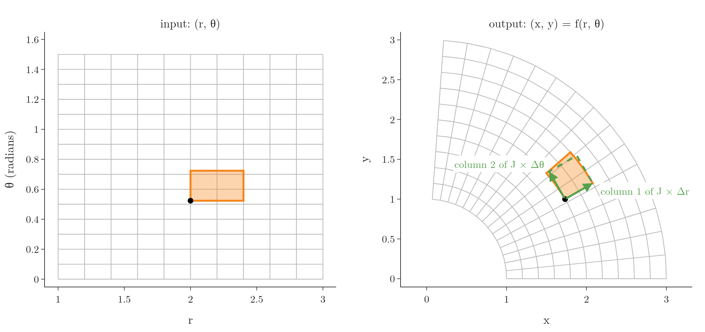
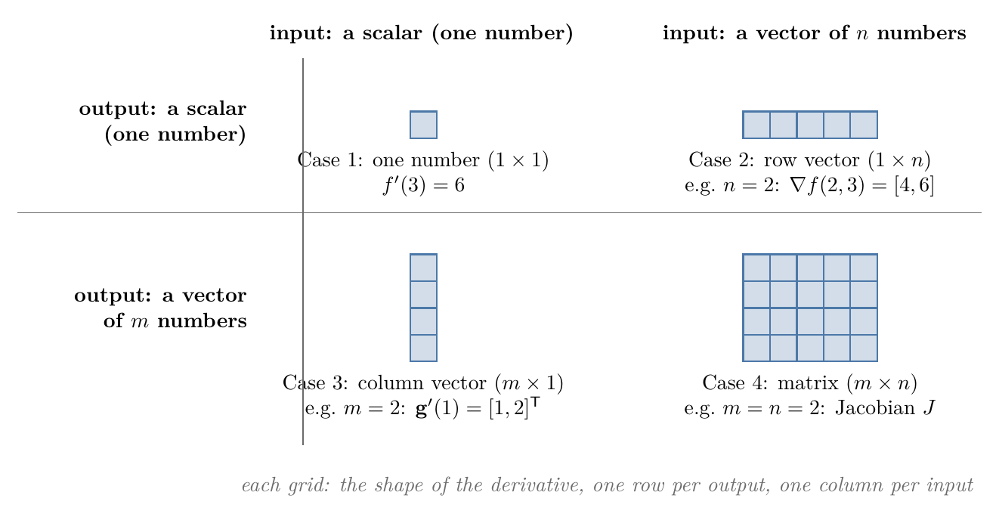
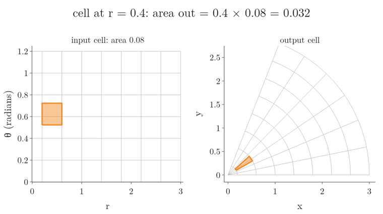
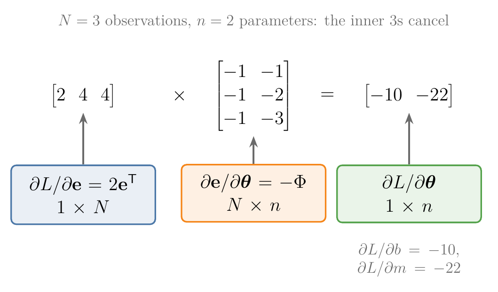
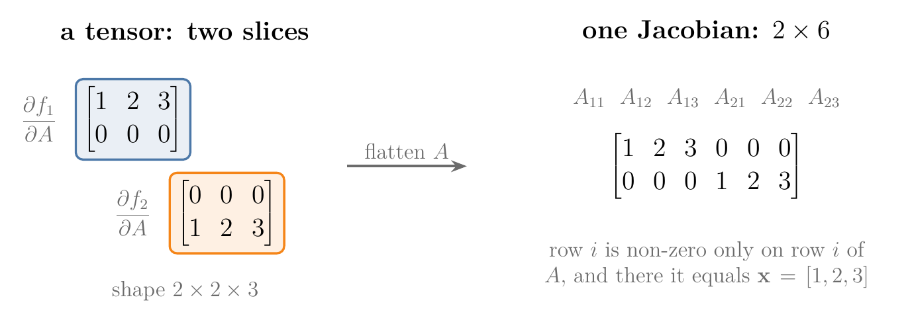

<!-- where-this-fits: generated by course_map/build_map.py; edit concepts.yaml, not this block -->
> **Where this fits:** Pipeline map step 0 (Foundations). See the [Course map](../../../00-course-map/00-course-map.md).
>
> 
>
> - **Builds on:** [Linear transformations and matrices](../../../MA/05-linear-algebra/MA-053-linear-transformations-and-matrices/MA-053-linear-transformations-and-matrices.md#7-where-ml-uses-linear-transformations); [Matrix multiplication as composition](../../../MA/05-linear-algebra/MA-054-matrix-multiplication-as-composition/MA-054-matrix-multiplication-as-composition.md#9-sources); [Partial derivatives and gradients](../../../MA/06-calculus/MA-062-partial-derivatives-and-gradients/MA-062-partial-derivatives-and-gradients.md#12-the-gradient-on-the-map).
> - **Leads to:** [Memoization](../../../DL/01-basics/DL-019-mlp-memoization/DL-019-mlp-memoization.md#3-memoization-on-the-fibonacci-numbers).
<!-- /where-this-fits -->

## 1. Overview

> **Key point:** For a function with several outputs, such as the polar map $\mathbf{f}(r, \theta) = (r\cos\theta,\ r\sin\theta)$, the derivative is a matrix, the Jacobian: one row per output, one column per input. Near a point, the function acts like the linear map of that matrix.



Figure 1 shows the main idea. A function with several outputs, such as the polar map, moves points of the plane, like the linear transformations of the [linear transformations and matrices](../../05-linear-algebra/MA-053-linear-transformations-and-matrices/MA-053-linear-transformations-and-matrices.md#2-transformations-functions-that-move-vectors). But it bends the grid. Zoom in on one small cell, though, and the bending almost disappears: the cell lands on something very close to a parallelogram. That parallelogram is drawn by a matrix, the Jacobian.

[The gradient](../MA-062-partial-derivatives-and-gradients/MA-062-partial-derivatives-and-gradients.md#4-the-gradient) handled functions with one output. In this Note we:

- watch a function with several outputs bend a grid, and zoom in until it looks linear (Sections 2 and 3);
- build the matrix of that linear look, the Jacobian, from two tiny steps (Section 4);
- read its determinant as an area factor (Section 5) and chain Jacobians together (Section 6);
- apply this to the least-squares loss (Section 7);
- take a short look at derivatives with respect to matrices (Sections 8 and 9);
- preview how deep learning libraries compute gradients (Section 10).

## 2. Functions that bend the grid

> **Key point:** A function with several outputs is a stack of ordinary one-output functions, one per output. With two inputs and two outputs it moves every point of the plane, and usually bends the grid.

### 2.1 Recap: a matrix moves a grid

A $2 \times 2$ matrix moves every point of the plane so that grid lines stay straight, parallel and evenly spaced: a **linear transformation** (G-1097). Its first column is where $\hat{\imath}$ lands and its second column is where $\hat{\jmath}$ lands ($\hat{\imath} = (1, 0)$ and $\hat{\jmath} = (0, 1)$ are the two basic steps along the axes). [Linear transformations and matrices](../../05-linear-algebra/MA-053-linear-transformations-and-matrices/MA-053-linear-transformations-and-matrices.md#2-transformations-functions-that-move-vectors) teaches this picture; we use it throughout.

### 2.2 Functions with several outputs

Our running example is **polar coordinates** (G-1511). Two numbers go in: a radius $r$ (how far from the origin) and an angle $\theta$ (which way). Two numbers come out: the point $(x, y)$ of the plane.

$$\mathbf{f}(r, \theta) = \begin{bmatrix} r\cos\theta \cr r\sin\theta \end{bmatrix}$$

The function is two ordinary functions stacked, one per output:

$$f_1(r, \theta) = r\cos\theta$$

$$f_2(r, \theta) = r\sin\theta$$

At $r = 2$ and $\theta = \pi/6$ (30 degrees), one output at a time:

$$f_1(2, \tfrac{\pi}{6}) = 2 \times \cos 30^\circ = 2 \times 0.866 = 1.732$$

$$f_2(2, \tfrac{\pi}{6}) = 2 \times \sin 30^\circ = 2 \times 0.5 = 1$$

$$\mathbf{f}(2, \tfrac{\pi}{6}) = (1.732,\ 1)$$

This output is the black dot of Figure 1.

A **vector-valued function** (G-2082) is the same thing in general: it takes $n$ numbers in and gives $m$ numbers out, and we read it as $m$ ordinary functions $f_1, \dots, f_m$ stacked on top of each other. Each $f_i$ has one output, so it has its own [gradient](../MA-062-partial-derivatives-and-gradients/MA-062-partial-derivatives-and-gradients.md#41-collecting-the-partial-derivatives) (the list of its partial derivatives).

**Reading the notation.** The Note uses a few symbols for "how many numbers". Each one, with an instance:

| Symbol | Read as | Instance |
|---|---|---|
| $\mathbb{R}$ | the real numbers: any number on the number line | $2$, $-0.5$, $1.732$ |
| $\mathbb{R}^2$ | all pairs of numbers | $(2, \pi/6)$, $(1.732, 1)$ |
| $\mathbb{R}^n$ | all lists of $n$ numbers | polar coordinates take a list of $n = 2$ |
| $\in$ | "is in", "is one of" | $(1.732, 1) \in \mathbb{R}^2$: the output is a pair of numbers |
| $\mathbf{f}: \mathbb{R}^n \to \mathbb{R}^m$ | $\mathbf{f}$ takes $n$ numbers in and gives $m$ numbers out | polar: $\mathbf{f}: \mathbb{R}^2 \to \mathbb{R}^2$, so $n = 2$, $m = 2$ |
| $\mathbb{R}^{m \times n}$ | all tables (matrices) of $m$ rows and $n$ columns | a $2 \times 2$ matrix is in $\mathbb{R}^{2 \times 2}$; a row of 3 numbers is in $\mathbb{R}^{1 \times 3}$ |
| bold $\mathbf{x}$, $\mathbf{f}$ | several numbers held together (a vector) | $\mathbf{x} = (r, \theta) = (2, \pi/6)$ |
| plain $x$, $f_1$ | one number, or a function with one output | $f_1(2, \pi/6) = 1.732$ |
| $^{\mathsf T}$ (transpose) | turns a row into a column, and back | $[1, 2]^{\mathsf T}$ is the column with 1 on top of 2 |

In this Note, $n$ always counts the inputs and $m$ the outputs. In general,

$$\mathbf{f}(\mathbf{x}) = \begin{bmatrix} f_1(\mathbf{x}) \cr\vdots \cr f_m(\mathbf{x}) \end{bmatrix} \in \mathbb{R}^m$$
$$f_i: \mathbb{R}^n \to \mathbb{R}$$

Like a matrix, $\mathbf{f}$ moves every point of a grid. Unlike a matrix, it bends the grid: in Figure 1 the straight lines of constant $\theta$ become rays, and the straight lines of constant $r$ become arcs of circles. So $\mathbf{f}$ is not linear, and no single $2 \times 2$ matrix describes it everywhere.

ML is full of such functions: a neural network layer turns a vector of inputs into a vector of outputs, and so does a prediction for all **observations** (G-1374) (records, one row of the data table each) of a dataset at once.

## 3. Zoom in: the function looks linear

> **Key point:** Around any one point, a smooth function looks more and more like a linear transformation the further we zoom in. That linear transformation is its **local linear map** (G-1108).

Follow one point while $\mathbf{f}$ moves the grid, and zoom in on a small cell around it. The rays and arcs are still curved, but over a tiny region they are almost straight, almost parallel and almost evenly spaced: the three signs of a linear transformation from Section 2.1. The smaller the region, the better the match. A function that behaves like this is called **locally linear** (G-2250).


In Figure 2, watch the gap between the orange and green outlines: at full size the curved cell sticks out, but with sides 20 times smaller the two outlines coincide. Zoomed in far enough, the function is a linear map. A linear map of the plane is a $2 \times 2$ matrix, which raises the question of the next section: which matrix?

## 4. The Jacobian

> **Key point:** The Jacobian is the $m \times n$ matrix of all first partial derivatives: column $j$ is where a tiny step along input $j$ lands, divided by the step's size; row $i$ is the gradient of output $f_i$.

### 4.1 Two tiny steps give the two columns

> **Key point:** Take a tiny step along each input, see where it lands, and divide by the step's size. The results are the matrix's columns.

A matrix is known once we know where $\hat{\imath}$ and $\hat{\jmath}$ land (Section 2.1). Near a point, the role of $\hat{\imath}$ is played by a tiny step along the first input, and the role of $\hat{\jmath}$ by a tiny step along the second.

1. **In words:** from the point $(r, \theta) = (2, \pi/6)$, take a step of size $h$ along $r$. It lands as a small step in the output plane. That step shrinks with $h$, so we divide it by $h$: the result keeps a normal size however far we zoom. Then do the same with a step along $\theta$.
2. **Example**, with the Note's numbers (Figure 3):
   - **Step along $r$.** The radius grows from 2 to $2 + h$; the angle stays $\pi/6$. Each output changes by:
     $$f_1: \quad (2 + h) \times 0.866 - 2 \times 0.866 = 0.866\thinspace h$$
     $$f_2: \quad (2 + h) \times 0.5 - 2 \times 0.5 = 0.5\thinspace h$$
     $$\text{divided by } h: \quad (0.866,\ 0.5)$$
     Moving out along a ray is straight, so the answer is the same for every $h$. This is the first column.
   - **Step along $\theta$**, with $h = 0.6$. The angle grows by $h = 0.6$, from $\pi/6 = 0.524$ to the new angle below; the radius stays 2.
     $$0.524 + 0.6 = 1.124$$
     $$\mathbf{f}(2,\ 1.124) = (2 \times 0.432,\ 2 \times 0.902)$$
     $$\mathbf{f}(2,\ 1.124) = (0.865,\ 1.803)$$
     The landed step is the new output minus the old output $(1.732,\ 1)$:
     $$\text{landed step} = (0.865 - 1.732,\ 1.803 - 1)$$
     $$\text{landed step} = (-0.867,\ 0.803)$$
     Divided by $h$:
     $$(-0.867 / 0.6,\ 0.803 / 0.6)$$
     $$= (-1.445,\ 1.339)$$
     The same lines with $h = 0.01$:
     $$\mathbf{f}(2,\ 0.534) = (1.722,\ 1.017)$$
     $$\text{landed step} = (1.722 - 1.732,\ 1.017 - 1)$$
     $$\text{landed step} = (-0.0101,\ 0.0173)$$
     $$\text{divided by } h = (-1.009,\ 1.727)$$
     The arc curves, so the answer depends on $h$. As $h$ shrinks it settles on $(-1,\ 1.732)$. This is the second column.
3. **Formal version:** a step divided by its size, as the size shrinks to zero, is a derivative. For the first column it is $\partial\mathbf{f}/\partial r$, the partial derivatives of both outputs with respect to $r$; for the second, $\partial\mathbf{f}/\partial\theta$.


In Figure 3, watch the green arrow while $h$ shrinks. For the step along $r$ it never moves. For the step along $\theta$ it starts too short and too flat, then turns and grows until it stops at $(-1, 1.732)$.

### 4.2 The formula: every partial derivative in one grid

> **Key point:** Put the gradients of $f_1, \dots, f_m$ as rows on top of each other.

Each column of Section 4.1 holds the partial derivatives of all $m$ outputs with respect to one input. Placing the $n$ columns side by side gives a matrix.

1. **In words:** entry $(i, j)$ is the partial derivative of output $i$ with respect to input $j$. Row $i$ is the **gradient** (G-863) of $f_i$.
2. **Formula:** the **Jacobian** (G-980) is the table of $m$ rows (one per output) and $n$ columns (one per input). The symbol $\in \mathbb{R}^{m \times n}$ below says exactly that:
   $$J = \frac{d\mathbf{f}}{d\mathbf{x}}$$
   $$J = \begin{bmatrix} \dfrac{\partial f_1}{\partial x_1} & \cdots & \dfrac{\partial f_1}{\partial x_n} \cr\vdots & & \vdots \cr\dfrac{\partial f_m}{\partial x_1} & \cdots & \dfrac{\partial f_m}{\partial x_n} \end{bmatrix} \in \mathbb{R}^{m \times n}$$
   $$J_{ij} = \frac{\partial f_i}{\partial x_j}$$
3. **Example:** for polar coordinates, differentiate each output with respect to $r$ and to $\theta$, one entry at a time:
   $$\frac{\partial f_1}{\partial r} = \cos\theta$$
   $$\frac{\partial f_1}{\partial \theta} = -r\sin\theta$$
   $$\frac{\partial f_2}{\partial r} = \sin\theta$$
   $$\frac{\partial f_2}{\partial \theta} = r\cos\theta$$
   $$J = \begin{bmatrix} \cos\theta & -r\sin\theta \cr\sin\theta & r\cos\theta \end{bmatrix}$$
   At $r = 2$, $\theta = \pi/6$:
   $$J(2, \tfrac{\pi}{6}) = \begin{bmatrix} 0.866 & -1 \cr0.5 & 1.732 \end{bmatrix}$$
   The two columns are exactly the two green arrows of Figure 3.

This arrangement, outputs as rows and inputs as columns, is the **numerator layout** (G-1366). Some texts use the transpose (the denominator layout); the numbers are the same, only flipped.

### 4.3 The four shapes of a derivative

> **Key point:** A derivative has one row per output and one column per input. So a function's numbers of inputs and outputs fix the derivative's shape before we compute anything.

So far we have met three kinds of derivative: the [slope of a tangent line](../MA-061-derivatives-of-one-variable/MA-061-derivatives-of-one-variable.md#41-from-secant-to-tangent), the [gradient](../MA-062-partial-derivatives-and-gradients/MA-062-partial-derivatives-and-gradients.md#4-the-gradient) and now the Jacobian. They are one idea.

Two words help here. One number on its own, such as 13, is a [**scalar**](../../../ML/01-foundations/ML-010-tensors/ML-010-tensors.md#2-what-a-tensor-is) (G-1743). A list of numbers, such as $(2, 3)$, is a [**vector**](../../../ML/01-foundations/ML-010-tensors/ML-010-tensors.md#2-what-a-tensor-is) (G-2081). Every case below talks about two different objects, and the two must not be mixed up:

1. **the function:** what goes in (a scalar or a vector) and what comes out (a scalar or a vector);
2. **its derivative:** a table of numbers with one row per output of the function and one column per input.

So counting the function's inputs and outputs fixes the shape of its derivative. That gives four cases. Figure 4 draws one small function for each case, and Figure 5 shows the four derivative shapes side by side.

![The four cases, one small function each. Case 1: $x^2$ takes a scalar and gives a scalar; its derivative at 3 is one number, 6. Case 2: the bowl $x^2 + y^2$ as a surface (left) and as a contour map (right); the function takes a vector (2 numbers) and gives a scalar, 13; its derivative, the gradient at (2, 3), is a row vector of 2 numbers, drawn as an arrow. Case 3: the path $(t, t^2)$ takes a scalar and gives a vector (a point); its derivative at $t = 1$ is a column vector of 2 numbers, the velocity arrow. Case 4: the polar map takes a vector and gives a vector; its derivative, the Jacobian at $(2, \pi/6)$, is a 2 × 2 matrix, drawn as its two columns](images/derivative_cases.png){height=60%}

**Case 1: scalar in, scalar out** (top left of Figure 4).

- **The function** takes one number and gives one number:
  $$f(x) = x^2$$
  $$f(3) = 9$$
- **Its derivative** at 3 is also one number:
  $$f'(x) = 2x$$
  $$f'(3) = 6$$
  As a table it has 1 row (one output) and 1 column (one input): shape $1 \times 1$.

In the panel the derivative is the slope of the orange tangent line at the black dot.

**Case 2: vector in, scalar out** (top right).

- **The function** takes a vector of two numbers, $(x, y)$, and gives one number:
  $$f(x, y) = x^2 + y^2$$
  $$f(2, 3) = 4 + 9 = 13$$
- **Its derivative** is not one number. It has one partial derivative per input:
  $$\frac{\partial f}{\partial x} = 2x = 4$$
  $$\frac{\partial f}{\partial y} = 2y = 6$$
  Side by side they form the gradient $\nabla f$ (read "nabla f"), a [**row vector**](../../../MA/05-linear-algebra/MA-048-vectors-and-feature-vectors/MA-048-vectors-and-feature-vectors.md#5-row-vectors-and-column-vectors) (G-1714; a vector written as one row) of two numbers:
  $$\nabla f(2, 3) = \begin{bmatrix} 4 & 6 \end{bmatrix}$$
  As a table it has 1 row (one output) and 2 columns (two inputs): shape $1 \times 2$.

The panel shows the function twice. On the left is its surface: a round bowl, lowest at $(0, 0)$, with the black dot at height 13 above $(2, 3)$. On the right is the same bowl seen from straight above, as a [contour map](../MA-062-partial-derivatives-and-gradients/MA-062-partial-derivatives-and-gradients.md#11-reading-a-contour-map) (G-468): each circle joins points of the same height, and darker means lower, on both. The derivative, the gradient $[4, 6]$, is the orange arrow at $(2, 3)$; it points straight uphill, across the circles.

**Case 3: scalar in, vector out** (bottom left).

- **The function** is a path: it takes one number $t$ and gives a vector of two numbers, a point in the plane:
  $$\mathbf{g}(t) = \begin{bmatrix} t \cr t^2 \end{bmatrix}$$
  $$\mathbf{g}(1) = \begin{bmatrix} 1 \cr1 \end{bmatrix}$$
- **Its derivative** has one entry per output, stacked as a [**column vector**](../../../MA/05-linear-algebra/MA-048-vectors-and-feature-vectors/MA-048-vectors-and-feature-vectors.md#5-row-vectors-and-column-vectors) (G-416; a vector written as one column):
  $$\mathbf{g}'(t) = \begin{bmatrix} 1 \cr2t \end{bmatrix}$$
  $$\mathbf{g}'(1) = \begin{bmatrix} 1 \cr2 \end{bmatrix} = [1, 2]^{\mathsf T}$$
  As a table it has 2 rows (two outputs) and 1 column (one input): shape $2 \times 1$.

In the panel the derivative is the orange velocity arrow: as $t$ grows past 1, the point moves 1 to the right and 2 up per unit of $t$, along the curve.

**Case 4: vector in, vector out** (bottom right).

- **The function** is the polar map of Section 2.2: it takes a vector of two numbers, $(r, \theta)$, and gives a vector of two numbers, $(x, y)$. At $(2, \pi/6)$ it gives $(1.732, 1)$.
- **Its derivative** is the Jacobian, a [**matrix**](../../../ML/01-foundations/ML-010-tensors/ML-010-tensors.md#2-what-a-tensor-is) (G-1180; a table of numbers). Section 4.2 found
  $$J(2, \tfrac{\pi}{6}) = \begin{bmatrix} 0.866 & -1 \cr0.5 & 1.732 \end{bmatrix}$$
  It has 2 rows (two outputs) and 2 columns (two inputs): shape $2 \times 2$.

In the panel each column of the matrix is an arrow at the output point: the green one is where a step in $r$ lands (along the ray), the purple one where a step in $\theta$ lands (along the circle).

**What to conclude.** All four derivatives are Jacobians; only the numbers of rows and columns change:

| Case | The function takes | The function gives | Its derivative | Shape of the derivative |
|---|---|---|---|---|
| 1 | a scalar (1 number) | a scalar (1 number) | the slope: one number | 1 row, 1 column |
| 2 | a vector of $n$ numbers | a scalar (1 number) | the gradient: a row vector of $n$ numbers | 1 row, $n$ columns |
| 3 | a scalar (1 number) | a vector of $m$ numbers | the velocity of a path: a column vector of $m$ numbers | $m$ rows, 1 column |
| 4 | a vector of $n$ numbers | a vector of $m$ numbers | the Jacobian: a matrix of $m \times n$ numbers | $m$ rows, $n$ columns |

{height=32%}

Figure 5 is the summary to remember. Before computing any derivative, we write down its shape. In a chain-rule product the shapes must fit like any matrix product, so a product whose shapes do not fit is certainly wrong.

### 4.4 Small steps are transformed by J

> **Key point:** Near a point, the function moves small steps exactly as the matrix $J$ would: the new output is the old output plus $J$ times the step.

Section 4.1 found where steps along each input land. A step in any direction is a mix of the two, so, as for any matrix, it lands on the same mix of the two columns.

Two names for the formula. The starting point is $\mathbf x_0$, here $\mathbf x_0 = (2, \pi/6)$. The small step in the inputs is $\boldsymbol{\delta}$ (the Greek letter delta), here

$$\boldsymbol{\delta} = (0.1,\ 0.05)$$

that is, the radius grows by 0.1 and the angle by 0.05.

1. **In words:** start from the output at $\mathbf x_0$ and add the Jacobian times the step.
2. **Formula:**
   $$\mathbf{f}(\mathbf x_0 + \boldsymbol{\delta})$$
   $$\approx \mathbf{f}(\mathbf x_0) + J(\mathbf x_0)\thinspace\boldsymbol{\delta}$$
3. **Example:** polar coordinates at $(2, \pi/6)$, step $\boldsymbol{\delta} = (0.1, 0.05)$:
   $$\mathbf{f}(\mathbf x_0) = \begin{bmatrix} 1.732 \cr1 \end{bmatrix}$$
   $$J\thinspace\boldsymbol{\delta} =$$
   $$\begin{bmatrix} 0.866 & -1 \cr0.5 & 1.732 \end{bmatrix} \begin{bmatrix} 0.1 \cr0.05 \end{bmatrix}$$
   The matrix times the step, one row at a time. Row 1:
   $$0.866 \times 0.1 = 0.087$$
   $$-1 \times 0.05 = -0.05$$
   $$0.087 + (-0.05) = 0.037$$
   Row 2:
   $$0.5 \times 0.1 = 0.05$$
   $$1.732 \times 0.05 = 0.087$$
   $$0.05 + 0.087 = 0.137$$
   Add these to the starting output:
   $$\begin{bmatrix} 1.732 + 0.037 \cr1 + 0.137 \end{bmatrix}$$
   $$= \begin{bmatrix} 1.769 \cr1.137 \end{bmatrix}$$
   The exact value $\mathbf{f}(2.1,\ \pi/6 + 0.05)$ is $(1.764,\ 1.140)$: off by only 0.005.

This **linearisation** (G-1099) is the **tangent line** (G-1945) of the [derivatives of one variable](../MA-061-derivatives-of-one-variable/MA-061-derivatives-of-one-variable.md#41-from-secant-to-tangent), in several dimensions. Figure 1 shows it as a picture: the orange cell lands on a curved cell, and the green parallelogram spanned by the Jacobian's columns (each times the cell's side) almost covers it. The smaller the cell, the better the match, as Figure 2 showed.

### 4.5 For a linear function, the Jacobian is its matrix

> **Key point:** The Jacobian of $\mathbf{f}(\mathbf{x}) = A\mathbf{x}$ is $A$ itself, at every point.

1. **In words:** output $i$ multiplies each input by one number from row $i$ of $A$ and adds them up:
   $$f_i = A_{i1}x_1 + \dots + A_{in}x_n$$
   Nudging $x_j$ changes $f_i$ only through the term $A_{ij}x_j$, so its partial derivative with respect to $x_j$ is just the number $A_{ij}$.
2. **Formula:** for $A \in \mathbb{R}^{m \times n}$,
   $$\frac{d}{d\mathbf{x}}\thinspace A\mathbf{x} = A$$
3. **Example:** for the matrix of the [linear transformations and matrices](../../05-linear-algebra/MA-053-linear-transformations-and-matrices/MA-053-linear-transformations-and-matrices.md#5-the-matrix-of-a-transformation), $A$ with rows $[1, 3]$ and $[-2, 0]$, the two outputs are
   $$f_1 = x_1 + 3x_2$$
   $$f_2 = -2x_1$$
   Row by row, the partial derivatives are 1 and 3 for $f_1$, and $-2$ and 0 for $f_2$, so
   $$J = \begin{bmatrix} 1 & 3 \cr-2 & 0 \end{bmatrix} = A$$

A linear map needs no approximation: the "best local linear map" is the map itself. The statement is the matrix version of "the derivative of $ax$ is $a$".

## 5. The Jacobian determinant: how areas scale

> **Key point:** $|\det J|$ is the factor by which the function stretches small areas (or volumes) near a point. It can differ from point to point: more than 1 stretches, less than 1 squashes.

### 5.1 Recap: the determinant is an area factor

The **determinant** (G-598) was introduced with [eigenvectors and eigenvalues](../../05-linear-algebra/MA-056-eigenvectors-and-eigenvalues/MA-056-eigenvectors-and-eigenvalues.md#32-when-can-a-matrix-send-a-non-zero-vector-to-zero): the factor by which a linear transformation scales every area. A unit square becomes a parallelogram, and the parallelogram's area is $|\det|$. If $\hat{\jmath}$ ends up on the other side of $\hat{\imath}$, the plane has been flipped over like a sheet of paper; this reversed **orientation** (G-2251) makes the determinant negative.

![The unit square under $A$ (rows $[1, 3]$, $[-2, 0]$) becomes a parallelogram of area 6. Then, back on the unit square, $\hat{\imath}$ swings towards $\hat{\jmath}$: the area shrinks to 0 when they line up, and past that point the square flips over and the determinant turns negative (red). Idea after 3Blue1Brown, "The determinant | Chapter 6, Essence of linear algebra"](images/det_sign.gif)

In Figure 6, watch the readout as $\hat{\imath}$ swings, starting again from the unit square: $\det = \cos$ of its angle falls from 1 to 0 as the square flattens into a line, then keeps falling below 0 as the square turns over. For the matrix $A$ of Section 4.5:

$$1 \times 0 = 0$$
$$3 \times (-2) = -6$$
$$\det A = 0 - (-6) = 6$$

so every area grows 6 times.

### 5.2 det J: how a function scales small areas

Since the Jacobian is the local linear map, its determinant tells how much $\mathbf{f}$ scales small areas near a point.

1. **In words:** a tiny region of area $\Delta A$ around $\mathbf x_0$ lands on a region of area about $|\det J(\mathbf x_0)|\thinspace\Delta A$.
2. **Formula:** the **Jacobian determinant** (G-979) of a $2 \times 2$ matrix is (top-left times bottom-right) minus (top-right times bottom-left). For polar coordinates, one step per line:
   $$\det J = \cos\theta \cdot r\cos\theta - (-r\sin\theta) \cdot \sin\theta$$
   $$= r\cos^2\theta + r\sin^2\theta$$
   $$= r\thinspace(\cos^2\theta + \sin^2\theta)$$
   $$= r$$
   The last step uses $\cos^2\theta + \sin^2\theta = 1$.
3. **Example:** the orange cell of Figure 1 has sides $\Delta r = 0.4$ and $\Delta\theta = 0.2$ ($\Delta$, capital delta, means "the size of the change in"). Its area in the input is
   $$0.4 \times 0.2 = 0.08$$
   The cell sits around $r \approx 2.2$, so $\det J \approx 2.2$ and it lands on an area of about
   $$2.2 \times 0.08 = 0.176$$
   Here the exact area is also 0.176.



So polar coordinates stretch cells more the further they are from the origin. In Figure 7, watch the input cell keep its size while its image grows: from 0.032 at $r = 0.4$ to 0.224 at $r = 2.8$, seven times larger, because $r$ is seven times larger. Near the origin, where $r < 1$, the cells shrink instead. For a linear map, $\det J = \det A$ everywhere.

### 5.3 Stretched at one point, squashed at another

A second map shows both cases side by side. Take

$$\mathbf{g}(x, y) = \begin{bmatrix} x + \sin y \cr y + \sin x \end{bmatrix}$$

$$J = \begin{bmatrix} 1 & \cos y \cr\cos x & 1 \end{bmatrix}$$

$$\det J = 1 - \cos x\cos y$$

1. **In words:** compute $\det J$ at each point of interest; above 1 the map stretches small areas there, below 1 it squashes them.
2. **Example:**
   - at $(-2, 1)$, where $\cos(-2) = -0.416$ and $\cos 1 = 0.540$:
     $$\cos x \cos y = (-0.416) \times 0.540 = -0.225$$
     $$\det J = 1 - (-0.225) = 1.22$$
     Areas grow by about a fifth.
   - at $(0, 1)$, where $\cos 0 = 1$ and $\cos 1 = 0.540$:
     $$\cos x \cos y = 1 \times 0.540 = 0.540$$
     $$\det J = 1 - 0.540 = 0.46$$
     Areas shrink to less than half.


In Figure 8, watch the two insets while the grid bends: the orange square ends slightly larger than its dashed outline, the purple one clearly smaller, and the area readouts stop at the two values of $\det J$.

> **Extra:** The Jacobian determinant is how probability densities change under a change of variables. If $\mathbf{y} = \mathbf{f}(\mathbf{x})$, probability in a small region must be kept, so the density of $\mathbf{y}$ is the density of $\mathbf{x}$ divided by $|\det J|$: where $\mathbf{f}$ stretches area, the same probability is spread thinner (MML §6.7). Its one-dimensional form, "density is a derivative", appears in the [PDF and continuous CDF](../../03-distributions/MA-022-pdf-and-continuous-cdf/MA-022-pdf-and-continuous-cdf.md#5-what-the-density-at-a-point-means). Generative models called normalizing flows are built on exactly this rule (Rezende and Mohamed 2015).

## 6. The chain rule with Jacobians

> **Key point:** When one function feeds another, the derivative of the whole chain is the Jacobian of the outer function times the Jacobian of the inner one, in the same order as the functions.

### 6.1 A point moving through a landscape

Start with the simplest case: a point moves along a path, and we watch the value of a function at the point. Everything is given a concrete form first.

The function, one output, two inputs:

$$f(x, y) = x\thinspace y^2$$
$$f(2, 2) = 2 \times 4 = 8$$

The path: the point's position at time $t$ is

$$x(t) = 2t$$
$$y(t) = t + 1$$

Held together as one vector, the path is $\mathbf{v}(t) = (x(t),\ y(t))$. At $t = 1$:

$$x(1) = 2 \times 1 = 2$$

$$y(1) = 1 + 1 = 2$$

$$\mathbf{v}(1) = (2,\ 2)$$
$$f(\mathbf{v}(1)) = 8$$

The question: as $t$ grows past 1, how fast does the value of $f$ change?

**First, the landscape.** Figure 9 draws $f$ as a surface: above each input $(x, y)$ the height is $f(x, y)$. On the square we use, it is a curved sheet:

- along the edge $x = 0$ it is flat at height 0, because zero times any number is zero;
- for a fixed $y$, it climbs in a straight line as $x$ grows;
- for a fixed $x$, it bends upward more and more as $y$ grows, because $y$ is squared.

The path is a curve drawn on that sheet. As $t$ runs from 0 to 1, the point starts at $(0, 1)$ at height 0 and climbs to $(2, 2)$ at height 8.

Then the camera does what Figure 1 of [reading a contour map](../MA-062-partial-derivatives-and-gradients/MA-062-partial-derivatives-and-gradients.md#11-reading-a-contour-map) does for a bowl. The lines of equal height $2, 4, \dots, 20$ drop to the floor, and the camera tilts up until it looks straight down. The floor is now the **contour map** (G-468) of the next figure, with the path drawn on it. How to read it:

- each line joins points of the same height; darker = lower;
- lines close together = steep: they crowd towards the top right, where the sheet climbs fastest;
- the path crosses the lines, so the height changes as the point moves.

{height=55%}

{height=55%}

Figure 10 shows the answer as a process. When $t$ grows, the point moves along the path, and that move has two parts: a part along $x$ (orange arrow) and a part along $y$ (purple arrow). Each part changes $f$ on its own, and the two changes add up.

**Step 1: how fast each input moves.** From the path:

$$\frac{dx}{dt} = 2$$
$$\frac{dy}{dt} = 1$$

**Step 2: how strongly $f$ responds to each input** at the point $(2, 2)$. These are the [partial derivatives](../MA-062-partial-derivatives-and-gradients/MA-062-partial-derivatives-and-gradients.md#3-partial-derivatives) (the slope of $f$ along one input, the other held fixed):

$$\frac{\partial f}{\partial x} = y^2 = 2^2 = 4$$

$$\frac{\partial f}{\partial y} = 2xy = 2 \times 2 \times 2 = 8$$

**Step 3: each effect is one product.** The effect through $x$ is (response of $f$ to $x$) times (speed of $x$):

$$\frac{\partial f}{\partial x} \times \frac{dx}{dt} = 4 \times 2 = 8$$

The effect through $y$:

$$\frac{\partial f}{\partial y} \times \frac{dy}{dt} = 8 \times 1 = 8$$

**Step 4: add the two effects.**

$$\frac{df}{dt} = 8 + 8 = 16$$

At $t = 1$, the value of $f$ grows 16 times as fast as $t$. In Figure 10 this is the slope of the green tangent line on the right.

**Check by the long way.** Put the path into $f$ first, so that $f$ becomes a function of $t$ alone:

$$h(t) = f(x(t), y(t)) = 2t\thinspace(t + 1)^2$$

The product rule of the [derivatives of one variable](../MA-061-derivatives-of-one-variable/MA-061-derivatives-of-one-variable.md#52-sum-product-and-quotient-rules), one term per line:

$$\text{first factor changed:} \quad 2 \times (t + 1)^2 = 2 \times 4 = 8$$

$$\text{second factor changed:} \quad 2t \times 2(t + 1) = 2 \times 4 = 8$$

$$h'(1) = 8 + 8 = 16$$

The same 16, and the same two 8s.

**Step 5: name the pattern.** Step 3 multiplied two pairs of numbers and Step 4 added the products. Multiplying two lists entry by entry and adding is the **dot product** (G-634):

$$\begin{bmatrix} 4 & 8 \end{bmatrix} \cdot \begin{bmatrix} 2 \cr1 \end{bmatrix}$$

$$= 4 \times 2 + 8 \times 1$$

$$= 8 + 8 = 16$$

The first list is the gradient of $f$ at the point, $\nabla f(2, 2) = [4, 8]$. The second is the path's velocity, $\mathbf{v}'(1) = [2, 1]^{\mathsf T}$, how fast each coordinate moves.

**Step 6: the general formula.** The same steps work at any $t$, for any $f$ and any path:

1. **In words:** at each input, multiply "how strongly $f$ responds to it" by "how fast it moves"; add the products. That sum is the gradient dotted with the velocity.
2. **Formula:** this is the **multivariate chain rule** (G-1281) of [the chain rule with several variables](../MA-062-partial-derivatives-and-gradients/MA-062-partial-derivatives-and-gradients.md#6-the-chain-rule-with-several-variables), in vector form:
   $$\frac{d}{dt}\thinspace f(\mathbf{v}(t))$$
   $$= \frac{\partial f}{\partial x}\frac{dx}{dt} + \frac{\partial f}{\partial y}\frac{dy}{dt}$$
   $$= \nabla f(\mathbf{v}(t)) \cdot \mathbf{v}'(t)$$
   Check: with the numbers above it gives
   $$4 \times 2 + 8 \times 1 = 16$$

It has the shape of the one-variable **chain rule** (G-371), where the derivative of $f(g(t))$ is $f'(g(t))$ times $g'(t)$: the outer derivative, taken at the inner output, times the inner derivative. The same rule holds with 100 inputs instead of 2: one product per input, then the sum.

### 6.2 The same product as Jacobians

Write the two pieces with the shapes of Section 4.3. The gradient $[4, 8]$ is the Jacobian of $f$: 1 output, 2 inputs, a $1 \times 2$ row. The velocity is the Jacobian of the path: 2 outputs ($x$ and $y$), 1 input ($t$), a $2 \times 1$ column. Their matrix product is exactly the dot product of Step 5:

$$\underset{1 \times 2}{\begin{bmatrix} 4 & 8 \end{bmatrix}} \underset{2 \times 1}{\begin{bmatrix} 2 \cr1 \end{bmatrix}}$$

$$= 4 \times 2 + 8 \times 1$$

$$= 16$$

So the chain rule already is a product of Jacobians. The rule holds for any shapes.

**Formal version:** the **chain rule with Jacobians** (G-370). Multiply the Jacobian of the outer function (at the inner output) by the Jacobian of the inner function; the inner sizes must match, like any matrix product. Take an inner function $\mathbf{g}: \mathbb{R}^n \to \mathbb{R}^k$ ($n$ numbers in, $k$ numbers in the middle) and an outer function $\mathbf{f}: \mathbb{R}^k \to \mathbb{R}^m$ ($k$ numbers in, $m$ out). In Section 6.1, $\mathbf{g}$ is the path ($n = 1$ input $t$, $k = 2$ middle numbers $x$ and $y$) and $f$ has $m = 1$ output. The chain of the two, "first $\mathbf{g}$, then $\mathbf{f}$", is written $\mathbf{f} \circ \mathbf{g}$. Its Jacobian is
$$\underset{m \times n}{\underbrace{\frac{d\thinspace\mathbf{f}(\mathbf{g}(\mathbf{x}))}{d\mathbf{x}}}}$$
$$= \underset{m \times k}{\underbrace{\frac{\partial \mathbf{f}}{\partial \mathbf{g}}}}\ \underset{k \times n}{\underbrace{\frac{\partial \mathbf{g}}{\partial \mathbf{x}}}}$$

Check with Section 6.2: $(1 \times 2)(2 \times 1)$ gives $1 \times 1$, the single number 16.

The Jacobian chain rule is the [matrix multiplication as composition](../../05-linear-algebra/MA-054-matrix-multiplication-as-composition/MA-054-matrix-multiplication-as-composition.md#2-composition-one-transformation-after-another) again, zoomed in: near a point each function is a linear map, and doing one linear map after another multiplies their matrices.

## 7. Example: the gradient of the least-squares loss

> **Key point:** Write the squared error as two functions in a chain, the errors and then their squared length. The chain rule gives its gradient as one row times one matrix.

[Setting the derivative to zero](../../../ML/06-regression/ML-053-multiple-lr-maths/ML-053-multiple-lr-maths.md#5-setting-the-derivative-to-zero) in multiple linear regression differentiated the squared error by expanding it and applying two rules of **matrix calculus** (G-1176). The chain rule gives the same result in three short steps, and the steps scale to models that are too deep to expand.

**The data and the model, with numbers first.** Three observations, the same three points as the gradient checking example of the [checking a gradient numerically](../MA-062-partial-derivatives-and-gradients/MA-062-partial-derivatives-and-gradients.md#7-checking-a-gradient-numerically): inputs 1, 2, 3 and targets 2, 4, 5. A straight line predicts each target as intercept $b$ plus slope $m$ times the input. (Here $m$ is the slope of the line, as in the regression Notes, not a number of outputs.) The parameters are held in one vector $\boldsymbol{\theta}$ (theta); we take

$$\boldsymbol{\theta} = [b,\ m] = [0,\ 1]$$

The data matrix $\Phi$ (capital phi) has one row per observation: a 1 for the intercept, then the input. The targets are the column $\mathbf{y}$:

$$\Phi = \begin{bmatrix} 1 & 1 \cr1 & 2 \cr1 & 3 \end{bmatrix}$$

$$\mathbf{y} = \begin{bmatrix} 2 \cr4 \cr5 \end{bmatrix}$$

The predictions are $\Phi\boldsymbol{\theta}$, one row at a time:

$$1 \times 0 + 1 \times 1 = 1$$

$$1 \times 0 + 2 \times 1 = 2$$

$$1 \times 0 + 3 \times 1 = 3$$

**First function: the errors.** Each error is target minus prediction:

$$\mathbf{e}(\boldsymbol{\theta}) = \mathbf{y} - \Phi\boldsymbol{\theta}$$

$$\mathbf{e}(\boldsymbol{\theta}) = \begin{bmatrix} 2 - 1 \cr4 - 2 \cr5 - 3 \end{bmatrix}$$

$$\mathbf{e}(\boldsymbol{\theta}) = \begin{bmatrix} 1 \cr2 \cr2 \end{bmatrix}$$

**Second function: the squared length.** The double bars $\lVert \mathbf{e} \rVert$ mean the length of the vector $\mathbf{e}$, so $\lVert \mathbf{e} \rVert^2$ is the sum of its squared entries:

$$L(\mathbf{e}) = \lVert \mathbf{e} \rVert^2 = \mathbf{e}^{\mathsf T}\mathbf{e}$$

$$= 1^2 + 2^2 + 2^2$$

$$= 9$$

Sizes, in letters: $N$ (capital) counts the observations, here $N = 3$; $n$ (small) counts the parameters, the inputs of $L$, here $n = 2$. So $\Phi$ is $N \times n$, $\mathbf{e}$ holds $N$ errors, and $L$ is one number.

1. **In words:** first find the shapes, then the two pieces, then multiply.
   - $\partial L/\partial \boldsymbol{\theta}$ will be $1 \times n$ (one output, $n$ inputs).
   - $\partial L/\partial \mathbf{e} = 2\mathbf{e}^{\mathsf T}$, a $1 \times N$ row: the derivative of $e_1^2 + \dots + e_N^2$ with respect to each $e_i$ is $2e_i$.
   - $\partial \mathbf{e}/\partial \boldsymbol{\theta} = -\Phi$, an $N \times n$ matrix: the Jacobian of a linear function (Section 4.5), with a minus sign.
2. **Formula:**
   $$\frac{\partial L}{\partial \boldsymbol{\theta}}$$
   $$= \underset{1 \times N}{\underbrace{\frac{\partial L}{\partial \mathbf{e}}}}\ \underset{N \times n}{\underbrace{\frac{\partial \mathbf{e}}{\partial \boldsymbol{\theta}}}}$$
   $$= -2\thinspace\mathbf{e}^{\mathsf T}\Phi$$
   $$= -2(\mathbf{y} - \Phi\boldsymbol{\theta})^{\mathsf T}\Phi$$
3. **Example:** with the numbers above. The row $\mathbf{e}^{\mathsf T} = [1, 2, 2]$ times each column of $\Phi$. Column 1 (the ones):
   $$1 \times 1 + 2 \times 1 + 2 \times 1 = 1 + 2 + 2 = 5$$
   Column 2 (the inputs):
   $$1 \times 1 + 2 \times 2 + 2 \times 3 = 1 + 4 + 6 = 11$$
   So $\mathbf{e}^{\mathsf T}\Phi = [5,\ 11]$, and
   $$-2\thinspace\mathbf{e}^{\mathsf T}\Phi = -2\thinspace[5,\ 11] = [-10,\ -22]$$
   These are $\partial L/\partial b = -10$ and $\partial L/\partial m = -22$, exactly the values found by hand in [checking a gradient numerically](../MA-062-partial-derivatives-and-gradients/MA-062-partial-derivatives-and-gradients.md#7-checking-a-gradient-numerically).

{height=30%}

In Figure 11, watch the shapes: the number of observations, $N = 3$, sits on the inside of the product and disappears, so the gradient has one entry per parameter whatever the size of the data.

Turning the row into a column (transposing it) gives the same gradient written as a column, one line per step:

$$\text{column form} = -2\Phi^{\mathsf T}(\mathbf{y} - \Phi\boldsymbol{\theta})$$

$$= -2\Phi^{\mathsf T}\mathbf{y} + 2\Phi^{\mathsf T}\Phi\boldsymbol{\theta}$$

$$= 2\Phi^{\mathsf T}\Phi\boldsymbol{\theta} - 2\Phi^{\mathsf T}\mathbf{y}$$

This is the column form of [the gradient](../../../ML/06-regression/ML-053-multiple-lr-maths/ML-053-multiple-lr-maths.md#52-the-gradient-then-zero). Setting it to zero gives the **normal equation** (the equation whose solution is the best-fitting parameters; see [the normal equation](../../../ML/06-regression/ML-053-multiple-lr-maths/ML-053-multiple-lr-maths.md#6-the-normal-equation)).

> **Python:**
>
> ```python
> import numpy as np
>
> Phi = np.array([[1.0, 1.0], [1.0, 2.0], [1.0, 3.0]])
> y = np.array([2.0, 4.0, 5.0])
> theta = np.array([0.0, 1.0])
>
> e = y - Phi @ theta          # [1, 2, 2]
> dL_de = 2 * e                # the 1 x N piece
> de_dtheta = -Phi             # the N x n piece
> dL_de @ de_dtheta            # [-10, -22]
> ```

## 8. Gradients of matrices

> **Key point:** A derivative of a matrix, or with respect to a matrix, has more than two indices: a tensor. In practice we flatten the matrices into long vectors so the Jacobian stays an ordinary matrix.

Some models need derivatives with respect to a whole weight matrix, such as a neural network layer's $W$. Counting indices shows the shape:

- an $m \times n$ matrix differentiated with respect to a vector of length $p$ gives an $m \times n \times p$ array;
- an $m \times n$ matrix differentiated with respect to a $p \times q$ matrix gives an $m \times n \times p \times q$ array, with entries $\partial A_{ij}/\partial B_{kl}$.

Arrays with more than two indices are **tensors** (G-1957) (see [what a tensor is](../../../ML/01-foundations/ML-010-tensors/ML-010-tensors.md#2-what-a-tensor-is)).

There are two equivalent ways to handle them:

- **Collect partial derivatives into a tensor.** Each partial derivative is a matrix; stack them along a new axis.
- **Flatten first.** Reshape each matrix into one long vector (an $m \times n$ matrix becomes a vector of $mn$ numbers), compute an ordinary $mn \times pq$ Jacobian, and reshape back if needed. The chain rule is then plain matrix multiplication.

A small example: $\mathbf{f} = A\mathbf{x}$ with $A$ of size $2 \times 3$ and $\mathbf{x} = [1, 2, 3]$, differentiated with respect to $A$. Since $f_1 = A_{11}x_1 + A_{12}x_2 + A_{13}x_3$, the derivative of $f_1$ with respect to the entries of $A$ is $\mathbf{x}$ in the first row and zeros elsewhere:

$$\frac{\partial f_1}{\partial A} = \begin{bmatrix} 1 & 2 & 3 \cr0 & 0 & 0 \end{bmatrix}$$

$$\frac{\partial f_2}{\partial A} = \begin{bmatrix} 0 & 0 & 0 \cr1 & 2 & 3 \end{bmatrix}$$

Stacked, these form a $2 \times 2 \times 3$ tensor. Figure 12 shows both ways of holding it.

{height=28%}

In Figure 12, the flattened Jacobian holds the same twelve numbers as the two slices, only laid out in one row each. Each output depends only on its own row of $A$; this is why the gradient of a layer's weights is built from its inputs $\mathbf{x}$.

## 9. Useful identities

> **Key point:** A handful of ready-made gradients cover most ML derivations, the same way a table of basic derivatives covers one-variable calculus.

Gradients in the row (numerator) layout, for a variable vector $\mathbf{x}$, a variable matrix $X$, and fixed $\mathbf{a}$, $\mathbf{b}$, $B$:

| Expression | Gradient | One-variable analogue |
|---|---|---|
| $\mathbf{a}^{\mathsf T}\mathbf{x}$ or $\mathbf{x}^{\mathsf T}\mathbf{a}$ | $\mathbf{a}^{\mathsf T}$ | $(ax)' = a$ |
| $A\mathbf{x}$ | $A$ | $(ax)' = a$ |
| $\mathbf{x}^{\mathsf T}B\mathbf{x}$ | $\mathbf{x}^{\mathsf T}(B + B^{\mathsf T})$ | $(bx^2)' = 2bx$ |
| $\mathbf{a}^{\mathsf T}X\mathbf{b}$ (with respect to $X$) | $\mathbf{a}\mathbf{b}^{\mathsf T}$ | $(axb)' = ab$ |
| $(\mathbf{x} - A\mathbf{s})^{\mathsf T}W(\mathbf{x} - A\mathbf{s})$ (with respect to $\mathbf{s}$, $W$ symmetric) | $-2(\mathbf{x} - A\mathbf{s})^{\mathsf T}WA$ | weighted least squares |

The third row deserves a worked check.

1. **In words:** a quadratic form behaves like $bx^2$, but $B$ and $B^{\mathsf T}$ both contribute; for symmetric $B$ the gradient is $2\mathbf{x}^{\mathsf T}B$.
2. **Formula:**
   $$\frac{\partial}{\partial \mathbf{x}}\thinspace\mathbf{x}^{\mathsf T}B\mathbf{x}$$
   $$= \mathbf{x}^{\mathsf T}(B + B^{\mathsf T})$$
3. **Example:** $B$ with rows $[2, 1]$ and $[0, 3]$, at $\mathbf{x} = [1, 2]$. The transpose $B^{\mathsf T}$ swaps rows and columns, then we add entry by entry:
   $$B = \begin{bmatrix} 2 & 1 \cr0 & 3 \end{bmatrix}$$
   $$B^{\mathsf T} = \begin{bmatrix} 2 & 0 \cr1 & 3 \end{bmatrix}$$
   $$B + B^{\mathsf T} = \begin{bmatrix} 2 + 2 & 1 + 0 \cr0 + 1 & 3 + 3 \end{bmatrix}$$
   $$B + B^{\mathsf T} = \begin{bmatrix} 4 & 1 \cr1 & 6 \end{bmatrix}$$
   The row $[1, 2]$ times each column of $B + B^{\mathsf T}$:
   $$\text{column 1:} \quad 1 \times 4 + 2 \times 1 = 4 + 2 = 6$$
   $$\text{column 2:} \quad 1 \times 1 + 2 \times 6 = 1 + 12 = 13$$
   $$\mathbf{x}^{\mathsf T}(B + B^{\mathsf T}) = [6,\ 13]$$
   Check by multiplying out first:
   $$\mathbf{x}^{\mathsf T}B\mathbf{x} = 2x_1^2 + x_1x_2 + 3x_2^2$$
   $$\frac{\partial}{\partial x_1}: \quad 4x_1 + x_2 = 4 + 2 = 6$$
   $$\frac{\partial}{\partial x_2}: \quad x_1 + 6x_2 = 1 + 12 = 13$$

The bowl of [the gradient](../MA-062-partial-derivatives-and-gradients/MA-062-partial-derivatives-and-gradients.md#4-the-gradient), $x_1^2 + x_1x_2 + 2x_2^2$, is $\mathbf{x}^{\mathsf T}B\mathbf{x}$ with the symmetric $B$ of rows $[1, 0.5]$ and $[0.5, 2]$. The rule gives its gradient, one entry at a time:

$$2\mathbf{x}^{\mathsf T}B = 2\thinspace[x_1 + 0.5x_2,\ \ 0.5x_1 + 2x_2]$$

$$= [2x_1 + x_2,\ \ x_1 + 4x_2]$$

At $\mathbf{x} = (1, 1)$ that is $[3, 5]$, the gradient of the bowl at $(1, 1)$. The [three rules of matrix calculus](../../../ML/06-regression/ML-053-multiple-lr-maths/ML-053-multiple-lr-maths.md#51-three-rules-of-matrix-calculus-each-checked-on-numbers) holds the same rules written as columns.

> **Extra:** Reference tables also list rules for traces, determinants and inverses of matrices that depend on $X$, for example
>
> $$\frac{\partial}{\partial X}\det(X) = \det(X)\thinspace(X^{-1})^{\mathsf T}$$
>
> $$\frac{\partial}{\partial X}\thinspace\mathbf{a}^{\mathsf T}X^{-1}\mathbf{b}$$
>
> $$= -(X^{-1})^{\mathsf T}\mathbf{a}\mathbf{b}^{\mathsf T}(X^{-1})^{\mathsf T}$$
>
> They appear when fitting covariance matrices, as in the maximum likelihood fit of a Gaussian (Bishop §2.3.4). The standard collection is *The Matrix Cookbook* (Petersen and Pedersen 2012).

## 10. Preview: backpropagation and automatic differentiation

> **Key point:** A deep network is a long chain of functions, so its gradient is a long product of Jacobians; backpropagation computes that product from the loss backwards, reusing every intermediate result.

A neural network computes its output as a composition of layers, $\mathbf f_K(\cdots \mathbf f_2(\mathbf f_1(\mathbf{x})))$, each layer with its own weights. By Section 6, the gradient of the loss with respect to the weights of an early layer is a product of the Jacobians of all later layers. Writing that product as one formula quickly becomes enormous.

The practical method breaks the function into elementary steps, a **computation graph** (G-434), and applies the chain rule one step at a time. Figure 13 does this for $f(x) = x^2 + e^{x^2}$. How to read it:

- each box is one elementary step and the value it computes: first $a = x^2$, then $b = e^a$, then $f = a + b$;
- a grey arrow means "this value is fed into the next box" (the forward pass);
- a red arrow carries a derivative back the other way (the backward pass); its label says how the derivative of $f$ with respect to the box it points at is computed;
- $a$ feeds $f$ along two routes, directly and through $b$, so the red label at $a$ adds two parts: 1 for the direct route and $\frac{\partial f}{\partial b}\thinspace e^a$ for the route through $b$, as in the two paths of Section 6.

{height=30%}

1. **In words:** compute and keep every intermediate value going forward; then, starting from $\partial f/\partial f = 1$, multiply by each step's local derivative going backward, adding where two paths meet.
2. **Formula:** with $a = x^2$ and $b = e^a$,
   $$\frac{\partial f}{\partial b} = 1$$
   $$\frac{\partial f}{\partial a} = 1 + \frac{\partial f}{\partial b}\thinspace e^{a}$$
   $$\frac{\partial f}{\partial x} = \frac{\partial f}{\partial a}\thinspace2x$$
3. **Example:** at $x = 1$. Forward, one value per line:
   $$a = 1^2 = 1$$
   $$b = e^1 = 2.718$$
   $$f = a + b = 1 + 2.718 = 3.718$$
   Backward, one local derivative per line:
   $$\frac{\partial f}{\partial b} = 1$$
   $$\frac{\partial f}{\partial a} = 1 + 1 \times 2.718 = 3.718$$
   $$\frac{\partial f}{\partial x} = 3.718 \times 2 \times 1 = 7.437$$
   Check with the formula $f'(x) = 2x + 2x\thinspace e^{x^2}$:
   $$f'(1) = 2 + 2 \times 2.718 = 7.437$$

The backward pass has one step per forward step, each a multiplication by a local derivative, so computing the gradient takes work of the same order as computing $f$ itself (MML §5.6). This backward pass is **backpropagation** (G-247); done automatically by software for any program, it is **automatic differentiation** (G-232) (reverse mode). Backpropagation is taught in full with neural networks, in [the steps of backpropagation](../../../DL/01-basics/DL-015-backpropagation-what/DL-015-backpropagation-what.md#4-the-steps-of-backpropagation).

> **Extra:** Automatic differentiation is neither symbolic differentiation (which writes out a formula for $f'$) nor a numerical difference quotient (which only estimates it). Automatic differentiation gives the exact derivative, up to rounding, by applying the chain rule to the actual operations a program runs. The method has a **forward mode**, which multiplies the Jacobians from the input side, and a **reverse mode**, which starts from the output. With far more inputs (weights) than outputs (the loss), the reverse mode is significantly cheaper (MML §5.6; Baydin et al. 2018), which is why deep learning libraries use it for training.

## 11. Summary

| Object | Shape | Example |
|---|---|---|
| Jacobian $J = d\mathbf{f}/d\mathbf{x}$ of $\mathbf{f}: \mathbb{R}^n \to \mathbb{R}^m$ | $m \times n$ | polar at $(2, \pi/6)$: rows $[0.866, -1]$, $[0.5, 1.732]$ |
| Jacobian of $A\mathbf{x}$ | $m \times n$ | $A$ |
| Jacobian determinant | number | polar: $r$; linear: $\det A$ |
| Chain rule $J_{\mathbf{f} \circ \mathbf{g}} = J_{\mathbf{f}}J_{\mathbf{g}}$ | $(m \times k)(k \times n)$ | $[4, 8] \cdot [2, 1]^{\mathsf T} = 16$ |
| Least-squares gradient | $1 \times n$ | $-2\mathbf{e}^{\mathsf T}\Phi = [-10, -22]$ |
| Gradient with respect to a matrix | tensor | flatten to keep it a matrix |

- A vector-valued function is a stack of ordinary functions; its Jacobian stacks their gradients as rows.
- Near a point, the function acts like the linear map $J$: $\mathbf{f}(\mathbf x_0 + \boldsymbol{\delta}) \approx \mathbf{f}(\mathbf x_0) + J\boldsymbol{\delta}$.
- $|\det J|$ is the local area (volume) scaling factor.
- The chain rule multiplies Jacobians; checking shapes first prevents most mistakes.
- Backpropagation applies this chain rule backward through a computation graph.

## 12. Sources

**Built from**

- Khan Academy (Sanderson, G.), "Jacobian prerequisite knowledge", YouTube, https://www.youtube.com/watch?v=VmfTXVG9S0U
- Khan Academy (Sanderson, G.), "Local linearity for a multivariable function", YouTube, https://www.youtube.com/watch?v=Vnga_psnCAo
- Khan Academy (Sanderson, G.), "The Jacobian matrix", YouTube, https://www.youtube.com/watch?v=bohL918kXQk
- Khan Academy (Sanderson, G.), "Computing a Jacobian matrix", YouTube, https://www.youtube.com/watch?v=CGbBbH1e7Yw
- Khan Academy (Sanderson, G.), "The Jacobian Determinant", YouTube, https://www.youtube.com/watch?v=p46QWyHQE6M
- 3Blue1Brown (Sanderson, G.), "The determinant | Chapter 6, Essence of linear algebra", YouTube, https://www.youtube.com/watch?v=Ip3X9LOh2dk
- Khan Academy (Sanderson, G.), "Vector form of the multivariable chain rule", YouTube, https://www.youtube.com/watch?v=qZlBjnC3iro
- Khan Academy (Sanderson, G.), "Multivariable chain rule intuition", YouTube, https://www.youtube.com/watch?v=hFvBZf-Jx28 (Figure 10: a nudge in t moves the point by a step that splits into an x part and a y part)

**Other references**

- Deisenroth, M. P., Faisal, A. A. and Ong, C. S. (2020). *Mathematics for Machine Learning*. Cambridge University Press. Sections 5.3–5.6 and 6.7 (MML): the least-squares gradient, gradients of matrices, the identities and automatic differentiation (Sections 7 to 10).
- Baydin, A. G., Pearlmutter, B. A., Radul, A. A. and Siskind, J. M. (2018). "Automatic Differentiation in Machine Learning: a Survey". *Journal of Machine Learning Research* 18(153).
- Bishop, C. M. (2006). *Pattern Recognition and Machine Learning*. Springer. Section 2.3.4, maximum likelihood for the Gaussian.
- Petersen, K. B. and Pedersen, M. S. (2012). *The Matrix Cookbook*. Technical University of Denmark.
- Rezende, D. J. and Mohamed, S. (2015). "Variational Inference with Normalizing Flows". *ICML*.

## 13. Key terms

| Term | Meaning |
|---|---|
| Vector-valued function | $\mathbf{f}: \mathbb{R}^n \to \mathbb{R}^m$: several numbers in, several numbers out; a stack of $m$ ordinary functions |
| Jacobian | The $m \times n$ matrix of all first partial derivatives, $J_{ij} = \partial f_i/\partial x_j$ |
| Numerator layout | Writing derivatives with outputs as rows and inputs as columns |
| Polar coordinates | Describing a point by its distance $r$ from the origin and its angle $\theta$: $(r\cos\theta, r\sin\theta)$ |
| Local linear map | The linear transformation a smooth function behaves like near a point; its matrix is the Jacobian |
| Locally linear (G-2250) | Said of a function that looks more and more like a linear transformation as we zoom in on any point |
| Orientation (G-2251) | Which side of $\hat{\imath}$ the vector $\hat{\jmath}$ lies on; a transformation that swaps the sides flips the plane over and has a negative determinant |
| Jacobian determinant | $\det J$: the factor by which a function scales small areas or volumes near a point |
| Chain rule with Jacobians | The Jacobian of a composition is the product of the Jacobians, in the same order |
| Least-squares loss | $\lVert \mathbf{y} - \Phi\boldsymbol{\theta} \rVert^2$; its gradient is $-2(\mathbf{y} - \Phi\boldsymbol{\theta})^{\mathsf T}\Phi$ |
| Flattening | Reshaping a matrix into one long vector so that derivatives stay matrices |
| Quadratic form | $\mathbf{x}^{\mathsf T}B\mathbf{x}$; its gradient is $\mathbf{x}^{\mathsf T}(B + B^{\mathsf T})$ |
| Computation graph | A function broken into elementary steps, each a node, with arrows for the flow of values |
| Backpropagation | Computing the gradient of a loss by applying the chain rule backward through the computation graph |
| Automatic differentiation | Software that computes exact derivatives of a program by the chain rule on its elementary operations; reverse mode is backpropagation |
