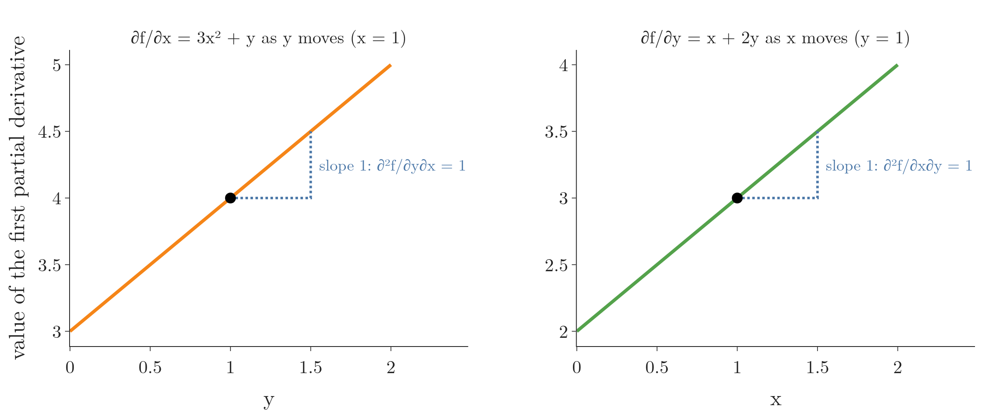
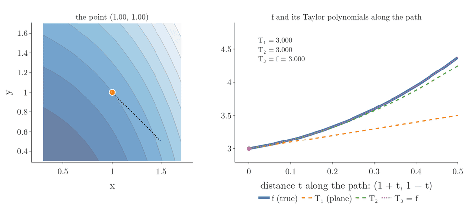
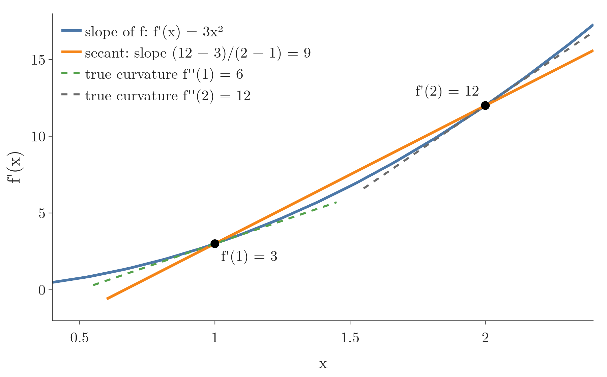
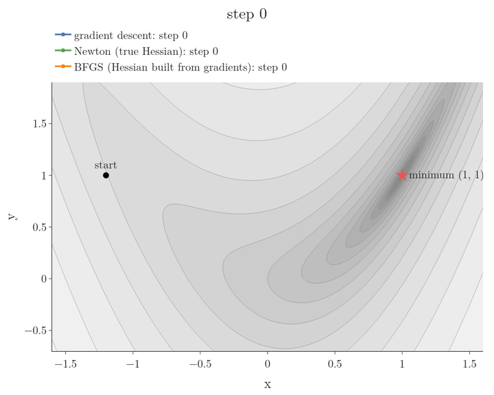

<!-- where-this-fits: generated by course_map/build_map.py; edit concepts.yaml, not this block -->
> **Where this fits:** Pipeline map step 0 (Foundations). See the [Course map](../../../00-course-map/00-course-map.md).
>
> 
>
> - **Builds on:** Eigenvectors and eigenvalues ([Note MA-056](../../../MA/05-linear-algebra/MA-056-eigenvectors-and-eigenvalues/MA-056-eigenvectors-and-eigenvalues.md)); Derivatives of one variable ([Note MA-061](../../../MA/06-calculus/MA-061-derivatives-of-one-variable/MA-061-derivatives-of-one-variable.md)); Partial derivatives and gradients ([Note MA-062](../../../MA/06-calculus/MA-062-partial-derivatives-and-gradients/MA-062-partial-derivatives-and-gradients.md)).
> - **Leads to:** Convex and non-convex loss ([Note DL-017](../../../DL/01-basics/DL-017-backpropagation-why/DL-017-backpropagation-why.md)).
<!-- /where-this-fits -->

## 1. Overview

> **Key point:** The Hessian collects all second partial derivatives and measures how a surface curves; together with the gradient it builds the multivariate Taylor polynomial, which approximates a function near a point by a plane, then a curved bowl, and so on.

This Note follows Chapter 5 (Sections 5.7 and 5.8) of *Mathematics for Machine Learning* (Deisenroth, Faisal and Ong, 2020).


Figure 1 shows the goal. Near a point, a surface is approximated first by a flat **tangent plane** (G-1946; left), which only uses the gradient. Adding a term built from second derivatives, the Hessian, bends the approximation so that it follows the surface over a much wider area (right).

An earlier Note on boosting ([XGBoost maths Note](../../../ML/08-trees-and-ensembles/ML-120-xgboost-maths/ML-120-xgboost-maths.md)) did this with one variable: it called the second derivative of one **observation**'s (G-1374) loss (an observation is one record, a row of the data table) its Hessian $h_i$ and stopped the Taylor series at the second-order term. This Note does the same with many variables, in this order:

1. how one curve bends: the second derivative (Section 2);
2. the flat approximation of a surface: the tangent plane (Section 3);
3. the curved approximation, which needs second partial derivatives (Section 4);
4. the Hessian, the matrix that holds those second partial derivatives and tells the shape of the surface (Section 5);
5. the full Taylor series and its uses in ML (Sections 6 and 7).

The Note uses the gradient of the [partial derivatives and gradients Note](../MA-062-partial-derivatives-and-gradients/MA-062-partial-derivatives-and-gradients.md) and the eigenvalues of the [eigenvectors and eigenvalues Note](../../05-linear-algebra/MA-056-eigenvectors-and-eigenvalues/MA-056-eigenvectors-and-eigenvalues.md).

## 2. The second derivative: how a curve bends

> **Key point:** The second derivative is the rate of change of the slope: positive where a curve bends upward, negative where it bends downward, and larger where the bend is sharper.

The derivative of a curve is its slope. The slope is itself a function, so it has a derivative too: the **second derivative**, written $f''(x)$ or $\dfrac{d^2 f}{dx^2}$. Where a curve bends upward its slope is increasing, so $f'' > 0$. Where it bends downward its slope is decreasing, so $f'' < 0$. A sharper bend means a larger $f''$.

Figure 2 reads the second derivative off two steps. Take two equal steps $dx$ to the right and compare the two rises.

1. The first step raises $f$ by $df_1$, the second by $df_2$.
2. The difference $df_2 - df_1$ is the change in the change. On a straight line it is 0; on a curve that bends upward the second rise is bigger.
3. The second derivative is that difference divided by $dx^2$, in the limit of tiny steps.

For $f(x) = x^3$ from $x = 1$ with $dx = 0.01$, one step per line:

$$f(1) = 1, \qquad f(1.01) = 1.030301, \qquad f(1.02) = 1.061208$$

$$df_1 = 1.030301 - 1 = 0.030301$$

$$df_2 = 1.061208 - 1.030301 = 0.030907$$

$$df_2 - df_1 = 0.000606$$

$$\frac{0.000606}{0.01^2} = \frac{0.000606}{0.0001} = 6.06$$

This is close to the exact second derivative, $f''(x) = 6x$, which is $6$ at $x = 1$.


An everyday reading: if $f$ is the distance a car has covered, $f'$ is its velocity and $f''$ is its acceleration. A positive second derivative is the push back into the seat while the car speeds up; a negative one is braking.

The [derivatives of one variable Note](../MA-061-derivatives-of-one-variable/MA-061-derivatives-of-one-variable.md) (Section 6.1) used $f''$ to make a parabola bend like a curve. The rest of this Note does the same for a surface.

## 3. Linearisation: the tangent plane

> **Key point:** Near a point, a surface is close to the flat plane that touches it there. The plane's height is the value at the point plus the gradient times the step.

The [derivatives of one variable Note](../MA-061-derivatives-of-one-variable/MA-061-derivatives-of-one-variable.md) replaced a curve near a point by its tangent line. With several inputs, the gradient gives a tangent plane (Figure 1, left): the plane spanned by the tangent lines of the two slices in the [partial derivatives and gradients Note](../MA-062-partial-derivatives-and-gradients/MA-062-partial-derivatives-and-gradients.md).

Our running example is

$$f(x, y) = x^3 + xy + y^2$$

We approximate it near the point $(1, 1)$. In bold, the starting point is $\mathbf x_0 = (1, 1)$, the point we want is $\mathbf{x}$, and the step between them is $\mathbf{x} - \mathbf x_0$. For example, to reach $\mathbf{x} = (1.1, 0.9)$ the step is $(0.1, -0.1)$.

1. **Example first,** one step per line. The value at the point:
   $$f(1, 1) = 1 + 1 + 1 = 3$$
   The partial derivatives are $\partial f/\partial x = 3x^2 + y$ and $\partial f/\partial y = x + 2y$, so at $(1, 1)$:
   $$\frac{\partial f}{\partial x} = 3 + 1 = 4, \qquad \frac{\partial f}{\partial y} = 1 + 2 = 3$$
   $$\nabla f(1, 1) = [4,\ 3]$$
   The step $(0.1, -0.1)$ changes the height by one product per input:
   $$x \text{ part:} \quad 4 \times 0.1 = 0.4$$
   $$y \text{ part:} \quad 3 \times (-0.1) = -0.3$$
   $$f(1.1, 0.9) \approx 3 + 0.4 - 0.3 = 3.1$$
   The true value is $3.131$.
2. **In words:** start from the value at $\mathbf x_0$ and add the gradient times the step. The gradient is a row and the step a column, so their product is one number: the sum of the products above.
3. **Formula:**
   $$f(\mathbf{x}) \approx f(\mathbf x_0) + \nabla_{\mathbf{x}} f(\mathbf x_0)\thinspace(\mathbf{x} - \mathbf x_0)$$
   Check with the numbers of step 1:
   $$3 + [4,\ 3] \cdot (0.1,\ -0.1) = 3 + 0.4 - 0.3 = 3.1$$

The step $\mathbf{x} - \mathbf x_0$ is what makes the plane touch the surface: at $\mathbf{x} = \mathbf x_0$ the step is zero, the second term vanishes, and the approximation equals $f(\mathbf x_0)$ exactly. The formula has the same form for 2 inputs or for 100.

The approximation is good close to $\mathbf x_0$ and gets worse further away, because a plane cannot bend. In Figure 1 (left), the orange plane touches the blue surface at the black dot and separates from it in every direction.

Figure 3 measures how far. It colours the size of the error at every point near $(1, 1)$. For the tangent plane (left), the error stays below 0.05 only inside a small oval around the point. The second-order polynomial of Section 4 (right) stays below 0.05 over a band about nine times as large. Its only missing term is $\delta_x^3$ (Section 6.3), so its error depends on $x$ alone, which is why the band has straight sides.


## 4. Bending the plane: the quadratic approximation

> **Key point:** Add three bending terms to the tangent plane (the step in $x$ squared, the two steps multiplied, the step in $y$ squared), and choose their constants so that the surface bends like $f$ at the point.

A plane cannot bend, so the tangent plane leaves the surface quickly. The fix is a surface that can bend: the green surface of Figure 1 (right). It touches $f$ at the point like the plane, and it also curves with $f$, so it stays close over a much wider area. Cut it with any vertical plane and the cut is a parabola.

Write the step as $\delta_x = x - x_0$ and $\delta_y = y - y_0$. The tangent plane uses the step once ($\delta_x$, $\delta_y$). The simplest terms that bend are the ones that use it twice:

$$Q(x, y) = \underbrace{f(\mathbf x_0) + f_x\thinspace\delta_x + f_y\thinspace\delta_y} _{\text{tangent plane}} + a\thinspace\delta_x^2 + b\thinspace\delta_x\delta_y + c\thinspace\delta_y^2$$

Here $f_x$ and $f_y$ are short for the two partial derivatives at the point. Such a $Q$ is a **quadratic approximation** (G-2252). The three new terms are zero at the point, and so are their first partial derivatives, so they do not disturb what the tangent plane already matches: the value and the gradient. The constants $a$, $b$ and $c$ are free. To choose them we need second derivatives of a function of two variables.

### 4.1 Second partial derivatives

> **Key point:** Differentiating a partial derivative again gives a second partial derivative; for smooth functions, the order of the two differentiations does not matter.

A partial derivative is itself a function of all the inputs, so we can differentiate it again. For a function $f(x, y)$ of two variables the notation is:

- $\partial^2 f/\partial x^2$: differentiate with respect to $x$ twice;
- $\partial^2 f/\partial y\thinspace\partial x$, the derivative with respect to $y$ of $\partial f/\partial x$: first with respect to $x$, then with respect to $y$ (read right to left);
- $\partial^n f/\partial x^n$: differentiate $n$ times with respect to $x$.

Each of these is a **second partial derivative** (G-1760). The ones that mix two different variables are **mixed partial derivatives** (G-1236).

1. **In words:** for a function whose second derivatives are continuous, differentiating by $x$ then $y$ gives the same as by $y$ then $x$.
2. **Formula:**
   $$\frac{\partial^2 f}{\partial x\thinspace\partial y} = \frac{\partial^2 f}{\partial y\thinspace\partial x}$$
3. **Example:** $f(x, y) = x^3 + xy + y^2$, our running example. Its first partial derivatives are $\partial f/\partial x = 3x^2 + y$ and $\partial f/\partial y = x + 2y$. Then:
   $$\frac{\partial^2 f}{\partial x^2} = 6x, \qquad \frac{\partial^2 f}{\partial y^2} = 2, \qquad \frac{\partial^2 f}{\partial y\thinspace\partial x} = \frac{\partial}{\partial y}(3x^2 + y) = 1, \qquad \frac{\partial^2 f}{\partial x\thinspace\partial y} = \frac{\partial}{\partial x}(x + 2y) = 1$$
   The two mixed derivatives agree.

Figure 4 shows what "agree" means. On the left, we stand at $x = 1$ and watch the $x$-slope $\partial f/\partial x$ as $y$ moves: it rises 1 for every unit of $y$. On the right, we stand at $y = 1$ and watch the $y$-slope as $x$ moves: it also rises 1 per unit. How the $x$-slope responds to $y$ equals how the $y$-slope responds to $x$.



### 4.2 Fitting the three constants

> **Key point:** Matching the second partial derivatives gives $a = \tfrac12 f_{xx}$, $b = f_{xy}$ and $c = \tfrac12 f_{yy}$.

We want $Q$ to bend like $f$ at the point, so we ask for the same three second partial derivatives. For the running example at $(1, 1)$: $f = 3$, $\nabla f = [4, 3]$, and from Section 4.1 the second partial derivatives are 6, 1 and 2. So

$$Q = 3 + 4\delta_x + 3\delta_y + a\thinspace\delta_x^2 + b\thinspace\delta_x\delta_y + c\thinspace\delta_y^2$$

1. **Twice by $x$.** Only $a\thinspace\delta_x^2$ survives two derivatives by $x$, and it gives $2a$. Matching $\partial^2 f/\partial x^2 = 6$ gives $a = 3$.
2. **By $x$, then by $y$.** Only $b\thinspace\delta_x\delta_y$ survives, and it gives $b$. Matching the mixed partial derivative 1 gives $b = 1$.
3. **Twice by $y$.** Only $c\thinspace\delta_y^2$ survives, and it gives $2c$. Matching $\partial^2 f/\partial y^2 = 2$ gives $c = 1$.

The result is

$$Q = 3 + 4\delta_x + 3\delta_y + 3\delta_x^2 + \delta_x\delta_y + \delta_y^2$$

Check at $(1.1, 0.9)$, a step of $\delta_x = 0.1$, $\delta_y = -0.1$. The plane part gave 3.1. The new terms, one per line:

$$3\delta_x^2 = 3 \times 0.01 = 0.03$$

$$\delta_x\delta_y = 0.1 \times (-0.1) = -0.01$$

$$\delta_y^2 = (-0.1)^2 = 0.01$$

$$0.03 - 0.01 + 0.01 = 0.03$$

$$Q = 3.1 + 0.03 = 3.13$$

against the true 3.131.

In general, with $f_{xx}$, $f_{xy}$ and $f_{yy}$ short for the three second partial derivatives at the point,

$$a = \tfrac12 f_{xx}, \qquad b = f_{xy}, \qquad c = \tfrac12 f_{yy}$$

The halves cancel the 2 that the power rule brings down from the squares, exactly as for the parabola of one variable. The mixed term has no square, so it has no half.

Three numbers control the bend of a function of two inputs. With $n$ inputs there are many more, and they need a tidy home: the Hessian.

## 5. The Hessian

> **Key point:** The Hessian is the square, symmetric matrix of all second partial derivatives; it describes the **curvature** (G-521) of $f$ near a point.

### 5.1 The Hessian matrix

> **Key point:** Entry $(i, j)$ is $\partial^2 f / \partial x_i \partial x_j$; for $n$ inputs the Hessian is $n \times n$.

Figure 5 lays out every second partial derivative of the running example as a tree. Each arrow differentiates once, by $x$ or by $y$. Two arrows in a row give four results, and the two mixed paths in the middle meet in the same value, as Section 4.1 showed. The four results, written in a grid, are the Hessian.


1. **In words:** the **Hessian matrix** (G-888) arranges all second partial derivatives in a grid, row $i$ and column $j$ holding the derivative with respect to $x_i$ and $x_j$.
2. **Formula:** for two variables,
   $$H = \nabla^2 f = \begin{bmatrix} \dfrac{\partial^2 f}{\partial x^2} & \dfrac{\partial^2 f}{\partial x\thinspace\partial y} \cr\dfrac{\partial^2 f}{\partial y\thinspace\partial x} & \dfrac{\partial^2 f}{\partial y^2} \end{bmatrix}$$
   For $f: \mathbb{R}^n \to \mathbb{R}$ it is an $n \times n$ matrix, symmetric because the mixed derivatives are equal.
3. **Example:** for $f(x, y) = x^3 + xy + y^2$,
   $$H = \begin{bmatrix} 6x & 1 \cr1 & 2 \end{bmatrix}, \qquad H(1, 1) = \begin{bmatrix} 6 & 1 \cr1 & 2 \end{bmatrix}$$

The Hessian is a matrix-valued function: put in a point, get a matrix of numbers. It also writes the three bending terms of Section 4.2 as one product. With the step as a column $\boldsymbol{\delta} = [\delta_x, \delta_y]^{\mathsf T}$,

$$\tfrac12\thinspace\boldsymbol{\delta}^{\mathsf T}H\boldsymbol{\delta} = \tfrac12\left(6\delta_x^2 + 2\delta_x\delta_y + 2\delta_y^2\right) = 3\delta_x^2 + \delta_x\delta_y + \delta_y^2$$

the same $a = 3$, $b = 1$, $c = 1$. The mixed entry sits in the matrix twice, which is why $b$ needed no half. Section 6.1 uses this form.

The Hessian is also the Jacobian of the gradient: the gradient is a function with $n$ outputs, and differentiating each of them by each input gives $n \times n$ numbers (see the [Jacobian Note](../MA-063-jacobian-and-matrix-gradients/MA-063-jacobian-and-matrix-gradients.md)). With a single input, the Hessian is just the second derivative, the $h_i$ of the [XGBoost maths Note](../../../ML/08-trees-and-ensembles/ML-120-xgboost-maths/ML-120-xgboost-maths.md).

> **Extra:** For a vector-valued function $\mathbf{f}: \mathbb{R}^n \to \mathbb{R}^m$, each of the $m$ outputs has its own $n \times n$ Hessian. Stacked, they form an $m \times n \times n$ tensor.

### 5.2 Two Hessians we already know

> **Key point:** A bowl made only of squares and products of the inputs bends the same amount everywhere, so its Hessian is the same at every point. Two such bowls are the bowl of the gradient Note and the least-squares loss.

In plain words: the second derivative of $x^2$ is $2$ at every $x$. A parabola bends by the same amount everywhere. Functions built only from squares and products of two inputs (quadratic functions) behave the same way: their Hessian is a fixed matrix of numbers.

- **The bowl** of the [partial derivatives and gradients Note](../MA-062-partial-derivatives-and-gradients/MA-062-partial-derivatives-and-gradients.md),
  $$f(x_1, x_2) = x_1^2 + x_1 x_2 + 2x_2^2, \qquad f(1, 1) = 4$$
  has gradient $[2x_1 + x_2,\ x_1 + 4x_2]$. Differentiating each entry again, one per line:
  $$\frac{\partial}{\partial x_1}(2x_1 + x_2) = 2, \qquad \frac{\partial}{\partial x_2}(2x_1 + x_2) = 1$$
  $$\frac{\partial}{\partial x_1}(x_1 + 4x_2) = 1, \qquad \frac{\partial}{\partial x_2}(x_1 + 4x_2) = 4$$
  No $x_1$ or $x_2$ is left, so the Hessian is the same at every point:
  $$H = \begin{bmatrix} 2 & 1 \cr1 & 4 \end{bmatrix}$$
  Its contour map (Figure 1 of that Note) is a set of identical nested ellipses: the same bend everywhere.
- **The least-squares loss** $\lVert \mathbf{y} - \Phi\boldsymbol{\theta} \rVert^2$ has gradient $2\boldsymbol{\theta}^{\mathsf T}\Phi^{\mathsf T}\Phi - 2\mathbf{y}^{\mathsf T}\Phi$ (the [Jacobian Note](../MA-063-jacobian-and-matrix-gradients/MA-063-jacobian-and-matrix-gradients.md), Section 7). Its Jacobian is
  $$H = 2\Phi^{\mathsf T}\Phi$$
  For the three-point data there, $\Phi$ has rows $[1, 1]$, $[1, 2]$, $[1, 3]$ (a 1 for the intercept, then the input). Each entry of $\Phi^{\mathsf T}\Phi$ multiplies two columns of $\Phi$ entry by entry and adds:
  $$\text{ones with ones:} \quad 1 \times 1 + 1 \times 1 + 1 \times 1 = 3$$
  $$\text{ones with inputs:} \quad 1 \times 1 + 1 \times 2 + 1 \times 3 = 6$$
  $$\text{inputs with inputs:} \quad 1 \times 1 + 2 \times 2 + 3 \times 3 = 14$$
  $$\Phi^{\mathsf T}\Phi = \begin{bmatrix} 3 & 6 \cr6 & 14 \end{bmatrix}, \qquad H = 2\Phi^{\mathsf T}\Phi = \begin{bmatrix} 6 & 12 \cr12 & 28 \end{bmatrix}$$

The matrix $X^{\mathsf T}X$ of the normal equation in the [multiple linear regression maths Note](../../../ML/06-regression/ML-053-multiple-lr-maths/ML-053-multiple-lr-maths.md) is, up to the factor 2, the Hessian of the loss.

### 5.3 Curvature: what the Hessian says about the shape

> **Key point:** The signs of the Hessian's eigenvalues give the shape near a flat point: all positive is a bowl (minimum), all negative a cap (maximum), mixed signs a saddle.

**Why the shape matters.** Training a model means finding the lowest point of a loss. At the lowest point the tangent plane is flat: the gradient is zero. A point with zero gradient is a **stationary point** (G-1879). A flat tangent plane is not enough, though. The top of a hill is flat too, and so is the middle of a horse's saddle. The second derivatives tell the three apart.

**Slices.** Cut the surface with a vertical plane through the point. The cut is a curve of one variable, and its second derivative says whether that slice bends up or down. Take $f = x^2 - y^2$ at the origin, where the gradient $[2x, -2y]$ is zero.

- The slice along $x$ (keep $y = 0$) is $x^2$: it bends up, so from this side the point looks like a minimum.
- The slice along $y$ (keep $x = 0$) is $-y^2$: it bends down, so from this side the point looks like a maximum.

The two directions disagree. Such a point is a **saddle point** (G-1718): neither a minimum nor a maximum. A curve of one variable cannot do this, because it has only one direction. Figure 6 turns the slicing plane through every direction. Walk a distance $s$ from the origin in the direction at angle $\theta$ to the $x$-axis; the point reached is $x = s\cos\theta$, $y = s\sin\theta$. Along this slice, one step per line:

$$f = x^2 - y^2 = s^2\cos^2\theta - s^2\sin^2\theta$$

$$= s^2\thinspace(\cos^2\theta - \sin^2\theta)$$

$$= \cos(2\theta)\thinspace s^2$$

The last line uses the identity $\cos^2\theta - \sin^2\theta = \cos 2\theta$. The second derivative of the slice with respect to $s$ is therefore $2\cos 2\theta$:

$$\theta = 0 \text{ (along } x\text{)}: \quad 2\cos 0 = 2$$

$$\theta = 45^\circ \text{ (diagonal)}: \quad 2\cos 90^\circ = 0$$

$$\theta = 90^\circ \text{ (along } y\text{)}: \quad 2\cos 180^\circ = -2$$

{height=42%}

**The two axis slices are not enough.** Take $f = x^2 + y^2 + p\thinspace xy$ with a number $p$ we can turn up. Its second partial derivatives along the axes are $f_{xx} = 2$ and $f_{yy} = 2$ for every $p$: both axis slices always bend up. Yet Figure 7 shows the bowl turning into a saddle as $p$ grows.

1. Walk a distance $s$ along the diagonal direction $(1, -1)/\sqrt2$, so $x = s/\sqrt2$ and $y = -s/\sqrt2$. One term per line:
   $$x^2 + y^2 = \tfrac{s^2}{2} + \tfrac{s^2}{2} = s^2$$
   $$p\thinspace xy = p \times \tfrac{s}{\sqrt2} \times \left(-\tfrac{s}{\sqrt2}\right) = -\tfrac{p}{2}\thinspace s^2$$
   $$f = \left(1 - \tfrac{p}{2}\right)s^2$$
   Its second derivative with respect to $s$ is $2\left(1 - \tfrac{p}{2}\right) = 2 - p$.
2. For $p < 2$ it still bends up: a bowl.
3. At $p = 2$ it is flat.
4. For $p > 2$ it bends down while the axis slices bend up: a saddle.

The term that does this is the mixed one: $f_{xy} = p$. The mixed partial derivative measures how much the two diagonal directions disagree. The purest case is $f = xy$: flat along both axes ($f_{xx} = f_{yy} = 0$), bending up along one diagonal and down along the other.

{height=42%}

**The second partial derivative test** (G-2253). One number weighs the axis slices against the mixed term.

1. **In words:** multiply the two axis bends and subtract the square of the mixed partial derivative.
2. **Formula:** at a stationary point, compute
   $$D = f_{xx}\thinspace f_{yy} - f_{xy}^2$$
   - $D > 0$ and $f_{xx} > 0$: a minimum;
   - $D > 0$ and $f_{xx} < 0$: a maximum;
   - $D < 0$: a saddle point;
   - $D = 0$: the test gives no answer.
3. **Example:** for $f = x^2 + y^2 + p\thinspace xy$ at the origin, $f_{xx} = 2$, $f_{yy} = 2$ and $f_{xy} = p$:
   $$D = 2 \times 2 - p^2 = 4 - p^2$$
   $$p = 0: \quad D = 4 - 0 = 4 > 0, \quad f_{xx} = 2 > 0: \text{ a minimum}$$
   $$p = 4: \quad D = 4 - 16 = -12 < 0: \text{ a saddle}$$
   $$p = 2: \quad D = 4 - 4 = 0: \text{ the switch, as in Figure 7}$$

The running example $f = x^3 + xy + y^2$ has two stationary points. We find them by setting both partial derivatives to zero and solving, one line at a time.

$$\frac{\partial f}{\partial x} = 3x^2 + y = 0 \qquad \text{(equation 1)}$$

$$\frac{\partial f}{\partial y} = x + 2y = 0 \qquad \text{(equation 2)}$$

Equation 2 gives $x$ in terms of $y$:

$$x = -2y$$

Put this into equation 1:

$$3(-2y)^2 + y = 0$$

$$12y^2 + y = 0$$

$$y\thinspace(12y + 1) = 0$$

A product is zero when one of its factors is zero, so

$$y = 0 \quad \text{or} \quad y = -\tfrac{1}{12}$$

and from $x = -2y$:

$$y = 0: \quad x = 0$$

$$y = -\tfrac{1}{12}: \quad x = -2 \times \left(-\tfrac{1}{12}\right) = \tfrac16$$

The two stationary points are $(0, 0)$ and $(\tfrac16, -\tfrac1{12})$. Now the test at each. The Hessian is $H = \begin{bmatrix} 6x & 1 \cr1 & 2 \end{bmatrix}$ (Section 5.1).

At $(0, 0)$:

$$f_{xx} = 6 \times 0 = 0, \qquad f_{yy} = 2, \qquad f_{xy} = 1$$

$$D = 0 \times 2 - 1^2 = -1 < 0$$

a saddle point.

At $(\tfrac16, -\tfrac1{12})$:

$$f_{xx} = 6 \times \tfrac16 = 1, \qquad f_{yy} = 2, \qquad f_{xy} = 1$$

$$D = 1 \times 2 - 1^2 = 1 > 0, \qquad f_{xx} = 1 > 0$$

a minimum.

**The same test with eigenvalues.** $D$ is the determinant of the Hessian. For a $2 \times 2$ matrix the determinant is the product of the two eigenvalues, so $D > 0$ says the two eigenvalues have the same sign and $D < 0$ says their signs differ. The eigenvalue form works for any number of inputs, where a single number $D$ is no longer enough. The Hessian's eigenvectors are the slice directions of strongest and weakest bending, and its eigenvalues are the second derivatives of those two slices (see the [eigenvectors and eigenvalues Note](../../05-linear-algebra/MA-056-eigenvectors-and-eigenvalues/MA-056-eigenvectors-and-eigenvalues.md)). For $x^2 + y^2 + p\thinspace xy$ the Hessian has rows $[2, p]$ and $[p, 2]$; its eigenvectors are the two diagonals and its eigenvalues are $2 + p$ and $2 - p$, the red slice of Figure 7. Figure 8 shows the three basic shapes.


- **Bowl:** all eigenvalues positive. The surface curves up in every direction; a point with zero gradient is a minimum.
- **Saddle** (a saddle point when the gradient is zero): positive and negative eigenvalues. The surface curves up in some directions and down in others; a point with zero gradient is neither a minimum nor a maximum.
- **Cap:** all eigenvalues negative. The surface curves down everywhere; a point with zero gradient is a maximum.

For the bowl of the gradient Note, $H$ has rows $[2, 1]$ and $[1, 4]$ (Section 5.2). Its eigenvalues $\lambda$ are the numbers that make $\det(H - \lambda I) = 0$ (see the [eigenvectors and eigenvalues Note](../../05-linear-algebra/MA-056-eigenvectors-and-eigenvalues/MA-056-eigenvectors-and-eigenvalues.md)), one step per line:

$$(2 - \lambda)(4 - \lambda) - 1 \times 1 = 0$$

$$\lambda^2 - 6\lambda + 8 - 1 = 0$$

$$\lambda^2 - 6\lambda + 7 = 0$$

$$\lambda = \frac{6 \pm \sqrt{36 - 28}}{2} = \frac{6 \pm \sqrt{8}}{2} = 3 \pm \sqrt{2}$$

$$\lambda_1 = 3 + 1.41 = 4.41, \qquad \lambda_2 = 3 - 1.41 = 1.59$$

Both are positive, so the function is a bowl, as its contour map showed. The ratio

$$\frac{4.41}{1.59} = 2.8$$

says the bowl curves almost three times as steeply in one direction as in the other: its contour ellipses are stretched. The narrow valleys that slow down gradient descent in the [gradient descent Note](../../../ML/06-regression/ML-056-gradient-descent/ML-056-gradient-descent.md) (Section 9) are Hessians with a large eigenvalue ratio.

> **Extra:** A function whose Hessian has no negative eigenvalues at any point is convex (Boyd and Vandenberghe §3.1.4): a single bowl with no local minima to get stuck in, the property the [gradient descent Note](../../../ML/06-regression/ML-056-gradient-descent/ML-056-gradient-descent.md) (Section 8) asked of a loss. The least-squares Hessian $2\Phi^{\mathsf T}\Phi$ never has negative eigenvalues, because $\boldsymbol{\delta}^{\mathsf T}\Phi^{\mathsf T}\Phi\boldsymbol{\delta} = \lVert \Phi\boldsymbol{\delta} \rVert^2 \geq 0$ for every $\boldsymbol{\delta}$. This Hessian is why linear regression's loss is convex.

## 6. The multivariate Taylor series

> **Key point:** Keep adding terms: each new term uses the next higher derivatives at the point and one more copy of the step. The second-order term is half of (step times Hessian times step).

### 6.1 The terms up to second order

> **Key point:** Value, plus gradient times step, plus half the step times Hessian times step.

The tangent plane is the start of a series, exactly as in one variable, and the quadratic approximation of Section 4 is its next step. Section 4.2 found the bending terms one constant at a time; with the Hessian they are one line.

The step is a column $\boldsymbol{\delta} = \mathbf{x} - \mathbf x_0$; in our example $\boldsymbol{\delta} = [0.1, -0.1]^{\mathsf T}$, from $(1, 1)$ to $(1.1, 0.9)$. Its transpose $\boldsymbol{\delta}^{\mathsf T}$ is the same two numbers as a row, $[0.1, -0.1]$. The number of inputs is $n$, as everywhere in these Notes; here $n = 2$. The shapes column says how many rows and columns each factor has.

| Order $k$ | Term | Shapes | One-variable version |
|---|---|---|---|
| 0 | $f(\mathbf x_0)$ | number | $f(x_0)$ |
| 1 | $\nabla f(\mathbf x_0)\thinspace\boldsymbol{\delta}$ | $(1 \times n)(n \times 1)$ | $f'(x_0)\thinspace\delta$ |
| 2 | $\frac{1}{2}\boldsymbol{\delta}^{\mathsf T}H(\mathbf x_0)\thinspace\boldsymbol{\delta}$ | $(1 \times n)(n \times n)(n \times 1)$ | $\frac{1}{2}f''(x_0)\thinspace\delta^2$ |

1. **In words:** the second-order term weighs every pair of step components by the matching Hessian entry, adds them up and halves the sum. With two inputs there are four pairs, one per Hessian entry:

   | Hessian entry | Pair of step components | Product |
   |---|---|---|
   | row 1, column 1: $6$ | $\delta_1\delta_1 = 0.1 \times 0.1 = 0.01$ | $6 \times 0.01 = 0.06$ |
   | row 1, column 2: $1$ | $\delta_1\delta_2 = 0.1 \times (-0.1) = -0.01$ | $1 \times (-0.01) = -0.01$ |
   | row 2, column 1: $1$ | $\delta_2\delta_1 = -0.01$ | $1 \times (-0.01) = -0.01$ |
   | row 2, column 2: $2$ | $\delta_2\delta_2 = (-0.1)^2 = 0.01$ | $2 \times 0.01 = 0.02$ |

   The four products add to
   $$0.06 - 0.01 - 0.01 + 0.02 = 0.06$$
   The double sum $\sum_{i}\sum_{j}$ below means "add over every row $i$ and every column $j$", that is, over the four rows of this table.
2. **Formula:** the second-order **multivariate Taylor polynomial** (G-1284) is
   $$T_2(\mathbf{x}) = f(\mathbf x_0) + \nabla f(\mathbf x_0)\thinspace\boldsymbol{\delta} + \frac{1}{2}\thinspace\boldsymbol{\delta}^{\mathsf T}H(\mathbf x_0)\thinspace\boldsymbol{\delta}, \qquad \boldsymbol{\delta}^{\mathsf T}H\boldsymbol{\delta} = \sum_{i}\sum_{j} H_{ij}\thinspace\delta_i\thinspace\delta_j$$
3. **Example:** at $(1, 1)$ with $\boldsymbol{\delta} = (0.1, -0.1)$ and $H$ with rows $[6, 1]$ and $[1, 2]$, the table above gives
   $$\boldsymbol{\delta}^{\mathsf T}H\boldsymbol{\delta} = 0.06 - 0.01 - 0.01 + 0.02 = 0.06$$
   $$\tfrac{1}{2} \times 0.06 = 0.03$$
   $$T_2 = 3.1 + 0.03 = 3.13$$
   against the true 3.131.

Figure 1 (right) shows $T_2$: a curved surface that follows $f$ far beyond the region where the tangent plane was good.

> **Python:** The three terms in NumPy.
>
> ```python
> import numpy as np
>
> f0 = 3.0
> g = np.array([4.0, 3.0])                 # gradient at (1, 1)
> H = np.array([[6.0, 1.0], [1.0, 2.0]])   # Hessian at (1, 1)
> d = np.array([0.1, -0.1])                # step to (1.1, 0.9)
>
> f0 + g @ d                    # 3.1   (first order)
> f0 + g @ d + 0.5 * d @ H @ d  # 3.13  (second order)
> ```

### 6.2 Higher orders: tensors and outer products

> **Key point:** The $k$-th term multiplies every $k$-th derivative by the matching product of $k$ step components, adds them all, and divides by $k!$. For $k = 2$ this is the Hessian table of Section 6.1.

The pattern continues. Section 6.1 needed one Hessian entry for every pair of inputs, such as (row 1, column 2). The third-order term needs one third derivative for every triple of inputs, such as (1, 1, 2): differentiate by $x$, by $x$, then by $y$. In general, the $k$-th order term needs one $k$-th derivative for every list of $k$ input numbers $(i_1, i_2, \dots, i_k)$, each between 1 and $n$.

**An instance, $k = 3$, for our running example** $f = x^3 + xy + y^2$ at $(1, 1)$ with $\boldsymbol{\delta} = (0.1, -0.1)$. With $n = 2$ inputs there are $2 \times 2 \times 2 = 8$ triples. Every third derivative is zero except one:

$$\frac{\partial^3 f}{\partial x^3} = \frac{d}{dx}\frac{d}{dx}(3x^2 + y) = \frac{d}{dx}\thinspace6x = 6$$

Its triple is $(1, 1, 1)$, and the matching product of step components is

$$\delta_1\delta_1\delta_1 = 0.1^3 = 0.001$$

So the sum over all eight triples has one non-zero term, and the third-order term is

$$\frac{6 \times 0.001}{3!} = \frac{0.006}{6} = 0.001$$

**The general form.** The $k$-th derivatives at $\mathbf x_0$, all together, are written $D^k f(\mathbf x_0)$ (the letter D here stands for "derivative"; it is not the test number $D$ of Section 5.3): an array with one entry per list of $k$ indices, $n \times n \times \cdots \times n$ ($k$ times). An array with more than two indices is a tensor. The array is combined with $k$ copies of $\boldsymbol{\delta}$.

1. **In words:** multiply each $k$-th derivative entry by the matching product of step components, add them all, and divide by $k!$.
2. **Formula:** the **multivariate Taylor series** (G-1285) is
   $$f(\mathbf{x}) = \sum_{k=0}^{\infty} \frac{D^k f(\mathbf x_0)\thinspace\boldsymbol{\delta}^k}{k!}, \qquad D^k f(\mathbf x_0)\thinspace\boldsymbol{\delta}^k = \sum_{i_1=1}^{n}\cdots\sum_{i_k=1}^{n} D^k f(\mathbf x_0)[i_1, \dots, i_k]\thickspace\delta_{i_1}\cdots\delta_{i_k}$$
   Check with $k = 3$ above: the only non-zero entry is $[1, 1, 1] = 6$, which gives $6 \times 0.001 / 6 = 0.001$.
   Stopping after the $k = n$ term gives the Taylor polynomial $T_n$.
3. **Example:** for $k = 2$, $\boldsymbol{\delta}^2$ means the **outer product** (G-1418) $\boldsymbol{\delta}\boldsymbol{\delta}^{\mathsf T}$, the matrix with entries $\delta_i\delta_j$. With $\boldsymbol{\delta} = (0.1, -0.1)$:
   $$\boldsymbol{\delta}\boldsymbol{\delta}^{\mathsf T} = \begin{bmatrix} 0.01 & -0.01 \cr-0.01 & 0.01 \end{bmatrix}$$
   Multiplying entry by entry with $H$, one product per line:
   $$6 \times 0.01 = 0.06$$
   $$1 \times (-0.01) = -0.01$$
   $$1 \times (-0.01) = -0.01$$
   $$2 \times 0.01 = 0.02$$
   $$0.06 - 0.01 - 0.01 + 0.02 = 0.06$$
   the same $\boldsymbol{\delta}^{\mathsf T}H\boldsymbol{\delta}$ as before.

Each extra copy of $\boldsymbol{\delta}$ adds one index: $\boldsymbol{\delta}\boldsymbol{\delta}^{\mathsf T}$ is a matrix (2 indices), and three copies give a 3-index tensor. The symbol $\otimes$ (outer product) writes it as $\boldsymbol{\delta} \otimes \boldsymbol{\delta} \otimes \boldsymbol{\delta}$; its entries are all products $\delta_i\delta_j\delta_k$. For our step, the $(1, 1, 1)$ entry is $0.1^3 = 0.001$, the number used in the $k = 3$ instance above, and the $(1, 1, 2)$ entry is $0.1 \times 0.1 \times (-0.1) = -0.001$ (see the [tensors Note](../../../ML/01-foundations/ML-010-tensors/ML-010-tensors.md)).

### 6.3 A complete example: the expansion is exact for a polynomial

> **Key point:** A polynomial of degree 3 needs exactly the terms up to third order; then the Taylor polynomial is the function itself.

As in one variable (the [derivatives of one variable Note](../MA-061-derivatives-of-one-variable/MA-061-derivatives-of-one-variable.md), Section 6.4), the Taylor series of a polynomial stops. For $f(x, y) = x^3 + xy + y^2$ at $(1, 1)$, write $\delta_x = x - 1$ and $\delta_y = y - 1$.

- **Order 0:** $f(1, 1) = 3$.
- **Order 1:** $\nabla f(1, 1) = [4, 3]$ gives $4\delta_x + 3\delta_y$.
- **Order 2:** $\tfrac{1}{2}\boldsymbol{\delta}^{\mathsf T}H\boldsymbol{\delta} = \tfrac{1}{2}(6\delta_x^2 + 2\delta_x\delta_y + 2\delta_y^2) = 3\delta_x^2 + \delta_x\delta_y + \delta_y^2$.
- **Order 3:** of all third partial derivatives only $\partial^3 f/\partial x^3 = 6$ is not zero, so the term is $6\delta_x^3/3! = \delta_x^3$.
- **Order 4 and up:** all derivatives are zero.

1. **In words:** add the four orders.
2. **Formula:**
   $$f(x, y) = 3 + 4\delta_x + 3\delta_y + 3\delta_x^2 + \delta_x\delta_y + \delta_y^2 + \delta_x^3$$
3. **Example:** at $(1.1, 0.9)$, so $\delta_x = 0.1$ and $\delta_y = -0.1$, the running totals are:
   $$T_1 = 3 + 0.4 - 0.3 = 3.1$$
   $$T_2 = 3.1 + 0.03 = 3.13$$
   $$T_3 = 3.13 + 0.1^3 = 3.13 + 0.001 = 3.131$$
   The function itself, one term per line:
   $$x^3 = 1.1^3 = 1.331$$
   $$xy = 1.1 \times 0.9 = 0.99$$
   $$y^2 = 0.9^2 = 0.81$$
   $$f(1.1, 0.9) = 1.331 + 0.99 + 0.81 = 3.131$$
   Exactly $T_3$. Further away, at $(1.5, 0.5)$, so $\delta_x = 0.5$ and $\delta_y = -0.5$:
   $$T_1 = 3 + 4 \times 0.5 + 3 \times (-0.5) = 3.5$$
   $$T_2 = 3.5 + 3 \times 0.25 + 0.5 \times (-0.5) + 0.25 = 3.5 + 0.75 = 4.25$$
   $$T_3 = 4.25 + 0.5^3 = 4.25 + 0.125 = 4.375$$
   $$f(1.5, 0.5) = 3.375 + 0.75 + 0.25 = 4.375$$
   The low orders are worse there, but the full expansion is still exact.

Multiplying out the brackets gives back $x^3 + xy + y^2$; we checked this symbolically.

Figure 9 walks along the straight path from $(1, 1)$ to $(1.5, 0.5)$ and reads all three polynomials on the way. Near the start they agree with $f$. Further out the tangent plane $T_1$ falls behind first, then $T_2$; $T_3$ stays on $f$ the whole way.



## 7. Where ML uses second-order approximations

> **Key point:** Minimising the second-order Taylor polynomial instead of the function itself is **Newton's method** (G-1321); XGBoost does this for every tree, and other methods use it to approximate distributions.

The second-order polynomial is a bowl (when $H$ has positive eigenvalues), and the bottom of a bowl has a formula. The formula makes $T_2$ a useful stand-in for a function that is hard to minimise directly.

> **Extra:** **Newton's method in several variables.** Setting the gradient of $T_2$ with respect to $\boldsymbol{\delta}$ to zero gives $\nabla f^{\mathsf T} + H\boldsymbol{\delta} = \mathbf{0}$, so the step to the bottom of the local bowl is
>
> $$\boldsymbol{\delta} = -H^{-1}\thinspace\nabla f^{\mathsf T}$$
>
> For the bowl of the gradient Note at $(1, 1)$, $\nabla f = [3, 5]$ and $H$ has rows $[2, 1]$ and $[1, 4]$. Solve $H\boldsymbol{\delta} = -[3, 5]^{\mathsf T}$ for $\boldsymbol{\delta} = (a, b)$, one line at a time:
>
> $$2a + b = -3 \qquad \text{(row 1)}$$
>
> $$a + 4b = -5 \qquad \text{(row 2)}$$
>
> $$a = -5 - 4b \qquad \text{(from row 2)}$$
>
> $$2(-5 - 4b) + b = -3 \quad\Rightarrow\quad -10 - 7b = -3 \quad\Rightarrow\quad b = -1$$
>
> $$a = -5 - 4 \times (-1) = -1$$
>
> So $\boldsymbol{\delta} = (-1, -1)$, landing exactly on the minimum $(0, 0)$ in one step: for a quadratic function $T_2$ is the function itself. Gradient descent, which only uses the tangent plane, needs many small steps for the same trip. With one variable this is the **Newton step** of the [gradient boosting classification Note](../../../ML/08-trees-and-ensembles/ML-116-gradient-boosting-classification/ML-116-gradient-boosting-classification.md), and XGBoost's leaf formula $-G/(H + \lambda)$ in the [XGBoost maths Note](../../../ML/08-trees-and-ensembles/ML-120-xgboost-maths/ML-120-xgboost-maths.md) is a Newton step per leaf (Chen and Guestrin §2.2). The catch: with millions of parameters the Hessian has millions squared entries, which is why deep learning mostly stays with first-order methods (Goodfellow et al. §8.6.1).

> **Extra:** **Quasi-Newton methods** (G-1603): **BFGS** (G-283) and **L-BFGS** (G-1023). These skip the Hessian and build a stand-in matrix $B$ from gradients alone. After each step $\mathbf{s} = \mathbf x_{k+1} - \mathbf x_k$, the gradient change $\mathbf{y} = \nabla f_{k+1} - \nabla f_k$ is measured, and $B$ is updated so that
>
> $$B_{k+1}\thinspace\mathbf{s} = \mathbf{y}$$
>
> The condition is the **secant equation** (G-1757): the new $B$ must reproduce the gradient change just seen. With one variable it says $B = (f'(x_{k+1}) - f'(x_k))/(x_{k+1} - x_k)$, the slope between two gradient readings. For $f = x^3$ stepping from $x = 1$ to $x = 2$: $f'$ goes from 3 to 12, so $B = (12 - 3)/(2 - 1) = 9$, between the true curvatures $f''(1) = 6$ and $f''(2) = 12$. The step is then $\boldsymbol{\delta} = -B^{-1}\nabla f^{\mathsf T}$, as in Newton's method, usually shortened by a line search. **BFGS** (Broyden, Fletcher, Goldfarb, Shanno) is the most used update rule; it keeps $B$ symmetric and positive definite, so every step goes downhill. **L-BFGS** ("limited memory") stores only the last few $(\mathbf{s}, \mathbf{y})$ pairs instead of the full $n \times n$ matrix, which makes it usable with many parameters. L-BFGS is the default solver of `LogisticRegression` in the [logistic regression hyperparameters Note](../../../ML/07-classification/ML-080-logistic-hyperparameters/ML-080-logistic-hyperparameters.md). (Nocedal and Wright, ch. 6 for BFGS, §7.2 for L-BFGS.)



Figure 10 shows the one-variable case: BFGS never computes the curvature (dashed), it reads the slope twice and takes the line through the two readings (orange).



Figure 11 races the three methods on the curved valley $f = (1 - x)^2 + 5(y - x^2)^2$, all with the same rule for the step length. Newton, with the true Hessian, needs 10 steps. BFGS, which only ever sees gradients, needs 17: its first steps wander while $B$ is still a guess, then it settles into the valley like Newton. The figure script checks this: for the first 7 steps $B$ is still 90% or more away from the true Hessian, and from step 7 on it is within about 30%. Gradient descent zig-zags across the narrow valley and needs 717 steps.

> **Extra:** Second-order Taylor expansions also approximate probability distributions. The **Laplace approximation** (G-1043) replaces a distribution near its peak by a normal distribution whose spread comes from the Hessian of its log there (Bishop §4.4). The **extended Kalman filter**, used to track moving objects, linearises a nonlinear system at every time step with the first-order expansion (Thrun et al. §3.3).

## 8. Summary

| Object | Formula | Example: $f = x^3 + xy + y^2$ at $(1, 1)$ |
|---|---|---|
| Mixed partial derivatives | $\partial^2 f/\partial x\partial y = \partial^2 f/\partial y\partial x$ | both equal 1 |
| Quadratic approximation | tangent plane $+\ \tfrac12 f_{xx}\delta_x^2 + f_{xy}\delta_x\delta_y + \tfrac12 f_{yy}\delta_y^2$ | 3.13 at $(1.1, 0.9)$ |
| Hessian | $H_{ij} = \partial^2 f/\partial x_i\partial x_j$, symmetric $n \times n$ | rows $[6, 1]$, $[1, 2]$ |
| Second partial derivative test | $D = f_{xx}f_{yy} - f_{xy}^2$ at a stationary point | $(0, 0)$: $D = -1$, saddle; $(\tfrac16, -\tfrac1{12})$: $D = 1$, minimum |
| Tangent plane (first order) | $f(\mathbf x_0) + \nabla f\thinspace\boldsymbol{\delta}$ | 3.1 at $(1.1, 0.9)$ |
| Second-order Taylor | $+\ \tfrac{1}{2}\boldsymbol{\delta}^{\mathsf T}H\boldsymbol{\delta}$ | 3.13 |
| Third-order Taylor | $+\ \tfrac{1}{3!}D^3 f\thinspace\boldsymbol{\delta}^3$ | 3.131 (exact) |
| Newton step | $\boldsymbol{\delta} = -H^{-1}\nabla f^{\mathsf T}$ | bowl: $(1, 1) \to (0, 0)$ |
| Secant equation (BFGS) | $B_{k+1}\mathbf{s} = \mathbf{y}$ | $x^3$, $1 \to 2$: $B = 9$ |

- Second partial derivatives can be taken in either order; the Hessian is therefore symmetric.
- The Hessian measures curvature; the signs of its eigenvalues separate bowls, saddles and caps. For two inputs the second partial derivative test reads the same from $f_{xx}f_{yy} - f_{xy}^2$.
- The mixed partial derivative can turn a bowl into a saddle even when both axis slices bend up.
- Linearisation replaces a surface by its tangent plane, good only near the point.
- The multivariate Taylor series adds terms with $k$ copies of the step and the $k$-th derivative tensor; the second-order term is $\tfrac{1}{2}\boldsymbol{\delta}^{\mathsf T}H\boldsymbol{\delta}$.
- A polynomial of degree $k$ is reproduced exactly by its Taylor polynomial of degree $k$.

## 9. Sources

**Built from**

- Deisenroth, M. P., Faisal, A. A. and Ong, C. S. (2020). *Mathematics for Machine Learning*. Cambridge University Press. Chapter 5.
- 3Blue1Brown, "Higher order derivatives | Chapter 10, Essence of calculus", YouTube, https://www.youtube.com/watch?v=BLkz5LGWihw (Figure 2)
- Khan Academy, "What is a tangent plane", YouTube, https://www.youtube.com/watch?v=cHNT7_F8m1Y
- Khan Academy, "Local linearization", YouTube, https://www.youtube.com/watch?v=o7_zS7Bx2VA
- Khan Academy, "What do quadratic approximations look like", YouTube, https://www.youtube.com/watch?v=80bJA_tSbo4
- Khan Academy, "Quadratic approximation formula, part 1", YouTube, https://www.youtube.com/watch?v=UV5yj5A3QIM
- Khan Academy, "Quadratic approximation formula, part 2", YouTube, https://www.youtube.com/watch?v=szHMvVXxp-g
- Khan Academy, "Symmetry of second partial derivatives", YouTube, https://www.youtube.com/watch?v=J08-L2buigM (Figure 5)
- Khan Academy, "The Hessian matrix", YouTube, https://www.youtube.com/watch?v=LbBcuZukCAw (Figure 5)
- Khan Academy, "Vector form of multivariable quadratic approximation", YouTube, https://www.youtube.com/watch?v=ClFrIg0PpnM
- Khan Academy, "Multivariable maxima and minima", YouTube, https://www.youtube.com/watch?v=ux7EQ3ip2DU
- Khan Academy, "Saddle points", YouTube, https://www.youtube.com/watch?v=8aAU4r_pUUU (Figure 6)
- Khan Academy, "Second partial derivative test", YouTube, https://www.youtube.com/watch?v=m1FhUjMMv30 (Figure 7)
- Khan Academy, "Second partial derivative test intuition", YouTube, https://www.youtube.com/watch?v=sJo7D74PAak

**Other references**

- Bishop, C. M. (2006). *Pattern Recognition and Machine Learning*. Springer. Section 4.4, the Laplace approximation.
- Boyd, S. and Vandenberghe, L. (2004). *Convex Optimization*. Cambridge University Press. Section 3.1.4, second-order conditions.
- Chen, T. and Guestrin, C. (2016). "XGBoost: A Scalable Tree Boosting System". *KDD*. Section 2.2.
- Goodfellow, I., Bengio, Y. and Courville, A. (2016). *Deep Learning*. MIT Press. Section 8.6.1, Newton's method.
- Nocedal, J. and Wright, S. J. (2006). *Numerical Optimization*, 2nd ed. Springer. Chapter 6 and section 7.2.
- Thrun, S., Burgard, W. and Fox, D. (2005). *Probabilistic Robotics*. MIT Press. Section 3.3, the extended Kalman filter.

## 10. Key terms

| Term | Meaning |
|---|---|
| Second derivative | The derivative of the derivative: the rate at which the slope changes; positive where a curve bends upward |
| Quadratic approximation (G-2252) | The tangent plane plus the terms $\tfrac12 f_{xx}\delta_x^2 + f_{xy}\delta_x\delta_y + \tfrac12 f_{yy}\delta_y^2$; the second-order Taylor polynomial |
| Second partial derivative | A partial derivative of a partial derivative, such as $\partial^2 f/\partial x^2$ |
| Mixed partial derivative | A second partial derivative with respect to two different variables, such as $\partial^2 f/\partial y\thinspace\partial x$ |
| Hessian matrix | The symmetric $n \times n$ matrix of all second partial derivatives of $f: \mathbb{R}^n \to \mathbb{R}$; it measures curvature |
| Curvature | How fast the slope of a surface changes; given in each direction by the Hessian |
| Saddle point | A flat point where the surface curves up in some directions and down in others (Hessian eigenvalues of both signs) |
| Stationary point | A point where every partial derivative is zero: a minimum, a maximum or a saddle point |
| Second partial derivative test (G-2253) | At a stationary point of a function of two inputs, $D = f_{xx}f_{yy} - f_{xy}^2$: $D > 0$ a minimum or maximum (by the sign of $f_{xx}$), $D < 0$ a saddle point, $D = 0$ no answer |
| Tangent plane | The flat plane that touches a surface at a point with the same gradient; the first-order Taylor approximation |
| Multivariate Taylor series | $\sum_k D^k f(\mathbf x_0)\thinspace\boldsymbol{\delta}^k / k!$: approximation of $f$ near $\mathbf x_0$ from its derivatives there |
| Multivariate Taylor polynomial | The multivariate Taylor series cut after the $k = n$ term |
| Outer product | $\boldsymbol{\delta}\boldsymbol{\delta}^{\mathsf T}$, the matrix of all products $\delta_i\delta_j$; more copies give tensors |
| Newton's method | Repeatedly jumping to the minimum of the second-order Taylor polynomial: $\boldsymbol{\delta} = -H^{-1}\nabla f^{\mathsf T}$ |
| Quasi-Newton method | Newton's method with the Hessian replaced by a matrix built from gradient changes |
| Secant equation | $B_{k+1}\mathbf{s} = \mathbf{y}$: the Hessian stand-in must reproduce the last gradient change |
| BFGS | The most used quasi-Newton update; keeps the Hessian stand-in symmetric and positive definite |
| L-BFGS | Limited-memory BFGS: keeps only the last few step and gradient-change pairs; scikit-learn's default logistic regression solver |
| Laplace approximation | Approximating a distribution near its peak by a normal distribution built from the Hessian |
