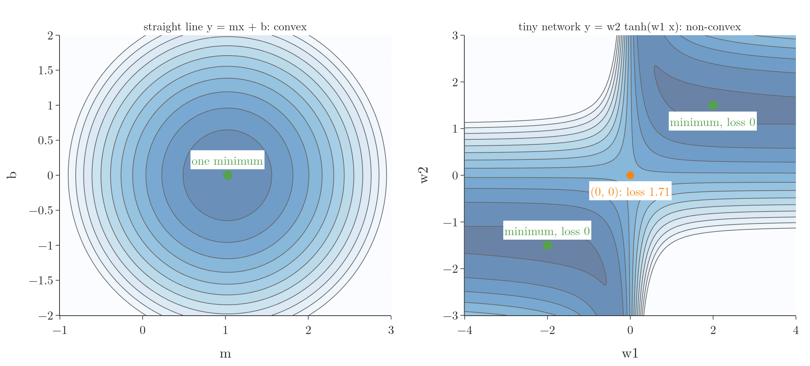
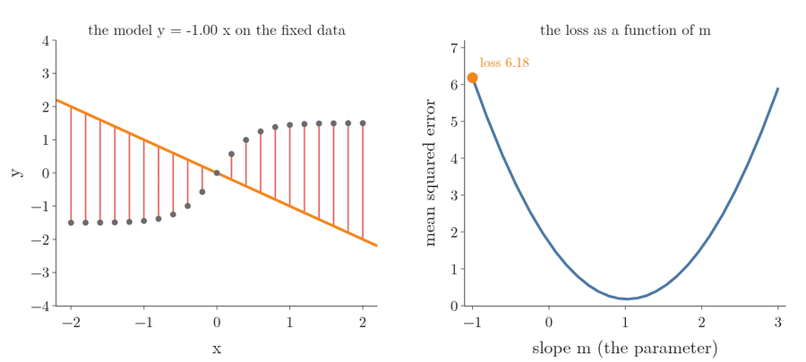
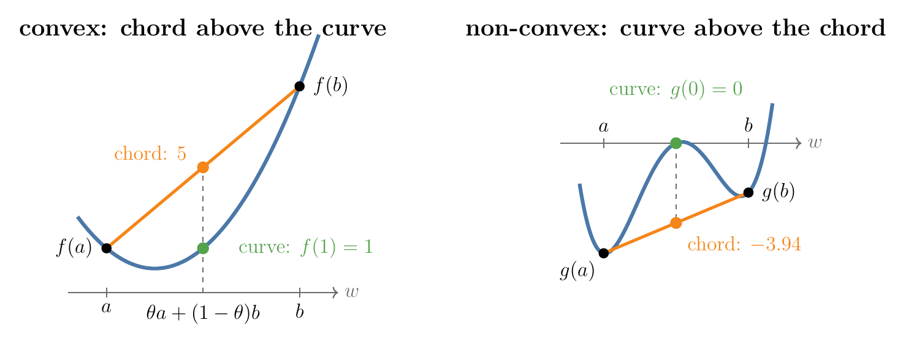
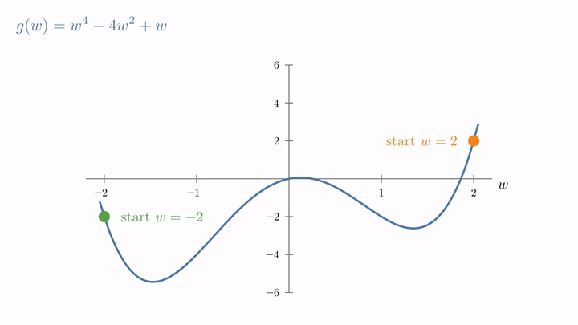

<!-- where-this-fits: generated by course_map/build_map.py; edit concepts.yaml, not this block -->
> **Where this fits:** Pipeline map step 8 (Model). See the [Course map](../../../00-course-map/00-course-map.md).
>
> 
>
> - **Builds on:** Hessian and multivariate Taylor ([Note MA-064](../../../MA/06-calculus/MA-064-hessian-and-multivariate-taylor/MA-064-hessian-and-multivariate-taylor.md)).
> - **Leads to:** Convex sets and convex optimisation ([Note MA-067](../../../MA/07-optimisation/MA-067-convex-sets-and-functions/MA-067-convex-sets-and-functions.md)); Gradient descent ([Note DL-017](../../../DL/01-basics/DL-017-backpropagation-why/DL-017-backpropagation-why.md)).
<!-- /where-this-fits -->

## 1. Overview

> **Key point:** A convex cost function is one bowl: every chord lies on or above the curve, any minimum is the global minimum, and gradient descent finds it from any start. A non-convex one can have several dips, and gradient descent may stop in the wrong one.

The [gradient descent Note](../../../ML/06-regression/ML-056-gradient-descent/ML-056-gradient-descent.md) (Section 8) introduced the idea: a **convex** function (G-476) is one where a straight line between any two points on its curve never goes below the curve. Linear regression's loss is convex; other losses can trap **gradient descent** (G-862) in a **local minimum** (G-1110) instead of the **global minimum** (G-848).



Figure 1 shows the difference on real losses. Both maps fit the same 21 points; only the model changes. This Note writes the chord test as a formula, shows what it guarantees and what goes wrong without it, and checks both losses of Figure 1.

## 2. The cost function is a function of the parameters

> **Key point:** We fix the data and treat the loss as a function of the model's parameters; one parameter gives a curve, two give a surface, many give a surface we can no longer draw.

A **loss function** (G-706), or **cost function** (G-492), measures how far a model's predictions are from the true values (see the [regression metrics Note](../../../ML/06-regression/ML-051-regression-metrics/ML-051-regression-metrics.md)). During training the data is fixed. What changes are the parameters, so we read the loss as a function of the parameters:

$$\text{loss} = L(\text{parameters})$$

Changing a parameter raises or lowers the loss. Training means finding the parameter values where the loss is lowest, so the loss acts as the guide that leads to the right model.

The number of parameters sets the shape we can draw:

- **One parameter**, such as the slope alone: the loss is a curve over a line.
- **Two parameters**, such as slope $m$ and intercept $b$ of [simple linear regression](../../../ML/06-regression/ML-050-linear-regression-maths/ML-050-linear-regression-maths.md): the loss is a surface over a plane, drawn as a contour map in Figure 1 (left).
- **Many parameters**, as in a neural network: the same idea in more dimensions, which we cannot draw.

Figure 2 shows the idea with one parameter. The 21 points never move. Only the slope $m$ of the line $y = mx$ changes, from $-1$ to 3. Each slope gives the line its own errors (red sticks), and so its own loss: a point on the curve on the right. At $m = -1$ the loss is 6.18; at $m = 1.02$ it reaches its lowest value, 0.18.



The curve is built one point at a time. Each row below is one try: choose a slope, measure the errors of that line, and average their squares.

| Slope $m$ | Loss |
|---|---|
| $-1$ | 6.18 |
| 0 | 1.71 |
| 1 | 0.18 |
| 2 | 1.58 |
| 3 | 5.91 |

Plotting the five pairs gives five points of a U shape; trying every slope in between fills in the curve of Figure 2.

Whether this function is convex decides how easy its lowest point is to find.

## 3. The chord test

> **Key point:** Pick two points on the graph and join them with a straight line (a **chord**, G-384); the function is convex if, for every such pair, the curve between them never rises above the chord.

### 3.1 The definition as a formula

> **Key point:** A point a fraction of the way between $a$ and $b$ has a curve value no larger than the same fraction of the way between $f(a)$ and $f(b)$.

The picture "the chord lies on or above the curve" becomes a formula once we name the points between $a$ and $b$. Every such point is $\theta a + (1 - \theta) b$ for some $\theta$ between 0 and 1: $\theta = 1$ gives $a$, $\theta = 0$ gives $b$, $\theta = 0.5$ the midpoint. The chord's height above that point is the same mix of the two end heights.

1. **In words:** at every point between $a$ and $b$, the curve is at or below the chord.
2. **Formula:** $f$ is **convex** if, for all $a$, $b$ and every $\theta$ with $0 \le \theta \le 1$,
   $$f\big(\theta a + (1 - \theta) b\big) \thickspace\le\thickspace\theta f(a) + (1 - \theta) f(b)$$
   The left side is the curve; the right side is the chord.
3. **Example:** $f(w) = w^2$ with $a = -1$, $b = 3$ and $\theta = 0.5$. The midpoint is $0.5 \times (-1) + 0.5 \times 3 = 1$, so
   $$\text{curve: } f(1) = 1, \qquad \text{chord: } 0.5 \times f(-1) + 0.5 \times f(3) = 0.5 \times 1 + 0.5 \times 9 = 5$$
   $1 \le 5$: the curve is below the chord (Figure 3, left). The same holds for every pair of points, so $w^2$ is convex.



A function that fails the test for even one pair of points is **non-convex** (G-1333). Take $g(w) = w^4 - 4w^2 + w$ with $a = -1.5$, $b = 1.5$, $\theta = 0.5$ (Figure 3, right):

$$\text{curve: } g(0) = 0, \qquad \text{chord: } 0.5 \times g(-1.5) + 0.5 \times g(1.5) = 0.5 \times (-5.44) + 0.5 \times (-2.44) = -3.94$$

Here $0 > -3.94$: the curve rises above the chord, so $g$ is non-convex. One failing pair is enough.

> **Extra:** The same inequality with $<$ instead of $\le$ (for $a \ne b$ and $0 < \theta < 1$) defines a **strictly convex** function (G-1899): the curve is strictly below every chord, never touching it in between. $w^2$ is strictly convex. The function $\max(0, |w| - 1)$ is convex but not strictly: it is flat at 0 between $-1$ and $1$, and the chord from $-0.5$ to $0.5$ lies exactly on the curve.

### 3.2 Why convexity matters: one minimum

> **Key point:** A strictly convex function has at most one minimum, and for any convex function every local minimum is a global minimum; a non-convex function can have several minima, and only one of them is the lowest.

Optimisation looks for the parameter values where the loss is lowest. Convexity gives two guarantees:

- **Any convex function:** every local minimum is a global minimum. There is no dip that is lower only locally.
- **Strictly convex:** there is at most one minimum point. A convex function that is not strict can have a flat bottom with many minimum points, but they all share the same lowest value.

The first guarantee follows from the chord test, in three steps:

1. Suppose some point $c$ were a local minimum, and some other point $d$ had a lower value, $f(d) < f(c)$.
2. The chord from $c$ to $d$ slopes downward, and convexity keeps the curve at or below the chord.
3. So just next to $c$ the curve already dips below $f(c)$, and $c$ was not a local minimum after all (Boyd and Vandenberghe §4.2.2).

The second guarantee follows the same way. Suppose a strictly convex $f$ had two different minimum points $c$ and $d$ with the same lowest value $f^\ast$. The strict chord test at their midpoint gives

$$f\left(\frac{c + d}{2}\right) < \frac{1}{2} f^\ast+ \frac{1}{2} f^\ast$$

$$\frac{1}{2} f^\ast+ \frac{1}{2} f^\ast= f^\ast$$

so the midpoint has a value below the lowest one, which is impossible.

A non-convex function gives no such promise. In Figure 3 (right), $g$ has a dip at $w = 1.35$ where $g = -2.62$ and a deeper one at $w = -1.47$ where $g = -5.44$. The first is a local minimum; the second is the global minimum.

> **Extra:** Points with zero slope are called **stationary points** (G-1879). For $g$, the derivative $g'(w) = 4w^3 - 8w + 1$ is zero at $w = -1.47$, $0.13$ and $1.35$. The second derivative $g''(w) = 12w^2 - 8$ tells them apart (see the [derivatives of one variable Note](../../06-calculus/MA-061-derivatives-of-one-variable/MA-061-derivatives-of-one-variable.md)):
>
> | $w$ | $g''(w)$ | Shape | Kind |
> |---|---|---|---|
> | $-1.47$ | $18.0$ | curves up | global minimum |
> | $0.13$ | $-7.8$ | curves down | maximum |
> | $1.35$ | $13.8$ | curves up | local minimum |
>
> A zero slope alone does not say which kind of point we are at.

## 4. What goes wrong with a non-convex loss

> **Key point:** Gradient descent only sees the local slope, so on a non-convex loss it settles in whichever dip it reaches first, which may be a local minimum with a worse loss than the global one.

Picture a ball placed on a hilly track. The ball rolls downhill and comes to rest at the bottom of whichever valley lies below its starting point. The ball cannot know that a deeper valley lies behind the next hill.

Gradient descent behaves like the ball. It steps downhill and stops where the slope is zero (see the [gradient descent Note](../../../ML/06-regression/ML-056-gradient-descent/ML-056-gradient-descent.md)). At a local minimum the slope is zero too, so the algorithm has no way to tell that a deeper dip exists elsewhere.



Figure 4 runs gradient descent on $g$ from two starting points with the same learning rate:

| Start | Ends at | Loss there | Kind |
|---|---|---|---|
| $w = -2$ | $w = -1.47$ | $-5.44$ | global minimum |
| $w = 2$ | $w = 1.35$ | $-2.62$ | local minimum |

The orange run is the worst case for a non-convex loss: it converges, but to a sub-optimal answer. The parameters it returns give a loss 2.82 higher than the best possible. On a convex loss this cannot happen: every start ends at the same lowest value.

> **Extra:** Ways to reduce the risk: start from several random points and keep the best result, or use [stochastic gradient descent](../../../ML/06-regression/ML-058-stochastic-gradient-descent/ML-058-stochastic-gradient-descent.md), whose noisy steps can jump out of a shallow dip (Kleinberg et al. 2018). Methods built for this (momentum, adaptive learning rates) are covered with neural networks.

## 5. Two losses compared

> **Key point:** The loss of linear regression with squared error is convex, so it has one bowl; the loss of even a tiny neural network is non-convex, with several minima and a ridge between them.

Figure 1 fits the same data with two models. The data is 21 points $x = -2, -1.8, \dots, 2$ with $y = 1.5\tanh(2x)$, an S-shaped curve. The loss is the mean squared error in both cases.

### 5.1 A straight line: one bowl

> **Key point:** Over its slope and intercept, the squared-error loss of a straight line is a single bowl with one lowest point.

For the line $y = mx + b$, the contours in Figure 1 (left) are closed rings around one point, $m = 1.02$, $b = 0$, with loss $0.18$. That loss is not 0 because no straight line fits an S-curve exactly, but it is the best a line can do, and gradient descent with a small enough learning rate reaches it from any start (Boyd and Vandenberghe §9.3).

The chord test confirms it. Between $(m, b) = (-1, 0)$ and $(3, 0)$, the midpoint is $(1, 0)$:

The two end losses, 6.18 at $m = -1$ and 5.91 at $m = 3$, are rows of the table in section 2.

$$\text{curve: } L(1, 0) = 0.18, \qquad \text{chord: } 0.5 \times 6.18 + 0.5 \times 5.91 = 3.09 + 2.955 = 6.05$$

In two dimensions the chord is a straight line through the parameter plane, and the surface stays below it. Figure 5 (left) walks along that straight line from $(-1, 0)$ to $(3, 0)$ and plots the loss on the way: a U-shaped curve that stays under the dashed chord everywhere. The [Hessian and multivariate Taylor Note](../../06-calculus/MA-064-hessian-and-multivariate-taylor/MA-064-hessian-and-multivariate-taylor.md) (Section 5.3) proves this holds for every linear regression loss: its Hessian never has a negative eigenvalue.

### 5.2 A tiny neural network: two minima and a ridge

> **Key point:** Flipping the signs of both weights gives the same network, so its loss has two equal minima; the straight line between them crosses a ridge, which breaks the chord test.

The smallest possible network, $y = w_2 \tanh(w_1 x)$, has one hidden unit and two weights. It can fit the data exactly: at $(w_1, w_2) = (2, 1.5)$ it reproduces $y = 1.5\tanh(2x)$, with loss 0.

Because $\tanh(-z) = -\tanh(z)$, flipping both signs gives the same predictions: $(-1.5)\tanh(-2x) = 1.5\tanh(2x)$. So $(-2, -1.5)$ is a second global minimum, also with loss 0 (Figure 1, right).

The chord test between the two minima fails at the midpoint $(0, 0)$:

$$\text{curve: } L(0, 0) = 1.71, \qquad \text{chord: } 0.5 \times 0 + 0.5 \times 0 = 0$$

$1.71 > 0$, so the loss is non-convex. A convex function could never have two separate lowest points with a higher point between them. Figure 5 (right) walks the straight path between the two minima: the loss climbs from 0 over a ridge of height 1.71 and comes back down to 0, entirely above the chord (red).


Here both minima are equally good, so landing in either is fine. Real networks have millions of weights, many such symmetries, and also genuine local minima and flat stretches, so their losses are non-convex (Goodfellow et al. §8.2.2–8.2.3).

> **Extra:** The midpoint $(0, 0)$ is itself a stationary point: with $w_1 = 0$ every prediction is 0 whatever $w_2$ is, and with $w_2 = 0$ every prediction is 0 whatever $w_1$ is, so neither weight has a slope there. The midpoint is a **saddle point** (G-1718): the loss rises along one diagonal and falls along the other (see the [Hessian and multivariate Taylor Note](../../06-calculus/MA-064-hessian-and-multivariate-taylor/MA-064-hessian-and-multivariate-taylor.md)). Gradient descent started exactly at $(0, 0)$ would never move, since both slopes are zero there: one reason why neural network weights are not all started at zero (Goodfellow et al. §8.4).

> **Python:** a numerical chord test. We pick 10,000 random pairs of parameter points and random $\theta$, and record by how much the curve ever rises above the chord. A result above 0 proves the loss is non-convex; 0 is evidence (not proof) that it is convex.
>
> ```python
> import numpy as np
>
> xs = np.linspace(-2, 2, 21)
> ys = 1.5 * np.tanh(2 * xs)
> line = lambda m, b: np.mean((ys - m * xs - b) ** 2)
> net = lambda w1, w2: np.mean((ys - w2 * np.tanh(w1 * xs)) ** 2)
>
> rng = np.random.default_rng(0)
> def worst_gap(L, lo, hi):
>     worst = 0
>     for _ in range(10_000):
>         p, q = rng.uniform(lo, hi), rng.uniform(lo, hi)
>         t = rng.uniform()
>         curve = L(*(t * p + (1 - t) * q))
>         chord = t * L(*p) + (1 - t) * L(*q)
>         worst = max(worst, curve - chord)
>     return worst
>
> worst_gap(line, [-1, -2], [3, 2])   # 0: never above the chord
> worst_gap(net, [-4, -3], [4, 3])    # 6.42: non-convex
> ```

## 6. Summary

| | Convex cost function | Non-convex cost function |
|---|---|---|
| Chord test | curve never above any chord | curve above some chord |
| Minima | every local minimum is global (one point if strictly convex) | can have several, only one lowest |
| Gradient descent | reaches the best value from any start | result depends on the start; may stop in a local minimum |
| Example | linear regression with squared error | neural networks |

- The loss is a function of the parameters; the data stays fixed.
- Convex: $f(\theta a + (1 - \theta) b) \le \theta f(a) + (1 - \theta) f(b)$ for all $a$, $b$ and $0 \le \theta \le 1$.
- One failing pair of points is enough to show a function is non-convex.
- On a non-convex loss, gradient descent can converge to a sub-optimal local minimum.

## 7. Sources

**Built from**

- CampusX, "Difference between convex & non-convex cost function; what happens when cost function is non-convex?", YouTube, https://www.youtube.com/watch?v=TXVtbgaEyms
- Starmer, J. (StatQuest), "Gradient Descent, Step-by-Step", YouTube, https://www.youtube.com/watch?v=sDv4f4s2SB8
- Sanderson, G. (3Blue1Brown), "Gradient descent, how neural networks learn | Deep Learning Chapter 2", YouTube, https://www.youtube.com/watch?v=IHZwWFHWa-w

**Other references**

- Boyd, S. and Vandenberghe, L. (2004). *Convex Optimization*. Cambridge University Press. Sections 4.2.2 (local and global optima) and 9.3 (gradient descent).
- Goodfellow, I., Bengio, Y. and Courville, A. (2016). *Deep Learning*. MIT Press. Sections 8.2.2–8.2.3 (local minima, saddle points) and 8.4 (parameter initialisation).
- Kleinberg, R., Li, Y. and Yuan, Y. (2018). "An Alternative View: When Does SGD Escape Local Minima?". *ICML*.

## 8. Key terms

| Term | Meaning |
|---|---|
| Cost function | Another name for the loss function, read as a function of the model's parameters |
| Chord | The straight line joining two points on a function's graph |
| Non-convex function | A function where some chord lies below part of the curve; it can have several local minima |
| Strictly convex function | A function that lies strictly below every chord between two different points; it has at most one minimum |
| Stationary point | A point where the derivative (or every partial derivative) is zero: a minimum, a maximum or a saddle point |
