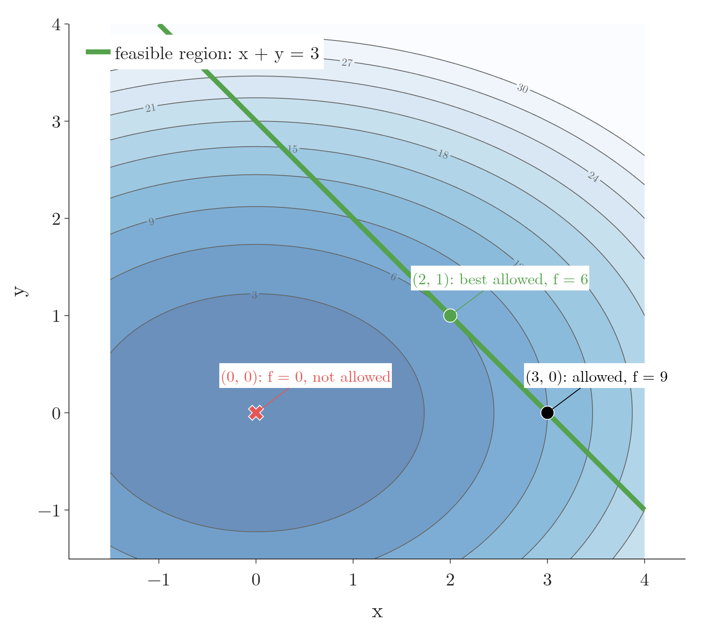
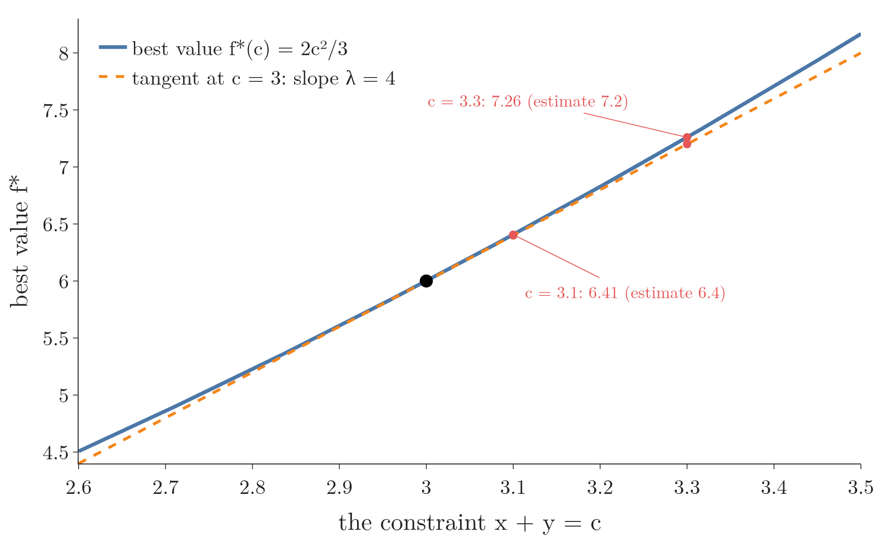
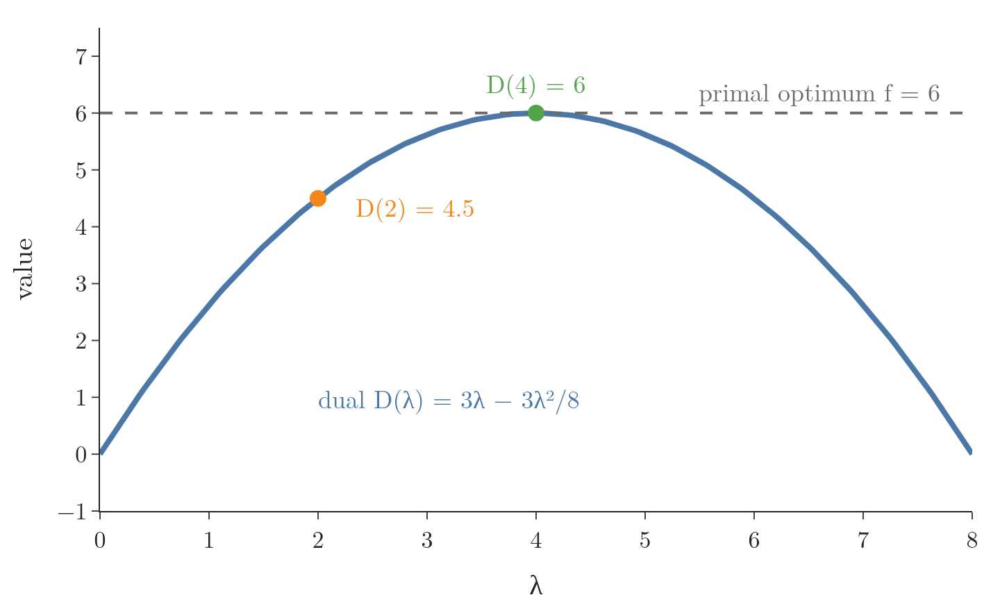
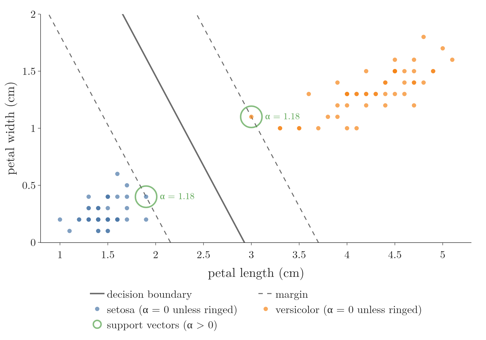

<!-- where-this-fits: generated by course_map/build_map.py; edit concepts.yaml, not this block -->
> **Where this fits:** Pipeline map step 0 (Foundations). See the [Course map](../../../00-course-map/00-course-map.md).
>
> 
>
> - **Builds on:** [Partial derivatives and gradients](../../../MA/06-calculus/MA-062-partial-derivatives-and-gradients/MA-062-partial-derivatives-and-gradients.md#4-the-gradient).
> - **Leads to:** [Ridge regression](../../../ML/06-regression/ML-065-ridge-key-points/ML-065-ridge-key-points.md#1-overview); [Lasso regression](../../../ML/06-regression/ML-067-lasso-sparsity/ML-067-lasso-sparsity.md#1-overview); [Convex sets and convex optimisation](../../../MA/07-optimisation/MA-067-convex-sets-and-functions/MA-067-convex-sets-and-functions.md#6-convex-optimisation-problems); [Support vector machines](../../../ML/07-classification/ML-087-svm-maths/ML-087-svm-maths.md#1-overview).
<!-- /where-this-fits -->

## 1. Overview

> **Key point:** To minimise a function while a constraint must hold, we look for the point where a level curve of the function just touches the constraint; there the two gradients are parallel, and the Lagrange multiplier is the factor between them.

This Note follows Chapter 7 (Section 7.2) of *Mathematics for Machine Learning* (Deisenroth, Faisal and Ong, 2020).

The function used throughout is

$$f(x, y) = x^2 + 2y^2$$

For example, at the point $(2, 1)$:

$$f(2, 1) = 2^2 + 2 \times 1^2$$

$$f(2, 1) = 4 + 2 = 6$$

Its surface is a bowl with its bottom at $(0, 0)$. Figure 1 shows it, together with a rule that only points on the line $x + y = 3$ are allowed (the rule is a **constraint**, explained in section 2), lifted onto the bowl; the last frames tilt to the top view, where the bowl becomes a **contour map** (see the [partial derivatives and gradients](../../06-calculus/MA-062-partial-derivatives-and-gradients/MA-062-partial-derivatives-and-gradients.md#11-reading-a-contour-map)): each ring joins points of the same height, rings close together mean a steep slope, and the centre ring is the lowest point. Figure 2 then draws on that contour map.

{height=45%}


**Gradient descent** (G-862; see the [gradient descent](../../../ML/06-regression/ML-056-gradient-descent/ML-056-gradient-descent.md#2-the-idea)) searches the whole parameter space. Often the parameters must also obey a rule: weights that stay inside a circle, probabilities that add up to 1, or every training point on the right side of a margin. Figure 2 shows the idea this Note builds on: grow a level curve of the function until it first touches the set of allowed points. In Figure 2 the blue ellipse is a level curve: all points where $f$ has the same value $c$. As $c$ grows, the ellipse grows from the centre; the green line holds the allowed points.

The **gradient** $\nabla f$ of $f$ at a point is the list of its slopes in the $x$ and $y$ directions, an arrow pointing steepest uphill; for our $f$ it is $\nabla f = [2x,\ 4y]$, so at $(2, 1)$ it is $[4, 4]$. This Note uses the gradient and its key property, that it crosses contour lines at right angles, from the [partial derivatives and gradients](../../06-calculus/MA-062-partial-derivatives-and-gradients/MA-062-partial-derivatives-and-gradients.md#42-the-gradient-as-an-arrow-on-the-contour-map). The Sections are:

- the problem (section 2);
- the geometry with one equality constraint (section 3);
- the Lagrangian (section 4);
- inequality constraints (section 5);
- duality (section 6);
- two ML examples (section 7).

## 2. Constrained optimisation problems

> **Key point:** We minimise $f(\mathbf{x})$ over only the points that satisfy every constraint; this set of allowed points is the feasible region.

Picture a hiker who wants the lowest point of a bowl-shaped valley, but a fence forces the hiker to stay on one straight path. The bottom of the valley is off limits. The hiker must find the lowest point *along the path*. That is a **constrained optimisation** problem: minimise a function while keeping a condition true (see the [SVM maths](../../../ML/07-classification/ML-087-svm-maths/ML-087-svm-maths.md#6-the-optimisation-problem)). Figures 2 and 3 draw this picture.

**Worked example.** The valley is the function

$$f(x, y) = x^2 + 2y^2$$

Here $x$ and $y$ are the two coordinates of a position, and $f$ is the height at that position. A few heights:

$$f(0, 0) = 0^2 + 2 \times 0^2 = 0$$

$$f(3, 0) = 3^2 + 2 \times 0^2 = 9$$

$$f(2, 1) = 2^2 + 2 \times 1^2 = 6$$

The path is the line of all positions with $x + y = 3$. The tests:

| Position | $x + y$ | On the path? | Height $f$ |
|---|---|---|---|
| $(0, 0)$ | 0 | no | 0, but not allowed |
| $(3, 0)$ | 3 | yes | 9 |
| $(2, 1)$ | 3 | yes | 6 |

The function to minimise is the **objective function** (G-1372). The positions that obey the rule are the **feasible region** (G-759); here, the line $x + y = 3$. A rule of the form "this expression equals 0" is an **equality constraint**. For our path we write it as the expression $h(x, y) = 3 - x - y$ with the rule $h = 0$. A rule of the form "this expression is at most 0" is an **inequality constraint**; a rule written with $\ge$ is turned around, so $x + y \ge 3$ becomes $3 - x - y \le 0$.

**The general form.** With several rules, we name the inequality expressions $g_1, \dots, g_m$ and the equality expressions $h_1, \dots, h_n$. In our example $m = 0$ and $n = 1$.

The problem is to find the smallest value of $f$ over all $\mathbf{x}$ (written $\min_{\mathbf{x}} f(\mathbf{x})$) subject to, that is while obeying, these rules:

$$\min_{\mathbf{x}} f(\mathbf{x})$$

$$g_i(\mathbf{x}) \le 0 \quad (i = 1, \dots, m)$$

$$h_j(\mathbf{x}) = 0 \quad (j = 1, \dots, n)$$

Here $\mathbf{x}$ stands for all the unknowns together. In our example $\mathbf{x} = (x, y)$, a pair of numbers such as $(2, 3)$. In words: minimise $f$ over all $\mathbf{x}$ for which every inequality expression is at most 0 and every equality expression is exactly 0. Check with the numbers above: only $(3, 0)$ and $(2, 1)$ pass $h = 0$, and the lower height is 6.

Without the constraint, the minimum of $f$ is at $(0, 0)$ with $f = 0$. The constraint forbids that point, so the answer must lie somewhere on the line $x + y = 3$. The question is where.

Figure 1 showed the problem on the surface of $f$ first: the surface is a bowl, and the constraint is a straight line on the floor under it. Lift every point of the line up onto the bowl and it becomes a curve. Only points on this curve are allowed, so the task is to find the lowest point of the curve, not the bottom of the bowl. The lowest point of the curve is above $(2, 1)$, at height 6. In the top view the bowl flattens into contour rings and the curve becomes the line again. The flat view is easier to draw and to compute with, so the rest of this Note uses it.

Figure 3 draws the problem on the contour map of the bowl in Figure 1 (same function, seen from above). The contour rings of $f$ grow outwards from $(0, 0)$, the green line is the feasible region, and only points on it count. Walking along the line, $f$ is 9 at $(3, 0)$ and falls to 6 at $(2, 1)$, then rises again.



## 3. The geometry: a level curve touching the constraint

> **Key point:** At the constrained minimum, the level curve of $f$ through that point is tangent to the constraint, so the gradient of $f$ and the gradient of the constraint point along the same line.

### 3.1 Growing the level curve

> **Key point:** Small level curves miss the constraint; the first one to reach it touches it at the lowest feasible value.

A level curve of $f$ joins the points where $f$ has one fixed value $c$. For our $f$ the level curves are the ellipses

$$x^2 + 2y^2 = c$$

around the origin, larger for larger $c$. Figure 2 grows $c$ step by step:

- **$c = 0.5$ and $c = 3$:** the ellipse does not reach the line. No feasible point has a value this low.
- **$c = 6$:** the ellipse first touches the line, at the single point $(2, 1)$. Check that the point is on the line and on the ellipse:

  $$2 + 1 = 3$$

  $$2^2 + 2 \times 1^2 = 6$$

- **$c > 6$:** the ellipse crosses the line at two points, but these have higher values.

So the constrained minimum is $(2, 1)$ with $f = 6$. At that point the ellipse and the line are **tangent**: they touch without crossing.

### 3.2 Tangent curves have parallel gradients

> **Key point:** The gradient is perpendicular to its level curve; when two curves are tangent, both gradients are perpendicular to the same direction, so one is a multiple of the other.

The gradient of a function is perpendicular to its contour lines (see the [partial derivatives and gradients](../../06-calculus/MA-062-partial-derivatives-and-gradients/MA-062-partial-derivatives-and-gradients.md#42-the-gradient-as-an-arrow-on-the-contour-map), Section 4.2). The constraint line $x + y = 3$ is itself a contour line of the function $x + y$. At the touching point both curves share one tangent direction, so both gradients are perpendicular to it.

1. **In words:** at the constrained minimum, the gradient of $f$ is a multiple of the gradient of the constraint function.
2. **Formula:** for a constraint $h(\mathbf{x}) = 0$,
   $$\nabla f(\mathbf{x}^\ast) = -\lambda\thinspace\nabla h(\mathbf{x}^\ast) \quad \text{for some number } \lambda$$
   Here $\mathbf{x}^\ast$ is the constrained minimum. The number $\lambda$ is the **Lagrange multiplier** (G-1036). The minus sign is a convention that matches Section 4.
3. **Example:** at $(2, 1)$:
   $$\nabla f = [2x,\ 4y] = [4,\ 4]$$
   With $h = 3 - x - y$:
   $$\nabla h = [-1,\ -1]$$
   Then
   $$[4, 4] = -4 \times [-1, -1]$$
   so $\lambda = 4$. Figure 2 (last frame) draws $\nabla f$ and $\nabla(x + y) = [1, 1]$: they point the same way.

Why must they be parallel? If $\nabla f$ had a part along the line, we could slide along the line in the opposite direction and lower $f$ while staying feasible. Only when $\nabla f$ points straight across the line is there no downhill direction left.


Figure 4 makes the argument visible, on the same contour map of $f$ as Figure 3 (the bowl of Figure 1 seen from above). Watch the red arrow: while it exists, the point can still go downhill along the line, and the dashed level curve through the point crosses the line instead of touching it. The sliding-point picture follows Sanderson's Khan Academy lessons on Lagrange multipliers.

## 4. The Lagrangian

> **Key point:** We add the constraints to the objective, each multiplied by its own Lagrange multiplier; setting all partial derivatives of this Lagrangian to zero gives the tangency condition and the constraint together.

### 4.1 One function holds all the conditions

> **Key point:** One new function, the objective plus the constraint times a number $\lambda$, holds both conditions: its slope in $\mathbf{x}$ gives the tangency condition, and its slope in $\lambda$ gives back the constraint.

The tangency condition and the constraint can be packed into one unconstrained function, the **Lagrangian** (G-1037).

1. **In words:** the objective plus each constraint times its multiplier.
2. **Formula:** $\lambda_j$ is the multiplier of the constraint $h_j$ (for our line, one number such as $\lambda = 4$). The symbol $\sum_j$ means "add the terms for $j = 1, 2, \dots$". For one constraint it is just one term.
   $$\mathcal{L}(\mathbf{x}, \boldsymbol{\lambda}) = f(\mathbf{x}) + \sum_{j} \lambda_j\thinspace h_j(\mathbf{x})$$
   $$= f(\mathbf{x}) + \boldsymbol{\lambda}^{\mathsf T} \mathbf{h}(\mathbf{x})$$
   Here $\boldsymbol{\lambda}^{\mathsf T}\mathbf{h}$ is the dot product of the list of multipliers with the list of constraint values. Setting the gradient of $\mathcal{L}$ in $\mathbf{x}$ to zero, $\nabla_{\mathbf{x}} \mathcal{L} = \mathbf{0}$, gives $\nabla f = -\sum_j \lambda_j \nabla h_j$, the tangency condition. Setting the slope in $\lambda_j$ to zero,
   $$\frac{\partial \mathcal{L}}{\partial \lambda_j} = 0$$
   gives back $h_j(\mathbf{x}) = 0$.
3. **Example:** for our problem,
   $$\mathcal{L}(x, y, \lambda) = x^2 + 2y^2 + \lambda(3 - x - y)$$
   The three partial derivatives:
   $$\frac{\partial \mathcal{L}}{\partial x} = 2x - \lambda = 0$$
   $$\frac{\partial \mathcal{L}}{\partial y} = 4y - \lambda = 0$$
   $$\frac{\partial \mathcal{L}}{\partial \lambda} = 3 - x - y = 0$$
   The first two give $x = \lambda/2$ and $y = \lambda/4$. Putting these into the third:
   $$3 - \frac{\lambda}{2} - \frac{\lambda}{4} = 0$$
   $$3 - \frac{3\lambda}{4} = 0$$
   $$\lambda = 4$$
   Then $x = \lambda/2$ and $y = \lambda/4$ give:
   $$x = 2$$
   $$y = 1$$
   This is the point of Figure 1.

Three equations in three unknowns replaced a search along a line. With $n$ variables and $m$ constraints, there are $n + m$ equations in $n + m$ unknowns.

### 4.2 What the multiplier measures

> **Key point:** $\lambda$ is the rate at which the best value rises when the constraint is tightened by one unit.

The multiplier is more than a helper variable. The multiplier says how much the constraint costs.

1. **In words:** if we move the constraint by a small amount, the best value changes by about $\lambda$ times that amount.
2. **Formula:** for the constraint $x + y = c$, with best value $f^\ast(c)$,
   $$\frac{d f^\ast}{d c} = \lambda$$
3. **Example:** solving the same equations with $c$ instead of 3 gives $x = 2c/3$ and $y = c/3$, so the best value is
   $$f^\ast(c) = \frac{2c^2}{3}$$
   Its derivative at $c = 3$ is
   $$\frac{d f^\ast}{d c} = \frac{4c}{3} = 4 = \lambda$$
   Moving the line to $x + y = 3.1$ raises the best value from $6$ to $6.41$. The estimate from the multiplier is
   $$4 \times 0.1 = 0.4$$
   which is close to the true rise, $0.41$. The last frame of Figure 4 moves the line to $x + y = 3.3$: the best value becomes $7.26$, close to the estimate
   $$6 + 4 \times 0.3 = 7.2$$

Figure 5 plots the best value $f^\ast(c)$ against the position $c$ of the line. At $c = 3$ its tangent has slope 4: the multiplier is the slope of the best value. The red gaps show that the estimate "best value plus $\lambda$ times the shift" is close for small shifts and drifts for larger ones, because $f^\ast$ curves.



**A multiplier you can act on.** A factory makes goods from labour and steel. An hour of labour costs 20 rupees and a tonne of steel 2,000 rupees. With $h$ hours and $s$ tonnes the revenue is

$$R = 100\thinspace h^{2/3} s^{1/3} \text{ rupees}$$

 The budget is $b = 20{,}000$ rupees, so the constraint is $20h + 2000s = 20{,}000$. Here we maximise, and the same condition holds: at the best plan a revenue contour touches the budget line (Figures 6 and 7 below build this picture), so the gradient of the revenue is $\lambda$ times the gradient of the spending.

Figure 6 shows the revenue first. The revenue is a number for every plan: for $h = 667$ hours and $s = 3.33$ tonnes,

$$R = 100 \times 667^{2/3} \times 3.33^{1/3}$$

$$R = 11{,}400 \text{ rupees}$$

 As a surface over the two inputs, the revenue is a slope that rises as either input grows. The budget line is lifted onto it (green): only plans on this curve can be paid for. The last frames tilt to the top view. That is the contour map of Figure 7 (left): each curve joins plans with the same revenue, the curves farther from $(0, 0)$ mean more revenue, and the best plan (red) is the point where the green line just touches one revenue curve.


1. **Tangency in $h$:**
   $$\frac{\partial R}{\partial h} = \frac{200}{3}\thinspace h^{-1/3} s^{1/3} = 20\lambda$$
2. **Tangency in $s$:**
   $$\frac{\partial R}{\partial s} = \frac{100}{3}\thinspace h^{2/3} s^{-2/3} = 2000\lambda$$
3. **Divide the first by the second:**
   $$\frac{2s}{h} = \frac{1}{100}$$
   so $h = 200s$.
4. **Budget:** put $h = 200s$ into $20h + 2000s = 20{,}000$:
   $$20 \times 200s = 4000s$$
   $$4000s + 2000s = 6000s = 20{,}000$$
   so $s = 3.33$ tonnes and $h = 667$ hours.
5. **Result:** the best revenue is $R = 11{,}400$ rupees, and step 1 gives $\lambda = 0.57$.

The multiplier is a price: each extra rupee of budget brings about 0.57 rupees of extra revenue. Check: with a budget of 22,000 rupees (2,000 more) the best revenue is 12,540 rupees, which matches the multiplier's estimate:

$$11{,}400 + 0.57 \times 2000 = 12{,}540$$

A multiplier above 1 would say that a larger budget pays for itself; here it is below 1, so it does not. Figure 7 moves the budget from 10,000 to 30,000 rupees and traces the best revenue; its slope is $\lambda$.

{height=50%}

> **Extra:** In economics, $\lambda$ is called the **shadow price** (G-1784) of the constraint (Boyd and Vandenberghe §5.6): how much the best result would improve if one more unit of the limited resource were available. The [linear and quadratic programming](../MA-068-linear-and-quadratic-programming/MA-068-linear-and-quadratic-programming.md#24-reading-the-multipliers) reads multipliers this way.

## 5. Inequality constraints

> **Key point:** An inequality constraint either holds with equality at the answer (active, $\lambda > 0$) or does not matter there (inactive, $\lambda = 0$); multipliers of inequality constraints are never negative.

Most constraints in ML are inequalities: a margin of at least 1, a weight length of at most $t$. For an inequality $g(\mathbf{x}) \le 0$, two cases can happen (Figure 8). Figure 8 draws the contour map of the same bowl $f$ as Figures 1 and 3, so the rings are read the same way: the centre ring is the bottom of the bowl, $(0, 0)$.


- **Active** (an **active constraint**, G-166): the unconstrained minimum is not feasible, so the answer lies on the boundary $g = 0$. The constraint then behaves like an equality constraint. For $x + y \ge 3$, written $g = 3 - x - y \le 0$, the answer is again $(2, 1)$ with $\lambda = 4$.
- **Inactive** (an **inactive constraint**, G-928): the unconstrained minimum is already feasible, so the constraint plays no part and $\lambda = 0$. For $x + y \ge -1$, the point $(0, 0)$ satisfies $0 \ge -1$, and it is the answer.

Why must $\lambda \ge 0$ for an inequality? At an active constraint, $\nabla f = -\lambda \nabla g$. The gradient $\nabla g$ points out of the feasible region, towards larger $g$. With $\lambda \ge 0$, $\nabla f$ points into the region: $f$ increases as we move inside, so the boundary point is indeed lowest. A negative $\lambda$ would mean $f$ decreases inside, and the true answer would lie inside.

In both cases the product $\lambda\thinspace g(\mathbf{x}^\ast)$ is 0: either $\lambda = 0$ (inactive) or $g = 0$ (active). For an equality constraint, the multiplier can have either sign.

> **Extra:** These rules together are the **KKT conditions** (G-1013; Karush–Kuhn–Tucker), the standard check for a constrained minimum (Boyd and Vandenberghe §5.5.3):
>
> 1. **Stationarity:** $\nabla f + \sum_i \lambda_i \nabla g_i + \sum_j \nu_j \nabla h_j = \mathbf{0}$.
> 2. **Primal feasibility:** $g_i(\mathbf{x}) \le 0$ and $h_j(\mathbf{x}) = 0$.
> 3. **Dual feasibility:** $\lambda_i \ge 0$ (the equality multipliers $\nu_j$ can have any sign).
> 4. **Complementary slackness** (G-424): $\lambda_i\thinspace g_i(\mathbf{x}) = 0$ for every $i$.
>
> For the active case of Figure 8, at $(2, 1)$ with $g = 3 - x - y$ and $\lambda = 4$, check the four conditions one by one:
>
> $$[4, 4] + 4 \times [-1, -1] = [0, 0]$$
>
> $$g = 3 - 2 - 1 = 0$$
>
> $$\lambda = 4 \ge 0$$
>
> $$\lambda\thinspace g = 4 \times 0 = 0$$
>
> All four hold.

### 5.1 From a wall to a price

> **Key point:** A hard constraint is an infinite penalty outside the feasible region; the Lagrangian replaces that wall with a straight-line penalty $\lambda g$.

Think of the fence round the valley. A **hard** fence is an electric wall: any step outside costs infinitely much, any step inside costs nothing. A **soft** fence is a fine: every unit of rule-breaking costs a fixed number of rupees, and being well inside even earns a small credit. The soft fence is easier to work with, and with the right fine it keeps the hiker in the same place.

Take the rule $x + y \ge 3$, written as $g(x, y) = 3 - x - y \le 0$, and a fine of $\lambda = 4$ per unit. Three positions:

| Position | $g = 3 - x - y$ | Allowed? | Hard wall $\mathrm{I}(g)$ | Soft fine $\lambda g = 4g$ |
|---|---|---|---|---|
| $(1, 1)$ | 1 | no | $\infty$ | 4 |
| $(2, 1)$ | 0 | yes | 0 | 0 |
| $(3, 1)$ | $-1$ | yes | 0 | $-4$ |

At every allowed position the soft fine is at most the hard wall (0 or less against 0). So the objective with the soft fine is never above the objective with the hard wall. This lower bound is the starting point of duality.

**The formal version.** The hard wall is the function $\mathrm{I}(z)$ below, and the hard-wall objective is $J$:

$$\mathrm{I}(z) = \begin{cases} 0 & z \le 0 \cr\infty & z > 0 \end{cases}$$

$$J(\mathbf{x}) = f(\mathbf{x}) + \sum_{i} \mathrm{I}\big(g_i(\mathbf{x})\big)$$

Minimising $J$ gives the same answer as the constrained problem, but a function that jumps to infinity is as hard to minimise as the original. The Lagrangian replaces the infinite wall with the linear term $\lambda_i g_i(\mathbf{x})$, a finite price per unit of violation. For $\lambda \ge 0$ and any feasible point, $\lambda g \le 0$, so $\mathcal{L}$ is never above $J$, as the table shows.

## 6. Lagrangian duality

> **Key point:** Minimising the Lagrangian over $\mathbf{x}$ for a fixed $\boldsymbol{\lambda}$ gives the dual function $D(\boldsymbol{\lambda})$; every value of it is a lower bound on the true minimum, and the best lower bound is the dual problem.

### 6.1 The dual function and the dual problem

> **Key point:** For every price $\lambda \ge 0$ on the constraint, the lowest value of the Lagrangian is a guaranteed floor under the true answer; the dual problem looks for the highest floor.

**Why anyone wants a lower bound.** Solving the constrained problem directly can be hard. A floor is a cheap guarantee: "the best value is at least this". If we also find a feasible point whose value equals the floor, we know it is the best, with no search over the rest. So we raise the floor as high as we can.

**Worked example** on the problem of Section 2 with the rule $3 - x - y \le 0$. Pick a price $\lambda$, then minimise the Lagrangian

$$\mathcal{L}(x, y, \lambda) = x^2 + 2y^2 + \lambda(3 - x - y)$$

over all $x, y$, with no rule at all. By Section 4.1 the lowest point is at $x = \lambda/2$, $y = \lambda/4$. The floor for a few prices:

| Price $\lambda$ | Lowest point $(\lambda/2, \lambda/4)$ | Floor $D(\lambda)$ | Below the true best 6? |
|---|---|---|---|
| 0 | $(0, 0)$ | 0 | yes |
| 2 | $(1, 0.5)$ | 4.5 | yes |
| 4 | $(2, 1)$ | 6 | equal |
| 6 | $(3, 1.5)$ | 4.5 | yes |

Each floor is one step of arithmetic. For $\lambda = 2$:

$$\mathcal{L}(1, 0.5, 2) = 1^2 + 2 \times 0.5^2 + 2 \times (3 - 1 - 0.5)$$

$$= 1 + 0.5 + 3 = 4.5$$

The best floor is at $\lambda = 4$, and it reaches 6, the answer found by the tangency method. Figure 9 plots this table.

**The formal version.** The original problem, in the variables $\mathbf{x}$, is the **primal problem** (G-1559). Minimising the Lagrangian over $\mathbf{x}$ for a fixed $\boldsymbol{\lambda}$ gives the floor, the **dual function** $D(\boldsymbol{\lambda})$. Maximising the floor over the multipliers is the **dual problem** (G-642).

$$D(\boldsymbol{\lambda}) = \min_{\mathbf{x}} \mathcal{L}(\mathbf{x}, \boldsymbol{\lambda})$$

The dual problem is:

$$\max_{\boldsymbol{\lambda} \ge \mathbf{0}} D(\boldsymbol{\lambda})$$

For our example, putting $x = \lambda/2$, $y = \lambda/4$ back in, one term per line:

$$D(\lambda) = \frac{\lambda^2}{4} + \frac{\lambda^2}{8} + \lambda\Big(3 - \frac{3\lambda}{4}\Big)$$

$$D(\lambda) = 3\lambda - \frac{3\lambda^2}{8}$$

Its derivative $3 - 3\lambda/4$ is zero at $\lambda = 4$, where

$$D(4) = 12 - 6 = 6$$

Check against the table at $\lambda = 2$:

$$D(2) = 6 - 1.5 = 4.5$$

as found.

{height=36%}

### 6.2 Weak and strong duality

> **Key point:** The dual value is never above the primal minimum (weak duality); for convex problems the two are equal (strong duality).

Figure 9 shows two facts, with the floors of the table in Section 6.1:

- **Weak duality** (G-2103): every $D(\lambda)$ is at most the primal minimum. At $\lambda = 2$ the floor is 4.5, which is at most 6.
- **Strong duality** (G-1903): here the best lower bound reaches the minimum: $D(4) = 6$, the primal answer. Strong duality holds for convex problems such as this one (see the [convex sets and functions](../MA-067-convex-sets-and-functions/MA-067-convex-sets-and-functions.md#62-what-convexity-guarantees)), under a mild extra condition that this problem meets: some point must satisfy every inequality strictly (Slater's condition; Boyd and Vandenberghe §5.2.3). For non-convex problems a gap can remain.

Weak duality always holds. In plain words: the floor is below the Lagrangian at every allowed point, and the Lagrangian at an allowed point is below the objective there, because the fine is zero or a credit. Take the allowed point $(3, 1)$ and the price $\lambda = 2$:

$$f(3, 1) = 3^2 + 2 \times 1^2 = 11$$

$$\mathcal{L}(3, 1, 2) = 11 + 2 \times (3 - 3 - 1) = 9$$

$$D(2) = 4.5$$

So $4.5 \le 9 \le 11$: the floor is below the Lagrangian, which is below the objective. In symbols, for a feasible $\mathbf{x}$ and $\boldsymbol{\lambda} \ge 0$:

1. Each term $\lambda_i g_i(\mathbf{x})$ is at most 0, so $\mathcal{L}(\mathbf{x}, \boldsymbol{\lambda}) \le f(\mathbf{x})$.
2. The minimum over all $\mathbf{x}$ is lower still, so $D(\boldsymbol{\lambda}) \le \mathcal{L}(\mathbf{x}, \boldsymbol{\lambda})$.
3. Together, $D(\boldsymbol{\lambda}) \le f(\mathbf{x})$ for every feasible $\mathbf{x}$, including the best one.

The same argument in general form is the **minimax inequality** (G-1225): for any function $\varphi(\mathbf{x}, \mathbf{y})$, $\max_{\mathbf{y}} \min_{\mathbf{x}} \varphi \le \min_{\mathbf{x}} \max_{\mathbf{y}} \varphi$. The primal problem is $\min_{\mathbf{x}} \max_{\boldsymbol{\lambda} \ge 0} \mathcal{L}$, because the inner maximum is $f$ at feasible points and infinite elsewhere ($J$ of Section 5.1). The dual swaps the order.

Two further properties make the dual useful:

- $D$ is always **concave** (an upside-down bowl), even when $f$ and $g_i$ are not convex: it is the lowest of many functions that are linear in $\boldsymbol{\lambda}$ (MML §7.2). Maximising a concave function has no local-maximum trap.
- The dual has one variable per constraint, the primal one per parameter. Whichever is smaller can be the cheaper one to solve.

## 7. Two examples from ML

> **Key point:** Ridge and Lasso are constrained least squares in disguise, with the penalty strength as the multiplier; the SVM dual expresses the solution through one multiplier per training point, nonzero only for the support vectors.

### 7.1 Ridge and Lasso: the constraint view

> **Key point:** Capping the size of the weights and fining the size of the weights are two views of the same Ridge fit; each fine strength matches one cap.

The [Ridge key points](../../../ML/06-regression/ML-065-ridge-key-points/ML-065-ridge-key-points.md#51-with-two-coefficients-why-ridge) (Section 5.1) pictured Ridge as the point where the error ellipses first touch a circle around the origin, and called it the constrained view. Section 3 explains that picture: it is a level curve touching a constraint.

**In plain words.** Ridge can be read as least squares with a cap on the weights: choose the weights with the smallest error, but keep their total size inside a budget $t$. Here $\mathbf{w}$ is the list of weights, for example $\mathbf{w} = (3, 4)$, and its size is

$$\lVert \mathbf{w} \rVert^2 = 3^2 + 4^2 = 25$$

so a budget $t = 25$ allows $(3, 4)$ and a budget $t = 10$ does not. $\mathbf{y}$ is the list of targets and $X$ the table of features, so $X\mathbf{w}$ is the list of predictions. As a constrained problem:

$$\min_{\mathbf{w}} \lVert \mathbf{y} - X\mathbf{w} \rVert^2 \quad \text{subject to} \quad \lVert \mathbf{w} \rVert^2 - t \le 0$$

Its Lagrangian is

$$\mathcal{L}(\mathbf{w}, \lambda) = \lVert \mathbf{y} - X\mathbf{w} \rVert^2 + \lambda \lVert \mathbf{w} \rVert^2 - \lambda t$$

For a fixed $\lambda$, the last term is a constant, so minimising over $\mathbf{w}$ is exactly Ridge regression with penalty strength $\lambda$ (see the [Ridge regression maths](../../../ML/06-regression/ML-063-ridge-regression-maths/ML-063-ridge-regression-maths.md#3-many-features)). A small circle (small $t$) needs a large multiplier; once the circle contains the ordinary least-squares answer, the constraint is inactive and $\lambda = 0$.

Figure 10 checks this matching on the diabetes data (10 standardised features). For each penalty strength $\lambda$ we fit Ridge and record the size $t = \lVert \mathbf{w} \rVert^2$ of its weights: that is the circle for which this $\lambda$ is the multiplier. Every $\lambda$ gives one circle, larger $\lambda$ a smaller one, and as $\lambda$ falls towards 0 the circle grows to the size of the OLS weights, 4,295.

How to read Figure 10: each point is one Ridge fit. Its horizontal position is the size $t$ of the weights it produces (the circle), and its height is the penalty strength $\lambda$ that produced it, which is the multiplier of that circle. Both axes use a log scale, so each gridline is ten times the previous one. Moving left means a smaller circle and a larger $\lambda$. The dashed red line is the size of the ordinary least-squares weights; a circle larger than that no longer bites, so $\lambda$ falls to 0 there.


Lasso is the same with $|w_1| + |w_2| + \dots \le t$: a diamond instead of a circle. Its corners on the axes are why Lasso answers often have coefficients exactly 0 (ESL §3.4.3, Figure 3.11) (see the [Elastic Net](../../../ML/06-regression/ML-068-elastic-net/ML-068-elastic-net.md#4-the-shape-of-the-penalty)).

### 7.2 The SVM dual

> **Key point:** In the dual of the hard-margin SVM every training point gets one multiplier $\alpha_i$; the points that sit on the margin (the support vectors) get a positive one, all others get 0, and the data appears only through dot products.

The hard-margin SVM minimises $\tfrac12 \lVert \mathbf{w} \rVert^2$ subject to $y_i(\mathbf{w}^{\mathsf T}\mathbf x_i + b) \ge 1$ for every point (see the [SVM soft margin](../../../ML/07-classification/ML-088-svm-soft-margin/ML-088-svm-soft-margin.md#3-from-maximising-to-minimising), Section 3). Each point gives one constraint $g_i = 1 - y_i(\mathbf{w}^{\mathsf T}\mathbf x_i + b) \le 0$ and one multiplier $\alpha_i \ge 0$.

1. **In words:** set the derivatives of the Lagrangian in $\mathbf{w}$ and $b$ to zero and put the results back; what is left is a problem in the multipliers alone.
2. **Formula:** $\nabla_{\mathbf{w}} \mathcal{L} = \mathbf{0}$ gives $\mathbf{w} = \sum_i \alpha_i y_i \mathbf x_i$, and setting the slope in $b$ to zero gives $\sum_i \alpha_i y_i = 0$. The dual problem is (MML §12.3)
   $$\max_{\boldsymbol{\alpha} \ge 0} \ \sum_i \alpha_i$$
   $$- \frac12 \sum_i \sum_j \alpha_i \alpha_j y_i y_j\thinspace\mathbf x_i^{\mathsf T}\mathbf x_j$$
   subject to
   $$\sum_i \alpha_i y_i = 0$$
3. **Example:** two points, $\mathbf x_1 = (1, 1)$ with label $y_1 = +1$ and $\mathbf x_2 = (-1, -1)$ with label $y_2 = -1$ (a label is the class, $+1$ or $-1$). The equality $\sum_i \alpha_i y_i = 0$ for the two points is

   $$\alpha_1 - \alpha_2 = 0$$

   so $\alpha_1 = \alpha_2 = \alpha$. Then, one line each:

   $$\mathbf{w} = \alpha_1 y_1 \mathbf x_1 + \alpha_2 y_2 \mathbf x_2$$

   $$= \alpha(1, 1) + \alpha(1, 1)$$

   $$= (2\alpha, 2\alpha)$$

   $$\mathbf x_1^{\mathsf T}\mathbf x_1 = 2$$

   $$\mathbf x_1^{\mathsf T}\mathbf x_2 = -2$$

   $$\mathbf x_2^{\mathsf T}\mathbf x_2 = 2$$

   $$\sum_{i,j} \alpha_i \alpha_j y_i y_j \mathbf x_i^{\mathsf T}\mathbf x_j$$

   $$= \alpha^2(2 + 2 + 2 + 2) = 8\alpha^2$$

   $$\text{dual objective} = 2\alpha - \tfrac12 \times 8\alpha^2 = 2\alpha - 4\alpha^2$$

   The derivative $2 - 8\alpha$ is zero at $\alpha = 0.25$, giving $\mathbf{w} = (0.5, 0.5)$ and $b = 0$. The margin is

   $$\frac{2}{\lVert \mathbf{w} \rVert} = \frac{2}{0.707} = 2.83$$

   which is exactly the distance between the two points.

Two things are new here:

- **Complementary slackness picks the support vectors.** A point strictly outside the margin has an inactive constraint, so $\alpha_i = 0$ and it does not appear in $\mathbf{w}$. Only points on the margin, the support vectors, have $\alpha_i > 0$.
- **Only dot products appear.** The data enters the dual only as $\mathbf x_i^{\mathsf T}\mathbf x_j$. Replacing each dot product by a kernel function is the [kernel trick](../../../ML/07-classification/ML-089-kernel-trick-intuition/ML-089-kernel-trick-intuition.md#3-the-kernel-trick).

Figure 11 shows complementary slackness on real data: 100 Iris flowers, setosa against versicolor, described by petal length and width. Of the 100 multipliers of the hard-margin SVM, only 2 are not zero: the two flowers on the margin, each with $\alpha = 1.18$. The other 98 flowers could be removed without changing $\mathbf{w}$.

How to read Figure 11: each dot is one flower, placed by its petal length (across) and petal width (up); blue dots are setosa and orange dots are versicolor. The solid line is the **decision boundary** (G-555) the SVM learns: it splits the two species. The dashed lines are the **margin**, the two lines parallel to the boundary at the closest allowed distance; no flower may lie between them. The green rings mark the flowers that sit exactly on a dashed line. Those are the flowers whose constraint is active, so they alone have a multiplier above 0.



> **Python:** scipy solves constrained problems with `minimize`. The method `trust-constr` also reports the multipliers. scikit-learn's `SVC` stores $y_i \alpha_i$ of the support vectors in `dual_coef_`.
>
> ```python
> import numpy as np
> from scipy.optimize import minimize, LinearConstraint
> from sklearn.svm import SVC
>
> f = lambda v: v[0] ** 2 + 2 * v[1] ** 2
> # x + y >= 3, written as 3 <= 1*x + 1*y <= infinity
> con = LinearConstraint([[1, 1]], 3, np.inf)
> res = minimize(f, [0, 0], method="trust-constr", constraints=[con])
> res.x, res.fun, res.v       # [2, 1], 6.0, [-4.]
>
> X = np.array([[1, 1], [-1, -1]])
> svm = SVC(kernel="linear", C=1e6).fit(X, [1, -1])
> svm.coef_, svm.dual_coef_   # [[0.5, 0.5]], [[-0.25, 0.25]]
> ```
>
> scipy writes the Lagrangian with the opposite sign, so it reports $-4$ for our $\lambda = 4$.

## 8. Summary

| Idea | What it says | Our example | Why it matters |
|---|---|---|---|
| Feasible region | the points that satisfy every constraint | the line $x + y = 3$ | only these points are allowed answers |
| Tangency | at the answer, a level curve of $f$ touches the constraint | ellipse $f = 6$ touches the line at $(2, 1)$ | the first level curve to reach the constraint gives the lowest allowed value |
| Lagrangian | $\mathcal{L} = f + \sum_i \lambda_i g_i$; set all its partial derivatives to 0 | $\lambda = 4$, $x = 2$, $y = 1$ | one function whose zero slopes give tangency and the constraint together |
| Multiplier | rate of change of the best value as the constraint moves | $df^\ast/dc = 4$ | says how much the constraint costs |
| Inequality | active ($\lambda > 0$) or inactive ($\lambda = 0$); $\lambda \ge 0$ | $x + y \ge 3$ active, $x + y \ge -1$ inactive | tells whether the constraint matters at the answer at all |
| Dual | $D(\boldsymbol{\lambda}) = \min_{\mathbf{x}} \mathcal{L}$, a lower bound; maximise it | $D(\lambda) = 3\lambda - 3\lambda^2/8$, maximum 6 | every value is a guaranteed floor under the true minimum |

- Tangent level curves mean parallel gradients: $\nabla f = -\lambda \nabla h$, because any part of $\nabla f$ along the constraint would let us slide along it and lower $f$.
- The Lagrangian turns a constrained problem into equations for $\mathbf{x}$ and $\boldsymbol{\lambda}$ together, because its slope in $\mathbf{x}$ gives the tangency condition and its slope in $\boldsymbol{\lambda}$ gives back the constraint.
- Weak duality always holds, because at allowed points the fine $\lambda g$ is zero or a credit; strong duality holds for convex problems, so there the dual gives the true minimum.
- Ridge and Lasso are constrained least squares; the SVM dual has one multiplier per point, nonzero only for support vectors, so the Ridge penalty strength is the multiplier of a cap on the weights, and only the points on the margin shape the SVM.
- So to minimise under a constraint, look for the point where a level curve of $f$ just touches the constraint: there the gradients are parallel, and the multiplier is the factor between them.

## 9. Sources

**Built from**

- Deisenroth, M. P., Faisal, A. A. and Ong, C. S. (2020). *Mathematics for Machine Learning*. Cambridge University Press. Sections 7.2 and 12.3 (MML).
- Khan Academy, "Constrained optimization introduction", YouTube, https://www.youtube.com/watch?v=vwUV2IDLP8Q (Figures 1 and 2)
- Khan Academy, "Lagrange multipliers, using tangency to solve constrained optimization", YouTube, https://www.youtube.com/watch?v=yuqB-d5MjZA (Figure 4)
- Khan Academy, "Lagrange multiplier example, part 1", YouTube, https://www.youtube.com/watch?v=BSKtQcLQLWU (Figure 7)
- Khan Academy, "The Lagrangian", YouTube, https://www.youtube.com/watch?v=hQ4UNu1P2kw
- Khan Academy, "Meaning of Lagrange multiplier", YouTube, https://www.youtube.com/watch?v=m-G3K2GPmEQ (Figure 7)

**Other references**

- Boyd, S. and Vandenberghe, L. (2004). *Convex Optimization*. Cambridge University Press. Sections 5.2.3 (Slater's condition), 5.5.3 (KKT conditions), 5.6 (sensitivity and shadow prices).
- Hastie, T., Tibshirani, R. and Friedman, J. (2009). *The Elements of Statistical Learning*, 2nd ed. Springer. Section 3.4.3, Figure 3.11 (ESL).

## 10. Key terms

| Term | Meaning |
|---|---|
| Objective function | The function an optimisation problem minimises (or maximises) |
| Feasible region | All the points that obey every rule (constraint) of an optimisation problem; the answer must be one of them. |
| Lagrange multiplier | A number attached to one constraint; at the answer it scales the constraint's gradient to match the objective's, and measures how much the constraint costs |
| Lagrangian | One function that packs an objective and its constraints together: the objective plus each constraint times its multiplier, $f + \sum_i \lambda_i g_i$; setting its gradient to zero gives the conditions for the constrained minimum. |
| Active constraint | An inequality constraint that the answer sits right on (it holds with equality), because the unconstrained minimum breaks it; it then acts like an equality constraint, and its multiplier can be positive. |
| Inactive constraint | An inequality constraint that the unconstrained minimum already satisfies, so it plays no part in the answer; its Lagrange multiplier is 0. |
| Shadow price | The Lagrange multiplier read in economic terms: how much the best value would improve per extra unit of a limited resource, so it tells how much loosening a constraint is worth. |
| KKT conditions | The four checks a point must pass to be a minimum when some constraints are inequalities: the Lagrangian's gradient is zero (stationarity), the point obeys every constraint (primal feasibility), every multiplier is at least 0 (dual feasibility), and each multiplier is 0 unless its constraint is tight (complementary slackness). |
| Complementary slackness | A rule the best answer must obey when there are inequality constraints: for each constraint, its multiplier or the constraint value is 0, $\lambda_i g_i(\mathbf{x}) = 0$, so a constraint that plays no part at the answer gets multiplier 0. It is one of the KKT conditions. |
| Primal problem | The original constrained optimisation problem, in its own variables $\mathbf{x}$; it is called primal to tell it apart from the dual problem built from it with Lagrange multipliers. |
| Dual problem | A second problem that looks for the highest guaranteed floor under a constrained minimum. Each price $\boldsymbol{\lambda} \ge 0$ on the constraints gives a floor, the lowest value of the Lagrangian, $D(\boldsymbol{\lambda}) = \min_{\mathbf{x}} \mathcal{L}$; the dual problem maximises $D$, and a feasible point that reaches the floor is the best. |
| Weak duality | Every value of the related helper (dual) function is at most the true minimum of the original (primal) problem, so any dual value is a floor (lower bound) on the best answer. |
| Strong duality | The dual maximum equals the primal minimum; true for convex problems that meet Slater's condition |
| Minimax inequality | Taking the smallest value over one argument and then the largest over the other never gives more than doing it in the other order: $\max_{\mathbf{y}} \min_{\mathbf{x}} \varphi \le \min_{\mathbf{x}} \max_{\mathbf{y}} \varphi$ for any function of two arguments. It is why the dual problem's answer is never above the primal's (weak duality). |
