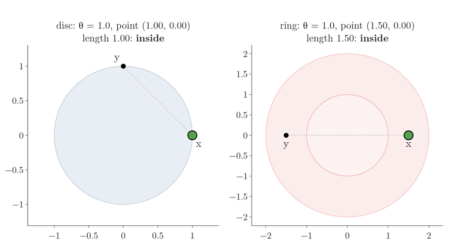
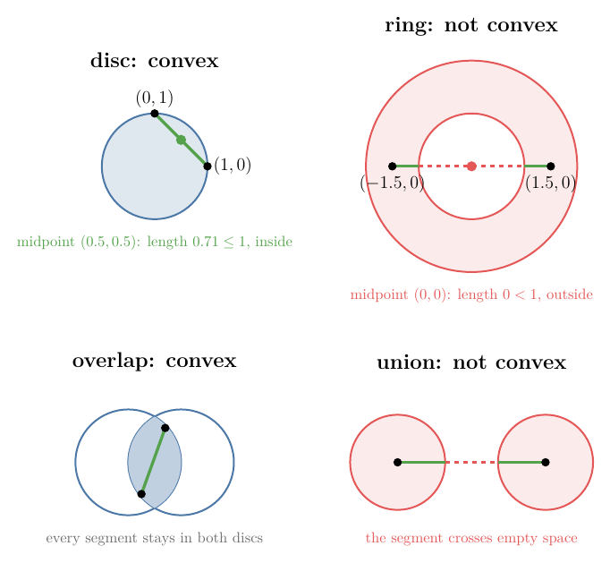
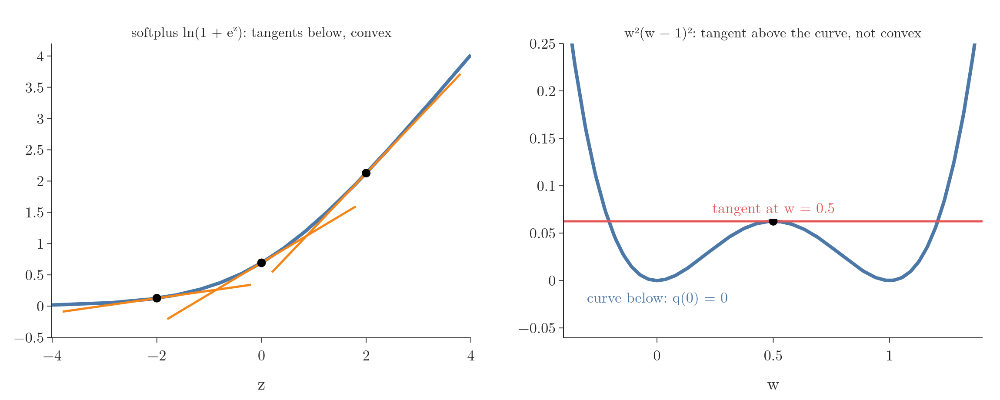
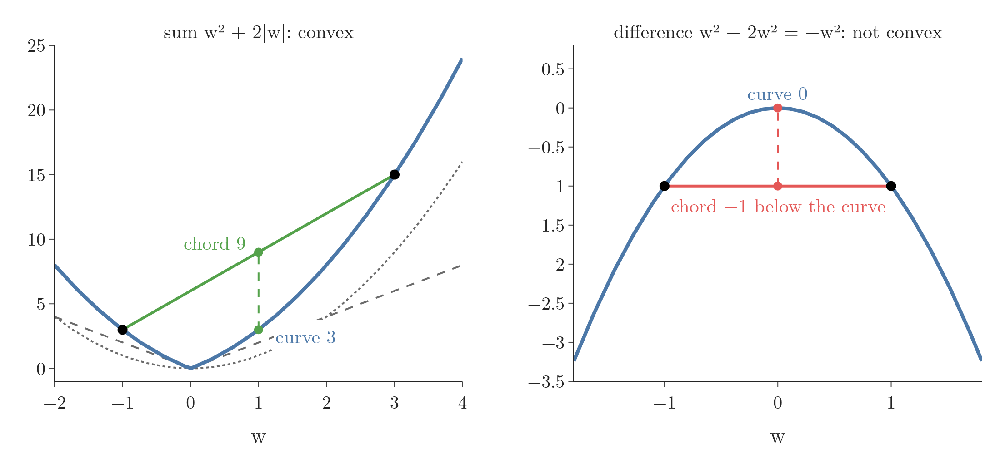

<!-- where-this-fits: generated by course_map/build_map.py; edit concepts.yaml, not this block -->
> **Where this fits:** Pipeline map step 0 (Foundations). See the [Course map](../../../00-course-map/00-course-map.md).
>
> 
>
> - **Builds on:** [Convex and non-convex loss](../../../ML/06-regression/ML-056-gradient-descent/ML-056-gradient-descent.md#8-the-shape-of-the-loss-function-matters); [Lagrange multipliers, KKT and duality](../../../MA/07-optimisation/MA-066-lagrange-multipliers/MA-066-lagrange-multipliers.md#6-lagrangian-duality).
> - **Leads to:** [Linear and quadratic programming](../../../MA/07-optimisation/MA-068-linear-and-quadratic-programming/MA-068-linear-and-quadratic-programming.md#2-linear-programming); [Local minima and saddle points](../../../DL/03-optimizers/DL-032-optimizers-in-deep-learning/DL-032-optimizers-in-deep-learning.md#54-local-minima).
<!-- /where-this-fits -->


## 1. Overview

> **Key point:** A shape is convex when we can walk in a straight line between any two of its points without ever leaving it. A function is convex when it is shaped like a bowl. Minimising a bowl-shaped function over a convex region is a convex optimisation problem: it has no false bottoms, so the first low point we find is the lowest one.

Picture a room. In a plain rectangular room, we can walk in a straight line from any spot to any other spot without touching a wall. In an L-shaped room, some straight walks run into the corner wall. The rectangular room is convex; the L-shaped room is not.

{height=42%}

Figure 1 shows the same idea on flat shapes. In the top row, every straight segment drawn between two points of a shape stays inside the shape. In the bottom row, each shape has a dent or a hole, and one segment (dashed) leaves the shape.

Two Notes prepare this one:

- the [chord test](../MA-065-convex-and-non-convex-cost-functions/MA-065-convex-and-non-convex-cost-functions.md#3-the-chord-test) defined a convex function and showed why gradient descent (the method that repeatedly steps downhill, see [gradient descent](../../../ML/06-regression/ML-056-gradient-descent/ML-056-gradient-descent.md#2-the-idea)) likes them;
- [constrained optimisation problems](../MA-066-lagrange-multipliers/MA-066-lagrange-multipliers.md#2-constrained-optimisation-problems) added constraints, which cut the parameter space down to a feasible region.

This Note puts the two together:

- convex sets, the new ingredient (Section 2);
- convex functions and their link to convex sets (Section 3);
- three practical tests for convex functions: a slope that keeps increasing, tangent lines below the graph, and the Hessian (the table of second derivatives) (Section 4);
- rules for building convex functions (Section 5);
- the convex optimisation problem (Section 6).

## 2. Convex sets

> **Key point:** A set is convex if, for any two points in it, the whole straight segment between them is also in it.

### 2.1 Walking along the segment

> **Key point:** To test a shape, pick two points in it and walk from one to the other in a straight line. If some step of the walk leaves the shape, the shape is not convex.

**The idea in plain words.** A **set** here is just a collection of points, such as all the points of a disc drawn on paper. Pick two points of the set. Walk from the first to the second along the straight segment. If every step of the walk stays inside the set, and this works for every pair of points we could pick, the set is a **convex set** (G-479). One walk that leaves the set is enough to show the set is not convex.



Figure 2 runs the test on two shapes. Watch the moving dot and its colour:

- **Left, the disc** of radius 1, all points whose distance from the centre is at most 1. The walk goes from x = (1, 0) to y = (0, 1). The dot stays green the whole way.
- **Right, the ring** of points whose distance from the centre is between 1 and 2. The walk goes from x = (1.5, 0) to y = (−1.5, 0). The dot turns red as soon as it passes (1, 0) into the hole, and stays red until (−1, 0).

**The mechanism on numbers.** Describe a point of the walk by how far along it is. We use a number $\theta$ (the Greek letter "theta"), between 0 and 1, for the share of the first point $\mathbf x$ in the mix. The walk point is

$$\text{walk point} = \theta\thinspace\mathbf x + (1 - \theta)\thinspace\mathbf y$$

- At $\theta = 1$ the walk point is $\mathbf x$ itself.
- At $\theta = 0$ it is $\mathbf y$.
- At $\theta = 0.5$ it is the midpoint.

Such a mix, with non-negative shares that add up to 1, is a **convex combination** (G-475). It is the same mix the chord test of the [convex and non-convex cost functions](../MA-065-convex-and-non-convex-cost-functions/MA-065-convex-and-non-convex-cost-functions.md#3-the-chord-test) uses.

For the disc, with $\mathbf x = (1, 0)$, $\mathbf y = (0, 1)$ and $\theta = 0.5$:

$$\text{midpoint} = 0.5 \times (1, 0) + 0.5 \times (0, 1)$$

$$= (0.5, 0) + (0, 0.5) = (0.5, 0.5)$$

$$\text{distance from the centre} = \sqrt{0.5^2 + 0.5^2}$$

$$= \sqrt{0.25 + 0.25} = \sqrt{0.5} = 0.71$$

The distance 0.71 is at most 1, so the midpoint is inside the disc.

For the ring, with $\mathbf x = (1.5, 0)$, $\mathbf y = (-1.5, 0)$ and $\theta = 0.5$:

$$\text{midpoint} = 0.5 \times (1.5, 0) + 0.5 \times (-1.5, 0)$$

$$= (0.75, 0) + (-0.75, 0) = (0, 0)$$

$$\text{distance from the centre} = 0$$

The distance 0 is less than 1, so the midpoint is in the hole, outside the ring. One such pair is enough: the ring is not convex.

| Shape | $\mathbf x$ | $\mathbf y$ | midpoint | distance | inside? |
|---|---|---|---|---|---|
| disc (distance at most 1) | (1, 0) | (0, 1) | (0.5, 0.5) | 0.71 | yes |
| ring (distance from 1 to 2) | (1.5, 0) | (−1.5, 0) | (0, 0) | 0 | no |

**The formal version.** Two symbols first:

- a bold letter such as $\mathbf x$ is a point given by its coordinates, for example $\mathbf x = (1, 0)$;
- the sign $\in$ means "belongs to". For the disc $C$, $(0.5, 0.5) \in C$ says "the point (0.5, 0.5) belongs to the disc".

A set $C$ is a convex set if, for all points $\mathbf x \in C$ and $\mathbf y \in C$, and every share $\theta$ with $0 \le \theta \le 1$,

$$\theta\mathbf{x} + (1 - \theta)\mathbf{y} \in C$$

(MML §7.3; Boyd and Vandenberghe §2.1.4). Check against the numbers: for the disc, $\theta = 0.5$ gives $(0.5, 0.5) \in C$, as computed above; for the ring, $\theta = 0.5$ gives $(0, 0)$, which is not in the ring.

{height=45%}

Figure 3 is a still summary. The top row repeats the two walks of Figure 2 with their midpoints. The bottom row shows the two ways of combining sets from Section 2.2. In every panel, look at the red dashed part: one segment leaving the set is enough to make it non-convex.

Informally, a convex set has no dents and no holes (Figure 1). Common convex sets in ML:

- **a line, a plane or a hyperplane** (G-911) (see the [equation of a hyperplane](../../05-linear-algebra/MA-051-equation-of-a-hyperplane/MA-051-equation-of-a-hyperplane.md#3-from-a-line-to-a-hyperplane)), the set where a linear equation holds;
- **a half-space**, one side of a hyperplane, such as all points with $x + y \ge 3$ in the [Lagrange multipliers](../MA-066-lagrange-multipliers/MA-066-lagrange-multipliers.md#2-constrained-optimisation-problems);
- **a box**, such as all points whose every coordinate lies between −1 and 1;
- **a ball**, all weight vectors $\mathbf w$ of length at most a limit $t$: the Ridge constraint. The diamond, where the absolute values of the weights add up to at most $t$, is the Lasso constraint.

### 2.2 Combining convex sets

> **Key point:** The overlap (intersection) of convex sets is convex; their union usually is not.

**In plain words.** Look at the bottom row of Figure 3. On the left, two discs overlap in a lens shape. Take two points of the lens. The segment between them stays in the first disc, because that disc is convex. It also stays in the second disc, for the same reason. So it stays in both discs at once, which is the lens. The overlap of two sets is their **intersection** (G-967), and the argument works for any number of convex sets.

On the right, two separate discs together form their **union** (G-2045). A walk from one disc to the other crosses empty space (red dashed), so a union does not keep convexity.

The overlap rule is why a feasible region made of many convex constraints is convex: the region is the overlap of one convex set per constraint. A box in two dimensions, for example, is the overlap of four half-spaces:

| Constraint | Half-space |
|---|---|
| 1 | $x \ge -1$ |
| 2 | $x \le 1$ |
| 3 | $y \ge -1$ |
| 4 | $y \le 1$ |

In $n$ dimensions the same box is the overlap of $2n$ half-spaces.

> **Extra:** The set where a convex function $g$ stays at or below a level $c$ is always convex (Boyd and Vandenberghe §3.1.6). For example, with $g(x, y) = x^2 + y^2$, so that $g(0.5, 0.5) = 0.5$, and the level $c = 1$, the set of points with $g(x, y) \le 1$ is the disc of Figure 2. The level-set rule is why convex optimisation asks for convex functions $g_i$ in its inequality constraints, written $g_i(\mathbf{x}) \le 0$ (Section 6): each constraint then cuts out a convex set. The set where a convex function is exactly equal to a level is not convex in general. The circle $x^2 + y^2 = 1$ is the edge of the disc only: its points (1, 0) and (0, 1) have the midpoint (0.5, 0.5), at distance 0.71, off the circle. That is why equality constraints must be linear.

## 3. Convex functions and their sets

> **Key point:** A function is convex when it is shaped like a bowl: a string stretched between any two points of its graph never dips below the graph. Equivalently, the region above its graph is a convex set.

**The idea in plain words.** Draw the graph of a function. Pick two points on the graph and stretch a straight string between them. This string is a **chord** (G-384). For a bowl, every string lies on or above the bowl. For a curve with a hump, a string stretched across the hump passes under it. A function whose every chord lies on or above its graph is a **convex function** (G-476).


Figure 4 slides and stretches a chord over two graphs. Watch for red:

- on the left graph, the chord stays green wherever its two ends are placed;
- on the right graph, the chord turns red when it spans the hump in the middle. One chord below the graph is enough to break convexity.

**Worked example on numbers.** Take the bowl $f(w) = w^2$, so that $f(3) = 9$. Pick the two ends $a = -1$ and $b = 3$ and look halfway, at $\theta = 0.5$:

$$\text{mid input} = 0.5 \times (-1) + 0.5 \times 3 = 1$$

$$\text{curve at the mid input} = f(1) = 1^2 = 1$$

$$\text{chord at the mid input} = 0.5 \times f(-1) + 0.5 \times f(3)$$

$$= 0.5 \times 1 + 0.5 \times 9 = 5$$

The chord (5) is above the curve (1). Now the hump function of Figure 4, right:

$$q(w) = w^2(w - 1)^2$$

$$q(0.5) = 0.25 \times 0.25 = 0.0625$$

With the ends $a = 0$ and $b = 1$:

$$\text{curve at } 0.5 = q(0.5) = 0.0625$$

$$\text{chord at } 0.5 = 0.5 \times q(0) + 0.5 \times q(1)$$

$$= 0.5 \times 0 + 0.5 \times 0 = 0$$

The chord (0) is below the curve (0.0625): $q$ is not convex.

**The formal version.** A function $f$ is convex if, for all inputs $\mathbf a$ and $\mathbf b$ and every share $\theta$ with $0 \le \theta \le 1$,

$$f\big(\theta\mathbf{a} + (1 - \theta)\mathbf{b}\big)$$

$$\le\thickspace\theta f(\mathbf{a}) + (1 - \theta) f(\mathbf{b})$$

- left side: the curve at the mixed input;
- right side: the chord at the same input.

Check: for $f(w) = w^2$, $a = -1$, $b = 3$, $\theta = 0.5$, the left side is 1 and the right side is 5, and $1 \le 5$. The definition comes from the [convex and non-convex cost functions](../MA-065-convex-and-non-convex-cost-functions/MA-065-convex-and-non-convex-cost-functions.md#31-the-definition-as-a-formula). One condition was left implicit there: the **domain** (G-632) of $f$, the set of inputs where $f$ is defined, must itself be a convex set, so that the mixed input $\theta\mathbf{a} + (1 - \theta)\mathbf{b}$ is somewhere $f$ is defined (Boyd and Vandenberghe §3.1.1).

A **strictly convex function** (G-1899) is one whose curve lies strictly below every chord between two different points, as $w^2$ does (1 is strictly less than 5). It has at most one minimum, which is why a strictly convex loss leaves gradient descent nowhere to get stuck.

**Two related ideas.**

- **Concave function** (G-438): the negative of a convex function, an upside-down bowl. Every chord lies on or below the graph. The natural logarithm ($\ln$) is concave. So is the dual function of the [Lagrange multipliers](../MA-066-lagrange-multipliers/MA-066-lagrange-multipliers.md#61-the-dual-function-and-the-dual-problem),
  $$D(\lambda) = 3\lambda - \frac{3\lambda^2}{8}$$

  $$D(4) = 3 \times 4 - \frac{3 \times 16}{8}$$

  $$D(4) = 12 - 6 = 6$$
  Maximising a concave function is the same task as minimising a convex one.
- **Epigraph** (G-695): the region on and above the graph of $f$, as if the bowl were filled with water. A function is convex exactly when its epigraph is a convex set (Boyd and Vandenberghe §3.1.7).


Figure 5 shows why the two statements say the same thing. The two black dots of each panel lie on the graph, so they belong to the shaded region. On the left, the segment between them is the chord of $w^2$ from −1 to 2, which stays above the curve and therefore inside the region. On the right, the segment is the chord of $q$ from 0 to 1, at height 0. Under the hump the curve is higher (0.0625 at the middle), so the segment leaves the region, and the region fails the segment test of Section 2.1. A chord below the graph and a segment that leaves the epigraph are the same event: convex functions are convex sets seen from above.

> **Extra:** The defining inequality is the two-point case of **Jensen's inequality** (G-982). With more points and weights $\theta_i \ge 0$ that add up to 1, a convex $f$ satisfies
> $$f\Big(\sum_i \theta_i \mathbf x_i\Big) \le \sum_i \theta_i f(\mathbf x_i)$$
> The sign $\sum_i$ means "add up over all $i$". In words: the function of an average is at most the average of the function. For $f(x) = x^2$ and the points 0, 1, 2 with equal weights $\tfrac13$:
> $$\text{function of the average} = f(1) = 1$$
> $$\text{average of the function} = \frac{0 + 1 + 4}{3} = 1.67$$
> and $1 \le 1.67$. With probabilities as weights, Jensen's inequality reads $f(E[X]) \le E[f(X)]$ (see the [expected value and variance](../../02-probability/MA-012-expected-value-and-variance/MA-012-expected-value-and-variance.md#3-expected-value)). For $f(x) = x^2$ it says
> $$E[X^2] - (E[X])^2 \ge 0$$
> that is, a variance is never negative.

## 4. Testing convexity with derivatives

> **Key point:** Checking every chord is impossible. When the function has derivatives, three shortcuts replace the chord test: the slope never decreases, every tangent lies below the graph, and (in several variables) the function curves upwards in every direction.

### 4.1 Curving up: the slope keeps increasing

> **Key point:** Where a curve bends upwards like a cup, its slope is increasing, so its second derivative is at least 0. A convex function bends upwards everywhere.

Walk along a curve from left to right and watch its slope.

1. **In words:** on a cup-shaped part, the slope starts negative, rises through 0 at the bottom, and keeps rising. On a hump-shaped part, the slope does the opposite: it falls from positive through 0 to negative. A rising slope means the derivative of the slope, the **second derivative** (G-2249), is positive.
2. **The terms:** calculus books call a cup-shaped part **concave up** and a hump-shaped part **concave down** (G-2256). Concave up is the same as convex, and concave down is the same as concave. The two names describe one shape, so they never disagree: the chord test of Section 3 and the rising slope of this section pick out exactly the same functions, for any function with a second derivative (Boyd and Vandenberghe §3.1.4).
3. **Example:** the hump function $q(w) = w^2(w - 1)^2$ of Figure 4, with $q(0.5) = 0.0625$. Its slope and second derivative are
   $$q'(w) = 2w(w - 1)(2w - 1)$$
   $$q''(w) = 12w^2 - 12w + 2$$
   - $q''$ is 0 at $w = 0.211$ and $w = 0.789$, the **inflection points** (G-945) where the bending changes direction.
   - Outside them $q''$ is positive: $q$ curves up, convex there.
   - Between them $q''$ is negative. At $w = 0.5$:
     $$q''(0.5) = 12 \times 0.25 - 12 \times 0.5 + 2$$
     $$= 3 - 6 + 2 = -1$$
     so $q$ curves down there.
   - One stretch with a negative $q''$ is enough: $q$ is not convex, as the chord test found.


In Figure 6, watch the tangent line and the middle graph together. In the green parts the tangent turns anticlockwise and $q'$ climbs; in the red part the tangent turns clockwise and $q'$ falls.

**The second derivative test.** At a point $c$ where the tangent is flat, the slope $f'(c)$ is 0. Then:

| Second derivative at $c$ | Shape at $c$ | Conclusion |
|---|---|---|
| $f''(c) > 0$ | a cup | local minimum |
| $f''(c) < 0$ | a hump | local maximum |
| $f''(c) = 0$ | unclear | the test says nothing |

This is the **second derivative test** (G-2257). For $q$, the three flat points:

| $w$ | $q'(w)$ | $q''(w)$ | Result |
|---|---|---|---|
| 0 | 0 | 2 | minimum |
| 0.5 | 0 | −1 | maximum |
| 1 | 0 | 2 | minimum |

**The one-variable condition.** A function with a second derivative is convex exactly when $f''(x) \ge 0$ for every $x$: it curves up, or stays straight, everywhere. Then every flat point passes the second derivative test as a minimum, never a maximum.

**Example: softplus.** The **softplus** (G-1834) function is

$$f(z) = \ln(1 + e^z)$$

$$f(0) = \ln 2 = 0.693$$

Here $\ln$ is the natural logarithm and $e \approx 2.718$.

- Its derivative is the [sigmoid](../../../ML/07-classification/ML-071-sigmoid-function/ML-071-sigmoid-function.md#4-the-sigmoid-function) $\sigma(z)$, with $\sigma(0) = 0.5$: a slope that rises steadily from 0 to 1.
- Its second derivative is the sigmoid's derivative (see the [sigmoid derivative](../../../ML/07-classification/ML-073-sigmoid-derivative/ML-073-sigmoid-derivative.md#33-the-result)):
  $$f''(z) = \sigma(z)\big(1 - \sigma(z)\big)$$
- Both factors lie between 0 and 1, so $f''(z) > 0$ everywhere: softplus is convex.
- At $z = 0$:
  $$f''(0) = 0.5 \times (1 - 0.5) = 0.25$$

### 4.2 First-order condition: tangents lie below

> **Key point:** A function is convex exactly when the tangent line (or plane) at any point never rises above the graph.

**The idea in plain words.** Put a ruler against a bowl so that it just touches the bowl at one point. That ruler is the **tangent line** (G-1945). On a bowl, the ruler stays under the bowl everywhere else. On a curve with a hump, a ruler laid on top of the hump floats above the curve on both sides.



Figure 7 shows both cases. On the left, three orange tangents of softplus each stay below the blue curve. On the right, the red tangent of $q$ at the top of the hump is flat at height 0.0625, and the curve drops below it near $w = 0$ and $w = 1$. The test that every tangent lies on or below the graph is the **first-order condition** (G-781).

**Worked example on numbers.** Softplus at $z = 0$ has value 0.693 and slope $\sigma(0) = 0.5$ (Section 4.1). The tangent at 0 predicts, at any other input $y$:

$$\text{tangent}(y) = \text{value at 0} + \text{slope at 0} \times (y - 0)$$

At $y = 2$:

$$\text{tangent}(2) = 0.693 + 0.5 \times (2 - 0)$$

$$= 0.693 + 1 = 1.69$$

$$\text{curve}(2) = \ln(1 + e^2) = \ln(8.39) = 2.13$$

The curve (2.13) is above the tangent (1.69). For $q$ at the top of the hump, the tangent is flat at 0.0625, but $q(0) = 0$ lies below it: the test fails.

**The formal version.** In several variables the slope becomes the **gradient** $\nabla f(\mathbf x)$, the row of partial derivatives (see the [partial derivatives and gradients](../../06-calculus/MA-062-partial-derivatives-and-gradients/MA-062-partial-derivatives-and-gradients.md#4-the-gradient)). For example, $f(x, y) = x^2 + y^2$ has $\nabla f = (2x, 2y)$, so $\nabla f(1, 2) = (2, 4)$. A differentiable $f$ is convex if and only if, for all $\mathbf{x}$ and $\mathbf{y}$ (Boyd and Vandenberghe §3.1.3),

$$f(\mathbf{y}) \thickspace\ge\thickspace f(\mathbf{x}) + \nabla f(\mathbf{x})\thinspace(\mathbf{y} - \mathbf{x})$$

- left side: the curve at $\mathbf y$;
- right side: the **tangent plane** (G-1946) at $\mathbf x$, evaluated at $\mathbf y$. It is the first-order Taylor approximation of the [Hessian and multivariate Taylor](../../06-calculus/MA-064-hessian-and-multivariate-taylor/MA-064-hessian-and-multivariate-taylor.md#3-linearisation-the-tangent-plane).

Check with softplus, $\mathbf x = 0$, $\mathbf y = 2$: the left side is 2.13, the right side 1.69, and $2.13 \ge 1.69$.

The tangent test and the rising slope of Section 4.1 are one fact seen twice. If the slope never decreases, the curve to the right of a point rises at least as fast as the tangent there, and the curve to the left falls at least as fast, so the tangent can only stay below (Boyd and Vandenberghe §3.1.3).

**Why this matters: zero gradient means the best answer.** Suppose the gradient at a point $\mathbf x^\ast$ is zero. Put that into the first-order condition, one step at a time:

$$f(\mathbf{y}) \ge f(\mathbf{x}^\ast) + \nabla f(\mathbf{x}^\ast)\thinspace(\mathbf{y} - \mathbf{x}^\ast)$$

$$f(\mathbf{y}) \ge f(\mathbf{x}^\ast) + \mathbf 0\thinspace(\mathbf{y} - \mathbf{x}^\ast)$$

$$f(\mathbf{y}) \ge f(\mathbf{x}^\ast) \quad \text{for every } \mathbf y$$

So for a convex function, any point with zero gradient is a **global minimum** (G-848). Gradient descent stops at zero gradient, so on a convex function it stops at the best answer.

> **Extra:** Softplus is the [log loss](../../../ML/07-classification/ML-072-log-loss/ML-072-log-loss.md#62-the-loss-function) in disguise. For an **observation** (one record, a row of the data table) with score $z$:
> $$\text{label 0:} \quad -\ln\big(1 - \sigma(z)\big) = \ln(1 + e^{z})$$
> $$\text{label 1:} \quad -\ln \sigma(z) = \ln(1 + e^{-z})$$
> Both are convex in $z$, and the score $z = \mathbf{w}^{\mathsf T}\mathbf{x}$ is linear in the weights. A convex function of a linear function is convex (Boyd and Vandenberghe §3.2.2), so the loss of logistic regression is convex in $\mathbf{w}$: gradient descent on it reaches the global minimum.

### 4.3 Second-order condition in several variables

> **Key point:** With two or more inputs, a function is convex when it curves upwards along every straight direction we can walk, at every point.

**The idea in plain words.** A bowl curves up whichever way we walk out of its bottom: east, north or diagonally. A saddle (the shape of a horse's saddle or a crisp) curves up along one direction and down along another. One downward direction is enough to make a chord dip below the surface, so a saddle is not convex.


Figure 8 shows two functions of two inputs, first as surfaces (top row) and then as **contour maps** (bottom row; see the [partial derivatives and gradients](../../06-calculus/MA-062-partial-derivatives-and-gradients/MA-062-partial-derivatives-and-gradients.md#11-reading-a-contour-map)). A contour map is the surface seen from above: each line joins points of the same height, as on a hiking map.

$$f_1(x, y) = x^2 + xy + y^2$$

$$f_1(1, 1) = 3$$

$$f_2(x, y) = x^2 + 3xy + y^2$$

$$f_2(1, 1) = 5$$

On the left, the surface of $f_1$ is a bowl, and from above its contours are closed ellipses around the bottom (the centre ring is the lowest point; rings close together mean a steep wall). The surface is drawn up to height 8 only, so the tall corners do not hide the bottom. On the right, the surface of $f_2$ curves up in one direction and down in the other, and from above its contours open out: a saddle. Each arrow is a direction, labelled with how strongly the function curves along it. Watch the sign of each label: along the arrow labelled −1, the saddle curves down, and that one direction is enough to break convexity.

**The standard term.** The curvature in every direction is collected in the **Hessian matrix** (G-888), the table of all second partial derivatives (see the [Hessian and multivariate Taylor](../../06-calculus/MA-064-hessian-and-multivariate-taylor/MA-064-hessian-and-multivariate-taylor.md#53-curvature-what-the-hessian-says-about-the-shape)). The arrows of Figure 8 are its **eigenvectors** (G-666; directions the matrix only stretches, see [the vectors that do not turn](../../../ML/05-dimensionality/ML-047-pca-step-by-step/ML-047-pca-step-by-step.md#42-the-vectors-that-do-not-turn)), and their labels are its **eigenvalues** (G-665; the stretch factors): the curvature along each arrow. A symmetric matrix with no negative eigenvalues is **positive semi-definite** (G-1532) (see the [SVD geometry](../../05-linear-algebra/MA-057-svd-geometry/MA-057-svd-geometry.md#7-svd-and-eigen-decomposition-compared)). The test that the Hessian is positive semi-definite at every point is the **second-order condition** (G-1761).

**Worked example on numbers.** For $f_1(x, y) = x^2 + xy + y^2$, the second partial derivatives are:

| Second derivative | Value |
|---|---|
| twice in $x$ | 2 |
| once in $x$, once in $y$ | 1 |
| twice in $y$ | 2 |

They fill the Hessian, and the same steps for $f_2$ give:

| Function | Hessian | Eigenvalues | Convex? |
|---|---|---|---|
| $x^2 + xy + y^2$ | $\begin{bmatrix} 2 & 1 \cr1 & 2 \end{bmatrix}$ | $1$ and $3$ | yes: a bowl |
| $x^2 + 3xy + y^2$ | $\begin{bmatrix} 2 & 3 \cr3 & 2 \end{bmatrix}$ | $5$ and $-1$ | no: a saddle |

For quadratics the Hessian is the same at every point, so one check covers the whole function. The chord test agrees with the table. For $f_2$, take the points $(1, -1)$ and $(-1, 1)$:

$$f_2(1, -1) = 1 - 3 + 1 = -1$$

$$f_2(-1, 1) = 1 - 3 + 1 = -1$$

$$\text{chord at the midpoint} = 0.5 \times (-1) + 0.5 \times (-1)$$

$$= -1$$

$$\text{curve at the midpoint} = f_2(0, 0) = 0$$

The chord (−1) is below the curve (0): $f_2$ is not convex.

**The formal version.** The Hessian of $f$ at $\mathbf x$ is written $\nabla^2 f(\mathbf{x})$; for $f_1$ it is the matrix with rows $[2, 1]$ and $[1, 2]$ at every point. A twice-differentiable $f$ is convex if and only if (Boyd and Vandenberghe §3.1.4)

$$\nabla^2 f(\mathbf{x}) \text{ is positive semi-definite for every } \mathbf{x}$$

In one variable the Hessian is the single number $f''(x)$, and the condition becomes $f''(x) \ge 0$ for every $x$, the condition of Section 4.1. Check: softplus has $f''(z) > 0$ everywhere, and $f_1$ has eigenvalues 1 and 3, both non-negative.

> **Python:** the eigenvalue check in NumPy. `eigvalsh` is meant for symmetric matrices such as Hessians and returns the eigenvalues in increasing order.
>
> ```python
> import numpy as np
>
> H1 = np.array([[2, 1], [1, 2]])
> H2 = np.array([[2, 3], [3, 2]])
> np.linalg.eigvalsh(H1)   # [1. 3.]  all >= 0: convex
> np.linalg.eigvalsh(H2)   # [-1. 5.] one < 0: not convex
> ```

## 5. Building convex functions

> **Key point:** Adding bowls gives a bowl. Adding convex functions, or scaling them by non-negative numbers, keeps them convex; this is why "convex loss plus convex penalty" is convex.

**The idea in plain words.** In practice we rarely test a function from scratch. We build it from pieces already known to be convex, using rules that keep convexity. The main rule: stack one bowl on top of another and the result is still a bowl. Subtracting a bowl, though, can turn the result upside down.



Figure 9 puts the rule and its failure side by side. Watch where the chord sits: above the curve for the sum on the left, below it for the difference on the right.

**Worked example on numbers.** Take two convex pieces and add them, with weight 1 on the first and weight 2 on the second:

$$f_1(w) = w^2$$

$$f_2(w) = |w|$$

$$g(w) = f_1(w) + 2 f_2(w) = w^2 + 2|w|$$

$$g(3) = 9 + 6 = 15$$

Chord test between $a = -1$ and $b = 3$, at the midpoint 1:

$$g(-1) = 1 + 2 = 3$$

$$g(3) = 9 + 6 = 15$$

$$\text{curve at 1} = g(1) = 1 + 2 = 3$$

$$\text{chord at 1} = 0.5 \times 3 + 0.5 \times 15 = 9$$

The chord (9) is above the curve (3), as Figure 9 (left) shows.

**The formal version: non-negative weighted sums.** If $f_1$ and $f_2$ are convex and the weights $\alpha$ and $\beta$ are both at least 0, then

$$\alpha f_1 + \beta f_2 \text{ is convex}$$

(Boyd and Vandenberghe §3.2.1). The proof has three steps:

1. write the chord inequality of Section 3 for $f_1$, and again for $f_2$;
2. multiply the first by $\alpha$ and the second by $\beta$; non-negative weights keep the direction of $\le$;
3. add the two inequalities; the result is the chord inequality for $\alpha f_1 + \beta f_2$.

Check: with $\alpha = 1$ and $\beta = 2$, the rule says $w^2 + 2|w|$ is convex, as the numbers above found.

This rule covers the regularised losses of earlier Notes:

- **Ridge:** squared error plus a penalty $\alpha$ times the sum of squared weights (see the [Ridge regression maths](../../../ML/06-regression/ML-063-ridge-regression-maths/ML-063-ridge-regression-maths.md#3-many-features)): convex plus convex.
- **Lasso:** squared error plus a penalty $\alpha$ times the sum of absolute weights (see the [Lasso regression](../../../ML/06-regression/ML-066-lasso-regression/ML-066-lasso-regression.md#7-why-coefficients-reach-exactly-0)): convex plus convex, even though $|w|$ has a corner.
- **Regularised logistic regression:** log loss plus a penalty: convex plus convex.

**What does not keep convexity.** A difference or a product of convex functions can fail:

- **Difference:** $w^2$ and $2w^2$ are convex, but
  $$w^2 - 2w^2 = -w^2$$
  is an upside-down bowl (Figure 9, right).
- **Product:** $w^2$ and $(w - 1)^2$ are convex, but their product is the hump function $q(w) = w^2(w - 1)^2$ of Figures 4 and 7. Its chord from 0 to 1 is at height 0, while the curve at 0.5 is 0.0625 (Section 3).

> **Extra:** One more rule: the pointwise **maximum** of convex functions is convex (Boyd and Vandenberghe §3.2.3). The **hinge loss** (G-898) of the [SVM soft margin](../../../ML/07-classification/ML-088-svm-soft-margin/ML-088-svm-soft-margin.md#5-the-soft-margin-loss),
> $$\text{hinge}(z) = \max(0,\ 1 - z)$$
>
> $$\text{hinge}(0.4) = 0.6$$
> is the larger of two straight lines, so it is convex. With the convex penalty $\tfrac12\lVert \mathbf{w} \rVert^2$ (half the squared length of the weight vector), the soft-margin SVM is a convex problem.

## 6. Convex optimisation problems

> **Key point:** Looking for the lowest point of a bowl inside a convex fenced region is a convex optimisation problem: every local minimum is global, and the dual gives the same answer as the primal.

### 6.1 The definition

> **Key point:** The function we minimise must be a bowl, every "at most" constraint must be built from a convex function, and every "exactly equal" constraint must be a straight line or plane.

**The idea in plain words.** Picture a bowl-shaped valley, and a fence that marks where we are allowed to stand. We want the lowest allowed spot. If the valley is a bowl and the allowed region is convex (no dents, no holes), then walking downhill inside the region can never trap us in a false bottom: any walk towards a lower spot stays inside the fence.


**Worked example.** The problem of the [Lagrange multipliers](../MA-066-lagrange-multipliers/MA-066-lagrange-multipliers.md#2-constrained-optimisation-problems), drawn in Figure 10 (left and middle). The function $x^2 + 2y^2$ is the bowl of the Lagrange multipliers Note: its surface is on the left, the same bowl seen from above is the contour map in the middle, with the same colours and the same red point (2, 1):

$$\text{minimise } f(x, y) = x^2 + 2y^2$$

$$f(2, 1) = 4 + 2 = 6$$

$$\text{subject to } x + y \ge 3$$

Check the two ingredients:

| Ingredient | Here | Convex? |
|---|---|---|
| the valley $f$ | $x^2 + 2y^2$, Hessian with eigenvalues 2 and 4 | yes (Section 4.3) |
| the fence | $x + y \ge 3$, a half-space (green) | yes (Section 2.1) |

So the problem is a convex optimisation problem. Its lowest allowed point is (2, 1), with value 6.

**The formal version.** The standard form writes every "at most" constraint as $g_i(\mathbf{x}) \le 0$ and every "exactly" constraint as $h_j(\mathbf{x}) = 0$, where $i$ and $j$ count the constraints:

$$\min_{\mathbf{x}} f(\mathbf{x})$$

$$\text{subject to } g_i(\mathbf{x}) \le 0$$

$$\text{and } h_j(\mathbf{x}) = 0$$

The problem is a **convex optimisation problem** (G-478) when (MML §7.3; Boyd and Vandenberghe §4.2.1):

- $f$ and every $g_i$ are convex functions;
- every $h_j$ is **affine** (a straight line or plane, linear plus a constant): $h_j(\mathbf{x}) = \mathbf a_j^{\mathsf T}\mathbf{x} - b_j$.

Then the **feasible region** (G-759), the set of allowed points, is a convex set (Section 2.2). Check with the example: the constraint $x + y \ge 3$ becomes

$$g_1(x, y) = 3 - x - y \le 0$$

$$g_1(2, 1) = 0$$

and $g_1$ is linear, hence convex. There are no equality constraints.

### 6.2 What convexity guarantees

> **Key point:** No local-minimum traps, a zero-gradient (or KKT) point is the answer, and the dual reaches the same value as the primal.

For a convex optimisation problem:

- **Every local minimum is a global minimum.** The argument of the [convex and non-convex cost functions](../MA-065-convex-and-non-convex-cost-functions/MA-065-convex-and-non-convex-cost-functions.md#32-why-convexity-matters-one-minimum) works inside a convex feasible region too, because the segment towards a lower point stays feasible.
- **The first-order conditions are enough.** Without constraints, a point with zero gradient is the answer (Section 4.2). With constraints, a point that satisfies the **KKT conditions** (G-1013) of the [Lagrange multipliers](../MA-066-lagrange-multipliers/MA-066-lagrange-multipliers.md#5-inequality-constraints) is the answer.
- **Strong duality** (G-1903). The primal problem is the original minimisation; the dual problem maximises the dual function built with the Lagrange multipliers (see [the dual function and the dual problem](../MA-066-lagrange-multipliers/MA-066-lagrange-multipliers.md#61-the-dual-function-and-the-dual-problem)). The maximum of the dual function equals the primal minimum. In the example:
  $$\text{primal minimum} = f(2, 1) = 6$$
  $$\text{dual maximum} = D(4)$$
  $$D(4) = 3 \times 4 - \frac{3 \times 16}{8}$$
  $$D(4) = 12 - 6 = 6$$

Figure 10 shows the example from both sides. Watch the marked points: the lowest feasible point (the red dot on the surface, the star on the contour map) and the top of the dual (the star on the right) sit at the same height, 6.

> **Extra:** Strong duality for a convex problem needs one mild extra condition, **Slater's condition** (G-1821): at least one point satisfies every inequality constraint strictly. For the example, the point (3, 3) gives
> $$g_1(3, 3) = 3 - 3 - 3 = -3 < 0$$
> so the condition holds (Boyd and Vandenberghe §5.2.3).
>
> When every constraint is linear, as in the SVM, the condition is even milder: it only asks that some point satisfies all the constraints (Boyd and Vandenberghe §5.2.3, p. 227). So for linear-constraint problems such as the SVM, strong duality holds as soon as the feasible region has at least one point.

### 6.3 Which ML problems are convex

> **Key point:** The classical linear models are convex problems; trees, clustering and neural networks are not.

| Problem | Convex? | Why |
|---|---|---|
| [Linear regression](../../../ML/06-regression/ML-052-multiple-linear-regression/ML-052-multiple-linear-regression.md#3-the-equation), squared error | yes | Hessian $2X^{\mathsf T}X$ is positive semi-definite |
| [Ridge](../../../ML/06-regression/ML-063-ridge-regression-maths/ML-063-ridge-regression-maths.md#3-many-features), [Lasso](../../../ML/06-regression/ML-066-lasso-regression/ML-066-lasso-regression.md#7-why-coefficients-reach-exactly-0), [Elastic Net](../../../ML/06-regression/ML-068-elastic-net/ML-068-elastic-net.md#2-the-loss-function) | yes | convex loss plus convex penalty |
| [Logistic regression](../../../ML/07-classification/ML-074-logistic-gradient-descent/ML-074-logistic-gradient-descent.md#4-the-loss-in-matrix-form) | yes | log loss is softplus of a linear score |
| [SVM](../../../ML/07-classification/ML-088-svm-soft-margin/ML-088-svm-soft-margin.md#5-the-soft-margin-loss) (hard and soft margin) | yes | convex objective, linear constraints (a quadratic program) |
| [K-means](../../../ML/09-clustering-and-more/ML-122-kmeans-intuition/ML-122-kmeans-intuition.md#4-the-five-steps-of-k-means) | no | the result depends on the starting centroids |
| Neural networks | no | many minima and saddle points (Goodfellow et al. §8.2) |

In the first row, $X$ is the data matrix (one row per observation) and $X^{\mathsf T}$ its transpose. For the convex ones, the answer does not depend on the starting point or the solver, only on the data and the hyperparameters. The two best-known families of convex problems, linear and quadratic programs, are the topic of the [linear and quadratic programming](../MA-068-linear-and-quadratic-programming/MA-068-linear-and-quadratic-programming.md#1-overview).

## 7. Summary

| Idea | Test | Example | Why it matters |
|---|---|---|---|
| Convex set | every segment between two points stays inside | disc yes, ring no | a walk towards a better point never leaves the allowed region |
| Convex function | chord on or above the graph | $w^2$ yes, $w^2(w - 1)^2$ no | a bowl has no false bottoms |
| Epigraph | the region above the graph is a convex set | same answers as the chord test | a chord below the graph and a segment leaving the epigraph are the same event |
| Rising slope | $f'' \ge 0$ everywhere (one variable) | $q''(0.5) = -1$: not convex | every flat point is then a minimum, never a maximum |
| First-order test | tangent on or below the graph | softplus: $2.13 \ge 1.69$ | it proves that zero gradient means global minimum |
| Second-order test | Hessian positive semi-definite everywhere | eigenvalues $1, 3$ yes; $5, -1$ no | one downward direction makes a saddle, which breaks convexity |
| Building rules | non-negative sums and maximums keep convexity | Ridge, Lasso, hinge loss | a loss built from convex pieces needs no new test |
| Convex problem | convex $f$ and $g_i$, affine $h_j$ | Lagrange Note example | every local minimum is then global |

- Overlaps of convex sets are convex, so convex constraints give a convex feasible region.
- For a convex function, zero gradient means global minimum, so gradient descent stops at the best answer.
- Convex problems have no local-minimum traps and satisfy strong duality (under Slater's condition, which linear constraints such as the SVM's meet whenever some point is allowed), so the answer does not depend on the starting point or the solver.
- This is the answer to the opening question: minimising a bowl over a convex region has no false bottoms, so the first low point found is the lowest one.

## 8. Sources

**Built from**

- CampusX, "Difference between convex & non-convex cost function; what happens when cost function is non-convex?", YouTube, https://www.youtube.com/watch?v=TXVtbgaEyms
- Khan Academy (Khan, S.), "Concavity introduction", YouTube, https://www.youtube.com/watch?v=LcEqOzNov4E
- Khan Academy (Khan, S.), "Second derivative test", YouTube, https://www.youtube.com/watch?v=-cW5hCsc9Yc
- Deisenroth, M. P., Faisal, A. A. and Ong, C. S. (2020). *Mathematics for Machine Learning*. Cambridge University Press. Section 7.3 (MML): convex sets, convex functions and convex optimisation problems, which no video in the list covers.
- Boyd, S. and Vandenberghe, L. (2004). *Convex Optimization*. Cambridge University Press. Sections 2.1 (convex sets), 3.1–3.2 (convex functions, the first- and second-order conditions, the epigraph, and the operations that keep convexity), 4.2 (convex optimisation problems) and 5.2.3 (Slater's condition, and on p. 227 its milder form when every constraint is linear).

**Other references**

- Goodfellow, I., Bengio, Y. and Courville, A. (2016). *Deep Learning*. MIT Press. Section 8.2, challenges in neural network optimisation.

## 9. Key terms

| Term | Meaning |
|---|---|
| Convex set | A set that contains the whole segment between any two of its points |
| Convex combination | A mix $\theta\mathbf x + (1 - \theta)\mathbf y$ with $0 \le \theta \le 1$: a point on the segment between $\mathbf x$ and $\mathbf y$ |
| Concave function | A function shaped like an upside-down bowl, the negative of a convex function: every chord lies on or below its graph, as for $\ln x$. Maximising a concave function is the same task as minimising a convex one. |
| Epigraph | The region on and above a function's graph; convex exactly when the function is convex |
| Jensen's inequality | For a convex function, the function of a weighted average is at most the weighted average of the function |
| Softplus | The function $\ln(1 + e^z)$, a smooth convex curve whose derivative is the sigmoid |
| Strictly convex function | A function whose curve lies strictly below every chord between two different points; it has at most one minimum |
| Concave up, concave down (G-2256) | Calculus names for a cup-shaped (convex) and a hump-shaped (concave) part of a curve |
| Second derivative test (G-2257) | A test that tells what a flat point (where $f' = 0$) is from the sign of the second derivative: $f'' > 0$ a local minimum, $f'' < 0$ a local maximum, $f'' = 0$ no conclusion. |
| First-order condition | A differentiable function is convex exactly when every tangent plane lies on or below its graph |
| Second-order condition | A test for convexity by curvature: a twice-differentiable function is convex exactly when its Hessian is positive semi-definite everywhere (with one input, when $f'' \ge 0$ everywhere). |
| Convex optimisation problem | An optimisation problem that looks for the lowest point of a convex function inside a convex allowed region (convex inequality constraints, affine equality constraints), so every local minimum is the global one. |
| Slater's condition | Some point satisfies every inequality constraint strictly; together with convexity it guarantees strong duality |
