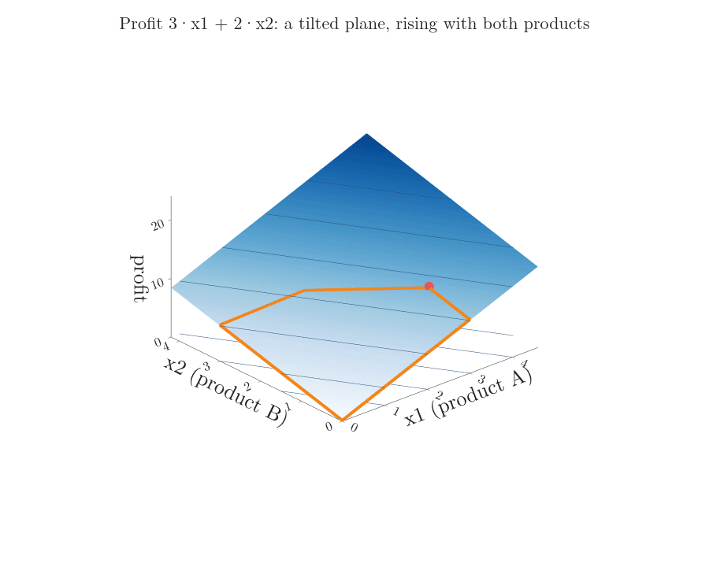
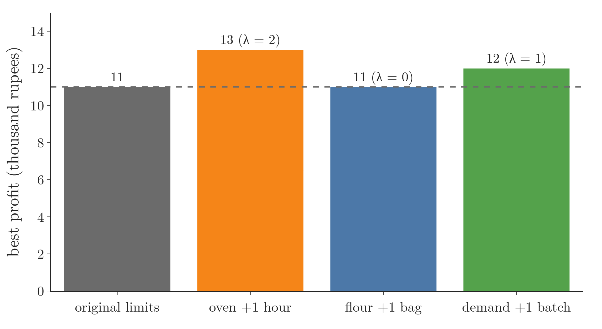
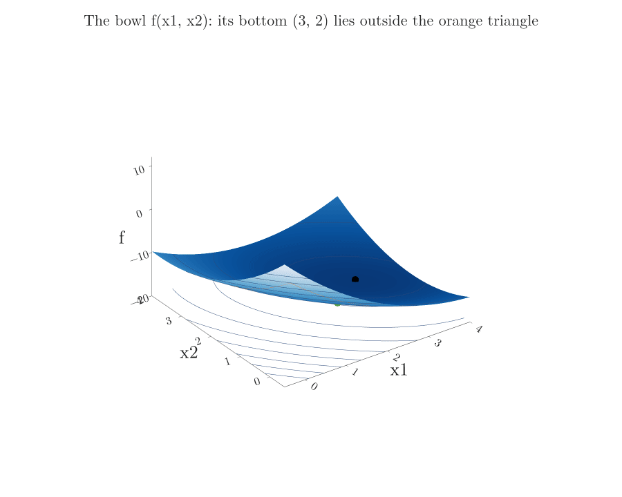
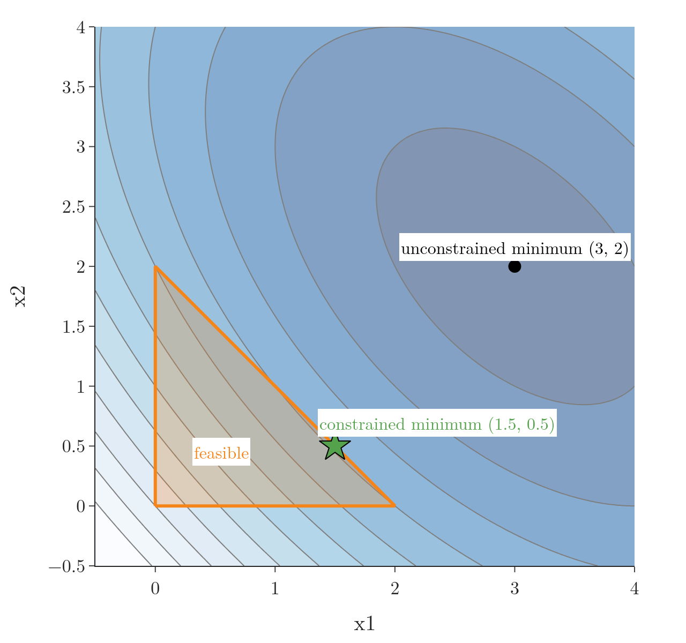
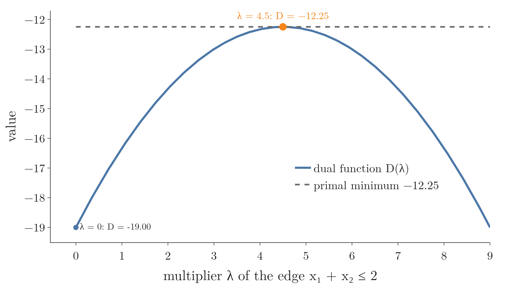

<!-- where-this-fits: generated by course_map/build_map.py; edit concepts.yaml, not this block -->
> **Where this fits:** Pipeline map step 0 (Foundations). See the [Course map](../../../00-course-map/00-course-map.md).
>
> 
>
> - **Builds on:** [Convex sets and convex optimisation](../../../MA/07-optimisation/MA-067-convex-sets-and-functions/MA-067-convex-sets-and-functions.md#2-convex-sets).
<!-- /where-this-fits -->

## 1. Overview

> **Key point:** A linear program minimises a linear function over a region cut out by linear inequalities, and its answer sits at a corner; a quadratic program minimises a convex bowl over the same kind of region. Both are convex problems with a dual that is easy to write down.

This Note follows Chapter 7 (Sections 7.3.1 and 7.3.2) of *Mathematics for Machine Learning* (Deisenroth, Faisal and Ong, 2020).

{height=48%}

[Convex optimisation problems](../MA-067-convex-sets-and-functions/MA-067-convex-sets-and-functions.md#6-convex-optimisation-problems) were defined before. Two families of them are so common that they have their own names and their own solvers: **linear programs** (G-1093) and **quadratic programs** (G-1598). Figure 1 shows a linear program. How to read it: this is the workshop of Section 2.1. The horizontal axis counts batches of product A and the vertical axis batches of product B, so every point is one plan. The blue polygon holds the plans the limits allow. Each orange line joins plans that earn the same profit, and lines further up and to the right earn more.

For each family we write the problem, solve a small example from the picture, derive its dual with [the Lagrangian](../MA-066-lagrange-multipliers/MA-066-lagrange-multipliers.md#4-the-lagrangian) (a function that puts a price on each rule), and check everything in Python.

## 2. Linear programming

> **Key point:** A linear program is a shopping-list problem with straight-line rules: get the most profit (or the least cost) from a plan that must obey limits. The best plan always sits at a corner of the region of allowed plans.

### 2.1 The problem

> **Key point:** Everything is a plain weighted sum: the profit is a weighted sum of the batches, and each limit says another weighted sum stays below a number.

**In plain words.** A small workshop makes two products and has limited oven time, flour and customers. Which mix of batches earns the most? Figure 1 shows the answer region; the numbers follow.

**Worked example.** Product A earns 3 thousand rupees per batch and product B earns 2. Let $x_1$ be the number of batches of A and $x_2$ the number of batches of B, so a plan is a pair of numbers such as $(3, 1)$: 3 batches of A and 1 of B. The profit of a plan:

$$\text{profit} = 3x_1 + 2x_2$$

$$\text{profit}(3, 1) = 3 \times 3 + 2 \times 1 = 11$$

The limits, one per line:

| Limit | In symbols | Check for the plan $(3, 1)$ |
|---|---|---|
| Oven: 1 hour per batch of either, 4 hours free | $x_1 + x_2 \le 4$ | $3 + 1 = 4 \le 4$, holds |
| Flour: 1 bag per A, 3 per B, 9 bags | $x_1 + 3x_2 \le 9$ | $3 + 3 = 6 \le 9$, holds |
| Demand: at most 3 batches of A sold | $x_1 \le 3$ | $3 \le 3$, holds |
| No negative batches of A | $-x_1 \le 0$ | $-3 \le 0$, holds |
| No negative batches of B | $-x_2 \le 0$ | $-1 \le 0$, holds |

Maximising profit is the same as minimising its negative, and the standard form below minimises. So the objective is $-3x_1 - 2x_2$, and the plan $(3, 1)$ scores $-11$.

**The formal version.** A **linear program** is

$$\min_{\mathbf{x} \in \mathbb{R}^d} \ \mathbf{c}^{\mathsf T}\mathbf{x} \quad \text{subject to} \quad A\mathbf{x} \le \mathbf{b}$$

Each symbol, with the workshop value:

- $\mathbb{R}^d$ means lists of $d$ real numbers; here $d = 2$, so $\mathbf{x} = (x_1, x_2)$ such as $(3, 1)$.
- $\mathbf{c}$ holds the weights of the objective: $\mathbf{c} = [-3, -2]^{\mathsf T}$. So $\mathbf{c}^{\mathsf T}\mathbf{x}$ is the objective $-3x_1 - 2x_2$, the dot product (multiply matching entries, then add) of $\mathbf{c}$ and $\mathbf{x}$.
- $A$ is a table with one row per limit ($m = 5$ rows) and one column per unknown. Its rows are $[1, 1]$, $[1, 3]$, $[1, 0]$, $[-1, 0]$, $[0, -1]$.
- $\mathbf{b} = [4, 9, 3, 0, 0]^{\mathsf T}$ holds the right-hand sides.
- $A\mathbf{x} \le \mathbf{b}$ means every row holds.

For $\mathbf{x} = (3, 1)$, each row of $A$ times $\mathbf{x}$:

$$A\mathbf{x} = [3 + 1,\ 3 + 3,\ 3,\ -3,\ -1]^{\mathsf T}$$

$$A\mathbf{x} = [4, 6, 3, -3, -1]^{\mathsf T}$$

Each entry is at most the matching entry of $\mathbf{b}$, as the table above checked.

Each constraint is a half-plane, and the feasible region is their overlap: a convex polygon (in more dimensions, a **polytope**, G-1518). The objective is linear, so it is convex too, and a linear program is a **convex optimisation problem** (G-478).

### 2.2 The answer is at a corner

> **Key point:** The contour lines of a linear objective are parallel straight lines; sliding them in the improving direction, the last feasible point they touch is a corner of the polygon.

The profit is a number for every plan: for 3 batches of A and 1 of B, the profit is 11 thousand rupees, as computed above. Figure 2 draws the profit as a surface over the plans. Because the profit is a weighted sum, the surface is a flat, tilted plane that rises with both products. The allowed plans (orange) form a polygon lifted onto the plane, and the best corner (red) is its highest point. The animation then tilts to the top view: the plane becomes a set of parallel straight lines, each joining plans with the same profit. That is a **contour map** (see [reading a contour map](../../06-calculus/MA-062-partial-derivatives-and-gradients/MA-062-partial-derivatives-and-gradients.md#11-reading-a-contour-map)) of the profit, and the profit lines of Figure 1 are its lines. Lines far from $(0, 0)$ mean more profit; they are evenly spaced because the plane has the same slope everywhere.



Figure 1 is [the level-curve picture](../MA-066-lagrange-multipliers/MA-066-lagrange-multipliers.md#3-the-geometry-a-level-curve-touching-the-constraint) with straight lines instead of ellipses. In Figure 1, the lines of equal profit are parallel, one line for each profit $p$:

$$3x_1 + 2x_2 = p$$

Raising $p$ slides them up and to the right. The line $p = 11$ is the last one that still touches the region, at the single corner $(3, 1)$. Think of pushing a ruler across a cut-out cardboard shape while keeping it parallel to itself: the last bit of cardboard under the ruler is a corner (or a whole edge).


Figure 3 runs the ruler. Watch the thick orange part of the line: it is the set of plans that earn exactly $p$, and it shrinks to a single point at the last corner. The last frame previews Section 2.4.

A second way to see it needs no ruler. A corner of the region is called a **vertex** (G-2258).

1. **Along an edge** the profit changes in a straight line. On the edge from $(3, 0)$ to $(3, 1)$ it rises evenly from 9 to 11. A point between two vertices always earns something in between, so it is never better than the better end.
2. **Inside the region** there is still room to make a little more of A or of B, and each extra batch adds profit. So an inside point is never the best.

Only the vertices are left. Because the answer is at a corner, checking the corners is enough for a small problem:

| Corner | Profit $3x_1 + 2x_2$ |
|---|---|
| $(0, 0)$ | 0 |
| $(3, 0)$ | 9 |
| $(3, 1)$ | **11** |
| $(1.5, 2.5)$ | 9.5 |
| $(0, 3)$ | 6 |

The best plan is 3 batches of A and 1 of B, for 11 thousand rupees. If the profit lines were parallel to an edge, every point of that edge would tie, but a corner would still be among the best points. With many products and many constraints there are far too many vertices to list. The **simplex algorithm** (G-2259) avoids listing them: it walks from one vertex to a neighbouring vertex, and only ever to a better one. Figure 4 first cuts out the region one constraint at a time and then runs the walk on the workshop.

1. Start at $(0, 0)$, profit 0.
2. Choose a direction. A batch of A earns 3 and a batch of B earns 2, so move along $x_1$ until a constraint stops us: the vertex $(3, 0)$, profit 9.
3. Look at the next neighbour, $(3, 1)$: profit 11, better. Move there.
4. Look at the next neighbour, $(1.5, 2.5)$: profit 9.5, worse. No neighbour is better, so stop.

The walk visited 3 of the 5 vertices and ends at the same answer as the table, $(3, 1)$ with profit 11. Stopping is safe because a linear program is a convex problem, and in a convex problem every local minimum is a global minimum (see [what convexity guarantees](../MA-067-convex-sets-and-functions/MA-067-convex-sets-and-functions.md#62-what-convexity-guarantees)): a vertex with no better neighbour is the best of all.


Real solvers use the simplex algorithm or interior-point methods (for the latter, Boyd and Vandenberghe, Ch. 11).

### 2.3 The dual of a linear program

> **Key point:** Every limit gets a price. The dual problem asks: what prices on the limits make the limits worth exactly as much as the best profit? At the best plan the prices are the multipliers, and the two answers agree.

We follow the recipe of [Lagrangian duality](../MA-066-lagrange-multipliers/MA-066-lagrange-multipliers.md#6-lagrangian-duality): put a price on each limit, find the lowest Lagrangian over the plan, and then choose the prices that make that lowest value as high as possible.

**In plain words.** Suppose a buyer wants to rent all your oven time, flour and market demand. The buyer must pay at least what the workshop would earn itself, or you refuse. The buyer wants the lowest total rent. Prices per unit of each limit, one per limit, are the **multipliers** (G-1036). The cheapest rent that you still accept equals your best profit.

**Worked example.** For the workshop, the prices are one number per limit, in the order oven, flour, demand, $x_1 \ge 0$, $x_2 \ge 0$:

$$\boldsymbol{\lambda} = [2, 0, 1, 0, 0]^{\mathsf T}$$

So the oven costs 2 per hour, flour is free, demand costs 1 per batch of A. The test is that the prices rebuild the profit weights. Each price multiplies its row of $A$:

$$2 \times [1, 1] = [2, 2]$$

$$1 \times [1, 0] = [1, 0]$$

$$[2, 2] + [1, 0] = [3, 2]$$

and the profit weights are $[3, 2]$. Adding $\mathbf{c} = [-3, -2]^{\mathsf T}$ cancels them:

$$\mathbf{c} + A^{\mathsf T}\boldsymbol{\lambda} = [-3, -2]^{\mathsf T} + [3, 2]^{\mathsf T}$$

$$\mathbf{c} + A^{\mathsf T}\boldsymbol{\lambda} = [0, 0]^{\mathsf T}$$

The rent bill is each price times its limit's size:

$$\mathbf{b}^{\mathsf T}\boldsymbol{\lambda} = 4 \times 2 + 9 \times 0 + 3 \times 1 + 0 + 0$$

$$\mathbf{b}^{\mathsf T}\boldsymbol{\lambda} = 8 + 0 + 3 = 11$$

$$-\mathbf{b}^{\mathsf T}\boldsymbol{\lambda} = -11$$

This equals the primal minimum $\mathbf{c}^{\mathsf T}\mathbf{x} = -11$. This agreement is **strong duality** (the dual's best value equals the primal's best value), which holds for every linear program whose primal problem is feasible (Boyd and Vandenberghe, Ch. 5).

**The formal version.** The Lagrangian is linear in $\mathbf{x}$, with the $\mathbf{x}$ terms gathered:

$$\mathcal{L}(\mathbf{x}, \boldsymbol{\lambda}) = \mathbf{c}^{\mathsf T}\mathbf{x} + \boldsymbol{\lambda}^{\mathsf T}(A\mathbf{x} - \mathbf{b})$$

$$\mathcal{L}(\mathbf{x}, \boldsymbol{\lambda}) = (\mathbf{c} + A^{\mathsf T}\boldsymbol{\lambda})^{\mathsf T}\mathbf{x} - \boldsymbol{\lambda}^{\mathsf T}\mathbf{b}$$

A linear function of $\mathbf{x}$ has a finite minimum only if its slope is zero. Its slope in $\mathbf{x}$ is $\mathbf{c} + A^{\mathsf T}\boldsymbol{\lambda}$. If that is not zero, $\mathcal{L}$ falls without limit. If it is zero, only the last term is left. The lowest value of $\mathcal{L}$ over $\mathbf{x}$, for fixed prices, is the **dual function** $D(\boldsymbol{\lambda})$, so here:

$$D(\boldsymbol{\lambda}) = -\mathbf{b}^{\mathsf T}\boldsymbol{\lambda}$$

The dual keeps only the prices that make the slope vanish. It is:

$$\max_{\boldsymbol{\lambda} \in \mathbb{R}^m} \ -\mathbf{b}^{\mathsf T}\boldsymbol{\lambda}$$

subject to:

$$\mathbf{c} + A^{\mathsf T}\boldsymbol{\lambda} = \mathbf{0}$$

$$\boldsymbol{\lambda} \ge \mathbf{0}$$

The check on the numbers is the example above: the equality gave $[0, 0]$ and the value is $-11$.

Figure 5 shows what the equality $\mathbf{c} + A^{\mathsf T}\boldsymbol{\lambda} = \mathbf{0}$ means at the best corner. Each active constraint has a normal arrow pointing out of the region: $[1, 1]$ for the oven and $[1, 0]$ for demand. The profit direction $[3, 2]$ is 2 oven arrows plus 1 demand arrow. Every way of raising profit therefore pushes against an active wall, which is why no feasible move can improve on the corner; the weights 2 and 1 are the multipliers.

![The dual condition at the best corner (3, 1). The profit direction −c = [3, 2] (red) equals 2 times the oven normal [1, 1] (orange) plus 1 times the demand normal [1, 0] (green): non-negative weights, the multipliers 2 and 1.](images/lp_normals.png)

The primal has $d$ variables and $m$ constraints; the dual has $m$ variables and $d$ equality constraints. We can solve whichever is smaller. By convention the primal is minimised and the dual maximised.

### 2.4 Reading the multipliers

> **Key point:** Each multiplier is the extra profit one more unit of that resource would bring; a resource with spare capacity is worth 0.

The multipliers are [the shadow prices](../MA-066-lagrange-multipliers/MA-066-lagrange-multipliers.md#42-what-the-multiplier-measures). The last frame of Figure 3 shows the oven's multiplier: one more oven hour moves the best corner from $(3, 1)$ to $(3, 2)$ and the profit from 11 to 13. Changing one limit by one unit and solving again confirms each one:

| Constraint | At the answer | Multiplier | Re-solved with one more unit |
|---|---|---|---|
| Oven: $x_1 + x_2 \le 4$ | $4 = 4$, active | 2 | profit 13 (up by 2) |
| Flour: $x_1 + 3x_2 \le 9$ | $6 < 9$, inactive | 0 | profit 11 (no change) |
| Demand: $x_1 \le 3$ | $3 = 3$, active | 1 | profit 12 (up by 1) |



Figure 6 draws the last column of the table. Flour is not the bottleneck: 3 bags are left over, so more flour is worth nothing. An extra oven hour is worth 2 thousand rupees, so the workshop should pay up to that much for one. The zero multiplier on flour is complementary slackness in action: a constraint with room to spare (inactive) has multiplier 0.

> **Extra:** Linear programs appear in ML too. Fitting a line by least absolute deviations means minimising the sum of the absolute errors over the **observations** (G-1374; one record, one row of the data table):
>
> $$\sum_i |y_i - \mathbf{w}^{\mathsf T}\mathbf x_i|$$
>
> This becomes a linear program in three steps. Step 1: give each observation an extra variable $t_i$ that sits above its absolute error:
>
> $$t_i \ge |y_i - \mathbf{w}^{\mathsf T}\mathbf x_i|$$
>
> Step 2: write that as two linear inequalities:
>
> $$t_i \ge y_i - \mathbf{w}^{\mathsf T}\mathbf x_i$$
>
> $$t_i \ge -(y_i - \mathbf{w}^{\mathsf T}\mathbf x_i)$$
>
> Step 3: minimise the sum of the $t_i$:
>
> $$\sum_i t_i$$
>
> scikit-learn's `QuantileRegressor` solves this kind of linear program with `scipy.optimize.linprog` (scikit-learn docs, `QuantileRegressor`).

## 3. Quadratic programming

> **Key point:** A quadratic program is the same kind of problem with straight-line rules, but the quantity to minimise is a smooth bowl, not a straight slope. The lowest point of the bowl inside the region can be inside, on an edge, or at a corner.

### 3.1 The problem

> **Key point:** Same straight-line rules as a linear program, but the thing to minimise is a bowl, so its level curves are ellipses and the answer can lie on an edge.

**In plain words.** Roll a marble in a bowl. Without a fence it settles at the bottom. Now fence off a triangle that does not contain the bottom. The marble rolls as far downhill as the fence lets it, and stops against the fence. Figures 7 and 8 show the bowl, as a surface and as contour ellipses, and the triangle.

**Worked example.** Take the bowl

$$f(x_1, x_2) = x_1^2 + x_1 x_2 + x_2^2 - 8x_1 - 7x_2$$

Its height at a few positions:

$$f(0, 0) = 0$$

$$f(3, 2) = 9 + 6 + 4 - 24 - 14 = -19$$

$$f(1.5, 0.5) = 2.25 + 0.75 + 0.25 - 12 - 3.5$$

$$f(1.5, 0.5) = -12.25$$

The rules form a triangle: $x_1 + x_2 \le 2$, $x_1 \ge 0$ and $x_2 \ge 0$. The bowl's bottom $(3, 2)$ lies outside the triangle, because its coordinates add to more than 2:

$$3 + 2 = 5 > 2$$

**The formal version.** A **quadratic program** is

$$\min_{\mathbf{x} \in \mathbb{R}^d} \ \tfrac12 \mathbf{x}^{\mathsf T} Q \mathbf{x} + \mathbf{c}^{\mathsf T}\mathbf{x} \quad \text{subject to} \quad A\mathbf{x} \le \mathbf{b}$$

Each symbol, with the triangle value ($d = 2$, so $\mathbf{x} = (x_1, x_2)$):

- $Q = \begin{bmatrix} 2 & 1 \cr1 & 2 \end{bmatrix}$ is a symmetric table that shapes the bowl.
- $\mathbf{c} = [-8, -7]^{\mathsf T}$ tilts the bowl.
- The **quadratic form** (G-1597) is $\tfrac12\mathbf{x}^{\mathsf T} Q \mathbf{x}$ (a sum of terms in which each unknown is squared or multiplied by another, see [the matrix modules](../../05-linear-algebra/MA-047-linear-algebra-roadmap/MA-047-linear-algebra-roadmap.md#43-matrices)). Its steps at $\mathbf{x} = (1, 1)$ follow the list.
- $Q$ must be symmetric and **positive definite** (G-1530; all eigenvalues positive; here 1 and 3, where an [eigenvalue](../../../ML/05-dimensionality/ML-047-pca-step-by-step/ML-047-pca-step-by-step.md#42-the-vectors-that-do-not-turn) is the factor by which a special direction is stretched), so the objective is a strictly convex bowl (see [the second-order condition](../MA-067-convex-sets-and-functions/MA-067-convex-sets-and-functions.md#43-second-order-condition-in-several-variables)).
- $A$ and $\mathbf{b}$ are as before. Here the rows of $A$ are $[1, 1]$, $[-1, 0]$, $[0, -1]$ and $\mathbf{b} = [2, 0, 0]^{\mathsf T}$.

The quadratic form at $\mathbf{x} = (1, 1)$, one step per line:

$$Q\mathbf{x} = [2 + 1,\ 1 + 2]^{\mathsf T} = [3, 3]^{\mathsf T}$$

$$\mathbf{x}^{\mathsf T} Q \mathbf{x} = 1 \times 3 + 1 \times 3 = 6$$

$$\tfrac12\mathbf{x}^{\mathsf T} Q \mathbf{x} = 3$$

Adding the linear part gives $f(1, 1)$, one step per line:

$$\mathbf{c}^{\mathsf T}\mathbf{x} = -8 - 7 = -15$$

$$f(1, 1) = 3 - 15 = -12$$

The expanded form agrees:

$$1 + 1 + 1 - 8 - 7 = -12$$

Figure 7 first shows the bowl as a surface, with the triangle lifted onto it (orange). The bottom of the bowl, $(3, 2)$ with $f = -19$ (black), is outside the triangle. The lowest point of the triangle on the surface is the green point. The animation then tilts to the top view, which is Figure 8: the same bowl as a **contour map**, where each ellipse joins points of the same height, ellipses close together mean a steep wall, and the centre ring is the bottom.



{height=46%}

Figure 8 shows the bowl's contours (black ellipses; the darker the blue between them, the lower the bowl), the unconstrained minimum $(3, 2)$ outside the triangle, and the star where an ellipse just touches the edge.

Where is the bowl's bottom? The slope (gradient) of $f$ is $Q\mathbf{x} + \mathbf{c}$, and it is zero at the bottom. At $\mathbf{x} = (3, 2)$:

$$Q\mathbf{x} = [2 \times 3 + 2,\ 3 + 2 \times 2]^{\mathsf T} = [8, 7]^{\mathsf T}$$

$$Q\mathbf{x} + \mathbf{c} = [8 - 8,\ 7 - 7]^{\mathsf T} = [0, 0]^{\mathsf T}$$

So the bottom is $\mathbf{x} = -Q^{-1}\mathbf{c}$ ($Q^{-1}$ is the inverse of $Q$, the table that undoes $Q$), which is $(3, 2)$. It is outside the triangle, since its coordinates add to 5, more than 2. So the answer lies on the boundary: on the edge $x_1 + x_2 = 2$, where a contour ellipse just touches it (Figure 8). It does not have to be a corner, as it would for a linear program.

### 3.2 Solving it with the KKT conditions

> **Key point:** Guess which rules the marble leans on, solve the equations for that guess, then check that every price is non-negative.

Only the edge constraint $x_1 + x_2 \le 2$ is active, with multiplier $\lambda$. Here $\lambda$ is the price of that edge and $[1, 1]$ is the edge's normal arrow (the row of $A$). The stationarity condition says that the slope of the bowl plus the push-back of the edge is zero:

$$Q\mathbf{x} + \mathbf{c} + \lambda [1, 1]^{\mathsf T} = \mathbf{0}$$

Together with the active constraint it gives three equations:

$$2x_1 + x_2 - 8 + \lambda = 0$$

$$x_1 + 2x_2 - 7 + \lambda = 0$$

$$x_1 + x_2 = 2$$

Solve step by step. Subtract the second equation from the first, which removes $\lambda$:

$$(2x_1 + x_2 - 8 + \lambda) - (x_1 + 2x_2 - 7 + \lambda) = 0$$

$$x_1 - x_2 - 1 = 0, \quad\text{so}\quad x_1 - x_2 = 1$$

Add this to the third equation, $x_1 + x_2 = 2$:

$$2x_1 = 3$$

$$x_1 = 1.5$$

$$x_2 = 2 - 1.5 = 0.5$$

The first equation then gives the multiplier:

$$\lambda = 8 - 2x_1 - x_2$$

$$\lambda = 8 - 3 - 0.5 = 4.5$$

Figure 9 shows the stationarity condition at the answer, on the same contour map as Figure 8. The downhill direction $-\nabla f = [4.5, 4.5]$ points straight out of the edge, exactly $\lambda = 4.5$ times the edge's normal $[1, 1]$. It has no part along the edge, so sliding along the edge cannot lower $f$, and stepping out of the triangle is not allowed.

![The quadratic program at its answer (1.5, 0.5) (star). The downhill direction $-\nabla f = [4.5, 4.5]$ (red) is 4.5 times the normal of the active edge $x_1 + x_2 = 2$; the unconstrained minimum (3, 2) lies outside the triangle.](images/qp_kkt.png)

The checks of the **KKT conditions** (G-1013; the conditions that a guessed answer must pass), one per line:

1. The point is feasible: both coordinates are positive, and it sits on the edge:

   $$1.5 + 0.5 = 2$$

2. Because both coordinates are positive, the two sign constraints are inactive, with multiplier 0.
3. $\lambda = 4.5 \ge 0$.

All checks pass, so $(1.5, 0.5)$ is the answer. Its objective value is $f(1.5, 0.5) = -12.25$, computed in section 3.1.

### 3.3 The dual of a quadratic program

> **Key point:** For a given price on the edge, the marble's lowest point in the priced bowl has a formula. Putting that point back leaves a score that depends on the prices alone; the best price gives the same value as the original problem.

**In plain words.** As with the linear program, we put a price $\lambda$ on each rule. The prices tilt the bowl. The tilted bowl has no rules, so its lowest point is found by setting the slope to zero. The score of that lowest point is a floor under the true answer; we look for the price that makes the floor highest.

**Worked example.** Take the prices $\boldsymbol{\lambda} = [4.5, 0, 0]^{\mathsf T}$ (edge, $x_1 \ge 0$, $x_2 \ge 0$). The tilt is $\mathbf{t} = \mathbf{c} + A^{\mathsf T}\boldsymbol{\lambda}$:

$$A^{\mathsf T}\boldsymbol{\lambda} = 4.5 \times [1, 1]^{\mathsf T} = [4.5, 4.5]^{\mathsf T}$$

$$\mathbf{t} = [-8 + 4.5,\ -7 + 4.5]^{\mathsf T}$$

$$\mathbf{t} = [-3.5, -2.5]^{\mathsf T}$$

The inverse is one third of a table of whole numbers:

$$Q^{-1} = \tfrac13 \begin{bmatrix} 2 & -1 \cr-1 & 2 \end{bmatrix}$$

The lowest point of the tilted bowl is $-Q^{-1}\mathbf{t}$, one step per line:

Multiply the whole-number table by $\mathbf{t}$, row by row. First row, $[2, -1]$:

$$2(-3.5) - (-2.5) = -4.5$$

Second row, $[-1, 2]$:

$$-(-3.5) + 2(-2.5) = -1.5$$

Then take one third:

$$Q^{-1}\mathbf{t} = \tfrac13 [-4.5, -1.5]^{\mathsf T}$$

$$Q^{-1}\mathbf{t} = [-1.5, -0.5]^{\mathsf T}$$

$$\mathbf{x} = -Q^{-1}\mathbf{t} = [1.5, 0.5]^{\mathsf T}$$

The floor is $D$, given by the formula below; one step per line:

$$D = -\tfrac12\thinspace\mathbf{t}^{\mathsf T} Q^{-1} \mathbf{t} - \boldsymbol{\lambda}^{\mathsf T}\mathbf{b}$$

$$\mathbf{t}^{\mathsf T} Q^{-1} \mathbf{t} = [-3.5, -2.5] \cdot [-1.5, -0.5]$$

$$\mathbf{t}^{\mathsf T} Q^{-1} \mathbf{t} = 5.25 + 1.25 = 6.5$$

$$\boldsymbol{\lambda}^{\mathsf T}\mathbf{b} = 4.5 \times 2 + 0 + 0 = 9$$

$$D = -\tfrac12 \times 6.5 - 9$$

$$D = -3.25 - 9 = -12.25$$

The dual maximum equals the primal minimum $-12.25$.

**The formal version.** The Lagrangian is

$$\mathcal{L}(\mathbf{x}, \boldsymbol{\lambda}) = \tfrac12 \mathbf{x}^{\mathsf T} Q \mathbf{x} + (\mathbf{c} + A^{\mathsf T}\boldsymbol{\lambda})^{\mathsf T}\mathbf{x} - \boldsymbol{\lambda}^{\mathsf T}\mathbf{b}$$

Its gradient in $\mathbf{x}$, with the tilt $\mathbf{t} = \mathbf{c} + A^{\mathsf T}\boldsymbol{\lambda}$, is set to zero:

$$Q\mathbf{x} + \mathbf{t} = \mathbf{0}$$

$$\mathbf{x} = -Q^{-1}\mathbf{t}$$

$Q$ is invertible because it is positive definite. Substituting this $\mathbf{x}$ into $\mathcal{L}$ gives the dual function:

$$D(\boldsymbol{\lambda}) = -\tfrac12\thinspace\mathbf{t}^{\mathsf T} Q^{-1} \mathbf{t} - \boldsymbol{\lambda}^{\mathsf T}\mathbf{b}$$

The dual problem is:

$$\max_{\boldsymbol{\lambda} \ge \mathbf{0}} D(\boldsymbol{\lambda})$$

The numbers above reproduce $-12.25$.

Figure 10 draws $D$ along the edge multiplier, with the two sign-constraint multipliers held at 0. It is an upside-down bowl that stays below the primal minimum $-12.25$ (weak duality) and reaches it exactly at $\lambda = 4.5$ (strong duality).



The dual has only simple sign constraints $\boldsymbol{\lambda} \ge \mathbf{0}$. They are easy to keep: after a gradient step, setting every negative multiplier to 0 restores them.

### 3.4 Quadratic programs in ML

> **Key point:** Training a support vector machine is a quadratic program, in its primal form and in its dual form.

- **SVM, primal** (**support vector machine**, G-1921): minimise

  $$\tfrac12\lVert \mathbf{w} \rVert^2$$

  subject to, for every observation $i$:

  $$y_i(\mathbf{w}^{\mathsf T}\mathbf x_i + b) \ge 1$$

  (see [the soft margin](../../../ML/07-classification/ML-088-svm-soft-margin/ML-088-svm-soft-margin.md#5-the-soft-margin-loss)). The objective is quadratic and each constraint is linear in $(\mathbf{w}, b)$. Here $Q$ is only positive semi-definite (eigenvalues positive or zero), because $b$ has no squared term, so the dual is derived as in [the SVM dual](../MA-066-lagrange-multipliers/MA-066-lagrange-multipliers.md#72-the-svm-dual) rather than with $Q^{-1}$.
- **SVM, dual:** maximise

  $$\sum_i \alpha_i - \tfrac12 \sum_{i,j} \alpha_i \alpha_j y_i y_j\thinspace\mathbf x_i^{\mathsf T}\mathbf x_j$$

  subject to:

  $$\alpha_i \ge 0$$

  $$\sum_i \alpha_i y_i = 0$$

  This is a quadratic program in the multipliers $\alpha_i$. The soft-margin version only adds the upper bound $\alpha_i \le C$. scikit-learn's `SVC` solves this dual (scikit-learn User Guide, SVM).
- **Lasso, constraint form:** least squares subject to $\sum_i |w_i| \le t$ is a quadratic program once each weight is split into a positive and a negative part (Tibshirani 1996, §6).

> **Python:** scipy's `linprog` solves linear programs and reports the multipliers in `ineqlin.marginals` (with scipy's sign, so negative here). `minimize` with `trust-constr` handles the quadratic program.
>
> ```python
> import numpy as np
> from scipy.optimize import linprog, minimize, LinearConstraint
>
> # Linear program: the workshop
> c = [-3, -2]
> A = [[1, 1], [1, 3], [1, 0]]
> b = [4, 9, 3]
> lp = linprog(c, A_ub=A, b_ub=b, bounds=[(0, None)] * 2)
> lp.x, lp.fun                 # [3. 1.], -11.0
> lp.ineqlin.marginals         # [-2. -0. -1.]: oven, flour, demand
>
> # Quadratic program: the triangle
> Q = np.array([[2, 1], [1, 2]])
> q = np.array([-8, -7])
> f = lambda x: 0.5 * x @ Q @ x + q @ x
> edge = LinearConstraint([[1, 1]], -np.inf, 2)
> qp = minimize(f, [0, 0], method="trust-constr",
>               constraints=[edge], bounds=[(0, None)] * 2)
> qp.x.round(3), round(qp.fun, 3)   # [1.5 0.5], -12.25
> ```

## 4. Summary

| | Linear program | Quadratic program |
|---|---|---|
| Objective | $\mathbf{c}^{\mathsf T}\mathbf{x}$ | $\tfrac12\mathbf{x}^{\mathsf T}Q\mathbf{x} + \mathbf{c}^{\mathsf T}\mathbf{x}$, $Q$ positive definite |
| Constraints | $A\mathbf{x} \le \mathbf{b}$ | $A\mathbf{x} \le \mathbf{b}$ |
| Contours | parallel straight lines | ellipses |
| Where the answer is | a corner of the polygon | inside, on an edge or at a corner |
| Dual | $\max -\mathbf{b}^{\mathsf T}\boldsymbol{\lambda}$, $\mathbf{c} + A^{\mathsf T}\boldsymbol{\lambda} = \mathbf{0}$, $\boldsymbol{\lambda} \ge \mathbf{0}$ | $\max D(\boldsymbol{\lambda})$ (concave quadratic), $\boldsymbol{\lambda} \ge \mathbf{0}$ |
| Example | workshop: $(3, 1)$, profit 11 | triangle: $(1.5, 0.5)$, value $-12.25$ |
| In ML | least absolute deviations, quantile regression | SVM (primal and dual), Lasso in constraint form |

- A linear program's answer is at a corner because its equal-profit lines are parallel, so checking corners (or walking corner to corner, as the simplex algorithm does) is enough.
- A quadratic program's answer can sit on an edge because its contours are ellipses, so a guessed answer is checked with the KKT conditions instead.
- The dual has $m$ variables where the primal has $d$, so we can solve whichever is smaller; the QP dual has only sign constraints, which are easy to keep.
- Training an SVM is a quadratic program, so scikit-learn's `SVC` trains it by solving the dual.
- Both are convex problems with linear constraints, so whenever the primal is feasible the dual value equals the primal value (Boyd and Vandenberghe, Ch. 5).
- Multipliers are shadow prices: an inactive constraint has multiplier 0, because a resource with spare capacity is worth nothing; so a multiplier says how much one more unit of a limit is worth.

## 5. Sources

**Built from**

- Deisenroth, Faisal and Ong, *Mathematics for Machine Learning*, Cambridge University Press, 2020, Chapter 7.
- StatQuest with Josh Starmer, "Optimization with Linear Programming (and the Simplex Algorithm), Main Ideas!!!", YouTube, https://www.youtube.com/watch?v=h5o1n1QMcmM (Section 2.2, Figure 4)

**Other references**

- Boyd and Vandenberghe, *Convex Optimization*, Cambridge University Press, 2004. Chapter 5 (duality; strong duality for linear constraints, Sec. 5.2.3 to 5.2.4), Chapter 11 (interior-point methods).
- Tibshirani, "Regression Shrinkage and Selection via the Lasso", *Journal of the Royal Statistical Society B*, 1996, Section 6.
- scikit-learn documentation: `QuantileRegressor`; User Guide, Support Vector Machines, Mathematical formulation.

## 6. Key terms

| Term | Meaning |
|---|---|
| Vertex (G-2258) | A corner of the feasible region; a linear program always has a best point at a vertex |
| Simplex algorithm (G-2259) | A way to find the best corner of the region allowed by straight-line limits (solving a linear program): walk from one corner (vertex) to a neighbouring, better one until no neighbour is better. |
| Linear program | A problem of making a straight-line (linear) function as small as possible when the allowed choices are limited by linear inequalities (linear constraints). It is a common kind of convex problem with its own fast solvers. |
| Polytope | The region where a set of linear inequalities all hold, such as the feasible region of a linear program: a polygon in two dimensions. |
| Quadratic program | A problem of finding the lowest point of a bowl-shaped function with squared terms (a convex quadratic) while meeting limits written as linear inequalities (constraints). |
| Positive definite matrix | A symmetric matrix that curves upward in every direction: its eigenvalues are all positive, and its quadratic form is a strictly convex bowl. |
