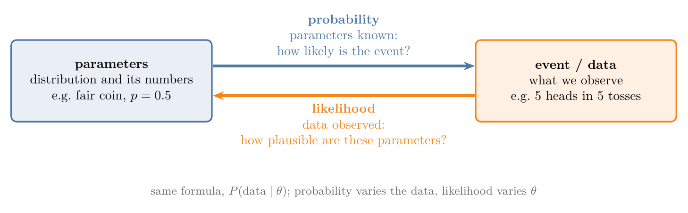
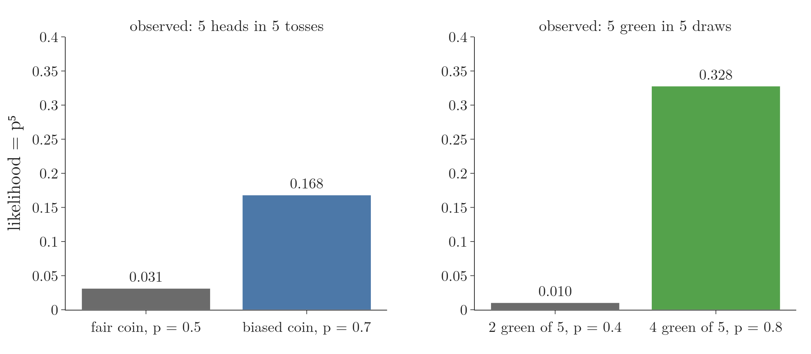
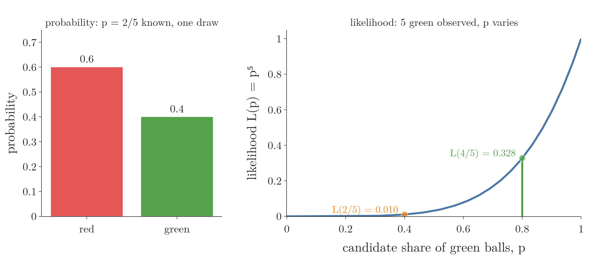
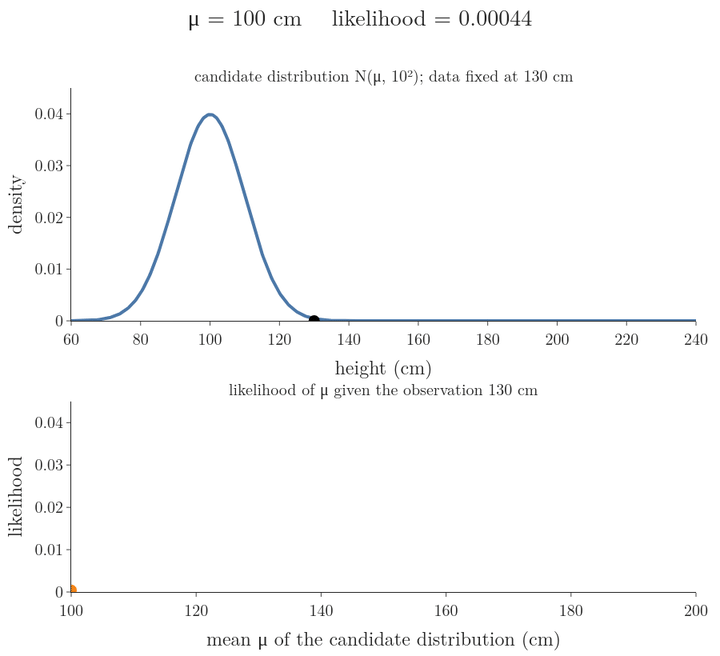
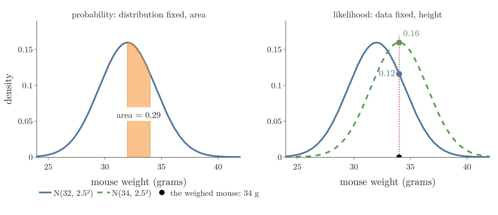
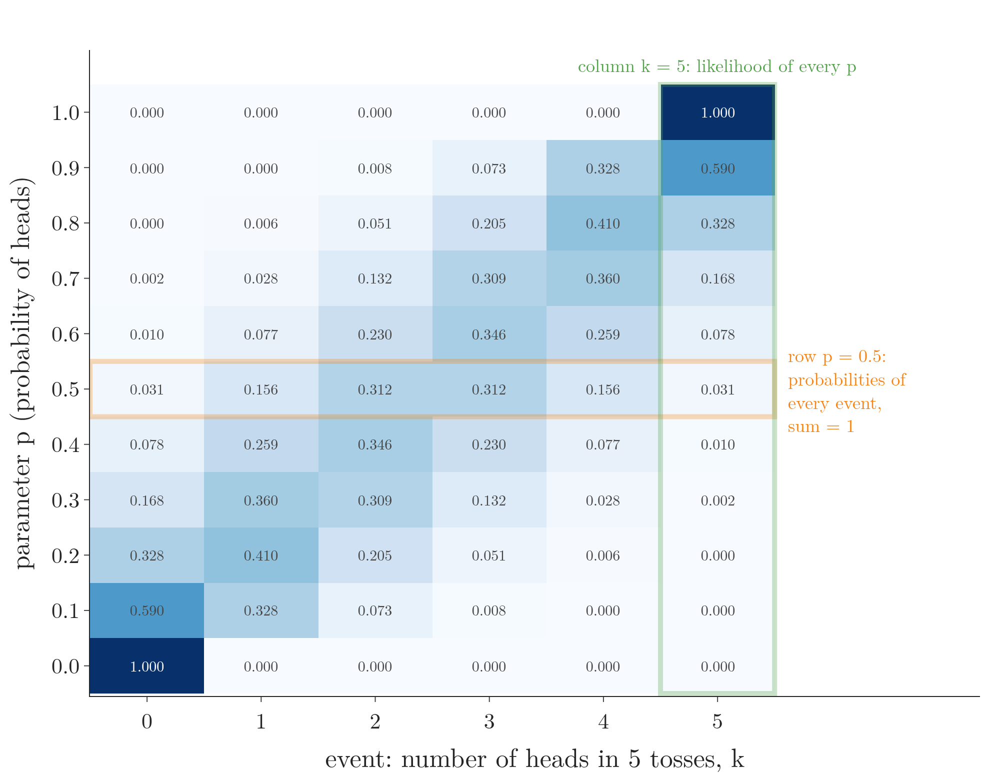
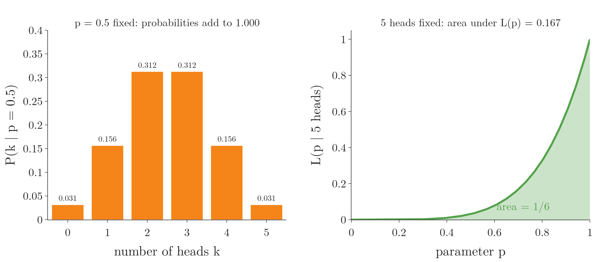

<!-- where-this-fits: generated by course_map/build_map.py; edit concepts.yaml, not this block -->
> **Where this fits:** Pipeline map step 0 (Foundations). See the [Course map](../../../00-course-map/00-course-map.md).
>
> 
>
> - **Builds on:** [Probability distributions](../../../MA/01-descriptive-stats/MA-003-statistics-roadmap/MA-003-statistics-roadmap.md#32-probability-distributions).
> - **Leads to:** [Probability density function (PDF)](../../../ML/02-getting-data/ML-019-univariate-analysis/ML-019-univariate-analysis.md#7-density-plot); [Q-Q plot](../../../ML/03-feature-engineering/ML-029-function-transformer/ML-029-function-transformer.md#41-how-a-q-q-plot-is-built); [Z-score outlier method](../../../ML/04-missing-data-and-outliers/ML-040-what-are-outliers/ML-040-what-are-outliers.md#1-overview); [Naive Bayes](../../../ML/07-classification/ML-081-naive-bayes-intuition/ML-081-naive-bayes-intuition.md#1-overview); [Maximum likelihood estimation (MLE)](../../../MA/08-likelihood/MA-070-maximum-likelihood-estimation/MA-070-maximum-likelihood-estimation.md#72-the-maximum-likelihood-estimate); [Multivariate normal distribution](../../../MA/08-likelihood/MA-073-gaussian-mixture-models/MA-073-gaussian-mixture-models.md#71-the-multivariate-normal).
> - **Compare with:** [Probability mass function (PMF)](../../../MA/03-distributions/MA-021-pmf-and-discrete-cdf/MA-021-pmf-and-discrete-cdf.md#3-the-probability-mass-function); [Probability density function (PDF)](../../../MA/03-distributions/MA-022-pdf-and-continuous-cdf/MA-022-pdf-and-continuous-cdf.md#4-bars-whose-area-is-probability-the-pdf); [Student's t-distribution](../../../MA/04-inference/MA-037-t-procedure/MA-037-t-procedure.md#5-students-t-distribution).
<!-- /where-this-fits -->

## 1. Overview

> **Key point:** Probability starts from known parameters and asks how likely an event is. Likelihood starts from an observed event and asks how plausible a parameter value is. Both use the same formula, read in opposite directions.

{width=85%}

The two words mean the same thing in everyday speech, which is why the difference is confusing. Picture a tunnel with a parameter at one end and an event at the other (Figure 1). Looking from the parameter end towards the event is probability. Looking from the event end back towards the parameter is likelihood.

This Note builds the idea from three examples, each read both ways:

- tossing a coin (Section 2);
- drawing balls from a bag (Section 3);
- people's heights, a continuous example (Section 4).

The Note then states both definitions (Section 5) and shows why a likelihood is not a probability (Section 6). [The idea of maximum likelihood estimation](../MA-070-maximum-likelihood-estimation/MA-070-maximum-likelihood-estimation.md#3-the-idea-slide-the-curve-keep-the-peak) uses likelihood to fit parameters.

## 2. A coin

> **Key point:** Fair coin known: the probability of tails is 0.5. Five heads observed: the likelihood that the coin is fair is $0.5^5 = 0.031$, lower than the likelihood $0.7^5 = 0.168$ of a coin biased towards heads.

### 2.1 Probability: from the parameter to the event

> **Key point:** The coin follows a Bernoulli distribution with $p = 0.5$; plugging in the event "tails" gives its probability.

Tossing a coin once has two outcomes, heads or tails, so it follows a **Bernoulli distribution** (G-275) with one parameter $p$, the probability of heads (see [the Bernoulli distribution](../../03-distributions/MA-031-bernoulli-and-binomial/MA-031-bernoulli-and-binomial.md#2-the-bernoulli-distribution)). For a fair coin, $p = 0.5$.

1. **In words:** the Bernoulli PMF gives the probability of each outcome $k$ (1 for heads, 0 for tails) once $p$ is known.
2. **Formula:**

   $$P(X = k) = p^{k}(1 - p)^{1 - k}$$

   $$k \in \lbrace0, 1\rbrace$$

   The second line reads: $k$ is one of 0 or 1. The sign $\in$ means "is one of", and $\lbrace0, 1\rbrace$ is the set of the two allowed values: tails is 0 and heads is 1. For example, $1 \in \lbrace0, 1\rbrace$ is true, and $2 \in \lbrace0, 1\rbrace$ is false.
3. **Example:** for tails, $k = 0$:

   $$P(X = 0) = 0.5^{0} \times 0.5^{1} = 0.5$$

Common sense gives the same answer: if heads has probability 0.5, tails has the rest:

$$1 - 0.5 = 0.5$$

The pattern is what matters. We knew the distribution (Bernoulli) and its parameter ($p = 0.5$), and we computed the chance of an event (tails). Computing such a chance is probability.

### 2.2 Likelihood: from the event back to the parameter

> **Key point:** We toss the coin five times and get five heads. The likelihood of "the coin is fair" given this data is $0.5^5 = 0.031$.

Now turn it around. We are told the coin is fair, we toss it five times, and all five come up heads. Is "fair" still believable? The tosses are independent, so the probability of five heads under $p$ is a product of five equal factors (see [independent events](../../02-probability/MA-016-independent-events/MA-016-independent-events.md#2-the-definition)).

1. **In words:** the **likelihood** (G-1086) of a parameter value is the probability of the observed data computed with that value; the data stays fixed and we change the parameter.
2. **Formula:**
   $$L(p \mid \text{5 heads}) = p \times p \times p \times p \times p = p^{5}$$
3. **Example:** for a fair coin, $L(0.5) = 0.5^5 = 0.031$. For a coin with $p = 0.7$, $L(0.7) = 0.7^5 = 0.168$.

Five heads are more than five times as plausible under $p = 0.7$ as under $p = 0.5$ (Figure 2, left). The data supports a coin biased towards heads more than a fair one.

## 3. A bag of balls

> **Key point:** A bag holds 3 red and 2 green balls. Probability: a drawn ball is red with probability 3/5. Likelihood: after five green draws in a row, the value $p = 0.4$ has likelihood 0.010, far below the 0.328 of a bag with 4 green balls out of 5.

### 3.1 Probability

> **Key point:** One draw is again a Bernoulli trial, with $p$ = probability of green = 2/5.

A closed bag holds 3 red and 2 green balls. Drawing one ball has two outcomes, so it is again a Bernoulli trial; take green as the outcome counted by $p$, so $p$ is 2 out of 5.

1. **In words:** red is $k = 0$, so its probability is $1 - p$.
2. **Formula:**
   $$P(\text{red}) = p^{0}(1 - p)^{1} = 1 - p$$
3. **Example:**

   $$1 - 2/5 = 3/5 = 0.6$$

Again we knew the parameter and computed the chance of an event: probability.

### 3.2 Likelihood

> **Key point:** Five green draws make the value 2 out of 5 for $p$ implausible. Its likelihood is only 0.010 (the example below).

We draw five times, putting each ball back before the next draw so that the draws are independent. All five are green. We were told that $p$ is 2 out of 5; how plausible is that now?

1. **In words:** multiply the probability of green, under the value of $p$ being questioned, once per green draw.
2. **Formula:**
   $$L(p \mid \text{5 green}) = p^{5}$$
3. **Example:**

   $$L(2/5) = 0.4^5 = 0.010$$

   For a bag with 4 green balls out of 5:

   $$L(4/5) = 0.8^5 = 0.328$$

   That is about 32 times higher.

So five green draws point to a bag with mostly green balls (Figure 2, right). The direction is the same as for the coin: the event is fixed, and we compare parameter values by how well each one explains it. Figure 3 shows the two readings of the bag side by side: with $p$ known, two bars for the two possible draws; with the five green draws known, one curve over every candidate $p$.

## 4. Heights: a continuous example

> **Key point:** For a continuous variable, probability is an area under the density curve, and likelihood is the height of the curve at the observed value.

### 4.1 Probability is an area

> **Key point:** With heights following $N(150, 10^2)$, the probability that a person is between 170 and 180 cm is the area under the curve there: 0.021.

Heights of people are continuous: any value is possible. Assume they follow a normal distribution with mean $\mu = 150$ cm and standard deviation $\sigma = 10$ cm (see [what the normal distribution is](../../03-distributions/MA-024-normal-distribution/MA-024-normal-distribution.md#2-what-the-normal-distribution-is)). The shorthand $N(150, 10^2)$ means a normal distribution with mean 150 and standard deviation 10.

1. **In words:** the probability that a randomly picked person's height falls in a range is the area under the **PDF** (probability density function, the curve of the distribution) over that range (see [area under the curve is probability](../../03-distributions/MA-022-pdf-and-continuous-cdf/MA-022-pdf-and-continuous-cdf.md#3-area-under-the-curve-is-probability)).
2. **Formula:**
   $$P(170 \le X \le 180) = F(180) - F(170)$$
   where $F$ is the **CDF** of $N(150, 10^2)$ (cumulative distribution function: $F(x)$ is the probability of a value at most $x$).
3. **Example:** the distance of 170 and 180 from the mean, in standard deviations:

   $$\frac{170 - 150}{10} = 2$$

   $$\frac{180 - 150}{10} = 3$$

   The areas up to 2 and 3 standard deviations come from the z-table (see [the z-table](../../03-distributions/MA-025-standard-normal-and-z-table/MA-025-standard-normal-and-z-table.md#4-the-z-table)):

   $$0.99865 - 0.97725 = 0.021$$

The parameters were known and the event was a range of heights: probability.

### 4.2 Likelihood is a height

> **Key point:** We measure one person at 100 cm. The likelihood of $\mu = 150$, $\sigma = 10$ is the height of the $N(150, 10^2)$ curve at 100: $1.49 \times 10^{-7}$, almost nothing.

Now we pick one person at random and measure 100 cm. How plausible are $\mu = 150$ and $\sigma = 10$ for this **observation** (G-1374; one recorded value)?

1. **In words:** put the observed value into the normal PDF, with the parameter values being questioned.
2. **Formula:**
   $$L(\mu, \sigma \mid x) = \frac{1}{\sigma\sqrt{2\pi}}\thinspace e^{-\frac{(x - \mu)^2}{2\sigma^2}}$$
3. **Example:** for $x = 100$, $\mu = 150$, $\sigma = 10$, the exponent is:

   $$-(100 - 150)^2/200 = -12.5$$

   $$L = \frac{1}{10\sqrt{2\pi}}\thinspace e^{-12.5}$$

   $$L = 0.0399 \times 3.73 \times 10^{-6}$$

   $$L = 1.49 \times 10^{-7}$$

Changing the observation changes the verdict on the same parameters:

| Observed height $x$ (cm) | Likelihood of $\mu = 150$, $\sigma = 10$ |
|---|---|
| 100 | $1.5 \times 10^{-7}$ |
| 130 | 0.0054 |
| 140 | 0.024 |
| 150 | 0.040 |
| 200 | $1.5 \times 10^{-7}$ |

An observation of 140 cm makes $\mu = 150$ quite plausible; 100 cm or 200 cm make it almost impossible. Only the distance between $x$ and $\mu$ enters the formula, through $(x - \mu)^2$, so 100 and 200 cm, both 50 cm away, get the same likelihood.

### 4.3 The likelihood function: slide the parameter

> **Key point:** Keep the observation fixed and slide $\mu$: the heights trace the **likelihood function** (G-1085), which peaks at the $\mu$ equal to the observation.

Because only $x - \mu$ matters, moving the observation away from $\mu$ is the same as moving $\mu$ away from the observation. The natural way to use likelihood is the second one: the data is what we have, and we try parameter values. Figure 4 fixes one person at 130 cm and slides the candidate mean from 100 to 200 cm.

The likelihood is highest, 0.040, when the curve is centred on the observation. Picking the parameter value at this peak is maximum likelihood estimation, the subject of [the idea of maximum likelihood estimation](../MA-070-maximum-likelihood-estimation/MA-070-maximum-likelihood-estimation.md#3-the-idea-slide-the-curve-keep-the-peak).

### 4.4 The same picture with mouse weights

> **Key point:** Probabilities are areas under a fixed distribution; likelihoods are heights at fixed data under a distribution that can move.

A second example (Starmer, StatQuest) draws the same contrast with mouse weights following $N(32, 2.5^2)$ (Figure 5):

- **probability** (left): the distribution is fixed; the chance that a mouse weighs 32 to 34 grams is the shaded area, 0.29;
- **likelihood** (right): we weighed one mouse at 34 grams; the likelihood of $N(32, 2.5^2)$ is its height at 34, 0.12. Shifting the mean to 34 raises the likelihood to 0.16.

The notation keeps the two apart:

$$P(\text{data} \mid \text{distribution}) \quad\text{versus}\quad L(\text{distribution} \mid \text{data})$$

In $P(32 \le \text{weight} \le 34 \mid \mu = 32, \sigma = 2.5) = 0.29$ we change the left side to ask about other weights. In $L(\mu = 32, \sigma = 2.5 \mid \text{weight} = 34) = 0.12$ the right side, the data, stays fixed, and we change the left side to try other distributions.

> **Extra:** A density height is not itself a probability; [what the density at a point means](../../03-distributions/MA-022-pdf-and-continuous-cdf/MA-022-pdf-and-continuous-cdf.md#5-what-the-density-at-a-point-means) shows that it is probability per unit of $x$. Because a density is a rate, a likelihood for continuous data can be larger than 1. Only comparisons between likelihoods are meaningful, never a single value on its own.

## 5. The two definitions

> **Key point:** Probability: parameters known, chance of an event. Likelihood: data observed, plausibility of parameter values.

All three examples follow one pattern:

| | Probability | Likelihood |
|---|---|---|
| What is known | the distribution and its parameters | the observed data |
| What varies | the event | the parameter values |
| Question | how likely is this event? | how well do these parameter values explain the data? |
| Coin | $P(\text{tails} \mid p = 0.5) = 0.5$ | $L(p = 0.5 \mid \text{5 heads}) = 0.031$ |
| Bag | $P(\text{red} \mid p = 2/5) = 0.6$ | $L(p = 2/5 \mid \text{5 green}) = 0.010$ |
| Heights | $P(170 \le X \le 180 \mid 150, 10) = 0.021$ | $L(150, 10 \mid x = 100) = 1.5 \times 10^{-7}$ |

- **Probability** (G-1574) measures the chance that a certain event will occur out of all possible events. A probability is a number from 0 to 1.
- **Likelihood** is a function that measures the **plausibility** (G-1505) of a particular parameter value: how believable it is, given some observed data. The likelihood says how well an observed outcome supports a parameter value.

Figure 6 shows that both readings come from one table. Each cell holds the probability of $k$ heads in 5 tosses for a coin with heads-probability $p$. Reading along a row (orange, $p = 0.5$) fixes the parameter and runs over the events: that is probability. Reading down a column (green, $k = 5$) fixes the data and runs over the parameter values: that is likelihood, the values $p^5$ of Section 2.2.

Said another way: a probability tells us how often to expect an outcome when we understand the process that produces the data; a likelihood tells us how good a model is, given data we have already seen.

## 6. A likelihood is not a probability

> **Key point:** Probabilities of all possible events add up to 1. Likelihoods of all parameter values do not: for five heads, the area under $L(p) = p^5$ is $1/6$.

Probability and likelihood share a formula, so it is tempting to treat the likelihood as a probability distribution over the parameter. *Mathematics for Machine Learning* (MML §9.2.1, remark) warns that it is not: the likelihood is a probability distribution in the data, but not in the parameters.

The coin shows both sides. With $p$ fixed at 0.5, the probabilities of all possible numbers of heads in five tosses, 0 to 5, add up to 1 (they form the binomial distribution of [the binomial distribution](../../03-distributions/MA-031-bernoulli-and-binomial/MA-031-bernoulli-and-binomial.md#3-the-binomial-distribution)). With the data fixed at five heads, the likelihood $L(p) = p^5$ over all values of $p$ from 0 to 1 does not:

1. **In words:** the area under the likelihood curve, over every possible value of the parameter, is not 1.
2. **Formula:**
   The sign $\int_0^1$ means "the area under the curve from $p = 0$ to $p = 1$" ([area under the curve is probability](../../03-distributions/MA-022-pdf-and-continuous-cdf/MA-022-pdf-and-continuous-cdf.md#3-area-under-the-curve-is-probability) explains it). The area under $p^5$ is $p^6/6$ evaluated at the top limit minus the bottom limit:
   $$\int_0^1 p^{5}\thinspace dp = \left[\frac{p^{6}}{6}\right] _0^1$$
   $$\frac{1^6}{6} - \frac{0^6}{6} = \frac{1}{6} - 0 = \frac{1}{6}$$
3. **Example:** the area is $0.167$, not 1. The Notebook confirms both sums: 1.000 for the probabilities, 0.167 for the likelihood area (Figure 7).

So a likelihood value only means something next to another likelihood value for the same data: 0.168 against 0.031 says $p = 0.7$ explains five heads better than $p = 0.5$.

## 7. Summary

| | Probability | Likelihood |
|---|---|---|
| Direction | parameters $\to$ event | data $\to$ parameters |
| Fixed | parameters | data |
| Varies | event | parameters |
| Discrete data | PMF value or sum of PMF values | PMF value(s) of the observed data |
| Continuous data | area under the PDF | height of the PDF at the observed value |
| Adds up to 1? | yes, over all events | no, over all parameter values |
| Notation | $P(\text{data} \mid \theta)$ | $L(\theta \mid \text{data})$ |

- The same formula gives a probability when the parameters are fixed and a likelihood when the data is fixed, so the question (chance of an event, or plausibility of a parameter) decides which reading is meant.
- For independent observations, the likelihood is a product, because the probability of independent events is a product: five heads give $p^5$.
- Comparing likelihoods tells which parameter value explains the data better: 0.168 for $p = 0.7$ against 0.031 for $p = 0.5$. Picking the value at the peak of the likelihood function is maximum likelihood estimation.
- For continuous data, likelihood is the height of the density at the observation; probability is an area. A density is a rate, so a likelihood for continuous data can be larger than 1.
- A likelihood is not a probability distribution over the parameters, because the area under $L(p) = p^5$ is 1/6, not 1; so a likelihood value means something only next to another likelihood value for the same data.

## 8. Sources

**Built from**

- CampusX, "Probability vs Likelihood | Machine Learning Interview Question", YouTube, https://www.youtube.com/watch?v=QBFVcBXRzu4
- Starmer, J. (StatQuest), "In Statistics, Probability is not Likelihood.", YouTube, https://www.youtube.com/watch?v=pYxNSUDSFH4. Used in Section 4.4.

**Other references**

- Deisenroth, M. P., Faisal, A. A. and Ong, C. S. (2020). *Mathematics for Machine Learning*. Cambridge University Press. Free PDF at mml-book.github.io. §9.2.1 (remark: the likelihood is not a probability distribution in the parameters). Used in Section 6.

## 9. Key terms

| Term | Meaning |
|---|---|
| Probability | The chance of an event when the distribution and its parameters are known; between 0 and 1 |
| Likelihood | How plausible a parameter value is, given observed data: the probability (or density) of the data computed with that value |
| Likelihood function $L(\theta \mid \text{data})$ | The likelihood as a function of the parameters, with the data held fixed |
| Observation | One recorded value (one row of the data table) |
| Plausibility | How believable a parameter value is in the light of the data; measured by its likelihood relative to other values |
