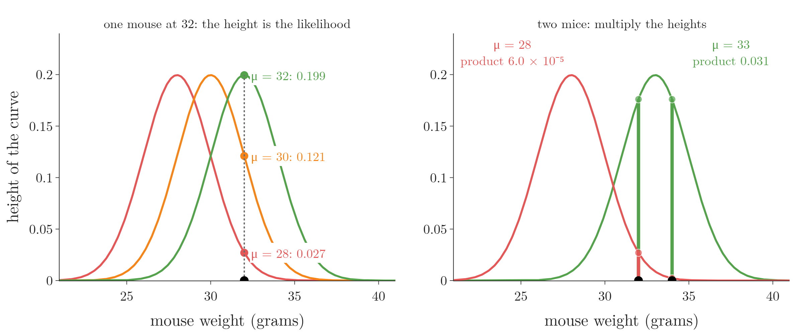
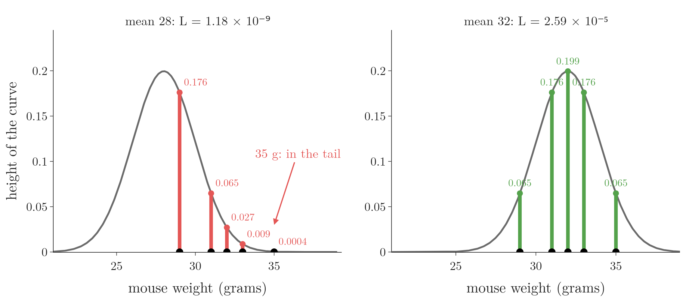
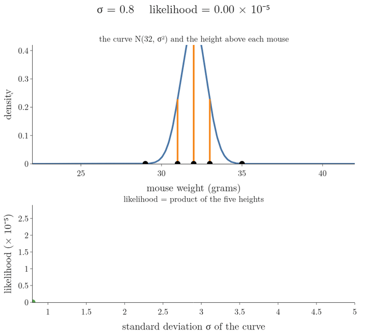
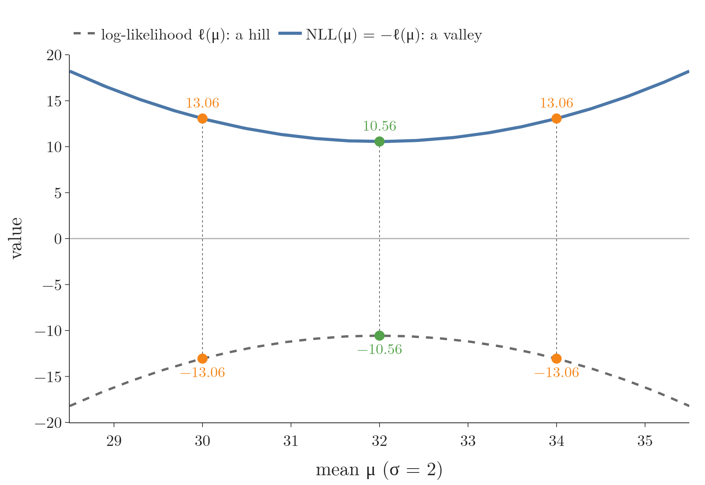
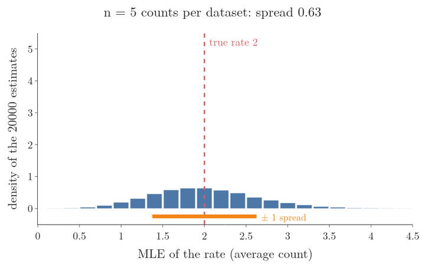

<!-- where-this-fits: generated by course_map/build_map.py; edit concepts.yaml, not this block -->
> **Where this fits:** Pipeline map step 0 (Foundations). See the [Course map](../../../00-course-map/00-course-map.md).
>
> 
>
> - **Builds on:** [Derivatives of one variable](../../../MA/06-calculus/MA-061-derivatives-of-one-variable/MA-061-derivatives-of-one-variable.md#1-overview); [Partial derivatives and gradients](../../../MA/06-calculus/MA-062-partial-derivatives-and-gradients/MA-062-partial-derivatives-and-gradients.md#12-the-gradient-on-the-map); [Likelihood](../../../MA/08-likelihood/MA-069-probability-vs-likelihood/MA-069-probability-vs-likelihood.md#22-likelihood-from-the-event-back-to-the-parameter); [Exponential distribution](../../../MA/08-likelihood/MA-071-mle-for-common-distributions/MA-071-mle-for-common-distributions.md#3-the-exponential-distribution).
> - **Leads to:** [Log loss (binary cross entropy)](../../../MA/08-likelihood/MA-072-mle-in-machine-learning/MA-072-mle-in-machine-learning.md#4-a-bernoulli-target-gives-the-log-loss); [Categorical and sparse categorical cross-entropy](../../../MA/08-likelihood/MA-072-mle-in-machine-learning/MA-072-mle-in-machine-learning.md#5-a-categorical-target-gives-the-cross-entropy); [MAP estimation](../../../MA/08-likelihood/MA-072-mle-in-machine-learning/MA-072-mle-in-machine-learning.md#7-map-estimation-maximum-likelihood-plus-a-prior); [Gaussian mixture model (GMM)](../../../MA/08-likelihood/MA-073-gaussian-mixture-models/MA-073-gaussian-mixture-models.md#32-the-standard-terms); [Expectation maximization (EM)](../../../MA/08-likelihood/MA-074-expectation-maximization/MA-074-expectation-maximization.md#1-overview).
<!-- /where-this-fits -->

## 1. Overview

> **Key point:** Maximum likelihood estimation picks the parameter values under which the data we actually observed is most likely. We slide the parameters, compute the likelihood of the fixed data, and keep the peak.

[Likelihood from the event back to the parameter](../MA-069-probability-vs-likelihood/MA-069-probability-vs-likelihood.md#22-likelihood-from-the-event-back-to-the-parameter) showed that a likelihood fixes the data and lets the distribution move. This Note turns that idea into a method, in this order:

1. why we fit a distribution to data at all (Section 2);
2. the whole idea in one picture: slide the curve, keep the peak (Section 3);
3. the likelihood of one measurement: the height of the curve (Section 4);
4. the likelihood of many measurements: multiply the heights (Section 5);
5. searching for the best mean, then the best standard deviation (Section 6);
6. the general names: likelihood function and maximum likelihood estimate (Section 7);
7. why we take the log (Section 8) and flip the sign (Section 9);
8. finding the peak with a derivative (Section 10);
9. how good the estimate is (Section 11).

[MLE for the binomial, exponential and normal distributions](../MA-071-mle-for-common-distributions/MA-071-mle-for-common-distributions.md#1-overview) applies the method to those three distributions.

## 2. Fitting a distribution to data

> **Key point:** We choose the type of distribution by looking at the data; maximum likelihood then chooses its parameters.

We weigh five mice and get 29, 31, 32, 33 and 35 grams. Each weight is one **observation**: one record of the data (one row of the data table). A distribution that describes these weights is easier to work with than five loose numbers. The distribution also covers every future mouse of the same kind, not only these five.

There are many types of distribution: normal, exponential, gamma, Poisson and so on (see [famous distributions](../../03-distributions/MA-020-random-variables-and-distributions/MA-020-random-variables-and-distributions.md#6-famous-distributions)). **Fitting a distribution** (G-786) happens in two steps:

1. **Choose the family.** Most weights sit near the middle and the spread is roughly symmetric, so a **normal distribution** (G-1343) is a sensible guess.
2. **Choose the parameters.** A normal curve can sit anywhere and be narrow or wide. Its mean $\mu$ sets the location and its standard deviation $\sigma$ the width. These two numbers are the **parameters of the distribution** (G-1449) (see [parameters and notation](../../03-distributions/MA-024-normal-distribution/MA-024-normal-distribution.md#3-parameters-and-notation)).

[Parametric density estimation](../../03-distributions/MA-023-density-estimation-kde/MA-023-density-estimation-kde.md#3-parametric-density-estimation) did step 2 by plugging in the sample's mean and standard deviation. Maximum likelihood is a general rule for step 2 that works the same way for any family; for the normal family it gives back the mean and the standard deviation (proved in [the MLE of the mean](../MA-071-mle-for-common-distributions/MA-071-mle-for-common-distributions.md#43-the-mle-of-the-mean)).

## 3. The idea: slide the curve, keep the peak

> **Key point:** A curve far from the data explains the data badly; a curve sitting on the data explains it well. Recording how well at every position gives a hump, and the top of the hump is the best position.

Pick any normal curve with $\sigma = 2$ and put its centre far to the left of the mice. The curve says "most weights should be near my centre", but every mouse sits out in its right-hand tail. So this curve makes the observed weights unlikely: its **likelihood** (G-1086) is low.

Now slide the curve to the right (Figure 1, top):

1. **Far left:** every mouse sits in the tail. The heights of the curve above the mice (orange) are tiny, and the likelihood is low.
2. **On the data:** the curve's centre sits among the mice. The heights are large, and the likelihood is high.
3. **Far right:** the mice sit in the left-hand tail. The likelihood is low again.


In Figure 1, watch the bottom panel: each position of the curve adds one point to a plot of likelihood against the curve's centre. The points form a hump. The centre at the top of the hump, $\mu = 32$, is the **maximum likelihood estimate** (G-1190) of the mean. How the likelihood number is computed comes in Sections 4 and 5.

The estimate is the mean of the distribution, not the mean of the data. For the normal distribution the two agree here: the average of 29, 31, 32, 33 and 35 is also 32. The width $\sigma$ is found the same way, by sliding it with the centre held still (Section 6.2).

> **Another way to see it:** [A bag of balls](../MA-069-probability-vs-likelihood/MA-069-probability-vs-likelihood.md#3-a-bag-of-balls) drew five balls from a bag and got five greens. The likelihood of "2 of 5 balls are green", with $p$ equal to 2/5, was:
>
> $$0.4^5 = 0.010$$
>
> For $p$ equal to 4/5 it was:
>
> $$0.8^5 = 0.328$$
>
> Maximum likelihood asks the next question: which $p$ makes five greens the most likely? The likelihood $p^5$ grows as $p$ grows, so the answer is $\hat p = 1$, "every ball is green". With only five draws that is a bold claim: Section 11 returns to how little data can mislead the estimate.

## 4. The likelihood of one measurement

> **Key point:** The likelihood of a curve, given one measurement, is the height of the curve above that measurement.

### 4.1 One mouse, three curves

We start with the smallest dataset: one mouse that weighs 32 grams. Put a normal curve with $\mu = 28$ and $\sigma = 2$ over it. The likelihood of this curve, given the mouse, is the curve's height at 32. The height comes from the normal **probability density function** (G-1568; the curve whose height is the density, see [the PDF of the normal distribution](../../03-distributions/MA-024-normal-distribution/MA-024-normal-distribution.md#5-the-pdf-of-the-normal-distribution)):

$$f(x \mid \mu, \sigma) = \frac{1}{\sigma\sqrt{2\pi}}\thinspace e^{-\frac{(x - \mu)^2}{2\sigma^2}}$$

1. **In words:** plug the measurement in for $x$ and the curve's parameters in for $\mu$ and $\sigma$; the number that comes out is the likelihood.
2. **Example:** with $x = 32$ and $\sigma = 2$,
   - $\mu = 28$: $f(32 \mid 28, 2) = 0.027$;
   - $\mu = 30$: $f(32 \mid 30, 2) = 0.121$;
   - $\mu = 32$: $f(32 \mid 32, 2) = 0.199$, the highest.
3. **Notation:** we write the likelihood as $L(\mu, \sigma \mid x)$, read "the likelihood of $\mu$ and $\sigma$ given the data $x$". It is the same formula as the density; only the roles change. The data is fixed and the parameters move ([likelihood is a height](../MA-069-probability-vs-likelihood/MA-069-probability-vs-likelihood.md#42-likelihood-is-a-height)).

### 4.2 The peak is where the slope is zero

Hold $\sigma = 2$ fixed, like the data, and try every mean from 24 to 40 (Figure 2). Each mean gives one height, and plotting the heights against $\mu$ gives the likelihood curve.


In Figure 2, watch the red tangent line. Left of 32 it tilts upwards (the likelihood is still rising); right of 32 it tilts downwards; at $\mu = 32$ it is flat. The slope of the tangent line is the **derivative** (G-595) of the likelihood (see [from secant to tangent](../../06-calculus/MA-061-derivatives-of-one-variable/MA-061-derivatives-of-one-variable.md#41-from-secant-to-tangent)). So the peak is the place where the derivative is 0. Section 10 turns this into a recipe.

With one point, the best curve is centred on the point. One point is not enough to find $\sigma$, though.

> **Extra:** With $\mu$ on the single point, the likelihood is the height of the curve at its own centre:
>
> $$f(x \mid x, \sigma) = \frac{1}{\sigma\sqrt{2\pi}}$$
>
> This grows without limit as $\sigma \to 0$: there is no best $\sigma$. The Notebook prints 0.20, 0.80, 3.99 and 39.89 for $\sigma$ = 2, 0.5, 0.1 and 0.01. The same runaway returns in [when maximum likelihood breaks](../MA-073-gaussian-mixture-models/MA-073-gaussian-mixture-models.md#10-when-maximum-likelihood-breaks).

## 5. The likelihood of many measurements

> **Key point:** For independent data, the likelihood of the dataset is the product of the likelihoods of the single points.

### 5.1 Two mice: multiply

> **Key point:** Weighing one mouse does not change another, so their heights multiply.

Add a second mouse of 34 grams. Under the curve with $\mu = 28$, $\sigma = 2$ the two heights are 0.027 (for 32 grams) and 0.0022 (for 34 grams). The likelihood of the curve given both mice is their product:

$$L(\mu = 28, \sigma = 2 \mid 32, 34)$$
$$= 0.027 \times 0.0022$$
$$= 6.0 \times 10^{-5}$$

The product rule holds because the two weighings are **independent events** (G-934): for independent events, probabilities multiply (see [the definition of independence](../../02-probability/MA-016-independent-events/MA-016-independent-events.md#2-the-definition)).



In Figure 3 (right), watch the mouse at 34 grams: under the curve with mean 28 its height is almost 0, so the product collapses, while the curve centred between the two mice (mean 33) keeps both heights high and the product reaches 0.031.

### 5.2 Five mice: the general product

> **Key point:** Each new observation adds one more factor to the product.

The mice are **independent and identically distributed** (G-933) (i.i.d., see [the conditions of the CLT](../../04-inference/MA-033-sampling-distribution-and-clt/MA-033-sampling-distribution-and-clt.md#41-conditions)): each weight comes from the same curve, and none affects another. For i.i.d. data the joint density factorises into a product of one density per point (MML, the book *Mathematics for Machine Learning* in Sources, §8.3.1, equation 8.16).

1. **In words:** the likelihood of the parameters, given all the data, is the product of the heights of the curve above each observation.
2. **Example:** under $\mu = 28$, $\sigma = 2$ the five mice get heights 0.176, 0.065, 0.027, 0.009 and 0.0004. The mouse at 35 grams is far in the tail, so its height is almost 0. The likelihood is
   $$L = 0.176 \times 0.065 \times 0.027$$
   $$\quad \times\ 0.009 \times 0.0004$$
   $$= 1.18 \times 10^{-9}$$
3. **Formula:**
   $$L(\mu, \sigma \mid x_1, \dots, x_n) = \prod_{i=1}^{n} f(x_i \mid \mu, \sigma)$$
   Here $f$ is the normal PDF and $\prod$ (capital pi) means "multiply all the terms", as $\sum$ means "add them".



Under the right curve (mean 32) the five heights are 0.065, 0.176, 0.199, 0.176 and 0.065, and their product is:

$$0.065 \times 0.176 \times 0.199$$
$$\quad \times\ 0.176 \times 0.065$$
$$= 2.59 \times 10^{-5}$$

In Figure 4, watch the 35-gram mouse: under the left curve its height is 0.0004, and that one tiny factor shrinks the whole product. The product is how the likelihood punishes a curve sitting in the wrong place.

> **Extra:** [Maximum likelihood in the log loss](../../../ML/07-classification/ML-072-log-loss/ML-072-log-loss.md#3-maximum-likelihood) built the same product for a classifier: there, each point contributed the probability the model gave to its true class. Whatever the model, the likelihood of i.i.d. data is a product of one term per point.

## 6. Searching for the best parameters

> **Key point:** Move one parameter at a time, compute the likelihood at each value, and keep the value at the peak.

### 6.1 The best mean

> **Key point:** With $\sigma$ fixed at 2, the likelihood is largest when the curve's mean is 32, the average of the five weights.

Now we can put numbers on Figure 1. Hold $\sigma = 2$ and slide the curve's mean from left to right. For each position we compute the product of the five heights:

| Mean $\mu$ | 28 | 30 | 32 | 34 |
|---|---|---|---|---|
| Likelihood | $1.2 \times 10^{-9}$ | $2.1 \times 10^{-6}$ | $2.6 \times 10^{-5}$ | $2.1 \times 10^{-6}$ |

Far to the left, most mice sit in the right-hand tail and the likelihood is tiny. As the curve moves under the data, the heights grow; past the middle they shrink again. The peak is at $\mu = 32$, the maximum likelihood estimate of the mean.

### 6.2 The best standard deviation

> **Key point:** With $\mu$ fixed at 32, a curve that is too narrow misses the outer mice and one that is too wide is too low everywhere. The best width here is $\sigma = 2$.

Now fix $\mu = 32$ and vary $\sigma$ (Figure 5).



- **Too narrow** ($\sigma = 1$): the curve is tall at 32, but the mice at 29 and 35 fall almost outside it. Likelihood $0.05 \times 10^{-5}$.
- **Too wide** ($\sigma = 4$): every mouse is inside the curve, but a wide curve must be low, because the area under a PDF is always 1 (see [area under the curve is probability](../../03-distributions/MA-022-pdf-and-continuous-cdf/MA-022-pdf-and-continuous-cdf.md#3-area-under-the-curve-is-probability)). Likelihood $0.53 \times 10^{-5}$.
- **Just right** ($\sigma = 2$): likelihood $2.59 \times 10^{-5}$, the peak of the bottom curve.

In Figure 5, watch the orange bars of the two outer mice: they grow quickly as the curve widens from 1 to 2, while the middle bar shrinks; past 2 the three middle bars keep shrinking (the two outer ones still grow slightly up to about $\sigma = 3$), and the product in the bottom panel falls.

So the normal curve fitted by maximum likelihood is $N(32, 2^2)$. The width 2 is the standard deviation of the five weights computed with $n$ in the denominator; [the MLE of the standard deviation](../MA-071-mle-for-common-distributions/MA-071-mle-for-common-distributions.md#44-the-mle-of-the-standard-deviation) proves this and [dividing by $n$ or by $n - 1$](../MA-071-mle-for-common-distributions/MA-071-mle-for-common-distributions.md#5-dividing-by-n-or-by-n---1) compares it with the $n - 1$ version.

## 7. The likelihood function and the MLE

> **Key point:** The likelihood function treats the data as fixed and the parameters as the variable. The MLE is the parameter value where this function is highest.

### 7.1 One symbol for all parameters

> **Key point:** We collect all parameters of a model in one symbol, $\theta$.

A normal distribution has two parameters, a Poisson distribution one, a regression model many. To talk about all of them at once, we write $\theta$ (theta, G-21) for "all the parameters". For the normal curve, $\theta = (\mu, \sigma)$.

The density of one observation under parameters $\theta$ is written $p(x \mid \theta)$. With fixed $\theta$ it describes how data spreads; with fixed $x$ and moving $\theta$ it is a likelihood (see [the two definitions](../MA-069-probability-vs-likelihood/MA-069-probability-vs-likelihood.md#5-the-two-definitions)). In everyday speech "probability" and "likelihood" mean the same thing; in statistics "likelihood" names exactly this second reading, used to find the best parameters for observed data.

### 7.2 The maximum likelihood estimate

> **Key point:** $\hat\theta = \arg\max_\theta L(\theta)$: the parameter value that makes the likelihood largest.

1. **In words:** the **likelihood function** (G-1085) multiplies the density of every observation, for a given $\theta$. The maximum likelihood estimate is the $\theta$ that makes this product largest.
2. **Example:** for the mice with $\sigma = 2$, the largest likelihood is $2.59 \times 10^{-5}$, and the $\mu$ that reaches it is 32. The MLE is 32, not $2.59 \times 10^{-5}$.
3. **Formula:**
   $$L(\theta) = \prod_{i=1}^{n} p(x_i \mid \theta)$$
   $$\hat\theta_{\text{ML}} = \arg\max_{\theta}\thinspace L(\theta)$$
   The hat on $\hat\theta$ marks an estimate computed from data. $\arg\max$ returns the value of the variable that makes an expression largest, not the largest value itself (as in [the formula and the MAP rule](../../../ML/07-classification/ML-082-naive-bayes-maths/ML-082-naive-bayes-maths.md#6-the-formula-and-the-map-rule)). Here:
   $$\max_\mu L(\mu) = 2.59 \times 10^{-5}$$
   $$\arg\max_\mu L(\mu) = 32$$

The approach is called **maximum likelihood estimation** (G-1191). MML (§8.3.4) credits it to Ronald Fisher.

## 8. Why we take the log

> **Key point:** The log keeps the peak in the same place, turns the product into a sum, and makes the derivative easy.

### 8.1 The log does not move the peak

> **Key point:** The log always grows when its input grows, so the largest likelihood also has the largest log.

[From products to sums: the log](../../../ML/07-classification/ML-072-log-loss/ML-072-log-loss.md#4-from-products-to-sums-the-log) introduced the **log-likelihood** (G-1113), the log of the likelihood, to avoid products too small for a computer. For maximum likelihood estimation the log-likelihood has a second, more important property.

The log is an **increasing function** (G-930): if $a > b$, then $\log a > \log b$. So whichever $\theta$ gives the largest likelihood also gives the largest log-likelihood. Figure 6 shows the two curves for the mice: they have different shapes, but both peak at $\mu = 32$.


Throughout, $\log$ means the natural log, $\ln$, the log to base $e$. Any other base $b$ only divides it by a constant:

$$\log_b a = \frac{\ln a}{\ln b}$$

So the peak stays where it is; with base $e$ the derivative of $\ln\theta$ is simply $1/\theta$.

### 8.2 What the log does to the formula

> **Key point:** Products become sums, powers become multipliers, and $\log e^{a} = a$.

Three rules of logs do all the work:

- $\log(ab) = \log a + \log b$: the product over observations becomes a sum;
- $\log a^{k} = k \log a$: an exponent comes down as a multiplier;
- $\log e^{a} = a$: the exponential inside the normal and Poisson formulas disappears.

1. **In words:** the log-likelihood is the sum, over the observations, of the log of each point's density.
2. **Formula:**
   $$\ell(\theta) = \log L(\theta) = \sum_{i=1}^{n} \log p(x_i \mid \theta)$$
3. **Example:** for the 29-gram mouse under $N(32, 2^2)$, the normal PDF and its log are
   $$f(29) = \frac{1}{2\sqrt{2\pi}}\thinspace e^{-(29 - 32)^2/8}$$
   $$\log f(29) = \log\frac{1}{2\sqrt{2\pi}} - \frac{(29 - 32)^2}{8}$$
   $$\log f(29) = -1.612 - 1.125 = -2.737$$
   The other four mice, 31, 32, 33 and 35 grams, give:
   $$-1.612 - 1/8 = -1.737$$
   $$-1.612 - 0 = -1.612$$
   $$-1.612 - 1/8 = -1.737$$
   $$-1.612 - 9/8 = -2.737$$
   Summing the five logs:
   $$-2.737 - 1.737 - 1.612$$
   $$\quad -\ 1.737 - 2.737$$
   $$= -10.56$$
   This matches the log of the likelihood:
   $$\log(2.59 \times 10^{-5}) = -10.56$$

### 8.3 Why this helps the derivative

> **Key point:** The derivative of a sum is the sum of the derivatives; the derivative of a product of $n$ factors is a mess.

To find the peak we will set a derivative to zero (Section 10). MML (§9.2.1, remark on the log-transformation) gives this reason: the derivative of a product of $n$ factors needs the product rule over and over, while the derivative of a sum is just the sum of the derivatives of its terms, one per observation.

In Figure 6 the log-likelihood for the mean is even an exact upside-down parabola, $-\sum(x_i - \mu)^2/8$ plus a constant: in the log of each density (Section 8.2), only the squared-distance term contains $\mu$.

## 9. The negative log-likelihood

> **Key point:** Optimisation tools minimise. Putting a minus sign in front of the log-likelihood turns "find the highest point" into "find the lowest point".

1. **In words:** the **negative log-likelihood** (G-1310) is minus the log-likelihood. Its lowest point is at the same $\theta$ as the likelihood's highest point.
2. **Formula:**
   $$\text{NLL}(\theta) = -\ell(\theta)$$
   $$= -\sum_{i=1}^{n} \log p(x_i \mid \theta)$$
   $$\hat\theta_{\text{ML}} = \arg\min_{\theta}\thinspace\text{NLL}(\theta)$$
3. **Example:** for the mice with $\sigma = 2$:
   $$\text{NLL}(30) = 13.06$$
   $$\text{NLL}(32) = 10.56$$
   $$\text{NLL}(34) = 13.06$$
   The smallest value is at $\mu = 32$.

{height=40%}

In Figure 7, watch the green points: the top of the hill and the bottom of the valley sit at the same $\mu = 32$.

The minus sign is a convention, not new maths. MML (§8.3.1, remark) calls it a historical artifact: statistics talks about maximising likelihood, while the optimisation literature, including [gradient descent](../../../ML/06-regression/ML-056-gradient-descent/ML-056-gradient-descent.md#2-the-idea), is written for minimising.

The negative log-likelihood is a loss function: one number per parameter setting, lower is better. [The Bernoulli model behind the log loss](../MA-072-mle-in-machine-learning/MA-072-mle-in-machine-learning.md#43-the-bernoulli-model-behind-the-log-loss) called it the cross entropy for a classifier. [A model as a distribution of the target](../MA-072-mle-in-machine-learning/MA-072-mle-in-machine-learning.md#2-a-model-as-a-distribution-of-the-target) shows that the usual ML losses are negative log-likelihoods of different models.

## 10. Finding the peak with a derivative

> **Key point:** At the top of a smooth hill the slope is zero. So we differentiate the log-likelihood, set the derivative to zero, and solve for the parameter.

### 10.1 The recipe

> **Key point:** Write the likelihood, take the log, differentiate, set to zero, solve, check it is a maximum.

Trying many values on a grid works, but it is slow and only as precise as the grid. At the peak of a smooth curve the tangent line is flat, so the derivative is zero there, as the flat red tangent of Figure 2 showed for one mouse. Figure 8 shows this on a log-likelihood: positive slope before the peak, zero at it, negative after.


The recipe:

1. Write the likelihood $L(\theta) = \prod_i p(x_i \mid \theta)$.
2. Take the log: $\ell(\theta) = \sum_i \log p(x_i \mid \theta)$, and simplify with the log rules.
3. Differentiate with respect to the parameter.
4. Set the derivative to 0 and solve for the parameter. The solution is $\hat\theta$.
5. Check it is a maximum and not a minimum: the second derivative (the derivative of the derivative) should be negative there, meaning the slope goes from positive to negative.

With several parameters, step 3 takes one partial derivative per parameter (see [partial derivatives](../../06-calculus/MA-062-partial-derivatives-and-gradients/MA-062-partial-derivatives-and-gradients.md#3-partial-derivatives): the slope along one parameter with the others held still), and step 4 sets all of them to 0 at once.

### 10.2 Worked example: the rate of calls

> **Key point:** For a Poisson rate, the recipe gives $\hat\lambda = \bar{x}$: the MLE of the rate is the average count.

A help desk counts calls in five one-minute intervals: 2, 1, 3, 2, 2. Counts of events in a fixed interval follow a Poisson distribution with rate $\lambda$ (see [the Poisson PMF](../../03-distributions/MA-032-poisson-distribution/MA-032-poisson-distribution.md#3-the-poisson-pmf)). Its PMF (probability mass function: the probability of each count $x$) is:

$$P(X = x) = \frac{\lambda^{x} e^{-\lambda}}{x!}$$

For example, with $\lambda = 2$, the probability of exactly 1 call is:

$$P(X = 1) = \frac{2^{1} e^{-2}}{1!}$$
$$= 2 \times 0.135 = 0.27$$

1. **Likelihood:**
   $$L(\lambda) = \prod_{i=1}^{5} \frac{\lambda^{x_i} e^{-\lambda}}{x_i!}$$
2. **Log:** with the three log rules of Section 8.2, each term becomes
   $$x_i \log\lambda - \lambda - \log x_i!$$
   Adding the five terms:
   $$\ell(\lambda) = \Big(\sum_i x_i\Big)\log\lambda - n\lambda - \sum_i \log x_i!$$
3. **Derivative:** the last sum does not contain $\lambda$, so its derivative is 0. The derivative of $\log\lambda$ is $1/\lambda$:
   $$\frac{d\ell}{d\lambda} = \frac{\sum_i x_i}{\lambda} - n$$
4. **Set to zero and solve:**
   $$\frac{\sum_i x_i}{\lambda} = n$$
   $$\hat\lambda = \frac{1}{n}\sum_{i=1}^{n} x_i = \bar{x}$$
   With numbers, $\sum x_i = 10$ and $n = 5$:
   $$\hat\lambda = 10/5 = 2 \text{ calls per minute}$$
5. **Check:** the second derivative at $\lambda = 2$:
   $$-\sum_i x_i / \lambda^2 = -10/4 = -2.5$$
   The second derivative is negative, so $\lambda = 2$ is a peak.

The slopes in Figure 8 come from step 3. At $\lambda = 1$:

$$10/1 - 5 = 5$$

At $\lambda = 3.5$:

$$10/3.5 - 5 = -2.14$$

The answer matches intuition: the best guess of the average rate is the average count. The value of the derivation is that it proves it, and that the same steps work where intuition has no answer.

> **Extra:** Step 5 showed that the second derivative, $-\sum_i x_i/\lambda^2$, is negative for every $\lambda > 0$. So the slope only ever falls: it is positive before $\hat\lambda$ and negative after it, and $\hat\lambda = 2$ is the highest point of the whole curve, not just a local peak. Such an upside-down-bowl function is called concave (see [convex functions](../../07-optimisation/MA-067-convex-sets-and-functions/MA-067-convex-sets-and-functions.md#3-convex-functions-and-their-sets)). Not every log-likelihood is concave: for Gaussian mixtures, MML (§11.4.5) warns that the search can end at a local maximum; [local maxima and starting points](../MA-074-expectation-maximization/MA-074-expectation-maximization.md#7-local-maxima-and-starting-points) meets this.

### 10.3 When there is no formula

> **Key point:** If "derivative = 0" cannot be solved by algebra, we climb the log-likelihood (or descend the NLL) step by step.

For the Poisson rate and for the normal distribution, step 4 can be solved by hand and gives a **closed-form** (G-398) answer: a formula in the data. For many models it cannot (MML §8.3.1). Logistic regression is one: its parameters sit inside the sigmoid, and [minimising the loss](../../../ML/07-classification/ML-072-log-loss/ML-072-log-loss.md#7-minimising-the-loss) had to use gradient descent on the NLL instead.

So in practice MLE means one of two things:

- **closed form:** solve derivative = 0 by algebra (this Note, [the MLE of the mean](../MA-071-mle-for-common-distributions/MA-071-mle-for-common-distributions.md#43-the-mle-of-the-mean), linear regression);
- **numerical:** minimise the NLL with gradient descent or another optimiser (logistic regression, neural networks), or with a special iterative scheme such as [the EM algorithm](../MA-074-expectation-maximization/MA-074-expectation-maximization.md#32-the-algorithm).

> **Python:** Minimising the NLL numerically gives the same answer as the formula.
>
> ```python
> import numpy as np
> from scipy import stats, optimize
>
> calls = np.array([2, 1, 3, 2, 2])
> # NLL of a Poisson rate lam
> nll = lambda lam: -stats.poisson(lam).logpmf(calls).sum()
> res = optimize.minimize_scalar(nll, bounds=(0.01, 10),
>                                method="bounded")
> res.x            # 2.0000
> calls.mean()     # 2.0
> ```
>
> `logpmf` (and `logpdf` for continuous distributions) returns the log directly, which avoids underflow. The Notebook runs the same search for the mice's $\mu$ and $\sigma$.

## 11. How good is the MLE?

> **Key point:** With a lot of data the MLE homes in on the true value; with little data it can be far off and can overfit.

> **Extra:** Two standard properties (stated, not proved, in MML §8.3.2):
>
> - **Consistency.** (G-452) As the number of observations $n$ grows, the MLE gets closer and closer to the true parameter value.
> - **Shrinking error.** The variance of the estimate falls like $1/n$: four times as much data halves its typical error. For a normal mean this is the standard error $\sigma/\sqrt n$ ([the mean and variance of the sample means](../../04-inference/MA-033-sampling-distribution-and-clt/MA-033-sampling-distribution-and-clt.md#42-mean-and-variance-of-the-sample-means)).
>
> The Notebook checks both by simulation for the Poisson rate: the spread of the MLE halves each time $n$ is multiplied by 4 (0.63, 0.32, 0.16, 0.08 for $n$ = 5, 20, 80, 320). The same remark in the book adds that in the small-data regime maximum likelihood can overfit; [maximum likelihood overfits](../MA-072-mle-in-machine-learning/MA-072-mle-in-machine-learning.md#6-maximum-likelihood-overfits) shows this happening, and [MAP estimation](../MA-072-mle-in-machine-learning/MA-072-mle-in-machine-learning.md#7-map-estimation-maximum-likelihood-plus-a-prior) adds a prior against it.
>
> The five green balls of Section 3 are a small example: five draws gave $\hat p = 1$, a bag with no red balls at all.



Figure 9 runs the Notebook's simulation for more sample sizes. Watch the orange bar: each time $n$ is multiplied by 4, it halves.

## 12. Summary

| Step | Mice (normal, $\sigma = 2$) | Calls (Poisson) |
|---|---|---|
| Data | 29, 31, 32, 33, 35 | 2, 1, 3, 2, 2 |
| Likelihood $L(\theta) = \prod_i p(x_i \mid \theta)$ | $2.59 \times 10^{-5}$ at $\mu = 32$ | $9.7 \times 10^{-4}$ at $\lambda = 2$ |
| Log-likelihood $\ell = \sum_i \log p(x_i \mid \theta)$ | $-10.56$ | $-6.94$ |
| Negative log-likelihood | 10.56 | 6.94 |
| Derivative = 0 gives | $\hat\mu = \bar{x} = 32$ | $\hat\lambda = \bar{x} = 2$ |

- Choose a family of distributions by looking at the data; maximum likelihood chooses its parameters, because it is one rule for the parameters that works the same way for any family.
- For i.i.d. data, the likelihood is the product of the densities of the single points, because probabilities of independent events multiply; so one point far in the tail shrinks the whole product.
- The MLE is $\arg\max_\theta L(\theta)$: the parameters under which the observed data is most likely, so a curve sitting on the data beats a curve far from it.
- The log keeps the peak, because it is an increasing function; it turns products into sums, so the derivative is a sum of one simple term per observation.
- Minimising the negative log-likelihood is the same as maximising the likelihood; the minus sign is there because optimisation tools such as gradient descent minimise, and it makes the NLL a loss function.
- Recipe: log, differentiate, set to 0, solve, check the second derivative, because the slope is zero at the top of a smooth hill. Without a closed form (logistic regression), optimise numerically.
- The MLE becomes accurate with much data; with little data it can overfit (five green draws gave the estimate "every ball is green"), so small-data estimates need care, and MAP estimation adds a prior against this.

## 13. Sources

**Built from**

- Starmer, J. (StatQuest), "Maximum Likelihood, clearly explained!!!", YouTube, https://www.youtube.com/watch?v=XepXtl9YKwc. Used in Sections 2, 3, 6 and 7 (Figures 1 and 5).
- Starmer, J. (StatQuest), "Maximum Likelihood For the Normal Distribution, step-by-step!!!", YouTube, https://www.youtube.com/watch?v=Dn6b9fCIUpM. Used in Sections 4, 5.1 and 8 (Figure 2).
- CampusX, "Probability vs Likelihood | Machine Learning Interview Question", YouTube, https://www.youtube.com/watch?v=QBFVcBXRzu4. The bag of balls in Section 3 (used in the likelihood-from-the-parameter picture).
- Deisenroth, M. P., Faisal, A. A. and Ong, C. S. (2020). *Mathematics for Machine Learning*. Cambridge University Press. Free PDF at mml-book.github.io. §8.3.1 (likelihood, i.i.d. product, negative log-likelihood, sign convention), §8.3.2 (remark on consistency and 1/N variance), §8.3.4 (Fisher), §9.2.1 (log-transformation remark), §11.4.5 (local maxima).

## 14. Key terms

| Term | Meaning |
|---|---|
| Fitting a distribution | Choosing a family of distributions for data, then choosing its parameters |
| Likelihood function $L(\theta)$ (G-1085) | The product of the densities (or probabilities) of all observations, as a function of the parameters with the data fixed |
| $\theta$ (theta) | One symbol for all the parameters of a model |
| Maximum likelihood estimation (MLE) | Fitting parameters by making the likelihood of the observed data as large as possible |
| Maximum likelihood estimate $\hat\theta_{\text{ML}}$ | The parameter value where the likelihood function is highest |
| Increasing function | A function whose output grows whenever its input grows, such as the log; it keeps the position of a maximum |
| Negative log-likelihood (NLL) | Minus the log-likelihood; minimised instead of maximising the likelihood |
| Closed-form solution | An answer given by a formula in the data, without iterative search |
| Consistency (of an estimator) | Getting closer to the true parameter value as the amount of data grows |
