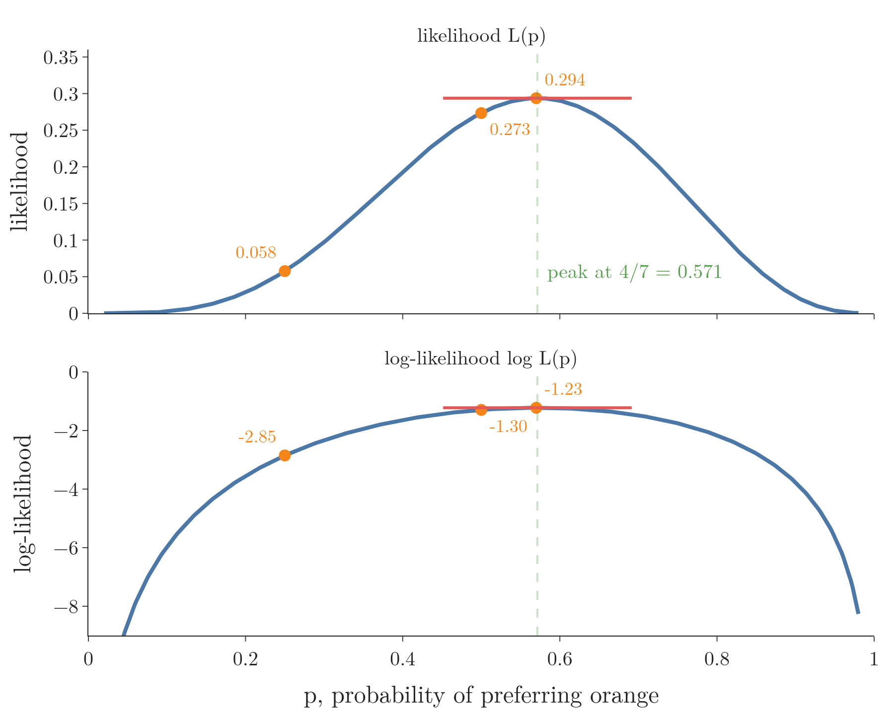
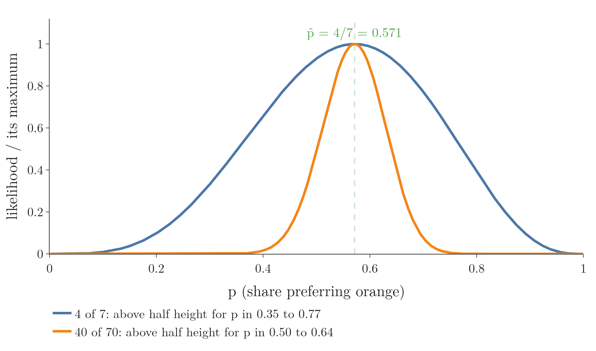
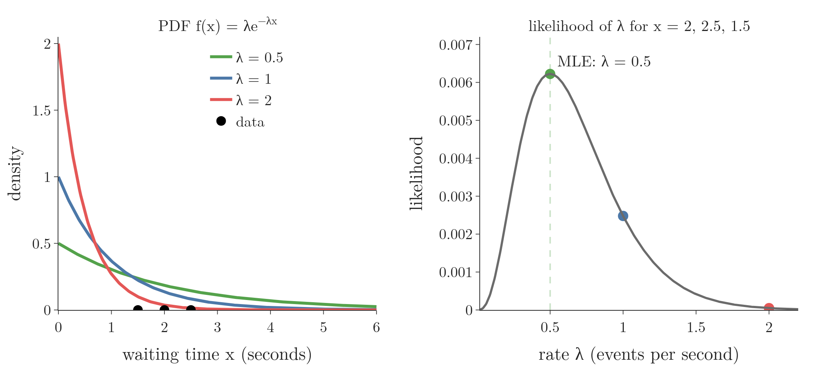
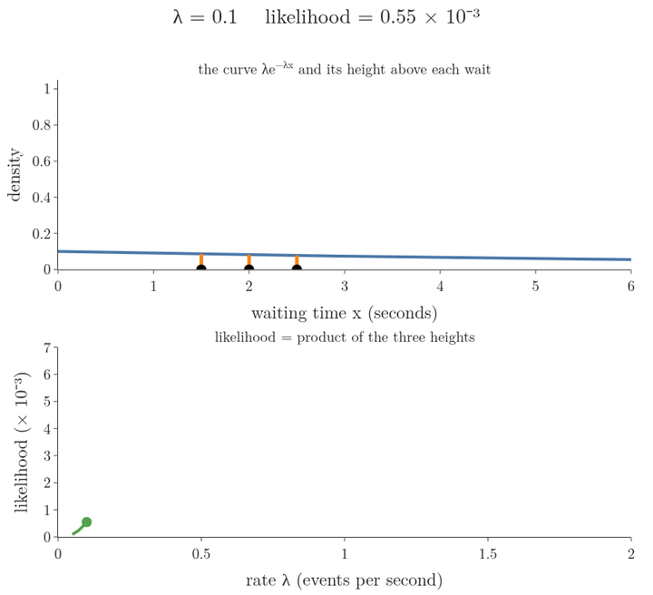
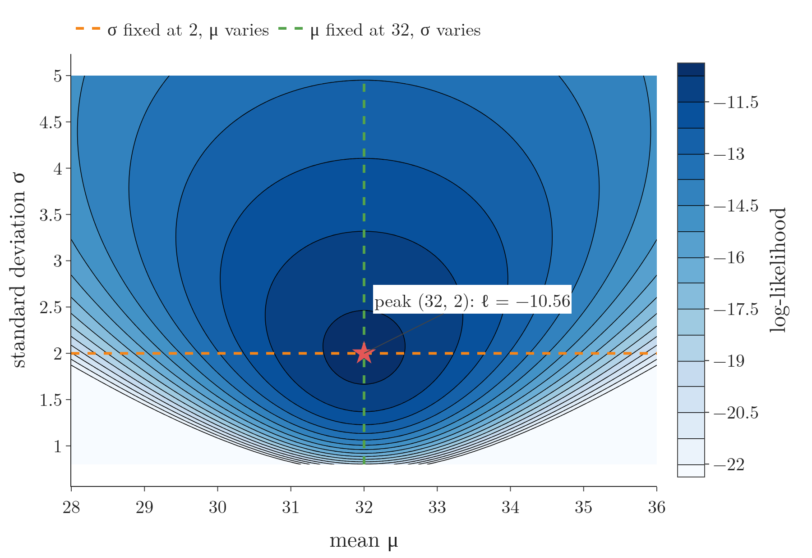
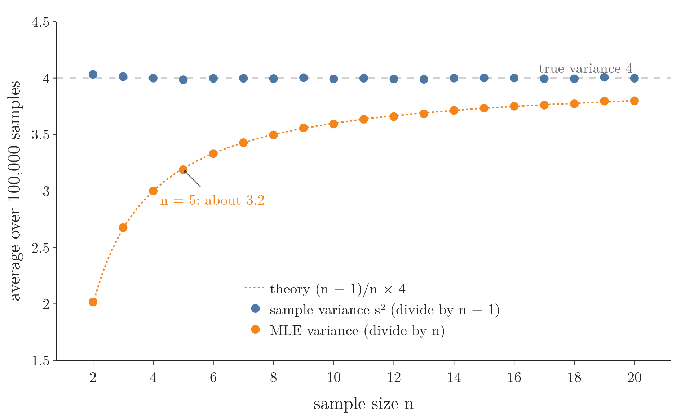

<!-- where-this-fits: generated by course_map/build_map.py; edit concepts.yaml, not this block -->
> **Where this fits:** Pipeline map step 0 (Foundations). See the [Course map](../../../00-course-map/00-course-map.md).
>
> 
>
> - **Builds on:** [Probability density function (PDF)](../../../MA/03-distributions/MA-022-pdf-and-continuous-cdf/MA-022-pdf-and-continuous-cdf.md#4-bars-whose-area-is-probability-the-pdf).
<!-- /where-this-fits -->

## 1. Overview

> **Key point:** Following the maximum likelihood recipe by hand gives three famous answers: the binomial's $\hat p$ is the share of successes, the exponential's $\hat\lambda$ is one over the average waiting time, and the normal's $\hat\mu$ and $\hat\sigma$ are the mean and standard deviation of the data.

This Note follows three explanations by Starmer (StatQuest, statquest.org): "Maximum Likelihood for the Binomial Distribution", "Maximum Likelihood for the Exponential Distribution" and "Maximum Likelihood For the Normal Distribution".

[The maximum likelihood recipe](../MA-070-maximum-likelihood-estimation/MA-070-maximum-likelihood-estimation.md#101-the-recipe) is: write the likelihood, take the log, differentiate, set the derivative to 0, solve. This Note runs it on three distributions, each in three steps (words, formula, small numbers):

- binomial: a share of yes answers (Section 2, Figure 1);
- exponential: waiting times (Section 3);
- normal: measurements such as weights (Section 4);
- why the normal's MLE variance divides by $n$, and how it differs from the sample variance with $n - 1$ (Section 5).

The Notebook checks every result by a grid search and against SciPy's built-in fitting.

## 2. The binomial distribution

> **Key point:** If $x$ of $n$ trials are successes, the maximum likelihood estimate of the success probability is $\hat p = x/n$.

### 2.1 From probability to likelihood

> **Key point:** The same binomial formula gives a probability when $p$ is fixed and $x$ varies, and a likelihood when $x$ is fixed and $p$ varies.

We ask 7 people whether they prefer orange or grape Fanta, and 4 say orange. Each answer is a Bernoulli trial, and the count of orange answers follows a binomial distribution $B(n, p)$ (see [Bernoulli and binomial](../../03-distributions/MA-031-bernoulli-and-binomial/MA-031-bernoulli-and-binomial.md#3-the-binomial-distribution)):

$$P(x \mid n, p) = \binom{n}{x} p^{x} (1 - p)^{n - x}$$

Here $\binom{n}{x}$ counts the ways to choose which $x$ of the $n$ people say orange: $\binom{7}{4} = 35$. With $p = 0.5$ fixed, this is the probability that 4 of 7 people prefer orange:

$$35 \times 0.5^4 \times 0.5^3 = 0.273$$

Now fix the data, $n = 7$ and $x = 4$, and let $p$ vary. The right-hand side stays the same formula; only the reading changes ([probability versus likelihood](../MA-069-probability-vs-likelihood/MA-069-probability-vs-likelihood.md#5-the-two-definitions)). We write it as $L(p \mid n = 7, x = 4)$.

| $p$ | 0.25 | 0.5 | 0.57 | 0.75 |
|---|---|---|---|---|
| $L(p \mid n = 7, x = 4)$ | 0.058 | 0.273 | 0.294 | 0.173 |

Figure 1 sweeps $p$ from left to right. How to read it:

- **Top panel:** one bar for each possible count $x = 0, 1, \dots, 7$ of orange answers. The bar heights are the probabilities of those counts for the current $p$, and the orange bar is our observed count, $x = 4$. Its height is the likelihood of this $p$ (the numbers in the table above).
- **Bottom panel:** the orange bar's height, traced against $p$. As $p$ slides, the bar rises and falls, and the traced curve is the likelihood curve.
- **What to look for:** the curve peaks a little above 0.57, the $p$ that makes the observed count most probable.


### 2.2 The derivation with numbers

> **Key point:** Take the log, differentiate, set the slope to 0 and solve: the best $p$ is 4 out of 7.

The peak of Figure 1 is where the slope of the likelihood curve is 0. To find it exactly we first take the log. The **log-likelihood** (G-1113) has its peak at the same $p$, because the log always grows when its input grows ([why we take the log](../MA-070-maximum-likelihood-estimation/MA-070-maximum-likelihood-estimation.md#8-why-we-take-the-log), Section 8), and it is easier to differentiate.

{height=42%}

In Figure 2, compare the two dashed lines: the same $p$ tops both curves, so either curve can be used to find it.

1. **In words:** take the log of the likelihood, differentiate with respect to $p$, set the result to 0 and solve for $p$.
2. **Formula:** the log turns the product into a sum and brings the exponents down:
   $$\ell(p) = \log\binom{7}{4} + 4\log p + 3\log(1 - p)$$
   The first term has no $p$ in it, so its derivative is 0. The derivative of $\log p$ is $1/p$. For $\log(1 - p)$ the chain rule (see [derivatives](../../06-calculus/MA-061-derivatives-of-one-variable/MA-061-derivatives-of-one-variable.md#5-rules-for-computing-derivatives)) gives $1/(1 - p) \times (-1)$:
   $$\frac{d\ell}{dp} = \frac{4}{p} - \frac{3}{1 - p}$$
3. **Example:** set it to 0 and multiply both sides by $p(1 - p)$:
   $$4(1 - p) - 3p = 0$$

   $$4 - 7p = 0$$

   $$\hat p = \frac{4}{7} = 0.571$$

The likelihood there is 0.294, higher than at every $p$ in the table.

### 2.3 The general formula

> **Key point:** The same steps with letters give $\hat p = x/n$: successes divided by trials.

1. **In words:** for $x$ successes in $n$ trials, the **MLE of a binomial $p$** (G-1241) is the observed share of successes.
2. **Formula:** the log-likelihood and its derivative are
   $$\ell(p) = \log\binom{n}{x} + x\log p$$

   $$\qquad + (n - x)\log(1 - p)$$

   $$\frac{d\ell}{dp} = \frac{x}{p} - \frac{n - x}{1 - p}$$
   Setting the derivative to 0 and multiplying by $p(1 - p)$:
   $$x(1 - p) - (n - x)p = 0$$
   The terms $-xp$ and $+xp$ cancel, leaving
   $$x - np = 0$$
   so
   $$\hat p = \frac{x}{n}$$
3. **Example:** 4 orange answers out of 7 give
   $$\hat p = 4/7 = 0.571$$
   and 40 out of 70 give the same value, $0.571$.

The second derivative, $-x/p^2 - (n - x)/(1 - p)^2$, is negative for every $p$ between 0 and 1, so this is a maximum.

The answer looks obvious once known: the best guess of a probability is the observed proportion. The derivation turns the intuition into a proof.

> **Extra:** With 40 of 70 the peak sits at the same 0.571, but the likelihood curve is much narrower: more data pins $p$ down more tightly. Figure 3 draws both curves.

{height=38%}

In Figure 3, watch the width, not the peak: ten times more data leaves $\hat p$ where it was and squeezes the range of plausible $p$ from 0.35–0.77 down to 0.50–0.64.

## 3. The exponential distribution

> **Key point:** For waiting times $x_1, \dots, x_n$, the MLE of the rate is $n$ divided by the sum of the waits, which is one over the average wait.

### 3.1 The distribution of waiting times

> **Key point:** $f(x) = \lambda e^{-\lambda x}$ for $x \ge 0$. The rate $\lambda$ is how many events happen per unit time on average; the average wait is $1/\lambda$.

The **exponential distribution** (G-733) models the time between random events: the wait for the next text message, the time until the next person opens a web page. The distribution is right-skewed: short waits are common, long waits rare. The [sampling distribution](../../04-inference/MA-033-sampling-distribution-and-clt/MA-033-sampling-distribution-and-clt.md#3-sampling-distributions) used it as a skewed population.

1. **In words:** the density starts at height $\lambda$ at $x = 0$ and falls off exponentially. The **rate parameter** (G-1636) $\lambda$ is the average number of events per unit of time.
2. **Formula:**
   $$f(x \mid \lambda) = \lambda e^{-\lambda x}, \qquad x \ge 0$$
3. **Example:** with $\lambda = 2$ events per second, on average one event every $1/2$ second; the density at $x = 1$ second is $2e^{-2} = 0.27$. With $\lambda = 0.5$, one event every 2 seconds, and the density at 1 second is $0.5e^{-0.5} = 0.30$.

Figure 4 shows the three curves for $\lambda = 0.5$, 1 and 2. A large rate means a tall start and a fast drop: short waits. The three black dots on the horizontal axis are the waiting times of Section 3.2 (1.5, 2 and 2.5 seconds). The right panel anticipates that section: each point on its grey curve is one rate, and its height is how likely those three waits are under that rate. The three coloured dots mark the three rates drawn on the left, in the same colours. Section 3.2 builds this step by step.



### 3.2 The likelihood of all the waits

> **Key point:** Multiplying the $n$ densities collects the $\lambda$'s into $\lambda^n$ and the exponents into $-\lambda\sum x_i$.

1. **In words:** each waiting time contributes the height of the curve above it. For independent waits the heights multiply, as in [the likelihood of many measurements](../MA-070-maximum-likelihood-estimation/MA-070-maximum-likelihood-estimation.md#5-the-likelihood-of-many-measurements).
2. **Formula:** pull the $n$ factors $\lambda$ out of the product and add the exponents ($e^{a}e^{b} = e^{a + b}$):
   $$L(\lambda) = \prod_{i=1}^{n} \lambda e^{-\lambda x_i} = \lambda^{n} e^{-\lambda(x_1 + \dots + x_n)}$$
3. **Example:** three waits between views of a web page: $x_1 = 2$, $x_2 = 2.5$, $x_3 = 1.5$ seconds, with sum 6. For $\lambda = 1$:
   $$L(1) = 1^3 e^{-1 \times 6} = e^{-6}$$
   $$= 0.0025$$
   For $\lambda = 0.5$:
   $$L(0.5) = 0.5^3 e^{-0.5 \times 6} = 0.125\thinspace e^{-3}$$
   $$= 0.0062$$
   The rate 0.5 makes the three waits more likely.



In Figure 5, watch the trade-off in the top panel. A small rate gives a flat, low curve: every height is small. A large rate gives a tall start but a fast drop, so the waits of 2 seconds and more fall into the tail. The product peaks in between, at $\lambda = 0.5$.

### 3.3 The derivation

> **Key point:** $\ell(\lambda) = n\log\lambda - \lambda\sum x_i$; its derivative $n/\lambda - \sum x_i$ is 0 at $\hat\lambda = n/\sum x_i$.

1. **In words:** the log turns $\lambda^n$ into $n\log\lambda$ and the exponential into its exponent. Then differentiate and set to 0.
2. **Formula:**
   $$\ell(\lambda) = n\log\lambda - \lambda\sum_{i=1}^{n} x_i$$

   $$\frac{d\ell}{d\lambda} = \frac{n}{\lambda} - \sum_{i=1}^{n} x_i = 0$$

   $$\hat\lambda = \frac{n}{\sum_{i} x_i} = \frac{1}{\bar{x}}$$
3. **Example:** with $n = 3$ waits,
   $$\hat\lambda = \frac{3}{2 + 2.5 + 1.5}$$
   $$= \frac{3}{6} = 0.5$$
   events per second. The average wait is 2 seconds, so the rate is one event every 2 seconds.

The second derivative, $-n/\lambda^2$, is negative for every $\lambda$, so the estimate, the **MLE of an exponential rate** (G-1243), is the peak of Figure 5. The fitted model is the green curve of Figure 4:

$$f(x) = 0.5e^{-0.5x}$$

> **Python:** SciPy's `fit` method uses maximum likelihood by default (its documentation says so).
>
> ```python
> import numpy as np
> from scipy import stats
>
> waits = np.array([2, 2.5, 1.5])
> # floc=0 fixes the start of the curve at 0
> loc, scale = stats.expon.fit(waits, floc=0)
> scale          # 2.0: SciPy uses scale = 1 / lambda
> 1 / scale      # 0.5, the same as 3 / 6
> ```
>
> SciPy describes the exponential by its **scale** (G-1744), the average wait $1/\lambda$, rather than by the rate (`scipy.stats.expon` documentation). SciPy also has a shift parameter `loc`; without `floc=0` SciPy fits the shift too, and the Notebook shows the curve's start then moves to the smallest wait, 1.5.

## 4. The normal distribution

> **Key point:** The MLE of $\mu$ is the mean of the data, and the MLE of $\sigma$ is the standard deviation computed with $n$ in the denominator.

### 4.1 The likelihood of $n$ mice

> **Key point:** The likelihood of a normal curve, given $n$ mice, is the product of $n$ normal densities, one per mouse.

We [built this up](../MA-070-maximum-likelihood-estimation/MA-070-maximum-likelihood-estimation.md#5-the-likelihood-of-many-measurements) before: with one mouse the likelihood is the height of the curve above it; with two mice, the product of two heights; with $n$ mice, the product of $n$ heights. Each height comes from the normal PDF (see [the normal PDF](../../03-distributions/MA-024-normal-distribution/MA-024-normal-distribution.md#5-the-pdf-of-the-normal-distribution)), with mean $\mu$ (location) and standard deviation $\sigma$ (width):

$$f(x \mid \mu, \sigma) = \frac{1}{\sigma\sqrt{2\pi}}\thinspace e^{-\frac{(x - \mu)^2}{2\sigma^2}}$$

The likelihood of the $n$ mice is the product of their heights:

$$L(\mu, \sigma \mid x_1, \dots, x_n) = \prod_{i=1}^{n} f(x_i \mid \mu, \sigma)$$

We need two derivatives of $L$: one with respect to $\mu$ (holding $\sigma$ constant) and one with respect to $\sigma$ (holding $\mu$ constant). Each MLE is where its derivative is 0. As for the binomial, we take the log first.

### 4.2 The log-likelihood, one step at a time

> **Key point:** The log of one normal density is $-\tfrac12\log(2\pi) - \log\sigma - (x - \mu)^2/(2\sigma^2)$; summing over $n$ points gives the log-likelihood.

1. **In words:** the log splits each density into three pieces: a constant, minus $\log\sigma$, and minus the squared distance from the mean divided by $2\sigma^2$.
2. **The steps**, for one density. First rewrite the constant in front. Since
   $$\sigma\sqrt{2\pi} = \sqrt{2\pi\sigma^2}$$
   we can write
   $$\frac{1}{\sigma\sqrt{2\pi}} = (2\pi\sigma^2)^{-1/2}$$
   Then, with $\log$ meaning the natural logarithm:
   1. The log turns the product of the two factors into a sum:
      $$\log f = \log (2\pi\sigma^2)^{-1/2} + \log e^{-\frac{(x - \mu)^2}{2\sigma^2}}$$
   2. The log brings the power $-\tfrac12$ down as a multiplier:
      $$\log (2\pi\sigma^2)^{-1/2} = -\tfrac12\log(2\pi\sigma^2)$$
   3. The log undoes $e$, because $\log e^{b} = b$, so the second term is just
      $$-\frac{(x - \mu)^2}{2\sigma^2}$$
   4. The log turns the product $2\pi \times \sigma^2$ into a sum:
      $$-\tfrac12\log(2\pi) - \tfrac12\log\sigma^2$$
   5. The power comes down again, since
      $$\log\sigma^2 = 2\log\sigma$$
      and the factors $\tfrac12$ and $2$ multiply to 1:
      $$\log f(x_i \mid \mu, \sigma) = -\tfrac{1}{2}\log(2\pi) - \log\sigma - \frac{(x_i - \mu)^2}{2\sigma^2}$$
3. **Example:** the 29-gram mouse under $N(32, 2^2)$, with the three pieces in order:
   $$-0.919 - 0.693 - \frac{9}{8}$$
   $$= -2.737$$
   This is the value found in [what the log does to the formula](../MA-070-maximum-likelihood-estimation/MA-070-maximum-likelihood-estimation.md#82-what-the-log-does-to-the-formula).
4. **All $n$ mice:** the log of the product is the sum of these logs. The first two pieces are the same for every mouse, so they appear $n$ times:
   $$\ell(\mu, \sigma) = -\frac{n}{2}\log(2\pi) - n\log\sigma - \frac{1}{2\sigma^2}\sum_{i=1}^{n}(x_i - \mu)^2$$
   For the five mice 29, 31, 32, 33, 35 at $\mu = 32$, $\sigma = 2$, the squared distances are 9, 1, 0, 1, 9, with sum 20, so
   $$\frac{n}{2}\log(2\pi) = 2.5 \times 1.838 = 4.595$$
   $$n\log\sigma = 5 \times 0.693 = 3.466$$
   $$\frac{20}{2\sigma^2} = \frac{20}{8} = 2.5$$
   $$\ell = -4.595 - 3.466 - 2.5 = -10.56$$

Figure 6 shows $\ell$ over both parameters as a surface. For the five mice, the value at $\mu = 32$, $\sigma = 2$ is $\ell(32, 2) = -10.56$ (the last line of the worked example above). Every pair $(\mu, \sigma)$ has its own $\ell$, so the pairs lie on the floor and $\ell$ is the height. The surface is a single hill: it rises to one top at $(32, 2)$ and falls away on every side. The orange curve is the surface above the line $\sigma = 2$ (the search over $\mu$ alone), the green curve is the surface above the line $\mu = 32$ (the search over $\sigma$ alone); both reach their top at the red point. The animation then tilts to the top view, which is Figure 7.


Figure 7 is that surface seen from above, a **contour map** (see [contour maps](../../06-calculus/MA-062-partial-derivatives-and-gradients/MA-062-partial-derivatives-and-gradients.md#11-reading-a-contour-map)): each line joins pairs $(\mu, \sigma)$ with the same $\ell$. The colours, the red peak and the two dashed one-parameter searches are the same as on the surface. Read it so: lines close together mean a steep slope, and the centre ring is the highest point, the maximum likelihood estimate. The map has a single peak. The dashed lines are the two one-parameter searches of the [one-parameter searches](../MA-070-maximum-likelihood-estimation/MA-070-maximum-likelihood-estimation.md#6-searching-for-the-best-parameters); both cross at the peak.

{height=40%}

### 4.3 The MLE of the mean

> **Key point:** Differentiating with respect to $\mu$ (with $\sigma$ held constant) and setting to 0 gives $\hat\mu = \bar{x}$.

1. **In words:** only the last term of $\ell$ contains $\mu$. Treat $\sigma$ as a constant, take the partial derivative with respect to $\mu$ (see [partial derivatives](../../06-calculus/MA-062-partial-derivatives-and-gradients/MA-062-partial-derivatives-and-gradients.md#3-partial-derivatives)), set it to 0.
2. **Formula:** by the chain rule, the derivative of $(x_i - \mu)^2$ with respect to $\mu$ is $2(x_i - \mu) \times (-1)$, so
   $$\frac{\partial\ell}{\partial\mu} = \frac{1}{\sigma^2}\sum_{i=1}^{n}(x_i - \mu)$$
   Split the sum into the two pieces:
   $$\frac{1}{\sigma^2}\Big(\sum_{i=1}^{n} x_i - n\mu\Big)$$
   Set it to 0, multiply by $\sigma^2$, and solve for $\mu$:
   $$\sum_{i=1}^{n} x_i - n\mu = 0$$
   $$\hat\mu = \frac{1}{n}\sum_{i=1}^{n} x_i = \bar{x}$$
3. **Example:**
   $$\hat\mu = \frac{29 + 31 + 32 + 33 + 35}{5}$$
   $$= \frac{160}{5} = 32$$
   grams.

The answer does not depend on $\sigma$: whatever the width, the best centre is the average.

### 4.4 The MLE of the standard deviation

> **Key point:** Differentiating with respect to $\sigma$ (with $\mu$ held at $\hat\mu$) gives $\hat\sigma^2 = \sum(x_i - \bar{x})^2/n$.

1. **In words:** now treat $\mu$ as a constant. Two terms of $\ell$ contain $\sigma$: $-n\log\sigma$ and the sum divided by $2\sigma^2$.
2. **Formula:** the derivative of $-n\log\sigma$ is $-n/\sigma$. Writing $1/(2\sigma^2)$ as $\tfrac12\sigma^{-2}$, its derivative is $-\sigma^{-3}$, so the minus sign in front makes the second term positive:
   $$\frac{\partial\ell}{\partial\sigma} = -\frac{n}{\sigma} + \frac{1}{\sigma^3}\sum_{i=1}^{n}(x_i - \mu)^2 = 0$$
   Multiply by $\sigma^3$:
   $$-n\sigma^2 + \sum_{i=1}^{n}(x_i - \mu)^2 = 0$$
   Move $n\sigma^2$ to the other side, divide by $n$, and put in $\mu = \hat\mu$:
   $$\hat\sigma^2 = \frac{1}{n}\sum_{i=1}^{n}(x_i - \bar{x})^2$$
   $$\hat\sigma = \sqrt{\hat\sigma^2}$$
3. **Example:** the squared distances from 32 add up to 20, so
   $$\hat\sigma^2 = \frac{20}{5} = 4$$
   $$\hat\sigma = \sqrt{4} = 2$$
   grams.

The formula needs at least two observations: with a single mouse every distance from $\bar x$ is 0, and the likelihood grows without limit as $\sigma \to 0$ ([the peak is where the slope is zero](../MA-070-maximum-likelihood-estimation/MA-070-maximum-likelihood-estimation.md#42-the-peak-is-where-the-slope-is-zero), Section 4.2).

So the **MLE of a normal distribution** (G-1242) for the mice is $\hat\mu = 32$ and $\hat\sigma = 2$, the curve $N(32, 2^2)$, exactly where the [searches for the best parameters](../MA-070-maximum-likelihood-estimation/MA-070-maximum-likelihood-estimation.md#6-searching-for-the-best-parameters) peaked.

> **Python:** `stats.norm.fit` returns the two maximum likelihood estimates.
>
> ```python
> mice = np.array([29, 31, 32, 33, 35])
> stats.norm.fit(mice)    # (32.0, 2.0)
> mice.mean(), mice.std() # (32.0, 2.0): NumPy's std divides by n
> mice.std(ddof=1)        # 2.236: divides by n - 1
> ```

## 5. Dividing by $n$ or by $n - 1$

> **Key point:** The MLE variance divides by $n$ and is slightly too small on average; the sample variance divides by $n - 1$ and is right on average. The gap vanishes as $n$ grows.

### 5.1 Two formulas for one spread

> **Key point:** For the five mice, the MLE variance is 4 and the sample variance is 5.

[The sample variance](../../01-descriptive-stats/MA-006-measures-of-dispersion/MA-006-measures-of-dispersion.md#6-the-sample-variance-divide-by-n---1) was defined $s^2$ with $n - 1$ in the denominator, Bessel's correction. Maximum likelihood gives $n$ instead.

1. **In words:** both formulas add the squared distances from the sample mean; they divide by different counts.
2. **Formula:**
   $$\hat\sigma^2_{\text{ML}} = \frac{1}{n}\sum_{i=1}^{n}(x_i - \bar{x})^2$$
   $$s^2 = \frac{1}{n - 1}\sum_{i=1}^{n}(x_i - \bar{x})^2$$
   $$s^2 = \frac{n}{n - 1}\thinspace\hat\sigma^2_{\text{ML}}$$
3. **Example:** the sum is 20, so
   $$\hat\sigma^2_{\text{ML}} = 20/5 = 4$$
   $$s^2 = 20/4 = 5$$

> **Another way to see it:** The [variance](../../01-descriptive-stats/MA-006-measures-of-dispersion/MA-006-measures-of-dispersion.md#4-variance) section also wrote the **population** (G-1525) **variance**, which divides by the population size $N$ and measures the distances from the true mean $\mu$. The MLE formula divides by $n$ too, but it measures the distances from the sample mean $\bar x$, because $\mu$ is unknown. That swap is the whole story of Section 5.2: distances from $\bar x$ come out a little too small, and dividing by $n - 1$ instead of $n$ makes up for it.

### 5.2 Biased but consistent

> **Key point:** On average the MLE variance equals $(n - 1)/n \times \sigma^2$, so it is biased low; since $(n - 1)/n \to 1$, it is still consistent.

An estimator is **unbiased** (G-2034) if its average over many samples equals the true value, and **biased** (G-289) if it is systematically off. The intuition: the sample mean $\bar x$ sits in the middle of its own sample, so the observations are always a little closer to $\bar x$ than to the true mean $\mu$, and squared distances measured from $\bar x$ come out a little too small. The Extra below makes the gap exact. [The sample variance](../../01-descriptive-stats/MA-006-measures-of-dispersion/MA-006-measures-of-dispersion.md#6-the-sample-variance-divide-by-n---1) section showed by simulation that dividing by $n$ comes out too small on average. The size of the gap is a simple factor:

1. **In words:** averaged over many samples of size $n$, the MLE variance is the true variance times $(n - 1)/n$.
2. **Formula:**
   $$\text{average of } \hat\sigma^2_{\text{ML}} = \frac{n - 1}{n}\thinspace\sigma^2$$
   $$\text{average of } s^2 = \sigma^2$$
3. **Example:** for samples of 5 mice from a population with $\sigma^2 = 4$, the MLE variance averages
   $$\frac{4}{5} \times 4 = 3.2$$
   while $s^2$ averages 4. With $n = 100$ the factor is 0.99, and the difference hardly matters. The Notebook draws 100,000 samples of 5 and gets 3.21 and 4.01.

> **Extra:** Why the factor is $(n - 1)/n$. Write $x_i - \mu = (x_i - \bar x) + (\bar x - \mu)$, square, and add over $i$. The cross term $2(\bar x - \mu)\sum_i(x_i - \bar x)$ is 0, because the distances from the mean add up to 0. So
>
> $$\sum_{i=1}^{n}(x_i - \bar x)^2 = \sum_{i=1}^{n}(x_i - \mu)^2 - n(\bar x - \mu)^2$$
>
> Averaged over many samples, each $(x_i - \mu)^2$ is $\sigma^2$, and $(\bar x - \mu)^2$ is the variance of the sample mean, $\sigma^2/n$ ([the sampling distribution of the mean](../../04-inference/MA-033-sampling-distribution-and-clt/MA-033-sampling-distribution-and-clt.md#42-mean-and-variance-of-the-sample-means)). The right-hand side averages
>
> $$n\sigma^2 - \sigma^2 = (n - 1)\sigma^2$$
>
> Dividing by $n$ gives the factor.

{height=40%}

Figure 8 repeats the Notebook's simulation for every $n$ from 2 to 20. Watch the orange points: they sit below 4 for small samples, which is the bias, and creep up to 4 as $n$ grows, which is consistency.

So maximum likelihood does not promise an unbiased estimate. Maximum likelihood promises the parameters that make the observed data most likely, and, as $n$ grows, an estimate that converges to the truth (consistency, from [how good the MLE is](../MA-070-maximum-likelihood-estimation/MA-070-maximum-likelihood-estimation.md#11-how-good-is-the-mle)). 

## 6. Summary

| Distribution | Parameter | Log-likelihood $\ell$ | MLE | Example |
|---|---|---|---|---|
| Binomial $B(n, p)$ | $p$ | $x\log p + (n - x)\log(1 - p) + \text{const}$ | $\hat p = x/n$ | 4 of 7: $0.571$ |
| Exponential | $\lambda$ | $n\log\lambda - \lambda\sum x_i$ | $\hat\lambda = 1/\bar{x}$ | waits 2, 2.5, 1.5: $0.5$ |
| Normal | $\mu$ | $-n\log\sigma - \sum(x_i - \mu)^2/(2\sigma^2) + \text{const}$ | $\hat\mu = \bar{x}$ | mice: 32 |
| Normal | $\sigma$ | same | $\hat\sigma^2 = \sum(x_i - \bar{x})^2/n$ | mice: $\hat\sigma = 2$ |

- Every derivation follows the same recipe: product of densities, log, derivative, set to 0, solve. So each familiar answer below is proved, not guessed.
- The binomial MLE is the observed share of successes, so the everyday guess (4 of 7 people) is also the maximum likelihood answer.
- The exponential distribution $\lambda e^{-\lambda x}$ models waiting times; its MLE rate is one over the average wait, because a rate of $\lambda$ events per second means one event every $1/\lambda$ seconds on average.
- The normal MLEs are the sample mean and the standard deviation with $n$ in the denominator, so `stats.norm.fit` and NumPy's default `std` give the same numbers for the mice.
- The MLE variance is biased low by the factor $(n - 1)/n$, because the data sit a little closer to their own mean $\bar x$ than to the true mean; the sample variance with $n - 1$ is unbiased. Both agree for large $n$, because the factor goes to 1.
- SciPy's `fit` methods compute maximum likelihood estimates by default, so they reproduce the hand formulas (the Notebook checks each one).

## 7. Sources

**Built from**

- Starmer, J. (StatQuest), "Maximum Likelihood for the Binomial Distribution, Clearly Explained!!!", YouTube, https://www.youtube.com/watch?v=4KKV9yZCoM4. Used in Section 2 (Figures 1 and 2).
- Starmer, J. (StatQuest), "Maximum Likelihood for the Exponential Distribution, Clearly Explained!!!", YouTube, https://www.youtube.com/watch?v=p3T-_LMrvBc. Used in Section 3 (Figure 5).
- Starmer, J. (StatQuest), "Maximum Likelihood For the Normal Distribution, step-by-step!!!", YouTube, https://www.youtube.com/watch?v=Dn6b9fCIUpM. Used in Section 4 (the log steps of Section 4.2).
- CampusX, "Session 38 - Descriptive Statistics Part 1 | DSMP 2023", YouTube, https://www.youtube.com/watch?v=Uv3Blie7F3g. Population variance with $N$ versus sample variance with $n - 1$, Section 5.1 (through the measures of dispersion Note).

**Other references**

- SciPy documentation: `scipy.stats.expon` (scale = 1/λ) and `rv_continuous.fit` (maximum likelihood by default). Used in Section 3.3.

## 8. Key terms

Terms taught in this Note come first; linked terms are recaps, taught in the Note the link opens.

| Term | Meaning |
|---|---|
| MLE of a binomial $p$ (G-1241) | The success probability of a binomial that makes the observed data most likely: the observed share of successes, $\hat p = x/n$. |
| Exponential distribution (G-733) | The pattern of waiting times between random events: short waits are common and long waits rare (a right-skewed continuous distribution). |
| Rate parameter $\lambda$ (G-1636) | The average number of events per unit time; the average wait is $1/\lambda$. |
| MLE of an exponential rate (G-1243) | The rate of an exponential distribution that makes the observed waiting times most likely: one over their mean, $\hat\lambda = n/\sum x_i = 1/\bar{x}$. |
| Scale (in SciPy) (G-1744) | SciPy's parameter for the exponential distribution, the average wait $1/\lambda$. |
| MLE of a normal distribution (G-1242) | The normal curve that makes the data most likely: its mean is the sample mean and its variance the average squared distance from that mean (dividing by $n$), $\hat\mu = \bar{x}$ and $\hat\sigma^2 = \sum(x_i - \bar{x})^2/n$. |
| Unbiased estimator (G-2034) | A formula that guesses a true value from a sample (an estimator) and is right on average: its average over many samples equals the true value. |
| Biased estimator (G-289) | A formula for estimating a value from data (an estimator) that is systematically too high or too low on average. |
| [Log-likelihood](../../../ML/07-classification/ML-072-log-loss/ML-072-log-loss.md#42-taking-logs) (G-1113) | The logarithm of the likelihood, which turns the product of probabilities into a sum of log probabilities; it peaks at the same parameters as the likelihood and is easier to compute and maximise. |
| [Population](../../../MA/01-descriptive-stats/MA-004-what-is-statistics/MA-004-what-is-statistics.md#4-population-and-sample) (G-1525) | The entire group of individuals or objects we want to study. |
