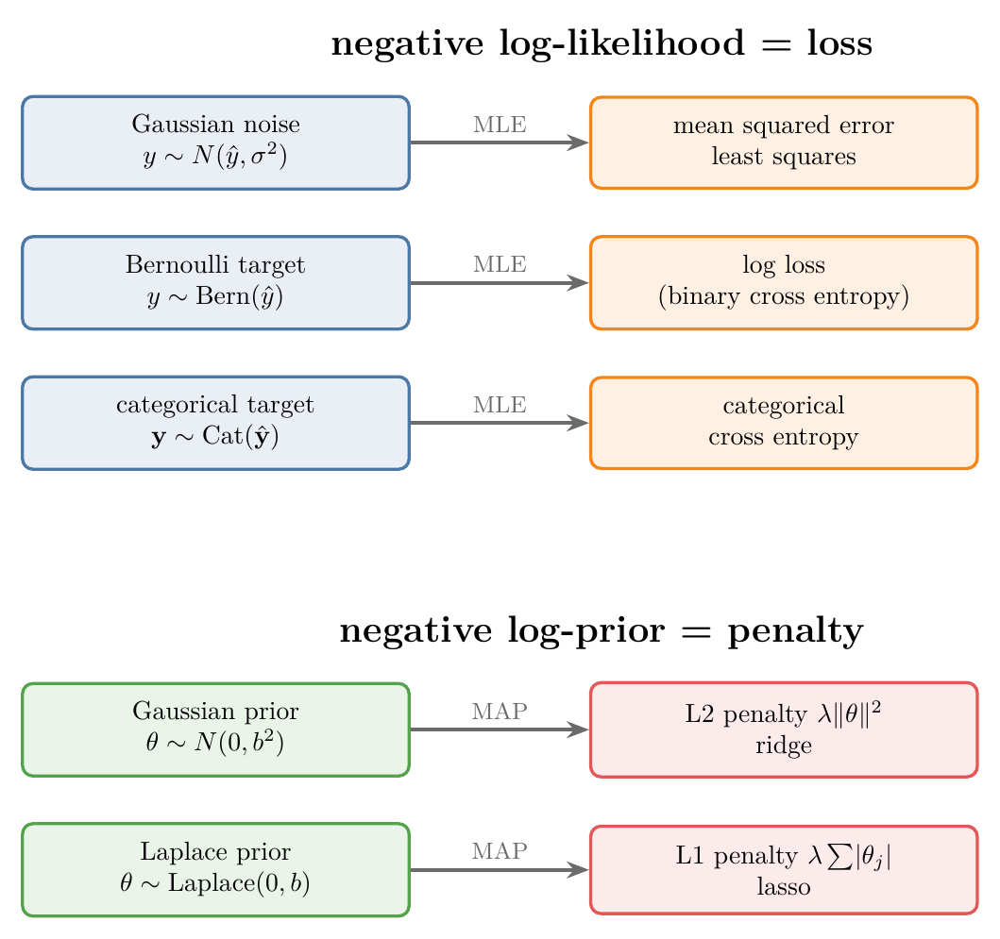
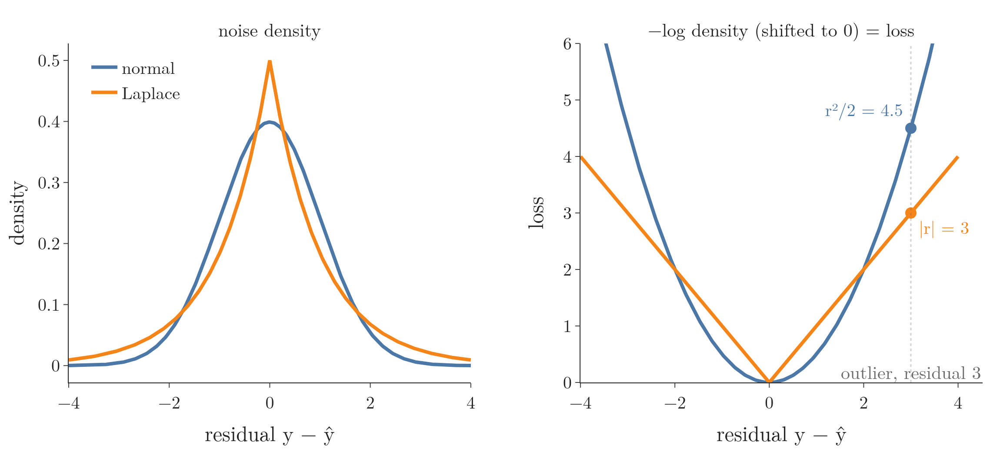
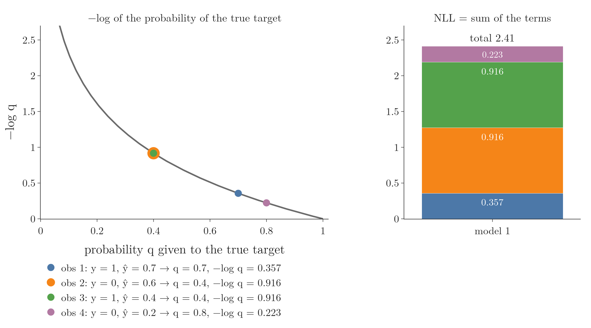
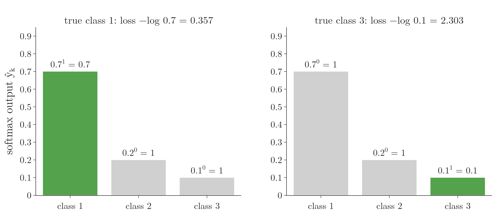
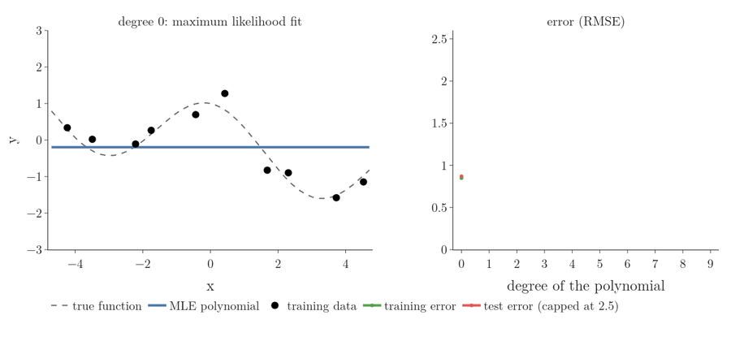
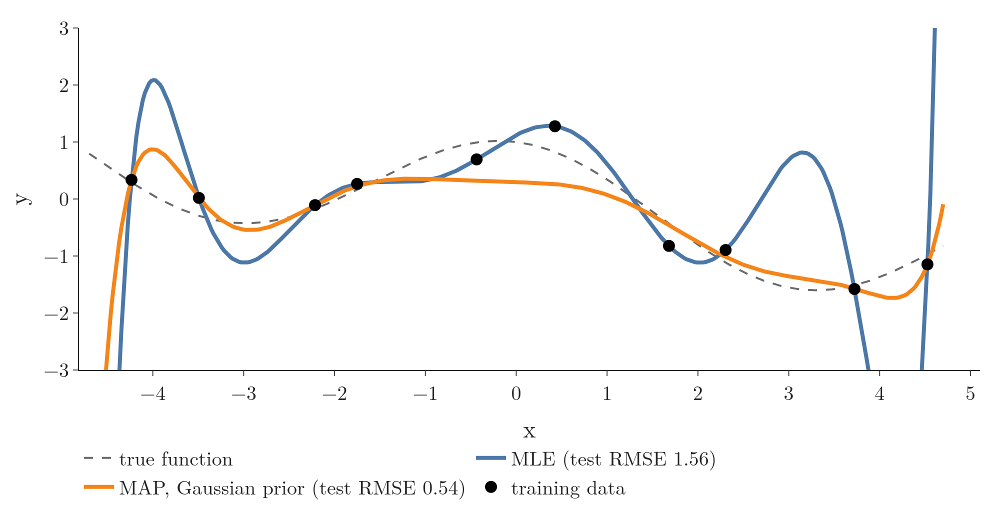

<!-- where-this-fits: generated by course_map/build_map.py; edit concepts.yaml, not this block -->
> **Where this fits:** Pipeline map steps 0 (Foundations), 8 (Model). See the [Course map](../../../00-course-map/00-course-map.md).
>
> 
>
> - **Builds on:** Overfitting ([Note ML-007](../../../ML/01-foundations/ML-007-challenges-in-ml/ML-007-challenges-in-ml.md)); One-hot encoding ([Note ML-010](../../../ML/01-foundations/ML-010-tensors/ML-010-tensors.md)); Softmax regression ([Note ML-078](../../../ML/07-classification/ML-078-softmax-regression/ML-078-softmax-regression.md)); Bayes' theorem ([Note MA-018](../../../MA/02-probability/MA-018-bayes-theorem/MA-018-bayes-theorem.md)); Derivatives of one variable ([Note MA-061](../../../MA/06-calculus/MA-061-derivatives-of-one-variable/MA-061-derivatives-of-one-variable.md)); Partial derivatives and gradients ([Note MA-062](../../../MA/06-calculus/MA-062-partial-derivatives-and-gradients/MA-062-partial-derivatives-and-gradients.md)).
> - **Leads to:** Gaussian mixture model (GMM) ([Note MA-073](../../../MA/08-likelihood/MA-073-gaussian-mixture-models/MA-073-gaussian-mixture-models.md)); Expectation maximization (EM) ([Note MA-074](../../../MA/08-likelihood/MA-074-expectation-maximization/MA-074-expectation-maximization.md)); ANN for classification ([Note DL-011](../../../DL/01-basics/DL-011-customer-churn-ann/DL-011-customer-churn-ann.md)).
> - **Compare with:** Hinge loss and soft margin ([Note ML-088](../../../ML/07-classification/ML-088-svm-soft-margin/ML-088-svm-soft-margin.md)); Entropy, information gain and Gini ([Note ML-091](../../../ML/08-trees-and-ensembles/ML-091-decision-trees-intuition/ML-091-decision-trees-intuition.md)).
<!-- /where-this-fits -->

## 1. Overview

> **Key point:** The usual ML losses are negative log-likelihoods. Gaussian noise gives the mean squared error, a Bernoulli target gives the log loss, a categorical target gives the cross entropy. Adding a prior on the parameters (MAP) gives regularisation.

This Note follows *Mathematics for Machine Learning* (Deisenroth, Faisal and Ong, 2020; MML below), Section 8.3 (Parameter Estimation) and Section 9.2 (Parameter Estimation for linear regression).

The [maximum likelihood estimation Note](../MA-070-maximum-likelihood-estimation/MA-070-maximum-likelihood-estimation.md) fitted one distribution to a column of numbers. In ML we predict a **target** $y$ (the output we want) from **features** $x$ (the input variables, one column each of the data table). One record, the features of one case together with its target, is an **observation** (one row of the data table). The distribution of $y$ changes with $x$. Figure 1 shows the idea for regression: around the line sits a bell, and a good line puts every point near the top of its bell.

Figure 2 is the map of this Note. Each model of the target turns, through maximum likelihood, into a loss we already know; each prior on the parameters turns, through MAP estimation, into a penalty we already know.

{width=75%}

## 2. A model as a distribution of the target

> **Key point:** A probabilistic model does not say "the answer is 5"; it says how likely each possible answer is. The score of a model on the training set is how likely it found the answers that really happened.

**In plain words.** A weather app says "70 percent chance of rain", not just "rain". That is a model that gives a probability to each possible outcome. Training should make the model give high probability to what actually happened. A model that said 90 percent for the real outcomes beats one that said 10 percent.

**Worked example.** Three training observations (rows of the data table). For each, the model gave a probability to the target that was truly observed:

| Observation | Probability given to the true target | Minus its natural log |
|---|---|---|
| 1 | 0.9 | $-\log 0.9 = 0.105$ |
| 2 | 0.5 | $-\log 0.5 = 0.693$ |
| 3 | 0.8 | $-\log 0.8 = 0.223$ |
| **Total** | | $0.105 + 0.693 + 0.223 = 1.02$ |

A probability near 1 costs almost nothing, a probability near 0 costs a lot, and the total is the **negative log-likelihood** (NLL). Smaller is better. The joint probability of the three outcomes is $0.9 \times 0.5 \times 0.8 = 0.36$ (the observations are independent), and $-\log 0.36 = 1.02$, the same total. Taking logs turns the product into a sum.

**The formal version.** A model with parameters $\theta$ (all the weights, for example $\theta = (w, b) = (2, 0.5)$ for a line) takes the features $x$ (for example $x = 3$ hours of study) and returns a distribution over the possible targets $y$. Such a model is a **probabilistic model** (G-1567). We write it as a conditional distribution (see the [joint, marginal and conditional probability Note](../../02-probability/MA-014-joint-marginal-conditional-probability/MA-014-joint-marginal-conditional-probability.md)):

$$p(y \mid x, \theta)$$

Read it as "the probability of the target $y$, given the features $x$ and the parameters $\theta$". In the table above, $p(y_1 \mid x_1, \theta) = 0.9$. For the training observations $(x_1, y_1), \dots, (x_n, y_n)$, here $n = 3$, we assume they are independent and identically distributed (i.i.d.), so the likelihood is a product over observations and the NLL is a sum. The symbol $\arg\min_\theta$ means "the $\theta$ that gives the smallest value":

$$\text{NLL}(\theta) = -\sum_{i=1}^{n} \log p(y_i \mid x_i, \theta), \qquad \hat\theta_{\text{ML}} = \arg\min_\theta\thinspace\text{NLL}(\theta)$$

Check: with $n = 3$ the sum has three terms, $-(\log 0.9 + \log 0.5 + \log 0.8) = 1.02$, as in the table.

Two choices define a model: how the prediction depends on $x$ (a line, a sigmoid, a neural network) and which distribution describes the target around that prediction. The second choice decides the loss.

> **Extra:** MML (§8.3.1) warns that $\theta$ standing to the right of the bar in $p(y \mid x, \theta)$ does not make it fixed. In the NLL, the data is fixed and $\theta$ is the variable, exactly as in the [probability vs likelihood Note](../MA-069-probability-vs-likelihood/MA-069-probability-vs-likelihood.md).

## 3. Gaussian noise gives least squares

> **Key point:** If $y$ is the prediction plus normal noise, the NLL is the sum of squared errors divided by $2\sigma^2$, plus a constant. Minimising it is least squares.

First, the usual way to fit a line, from the [linear regression maths Note](../../../ML/06-regression/ML-050-linear-regression-maths/ML-050-linear-regression-maths.md). Measure each point's **residual** (G-705), the vertical gap between the point and the line; square it, so that gaps above and below the line cannot cancel; add the squares up. The total is the **sum of squared errors** (G-1684). Turn the line a little and measure again. The line with the smallest total is the **ordinary least squares** (G-1406) line. This section shows that maximum likelihood, with one assumption about the noise, picks exactly the same line.

### 3.1 The model

> **Key point:** $y = \hat y + \varepsilon$ with $\varepsilon \sim N(0, \sigma^2)$: the target is normal around the prediction.

Linear regression predicts $\hat y = wx + b$ (see the [simple linear regression Note](../../../ML/06-regression/ML-049-simple-linear-regression/ML-049-simple-linear-regression.md)). The points never lie exactly on the line. We model the gap as **noise** (G-1326): a random error $\varepsilon$ drawn from a normal distribution with mean 0 and standard deviation $\sigma$ (see the [normal distribution Note](../../03-distributions/MA-024-normal-distribution/MA-024-normal-distribution.md)). Noise of this kind is called **Gaussian noise** (G-831). Then

$$p(y \mid x, \theta) = N(y \mid \hat y, \sigma^2) = \frac{1}{\sigma\sqrt{2\pi}}\thinspace e^{-\frac{(y - \hat y)^2}{2\sigma^2}}$$

In Figure 1 each grey bell is this distribution at one $x$. Its peak sits on the line, and its height at the observed $y$ is that observation's likelihood (green bar). The bell model is the "normality of residuals" assumption of the [linear regression assumptions Note](../../../ML/06-regression/ML-055-linear-regression-assumptions/ML-055-linear-regression-assumptions.md), now used to derive the loss.

### 3.2 From the NLL to squared errors

> **Key point:** The log of a normal density is a constant minus $(y - \hat y)^2 / (2\sigma^2)$. So the NLL is the squared error plus a constant.

1. **In words:** the log of the normal density splits into a part that does not depend on the weights and minus the squared error over $2\sigma^2$ (as in the [MLE for common distributions Note](../MA-071-mle-for-common-distributions/MA-071-mle-for-common-distributions.md), Section 4.2). With $\sigma$ fixed, only the squared errors change with the weights.
2. **Formula:**
   $$\text{NLL}(\theta) = \frac{1}{2\sigma^2}\sum_{i=1}^{n} (y_i - \hat y_i)^2 + n\log\big(\sigma\sqrt{2\pi}\big)$$
   The second term is a constant, and the factor $1/(2\sigma^2)$ only rescales the first. So the $\theta$ with the smallest NLL is the $\theta$ with the smallest sum of squared errors, and also the smallest mean squared error.
3. **Example:** four points $x = 1, 2, 3, 4$ with $y = 1.8, 4.3, 5.7, 8.2$, the line $\hat y = wx$ and $\sigma = 1$. At $w = 2$ the predictions are $2, 4, 6, 8$, so the errors $y - \hat y$ are $-0.2, 0.3, -0.3, 0.2$. One step per line:

   $$\text{squared sum} = 0.04 + 0.09 + 0.09 + 0.04 = 0.26$$

   $$n\log\big(\sigma\sqrt{2\pi}\big) = 4 \times 0.919 = 3.676$$

   $$\text{NLL}(2) = \frac{0.26}{2} + 3.676 = 0.13 + 3.676 = 3.81$$

   $$\text{MSE}(2) = \frac{0.26}{4} = 0.065$$

   At $w = 2.5$: NLL 7.41 and MSE 1.865. Both are worse.

The bottom panel of Figure 1 draws both curves. They have different heights, but their lowest points are at the same slope.

### 3.3 The same answer as least squares

> **Key point:** Setting the derivative to 0 gives the ordinary least squares formula; for many features, the normal equation.

For the line through the origin, the derivative of $\sum(y_i - wx_i)^2$ with respect to $w$ is $-2\sum x_i(y_i - wx_i)$. Setting it to 0:

$$\hat w = \frac{\sum_i x_i y_i}{\sum_i x_i^2} = \frac{1.8 + 8.6 + 17.1 + 32.8}{1 + 4 + 9 + 16} = \frac{60.3}{30} = 2.01$$

With an intercept and many features, the same derivation gives the normal equation $\hat\beta = (X^{\mathsf T}X)^{-1}X^{\mathsf T}y$ of the [multiple linear regression maths Note](../../../ML/06-regression/ML-053-multiple-lr-maths/ML-053-multiple-lr-maths.md). So ordinary least squares, the mean squared error of the [regression metrics Note](../../../ML/06-regression/ML-051-regression-metrics/ML-051-regression-metrics.md) and maximum likelihood with Gaussian noise all give the same line.

The NLL here is a quadratic bowl in the weights. MML (§9.2.1, remark after equation 9.12) shows that its Hessian, $X^{\mathsf T}X$, is positive definite, so the single flat point is the global minimum (convexity: the [convex and non-convex cost functions Note](../../07-optimisation/MA-065-convex-and-non-convex-cost-functions/MA-065-convex-and-non-convex-cost-functions.md)).

### 3.4 Estimating the noise

> **Key point:** Maximum likelihood also estimates $\sigma^2$: it is the mean squared residual of the fitted line.

Treating $\sigma$ as a parameter too and setting its derivative to 0 (MML §9.2.1, equation 9.22) gives the same result as the normal MLE variance of the [MLE for common distributions Note](../MA-071-mle-for-common-distributions/MA-071-mle-for-common-distributions.md), with the residuals in place of the distances from the mean:

1. **In words:** the MLE of the noise variance is the average squared distance between the targets and the fitted line.
2. **Formula:**
   $$\hat\sigma^2 = \frac{1}{n}\sum_{i=1}^{n}(y_i - \hat y_i)^2$$
3. **Example:** at $\hat w = 2.01$ the squared residuals add up to 0.257, so $\hat\sigma^2 = 0.257/4 = 0.064$ and $\hat\sigma = 0.25$. The points scatter about 0.25 above and below the line.

So the training MSE of a least squares fit is the maximum likelihood estimate of the noise variance.

> **Extra:** Choosing a different noise distribution gives a different loss. With **Laplace noise**, drawn from the **Laplace distribution** (G-1044) with density $e^{-\lvert y - \hat y\rvert / b}/(2b)$, the log of one density is $-\log(2b) - \lvert y - \hat y\rvert / b$. Summing and changing the sign, the NLL is $\sum_i\lvert y_i - \hat y_i\rvert / b + n\log(2b)$: with $b$ fixed, minimising it minimises the absolute errors, the mean absolute error of the [regression metrics Note](../../../ML/06-regression/ML-051-regression-metrics/ML-051-regression-metrics.md), called the L1 loss in the [loss functions Note](../../../DL/01-basics/DL-014-dl-loss-functions/DL-014-dl-loss-functions.md). The Notebook checks this by minimising the Laplace NLL numerically. The Laplace curve has heavier tails than the normal curve, so a far-away point is less surprising under it; in loss terms, an outlier adds its distance, not its squared distance. The heavier tails are why the absolute-error loss is more robust to outliers (Murphy §7.4).

In Figure 3, watch the outlier line at a residual of 3: the parabola charges more than the V, and the gap keeps growing for points further out.

## 4. A Bernoulli target gives the log loss

> **Key point:** With a 0/1 target and predicted probability $\hat y$, the Bernoulli PMF $\hat y^{\thinspace y}(1 - \hat y)^{1 - y}$ has minus log $-[y\log\hat y + (1 - y)\log(1 - \hat y)]$: the log loss term for one observation.

### 4.1 Why least squares cannot fit logistic regression

> **Key point:** On the log-odds axis every observation sits at $+\infty$ or $-\infty$, so every residual is infinite. Least squares has nothing to minimise; maximum likelihood does.

We use 8 Iris flowers (the **Iris dataset**, G-973): 4 versicolor and 4 virginica, with petal widths 1.0, 1.3, 1.5, 1.7 cm (versicolor) and 1.5, 1.8, 2.0, 2.3 cm (virginica). The target is 1 for virginica and 0 for versicolor. Logistic regression draws a straight line, not on the probability axis, but on the **log-odds** (G-1116) axis, $\log\frac{p}{1 - p}$; the sigmoid turns it back into a probability (the [sigmoid function Note](../../../ML/07-classification/ML-071-sigmoid-function/ML-071-sigmoid-function.md)).

The log-odds of a probability of 1 is $\log(1/0) = +\infty$, and of 0 it is $-\infty$. So on the log-odds axis the virginica flowers sit at $+\infty$ and the versicolor flowers at $-\infty$ (Figure 4, top left, triangles). The residual from any straight line to a point at infinity is infinite, so the sum of squared residuals is infinite for every line, and least squares cannot compare two lines.

### 4.2 Project, convert, multiply, turn

> **Key point:** Each flower gets its probability from the line; its likelihood is $p$ if it is virginica and $1 - p$ if it is versicolor. The best line has the largest product.

Maximum likelihood scores a candidate line in four steps:

1. **Project:** move each flower straight onto the line. Its height there is its candidate log-odds.
2. **Convert:** the sigmoid $p = 1/(1 + e^{-z})$ turns each log-odds $z$ into a probability of virginica. On the probability axis the straight line becomes an S-shaped curve (Figure 4, top right).
3. **Multiply:** a virginica flower's likelihood is its $p$; a versicolor flower's likelihood is $1 - p$, the probability of not being virginica. The bars in Figure 4 (top right) have exactly these lengths. In logs, the log-likelihood is the sum of the logs of the eight bars.
4. **Turn:** change the slope of the line and score it again. Keep the line with the largest log-likelihood.

In Figure 4, watch the bottom panel. The flat line (slope 0) gives every flower $p = 0.5$ and log-likelihood $8\log 0.5 = -5.55$. Steeper lines lengthen most bars and the log-likelihood rises to $-3.01$ at slope 7.27. Steeper still, the versicolor flower at 1.7 cm and the virginica flower at 1.5 cm, which sit on the wrong sides, get very short bars, and the log-likelihood falls again ($-3.79$ at slope 16). An optimiser does the same search, but each turn goes in the direction that raises the log-likelihood (Notebook, Section 2).

> **Another way to see it:** The [log loss Note](../../../ML/07-classification/ML-072-log-loss/ML-072-log-loss.md) (Sections 2 and 3) compared just two fixed decision boundaries on four points. For each point it took the probability the model gave to the point's **true** class, multiplied the four numbers, and called the model with the larger product better: 0.090 for model 1 against 0.176 for model 2. The two views do the same thing. Figure 4 tries a whole family of lines instead of two, and its bars are exactly "the probability of the true class".

### 4.3 The Bernoulli model behind the log loss

The [log loss Note](../../../ML/07-classification/ML-072-log-loss/ML-072-log-loss.md) built the binary cross entropy by multiplying the probabilities of the true classes and taking minus the log. That Note found the formula $-[y\log\hat y + (1 - y)\log(1 - \hat y)]$ by noticing that the $y$ factors switch the right term on. The NLL view shows where that formula comes from.

1. **In words:** model the target as a Bernoulli trial (see the [Bernoulli and binomial Note](../../03-distributions/MA-031-bernoulli-and-binomial/MA-031-bernoulli-and-binomial.md), Section 2.1) whose success probability is the sigmoid output $\hat y = \sigma(w \cdot x)$. Minus the log of its PMF is the log loss term.
2. **Formula:**
   $$p(y \mid x, \theta) = \hat y^{\thinspace y}(1 - \hat y)^{1 - y} \quad\Longrightarrow\quad -\log p(y \mid x, \theta) = -\big[y\log\hat y + (1 - y)\log(1 - \hat y)\big]$$
   The log brings the exponents $y$ and $1 - y$ down as multipliers. Summed over the observations, this is the binary cross entropy; divided by $n$, the log loss.
3. **Example:** the four observations of the log loss Note, model 1: targets 1, 0, 1, 0 with $\hat y = 0.7, 0.6, 0.4, 0.2$. The Bernoulli PMF gives $0.7^1 0.3^0 = 0.7$, then $0.6^0 0.4^1 = 0.4$, then 0.4 and 0.8. The NLL is $-\log(0.7 \times 0.4 \times 0.4 \times 0.8) = 2.41$, the cross entropy found there.

In Figure 5, watch where each point sits on the curve: observations 2 and 3, whose true target got only 0.4, contribute most of the 2.41.

So logistic regression is maximum likelihood estimation for a Bernoulli model whose probability comes from a sigmoid. Unlike Gaussian noise, the weights sit inside the sigmoid and the logs, so there is no closed form and we use gradient descent.

> **Extra:** The log loss of logistic regression has a single lowest point. Bishop (§4.3.3) shows that its Hessian is positive definite, so the loss is a bowl with a unique minimum, and gradient descent cannot get stuck on a worse one. The bottom panel of Figure 4 has one peak for the same reason. Several minima appear only when a neural network sits between the weights and the loss (the [convex and non-convex cost functions Note](../../07-optimisation/MA-065-convex-and-non-convex-cost-functions/MA-065-convex-and-non-convex-cost-functions.md), Section 5.2).

## 5. A categorical target gives the cross entropy

> **Key point:** With several classes, the model gives each class a probability; the loss is minus the log of the probability it gave to the true class, and nothing else. That is the categorical cross entropy.

**In plain words.** Suppose a flower can be one of three species. The model gives each species a probability, and the three add up to 1. If the flower really is species 1, we read off the probability the model gave to species 1 and ignore the others. The higher it is, the smaller the loss. A softmax output provides exactly such probabilities (see the [softmax regression Note](../../../ML/07-classification/ML-078-softmax-regression/ML-078-softmax-regression.md)). The distribution that gives probabilities to $K$ outcomes is the **categorical distribution** (G-352), the Bernoulli distribution extended from 2 outcomes to $K$.

**Worked example.** Three classes, softmax output $(0.7, 0.2, 0.1)$. The true class is the first. Write the true class as a **one-hot** list: 1 for the true class, 0 for the others, so $\mathbf{y} = (1, 0, 0)$. The model's probabilities are $\hat y = (\hat y_1, \hat y_2, \hat y_3) = (0.7, 0.2, 0.1)$.

| Class $k$ | $y_k$ | $\hat y_k$ | Factor $\hat y_k^{\thinspace y_k}$ | Term $y_k\log\hat y_k$ |
|---|---|---|---|---|
| 1 | 1 | 0.7 | $0.7^1 = 0.7$ | $1 \times \log 0.7 = -0.357$ |
| 2 | 0 | 0.2 | $0.2^0 = 1$ | $0 \times \log 0.2 = 0$ |
| 3 | 0 | 0.1 | $0.1^0 = 1$ | $0 \times \log 0.1 = 0$ |

The product of the factors is $0.7 \times 1 \times 1 = 0.7$, the probability of the true class. The sum of the terms is $-0.357$. The loss is minus that: $-\log 0.7 = 0.357$.

**The formal version.** For $K$ classes, $\prod_{k=1}^{K}$ means "multiply the factors for $k = 1$ to $K$" and $\sum_{k=1}^{K}$ means "add the terms". Every factor with $y_k = 0$ equals 1, so only the true class remains:

$$p(\mathbf{y} \mid x, \theta) = \prod_{k=1}^{K} \hat y_k^{\thinspace y_k} \quad\Longrightarrow\quad -\log p(\mathbf{y} \mid x, \theta) = -\sum_{k=1}^{K} y_k\log\hat y_k$$

Check: $K = 3$ gives $-(1 \times \log 0.7 + 0 + 0) = 0.357$, as in the table. Minus its log is the **categorical cross entropy**.

{height=33%}

Figure 6 draws these bars. Watch the green bar: the loss only reads the probability of the true class, so the same output costs 0.357 when the model is right and 2.303 when the true class is the one it rated 0.1.

The categorical cross entropy is the loss of softmax regression and of every classification network in the [loss functions Note](../../../DL/01-basics/DL-014-dl-loss-functions/DL-014-dl-loss-functions.md). Training a classifier by minimising cross entropy is maximum likelihood estimation.

With several observations, the losses add up. A small network that classifies Iris flowers gives three training flowers these softmax probabilities for their true species: 0.57 (a setosa), 0.58 (a virginica) and 0.52 (a versicolor). Their losses are $-\ln 0.57 = 0.56$, $-\ln 0.58 = 0.54$ and $-\ln 0.52 = 0.65$, and the total, $1.76$, is the number that backpropagation then tries to lower.

### 5.1 Why not squared residuals?

> **Key point:** For a probability, the squared residual $(1 - p)^2$ never exceeds 1 and stays almost flat for bad predictions. Cross entropy $-\ln p$ grows without limit and is steep exactly where the prediction is bad, so bad predictions get large corrections.

The observed probability of the true class is 1, so each flower also has a residual, $1 - p$: for the setosa above, $1 - 0.57 = 0.43$. We could square the residuals and add them, as for regression. Figure 7 shows why we do not.

1. **In words:** as the prediction gets worse, cross entropy explodes, while the squared residual creeps up to at most 1.
2. **Mechanism:** a gradient step is proportional to the slope of the loss (the [gradient descent Note](../../../ML/06-regression/ML-056-gradient-descent/ML-056-gradient-descent.md)). A steeper slope means a larger step towards a better prediction.
3. **Example:** at $p = 0.05$, a very bad prediction. The slope of each loss, one line each:

   $$\text{slope of } -\ln p = -\frac{1}{p} = -\frac{1}{0.05} = -20$$

   $$\text{slope of } (1 - p)^2 = -2(1 - p) = -2 \times 0.95 = -1.9$$

   The cross entropy slope is about ten times steeper.

In Figure 7, watch the two red tangent lines as the dot slides to the left: the blue one turns almost vertical, the orange one barely tilts.

| Model of the target | NLL per observation | Name of the loss |
|---|---|---|
| $N(\hat y, \sigma^2)$, any real $y$ | $(y - \hat y)^2/(2\sigma^2) + \text{const}$ | squared error (MSE) |
| $\text{Laplace}(\hat y, b)$ | $\lvert y - \hat y\rvert/b + \text{const}$ | absolute error (MAE) |
| $\text{Bern}(\hat y)$, $y \in \lbrace0, 1\rbrace$ | $-[y\log\hat y + (1 - y)\log(1 - \hat y)]$ | log loss |
| $\text{Cat}(\hat y_1, \dots, \hat y_K)$, one-hot $\mathbf{y}$ | $-\sum_k y_k\log\hat y_k$ | categorical cross entropy |

## 6. Maximum likelihood overfits

> **Key point:** Maximum likelihood uses all the freedom a model has to match the training data, noise included. With many parameters and few observations, the training NLL keeps falling while the error on new data explodes.

A model that is too flexible learns the noise of its training data and fails on new data: this is **overfitting** (see the [challenges in ML Note](../../../ML/01-foundations/ML-007-challenges-in-ml/ML-007-challenges-in-ml.md) and the [bias-variance Note](../../../ML/06-regression/ML-061-bias-variance/ML-061-bias-variance.md)). Maximum likelihood has no brake against overfitting. The method is told to make the observed data as likely as possible, and a model that passes through every point does that best.

Figure 8 repeats the experiment of MML §9.2.2, with our own random draw of the data (Notebook, Section 4). Ten points come from $y = -\sin(x/5) + \cos(x)$ plus noise with $\sigma = 0.2$. We fit polynomials of degree 0 to 9 by maximum likelihood with Gaussian noise, which is least squares on polynomial features (see the [polynomial regression Note](../../../ML/06-regression/ML-060-polynomial-regression/ML-060-polynomial-regression.md)).

| Degree | 0 | 1 | 2 | 4 | 6 | 8 | 9 |
|---|---|---|---|---|---|---|---|
| Training RMSE | 0.85 | 0.64 | 0.53 | 0.29 | 0.22 | 0.18 | 0.00 |
| Test RMSE (200 new points) | 0.87 | 0.74 | 0.58 | 0.27 | 0.24 | 0.49 | 1.56 |

- The **training error never rises** as the degree grows (the book observes the same). The reason is a one-line argument: every polynomial of degree $M - 1$ is also a polynomial of degree $M$ with last coefficient 0, so the best degree $M$ fit can do no worse on the training data.
- At degree 9 there are 10 coefficients for 10 points. The polynomial passes through every point, the training error is 0, and the curve swings wildly between the points.
- The **test error** is lowest around degree 6 and then rises fast.

With more parameters than observations the MLE is not even unique (MML §9.2.2): the matrix $X^{\mathsf T}X$ in the normal equation cannot be inverted, and infinitely many coefficient vectors fit the data equally well. The next section adds the missing brake.

## 7. MAP estimation: maximum likelihood plus a prior

> **Key point:** MAP estimation maximises likelihood × prior. Its negative log is the NLL plus a penalty on the parameters: a Gaussian prior gives the ridge penalty, a Laplace prior the lasso penalty.

### 7.1 The posterior over the parameters

> **Key point:** Before seeing data we already believe the weights are probably small. MAP picks the weights that fit the data and also agree with that belief.

**In plain words.** A student fits a line to four points. The data alone says "slope 2.01". But a sensible person says: "slopes much bigger than 2 are rare in my problem, so I will accept a slightly worse fit for a more ordinary slope". That prior belief is written as a distribution over the weights. The data score and the belief score are then combined, and the best combination wins.

**Worked example** on the four points of Section 3 ($x = 1, 2, 3, 4$; $y = 1.8, 4.3, 5.7, 8.2$; line $\hat y = wx$; noise $\sigma = 1$). The belief: the slope $w$ is normal around 0 with spread $0.5$. The cost of a slope is the NLL part plus the prior part (constants dropped):

| Slope $w$ | Squared errors | NLL part $\tfrac12\sum(y - wx)^2$ | Prior part $\dfrac{w^2}{2 \times 0.5^2} = 2w^2$ | Total |
|---|---|---|---|---|
| 2.01 (the MLE) | 0.257 | 0.13 | $2 \times 2.01^2 = 8.08$ | 8.21 |
| 1.77 | 1.985 | 0.99 | $2 \times 1.77^2 = 6.27$ | 7.26 |

The data alone prefers 2.01. With the belief, 1.77 has the smaller total and wins: that is the MAP slope (Section 7.2 derives it).

**The formal version.** MML (§9.2.3) observes that parameter values often become large when a model overfits, and proposes to state beforehand which values are plausible. A **prior** (G-1564) $p(\theta)$ is that belief as a distribution over the parameters. Bayes' theorem (see the [Bayes' theorem Note](../../02-probability/MA-018-bayes-theorem/MA-018-bayes-theorem.md)) combines it with the likelihood $p(\text{data} \mid \theta)$ into a **posterior** (G-1535), the belief after seeing the data:

$$p(\theta \mid \text{data}) = \frac{p(\text{data} \mid \theta)\thinspace p(\theta)}{p(\text{data})}$$

The evidence $p(\text{data})$ does not depend on $\theta$, so for finding the best $\theta$ we can drop it, as Naive Bayes dropped it when comparing classes (the [Naive Bayes intuition Note](../../../ML/07-classification/ML-081-naive-bayes-intuition/ML-081-naive-bayes-intuition.md)). The **maximum a posteriori** (**MAP**) estimate (G-1189) is the $\theta$ with the largest posterior. In logs, it minimises the NLL plus minus the log of the prior:

$$\hat\theta_{\text{MAP}} = \arg\max_\theta\thinspace p(\text{data} \mid \theta)\thinspace p(\theta) = \arg\min_\theta\thinspace\big[\text{NLL}(\theta) - \log p(\theta)\big]$$

Check: the bracket is the "Total" column of the table. With a flat prior, the same for every $\theta$, $-\log p(\theta)$ is a constant and MAP gives the MLE. The prior only matters when it prefers some values over others.

The [Naive Bayes maths Note](../../../ML/07-classification/ML-082-naive-bayes-maths/ML-082-naive-bayes-maths.md) used the MAP rule to pick a class. Here the same principle picks parameter values.

### 7.2 A Gaussian prior gives ridge regression

> **Key point:** With prior $\theta_j \sim N(0, b^2)$ and Gaussian noise $\sigma$, MAP minimises $\sum(y_i - \hat y_i)^2 + \lambda\sum_j\theta_j^2$ with $\lambda = \sigma^2/b^2$.

First, the penalty itself, from the [ridge regression intuition Note](../../../ML/06-regression/ML-062-ridge-regression-intuition/ML-062-ridge-regression-intuition.md). With only two training points, the least squares line passes through both, with zero error, and its slope can be far too steep for new data. **Ridge regression** (G-1691) adds $\lambda$ times the squared slope to the squared errors. With $\lambda = 1$ on the two points $(1, 2)$ and $(3, 5)$, the least squares line (slope 1.5) costs $0 + 1.5^2 = 2.25$, while a flatter line with slope 0.9 costs $0.72 + 0.9^2 = 1.53$ and wins. The penalty looks like an arbitrary fix. MAP shows where it comes from:

1. **In words:** a normal prior centred on 0 says each weight is probably small. Minus its log is the squared weight over $2b^2$, plus a constant. Added to the Gaussian NLL and multiplied by $2\sigma^2$, this is the ridge loss of the [ridge regression maths Note](../../../ML/06-regression/ML-063-ridge-regression-maths/ML-063-ridge-regression-maths.md).
2. **Formula** (MML equations 9.28 and 9.33):
   $$\text{NLL}(\theta) - \log p(\theta) = \frac{1}{2\sigma^2}\sum_{i}(y_i - \hat y_i)^2 + \frac{1}{2b^2}\sum_j\theta_j^2 + \text{const} \thickspace\propto\thickspace\sum_{i}(y_i - \hat y_i)^2 + \frac{\sigma^2}{b^2}\sum_j\theta_j^2$$
   So $\lambda = \sigma^2/b^2$: a narrow prior (small $b$) or noisy data (large $\sigma$) means strong regularisation.
3. **Example:** the four points of Section 3 with $\sigma = 1$ and prior $w \sim N(0, 0.5^2)$, so $\lambda = 1/0.25 = 4$. As in the ridge maths Note, $\lambda$ is added to the bottom of the fraction:
   $$\hat w_{\text{MAP}} = \frac{\sum_i x_i y_i}{\sum_i x_i^2 + \lambda} = \frac{60.3}{30 + 4} = 1.77$$
   The prior pulls the slope from the MLE 2.01 towards 0.

Figure 9 applies this to the degree-9 polynomial of Figure 8, with prior $N(0, 0.1^2)$ on every coefficient and $\sigma = 0.2$, so $\lambda = 0.04/0.01 = 4$. The MLE swings through every point; the MAP curve stays close to the true function, and its test RMSE drops from 1.56 to 0.54.

### 7.3 A Laplace prior gives the lasso

> **Key point:** With a Laplace prior, minus the log prior is $\sum_j\lvert\theta_j\rvert / b$: the L1 penalty of the lasso.

Compare the two penalties on a weight of 0.3 and a tiny weight of 0.03, both with $\lambda = 4$:

| Weight | L2 penalty $4w^2$ | L1 penalty $4\lvert w\rvert$ |
|---|---|---|
| 0.3 | $4 \times 0.09 = 0.36$ | $4 \times 0.3 = 1.2$ |
| 0.03 | $4 \times 0.0009 = 0.0036$ | $4 \times 0.03 = 0.12$ |

The squared penalty almost vanishes for a tiny weight, so it stops pushing; the absolute penalty keeps pushing at the same rate down to 0. A prior with this behaviour, a sharp peak at 0, is the Laplace prior.

1. **In words:** the Laplace prior has a sharp peak at 0, so it believes many weights are exactly 0. Minus its log is the absolute value of each weight divided by $b$.
2. **Formula:** with $p(\theta_j) = e^{-\lvert\theta_j\rvert/b}/(2b)$,
   $$\text{NLL}(\theta) - \log p(\theta) \thickspace\propto\thickspace\sum_{i}(y_i - \hat y_i)^2 + \frac{2\sigma^2}{b}\sum_j\lvert\theta_j\rvert$$
   The result is the loss of the [lasso regression Note](../../../ML/06-regression/ML-066-lasso-regression/ML-066-lasso-regression.md), with $\lambda = 2\sigma^2/b$.
3. **Example:** with $\sigma = 1$ and $b = 0.5$, $\lambda = 2/0.5 = 4$; a weight of 0.3 costs a penalty of $4 \times 0.3 = 1.2$.

MML (§9.5) states this equivalence of the Laplace prior and the lasso. The term $\lvert\theta_j\rvert / b$ has a corner at 0, the same corner of $\lvert m\rvert$ that lets lasso coefficients reach exactly 0 in the [lasso sparsity Note](../../../ML/06-regression/ML-067-lasso-sparsity/ML-067-lasso-sparsity.md).

> **Extra:** MAP still returns a single **point estimate** (G-1507), one set of parameter values (MML §9.2.4). The book notes (Section 9.2.3, Example 9.6) that a prior can push back overfitting but is not a general cure, and continues in Section 9.3 with Bayesian linear regression, which keeps the whole posterior distribution and averages the predictions of all plausible parameter values.

## 8. Summary

| Ingredient | Becomes | Example in this Note |
|---|---|---|
| Gaussian noise + MLE | least squares, MSE | slope $\hat w = 60.3/30 = 2.01$ |
| MLE of the noise variance | mean squared residual | $\hat\sigma^2 = 0.064$ |
| Laplace noise + MLE | MAE (L1 loss) | |
| Bernoulli target + MLE | log loss | NLL 2.41 for model 1 |
| Categorical target + MLE | categorical cross entropy | $-\log 0.7 = 0.357$ |
| Gaussian prior + MAP | ridge, $\lambda = \sigma^2/b^2$ | $\hat w = 60.3/34 = 1.77$ |
| Laplace prior + MAP | lasso, $\lambda = 2\sigma^2/b$ | |

- A probabilistic model gives a distribution $p(y \mid x, \theta)$ over the target; training minimises its NLL.
- The choice of distribution for the target decides the loss: normal gives squared error, Bernoulli gives log loss, categorical gives cross entropy.
- Maximum likelihood overfits flexible models: the training error never rises with more parameters.
- MAP adds $-\log p(\theta)$ to the NLL; a Gaussian prior is ridge, a Laplace prior is lasso.

## 9. Sources

**Built from**

- Starmer, J. (StatQuest), "The Main Ideas of Fitting a Line to Data (The Main Ideas of Least Squares and Linear Regression)", YouTube, https://www.youtube.com/watch?v=PaFPbb66DxQ. The least squares recap that opens Section 3.
- Starmer, J. (StatQuest), "Logistic Regression Details Pt 2: Maximum Likelihood", YouTube, https://www.youtube.com/watch?v=BfKanl1aSG0. Sections 4.1 and 4.2 (Figure 4).
- CampusX, "Logistic Regression Part 4 | Loss Function | Maximum Likelihood | Binary Cross Entropy", YouTube, https://www.youtube.com/watch?v=6bXOo0sxY5c. The two-model comparison in Section 4.2 (through the log loss Note).
- Starmer, J. (StatQuest), "Neural Networks Part 6: Cross Entropy", YouTube, https://www.youtube.com/watch?v=6ArSys5qHAU. The Iris example of Section 5 and Section 5.1 (Figure 7).
- CampusX, "Loss Functions in Deep Learning | Deep Learning | CampusX", YouTube, https://www.youtube.com/watch?v=gb5nm_3jBIo. Section 5: only the true class's term survives a one-hot target.
- Starmer, J. (StatQuest), "Regularization Part 1: Ridge (L2) Regression", YouTube, https://www.youtube.com/watch?v=Q81RR3yKn30. The penalty recap that opens Section 7.2.
- Deisenroth, M. P., Faisal, A. A. and Ong, C. S. (2020). *Mathematics for Machine Learning*. Cambridge University Press. Free PDF at mml-book.github.io. §8.3.1 (Gaussian likelihood gives least squares, eq. 8.18), §8.3.2 (MAP), §9.2.1 (MLE for linear regression, Hessian remark, noise variance eq. 9.22), §9.2.2 (overfitting experiment), §9.2.3–9.2.4 (MAP as regularisation, eqs. 9.28 and 9.33), §9.5 (Laplace prior and lasso).

**Other references**

- Bishop, C. M. (2006). *Pattern Recognition and Machine Learning*. Springer. §4.3.3 (the Hessian of the logistic regression error is positive definite, so the error has a unique minimum).
- Murphy, K. P. (2012). *Machine Learning: A Probabilistic Perspective*. MIT Press. §7.4 (robust linear regression with the Laplace likelihood).
- scikit-learn documentation: `LogisticRegression` (C = inf for no penalty) and `Ridge`, used in the Notebook checks.

## 10. Key terms

| Term | Meaning |
|---|---|
| Probabilistic model | A model that outputs a distribution $p(y \mid x, \theta)$ over the target rather than a single value |
| Noise ($\varepsilon$) | The random part of a target that the model's prediction does not explain |
| Gaussian noise | Noise drawn from $N(0, \sigma^2)$; under MLE it gives the squared-error loss |
| Laplace distribution | A peaked, heavy-tailed distribution with density $e^{-\lvert x - \mu\rvert/b}/(2b)$ |
| Categorical distribution | The distribution of one draw among $K$ classes with probabilities adding up to 1 |
| Prior $p(\theta)$ | A distribution over the parameters expressing what we believe before seeing data |
| Posterior $p(\theta \mid \text{data})$ | The distribution over the parameters after seeing the data; proportional to likelihood × prior |
| Maximum a posteriori (MAP) estimation | Choosing the parameters with the largest posterior: minimise NLL minus the log prior |
| Point estimate | A single set of parameter values, as returned by MLE and MAP |
