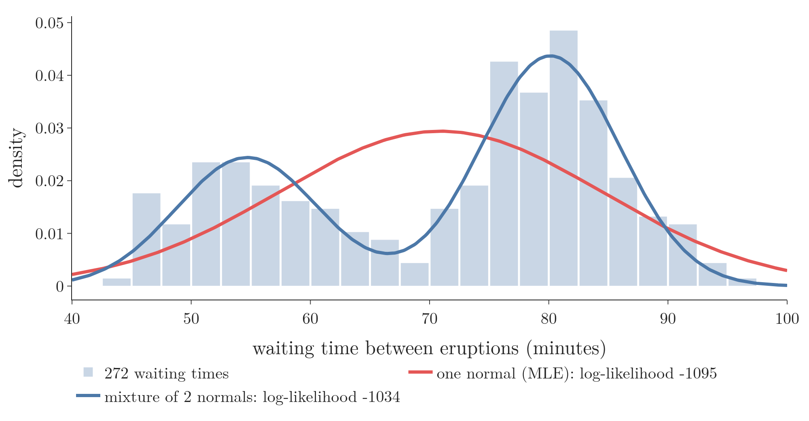
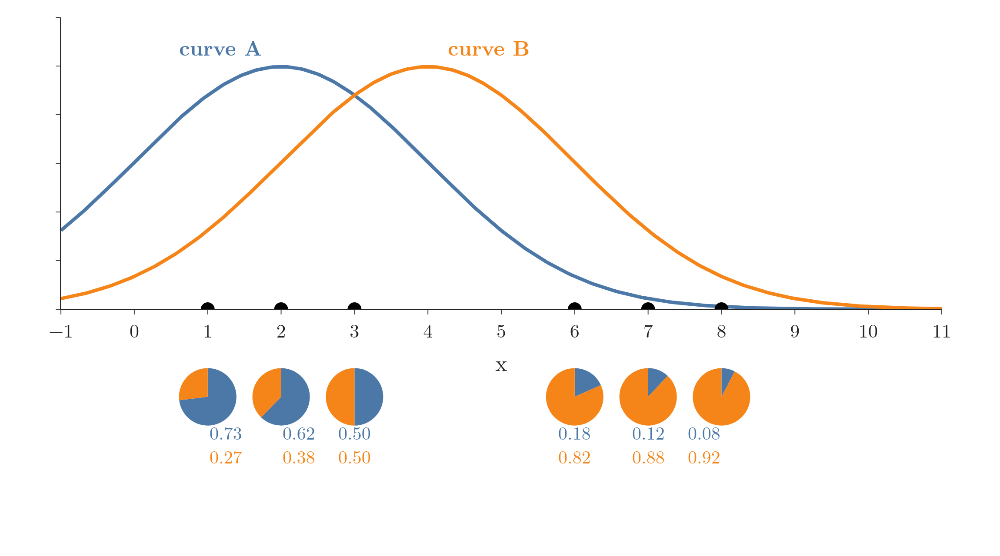
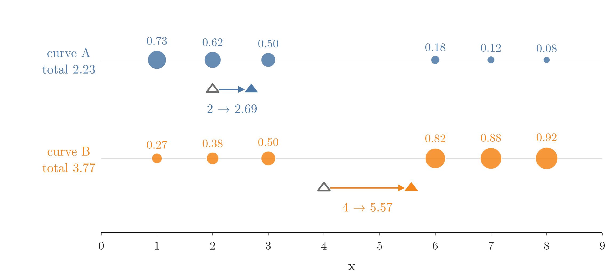
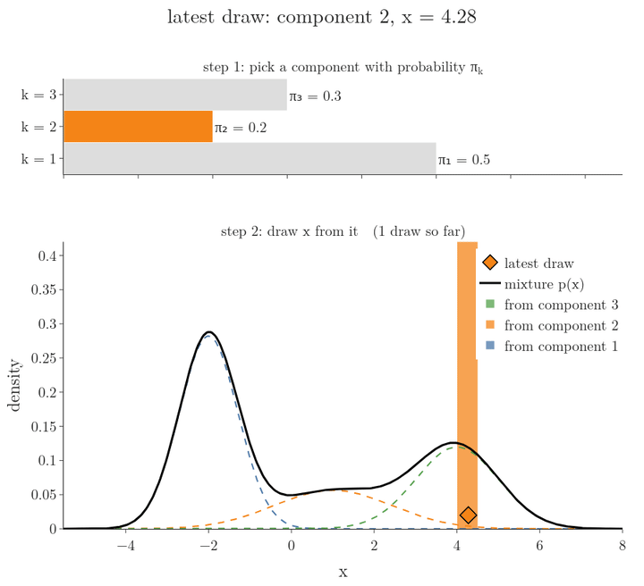
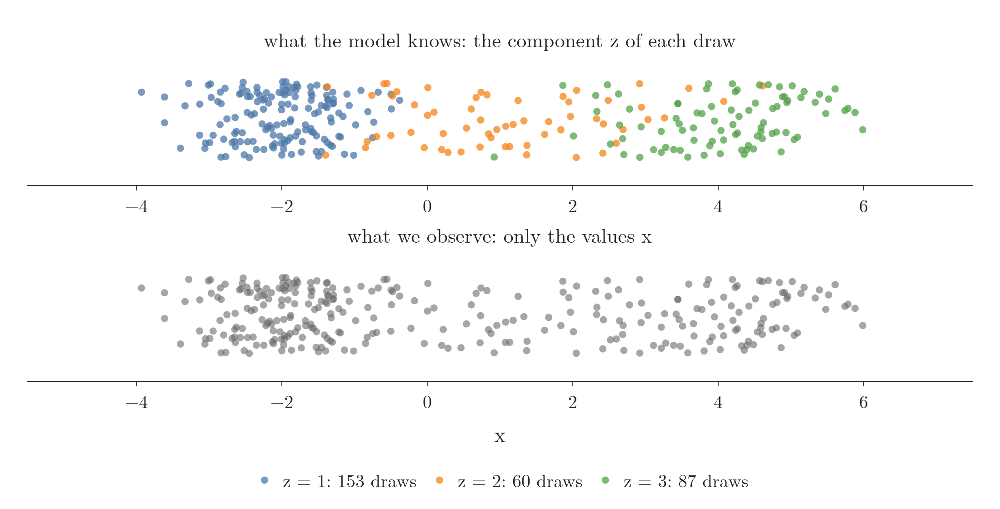
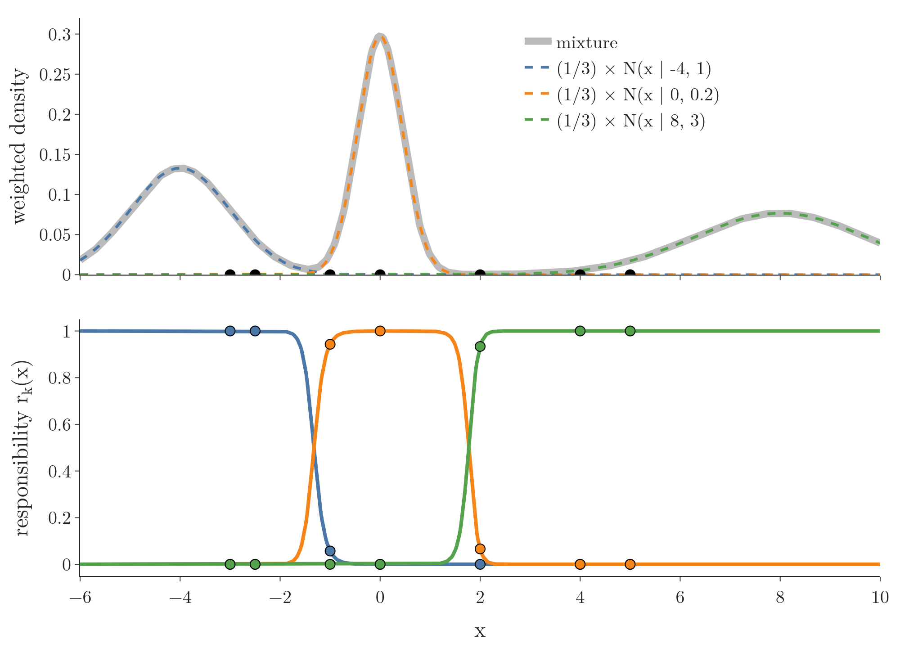

<!-- where-this-fits: generated by course_map/build_map.py; edit concepts.yaml, not this block -->
> **Where this fits:** Pipeline map steps 0 (Foundations), 8 (Model). See the [Course map](../../../00-course-map/00-course-map.md).
>
> 
>
> - **Builds on:** [Covariance and covariance matrix](../../../MA/01-descriptive-stats/MA-009-covariance-and-correlation/MA-009-covariance-and-correlation.md#3-covariance); [Normal distribution](../../../MA/03-distributions/MA-024-normal-distribution/MA-024-normal-distribution.md#2-what-the-normal-distribution-is); [Bayes' theorem](../../../MA/02-probability/MA-018-bayes-theorem/MA-018-bayes-theorem.md#4-the-formula-and-its-proof); [Maximum likelihood estimation (MLE)](../../../MA/08-likelihood/MA-070-maximum-likelihood-estimation/MA-070-maximum-likelihood-estimation.md#7-the-likelihood-function-and-the-mle).
> - **Leads to:** [Expectation maximization (EM)](../../../MA/08-likelihood/MA-074-expectation-maximization/MA-074-expectation-maximization.md#3-the-two-steps-and-the-algorithm).
> - **Compare with:** [Kernel density estimation (KDE)](../../../MA/03-distributions/MA-023-density-estimation-kde/MA-023-density-estimation-kde.md#5-kernel-density-estimation-kde); [K-means](../../../ML/09-clustering-and-more/ML-122-kmeans-intuition/ML-122-kmeans-intuition.md#4-the-five-steps-of-k-means).
<!-- /where-this-fits -->

## 1. Overview

> **Key point:** Some data comes in two or more overlapping groups, and one bell curve cannot fit it. A Gaussian mixture model (a Gaussian is another name for the normal distribution, the bell curve) uses one bell curve per group and shares every point among the curves: a point can be 73 percent curve A and 27 percent curve B. That share is the point's responsibility.

The Note starts from data we can see, shares six points between two curves by hand, and only then writes the formulas. The textbook is *Mathematics for Machine Learning* (Deisenroth, Faisal and Ong, 2020; MML below), Chapter 11, Sections 11.1 and 11.2, with the generative view and the responsibilities as posteriors from Sections 11.4.1 to 11.4.3.

The [maximum likelihood estimation](../MA-070-maximum-likelihood-estimation/MA-070-maximum-likelihood-estimation.md#3-the-idea-slide-the-curve-keep-the-peak) fitted one distribution to data. Here the data has several bumps, and no single named distribution fits it.

This Note covers:

- why one normal curve is not enough (Section 2);
- sharing a point between curves: soft membership (Section 3);
- the two steps by hand on six points: score, then update (Section 4);
- how mixture data is generated (Section 5);
- the mixture density formula (Section 6);
- mixtures in two dimensions (Section 7);
- the responsibility formula, from Bayes' theorem (Section 8);
- why maximum likelihood has no closed form here (Section 9), and how it can break (Section 10);
- how a mixture compares with KDE and with k-means (Section 11).

How to fit a mixture by repeating the two steps, the EM algorithm, is the subject of the [expectation maximization](../MA-074-expectation-maximization/MA-074-expectation-maximization.md#2-guess-score-update-repeat).

## 2. One normal curve is not enough

> **Key point:** The Old Faithful geyser waits either about 55 or about 80 minutes between eruptions. The best single normal curve sits in the empty gap between the two; a mixture of two normals follows both bumps and has a much higher likelihood.

Think of two bus routes stopping at the same bus stop: one bus comes every 55 minutes or so, the other every 80. Averaging all the waits gives about 71 minutes, a wait that hardly ever happens. One bell curve makes the same mistake.

Figure 1 shows the real case: 272 **observations** (G-1374; records, one row each of the data table) of the waiting time between eruptions of the Old Faithful geyser in Yellowstone (seaborn's `geyser` dataset, saved in `data/old_faithful.csv`). The histogram has two bumps. The red curve is the single normal fitted by maximum likelihood, with the mean 70.9 and standard deviation 13.6 of the data (the [MLE for common distributions](../MA-071-mle-for-common-distributions/MA-071-mle-for-common-distributions.md#4-the-normal-distribution)). Its peak sits near 71 minutes, in the valley between the bumps. In the picture, the horizontal axis is the waiting time in minutes, the height of a bar grows with how many eruptions had a wait in that range (scaled so the bars have total area 1, like a density), and the height of a curve is the density: the higher the curve over a wait, the more likely the model finds it.



The blue curve is a mixture of two normals: weight 0.36 around 54.7 minutes and weight 0.64 around 80.1 minutes, each with a standard deviation of about 6 minutes. The likelihoods measure the difference:

| Model | Log-likelihood of the 272 waiting times |
|---|---|
| one normal (2 parameters) | $-1095$ |
| mixture of two normals (5 parameters) | $-1034$ |

A higher log-likelihood means the model finds the observed data more probable (the [maximum likelihood estimation](../MA-070-maximum-likelihood-estimation/MA-070-maximum-likelihood-estimation.md#7-the-likelihood-function-and-the-mle)). The gap of 61 means the data is $e^{61}$ times more probable under the mixture.

MML (Chapter 11 introduction) makes the same point: a single Gaussian has limited modelling power, while a mixture can describe data with several clusters (**multimodal** data, G-1275, see the [measures of central tendency](../../01-descriptive-stats/MA-005-measures-of-central-tendency/MA-005-measures-of-central-tendency.md#5-mode)).

## 3. Each point belongs partly to each curve

> **Key point:** With two overlapping groups, a point in the middle cannot be given to one group with confidence. Instead we split it: each curve gets a share, and the shares add up to 1.

### 3.1 Six points, two curves

> **Key point:** A point close to a curve's peak gets mostly that curve's colour; a point halfway between two curves gets half and half.

Take six numbers: $1, 2, 3, 6, 7, 8$. They look like two groups, one on the left and one on the right. Suppose we start with a poor guess of two bell curves, **A** (centre 2) and **B** (centre 4), both with the same width. Figure 2 draws them with the six points.

Which curve does each point belong to? The point 1 sits near the peak of A, so it is mostly A. The point 8 is far out on the right, where B is taller than A, so it is mostly B. The point 3 sits exactly where the two curves cross: A and B are equally tall there, so it is half and half. Below each point, Figure 2 draws a pie that shows its split.



The rule behind the pies: a point's share of a curve is that curve's height above the point, divided by the two heights added together.

### 3.2 The standard terms

> **Key point:** The share of curve $k$ that a point carries is its responsibility; giving every point such shares is a soft assignment.

The share of curve $k$ for point $n$ is the **responsibility** (G-1687), written $r_{nk}$. The six pies are a **soft assignment** (G-1826): each point is shared among the curves by probabilities, instead of being given wholly to one. The opposite, a **hard assignment** (G-877), is what k-means does (Section 11.2). The curves themselves are the **components** of a **Gaussian mixture model** (**GMM**, G-829), and the shares of one point always add up to 1.

In other words, each point is coloured by how tall each curve is above it: the leftmost point mostly with the colour of A, a middle point half and half, the rightmost mostly with the colour of B.

## 4. Score, then update: the two steps by hand

> **Key point:** Step 1 scores every point: how much of it belongs to each curve. Step 2 moves each curve to fit the points that claim it, counting each point only as much as its share. On the six points, one round moves the means from 2 and 4 to 2.69 and 5.57 and raises the log-likelihood from $-15.82$ to $-14.15$.

### 4.1 Score the points (the E-step)

> **Key point:** Multiply each curve's height by its weight, then divide each by the total.

Both curves start with the same weight $0.5$ and the same variance 4 (standard deviation 2). The height of a normal curve with variance 4, at distance $d$ from its centre, is

$$\frac{1}{\sqrt{2\pi \cdot 4}}\thinspace e^{-d^2/8}$$

$$= 0.1995\thinspace e^{-d^2/8}$$

Take the point $x = 6$.

1. Height of A (centre 2, distance 4), then times the weight $0.5$:

   $$0.1995\thinspace e^{-2} = 0.0270$$

   $$0.5 \times 0.0270 = 0.0135$$

2. Height of B (centre 4, distance 2), then times the weight $0.5$:

   $$0.1995\thinspace e^{-0.5} = 0.1210$$

   $$0.5 \times 0.1210 = 0.0605$$

3. The total of the two weighted heights, and the two shares:

   $$0.0135 + 0.0605 = 0.0740$$

   $$\frac{0.0135}{0.0740} = 0.18 \quad \text{(share of A)}$$

   $$\frac{0.0605}{0.0740} = 0.82 \quad \text{(share of B)}$$

The same steps for all six points give the table drawn in Figure 2:

| $x$ | 1 | 2 | 3 | 6 | 7 | 8 | total |
|---|---|---|---|---|---|---|---|
| 0.5 × height of A | 0.0880 | 0.0997 | 0.0880 | 0.0135 | 0.0044 | 0.0011 | |
| 0.5 × height of B | 0.0324 | 0.0605 | 0.0880 | 0.0605 | 0.0324 | 0.0135 | |
| share of A | 0.73 | 0.62 | 0.50 | 0.18 | 0.12 | 0.08 | 2.23 |
| share of B | 0.27 | 0.38 | 0.50 | 0.82 | 0.88 | 0.92 | 3.77 |

The last column adds the shares of each curve over all six points. It is the **total responsibility** (G-1992) $N_k$ of the curve: about how many points the curve accounts for. The two totals add up to 6, the number of points.

### 4.2 Update the curves (the M-step)

> **Key point:** The new centre of a curve is the average of all points, where each point counts as much as its share.

Now forget the old curves and keep only the shares. Curve A claims point 1 by 0.73, point 2 by 0.62, and so on. Its new centre is the average in which each point counts only as much as it is claimed:

Each point is multiplied by its share:

$$0.73 \times 1 = 0.73$$

$$0.62 \times 2 = 1.24$$

$$0.50 \times 3 = 1.50$$

$$0.18 \times 6 = 1.08$$

$$0.12 \times 7 = 0.84$$

$$0.08 \times 8 = 0.64$$

$$\text{sum of the products} = 6.01$$

$$\text{sum of the shares} = 2.23$$

$$\text{new centre of A} = \frac{6.01}{2.23} = 2.69$$

(The sum 6.01 uses the shares before rounding.)

For B, the shares are $0.27, 0.38, 0.50, 0.82, 0.88, 0.92$ and the same steps give

$$\frac{20.99}{3.77} = 5.57$$

Figure 3 shows each point as large as its share, with the centre moving from its start (hollow triangle) to the balance point of the shares (filled triangle). Curve A moves from 2 to 2.69: the points 1, 2 and 3 claim it most, but the points 6, 7 and 8 claim it a little (0.18, 0.12, 0.08) and pull it to the right. Curve B moves a lot, from 4 to 5.57, towards the points 6, 7 and 8 that claim it.



The width of each curve is updated the same way, as the average squared distance from the new centre, again with each point counted as much as its share. For A: the squared distances from 2.69 are $2.86, 0.48, 0.10, 10.96, 18.58, 28.20$, so each squared distance is multiplied by its share ($0.73 \times 2.86$, $0.62 \times 0.48$, and so on) and the products are added:

$$\text{sum of the products} = 8.78$$

$$\text{new variance of A} = \frac{8.78}{2.23} = 3.94$$

and B's new variance is 5.61. The new **weight** of a curve is its total responsibility divided by the number of points:

$$\frac{2.23}{6} = 0.37 \quad \text{for A}$$

$$\frac{3.77}{6} = 0.63 \quad \text{for B}$$

| | Start | After one round |
|---|---|---|
| Centres (A, B) | 2, 4 | 2.69, 5.57 |
| Variances | 4, 4 | 3.94, 5.61 |
| Weights | 0.50, 0.50 | 0.37, 0.63 |
| Log-likelihood | $-15.82$ | $-14.15$ |

The log-likelihood is the sum over the six points of the log of the total height of the two weighted curves (Section 9.1). It rose, so the new curves fit the six points better. The [expectation maximization](../MA-074-expectation-maximization/MA-074-expectation-maximization.md#3-the-two-steps-and-the-algorithm) repeats the two steps until the curves stop moving; these two steps are its **E-step** (G-654) and **M-step** (G-1139).

### 4.3 Another way to see it: shrink the formula

> **Key point:** A big formula with sums over points and curves is easier to read on two points and two curves.

A good way to read the responsibility formula (Section 8.1) is to pretend there are only two points and two curves, and write out the four numbers $r_{11}, r_{12}, r_{21}, r_{22}$ one by one. Section 4.1 is exactly this, with six points instead of two. The same trick works for every formula that follows: replace the sums by the six numbers.

## 5. Generating data in two steps

> **Key point:** To draw from a mixture: first pick a component $k$ with probability $\pi_k$, then draw $x$ from that component's normal curve. The picked component is a hidden (latent) variable.

### 5.1 The two steps

> **Key point:** Step 1 is a weighted die roll; step 2 is an ordinary normal draw.

Sections 3 and 4 scored points against curves. Behind this sits a story about how the data came to be. MML (§11.4.1) describes the **generative process** (G-842) of a mixture:

1. **Pick a component.** Roll a weighted die with $K$ faces: face $k$ comes up with probability $\pi_k$.
2. **Draw the value.** Draw $x$ from $N(\mu_k, \sigma_k^2)$, the component that came up. Here $N(\mu, \sigma^2)$ is the normal distribution with centre (mean) $\mu$ and variance $\sigma^2$ (the squared spread), for example $N(2, 4)$: centre 2, variance 4.

Repeat for every observation, then forget which component each one came from. Figure 4 runs this for a mixture of three components with probabilities $0.5$, $0.2$ and $0.3$ (the mixture of MML's Figure 11.2, written out in Section 6). The top bar shows the die roll, the diamond the drawn value. After 3,000 draws the histogram matches the mixture density: about half the draws come from the first component, because $\pi_1 = 0.5$ (the Notebook counts 51%).



### 5.2 The latent variable

> **Key point:** The component that produced a point is a random variable we never observe: a latent variable.

For each observation, write $z$ for the number of the component that produced it. Its distribution is the weights: $P(z = k) = \pi_k$ (MML equation 11.60). Given $z = k$, the value is normal: $p(x \mid z = k) = N(x \mid \mu_k, \sigma_k^2)$.

We only ever see $x$, never $z$. A variable that is part of the model but never observed is a **latent variable** (G-1050; Latin *latere*, to lie hidden). Figure 5 shows what is lost. The top row is 300 draws coloured by the component that produced them; the bottom row is the same draws as we receive them. Between the bumps, a grey point could have come from either neighbour, and nothing in the value says which. The responsibilities of Section 3 are our best guess about $z$: the probability of each value of $z$, given $x$.



## 6. The mixture density

> **Key point:** $p(x) = \sum_k \pi_k\thinspace N(x \mid \mu_k, \sigma_k^2)$: a weighted sum of $K$ normal densities, with weights that are non-negative and add up to 1.

### 6.1 The formula

> **Key point:** Each component is a normal curve; each weight says how much of the data it covers.

The generative story gives the density at once. A value $x$ can arise through any component, so we add up, over the components, the chance of picking the component times the density of $x$ under it.

1. **In words:** a **Gaussian mixture model** adds up $K$ normal densities, the **components**, each multiplied by a **mixture weight** $\pi_k$ (G-1238). The weights lie between 0 and 1 and add up to 1, so the total area stays 1.
2. **Formula** (MML equations 11.3 and 11.4):
   $$p(x \mid \theta) = \sum_{k=1}^{K} \pi_k\thinspace N(x \mid \mu_k, \sigma_k^2)$$
   with the weights:
   $$0 \le \pi_k \le 1$$
   $$\sum_{k=1}^{K}\pi_k = 1$$
   The parameters are all the weights, means and variances: $\theta = \lbrace\pi_k, \mu_k, \sigma_k^2 : k = 1, \dots, K\rbrace$. The symbol $\sum_{k=1}^{K}$ means "add the terms for $k = 1, 2, \dots, K$". Here $N(x \mid \mu, \sigma^2)$ is the normal PDF of the [normal distribution](../../03-distributions/MA-024-normal-distribution/MA-024-normal-distribution.md#51-the-formula-and-a-worked-example), and the second number is the **variance**.
3. **Check on the six points:** the starting mixture is $0.5\thinspace N(x \mid 2, 4) + 0.5\thinspace N(x \mid 4, 4)$. Adding the two weighted heights of Section 4.1:
   $$p(3) = 0.0880 + 0.0880 = 0.176$$
   $$p(6) = 0.0135 + 0.0605 = 0.074$$
   $p(6)$ is the total used in the share of Section 4.1.
4. **Example with three components:** the mixture of the book's Figure 11.2,
   $$p(x) = 0.5\thinspace N(x \mid -2, 0.5) + 0.2\thinspace N(x \mid 1, 2) + 0.3\thinspace N(x \mid 4, 1)$$
   At $x = 0$ the three weighted components add up to:
   $$p(0) = 0.0052 + 0.0439 + 0.00004 = 0.049$$

Figure 6 draws the three weighted components (dashed) and their sum (black). Where components overlap, their heights add. With $K = 1$ the formula is a single normal curve.


Adding up over the possible values of $z$ gives the same formula (the book's equations 11.65 and 11.66):

$$p(x) = \sum_{k=1}^{K} P(z = k)\thinspace p(x \mid z = k)$$

$$p(x) = \sum_{k=1}^{K} \pi_k\thinspace N(x \mid \mu_k, \sigma_k^2)$$

At $x = 0$, the three weighted terms are:

$$0.5 \times 0.0103 = 0.00515$$

$$0.2 \times 0.2197 = 0.04394$$

$$0.3 \times 0.000134 = 0.00004$$

$$p(0) = 0.00515 + 0.04394 + 0.00004$$

$$p(0) = 0.049$$

This is the same $p(0)$ as before. The sum is the **law of total probability** (G-1053) of the [Bayes problem](../../02-probability/MA-019-bayes-problem/MA-019-bayes-problem.md#4-the-evidence-total-probability), with machines replaced by components.

### 6.2 Why the weights must add up to 1

> **Key point:** Each component has area 1; weights adding up to 1 make the total area 1.

The area under each normal curve is 1 (the [PDF and continuous CDF](../../03-distributions/MA-022-pdf-and-continuous-cdf/MA-022-pdf-and-continuous-cdf.md#3-area-under-the-curve-is-probability)). The area under $\pi_k N(x \mid \mu_k, \sigma_k^2)$ is therefore $\pi_k$, and the area under the sum is the sum of the weights, which is 1. For the three-component example:

$$0.5 + 0.2 + 0.3 = 1$$

For the six points:

$$0.5 + 0.5 = 1$$

A sum of this kind, with non-negative weights adding up to 1, is called a **convex combination** (G-475).

## 7. Mixtures in two dimensions

> **Key point:** In two or more dimensions, each component is a multivariate normal with a mean vector and a covariance matrix. Its contour lines are ellipses, which can be stretched and tilted.

Plain picture first: a bell curve in two dimensions is a hill. Seen from above, points of equal height form rings around the top. A round hill gives circles; a hill stretched in one direction gives ellipses, and a hill stretched along a diagonal gives tilted ellipses. A mixture in 2D is several such hills added together, and each hill is one cluster with its own centre, size and tilt.

### 7.1 The multivariate normal

> **Key point:** The mean vector sets the centre; the covariance matrix sets the width in each direction and the tilt.

For data with $D$ **features** (G-772; input variables, one column each of the data table), a component is a **multivariate normal distribution** (G-1283) $N(\mathbf{x} \mid \boldsymbol\mu, \boldsymbol\Sigma)$. The mean $\boldsymbol\mu$ is a vector with one entry per feature. The **covariance matrix** (G-495) $\boldsymbol\Sigma$ holds the variances on its diagonal and the covariances off it (see the [covariance and correlation](../../01-descriptive-stats/MA-009-covariance-and-correlation/MA-009-covariance-and-correlation.md#3-covariance) and the [PCA step by step](../../../ML/05-dimensionality/ML-047-pca-step-by-step/ML-047-pca-step-by-step.md#33-the-covariance-matrix)).

Figure 7 draws both cases with variances 1 and 4. The top row shows each density as a surface: the two features run along the floor and the density is the height, a hill with its top at the mean. For the first case the height at the point $(1, 2)$ is $0.0293$ (computed in the example below). The bottom row is the same hill seen from above, a **contour map** (see the [partial derivatives and gradients](../../06-calculus/MA-062-partial-derivatives-and-gradients/MA-062-partial-derivatives-and-gradients.md#11-reading-a-contour-map)): each line joins points of the same density, with the same colours and the same centre as the surface. Read it so: lines close together mean a steep hill side, and the centre is the top. Without covariance the ellipses stand upright, twice as tall as wide; with a covariance of 1.6 they tilt.


1. **In words:** the density is highest at the mean and falls off with the squared distance from it, measured in a way that accounts for the spread and tilt that $\boldsymbol\Sigma$ describes.
2. **Formula** (MML §6.5, equation 6.63):
   $$N(\mathbf{x} \mid \boldsymbol\mu, \boldsymbol\Sigma) = c\thinspace e^{-q/2}$$
   with the scaling constant
   $$c = (2\pi)^{-D/2}\thinspace\lvert\boldsymbol\Sigma\rvert^{-1/2}$$
   and the squared distance from the mean
   $$q = (\mathbf{x} - \boldsymbol\mu)^{\mathsf T}\boldsymbol\Sigma^{-1}(\mathbf{x} - \boldsymbol\mu)$$
   Here $\lvert\boldsymbol\Sigma\rvert$ is the determinant and $\boldsymbol\Sigma^{-1}$ the inverse of the covariance matrix. With $D = 1$ and $\boldsymbol\Sigma = \sigma^2$ the formula is the ordinary normal PDF.
3. **Example:** $D = 2$, mean $(0, 0)$, $\boldsymbol\Sigma$ with diagonal $1, 4$ and zeros elsewhere (variances 1 and 4, no covariance). For a diagonal matrix, the determinant $\lvert\boldsymbol\Sigma\rvert$ is the product of the diagonal entries and the inverse $\boldsymbol\Sigma^{-1}$ has one over each entry, so
   $$\lvert\boldsymbol\Sigma\rvert = 1 \times 4 = 4$$
   and $\boldsymbol\Sigma^{-1}$ has diagonal $1, 1/4$. At $\mathbf{x} = (1, 2)$ the squared distance $q$ is:
   $$\frac{1^2}{1} + \frac{2^2}{4} = 1 + 1 = 2$$
   The exponent is minus one half of this value:
   $$-\tfrac12 \times 2 = -1$$
   so
   $$N = \frac{1}{2\pi}\cdot\frac{1}{\sqrt 4}\thinspace e^{-1}$$
   $$N = 0.159 \times 0.5 \times 0.368 = 0.0293$$

Points with the same density lie on an ellipse around the mean (the book's Figure 6.8b). Variances stretch the ellipse along the axes; a non-zero covariance tilts it. Figure 11 (right, Section 11.2) shows tilted ellipses fitted to real flowers.

### 7.2 The mixture in $D$ dimensions

> **Key point:** Same formula as in 1D, with vectors and matrices.

The mixture is $p(\mathbf{x}) = \sum_k \pi_k\thinspace N(\mathbf{x} \mid \boldsymbol\mu_k, \boldsymbol\Sigma_k)$, with one mean vector and one covariance matrix per component. Everything in the rest of this Note works the same way in any number of dimensions.

## 8. Responsibilities

> **Key point:** The responsibility $r_{nk}$ is the probability that component $k$ produced observation $x_n$. The responsibility is the posterior of Bayes' theorem: weight times density, divided by the mixture density.

### 8.1 The formula

> **Key point:** $r_{nk} = \pi_k N(x_n \mid \mu_k, \sigma_k^2) \thinspace/\thinspace\sum_j \pi_j N(x_n \mid \mu_j, \sigma_j^2)$.

Section 4.1 computed each share as "the curve's weighted height divided by the total of the weighted heights". That is **Bayes' theorem** (G-269; see the [Bayes' theorem](../../02-probability/MA-018-bayes-theorem/MA-018-bayes-theorem.md#3-the-names-of-the-four-parts)) for the question "having seen $x_n$, which component produced it?", with the **prior** $P(z = k) = \pi_k$ (the chance of curve $k$ before seeing the point), the **likelihood** $N(x_n \mid \mu_k, \sigma_k^2)$ (how well curve $k$ explains the point) and the **evidence** $p(x_n)$ (the total over all curves).

1. **In words:** the **responsibility** of component $k$ for point $n$ is that component's share of the mixture density at $x_n$.
2. **Formula** (MML equations 11.17 and 11.72):
   $$r_{nk} = P(z_n = k \mid x_n) = \frac{\pi_k\thinspace N(x_n \mid \mu_k, \sigma_k^2)}{\sum_{j=1}^{K} \pi_j\thinspace N(x_n \mid \mu_j, \sigma_j^2)}$$
   Here $n$ numbers the points, $k$ and $j$ number the components, $\pi_k$ is a weight, and the sum in the denominator is the mixture density $p(x_n)$.
3. **Check on the six points:** for $x = 6$ the numerator for A is its weighted height, and the denominator is the sum of both weighted heights:
   $$0.5\thinspace N(6 \mid 2, 4) = 0.0135$$
   $$r_{A} = \frac{0.0135}{0.074} = 0.18$$
   This is the number of Section 4.1. For each point the responsibilities add up to 1, because each numerator is one term of the denominator.
4. **Example with seven points:** the book's running example (Section 11.2, Example 11.1) has seven points $-3, -2.5, -1, 0, 2, 4, 5$ and a starting mixture $N(-4, 1)$, $N(0, 0.2)$, $N(8, 3)$ with weights $1/3$ each. For $x_3 = -1$ the weighted densities are
   $$\tfrac13 N(-1 \mid -4, 1) = 0.00148$$
   $$\tfrac13 N(-1 \mid 0, 0.2) = 0.02441$$
   $$\tfrac13 N(-1 \mid 8, 3) \approx 0$$
   Their sum is 0.02589, so
   $$r_{31} = \frac{0.00148}{0.02589} = 0.057$$
   and $r_{32} = 0.943$ and $r_{33} = 0$.

### 8.2 Soft assignment

> **Key point:** A point is not assigned to one component; it is shared among them in proportion to the responsibilities.

All seven points give this table (the book's equation 11.19; the Notebook reproduces it):

| $x_n$ | $-3$ | $-2.5$ | $-1$ | $0$ | $2$ | $4$ | $5$ | total $N_k$ |
|---|---|---|---|---|---|---|---|---|
| $r_{n1}$ | 1.000 | 1.000 | 0.057 | 0.000 | 0.000 | 0.000 | 0.000 | 2.057 |
| $r_{n2}$ | 0.000 | 0.000 | 0.943 | 1.000 | 0.066 | 0.000 | 0.000 | 2.009 |
| $r_{n3}$ | 0.000 | 0.000 | 0.000 | 0.000 | 0.934 | 1.000 | 1.000 | 2.934 |

Each column of numbers is one point's soft assignment. The last column, $N_k = \sum_n r_{nk}$, is the total responsibility of component $k$. The three totals add up to 7, the number of points.

{height=45%}

Figure 8 (bottom) draws the responsibilities for every $x$. Near a component's centre its responsibility is close to 1; between two components it changes from one to the other, and there a point is shared, as $x = -1$ is shared 0.057 to 0.943.

## 9. Why maximum likelihood has no closed form

> **Key point:** The log of a mixture is the log of a sum, which does not split. Setting the derivatives to 0 gives equations for the parameters that contain the responsibilities, and the responsibilities depend on the parameters.

Plain version first. Section 4.2 updated a curve using the shares, and the shares came from the curves. To fit the curves we need the shares; to get the shares we need the curves. This section shows that the best-fit equations really do have this circular shape.

### 9.1 The log-likelihood

> **Key point:** $\ell(\theta) = \sum_n \log \sum_k \pi_k N(x_n \mid \mu_k, \sigma_k^2)$: a sum of logs of sums.

For **i.i.d.** (G-933; independent and identically distributed: each point is drawn separately from the same distribution) data the likelihood is a product over the points (the [maximum likelihood estimation](../MA-070-maximum-likelihood-estimation/MA-070-maximum-likelihood-estimation.md#5-the-likelihood-of-many-measurements)), and each factor is now a mixture density.

1. **In words:** for each point, add up its weighted component densities, take the log, then add the logs over all points.
2. **Formula** (MML equation 11.10):
   $$\ell(\theta) = \sum_{n=1}^{N} \log p(x_n \mid \theta)$$
   $$\ell(\theta) = \sum_{n=1}^{N} \log \sum_{k=1}^{K} \pi_k N(x_n \mid \mu_k, \sigma_k^2)$$
3. **Check on the six points:** the six totals of weighted heights are $0.1204, 0.1602, 0.1760, 0.0740, 0.0368, 0.0146$; the sum of their logs is $-15.82$, the value of Section 4.2. For the seven points and the starting mixture of Section 8.1, $\ell = -28.3$ (the book's Example 11.5; the Notebook gets $-28.33$).

For one normal curve, the log went straight onto the exponential and left a simple sum of squares (the [MLE for common distributions](../MA-071-mle-for-common-distributions/MA-071-mle-for-common-distributions.md#42-the-log-likelihood-one-step-at-a-time), Section 4.2). Here the log sits on a sum over $k$, and $\log(a + b)$ cannot be split into $\log a + \log b$. The book (Section 11.2, remark after equation 11.10) names this as the reason no closed-form solution exists.

### 9.2 Setting the derivative for a mean to 0

> **Key point:** The condition "slope = 0" for $\mu_k$ says that $\mu_k$ is the responsibility-weighted average of the data. This is the update of Section 4.2.

We follow the book's proof of Theorem 11.1 in one dimension.

1. **In words:** differentiate $\ell$ with respect to one mean, $\mu_k$, set the result to 0, and solve for $\mu_k$.
2. **Formula:** by the chain rule, the derivative of $\log p(x_n)$ is $1/p(x_n)$ times the derivative of $p(x_n)$. Only the $k$-th term of the sum contains $\mu_k$, and the derivative of a normal density with respect to its mean is the density times $(x_n - \mu_k)/\sigma_k^2$. So
   $$\frac{\partial\ell}{\partial\mu_k} = \sum_{n=1}^{N} \frac{\pi_k N(x_n \mid \mu_k, \sigma_k^2)}{p(x_n)} \cdot \frac{x_n - \mu_k}{\sigma_k^2}$$
   The fraction is exactly the responsibility $r_{nk}$ of Section 8.1, so
   $$\frac{\partial\ell}{\partial\mu_k} = \frac{1}{\sigma_k^2}\sum_{n=1}^{N} r_{nk}(x_n - \mu_k)$$
   Setting this to 0 and solving:
   $$\mu_k = \frac{\sum_n r_{nk}\thinspace x_n}{\sum_n r_{nk}}$$
   $$\mu_k = \frac{1}{N_k}\sum_{n=1}^{N} r_{nk}\thinspace x_n$$
3. **Check on the six points:** with the shares of Section 4.1, curve A gets the sum 6.01 divided by the total 2.23, which is 2.69, the number computed by hand. On the seven points, with the responsibilities of Section 8.2, component 1 gets
   $$\sum_n r_{n1}\thinspace x_n = -3 - 2.5 - 0.057 + 0 = -5.557$$
   $$\mu_1 = \frac{-5.557}{2.057} = -2.70$$
   The book's Example 11.3 also moves $\mu_1$ from $-4$ to $-2.7$.

In the same way (the book's Theorems 11.2 and 11.3) the other two conditions are:

- **variance:** the responsibility-weighted variance (the book's equation 11.30); on the six points it gives the 3.94 of Section 4.2:

  $$\sigma_k^2 = \frac{1}{N_k}\sum_n r_{nk}(x_n - \mu_k)^2$$

- **weight:** the share of the total responsibility; on the six points the weight of curve A is the total 2.23 divided by 6 points:

  $$\pi_k = \frac{N_k}{N}$$

  $$\pi_A = \frac{2.23}{6} = 0.37$$

  The weights must add up to 1, so the book derives this with a Lagrange multiplier (equations 11.43 to 11.49; see the [Lagrange multipliers](../../07-optimisation/MA-066-lagrange-multipliers/MA-066-lagrange-multipliers.md#41-one-function-holds-all-the-conditions)).

With all $r_{nk}$ equal to 1 for one component, these are the mean, the MLE variance and the share of points of that component's data, as for one normal curve.

### 9.3 The circular dependence

> **Key point:** To compute $\mu_k$ we need the responsibilities; to compute the responsibilities we need $\mu_k$. The equations do not give the answer in one step.

The formula for $\mu_k$ looks like a solution, but the $r_{nk}$ on its right-hand side are computed from all the means, variances and weights (the book's remark after Theorem 11.1). Once $\mu_1$ moves from $-4$ to $-2.70$, the responsibilities change: point $-1$ now belongs 0.56 to component 1 instead of 0.057. The weighted average with these new responsibilities is $-2.34$, not $-2.70$, so the new $\mu_1$ no longer satisfies its own equation (Notebook, Section 4).

Figure 9 runs these steps. Watch the bar of point $-1$ in the bottom panel: it is small while $\mu_1 = -4$, grows to 0.56 once $\mu_1$ moves to $-2.70$, and with that bigger share pulls the next weighted mean to $-2.34$.


So the three conditions form a set of equations that depend on each other, and MML (§11.2) states that they cannot be solved in closed form. They can be used in turns instead: compute responsibilities, update the parameters, recompute the responsibilities, and so on. Taking turns in this way is the EM algorithm of the [expectation maximization](../MA-074-expectation-maximization/MA-074-expectation-maximization.md#3-the-two-steps-and-the-algorithm).

## 10. When maximum likelihood breaks

> **Key point:** If one component sits exactly on one observation and its variance shrinks to 0, the likelihood grows without limit. Maximum likelihood then prefers a useless spike.

MML (§11.5) warns that maximum likelihood for a mixture can overfit badly in exactly this way. The derivation is the one-point case of the [maximum likelihood estimation](../MA-070-maximum-likelihood-estimation/MA-070-maximum-likelihood-estimation.md#42-the-peak-is-where-the-slope-is-zero) (Section 4.2, Extra):

1. **In words:** put the mean of component 1 on an observation $x_1$. The density of $x_1$ then contains the term $\pi_1/(\sigma_1\sqrt{2\pi})$, which grows without limit as $\sigma_1 \to 0$. Every other point keeps a positive density from the remaining components, so the whole likelihood grows without limit.
2. **Formula:**
   $$p(x_1 \mid \theta) \ge \frac{\pi_1}{\sigma_1\sqrt{2\pi}} \to \infty \quad\text{as}\quad \sigma_1 \to 0$$
3. **Example:** the seven points, with component 1 placed at $-3$, components 2 and 3 fixed at $N(0, 1)$ and $N(4, 1)$, and equal weights. The Notebook (Section 5) gives $\ell = -17.25$ for $\sigma_1 = 0.1$, $-14.95$ for $\sigma_1 = 0.01$ and $-12.65$ for $\sigma_1 = 0.001$. Each tenfold shrink adds $\log 10 = 2.30$, the growth of $\log(1/\sigma_1)$ in the formula, and it never stops.

Figure 10 shows the collapse. In the right panel the horizontal axis is $\sigma_1$ on a log scale, so each gridline is ten times smaller than the one before, and the vertical axis is the log-likelihood. With $\sigma_1 = 0.1$ the mixture already has a tall, narrow spike on the point $-3$, and every tenfold shrink of $\sigma_1$ raises the log-likelihood by the same 2.30.


Such a spike describes one point, not a cluster. In practice libraries keep the variances away from 0: scikit-learn's `GaussianMixture` adds a small `reg_covar` (default $10^{-6}$) to the diagonal of every covariance matrix, which its documentation says keeps the covariance matrices positive.

## 11. Mixtures, KDE and k-means

> **Key point:** A GMM is a density estimate with a few learned bumps (KDE has one bump per point), and a soft clustering with elliptical clusters (k-means is hard and uses distance to the centre).

### 11.1 Compared with KDE

> **Key point:** KDE places one kernel on every observation with a fixed width; a GMM places $K$ components and learns their centres, widths and weights.

The [density estimation](../../03-distributions/MA-023-density-estimation-kde/MA-023-density-estimation-kde.md#5-kernel-density-estimation-kde) built a **kernel density estimate** (KDE, G-1005) by placing one small normal curve on every observation and averaging. A GMM also adds normal curves, but only $K$ of them, with every centre, width and weight fitted to the data. [Density estimation](../../03-distributions/MA-023-density-estimation-kde/MA-023-density-estimation-kde.md#5-kernel-density-estimation-kde) already placed a GMM between parametric and non-parametric methods.

| | KDE | GMM |
|---|---|---|
| Number of bumps | one per observation ($n$) | $K$, chosen by us |
| Bump centres | the observations | learned ($\mu_k$) |
| Bump widths | one bandwidth for all | learned per component ($\sigma_k^2$ or $\boldsymbol\Sigma_k$) |
| Bump weights | all equal, $1/n$ | learned ($\pi_k$) |
| Also gives clusters | no | yes, via the responsibilities |

### 11.2 Compared with k-means

> **Key point:** k-means gives each point to its nearest centre; a GMM shares each point by responsibilities and models each cluster's shape with a covariance matrix.

**k-means** (G-996; the [k-means intuition](../../../ML/09-clustering-and-more/ML-122-kmeans-intuition/ML-122-kmeans-intuition.md#4-the-five-steps-of-k-means)) assigns each point to its nearest centroid and moves each centroid to the mean of its points. MML (§11.5) relates the two: treat the GMM means as cluster centres and ignore the covariances (set them to the identity), and the result is k-means; k-means makes a hard assignment, a GMM a soft one through the responsibilities.

Figure 11 compares the two on the Iris dataset (scikit-learn's `load_iris`): 150 flowers, each with four features (sepal length, sepal width, petal length, petal width) and a known species. Both methods see only the four features; the species is used afterwards to score them. The **adjusted Rand index** (ARI; G-175) measures how well a clustering matches the true groups: 1 for a perfect match, about 0 for random labels (scikit-learn's `adjusted_rand_score` documentation).


Each ellipse in the right panel is a contour line of one component's hill (Figure 7): the line where the density has fallen to the value at 1 or 2 standard deviations from the centre. The colours are the responsibilities, not a surface.

| Method (all four features) | ARI |
|---|---|
| k-means | 0.73 |
| GMM, full covariance matrices | 0.90 |
| GMM, round components (one variance per component, no tilt) | 0.73 |

The two species on the upper right overlap, and their clouds are tilted ellipses: longer petals come with wider petals. k-means draws its boundary by distance to the centres, as if every cluster were a circle.

To test whether the covariance matrices make the difference, the Notebook (Section 6) refits the GMM with only that changed: round components, each with a single variance and no tilt. The ARI drops to 0.73, exactly k-means's score. So on Iris the advantage comes from modelling each cluster's stretched, tilted shape.

> **Python:** scikit-learn fits a GMM with the EM algorithm.
>
> ```python
> from sklearn.mixture import GaussianMixture
>
> gmm = GaussianMixture(n_components=3,
>                       covariance_type="full",
>                       random_state=0).fit(X)
> gmm.weights_       # the mixture weights pi_k
> gmm.means_         # one mean vector per component
> gmm.covariances_   # one covariance matrix per component
> gmm.predict_proba(X)   # responsibilities, one row per observation
> gmm.predict(X)         # hard labels: the largest responsibility
> gmm.score(X)       # average log-likelihood per point
> ```
>
> `covariance_type` sets the shape of the components: `"full"` (any ellipse), `"diag"` (ellipses along the axes), `"spherical"` (circles) or `"tied"` (one shared ellipse).

## 12. Summary

| Idea | Formula | Six-point example | Seven-point example |
|---|---|---|---|
| Mixture density | $p(x) = \sum_k \pi_k N(x \mid \mu_k, \sigma_k^2)$ | $p(3) = 0.176$ | start: $N(-4, 1)$, $N(0, 0.2)$, $N(8, 3)$, weights $1/3$ |
| Weights | $\pi_k \ge 0$, $\sum_k \pi_k = 1$ | $0.5 + 0.5 = 1$ | $1/3 + 1/3 + 1/3 = 1$ |
| Responsibility | $r_{nk} = \pi_k N(x_n \mid \mu_k, \sigma_k^2) / p(x_n)$ | $r_A(6) = 0.18$ | $r_{31} = 0.057$, $r_{32} = 0.943$ |
| Total responsibility | $N_k = \sum_n r_{nk}$ | $2.23$, $3.77$ | $2.057$, $2.009$, $2.934$ |
| Log-likelihood | $\sum_n \log \sum_k \pi_k N(x_n \mid \mu_k, \sigma_k^2)$ | $-15.82$ | $-28.3$ |
| Slope = 0 for $\mu_k$ | $\mu_k = \sum_n r_{nk} x_n / N_k$ | $\mu_A = 2.69$ | $\mu_1 = -2.70$ |

- Overlapping groups need several bell curves, because one curve sits in the gap between them; on Old Faithful the mixture raises the log-likelihood from $-1095$ to $-1034$.
- Each point is shared among the curves; the shares (responsibilities) add up to 1, so a point between two groups is split instead of being forced into one.
- Data from a mixture is generated in two steps: pick a component with probability $\pi_k$, then draw from it. The component is a latent variable, never observed, so the responsibilities are our best guess of it.
- A GMM is a weighted sum of normal curves, with weights that add up to 1 so that the total area stays 1. In $D$ dimensions each component is a multivariate normal with a mean vector and a covariance matrix; its contours are ellipses, so a component can fit a stretched, tilted cluster.
- Responsibilities are Bayes posteriors, because each one is weight (prior) times density (likelihood), divided by the mixture density (evidence).
- The log of a sum does not split; the slope-zero conditions contain responsibilities that depend on the parameters, so there is no closed form.
- A component collapsing onto one point sends the likelihood to infinity, because its height grows without limit as its variance shrinks; so libraries add a small `reg_covar` to keep variances away from 0.
- Compared with KDE, a GMM uses few learned bumps; compared with k-means, it assigns softly and fits elliptical clusters (on Iris, ARI 0.90 against 0.73). The gain comes from the covariance matrices, because round components drop the ARI back to 0.73.

## 13. Sources

**Built from**

- Serrano, L. (Serrano.Academy), "Gaussian Mixture Models", YouTube, https://www.youtube.com/watch?v=q71Niz856KE. Colouring points by the heights of the curves (soft clustering), the score-then-fit loop, and the hills seen from above.
- Stats with Brian, "The EM Algorithm Clearly Explained", YouTube, https://www.youtube.com/watch?v=3zbAsgCf1Sw. The idea of splitting each observation between the possible hidden labels by probability (used for Sections 3 and 4).
- CampusX, "How to Overcome the Fear of Maths in Data Science? | Maths Roadmap for Machine Learning", YouTube, https://www.youtube.com/watch?v=o4g4OTyCyDM. Decoding the responsibility formula on two points and two components (Section 4.3).
- Deisenroth, M. P., Faisal, A. A. and Ong, C. S. (2020). *Mathematics for Machine Learning*. Cambridge University Press. Free PDF at mml-book.github.io. §6.5 (multivariate Gaussian, eq. 6.63), Ch. 11 intro, §11.1 (GMM, eqs. 11.3–11.5), §11.2 (likelihood eq. 11.10, responsibilities eqs. 11.17 and 11.19, Theorems 11.1–11.3, Examples 11.1–11.5), §11.4.1–11.4.3 (generative process, latent variable, responsibilities as posteriors), §11.5 (collapse of maximum likelihood; relation to k-means).

**Other references**

- scikit-learn documentation: `GaussianMixture` (`reg_covar`, `covariance_type`) and `adjusted_rand_score`.
- Old Faithful waiting times: seaborn's `geyser` dataset (272 eruptions), saved in `data/old_faithful.csv`.
- Iris: Fisher's Iris dataset as shipped with scikit-learn (`sklearn.datasets.load_iris`).
- The six-point example (points 1, 2, 3, 6, 7, 8) and Figures 2 and 3 are our own design and data, computed in the Notebook (Section 7).

## 14. Key terms

Terms taught in this Note come first; linked terms are recaps, taught in the Note the link opens.

| Term | Meaning |
|---|---|
| Responsibility $r_{nk}$ (G-1687) | In a mixture model, how likely it is that component $k$ produced point $n$, given that point (the posterior probability). |
| Soft assignment (G-1826) | Sharing a point among clusters by probabilities instead of giving it to one. |
| Gaussian mixture model (GMM) (G-829) | A model for data made of several overlapping groups: one normal curve per group, combined as a weighted sum $\sum_k \pi_k N(x \mid \mu_k, \sigma_k^2)$. Each point is shared among the curves by probabilities instead of being given to one group. |
| Total responsibility $N_k$ (G-1992) | About how many points one component $k$ of a mixture accounts for: the sum, over all points, of that component's share of each point (its responsibility). |
| Generative process (G-842) | A step-by-step recipe that produces data from a model. |
| Latent variable (G-1050) | A variable in a model that is never observed, such as the component that produced a point. |
| Mixture weight $\pi_k$ (G-1238) | How big a share of a mixture one component $k$ gets; the weights are non-negative and add up to 1. |
| Multivariate normal distribution (G-1283) | The bell-shaped (normal) distribution for several numbers at once, a vector; it is set by a mean vector (its centre) and a covariance matrix (its spread and how the numbers vary together). |
| Adjusted Rand index (ARI) (G-175) | A score for how well a clustering matches the true groups: 1 for identical, about 0 for random. |
| `reg_covar` (G-132) | scikit-learn's small number added to the diagonal of every covariance matrix in `GaussianMixture`, so no component shrinks into a spike on one point (collapses). |
| [Observation](../../../ML/01-foundations/ML-003-types-of-ml/ML-003-types-of-ml.md#21-learning-from-inputs-and-outputs) (G-1374) | One record of a dataset: one row of the data table. |
| [Multimodal](../../../MA/01-descriptive-stats/MA-005-measures-of-central-tendency/MA-005-measures-of-central-tendency.md#5-mode) (G-1275) | Having more than one mode (two modes: bimodal). |
| [Hard assignment](../../../MA/08-likelihood/MA-074-expectation-maximization/MA-074-expectation-maximization.md#8-k-means-as-hard-em) (G-877) | Giving each observation wholly to one cluster (responsibility 0 or 1). |
| [E-step](../../../MA/08-likelihood/MA-074-expectation-maximization/MA-074-expectation-maximization.md#31-the-two-steps) (G-654) | The expectation step of the EM algorithm: using the current parameters, give every point its responsibilities (the probability that it came from each component), a soft assignment that the M-step then uses. |
| [M-step](../../../MA/08-likelihood/MA-074-expectation-maximization/MA-074-expectation-maximization.md#21-one-round-recalled) (G-1139) | The second step of each EM round (maximisation): with the responsibilities held fixed, re-estimate each component's mean, covariance and weight as responsibility-weighted averages, so the fit to the data improves. |
| [Law of total probability](../../../MA/02-probability/MA-019-bayes-problem/MA-019-bayes-problem.md#1-overview) (G-1053) | The rule for the overall probability of an event: add its probability under each case, weighted by how likely that case is, $P(B) = \sum_i P(B \mid A_i) P(A_i)$, when the cases $A_i$ are mutually exclusive and cover every possibility. |
| [Convex combination](../../../MA/07-optimisation/MA-067-convex-sets-and-functions/MA-067-convex-sets-and-functions.md#21-walking-along-the-segment) (G-475) | A mix of points (or functions) using non-negative shares that add up to 1, such as 30% of one and 70% of another; for two points it gives a point on the segment between them. |
| [Feature](../../../ML/01-foundations/ML-002-ai-vs-ml-vs-dl/ML-002-ai-vs-ml-vs-dl.md#52-features-chosen-by-us-or-learned) (G-772) | One piece of information about each example that a model uses (e.g. a student's CGPA). |
| [Covariance matrix](../../../ML/05-dimensionality/ML-047-pca-step-by-step/ML-047-pca-step-by-step.md#33-the-covariance-matrix) (G-495) | A square table with every feature's variance on the diagonal and every pair's covariance off it, so it sums up how the data spreads and which features move together; PCA takes its eigenvectors. |
| [Bayes' theorem](../../../MA/02-probability/MA-018-bayes-theorem/MA-018-bayes-theorem.md#4-the-formula-and-its-proof) (G-269) | The rule that reverses a conditional probability: from $P(B \mid A)$ it gives $P(A \mid B)$, so a belief about $A$ can be updated after seeing $B$; $P(A \mid B) = P(B \mid A) P(A) / P(B)$. |
| [Independent and identically distributed (i.i.d.)](../../../MA/04-inference/MA-033-sampling-distribution-and-clt/MA-033-sampling-distribution-and-clt.md#41-conditions) (G-933) | Values that do not affect each other and all come from the same distribution. |
| [Kernel density estimate (KDE)](../../../ML/02-getting-data/ML-019-univariate-analysis/ML-019-univariate-analysis.md#7-density-plot) (G-1005) | A smooth curve that estimates a column's PDF from its values, built by adding a kernel centred on every data point; a KDE plot draws it. |
| [k-means](../../../ML/09-clustering-and-more/ML-122-kmeans-intuition/ML-122-kmeans-intuition.md#4-the-five-steps-of-k-means) (G-996) | A clustering algorithm that repeatedly assigns points to the nearest centre and moves each centre to the mean of its points. |
| [Component](../../../MA/05-linear-algebra/MA-048-vectors-and-feature-vectors/MA-048-vectors-and-feature-vectors.md#23-coordinates-walking-instructions) (G-429) | One number of a vector, its position along one axis. |
