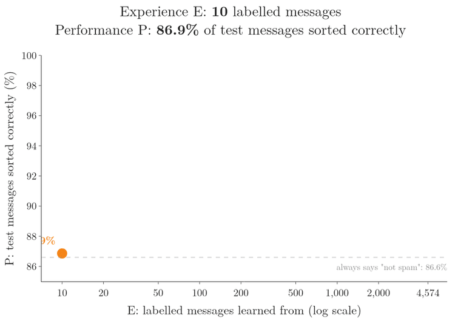
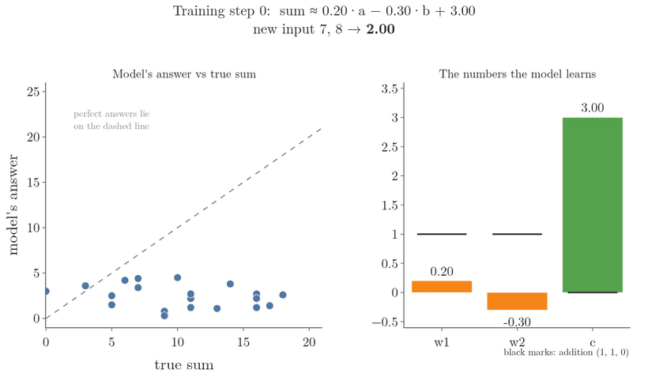
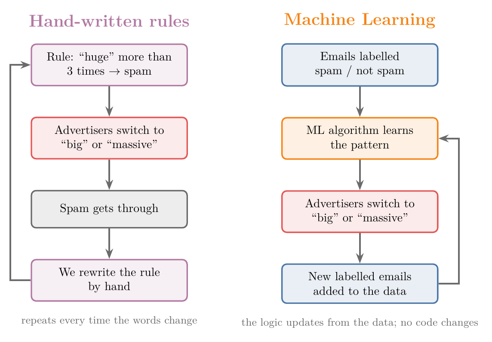
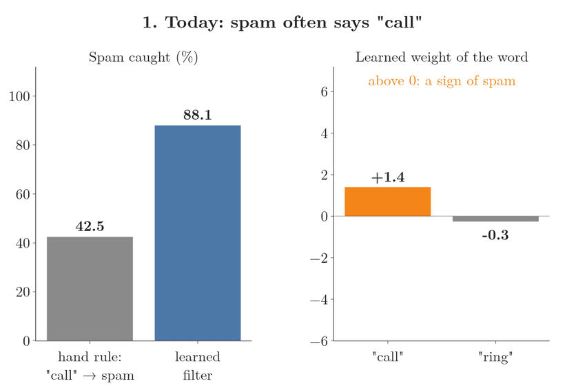
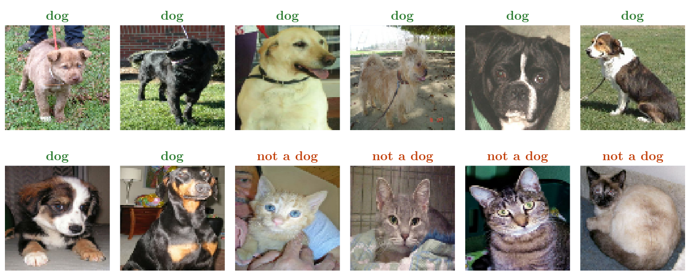
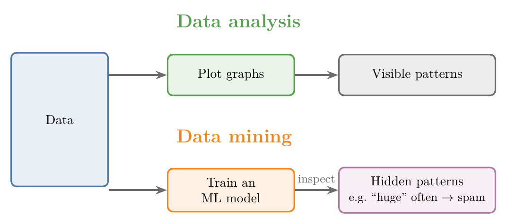

<!-- where-this-fits: generated by course_map/build_map.py; edit concepts.yaml, not this block -->
> **Where this fits:** Pipeline map step 0 (Foundations). See the [Course map](../../../00-course-map/00-course-map.md).
>
> 
>
> - **Builds on:** [Role of mathematics in ML](../../../MA/00-why-maths/MA-001-role-of-maths-in-ml/MA-001-role-of-maths-in-ml.md#1-overview).
> - **Leads to:** [Artificial intelligence](../../../ML/01-foundations/ML-002-ai-vs-ml-vs-dl/ML-002-ai-vs-ml-vs-dl.md#2-artificial-intelligence); [Deep learning](../../../ML/01-foundations/ML-002-ai-vs-ml-vs-dl/ML-002-ai-vs-ml-vs-dl.md#5-deep-learning); [Features](../../../ML/01-foundations/ML-002-ai-vs-ml-vs-dl/ML-002-ai-vs-ml-vs-dl.md#52-features-chosen-by-us-or-learned); [Supervised learning](../../../ML/01-foundations/ML-003-types-of-ml/ML-003-types-of-ml.md#2-supervised-learning); [Unsupervised learning](../../../ML/01-foundations/ML-003-types-of-ml/ML-003-types-of-ml.md#3-unsupervised-learning); [Semi-supervised learning](../../../ML/01-foundations/ML-003-types-of-ml/ML-003-types-of-ml.md#4-semi-supervised-learning).
> - **Compare with:** [Symbolic AI and expert systems](../../../ML/01-foundations/ML-002-ai-vs-ml-vs-dl/ML-002-ai-vs-ml-vs-dl.md#3-symbolic-ai-and-expert-systems); [Deep learning](../../../ML/01-foundations/ML-002-ai-vs-ml-vs-dl/ML-002-ai-vs-ml-vs-dl.md#5-deep-learning); [Exploratory data analysis](../../../ML/01-foundations/ML-009-mldlc/ML-009-mldlc.md#6-exploratory-data-analysis-eda); [What deep learning is](../../../DL/01-basics/DL-001-dl-scope-and-prerequisites/DL-001-dl-scope-and-prerequisites.md#21-artificial-neural-networks).
<!-- /where-this-fits -->

## 1. Overview

> **Key point:** Machine Learning lets a computer learn the logic from data, instead of us writing that logic by hand.

This Note is the second part of Note ML-001; the first part is the [Course map](../../../00-course-map/00-course-map.md).

Figure 1 shows the core idea. In traditional programming, we write the logic and the computer applies it. In Machine Learning (G-1140), we give the computer inputs together with their outputs, and an algorithm finds the logic for us.

The rest of this Note covers:

- what Machine Learning is, and what "explicit programming" means,
- three situations where ML beats hand-written code,
- why ML only became popular after 2010,
- why ML skills are in demand.

## 2. Defining Machine Learning

> **Key point:** Machine Learning is learning from data, without being explicitly programmed.

In simple terms, Machine Learning is all about learning from data. A program that learns gets better at its job as it sees more examples, without anyone rewriting its code.

The standard definition attaches the terms: **Machine Learning (ML)** (G-1140) is a field of computer science that uses statistical techniques to give computer systems the ability to *learn* with data, without being **explicitly programmed** (G-730; section 3.1).

"Getting better with more examples" can be measured. Figure 2 does it with a real spam filter that learns from text messages.

1. **The data.** 5,574 text messages, each with a **label** (G-1032): spam or not spam (Almeida et al. 2011). We keep 1,000 of them aside as a **test set** (G-1962), which the filter never learns from, because what we care about is how well it sorts new messages it has not seen, not the ones it learned from (ISLR §2.2.1).
2. **The experience.** A **Naive Bayes** (G-1297) filter (a method that scores a message by how often each of its words appeared in spam; see [Naive Bayes](../../07-classification/ML-081-naive-bayes-intuition/ML-081-naive-bayes-intuition.md#2-the-method-on-one-picture)) learns from 10 labelled messages, then 20, 50, and so on up to all 4,574 that are left.
3. **The score.** Each time, we count how many of the 1,000 test messages it sorts correctly. This share is its **accuracy** (G-162).
4. **The result.** In Figure 2 the horizontal axis is on a log scale: each tick is a bigger jump than the one before (10, 20, 50, 100 and so on), so the small amounts of data are spread out. With 10 messages it scores 86.9 percent, no better than always answering "not spam" (86.6 percent of the test messages are not spam). With 100 messages it scores 93.8 percent, and with all 4,574 it scores 98.1 percent. The code never changed; only the data grew.

Tom Mitchell's definition states this exactly (Mitchell 1997, Ch. 1): a program **learns** from experience E at a task T, measured by P, if its performance at T, measured by P, improves with E. In Figure 2:

- **T** is sorting messages into spam and not spam;
- **E** is the set of labelled messages it has learned from (the horizontal axis);
- **P** is the share of test messages it sorts correctly (the vertical axis).

> **Extra:** The phrase "without being explicitly programmed" is usually credited to Arthur Samuel, who named the field in 1959 while building a checkers program that learned partly by playing against itself (Samuel 1959).

## 3. Explicit programming vs learning from data

> **Key point:** In explicit programming, we write code for every case. In ML, an algorithm finds the pattern between inputs and outputs, and handles the cases for us.

### 3.1 Explicit programming

> **Key point:** Explicit programming means writing code for each specific scenario.

**Explicit programming** (G-730) means writing code for each specific scenario. For every situation the program must handle, we write the logic for it.

Explicit programming is how traditional software is built. The top half of Figure 1 shows the flow: we write a **program** containing our logic, give it an input, and get an output.

### 3.2 Learning patterns from data

> **Key point:** We give the algorithm inputs and outputs; it finds the pattern; then we give it new inputs and it produces the outputs.

In ML we do not write the logic. The bottom half of Figure 1 shows what we do instead:

1. We collect **data** that contains both inputs and their outputs. Each input variable is a **feature** (G-772; one column of the data table), the output we want to predict is the **target** (G-1949), and each record is an **observation** (G-1374; one row of the table).
2. We give the data to an **ML algorithm**, a general method for finding patterns.
3. The algorithm explores the data and finds the **pattern** between input and output. This step is called **training** (G-1255).
4. The result is a **model** (G-1256): the logic, found by the algorithm instead of written by us.
5. We give the model new inputs, and it produces the outputs. Each output is a **prediction**: the model's answer for an input whose true output we do not know.

Figure 3 shows steps 1 to 5 on real data: the CGPA and salary package (in lakh rupees per annum, LPA) of 200 students.

1. **The data.** Each dot is one student: the feature is the CGPA, the target is the package. The data a model learns from is its **training set** (G-2002), also called training data.
2. **Training.** The algorithm fits a straight line through the dots (how it finds the line is the subject of [simple linear regression](../../06-regression/ML-049-simple-linear-regression/ML-049-simple-linear-regression.md#35-turning-the-line-to-find-the-lowest-total)). The line is the model: package = 0.57 × CGPA − 0.99.
3. **Prediction.** A new student has a CGPA of 7.5. We go up from 7.5 to the line and across to the vertical axis. The same step in numbers, one line per step:

   $$0.57 \times 7.5 = 4.275$$

   $$4.275 - 0.99 = 3.285 \approx 3.29 \text{ LPA}$$

For a CGPA of 8.5 the line gives:

$$0.57 \times 8.5 = 4.845$$

$$4.845 - 0.99 = 3.855 \approx 3.86 \text{ LPA}$$

For a CGPA of 6.0 it gives:

$$0.57 \times 6.0 = 3.42$$

$$3.42 - 0.99 = 2.43 \text{ LPA}$$

Nobody wrote the rule "0.57 × CGPA − 0.99": training found it in the 200 dots. Predicting a number, as here, and sorting into classes, as the spam filter of Figure 2 does, are the two main jobs of ML models, called regression and classification (see [regression and classification](../ML-003-types-of-ml/ML-003-types-of-ml.md#23-regression-and-classification)).

The advantage: we do not have to write code for each condition or case. The ML algorithm handles them automatically.

### 3.3 Example: adding numbers

> **Key point:** A hand-written sum program only does what we coded. A model learns "addition" from the rows we give it, so a new case needs new data, not new code.

*Traditional programming.* We write a program that adds two numbers. Whenever we give it two numbers, it returns their sum.

*Machine Learning.* We do not write the addition ourselves. Instead, we give the algorithm a spreadsheet in which each row holds some numbers and their sum:

| Numbers | Sum |
|---|---|
| 2, 3 | 5 |
| 10, 4 | 14 |
| 1, 6, 2 | 9 |
| 5, 5, 5, 5 | 20 |

When the model trains on this data, it discovers that the pattern is addition. After training, the model adds the numbers of a new row that looks like the rows it trained on (Extra below).

Figure 4 shows training at work on the two-number case. Each row has two numbers; call the first one $a$ and the second one $b$. For the row 2, 3 we have $a = 2$ and $b = 3$. The model is a formula with three numbers it can change, called its **parameters** (G-1450): $w_1$ multiplies $a$, $w_2$ multiplies $b$, and $c$ is added at the end.

$$\text{sum} \approx w_1 a + w_2 b + c$$

With $w_1 = 1$, $w_2 = 1$ and $c = 0$ this gives the true sum of the row 2, 3:

$$1 \times 2 + 1 \times 3 + 0 = 5$$

1. **Start.** The parameters begin at $w_1 = 0.20$, $w_2 = -0.30$ and $c = 3.00$. The model knows nothing. For the new input 7 and 8:

   $$0.20 \times 7 = 1.40$$

   $$(-0.30) \times 8 = -2.40$$

   $$1.40 - 2.40 + 3.00 = 2.00$$

   The answer is 2.00 instead of 15, and its dots lie far below the dashed line.
2. **One training step.** The model answers all 20 pairs (the two pairs of the table plus 18 random pairs from 0 to 10), measures how far each answer is from the true sum, and moves each parameter a little in the direction that shrinks that error. This repeated nudging is **gradient descent** (G-862; see [gradient descent](../../06-regression/ML-056-gradient-descent/ML-056-gradient-descent.md#2-the-idea)).
3. **After 3,000 steps.** The parameters are $w_1 = 1.00$, $w_2 = 1.00$ and $c = 0.04$, every dot sits on the dashed line, and the answer for 7 and 8 is 14.99. Nobody wrote "add" into the model: the values 1, 1 and 0 are addition, and they were found in the data.

The hand-written program cannot do this. The program was coded to add exactly two numbers, so with more than two it fails until someone rewrites the code. A model has the same limit at first (the formula above takes exactly two numbers), but the fix is different: we add rows with three or four numbers to the data and train again, and nobody writes new logic. Handling new cases through data instead of code is the key difference, and a large part of why ML is so powerful in industry.

> **Extra:** Addition is a toy example; in practice we would just write the one line of code. Also, a model only learns the cases its data covers: a basic model trained only on pairs of numbers expects exactly two inputs, so to handle four or ten numbers, the training data must include rows like that. The point holds: the logic comes from the data, so new cases are handled by adding data, not by rewriting code.

## 4. When to use Machine Learning

> **Key point:** ML is the better choice when the rules keep changing, when there are too many cases to write, and when we want to dig out hidden patterns (data mining).

Not every problem needs ML. Three situations where it clearly beats traditional software development:

1. The rules keep changing (Section 4.1).
2. There are too many cases to even list (Section 4.2).
3. We want to find hidden patterns in data: data mining (Section 4.3).

There are other situations too, but these three are the most important.

### 4.1 When the rules keep changing: spam filtering

> **Key point:** Hand-written rules must be rewritten every time the world changes. An ML model updates itself from new data.

Suppose we must build an **email spam classifier**: a program that decides whether an email is spam or not.

*With explicit programming*, we would:

1. Collect a bunch of emails, each marked spam or not spam.
2. Look for patterns by hand. For example, spam often repeats words such as "discount", "sale" or "awesome", or is full of pictures.
3. Write a long **if-else ladder**: one `if` condition for each pattern we found.

Say one of our rules is: *if "huge" appears more than three times, mark the email as spam*. Figure 5 (left) shows what happens next.

Advertising companies find out about the rule and write "big" or "massive" instead of "huge". Our program no longer catches their emails, so we change the logic. They experiment with other words, and we have to change it again, and again.

*With Machine Learning* (Figure 5, right), the logic comes from the data. When advertisers change their words, we add the new labelled emails to the data, and the change is reflected in the logic automatically. We write one algorithm, and it handles everything else.

Figure 6 measures this story on the 5,574 text messages of Figure 2, with the word "call" in the role of "huge".

1. **Today.** Our hand-written rule is: *if the message contains "call", mark it as spam*. The rule catches 42.5 percent of the spam. A Naive Bayes filter that learned from 4,574 labelled messages catches 88.1 percent. The filter gives every word a weight; "call" has a weight of +1.4, a sign of spam.
2. **The spammers adapt.** We replace "call" with "ring" in every spam message. The hand-written rule now catches 0.0 percent. The learned filter still catches 87.3 percent, because it weighs all the words of a message, not one.
3. **Retraining.** The filter trains again on labelled messages that contain the new wording. Nobody edits its code. The weight of "ring" moves from −0.3 to +4.1, the filter catches 91.0 percent (a little more than before the change, because the new weight of "ring", +4.1, is a much stronger sign of spam than the +1.4 that "call" had), and the hand-written rule stays at 0.0 until someone rewrites it.

> **Extra:** Real spam filters moved to ML in exactly this way. An early study trained a simple filter that learns word probabilities from labelled emails. Using words alone, 97.1% of the emails it flagged as junk really were junk, and it caught 94.3% of all junk (Sahami et al. 1998, Table 1). That method, Naive Bayes, is covered in [Naive Bayes](../../07-classification/ML-081-naive-bayes-intuition/ML-081-naive-bayes-intuition.md#2-the-method-on-one-picture).

### 4.2 When there are too many cases: recognising dogs

> **Key point:** Some problems have so many cases that no one can write them all. We learn them from examples instead, as humans do.

Suppose we want a program that tells whether a picture contains a dog. Deciding what a picture contains is an **image classification** (G-919) problem.

There are hundreds of dog breeds:

- some large, some small,
- in many colours,
- with different ears, tails, coats and shapes.

To write this program by hand, we would need a case for every breed and every look. We cannot even imagine how many cases that is, so we cannot code it.

Figure 7 shows the problem on real photos. Try to write one rule that is true for all eight dogs and false for the four cats: "brown" fails, "large" fails, "standing on grass" fails.

Instead, we use the same technique humans use. From childhood we were shown animals and told "this is a dog", "that is not a dog, that is a cat". Our mind kept tagging names to animals and learned from that data. An ML model learns from labelled photos, such as those of Figure 7, in the same way.

### 4.3 Data mining: finding hidden patterns

> **Key point:** Data analysis finds patterns we can see in graphs. Data mining uses ML to find patterns too hidden for graphs.

First, what data analysis is. **Data analysis** (G-530) is the process of searching data for patterns and hidden information, mostly by plotting graphs.

Sometimes the information is too well hidden to show up in any graph. For example, just by reading emails, we may be unable to spot which words make an email spam.

**Data mining** (G-537) means applying an ML algorithm to data to extract such hidden patterns. Figure 8 contrasts the two:

{width=80%}

1. We build a prediction model, for example the email spam classifier.
2. We inspect the patterns the model has learned. For example: when "huge" occurs often, the email is labelled spam; when it is rare, the email is not spam.
3. The useful information we extract this way is the result of data mining.

Most of the time, when we need to extract hidden patterns from data, we use ML. ML is a very important tool for data mining.

> **Extra:** More broadly, data mining is the discovery of useful patterns in large datasets, using methods from ML, statistics and databases. Data mining is often used as another name for *knowledge discovery from data* (KDD) (Han et al. 2011, §1.2). Data analysis and data mining overlap a lot; as Section 4.3 sets out, the difference is how hidden the patterns are and whether a model is needed to find them.

## 5. A short history of Machine Learning

> **Key point:** ML is decades old. ML took off only after 2010, once we had enough data and hardware powerful enough to learn from it.

### 5.1 Old ideas, late success

> **Key point:** Like an actor who plays small roles for years before becoming a star, ML existed long before it became famous.

The history of ML resembles the career of the actor Nawazuddin Siddiqui. He worked in films for years in tiny roles, such as a small part in *Munna Bhai MBBS* (2003), before becoming one of the country's biggest actors. A shift in the industry made the difference: OTT platforms and audiences who preferred content-driven films.

ML is similar. Its theory and mathematics have existed for 40 to 50 years, but it stayed out of the limelight, unlike other major technologies. Only from the 2010s did it rise to where it is today.

> **Extra:** The roots go back even further. Frank Rosenblatt described the perceptron, an early learning machine, in 1957 (Rosenblatt 1957), and Arthur Samuel named the field in 1959. A well-known turning point came in 2012, when a deep neural network (AlexNet) won the ImageNet image recognition contest with an error of 15.3%, against 26.2% for the next entry (Krizhevsky et al. 2012).

### 5.2 Why ML took off after 2010

> **Key point:** Two problems held ML back: too little data and too weak hardware. The internet and smartphones solved both.

ML needs a significant amount of data. Before 2010, two things held it back (Figure 9, left):

1. **Data:** collecting and labelling data was slow, tedious work.
2. **Hardware:** computers were not powerful enough to run the algorithms on large data. Even 128 MB of RAM (a computer's working memory) was a big deal.

After 2010, the internet and smartphones solved both problems (Figure 9, right).

*Data.* We now generate data at a huge pace. Think of everything one person does on a phone from morning until bed; then multiply by about 4 billion internet users around the world.

*Hardware.* Many of us carry phones with up to 12 GB of RAM and a GPU (graphics processing unit, a chip that does many calculations at once) in our pocket, more than research scientists once had.

With good hardware, plenty of data and the algorithms, ML is now enjoying its success, and its growth is not expected to stop any time soon.

## 6. Machine Learning jobs

> **Key point:** ML salaries are high because demand for ML skills is far greater than supply. As more people learn ML, salaries will settle, so early learners gain the most.

### 6.1 Supply and demand: the Java story

> **Key point:** When a new technology arrives, few people know it, so companies compete for them and salaries rise.

Today's ML jobs and salaries will not stay the same forever. The reason is simple economics, and the history of Java shows it:

1. When Java entered the market, only a handful of people knew it.
2. Companies needed Java because their competitors were using it.
3. When they went to hire, they found a lack of talent.
4. All the companies fought for the few Java professionals, so those people got higher salaries.

### 6.2 Where ML is on the curve

> **Key point:** ML is still on the rising part of the curve: few people know it well, so demand is high.

The same trend is happening with ML now. Many colleges do not teach ML yet, so when a company recruits at a college, it finds few students who know it. Companies compete for those students, which pushes salaries up.

Higher salaries make more people learn the technology. In a few years, most engineers may know ML, as most know Java today. Companies will then have many more options, and salaries will normalise.

Figure 10 shows this pattern for any technology: the salary premium first rises, then falls back as experts become common. ML is still on the rising part, so if we learn it well now, we can benefit from that growth.

> **Extra:** Figure 10 is a sketch of the supply-and-demand argument, not measured data. Real salaries depend on the role, country and skill level.

## 7. Summary

| | Traditional programming | Machine Learning |
|---|---|---|
| Who writes the logic | We do, case by case | The algorithm finds it in data |
| What we provide | Input + program | Input + output (data) |
| New case appears | Rewrite the code | Add data and retrain |
| Rules that keep changing (spam) | Endless rewrites | Logic updates from data |
| Too many cases (dog photos) | Impossible to code | Learned from labelled examples |

- ML: learning from data, without explicit programming, so a program gets better as it sees more examples while its code stays the same (the spam filter went from 86.9 to 98.1 percent).
- Explicit programming: writing code for every scenario, so every new case needs new code.
- Use ML when rules keep changing, when cases are too many to write, and for data mining, because in each of these hand-written rules break: they need endless rewrites, cannot all be listed, or cannot see the pattern.
- Data mining uses ML to dig out patterns too hidden for graphs, so the patterns a trained model has learned can be read back as new information.
- ML is decades old; data and hardware made it take off after 2010.
- ML skills pay well because demand is ahead of supply; this will even out over time.

## 8. Sources

**Built from**

- CampusX, "What is Machine Learning? | 100 Days of Machine Learning", YouTube, https://www.youtube.com/watch?v=ZftI2fEz0Fw
- StatQuest with Josh Starmer, "A Gentle Introduction to Machine Learning", YouTube, https://www.youtube.com/watch?v=Gv9_4yMHFhI (the fitted line that makes a prediction, Figure 3)

**Other references**

- Almeida, T. A., Gómez Hidalgo, J. M. and Yamakami, A. (2011). Contributions to the Study of SMS Spam Filtering: New Collection and Results. *Proceedings of the 11th ACM Symposium on Document Engineering (DocEng '11)*. The SMS Spam Collection v.1, UCI Machine Learning Repository, https://archive.ics.uci.edu/dataset/228/sms+spam+collection
- Microsoft Download Center: Kaggle Cats and Dogs Dataset (the photos of Figure 7; see [cats vs dogs CNN](../../../DL/04-cnn/DL-049-cat-vs-dog-cnn/DL-049-cat-vs-dog-cnn.md#3-the-dataset)).
- Han, J., Kamber, M. and Pei, J. (2011). *Data Mining: Concepts and Techniques*, 3rd ed. Morgan Kaufmann.
- James, G., Witten, D., Hastie, T. and Tibshirani, R. (2021). *An Introduction to Statistical Learning*, 2nd ed. Springer. Free PDF at statlearning.com. §2.2.1, measuring the quality of fit: test data (ISLR).
- Krizhevsky, A., Sutskever, I. and Hinton, G. (2012). ImageNet Classification with Deep Convolutional Neural Networks. *NeurIPS*.
- Mitchell, T. (1997). *Machine Learning*. McGraw-Hill.
- Rosenblatt, F. (1957). *The Perceptron: A Perceiving and Recognizing Automaton*. Report 85-460-1, Cornell Aeronautical Laboratory.
- Sahami, M., Dumais, S., Heckerman, D. and Horvitz, E. (1998). A Bayesian Approach to Filtering Junk E-Mail. *AAAI-98 Workshop on Learning for Text Categorization*, Technical Report WS-98-05.
- Samuel, A. (1959). Some Studies in Machine Learning Using the Game of Checkers. *IBM Journal of Research and Development* 3(3).

## 9. Key terms

| Term | Meaning |
|---|---|
| Machine Learning (ML) | A field of computer science where computers learn from data without being explicitly programmed |
| Explicit programming | Writing code for each specific scenario a program must handle |
| Program | Logic written by us that turns an input into an output |
| Data | Recorded examples of inputs together with their outputs; a machine learning algorithm learns the pattern that links them from these examples. |
| Feature | An input variable; one column of the data table |
| Target | The output we want to predict |
| Observation | One record; one row of the data table |
| ML algorithm | A general method that finds the pattern between inputs and outputs in data |
| Pattern | The relationship between input and output that the algorithm discovers |
| Training (G-1255) | The step in which an algorithm learns the pattern from data |
| Training set | The data a model learns from; also called training data |
| Prediction (G-1550) | A model's answer for an input whose true output is not known |
| Parameter (G-1450) | A number inside a model that training changes, such as $w_1$ in sum ≈ $w_1 a + w_2 b + c$ |
| Gradient descent | Training by repeatedly nudging each parameter in the direction that shrinks the error |
| Label | The known answer attached to an observation, such as spam or not spam |
| Test set | Observations kept aside, never learned from, used to measure performance |
| Accuracy | The share of observations a model sorts correctly |
| Model | The logic produced by training, used to give outputs for new inputs |
| Spam classifier | A program that decides whether an email is spam or not |
| If-else ladder | A long chain of hand-written `if` conditions, one per case; the traditional way to code rules, which breaks down when the cases are too many or keep changing. |
| Image classification | Deciding what a picture contains, e.g. dog or not dog |
| Data analysis | Finding patterns and hidden information in data, mainly by plotting graphs |
| Data mining | Using ML on data to extract patterns too hidden for graphs |
