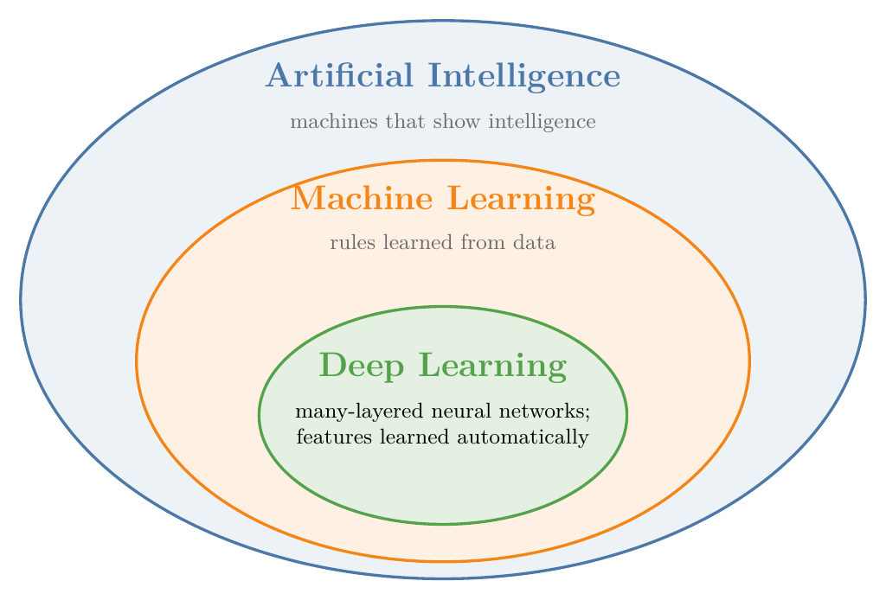
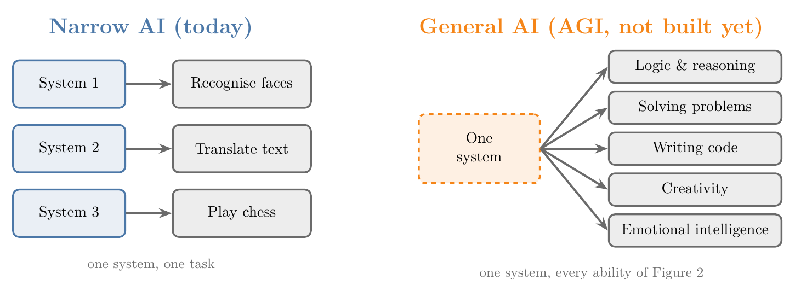
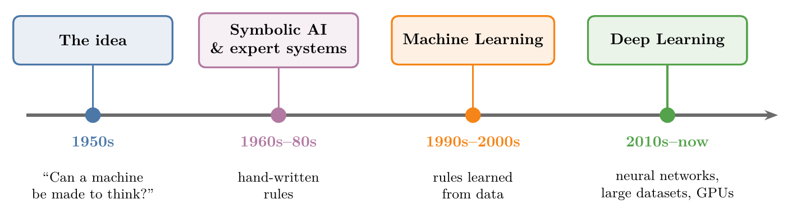
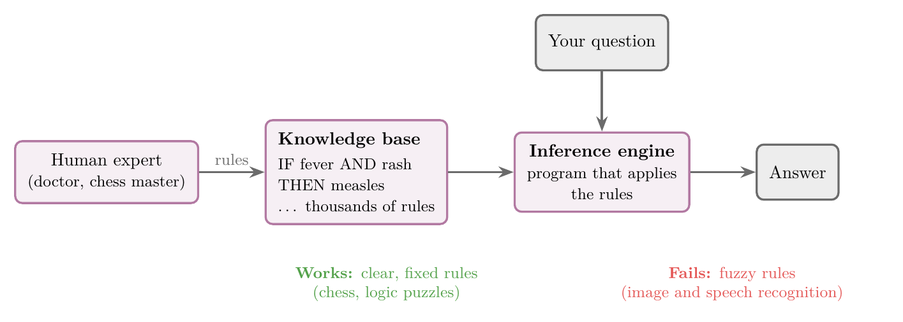
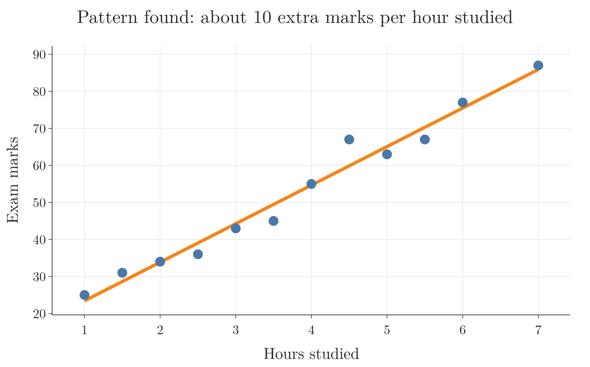
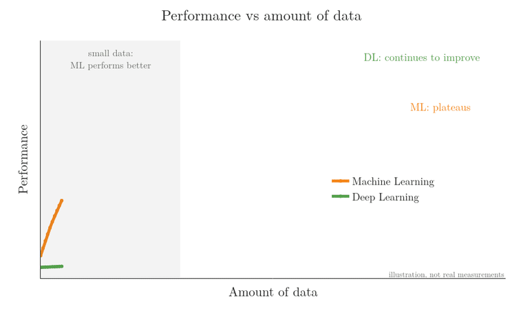

<!-- where-this-fits: generated by course_map/build_map.py; edit concepts.yaml, not this block -->
> **Where this fits:** Pipeline map step 0 (Foundations). See the [Course map](../../../00-course-map/00-course-map.md).
>
> 
>
> - **Builds on:** [Machine learning](../../../ML/01-foundations/ML-001-what-is-ml/ML-001-what-is-ml.md#2-defining-machine-learning).
> - **Used here, taught in full later:** [Neural networks](../../../DL/01-basics/DL-002-what-is-deep-learning/DL-002-what-is-deep-learning.md#22-the-parts-of-a-neural-network).
> - **Leads to:** [Feature engineering](../../../ML/03-feature-engineering/ML-022-what-is-feature-engineering/ML-022-what-is-feature-engineering.md#2-what-feature-engineering-is).
> - **Compare with:** [Machine learning](../../../ML/01-foundations/ML-001-what-is-ml/ML-001-what-is-ml.md#2-defining-machine-learning).
<!-- /where-this-fits -->

## 1. Overview

> **Key point:** Deep Learning is a part of Machine Learning, and Machine Learning is a part of Artificial Intelligence.

Figure 1 shows the three fields as nested circles. Every DL system is also an ML system, and every ML system is also an AI system.

## 2. Artificial Intelligence

> **Key point:** AI is the field of building machines that show intelligence. Every AI system in use today handles one narrow task.

**Artificial Intelligence (AI)** (G-215) is the field of building machines that show intelligence. To see what that involves, we first need to look at what intelligence is.

### 2.1 Intelligence is many abilities

> **Key point:** Intelligence is not one ability but a combination of many, and some of them cannot even be defined precisely.

Figure 2 shows some of the abilities that make up human intelligence. We use different ones for different jobs:

- logic, to write code;
- problem solving, to crack a puzzle;
- imagination, to create something new.

Some of these abilities, such as logic, are well defined. Others, such as creativity or emotional intelligence, have no precise definition. An ability we cannot define is very hard to build into a machine: we cannot measure creativity, and nobody knows "the equation of love", so we cannot tell a right result from a wrong one.

The ability we can measure is **pattern recognition** (G-2169): finding regularities in data, such as which words mark a spam email. A pattern-recognition system can be scored, because each answer is right or wrong. For that reason, almost all AI in use today is pattern recognition.

### 2.2 Narrow AI and general AI

> **Key point:** All AI today is narrow AI. General AI, a machine with every human ability, does not exist yet.

- **Narrow AI** (G-1303): a system that performs one specific task, such as recognising faces, translating text or playing chess.
- **Artificial general intelligence (AGI)** (G-184): a single machine with all the abilities in Figure 2, like a human.

Figure 3 shows the difference. On the left, each narrow system does one task and nothing else: the chess system cannot translate a sentence. On the right, one system would have every ability of Figure 2.

AGI is the long-term goal of the field. Every AI system we use today is narrow AI.

## 3. Symbolic AI and expert systems

> **Key point:** Early AI worked by having humans write down rules. Hand-written rules work for problems with clear rules and fail for everything else.

Figure 4 is a timeline, read from left to right: it shows how approaches to AI changed over time. Serious work on AI began in the 1950s.

The first approach was **symbolic AI** (G-1931): humans write down the knowledge a machine needs, as explicit rules. The machine then follows those rules.

> **Extra:** Two dates mark the start of AI. In 1950 Alan Turing asked "Can machines think?" (Turing 1950), and in 1956 a summer workshop at Dartmouth gave the field its name, *artificial intelligence* (Russell and Norvig 2020, §1.3.1).

### 3.1 How an expert system works

> **Key point:** An expert system stores an expert's knowledge as rules and uses a program to apply them.

The best-known product of symbolic AI is the **expert system** (G-726). Figure 5 shows how one is built and used.

1. We collect knowledge from a **human expert**, such as a doctor or a chess master.
2. We write that knowledge as rules in a **knowledge base** (G-1018).
3. An **inference engine** (G-942), a program, applies those rules to answer questions.

Chess-playing computers are a classic example.

### 3.2 Why expert systems fail

> **Key point:** Expert systems need clear, fixed rules. Most real-world problems do not have them.

Expert systems work well when a problem has clear, fixed rules, as in chess or logic puzzles. They fail when the rules are fuzzy.

Take the question: *does this photo contain a dog?* Hundreds of breeds, looks, angles and lights make the rules impossible to write down (see [when there are too many cases: recognising dogs](../ML-001-what-is-ml/ML-001-what-is-ml.md#42-when-there-are-too-many-cases-recognising-dogs)). Speech recognition fails for the same reason, and Machine Learning was developed to solve exactly this kind of problem.

## 4. Machine Learning

> **Key point:** In Machine Learning, we do not write the rules. We give the machine examples with answers, and it works out the rules itself.

**Machine Learning (ML)** (G-1140) is a branch of computer science that uses statistical techniques to find patterns in data. ML borrows its tools from statistics, but it is not "just statistics": the maths needed is limited, and most of the work is practical engineering. ML became practical only once we had enough data and fast hardware (see [why ML took off after 2010](../ML-001-what-is-ml/ML-001-what-is-ml.md#52-why-ml-took-off-after-2010)).

### 4.1 Learning rules from data

> **Key point:** Traditional programming turns rules into answers. ML turns answers into rules.

Instead of writing every rule by hand (explicit programming (G-730)), we give the machine data and the correct answers, and it finds the rules itself (see [explicit programming versus learning from data](../ML-001-what-is-ml/ML-001-what-is-ml.md#3-explicit-programming-vs-learning-from-data)). Finding the rules from examples is called **learning** (G-1073). Once a machine has learned, it can **predict** (G-1548): give an answer for new data it has never seen.

> **Extra:** What does "finding a pattern" look like? Suppose we record how many hours 12 students studied and the marks each one scored. Plotted together (Figure 6: each dot is one student, hours studied on the horizontal axis and marks on the vertical axis), the points rise from left to right, and the line through them says: each extra hour of study adds about 10 marks, on top of about 15 marks for a student who studies 0 hours. With $x$ for hours studied and $y$ for marks, the line is $y = 10x + 15$. That line *is* the pattern. A student who studies 5 hours can now be predicted, one line per step, even though we never saw that student:

$$10 \times 5 = 50$$

$$50 + 15 = 65$$

The prediction is about 65 marks. Finding the best line through data like this is one of the statistical techniques ML uses (covered later as *linear regression (G-1094)*).

### 4.2 Teaching a machine to recognise dogs

> **Key point:** We stop writing rules and start providing labelled examples.

An ML model learns what a dog looks like from labelled photos, as children do (see [recognising dogs](../ML-001-what-is-ml/ML-001-what-is-ml.md#42-when-there-are-too-many-cases-recognising-dogs)).

Figure 7 shows what the data looks like. The steps are:

1. We show the system many photos, each with its label: "this is a dog", "this is not a dog".
2. The system searches the photos for what the dog photos have in common. This search is the learning.
3. After enough photos, the system can classify a photo it has never seen (put it in a category: "dog" or "not a dog").

Compared with symbolic AI:

| Approach | What we do | Result |
|---|---|---|
| Symbolic AI | Write rules for every breed, colour and shape | Impossible to finish |
| ML | Show thousands of photos labelled "dog" or "not dog" | The machine learns what a dog looks like and can classify new photos |

## 5. Deep Learning

> **Key point:** DL is ML that uses neural networks. Its big advantage: it finds the features by itself, and it keeps improving as we give it more data.

**Deep Learning (DL)** (G-568) is a subset of ML that took off after about 2010.

The process is the same as in ML. We give data to an algorithm and **train** (G-1255) it: the algorithm makes predictions, measures how wrong they are, and adjusts itself to be less wrong. Then we use it to predict on new data. What changes is the algorithm.

### 5.1 Neural networks

> **Key point:** Neural networks are inspired by the brain, but they do not work like the brain.

DL uses **neural networks** (G-1316), which are loosely inspired by the neurons in the brain. How the brain works is still not fully understood, so a neural network is not a copy of it. A neural network is a mathematical model that borrows one idea: many simple units connected together.

The smallest unit of a neural network is the **perceptron** (G-1486), an artificial neuron: it multiplies each input by a weight, adds the results and turns the sum into an output. Its parts are shown in [the parts of a perceptron](../../../DL/01-basics/DL-004-perceptron/DL-004-perceptron.md#3-the-parts-of-a-perceptron).

### 5.2 Features: chosen by us or learned

> **Key point:** In ML, we choose the features. In DL, the network learns them.

A **feature** (G-772) is an input variable: one piece of information that a model uses to make its decision, stored as one column of the data table. For example, to predict whether a student will get a job in campus placements, our data might look like this:

| Student | CGPA | IQ | Certifications | Placed? |
|---|---|---|---|---|
| A | 8.9 | 120 | 3 | Yes |
| B | 6.1 | 105 | 0 | No |
| C | 7.5 | 112 | 2 | Yes |

Here CGPA, IQ and Certifications are the features. "Placed?" is the **target** (G-1949): the output we want to predict. Each student is one **observation** (G-1374): one record, one row of the table.

Figure 8 shows the difference:

- **ML:** we decide which features matter and supply them. Choosing well requires a good understanding of the data. A useful feature we leave out can never be used by the model.
- **DL:** we supply the raw data, and the network works out which information matters.

Learning its own features makes DL valuable when nobody knows what the right features are. For example, to tell dogs from cats with ML we would have to describe each animal by hand-made features, such as the shape of the ears, the whiskers and the tail. Nobody can list all the features that make a photo a dog photo. A DL network takes the raw pixels (the brightness numbers that make up a photo) and finds them itself. In the placement example, the same holds for a résumé: instead of counting certifications and backlogs by hand, we give the network the raw text.

### 5.3 Layers build up understanding

> **Key point:** Each layer of a neural network combines what the previous layer found into something bigger.

A neural network is organised in **layers** (G-1056) of neurons. Each layer works on the output of the layer before it. Adding layers lets the network detect more complex patterns, and a network with many layers is called *deep*.

Figure 9 shows a network recognising a handwritten digit:

1. The first layer detects **edges**: short straight segments.
2. The next layer combines edges into **shapes**: a horizontal bar and a slanted line.
3. The next layer combines the shapes into the answer: 7.

> **Extra:** Nobody tells the layers to look for "edges" or "shapes". When researchers looked inside trained image networks, they found that the first layers respond to edges and blobs of colour, and later layers to larger parts such as faces or wheels (Zeiler and Fergus 2014, Fig. 2). Figure 9 is a simplified version of this.

### 5.4 More data helps DL more

> **Key point:** ML stops improving after a point. DL keeps improving as data grows.

Figure 10 draws both curves: the horizontal axis is the amount of data and the vertical axis is how well the model performs. Read from left to right, as the amount of data grows:

- **ML** improves at first, then levels off.
- **DL** keeps improving as data grows.

Why the two curves differ: a model's **capacity** (G-344), how wide a range of patterns it can fit. A simple ML model can fit only simple patterns, so once it has learned all it can hold, more data adds nothing and its curve levels off. A neural network has very many weights, so it can fit far more complex patterns. With few examples, it fits their noise too and does badly on new data: it **overfits** (G-1429; see [overfitting](../ML-007-challenges-in-ml/ML-007-challenges-in-ml.md#71-overfitting)). With more examples, it has enough to learn the real pattern, and it keeps improving. The more data we have, the larger the capacity that works best (Goodfellow et al. 2016, §5.2, Fig. 5.4).

The steady gain with more data is why DL now outperforms ML on tasks with very large datasets:

- image classification (G-919);
- object detection;
- text and speech tasks.

> **Extra:** Figure 10 is a sketch, not a measurement. A measured case: Sun et al. (2017) trained image networks on up to 300 million images, and performance on vision tasks kept rising, roughly by the same amount each time the data grew tenfold (a logarithmic increase).

## 6. Choosing between ML and DL

> **Key point:** Lots of data, especially images, text or speech: use DL. Small or tabular data: use ML.

DL needs large amounts of data. With small datasets it performs worse than ML, as the shaded region of Figure 10 shows, because a large network overfits a small dataset (Section 5.4).

Most organisations do not have that much data: most of the world's data is small data. Banks, insurance companies and sports analytics firms work with small datasets, and for them ML remains the standard choice.

A saying sums up the choice: where a needle is needed, we do not use a sword. DL is the sword: powerful, but the wrong tool for a small job.

| Our data | Use |
|---|---|
| Small or medium, especially tables of numbers | ML |
| Very large, especially images, text or speech | DL |

## 7. Summary

| | AI | ML | DL |
|---|---|---|---|
| What it is | Machines that show intelligence | Machines that learn rules from data | ML with many-layered neural networks |
| Who writes the rules | Humans (symbolic AI) | The machine | The machine |
| Who chooses the features | No learning involved | We do | The network |
| Data needed | None | Moderate | Very large |
| Strong at | Problems with clear rules | Tables of data | Images, text, speech |

- AI $\supset$ ML $\supset$ DL, so every DL system is also an ML system, and every ML system is also an AI system.
- Expert systems fail on problems whose rules cannot be written down (no rule fits every dog photo), so ML was developed for exactly these problems.
- ML: data + answers $\rightarrow$ rules. No explicit programming, so a new problem needs labelled examples, not new hand-written rules.
- DL learns its own features, so it helps when nobody knows the right features, as with the raw pixels of a photo.
- With more data, DL keeps improving while ML levels off, because a network's many weights can fit far more complex patterns, so DL wins on very large image, text and speech datasets.
- With little data, use ML, because a large network overfits a small dataset and performs worse than ML, and most organisations have small data.

## 8. Sources

**Built from**

- CampusX, "AI Vs ML Vs DL for Beginners in Hindi", YouTube, https://www.youtube.com/watch?v=1v3_AQ26jZ0

**Other references**

- Microsoft Download Center: Kaggle Cats and Dogs Dataset (the photos of Figure 7; see [the dataset](../../../DL/04-cnn/DL-049-cat-vs-dog-cnn/DL-049-cat-vs-dog-cnn.md#3-the-dataset)).
- Goodfellow, I., Bengio, Y. and Courville, A. (2016). *Deep Learning*. MIT Press. §5.2, "Capacity, Overfitting and Underfitting", Figure 5.4.
- Russell, S. and Norvig, P. (2020). *Artificial Intelligence: A Modern Approach*, 4th ed. Pearson.
- Sun, C., Shrivastava, A., Singh, S. and Gupta, A. (2017). Revisiting Unreasonable Effectiveness of Data in Deep Learning Era. *ICCV*.
- Turing, A. (1950). Computing Machinery and Intelligence. *Mind* 59(236).
- Zeiler, M. and Fergus, R. (2014). Visualizing and Understanding Convolutional Networks. *ECCV*.

## 9. Key terms

| Term | Meaning |
|---|---|
| Artificial Intelligence (AI) | The field of building machines that show intelligence |
| Pattern recognition (G-2169) | Finding regularities in data; the measurable part of intelligence that today's AI covers |
| Narrow AI | AI that performs one specific task |
| Artificial general intelligence (AGI) (G-184) | A machine with all human abilities; does not exist yet |
| Symbolic AI | AI built from rules written by humans |
| Expert system | Symbolic AI system: an expert's rules plus a program that applies them |
| Knowledge base | The set of rules inside an expert system |
| Inference engine | The program that applies an expert system's rules |
| Machine Learning (ML) | Using statistical techniques to let a machine find patterns in data |
| Learning | Finding rules (patterns) from examples |
| Predict (G-1548) | Give an answer for new, unseen data |
| Deep Learning (DL) | ML using neural networks with many layers |
| Train (G-1255) | Let a model learn by repeatedly reducing its errors |
| Neural network | A model of many connected simple units, loosely inspired by the brain |
| Perceptron | The smallest unit of a neural network; an artificial neuron |
| Feature | An input variable; one column of the data table |
| Target | The output we want to predict |
| Observation | One record; one row of the data table |
| Layer | One stage of a neural network, building on the previous stage |
| Capacity (G-344) | How wide a range of patterns a model can fit |
| Overfitting (G-1429) | Fitting the training data so closely, noise included, that the model does badly on new data |
