<!-- where-this-fits: generated by course_map/build_map.py; edit concepts.yaml, not this block -->
> **Where this fits:** Pipeline map steps 0 (Foundations), 8 (Model). See the [Course map](../../../00-course-map/00-course-map.md).
>
> 
>
> - **Builds on:** [Machine learning](../../../ML/01-foundations/ML-001-what-is-ml/ML-001-what-is-ml.md#2-defining-machine-learning).
> - **Used here, taught in full later:** [Labelled data](../../../ML/01-foundations/ML-007-challenges-in-ml/ML-007-challenges-in-ml.md#32-labelled-data-is-scarce); [Regression metrics](../../../ML/06-regression/ML-051-regression-metrics/ML-051-regression-metrics.md#1-overview); [Accuracy](../../../ML/07-classification/ML-075-accuracy-confusion-matrix/ML-075-accuracy-confusion-matrix.md#2-accuracy); [Decision surface and boundary](../../../ML/07-classification/ML-085-knn/ML-085-knn.md#5-decision-surfaces); [DBSCAN](../../../ML/09-clustering-and-more/ML-126-dbscan/ML-126-dbscan.md#8-the-dbscan-algorithm-step-by-step).
> - **Leads to:** [Applications of ML](../../../ML/01-foundations/ML-008-applications-of-ml/ML-008-applications-of-ml.md#2-consumer-and-business-applications); [Framing an ML problem](../../../ML/01-foundations/ML-013-framing-ml-problem/ML-013-framing-ml-problem.md#2-why-framing-matters); [Dimensionality reduction](../../../ML/05-dimensionality/ML-045-curse-of-dimensionality/ML-045-curse-of-dimensionality.md#6-the-solution-dimensionality-reduction); [PCA](../../../ML/05-dimensionality/ML-048-pca-mnist/ML-048-pca-mnist.md); [Simple linear regression](../../../ML/06-regression/ML-049-simple-linear-regression/ML-049-simple-linear-regression.md#3-a-line-through-the-data); [Multiple linear regression](../../../ML/06-regression/ML-054-multiple-lr-code/ML-054-multiple-lr-code.md#1-overview); [Logistic regression](../../../ML/07-classification/ML-074-logistic-gradient-descent/ML-074-logistic-gradient-descent.md#1-overview); [Naive Bayes](../../../ML/07-classification/ML-084-gaussian-naive-bayes/ML-084-gaussian-naive-bayes.md#1-overview); [K-nearest neighbours](../../../ML/07-classification/ML-085-knn/ML-085-knn.md#2-how-knn-predicts); [Support vector machines](../../../ML/07-classification/ML-087-svm-maths/ML-087-svm-maths.md#1-overview); [K-means](../../../ML/09-clustering-and-more/ML-122-kmeans-intuition/ML-122-kmeans-intuition.md#4-the-five-steps-of-k-means); [Clustering](../../../ML/09-clustering-and-more/ML-124-kmeans-from-scratch/ML-124-kmeans-from-scratch.md#9-bad-random-starts); [Hierarchical clustering](../../../ML/09-clustering-and-more/ML-125-hierarchical-clustering/ML-125-hierarchical-clustering.md#4-two-kinds-of-hierarchical-clustering); [DBSCAN](../../../ML/09-clustering-and-more/ML-126-dbscan/ML-126-dbscan.md#8-the-dbscan-algorithm-step-by-step).
<!-- /where-this-fits -->

## 1. Overview

> **Key point:** Based on how much supervision they need, ML algorithms fall into four types: supervised, unsupervised, semi-supervised and reinforcement learning.

ML algorithms can be grouped in three different ways:

- by **how much supervision** they need (this Note),
- by whether they learn all at once or keep learning over time (batch vs online),
- by how they generalise to new data (instance-based vs model-based).

**Supervision** (G-1920) means correct answers that guide the algorithm while it learns. Figure 1 shows the four types this produces and their sub-types.

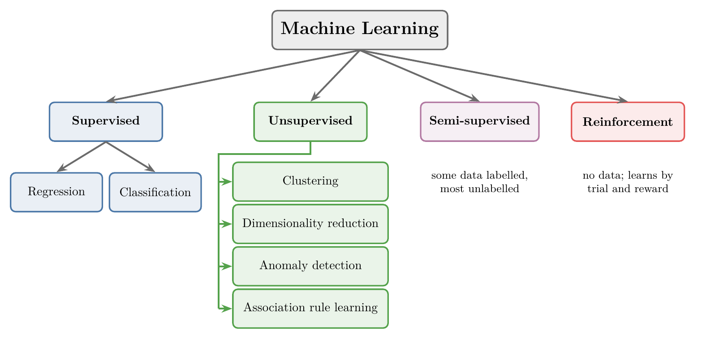

## 2. Supervised learning

> **Key point:** In supervised learning, the data has both inputs and outputs. The algorithm learns how the output depends on the inputs, then predicts the output for new inputs.

### 2.1 Learning from inputs and outputs

> **Key point:** Features + target $\rightarrow$ learn the relationship $\rightarrow$ predict the target for new observations.

Three words describe any data table:

- a **feature** (G-772) is an input variable (one column of the table);
- the **target** (G-1949) is the output we want to predict (also a column);
- an **observation** (G-1374) is one record (one row of the table).

In **supervised learning** (G-1919), every observation has both its feature values and the correct target value. The algorithm learns the mathematical relationship between them.

*Example: campus placements.* We have data on 5,000 past students (Figure 2):

- **Features:** IQ and CGPA.
- **Target:** whether the student was placed.
- **Observations:** the 5,000 students, one per row.

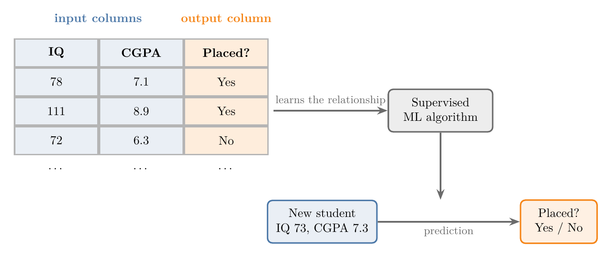

After learning, the algorithm can take a new student, say IQ 73 and CGPA 7.3, and predict *yes* or *no*. Most of the ML used in industry is supervised learning.

> **Extra:** The target is also called the **label** (G-1032) or the **output**. Data that includes the target is called **labelled data** (G-1034).

### 2.2 Numerical and categorical data

> **Key point:** Data is either numerical (numbers) or categorical (categories).

Before splitting supervised learning further, we need the two basic types of data:

| Type | What it holds | Examples |
|---|---|---|
| **Numerical** | Numbers | Age, weight, height, IQ |
| **Categorical** | Categories | Gender, nationality, phone brand |

### 2.3 Regression and classification

> **Key point:** Numerical output: regression. Categorical output: classification.

Supervised learning has two sub-types. Which one we have depends only on the **target**:

- **Regression** (G-1655): the target is numerical (**numerical data**, G-1367). *Example:* predicting a student's salary package (4.5 LPA, 3.0 LPA, ...) from IQ and CGPA.
- **Classification** (G-395): the target is categorical (**categorical data**, G-351). *Example:* predicting placed / not placed from IQ and CGPA.

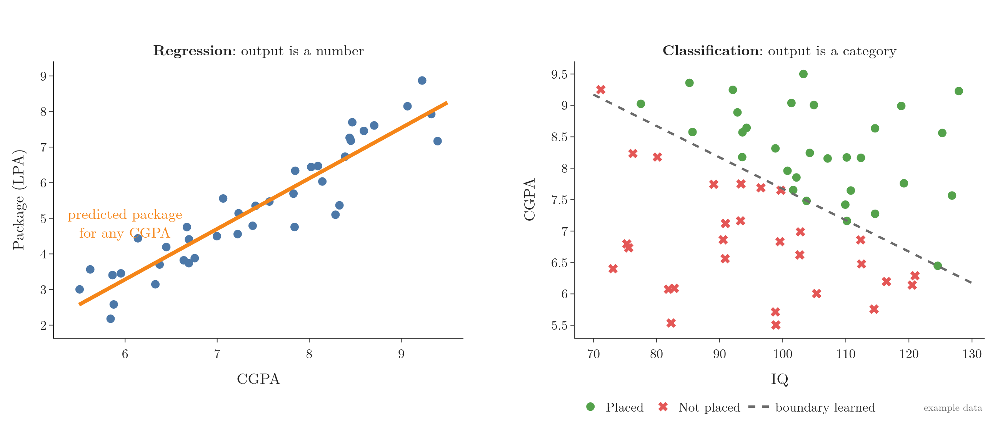

In Figure 3, regression fits a line that gives a number for any input. Classification learns a **decision boundary** (G-555): the line or curve that separates the inputs assigned to one category from those assigned to another.

| Problem | Output | Type |
|---|---|---|
| Price of a house | A number | Regression |
| Is this email spam? | Yes / No | Classification |
| Will it rain today? | Yes / No | Classification |
| Is there a dog in this image? | Yes / No | Classification |
| How many dogs are in this image? | A number | Regression |

The last two rows have the same input, an image. Only the target decides the type.

## 3. Unsupervised learning

> **Key point:** In unsupervised learning, the data has features only. There is no target to predict, so the algorithm finds structure instead: groups, fewer features, oddities or links.

### 3.1 Learning from inputs only

> **Key point:** No target means no prediction. The algorithm describes the data instead.

In **unsupervised learning** (G-2058), the data has only features. For example, we have the IQ and CGPA of students, but no placement target. Figure 4 shows the same table as Figure 2 with the target column removed.

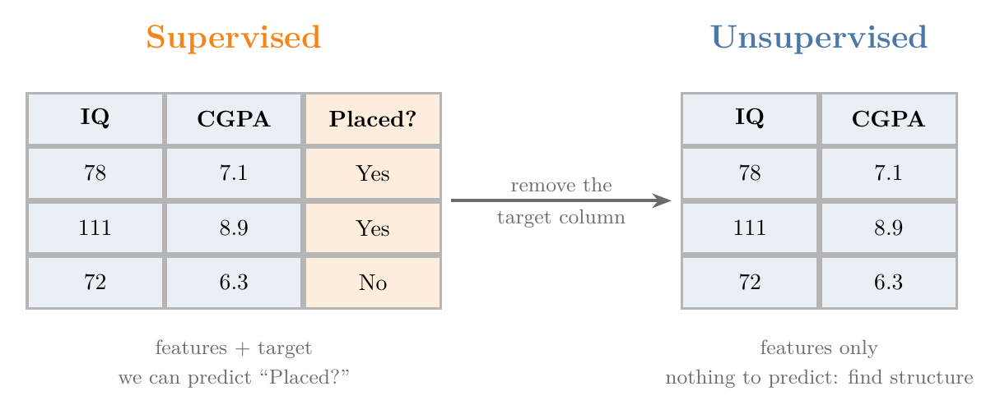

Figure 5 shows the same change on a scatter plot (a graph where each dot is one student, placed by its IQ on one axis and its CGPA on the other) of 90 example students.

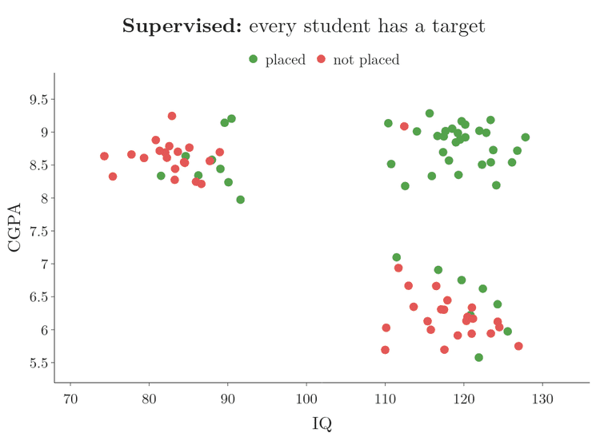

1. **Supervised.** Every dot has a colour: placed or not placed. The colour is the target, so an algorithm can learn to predict it.
2. **Target removed.** Every dot is grey. Only IQ and CGPA are left, and there is nothing to predict.
3. **Unsupervised.** A clustering algorithm (Section 3.2) looks only at IQ and CGPA and colours the three groups it finds. The groups are not "placed" and "not placed": the algorithm never saw that column.

Without a target, we cannot predict anything. Unsupervised learning performs four other jobs:

- clustering (Section 3.2);
- dimensionality reduction (Section 3.3);
- anomaly detection (Section 3.4);
- association rule learning (Section 3.5).

### 3.2 Clustering

> **Key point:** Clustering finds groups of similar observations, without being told what the groups are.

**Clustering** (G-401) splits the data into groups (**clusters**, G-399) of similar observations. Figure 6 shows students plotted by IQ and CGPA; the algorithm found three groups on its own.

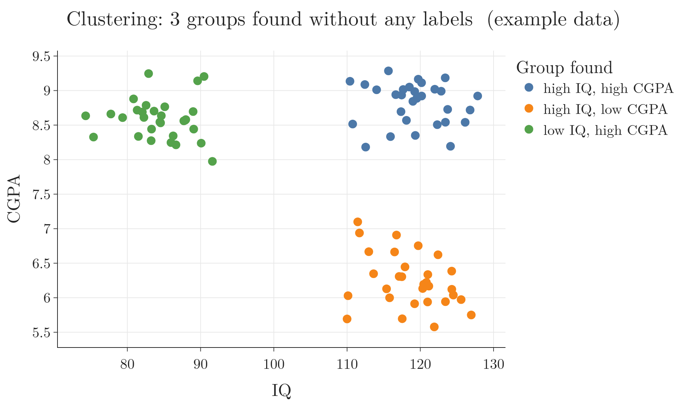

What the groups give us:

- **A category for each student:** for example, high IQ but low CGPA. A new student can be placed in one of the groups.
- **Labels for free:** we can number the groups (0, 1, 2) and then use them as a target for supervised learning.
- **Customer segments:** an e-commerce site can group its customers by how they behave and treat each group differently.

With two features we could spot the groups by eye. Clustering also works with hundreds of features, where no human can see the groups.

**Hierarchical clustering** (G-893; see [hierarchical clustering](../../09-clustering-and-more/ML-125-hierarchical-clustering/ML-125-hierarchical-clustering.md#4-two-kinds-of-hierarchical-clustering)) goes one step further and finds groups within groups, for example sub-segments inside each customer segment.

### 3.3 Dimensionality reduction

> **Key point:** Dimensionality reduction cuts down the number of features while keeping the information. Fewer features speed up learning and let us plot high-dimensional data.

Each feature is a **dimension** (G-610). (A tensor's dimensions mean something else, its number of axes: see [rank, axes, shape and size](../ML-010-tensors/ML-010-tensors.md#4-rank-axes-shape-and-size).) Images and text can have thousands of features, which causes two problems:

1. Algorithms become **slow**.
2. After a point, extra features **stop improving** the results, because the same number of observations gets spread more and more thinly over the extra dimensions (the curse of dimensionality, see [why more dimensions cause trouble](../../05-dimensionality/ML-045-curse-of-dimensionality/ML-045-curse-of-dimensionality.md#4-why-more-dimensions-cause-trouble)).

**Dimensionality reduction** (G-611) removes the extra features.

*Example: house prices.* Number of rooms and number of washrooms carry related information. We can combine them into one feature, area (Figure 7).

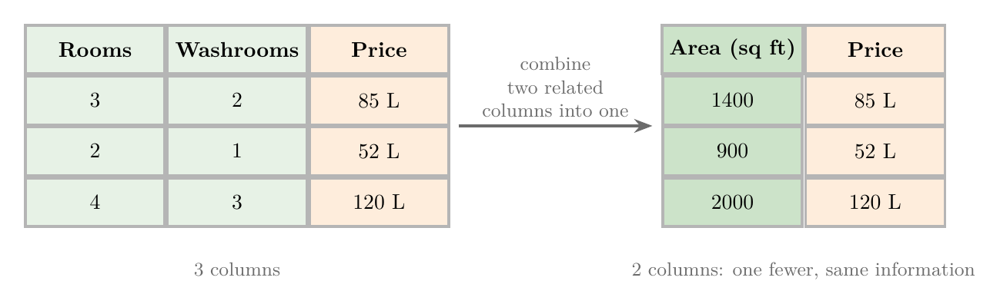

The data has one feature fewer and loses almost no information. Making such a feature by hand, from domain knowledge, is called **feature construction** (G-760; see [feature construction](../../03-feature-engineering/ML-022-what-is-feature-engineering/ML-022-what-is-feature-engineering.md#7-feature-construction)).

When an algorithm such as PCA computes the new features from the data instead, with no domain knowledge, the process is called **feature extraction** (G-762; see [feature extraction](../../03-feature-engineering/ML-022-what-is-feature-engineering/ML-022-what-is-feature-engineering.md#9-feature-extraction)).

**Visualisation.** A graph can show at most 3 dimensions. To see data with hundreds of features, we reduce them to 2 or 3 features and plot those.

*Example: handwritten digits.* Each digit is an 8 x 8 grid of pixels, which makes 64 features, one per pixel. Figure 8 reduces them to 3 features: images of the same digit land close together.

The technique used for Figure 8 is **PCA** (principal component analysis, G-1469), taught in [what PCA is](../../05-dimensionality/ML-046-pca-geometric-intuition/ML-046-pca-geometric-intuition.md#1-what-pca-is). The Notebook for this Note (`ML-003-types-of-ml.ipynb`) shows Figure 8 as a 3D plot that we can rotate.

> **Extra:** The best-known digits dataset, MNIST, uses 28 x 28 pixel images, which gives 784 features (LeCun et al. 1998). The idea is the same.

### 3.4 Anomaly detection

> **Key point:** Anomaly detection learns what normal data looks like and flags anything far from it.

**Anomaly detection** (G-201) finds observations that do not fit the pattern of the rest. Typical uses:

- spotting defects in manufacturing,
- catching credit card fraud,
- flagging unusual loan applications.

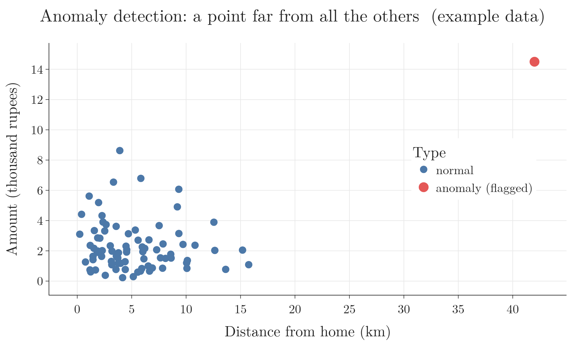

In Figure 9, almost all transactions are small and close to home. The red one, large and 42 km away, is far from every normal point, so the system flags it. In numbers (the figure's example data): the biggest of the 80 normal transactions is 8.6 thousand rupees and 15.7 km from home, while the red one is 14.5 thousand rupees and 42 km from home. The red one is beyond every normal point on both counts, and 42 km is far outside the 15.7 km that every normal point stays within.

### 3.5 Association rule learning

> **Key point:** Association rule learning finds items that tend to occur together.

**Association rule learning** (G-218) looks for "if this, then that" patterns in data. Its classic use is deciding which products a shop places next to each other.

*Example: a supermarket.* We scan all the bills from the last one or two years (Figure 10). Suppose milk appears in 8 of 100 bills, and eggs appear in 6 of those 8:

| Count | Bills |
|---|---|
| All bills | 100 |
| Bills with milk | 8 |
| Bills with milk and eggs | 6 |

$$\frac{\text{bills with milk and eggs}}{\text{bills with milk}}$$

$$= \frac{6}{8} = 0.75$$

So 75 percent of the people who buy milk also buy eggs. They usually buy both, so the shop places the two together.

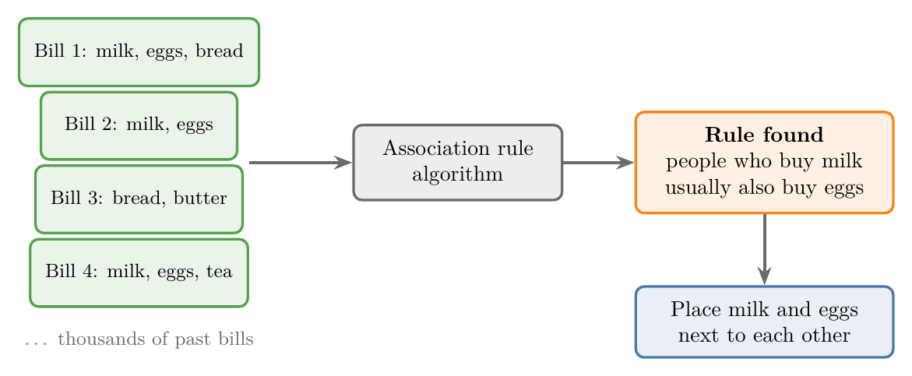

A famous case: an analysis of shopping baskets at a US store chain found that customers buying baby diapers in the evening often also bought beer (Power 2002). Hidden patterns like this are hard to spot by hand and easy for an algorithm.

## 4. Semi-supervised learning

> **Key point:** Semi-supervised learning labels a few observations by hand and lets the algorithm label the rest.

Labels are **expensive**. Collecting inputs is easy; for example, we can download thousands of images in minutes. But someone has to look at each image and write down what is in it, which costs time and money.

**Semi-supervised learning** (G-1768) works with data where only a small part is labelled. We label a few observations, and the algorithm labels the rest automatically.

*Example: Google Photos* (Figure 11).

1. The app groups photos by the faces in them, without knowing any names. This step is unsupervised.
2. We tag one photo with a name, such as "Dad".
3. The name spreads to every photo in that group.

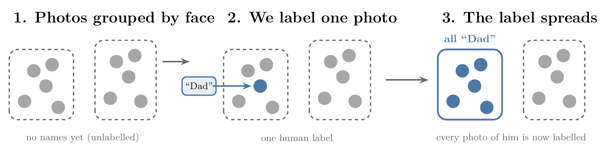

One human label replaced hundreds.

How does one label reach a whole group? Similar observations sit close together, so a label can hop from each observation to its **nearest neighbours** (G-1306), the observations closest to it. Figure 12 shows the hops on the 90 students of Figure 6.

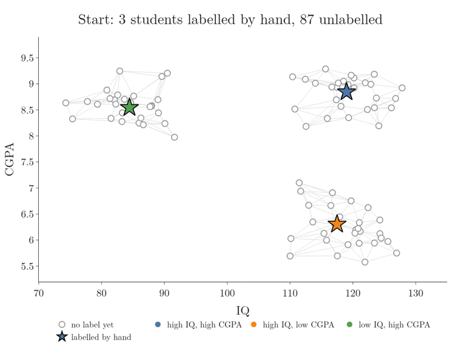

1. **Start.** We label one student in each group by hand (the stars). The other 87 have no label.
2. **Each step.** Every student looks at its linked neighbours, adds up the labels they carry, and takes the strongest one. The three hand labels never change.
3. **The spread.** After step 1, 24 of the 90 students have a label; after step 2, 68; after step 3, 89; after step 4, all 90.
4. **The result.** Every student ends up with the label of its own group, although only three were labelled by hand.

This method is called **label propagation** (G-2172) (Zhu and Ghahramani 2002). It works only when observations with the same label sit close together, as the three groups do here.

## 5. Reinforcement learning

> **Key point:** In reinforcement learning, there is no ready-made dataset. An agent collects its own experience by acting, gets rewards or punishments, and improves its rules.

### 5.1 Agent, environment, policy and reward

> **Key point:** The agent acts, the environment rewards or punishes, and the agent updates its policy. Repeat.

**Reinforcement learning (RL)** (G-1660) starts with no ready-made dataset: nobody hands the algorithm a table of examples with correct answers. The algorithm produces its own data by acting. Each action, and the reward or punishment that follows it, is one piece of experience, and the algorithm learns from this experience, getting better over time (Sutton and Barto 2018, §1.1).

The parts of an RL system:

- **Agent** (G-179): the learner, for example a self-driving car or a game-playing program.
- **Environment** (G-694): the world the agent acts in, for example the road or the game board.
- **Policy** (G-1512): the agent's rule book, saying which action to take in each situation.
- **Reward / punishment** (G-1690): feedback from the environment after each action, good or bad.

Figure 13 shows the loop:

1. The agent observes the environment.
2. Following its policy, the agent takes an action.
3. The environment returns a reward or punishment.
4. The agent updates its policy.

The goal is to collect as much reward and as little punishment as possible.

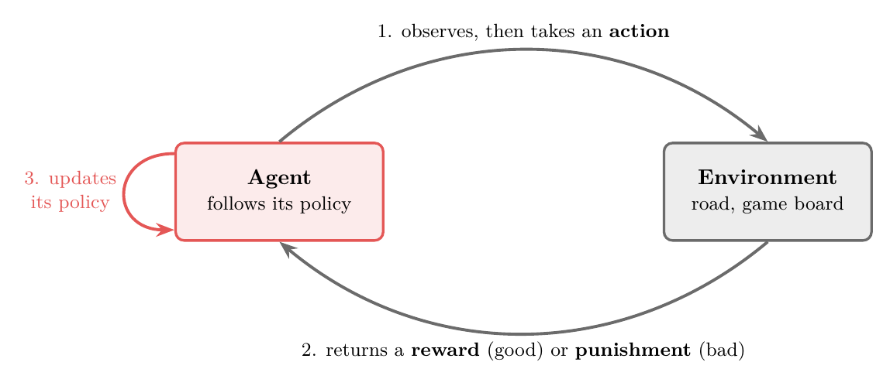

### 5.2 Example: fire or water

> **Key point:** A bad result changes the policy, so the next choice is better.

Figure 14 shows an agent that can walk to fire or to water.

1. The agent's policy says *go to the fire*. The agent goes, and gets a punishment.
2. The agent updates its policy to *go to the water*.
3. The agent goes to the water and gets a reward.

In numbers, give a punishment the value −10 and a reward the value +10, as in Figure 14 (a choice made for this illustration). The agent's total reward after each trip:

| Trip | Place | Reward | Total so far |
|---|---|---|---|
| 1 | fire | −10 | −10 |
| 2 | water | +10 | 0 |
| 3 | water | +10 | +10 |

The policy change after trip 1 is why the total climbs: the agent aims for the highest total.

People learn many things the same way: nobody hands us a dataset for living in a new city; we try, make mistakes and adjust. Training a pet with treats works the same way.

### 5.3 Where RL is used

> **Key point:** RL beat the world champion at Go and is used for self-driving cars, but it is harder to build than the other types.

- **Self-driving cars:** the car learns to drive by acting on the road and receiving feedback.
- **Games:** Go is far more complex than chess, and beating top humans was thought to be years away. In March 2016, DeepMind's agent **AlphaGo** beat world champion Lee Sedol in four out of five games (DeepMind 2016).

RL is harder to set up than the other types, but its use is growing fast.

## 6. Summary

| Type | Data | Goal | Example | Why it matters |
|---|---|---|---|---|
| Supervised: regression | Inputs + numerical output | Predict a number | Salary package from IQ and CGPA | the fitted line gives a number for any input |
| Supervised: classification | Inputs + categorical output | Predict a category | Placed or not | the decision boundary sorts any new input into a category |
| Unsupervised: clustering | Inputs only | Find groups | Customer segments | finds groups no human can see in hundreds of features, and gives labels for free |
| Unsupervised: dimensionality reduction | Inputs only | Fewer features | Rooms + washrooms $\rightarrow$ area | fewer features speed up learning and let us plot the data |
| Unsupervised: anomaly detection | Inputs only | Flag unusual observations | Card fraud | a point far from every normal point gets flagged |
| Unsupervised: association rules | Inputs only | Find items that go together | Milk and eggs | hidden "if this, then that" patterns decide what goes side by side |
| Semi-supervised | A few labels, many unlabelled observations | Label the rest | Google Photos faces | labels are expensive; one human label replaced hundreds |
| Reinforcement | No ready-made data; experience and rewards collected from an environment | Learn the best actions | AlphaGo | it learns where nobody can hand over a table of correct answers |

- To identify a supervised problem, look at the **target**: number $\rightarrow$ regression, category $\rightarrow$ classification. The input does not decide it: the same image can feed either type.
- No target $\rightarrow$ unsupervised, because without a target there is nothing to predict, so the algorithm finds structure instead.
- Few labels $\rightarrow$ semi-supervised, because similar observations sit close together, so a few hand labels can spread to the rest.
- No ready-made data, only feedback on the agent's own actions $\rightarrow$ reinforcement, because the agent collects its own experience by acting.

## 7. Sources

**Built from**

- CampusX, "Types of Machine Learning for Beginners | Types of Machine learning in Hindi | Types of ML in Depth", YouTube, https://www.youtube.com/watch?v=81ymPYEtFOw

**Other references**

- DeepMind (2016). *AlphaGo*. deepmind.google, research/breakthroughs/alphago.
- LeCun, Y., Bottou, L., Bengio, Y. and Haffner, P. (1998). Gradient-Based Learning Applied to Document Recognition. *Proceedings of the IEEE* 86(11).
- Power, D. (2002). What is the "true story" about data mining, beer and diapers? *DSS News*, 10 November 2002.
- Sutton, R. S. and Barto, A. G. (2018). *Reinforcement Learning: An Introduction*, 2nd ed. MIT Press. §1.1.
- Zhu, X. and Ghahramani, Z. (2002). Learning from Labeled and Unlabeled Data with Label Propagation. Technical Report CMU-CALD-02-107, Carnegie Mellon University.

## 8. Key terms

| Term | Meaning |
|---|---|
| Supervision | Correct answers that guide an algorithm while it learns |
| Supervised learning | Learning from data with inputs and outputs, to predict outputs |
| Feature | An input variable; one column of the data table |
| Target | The output we want to predict; also called the label |
| Observation | One record; one row of the data table |
| Labelled data | Data that includes the target |
| Numerical data | Data made of numbers |
| Categorical data (G-351) | Data made of categories |
| Regression | Supervised learning with a numerical output |
| Classification | Predicting which of a fixed set of categories (classes) a row belongs to, learned from examples whose answers are known (supervised learning with a categorical output). |
| Unsupervised learning | Learning from inputs only, to find structure |
| Clustering | Splitting data into groups of similar observations |
| Cluster | One group found by clustering |
| Dimension | One feature |
| Dimensionality reduction | Reducing the number of features while keeping the information |
| Feature extraction | New features computed from existing ones by an algorithm such as PCA |
| PCA (G-1469) | Principal component analysis, a dimensionality reduction technique |
| Anomaly detection | Finding observations that do not fit the pattern of the rest |
| Association rule learning | Finding items that tend to occur together |
| Semi-supervised learning | Learning from a few labelled observations and many unlabelled ones |
| Label propagation (G-2172) | Semi-supervised method in which labels hop from labelled observations to their nearest neighbours, step by step |
| Reinforcement learning | Learning by acting and receiving rewards or punishments |
| Agent | The learner in reinforcement learning, such as a self-driving car or a game-playing program: it acts in an environment, gets rewards or punishments, and improves its rules for acting. |
| Environment | In reinforcement learning, the world the agent acts in, such as the road or a game board; it rewards or punishes each action, and the agent learns from that. |
| Policy | The agent's rules for which action to take |
| Reward / punishment | Good / bad feedback after an action |
