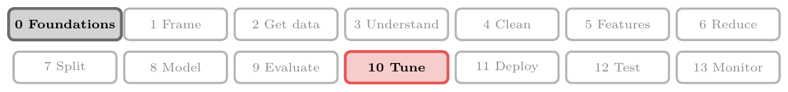
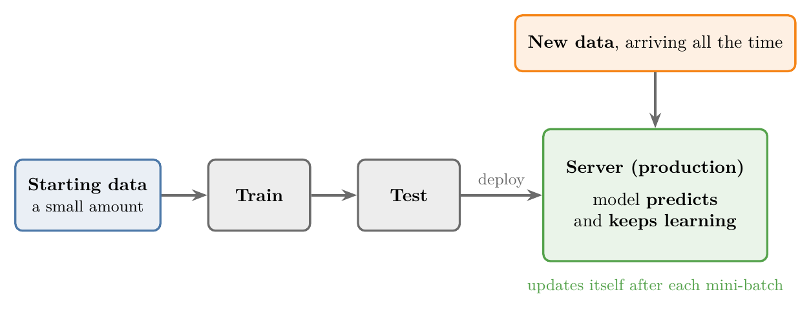
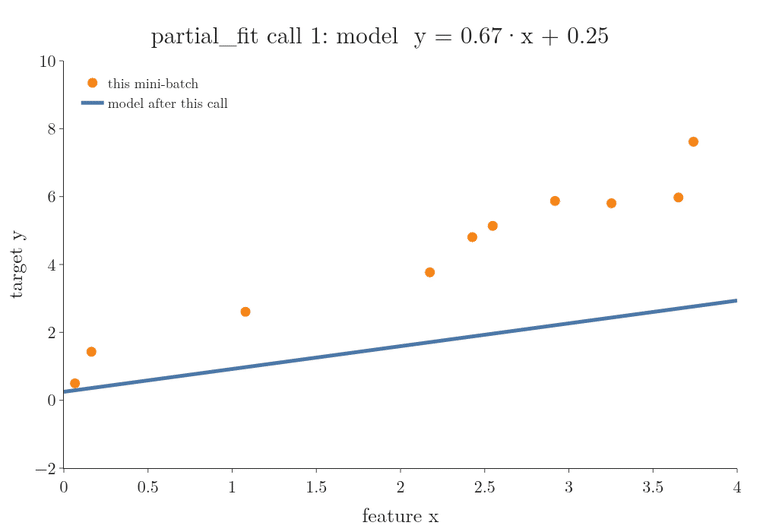
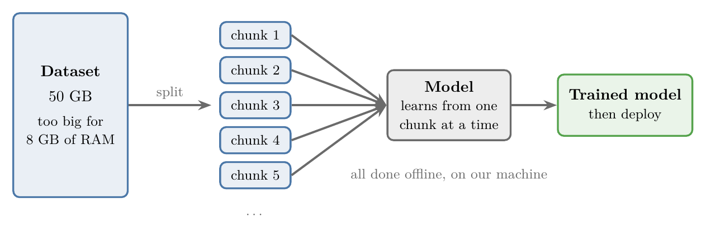
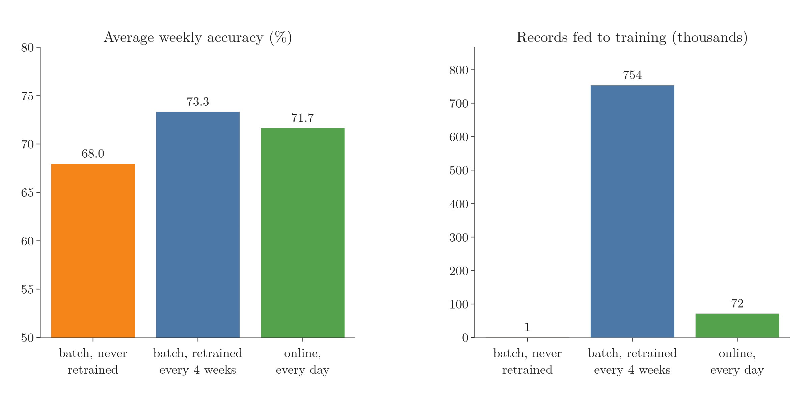

<!-- where-this-fits: generated by course_map/build_map.py; edit concepts.yaml, not this block -->
> **Where this fits:** Pipeline map steps 0 (Foundations), 10 (Tune). See the [Course map](../../../00-course-map/00-course-map.md).
>
> 
>
> - **Used here, taught in full later:** [Model drift](../../../ML/01-foundations/ML-009-mldlc/ML-009-mldlc.md#112-model-drift-and-retraining); [Stochastic gradient descent](../../../ML/06-regression/ML-058-stochastic-gradient-descent/ML-058-stochastic-gradient-descent.md#3-how-stochastic-gradient-descent-works); [Mini-batch gradient descent](../../../ML/06-regression/ML-059-mini-batch-gradient-descent/ML-059-mini-batch-gradient-descent.md#3-how-it-works).
> - **Leads to:** [Framing an ML problem](../../../ML/01-foundations/ML-013-framing-ml-problem/ML-013-framing-ml-problem.md#2-why-framing-matters); [Gradient descent](../../../ML/06-regression/ML-056-gradient-descent/ML-056-gradient-descent.md#2-the-idea); [Gradient boosting](../../../ML/08-trees-and-ensembles/ML-116-gradient-boosting-classification/ML-116-gradient-boosting-classification.md#1-overview); [AdaGrad](../../../DL/03-optimizers/DL-036-adagrad/DL-036-adagrad.md#5-the-idea-shrink-the-learning-rate-where-the-gradients-are-large).
> - **Compare with:** [Batch (offline) learning](../../../ML/01-foundations/ML-004-batch-learning/ML-004-batch-learning.md#3-batch-learning).
<!-- /where-this-fits -->

## 1. Overview

> **Key point:** In online learning, the model keeps learning after deployment. New data arrives in small mini-batches, and the model updates itself on the server after each one.


When a company says "the more you use our product, the better it gets", it is usually describing online learning. The model is not frozen after deployment: it trains on new data while it is live.

## 2. What online learning is

> **Key point:** Training is incremental: small mini-batches arrive one after another, and the model improves after each.

### 2.1 Learning in small steps

> **Key point:** Many small updates instead of one big training run.

**Online learning** (G-1391) trains a model **incrementally** (**incremental learning**, G-931). Instead of using the whole dataset at once (as in **batch learning**, G-265; [train once on all the data](../ML-004-batch-learning/ML-004-batch-learning.md#31-how-batch-learning-works)), we feed the model data **sequentially** (G-1774: one piece after another, in order), in small groups called **mini-batches** (G-263; [a group of observations used for one update](../../06-regression/ML-059-mini-batch-gradient-descent/ML-059-mini-batch-gradient-descent.md#2-a-family-that-contains-the-other-two)), one after another. After each mini-batch, the model improves a little.

Each mini-batch is small, so each training step is fast and cheap. Small, cheap steps make it possible to train the model on the production server itself, while it is online. Hence the name.


Figure 1 compares the two:

- **Batch:** all the data goes in once, and the model is then frozen. New data waits for the next retrain.
- **Online:** mini-batches stream in one by one, and the model updates after every one.

### 2.2 The online learning workflow

> **Key point:** Train on a little data, deploy, then predict and learn at the same time.



Figure 2 shows the steps:

1. Start with a small amount of data and train the model on it.
2. Test it, then deploy it to the server.
3. New data keeps arriving. The model makes predictions on it and learns from it at the same time.

As new data arrives, the model's performance keeps improving to match it.

### 2.3 Examples

> **Key point:** Chatbots, smart keyboards and video feeds adapt to us as we use them.

- **Chatbots and voice assistants** such as Google Assistant, Alexa and Siri keep learning from new conversations after deployment.
- **Smart keyboards** such as SwiftKey get better at predicting our words the more we type.
- **YouTube:** after we watch a video and go back to the feed, the feed has already changed to show related videos. The clicks we just made became new training data.


Figure 3 shows the pattern the three share: using the product produces new data, and the deployed model learns from that data at once.

Many companies still use batch learning, but the industry is moving towards online learning.

## 3. When to use online learning

> **Key point:** Use online learning when the problem keeps changing, when the data is huge, or when results are needed fast.

1. **The problem changes over time.** Some problems keep shifting: stock prices, or an e-commerce site where trends and customer behaviour change constantly. This drifting of the problem is **concept drift** (see [models go stale](../ML-004-batch-learning/ML-004-batch-learning.md#41-models-go-stale)). Here the model must keep adapting, which is exactly what online learning does.
2. **Cost.** Retraining a batch model on a very large dataset is expensive. Online learning works with small mini-batches, so each step costs little.
3. **Speed.** Each training step is tiny, so the model reflects new data almost immediately.

Figure 4 tests the first reason on a problem that keeps changing: the Electricity market data of [keeping a batch model up to date](../ML-004-batch-learning/ML-004-batch-learning.md#4-keeping-a-batch-model-up-to-date) (Harries 1999), where each half hour we predict whether the price goes up or down.


1. **The same start.** Both models learn from the first 4 weeks of data.
2. **Batch.** The orange model is then frozen, as in [batch learning](../ML-004-batch-learning/ML-004-batch-learning.md#3-batch-learning).
3. **Online.** The green model keeps going. Each day it first predicts that day's 48 half hours, and then learns from their true answers with one small update.
4. **The result.** Over 130 weeks, the online model is right 71.7 percent of the time and the frozen batch model 68.0 percent. Where the market changes, for example around week 25 and after week 120, the frozen model falls behind while the online model recovers.

For problems that do not change, batch learning is still simpler and works well.

## 4. Implementing online learning

> **Key point:** Use a model with `partial_fit` in scikit-learn, or a dedicated library such as River (G-1694) or Vowpal Wabbit (G-2098).

### 4.1 scikit-learn's `partial_fit`

> **Key point:** `fit` starts from scratch on all the data; `partial_fit` continues from where the model left off.

Most scikit-learn models are trained with `fit`, which uses all the data at once. Some models also have **`partial_fit`** (G-1458), which trains on the data given and keeps what the model already learned. Calling it again with new data continues the training. scikit-learn is designed around batch learning, so only some of its models offer `partial_fit`.

One such model is **`SGDRegressor`** (G-1783). `SGDRegressor` does the same job as **linear regression** (G-1094; fitting a straight line to the data, taught in [a line through the data](../../06-regression/ML-049-simple-linear-regression/ML-049-simple-linear-regression.md#3-a-line-through-the-data)), but learns step by step, which is what makes `partial_fit` possible.

> **Python:** Training one observation at a time.
>
> ```python
> import numpy as np
> from sklearn.linear_model import SGDRegressor
>
> model = SGDRegressor()
>
> # first row: 3 inputs, output 10
> model.partial_fit(np.array([[1.0, 2.0, 3.0]]), np.array([10.0]))
>
> # a new row arrives: training continues
> model.partial_fit(np.array([[2.0, 1.0, 0.5]]), np.array([6.0]))
> ```
>
> `np.array([[...]])` is a table with one row: one **observation** (G-1374; one record), with three **features** (G-772; input variables). `np.array([...])` holds its **target** (G-1949), the output value we want to predict. Each `partial_fit` call takes a fraction of a second, so the model can keep learning as each new observation arrives.

Before the figure, the two words it needs. Each observation has one feature $x$ (the input) and one target $y$ (the output). The model is a straight line, and a line has two numbers (see [a line through the data](../../06-regression/ML-049-simple-linear-regression/ML-049-simple-linear-regression.md#32-if-the-data-were-perfectly-linear)). The **slope** is how much $y$ rises when $x$ grows by 1; the **intercept** is the value of $y$ at $x = 0$. For the line $y = 0.67x + 0.25$ the slope is 0.67, the intercept is 0.25, and at $x = 3$ the line answers

$$0.67 \times 3 + 0.25 = 2.26$$

The true pattern in the data, $y = 2x$, has slope 2 and intercept 0, so at $x = 3$ the right answer is 6. A line with slope 0.67 is "far too flat".

What does each call change? Figure 5 runs `partial_fit` on a stream of mini-batches of 10 observations, from data whose true pattern is $y = 2x$ plus noise (the Notebook's data).



1. **Call 1.** The model has seen 10 observations. Its line is $y = 0.67x + 0.25$, far too flat.
2. **Calls 2 to 10.** Each call nudges the slope towards the data: 0.94, 1.18, and 1.66 after 10 calls.
3. **Call 50.** After 500 observations the line is $y = 1.81x + 0.51$, close to the true $y = 2x$.

The model never goes back to old observations. Each call moves the **parameters** (G-1450), the slope and the intercept, a little, starting from where the last call left them.

### 4.2 Dedicated libraries

> **Key point:** River and Vowpal Wabbit are built specifically for online learning.

- **River:** a Python library for online machine learning on streaming data. River was formed by merging two earlier libraries, creme and scikit-multiflow (Montiel et al. 2021).
- **Vowpal Wabbit:** a fast library for online and interactive learning, including reinforcement learning (Vowpal Wabbit docs).

## 5. The learning rate

> **Key point:** The learning rate controls how fast the model adapts. Too high and it forgets the past; too low and it is slow to learn anything new.

The **learning rate** (G-1068) sets how strongly each new mini-batch changes the model: how fast the model adapts to changing data (Géron 2019, Ch. 1).

Think of two news readers. A reader who believes every new headline changes their mind daily and forgets what they knew. A reader who ignores all headlines never learns anything new.

- **Too high:** the model changes very quickly and forgets what it learned before. It chases every bit of **noise** (G-1326): the random variation in the data that carries no pattern.
- **Too low:** the model barely changes. It remembers the past well but is slow to learn anything new.

We want a balance: the model should learn new patterns while still remembering the old ones.


Figure 6 draws three models as the data arrives, one point at a time. Each model follows one rule: move a fraction of the way from the current estimate towards the newest data point. That fraction is the learning rate.

Take one step by hand. The model's current estimate is 20, and the newest data point is 60 (the true value has just jumped). The gap is

$$60 - 20 = 40$$

Each model moves its learning rate times this gap. As a rule, with the rate called $r$:

$$\text{change} = r \times (\text{newest point} - \text{old estimate})$$

$$\text{new estimate} = \text{old estimate} + \text{change}$$

| Learning rate $r$ | Move $r \times 40$ | New estimate |
|---|---|---|
| 0.01 | 0.4 | 20.4 |
| 0.1 | 4 | 24 |
| 0.7 | 28 | 48 |

The true value jumps from 20 to 60 at step 120. In Figure 6 the three rates behave as the table suggests:

- with a rate of 0.01, the model takes a very long time to catch up;
- with 0.7, the model reacts to every noisy point;
- with 0.1, the model follows the change quickly and stays steady.

The learning rate is one of the most important settings in online learning. If the rate is wrong, the model either forgets too fast or adapts too slowly.

## 6. Out-of-core learning

> **Key point:** When data is too big to fit in memory, we split it into chunks and train on them one at a time.

Sometimes a dataset is too large to load at once. For example, a 50 GB dataset cannot be loaded on a machine with 8 GB of RAM, so it cannot be trained with batch learning.

**Out-of-core learning** (G-1413) solves this with the online-learning technique (scikit-learn User Guide, Strategies to scale computationally):



1. Split the dataset into small chunks (Figure 7).
2. Feed the chunks to the model one at a time, training incrementally.
3. Deploy the trained model.

All of this happens offline, on our own machine. So out-of-core learning is not online learning, even though it uses the same incremental technique.

## 7. Risks of online learning

> **Key point:** Online learning is hard to run reliably, and bad incoming data can damage the model. Monitor it and be ready to roll back.

### 7.1 Hard to run reliably

> **Key point:** Training a model is easy; keeping it learning correctly on a live server is not.

Running online learning in production means doing three things at once:

- handling a constant stream of data;
- choosing the right learning rate;
- keeping everything working.

The job is hardest when data arrives in real time.

The tools are also young. Most are open-source libraries built by small groups, without the enterprise-grade reliability of established batch tools.

### 7.2 Bad data can damage the model

> **Key point:** The model learns from whatever arrives, including bad data.

An online model changes according to the data it receives. If that data goes wrong, for example because the server is hacked and fake requests flood in, the model learns from it and becomes a **biased model** (G-290: pushed towards wrong answers).

The defences (Figure 8):


- **Monitoring:** watch the system constantly. An **anomaly detection** (G-201; [finding rows that do not fit the pattern of the rest](../ML-003-types-of-ml/ML-003-types-of-ml.md#34-anomaly-detection)) algorithm can flag unusual incoming data.
- **Reject or go offline:** when data looks suspicious, refuse it or take the model offline.
- **Roll back** (**rollback**, G-1703): if damage is already done, restore the model to its last good version.

## 8. Batch vs online learning

> **Key point:** Batch is simpler and proven; online adapts continuously but is harder to run.

| | Batch (offline) learning | Online learning |
|---|---|---|
| Complexity | Low: train on our machine, deploy, predict | Higher: the model keeps changing and must be monitored |
| Computing power | Large training runs, occasionally | Small updates, continuously |
| Use in production | Easier to implement | Harder to implement |
| Best for | Problems that do not change (e.g. classifying dog breeds: a dog is still a dog in 10 years) | Problems that keep changing (e.g. weather, stock prices, trends) |
| Tools | Mature, industry-proven | Newer, still an active research area |

Figure 9 puts numbers on the trade-off with the three models of Figure 4 and [retraining on a schedule](../ML-004-batch-learning/ML-004-batch-learning.md#42-retraining-on-a-schedule).



- **Batch, never retrained:** the cheapest (1,344 records, once), and the least accurate, 68.0 percent.
- **Batch, retrained every 4 weeks:** the most accurate, 73.3 percent, but every retrain starts from scratch on all the data so far: 754 thousand records in total.
- **Online:** 71.7 percent for 72 thousand records, about a tenth of the retrained batch model's work: 21 passes over the first 4 weeks at the start, then each later record used once, as it arrives.

Building a model with high accuracy is only part of the job. In industry, we also have to think about what happens after deployment: how much the server costs, and how the model reacts when the data changes.

The Notebook for this Note (`ML-005-online-learning.ipynb`) trains a model one row at a time with `partial_fit`, then compares a batch model and an online model when the data suddenly changes.

## 9. Summary

| | Online learning |
|---|---|
| Training data | Small mini-batches, arriving one after another |
| Where training happens | On the production server, while the model is live |
| After deployment | The model keeps learning from new data |
| Key setting | The learning rate |
| Strong at | Changing problems, huge data, fast updates |
| Weak spots | Hard to run, young tools, vulnerable to bad data |
| Examples | Chatbots, smart keyboards, video feeds |

- Online learning = incremental training on mini-batches, while the model is live. Each step is small and cheap, so the model can train on the server and keep up with a changing problem (Electricity data: 71.7 percent against 68.0 for a frozen batch model).
- In scikit-learn, models with `partial_fit` can learn this way, because `partial_fit` continues from where the model left off instead of starting from scratch.
- The learning rate balances learning new patterns against remembering old ones, so a wrong rate makes the model either chase noise or adapt too slowly.
- Out-of-core learning uses the same technique offline, for data too big for memory, so a 50 GB dataset can be trained on a machine with 8 GB of RAM.
- Protect an online model with monitoring, anomaly detection and rollback, because it learns from whatever arrives, bad data included.

## 10. Sources

**Built from**

- CampusX, "Online Machine Learning | Online Learning | Online Vs Offline Machine Learning", YouTube, https://www.youtube.com/watch?v=3oOipgCbLIk

**Other references**

- Géron, A. (2019). *Hands-On Machine Learning with Scikit-Learn, Keras, and TensorFlow*, 2nd ed. O'Reilly. Ch. 1, Online learning.
- Harries, M. (1999). *Splice-2 Comparative Evaluation: Electricity Pricing*. Technical report, University of New South Wales. The data as OpenML dataset 151, "electricity", https://www.openml.org/d/151
- Montiel, J. et al. (2021). River: Machine Learning for Streaming Data in Python. *Journal of Machine Learning Research* 22(110).
- scikit-learn developers. *User Guide*, Strategies to scale computationally: bigger data. scikit-learn.org.
- Vowpal Wabbit project. *Vowpal Wabbit documentation*. vowpalwabbit.org.

## 11. Key terms

Terms taught in this Note come first; linked terms are recaps, taught in the Note the link opens.

| Term | Meaning |
|---|---|
| Online learning (G-1391) | Training incrementally on mini-batches while the model is live in production. |
| River (G-1694) | A Python library for online machine learning. |
| Vowpal Wabbit (G-2098) | A fast learning library that can learn from data a piece at a time as it arrives (online learning). |
| partial_fit (G-1458) | A scikit-learn method that continues training from where the model left off. |
| SGDRegressor (G-1783) | A scikit-learn model that does linear regression with stochastic gradient descent, step by step, so it can also learn from data arriving in small pieces. |
| Learning rate ($\eta$) (G-1068) | How strongly each update changes the model; in gradient descent, the number the slope is multiplied by to get the step size. |
| Out-of-core learning (out-of-core computing) (G-1413) | Training on data too big for the memory (RAM) by loading it chunk by chunk, offline. |
| Biased model (G-290) | A model pushed towards wrong answers, e.g. by bad data. |
| Rollback (G-1703) | Restoring a model to an earlier, good version. |
| [Incremental learning (incremental training)](../../../ML/01-foundations/ML-004-batch-learning/ML-004-batch-learning.md#31-how-batch-learning-works) (G-931) | Training on small pieces of data over time, keeping what was learned before (the opposite of batch learning). |
| [Batch learning](../../../ML/01-foundations/ML-004-batch-learning/ML-004-batch-learning.md#31-how-batch-learning-works) (G-265) | Training on the whole dataset at once, offline, then deploying. |
| [Sequential data](../../../DL/05-rnn/DL-055-why-rnn/DL-055-why-rnn.md#1-overview) (G-1774) | Data that comes as an ordered series of pieces whose order matters, such as text or a time series; models read it one piece after another, in order. |
| [Batch (mini-batch)](../../../ML/06-regression/ML-059-mini-batch-gradient-descent/ML-059-mini-batch-gradient-descent.md#1-overview) (G-263) | A small group of training observations used for one update; Keras uses 32 by default. |
| [Linear regression](../../../ML/06-regression/ML-049-simple-linear-regression/ML-049-simple-linear-regression.md#1-overview) (G-1094) | A model that predicts a number from the inputs by fitting the straight line (or, with several inputs, the plane) that runs closest to all the training points. |
| [Observation](../../../ML/01-foundations/ML-003-types-of-ml/ML-003-types-of-ml.md#21-learning-from-inputs-and-outputs) (G-1374) | One record of a dataset: one row of the data table. |
| [Feature](../../../ML/01-foundations/ML-002-ai-vs-ml-vs-dl/ML-002-ai-vs-ml-vs-dl.md#52-features-chosen-by-us-or-learned) (G-772) | One piece of information about each example that a model uses (e.g. a student's CGPA). |
| [Target](../../../ML/01-foundations/ML-003-types-of-ml/ML-003-types-of-ml.md#21-learning-from-inputs-and-outputs) (G-1949) | The output column we predict, such as the class; also called the label. |
| [Parameters (of a model)](../../../ML/01-foundations/ML-006-instance-vs-model-based/ML-006-instance-vs-model-based.md#42-the-training-data-is-no-longer-needed) (G-1450) | The numbers inside a model that training learns from the data, such as a line's slope and intercept; once learned, they turn inputs into predictions. |
| [Noise ($\varepsilon$)](../../../MA/08-likelihood/MA-072-mle-in-machine-learning/MA-072-mle-in-machine-learning.md#31-the-model) (G-1326) | The random part of a target that the model's prediction does not explain. |
| [Anomaly detection](../../../ML/01-foundations/ML-003-types-of-ml/ML-003-types-of-ml.md#34-anomaly-detection) (G-201) | Finding rows that do not fit the pattern of the rest. |
