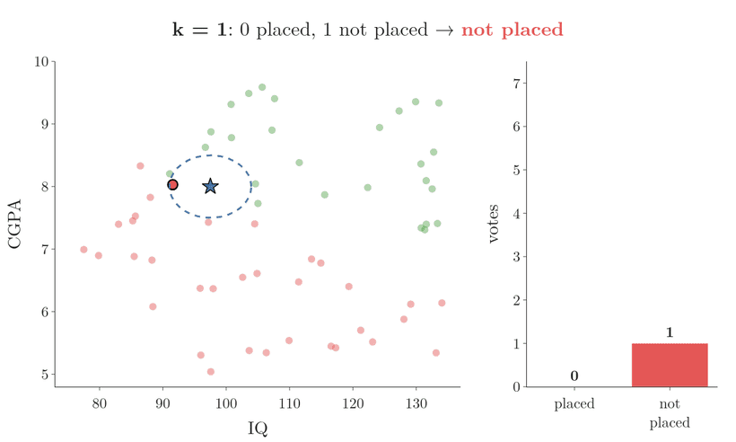
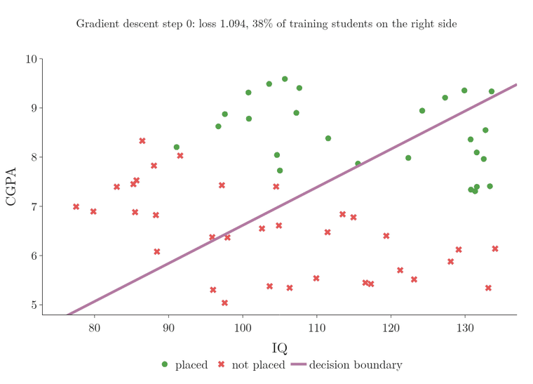
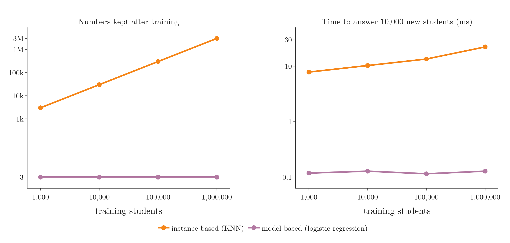

<!-- where-this-fits: generated by course_map/build_map.py; edit concepts.yaml, not this block -->
> **Where this fits:** Pipeline map steps 0 (Foundations), 5 (Engineer features), 8 (Model). See the [Course map](../../../00-course-map/00-course-map.md).
>
> 
>
> - **Builds on:** Classification problems ([Note ML-003](../../../ML/01-foundations/ML-003-types-of-ml/ML-003-types-of-ml.md)); Feature engineering ([Note ML-007](../../../ML/01-foundations/ML-007-challenges-in-ml/ML-007-challenges-in-ml.md)); Hyperparameter tuning ([Note ML-009](../../../ML/01-foundations/ML-009-mldlc/ML-009-mldlc.md)); Feature transformation ([Note ML-022](../../../ML/03-feature-engineering/ML-022-what-is-feature-engineering/ML-022-what-is-feature-engineering.md)); Cross-validation ([Note ML-028](../../../ML/03-feature-engineering/ML-028-pipelines/ML-028-pipelines.md)); Curse of dimensionality ([Note ML-045](../../../ML/05-dimensionality/ML-045-curse-of-dimensionality/ML-045-curse-of-dimensionality.md)).
> - **Leads to:** Standardization ([Note ML-009](../../../ML/01-foundations/ML-009-mldlc/ML-009-mldlc.md)); Logistic regression ([Note ML-012](../../../ML/01-foundations/ML-012-toy-project/ML-012-toy-project.md)); Normalization ([Note ML-024](../../../ML/03-feature-engineering/ML-024-normalization/ML-024-normalization.md)); K-means ([Note ML-031](../../../ML/03-feature-engineering/ML-031-binning-binarization/ML-031-binning-binarization.md)); KNN imputer ([Note ML-038](../../../ML/04-missing-data-and-outliers/ML-038-knn-imputer/ML-038-knn-imputer.md)); PCA ([Note ML-046](../../../ML/05-dimensionality/ML-046-pca-geometric-intuition/ML-046-pca-geometric-intuition.md)).
> - **Compare with:** Bias-variance trade-off ([Note ML-061](../../../ML/06-regression/ML-061-bias-variance/ML-061-bias-variance.md)); Decision trees ([Note ML-091](../../../ML/08-trees-and-ensembles/ML-091-decision-trees-intuition/ML-091-decision-trees-intuition.md)); ANN for classification ([Note DL-011](../../../DL/01-basics/DL-011-customer-churn-ann/DL-011-customer-churn-ann.md)).
<!-- /where-this-fits -->

## 1. Overview

> **Key point:** Some ML algorithms memorise the training data and compare new points to it (instance-based). Others learn a general rule from the data and use only that rule (model-based).

This Note groups ML algorithms in a third way: **by how a model learns**. There are two types:

- **Instance-based learning**,
- **Model-based learning**.

We have not studied any algorithms yet. The aim here is to be able to tell, for every algorithm we meet later, which of the two it is.

## 2. Two ways to learn

> **Key point:** Memorising examples vs understanding the rule behind them: people learn both ways, and so do ML algorithms.

People learn in two broad ways:

- **Memorising:** learning past answers by heart, then comparing each new question with them. Many of us studied some exam subjects this way.
- **Understanding:** learning the underlying principle, then applying it to any new question.

ML algorithms work the same way (Figure 1).

- **Instance-based learning** (G-955) memorises: it keeps the training data and compares new points with it.
- **Model-based learning** (G-1257) understands: it extracts the underlying pattern as a mathematical function and uses that.

Both are explained below with the same example: predicting whether a student will be placed, from their IQ and CGPA. Three words describe this data:

- IQ and CGPA are the **features** (G-772; input variables, one column each in the data table);
- placed or not is the **target** (G-1949; the output we predict);
- each student is one **observation** (G-1374; one record, one row of the table).

## 3. Instance-based learning

> **Key point:** Training = storing the data. Prediction = find the most similar stored points and copy their answer.

### 3.1 How it works

> **Key point:** Nothing is learned until a question arrives. Then the algorithm looks at the stored points nearest to it.

In **instance-based learning**, training does nothing except store the training data. All the work happens when a new point arrives:

Figure 2 shows the steps for a new student with IQ 94.5 and CGPA 8.3:

1. **Store:** keep every training point. Green points were placed, red were not.
2. **Measure:** compute the **distance** (G-623) from the new student to every stored student. Distance measures **similarity** (G-1805): the closer two points are, the more alike the students.
3. **Pick the nearest:** keep the *k* closest points. Here *k* = 3.
4. **Vote:** 2 of the 3 nearest students were placed, so the prediction is *placed*.

Step 2 in numbers, for one stored student: IQ 91.1 and CGPA 8.2, placed. Both features are first put on the same scale (the Extra below explains why): the new student becomes (−0.89, 0.75) and the stored student becomes (−1.10, 0.68). The distance is the straight-line distance between the two points, found in three lines:

$$\text{gap in IQ} = -1.10 - (-0.89) = -0.21 \quad\text{and}\quad \text{gap in CGPA} = 0.68 - 0.75 = -0.07$$

$$(-0.21)^2 + (-0.07)^2 = 0.044 + 0.005 = 0.049$$

$$\text{distance} = \sqrt{0.049} \approx 0.22$$

This student is one of the 3 nearest. Repeating the three lines for every stored student gives the list from which step 3 keeps the 3 smallest distances.

The idea behind step 4: points that are close together tend to share the same answer, just as where a person lives says something about them. A student who looks like placed students will probably be placed too.

This procedure is the **K-nearest neighbours (KNN)** (G-998) algorithm, covered in detail in later Notes.

> **Extra:** IQ ranges over about 60 points, while CGPA ranges over about 5. Measured raw, distances would depend almost only on IQ. Write $\Delta$ (delta) for "the gap in": $\Delta \text{IQ}$ is the gap between two students' IQs. The distance is

$$\sqrt{(\Delta \text{IQ})^2 + (\Delta \text{CGPA})^2}$$

and the IQ term can reach $60^2 = 3600$ while the CGPA term reaches only $5^2 = 25$. So before measuring distances, both features are put on the same scale (**feature scaling**, G-767; see Section 7 of the [toy project Note](../ML-012-toy-project/ML-012-toy-project.md)). The neighbours in Figures 2, 3 and 5 were found this way.

### 3.2 No real training

> **Key point:** An instance-based model does nothing until it is asked a question.

Until the new student arrived, the algorithm did nothing with the data: it simply held on to it. Only when the question came did it look at the data and work out an answer.

So in instance-based learning, there is no real training step. Putting off the work is why instance-based learning is also called **lazy learning** (G-1057): the method puts off the work until a question arrives (Mitchell 1997, §8.6).

### 3.3 The vote, and why k matters

> **Key point:** The prediction is a majority vote among the *k* nearest points. A different *k* can give a different answer.

Step 4 of Figure 2 is a **majority vote** (G-1146): each of the *k* nearest students casts one vote for its own class, and the class with the most votes wins. The new point is called the **query point** (G-1605).

Real data has **outliers** (G-1420): a few students with a good IQ and CGPA who were still not placed, or the reverse. Where the two classes meet, placed and not-placed students also sit side by side. In such a region the answer depends on how many neighbours vote. Figure 3 shows the vote for a query point with IQ 97.5 and CGPA 8.0.

| *k* | Votes for placed | Votes for not placed | Prediction |
|---|---|---|---|
| 1 | 0 | 1 | not placed |
| 3 | 2 | 1 | placed |
| 5 | 3 | 2 | placed |
| 11 | 6 | 5 | placed |

1. **k = 1.** The single nearest student was not placed, so the prediction copies that one student. One neighbour decides everything.
2. **k = 3 and more.** The circle grows, more neighbours vote, and that one student is outvoted: the prediction becomes *placed*.

Two rules of thumb follow:

- **Use an odd *k*** for two classes, so the vote cannot end in a tie.
- **Small *k* is noisy:** a single outlier can flip the answer. **Large *k* is smoother,** but if *k* is too large, a class with few points is always outvoted.

The best *k* is found by trying several values on data kept aside from training. The [KNN Note](../../07-classification/ML-085-knn/ML-085-knn.md) covers that search.

## 4. Model-based learning

> **Key point:** The algorithm learns a mathematical function from the data, such as a boundary between classes. After that, it needs only the function.

### 4.1 Learning a decision boundary

> **Key point:** A model learns where one class ends and the other begins, then classifies new points by which side they fall on.

In **model-based learning**, the algorithm studies the training data and builds a mathematical function that connects the features to the target.

For a **classification** (G-395) problem, the learned function is a **decision boundary** (G-555): a line (or curve) that separates the classes. Every point on one side is predicted *placed*; every point on the other side, *not placed*.

How does the algorithm find that line? Figure 4 shows **logistic regression** (G-1120), a model-based classifier, learning it on our 60 students.

1. **Start.** The line begins in a bad place: only 38 percent of the training students are on the correct side.
2. **One training step.** The algorithm measures how wrong the line is with a **loss function** (G-706), a single number that is large when many students are on the wrong side, then turns and shifts the line a little to make that number smaller. Repeating this step is **gradient descent** (G-862).
3. **After a few steps.** The loss falls from 1.094 to 0.259 after 2 steps, and 97 percent of the students are on the correct side. Later steps barely move the line (loss 0.142).
4. **Training data dropped.** The model keeps three numbers, $w_1 = 1.36$, $w_2 = 2.72$ and $b = -0.53$ (for IQ and CGPA on the same scale), and nothing else. The new student, IQ 94.5 and CGPA 8.3, falls just above the line: *placed*, with probability 0.57.

The next lines show where the 0.57 comes from. On the same scale the new student is (−0.89, 0.75), as in Section 3.1. The model first combines the two features and the third number into one score $z$, with each weight multiplying its own feature:

$$w_1 \times \text{IQ} = 1.36 \times (-0.89) = -1.21$$

$$w_2 \times \text{CGPA} = 2.72 \times 0.75 = 2.04$$

$$z = -1.21 + 2.04 + (-0.53) = 0.30$$

A score above 0 means the student is on the *placed* side of the boundary, and $z = 0$ is the boundary itself. The score is turned into a probability by the **sigmoid** (G-1798) function, which maps any number to a value between 0 and 1 (it is the subject of [Note ML-071](../../07-classification/ML-071-sigmoid-function/ML-071-sigmoid-function.md)):

$$\text{probability} = \frac{1}{1 + e^{-z}} = \frac{1}{1 + e^{-0.30}} = \frac{1}{1 + 0.74} = 0.57$$

The **loss** of step 2 is built from the same probabilities. For one student, the loss is $-\ln$ of the probability the model gave to the student's true answer. A placed student given probability 0.8 costs $-\ln 0.8 = 0.22$; the same student given 0.2 costs $-\ln 0.2 = 1.61$. The loss of Figure 4 is the average of this cost over the 60 students, so it is large when many students get a low probability for their true answer (1.094 at the start, 0.259 after 2 steps).

Figure 5 shows both approaches on the same data, classifying the same new student:

- **Left (instance-based):** the answer comes from the 3 nearest stored students.
- **Right (model-based):** the answer comes from the side of the learned boundary the student falls on. Both models were trained with scikit-learn.

### 4.2 The training data is no longer needed

> **Key point:** Once the function is learned, the training data can be thrown away.

After training, a model-based algorithm keeps only the function. To classify a new student, we check which side of the decision boundary they fall on; the training points play no part.

The function is described by a few numbers called **parameters** (G-1450). For example:

- in a straight-line model, the parameters are the line's **slope** (G-1823) and **intercept** (G-960);
- in a neural network, the parameters are its **weights** (G-2106);
- in Naive Bayes ([Note ML-081](../../07-classification/ML-081-naive-bayes-intuition/ML-081-naive-bayes-intuition.md)), the parameters are probabilities.

Figure 6 shows the difference in what is kept: the whole table for instance-based learning, just a few numbers for model-based learning.

### 4.3 Examples

> **Key point:** Most algorithms are model-based; KNN is the classic instance-based one.

The instance-based examples in the table come from Mitchell (1997, Ch. 8).

| Instance-based | Model-based |
|---|---|
| K-nearest neighbours (KNN) | Linear regression |
| Locally weighted regression | Logistic regression |
| Radial basis function (RBF) networks | Decision trees, neural networks and most other algorithms |

> **Extra:** Model-based learning is sometimes called **eager learning** (G-655), the opposite of lazy learning: all the work is done up front, before any question arrives (Mitchell 1997, §8.6).

## 5. Comparing the two

> **Key point:** Model-based learning generalises once and stores little; instance-based learning generalises at every question and stores everything.

| | Model-based | Instance-based |
|---|---|---|
| Data preparation | Needed (e.g. handling outliers, turning categories into numbers) | Needed, the same |
| What training produces | A model with parameters | Nothing: the data is just stored |
| When it generalises | Before any question, by learning the rule | At each question, from the nearby points |
| How it predicts | Applies the model | Compares the new point with the training data |
| Training data after training | Can be thrown away | Must always be kept |
| Needs a similarity measure | No | Yes, e.g. distance |
| Storage | Small: just the parameters | Large: the whole dataset (1 GB of data = 1 GB stored) |
| Other name | Eager learning | Lazy learning |

Figure 7 measures the storage and prediction rows of the table as the training data grows, with KNN and logistic regression on more and more students from the same data generator.

- **Storage.** KNN keeps every value of every training student: 3,000 numbers for 1,000 students, 3 million for 1 million. Logistic regression keeps 3 numbers, whatever the size of the data.
- **Prediction time.** KNN must search the stored students for each new one, so its answers slow down as the data grows (about 8 ms for 10,000 new students with 1,000 stored, about 29 ms with 1 million stored). Logistic regression computes one formula per student and takes about 0.1 ms at every size.

The Notebook for this Note (`notebook.ipynb`) is a small app: move a new student with sliders and change *k*, and see what each approach predicts.

## 6. Summary

- **Instance-based learning** memorises: it stores the data and, for each new point, copies the answer of the most similar stored points (KNN).
- **Model-based learning** generalises: it learns a function, such as a decision boundary, and predicts with that alone.
- Instance-based learning is lazy: no real training, all the work happens at prediction time, and all the data must be kept.
- Model-based learning keeps only a few parameters, so it is small and fast at prediction time.
- For any new algorithm, ask: does it keep the data, or does it learn a rule?

## 7. Sources

**Built from**

- CampusX, "Instance-Based Vs Model-Based Learning | Types of Machine Learning", YouTube, https://www.youtube.com/watch?v=ntAOq1ioTKo
- StatQuest with Josh Starmer, "StatQuest: K-nearest neighbors, Clearly Explained", YouTube, https://www.youtube.com/watch?v=HVXime0nQeI (the vote for different k, Section 3.3)

**Other references**

- Mitchell, T. (1997). *Machine Learning*. McGraw-Hill.

## 8. Key terms

| Term | Meaning |
|---|---|
| Instance-based learning | Learning by storing the training data and comparing new points with it |
| Model-based learning | Learning a mathematical function from the data and predicting with it |
| Distance | A number measuring how far apart two points are; small distance = similar |
| Similarity | How alike two data points are |
| K-nearest neighbours (KNN) | Predicting from the answers of the *k* closest stored points |
| Majority vote | Predicting the class that most of the *k* nearest points belong to |
| Query point | The new point whose class we want to predict |
| Outlier | A value far from the rest of the data; here, a student whose result does not match similar students |
| Lazy learning | Another name for instance-based learning: no work until a question arrives |
| Eager learning | Another name for model-based learning: all the work done up front |
| Decision boundary | A line or curve that separates the classes in classification |
| Parameters (G-1450) | The numbers that describe a learned model, e.g. slope and intercept |
| Logistic regression | A model-based classifier that learns a straight decision boundary |
| Loss function (G-706) | A single number measuring how wrong a model is on the training data; training makes it smaller |
| Sigmoid function (G-1798) | A curve that maps any score to a value between 0 and 1, read as a probability |
| Gradient descent | Training by repeatedly nudging the parameters to make the loss smaller |
| Feature | An input variable; one column of the data table |
| Target | The output we predict |
| Observation | One record; one row of the data table |
| Feature scaling (G-767) | Putting features on the same scale, so no feature dominates distances |
