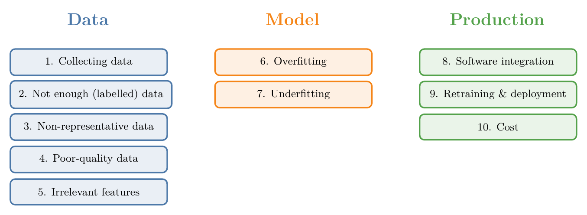
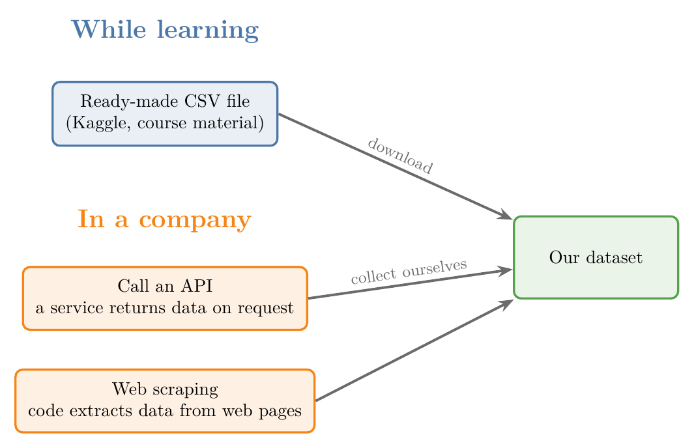
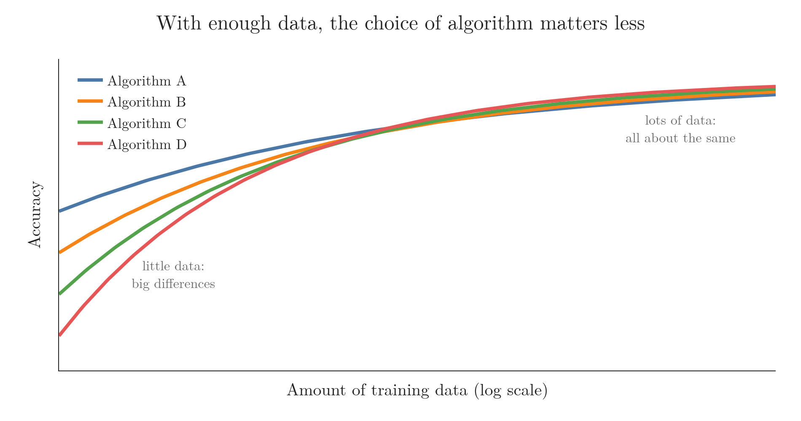
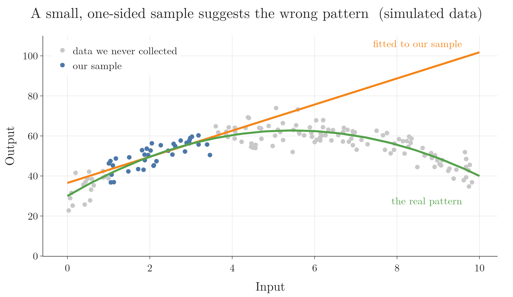
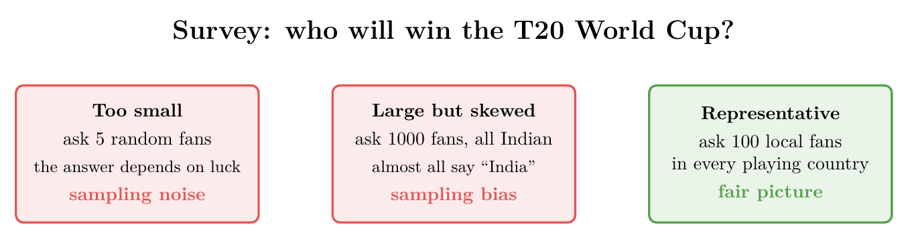
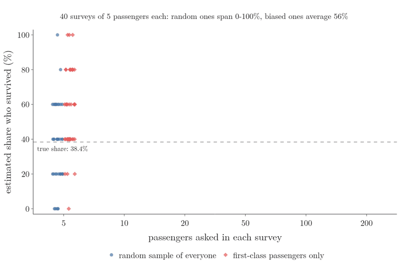
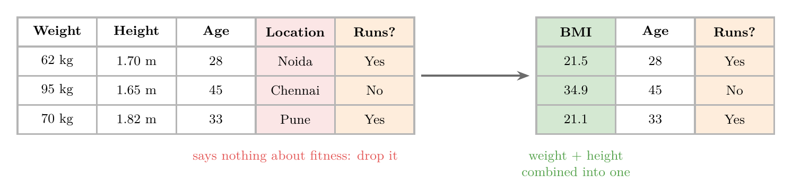
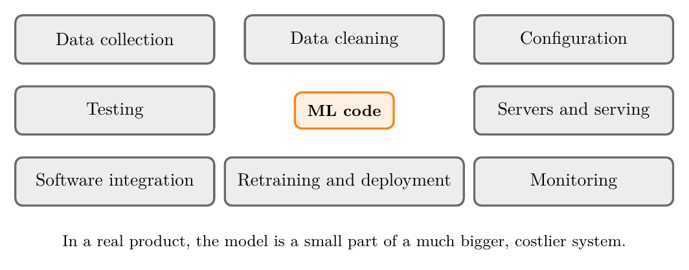

<!-- where-this-fits: generated by course_map/build_map.py; edit concepts.yaml, not this block -->
> **Where this fits:** Pipeline map steps 2 (Get data), 4 (Clean), 9 (Evaluate), 11 (Deploy), 13 (Monitor and maintain). See the [Course map](../../../00-course-map/00-course-map.md).
>
> 
>
> - **Used here, taught in full later:** [Deployment](../../../ML/01-foundations/ML-009-mldlc/ML-009-mldlc.md#9-model-deployment); [Train-test split](../../../ML/01-foundations/ML-012-toy-project/ML-012-toy-project.md#6-training-and-test-sets).
> - **Leads to:** [Population, sample, parameter and statistic](../../../MA/01-descriptive-stats/MA-004-what-is-statistics/MA-004-what-is-statistics.md#4-population-and-sample); [Deployment](../../../ML/01-foundations/ML-009-mldlc/ML-009-mldlc.md#9-model-deployment); [Missing values](../../../ML/04-missing-data-and-outliers/ML-036-missing-categorical-data/ML-036-missing-categorical-data.md#1-overview); [Outliers](../../../ML/04-missing-data-and-outliers/ML-040-what-are-outliers/ML-040-what-are-outliers.md#2-what-an-outlier-is); [MAP estimation](../../../MA/08-likelihood/MA-072-mle-in-machine-learning/MA-072-mle-in-machine-learning.md#7-map-estimation-maximum-likelihood-plus-a-prior); [Regularisation](../../../ML/06-regression/ML-062-ridge-regression-intuition/ML-062-ridge-regression-intuition.md#3-the-idea-penalise-large-coefficients); [Bagging](../../../ML/08-trees-and-ensembles/ML-101-bagging-regressor/ML-101-bagging-regressor.md#4-baggingregressor-on-the-boston-housing-data); [Bias-variance trade-off](../../../ML/08-trees-and-ensembles/ML-103-random-forest-bias-variance/ML-103-random-forest-bias-variance.md#1-overview); [Random forest](../../../ML/08-trees-and-ensembles/ML-106-random-forest-tuning/ML-106-random-forest-tuning.md#3-a-random-forest-out-of-the-box); [Hyperparameter tuning](../../../ML/08-trees-and-ensembles/ML-112-adaboost-hyperparameters/ML-112-adaboost-hyperparameters.md#1-overview); [Boosting](../../../ML/08-trees-and-ensembles/ML-113-bagging-vs-boosting/ML-113-bagging-vs-boosting.md#21-boosting-high-bias-low-variance-models); [Improving a neural network](../../../DL/02-training/DL-021-improving-a-neural-network/DL-021-improving-a-neural-network.md#3-tuning-the-hyperparameters); [Early stopping](../../../DL/02-training/DL-022-early-stopping/DL-022-early-stopping.md#4-early-stopping-in-keras); [Training curves (History)](../../../DL/02-training/DL-022-early-stopping/DL-022-early-stopping.md#2-prerequisites); [Dropout](../../../DL/02-training/DL-025-dropout-code/DL-025-dropout-code.md#3-dropout-for-regression); [L1 and L2 regularisation in neural networks](../../../DL/02-training/DL-026-regularization-in-dl/DL-026-regularization-in-dl.md#5-the-penalty-term); [Data augmentation](../../../DL/04-cnn/DL-050-data-augmentation/DL-050-data-augmentation.md#4-the-transformations); [Pretrained models and ImageNet](../../../DL/04-cnn/DL-051-pretrained-models/DL-051-pretrained-models.md#3-why-use-someone-elses-model); [Transfer learning (feature extraction and fine-tuning)](../../../DL/04-cnn/DL-053-transfer-learning/DL-053-transfer-learning.md#6-two-ways-to-transfer); [Label smoothing](../../../DL/06-transformers/DL-086-transformer-end-to-end/DL-086-transformer-end-to-end.md#74-regularisation-residual-dropout-and-label-smoothing).
> - **Compare with:** [Polynomial regression](../../../ML/06-regression/ML-060-polynomial-regression/ML-060-polynomial-regression.md#3-adding-powers-as-new-features); [Decision surface and boundary](../../../ML/07-classification/ML-085-knn/ML-085-knn.md#5-decision-surfaces).
<!-- /where-this-fits -->

## 1. Overview

> **Key point:** Most problems in an ML project come from the data, some from the model, and the rest from putting the model into a real product.

Before we start building models, it helps to know what tends to go wrong. Figure 1 groups the ten main challenges into three areas.

Each one comes back in later Notes, with tools to handle it.

## 2. Collecting data

> **Key point:** In a course, data is handed to us. In a company, we usually have to collect it ourselves.

ML learns from data, so without data there is nothing to learn.

- **While learning:** data comes ready-made, as CSV files from sites like Kaggle or from course material.
- **In a company:** we usually have to gather it ourselves. The two main ways are calling an **API** (G-204; a service that returns data on request) and **web scraping** (G-2105; writing code that extracts data from web pages).

Figure 2 shows the three routes. Both company routes bring their own problems, because we are pulling large amounts of data from systems we do not control. Both are covered in later Notes.

## 3. Not enough data

> **Key point:** With enough data, the choice of algorithm matters much less. But most projects do not have that much data, and labelled data is the hardest to get.

### 3.1 More data beats a better algorithm

> **Key point:** Given huge amounts of data, very different algorithms end up performing about the same.

Suppose we have two algorithms: A is clearly better than B. We give A a small dataset and B a much larger one. Very often, B ends up performing better.

Researchers tested this on a language task: choosing the right word in sentences such as "*to* / *two* / *too*". They trained several very different algorithms on more and more data. As the data grew, the algorithms' accuracies (the share of answers that are right) came closer and closer together (Figure 3; Géron 2019, Ch. 1). In Figure 3, the horizontal axis is the amount of training data, on a log scale (each equal step to the right multiplies the amount of data by the same factor), and the vertical axis is accuracy; each line is one algorithm.

This effect is known as the **unreasonable effectiveness of data** (G-2055). The catch: few projects have that much data. Most of us work with small or medium datasets, where the choice of algorithm still matters a lot.

> **Extra:** The word-choice experiment is by Michele Banko and Eric Brill at Microsoft (Banko and Brill 2001). The phrase "the unreasonable effectiveness of data" comes from a 2009 article of that name by three Google researchers (Halevy et al. 2009). Figure 3 illustrates the idea; it does not show their measurements.

### 3.2 Labelled data is scarce

> **Key point:** Inputs are easy to collect; the correct answers usually need a human.

For **supervised learning** (G-1919), every **observation** (G-1374; one record, one row of the data table) needs its correct output, the **target** (G-1949), also called its **label** (G-1032). Collecting inputs is often easy: we can download thousands of images in minutes. But someone still has to look at each image and write down whether it shows a cat or a dog.

So even with plenty of data, we may not have enough **labelled** data.

## 4. Non-representative data

> **Key point:** If our data covers only part of the real situation, the model learns the wrong pattern.

### 4.1 A sample that tells the wrong story

> **Key point:** A model can only learn the pattern that is in its data.

Our data is a **sample** (G-1731): a small part of everything that exists in the real world. A sample is **representative** (a **representative sample**, G-1672) when it reflects the whole situation fairly.

In Figure 4, we collected data only from one narrow range (blue points), so the best fit to our sample is a rising straight line (orange). The full data (grey points) shows that the real pattern rises and then falls (green). A model trained on our sample would make badly wrong predictions for large inputs.

### 4.2 Sampling noise and sampling bias

> **Key point:** A sample can be unrepresentative because it is too small (noise) or because of how it was collected (bias).

The two names come from Géron (2019, Ch. 1). Suppose we run a survey: *which team will win the T20 World Cup?* Figure 5 shows three ways to do it.

- **Sampling noise** (G-1737): the sample is so small that the result depends on luck. Asking 5 random fans can give almost any answer.
- **Sampling bias** (G-1734): the way we collect the data favours some answers. Asking 1000 fans, all of them Indian, gives a large sample, but almost all will say "India". Asking fans abroad does not fix this if most of the fans we reach are still Indian.
- **Representative:** ask, say, 100 local fans in every country that is playing. Every team gets a fair chance.

Figure 6 runs both kinds of survey on real data: the 891 passengers of the Titanic training set, of whom 38.4 percent survived. Each survey estimates that share from a sample, and we repeat each survey 40 times.

1. **Small random samples: noise.** With 5 passengers per survey, the random estimates range from 0 to 100 percent. Each one depends on which 5 passengers we happened to pick.
2. **Larger random samples.** With 200 passengers, they gather around the dashed line, between 32 and 52 percent. More data shrinks sampling noise.
3. **Biased samples.** Asking first-class passengers only, the estimates gather around 63 percent, however many we ask: 62.9 percent on average with 200 passengers. First-class passengers survived more often, so this way of collecting the data favours "survived".

A large sample does not protect against bias: a huge but skewed dataset is still skewed.

## 5. Poor-quality data

> **Key point:** Messy data ruins any model, and cleaning it takes most of the time in a real project.

Real data is messy:

- errors and typos,
- **missing values** (G-1234; empty cells),
- **outliers** (G-1420; values far from the rest, often mistakes),
- the same thing written in different formats.

No algorithm can make good predictions from bad data. The rule is often summed up as **garbage in, garbage out** (G-824; Figure 7).

Fixing data quality is called **data cleaning** (G-532). Data cleaning takes most of a project's time: in a one-year project, we can spend around eight months just getting the data right. Many later Notes are about exactly this.

## 6. Irrelevant features

> **Key point:** Features that say nothing about the output only add noise. Remove them, or combine features into more useful ones.

Data often contains **features** (G-772; input variables, one column each in the data table) that have nothing to do with the target (the output we want to predict). They do not help the model, and can make it worse: garbage in, garbage out again.

*Example: predicting who will run a marathon.* We have each person's weight, height, age and location.

- **Location** says nothing about fitness: people in Chennai are not fitter than people in Noida. We drop it.
- **Weight and height** are useful, but together they say more than separately. We combine them into one feature, **BMI** (G-316; body mass index).

**BMI**, step by step:

1. **In words:** weight compared with height, squared. A higher BMI means more weight for the same height.
2. **Formula:**
   $$\text{BMI} = \frac{\text{weight (kg)}}{\text{height (m)}^2}$$
3. **Example:** a person who weighs 62 kg and is 1.70 m tall has
   $$\text{BMI} = \frac{62}{1.70^2} = \frac{62}{2.89} \approx 21.5.$$

Figure 8 shows the result. Choosing, removing and creating features like this is called **feature engineering** (G-761). Deciding which features to keep is hard, and gets easier with experience.

## 7. Overfitting and underfitting

> **Key point:** A good model learns the pattern, not the noise. Too simple misses the pattern (underfitting); too complex memorises the noise (overfitting).

### 7.1 Overfitting

> **Key point:** An overfit model memorises its training data and fails on new data.

**Overfitting** (G-1429) happens when a model learns its training data too closely, noise and accidents included, instead of the general pattern. An overfit model looks perfect on the training data and does badly on new data.

People overfit too. Someone moves to Gurgaon, pays 500 rupees for one movie ticket, and concludes that *everything* in Gurgaon is expensive. One example was turned into a general rule.

Two words need a plain meaning before the figures: **degree** (G-577), the model's complexity, and **error**.

*Degree.* The model here is a curve whose shape we can bend. A curve of degree 1 is a straight line. Degree 2 adds a bend (a parabola), degree 3 allows two bends, and each step up allows one more bend, so the curve can follow the points more closely. A curve of degree 11 has 12 adjustable numbers, as many as the 12 training points, so it can pass exactly through every one of them. The degree is the highest power of the input the curve uses; more degree means more freedom to bend. [Adding powers as new features](../../06-regression/ML-060-polynomial-regression/ML-060-polynomial-regression.md#3-adding-powers-as-new-features) builds these curves.

*Error.* The error measures how far the curve's answers are from the true values. Take a toy case of three points, where the curve answers 1.0, 2.0 and 3.0 and the true values are 1.2, 1.6 and 3.3. The steps:

| Point | Curve's answer | True value | Gap (true minus answer) | Gap squared |
|---|---|---|---|---|
| 1 | 1.0 | 1.2 | 0.2 | 0.04 |
| 2 | 2.0 | 1.6 | −0.4 | 0.16 |
| 3 | 3.0 | 3.3 | 0.3 | 0.09 |

$$\text{average of the squared gaps}$$

$$= \frac{0.04 + 0.16 + 0.09}{3} = 0.097$$

$$\text{error} = \sqrt{0.097} = 0.31$$

The gaps are squared so that a negative gap (point 2) and a positive gap cannot cancel out in the average, and the square root at the end brings the error back to the units of the values.

This is the **root mean squared error** (RMSE, G-1705), taken up in [root mean squared error](../../06-regression/ML-051-regression-metrics/ML-051-regression-metrics.md#4-root-mean-squared-error-rmse). The error in Figure 10 is computed in the same way, over the 12 training points (training error) or over the 300 new points (new-data error).

Figure 9 fits three curves of rising degree to the same 12 points. Its last stage shows an overfit model: its curve passes exactly through all 12 training points, so its error on the training data is 0. But it twists wildly between them, and its error on new data is twice that of the good fit.

Why does a perfect score on the training data go with a bad score on new data? Figure 10 answers by raising the model's complexity one step at a time, from degree 1 to degree 11, on the same 12 points.

1. **The two kinds of data.** The curve is fitted to the blue points only: the **training set** (G-2002). The orange points are new: the model never saw them. They play the role of a **test set** (G-1962).
2. **Training error only falls.** Each extra degree lets the curve bend closer to the blue points: 0.47 at degree 1, 0.21 at degree 3, 0.00 at degree 11.
3. **New-data error falls, then rises.** The error on the orange points starts at 0.55 at degree 1, rises slightly to 0.57 at degree 2, falls to 0.32 at degree 3, stays near 0.30 up to degree 6, then climbs, unevenly, to 0.67 at degree 11. The two wobbles are not part of the lesson. Degree 2 has one bend and the wave needs two, so the parabola fits the training points hardly better than the line (training error 0.47 against 0.45), and the new-data error moves by only 0.02. Above degree 7, each curve swings differently in the gaps between only 12 points, so the new-data error jumps up and down (0.54 at degree 9, 0.38 at degree 10) while its trend is up.
4. **What went wrong.** To pass through every blue point, the degree-11 curve must swing far between them. The orange segments show the cost: new points that fall between the blue ones are far from the curve.

So a model is judged by its error on data it did not train on, never by its training error. [Bias and variance](../../06-regression/ML-061-bias-variance/ML-061-bias-variance.md#5-the-trade-off) studies this trade-off in full.

Overfitting is one of the biggest challenges in ML. For every algorithm in these Notes, we will ask how it can overfit and how to prevent it.

### 7.2 Underfitting

> **Key point:** An underfit model is too simple to capture the pattern, so it is bad on all data.

**Underfitting** (G-2035) is the opposite: the model is too simple for the data. In the first stage of Figure 9, a straight line cannot follow the wave in the data. The line does badly on the training data and on new data alike.

The middle stage is a **good fit** (G-852): it follows the overall wave and ignores the small noise in individual points. Its error on new data is the lowest of the three.

A model that scores 100% on its training data is a warning sign, not a success. Such a model has probably memorised the data.

The Notebook for this Note (`ML-007-challenges-in-ml.ipynb`) has a slider for model complexity, showing the training error and the new-data error at every step.

## 8. Software integration

> **Key point:** A model is only useful inside a product, and every platform needs it in a different form.

A model is never the end product. The model is a part of some software that helps users: a recommender inside a website, a fraud detector inside a banking app.

So after building the model, we have to **integrate** it (**integration**, G-957) into that software, and the software may run on many platforms (Figure 11).

Each platform has its own languages and libraries, and ML support outside Python is often weak:

- **Java**, one of the most popular programming languages, still has limited ML support.
- **JavaScript** runs all front-end web development, and has only recently gained a serious ML library (TensorFlow.js).

Getting one model to work reliably on all of these is hard. Still, a model only creates value once users can reach it, for example as a website or an Android app.

## 9. Retraining and deployment

> **Key point:** Keeping a model updated in production is hard, whether we retrain it in batches or let it learn online.

As covered in [batch learning](../ML-004-batch-learning/ML-004-batch-learning.md#4-keeping-a-batch-model-up-to-date) and [online learning](../ML-005-online-learning/ML-005-online-learning.md#2-what-online-learning-is):

- **Batch learning:** to update the model, we take it offline, retrain it on all the data, and upload it again, over and over.
- **Online learning:** the model updates itself on the server, which is harder to build and riskier to run.

**Deployment** (G-592), putting a model on a server for users, is itself difficult. Cloud providers such as AWS (Amazon), Google Cloud and Microsoft Azure offer services for it, but they are not yet as smooth as the tools for ordinary software. Monitoring a live model and fixing it in real time still takes a lot of effort.

## 10. Cost

> **Key point:** In a real product, the model is a small part of a large and expensive system.

At scale, the costs are surprising. A model used by 10,000 or 100,000 people needs much more than the model itself, for example:

- servers (G-1779);
- data pipelines (G-538);
- monitoring;
- testing.

Each of these has costs that are easy to miss while building the model (Figure 12).

Managing all of this is a growing field of its own, **MLOps** (G-1244; machine learning operations): running ML models in production, the way DevOps runs ordinary software.

The best way to learn these challenges is to go one step further than building a model: turn it into a real product, deploy it on a server and let real users use it.

> **Extra:** A well-known paper on these hidden costs is *Hidden Technical Debt in Machine Learning Systems* (Sculley et al. 2015). Its Figure 1 makes the same point as Figure 12: the ML code is a small box in a much larger system.

## 11. Summary

| # | Challenge | In one line | Why it matters |
|---|---|---|---|
| 1 | Collecting data | Real projects must gather their own data (APIs, web scraping) | we pull large amounts of data from systems we do not control |
| 2 | Not enough data | More data often beats a better algorithm; labels are scarce | with small data the choice of algorithm still matters, and each label needs a human |
| 3 | Non-representative data | A one-sided sample teaches the wrong pattern | a model can only learn the pattern in its data, and a bigger skewed sample is still skewed |
| 4 | Poor-quality data | Garbage in, garbage out; cleaning takes most of the time | no algorithm predicts well from bad data |
| 5 | Irrelevant features | Drop useless features; combine useful ones (feature engineering) | useless features add noise and can make the model worse |
| 6 | Overfitting | Memorises the training data; fails on new data | a perfect training score can hide a bad model |
| 7 | Underfitting | Too simple; fails on all data | a straight line cannot follow a wave |
| 8 | Software integration | Every platform needs the model in a different form | ML support outside Python is often weak |
| 9 | Retraining and deployment | Keeping a live model updated is hard | batch retraining repeats the whole upload; online learning is riskier to run |
| 10 | Cost | The model is a small part of an expensive system (MLOps) | servers, pipelines, monitoring and testing are easy to miss while building the model |

- Most challenges are about **data**: getting it, getting enough, getting a fair sample, cleaning it, choosing its features. So most of a project's time goes into the data, not the model.
- A model must learn the **pattern**, not the noise, so a model is judged by its error on data it did not train on, never by its training error.
- A model creates value only once it runs inside a product that real users can reach.

## 12. Sources

**Built from**

- CampusX, "Challenges in Machine Learning | Problems in Machine Learning", YouTube, https://www.youtube.com/watch?v=WGUNAJki2S4
- StatQuest with Josh Starmer, "Machine Learning Fundamentals: Bias and Variance", YouTube, https://www.youtube.com/watch?v=EuBBz3bI-aA (comparing fits on the training set and the testing set, Figure 10)

**Other references**

- Kaggle. *Titanic: Machine Learning from Disaster*, training set (891 passengers). kaggle.com/c/titanic.
- Géron, A. (2019). *Hands-On Machine Learning with Scikit-Learn, Keras and TensorFlow*, 2nd ed. O'Reilly. Ch. 1, "Main Challenges of Machine Learning".
- Banko, M. and Brill, E. (2001). Scaling to Very Very Large Corpora for Natural Language Disambiguation. *Proceedings of ACL*.
- Halevy, A., Norvig, P. and Pereira, F. (2009). The Unreasonable Effectiveness of Data. *IEEE Intelligent Systems* 24(2).
- Sculley, D. et al. (2015). Hidden Technical Debt in Machine Learning Systems. *NeurIPS*.

## 13. Key terms

| Term | Meaning |
|---|---|
| API (G-204) | A service that returns data when our code asks for it |
| Web scraping | Writing code that extracts data from web pages |
| Unreasonable effectiveness of data | With enough data, different algorithms perform about the same |
| Labelled data | Data whose observations include the correct output |
| Feature | An input variable, one column of the data table |
| Target | The output we want to predict |
| Observation | One record, one row of the data table |
| Sample | The part of a population that we actually measure, such as 50,000 people asked about their salary instead of everyone in India; we study it because measuring the whole population is usually impossible, and use it to draw conclusions about the population. |
| Representative sample | A sample that reflects the whole situation fairly |
| Sampling noise | Error in a sample's result because the sample is too small, so the answer depends on luck, such as asking only 5 fans; a larger sample reduces it. |
| Sampling bias | A sample that misrepresents the population because of how the data was collected, such as asking only Indian fans who should win a cricket match; a larger sample does not fix it. |
| Missing values (G-1234) | Empty cells in the data |
| Outliers (G-1420) | Values far from the rest, often mistakes |
| Garbage in, garbage out | Bad input data always gives bad results |
| Data cleaning | Fixing errors, gaps and inconsistencies in data |
| Feature engineering | Choosing, removing and creating input columns (features) so that the model gets the information it needs in a form it can use. |
| BMI | Body mass index: weight (kg) divided by height (m) squared |
| Overfitting | Learning the training data too closely, noise included; fails on new data |
| Training set | The data a model learns from |
| Test set | Data kept aside, never learned from, used to measure a model on new data |
| Underfitting | Being too simple to capture the pattern; fails on all data |
| Good fit | Capturing the pattern while ignoring the noise |
| Software integration | Building a model into the software that users use |
| Deployment (G-592) | Putting a model on a server so users can reach it |
| MLOps | Running and maintaining ML models in production |
