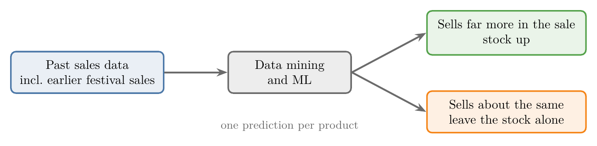
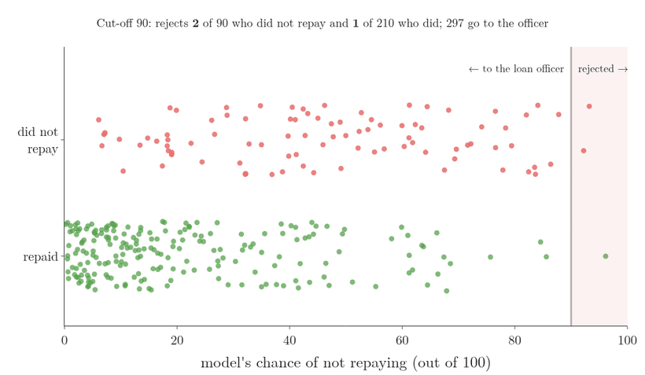
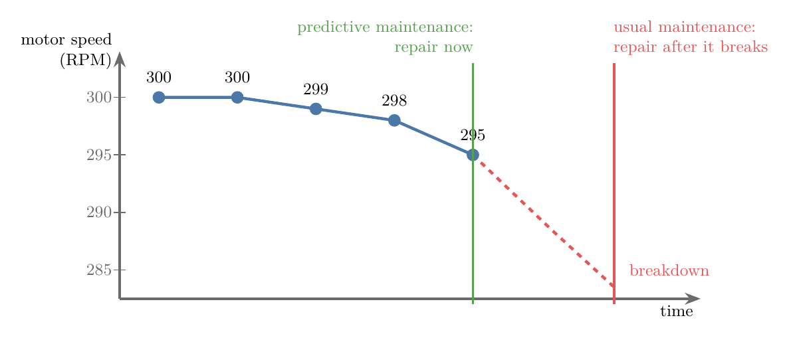

<!-- where-this-fits: generated by course_map/build_map.py; edit concepts.yaml, not this block -->
> **Where this fits:** Pipeline map step 0 (Foundations). See the [Course map](../../../00-course-map/00-course-map.md).
>
> 
>
> - **Builds on:** [Machine learning](../../../ML/01-foundations/ML-001-what-is-ml/ML-001-what-is-ml.md#2-defining-machine-learning); [Association rule learning](../../../ML/01-foundations/ML-003-types-of-ml/ML-003-types-of-ml.md#35-association-rule-learning).
> - **Compare with:** [Exploratory data analysis](../../../ML/01-foundations/ML-009-mldlc/ML-009-mldlc.md#6-exploratory-data-analysis-eda).
<!-- /where-this-fits -->

## 1. Overview

> **Key point:** ML is already built into many products we use every day. Its biggest effect is inside businesses, where it helps companies cut costs and earn more.

Figure 1 shows the five business sectors in this Note and the main ML application in each.

Each section below takes one sector and shows three things:

- the problem the business faces;
- the data it has;
- what ML does with that data.

## 2. Consumer and business applications

> **Key point:** Apps we use (B2C) are the familiar examples of ML. Applications that help one business run another (B2B) earn more money.

### 2.1 ML in everyday products

> **Key point:** ML is not a future technology. We use it every day, usually without noticing.

Many everyday software products already contain ML:

- friend suggestions on Facebook,
- video recommendations on YouTube,
- product recommendations on Amazon,
- chatbots.

The list goes on into the hundreds. We use these products so often that we rarely notice the ML inside them.

### 2.2 B2C and B2B

> **Key point:** B2C products serve ordinary users. B2B uses of ML help a company run its own business, and that is where most of the profit is.

- **B2C** (G-245; business to customer): a company sells a product or service to ordinary users. WhatsApp, YouTube and the examples above are B2C.
- **B2B** (G-244; business to business): the product helps a business run itself, for example by deciding what to stock or whom to lend money to.

When we think of ML, B2C apps come to mind first, because we use them ourselves. B2B uses are less visible, but they make a lot of money. The rest of this Note is about B2B uses in five sectors:

- retail (Section 3);
- banking and finance (Section 4);
- transportation (Section 5);
- manufacturing (Section 6);
- social media (Section 7).

ML is also used in many other fields, such as space exploration, medicine and defence.

## 3. Retail

> **Key point:** Retail companies use ML to decide what to stock, whom to advertise to, and where to place products on shelves.

Large retailers would struggle to run at all without ML. Figure 1 lists three uses.

### 3.1 Stocking up before a sale

> **Key point:** Before a big sale, ML on past sales data tells the company which products to stock up on.

Amazon sells more than 6 crore (60 million) products. During a big sale, such as its yearly *Great Indian Festival*, sales rise sharply.

The company cannot simply increase the stock of every product:

- extra stock costs a lot of money,
- most products will not sell much more during the sale.

So before the sale, a data analyst takes the sales data of past years, including past Great Indian Festival sales. Using **data mining** (G-537; searching large amounts of data for useful patterns) and ML algorithms, the analyst works out which products to stock up on and which to leave alone.

Figure 2 shows the flow: past sales go in, and for each product a prediction comes out that sorts it into "stock up" or "leave alone".

A wrong decision here can cost crores of rupees. Every e-commerce site that runs sales, such as Myntra and Flipkart, makes this decision the same way.

> **Extra:** Predicting how much of a product will sell in the future is called **demand forecasting** (G-580). Because the output is a number, it is a **regression** (G-1655) problem ([regression and classification](../ML-003-types-of-ml/ML-003-types-of-ml.md#23-regression-and-classification)). The same idea comes back in transportation (Section 5.2).

### 3.2 Customer profiles for targeted marketing

> **Key point:** Shops ask for our phone number to link all our purchases to one profile. The profile tells advertisers exactly what we are likely to buy.

At the checkout of a large store (such as Spencer's or Big Bazaar), the first thing we are asked for is our phone number. The main reason is not to send us offers by SMS. The number is there to track our **buying behaviour**: every bill gets linked to the same number.

From these bills, the store builds a **customer profile** (G-524): a summary of what kind of buyer we are.

- Someone who buys many milk products and health items: *health-conscious*.
- Others may show up as buying spicy food, sports goods or cosmetics.

The store can then sell these profiled numbers to other companies. Such sales are why we get SMS from unknown numbers about a gym, a sports class or a course.

Figure 3 shows why the profile is worth money. Suppose a gym wants new members.

- **Without the data:** it sends SMS to 1 lakh (100,000) random people. Very few of them are interested, so the **conversion rate** (G-474; the share of people reached who become customers) is very low.
- **With the data:** it buys the numbers of 100 people the store knows are health-conscious. These 100 SMS bring about the same results as 1 lakh random ones.

In numbers, say both campaigns bring in 10 new members. The conversion rate is the members gained divided by the people reached:

For the campaign that reached 100,000 people:

$$\frac{10}{100{,}000} = 0.0001 = 0.01 \text{ percent}$$

For the campaign that reached 100 people:

$$\frac{10}{100} = 0.1 = 10 \text{ percent}$$

The same result costs 100 SMS instead of 1,00,000, a thousand times fewer.

Reaching only the people most likely to buy is called **targeted marketing** (G-1951). Because the profiles make advertising this much more effective, the store can charge advertisers more for them.

Google and Facebook do the same with the data of their users. Most internet products are free to use, which leads to a well-known saying: *if you are not paying for the product, you are the product.*

> **Extra:** Grouping customers by their buying behaviour without being told the groups is **clustering** (G-401), a kind of **unsupervised learning** (G-2058; [clustering](../ML-003-types-of-ml/ML-003-types-of-ml.md#32-clustering)). In marketing it is called **customer segmentation** (G-525).

### 3.3 Product placement on shelves

> **Key point:** Association rule learning finds products that are often bought together, and the shop places them next to each other.

In a supermarket, someone has decided which product sits next to which in the aisles. The placement is often decided with ML.

**Association rule learning** (G-218) finds how strongly two products are linked: how often they are bought together. If the link is strong, the shop keeps the two products next to each other. The classic example is baby diapers and beer, covered in [association rule learning](../ML-003-types-of-ml/ML-003-types-of-ml.md#35-association-rule-learning).

Without these three uses of ML (stocking, profiles, placement), retail companies would not run nearly as well as they do today.

## 4. Banking and finance

> **Key point:** Banks use ML to compare a loan applicant with past customers who did not repay, and reject the risky ones before a human looks.

### 4.1 Loan approval

> **Key point:** An ML model screens every loan application first. Only low-risk applications reach a human loan officer.

Not everyone who applies for a loan gets one. The applicant first submits a profile, which then goes through two stages of checks (Figure 4).

1. **ML model.** The applicant's profile is compared with the profiles of **past defaulters**: people who took a loan and did not pay it back.
2. **Loan officer.** A human checks the application by hand and decides whether to sanction the loan.

The ML stage decides which applications reach the officer:

- **High similarity** to past defaulters (say 80 out of 100): the model reports an 80% chance that this person will not repay. Such a score is a red alarm, and the application is rejected.
- **Low similarity** (say 10, 15 or 20): the application is passed on to the loan officer.

Where should the bank draw the line? Figure 5 shows the ML stage on real loans: the German credit dataset, 1,000 past borrowers, 300 of whom did not repay (Hofmann 1994).

In Figure 5, the position of a dot along the horizontal axis is the model's chance (out of 100) that the applicant will not repay. The vertical line is the cut-off we choose, and the gif moves it.

1. **Training.** A model learns from 700 past borrowers how the profiles of those who did not repay differ from the rest. It is a **logistic regression** (G-1120), a classifier that outputs a probability.
2. **Scoring.** It gives each of the other 300 applicants a chance of not repaying, out of 100. Most red dots sit to the right of most green dots, but the two groups overlap.
3. **A high cut-off, 80.** Only applicants scored above 80 are rejected, so the model rejects only 12 applicants: 9 who did not repay and 3 who did. Almost everyone reaches the loan officer.
4. **A lower cut-off, 50.** More applicants score above 50. It rejects 38 of the 90 who did not repay, and also 20 of the 210 who did.
5. **The trade-off.** Steps 3 and 4 side by side, among the 90 applicants who did not repay and the 210 who did:

| Cut-off | Defaulters rejected | Good customers rejected |
|---|---|---|
| 80 | 9 of 90 = 10 percent | 3 of 210 = 1.4 percent |
| 50 | 38 of 90 = 42 percent | 20 of 210 = 9.5 percent |

   Lowering the cut-off catches more future defaulters, but turns away more good customers. Where to put it is a business decision: in this dataset's own guidance, lending to someone who will not repay is counted as five times as costly as turning away someone who would (Hofmann 1994).

> **Extra:** Predicting "will repay / will not repay" is a **classification** (G-395) problem ([regression and classification](../ML-003-types-of-ml/ML-003-types-of-ml.md#23-regression-and-classification)). In banking it is called **credit scoring** (G-502), and the probability of not repaying is called the *probability of default* (Thomas et al. 2002, Ch. 1).

### 4.2 Other uses in banking and finance

> **Key point:** Banks also use ML to plan branches and offers, and the wider finance sector uses it in insurance and share trading.

In banking, ML also helps decide:

- where to open new branches,
- which promotions to run for customers,
- what kind of plans to start in which cities.

The wider finance sector, including insurance and the share market (trading), also uses ML heavily.

## 5. Transportation

> **Key point:** Cab companies use ML to predict where demand will be high and to pull drivers there with higher fares. Delivery companies use it to plan routes.

### 5.1 Surge pricing

> **Key point:** When demand is much higher than the supply of cabs, the fare goes up. The extra money pulls nearby drivers into that area.

Ola and Uber sometimes charge much more than the normal fare at certain times, such as mornings and evenings. A ride that normally costs 100 rupees may cost 200 or 300 rupees. Raising the fare like this is called **surge pricing** (G-1926).

The reason becomes clear from the driver's side. Ola and Uber each have two apps: a user app for riders and a driver app for drivers. The driver app shows a map of the city with some regions marked in red. A driver who reaches a red region in the next 10 minutes and takes a pickup there earns more than usual, for example 2 times the normal fare.

Figure 6 shows why this happens.

- **Demand:** an office area in the evening. People are leaving work, and many of them open the app to book a cab.
- **Supply:** only 3 cabs are in the area.
- **The fix:** call nearby drivers into the area. They have no reason to drive the extra distance, so they are offered more money: 3.2x in one region, 1.8x in another.

If the company paid this extra money itself, it would soon run out of money. So the rider pays it, which is why the app says that prices are higher *due to increased demand*.

### 5.2 Demand forecasting

> **Key point:** ML predicts how many cabs will be needed, where and when, so the company can move cabs there in advance.

Demand changes with time and place. In Kolkata, for example, demand for cabs is very high during Durga Puja.

**Demand forecasting** predicts how many cabs will be needed at which place and time. The company then uses these predictions to send cabs to the right places in advance.

### 5.3 Delivery routing in logistics

> **Key point:** Logistics companies use ML to find the best route for a delivery person carrying several orders.

In logistics, many startups use ML for **delivery routing**. For example, a Swiggy delivery person may pick up three orders at once. ML helps decide how to deliver all three in the most efficient way.

Google Maps works on similar problems. Transportation and logistics are among the busiest areas of ML today.

## 6. Manufacturing

> **Key point:** Sensors on factory machines send readings all the time. ML spots the slow change that comes before a fault, so the machine is repaired before it breaks.

### 6.1 Why a broken machine is so costly

> **Key point:** In an automated factory, one broken machine can stop the whole production line.

Tesla's car factories are highly automated: robotic arms build the cars. Tesla also takes bookings months in advance, often about six months before delivery, so it builds cars on a tight schedule.

Suppose the robot that puts the engine into each car breaks down. Every car needs an engine, so that day the factory builds no cars at all. A one-day delay means late deliveries to customers who have already paid, and the bad word of mouth that every company fears.

### 6.2 Predictive maintenance

> **Key point:** Usual maintenance repairs a machine after it breaks. Predictive maintenance predicts the fault and repairs the machine before it breaks.

To avoid this, companies like Tesla fit their robotic arms with **IoT sensors** (G-971; Internet of Things: devices that measure something and send the readings over the internet). The sensors constantly record metrics such as temperature, **RPM** (G-1715; revolutions per minute, how fast a motor turns) and pressure, and send them to a server.

A fault does not appear all at once: it builds up gradually. Figure 7 shows a motor whose RPM slowly drops from 300 to 299, then 298, then 295. This small, steady drop is a signal that a fault is developing.

As soon as the drop is detected, engineers are sent to repair that robotic arm.

- **Usual maintenance:** we repair a machine after it breaks.
- **Predictive maintenance** (G-1553): we predict that a machine is going to break, and repair it before it does.

The same idea works in any factory, not only Tesla's. Predictive maintenance is one of the ways ML is changing the manufacturing sector.

> **Extra:** Spotting readings that drift away from a machine's normal behaviour is a form of **anomaly detection** (G-201), which [anomaly detection](../ML-003-types-of-ml/ML-003-types-of-ml.md#34-anomaly-detection) lists as a use of unsupervised learning.

## 7. Social media

> **Key point:** Sentiment analysis turns millions of tweets into a measure of what people think. That measure can be sold as a forecast.

### 7.1 Sentiment analysis

> **Key point:** Sentiment analysis reads a piece of text and decides whether its writer feels positive or negative.

**Sentiment analysis** (G-1769) decides whether the writer of a text is expressing a positive or a negative opinion. Sentiment analysis belongs to **natural language processing (NLP)** (G-1305), the part of ML that works with human language, and is used a lot today, for example in chatbots.

As an example, consider a small website that rates movies from their reviews:

1. We type a movie name, for example *Dunkirk* (Christopher Nolan, 2017).
2. The site collects all the reviews of that movie from IMDb.
3. The site reads each review and labels it positive or negative.
4. The site combines the numbers of good and bad reviews into one rating score for the movie.

Figure 8 shows three real reviews of *Dunkirk* and the labels the model gave them. "Brilliant cinematography" reads as praise, and the model labels it positive. "I was very disappointed ... left me feeling cheated" reads as unhappy, and the model labels it negative.

> **Extra:** A natural way to turn the labels into a score out of 10 is the share of positive reviews:
>
> 1. **In words:** the number of positive reviews divided by the total number of reviews, times 10.
> 2. **Formula:**
>    $$\text{score} = 10 \times \frac{\text{positive}}{\text{positive} + \text{negative}}$$
>    Here "positive" and "negative" are the numbers of positive and negative reviews.
> 3. **Example:** with 39 positive and 11 negative reviews,
>    $$\text{score} = 10 \times \frac{39}{39 + 11}$$
>    $$= 10 \times 0.78$$
>    $$= 7.8$$

### 7.2 Turning tweets into profit

> **Key point:** Sentiment analysis of tweets about an event can predict its result. The prediction is worth the most to people who trade shares.

For many years, Twitter earned very little money. Facebook and Google had become profitable within a few years, and Twitter's investors feared the company would have to shut down for lack of income. One reported plan to earn money was to use the tweets themselves, through sentiment analysis.

The example below shows how such a plan could work. The example is an illustration only: there is no proof that Twitter did exactly this.

Suppose an election is coming in a state, and people tweet about it under one hashtag. Figure 9 shows the plan step by step.

1. **Collect.** Twitter gathers all the tweets with the election hashtag, say 50,000.
2. **Analyse.** Sentiment analysis shows that 35,000 of them (70%) say candidate A will win. People tend to tweet what they really believe, so this works like an opinion poll before the election. It is close to the real result only if the people tweeting vote like the whole state does; if they do not, the forecast is biased (see [sampling noise and sampling bias](../ML-007-challenges-in-ml/ML-007-challenges-in-ml.md#42-sampling-noise-and-sampling-bias)).
3. **Sell the forecast.** The most valuable buyer is not a media house. The best buyer is a **stock-broking company**, such as Morgan Stanley or JP Morgan, which invests rich people's money in the share market.
4. **Buy shares.** The broker buys many shares of companies expected to gain if A wins, while the price is low, say 20 rupees per share.
5. **The result.** A wins. Now everyone wants those shares, so the price rises, say to 100 rupees.
6. **Sell.** The broker sells at the high price. The profit goes to the investors, and a part goes to Twitter, which supplied the forecast.

The same idea works beyond politics: for sports, entertainment or any event, in any of the world's more than 200 countries. Whatever Twitter really did, consumer internet companies today earn a lot of money from sentiment analysis of their users' data.

> **Extra:** Some real events match this idea:
>
> - Twitter earns money by **licensing its data**: selling other companies access to the stream of tweets. In 2014 Twitter bought Gnip, a company that resold that data (Twitter 10-K 2014).
> - A 2011 study, *Twitter mood predicts the stock market*, found that the mood of tweets helped predict moves of the Dow Jones index a few days later (Bollen et al. 2011).

## 8. Summary

| Sector | Business problem | Data used | What ML does | Why it matters |
|---|---|---|---|---|
| Retail | Which products to stock up before a sale | Past sales, past sale events | Predicts which products will sell more | extra stock costs money, and a wrong call can cost crores |
| Retail | Whom to advertise to | Bills linked to phone numbers | Builds customer profiles for targeted marketing | the same result for a thousand times fewer SMS |
| Retail | Which products to place together | Past bills | Association rule learning finds items bought together | products bought together sit side by side |
| Banking | Whom to give a loan | Profiles of past defaulters | Rejects applicants similar to past defaulters | risky applicants are stopped before a human looks |
| Transportation | Too few cabs where riders are | Bookings by place and time | Surge pricing and demand forecasting | higher fares pull nearby drivers to where riders wait |
| Transportation | Delivering several orders at once | Locations, routes | Finds an efficient route | one delivery person can carry several orders |
| Manufacturing | A broken machine stops production | IoT sensor readings | Predictive maintenance: repair before it breaks | one broken machine can stop the whole line |
| Social media | Earning money from tweets | Tweets | Sentiment analysis turned into a sellable forecast | a forecast of an event is worth most to share traders |

- ML is already part of everyday products (B2C), but its biggest money-makers help businesses run (B2B).
- In every example, a business has a costly decision to make, and ML makes it from past data, because past data shows what happened in similar cases (past sales, past defaulters, past bills).
- Data about people, such as purchases or tweets, is valuable in itself, because profiles make advertising far more effective (10 percent conversion against 0.01 percent): *if you are not paying for the product, you are the product.*

> **Extra:** Each application maps to a type of ML from [the types of ML](../ML-003-types-of-ml/ML-003-types-of-ml.md#1-overview):
>
> | Application | Type of ML |
> |---|---|
> | Stocking, demand forecasting | Regression (supervised) |
> | Loan approval, sentiment analysis | Classification (supervised) |
> | Customer profiles | Clustering (unsupervised) |
> | Product placement | Association rule learning (unsupervised) |
> | Predictive maintenance | Anomaly detection or classification |
>
> Route planning is mostly an optimisation problem (finding the shortest or cheapest route); ML helps it by predicting travel times.

## 9. Sources

**Built from**

- CampusX, "Application of Machine Learning | Real Life Machine Learning Applications", YouTube, https://www.youtube.com/watch?v=UZio8TcTMrI

**Other references**

- Hofmann, H. (1994). *Statlog (German Credit Data)*. UCI Machine Learning Repository; OpenML dataset 31, "credit-g", with its cost matrix. https://www.openml.org/d/31
- Bollen, J., Mao, H. and Zeng, X. (2011). Twitter Mood Predicts the Stock Market. *Journal of Computational Science* 2(1).
- Thomas, L., Edelman, D. and Crook, J. (2002). *Credit Scoring and Its Applications*. SIAM.
- Twitter, Inc. (2015). *Form 10-K for the fiscal year 2014*. US Securities and Exchange Commission, sec.gov (EDGAR).

## 10. Key terms

| Term | Meaning |
|---|---|
| B2C | Business to customer: a product sold to ordinary users |
| B2B | Business to business: a product that helps a company run its business |
| Data mining | Searching large amounts of data for useful patterns |
| Demand forecasting | Predicting how much of something will be needed, where and when |
| Buying behaviour | The pattern of what a customer buys |
| Customer profile | A summary of what kind of buyer a customer is, built from their purchases |
| Customer segmentation | Grouping customers by their buying behaviour |
| Targeted marketing | Advertising only to the people most likely to buy |
| Conversion rate | The share of people reached who become customers |
| Association rule learning | Finding items that are often bought or occur together |
| Past defaulters | Past borrowers who did not repay their loan; a loan model compares a new applicant with them, and high similarity means high risk. |
| Logistic regression | A classifier that outputs a probability for each observation |
| Credit scoring | Predicting whether a loan applicant will repay |
| Surge pricing | Raising fares when demand is much higher than supply |
| Delivery routing | Planning the most efficient route for deliveries |
| IoT sensor | A device that measures something and sends the readings over the internet |
| RPM | Revolutions per minute: how fast a motor turns |
| Predictive maintenance | Repairing a machine before it breaks, based on predicted faults |
| Anomaly detection | Spotting data that does not fit the normal pattern |
| Sentiment analysis | Deciding whether a text expresses a positive or negative opinion |
| Natural language processing (NLP) | The part of ML that works with human language |
