<!-- where-this-fits: generated by course_map/build_map.py; edit concepts.yaml, not this block -->
> **Where this fits:** Pipeline map steps 0 (Foundations), 1 (Frame the problem), 2 (Get data), 3 (Understand data), 4 (Clean), 5 (Engineer features), 8 (Model), 10 (Tune), 11 (Deploy), 12 (Test), 13 (Monitor and maintain). See the [Course map](../../../00-course-map/00-course-map.md).
>
> 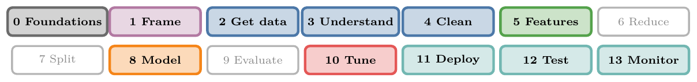
>
> - **Builds on:** [Features](../../../ML/01-foundations/ML-002-ai-vs-ml-vs-dl/ML-002-ai-vs-ml-vs-dl.md#52-features-chosen-by-us-or-learned); [Supervised learning](../../../ML/01-foundations/ML-003-types-of-ml/ML-003-types-of-ml.md#2-supervised-learning); [Dimensionality reduction](../../../ML/01-foundations/ML-003-types-of-ml/ML-003-types-of-ml.md#33-dimensionality-reduction); [Batch (offline) learning](../../../ML/01-foundations/ML-004-batch-learning/ML-004-batch-learning.md#3-batch-learning); [Online learning](../../../ML/01-foundations/ML-005-online-learning/ML-005-online-learning.md#2-what-online-learning-is); [Overfitting](../../../ML/01-foundations/ML-007-challenges-in-ml/ML-007-challenges-in-ml.md#7-overfitting-and-underfitting).
> - **Leads to:** [ML pipelines](../../../ML/01-foundations/ML-012-toy-project/ML-012-toy-project.md#1-overview); [Descriptive statistics](../../../ML/02-getting-data/ML-018-understanding-your-data/ML-018-understanding-your-data.md#7-what-does-the-data-look-like-in-numbers); [Simple imputation (mean, median, mode, constant)](../../../ML/03-feature-engineering/ML-022-what-is-feature-engineering/ML-022-what-is-feature-engineering.md#1-overview); [Binning and binarization](../../../ML/03-feature-engineering/ML-022-what-is-feature-engineering/ML-022-what-is-feature-engineering.md#63-binning-numbers-into-categories); [Feature transformation](../../../ML/03-feature-engineering/ML-022-what-is-feature-engineering/ML-022-what-is-feature-engineering.md#6-feature-transformation); [Feature extraction](../../../ML/03-feature-engineering/ML-022-what-is-feature-engineering/ML-022-what-is-feature-engineering.md#9-feature-extraction).
> - **Compare with:** [Data mining](../../../ML/01-foundations/ML-008-applications-of-ml/ML-008-applications-of-ml.md#31-stocking-up-before-a-sale); [JSON and SQL data](../../../ML/02-getting-data/ML-015-working-with-json-and-sql/ML-015-working-with-json-and-sql.md#2-what-json-is); [Pandas Profiling](../../../ML/02-getting-data/ML-021-pandas-profiling/ML-021-pandas-profiling.md#1-overview); [Feature extraction](../../../ML/03-feature-engineering/ML-022-what-is-feature-engineering/ML-022-what-is-feature-engineering.md#9-feature-extraction); [Normalization](../../../ML/03-feature-engineering/ML-024-normalization/ML-024-normalization.md#2-what-normalization-is); [Decision trees](../../../ML/08-trees-and-ensembles/ML-091-decision-trees-intuition/ML-091-decision-trees-intuition.md#2-a-decision-tree-is-nested-if-else).
<!-- /where-this-fits -->

## 1. Overview

> **Key point:** Building an ML product takes nine stages, from framing the problem to keeping the live model healthy. Training a model is only one of them.

Figure 1 shows the nine stages and how they connect. Stage 1 happens first; stages 2 to 9 form a cycle, because a live model must be retrained on new data. When testing finds a problem, we go back to the stage that caused it: the dashed red arrow from stage 8 (in the figure the cause is poor features, so it points to stage 5).

{height=55%}

Each stage gets its own Notes later. This Note gives the whole picture first, so that every later Note has a place on it.

### 1.1 One row through the stages

> **Key point:** Each stage does something concrete to the data. Following one row of a real table shows what.

Figure 2 follows one passenger of the Titanic file (891 passengers, the dataset that [a pipeline](../../03-feature-engineering/ML-028-pipelines/ML-028-pipelines.md#3-the-titanic-data) cleans step by step). The passenger is the first one in the file whose age is empty. Watch the green cells: they are the cells each stage has just changed. The journey ends with the prediction written as **JSON** (G-987), a plain-text format that programs use to send data to each other, such as `{"survived": 0}`.

Three words help from here on. An **observation** (G-1374) is one record (one row of the data table), here one passenger. A **feature** (G-772) is an input variable (one column of the data table), such as age or fare. The **target** (G-1949) is the output we want to predict, here whether the passenger survived.

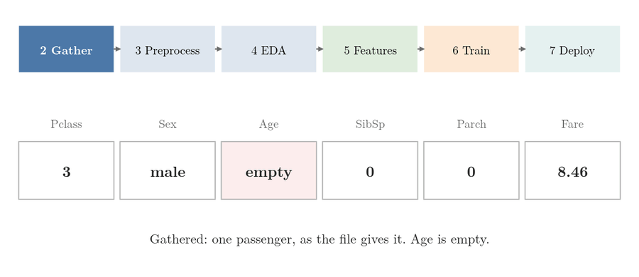

1. **Gather (stage 2).** The row arrives as the file gives it: class 3, male, no age, fare 8.46.
2. **Preprocess (stage 3).** The empty age is filled with the median age of the file, 28. Age and fare are then put on the same scale: the age becomes -0.10 and the fare -0.48.
3. **EDA (stage 4).** We study the data. The row does not change.
4. **Features (stage 5).** Sex is written as a number (male = 1). The two family columns are combined into one: siblings and spouses + parents and children + the passenger = a family size of 1.
5. **Train (stage 6).** A model fitted on all 891 passengers (a **logistic regression**, G-1120) reads the row and gives a probability of survival of 0.11. That is below 0.5, so the model predicts 0: did not survive.
6. **Deploy (stage 7).** The prediction leaves the server as JSON: `{"survived": 0, "probability": 0.11}`. The passenger did not survive, so this prediction is correct.

Steps 2 and 5 in numbers. In step 2, the 891 ages (empty ones filled) average 29.36 with a spread (standard deviation) of 13.01, and the 891 fares average 32.20 with a spread of 49.67. Each value loses the average and is divided by the spread:

$$\text{scaled age} = \frac{28 - 29.36}{13.01} = -0.10$$

$$\text{scaled fare} = \frac{8.46 - 32.20}{49.67} = -0.48$$

In step 5, the model multiplies each of the row's five numbers by a **weight**, a number it learned in training (the standard term is **coefficient**, G-407). Then it adds a starting value, the **intercept** (G-960), 3.942. The sum is the row's **score**. Values and weights are shown to three decimals, so that the column adds up:

| Input | Value | Weight | Value × weight |
|---|---|---|---|
| class | 3 | −1.044 | −3.132 |
| sex (male = 1) | 1 | −2.666 | −2.666 |
| scaled age | −0.105 | −0.489 | +0.051 |
| scaled fare | −0.478 | 0.158 | −0.076 |
| family size | 1 | −0.229 | −0.229 |
| intercept | | | +3.942 |
| **Score** | | | **−2.110** |

The model turns the score into a probability with the **sigmoid** function (G-1798; see [the sigmoid function](../../07-classification/ML-071-sigmoid-function/ML-071-sigmoid-function.md#4-the-sigmoid-function)), where $e \approx 2.718$:

$$\text{probability} = \frac{1}{1 + e^{-\text{score}}}$$

With score = −2.110, the two minus signs cancel:

$$-\text{score} = 2.110$$

$$e^{2.110} = 8.25$$

$$\text{probability} = \frac{1}{1 + 8.25} = 0.11$$

The probability 0.11 is below 0.5, so the prediction is 0: did not survive. Here the point is only that every number of the row is multiplied, added up and turned into one probability.

Sections 3 to 11 explain each stage in turn, with its standard terms.

## 2. From SDLC to MLDLC

> **Key point:** The MLDLC is a set of guidelines for building an ML product from idea to finished product, in the same way the SDLC guides ordinary software.

### 2.1 The software development life cycle

> **Key point:** Ordinary software is built by following a standard process, the SDLC.

The **software development life cycle (SDLC)** (G-1755) is the standard process for building a software product, from start to end. The SDLC is part of the subject *software engineering*. A software developer in a company follows it whenever they build a product.

### 2.2 The machine learning development life cycle

> **Key point:** ML products are new, so a shared process for them was needed too.

Many companies now build software products that contain ML, for example:

- a recommender system for a website;
- a loan-approval model for a bank;
- a model that predicts students' marks for a school.

Each team used to work in its own way. Researchers wanted one common process that everyone could follow.

The result is the **machine learning development life cycle (MLDLC)** (G-1240): a set of guidelines to follow whenever we build an ML-based software product. The MLDLC guides us from the first idea to a working product.

### 2.3 Why the whole cycle matters

> **Key point:** Training a model and checking its accuracy is not the end of the work. Companies want people who can build the whole product.

A common beginner's mistake is to train a model, look at its accuracy and stop there. In a company, the model must become a product that real users can use. Employers look for people with experience of building such **end-to-end products** (G-687), from raw idea to live software.

### 2.4 The number of stages varies

> **Key point:** Different sources count 7, 9 or 10 stages, but the core idea is the same everywhere.

The MLDLC is not yet strictly defined, because ML is still a young field. One book may list fewer stages and another more. Here we use nine stages. If another source lists ten, it describes the same process, split differently.

## 3. Framing the problem

> **Key point:** Before doing anything, we decide exactly what we are building, for whom, at what cost and how.

In a company, we work for customers, and every change of direction costs money. We cannot start, realise halfway that we planned the wrong thing, and start again. So the first stage is **framing the problem** (G-802): we answer the big questions before any work begins.

The questions we answer at this stage:

- What exactly is the problem, and what are we trying to solve?
- Who are the customers?
- How much will it cost?
- How many people does the team need?
- What will the end product look like?
- Is the ML problem supervised or unsupervised?
- Will the model learn in batch (offline) mode or online mode?
- Which kinds of algorithms might help?
- Where will the data come from?

Once these are answered, we have a clear mental plan of what comes next. Only then do we move to stage 2.

Figure 3 sorts the nine questions into two groups. Watch the left side: five of the nine are business questions, asked before any ML choice.

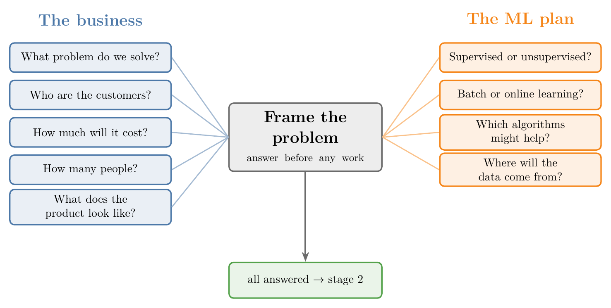

> **Extra:** Supervised and unsupervised learning are explained in [supervised learning](../ML-003-types-of-ml/ML-003-types-of-ml.md#2-supervised-learning) and [unsupervised learning](../ML-003-types-of-ml/ML-003-types-of-ml.md#3-unsupervised-learning); batch and online learning in [batch learning](../ML-004-batch-learning/ML-004-batch-learning.md#3-batch-learning) and [online learning](../ML-005-online-learning/ML-005-online-learning.md#2-what-online-learning-is). Framing a problem in depth, with a worked example, comes in [why framing matters](../ML-013-framing-ml-problem/ML-013-framing-ml-problem.md#2-why-framing-matters).

## 4. Gathering data

> **Key point:** Without data there is no ML. In a company, the data is rarely ready-made, so we fetch it from wherever it lives and store it in a usable form.

### 4.1 Data in a school project versus data in a company

> **Key point:** School and college projects come with data; company projects usually do not.

In school or college projects, data comes ready-made: from Kaggle, from course material, or downloaded from the internet. In a company, the data is often very specific to the business and not easily available. We have to fetch it ourselves.

### 4.2 Where data comes from

> **Key point:** Five common sources: CSV files, APIs, web scraping, data warehouses and big-data clusters.

- **CSV files** (G-513): the easy case. We get the file and start working.
- **APIs** (G-204): we call an API from Python code, receive the data in **JSON** (G-987) format, and convert it to our preferred format, usually a CSV file.
- **Web scraping** (G-2105): the data is on a website but not offered for download. We write Python code that extracts it from the web pages. Hotel-comparison sites such as trivago collect hotel details from many hotel websites this way. Sites that compare a product's price across online shops also scrape those shops.
- **Databases and data warehouses:** the data is in the company's own database. We do not run ML directly on this live database, because a mistake could take the website down. Instead the data is copied into a separate **data warehouse** (G-541) through a process called **ETL** (G-714) (extract, transform, load), and we fetch our data from there.
- **Big-data clusters:** very large data is spread across many machines (a cluster), handled by tools such as Spark. We fetch the data from those clusters.

The goal of this stage is to fetch the data and store it in the right form, so that the work can start.

Figure 4 puts the five sources side by side. Watch the middle column: every source except a CSV file needs a fetching step before the data is ready.

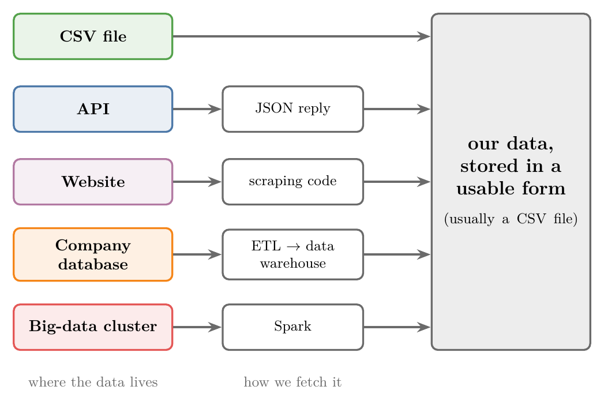

> **Extra:** In ETL, *extract* copies data out of the source systems, *transform* cleans and reshapes it, and *load* writes it into the warehouse. Apache Spark is a widely used tool for processing data that is too big for one computer, by spreading the work over a cluster of machines (Zaharia et al. 2016). Each source is worked through step by step: [CSV files](../../02-getting-data/ML-014-working-with-csv/ML-014-working-with-csv.md#2-csv-and-tsv-files), [JSON](../../02-getting-data/ML-015-working-with-json-and-sql/ML-015-working-with-json-and-sql.md#2-what-json-is), [SQL](../../02-getting-data/ML-015-working-with-json-and-sql/ML-015-working-with-json-and-sql.md#3-what-sql-is), [APIs](../../02-getting-data/ML-016-fetching-data-from-api/ML-016-fetching-data-from-api.md#2-what-an-api-is) and [web scraping](../../02-getting-data/ML-017-web-scraping/ML-017-web-scraping.md#2-when-we-need-web-scraping).

## 5. Data preprocessing

> **Key point:** Data from outside is almost always dirty. Preprocessing turns it into a form the algorithm can use.

### 5.1 Why raw data cannot go straight into a model

> **Key point:** Dirty data gives bad results, so it must be fixed first.

Data fetched from external sources is almost always **dirty data** (G-615): data with errors, gaps, duplicates or inconsistencies. If we pass it straight into a model, the results are poor. Typical problems:

- structural issues,
- missing data,
- outliers,
- noisy data,
- data from different sources that does not fit together, for example a different number of columns.

**Data preprocessing** (G-539) means the changes we make to the data before the main processing (training).

Figure 5 shows three of these problems in the Titanic file of Figure 2.

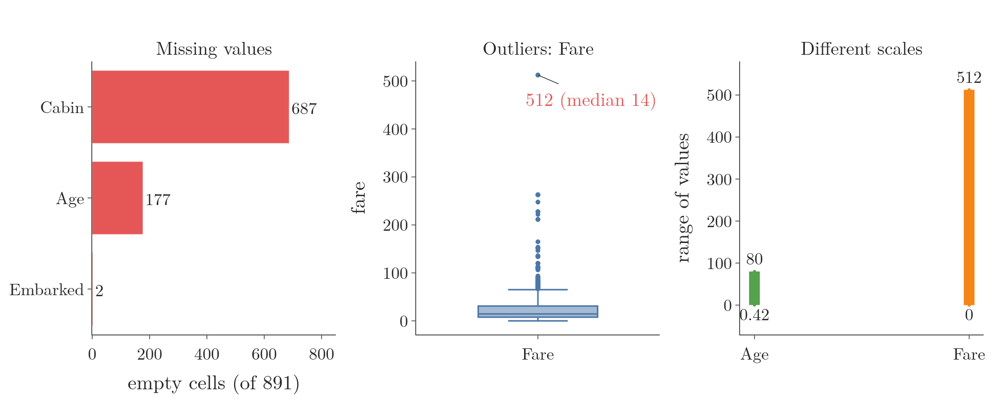

- **Left (missing values):** one bar per column that has empty cells; the length of the bar is the number of empty cells out of 891: `Cabin` 687, `Age` 177, `Embarked` 2.
- **Middle (outliers):** a **box plot** (G-329) of the fares. The box holds the middle half of the fares, and the line inside it is the median, 14. The whiskers reach the fares that are not far from the box, and each dot beyond them is a fare far from the rest (see [box plot](../../02-getting-data/ML-019-univariate-analysis/ML-019-univariate-analysis.md#8-box-plot)). The highest dot is 512.
- **Right (different scales):** each bar runs from a feature's smallest to its largest value: `Age` from 0.42 to 80, `Fare` from 0 to 512. Many algorithms compare observations by the distance between them (Section 5.2). In such a distance, the large `Fare` numbers would count far more than the `Age` numbers.

### 5.2 Common preprocessing tasks

> **Key point:** Remove duplicates, deal with missing values and outliers, and put features on similar scales.

- **Remove duplicates:** observations that appear more than once (**duplicate rows**, G-648).
- **Handle missing values** (G-1234): empty cells. In Figure 2, the empty age was filled with the median, 28.
- **Remove outliers** (G-1420): values far from the rest, such as the fare of 512 in Figure 5.
- **Scale values:** bring features to similar ranges. The standard term is **feature scaling** (G-767).

Scaling matters because many algorithms compute distances between observations, and a feature measured in crores (one crore is ten million rupees) would outweigh one in decimals (see [scaling the inputs](../ML-012-toy-project/ML-012-toy-project.md#7-scaling-the-inputs)). One common way to scale is **standardization** (G-1874), the step that turned the age 28 into -0.10 in Figure 2 (see [the standardization formula](../../03-feature-engineering/ML-023-standardization/ML-023-standardization.md#4-the-standardization-formula)).

The core idea of the whole stage: bring the data into a format the ML algorithm can easily consume.

> **Extra:** Removing rows is only one way to handle missing values; often we fill them in instead (**imputation**, G-927). Missing values, outliers and scaling are worked through in [why missing values must be handled](../../04-missing-data-and-outliers/ML-034-complete-case-analysis/ML-034-complete-case-analysis.md#2-why-missing-values-must-be-handled), [what an outlier is](../../04-missing-data-and-outliers/ML-040-what-are-outliers/ML-040-what-are-outliers.md#2-what-an-outlier-is) and [feature scaling](../../03-feature-engineering/ML-023-standardization/ML-023-standardization.md#2-feature-scaling-in-brief).

## 6. Exploratory data analysis (EDA)

> **Key point:** Before building a model, we study the data closely: what each feature looks like and how the features relate to the target.

### 6.1 What EDA is for

> **Key point:** We cannot build a good model on data we do not understand.

**Exploratory data analysis (EDA)** (G-732) is the stage where we analyse the data to find the relationships hidden in it, especially between the features and the target. We experiment with the data: plot graphs, look at numbers, test ideas. The aim is a concrete picture of the data in our mind, which makes every later decision easier.

### 6.2 What we do during EDA

> **Key point:** Visualise the data, study features one, two or several at a time, find outliers and check whether the classes are balanced.

- **Visualization:** plot graphs of the data.
- **Univariate analysis** (G-2050): study each feature on its own: its mean, its standard deviation, the shape of its distribution.
- **Bivariate analysis** (G-310): study two features together, to see the relationship between them.
- **Multivariate analysis** (G-1280): study three or more features together.
- **Outlier detection** (G-1419): find the values far from the rest.
- **Handling imbalanced data:** turn an imbalanced dataset into a balanced one.

Figure 6 runs three of these checks on the Titanic file.

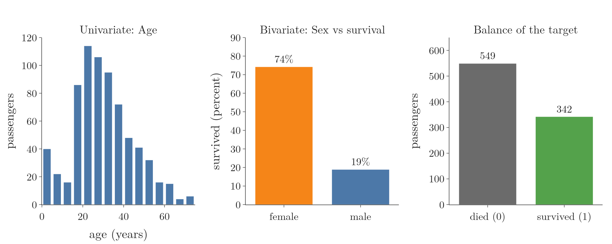

- **Left (univariate):** a **histogram** (G-899) of `Age`. Each bar counts the passengers whose known age falls in one 5-year range (see [histogram](../../02-getting-data/ML-019-univariate-analysis/ML-019-univariate-analysis.md#6-histogram)). Most passengers were between 20 and 40.
- **Middle (bivariate):** the share of each sex that survived. 74% of women survived against 19% of men, so Sex is clearly linked to the target.
- **Right (balance of the target):** the number of passengers in each class of the target, explained below.

A dataset is **imbalanced** (G-921) when one class has far more observations than another. For example, in a dog-versus-cat image classifier, we might have many cat images and very few dog images. A model trained on such data tends to favour the large class (He and Garcia 2009, §2), so we handle the imbalance at this stage.

In Figure 6 (right), 549 passengers died and 342 survived: about 62 percent against 38 percent. The two classes differ, but much less than in a typical imbalanced example such as 450 against 50 (see [what imbalanced data looks like](../../09-clustering-and-more/ML-127-imbalanced-data/ML-127-imbalanced-data.md#2-what-imbalanced-data-looks-like)).

> **Extra:** "Handling" imbalance usually means collecting more observations of the small class, creating extra copies or synthetic observations of it (oversampling), or dropping some observations of the large class (undersampling) (He and Garcia 2009, §3.1; see [random undersampling](../../09-clustering-and-more/ML-127-imbalanced-data/ML-127-imbalanced-data.md#5-random-undersampling)). Univariate, bivariate and multivariate analysis are worked through in [univariate analysis](../../02-getting-data/ML-019-univariate-analysis/ML-019-univariate-analysis.md#2-univariate-bivariate-and-multivariate-analysis) and [scatter plot: two numerical columns](../../02-getting-data/ML-020-bivariate-multivariate-analysis/ML-020-bivariate-multivariate-analysis.md#3-scatter-plot-two-numerical-columns).

### 6.3 Time spent on EDA pays back later

> **Key point:** The more time we spend understanding the data, the less effort every later stage takes.

An old saying goes: if we have six hours to cut down a tree, we should spend four of them sharpening the axe. EDA is the sharpening. Experienced practitioners spend a lot of time on it, because a good understanding of the data makes feature, model and testing decisions much easier.

## 7. Feature engineering and selection

> **Key point:** Features are the inputs. We create better ones (feature engineering) and keep only the useful ones (feature selection).

The **features** are the input variables, one column each in the data table. The target depends on the features, so the quality of the features largely decides the quality of the model.

### 7.1 Feature engineering

> **Key point:** We create new features, or change existing ones intelligently, to make the data easier to learn from.

**Feature engineering** (G-761) means creating new features from the existing ones, or making intelligent changes to existing features.

In Figure 2, the family-size cell is such a new feature: it is built from two existing columns. *Example: house prices.* Replacing the rooms and washrooms columns with one hand-made area column, as in [dimensionality reduction](../ML-003-types-of-ml/ML-003-types-of-ml.md#33-dimensionality-reduction), is **feature construction** (G-760; see [feature construction](../../03-feature-engineering/ML-022-what-is-feature-engineering/ML-022-what-is-feature-engineering.md#7-feature-construction)).

Feature engineering is one of the most important techniques in the whole workflow; its parts are listed in [the four parts of feature engineering](../../03-feature-engineering/ML-022-what-is-feature-engineering/ML-022-what-is-feature-engineering.md#5-the-four-parts-of-feature-engineering).

### 7.2 Feature selection

> **Key point:** We drop features that do not affect the output, because they add nothing and slow training down.

Some datasets have 100 or 200 features. We do not keep them all, for two reasons:

1. **Many features do not help.** Not every feature affects the target. We find the ones that do not and remove them.
2. **Fewer features train faster.** The more features there are, the longer training takes.

Choosing which features to keep is called **feature selection** (G-768; see [feature selection](../../03-feature-engineering/ML-022-what-is-feature-engineering/ML-022-what-is-feature-engineering.md#8-feature-selection)).

## 8. Model training, evaluation and selection

> **Key point:** We train several algorithms, measure each with a performance metric, pick the best, tune it, and often combine several models into one.

Once the data is clean and the features are good, we are ready to train. Figure 7 shows the four steps of this stage.

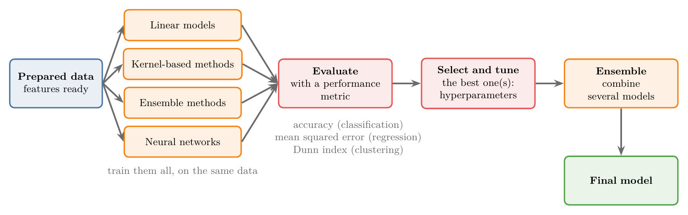

### 8.1 Training many algorithms

> **Key point:** We cannot know in advance which algorithm suits our data, so we train several and compare.

In practice, nobody trains just one algorithm. Some algorithms are known to suit some kinds of data: **Naive Bayes** (G-1297), a classifier that scores each class with probabilities built from counts such as word counts (see [the method on one picture](../../07-classification/ML-081-naive-bayes-intuition/ML-081-naive-bayes-intuition.md#2-the-method-on-one-picture)), performs very well on text. But another algorithm may do just as well or better on our particular data, and we only find out by trying.

So we train algorithms from different families on the same data:

- **linear models:** a weighted sum of the features, like the score in Section 1.1;
- **kernel-based methods:** models such as the support vector machine that lift the data into more dimensions, where a straight boundary can split it (see [the kernel trick](../../07-classification/ML-089-kernel-trick-intuition/ML-089-kernel-trick-intuition.md#3-the-kernel-trick));
- **ensemble methods:** many models combined into one (Section 8.4);
- **neural networks** (G-1316): layers of simple connected units, loosely inspired by neurons in the brain (see [neural networks](../ML-002-ai-vs-ml-vs-dl/ML-002-ai-vs-ml-vs-dl.md#51-neural-networks)).

Then we gather all the results to decide which model to use. **Model training** (G-1255) means giving the data to an algorithm so that it learns the pattern.

### 8.2 Evaluation with performance metrics

> **Key point:** A performance metric is a number that tells us how well a model works. Each kind of problem has its own metrics.

In the **evaluation** step, we measure every trained model with **performance metrics** (G-1215): numbers that tell us how well a model is working. They let us decide which model performs best. Common examples:

| Problem | Example metric |
|---|---|
| Classification | Accuracy (G-162) |
| Regression | Mean squared error (G-1201) |
| Clustering | Dunn index |

> **Extra:** *Accuracy* is the share of predictions that are correct. *Mean squared error* is the average of the squared differences between the predicted and the true values, so smaller is better. The *Dunn index* is the smallest distance between two clusters divided by the largest size (diameter) of any cluster, so it is higher when clusters are tight and far apart from each other (Dunn 1974). Accuracy and mean squared error are worked through in [accuracy](../../07-classification/ML-075-accuracy-confusion-matrix/ML-075-accuracy-confusion-matrix.md#21-the-idea) and [mean squared error](../../06-regression/ML-051-regression-metrics/ML-051-regression-metrics.md#3-mean-squared-error-mse). One tiny number for each, made up for illustration:

- *Accuracy:* 8 correct predictions out of 10.

  $$8 / 10 = 0.8$$

- *Mean squared error:* true values 3 and 5, predictions 2 and 7. The differences are $-1$ and $2$, and their squares are 1 and 4. The average:

  $$(1 + 4)/2 = 2.5$$

- *Dunn index:* the closest two clusters are 6 apart and the widest cluster has a diameter of 2.

  $$6 / 2 = 3$$

### 8.3 Model selection and hyperparameter tuning

> **Key point:** We pick the best one or few algorithms and adjust their settings to get even better performance.

In **model selection** (G-1254), we pick one or several of the best algorithms. Every algorithm has settings that we choose before training. Adjusting them to get the best performance is called **hyperparameter tuning** (G-909).

Hyperparameter tuning is like adjusting a TV for a late-night movie: we change the picture mode and the sound mode and turn the volume up a little. Each setting is like one hyperparameter: we change the settings one by one and keep the combination that gives the best picture. For a model, "best" means the best score on the performance metric.

> **Extra:** In everyday speech these settings are often called "parameters". Strictly, the settings we choose before training are **hyperparameters** (G-910), while **parameters** (G-1450) are the values the model learns from the data during training (for example, the slope of a line) (Goodfellow et al. 2016, §5.3). Tuning methods are worked through in [grid search over a random forest](../../08-trees-and-ensembles/ML-106-random-forest-tuning/ML-106-random-forest-tuning.md#6-grid-search-over-a-random-forest) and [randomized search](../../08-trees-and-ensembles/ML-106-random-forest-tuning/ML-106-random-forest-tuning.md#7-randomized-search).

### 8.4 Ensemble learning

> **Key point:** Combining several models into one usually gives a stronger model than any of them alone.

**Ensemble learning** (G-689) connects several ML models to make one new, more powerful model. The main techniques are:

- **bagging** (G-251): copies of one kind of model, each trained on a different random sample of the data, vote or average (see [bagging](../../08-trees-and-ensembles/ML-095-ensemble-learning/ML-095-ensemble-learning.md#43-bagging));
- **boosting** (G-318): models trained one after another, each one focusing on the mistakes of the ones before (see [boosting](../../08-trees-and-ensembles/ML-095-ensemble-learning/ML-095-ensemble-learning.md#44-boosting));
- **stacking** (G-1866): a final model learns how to combine the other models' predictions (see [stacking](../../08-trees-and-ensembles/ML-095-ensemble-learning/ML-095-ensemble-learning.md#42-stacking));
- **cascading:** models in a chain, where each later model only sees the cases that the earlier ones passed on (Viola and Jones 2001).

They differ in how the models are combined, but the core idea is the same: many models together make one strong model. Using an ensemble usually improves performance (Dietterich 2000), so it is a step we almost always take.

The full routine of this stage:

1. train many models;
2. evaluate them all;
3. tune their hyperparameters;
4. apply ensemble learning.

The result is one strong final model.

## 9. Model deployment

> **Key point:** A trained model is not yet a product. We save it to a file, wrap it in an API, and put it on a server so users can reach it.

### 9.1 From model to software

> **Key point:** Users never see the model; they see a website or an app that uses it.

Once we have a model that can make predictions, the main work is only beginning. We must turn it into software that people can use: a website, a mobile app or a desktop app. **Model deployment** (G-592) means putting the model on a server so that it can answer users' requests.

### 9.2 How a deployed model answers a request

> **Key point:** User input travels from the website to an API, the saved model makes a prediction, and the answer comes back as JSON.

Figure 8 shows the usual setup.

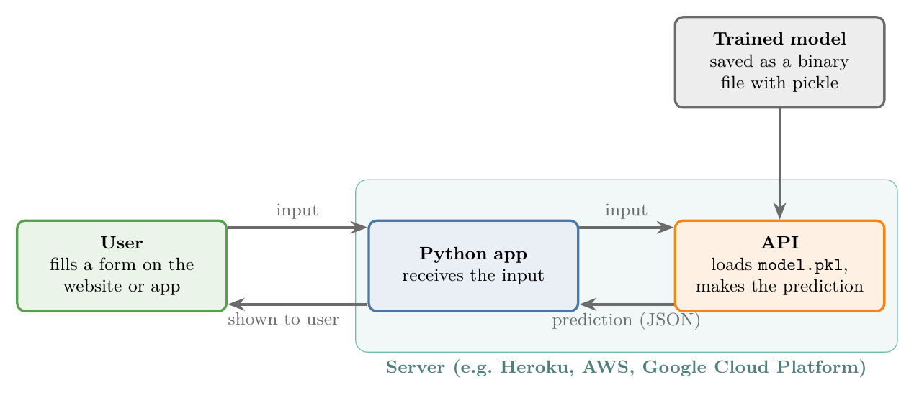

1. **Save the model.** We save the trained model as a **binary file** (G-305) (a file that is not plain text). A common tool for this in Python is **pickle** (G-1494).
2. **Wrap it in an API.** An **API** (G-204) here is a web address (URL) that, when given the right inputs, sends back an answer in JSON format. The API loads the saved model file.
3. **Answer a request.** The user enters values in a form on the website. The website passes them to a Python app on the server, which sends them to the API. The model makes a prediction, and the API returns it as JSON, which the app shows to the user.

The server itself is rented from a cloud provider such as Heroku, AWS (Amazon Web Services) or GCP (Google Cloud Platform). Once deployed, the model is online and serving users' requests. The first step, saving a trained model with pickle, is worked through in [deploying the model](../ML-012-toy-project/ML-012-toy-project.md#10-deploying-the-model).

> **Extra:** **JSON** (JavaScript Object Notation) is a plain-text format for structured data, for example `{"prediction": "placed"}`. Pickle files should only be loaded from trusted sources, because loading a pickle can run code (Python docs, `pickle`).

## 10. Testing

> **Key point:** We first release the new model to a small group of trusted users, compare it with the old version, and only then decide whether it works.

### 10.1 Beta testing

> **Key point:** A new version goes to a small group of loyal users first, and their feedback decides what happens next.

Software updates rarely reach all users at once; they roll out gradually. **Beta testing** (G-282) works the same way: we release the new model to a set of trusted, loyal customers who are likely to give good feedback, and collect that feedback.

### 10.2 A/B testing

> **Key point:** A/B testing is a well-known way to check whether the new model really performs well.

The plain idea: show the old model to half of the users and the new model to the other half, at the same time, and see which half does better. The standard name is **A/B testing** (G-157). After it, we decide whether the model we just built is working properly.

The mechanism, step by step (Kohavi et al. 2020, Ch. 1):

1. **Split the users at random** into two groups. Group A keeps the current model and group B gets the new one.
2. **Pick one measure that matters to the business**, such as the **conversion rate** (G-474): the share of visitors who buy.
3. **Run both groups over the same days** and count.
4. **Compare the two rates.** Because the groups are random, a clear difference can be put down to the new model.

Figure 9 runs these steps on simulated visitors (made-up numbers, built only to show the method). Each day, 1,000 new visitors are split at random. A visitor of group A buys with probability 0.10 and a visitor of group B with probability 0.12. Watch the dots and the lines: the dots (one day only) jump about, and on day 5 group A's dot even sits level with group B's. The lines (all days so far) settle and stay apart.

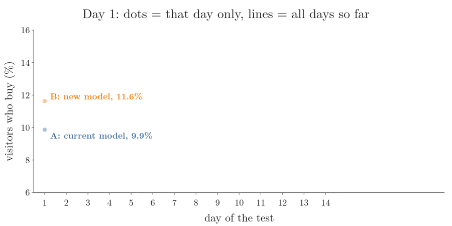

After 14 days, group A has 713 buyers among 7,012 visitors (10.2%) and group B has 838 among 6,988 (12.0%). One day alone could mislead; the two weeks together show the new model ahead.

### 10.3 When testing fails: going back

> **Key point:** If the test goes badly, we return to the stage that caused the problem and redo the stages after it.

A problem can come from any earlier stage:

- the data was bad,
- preprocessing was not done properly,
- the feature selection was poor,
- the chosen algorithm has issues.

So we go back to that stage and redo the work from there. If the feedback is good, we move forward to the last stage. Figure 10 shows one pass through the cycle, a loop back after a failed test, and the retraining loop from section 11.

## 11. Optimizing

> **Key point:** We launch the model for all users and set up everything that keeps it fast, safe and up to date: backups, rollback, load balancing and automatic retraining.

### 11.1 Launching at scale

> **Key point:** Before the full launch, we protect the model and make sure the server can handle all users.

In the last stage, we launch the model on the server for all customers. Before that, we take several steps:

- **Back up the model** and **back up the data**.
- **Set up rollback** (G-1703): if the live model breaks or something goes wrong, we automatically return to the last working version and put it live again.
- **Set up load balancing** (G-1107): spread incoming requests across servers, so that many users at once are still served quickly.

Figure 11 places these safeguards around the live model, together with the retraining of Section 11.2. Watch the red path: when the live model breaks, the backup goes live.

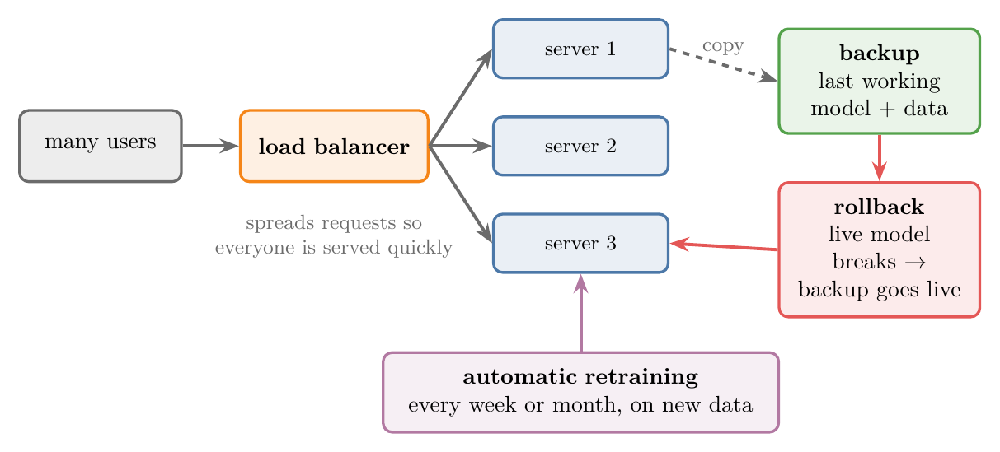

### 11.2 Model drift and retraining

> **Key point:** As the world changes, a model's performance slowly gets worse, so we retrain it on new data at a fixed, automated schedule.

If a model is never retrained, its performance gets worse as the real-world data evolves away from its old training data. This slow decline is called **model drift** (G-1253), sometimes called model rot (see [models go stale](../ML-004-batch-learning/ML-004-batch-learning.md#41-models-go-stale)).

*Example: a mask detection system.* The system checks whether a person in front of a camera is wearing a mask. Then new kinds of masks appear, for example one whose lower half is printed to look exactly like a face. Our classifier will fail on these, so we need new data and must train the model again.

So we decide how often to **retrain** (G-1689), for example weekly or monthly. The retraining must be automated: we cannot repeat the whole process by hand every week.

### 11.3 Cutting extra cost

> **Key point:** We look for every place where the process costs more than it needs to, and fix it.

Optimizing also means going through the whole process and removing extra expense wherever we find it, until the process runs smoothly.

> **Extra:** Watching a live model's performance so that we notice drift early is called **monitoring**. The practice of running and maintaining live models is called **MLOps** (G-1244) (Kreuzberger et al. 2023).

## 12. The life cycle and the Pipeline map

> **Key point:** The Course map's Pipeline map follows this life cycle but splits it into finer steps. Most stages match one step; a few differ.

The Pipeline map in the Course map uses 14 steps, based on these nine stages. Figure 12 and the table show how they line up.

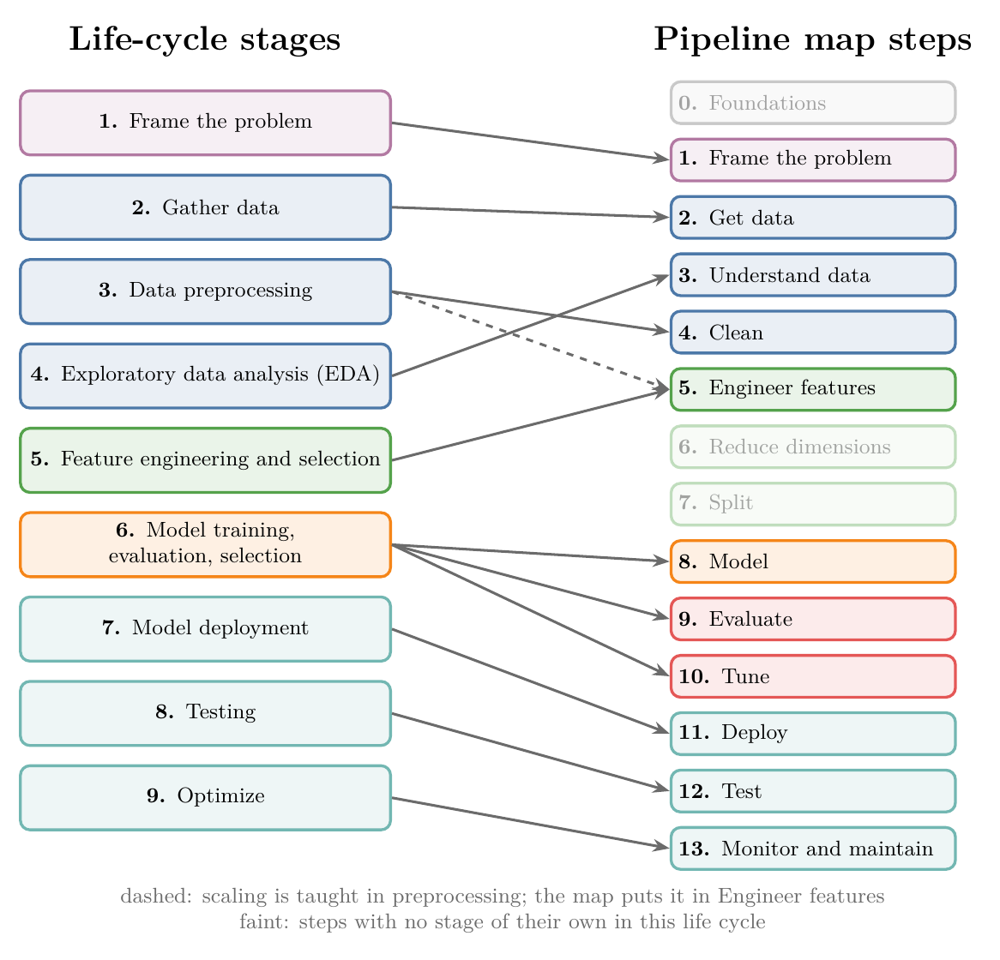{height=60%}

| Life-cycle stage | Pipeline map step(s) |
|---|---|
| 1. Framing the problem | 1 Frame the problem |
| 2. Gathering data | 2 Get data |
| 3. Data preprocessing | 4 Clean (scaling: 5 Engineer features) |
| 4. Exploratory data analysis | 3 Understand data |
| 5. Feature engineering and selection | 5 Engineer features |
| 6. Model training, evaluation and selection | 8 Model, 9 Evaluate, 10 Tune |
| 7. Model deployment | 11 Deploy |
| 8. Testing | 12 Test |
| 9. Optimizing | 13 Monitor and maintain |

Where the two differ:

- **Order of cleaning and EDA.** Here preprocessing comes before EDA. The Pipeline map puts Understand data (3) before Clean (4), with a loop arrow between them. Outlier detection appears in both stages here, which shows the same back-and-forth.
- **Scaling.** Here scaling is part of preprocessing. The Pipeline map puts it under Engineer features (5), with the other column transformations.
- **One stage, three steps.** Stage 6 covers training, evaluation and selection with tuning. The Pipeline map splits it into Model (8), Evaluate (9) and Tune (10). Ensemble learning sits in Model (8) on the map, because ensembles are algorithms in their own right.
- **Steps with no stage of their own.** Foundations (0), Reduce dimensions (6) and Split (7) are not stages here. Foundations holds background ideas rather than project work. Splitting the data into training and test sets is shown in [split before scaling](../../03-feature-engineering/ML-023-standardization/ML-023-standardization.md#62-split-before-scaling), and reducing the number of dimensions in [the solution: dimensionality reduction](../../05-dimensionality/ML-045-curse-of-dimensionality/ML-045-curse-of-dimensionality.md#6-the-solution-dimensionality-reduction).
- **Optimizing versus Monitor and maintain.** The optimizing stage covers backups, rollback, load balancing, retraining and cost. The map's step 13 groups the same work under a name that stresses watching the live model.

## 13. Summary

| # | Stage | What we do | Main question | Why it matters |
|--|----------|----------------|-----------|-----------|
| 1 | Framing the problem | Decide goal, customers, cost, team, type of ML, data source | What exactly are we building? | every change of direction later costs money |
| 2 | Gathering data | Fetch from CSV, API, scraping, warehouse (ETL), clusters | Where is the data? | company data is rarely ready-made |
| 3 | Data preprocessing | Remove duplicates, handle missing values and outliers, scale | Can an algorithm use this data? | dirty data gives poor results |
| 4 | EDA | Visualise; univariate, bivariate, multivariate analysis; outliers; imbalance | What is in the data? | understanding the data makes every later decision easier |
| 5 | Feature engineering and selection | Create better features; drop useless ones | Which inputs should the model see? | useless features add nothing and slow training down |
| 6 | Training, evaluation, selection | Train many algorithms; compare with metrics; tune; ensemble | Which model is best? | we cannot know in advance which algorithm suits the data |
| 7 | Deployment | Save with pickle; wrap in an API; host on a server | How do users reach the model? | users never see the model, only the app that uses it |
| 8 | Testing | Beta testing, A/B testing; go back if it fails | Does it work for real users? | random groups let a clear difference be put down to the new model |
| 9 | Optimizing | Backup, rollback, load balancing, scheduled retraining | How do we keep it healthy at scale? | a live model can break, get overloaded or drift |

- The MLDLC guides us **from idea to product**; training a model is only one stage of nine, because a model is useful only once it becomes a product that real users can use.
- Stage 1 comes first; stages 2 to 9 form a **cycle**, because live models drift and must be retrained on new data.
- A failed test sends us **back** to the stage that caused the problem, because the cause can sit in any earlier stage: the data, the preprocessing, the features or the algorithm.
- Sources count the stages differently, because ML is a young field and the MLDLC is not strictly defined; the core idea stays the same.

## 14. Sources

**Built from**

- CampusX, "Machine Learning Development Life Cycle | MLDLC in Data Science", YouTube, https://www.youtube.com/watch?v=iDbhQGz_rEo

**Other references**

- Dietterich, T. (2000). Ensemble Methods in Machine Learning. *Multiple Classifier Systems*, LNCS 1857. Springer.
- Dunn, J. (1974). Well-Separated Clusters and Optimal Fuzzy Partitions. *Journal of Cybernetics* 4(1).
- Goodfellow, I., Bengio, Y. and Courville, A. (2016). *Deep Learning*. MIT Press.
- He, H. and Garcia, E. (2009). Learning from Imbalanced Data. *IEEE Transactions on Knowledge and Data Engineering* 21(9).
- Kohavi, R., Tang, D. and Xu, Y. (2020). *Trustworthy Online Controlled Experiments*. Cambridge University Press.
- Kreuzberger, D., Kühl, N. and Hirschl, S. (2023). Machine Learning Operations (MLOps): Overview, Definition, and Architecture. *IEEE Access* 11.
- Python Software Foundation. `pickle`: Python object serialization. Python 3 documentation.
- Viola, P. and Jones, M. (2001). Rapid Object Detection using a Boosted Cascade of Simple Features. *CVPR 2001*.
- Zaharia, M. et al. (2016). Apache Spark: A Unified Engine for Big Data Processing. *Communications of the ACM* 59(11).

## 15. Key terms

| Term | Meaning |
|----------|-------------------|
| SDLC | Software development life cycle: the standard process for building ordinary software |
| MLDLC | Machine learning development life cycle: the guidelines for building an ML product from idea to product |
| End-to-end product | A complete product, from raw data to software that users use |
| Framing the problem (G-802) | Deciding the goal, users, cost, team and approach before any work starts |
| Data warehouse | A separate store of copied company data, safe to analyse without touching the live database |
| ETL | Extract, transform, load: copying data from source systems into a warehouse |
| Dirty data | Data with errors, gaps, duplicates or inconsistencies |
| Data preprocessing (G-539) | Changes made to the data before training, so an algorithm can use it |
| Exploratory data analysis (EDA) | Studying the data with graphs and summaries to find its patterns |
| Observation | One record: one row of the data table |
| Feature | An input variable: one column of the data table |
| Target | The output we want to predict |
| Univariate analysis | Studying one feature on its own |
| Bivariate analysis | Studying the relationship between two features |
| Multivariate analysis | Studying three or more features together |
| Imbalanced data | Data where one class has far more observations than another |
| Feature engineering | Creating new features, or changing existing ones, to help the model |
| Model training (G-1255) | Giving data to an algorithm so it learns the pattern |
| Performance metric (G-1215) | A number that measures how well a model works |
| Model selection | Choosing the best one or few algorithms after evaluation |
| Hyperparameter tuning | Adjusting an algorithm's settings for the best performance |
| Ensemble learning | Combining several models into one stronger model |
| Model deployment (G-592) | Putting a model on a server so users can reach it |
| Binary file | A file that is not plain text, such as a saved model |
| Pickle | A Python tool for saving a model (or any object) to a file |
| JSON (G-987) | A plain-text format for structured data, used by APIs |
| Beta testing | Releasing a new version to a small group of trusted users first |
| A/B testing | Comparing an old and a new version on two random groups of users |
| Conversion rate | The share of people reached who become customers |
| Feature scaling (G-767) | Putting features on the same scale, so no feature dominates distances |
| Feature selection | Keeping only the useful features and dropping the rest |
| Imputation | Filling in missing values, for example with the mean or median |
| Rollback | Returning automatically to the last working version when something breaks |
| Load balancing | Spreading requests across servers so all users are served quickly |
