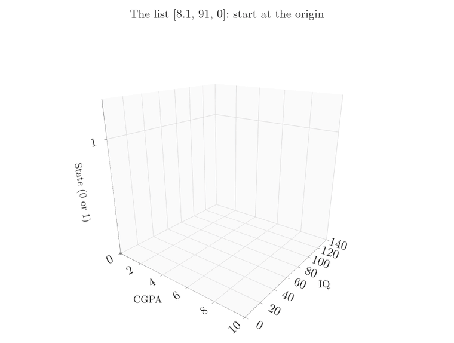
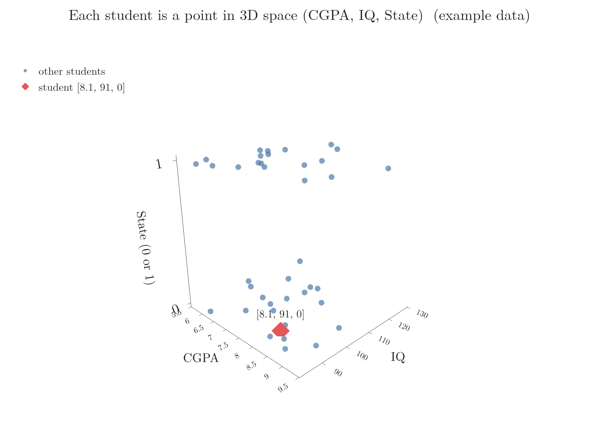
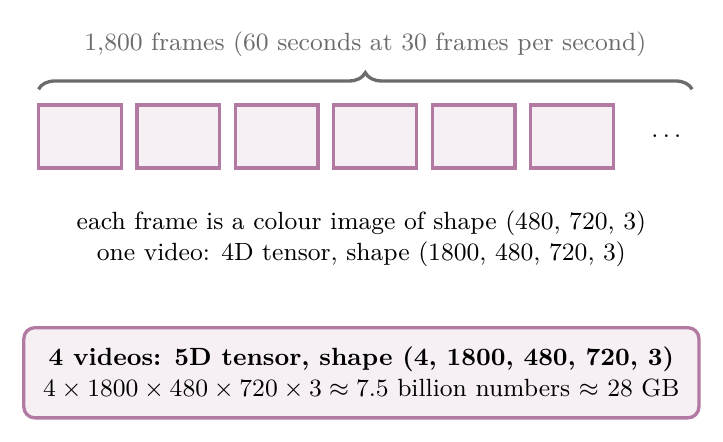

<!-- where-this-fits: generated by course_map/build_map.py; edit concepts.yaml, not this block -->
> **Where this fits:** Pipeline map step 0 (Foundations). See the [Course map](../../../00-course-map/00-course-map.md).
>
> 
>
> - **Builds on:** [Machine learning](../../../ML/01-foundations/ML-001-what-is-ml/ML-001-what-is-ml.md#2-defining-machine-learning); [Vectors and feature vectors](../../../MA/05-linear-algebra/MA-048-vectors-and-feature-vectors/MA-048-vectors-and-feature-vectors.md#2-what-a-vector-is).
<!-- /where-this-fits -->

## 1. Overview

> **Key point:** A tensor is a container for numbers, organised along one or more axes. All ML data, from tables to videos, is stored as tensors.


Every ML library, such as scikit-learn, TensorFlow and PyTorch, stores data in the same basic structure: the **tensor**. The tensor is so central that Google's deep learning library, TensorFlow, is named after it.


Figure 1 shows the whole family. The rest of this Note explains each one and where it appears in real data.

## 2. What a tensor is

> **Key point:** Scalars, vectors and matrices are all tensors; "tensor" is the general name for any number of dimensions.

A **tensor** (G-1957) is a data structure: a container that stores numbers. (A tensor can store text too, but in ML it almost always holds numbers.)

We have met tensors before under other names:

- a single number is a **scalar** (G-1743),
- a list of numbers is a **vector** (G-2081),
- a table of numbers is a **matrix** (G-1180).

But what do we call a stack of matrices, or a stack of those? Rather than inventing a new name for every case, mathematics and physics use one general term for all of them: tensor.

> **Extra:** Programmers know tensors as **arrays** (G-214): a 1D array is a list, a 2D array a list of lists, and so on. In NumPy, the main Python library for numbers, every tensor is an array, called an `ndarray` (NumPy docs, "The N-dimensional array").

## 3. Tensors from 0D to 5D

> **Key point:** A tensor of one dimension higher is a collection of tensors of the dimension below.

### 3.1 Scalars, vectors and matrices

> **Key point:** 0D = one number, 1D = a list, 2D = a table.

- **0D tensor (scalar):** a single number, e.g. 4.
- **1D tensor (vector):** a list of numbers, e.g. [1, 2, 3, 4].
- **2D tensor (matrix):** rows and columns of numbers, e.g. [[1, 2, 3], [4, 5, 6]].

> **Python:** Creating tensors in NumPy.
>
> ```python
> import numpy as np
>
> scalar = np.array(4)                       # 0D
> vector = np.array([1, 2, 3, 4])            # 1D
> matrix = np.array([[1, 2, 3], [4, 5, 6]])  # 2D
>
> print(matrix.ndim)    # 2: number of axes
> print(matrix.shape)   # (2, 3): items along each axis
> print(matrix.size)    # 6: total items
> ```
>
> `np.array(...)` turns numbers or nested lists into a tensor. `ndim`, `shape` and `size` are explained in Section 4.

### 3.2 Each tensor is built from the one below

> **Key point:** Stack scalars to get a vector, vectors to get a matrix, matrices to get a 3D tensor, and so on.


Figure 2 shows the pattern that runs through all tensors:

1. Line up scalars: a vector (1D).
2. Stack vectors: a matrix (2D).
3. Stack matrices: a 3D tensor.
4. Line up 3D tensors: a 4D tensor.

The pattern never stops: a 5D tensor is a collection of 4D tensors, and so on.

### 3.3 Higher dimensions

> **Key point:** We cannot picture 4D or 5D directly, but we can always picture them as collections of 3D tensors.

- **3D tensor:** several matrices stacked one behind another, like a cube of numbers.
- **4D tensor:** a list of 3D tensors, like several cubes in a row.
- **5D tensor:** a list of 4D tensors, like several rows of cubes.

In ML, we almost always work with tensors from 0D to 5D. Section 6 shows a real example of each.

## 4. Rank, axes, shape and size

> **Key point:** Rank = number of axes; shape = items along each axis; size = total items.

Four words describe any tensor (Figure 3):


- An **axis** (G-242) is one direction along which the numbers are arranged. A matrix has two: down the rows (axis 0) and across the columns (axis 1).
- The **rank** (G-1629) is the number of axes. The rank is the same as the number of dimensions of the tensor, and NumPy calls it `ndim`. Scalar: 0, vector: 1, matrix: 2.
- The **shape** (G-1787) lists how many items lie along each axis. The matrix in Figure 3 has shape (2, 3): 2 rows and 3 columns.
- The **size** (G-1816) is the total number of items in the tensor.

**Size**, step by step:

1. **In words:** multiply together all the numbers in the shape.
2. **Formula:** for a tensor of shape $(n_1, n_2, \ldots, n_k)$:
   $$\text{size} = n_1 \times n_2 \times \cdots \times n_k$$
3. **Example:** shape (2, 3):
   $$2 \times 3 = 6 \text{ items}$$
   Shape (3, 2, 4):
   $$3 \times 2 \times 4 = 24 \text{ items}$$

A scalar has shape () and size 1. A vector of 4 numbers has shape (4,) and size 4.

## 5. A 1D tensor can be a 3-dimensional vector

> **Key point:** "Dimensions of a tensor" = number of axes. "Dimensions of a vector" = number of items in it. They are different things.

The word *dimension* is used in two different ways, and mixing them up is a common source of confusion.

- **Dimensions of a tensor:** the number of axes. [1, 2, 3, 4] has one axis, so it is a 1D tensor.
- **Dimensions of a vector:** the number of items in it. [1, 2, 3, 4] has four items, so it is a 4-dimensional vector.

Both statements are true at the same time: [1, 2, 3, 4] is a 1D tensor and a 4-dimensional vector.

*Example: one student.* A student with CGPA 8.1, IQ 91 and state code 0 is described by [8.1, 91, 0]. The state is a name, West Bengal or Karnataka, so we write it as a number first: 0 for West Bengal, 1 for Karnataka. Replacing categories with numbers like this is **label encoding** (see [ordinal and label encoding](../../03-feature-engineering/ML-025-ordinal-label-encoding/ML-025-ordinal-label-encoding.md#4-ordinal-encoding-versus-label-encoding)). Each of the three numbers is a **feature** (G-772; an input variable, one column of the data table). The list [8.1, 91, 0] is also a place in space. Give each feature its own axis: CGPA, IQ and state. Then read the list as walking instructions from the origin (the point where all three axes are 0):

1. The first number says how far to walk along the CGPA axis: 8.1.
2. The second number says how far to walk along the IQ axis: 91.
3. The third number says how far to walk along the state axis: 0.



In Figure 4, watch the dashed walk for [8.1, 91, 0] end at one point, and the arrow drawn from the origin to that point. A second student, [6.2, 120, 1], walks to a different point. The translation works both ways: every list of three numbers gives exactly one point, and every point gives back exactly one list (idea after 3Blue1Brown, "Vectors"). A list read in this way, as a point or arrow in space, is a **vector** (G-2081), and three axes are needed to draw it, so [8.1, 91, 0] is a 3-dimensional vector. The list still has only one axis of its own, so the student is still a 1D tensor.

Figure 5 shows 40 example students drawn the same way, each one a point.



With 50 features, each student would be a 50-dimensional vector, and still a 1D tensor.

## 6. Tensors in real ML data

> **Key point:** Tables are 2D, text and time series are 3D, images are 4D, and videos are 5D.

### 6.1 1D and 2D: tabular data

> **Key point:** One observation's features form a 1D tensor; the whole table of features is a 2D tensor.

Most ML data starts as a table (Figure 6). Each student is an **observation** (G-1374; one record, one row of the table). Suppose we have 1,000 students with three features (CGPA, IQ, state) and a **target** (G-1949), the output we predict (placed or not):


- **One student's features:** [8.1, 91, 0], a 1D tensor of shape (3,).
- **All students' features:** a 2D tensor of shape (1000, 3). The matrix is a collection of 1,000 rows, each a 1D tensor.
- **The target column:** a 1D tensor of shape (1000,).

Whenever we work with tabular data, we are working with 1D and 2D tensors.

> **Extra:** The table of all features is usually called **X**, and the target column **y** (G-2129; scikit-learn Glossary). You will see these names in almost all ML code.

### 6.2 3D: text

> **Key point:** Each word becomes a vector, each sentence a matrix, and a set of sentences a 3D tensor.

ML algorithms work only with numbers, so text must be turned into numbers first. Converting text into vectors is called **vectorization** (G-2084).

One simple method is **one-hot encoding** (G-1379; see [how one-hot encoding works](../../03-feature-engineering/ML-026-one-hot-encoding/ML-026-one-hot-encoding.md#2-how-one-hot-encoding-works), where it is applied to categorical columns):

1. List every unique word: the **vocabulary** (G-2092). For "Hi Riya", "Hi Rahul" and "Hi Ankit", it is: hi, riya, rahul, ankit.
2. Give each word a vector with a 1 in its own position and 0 everywhere else: hi = [1, 0, 0, 0], riya = [0, 1, 0, 0], and so on.
3. Each sentence becomes a matrix with one row per word. "Hi Rahul" has 2 words, so its shape is (2, 4).


All three sentences together form a 3D tensor of shape (3, 2, 4), with size 24 (Figure 7).

### 6.3 3D: time series

> **Key point:** Measurements taken at regular times stack into a 3D tensor, with one axis for time.

A **time series** (G-1975) is data recorded at regular intervals, such as a stock's price every day.


Figure 8 builds it up:

- **One year:** the daily high and low prices for 365 days form a 2D tensor of shape (365, 2).
- **Ten years:** ten of those yearly tables stacked together form a 3D tensor of shape (10, 365, 2).

The middle axis here is the **time axis**. Much medical and sensor data has this same form.

### 6.4 4D: images

> **Key point:** One colour image is a 3D tensor; a batch of images is a 4D tensor.

An image is a grid of tiny dots called **pixels** (G-1501), and each pixel is stored as numbers.

- **Black and white:** one number per pixel, so the image is a 2D tensor (height x width).
- **Colour:** each pixel has three numbers, for red, green and blue. These form three layers called **channels** (G-375), so a colour image is a 3D tensor of shape (height, width, 3).


A colour image 600 pixels high and 800 wide has shape (600, 800, 3). A batch of 32 such images (a group handled together) is a 4D tensor of shape (32, 600, 800, 3) (Figure 9). Image tasks in deep learning, covered in later Notes, work with exactly these tensors.

> **Extra:** The order of the axes is a convention. TensorFlow usually puts the channels last, (batch, height, width, channels), while PyTorch puts them first, (batch, channels, height, width) (TensorFlow docs, `Conv2D`; PyTorch docs, `Conv2d`). Always check which order a library expects.

### 6.5 5D: video

> **Key point:** A video is a sequence of images, so a batch of videos is a 5D tensor, and an enormous one.

A video is a series of images, called **frames** (G-801), shown quickly one after another. Our eyes can tell apart only about 12 separate images per second, so faster sequences look like smooth motion. Videos are usually recorded at 30, 60 or 120 frames per second.

Take 4 videos, each 60 seconds long at 30 frames per second, with frames of 480 x 720 pixels in colour (Figure 10):



- **One frame:** a 3D tensor of shape (480, 720, 3).
- **One video:** 60 seconds at 30 frames per second gives 1800 frames:
  $$60 \times 30 = 1800$$
  So a video is a 4D tensor of shape (1800, 480, 720, 3).
- **Four videos:** a 5D tensor of shape (4, 1800, 480, 720, 3).

**Storage**, step by step:

1. **In words:** count the numbers in the tensor, then multiply by the bytes each number takes. A common format stores each number in 32 bits (a bit is one 0-or-1 digit), which is 4 bytes (8 bits make a byte).
2. **Formula:**
   $$\text{storage (bytes)} = \text{size} \times 4$$
3. **Example:** the size of the four-video tensor:
   $$4 \times 1800 \times 480 \times 720 \times 3$$
   $$= 7{,}464{,}960{,}000 \text{ numbers}$$
   The storage:
   $$7{,}464{,}960{,}000 \times 4$$
   $$= 29{,}859{,}840{,}000 \text{ bytes}$$
   That is about 30 billion bytes.

One gigabyte (GB) is $1024^3$ bytes, so in gigabytes:

$$29{,}859{,}840{,}000 / 1024^3$$

$$\approx 27.8 \text{ GB}$$

Four one-minute videos need about 28 GB when stored raw. Such huge sizes are why video formats such as MPEG and MP4 **compress** the data (**compression**, G-433): they throw away detail the eye barely notices and avoid storing again what stays the same from one frame to the next (Le Gall 1991). At the bit rate YouTube recommends for 480p, 2.5 million bits per second (YouTube Help), one minute of video takes:

$$2{,}500{,}000 \times 60 / 8$$

$$= 18{,}750{,}000 \text{ bytes} \approx 19 \text{ MB}$$

One raw video is a quarter of the four-video total, about 7.5 billion bytes, so compression stores it in about 400 times less space:

$$7{,}464{,}960{,}000 / 18{,}750{,}000 \approx 400$$

The Notebook for this Note (`ML-010-tensors.ipynb`) builds every tensor in this Note in NumPy: from a scalar to a real photo (shape (427, 640, 3)) and the video storage calculation.

## 7. Summary

| Rank | Name | Example in ML | Example shape |
|---|---|---|---|
| 0D | Scalar | One number | () |
| 1D | Vector | One student's features; a target column | (3,); (1000,) |
| 2D | Matrix | A table of features | (1000, 3) |
| 3D | 3D tensor | Sentences; time series; one colour image | (3, 2, 4); (10, 365, 2); (600, 800, 3) |
| 4D | 4D tensor | A batch of colour images | (32, 600, 800, 3) |
| 5D | 5D tensor | A batch of videos | (4, 1800, 480, 720, 3) |

- A tensor is a container for numbers; scalars, vectors and matrices are all tensors, so one name covers all ML data, from tables to videos.
- Each tensor is a collection of tensors one dimension lower, so a 4D or 5D tensor, which we cannot picture directly, can be pictured as a collection of 3D tensors.
- Rank = number of axes (`ndim`); shape = items per axis; size = product of the shape. So the shape tells at once how much data a tensor holds: four one-minute raw videos need about 28 GB, which is why video is compressed.
- A 1D tensor with *n* items is an *n*-dimensional vector: two different meanings of "dimension". So always ask which meaning is used: a student with 50 features is a 50-dimensional vector and still a 1D tensor.

## 8. Sources

**Built from**

- CampusX, "What are Tensors | Tensor In-depth Explanation | Tensor in Machine Learning", YouTube, https://www.youtube.com/watch?v=vVhD2EyS41Y
- Sanderson, G. (3Blue1Brown), "Vectors | Chapter 1, Essence of linear algebra", YouTube, https://www.youtube.com/watch?v=fNk_zzaMoSs

**Other references**

- Le Gall, D. (1991). MPEG: A Video Compression Standard for Multimedia Applications. *Communications of the ACM* 34(4).
- NumPy documentation. The N-dimensional array (`ndarray`). numpy.org/doc.
- PyTorch documentation. `torch.nn.Conv2d`. pytorch.org/docs.
- scikit-learn documentation. Glossary of Common Terms and API Elements: X, y. scikit-learn.org.
- TensorFlow documentation. `tf.keras.layers.Conv2D` (argument `data_format`). tensorflow.org.
- YouTube Help. Recommended upload encoding settings (480p: 2.5 Mbps at 24 to 30 frames per second). support.google.com/youtube/answer/1722171.

## 9. Key terms

Terms taught in this Note come first; linked terms are recaps, taught in the Note the link opens.

| Term | Meaning |
|---|---|
| Tensor (G-1957) | A container of numbers arranged along one or more axes. |
| Scalar (G-1743) | A single number, such as 5 or -6: a 0D tensor; multiplying a vector by it scales the vector, which is where the name comes from. |
| Vector (G-2081) | A list of numbers: a 1D tensor. |
| Matrix (G-1180) | A table of numbers in rows and columns (a 2D tensor); it can hold a dataset (one row per observation), and multiplying a vector by it transforms the vector. |
| Array (G-214) | A grid of numbers with any number of dimensions (1D a list, 2D a list of lists); the programming name for a tensor. In NumPy every tensor is an array, an `ndarray`. |
| Axis (G-242) | One direction along which a tensor's numbers are arranged, used to say which way an operation runs; a matrix has two axes, down the rows (axis 0) and across the columns (axis 1). |
| Rank (of a tensor) (G-1629) | The number of axes of a tensor (ndim in NumPy). |
| Shape (G-1787) | The number of items along each axis of a tensor, such as (2, 3) for a matrix with 2 rows and 3 columns; it tells how the data is laid out. |
| Size (G-1816) | The total number of items in an array: the numbers in its shape multiplied together. |
| X, y (G-2129) | Usual names for the input table and the output column. |
| Vectorization (of data) (G-2084) | Converting data such as text into vectors of numbers, because ML algorithms work only with numbers. |
| Time series (G-1975) | Data recorded at regular time intervals. |
| Pixel (G-1501) | One dot of an image, stored as one or more numbers. |
| Channel (G-375) | One colour layer of an image (red, green or blue). |
| Frame (G-801) | One image in a video. |
| Compression (G-433) | Storing data in fewer bits, for example by throwing away detail the eye barely notices and not storing again what stays the same between video frames, so files take less space and are faster to send. |
| [Feature](../../../ML/01-foundations/ML-002-ai-vs-ml-vs-dl/ML-002-ai-vs-ml-vs-dl.md#52-features-chosen-by-us-or-learned) (G-772) | One piece of information about each example that a model uses (e.g. a student's CGPA). |
| [Observation](../../../ML/01-foundations/ML-003-types-of-ml/ML-003-types-of-ml.md#21-learning-from-inputs-and-outputs) (G-1374) | One record of a dataset: one row of the data table. |
| [Target](../../../ML/01-foundations/ML-003-types-of-ml/ML-003-types-of-ml.md#21-learning-from-inputs-and-outputs) (G-1949) | The output column we predict, such as the class; also called the label. |
| [One-hot encoding](../../../ML/03-feature-engineering/ML-026-one-hot-encoding/ML-026-one-hot-encoding.md#2-how-one-hot-encoding-works) (G-1379) | Replacing a nominal column by one 0/1 column per category, with a single 1 in each row; also used to represent words. |
| [Vocabulary ($V$)](../../../DL/06-transformers/DL-084-transformer-decoder/DL-084-transformer-decoder.md#8-the-output-layer-linear-and-softmax) (G-2092) | The list of distinct words (tokens) in a set of texts; in a translation model, those of the target language, with one output node per word. |
