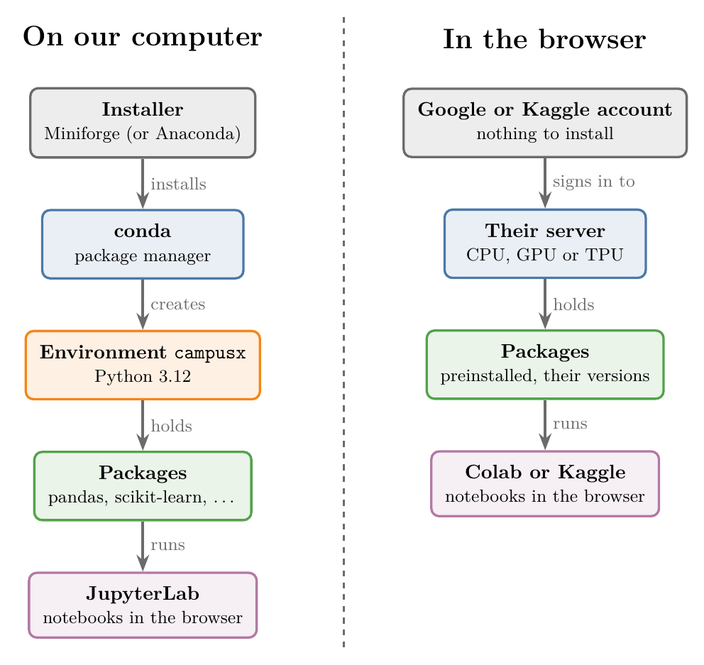
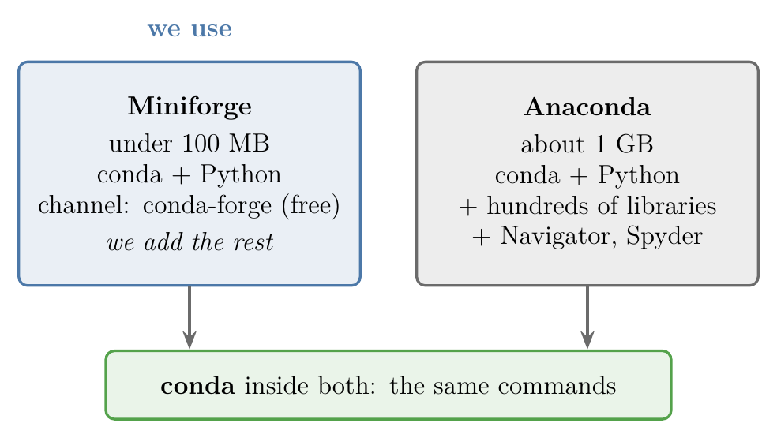
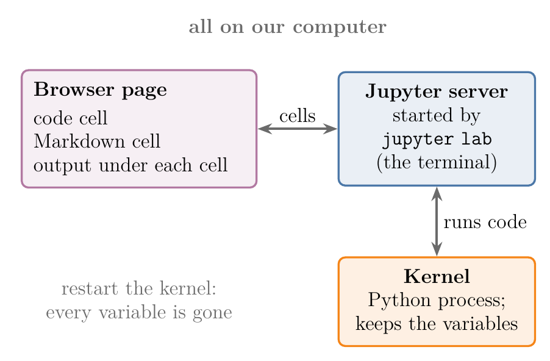
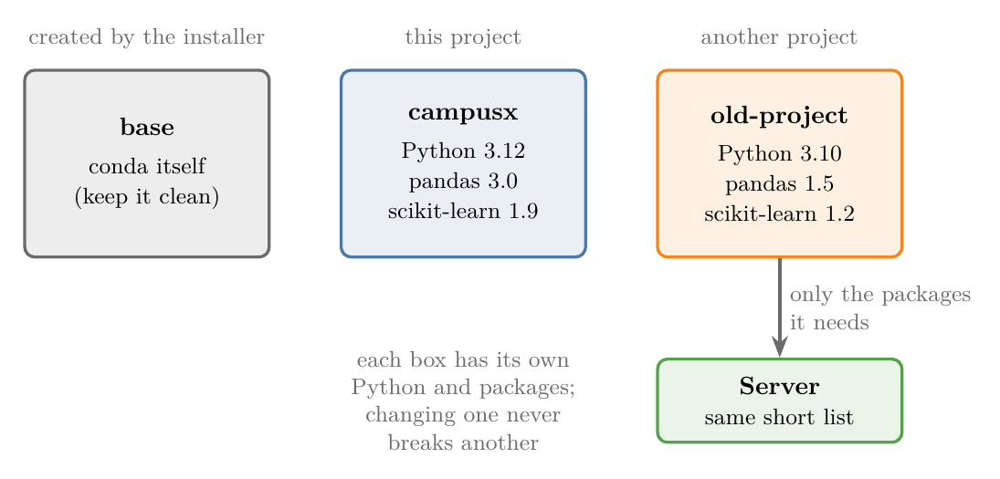
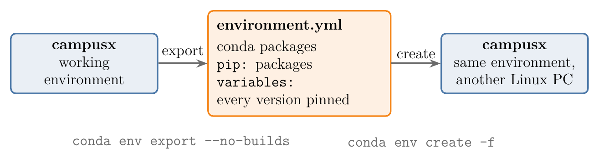
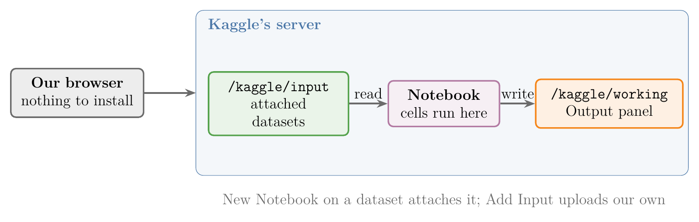
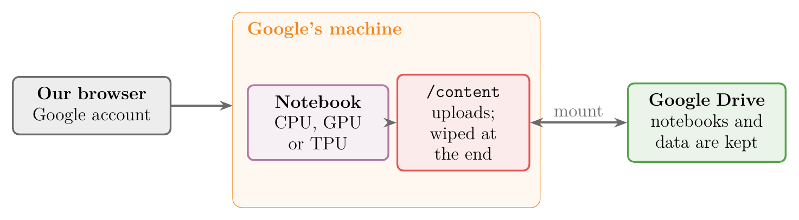
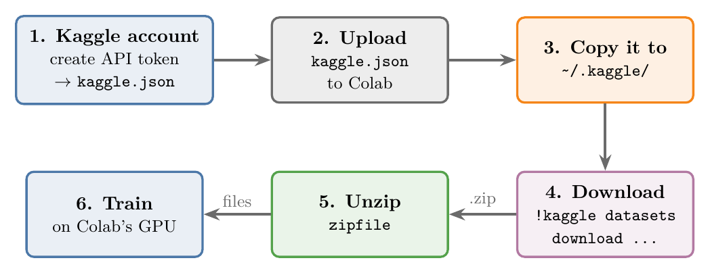
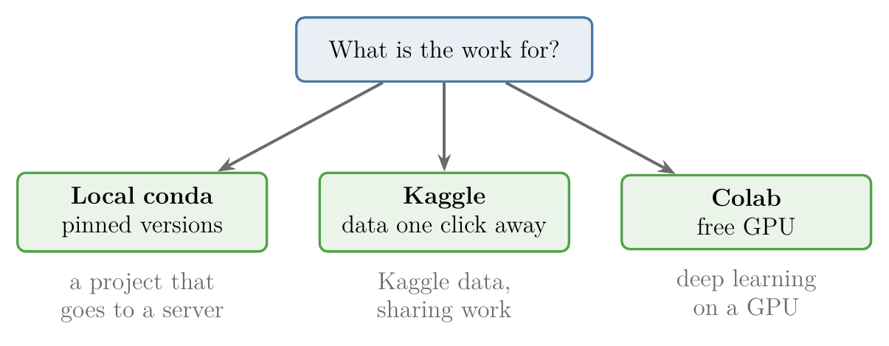

<!-- where-this-fits: generated by course_map/build_map.py; edit concepts.yaml, not this block -->
> **Where this fits:** Pipeline map step 0 (Foundations). See the [Course map](../../../00-course-map/00-course-map.md).
>
> 
>
> - **Leads to:** [Pandas Profiling](../../../ML/02-getting-data/ML-021-pandas-profiling/ML-021-pandas-profiling.md#2-building-the-report).
<!-- /where-this-fits -->

## 1. Overview

> **Key point:** We can write ML code on our own computer (conda plus Jupyter) or in the browser (Kaggle or Google Colab); both give us the same kind of notebook.

A **notebook** is a page made of boxes called cells. We type a line of Python in a cell, such as `2 + 3`, press run, and the answer, `5`, appears right below the cell. The next cell can use what the earlier cell made. Every ML example in these Notes is a notebook like this, so the first job is to get one running.



ML work needs Python plus many libraries (ready-made code written by others that we import): pandas for tables, NumPy for numbers, scikit-learn for models, and plotting libraries. Installing and matching all of them by hand is slow and error-prone. Figure 1 shows the two ways around this:

- **On our computer:** an installer gives us **conda** (G-439), conda builds a separate box of Python and libraries, and Jupyter runs notebooks from that box.
- **In the browser:** Kaggle or Google Colab give us a ready-made notebook on their servers. Nothing to install, but the library versions are theirs.

Every command in this Note matches the environment the rest of these Notes are built with. That environment is pinned in the file `environment.yml` (Section 5). The Notebook for this Note (`ML-011-setup-anaconda-jupyter-colab.ipynb`) checks a setup: it prints which Python and which library versions are really in use.

## 2. Anaconda, Miniforge and conda

> **Key point:** conda installs Python and data science libraries in one place; Miniforge is the small installer for it that we use, and Anaconda is the large one.

### 2.1 What Anaconda and conda are

> **Key point:** A distribution bundles Python with hundreds of libraries; conda is the tool inside it that installs and updates them.

Data science uses many libraries, and each depends on others. Installing them one by one, with versions that work together, quickly becomes hard. A **distribution** solves this: one installer that sets up Python together with the libraries we need.

**Anaconda** (G-195) is the best-known data science distribution. Anaconda installs Python, hundreds of popular libraries, and tools such as Jupyter (Anaconda docs). At its heart is **conda**, a **package manager** (G-1434): a program that downloads libraries (called **packages**, G-1435), works out which versions fit together, and installs them.

> **Extra:** pip vs conda. Python also has its own package manager, **pip** (G-1497), which downloads packages from **PyPI** (G-1593) (the Python Package Index). conda can also install things that are not Python, because a conda package can hold system-level libraries and programs as well as Python modules (conda docs, "Packages"). Python itself and the compiled maths libraries under NumPy are installed this way. We use conda for almost everything and pip only for packages that conda does not have.

### 2.2 Miniforge: the installer we use

> **Key point:** Miniforge installs only conda and Python, and gets packages from the free conda-forge channel; we add the rest ourselves.

A **channel** is an online store of conda packages. Anaconda's own channel is the default in the Anaconda installer. **conda-forge** (G-440) is a community channel with more packages, often newer ones.

**Miniforge** (G-1224) is a small installer (under 100 MB) that sets up only conda, Python and a few basics, with conda-forge as its only channel. Everything else we install into our own environments (Section 4). Miniforge plus our own environments is the setup these Notes use.

{width=70%}

Figure 2 compares the two installers.

The full Anaconda distribution works too: every `conda` command in this Note is the same. Anaconda is a much bigger download (about 1 GB today) and installs hundreds of libraries we may never use.

> **Extra:** Why Miniforge rather than Anaconda? Anaconda's terms require a paid licence for its default channel in organisations with 200 or more people, apart from teaching and research at universities (Anaconda ToS FAQ). conda-forge is free for everyone. Miniforge also starts small, so the only libraries on our machine are the ones our projects need.

### 2.3 Installing Miniforge

> **Key point:** Download the installer for our system from the Miniforge GitHub page, run it, and accept the defaults.

The installers are on the Miniforge release page (github.com/conda-forge/miniforge). On Linux and macOS, three lines in a terminal (a text window where we type commands) download and run the right one.

The commands below do three things: store the address of the download page, download the installer, run it. Each line is explained right after the box.

> **Python:** Installing Miniforge on Linux or macOS (terminal commands, not Python).
>
> ```bash
> URL=https://github.com/conda-forge/miniforge/releases/latest/download
> curl -L -O "$URL/Miniforge3-$(uname)-$(uname -m).sh"
> bash Miniforge3-$(uname)-$(uname -m).sh
> ```
>
> `$(uname)` fills in the system name (`Linux` or `Darwin` for macOS) and `$(uname -m)` the processor type (for example `x86_64`), so the URL points to the matching installer. The first line only stores the folder of the download page, `curl` downloads the installer, and `bash` runs it. We answer **yes** when it asks to initialise conda, so new terminals can find `conda`.

On Windows, we download `Miniforge3-Windows-x86_64.exe` from the same page and click through it with the default settings. Afterwards the Start menu has a **Miniforge Prompt**: a terminal where `conda` works. Every command in this Note is typed there on Windows.

To check the install, we open a new terminal and list the environments:

> **Python:** Checking that conda works.
>
> ```bash
> conda --version   # e.g. conda 24.11.3
> conda env list    # every environment; "base" is always there
> ```

### 2.4 Navigator and Spyder

> **Key point:** Anaconda adds a point-and-click control panel (Navigator) and a code editor (Spyder); Miniforge has neither, and we do not need them.

The full Anaconda distribution also installs:

- **Anaconda Navigator** (G-194): a window that lists environments and packages and starts tools with a click. Navigator is a graphical front end for the same `conda` commands, and it can be slow.
- **Anaconda Prompt:** the terminal where `conda` works on Windows (Miniforge Prompt is the same thing).
- **Spyder** (G-1856): a code editor for Python with a panel that shows the variables and tables in memory.

We use Jupyter (Section 3) instead of Spyder, and the terminal instead of Navigator. With Miniforge, `conda install spyder` adds Spyder to an environment if we want it.

## 3. Jupyter notebooks

> **Key point:** A notebook mixes runnable code, its output and formatted text in one document, and runs one cell at a time.

### 3.1 Starting Jupyter

> **Key point:** In a terminal with our environment active, `jupyter lab` starts a local server and opens it in the web browser.

**Jupyter** (G-990) is the most popular tool for data science code. A **notebook** (G-1353) is a file (ending in `.ipynb`) made of **cells** (G-362), and each cell's output appears right under it. **JupyterLab** (G-991) is the program that opens and runs notebooks, inside a web browser.

{width=70%}

Figure 3 shows where our code runs: the browser only shows the cells, and the kernel behind the server runs them.

> **Python:** Starting JupyterLab.
>
> ```bash
> conda activate campusx   # switch to our environment (Section 4)
> cd path/to/our/project   # the folder we want to work in
> jupyter lab              # starts Jupyter and opens the browser
> ```

The terminal keeps running while we work: it is the server behind the browser page. Closing it, or pressing **Ctrl+C** in it, stops Jupyter. The browser shows the files of the folder we started in, on the left.

> **Extra:** "Jupyter Notebook" is also the name of an older, simpler interface, started with `jupyter notebook`. The classic interface is a separate package, `notebook`, which our environment does not include. JupyterLab opens the same `.ipynb` files, so nothing is lost. `conda install notebook` adds the classic interface if we prefer it.

Good practice is one folder per project. In the file browser, the folder button creates a new folder; we rename it (for example `ml-projects`) and double-click to go inside. The **Python 3** button in the Launcher then creates a new, empty notebook there.

### 3.2 Code cells and Markdown cells

> **Key point:** A code cell runs Python; a Markdown cell holds formatted text; Shift+Enter runs either one.

Every cell has a type, chosen from a menu at the top of the notebook:

- **Code cell:** holds Python. Running it shows the result underneath.
- **Markdown cell:** holds text written in **Markdown** (G-1168), a simple way to format text with symbols. Running it turns the symbols into headings, bold text and lists.

**Shift+Enter** runs the current cell and moves to the next. Plain Enter only adds a new line inside the cell. Running cells one by one, and seeing each result straight away, is what makes notebooks so handy for exploring data.

{width=75%}

Figure 4 shows both kinds of cell, before and after running.

> **Python:** The Markdown we need most.
>
> ```markdown
> # Import the dataset          <- big heading (level 1)
> ## Load the CSV file          <- smaller heading (level 2)
> Plain text becomes a paragraph.
> **Two asterisks** make text bold.
> <span style="color:red">HTML also works</span>
> ```

Because Markdown cells accept HTML (Jupyter docs), a notebook can also show images and videos. Many people publish notebooks as tutorials on GitHub and Kaggle, with the explanation in Markdown cells next to the code.

> **Extra:** Notebooks can also hold interactive **widgets**: buttons, sliders and text boxes the reader can use. The `ipywidgets` package provides them; it is not in our environment. These Notes use Plotly and Dash for interactive parts instead.

### 3.3 The kernel

> **Key point:** The kernel is the running Python behind a notebook; restarting it clears every variable.

Each open notebook is connected to a **kernel** (G-1009): a Python process that runs the code cells and keeps the variables in memory. The **Kernel** menu can:

- **Interrupt** a cell that runs too long.
- **Restart** the kernel: all variables are lost, and we run the cells again from the top.
- **Shut down** the kernel when we are done, to free memory.

If Python crashes, or a package is changed underneath it, the notebook reports a **dead kernel**. Restarting the kernel fixes it.

### 3.4 Loading a dataset

> **Key point:** Put the data file in the project folder (or upload it through the file browser), then read it with `pd.read_csv`.

Most datasets for learning come from **Kaggle** (G-999) (kaggle.com), a website of datasets and ML competitions; downloading needs a free account. A downloaded dataset usually arrives as a `.zip` file, which we extract on our computer.

To bring the file into the project folder, we either copy it there with the computer's file manager, or use the **upload** button (an upward arrow) in JupyterLab's file browser. Then pandas reads it into a table:

> **Python:** Reading a CSV file that sits next to the notebook.
>
> ```python
> import pandas as pd
>
> # the file name, as it appears in the file browser
> df = pd.read_csv("aug_train.csv")
> df.shape   # (19158, 14): rows, columns
> ```
>
> `aug_train.csv` is a Kaggle dataset of 19,158 people who took a data science course. `df` (short for DataFrame) is the usual name for a pandas table. [Working with CSV files](../../02-getting-data/ML-014-working-with-csv/ML-014-working-with-csv.md#3-the-read_csv-function) covers `read_csv` in depth; a CSV file is a plain-text table with values separated by commas.

### 3.5 Saving and sharing a notebook

> **Key point:** Notebooks save as `.ipynb` files, and can be exported as a Python script, a web page or a PDF.

JupyterLab saves the notebook as it is, as an `.ipynb` file. **File > Save and Export Notebook As** turns it into other formats:

| Format | File | Good for |
|---|---|---|
| Notebook | `.ipynb` | Sharing with code, outputs and text; GitHub shows it as a page |
| Executable Script | `.py` | Running the code without Jupyter |
| HTML | `.html` | Reading in any browser, without Python |
| PDF | `.pdf` | Printing; needs LaTeX installed |

Uploading the `.ipynb` file to GitHub is the usual way to share a project: GitHub draws the notebook, outputs included.

## 4. Virtual environments

> **Key point:** An environment is a separate box of Python and packages; each project gets its own, so projects never break each other.

### 4.1 Why one environment per project

> **Key point:** Working in the shared base environment mixes every project's packages, which makes projects hard to move to a server.

A **virtual environment** (G-2090) (in conda simply an **environment**) is a folder with its own copy of Python and its own packages. The installer creates one called **base** (G-259), which holds conda itself. With the full Anaconda distribution, base also holds all of Anaconda's libraries, and starting Jupyter from the Start menu uses base.

Working in base causes problems sooner or later:

- **Deployment:** to run a project on a server, the server needs the same packages. A project built in base does not record which packages it really used, so the server ends up with a long, heavy list.
- **Conflicts:** one project may need pandas 3 and an older one pandas 1.5. One shared box can hold only one version.
- **Breakage:** an upgrade made for one project can silently break another.

The fix is one fresh environment per project (Figure 5). Each new environment starts nearly empty, we install only what the project needs, and the server later gets exactly that list. The environment acts like a safe box for the project.



For a first ML project, working in one environment for everything is fine. Separate environments matter once projects are deployed or shared, and they are the standard practice.

### 4.2 Creating and using an environment

> **Key point:** `conda create` makes the box, `conda activate` steps into it, and `conda install` fills it.

We create environments from a terminal (Miniforge Prompt or Anaconda Prompt on Windows). The prompt shows the active environment in brackets, for example `(base)`.

> **Python:** The everyday conda commands.
>
> ```bash
> # a new, nearly empty environment
> conda create --name myproject python=3.12
> # step into it: the prompt now starts with (myproject)
> conda activate myproject
> # install packages into it
> conda install jupyterlab numpy pandas
> # Jupyter now runs inside myproject
> jupyter lab
> # back to (base)
> conda deactivate
> ```
>
> conda asks for confirmation (`Proceed ([y]/n)?`) before it changes anything; we type `y`. Without `python=3.12`, the new environment would have no Python at all.

Jupyter is a package like any other. In a new environment it must be installed before `jupyter lab` works there. Once it runs from inside the environment, every notebook uses that environment's Python and packages.

A package can also be installed without leaving the notebook. Changing the packages under a running notebook can kill the kernel; after installing, we restart it.

> **Python:** Installing from a notebook cell.
>
> ```python
> %pip install wordcloud
> ```
>
> `%pip` installs into the environment that runs this notebook. The older form `!pip install wordcloud` sends the line to the terminal, and can install into a different Python by mistake. If the package is already there, pip answers `Requirement already satisfied`.

Anaconda Navigator can do the same with clicks: its **Environments** tab lists every environment and its installed packages, with buttons to create, install and remove.

### 4.3 Removing an environment

> **Key point:** Deactivate the environment first, then remove it with `conda env remove`.

When a project is finished and saved (for example on GitHub), its environment can go:

> **Python:** Removing an environment.
>
> ```bash
> # never remove the environment we are in
> conda deactivate
> # delete it and all its packages
> conda env remove --name myproject
> # check: myproject is gone
> conda env list
> ```
>
> The older form `conda remove --name myproject --all` does the same.

If `conda activate myproject` still seems to work right after removing, the terminal was still inside the old environment. Closing the terminal and opening a new one shows the real state.

## 5. The environment used in these Notes

> **Key point:** One file, `environment.yml`, lists every package and version; `conda env create` rebuilds the exact same environment from it.

### 5.1 Recreating the environment from a file

> **Key point:** On Linux, two commands rebuild our `campusx` environment exactly; a third adds the profiling library.

An **environment file** (G-692) (`environment.yml`) lists an environment's name, its channel, and every package with its exact version. Pinning exact versions means everyone who builds from the file gets the same results as these Notes. Ours is generated from the working environment with `conda env export --no-builds`, never written by hand.

{width=95%}

Figure 6 shows the round trip.

The file has three parts: conda packages from conda-forge, a `pip:` section for packages that conda-forge does not have, and a `variables:` section (below). The file lists every package, including Linux system libraries such as `libgcc`, so it rebuilds the exact environment **on Linux only**. On macOS or Windows, create an environment with the key versions of Section 5.2 instead. Recreating the environment takes one long download. The third command uses `--no-deps`, which means "install just this package and do not touch anything else" (explained fully in Section 5.3):

> **Python:** Building the `campusx` environment (Linux terminal).
>
> ```bash
> conda env create -f environment.yml
> conda activate campusx
> python -m pip install --no-deps fg-data-profiling==4.20.0
> python -c "import sklearn; print(sklearn.__version__)"   # 1.9.1
> ```
>
> `-f` names the file. The third line adds the profiling library separately; Section 5.3 explains why. The last line checks that scikit-learn imports.

The `variables:` section sets `PYTHONNOUSERSITE=1` whenever the environment is activated. Without it, Python also loads packages installed with `pip install --user` (in `~/.local`), and an old copy there can silently replace the environment's own version. With it, only the environment's packages are used.

Figure 1's left side is now complete. From the project folder, `jupyter lab` opens notebooks that use exactly these versions.

### 5.2 Key versions

> **Key point:** Python 3.12, pandas 3, NumPy 2 and scikit-learn 1.9 are the versions every Notebook is tested with.

The table lists the pinned versions that matter most for these Notes.

| Package | Version | Used for |
|---|---|---|
| Python | 3.12.14 | The language |
| NumPy | 2.5.3 | Arrays and maths |
| pandas | 3.0.6 | Tables (DataFrames) |
| PyArrow | 21.0.0 | Fast storage that pandas uses for text columns |
| scikit-learn | 1.9.1 | ML models and preprocessing |
| SciPy | 1.18.1 | Statistics and scientific functions |
| statsmodels | 0.15.0 | Statistical models and tests |
| seaborn | 0.13.2 | Statistical charts |
| Plotly | 7.1.0 | Interactive charts |
| Dash | 4.4.1 | Small web apps from Python |
| Manim | 0.20.1 | Animated diagrams |
| JupyterLab | 4.6.4 | Running notebooks |
| fg-data-profiling | 4.20.0 | EDA reports (pip, see 5.3) |

The file also holds a few tools used only to build these Notes; they are not needed for the ML code.

### 5.3 Two fixes for the profiling library

> **Key point:** The profiling library asks for pandas older than 3, so we install it without its dependency rules and switch pandas' text storage before using it.

The EDA (exploratory data analysis) report library from [building the report](../../02-getting-data/ML-021-pandas-profiling/ML-021-pandas-profiling.md#2-building-the-report) is installed with pip under the name `fg-data-profiling` (imported as `data_profiling`). Version 4.20 still declares that it needs pandas older than 3.0 and NumPy older than 2.6. A plain `pip install fg-data-profiling` would therefore quietly replace our pandas 3.0.6 with pandas 2.3.3.

To keep pandas 3, we install it with pip's `--no-deps` option. The option means "install just this package, do not touch anything else".

The helper packages it really needs (such as `phik`, `visions` and `wordcloud`) are listed in the file's `pip:` section with their own pins. The library itself is left out of the file, because `conda env create` cannot pass `--no-deps` to pip for one package; that is why 5.1 installs it as a separate third step.

> **Python:** Adding the library (the third command of 5.1).
>
> ```bash
> python -m pip install --no-deps fg-data-profiling==4.20.0
> ```
>
> Afterwards `python -m pip check` reports that fg-data-profiling wants pandas below 3.0. That message is expected and harmless here.

The library then runs on pandas 3 with one setting. pandas 3 stores text columns in a new format (Arrow arrays) that the library cannot add up, and building a report fails with an error (on the Titanic data: `AttributeError: 'ArrowExtensionArray' object has no attribute 'sum'`). One line before the report switches text back to plain Python strings:

> **Python:** The setting used before every profiling report.
>
> ```python
> import pandas as pd
>
> pd.set_option("mode.string_storage", "python")
> ```
>
> The Notebook for the pandas profiling Note runs this line first. With pandas 2 it is not needed.

## 6. Kaggle notebooks

> **Key point:** Kaggle runs notebooks in the browser right next to its datasets, so a dataset is one click away from code.

Instead of installing anything, we can work in the browser. **Kaggle notebooks** are Jupyter notebooks running on Kaggle's servers, with the usual libraries preinstalled. They are a good start for beginners, and for quick experiments on Kaggle datasets.

To start one, we open any dataset on Kaggle (for example the Titanic data) and click **New Notebook** (on the dataset's **Code** tab). Kaggle creates a notebook with that dataset already attached. The Kaggle notebook has the same code and Markdown cells and the same Shift+Enter.

{width=95%}

Figure 7 shows where things live on Kaggle's server; the paths come up in the code below.

The first cell Kaggle writes for us imports NumPy and pandas, and prints the path of every attached file. We copy a path from its output into `read_csv`:

> **Python:** Reading an attached dataset on Kaggle.
>
> ```python
> # path copied from the first cell's output
> df = pd.read_csv("/kaggle/input/titanic/train.csv")
> ```

Our own data works too. **Add Input** (the **+** in the right-hand panel) uploads a file from our computer as a new dataset; Kaggle asks for a unique name, processes it, and attaches it under `/kaggle/input/`.

Files our code writes go to `/kaggle/working/` and appear in the **Output** panel, from where we download them:

> **Python:** Saving a table as a file to download.
>
> ```python
> # appears under Output after a refresh
> df.to_csv("cars.csv", index=False)
> ```
>
> `index=False` leaves out the row numbers.

**File > Download** saves the notebook itself as `.ipynb`. **Save Version** saves it on Kaggle, and a public notebook can be read, copied and upvoted by others. Upvotes build a Kaggle profile, which some people show to employers.

> **Extra:** Kaggle notebooks also have a GPU: in the notebook settings, the **Accelerator** option offers GPUs and a TPU, with a limited number of free hours per week (about 30 GPU hours and 20 TPU hours; Kaggle docs).
>
> A **GPU** (G-856; graphics card) runs the big matrix maths of deep learning much faster than a normal processor (**CPU**). A **TPU** (G-1996) is Google's chip built only for that maths (Jouppi et al. 2017).

## 7. Google Colab

> **Key point:** Colab is Google's version of a Jupyter notebook in the browser: notebooks save to Google Drive, and a free GPU is one setting away.

**Google Colab** (G-854) (colab.research.google.com) runs Jupyter notebooks on Google's servers, using a Google account. Colab looks and works like the notebooks above: code and text cells, Shift+Enter, and **File > Download** as `.ipynb` or `.py`. Two things set it apart:

- **Google Drive:** every notebook is saved in our Drive automatically (in a folder called *Colab Notebooks*).
- **GPU and TPU:** **Runtime > Change runtime type > Hardware accelerator** switches the notebook to a GPU or TPU. Classic ML code (scikit-learn) does not use a GPU (scikit-learn FAQ); deep learning code runs many times faster on one.

So we do not need an expensive computer to learn deep learning: Colab provides the hardware.

{width=95%}

Figure 8 shows what a Colab session keeps and what it loses, which Section 7.1 builds on.

> **Extra:** The free GPU has limits. A session ends after a while without activity and after at most about 12 hours (Colab FAQ). When it ends, the machine is wiped: variables and uploaded files are gone, only the notebook stays in Drive.

### 7.1 Data on Colab

> **Key point:** Colab has no datasets of its own; we upload a file through the Files panel, or connect Google Drive.

The **Files** panel (the folder icon on the left) has an upload button. An uploaded file lands in `/content/`, the notebook's working folder, so `pd.read_csv("cars.csv")` finds it. Right-clicking it and choosing **Copy path** gives the full path.

Uploaded files disappear when the session ends. To keep data between sessions, we store it in Google Drive and connect Drive to the notebook:

> **Python:** Connecting Google Drive in Colab.
>
> ```python
> from google.colab import drive
>
> drive.mount("/content/drive")   # asks for permission once
> df = pd.read_csv("/content/drive/MyDrive/data/cars.csv")
> ```

### 7.2 Libraries on Colab

> **Key point:** Colab has the common libraries preinstalled, in Colab's own versions; `!pip install` adds anything missing.

pandas, NumPy, scikit-learn, Plotly, seaborn and many more are already installed on Colab. Their versions are chosen by Google and change every few months, so they may differ from the pins in Section 5.2. Running the Notebook for this Note on Colab lists the differences.

> **Python:** Checking and adding libraries on Colab.
>
> ```python
> import pandas as pd
> pd.__version__                      # Colab's pandas version
>
> !pip install fg-data-profiling      # a library Colab does not have
> ```
>
> Lines starting with `!` go to the machine's terminal. On Colab, `!pip install` and `%pip install` both install into the notebook's Python. After upgrading a library that was already imported, **Runtime > Restart session** loads the new version.

Most code in these Notes runs on Colab as it is. A few lines depend on new behaviour, such as pandas 3's text columns. If Colab's pandas is older, the `mode.string_storage` line from Section 5.3 is simply not needed there.

## 8. Kaggle datasets on Colab

> **Key point:** With a Kaggle API token, Colab downloads a Kaggle dataset straight from Kaggle's servers, however big it is.

Colab has the GPU, Kaggle has the datasets. Downloading a large dataset (for example thousands of images) to our computer and uploading it to Colab again is slow. The Kaggle **API** (a way for programs to talk to a website) lets Colab fetch it directly, at the speed of Google's network. Figure 9 shows the steps.



1. **Get a token.** On Kaggle, under the account settings, **Create New Token** downloads a file `kaggle.json`, the **API token** (G-206). The file holds our username and a secret key.
2. **Upload it** to Colab through the Files panel.
3. **Copy it** to the folder where the Kaggle tool looks for it.
4. **Download the dataset.** On the dataset's Kaggle page, the menu (the three dots) has **Copy API command**. We paste it into a cell with `!` in front.
5. **Unzip** the downloaded `.zip` file.
6. **Use the files** with the GPU.

> **Python:** Steps 3 to 5 in Colab cells.
>
> ```python
> # Step 3: put the token where the kaggle tool expects it
> !mkdir -p ~/.kaggle
> !cp kaggle.json ~/.kaggle/
> !chmod 600 ~/.kaggle/kaggle.json
>
> # Step 4: the command copied from the dataset's page
> !kaggle datasets download -d owner/dataset-name
>
> # Step 5: unzip into a folder called data
> import zipfile
> with zipfile.ZipFile("dataset-name.zip") as z:
>     z.extractall("data")
> ```
>
> `mkdir -p` makes the hidden folder `.kaggle` in the home folder `~`. `chmod 600` makes the token file readable only by us; the Kaggle tool warns otherwise. `zipfile` is part of Python's standard library: `extractall` unpacks every file in the archive into the folder `data`.

> **Extra:** `kaggle.json` is a password (Kaggle API docs). The token must never be shared, put in a public notebook or uploaded to GitHub. If it leaks, we delete the token on Kaggle and create a new one.

## 9. Choosing where to work

> **Key point:** Kaggle and Colab for learning and quick experiments; a local conda environment for projects that will be deployed.

| | Local (conda + JupyterLab) | Kaggle notebook | Google Colab |
|---|---|---|---|
| Install needed | Yes, once | No | No |
| Library versions | Ours, pinned | Kaggle's | Google's |
| Datasets | Download ourselves | Kaggle's, attached in one click | Upload, Drive, or Kaggle API |
| GPU | Only if our computer has one | Free weekly quota | Free, with session limits |
| Notebooks saved | On our disk | On Kaggle | In Google Drive |
| Best for | Projects and deployment | Kaggle data, sharing work | Deep learning on a GPU |

For learning, Kaggle and Colab are enough, and many people use nothing else. A real project, one that goes to a server, needs a local environment with pinned versions.

{width=85%}

Figure 10 sums up the choice.

## 10. Summary

| Tool | What it is | Key command or click |
|---|---|---|
| Miniforge | Small installer: conda + Python, conda-forge channel | `bash Miniforge3-...sh` |
| Anaconda | Large installer with hundreds of libraries, Navigator, Spyder | Graphical installer |
| conda | Package and environment manager | `conda create`, `conda activate`, `conda install` |
| Environment file | Every package and version, pinned | `conda env create -f environment.yml` |
| JupyterLab | Runs notebooks in the browser | `jupyter lab` |
| Kaggle notebook | Notebook next to Kaggle's datasets | **New Notebook** on a dataset |
| Google Colab | Notebook on Google's servers, saved in Drive | **Change runtime type** for a GPU |

- One environment per project; never fill up base, because one shared box holds only one version of each package, and a server later needs exactly the packages the project used.
- `conda activate campusx`, then `jupyter lab`, gives notebooks with exactly the versions in these Notes, because `environment.yml` pins every package and version.
- Install fg-data-profiling with `--no-deps`, and set `mode.string_storage` to `"python"` before building a report, because a plain install would replace pandas 3 with pandas 2.3.3, and the library cannot add up pandas 3's new text columns.
- Colab and Kaggle have their own library versions, because the platform chooses them and changes them every few months; `!pip install` adds what is missing.
- A Kaggle API token lets Colab download Kaggle datasets directly, so a large dataset never has to pass through our own computer. Keep it secret, because `kaggle.json` works like a password.
- Both routes give the same kind of notebook. Kaggle and Colab are enough for learning; a project that goes to a server needs a local environment, because the server needs the same pinned versions.

## 11. Sources

**Built from**

- CampusX, "Installing Anaconda For Data Science | Jupyter Notebook for Machine Learning | Google Colab for ML", YouTube, https://www.youtube.com/watch?v=82P5N2m41jE

**Other references**

- Anaconda documentation. Anaconda Distribution. anaconda.com/docs.
- Anaconda (2024). Terms of Service FAQs. anaconda.com.
- Anaconda installer archive. repo.anaconda.com/archive (file sizes of the Windows installers).
- conda documentation. User guide, Concepts: Packages. docs.conda.io.
- Google Colab. Frequently Asked Questions. research.google.com/colaboratory/faq.html.
- Jouppi, N. et al. (2017). In-Datacenter Performance Analysis of a Tensor Processing Unit. *ISCA*.
- Jupyter Notebook documentation. Markdown cells. jupyter-notebook.readthedocs.io.
- Kaggle API documentation. API credentials. github.com/Kaggle/kaggle-api.
- Kaggle documentation. Notebooks and Tensor Processing Units (TPUs). kaggle.com/docs.
- scikit-learn FAQ. Will you add GPU support? scikit-learn.org.

## 12. Key terms

| Term | Meaning |
|---|---|
| Distribution | One installer that sets up Python together with many libraries |
| Anaconda | A free bundle (distribution) for data science that installs Python, hundreds of popular libraries and tools such as Jupyter in one go, with the conda package manager to keep them working together. |
| conda | A package and environment manager: it installs Python and libraries and keeps each set in a separate environment, so different projects do not clash. |
| Package manager | A program that downloads and installs libraries in versions that fit together |
| Package | A library bundled so that a package manager such as pip or conda can download and install it. |
| pip | Python's own package manager, which installs from PyPI |
| PyPI | The Python Package Index, the public store of Python packages |
| Channel | An online store of conda packages, such as conda-forge |
| conda-forge | A free, community-run channel (an online store of conda packages) with more packages, often newer ones, than Anaconda's default channel. |
| Miniforge | A small installer with only conda and Python, using conda-forge |
| Anaconda Navigator | Anaconda's point-and-click window for environments and packages |
| Spyder | A Python code editor that shows variables and tables in memory |
| Jupyter | Tool for notebooks that mix code, output and text |
| JupyterLab | The program that runs Jupyter notebooks in a web browser |
| Notebook | A `.ipynb` file of cells, each with its output underneath |
| Cell | One block of a notebook, holding either code or Markdown |
| Markdown | A simple way to format text with symbols such as `#` and `**` |
| Kernel (G-1009) | The running Python process behind a notebook |
| Virtual environment | A separate folder with its own copy of Python and its own packages, one per project, so the projects' package versions do not clash. |
| base environment | The environment the installer creates, holding conda itself |
| Environment file | A file (`environment.yml`) listing an environment's name, channel and every package with its exact version, so anyone can rebuild the same environment and get the same results. |
| Kaggle | A website of datasets, ML competitions and browser notebooks |
| Google Colab | Google's browser-based Jupyter notebooks, saved in Google Drive |
| GPU | A graphics chip that runs deep learning maths much faster than a CPU |
| TPU | Google's chip built only for deep learning maths |
| API token | A secret file or key that lets a program use a website's API as us |
