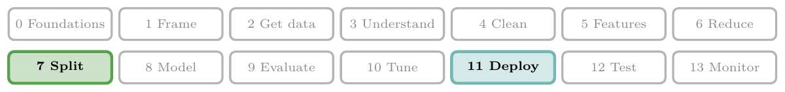
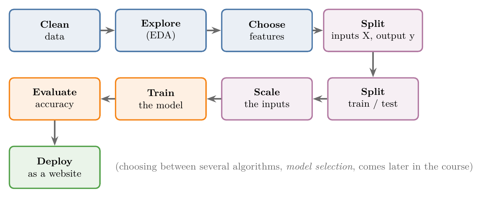
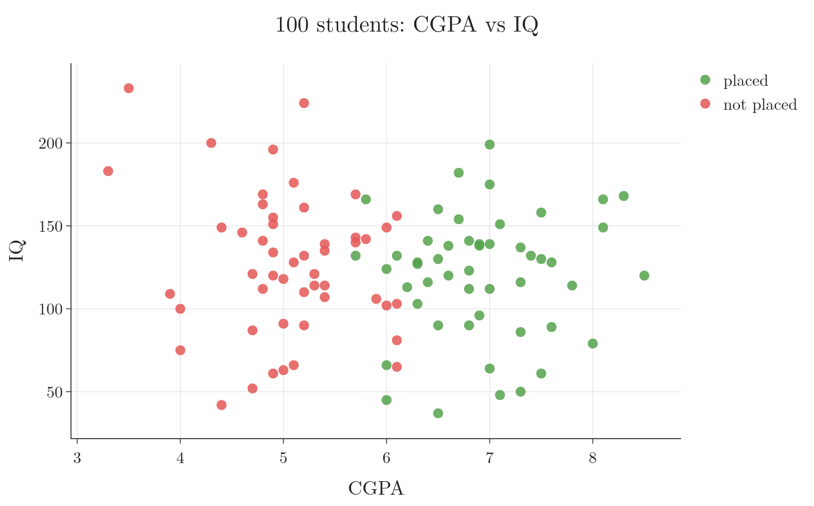
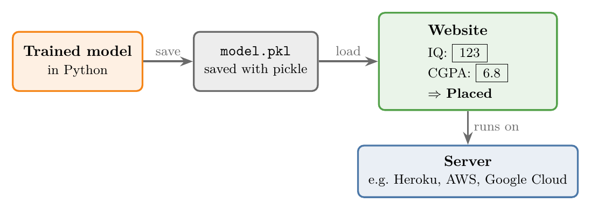

<!-- where-this-fits: generated by course_map/build_map.py; edit concepts.yaml, not this block -->
> **Where this fits:** Pipeline map steps 7 (Split), 11 (Deploy). See the [Course map](../../../00-course-map/00-course-map.md).
>
> 
>
> - **Leads to:** [Standardization](../../../ML/03-feature-engineering/ML-023-standardization/ML-023-standardization.md#4-the-standardization-formula); [Ordinal and label encoding](../../../ML/03-feature-engineering/ML-025-ordinal-label-encoding/ML-025-ordinal-label-encoding.md#5-how-ordinal-encoding-works); [ML pipelines](../../../ML/03-feature-engineering/ML-028-pipelines/ML-028-pipelines.md#2-what-a-pipeline-is); [Simple imputation (mean, median, mode, constant)](../../../ML/04-missing-data-and-outliers/ML-036-missing-categorical-data/ML-036-missing-categorical-data.md#1-overview); [Accuracy](../../../ML/07-classification/ML-075-accuracy-confusion-matrix/ML-075-accuracy-confusion-matrix.md#2-accuracy).
> - **Compare with:** [Cross-validation](../../../ML/03-feature-engineering/ML-028-pipelines/ML-028-pipelines.md#8-cross-validation-with-a-pipeline); [Data leakage](../../../ML/03-feature-engineering/ML-028-pipelines/ML-028-pipelines.md#81-why-the-preprocessing-must-be-inside-data-leakage).
<!-- /where-this-fits -->

## 1. Overview

> **Key point:** We take a small dataset of students, train a model that predicts placement from CGPA and IQ, check how good it is, and turn it into a website.


This Note walks through a complete ML project on a tiny, clean dataset. Real projects use much larger and messier data, and later Notes cover each step in depth. Here the aim is to see the whole process once, from data to website.

**The task:** we have the CGPA, IQ and placement result (placed or not) of 100 students. Each student is one **observation** (G-1374; one record, one row of the data table). CGPA and IQ are the **features** (G-772; the input variables, one column each). Placement is the **target** (G-1949; the output we want to predict). We want a model that, given a new student's CGPA and IQ, predicts whether they will be placed. The target is a category, so the task is a **classification** (G-395) problem.

## 2. The workflow

> **Key point:** Clean, explore, choose features, split, scale, train, evaluate, deploy.



Figure 1 shows the steps:

1. **Clean** the data: fix missing values and outliers, remove unneeded columns. Cleaning is called **preprocessing**.
2. **Explore** the data with summaries and plots, to spot patterns. Exploring is called **exploratory data analysis (EDA)**.
3. **Choose features:** decide which features to use (feature selection, taught in [feature engineering](../../03-feature-engineering/ML-022-what-is-feature-engineering/ML-022-what-is-feature-engineering.md#8-feature-selection)). Here we keep both CGPA and IQ.
4. **Split features from target:** X (the features) and y (the target).
5. **Split into training and test sets.**
6. **Scale** the inputs to similar ranges.
7. **Train** the model.
8. **Evaluate** the model on the test set.
9. **Deploy** it, for example as a website.

Often we also train several different algorithms and keep the best one. Picking the best algorithm is called **model selection** and is covered in later Notes.

The Notebook for this Note (`ML-012-toy-project.ipynb`) runs every step, in order, on the same data.

## 3. Loading and cleaning the data

> **Key point:** Load the CSV file into a table, check it, and drop the column we do not need.

The data is a **CSV file** (G-513; comma-separated values): a plain text table, one row per line, with commas between the values.

> **Python:** Loading and checking a table with pandas.
>
> ```python
> import pandas as pd
>
> df = pd.read_csv("data/placement.csv")  # load the table
> df.head()                                # show the first 5 rows
> df.shape                                 # (100, 4): 100 rows, 4 columns
> df.info()                                # column types, missing values
> ```
>
> **pandas** is the main Python library for tables. A table in pandas is called a **DataFrame** (G-1441), usually named `df`.

The table has four columns: `Unnamed: 0`, `cgpa`, `iq` and `placement`. `df.info()` shows 100 non-missing values in every column, so there are no **missing values** (G-1234) to fix.

The first column, `Unnamed: 0`, is just a row number (the crossed-out grey column of Figure 3, section 5) left over from how the file was saved. The column carries no information, so we drop it:

> **Python:** Keeping only some columns.
>
> ```python
> df = df.iloc[:, 1:]   # all rows, every column from position 1 onwards
> ```
>
> `iloc[rows, columns]` selects by position, starting from 0. `:` means "all", and `1:` means "from position 1 to the end".

Dropping that column is all the cleaning this dataset needs. Real data usually needs much more, as later Notes show.

## 4. Exploring the data

> **Key point:** A plot shows that placed and not-placed students fall into two regions that a straight line could roughly separate.



Figure 2 plots every observation (student) by CGPA and IQ, coloured by placement. Two things stand out:

- Placed students (green) mostly have a CGPA above about 6.
- IQ makes much less difference: both groups have high and low IQs.

The two groups could be separated, roughly, by a straight line. A straight-line split makes **logistic regression** (G-1120) a good choice of algorithm. Logistic regression is a classification algorithm that finds the line that best separates the two classes. How it finds that line is shown in [logistic regression by gradient descent](../../07-classification/ML-074-logistic-gradient-descent/ML-074-logistic-gradient-descent.md#2-the-idea-on-one-weight).

## 5. Inputs and output

> **Key point:** X holds the features (CGPA, IQ); y holds the target (placement).

We separate the table into (Figure 3):

- **X:** the features, `cgpa` and `iq`. Also called **independent variables** (G-937).
- **y:** the target, `placement`. Also called the **dependent variable** (G-591), because it depends on the features.

> **Python:** Separating X and y.
>
> ```python
> X = df.iloc[:, 0:2]   # columns 0 and 1: cgpa, iq
> y = df.iloc[:, -1]    # the last column: placement
> ```
>
> `0:2` means positions 0 and 1 (the end, 2, is not included). `-1` means the last column. X has shape (100, 2) and y has shape (100,): in the language of [tensors](../ML-010-tensors/ML-010-tensors.md#31-scalars-vectors-and-matrices), X is a 2D tensor (a matrix, a table of numbers) and y a 1D tensor (a vector, a list of numbers).

{width=85%}

## 6. Training and test sets

> **Key point:** We hide some students from the model during training, then use them to check how well it learned.

After training, how do we know whether the model learned the right pattern? We cannot release it to users first and wait for complaints. We must check it before deployment.

The standard method is to hold some data back (Figure 4):

- The **training set** (G-2002; here 90 students) is what the model learns from.
- The **test set** (G-1962; here 10 students) is hidden during training. Afterwards, we ask the model to predict these students' placement and compare its answers with the real ones.


Holding data back this way is called a **train-test split**. Which observations go where is decided at random. The test set must stay unseen, so it fairly represents new students.

> **Python:** Splitting with scikit-learn.
>
> ```python
> from sklearn.model_selection import train_test_split
>
> X_train, X_test, y_train, y_test = train_test_split(
>     X, y, test_size=0.1, random_state=1)
> ```
>
> **scikit-learn** (imported as `sklearn`) is the main Python library for classical ML. `test_size=0.1` puts 10% of the rows in the test set. `random_state=1` fixes the random shuffle, so the split is the same every time the code runs.

## 7. Scaling the inputs

> **Key point:** Features on very different ranges can mislead some algorithms, so we bring them to the same scale.

Think of comparing two runners, one timed in seconds and one in milliseconds: the bigger numbers look more important only because of the unit.

CGPA ranges from about 3 to 9, while IQ ranges from about 40 to 230 (Figure 5, left). Some algorithms compare data points by measuring distances (like [KNN, which predicts from the closest points](../ML-006-instance-vs-model-based/ML-006-instance-vs-model-based.md#3-instance-based-learning)). On raw data, a difference of 10 IQ points would count far more than a difference of 2 CGPA points, simply because IQ numbers are bigger. Features such as salary, in the lakhs (one lakh is 100,000 rupees), would be even worse.

Logistic regression, the model we train here, does not measure distances, but it learns its weights by many small steps (gradient descent, Section 8). The step for each weight grows with the size of its feature's values, so on raw data the IQ weight would take big jumps while the CGPA weight crawls, and training settles much less easily (see [when to use standardization](../../03-feature-engineering/ML-023-standardization/ML-023-standardization.md#10-when-to-use-standardization)).

So we **scale** the features: bring every feature to a similar range. A common method, **standardization**, shifts each feature to centre on 0 with a typical spread of 1. Most values then fall roughly between -2 and 2 (Figure 5, right).


Figure 5 draws each feature as dots, one per student, on top of a [box plot](../../02-getting-data/ML-019-univariate-analysis/ML-019-univariate-analysis.md#8-box-plot): the box holds the middle half of the students, the line inside it is the median, and the whiskers reach out to the farthest students that are not unusually far from the box (the two dots past the right IQ whisker are such unusual values). On the left the CGPA box is squeezed into a thin stripe near 6 while the IQ box spans about 95 to 145; on the right both boxes sit around 0 with similar widths.

Standardization on one student, step by step. On the 90 training students, the CGPA column has an average of 5.98 and a typical spread (the **standard deviation**, G-1871) of 1.10; the IQ column has an average of 121.99 and a spread of 38.91. Take the student with CGPA 5.2 and IQ 110. Each value loses its column's average and is then divided by the column's spread:

$$\text{scaled CGPA} = \frac{5.2 - 5.98}{1.10} = -0.71$$

$$\text{scaled IQ} = \frac{110 - 121.99}{38.91} = -0.31$$

The student is now (−0.71, −0.31): both numbers are on the same scale, and both say "a bit below average".

> **Extra:** Standardization subtracts the feature's mean and divides by its standard deviation; the formula is worked step by step in [the standardization formula](../../03-feature-engineering/ML-023-standardization/ML-023-standardization.md#4-the-standardization-formula).

> **Python:** Scaling with `StandardScaler`.
>
> ```python
> from sklearn.preprocessing import StandardScaler
>
> scaler = StandardScaler()
> X_train_scaled = scaler.fit_transform(X_train)  # learn mean and spread, then scale
> X_test_scaled = scaler.transform(X_test)        # scale using the SAME numbers
> ```
>
> `fit` learns each column's mean and standard deviation; `transform` applies the scaling. The scaler learns only from the training set, then applies the same numbers to the test set.

> **Extra:** Why fit the scaler on the training set only? If the scaler also learned from the test set, information about the test students would leak into training, and the test would no longer be a fair check on unseen data. This mistake is called **data leakage** (G-535) (scikit-learn User Guide, "Common pitfalls"; Kaufman et al. 2012).

## 8. Training the model

> **Key point:** Training means calling `fit` on the training data; the algorithm finds the best separating line by itself.

> **Python:** Training a logistic regression model.
>
> ```python
> from sklearn.linear_model import LogisticRegression
>
> clf = LogisticRegression()
> clf.fit(X_train_scaled, y_train)   # training
> ```
>
> In scikit-learn, every model is trained the same way: create it, then call `fit(inputs, outputs)`. `clf` is a common name for a classifier.

What does `fit` (G-84) do inside? First, what the model is. For each student, logistic regression forms one **score** from three numbers it learns, the **weights** (G-2106): one for CGPA, one for IQ, and a starting value $b$ (the bias). The score is

$$z = w_1 \times \text{scaled CGPA} + w_2 \times \text{scaled IQ} + b$$

and the **probability** of *placed* is the [sigmoid function](../../07-classification/ML-071-sigmoid-function/ML-071-sigmoid-function.md#4-the-sigmoid-function) of the score, an S-shaped curve:

$$\text{probability} = \frac{1}{1 + e^{-z}}$$

The probability is 0.5 when $z = 0$, close to 1 when $z$ is large, close to 0 when $z$ is very negative. The line where the probability is 0.5 is the line $z = 0$. The probability is 0.9 when $z = 2.20$:

$$\frac{1}{1 + e^{-2.20}} = 0.90$$

That is where the dashed lines of Figure 6 lie.

Training starts with all weights at 0. Then $z = 0$ for every student, so the model says 0.5 for everyone. It changes the weights in small steps that lower the model's error on the training students, a method called [gradient descent](../../06-regression/ML-056-gradient-descent/ML-056-gradient-descent.md#2-the-idea) (G-862). One student's share of one step, with a step size of 0.1: the student above (scaled CGPA −0.71, scaled IQ −0.31) was not placed, so the target is 0 and the model's 0.5 is wrong by 0.5. Each weight moves by minus the step size times this error times its input:

$$w_1: \thickspace0 - 0.1 \times 0.5 \times (-0.71) = +0.036$$

$$w_2: \thickspace0 - 0.1 \times 0.5 \times (-0.31) = +0.016$$

$$b: \thickspace0 - 0.1 \times 0.5 = -0.05$$

The real step adds up such shares over all 90 students, then the process repeats. Figure 6 replays those steps for our 90 students. Watch the solid line, where the model is unsure (probability 0.5): its direction is found within one step and then settles. The dashed lines, where the model is 90% sure either way, close in on it as the weights grow.


On a dataset this small, training takes a fraction of a second. Training is often this quick and quiet; larger models and datasets take longer.

## 9. Evaluating the model

> **Key point:** The model predicts the test students' placement; accuracy is the share it gets right.

We ask the trained model to predict placement for the 10 hidden test students, and compare with their real results.

**Accuracy** (G-162), step by step:

1. **In words:** the fraction of predictions that are correct.
2. **Formula:**
   $$\text{accuracy} = \frac{\text{correct}}{\text{total}}$$
   where "correct" is the number of correct predictions and "total" is the number of predictions made.
3. **Example:** the model gets 9 of the 10 test students right, so
   $$\text{accuracy} = \frac{9}{10} = 0.9,$$
   or 90%.

> **Python:** Predicting and measuring accuracy.
>
> ```python
> from sklearn.metrics import accuracy_score
>
> y_pred = clf.predict(X_test_scaled)   # predictions for the test students
> accuracy_score(y_test, y_pred)        # 0.9
> ```


Figure 7 shows what the model learned. The pale red area is where the model predicts *not placed*, the pale green area where it predicts *placed*, and the line between them is the **decision boundary**; the dots are the real students, coloured by what happened. A dot inside the wrong colour is a student the model gets wrong. Students to the right of the boundary are predicted *placed*, to the left *not placed*. The stars are the test students; the one cross is the test student it got wrong, a student with CGPA 6.0 sitting right on the boundary. The boundary sits at a CGPA of about 6, barely tilted by IQ. After training, the weights are $w_1 = 3.20$, $w_2 = 0.11$ and $b = 0.11$ (on the scaled features). The boundary is where the score is 0. For a student of average IQ, the IQ term is 0, so

$$3.20 \times \frac{\text{CGPA} - 5.98}{1.10} + 0.11 = 0$$

$$\text{CGPA} - 5.98 = -\frac{0.11 \times 1.10}{3.20} = -0.04$$

$$\text{CGPA} = 5.94$$

Because $w_2$ is so small next to $w_1$, a different IQ moves this value only a little (it is 5.95 at IQ 110). Check on the student with CGPA 5.2 and IQ 110 from Section 7. The score is

$$z = 3.20 \times (-0.71) + 0.11 \times (-0.31) + 0.11$$

$$= -2.19$$

The probability is 0.10, so the model says *not placed*.

If the accuracy were too low, we would go back and improve an earlier step: more data, better features, or a different algorithm. Here 90% is fine for a demonstration, so we move on.

## 10. Deploying the model

> **Key point:** Save the trained model to a file, load it inside a website, and put the website on a server.

### 10.1 Saving the model

> **Key point:** pickle turns the trained model into a file that other programs can load.

A trained model lives in Python's memory and disappears when the program stops. To use it elsewhere, we save it with **pickle** (G-1494), a Python module that converts objects into a file and back.

> **Python:** Saving and loading with pickle.
>
> ```python
> import pickle
>
> with open("model.pkl", "wb") as f:   # "wb": write, binary
>     pickle.dump({"scaler": scaler, "model": clf}, f)
>
> with open("model.pkl", "rb") as f:   # "rb": read, binary
>     saved = pickle.load(f)
> ```

> **Extra:** Save the scaler together with the model. The model was trained on scaled inputs, so a website that passes it raw CGPA and IQ values would get wrong answers. The Notebook checks this: on the 10 raw test students, the model predicts *placed* for everyone, and accuracy falls from 90% to 40%. Saving both, and scaling every new input with the saved scaler, avoids the problem. **Pipelines** bundle all such steps into one object ([what a pipeline is](../../03-feature-engineering/ML-028-pipelines/ML-028-pipelines.md#2-what-a-pipeline-is)).

### 10.2 The website

> **Key point:** The website takes CGPA and IQ, scales them, runs the saved model and shows the answer.



Figure 8 shows the path. The website loads `model.pkl`, asks the user for an IQ and a CGPA, and shows *Placed* or *Not placed*. Trying it confirms what Figure 7 showed: the answer depends almost entirely on whether the CGPA is above about 6.

The Notebook builds this website on our own machine with Dash. To let other people use it, it must run on a server, for example on Heroku, AWS or Google Cloud. Deploying to these platforms is covered in later Notes.

This model is far from perfect: it learned from only 90 students and was not tuned at all. The later Notes go through each step of this workflow in depth.

## 11. Summary

| Step | What we did | Key code | Why it matters |
|---|---|---|---|
| Load | Read the CSV into a DataFrame | `pd.read_csv` | `df.info()` can then show there are no missing values |
| Clean | Dropped the unneeded index column | `df.iloc[:, 1:]` | a row number carries no information |
| Explore | Plotted CGPA vs IQ by placement | scatter plot | a straight line could roughly split the groups, so logistic regression fits |
| Inputs / output | X = cgpa, iq; y = placement | `iloc` | the model learns how y depends on X |
| Split | 90 training, 10 test students | `train_test_split` | the hidden students check the model before users see it |
| Scale | Standardized both inputs | `StandardScaler` | on raw numbers IQ would count far more than CGPA, and gradient descent settles less easily |
| Train | Logistic regression | `fit` | the algorithm finds the separating line by itself |
| Evaluate | 9 of 10 test students right: 90% | `accuracy_score` | the test students were unseen, so the score is a fair check |
| Deploy | Saved scaler + model; website | `pickle`, Dash | a model in memory disappears when the program stops |

- Always keep a test set hidden from training, to check the model fairly.
- Fit the scaler on the training set only, because learning from the test set leaks test information into training (data leakage). Save it with the model, because the model was trained on scaled inputs: raw inputs dropped the test accuracy from 90% to 40%.
- Accuracy = correct predictions / total predictions, so on the test set it is the share of unseen students the model gets right.

## 12. Sources

**Built from**

- CampusX, "End to End Toy Project | Day 13 | 100 Days of Machine Learning", YouTube, https://www.youtube.com/watch?v=dr7z7a_8lQw

**Other references**

- Kaufman, S., Rosset, S. and Perlich, C. (2012). Leakage in Data Mining: Formulation, Detection, and Avoidance. *ACM Transactions on Knowledge Discovery from Data* 6(4).
- scikit-learn User Guide. Common pitfalls and recommended practices: Data leakage. scikit-learn.org.

## 13. Key terms

Terms taught in this Note come first; linked terms are recaps, taught in the Note the link opens.

| Term | Meaning |
|---|---|
| pandas, DataFrame (G-1441) | Python's main table library, and its name for a table. |
| Independent variables (G-937) | Another name for the features: the input columns X that a model uses to predict the output. |
| Dependent variable (G-591) | Another name for the target, the output $y$ that a model predicts; it is called dependent because it depends on the features. |
| Training set (G-2002) | The part of the data the model learns from. |
| Test set (G-1962) | The part hidden during training, used to check the model. |
| `fit` (G-84) | Trains the model on given inputs and outputs for a number of epochs. |
| Accuracy (G-162) | The fraction of predictions that are correct. |
| pickle (G-1494) | A Python module that saves objects to a file and loads them back. |
| Feature scaling (scaling) (G-767) | Putting columns on the same scale, so no column dominates distances. |
| scikit-learn (G-1750) | Python's main library for classical ML (imported as `sklearn`); it gives ready-made models and tools for splitting, scaling and scoring data. |
| [Observation](../../../ML/01-foundations/ML-003-types-of-ml/ML-003-types-of-ml.md#21-learning-from-inputs-and-outputs) (G-1374) | One record of a dataset: one row of the data table. |
| [Feature](../../../ML/01-foundations/ML-002-ai-vs-ml-vs-dl/ML-002-ai-vs-ml-vs-dl.md#52-features-chosen-by-us-or-learned) (G-772) | One piece of information about each example that a model uses (e.g. a student's CGPA). |
| [Target](../../../ML/01-foundations/ML-003-types-of-ml/ML-003-types-of-ml.md#21-learning-from-inputs-and-outputs) (G-1949) | The output column we predict, such as the class; also called the label. |
| [Classification](../../../ML/01-foundations/ML-003-types-of-ml/ML-003-types-of-ml.md#23-regression-and-classification) (G-395) | Predicting which of a fixed set of categories (classes) a row belongs to, learned from examples whose answers are known (supervised learning with a categorical output). |
| [CSV file](../../../ML/02-getting-data/ML-014-working-with-csv/ML-014-working-with-csv.md#2-csv-and-tsv-files) (G-513) | A text file holding a table, with commas between values. |
| [Missing value](../../../ML/02-getting-data/ML-014-working-with-csv/ML-014-working-with-csv.md#9-loading-only-some-columns-usecols) (G-1234) | An empty entry, shown by pandas as `NaN`. |
| [Logistic regression](../../../ML/07-classification/ML-069-perceptron-trick/ML-069-perceptron-trick.md#1-overview) (G-1120) | A classification algorithm that passes a weighted sum of the inputs through the sigmoid to give the probability of a class; the line (or plane) where that probability is 0.5 is the boundary it learns between the classes. |
| [Standard deviation](../../../ML/02-getting-data/ML-018-understanding-your-data/ML-018-understanding-your-data.md#71-count-mean-standard-deviation-minimum-and-maximum) (G-1871) | How far values typically lie from the mean; divide by $n - 1$ for a sample (pandas default) or by $n$ for a population (NumPy default). |
| [Data leakage](../../../ML/03-feature-engineering/ML-028-pipelines/ML-028-pipelines.md#81-why-the-preprocessing-must-be-inside-data-leakage) (G-535) | Information from the test rows reaching the model during training, for example when a scaling or feature-selection step is fitted on all the data before the split; the test scores then come out higher than the model will really do on new data. |
| [Weight (in a network)](../../../DL/01-basics/DL-004-perceptron/DL-004-perceptron.md#31-inputs-weights-and-bias) (G-2106) | A number the network learns on the connection between two neurons; it sets how strongly one neuron's output counts in the next neuron's sum. |
| [Gradient descent](../../../ML/06-regression/ML-056-gradient-descent/ML-056-gradient-descent.md#1-overview) (G-862) | Finding the lowest point of a function by repeated small steps downhill. |
| [Data preprocessing (preprocessing)](../../../ML/01-foundations/ML-009-mldlc/ML-009-mldlc.md#51-why-raw-data-cannot-go-straight-into-a-model) (G-539) | Cleaning and preparing the data before training, so an algorithm can use it. |
| [Exploratory data analysis (EDA)](../../../ML/01-foundations/ML-009-mldlc/ML-009-mldlc.md#6-exploratory-data-analysis-eda) (G-732) | Exploring data with summaries and plots to find patterns. |
| [Model selection](../../../ML/01-foundations/ML-009-mldlc/ML-009-mldlc.md#83-model-selection-and-hyperparameter-tuning) (G-1254) | Training several algorithms and keeping the best. |
| [Train-test split](../../../ML/03-feature-engineering/ML-023-standardization/ML-023-standardization.md#62-split-before-scaling) (G-1998) | Dividing the data into a training set the model learns from and a test set held back to check it on unseen rows; it comes before scaling or fitting. |
| [Standardization](../../../ML/03-feature-engineering/ML-023-standardization/ML-023-standardization.md#41-the-idea-how-many-standard-deviations-from-the-mean) (G-1874) | Scaling a column to mean 0 and standard deviation 1 (subtract the mean, divide by the standard deviation), so features measured on different scales become comparable. |
| [Pipeline](../../../ML/03-feature-engineering/ML-028-pipelines/ML-028-pipelines.md#2-what-a-pipeline-is) (G-1499) | One object that chains preprocessing steps and a model, each step's output feeding the next; every input, including new ones after deployment, then gets exactly the same preprocessing. |
