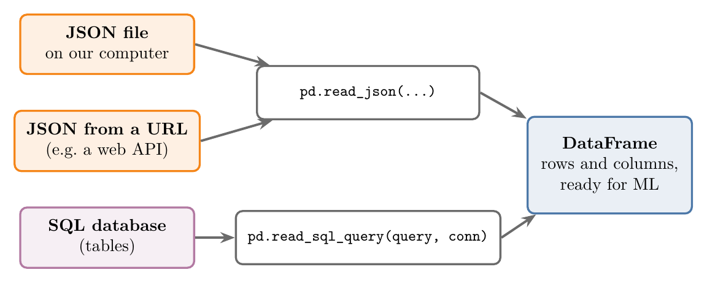
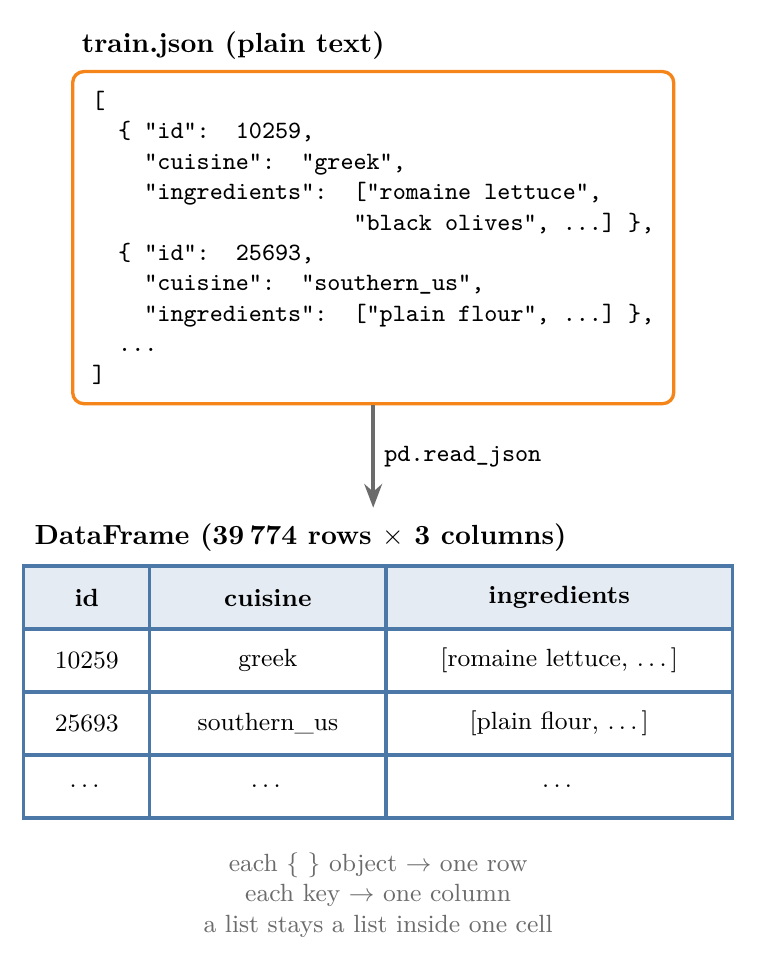
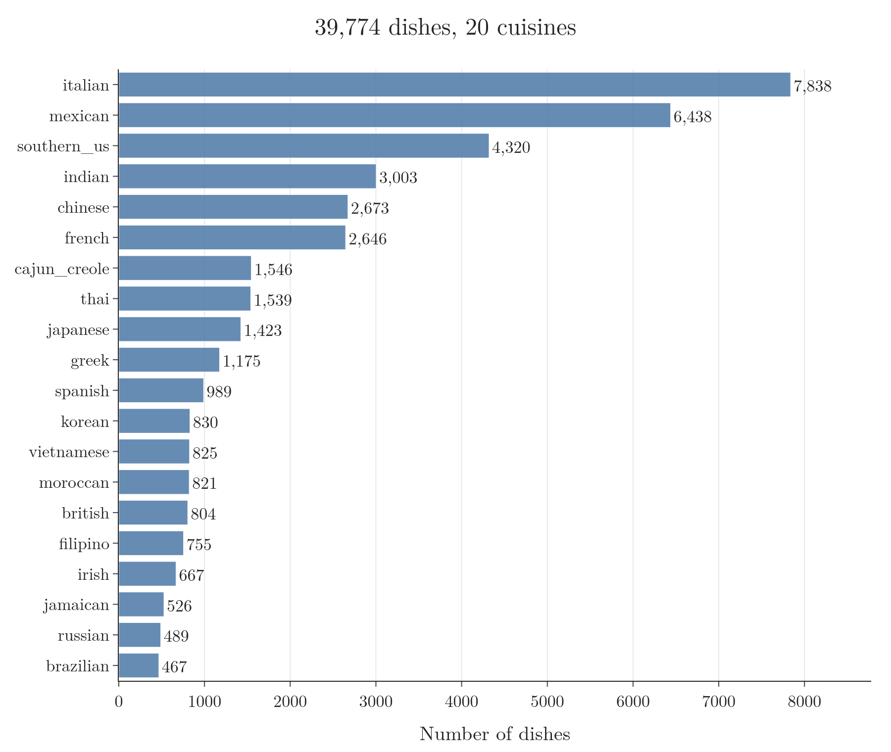
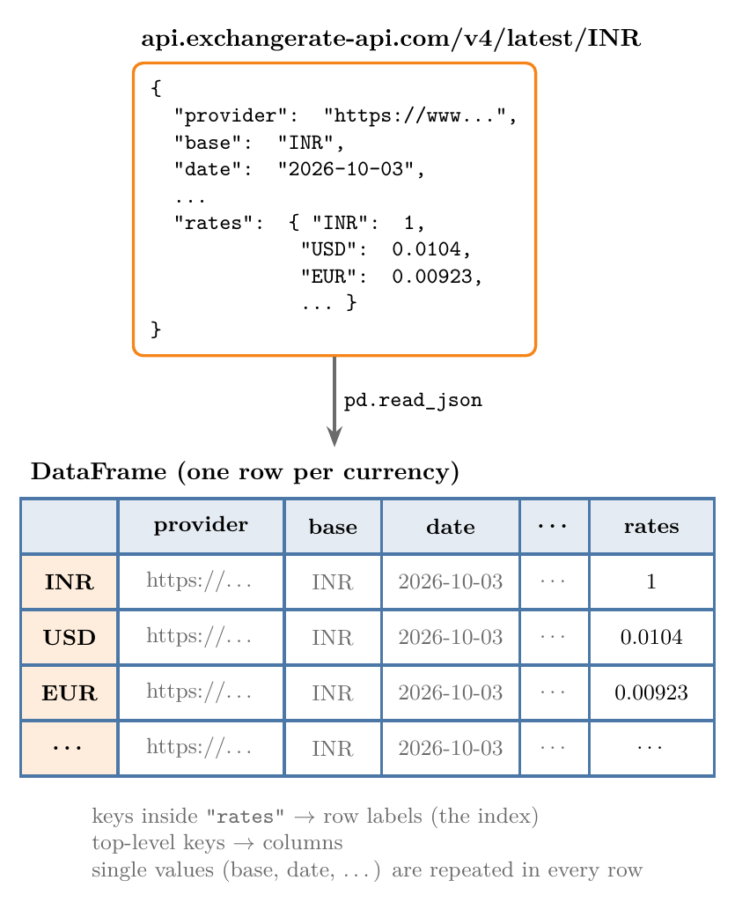
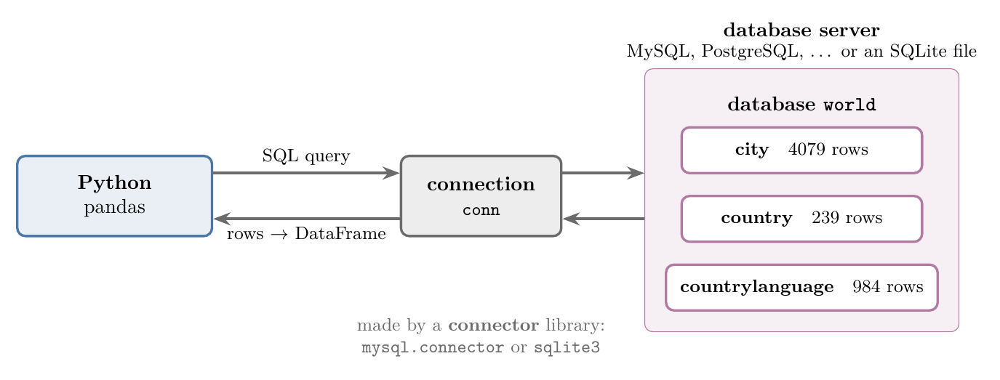
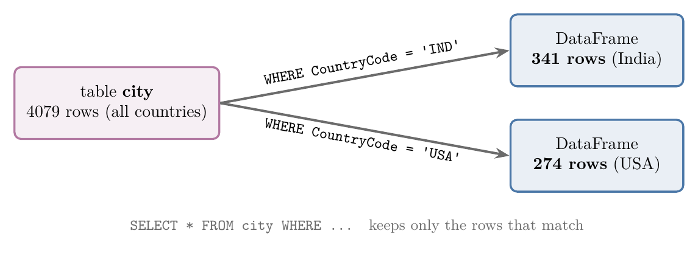

<!-- where-this-fits: generated by course_map/build_map.py; edit concepts.yaml, not this block -->
> **Where this fits:** Pipeline map step 2 (Get data). See the [Course map](../../../00-course-map/00-course-map.md).
>
> 
>
> - **Leads to:** [APIs](../../../ML/02-getting-data/ML-016-fetching-data-from-api/ML-016-fetching-data-from-api.md#2-what-an-api-is).
> - **Compare with:** [CSV files](../../../ML/02-getting-data/ML-014-working-with-csv/ML-014-working-with-csv.md#2-csv-and-tsv-files).
<!-- /where-this-fits -->

## 1. Overview

> **Key point:** pandas reads JSON files, JSON from the web and tables from SQL databases straight into a **DataFrame** (G-1441; pandas' table of rows and columns), just as `read_csv` reads a CSV file.

CSV is not the only way data arrives. Two other formats are everywhere: **JSON**, the format of most web services, and **SQL databases**, where companies keep most of their records. `pandas` is the Python library for tables of data; its DataFrame is introduced in [loading and cleaning the data](../../01-foundations/ML-012-toy-project/ML-012-toy-project.md#3-loading-and-cleaning-the-data). Figure 1 shows the three sources covered here and the pandas function that turns each one into a DataFrame.



The Notebook for this Note (`ML-015-working-with-json-and-sql.ipynb`) runs every example, with the data in `data/`.

## 2. What JSON is

> **Key point:** JSON is a plain-text data format that almost every programming language can read, which makes it the standard way programs exchange data.

**JSON** (G-987) stands for **JavaScript Object Notation**. JSON started in the JavaScript language, but it is now a universal format: Java, Python, JavaScript and almost every other language can read and write it.

Its most important use is in APIs. An **API** (G-204; application programming interface) is a service that other programs can send requests to. When a program sends a request to an API, the reply usually comes back as JSON, so any language can use it.

JSON is very common in ML work. Many datasets on sites such as Kaggle come as JSON files. Figure 2 shows the first recipe of the dataset used in section 4. JSON text is built from two shapes. An **object** is a set of name and value pairs in curly braces, such as the cuisine and the id of one recipe. An **array** is an ordered list in square brackets, such as the ingredients of one recipe. Objects and arrays can sit inside each other.

{width=100%}

> **Extra:** What JSON text looks like.
>
> - **Object:** pairs of key and value inside curly braces, `{"cuisine": "greek", "id": 10259}`. Keys are always text in double quotes.
> - **Array:** an ordered list inside square brackets, `["garlic", "pepper", "salt"]`.
> - **Values:** text in double quotes, numbers, `true`, `false`, `null`, or another object or array inside.
>
> Objects and arrays can sit inside each other to any depth. Nesting is how JSON stores data that does not fit a flat table.

> **Python:** JSON objects look like Python dictionaries, and JSON arrays look like Python lists.
>
> ```python
> recipe = {"id": 10259, "cuisine": "greek"}   # a dictionary
> recipe["cuisine"]                            # "greek": look up by key
> ingredients = ["garlic", "pepper", "salt"]   # a list
> ingredients[0]                               # "garlic": position 0
> ```
>
> When pandas reads JSON, objects become dictionaries and arrays become lists.

## 3. What SQL is

> **Key point:** SQL is the language for asking a database for data; a lot of real-world data lives in SQL databases.

**SQL** (G-1857) stands for **Structured Query Language**. SQL is the language we use to pull data out of a **database** (G-544): a program that stores data as tables and answers requests for it.

A request written in SQL is called a **query**. Company data (customers, orders, payments) usually lives in databases, and many datasets online are shared as SQL files. So for ML we often need to get data out of a database and into a DataFrame.

## 4. Reading a JSON file

> **Key point:** `pd.read_json("file.json")` turns a JSON file into a DataFrame, with one row per object and one column per key.

Our example is a recipe dataset, `train.json`, from a Kaggle competition. Each recipe has three things:

- an `id` (just a number for the dish),
- its `cuisine` (Greek, Indian, Mexican and so on),
- its `ingredients`, a list of text.

The ML task behind this dataset is classification: look at a dish's ingredients and predict which cuisine it belongs to. Each dish is one **observation** (one record, one row of the table). The ingredients are the **feature** (the input variable the model learns from), and the cuisine is the **target** (the output we predict). Here we only load the data; building the model is a job for later.

> **Python:** Reading a JSON file.
>
> ```python
> import pandas as pd
>
> recipes = pd.read_json("data/train.json")
> recipes.head()    # the first 5 rows
> recipes.shape     # (39774, 3)
> ```
>
> `read_json` (G-130) works exactly like `read_csv`: we give it the file name, and it returns a DataFrame. The file sits in the `data` folder next to the Notebook.

Figure 3 shows what happens. The file is a list of objects.

Each object becomes one row, and each key (`id`, `cuisine`, `ingredients`) becomes one column. The result has 39,774 dishes and 3 columns.

{height=58%}

The `ingredients` column is unusual: each cell holds a whole Python list, not a single value. Before training a model on it, we would have to turn those lists into numbers. The `id` column carries no information about the cuisine, so it would be dropped.

Figure 4 counts the dishes of each cuisine. There are 20 cuisines, and they are far from equal: Italian has 7,838 dishes, Brazilian only 467.

{height=50%}

### 4.1 Useful options

> **Key point:** `read_json` has options like `read_csv`: column types, dates, encoding, and reading a large file in pieces.

| Option | What it does |
|---|---|
| `dtype` | Set the data type of the columns |
| `convert_dates` | Turn columns that hold dates into real dates |
| `encoding` | Choose the text encoding, if the file shows strange characters (try `"utf-8"` or `"latin-1"`) |
| `nrows` | Read only the first few rows |
| `chunksize` | Read a large file a piece at a time, so it does not fill the computer's memory (RAM) |

The pandas documentation for `read_json` lists every option. Trying the options is worthwhile on a few different JSON datasets.

> **Extra:** `nrows` and `chunksize` only work with `lines=True`. The `lines=True` setting is for **JSON Lines** files (`.jsonl`), which hold one JSON object per line instead of one big list. `train.json` is one big list, so `pd.read_json("data/train.json", nrows=5)` gives an error: "nrows can only be passed if lines=True".

> **Extra:** In older pandas, `read_json` also accepted JSON text itself, for example `pd.read_json('[{"a": 1}]')`. pandas 2.1 deprecated this (pandas release notes), and pandas 3.0 treats any text as a file name and fails with `FileNotFoundError`. To read JSON text, wrap the text first: `pd.read_json(io.StringIO(text))`, after `import io`.

## 5. Reading JSON from a URL

> **Key point:** `read_json` also accepts a web address, so we can load an API's reply directly into a DataFrame.

The file does not have to be on our computer. If a web address returns JSON, we pass the address instead of a file name.

Our example is a free exchange-rate API. The address below returns how much one Indian rupee is worth in every other currency, updated daily.

> **Python:** Reading JSON from a URL.
>
> ```python
> url = "https://api.exchangerate-api.com/v4/latest/INR"
> rates = pd.read_json(url)
> rates.shape                    # (166, 7)
> rates.loc["USD", "rates"]      # 0.0104
> ```
>
> `rates.loc["USD", "rates"]` picks the row labelled `USD` and the column `rates`.

Figure 5 shows how this reply becomes a table. The reply is one object. Its key `rates` holds a second object with one key per currency.

pandas makes each currency inside `rates` a row label, and each top-level key a column. Single values, like the base currency `INR` and the date, are repeated on every row. The result is 166 rows (currencies) and 7 columns.

On 3 October 2026, one rupee was worth 0.0104 US dollars, 0.00923 euros and 1.64 Japanese yen. The numbers change daily, so running the code again gives different values.

{height=60%}

> **Extra:** In case the address stops working, the Notebook falls back to a saved copy, `data/exchange_rates_INR.json`.

## 6. Getting an SQL database ready

> **Key point:** Before Python can read SQL data, the data must be loaded into a database; here that is the `world` database with three tables.

Our example is the `world` dataset, shared as one file, `world.sql`. A `.sql` file is a list of SQL commands that create tables and fill them with rows.

To use it, we load it into a **database server** (G-543): a program that holds databases and answers queries. MySQL, PostgreSQL and SQLite are common ones.

One easy way to run MySQL on a personal computer is **XAMPP** (G-2130), a free package that installs a web server and a MySQL server together. The steps are:

1. Download `world.sql`.
2. Install XAMPP and open its control panel.
3. Start two services: **Apache** (the web server) and **MySQL** (the database server).
4. Open `localhost/phpmyadmin` in a browser. **phpMyAdmin** (G-1493) is a web page for managing MySQL databases.
5. Create a new database named `world`.
6. Import `world.sql` into it. Large SQL files take a little while.

After the import, the database holds three tables (Figure 6):

| Table | Rows | One row is | Some columns |
|---|---|---|---|
| `city` | 4,079 | a city | `Name`, `CountryCode`, `District`, `Population` |
| `country` | 239 | a country | `Name`, `Continent`, `SurfaceArea`, `IndepYear`, `Population`, `LifeExpectancy` |
| `countrylanguage` | 984 | a language spoken in a country | `CountryCode`, `Language`, `IsOfficial`, `Percentage` |

{width=100%}

> **Extra:** We skip the server in this Note. Python comes with **SQLite** (G-1859), a database that lives in a single file and needs no server, no XAMPP and no install. We converted `world.sql` into the file `data/world.db` (the script `data/make_world_db.py` does it), with the same three tables and the same rows. The pandas code is identical either way; only the connection line differs.

## 7. Connecting Python to the database

> **Key point:** A connector library builds a bridge between Python and the database; through that connection, pandas sends queries and gets back rows.

Python and a database are two separate programs. To let them talk, we need a **connector**: a library that opens a **connection** between them.

For MySQL the connector is `mysql.connector`; for SQLite it is `sqlite3`, which comes with Python. Figure 7 shows the bridge.



To connect to MySQL, we tell `connect` four things:

- **host:** the address of the machine running the database server. `localhost` means our own computer; a database on a remote server (for example on AWS) would need that server's address.
- **user:** the user name. With XAMPP it starts as `root`.
- **password:** with XAMPP it starts empty, `""`.
- **database:** which database on the server to use, here `world`.

`connect` returns a **connection object**, usually named `conn`. Every query then goes through it.

> **Python:** Connecting to MySQL (the XAMPP setup) and to SQLite (this Note).
>
> ```python
> # MySQL: install once with
> #   pip install mysql-connector-python
> import mysql.connector
> conn = mysql.connector.connect(
>     host="localhost", user="root",
>     password="", database="world")
>
> # SQLite: built into Python, just give the file
> import sqlite3
> conn = sqlite3.connect("data/world.db")
> ```

> **Extra:** The MySQL connector's package name is `mysql-connector-python`. `pip install mysql.connector` instead installs `mysql-connector` 2.2.9, an old version released in 2019 (PyPI); use the current package. With a MySQL connection, pandas shows a warning, because `read_sql` supports only SQLite and **SQLAlchemy** connections (pandas docs, `read_sql`). The query still works. The cleaner way is an SQLAlchemy engine: `create_engine("mysql+mysqlconnector://root:@localhost/world")`, passed to pandas in place of `conn`. The Notebook shows both.

## 8. Reading query results into a DataFrame

> **Key point:** `pd.read_sql_query(query, conn)` runs an SQL query through the connection and returns the result as a DataFrame.

`read_sql_query` needs two things: the query, written as text, and the connection. To get the whole `city` table, the query is `SELECT * FROM city`: `SELECT *` means "give me all columns" and `FROM city` names the table the columns come from.

> **Python:** Reading a whole table.
>
> ```python
> city = pd.read_sql_query("SELECT * FROM city", conn)
> city.shape    # (4079, 5)
> ```

> **Extra:** The SQL used here, word by word.
>
> - `SELECT *` means "give me all columns". `SELECT Name, Population` would give only those two.
> - `FROM city` names the table.
> - `WHERE condition` keeps only the rows where the condition is true.
> - Text values go in single quotes (`'IND'`); numbers do not (`60`).

### 8.1 Filtering rows with WHERE

> **Key point:** Changing the query changes what comes back; `WHERE` lets the database filter rows before they reach pandas.

Anyone who knows SQL can shape the data with the query itself. To keep only Indian cities, we add `WHERE CountryCode = 'IND'`: 341 rows come back instead of 4,079. Changing `'IND'` to `'USA'` gives the 274 American cities (Figure 8).



The same works on any table. To get every country whose life expectancy is above 60, we query the `country` table: 167 of the 239 countries come back.

> **Python:** Queries with a condition.
>
> ```python
> india = pd.read_sql_query(
>     "SELECT * FROM city WHERE CountryCode = 'IND'", conn)
> india.shape        # (341, 5)
>
> countries = pd.read_sql_query(
>     "SELECT * FROM country WHERE LifeExpectancy > 60", conn)
> countries.shape    # (167, 15)
> ```
>
> The query is text in double quotes, so the SQL text value `'IND'` uses single quotes inside it.

### 8.2 Useful options

> **Key point:** `index_col` picks the row labels and `chunksize` reads a big result a piece at a time.

`read_sql_query` has fewer options than `read_csv`, but three are worth knowing:

- `index_col="ID"` uses the `ID` column as the row labels, just like `index_col` in `read_csv`.
- `parse_dates=["OrderDate"]` turns a column of dates stored as text, such as `"2024-03-15"`, into real dates, just like `parse_dates` in `read_csv`. The `world` tables have no such column. A year stored as a plain number, like `IndepYear`, must not be passed: pandas reads the number as seconds after 1 January 1970, so Afghanistan's 1919 becomes `1970-01-01 00:31:59` (checked on `data/world.db`). Keep years as numbers.
- `chunksize=1000` returns the rows 1,000 at a time, so a huge table does not have to fit in memory at once.

> **Python:** Two of the options.
>
> ```python
> pd.read_sql_query("SELECT * FROM city", conn,
>                   index_col="ID")
>
> for chunk in pd.read_sql_query("SELECT * FROM city",
>                                conn, chunksize=1000):
>     print(chunk.shape)   # (1000, 5) four times, then (79, 5)
> ```

There are other ways to work with SQL from Python, but this one is simple and covers most needs. Getting data from an API, with more control than a single URL, comes in the next Note.

## 9. Summary

| Source | What we need | pandas function | Our example |
|---|---|---|---|
| JSON file | The file name | `read_json` | 39,774 recipes, 3 columns |
| JSON from a URL | The web address | `read_json` | 166 exchange rates, 7 columns |
| SQL database | A connection and a query | `read_sql_query` | 4,079 cities; 341 in India |

- JSON is the universal text format that APIs reply in, because almost every programming language can read and write it; objects become rows and keys become columns.
- `read_json` takes a file name or a URL, so an API's reply loads straight into a DataFrame. `nrows` and `chunksize` need `lines=True`, because they work only on JSON Lines files, with one object per line.
- SQL is the language for querying databases. A connector (`mysql.connector`, `sqlite3`) opens the connection, because Python and the database are two separate programs.
- `read_sql_query` runs the query and returns a DataFrame. `WHERE` filters rows inside the database, so only the rows we need reach pandas (341 Indian cities instead of all 4,079).
- The pandas code is the same for MySQL and SQLite; only the connection changes, so the Notebook can use the SQLite file and skip installing a database server.

## 10. Sources

**Built from**

- CampusX, "Working with JSON/SQL | Day 16 | 100 Days of Machine Learning", YouTube, https://www.youtube.com/watch?v=fFwRC-fapIU

**Other references**

- pandas documentation. `pandas.read_json` and `pandas.read_sql`. pandas.pydata.org.
- pandas release notes. What's new in 2.1.0. pandas.pydata.org/docs/whatsnew.
- PyPI. mysql-connector 2.2.9 (released 1 April 2019). pypi.org/project/mysql-connector.

## 11. Key terms

Terms taught in this Note come first; linked terms are recaps, taught in the Note the link opens.

| Term | Meaning |
|---|---|
| JSON (JavaScript Object Notation) (G-987) | A plain-text format for structured data, made of objects and arrays, that almost every language can read; used by APIs. |
| SQL (Structured Query Language) (G-1857) | The language for asking a database for data. |
| Database (G-544) | A program that stores data as tables and answers queries. |
| `read_json` (G-130) | pandas function that reads JSON from a file or a URL into a DataFrame. |
| Database server (G-543) | A program that holds databases and answers queries, such as MySQL. |
| XAMPP (G-2130) | A free package that runs a web server and a MySQL server on one computer. |
| phpMyAdmin (G-1493) | A web page for creating and managing MySQL databases. |
| SQLite (G-1859) | A database stored in a single file, built into Python, needing no server. |
| `read_sql_query` (G-131) | pandas function that runs an SQL query and returns a DataFrame. |
| Connection object (G-450) | The open link to a database (`conn`) that queries go through. |
| Connector (G-451) | A library that lets Python talk to a database. |
| JSON Lines (G-988) | A JSON file with one object per line, read with `lines=True`. |
| Query (SQL) (G-1606) | A request for data, written in SQL. |
| SQLAlchemy (G-1858) | A Python library that connects to many kinds of database; pandas supports it fully. |
| [pandas, DataFrame](../../../ML/01-foundations/ML-012-toy-project/ML-012-toy-project.md#3-loading-and-cleaning-the-data) (G-1441) | Python's main table library, and its name for a table. |
| [API (Application Programming Interface)](../../../ML/01-foundations/ML-007-challenges-in-ml/ML-007-challenges-in-ml.md#2-collecting-data) (G-204) | A service that returns data when our code asks for it; a website's API hands out its data on request. |
| [Observation](../../../ML/01-foundations/ML-003-types-of-ml/ML-003-types-of-ml.md#21-learning-from-inputs-and-outputs) (G-1374) | One record of a dataset: one row of the data table. |
| [Feature](../../../ML/01-foundations/ML-002-ai-vs-ml-vs-dl/ML-002-ai-vs-ml-vs-dl.md#52-features-chosen-by-us-or-learned) (G-772) | One piece of information about each example that a model uses (e.g. a student's CGPA). |
| [Target](../../../ML/01-foundations/ML-003-types-of-ml/ML-003-types-of-ml.md#21-learning-from-inputs-and-outputs) (G-1949) | The output column we predict, such as the class; also called the label. |
