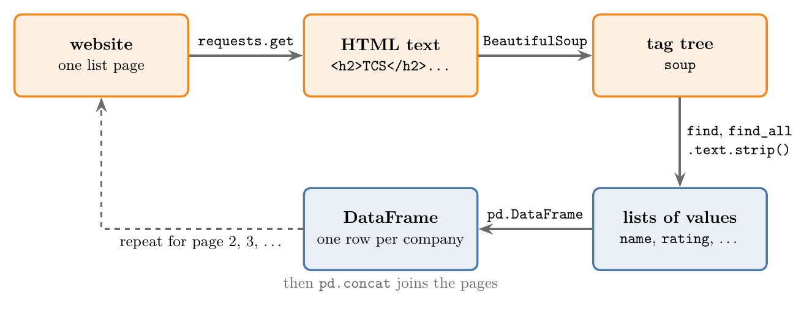
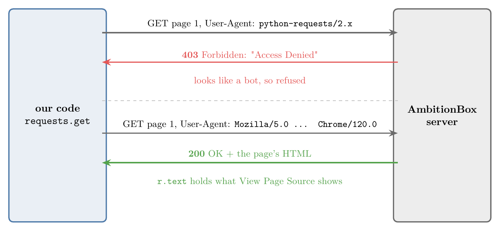
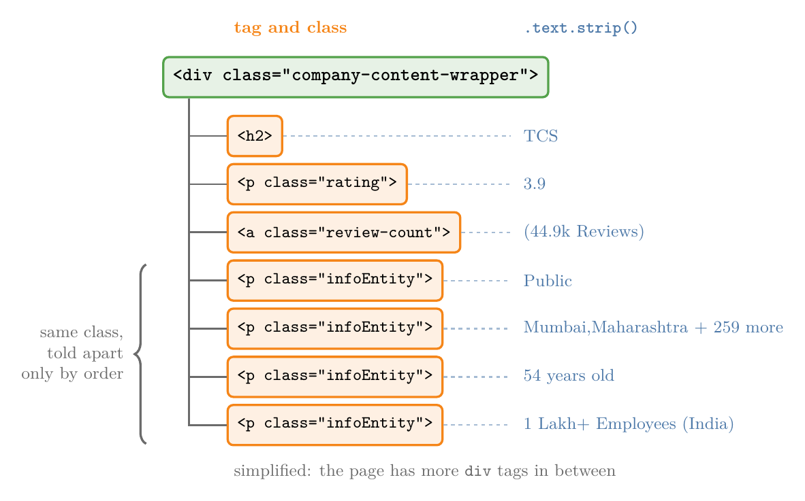
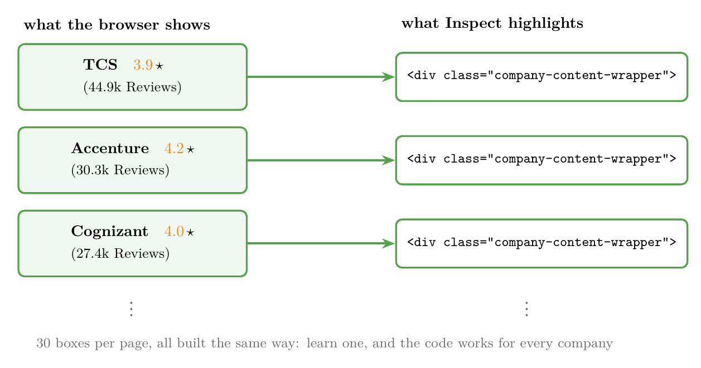
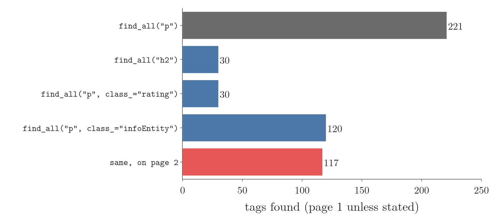
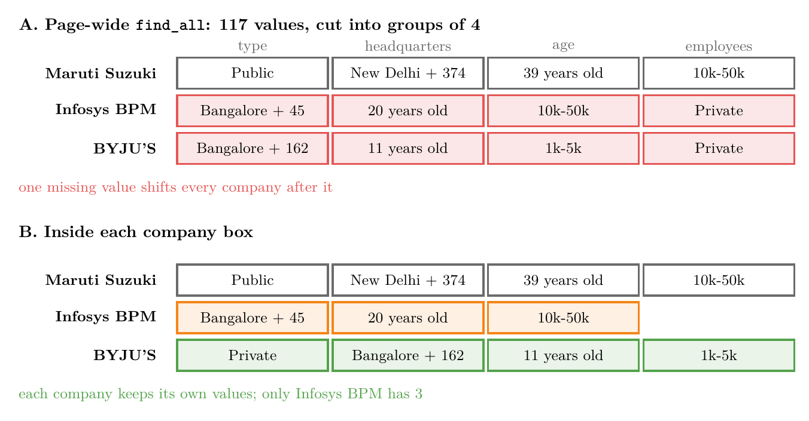
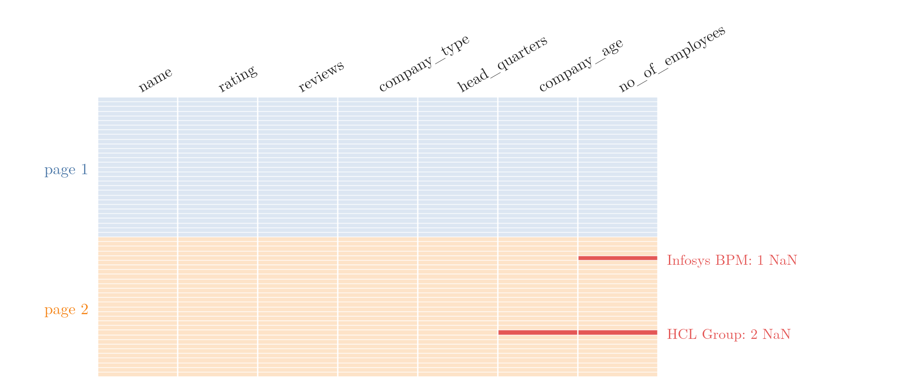

<!-- where-this-fits: generated by course_map/build_map.py; edit concepts.yaml, not this block -->
> **Where this fits:** Pipeline map step 2 (Get data). See the [Course map](../../../00-course-map/00-course-map.md).
>
> 
>
> - **Compare with:** CSV files ([Note ML-014](../../../ML/02-getting-data/ML-014-working-with-csv/ML-014-working-with-csv.md)); APIs ([Note ML-016](../../../ML/02-getting-data/ML-016-fetching-data-from-api/ML-016-fetching-data-from-api.md)).
<!-- /where-this-fits -->

## 1. Overview

> **Key point:** When a website shows data but offers no file and no API, we download its pages, read their HTML and copy the values we need into a DataFrame.

**Web scraping** (G-2105) means writing a program that downloads web pages and pulls data out of them. Scraping is the last resort for getting data: we use it when there is no CSV file to download and no API to ask.

Figure 1 shows the whole process. The rest of this Note goes through it box by box:

1. `requests.get` downloads one page as **HTML** (G-904) text.
2. `BeautifulSoup` turns that text into a tree of tags we can search. (A tag is one labelled box of the page, such as a heading or a paragraph; Section 4 shows what they look like.)
3. `find` and `find_all` pick out the tags we want, and `.text` gives the values inside them.
4. The values go into lists, and the lists become a DataFrame.
5. We repeat for every page and join the pages into one table.



The Notebook for this Note (`notebook.ipynb`) runs every step. The saved web pages it uses are in `data/`.

## 2. When we need web scraping

> **Key point:** Scraping is for data that is visible on a website but not offered in any other form.

Our example website is **AmbitionBox**, a site where employees review the companies they work for. Its "List of companies in India" shows, for each company:

- name, rating (out of 5) and number of reviews,
- company type (public, private, ...),
- headquarters and number of other offices,
- age of the company and number of employees.

The list is split into pages of 30 companies each, about 333 pages in total. The address of each page ends in its number: `...list-of-companies?page=1`, `?page=2`, and so on.

The site has no API and no download button. So our task is to visit the pages one by one, collect these seven details for every company, and build one DataFrame.

## 3. Downloading a page with requests

> **Key point:** `requests.get(url).text` downloads a page's HTML; if the server refuses, we send a User-Agent header so the request looks like it comes from a browser.

### 3.1 The request and the status code

> **Key point:** Every reply carries a status code; 200 means success, 403 means the server refused.

**requests** (G-1674) is a Python library for downloading things from the web. `requests.get(url)` sends a **request** to the website's **server** (G-1779) (the computer that hosts the site) and returns its **response** (G-1686).

> **Python:** Downloading a page.
>
> ```python
> import requests
>
> url = "https://www.ambitionbox.com/list-of-companies?page=1"
> r = requests.get(url)
> r.status_code     # 200 = OK, 403 = refused
> webpage = r.text  # the page's HTML, as one long string
> ```

The **status code** (G-1886) is a number in the reply that says how the request went (RFC 9110, §15). For AmbitionBox, a plain request came back with **403**, and `r.text` held only a short "Access Denied" message instead of the page.

> **Extra:** Common status codes.
>
> | Code | Meaning |
> |---|---|
> | 200 | OK: the page is in the reply |
> | 403 | Forbidden: the server understood but refuses |
> | 404 | Not found: no page at this address |
> | 429 | Too many requests: slow down |
> | 503 | Service unavailable: the server is busy or blocking us |

### 3.2 Looking like a browser

> **Key point:** A User-Agent header tells the server which browser is asking; sending a browser's User-Agent gets past simple bot checks.

A browser announces itself with a short text called the **User-Agent** (G-2064) (see "Opening a file from a URL", section 5 of the [CSV Note](../ML-014-working-with-csv/ML-014-working-with-csv.md)). Many sites refuse requests that look like they come from a program (a **bot** (G-325)), and a plain `requests.get` gives itself away by sending `python-requests/2.x`.

So we send a browser's User-Agent ourselves, in the request's **headers** (G-885) (extra information sent along with a request):

> **Python:** Sending a browser User-Agent.
>
> ```python
> headers = {"User-Agent":
>            "Mozilla/5.0 (Windows NT 10.0; Win64; x64) "
>            "AppleWebKit/537.36 (KHTML, like Gecko) "
>            "Chrome/120.0 Safari/537.36"}
> webpage = requests.get(url, headers=headers).text
> ```
>
> `headers` is a dictionary. Two strings written next to each other inside brackets are joined into one.

With this header, the server sent the whole page. `webpage` now holds exactly the text we see in a browser with right-click, **View Page Source** (G-2089).

Figure 2 puts the two requests side by side. Watch the User-Agent line: it is the only thing that changes, and it turns a 403 into a 200.



> **Extra:** A 403 comes from the server deciding to block us. A related file is **robots.txt** (G-1698): a text file at the site's root (for example `ambitionbox.com/robots.txt`) that lists which parts of the site bots are asked not to visit. robots.txt cannot block anyone; it is a request that polite bots, like search engines, follow (RFC 9309). Section 12 comes back to it.

> **Extra:** What changed since this code was written (checked October 2026).
>
> - **The site blocks scripts.** AmbitionBox no longer answers `requests` at all, with or without a User-Agent: the connection simply waits until it times out. Even `robots.txt` gets no answer. Sites like this use bot-detection services that look at more than the User-Agent.
> - **The site was redesigned.** The class names this Note relies on (`company-content-wrapper`, `rating`, `infoEntity`) are gone. Today each company sits in a `div` with class `companyCardWrapper`, and the page no longer shows company type, age or employees.
> - **What we use instead.** The **Wayback Machine** (G-2101) (`web.archive.org`) keeps copies of web pages as they were. `data/` holds real copies of list pages 1 and 2 from August 2022, which have the layout used here, and page 1 from August 2026. `data/fetch_archive.py` downloads them; it removes only the `<script>` and `<style>` blocks to save space.
> - **The Notebook** tries the live site first, with a 10-second time limit, and falls back to the saved copies. Its last section runs the same method on the 2026 page with the new class names.

## 4. HTML: tags, classes and nesting

> **Key point:** An HTML page is a tree of tags; each tag has a name, may have a class, and holds text or other tags.

To pull values out of a page, we need to read its structure. **HTML** (HyperText Markup Language) is the language web pages are written in. HTML is made of **tags** (G-1941):

- A tag opens with `<name>` and closes with `</name>`. Whatever sits between them is the tag's content: `<h2>TCS</h2>`.
- Tags sit inside other tags, so a page is a **tree**: one big tag holding smaller ones, holding smaller ones again.
- The opening tag can carry **attributes** (G-228), extra settings written as `name="value"`. The most useful one for scraping is **class** (G-389), a label that page designers give to tags so they can style them together.

> **Extra:** The tags met in this Note.
>
> | Tag | Used for |
> |---|---|
> | `h1`, `h2` | Headings: `h1` is the main title, `h2` a smaller heading |
> | `p` | A paragraph of text |
> | `a` | A link |
> | `div` | A box that groups other tags; it shows nothing by itself |

Figure 3 shows the HTML of one company on the list page. Everything about TCS sits inside one `div` with class `company-content-wrapper`. Inside it, the name is in an `h2`, the rating in a `p` with class `rating`, and the four details in `p` tags that all share the class `infoEntity`.



## 5. Parsing the page with BeautifulSoup

> **Key point:** `BeautifulSoup(webpage, "html.parser")` turns the HTML text into an object we can search tag by tag.

`webpage` is just a long string. To search it by tag and class, we hand it to **BeautifulSoup** (G-273), a library for reading HTML. BeautifulSoup **parses** (G-1454) the text: it reads the text and builds the tree of tags.

> **Python:** Parsing HTML.
>
> ```python
> from bs4 import BeautifulSoup
>
> soup = BeautifulSoup(webpage, "html.parser")
> print(soup.prettify())   # the HTML, neatly indented
> ```
>
> The library is installed as `beautifulsoup4` and imported from `bs4`. The result is usually called `soup`.

`prettify()` prints the HTML with one tag per line, indented by depth, so the nesting is easy to follow. `prettify()` changes nothing; it only helps us read.

> **Extra:** The second argument chooses the **parser** (G-1454), the part that reads the HTML. `"html.parser"` is built into Python. `"lxml"` is faster (Beautiful Soup docs, "Installing a parser") and is included in Anaconda, but in a plain Python setup, including our environment, it needs `pip install lxml` first; without it, `BeautifulSoup(webpage, "lxml")` stops with `FeatureNotFound`. For one page at a time the difference in speed does not matter.

## 6. Finding the right tags with Inspect

> **Key point:** The browser's Inspect tool shows which tag, and which class, holds any part of the page.

The page source is thousands of lines long, so we do not read it top to bottom. Instead we let the browser point us to the right tag:

1. Open the page in a browser, right-click anywhere and choose **Inspect** (G-953). A panel opens with the page's HTML.
2. Click the **element picker** (the arrow-in-a-box button at the panel's top left).
3. Move the mouse over any part of the page. The tag that draws it is highlighted in the panel.
4. Click to select it, and read its tag name and class.

Hovering over the whole TCS box highlights its `div` with class `company-content-wrapper`. Hovering over the next box, Accenture, highlights another `div` with the same class.

The page is 30 identical boxes, one per company, filled with different values. A tag that holds everything about one item, as each of these `div` tags holds one company, is called a **container** (G-458). The repeated container is what makes scraping possible: once we know how one container is built, we know them all.

Figure 4 shows the first three containers (company boxes) of page 1 and the tag Inspect highlights for each. Watch the right column: the tag and its class are the same every time; only the values inside change.



## 7. find_all and .text

> **Key point:** `soup.find_all("h2")` returns a list of every `h2` tag; `.text.strip()` gives the clean text inside one tag.

To collect every tag of one kind, we use **`find_all`** (G-83): it takes a tag name and returns a list of every tag with that name in the page.

> **Python:** The page title.
>
> ```python
> soup.find_all("h1")
> # [<h1 ...>List of companies in India</h1>]
> soup.find_all("h1")[0].text.strip()
> # 'List of companies in India'
> ```
>
> `[0]` takes the first tag in the list. `.text` gives the text inside a tag, without the tags themselves.

The company names are in `h2` tags, and the page has exactly 30 of them. Their text, though, comes padded with tabs and newlines from the way the HTML was written: `'\n\t\t\t\tTCS\n\t\t\t'`. The string method `.strip()` removes such spaces from both ends.

> **Python:** All company names on the page.
>
> ```python
> for tag in soup.find_all("h2"):
>     print(tag.text.strip())   # TCS, Accenture, Cognizant, ...
> ```

`len(soup.find_all("h2"))` counts them: 30, one per company.

## 8. Selecting tags by class

> **Key point:** When a tag name is used for many things, adding `class_="..."` keeps only the tags with that class.

The rating is in a `p` tag. But `p` is used all over the page: menus, notices, the company details. `soup.find_all("p")` returns 221 tags, most of them nothing to do with ratings.

The class tells them apart. In Figure 3, the rating's `p` has class `rating`, and no other `p` has that class. So we ask for `p` tags with that class only:

> **Python:** Ratings and review counts.
>
> ```python
> ratings = soup.find_all("p", class_="rating")
> len(ratings)                       # 30
> ratings[0].text.strip()            # '3.9'
>
> reviews = soup.find_all("a", class_="review-count")
> reviews[0].text.strip()            # '(44.9k Reviews)'
> ```
>
> The argument is `class_`, with an underscore, because `class` is a reserved word in Python.

Both lists have 30 items, one per company, so this works. The number of reviews is in an `a` tag (a link, because clicking it opens the reviews) with class `review-count`.

Figure 5 counts what each query finds on the saved pages. Watch the drop from 221 to 30: the class keeps exactly one `p` per company. The last bar, 117 instead of 120, is the problem of the next section.



## 9. When values cannot be matched to companies

> **Key point:** A page-wide list of values breaks as soon as one company is missing a value: we can no longer tell which value belongs to whom.

Company type, headquarters, age and employees are four `p` tags that all share the class `infoEntity` (Figure 3). On page 1, `find_all("p", class_="infoEntity")` returns 120 tags: 30 companies times 4. We could take them in groups of four.

On page 2 the same line returns only 117. Some companies do not list all four details, and a flat list does not say which ones.

Figure 6A shows what goes wrong if we cut it into groups of four anyway. Infosys BPM has no company type, so its row starts with its headquarters and ends with the next company's type. Every company after it is shifted too.



The same problem can hit any field that some companies lack. We need values that stay attached to their company.

## 10. Working one company box at a time

> **Key point:** First find the 30 containers (one `div` per company), then search inside each container; whatever we find there belongs to that company.

The fix is to change the order of the search. Instead of searching the whole page for each field, we:

1. find the 30 containers, the `div` tags with class `company-content-wrapper`;
2. loop over the containers, and inside each one find the name, rating and details.

A search inside one container can only find that company's tags. Figure 6B shows the result: Infosys BPM still has 3 details, but BYJU'S and every company after it are untouched.

> **Python:** The boxes, and a search inside one of them.
>
> ```python
> company = soup.find_all("div", class_="company-content-wrapper")
> len(company)                                # 30
>
> first = company[0]                          # the TCS box
> first.find("h2").text.strip()               # 'TCS'
> first.find("p", class_="rating").text.strip()   # '3.9'
> info = first.find_all("p", class_="infoEntity")
> info[0].text.strip()                        # 'Public'
> info[1].text.strip()     # 'Mumbai,Maharashtra + 259 more'
> ```

`company[0]` is itself a piece of the tree, so it has the same `find` and `find_all` methods as `soup`. Two methods, two kinds of result:

| Method | Returns | Use when |
|---|---|---|
| `find(...)` | the first matching tag, or `None` if there is none | exactly one such tag is expected |
| `find_all(...)` | a list of all matching tags (possibly empty) | several are expected; pick one with `[0]`, `[1]`, ... |

Inside one box there is only one `h2` and one `p` with class `rating`, so `find` is enough, and we can use `.text` on it directly. There are four `infoEntity` tags, so we use `find_all` and pick them by position.

## 11. Building the DataFrame for one page

> **Key point:** One list per column; the loop appends one value to each list per company; a dictionary of the lists becomes the DataFrame.

Figure 7 shows the loop at work. Each pass takes one container, reads its values, and adds one row to the table. Each company becomes one **observation** (G-1374) (one record, one row of the table), and each detail we collect becomes a **feature** (G-772) (a variable describing the company, one column of the table).


> **Python:** One page into a DataFrame.
>
> ```python
> import pandas as pd
>
> name, rating, reviews, ctype = [], [], [], []
> hq, how_old, no_of_employee = [], [], []
>
> for i in company:                     # i = one company box
>     info = i.find_all("p", class_="infoEntity")
>     name.append(i.find("h2").text.strip())
>     rating.append(i.find("p", class_="rating").text.strip())
>     reviews.append(i.find("a", class_="review-count").text.strip())
>     ctype.append(info[0].text.strip())
>     hq.append(info[1].text.strip())
>     how_old.append(info[2].text.strip())
>     no_of_employee.append(info[3].text.strip())
>
> df = pd.DataFrame({"name": name, "rating": rating,
>                    "reviews": reviews, "company_type": ctype,
>                    "head_quarters": hq, "company_age": how_old,
>                    "no_of_employees": no_of_employee})
> df.shape    # (30, 7)
> ```
>
> `[]` is an empty list, and `.append(x)` adds `x` to its end. `pd.DataFrame` takes a dictionary: each key becomes a column name and each list that column's values.

The first rows of `df`, in two parts:

| name | rating | reviews | company_type |
|---|---|---|---|
| TCS | 3.9 | (44.9k Reviews) | Public |
| Accenture | 4.2 | (30.3k Reviews) | Public |
| Cognizant | 4.0 | (27.4k Reviews) | Private |

| name | head_quarters | company_age | no_of_employees |
|---|---|---|---|
| TCS | Mumbai,Maharashtra + 259 more | 54 years old | 1 Lakh+ Employees (India) |
| Accenture | Dublin + 140 more | 33 years old | 1 Lakh+ Employees (India) |
| Cognizant | Teaneck. New Jersey. + 93 more | 28 years old | 1 Lakh+ Employees (India) |

Every value is still text, such as `"(44.9k Reviews)"` or `"54 years old"`. Turning these into numbers is a cleaning job for later; scraping only collects them.

> **Extra:** Long names are cut short on the page: `"Mahindra & Mahin..."`. The full name is in the `h2` tag's `title` attribute, `<h2 title="Mahindra & Mahindra">`. A tag's attribute is read like a dictionary: `i.find("h2")["title"]`. The Notebook uses it for the final table.

## 12. Scraping every page

> **Key point:** Put the one-page code inside a loop over page numbers, turn missing values into NaN instead of errors, and join the pages with `pd.concat`.

Each page's address differs only in its number, so a loop over `page=1, 2, 3, ...` reaches every page. For each page we:

1. download it;
2. parse it;
3. build a small DataFrame;
4. collect that DataFrame in a list.

At the end, **`pd.concat`** (G-125) stacks all the small DataFrames into one.

Over hundreds of pages, some company will lack a field. Then `find` returns `None`, and `.text` on `None` stops the program with an `AttributeError`; `info[3]` on a company with three details stops it with an `IndexError`. To keep going, we record a **missing value** (G-1234), `NaN`, instead.

> **Python:** Every page into one DataFrame.
>
> ```python
> import time
> import numpy as np
>
> def text_or_nan(tag):
>     # find returns None when the tag is not there
>     return tag.text.strip() if tag is not None else np.nan
>
> def scrape_page(html):
>     soup = BeautifulSoup(html, "html.parser")
>     rows = []
>     for i in soup.find_all("div", class_="company-content-wrapper"):
>         info = [p.text.strip() for p in
>                 i.find_all("p", class_="infoEntity")]
>         info += [np.nan] * (4 - len(info))   # pad to 4
>         rows.append({"name": i.find("h2")["title"].strip(),
>             "rating": text_or_nan(i.find("p", class_="rating")),
>             "reviews": text_or_nan(
>                 i.find("a", class_="review-count")),
>             "company_type": info[0], "head_quarters": info[1],
>             "company_age": info[2], "no_of_employees": info[3]})
>     return pd.DataFrame(rows)
>
> pages = []
> for j in range(1, 334):                  # pages 1 to 333
>     url = f"https://www.ambitionbox.com/list-of-companies?page={j}"
>     html = requests.get(url, headers=headers).text
>     pages.append(scrape_page(html))
>     time.sleep(2)                        # pause between requests
>
> final = pd.concat(pages, ignore_index=True)
> ```
>
> `range(1, 334)` gives 1, 2, ..., 333. `f"...{j}"` is an **f-string** (G-741): `{j}` is replaced by the value of `j`. The padding line `info += [np.nan] * (4 - len(info))` makes every company's list of details exactly 4 long, so `info[3]` never fails. Step by step for a company that shows only 3 details:
>
> | Step | Value |
> |---|---|
> | `info` before | `["IT", "Mumbai", "79 years"]` |
> | `len(info)` | 3 |
> | `4 - len(info)` | 1 |
> | `[np.nan] * 1` | `[nan]` |
> | `info` after | `["IT", "Mumbai", "79 years", nan]` |
>
> For a company with 4 details, `4 - 4 = 0`, `[np.nan] * 0` is the empty list, and `info` stays as it was. `ignore_index=True` numbers the rows 0, 1, 2, ... across all pages. Each row here is a dictionary, and a list of dictionaries also becomes a DataFrame.

On our two saved pages, `final.shape` is `(60, 7)`, and 3 cells are NaN: the details missing for Infosys BPM and HCL Group. Downloading all 333 pages takes a while, so it is worth trying 5 or 10 pages first.

Figure 8 draws `final` cell by cell. Watch where the NaN cells sit: always in the last columns, because the padding adds NaN at the end of the details list. The third Extra below explains why that position can be wrong.



> **Extra:** Another common way to survive missing values is to wrap each line in `try:` ... `except AttributeError:` and append `np.nan` in the `except` part. The result is the same. Name the error to catch: a bare `except:` also hides typos and other bugs.

> **Extra:** Older code joins pages with `final = final.append(df, ignore_index=True)`. `DataFrame.append` was removed in pandas 2.0 (pandas release notes), so this now fails with an `AttributeError`. Collecting the pieces in a list and calling `pd.concat` once is the current way, and faster.

> **Extra:** Padding the details to four values stops the crash, but it hides a subtler error. Infosys BPM's three details are headquarters, age and employees; taken by position, its headquarters lands in `company_type`, its age in `head_quarters`, and so on. Each detail has an icon tag inside it (`<i class="icon-pin-drop">` for headquarters, `icon-access-time` for age, and so on). Matching each detail by its icon instead of its position puts every value in the right column; the Notebook shows how. The general lesson: always look at a few rows of scraped data, especially rows with NaN.

> **Extra:** Scraping politely.
>
> - **robots.txt:** read `site.com/robots.txt` first. Lines like `Disallow: /search` list the paths the site asks bots not to visit. Python's `urllib.robotparser` can check a URL against it.
> - **Terms of use:** many sites forbid scraping in their terms, and some data (personal details, copyrighted text) has legal limits on reuse. Prefer an official API or dataset when one exists.
> - **Rate limits:** pause between requests (`time.sleep`), download each page only once and save it, and stop on 403, 429 or 503 instead of retrying in a fast loop. Hundreds of rapid requests look like an attack, and get our address blocked.
> - **Expect breakage:** sites change their layout without notice, as AmbitionBox did (Section 3). Saving the raw HTML lets us re-parse it later without downloading again.

## 13. Summary

| Step | Tool | Example |
|---|---|---|
| Download a page | `requests.get(url, headers=...)` | `.status_code` 200, `.text` = HTML |
| Parse the HTML | `BeautifulSoup(html, "html.parser")` | `soup.prettify()` |
| Find the right tag | browser Inspect, element picker | `div.company-content-wrapper` |
| All tags of a kind | `find_all(tag, class_=...)` | 30 `p` tags with class `rating` |
| One tag | `find(tag, class_=...)` | the `h2` inside one box |
| Text inside a tag | `.text.strip()` | `'TCS'` |
| An attribute | `tag["title"]` | full company name |
| One page to a table | lists, then `pd.DataFrame` | `(30, 7)` |
| All pages | loop, `time.sleep`, `pd.concat` | `(60, 7)` for 2 pages |

- Scrape only when the data has no file and no API.
- Search inside each repeated container (one company box), not across the whole page; values then stay with their own company.
- Missing tags give `None` or short lists: turn them into NaN, then check the rows that have NaN.
- Websites block bots and change their layout. Send a User-Agent, pause between requests, respect robots.txt and the terms of use, and save the HTML you download.

## 14. Sources

**Built from**

- CampusX, "Fetching data using Web Scraping | Day 18 | 100 Days of Machine Learning", YouTube, https://www.youtube.com/watch?v=8NOdgjC1988

**Other references**

- Fielding, R., Nottingham, M. and Reschke, J. (2022). HTTP Semantics. RFC 9110, IETF. Section 15: Status Codes.
- Beautiful Soup documentation. Installing a parser. crummy.com/software/BeautifulSoup/bs4/doc.
- pandas release notes. What's new in 2.0.0. pandas.pydata.org/docs/whatsnew.
- Koster, M., Illyes, G., Zeller, H. and Sassman, L. (2022). RFC 9309: Robots Exclusion Protocol. IETF.

## 15. Key terms

| Term | Meaning |
|---|---|
| Observation | One record of the data, one row of the table |
| Feature | A variable describing each observation, one column of the table |
| Web scraping | Writing a program that downloads web pages and copies data out of them |
| HTML | The language web pages are written in: a tree of nested tags |
| Tag | One element of HTML, such as `<h2>TCS</h2>` |
| Attribute | A `name="value"` setting inside an opening tag |
| Class (G-389) | An attribute that labels tags; used to select the right ones |
| Server | The computer that hosts a website and answers requests |
| Request, response | What we send to a server, and what it sends back |
| Status code | The number in a response saying how the request went (200 OK, 403 refused) |
| requests | Python library for downloading web pages |
| Headers (G-885) | Extra information sent with a request, such as the User-Agent |
| Bot | A program that visits websites automatically |
| robots.txt | A file at a site's root listing what bots are asked not to visit |
| View Page Source | Browser option that shows a page's raw HTML |
| Inspect | Browser tool that shows which tag draws each part of a page |
| BeautifulSoup | Python library that parses HTML into a searchable tree |
| Parse, parser | Read text and build a structure from it; the part that does this |
| `find`, `find_all` | Return the first matching tag, or a list of all matching tags |
| Container | A tag (often a `div`) that holds everything about one item, such as one company |
| `pd.concat` | Joins several DataFrames into one |
| f-string | A string starting with `f` where `{x}` is replaced by the value of `x` |
| Wayback Machine | A web archive that keeps copies of web pages as they were |
