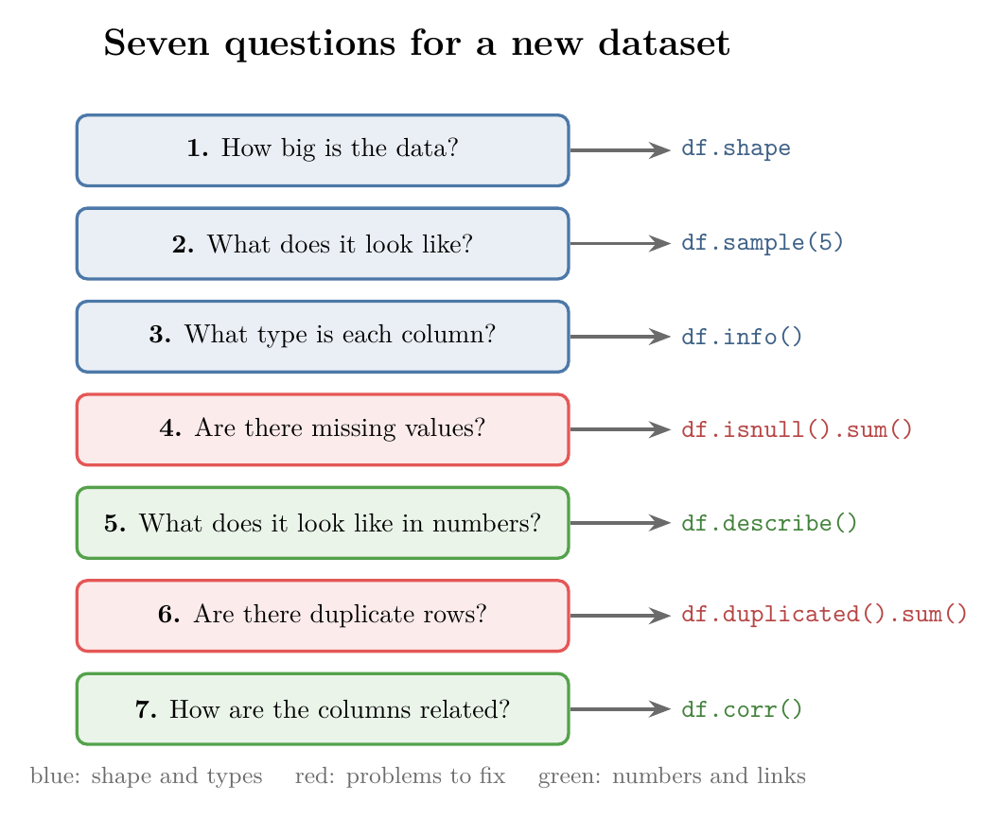
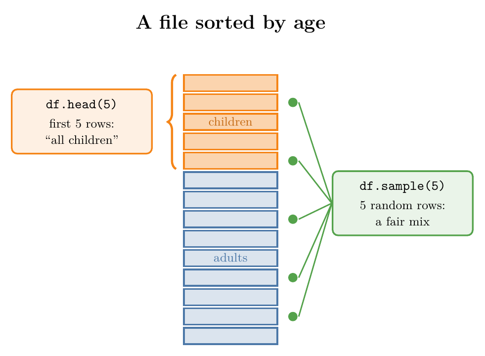
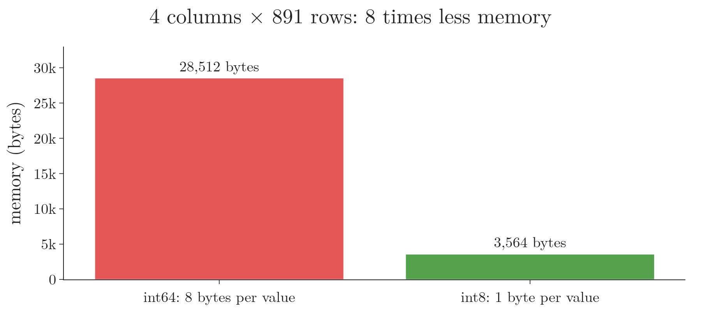
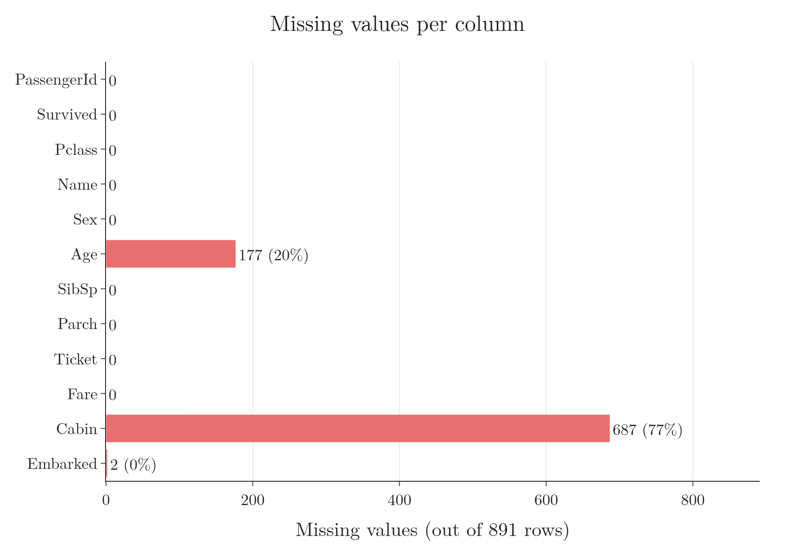
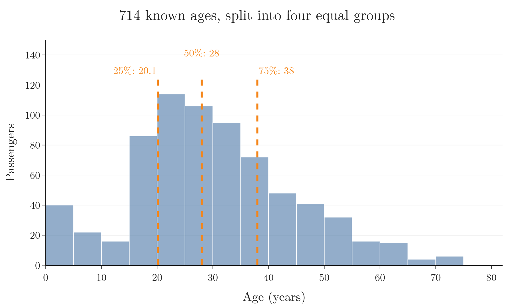
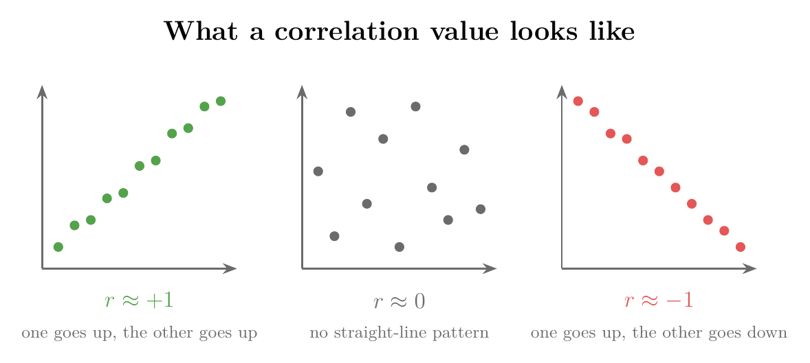
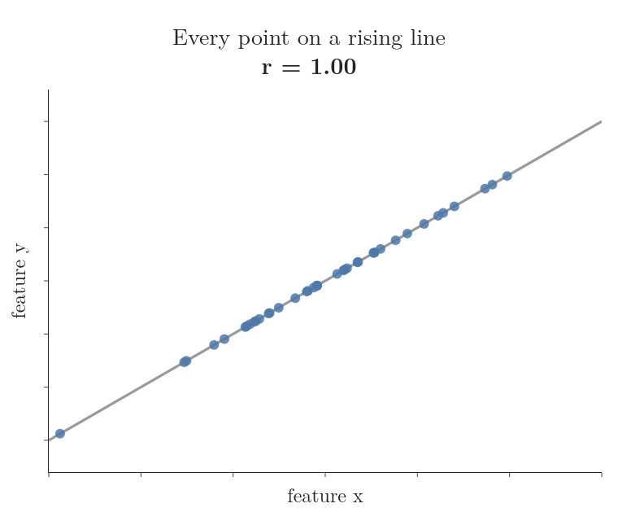
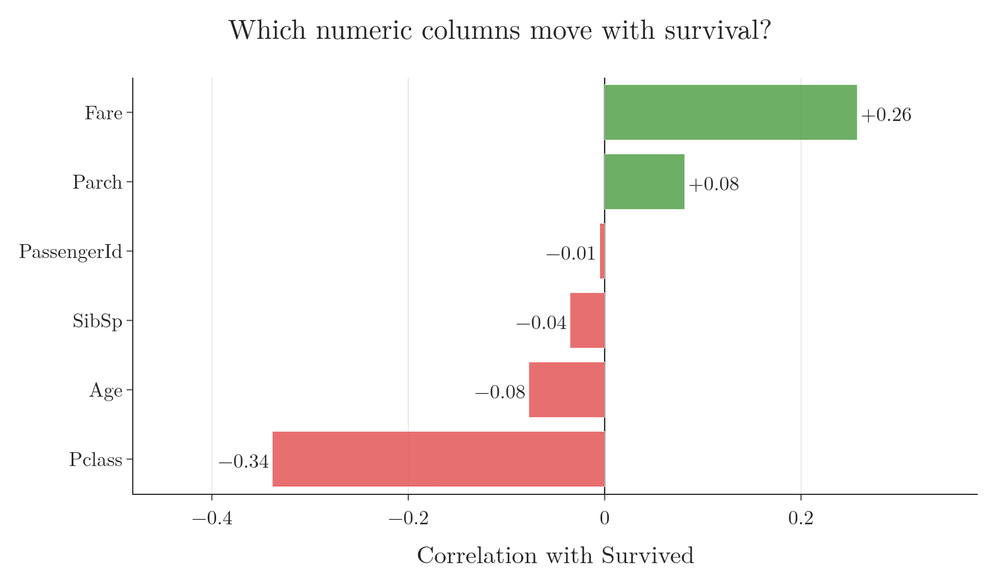

<!-- where-this-fits: generated by course_map/build_map.py; edit concepts.yaml, not this block -->
> **Where this fits:** Pipeline map step 3 (Understand data). See the [Course map](../../../00-course-map/00-course-map.md).
>
> 
>
> - **Builds on:** CSV files ([Note ML-009](../../../ML/01-foundations/ML-009-mldlc/ML-009-mldlc.md)); Pandas Profiling ([Note ML-021](../../../ML/02-getting-data/ML-021-pandas-profiling/ML-021-pandas-profiling.md)); Bessel's correction ([Note MA-006](../../../MA/01-descriptive-stats/MA-006-measures-of-dispersion/MA-006-measures-of-dispersion.md)); Frequency tables ([Note MA-007](../../../MA/01-descriptive-stats/MA-007-frequency-tables-and-graphs/MA-007-frequency-tables-and-graphs.md)).
> - **Leads to:** Univariate analysis ([Note ML-019](../../../ML/02-getting-data/ML-019-univariate-analysis/ML-019-univariate-analysis.md)); Skewness ([Note ML-019](../../../ML/02-getting-data/ML-019-univariate-analysis/ML-019-univariate-analysis.md)); Bivariate and multivariate analysis ([Note ML-020](../../../ML/02-getting-data/ML-020-bivariate-multivariate-analysis/ML-020-bivariate-multivariate-analysis.md)); Feature selection ([Note ML-022](../../../ML/03-feature-engineering/ML-022-what-is-feature-engineering/ML-022-what-is-feature-engineering.md)); Standardization ([Note ML-023](../../../ML/03-feature-engineering/ML-023-standardization/ML-023-standardization.md)); Z-score outlier method ([Note ML-040](../../../ML/04-missing-data-and-outliers/ML-040-what-are-outliers/ML-040-what-are-outliers.md)).
> - **Compare with:** Data mining ([Note ML-008](../../../ML/01-foundations/ML-008-applications-of-ml/ML-008-applications-of-ml.md)); Covariance and covariance matrix ([Note ML-047](../../../ML/05-dimensionality/ML-047-pca-step-by-step/ML-047-pca-step-by-step.md)); Inferential statistics ([Note MA-003](../../../MA/01-descriptive-stats/MA-003-statistics-roadmap/MA-003-statistics-roadmap.md)); Correlation and causation ([Note MA-009](../../../MA/01-descriptive-stats/MA-009-covariance-and-correlation/MA-009-covariance-and-correlation.md)).
<!-- /where-this-fits -->

## 1. Overview

> **Key point:** Before any analysis, we ask a new dataset seven quick questions; each one is answered by a single line of pandas.

Once the data is gathered, the next stage of an ML project is to **understand the data**: find out what is in it before we clean it or train anything. This stage spans several Notes:

- **This Note:** the basic questions to ask the moment we get a dataset.
- **Exploratory data analysis (EDA):** studying the data with graphs, one column at a time (**univariate analysis**), then several columns together (**bivariate and multivariate analysis**).
- **Pandas Profiling:** a library that produces a full EDA report from one line of code.

Figure 1 lists the seven questions and the pandas call that answers each one. The rest of the Note takes them in this order.



The answers are a first sketch of the data, not a full study. They tell us its size and shape, the problems to fix (missing values, duplicates), and which columns look useful. The Notebook (`notebook.ipynb`) runs every example.

## 2. The Titanic dataset

> **Key point:** Our example is the Titanic passenger list: 891 passengers, and for each one, whether they survived.

The **Titanic dataset** comes from a famous Kaggle competition, and it is the usual first dataset in ML. Each row is one **observation** (G-1374; one record): one passenger of the ship that sank in 1912. The task is to predict `Survived`, the **target** (G-1949; the output we predict), from the other columns, the **features** (G-772; the input variables, one column each).

| Column | Meaning |
|---|---|
| `PassengerId` | A running number, 1 to 891 |
| `Survived` | 1 if the passenger survived, 0 if not |
| `Pclass` | Ticket class: 1 (first, most expensive), 2 or 3 (cheapest) |
| `Name`, `Sex`, `Age` | Who the passenger was |
| `SibSp` | Number of siblings or spouses on board |
| `Parch` | Number of parents or children on board |
| `Ticket`, `Fare` | Ticket number, and the price paid |
| `Cabin` | Cabin number |
| `Embarked` | Port where they boarded: C, Q or S |

> **Python:** Loading the data.
>
> ```python
> import pandas as pd
>
> df = pd.read_csv("data/titanic_train.csv")
> ```
>
> The file is Kaggle's `train.csv` for this competition (61 KB), kept in `data/`.

## 3. How big is the data?

> **Key point:** `df.shape` gives the number of rows and columns; we check it first so we know what we are dealing with.

The first question is the size of the data. A few hundred rows fit easily in memory, and every step runs in a moment. Millions of rows may need special handling, such as reading the file in chunks, so we want to know before we start.

> **Python:** Size of the data.
>
> ```python
> df.shape    # (891, 12)
> ```
>
> `shape` has no brackets after it: it is a stored value of the DataFrame, not a function. The value is `(rows, columns)`.

So the Titanic data has 891 rows (passengers) and 12 columns.

## 4. What does the data look like?

> **Key point:** We look at a few rows; random rows from `sample` give a fairer first picture than the top rows from `head`.

Next we look at some actual rows. `df.head()` shows the first 5 rows, and it is the usual habit.

The first rows can mislead, though. Files are often stored in some order: by date, by region, by age. The first rows are then all alike, and they plant a wrong idea about the whole file.

Figure 2 shows the danger. If a file were sorted by age, its first 5 rows would all be children, and we might think the whole dataset is about children. Five rows picked at random would show a mix.



> **Python:** First rows and random rows.
>
> ```python
> df.head()      # the first 5 rows
> df.sample(5)   # 5 rows picked at random
> ```
>
> Each run of `sample` picks different rows. `df.sample(5, random_state=1)` picks the same rows every time, which helps when we want to repeat a result.

Five random rows of the Titanic data (only some columns shown):

| | PassengerId | Survived | Pclass | Sex | Age | Fare | Cabin |
|---|---|---|---|---|---|---|---|
| 862 | 863 | 1 | 1 | female | 48 | 25.93 | D17 |
| 223 | 224 | 0 | 3 | male | NaN | 7.90 | NaN |
| 84 | 85 | 1 | 2 | female | 17 | 10.50 | NaN |
| 680 | 681 | 0 | 3 | female | NaN | 8.14 | NaN |
| 535 | 536 | 1 | 2 | female | 7 | 26.25 | NaN |

Already we can see some traits of the data: `NaN` (missing) values in `Age` and `Cabin`, fares with decimals, and survivors from every class.

## 5. What type is each column?

> **Key point:** `df.info()` lists every column's data type and number of non-missing values, plus the memory the data takes.

Each column's **data type** (G-540; its dtype) decides what we can do with it later: average it, plot it, or turn it into numbers first. `df.info()` reports it for every column in one go.

### 5.1 Reading the output of info

> **Key point:** `info` shows, per column, how many values are present and what type they are.

> **Python:** Column types.
>
> ```python
> df.info()
> ```

```
RangeIndex: 891 entries, 0 to 890
Data columns (total 12 columns):
 #   Column       Non-Null Count  Dtype
---  ------       --------------  -----
 0   PassengerId  891 non-null    int64
 1   Survived     891 non-null    int64
 2   Pclass       891 non-null    int64
 3   Name         891 non-null    str
 4   Sex          891 non-null    str
 5   Age          714 non-null    float64
 6   SibSp        891 non-null    int64
 7   Parch        891 non-null    int64
 8   Ticket       891 non-null    str
 9   Fare         891 non-null    float64
 10  Cabin        204 non-null    str
 11  Embarked     889 non-null    str
dtypes: float64(2), int64(5), str(5)
memory usage: 118.9 KB
```

Three things can be read from it:

- **Types:** 7 columns are numerical (`int64` whole numbers, `float64` decimals) and 5 are text (`str`). Text columns usually hold categories, such as `Sex` or `Embarked`.
- **Non-null count:** "non-null" (G-1337) means "not missing". `Age` has 714 values out of 891, so 177 are missing; `Cabin` and `Embarked` also have gaps.
- **Memory:** the whole table takes about 119 KB.

> **Extra:** In pandas 3, text columns show as `str`. Older pandas (and older tutorials) show them as `object`.

### 5.2 Saving memory with smaller types

> **Key point:** Columns stored in a bigger type than they need waste memory; changing the type shrinks the data and speeds up later work.

Sometimes whoever made the data stored numbers in a bigger type than they need. A column of small whole numbers kept as `float64` or `int64` uses 8 bytes per value.

For 891 rows this hardly matters. On a dataset with millions of rows, such small fixes save a lot of memory, so a much larger dataset fits on one computer (pandas, "Scaling to large datasets").

> **Python:** Shrinking small-number columns.
>
> ```python
> small_cols = ["Survived", "Pclass", "SibSp", "Parch"]
> df[small_cols].astype("int8")
> ```
>
> `astype` converts columns to another type. `int8` stores whole numbers from -128 to 127 in 1 byte each, plenty for these columns.

| Four columns | dtype | Bytes per value | Memory for 891 rows |
|---|---|---|---|
| Before | int64 | 8 | 28,512 bytes |
| After | int8 | 1 | 3,564 bytes |

{width=70%}

> **Extra:** `Age` is `float64` even though ages are usually whole numbers. There are two reasons, and both mean we should leave it as it is:
>
> - **Missing values:** `NaN` is itself a decimal value, so a whole-number column with gaps becomes `float64`.
> - **Real fractions:** 25 ages are not whole, such as 0.42 (a baby of five months) or 28.5 (an estimated age).

## 6. Are there missing values?

> **Key point:** `df.isnull().sum()` counts the missing values in every column; we need these numbers to plan how to fill or drop them.

Missing values cause trouble: most ML algorithms cannot handle them, and filling them in well takes work. So we find out early which columns have gaps, and how many.

`info` already hints at them through the non-null counts. On a wide dataset, an exact count per column is easier to read.

> **Python:** Counting missing values.
>
> ```python
> df.isnull().sum()
> ```
>
> `df.isnull()` gives a table of `True` (missing) and `False` (present), the same size as `df`. `.sum()` adds up each column; `True` counts as 1, so the result is the number of missing values per column.

Figure 4 shows the result. Only three columns have gaps:

- **Cabin:** 687 missing, 77% of rows.
- **Age:** 177 missing, 20%.
- **Embarked:** 2 missing.



These numbers shape the plan for cleaning.

A column that is mostly empty, like `Cabin`, may be dropped, or every gap filled with one placeholder such as "no cabin". A column with a few gaps can keep its rows, with each gap filled by a single value, for example the column's average for `Age`. Ways of filling gaps come in later Notes.

> **Extra:** `df.isnull().mean()` gives the share of missing values instead of the count (0.77 for `Cabin`). `df.isna()` is another name for `df.isnull()`; both do the same thing.

## 7. What does the data look like in numbers?

> **Key point:** `df.describe()` summarises every numerical column with eight numbers: count, mean, standard deviation, minimum, three percentiles and maximum.

The next question is what the data looks like mathematically. Numbers that summarise a column, such as its average or its range, are called **descriptive statistics**. `df.describe()` computes the common ones for every numerical column at once.

> **Python:** Summary statistics.
>
> ```python
> df.describe()
> ```

Rounded to two decimals:

| | PassengerId | Survived | Pclass | Age | SibSp | Parch | Fare |
|---|---|---|---|---|---|---|---|
| count | 891 | 891 | 891 | 714 | 891 | 891 | 891 |
| mean | 446.00 | 0.38 | 2.31 | 29.70 | 0.52 | 0.38 | 32.20 |
| std | 257.35 | 0.49 | 0.84 | 14.53 | 1.10 | 0.81 | 49.69 |
| min | 1.00 | 0.00 | 1.00 | 0.42 | 0.00 | 0.00 | 0.00 |
| 25% | 223.50 | 0.00 | 2.00 | 20.12 | 0.00 | 0.00 | 7.91 |
| 50% | 446.00 | 0.00 | 3.00 | 28.00 | 0.00 | 0.00 | 14.45 |
| 75% | 668.50 | 1.00 | 3.00 | 38.00 | 1.00 | 0.00 | 31.00 |
| max | 891.00 | 1.00 | 3.00 | 80.00 | 8.00 | 6.00 | 512.33 |

### 7.1 Count, mean, standard deviation, minimum and maximum

> **Key point:** Count is how many values are present; mean is the average; standard deviation is how spread out the values are; min and max are the extremes.

The rows of the table mean:

- **count:** the number of non-missing values. For `Age` it is 714, not 891.
- **mean:** the average.
- **std:** the **standard deviation** (G-1871), how far values typically lie from the mean. A small std means values cluster close to the mean; a large one means they are spread out.
- **min** and **max:** the smallest and largest values.

> **Extra:** The mean, step by step.
>
> 1. **In words:** add up all the values, then divide by how many there are.
> 2. **Formula:** for $n$ values $x_1, x_2, \dots, x_n$,
>    $$\bar{x} = \frac{x_1 + x_2 + \dots + x_n}{n}$$
> 3. **Example:** the first five passengers are aged 22, 38, 26, 35 and 35, so
>    $$\bar{x} = \frac{22 + 38 + 26 + 35 + 35}{5} = \frac{156}{5} = 31.2.$$

> **Extra:** The standard deviation, step by step.
>
> 1. **In words:** find how far each value is from the mean, square those distances, add them, divide by one less than the number of values, then take the square root.
> 2. **Formula:**
>    $$s = \sqrt{\frac{(x_1 - \bar{x})^2 + (x_2 - \bar{x})^2 + \dots + (x_n - \bar{x})^2}{n - 1}}$$
> 3. **Example:** for the same five ages, with mean 31.2, the distances are $-9.2$, $6.8$, $-5.2$, $3.8$ and $3.8$. Their squares add up to $84.64 + 46.24 + 27.04 + 14.44 + 14.44 = 186.8$, so
>    $$s = \sqrt{\frac{186.8}{5 - 1}} = \sqrt{46.7} \approx 6.83.$$
>    A typical age among these five is about 7 years away from 31.2.
>
> pandas divides by $n - 1$, not $n$. This **sample standard deviation** corrects for the fact that a sample tends to look a little less spread out than the whole population it came from (see Section 6 of the [measures of dispersion Note](../../../MA/01-descriptive-stats/MA-006-measures-of-dispersion/MA-006-measures-of-dispersion.md)).

### 7.2 Percentiles

> **Key point:** The 25%, 50% and 75% rows are percentiles: the value below which that share of the data lies.

A **percentile** (G-1483) splits sorted data by share, as in an exam result: a score at the 99th percentile means 99 percent of the candidates scored lower. The 25% value of `Age` is 20.12: a quarter of the passengers with a known age were 20.12 or younger.

The three rows together cut the data into four groups of equal size (Figure 5). These cut points are called **quartiles** (G-1602). The middle one, the 50% value, is the **median**: half the values lie below it and half above.



For the Titanic ages:

- **25%:** a quarter of passengers were 20.12 or younger.
- **50%:** half were 28 or younger.
- **75%:** three quarters were 38 or younger.

> **Extra:** The median, step by step.
>
> 1. **In words:** sort the values; the median is the one in the middle. With an even number of values, it is the average of the two middle ones.
> 2. **Formula:** for $n$ sorted values, the median sits at position
>    $$\text{position} = \frac{n + 1}{2}$$
> 3. **Example:** the five ages sorted are 22, 26, 35, 35, 38. The position is $\frac{5 + 1}{2} = 3$, so the median is the third value, 35.
>
> The 25% and 75% values work the same way, one quarter and three quarters of the way along the sorted values. For our five ages, pandas gives 26 and 35. When the position falls between two values, pandas takes a value proportionally between them, which is how `Age` gets 20.12.

### 7.3 What the Titanic numbers tell us

> **Key point:** Reading `describe` column by column quickly shows odd values and patterns worth a closer look.

The table is quick to read and often shows something unexpected. For the Titanic:

- **Age:** the average passenger was about 30, with a standard deviation of about 15 years. The youngest, at 0.42, was a baby of five months; the oldest was 80.
- **Fare:** the average was 32.20, but the median only 14.45. A few very expensive tickets (up to 512.33) pull the mean up.
- **Fare minimum is 0:** 15 passengers paid nothing. Zero fares are worth checking: free tickets, crew, or a recording error.
- **Survived:** the mean of a 0/1 column is the share of 1s. So 38% of these passengers survived.
- **PassengerId:** its numbers are meaningless; it is only a running count. Statistics of an ID column carry no information.

> **Extra:** `describe` covers only numerical columns by default. For the text columns we write:
>
> ```python
> df.describe(include="str")
> ```
>
> The result summarises each text column: count, number of different values (`unique`), the most common value (`top`) and how often it occurs (`freq`). For example, `Sex` has 2 values, and `male` appears 577 times.

## 8. Are there duplicate rows?

> **Key point:** `df.duplicated().sum()` counts rows that are exact copies of an earlier row; duplicates should be removed before training.

A **duplicate row** (G-648) is a row identical to another one in every column. Duplicates give some examples more weight than others, so they distort what a model learns. We check for them before any analysis.

> **Python:** Finding and removing duplicates.
>
> ```python
> df.duplicated().sum()     # 0
> df = df.drop_duplicates()
> ```
>
> `df.duplicated()` marks each row `True` if it repeats an earlier row. `.sum()` counts them. `drop_duplicates()` removes the copies and keeps the first of each.

The Titanic data has 0 duplicates: every row is unique. Real-world datasets often do have some.

For example, if we add the first two passengers to the table a second time, `duplicated().sum()` returns 2. `drop_duplicates()` then brings the table back to 891 rows (Figure 6).

{width=100%}

## 9. How are the columns related?

> **Key point:** Correlation measures how two features move together, from -1 to +1; features with almost no correlation to the target may be useless.

### 9.1 Correlation

> **Key point:** A positive correlation means both columns rise together; a negative one means one rises as the other falls; near 0 means no straight-line link.

**Correlation** (G-490) measures how a change in one feature goes with a change in another. pandas computes the **Pearson correlation coefficient** (G-1474), written $r$, which always lies between $-1$ and $+1$ (Figure 7):

- **Close to +1:** when one goes up, the other goes up too.
- **Close to -1:** when one goes up, the other goes down. The two are inversely related.
- **Close to 0:** no straight-line relationship.



What does the size of $r$ measure? It measures how close the points lie to a straight line, not how steep that line is. Figure 8 shows both halves of the statement on 40 example points (idea after StatQuest, "Pearson's Correlation, Clearly Explained"):

1. The points start exactly on a rising line: $r = 1$.
2. The points move away from the line step by step, and $r$ falls: 0.9, 0.7, 0.4, and 0 when no line is left.
3. The points go back onto a line, and the line is made gentle and then steep. Every point is still on the line, so $r$ stays 1 both times.



A large $r$ therefore says "knowing one feature pins down the other closely". It says nothing about how much the second feature changes per unit of the first.

Two warnings go with every correlation:

- **Correlation is not causation.** A high $r$ says that two features move together. It does not say that one causes the other (**causation**, G-359); something else may drive both. The [covariance and correlation Note](../../../MA/01-descriptive-stats/MA-009-covariance-and-correlation/MA-009-covariance-and-correlation.md) treats this in full.
- **A few points prove little.** A straight line passes through any two points, so two observations always give $r = 1$ or $r = -1$. The more observations behind an $r$, the more we can trust it.

Not every feature in a dataset helps predict the target. Finding and removing the useless ones is an important part of ML, and correlation with the target is a quick first check.

> **Extra:** The Pearson correlation, step by step.
>
> 1. **In words:** for each row, multiply how far $x$ is from its mean by how far $y$ is from its mean, and add these products. Then divide by the size of each column's spread, so the result always lands between -1 and +1.
> 2. **Formula:**
>    $$r = \frac{\sum (x_i - \bar{x})(y_i - \bar{y})}{\sqrt{\sum (x_i - \bar{x})^2}\thinspace\sqrt{\sum (y_i - \bar{y})^2}}$$
>    $\sum$ means "add up over all rows".
> 3. **Example:** three passengers in class 1, 2 and 3 paid fares of 80, 20 and 10. The means are 2 and 36.67, so the distances are $-1, 0, 1$ for class and $43.33, -16.67, -26.67$ for fare. Then
>    $$r = \frac{(-1)(43.33) + (0)(-16.67) + (1)(-26.67)}{\sqrt{1 + 0 + 1}\thinspace\sqrt{1877.8 + 277.8 + 711.1}} = \frac{-70}{75.72} \approx -0.92.$$
>    A strong negative correlation: the higher the class number, the lower the fare.

### 9.2 Correlation with survival

> **Key point:** On the Titanic, class and fare are linked to survival, while `PassengerId` is not linked at all.

We only care how each feature relates to the target, `Survived`. So we compute all the correlations and keep the `Survived` column.

> **Python:** Correlation with the target.
>
> ```python
> df.corr(numeric_only=True)["Survived"]
> ```
>
> `df.corr()` gives a table of the correlation of every numerical column with every other. `["Survived"]` keeps one column of that table. `numeric_only=True` tells pandas to skip text columns.

Figure 9 shows the result. `Survived` with itself is exactly 1, as every column is with itself, so it is left out.



- **Fare, +0.26:** a positive link. Passengers with more expensive tickets survived more often. Fare goes with class: the mean fare was 84.15 in first class and 13.68 in third, and 63% of first-class passengers survived against 24% of third-class passengers. The number shows that fare and survival move together; it does not show why (section 9.1).
- **Pclass, -0.34:** the strongest link, and negative. As the class number goes up (from first towards third), the chance of survival goes down. Most of those who died travelled in third class, the cheapest.
- **PassengerId, -0.01:** essentially no link. As expected for a running number, this column will not help a model.

The correlation check is useful at the start, and we repeat it later, after cleaning and creating new features.

> **Extra:** Older code writes `df.corr()` without `numeric_only=True`. The bare call worked in pandas 1, which skipped text columns quietly. From pandas 2 on, `numeric_only` defaults to `False` (pandas release notes), so it raises `ValueError: could not convert string to float`, because the table has text columns such as `Name`.

> **Extra:** Correlation has two limits worth remembering:
>
> - **Text columns are skipped.** `Sex` is missing from Figure 9, yet it matters most: coded as female 1 and male 0, its correlation with `Survived` is +0.54.
> - **Only straight-line links count.** A feature with $r$ near 0 can still be related to the target in a curved or more complex way, so a low $r$ is a hint, not proof, that a column is useless.

## 10. Summary

| Question | pandas call | Titanic answer |
|---|---|---|
| How big is the data? | `df.shape` | 891 rows, 12 columns |
| What does it look like? | `df.sample(5)` | Text and numbers, gaps in `Age` and `Cabin` |
| What type is each column? | `df.info()` | 7 numerical, 5 text; about 119 KB |
| Are there missing values? | `df.isnull().sum()` | `Cabin` 687, `Age` 177, `Embarked` 2 |
| What does it look like in numbers? | `df.describe()` | Median age 28; 38% survived; some fares are 0 |
| Are there duplicate rows? | `df.duplicated().sum()` | None |
| How are the columns related? | `df.corr()` | `Pclass` -0.34, `Fare` +0.26, `PassengerId` about 0 |

- Ask these seven questions of every new dataset before any deeper analysis.
- `sample` gives a fairer first look than `head`, because files are often sorted.
- `info` and `isnull().sum()` find the type problems and gaps to fix during cleaning.
- `describe` gives the descriptive statistics of each numerical column; reading them closely reveals odd values, such as fares of 0.
- `df.corr()` needs `numeric_only=True` in pandas 2 and later when the table has text columns.
- Correlation runs from -1 to +1; a feature with no link to the target, such as an ID, is a candidate for removal.

## 11. Sources

**Built from**

- CampusX, "Understanding Your Data | Day 19 | 100 Days of Machine Learning", YouTube, https://www.youtube.com/watch?v=mJlRTUuVr04
- StatQuest with Josh Starmer, "Pearson's Correlation, Clearly Explained!!!", YouTube, https://www.youtube.com/watch?v=xZ_z8KWkhXE

**Other references**

- pandas release notes. What's new in 2.0.0. pandas.pydata.org/docs/whatsnew.
- pandas user guide. Scaling to large datasets: use efficient datatypes. pandas.pydata.org/docs/user_guide/scale.html.

## 12. Key terms

| Term | Meaning |
|---|---|
| Observation | One record of the data, one row of the table |
| Feature | An input variable, one column of the data table |
| Target | The output we predict |
| Understanding the data | The project stage where we learn what is in the data before cleaning or modelling |
| Exploratory data analysis (EDA) | Studying a dataset, mostly with graphs, to find its patterns and problems |
| Data type (dtype) | The kind of values a column holds, such as `int64`, `float64` or `str` |
| Non-null | Not missing |
| Descriptive statistics | Numbers that summarise data, such as count, mean, spread and percentiles |
| Mean | The average: the sum of the values divided by how many there are |
| Standard deviation | How far values typically lie from the mean |
| Percentile | The value below which a given share of the data lies |
| Quartiles | The 25%, 50% and 75% percentiles, which cut the data into four equal groups |
| Median | The middle value of sorted data; the 50% percentile |
| Duplicate row | A row identical to another row in every column |
| Correlation | How two features move together, from -1 to +1 |
| Causation | A cause-and-effect relationship: changing one thing changes the other |
| Pearson correlation coefficient (G-1474) | The usual measure of correlation, written $r$; the one `df.corr()` computes |
