<!-- where-this-fits: generated by course_map/build_map.py; edit concepts.yaml, not this block -->
> **Where this fits:** Pipeline map steps 3 (Understand data), 4 (Clean). See the [Course map](../../../00-course-map/00-course-map.md).
>
> 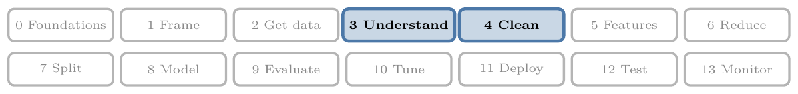
>
> - **Builds on:** Poor-quality data ([Note ML-007](../../../ML/01-foundations/ML-007-challenges-in-ml/ML-007-challenges-in-ml.md)); Exploratory data analysis ([Note ML-009](../../../ML/01-foundations/ML-009-mldlc/ML-009-mldlc.md)); Descriptive statistics ([Note ML-018](../../../ML/02-getting-data/ML-018-understanding-your-data/ML-018-understanding-your-data.md)); Z-score outlier method ([Note ML-040](../../../ML/04-missing-data-and-outliers/ML-040-what-are-outliers/ML-040-what-are-outliers.md)); IQR outlier method ([Note ML-040](../../../ML/04-missing-data-and-outliers/ML-040-what-are-outliers/ML-040-what-are-outliers.md)); Percentile outlier method ([Note ML-040](../../../ML/04-missing-data-and-outliers/ML-040-what-are-outliers/ML-040-what-are-outliers.md)).
> - **Leads to:** Bivariate and multivariate analysis ([Note ML-020](../../../ML/02-getting-data/ML-020-bivariate-multivariate-analysis/ML-020-bivariate-multivariate-analysis.md)); Binning and binarization ([Note ML-022](../../../ML/03-feature-engineering/ML-022-what-is-feature-engineering/ML-022-what-is-feature-engineering.md)); Feature selection ([Note ML-022](../../../ML/03-feature-engineering/ML-022-what-is-feature-engineering/ML-022-what-is-feature-engineering.md)); Function transformer ([Note ML-029](../../../ML/03-feature-engineering/ML-029-function-transformer/ML-029-function-transformer.md)); Power transformer ([Note ML-030](../../../ML/03-feature-engineering/ML-030-power-transformer/ML-030-power-transformer.md)); Complete case analysis ([Note ML-034](../../../ML/04-missing-data-and-outliers/ML-034-complete-case-analysis/ML-034-complete-case-analysis.md)).
> - **Compare with:** Missing values ([Note ML-009](../../../ML/01-foundations/ML-009-mldlc/ML-009-mldlc.md)); Pandas Profiling ([Note ML-021](../../../ML/02-getting-data/ML-021-pandas-profiling/ML-021-pandas-profiling.md)); Kurtosis and moments ([Note ML-021](../../../ML/02-getting-data/ML-021-pandas-profiling/ML-021-pandas-profiling.md)); Likelihood ([Note MA-069](../../../MA/08-likelihood/MA-069-probability-vs-likelihood/MA-069-probability-vs-likelihood.md)); Gaussian mixture model (GMM) ([Note MA-073](../../../MA/08-likelihood/MA-073-gaussian-mixture-models/MA-073-gaussian-mixture-models.md)).
<!-- /where-this-fits -->

## 1. Overview

> **Key point:** **Univariate analysis** (G-2050) studies each column on its own, mostly with graphs; the column's type (categorical or numerical) decides which graphs to draw.

**Exploratory data analysis (EDA)** means studying a dataset to understand it inside out. The seven first questions of the previous Note give a quick sketch. EDA goes deeper, and its main tool is the graph: patterns hidden in a table of numbers become obvious once drawn.

Figure 1 is the plan for this Note. We pick one column, decide whether it is categorical or numerical, and draw the graphs that suit that type.

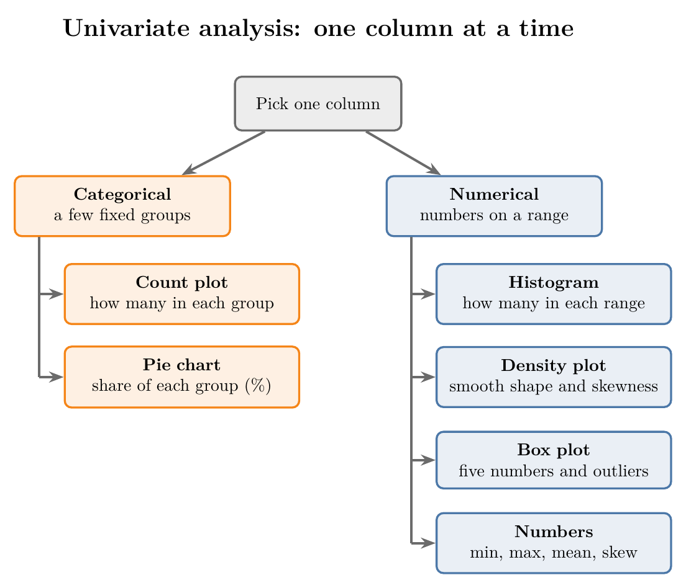

- **Categorical column:** a count plot and a pie chart.
- **Numerical column:** a histogram, a density plot, a box plot, and a few summary numbers such as the skewness.

The Notebook (`notebook.ipynb`) draws every graph as an interactive Plotly chart.

## 2. Univariate, bivariate and multivariate analysis

> **Key point:** Studying one column is univariate analysis, two columns together is **bivariate analysis** (G-310), and more than two is **multivariate analysis** (G-1280).

Each column of a dataset is called a **variable** (G-2071). In ML, an input variable is called a **feature** (G-772), and the variable we want to predict is the **target** (G-1949). Each row, one record, is an **observation** (G-1374). EDA has three levels, named by how many variables we look at together (Figure 2):

- **Univariate analysis:** one variable on its own ("uni" means one). For example, how old were the passengers?
- **Bivariate analysis:** two variables together ("bi" means two). For example, did older passengers survive less often?
- **Multivariate analysis:** more than two variables together. For example, survival by age, split by ticket class.

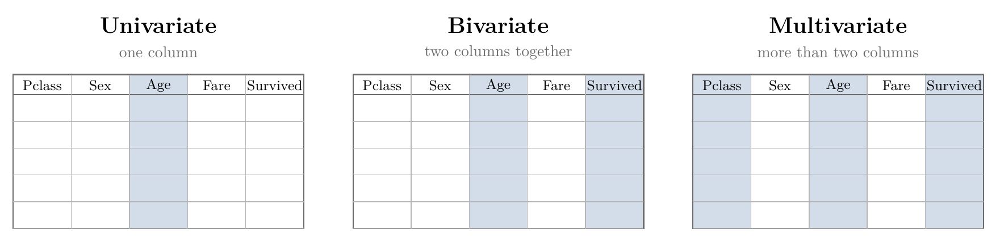

This Note covers univariate analysis only. We take the columns one by one and learn as much as we can about each, ignoring the others.

## 3. Numerical and categorical data

> **Key point:** Numerical data is numbers we can measure; categorical data is a choice among fixed groups. Every column is one or the other.

Every column is either numerical (numbers that measure an amount, such as age or price) or categorical (one of a fixed set of groups, such as gender), as the [types of ML Note](../../01-foundations/ML-003-types-of-ml/ML-003-types-of-ml.md) (section "Numerical and categorical data") explains. The fixed groups of a categorical column are called **categories**.

The type decides the graphs, as in Figure 1. Categorical columns are summarised by counting each group. Numerical columns need graphs that show how the values spread over their range.

### 3.1 The columns of the Titanic data

> **Key point:** In the Titanic data, `Survived`, `Pclass`, `Sex` and `Embarked` are categorical; `Age` and `Fare` are numerical; some columns need more thought.

We use the Titanic passenger list again: 891 passengers, and for each one whether they survived. The table sorts its 12 columns by type.

| Column | Type | Comment |
|---|---|---|
| `PassengerId` | none (an ID) | A running number; it cannot tell us who survived |
| `Survived` | Categorical | 0 (died) or 1 (survived) |
| `Pclass` | Categorical | Ticket class 1, 2 or 3 |
| `Name` | Categorical, in theory | 891 different values, one per passenger; needs other tools, not covered here |
| `Sex` | Categorical | male or female |
| `Age` | Numerical | Age in years |
| `SibSp` | Numerical, or categorical | Number of siblings or spouses on board: 0 to 8 |
| `Parch` | Numerical, or categorical | Number of parents or children on board: 0 to 6 |
| `Ticket` | Mixed | Letters and numbers; 681 different values |
| `Fare` | Numerical | Price of the ticket |
| `Cabin` | Categorical | 147 different cabins, mostly missing |
| `Embarked` | Categorical | Port of boarding: S, C or Q |

Some columns need a word of explanation:

- **PassengerId:** an ID does not cause survival. In an earthquake, nobody dies because of their roll number, and the same logic applies here.
- **Pclass:** first class was the most expensive and carried the richest passengers; third was the cheapest. The three classes are like the AC, sleeper and general coaches of an Indian train.
- **SibSp and Parch:** both hold numbers, but with only a few possible values (0, 1, 2, ...), so we can also treat each value as a category.
- **Embarked:** the ship picked up passengers at three ports: S for Southampton, C for Cherbourg and Q for Queenstown.

> **Extra:** Recorded cabins are mostly first-class: 176 of the 204 known cabins belong to first-class passengers, 16 to second class and 12 to third. So a missing `Cabin` hints at a cheaper ticket, which is itself useful information.

> **Python:** Loading the data.
>
> ```python
> import pandas as pd
>
> df = pd.read_csv("data/titanic_train.csv")
> ```
>
> The file is Kaggle's `train.csv` for the Titanic competition, kept in `data/`.

## 4. Count plot

> **Key point:** A count plot draws one bar per category, as tall as the number of rows in that category; it is the first graph for any categorical column.

A **count plot** (G-494) answers the most basic question about a categorical column: how often does each category occur? It counts the rows in each category, its **frequency**, and draws one bar per category.

For `Survived`, a count plot shows at once how many passengers died and how many survived. Figure 3 draws one for each of the four categorical columns.

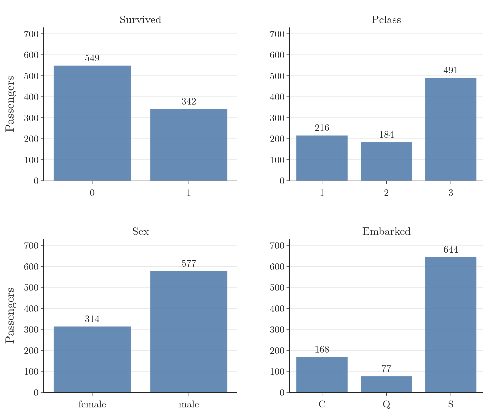

What each plot tells us:

- **Survived:** 549 passengers died and only 342 survived. More than 500 people died.
- **Pclass:** most passengers travelled in third class (491), then first (216), and the fewest in second (184).
- **Sex:** 577 men and 314 women.
- **Embarked:** most passengers boarded at Southampton (644), the fewest at Queenstown (77).

The `Pclass` result raises a question: why did more people travel first class than second? The average fare per class gives a hint. First class cost 84.15 on average, second 20.66 and third 13.68. Raising questions like this, and checking them against other columns, is the point of EDA: each graph should lead to a finding, and each finding to its likely reason.

> **Python:** Counting the categories.
>
> ```python
> df["Survived"].value_counts()   # 0: 549, 1: 342
> ```
>
> `value_counts` counts how often each value occurs in a column. A count plot is these numbers drawn as bars. With Plotly:
>
> ```python
> import plotly.express as px
>
> counts = df["Survived"].value_counts()
> px.bar(x=counts.index.astype(str), y=counts.values)
> ```

> **Extra:** With seaborn, a count plot is `sns.countplot(x=df["Embarked"])`. The `x=` matters: in seaborn 0.12 and later, `sns.countplot(df["Embarked"])` without it draws the bars sideways.

## 5. Pie chart

> **Key point:** A pie chart shows the same counts as shares of a circle, so we read each category's percentage directly.

A **pie chart** (G-1495) divides a circle into slices, one per category, each sized by its share of the rows. A pie chart holds the same information as a count plot, given as percentages instead of counts.

Figure 4 shows pie charts of three columns:

- **Survived:** 61.6% of passengers died, 38.4% survived.
- **Pclass:** 55.1% travelled in third class, 24.2% in first and 20.7% in second.
- **Sex:** 64.8% were male, 35.2% female.

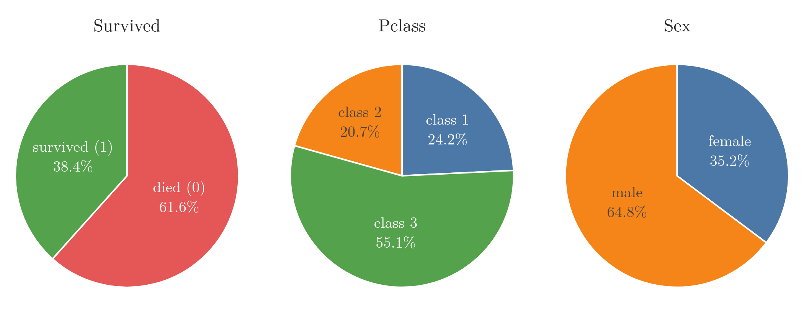

So a categorical column has two graphs: the count plot for counts, the pie chart for percentages.

> **Python:** Percentages and a pie chart.
>
> ```python
> df["Survived"].value_counts(normalize=True) * 100
> # 0: 61.62, 1: 38.38
>
> counts = df["Sex"].value_counts()
> px.pie(names=counts.index, values=counts.values)
> ```
>
> `normalize=True` makes `value_counts` give shares (0 to 1) instead of counts.

> **Extra:** Pie charts are hard to read when there are many categories or the slices are similar in size: our eyes compare bar heights much better than angles (Cleveland and McGill 1984). Keep pies for a few categories, and use a count plot otherwise.

## 6. Histogram

> **Key point:** A histogram splits a numerical column's range into equal bins and draws how many values fall in each, which shows the distribution of the data.

Numerical columns are more interesting. Their values are not a few groups but any number in a range: an age can be 22, 22.5 or 71. So we cannot count each value; we count ranges instead.

Suppose we mark every passenger's age as a dot on a line. With 714 known ages the dots land on top of each other and hide each other, so the line cannot show where the ages are common. Stacking the dots fixes that, and Figure 5 shows how (idea after StatQuest, "Histograms, Clearly Explained"):

1. Mark each age as a dot on a line.
2. Cut the range into equal intervals, here 5 years wide.
3. Stack the dots that fall in the same interval.
4. Draw a bar as tall as each stack.

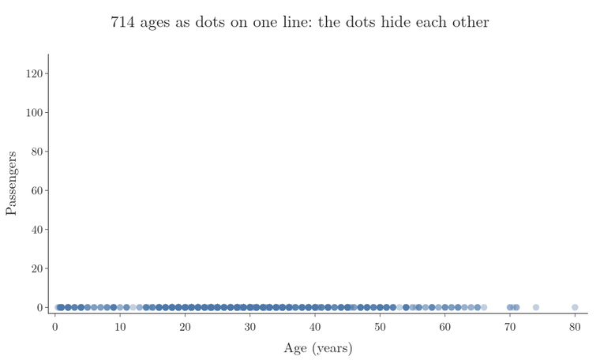

The finished graph is a **histogram** (G-899), and the equal intervals are called **bins**. The histogram counts the values in each bin and draws one bar per bin. In effect, the bins turn the numerical column into a categorical one for a moment, so that we can count it as in a count plot. In Figure 5 the tallest bar, ages 20 to 25, holds 114 passengers.

The result shows the **distribution** (G-626) of the data: how the values spread out, where most of them sit, and where few do. Whenever we meet a numerical column, a histogram is the first graph to try.

### 6.1 Choosing the number of bins

> **Key point:** Too few bins hide the shape of the data; too many make it noisy. We try a few and keep the one that shows the shape best.

The number of bins changes the picture (Figure 6):

- **Too few (5 bins):** each bar covers 16 years, and the shape is lost.
- **About right (16 bins):** each bar covers 5 years, and the shape is clear.
- **Too many (80 bins):** each bar covers 1 year; the bars jump up and down, and the shape drowns in noise.

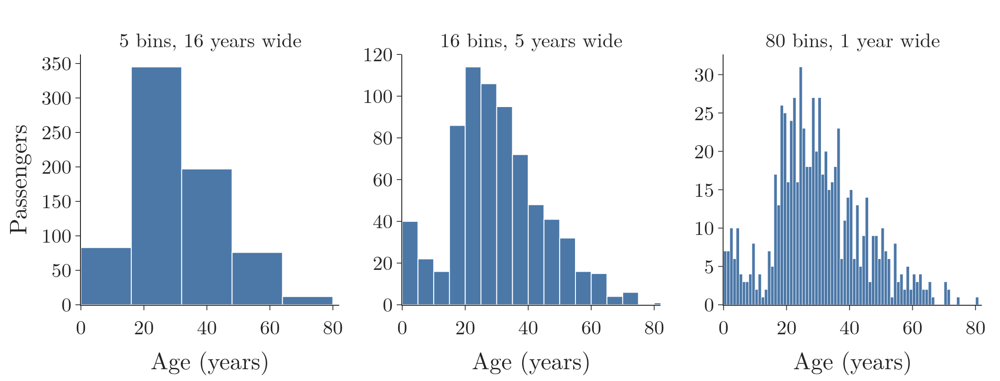

The library picks a number of bins by default. If the picture is not clear, we change it and look again.

With 16 bins, the shape of `Age` is clear. Few passengers were very young or very old, and most were between about 20 and 40. A small group of young children forms a second, smaller hump on the left.

> **Python:** A histogram.
>
> ```python
> px.histogram(df, x="Age", nbins=5)
> ```
>
> `nbins` sets the number of bins. The Notebook adds a slider to change the bin width and watch the shape change.

## 7. Density plot

> **Key point:** A density plot draws a smooth curve over the histogram; the curve, called the KDE, estimates the probability density function of the column.

A **density plot** (G-587) is a histogram with a smooth curve drawn along the tops of its bars (Figure 7). The curve is a **kernel density estimate (KDE)**: a smoothed version of the histogram, so the shape is easier to see.

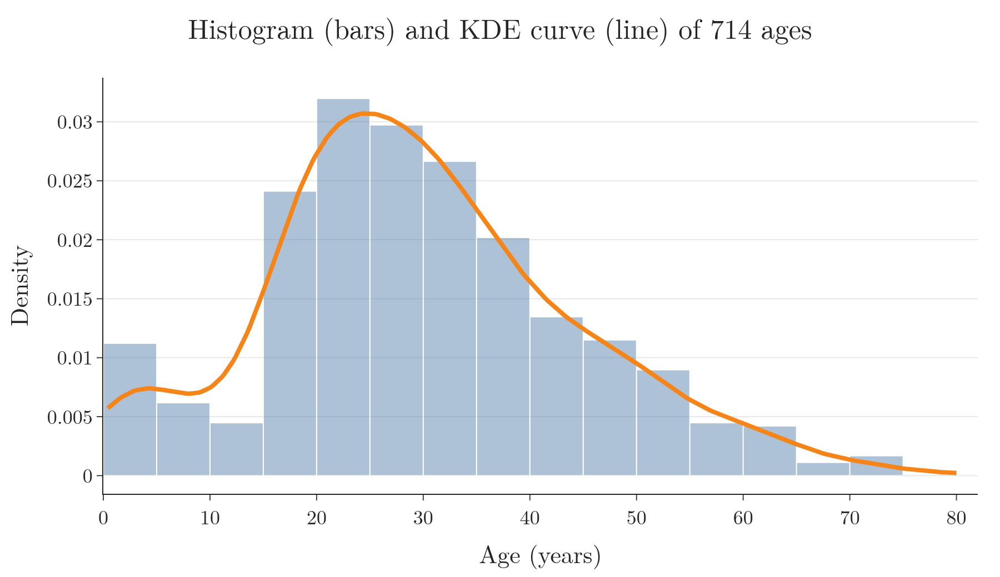

How is the curve built? Figure 8 shows the steps:

1. Put one small bell-shaped bump on each passenger's age. Every bump has the same width and the same area.
2. Add up the heights of all the bumps at every point along the x axis. Where many ages sit close together, many bumps overlap and the sum is high.
3. The sum is the KDE curve.

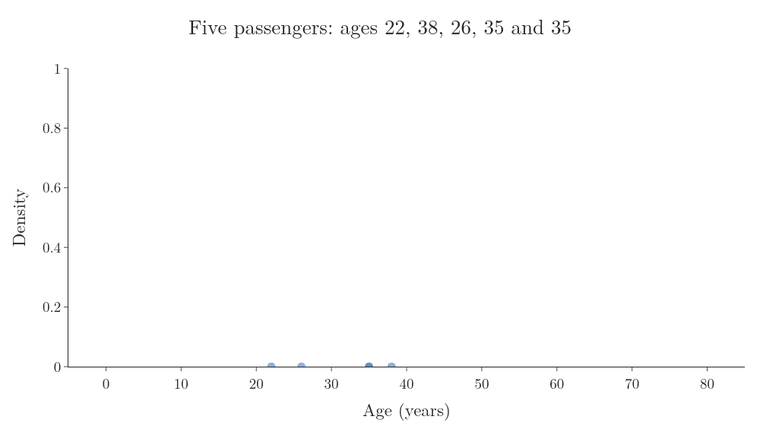

With five passengers the single bumps are easy to see. With all 714, the sum is the smooth curve of Figure 7. The bump is called the **kernel** (G-2273), which gives the kernel density estimate its name; here it is the bell-shaped Gaussian curve (SciPy docs, `gaussian_kde`).

The curve estimates the column's **probability density function (PDF)**. The x axis shows the age; the y axis shows the **density** (G-1569), how likely ages near that value are. Where the curve is high, as around 25, ages are common; where it is low, as at 70, they are rare. The height is a density, not a probability: the probability of an age falling in a range is the area under the curve over that range (the Extra below gives one number).

So the two graphs answer slightly different questions:

- **Histogram:** how many passengers fall in each range.
- **PDF curve:** how likely each value is, compared with the others.

The PDF matters again in bivariate and multivariate analysis, where we compare such curves for different groups.

> **Extra:** The height of the curve is a density, not a probability. At age 40 it is about 0.016, which only means "more likely than at 70". A probability is the area under the curve over a range. For example, the area from age 20 to 40 is about 0.52: roughly half of the passengers were in their twenties or thirties.

> **Python:** The old `distplot`.
>
> Older code draws this graph with `sns.distplot(df["Age"])`. seaborn deprecated `distplot` in version 0.11, and it now prints a warning (seaborn release notes, v0.11.0). Today we write `sns.histplot(df["Age"], kde=True, stat="density")`, or in Plotly a histogram with `histnorm="probability density"` plus a KDE curve from `scipy.stats.gaussian_kde` (see the Notebook).

## 8. Box plot

> **Key point:** A box plot draws the five-number summary of a column and marks the values that lie far outside it as possible outliers.

A **box plot** (G-329) draws a column's **five-number summary** (G-787; Figure 9). The summary is built from the median and percentiles of the [understanding your data Note](../ML-018-understanding-your-data/ML-018-understanding-your-data.md) (section 7.2, "Percentiles").

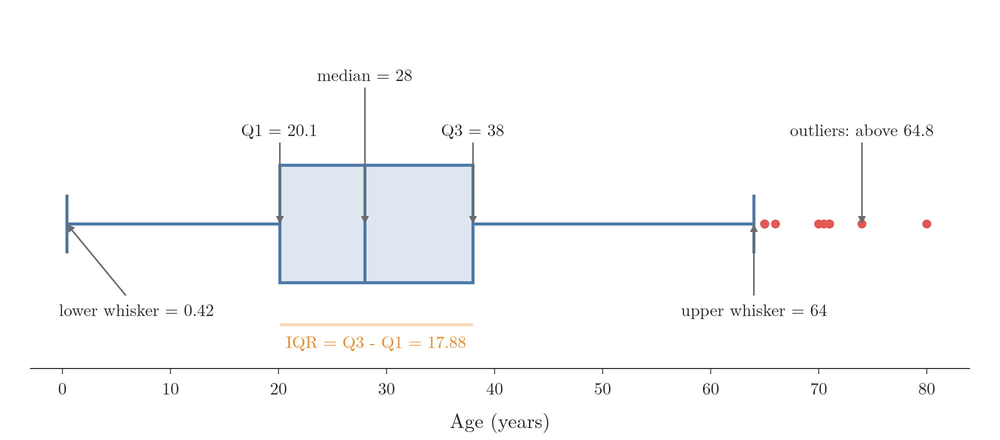

The five numbers, from left to right:

- **Minimum:** the smallest value in the column.
- **Q1:** the 25th percentile, the left edge of the box. A quarter of the values lie below it.
- **Median:** the 50th percentile, the line inside the box.
- **Q3:** the 75th percentile, the right edge of the box. Three quarters of the values lie below it.
- **Maximum:** the largest value in the column.

The box holds the middle half of the data. Its width, Q3 - Q1, is the **interquartile range (IQR)**.

### 8.1 Whiskers and outliers

> **Key point:** The whiskers stop at the last value within 1.5 IQR of the box; any value further out is drawn as a dot and flagged as a possible outlier.

The simplest box plot runs its whiskers all the way to the minimum and the maximum. A single extreme value would then stretch a whisker across the page. So the box plot that plotting libraries draw, and the one used in this Note, adds a rule. It sets two calculated limits, called **fences**, 1.5 IQR beyond the edges of the box (Tukey 1977, Ch. 2). Each **whisker** (G-2181) stops at the last real value inside its fence. A value outside the fences is drawn as a separate dot and is a possible **outlier** (G-1420): a value that does not follow the pattern of the rest of the data.

The fences are often loosely called the "minimum" and "maximum" of the box plot. They are calculated limits (-6.69 and 64.81 below), not values of the column; the whisker ends at the last real value inside them, and when no value lies beyond a fence it ends at the true minimum or maximum, as the left whisker of Figure 9 does at 0.42.

Figure 10 builds the box plot of the ages one part at a time: the median, the box, the fences, the whiskers and the outliers.

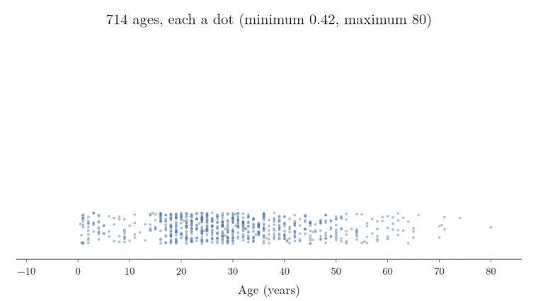

> **Extra:** The fences, step by step.
>
> 1. **In words:** take the width of the box (the IQR), multiply it by 1.5, and step that far out from each edge of the box.
> 2. **Formula:**
>    $$\text{IQR} = Q_3 - Q_1$$
>    $$\text{lower fence} = Q_1 - 1.5 \times \text{IQR}$$
>    $$\text{upper fence} = Q_3 + 1.5 \times \text{IQR}$$
> 3. **Example:** for the Titanic ages, $Q_1 = 20.125$ and $Q_3 = 38$, so
>    $$\text{IQR} = 38 - 20.125 = 17.875$$
>    $$\text{upper fence} = 38 + 1.5 \times 17.875 = 38 + 26.81 = 64.81$$
>    $$\text{lower fence} = 20.125 - 26.81 = -6.69$$
>    No age is below $-6.69$, so there are no low outliers. Eleven passengers aged 65 to 80 lie above 64.81: these are the dots on the right of Figures 9 and 10.
>
> Each whisker is drawn to the last real value inside its fence: 0.42 on the left and 64 on the right.

Spotting outliers is the main use of a box plot: it shows them at a glance. When data looks noisy, a box plot tells us how much of it lies outside the normal range, and outliers can then be checked and, if wrong, removed.

### 8.2 The fare box plot

> **Key point:** The box plot of `Fare` is squeezed to the left, with a long trail of outliers up to 512.

Figure 11 shows the box plot of `Fare`. The box sits far to the left: half of all fares are below 14.45, and three quarters below 31. To the right trail 116 outliers, the most extreme being three tickets at 512.33, many times what most passengers paid.

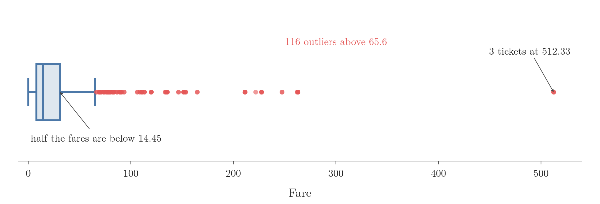

Extreme values like these can mislead an ML algorithm trained on the column, so we note them now and deal with them later.

> **Python:** A box plot.
>
> ```python
> px.box(df, x="Age", points="outliers")
> ```
>
> Hovering over the box in the Notebook shows the five numbers. `df["Age"].quantile([0.25, 0.5, 0.75])` computes Q1, the median and Q3 directly.

> **Extra:** Other graphs for one numerical column exist, such as the violin plot (a box plot and a density curve combined) and the rug plot (a tick for every value). The histogram, density plot and box plot cover most needs.

## 9. Summary numbers

> **Key point:** Alongside the graphs, a few numbers sum up a numerical column: minimum, maximum, mean, standard deviation and median.

Graphs show the shape; numbers pin down the details. For `Age`:

| Number | pandas call | Age |
|---|---|---|
| Minimum | `df["Age"].min()` | 0.42 (a baby of five months) |
| Maximum | `df["Age"].max()` | 80 |
| Mean | `df["Age"].mean()` | 29.70 |
| Standard deviation | `df["Age"].std()` | 14.53 |
| Median | `df["Age"].median()` | 28 |

## 10. Skewness

> **Key point:** Skewness measures how lopsided a distribution is: 0 means symmetric, positive means a long tail to the right, negative a long tail to the left.

The density curve also tells us whether the data is symmetric. Figure 12 shows the three cases.

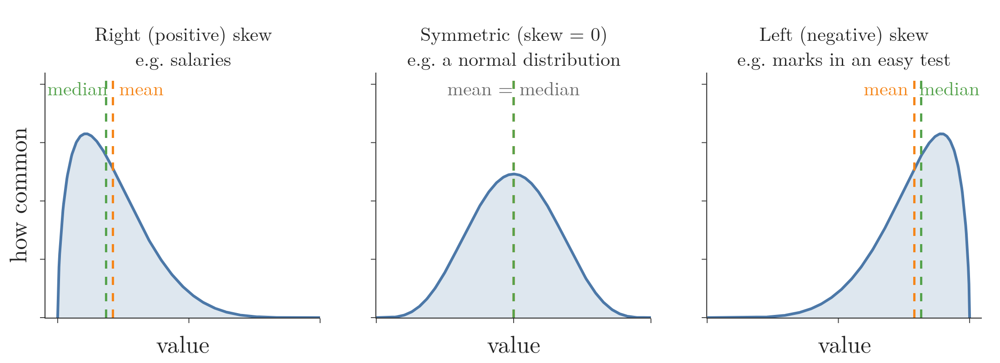

- **Symmetric:** the curve peaks in the centre, and the two sides mirror each other. Few low values, few high values, most in the middle. The normal distribution, a bell-shaped curve, is the best-known example.
- **Right (positive) skew:** most values are low and a few are very high, so the curve has a long tail to the right. Salaries are an example: most people earn a modest amount, and very few earn a lot.
- **Left (negative) skew:** most values are high and a few are low, so the tail is on the left. Marks in an easy test are an example: most students score high, and only a few score low.

**Skewness** (G-1817) turns this shape into one number. A value of 0 means perfectly symmetric, a positive value means skewed to the right, and a negative value means skewed to the left. The further from 0, the more lopsided the data.

For the Titanic, `Age` has a skewness of 0.39, slightly skewed to the right. `Fare` has 4.79, heavily skewed to the right, which matches its long trail of outliers in Figure 11.

> **Python:** Skewness.
>
> ```python
> df["Age"].skew()    # 0.39
> df["Fare"].skew()   # 4.79
> ```

> **Extra:** Skewness, step by step.
>
> 1. **In words:** measure how far each value is from the mean, cube those distances (cubing keeps their sign, and makes far values count much more), and average them. Then divide by the standard deviation cubed, so the result has no units.
> 2. **Formula:** with $m_2$ the average squared distance and $m_3$ the average cubed distance from the mean,
>    $$g_1 = \frac{m_3}{m_2^{3/2}}$$
> 3. **Example:** for the values 1, 2, 3, 4 and 10, the mean is 4 and the distances are $-3, -2, -1, 0, 6$. Then
>    $$m_2 = \frac{9 + 4 + 1 + 0 + 36}{5} = 10, \qquad m_3 = \frac{-27 - 8 - 1 + 0 + 216}{5} = 36$$
>    $$g_1 = \frac{36}{10^{3/2}} = \frac{36}{31.62} \approx 1.14$$
>    Positive: the single far value, 10, makes a long tail to the right.
>
> pandas multiplies $g_1$ by a small correction for sample size, $\sqrt{n(n-1)}/(n-2)$ (Joanes and Gill 1998), so `skew()` gives 1.70 for these five values. With hundreds of rows, the correction hardly matters.

> **Extra:** Skew also pulls the mean towards the tail, as Figure 12 shows. In right-skewed data the mean is above the median: for `Fare`, 32.20 against 14.45. So the median describes a skewed column's typical value better than the mean.

## 11. Summary

| Column type | Graph | What it shows | Titanic example |
|---|---|---|---|
| Categorical | Count plot | Number of rows in each category | 549 died, 342 survived |
| Categorical | Pie chart | Share of each category in % | 55.1% in third class |
| Numerical | Histogram | Number of values in each range (bin) | Most ages between 20 and 40 |
| Numerical | Density plot (KDE) | Smooth shape of the distribution | Peak near age 25 |
| Numerical | Box plot | Five-number summary and outliers | 11 age outliers above 64.81 |
| Numerical | Skewness | How lopsided the distribution is | Age 0.39, Fare 4.79 |

- Univariate analysis studies one column at a time; bivariate and multivariate analysis study two or more together.
- First decide whether a column is numerical or categorical; the type decides the graphs.
- For categorical columns: `value_counts`, a count plot and a pie chart.
- For numerical columns: a histogram (try a few bin counts), a density plot, a box plot, and the summary numbers.
- A box plot flags values beyond 1.5 IQR from the box as possible outliers. The fences are calculated limits, not the minimum and maximum of the data.
- Skewness of 0 means symmetric; positive means a long right tail, negative a long left tail.
- Every graph should lead to a finding, and every finding to its likely reason.

## 12. Sources

**Built from**

- CampusX, "EDA using Univariate Analysis | Day 20 | 100 Days of Machine Learning", YouTube, https://www.youtube.com/watch?v=4HyTlbHUKSw
- StatQuest with Josh Starmer, "StatQuest: Histograms, Clearly Explained", YouTube, https://www.youtube.com/watch?v=qBigTkBLU6g
- Khan Academy, "Box and whisker plot | Descriptive statistics", YouTube, https://www.youtube.com/watch?v=b2C9I8HuCe4

**Other references**

- Cleveland, W. and McGill, R. (1984). Graphical Perception: Theory, Experimentation, and Application to the Development of Graphical Methods. *Journal of the American Statistical Association* 79(387).
- Joanes, D. N. and Gill, C. A. (1998). Comparing Measures of Sample Skewness and Kurtosis. *Journal of the Royal Statistical Society, Series D (The Statistician)* 47(1), 183-189.
- seaborn release notes. v0.11.0 (September 2020). seaborn.pydata.org/whatsnew.
- SciPy documentation. `scipy.stats.gaussian_kde`. docs.scipy.org.
- Tukey, J. W. (1977). *Exploratory Data Analysis*. Addison-Wesley.

## 13. Key terms

| Term | Meaning |
|---|---|
| Variable | One column of a dataset |
| Feature | An input variable, one column of the data table |
| Target | The variable we want to predict |
| Observation | One record, one row of the data table |
| Univariate analysis | Studying one variable on its own |
| Bivariate analysis | Studying two variables together |
| Multivariate analysis | Studying more than two variables together |
| Category | One of the fixed groups of a categorical column |
| Frequency | How many times a value or category occurs |
| Count plot | A bar chart with one bar per category, as tall as its frequency |
| Pie chart | A circle split into slices sized by each category's share |
| Histogram | A bar chart of how many values fall in each equal range (bin) of a numerical column |
| Bin | One of the equal ranges a histogram splits the data into |
| Distribution | How a column's values spread over their range |
| Density plot | A histogram with a smooth KDE curve on top |
| Kernel density estimate (KDE) | A smooth curve that estimates a column's distribution from its values |
| Probability density function (PDF) | A curve showing how likely each value is; areas under it are probabilities |
| Box plot | A graph of the five-number summary, with outliers drawn as dots |
| Five-number summary | Minimum, Q1, median, Q3 and maximum |
| Interquartile range (IQR) | Q3 - Q1: the width of the middle half of the data |
| Fence (G-776) | A calculated limit 1.5 IQR beyond the box; values past it are possible outliers |
| Whisker (G-2181) | The line from the box to the last value inside the fence |
| Kernel (G-2273) | The small bump placed on each value to build a KDE curve |
| Outlier | A value far from the rest of the data |
| Skewness | A number for how lopsided a distribution is: 0 symmetric, positive right tail, negative left tail |
| Normal distribution | A symmetric, bell-shaped distribution |
