<!-- where-this-fits: generated by course_map/build_map.py; edit concepts.yaml, not this block -->
> **Where this fits:** Pipeline map step 5 (Engineer features). See the [Course map](../../../00-course-map/00-course-map.md).
>
> 
>
> - **Builds on:** [Descriptive statistics](../../../MA/01-descriptive-stats/MA-004-what-is-statistics/MA-004-what-is-statistics.md#3-descriptive-and-inferential-statistics); [Train-test split](../../../ML/01-foundations/ML-012-toy-project/ML-012-toy-project.md#6-training-and-test-sets); [Feature engineering](../../../ML/03-feature-engineering/ML-022-what-is-feature-engineering/ML-022-what-is-feature-engineering.md#2-what-feature-engineering-is); [Feature transformation](../../../ML/03-feature-engineering/ML-022-what-is-feature-engineering/ML-022-what-is-feature-engineering.md#6-feature-transformation).
> - **Leads to:** [Normalization](../../../ML/03-feature-engineering/ML-024-normalization/ML-024-normalization.md#2-what-normalization-is); [Z-score outlier method](../../../ML/04-missing-data-and-outliers/ML-041-outliers-zscore/ML-041-outliers-zscore.md#3-the-68-95-997-rule); [PCA](../../../ML/05-dimensionality/ML-048-pca-mnist/ML-048-pca-mnist.md); [Ridge regression](../../../ML/06-regression/ML-065-ridge-key-points/ML-065-ridge-key-points.md#1-overview); [K-nearest neighbours](../../../ML/07-classification/ML-085-knn/ML-085-knn.md#2-how-knn-predicts); [K-means](../../../ML/09-clustering-and-more/ML-124-kmeans-from-scratch/ML-124-kmeans-from-scratch.md#1-overview); [ANN for classification](../../../DL/01-basics/DL-012-mnist-ann/DL-012-mnist-ann.md#1-overview); [Gradient descent](../../../DL/01-basics/DL-017-backpropagation-why/DL-017-backpropagation-why.md#2-prerequisites); [Scaling inputs for neural networks](../../../DL/02-training/DL-023-data-scaling-in-ann/DL-023-data-scaling-in-ann.md#5-the-fix-scale-the-inputs); [Batch normalisation](../../../DL/02-training/DL-031-batch-normalization/DL-031-batch-normalization.md#4-how-batch-normalisation-works-during-training).
> - **Compare with:** [Normalization](../../../ML/03-feature-engineering/ML-024-normalization/ML-024-normalization.md#2-what-normalization-is); [Decision trees](../../../ML/08-trees-and-ensembles/ML-091-decision-trees-intuition/ML-091-decision-trees-intuition.md#2-a-decision-tree-is-nested-if-else).
<!-- /where-this-fits -->

## 1. Overview

> **Key point:** Standardization rescales every feature so that its mean is 0 and its standard deviation is 1: subtract the mean, then divide by the standard deviation.

Feature scaling brings **features** (G-772) (input variables, one column each of the data table) that live on very different ranges, such as age and salary, onto a similar range. Feature scaling has two main techniques: standardization and normalization. This Note covers standardization; normalization comes in the next Note.

Figure 1 shows the whole topic. Standardization is two moves done one after the other: shift the column so its mean is 0, then shrink or stretch it so its standard deviation is 1.

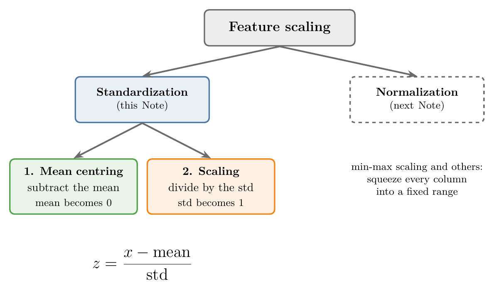

## 2. Feature scaling, in brief

> **Key point:** Feature scaling brings the features to a similar range, so a feature with big numbers does not drown out one with small numbers.

**Feature scaling** (G-767) brings the features of a dataset into a similar range. [Scaling the inputs](../../01-foundations/ML-012-toy-project/ML-012-toy-project.md#7-scaling-the-inputs) introduced the reason; here we work it through on this Note's data (Section 6.1), where each user has an age and a salary.

**The plain idea.** Algorithms such as KNN decide which users are alike by measuring the distance between them. A salary gap is in the thousands and an age gap is in the tens, so the salary gap decides the distance alone.

**The standard term.** The distance used is the **Euclidean distance** (G-715): the straight-line distance between two points. For two users it is

$$d = \sqrt{(\text{age gap})^2 + (\text{salary gap})^2}.$$

**Worked example.** Take a user aged 26 with a salary of 15,000 rupees, and two others:

| Other user | Age gap | Salary gap | Distance |
|---|---|---|---|
| age 42, salary 53,000 | 16 | 38,000 | $\sqrt{256 + 1{,}444{,}000{,}000} \approx 38{,}000$ |
| age 35, salary 59,000 | 9 | 44,000 | $\sqrt{81 + 1{,}936{,}000{,}000} \approx 44{,}000$ |

The age gaps add 256 and 81 to numbers above a billion: they change nothing. The 42-year-old counts as the nearer user only because the salaries are closer.

Figure 2 draws the squared distance to five users as bars, split into the age part (blue) and the salary part (orange). Watch the blue part: on raw data it is too small to see. After standardization, both parts show, and the nearest user changes from the 42-year-old to the 35-year-old, who is closer in age.

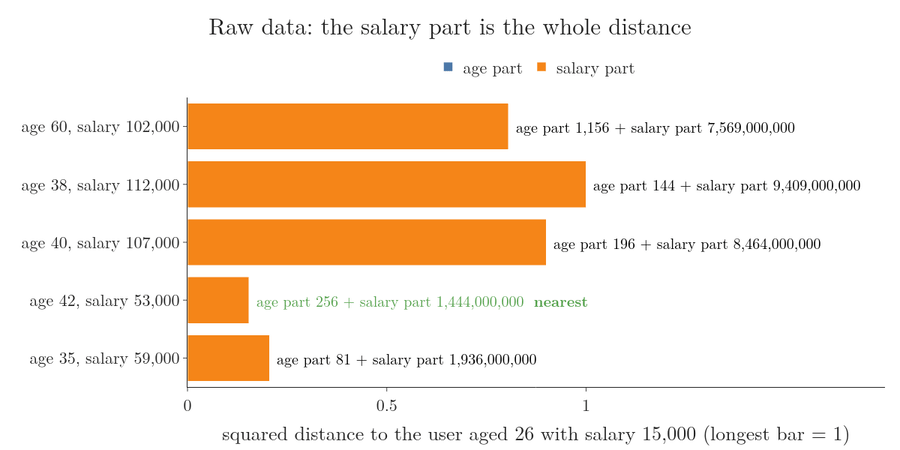

Two more points about feature scaling:

- Only the features are scaled, never the **target** (G-1949) (the output we predict).
- Scaling is usually the last step of feature engineering: we first handle missing values, transform columns and deal with categories, then scale just before giving the data to the model.

## 3. Types of feature scaling

> **Key point:** The two types of feature scaling are standardization and normalization.

There are two main types:

1. **Standardization** (G-1874), the subject of this Note.
2. **Normalization** (G-1349), which has several techniques of its own. The main one is **min-max scaling** (G-1217); another is the **robust scaler** (G-1699), which copes well with outliers. Both are covered in the next Note.

Standardization is sometimes called **z-score normalization** (G-2140) in ML writing, because each scaled value is a **z-score** (G-2141). The two names mean the same technique.

## 4. The standardization formula

> **Key point:** Each value is replaced by its distance from the column's mean, measured in standard deviations.

### 4.1 The idea: how many standard deviations from the mean

> **Key point:** A z-score answers one question about a value: how many standard deviations above or below the mean is it?

The **mean** is the average of a column. The **standard deviation** is the typical distance of the values from that mean (both are taught in [count, mean, standard deviation, minimum and maximum](../../02-getting-data/ML-018-understanding-your-data/ML-018-understanding-your-data.md#71-count-mean-standard-deviation-minimum-and-maximum)). The **z-score** (G-2141) of a value is the number of standard deviations the value lies from the mean.

Figure 3 builds the z-scores of eight made-up ages, chosen so that the arithmetic is easy: the mean is 30 and the standard deviation is 4. Watch the numbers under the dots: the dots stay where they are, and only their numbers change, in two steps.

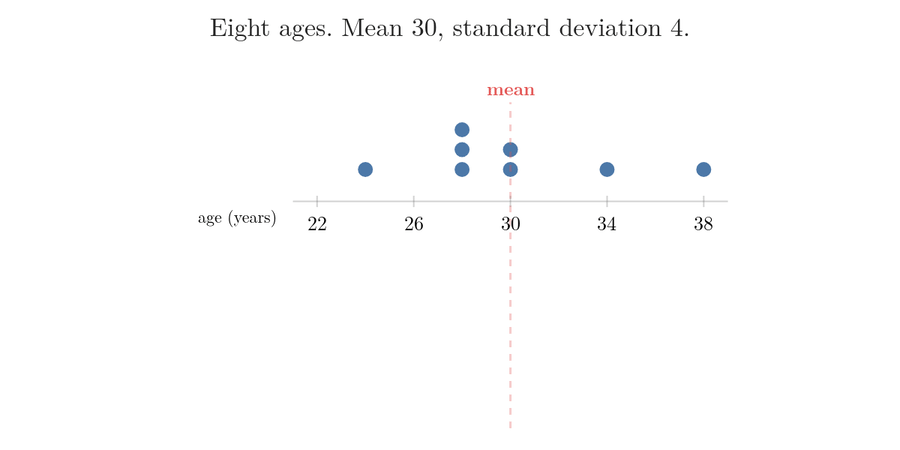

| Age | Age - 30 | Divided by 4 (z-score) | In words |
|---|---|---|---|
| 24 | -6 | -1.5 | 1.5 standard deviations below the mean |
| 28 | -2 | -0.5 | half a standard deviation below |
| 30 | 0 | 0 | exactly at the mean |
| 34 | 4 | 1 | 1 standard deviation above |
| 38 | 8 | 2 | 2 standard deviations above |

Step 1 is **mean centring** (G-1195): subtracting the mean, so that the mean itself becomes 0. Step 2 changes the unit from years to standard deviations. Doing both steps to every value of a column is standardization.

### 4.2 The formula

> **Key point:** $x' = (x - \bar{x}) / \sigma$, applied to every value of the column.

Take a column `age` holding the ages of 500 customers (and the data has a salary column too). To standardize `age`, we compute a new value for every **observation** (G-1374) (one record, one row of the table), one by one.

**Standardization**, step by step:

1. **In words:** from each value, subtract the mean of the whole column, then divide by the standard deviation of the whole column.
2. **Formula:** for the $i$-th value $x_i$ of a column with mean $\bar{x}$ and standard deviation $\sigma$,
   $$x_i' = \frac{x_i - \bar{x}}{\sigma}$$
3. **Example:** suppose the 500 ages have mean 32 and standard deviation 10. A customer aged 27 becomes
   $$x' = \frac{27 - 32}{10} = -0.5,$$
   and a customer aged 15 becomes
   $$x' = \frac{15 - 32}{10} = -1.7.$$

Figure 4 draws the two worked ages on two number lines, one in years and one in standard deviations. Watch the mean, 32, land on 0, and each step of 10 years become a step of 1.

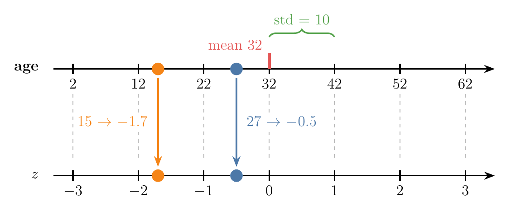

Doing this for all 500 rows gives a new column of 500 numbers, such as 2.3, -1.2 and -0.5. Each one says how many standard deviations the original value lay above (positive) or below (negative) the mean.

The new column always has two fixed properties, whatever the original numbers were:

- its **mean is 0**;
- its **standard deviation is 1**.

> **Extra:** Why the new mean is always 0 and the new standard deviation always 1. Subtracting $\bar{x}$ from every value moves the mean down by exactly $\bar{x}$, to 0, without changing the spread. Dividing every value by $\sigma$ divides the spread by $\sigma$ too, so the new standard deviation is $\sigma / \sigma = 1$.

## 5. What standardization does to the data

> **Key point:** Standardization first moves the cloud of points so its centre sits at the origin (mean centring), then squeezes or stretches each axis until its standard deviation is 1.

Plot every row as a point, with one column on each axis. The 500 customers form a cloud somewhere away from the origin, with some spread along each axis. Standardization moves this cloud in two steps (Figure 5):

1. **Mean centring:** subtracting the mean slides the whole cloud, unchanged, until its mean sits at the origin $(0, 0)$.
2. **Scaling by the standard deviation:** dividing by the standard deviation changes the spread along each axis to exactly 1.

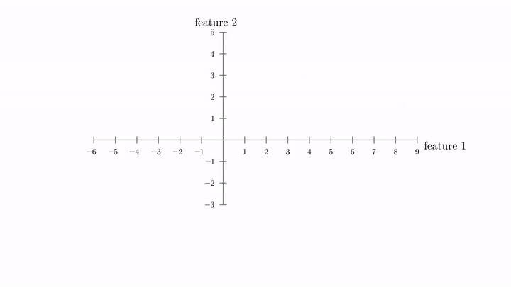{height=55%}

In Figure 5, the red cross marks the mean and the dashed box reaches one standard deviation either side of it. Feature 1 starts with standard deviation 2 and feature 2 with 0.6.

The second step works differently for the two axes:

- **Standard deviation above 1** (feature 1): dividing by it makes the values smaller, so the points **squeeze** in.
- **Standard deviation below 1** (feature 2, here 0.6): dividing by it makes the values bigger, so the points **spread out**.

At the end, both axes have mean 0 and standard deviation 1, and the dashed box is a square from -1 to 1.

## 6. Standardization in scikit-learn

> **Key point:** Split the data first, then let `StandardScaler` learn the mean and standard deviation from the training set and apply them to both sets.

### 6.1 The data

> **Key point:** 400 users of a social network, with age, estimated salary and whether they bought a product.

The data is the Social Network Ads file: 400 users of a social network, and whether each one bought a product shown in an advertisement. We keep three columns:

| Age | EstimatedSalary | Purchased |
|---|---|---|
| 19 | 19,000 | 0 |
| 35 | 20,000 | 0 |
| 26 | 43,000 | 0 |

`Age` and `EstimatedSalary` are the features; `Purchased` (1 = bought, 0 = did not) is the target. So this is a classification problem.

> **Python:** Loading the data and keeping three columns.
>
> ```python
> import pandas as pd
>
> df = pd.read_csv("data/Social_Network_Ads.csv")
> # drop User ID and Gender
> df = df.iloc[:, 2:]
> ```

### 6.2 Split before scaling

> **Key point:** Always do the train-test split before any feature scaling.

Whether we standardize or normalize, the **train-test split** (G-1998) comes first. The scaler should learn only from the training set, as [training and test sets](../../01-foundations/ML-012-toy-project/ML-012-toy-project.md#6-training-and-test-sets) explained under **data leakage** (G-535; information from the test set leaking into training). With 30% of the rows held back for testing, the training set has 280 rows and the test set 120.

> **Python:** Splitting the data.
>
> ```python
> from sklearn.model_selection import train_test_split
>
> X_train, X_test, y_train, y_test = train_test_split(
>     df.drop(columns="Purchased"),   # inputs
>     df["Purchased"],                # target
>     test_size=0.3, random_state=0)
> # X_train: (280, 2), X_test: (120, 2)
> ```

### 6.3 Fit on the training set, transform both

> **Key point:** `fit` learns the mean and standard deviation of each column; `transform` applies the formula to every value.

scikit-learn's **`StandardScaler`** (G-1876) class does exactly what Section 4 described: it takes every value and applies $(x_i - \bar{x}) / \sigma$. Using it has two steps:

- **fit** (G-783): learn each column's mean and standard deviation from the training set, and store them.
- **transform:** apply the formula to every value, using the stored numbers.

We fit on the training set only, but transform both the training set and the test set. The test set is scaled with the training set's mean and standard deviation, never its own.

Figure 6 shows the flow with the real numbers. Watch the arrows: only the training set feeds `fit`, while both sets pass through `transform`.

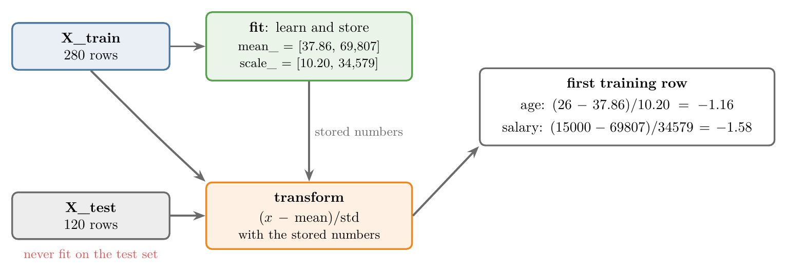

> **Python:** Standardizing with `StandardScaler`.
>
> ```python
> from sklearn.preprocessing import StandardScaler
>
> scaler = StandardScaler()
> # learn mean and std from the training set only
> scaler.fit(X_train)
> # apply them to both sets
> X_train_scaled = scaler.transform(X_train)
> X_test_scaled = scaler.transform(X_test)
>
> scaler.mean_    # [37.86, 69807.14]
> scaler.scale_   # [10.20, 34579.29]
> ```
>
> After `fit`, the learned numbers are stored in `mean_` (the means) and `scale_` (the standard deviations), one per column.

`transform` gives back a NumPy array, which has no column names and is harder to read. We turn it back into a DataFrame.

> **Python:** Putting the column names back.
>
> ```python
> X_train_scaled = pd.DataFrame(
>     X_train_scaled, columns=X_train.columns)
> X_test_scaled = pd.DataFrame(
>     X_test_scaled, columns=X_test.columns)
> ```

The same formula, worked on a real row:

1. **In words:** the first training row is a 26-year-old with a salary of 15,000 rupees. We subtract each column's training mean and divide by its training standard deviation.
2. **Formula:**
   $$x' = \frac{x - \text{mean}}{\text{std}}$$
3. **Example:** for the age and the salary,
   $$\text{age: } \frac{26 - 37.86}{10.20} \approx -1.16$$

   $$\text{salary: } \frac{15000 - 69807}{34579} \approx -1.58$$

   These are exactly the numbers in the first row of `X_train_scaled`.

### 6.4 Checking the result with describe

> **Key point:** After scaling, both columns have mean 0 and standard deviation 1.

`describe()` before and after scaling shows the change (rounded to one decimal place):

| | Age before | Age after | Salary before | Salary after |
|---|---|---|---|---|
| mean | 37.9 | 0.0 | 69,807.1 | 0.0 |
| std | 10.2 | 1.0 | 34,641.2 | 1.0 |
| min | 18.0 | -1.9 | 15,000 | -1.6 |
| max | 60.0 | 2.2 | 150,000 | 2.3 |

Before scaling, the two columns live in completely different ranges. After scaling, both have mean 0 and standard deviation 1, and both run from about -2 to 2.

> **Extra:** `scaler.scale_` (34,579) and `describe()` (34,641) give slightly different salary standard deviations because pandas divides by $n - 1$ and `StandardScaler` by $n$; the scaled column's std shows as 1.0 either way.

## 7. Effect of scaling on the data

> **Key point:** Scaling changes the numbers on the axes, not the shape of the data.

### 7.1 The scatter plot keeps its shape

> **Key point:** The cloud of points looks the same; only its centre and its units change.

Figure 7 plots every training user by age and salary, before and after scaling. The two clouds look the same: every point keeps its place relative to the others.

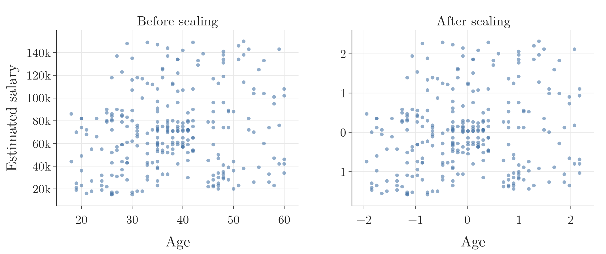

The difference is on the axes. Before scaling, age runs from about 20 to 60 and salary from 15,000 to 150,000. After scaling, both axes are centred on 0 and run from about -2 to 2: the data has been mean centred and given standard deviation 1.

### 7.2 The two columns become comparable

> **Key point:** Before scaling, the two density curves cannot be compared; after scaling, they sit on the same range.

Figure 8 draws the **kernel density estimate (KDE)** (G-1005), a smooth curve of where the values lie, of both columns on one axis. Before scaling, age lives in a very small range (18 to 60), so its curve is a tall, thin spike near 0. Salary is spread over a huge range, so its curve is almost a flat line: its density is around 0.000003.

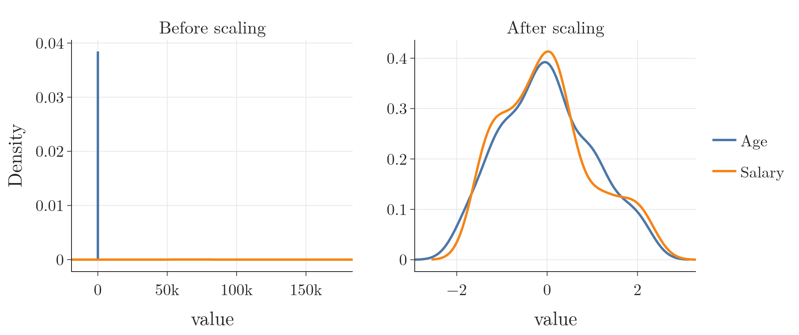

The two curves cannot be compared because their scales differ so much. After standardization, both curves sit on the same range, around 0. Any algorithm that compares the columns now treats them fairly, which helps the algorithms that measure distances or train by gradient descent (Section 8).

### 7.3 Each column keeps its shape

> **Key point:** Standardization does not change the shape of a column's distribution.

Figure 9 shows each column on its own. Age before scaling and age after scaling have exactly the same curve; so do salary before and after.

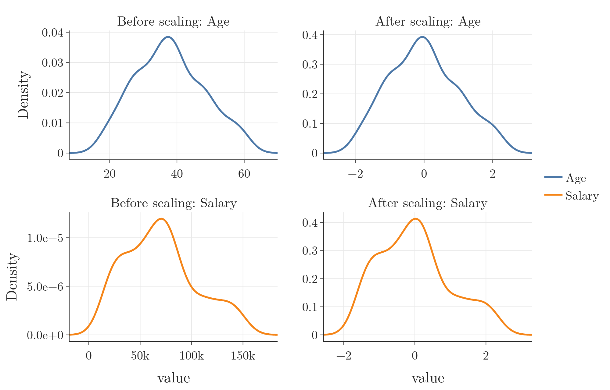

Only the numbers under the curve change: the mean becomes 0 and the standard deviation 1. If a column was skewed (lopsided, with a long tail on one side) before, it is just as skewed after standardization.

## 8. Why scaling matters: an experiment

> **Key point:** On this data, scaling lifts KNN from 82.5% to 91.7% accuracy and logistic regression from 65.8% to 86.7%, while a decision tree gets 87.5% either way.

Think of judging two runners, one timed in seconds and one in milliseconds: until the units match, the bigger numbers win by default. We train the same algorithm twice: once on the raw data, once on the standardized data. Then we compare the accuracy on the test set.

| Algorithm | Raw data | Standardized data |
|---|---|---|
| KNN (5 neighbours) | 82.5% | 91.7% |
| Logistic regression | 65.8% | 86.7% |
| Decision tree | 87.5% | 87.5% |

For **KNN**, which measures distances, scaling raised the accuracy from 82.5% to 91.7%. On raw data, salary differences in thousands decide the distance alone; after scaling, age counts too, as Figure 2 showed (scikit-learn examples, "Importance of Feature Scaling").

Figure 10 shows the two KNN models on the same axes, in the original units. Each coloured area is a **decision region** (G-557): the set of points that KNN would label with that class. The line where the two colours meet is the **decision boundary** (G-555). KNN labels a point by its 5 nearest training users. On raw data, the distance between two users is almost entirely their salary gap, because a salary gap of thousands dwarfs an age gap of tens. So the 5 nearest users are simply those with the closest salaries, whatever their age, and the raw model's decision boundary runs flat across the plot. After standardization, one standard deviation of age counts as much as one standard deviation of salary, so the boundary bends with age as well.

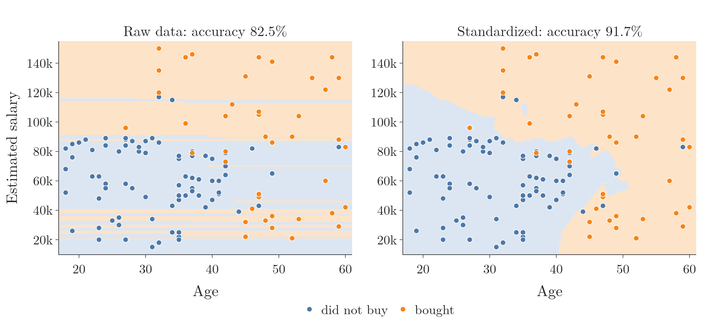

For **logistic regression** (G-1120), scaling raised the accuracy from about 66% to about 87%. The Extra below shows the cause: training by small downhill steps barely moves on raw data.

For a **decision tree** (G-561), scaling made no difference at all. A decision tree does not depend on the scale of the columns, for reasons that become clear in the Notes on decision trees.

> **Python:** The experiment for logistic regression.
>
> ```python
> from sklearn.linear_model import LogisticRegression
> from sklearn.metrics import accuracy_score
>
> lr = LogisticRegression(solver="sag")
> lr_scaled = LogisticRegression(solver="sag")
> lr.fit(X_train, y_train)
> lr_scaled.fit(X_train_scaled, y_train)
>
> accuracy_score(y_test, lr.predict(X_test))
> # 0.658
> accuracy_score(y_test, lr_scaled.predict(X_test_scaled))
> # 0.867
> ```
>
> For the decision tree, replace `LogisticRegression(solver="sag")` with `DecisionTreeClassifier()` from `sklearn.tree`.

> **Extra:** Why `solver="sag"`? A **solver** (G-1836) is the method a model uses to find its best settings during training. `"sag"` takes many small downhill steps, like gradient descent (Section 10), and scikit-learn warns that it is only fast when the features have about the same scale (scikit-learn docs, `LogisticRegression`). Here salaries reach 150,000 while ages stay below 60, so each step is tiny and the weights hardly move from 0. The model then predicts "not purchased" for every user, and 65.8% is simply the share of non-buyers in the test set. The Notebook checks this: allowed up to 100,000 steps, `sag` stops after about 9,800 with the weights still close to 0 and the accuracy still 65.8%.
>
> The default solver, `"lbfgs"`, does find good weights on the raw data too (87.5% on raw data, 86.7% on scaled data), but needs 65 steps on raw data against 7 on scaled data. The 0.8-point gap between those two accuracies is one test user out of 120, so it is noise, not a sign that scaling hurt. Either way, unscaled data makes the training harder.

In this experiment, scaling never hurt KNN, logistic regression with `sag` or the decision tree. In general, standardizing does no harm, but for some algorithms it helps a lot.

## 9. Standardization and outliers

> **Key point:** Standardization does not remove outliers or reduce their effect; they stay just as far from the rest of the data.

The original data has ages from 18 to 60 and salaries from 15,000 to 150,000 rupees. To see what happens to outliers, we add three made-up users far outside these ranges:

| Age | EstimatedSalary | Purchased |
|---|---|---|
| 5 | 1,000 | 0 |
| 90 | 250,000 | 1 |
| 95 | 350,000 | 1 |

After adding them, we split, standardize and plot the data again. Two of the three land in the training set (the third went to the test set), and Figure 11 shows them in red.

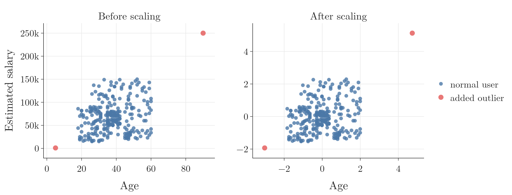

After scaling, the outliers are still outliers. They sit just as far from the main cloud as before; only the numbers on the axes changed.

So whenever we standardize a column that has **outliers** (G-1420), we must deal with the outliers separately. Later Notes cover how to detect and handle them.

> **Python:** Adding rows to a DataFrame.
>
> ```python
> extra = pd.DataFrame({
>     "Age": [5, 90, 95],
>     "EstimatedSalary": [1000, 250000, 350000],
>     "Purchased": [0, 1, 1]})
> df = pd.concat([df, extra], ignore_index=True)
> ```
>
> `pd.concat` joins tables one below the other; `ignore_index=True` renumbers the rows 0, 1, 2, ... Older code uses `df.append(...)`, which was removed in pandas 2.0.

## 10. When to use standardization

> **Key point:** Standardize for algorithms that measure distances or train by gradient descent; tree-based algorithms do not need it.

Standardizing rarely does harm, but for the algorithms below we should always do it.

**Algorithms that need scaling:**

- **K-means** (G-996) and **KNN** (k-nearest neighbours, G-998): both compute the Euclidean distance between points. If one column's numbers are much bigger, it dominates the distance and the results are poor.
- **PCA** (G-1469) (principal component analysis): PCA looks for the directions in which the data spreads the most (the most variance). A column with big numbers looks like it has the most spread just because of its units, so the columns must be put on the same scale, and PCA also needs the data mean centred. For example, an age column with a spread of 10 years has a variance of 100, while a salary column with a spread of 20,000 rupees has a variance of 400,000,000. PCA would find that salary "has all the spread" only because rupees are small units.
- **Gradient descent** (G-862), and every algorithm trained with it: linear regression, logistic regression and neural networks (deep learning).

Gradient descent (taught in [the idea of gradient descent](../../06-regression/ML-056-gradient-descent/ML-056-gradient-descent.md#2-the-idea)) improves the weights by small downhill steps. When the columns are on very different scales, some weights take big jumps while others crawl, so it struggles to settle at the minimum; with scaled columns it converges much more easily. A reason in numbers: the step for a column's weight is proportional to the column's value (error times value). For a user aged 25 with a salary of 50,000, one error of 1 pushes the age weight by 25 units and the salary weight by 50,000, a ratio of 2,000 to 1. Scaled, both values are near 1 and the pushes are similar.

**Algorithms that do not need scaling:**

- decision trees;
- random forest;
- gradient boosting;
- XGBoost.

Tree-based algorithms only compare values within one feature, asking questions like "is age greater than 40?". They never compute a distance or add up different columns, so the scale of the columns does not matter. Scaling them does no harm, but makes no difference either.

> **Extra:** Why a tree does not care. Suppose a tree splits on "age > 40". After standardization, the same split becomes "scaled age > 0.21", which is $(40 - 37.86)/10.20$. Exactly the same users fall on each side, so the tree makes exactly the same predictions.

## 11. Summary

| | Before standardization | After standardization | Why it matters |
|---|---|---|---|
| Mean of each column | anything (age 37.9, salary 69,807) | 0 | Every column is centred on the same point |
| Standard deviation | anything (age 10.2, salary 34,641) | 1 | No column wins by having bigger numbers |
| Typical range | depends on the units | about -2 to 2 | Age and salary become comparable |
| Shape of the distribution | some shape | the same shape | A skewed column stays just as skewed |
| Outliers | far from the rest | still far from the rest | Outliers must be handled separately |

| Algorithm | Needs scaling? | Why |
|---|---|---|
| KNN, K-means | yes | Euclidean distance (KNN: 82.5% to 91.7% here) |
| PCA | yes | looks for the largest variance; needs mean centring |
| Linear regression, logistic regression, neural networks | yes | trained with gradient descent |
| Decision tree, random forest, gradient boosting, XGBoost | no | only compare values within one column |

- Feature scaling is usually the last step before the model, and only the features are scaled. Its job is to stop a feature with big numbers (salary) from drowning out one with small numbers (age).
- Standardization: $x' = (x - \bar{x}) / \sigma$, giving mean 0 and standard deviation 1, whatever the units of the original column.
- A z-score says how many standard deviations a value lies above or below the mean, so a scaled value can be read on its own: -1.16 for the 26-year-old means 1.16 standard deviations below the mean age.
- Geometrically: mean centring, then squeezing or stretching each axis to standard deviation 1, so the cloud of points keeps its shape and only its centre and units change.
- Split first; fit the scaler on the training set only; transform both sets, because the test set must be scaled with the training mean and standard deviation, or test-set information leaks into training (data leakage).
- Standardization keeps the shape of the data and does not remove outliers, so outliers still have to be detected and handled on their own.
- On the ads data, KNN went from 82.5% to 91.7% accuracy and logistic regression from 65.8% to 86.7%; a decision tree stayed at 87.5%. The reason: on raw data the salary gap decides the KNN distance alone and the `sag` solver barely moves, while a tree only compares values within one column.
- So standardization is how features on very different ranges, such as age and salary, get one common scale before a distance-based or gradient-descent model sees them.

## 12. Sources

**Built from**

- CampusX, "Feature Scaling - Standardization | Day 24 | 100 Days of Machine Learning", YouTube, https://www.youtube.com/watch?v=1Yw9sC0PNwY
- Khan Academy, "Z-score introduction | Modeling data distributions", YouTube, https://www.youtube.com/watch?v=5S-Zfa-vOXs

**Other references**

- scikit-learn examples. Importance of Feature Scaling. scikit-learn.org (auto_examples/preprocessing).
- scikit-learn documentation. `sklearn.linear_model.LogisticRegression` (note on the `sag` and `saga` solvers). scikit-learn.org.
- scikit-learn documentation. `StandardScaler`, in the module `sklearn.preprocessing`. scikit-learn.org.

## 13. Key terms

Terms taught in this Note come first; linked terms are recaps, taught in the Note the link opens.

| Term | Meaning |
|---|---|
| Standardization (G-1874) | Scaling a column to mean 0 and standard deviation 1 (subtract the mean, divide by the standard deviation), so features measured on different scales become comparable. |
| Z-score normalization (G-2140) | Another name for standardization: rescaling a column so each value becomes its z-score, how many standard deviations it lies from the mean. |
| Train-test split (G-1998) | Dividing the data into a training set the model learns from and a test set held back to check it on unseen rows; it comes before scaling or fitting. |
| StandardScaler (G-1876) | scikit-learn's class that standardizes columns: `fit` learns each column's mean and standard deviation from the training set, and `transform` applies $(x - \bar{x})/\sigma$. |
| fit / transform (G-783) | Learn the scaler's numbers from the training set / apply them to any data. |
| [Feature](../../../ML/01-foundations/ML-002-ai-vs-ml-vs-dl/ML-002-ai-vs-ml-vs-dl.md#52-features-chosen-by-us-or-learned) (G-772) | One piece of information about each example that a model uses (e.g. a student's CGPA). |
| [Feature scaling (scaling)](../../../ML/01-foundations/ML-012-toy-project/ML-012-toy-project.md#7-scaling-the-inputs) (G-767) | Putting columns on the same scale, so no column dominates distances. |
| [Euclidean distance](../../../ML/04-missing-data-and-outliers/ML-038-knn-imputer/ML-038-knn-imputer.md#41-the-euclidean-distance) (G-715) | The straight-line distance between two points. |
| [Target](../../../ML/01-foundations/ML-003-types-of-ml/ML-003-types-of-ml.md#21-learning-from-inputs-and-outputs) (G-1949) | The output column we predict, such as the class; also called the label. |
| [Normalization (feature scaling)](../../../ML/03-feature-engineering/ML-024-normalization/ML-024-normalization.md#2-what-normalization-is) (G-1349) | The type of feature scaling that squeezes values into a fixed range, such as 0 to 1. |
| [Min-max scaling](../../../ML/03-feature-engineering/ML-024-normalization/ML-024-normalization.md#41-the-formula) (G-1217) | Subtract the column's minimum and divide by its range, giving values from 0 to 1; the main normalization technique. |
| [Robust scaling](../../../ML/03-feature-engineering/ML-024-normalization/ML-024-normalization.md#9-robust-scaling) (G-1699) | Subtract the median and divide by the interquartile range; copes well with outliers. |
| [Z-score](../../../ML/04-missing-data-and-outliers/ML-041-outliers-zscore/ML-041-outliers-zscore.md#4-why-it-is-called-the-z-score-method) (G-2141) | A value after standardization: how many standard deviations it lies from the mean. |
| [Mean centring](../../../MA/05-linear-algebra/MA-049-magnitude-distance-and-scalar-operations/MA-049-magnitude-distance-and-scalar-operations.md#5-mean-centring-shifting-in-ml) (G-1195) | Subtracting the mean from every value, so the column's mean becomes 0. |
| [Observation](../../../ML/01-foundations/ML-003-types-of-ml/ML-003-types-of-ml.md#21-learning-from-inputs-and-outputs) (G-1374) | One record of a dataset: one row of the data table. |
| [Data leakage](../../../ML/03-feature-engineering/ML-028-pipelines/ML-028-pipelines.md#81-why-the-preprocessing-must-be-inside-data-leakage) (G-535) | Information from the test rows reaching the model during training, for example when a scaling or feature-selection step is fitted on all the data before the split; the test scores then come out higher than the model will really do on new data. |
| [Kernel density estimate (KDE)](../../../ML/02-getting-data/ML-019-univariate-analysis/ML-019-univariate-analysis.md#7-density-plot) (G-1005) | A smooth curve that estimates a column's PDF from its values, built by adding a kernel centred on every data point; a KDE plot draws it. |
| [Decision region](../../../ML/07-classification/ML-078-softmax-regression/ML-078-softmax-regression.md#5-in-scikit-learn) (G-557) | The part of the input space in which a model predicts a given class. |
| [Decision boundary](../../../ML/01-foundations/ML-006-instance-vs-model-based/ML-006-instance-vs-model-based.md#41-learning-a-decision-boundary) (G-555) | A line or curve that separates the classes in classification. |
| [Logistic regression](../../../ML/07-classification/ML-069-perceptron-trick/ML-069-perceptron-trick.md#1-overview) (G-1120) | A classification algorithm that passes a weighted sum of the inputs through the sigmoid to give the probability of a class; the line (or plane) where that probability is 0.5 is the boundary it learns between the classes. |
| [Decision tree](../../../ML/08-trees-and-ensembles/ML-091-decision-trees-intuition/ML-091-decision-trees-intuition.md#2-a-decision-tree-is-nested-if-else) (G-561) | A model that predicts by asking a chain of questions about the input columns: nested if-else conditions. |
| [Solver](../../../ML/07-classification/ML-080-logistic-hyperparameters/ML-080-logistic-hyperparameters.md#3-the-solver) (G-1836) | The method a model uses to find its best settings during training. |
| [Outlier](../../../ML/02-getting-data/ML-019-univariate-analysis/ML-019-univariate-analysis.md#81-whiskers-and-outliers) (G-1420) | A value far from the rest of the data. |
| [k-means](../../../ML/09-clustering-and-more/ML-122-kmeans-intuition/ML-122-kmeans-intuition.md#4-the-five-steps-of-k-means) (G-996) | A clustering algorithm that repeatedly assigns points to the nearest centre and moves each centre to the mean of its points. |
| [K-nearest neighbours (KNN)](../../../ML/07-classification/ML-085-knn/ML-085-knn.md#2-how-knn-predicts) (G-998) | Predicting from the answers of the k closest stored points. |
| [PCA (principal component analysis)](../../../ML/05-dimensionality/ML-046-pca-geometric-intuition/ML-046-pca-geometric-intuition.md#1-what-pca-is) (G-1469) | A way to replace many columns with a few new ones that keep most of the spread in the data, using no labels (unsupervised feature extraction for dimensionality reduction). Each new column, a principal component, follows one direction of greatest variance. Used to cut the number of features and to plot data with many columns. |
| [Gradient descent](../../../ML/06-regression/ML-056-gradient-descent/ML-056-gradient-descent.md#1-overview) (G-862) | Finding the lowest point of a function by repeated small steps downhill. |
