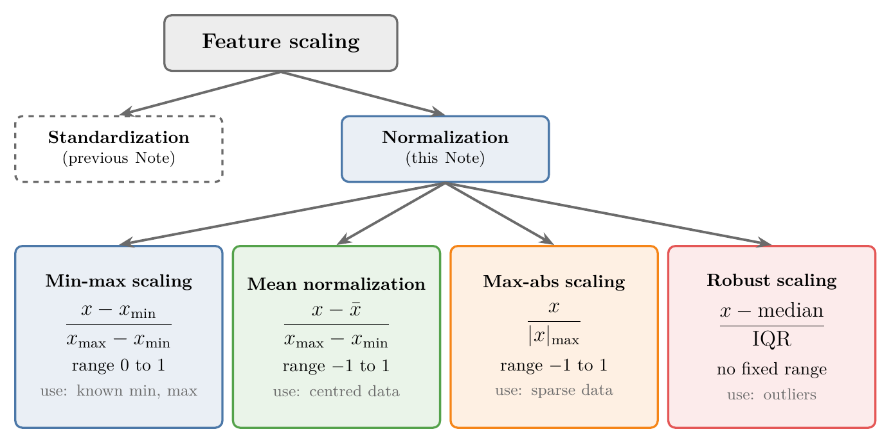
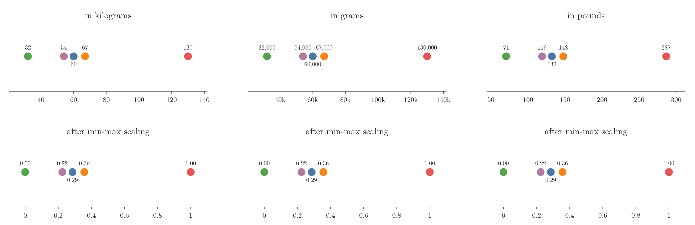
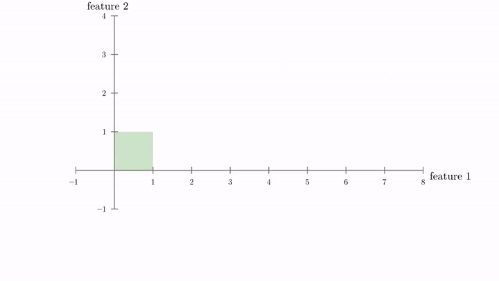
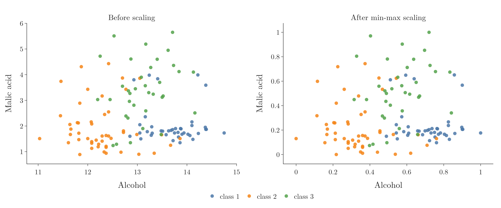
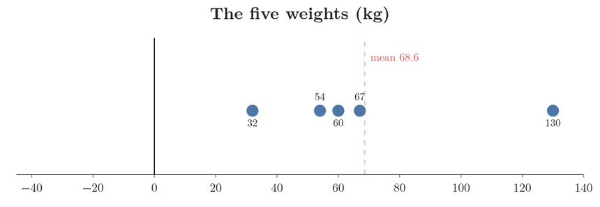
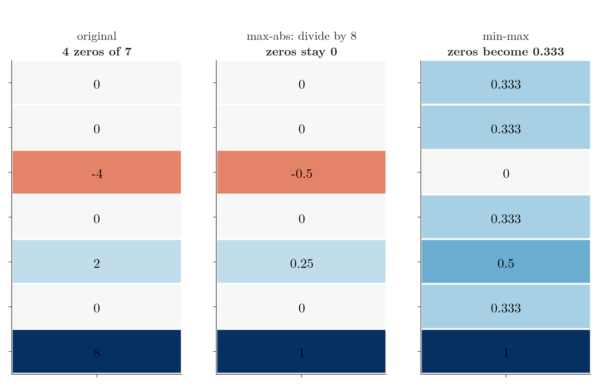
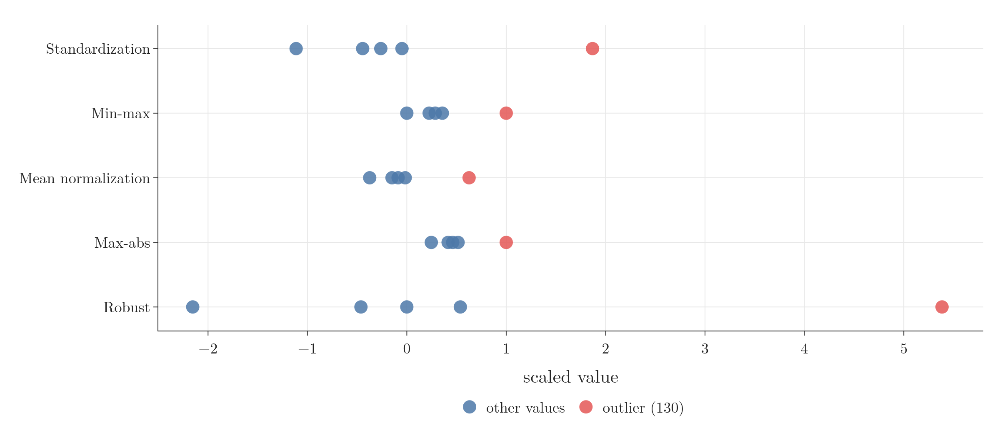
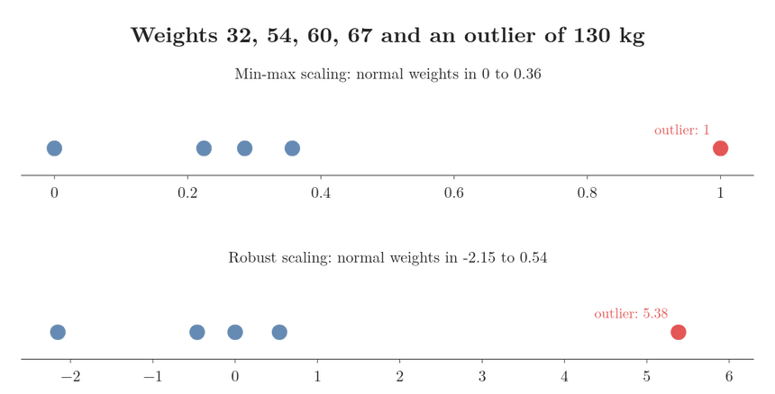
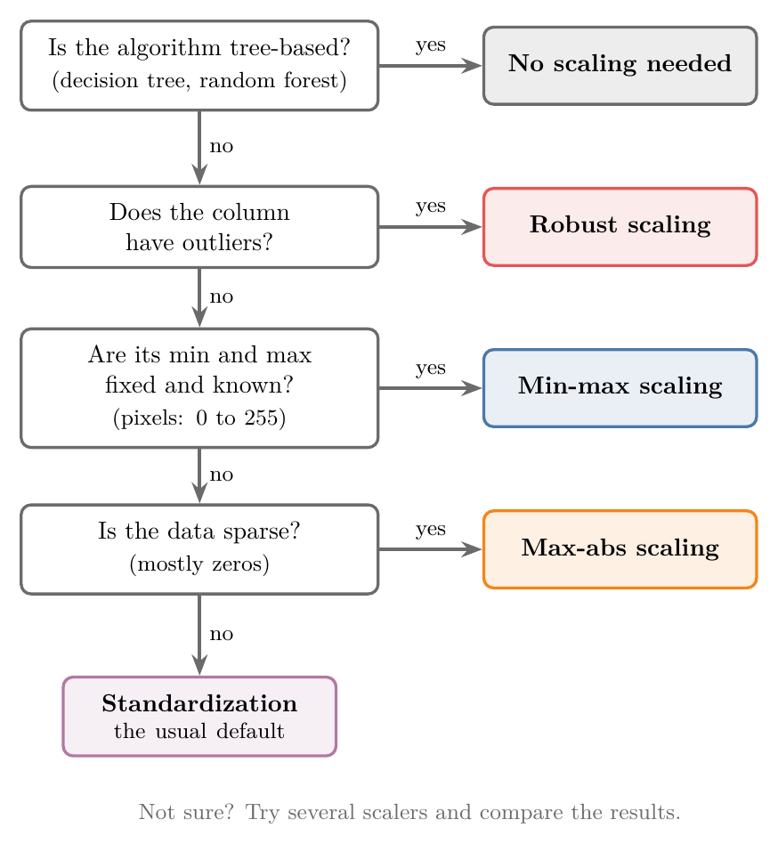
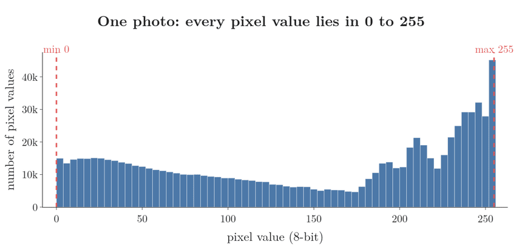

<!-- where-this-fits: generated by course_map/build_map.py; edit concepts.yaml, not this block -->
> **Where this fits:** Pipeline map step 5 (Engineer features). See the [Course map](../../../00-course-map/00-course-map.md).
>
> 
>
> - **Builds on:** [Feature scaling](../../../ML/03-feature-engineering/ML-022-what-is-feature-engineering/ML-022-what-is-feature-engineering.md#65-feature-scaling).
> - **Leads to:** [ANN for regression](../../../DL/01-basics/DL-013-graduate-admission-ann/DL-013-graduate-admission-ann.md#1-overview); [Scaling inputs for neural networks](../../../DL/02-training/DL-023-data-scaling-in-ann/DL-023-data-scaling-in-ann.md#1-overview).
> - **Compare with:** [Standardization](../../../ML/03-feature-engineering/ML-023-standardization/ML-023-standardization.md#4-the-standardization-formula).
<!-- /where-this-fits -->

## 1. Overview

> **Key point:** Normalization rescales every feature into a common, fixed range. Its main technique, min-max scaling, squeezes each column into 0 to 1.

**Feature scaling** (G-767) has two main types: standardization ([the standardization formula](../ML-023-standardization/ML-023-standardization.md#4-the-standardization-formula): subtract the mean, divide by the standard deviation) and normalization (this Note). Normalization is a family of techniques; this Note covers four of them:

- min-max scaling (sections 4 to 6);
- mean normalization (section 7);
- max-abs scaling (section 8);
- robust scaling (section 9).

Figure 1 shows the four techniques side by side: one box per technique, with its formula, the range of its output and when to use it. The Note ends with a guide to choosing between standardization and each of them.



## 2. What normalization is

> **Key point:** Normalization puts numerical columns on a common scale and removes their units, without distorting the differences between values.

Start from a plain example. The same person weighs 70 in kilograms, 70,000 in grams and about 154 in pounds. The person did not change, but the number did, and a model fed the column in grams would treat the differences as a thousand times bigger. Normalization removes this effect of the unit. In the standard words:

**Normalization** (G-1349) is a technique often used in data preparation for machine learning. Its goal is to change the values of the numerical columns in a dataset to a common scale, without distorting the differences in the ranges of values or losing information.

Take a dataset that predicts whether a person will buy sports equipment, from **features** (G-772; input variables, one column each of the data table) such as weight and height. Each person is one **observation** (G-1374; one record, one row), and the purchase is the **target** (G-1949; the output we predict). Every numerical quantity has two parts: a **magnitude** (G-1144; the number) and a **unit**. A weight of 70 has the magnitude 70 and a unit that could be grams, kilograms or pounds.

In ML it is a good idea to remove the units before training. When every column is brought to a common scale with no units, ML algorithms usually give better results. Removing the units is the whole idea behind normalization. Figure 2 shows it with the five weights of section 4, written in kilograms, grams and pounds. The raw numbers differ by a factor of 1,000, yet after min-max scaling all three give the same five values, 0, 0.22, 0.29, 0.36 and 1, because a change of unit multiplies the value, the minimum and the maximum by the same factor, which cancels in the fraction.



## 3. Types of normalization

> **Key point:** We look at four techniques; min-max scaling is the simplest and gets the most attention here.

The four normalization techniques in this Note are:

1. **Min-max scaling**, the most common one. Sometimes people say "normalization" and mean exactly this.
2. **Mean normalization**.
3. **Max-abs scaling**.
4. **Robust scaling**.

scikit-learn's documentation lists more such transformations; these four are the important ones. Min-max scaling gets the most attention here, because it is the simplest and the others build on the same idea.

## 4. Min-max scaling

> **Key point:** Subtract the column's minimum, then divide by its range (maximum minus minimum); every result lies between 0 and 1.

### 4.1 The formula

> **Key point:** The smallest value becomes 0, the largest becomes 1, and everything else lands in between.

Take a column of five weights in kilograms: 130, 60, 67, 32 and 54. To apply **min-max scaling** (G-1217), we apply one formula to every number in the column. First we find two numbers for the whole column: its minimum (32) and its maximum (130).

**Min-max scaling**, step by step:

1. **In words:** from each value, subtract the minimum of the column, then divide by the column's range: the maximum minus the minimum.
2. **Formula:** for the $i$-th value $x_i$ of a column with minimum $x_{\min}$ and maximum $x_{\max}$,
   $$x_i' = \frac{x_i - x_{\min}}{x_{\max} - x_{\min}}$$
3. **Example:** the range is:
   $$130 - 32 = 98$$
   The weight 67 becomes
   $$x' = \frac{67 - 32}{130 - 32}$$
   $$x' = \frac{35}{98} \approx 0.357$$
   and the weight 130 becomes
   $$x' = \frac{130 - 32}{130 - 32} = 1$$

The five weights become 1, 0.286, 0.357, 0 and 0.224.

### 4.2 Why the output is always between 0 and 1

> **Key point:** The minimum maps to exactly 0 and the maximum to exactly 1, so no value can escape the range.

The new value is smallest when $x_i$ is the minimum. Then the top of the fraction is $x_{\min} - x_{\min} = 0$, so the result is 0.

The new value is largest when $x_i$ is the maximum. Then the top and the bottom of the fraction are equal, so the result is 1. Every other value gives something between 0 and 1.

So whenever we apply min-max scaling, the new column always lies in the range 0 to 1. The fixed 0-to-1 range is the main guarantee of min-max scaling.

### 4.3 What min-max scaling does to the data

> **Key point:** Min-max scaling picks up the whole cloud of points and squeezes it into the unit square.

Take two columns, weight and height, and plot every customer as a point. Height is in centimetres and weight in kilograms, so the cloud sits somewhere far from the origin, with its own spread on each axis. Min-max scaling moves this cloud in two steps (Figure 3, drawn with two made-up features, feature 1 and feature 2):

1. **Subtract the minimum:** the cloud slides, unchanged, until the corner of its bounding box (the minimum of each column) sits at the origin $(0, 0)$.
2. **Divide by the range:** each axis is squeezed or stretched until the cloud is exactly 1 wide and 1 tall.

{height=55%}

In Figure 3, the red dot marks the minimum corner and the dashed box runs from the minimum to the maximum of each feature. Feature 1 has range 5, so dividing by 5 squeezes it; feature 2 has range 0.6, so dividing by 0.6 stretches it.

At the end the whole dataset sits inside the **unit square** (G-2047), the square from $(0, 0)$ to $(1, 1)$. Pressing the data into a box is the geometric meaning of min-max scaling:

- with two columns, the data is pressed into a unit square;
- with three columns, into a **unit cube**;
- with more columns, into a **unit hypercube** (G-2046), the same idea in more dimensions.

The structure of the data is kept: the cloud has the same pattern inside the box as before.

## 5. Min-max scaling in scikit-learn

> **Key point:** Split first, let `MinMaxScaler` learn each column's minimum and maximum from the training set, then transform both sets.

### 5.1 The wine data

> **Key point:** 178 wines in three classes, with two features: alcohol and malic acid.

The data is the wine dataset: 178 wines grown in the same region of Italy, from three different cultivars. The file has 14 columns; we keep the first three:

| Class label | Alcohol | Malic acid |
|---|---|---|
| 1 | 14.23 | 1.71 |
| 1 | 13.20 | 1.78 |
| 1 | 13.16 | 2.36 |

`Alcohol` and `Malic acid` are the features; `Class label` (1, 2 or 3) is the target. Each wine is one observation. Alcohol has bigger numbers (about 11 to 15) than malic acid (about 1 to 6).

> **Python:** Loading three columns of a file with no header row.
>
> ```python
> import pandas as pd
>
> df = pd.read_csv("data/wine_data.csv",
>                  header=None, usecols=[0, 1, 2])
> df.columns = ["Class label", "Alcohol",
>               "Malic acid"]
> ```
>
> `header=None` tells pandas the first row is data, not column names. `usecols=[0, 1, 2]` keeps only the first three columns.

> **Extra:** The full wine dataset (13 features) comes from the UCI Machine Learning Repository and is also built into scikit-learn as `sklearn.datasets.load_wine` (scikit-learn docs, `load_wine`).

### 5.2 Split, fit and transform

> **Key point:** Split before scaling; fit on the training set only; transform both sets.

As with standardization, the **train-test split** (G-1998) comes first, and the scaler learns only from the training set. With 30% held back for testing, the training set has 124 rows and the test set 54.

scikit-learn's **`MinMaxScaler`** (G-1228) class applies the min-max formula. `fit` learns each column's minimum and maximum from the training set; `transform` applies the formula with those stored numbers.

> **Python:** Min-max scaling with `MinMaxScaler`.
>
> ```python
> from sklearn.model_selection import train_test_split
> from sklearn.preprocessing import MinMaxScaler
>
> X_train, X_test, y_train, y_test = train_test_split(
>     df.drop(columns="Class label"),
>     df["Class label"],
>     test_size=0.3, random_state=0)
>
> scaler = MinMaxScaler()
> # learn min and max from the training set only
> scaler.fit(X_train)
> # apply them to both sets
> X_train_scaled = scaler.transform(X_train)
> X_test_scaled = scaler.transform(X_test)
>
> scaler.data_min_    # [11.03, 0.89]
> scaler.data_max_    # [14.75, 5.65]
> ```
>
> After `fit`, the minimums are stored in `data_min_` and the maximums in `data_max_`, one per column. `transform` returns a NumPy array; wrap it in `pd.DataFrame(..., columns=X_train.columns)` to get the column names back.

The same formula, worked on a real row:

1. **In words:** the first training row is a wine with alcohol 13.71 and malic acid 1.86. We subtract each column's training minimum and divide by its training range.
2. **Formula:**
   $$x' = \frac{x - \text{min}}{\text{max} - \text{min}}$$
3. **Example:** for alcohol (min 11.03, max 14.75):
   $$\frac{13.71 - 11.03}{14.75 - 11.03}$$
   $$= \frac{2.68}{3.72} \approx 0.72$$
   For malic acid (min 0.89, max 5.65):
   $$\frac{1.86 - 0.89}{5.65 - 0.89}$$
   $$= \frac{0.97}{4.76} \approx 0.20$$
   These are exactly the numbers in the first row of `X_train_scaled`.

### 5.3 Checking the result with describe

> **Key point:** After scaling, both columns have minimum 0 and maximum 1; nothing is promised about the mean or the spread.

`describe()` before and after scaling on the training set (rounded to two decimal places):

| | Alcohol before | Alcohol after | Malic acid before | Malic acid after |
|---|---|---|---|---|
| mean | 12.98 | 0.53 | 2.38 | 0.31 |
| std | 0.80 | 0.22 | 1.14 | 0.24 |
| min | 11.03 | 0.00 | 0.89 | 0.00 |
| max | 14.75 | 1.00 | 5.65 | 1.00 |

Before scaling, alcohol ran from 11.03 to 14.75 and malic acid from 0.89 to 5.65. After scaling, both have minimum 0 and maximum 1.

The mean and the standard deviation come out different for each column (0.53 and 0.31, 0.22 and 0.24). Min-max scaling guarantees only the minimum and the maximum, nothing about the centre or the spread.

Figure 4 draws each wine as a tick. On the left the two features live on different ranges; on the right both training ranges are exactly 0 to 1 (dashed lines). The grey ticks are the test wines, scaled with the training minimum and maximum; a few land just outside 0 to 1: one alcohol value at $1.02$, and malic-acid values at $-0.03$ and $1.03$.


> **Extra:** The guarantee holds only for the data the scaler was fitted on. The test set is scaled with the training minimum and maximum, so a test value outside the training range lands slightly outside 0 to 1. Here the test set's alcohol reaches $1.02$ and its malic acid runs from $-0.03$ to $1.03$. Such small overshoots are expected and harmless.

## 6. Effect of min-max scaling on the data

> **Key point:** Min-max scaling changes the numbers on the axes, not the pattern of the data or the shape of each column.

### 6.1 Same effect as standardization

> **Key point:** As in the standardization Note, the cloud keeps its pattern and each column keeps its shape; only the axes change, and now they run from 0 to 1.

Min-max scaling has the same effects as standardization (see [the effect of scaling on the data](../ML-023-standardization/ML-023-standardization.md#7-effect-of-scaling-on-the-data)), now inside the unit square. Figure 5 shows the training wines before and after: the three classes keep their places, and both axes now run from 0 to 1.



### 6.2 The weakness: outliers

> **Key point:** One extreme value sets the minimum or maximum, and squeezes all the normal values into a small part of 0 to 1.

Min-max scaling depends entirely on the two most extreme values of the column. If one of them is an outlier, it decides the range for everyone. In the weight column, 130 is far above the rest; the other four weights end up between 0 and 0.36, leaving most of the 0 to 1 range empty.

So min-max scaling handles outliers badly. For all other purposes it is a good, simple choice; for columns with outliers, robust scaling (Section 9) works better. Figure 9 in that section shows the squeeze getting worse as the outlier grows.

## 7. Mean normalization

> **Key point:** Subtract the mean instead of the minimum, then divide by the range; the result is centred on 0 and lies between -1 and 1.

**Mean normalization** (G-1198), step by step:

1. **In words:** from each value, subtract the mean of the column, then divide by the column's range (maximum minus minimum).
2. **Formula:** for a column with mean $\bar{x}$,
   $$x_i' = \frac{x_i - \bar{x}}{x_{\max} - x_{\min}}$$
3. **Example:** the five weights have this mean:
   $$\frac{130 + 60 + 67 + 32 + 54}{5} = 68.6$$
   The range is 98. The weight 130 becomes
   $$x' = \frac{130 - 68.6}{98} \approx 0.627$$
   and the weight 32 becomes
   $$x' = \frac{32 - 68.6}{98} \approx -0.373$$

Subtracting the mean is the same **mean centring** (G-1195) that standardization does: the data moves so that its centre sits at 0. The division then shrinks it, so the values land between -1 and 1. A value below the mean gives a negative number; a value above the mean gives a positive number. Figure 6 shows both steps on the five weights.



Mean normalization is rarely used. Mean normalization suits algorithms that need **centred data** (G-365; mean 0), but in practice people use standardization for that instead.

> **Python:** scikit-learn has no class for mean normalization, so we write the formula ourselves.
>
> ```python
> w = pd.Series([32, 54, 60, 67, 130])
> w_scaled = (w - w.mean()) / (w.max() - w.min())
> ```

## 8. Max-abs scaling

> **Key point:** Divide every value by the largest absolute value in the column; the result lies between -1 and 1.

The **absolute value** (G-159) $|x|$ of a number is its size without its sign: $|-4| = 4$ and $|4| = 4$.

**Max-abs scaling** (G-1183), step by step:

1. **In words:** find the largest absolute value in the column, and divide every value by it.
2. **Formula:**
   $$x_i' = \frac{x_i}{|x|_{\max}}$$
   Here $x_i$ is one value of the column and $|x|_{\max}$ is the largest absolute value in the column.
3. **Example:** in the weight column the largest absolute value is 130. The weight 67 becomes
   $$x' = \frac{67}{130} \approx 0.515,$$
   and the weight 32 becomes
   $$x' = \frac{32}{130} \approx 0.246.$$

scikit-learn has a class for it, **`MaxAbsScaler`** (G-1188), used exactly like `MinMaxScaler`.

Max-abs scaling is used for **sparse data** (G-1840): data in which most values are 0. If our data has a very large number of zeros, max-abs scaling is the one to try. Apart from that, it is not used much.

Figure 7 scales a sparse column, four zeros out of seven values, both ways. Max-abs scaling only divides by 8, so each 0 stays 0. Min-max scaling first subtracts the minimum, $-4$, so each 0 becomes:

$$\frac{0 - (-4)}{12} = \frac{4}{12} = 0.333$$

The column is no longer sparse.



> **Extra:** Why sparse data. Max-abs scaling only divides; it never subtracts anything. So every 0 stays exactly 0, and the data stays sparse. A computer stores sparse data cheaply by recording only the non-zero values; min-max scaling or standardization would subtract a number from every 0, turn it into a non-zero value and destroy that saving (scikit-learn User Guide, "Scaling sparse data").

> **Python:** Max-abs scaling keeps zeros and signs.
>
> ```python
> from sklearn.preprocessing import MaxAbsScaler
>
> s = pd.DataFrame({"x": [0, 0, -4, 0, 2, 0, 8]})
> MaxAbsScaler().fit_transform(s).ravel()
> # [0, 0, -0.5, 0, 0.25, 0, 1]
> ```

## 9. Robust scaling

> **Key point:** Subtract the median and divide by the interquartile range; outliers barely affect either, so robust scaling handles outliers well.

The **median** (G-1209; see [the median](../../../MA/01-descriptive-stats/MA-005-measures-of-central-tendency/MA-005-measures-of-central-tendency.md#4-median)) is the middle value of the sorted column. The interquartile range (IQR, see [the five-number summary and the IQR](../../../MA/01-descriptive-stats/MA-008-percentiles-and-box-plots/MA-008-percentiles-and-box-plots.md#4-the-five-number-summary-and-the-iqr)) is the width of the middle half of the data. The 25th and 75th percentiles are the values below which a quarter and three quarters of the data lie ([percentiles](../../../MA/01-descriptive-stats/MA-008-percentiles-and-box-plots/MA-008-percentiles-and-box-plots.md#3-percentiles)).

**Robust scaling** (G-1699), step by step:

1. **In words:** from each value, subtract the median of the column, then divide by the interquartile range.
2. **Formula:**
   $$x_i' = \frac{x_i - \text{median}}{\text{IQR}}$$
   $$\text{IQR} = x_{75} - x_{25}$$
   where $x_{75}$ and $x_{25}$ are the 75th and 25th percentiles.
3. **Example:** sorted, the weights are 32, 54, 60, 67, 130. The median is 60, the 25th percentile 54 and the 75th percentile 67, so the IQR is:
   $$67 - 54 = 13$$
   The weight 67 becomes
   $$x' = \frac{67 - 60}{13} \approx 0.54$$
   and the outlier 130 becomes
   $$x' = \frac{130 - 60}{13} \approx 5.38$$

scikit-learn has a class for it, **`RobustScaler`** (G-1701), used exactly like the others.

The biggest strength of robust scaling is outliers: the median and the IQR are "robust to outliers" (scikit-learn User Guide, "Scaling data with outliers"). If our data has outliers, robust scaling is the scaler to try.

Figure 8 shows why. The figure scales the same five weights with every technique and puts all the results on one axis.



With min-max scaling and max-abs scaling, the outlier takes the top of the range and the four normal weights crowd together. With robust scaling, the four normal weights keep a useful spread (from -2.15 to 0.54) and only the outlier is pushed far away, to 5.38.

Figure 9 makes the outlier bigger step by step, from 130 to 1,000. Watch the four blue dots. Under min-max scaling they are pushed towards 0, until all four sit between 0 and 0.04. Under robust scaling they do not move at all; only the outlier's own value grows.



> **Extra:** Why the median and the IQR resist outliers. The minimum, the maximum and the mean all move when one extreme value is added; the median and the middle half of the data hardly move. Change 130 to 1,000 and the median (60) and the IQR (13) stay exactly the same, so the four normal weights get exactly the same scaled values.

> **Python:** Robust scaling.
>
> ```python
> from sklearn.preprocessing import RobustScaler
>
> w = pd.DataFrame({"weight": [32, 54, 60, 67, 130]})
> RobustScaler().fit_transform(w).ravel()
> # [-2.15, -0.46, 0, 0.54, 5.38]
> ```

No scaler wins everywhere. On one problem one scaler does best, on another problem a different one; looking at a dataset, we usually cannot tell in advance. So we try them and compare: ML is about experimentation, and every experiment adds to our knowledge of which scaler suits which data.

## 10. Normalization or standardization: which scaler when

> **Key point:** First ask whether scaling is needed at all; if it is, standardization is the usual choice, with a normalization technique for a few special cases.

Choosing between normalization and standardization confuses many people. The answer depends on the algorithm we use and the data we have. Figure 10 puts the practical rules into one flowchart.

{height=50%}

**First question: is feature scaling needed at all?** Some algorithms do not need it. For a decision tree (a model that splits the data by yes/no questions on one feature at a time), for example, we do not scale. To answer this question, we need to know how the algorithm works inside; this becomes clearer as we study each algorithm.

**Second question: standardization or normalization?** If scaling is needed, these practical rules help:

- **Standardization** is the usual default. Most problems are solved well by it: many learning algorithms assume features centred around zero with spreads of the same order (scikit-learn, "Preprocessing data"), and standardization is much less affected by outliers than min-max scaling (Géron 2019, ch. 2).
- **Min-max scaling** suits columns whose minimum and maximum are known in advance. In image processing, for example with CNNs (neural networks for images), every colour channel of a pixel runs from 0 to 255, so everyone uses min-max scaling there.
  Figure 11 shows this known-range case on one photo: the limits 0 and 255 are fixed by the image format, not learned from the data, so min-max scaling is just a division by 255.
- **Robust scaling** suits columns with outliers.
- **Max-abs scaling** suits sparse data.
- **Mean normalization** is rarely needed; standardization does the same centring job.



If we have no idea which to use, we try them all. Trying costs only a little extra computing time, and seeing which scaler worked best on which data builds the intuition that helps later on real-world datasets.

> **Extra:** Standardization and every normalization technique in this Note are linear: each subtracts one number and divides by another. None of them changes the shape of a column or removes an outlier; they differ only in which two numbers they use. Changing the shape of a distribution is the job of other transformations, such as the log transform, covered in later Notes.

## 11. Summary

| Technique | Subtract | Divide by | Output range |
|---|---|---|---|
| Standardization | mean | standard deviation | no fixed range (mean 0, std 1) |
| Min-max scaling | minimum | max - min | 0 to 1 |
| Mean normalization | mean | max - min | -1 to 1 |
| Max-abs scaling | nothing | largest absolute value | -1 to 1 |
| Robust scaling | median | IQR | no fixed range |

| Technique | Use when | scikit-learn | Why |
|---|---|---|---|
| Standardization | the usual default | `StandardScaler` | many algorithms expect centred features with similar spreads |
| Min-max scaling | min and max known (images) | `MinMaxScaler` | the limits (0 and 255) are fixed, so it is a division by 255 |
| Mean normalization | centred data needed (rare) | none, write the formula | standardization does the same centring job |
| Max-abs scaling | sparse data | `MaxAbsScaler` | it only divides, so every 0 stays 0 |
| Robust scaling | outliers | `RobustScaler` | the median and IQR hardly move when an outlier is added |

The five weights 32, 54, 60, 67, 130 after each technique:

| Weight | Min-max | Mean normalization | Max-abs | Robust |
|---|---|---|---|---|
| 32 | 0 | -0.373 | 0.246 | -2.15 |
| 67 | 0.357 | -0.016 | 0.515 | 0.54 |
| 130 | 1 | 0.627 | 1 | 5.38 |

- Normalization puts numerical columns on a common scale and removes their units, so the same weight in grams, kilograms or pounds gives the same scaled values.
- Min-max scaling: $x' = (x - x_{\min}) / (x_{\max} - x_{\min})$; every training value lands in 0 to 1, because the minimum maps to exactly 0 and the maximum to exactly 1.
- Geometrically, min-max scaling presses the data into a unit square (cube, hypercube), and the cloud keeps its pattern inside the box.
- Split first; fit `MinMaxScaler` on the training set; transform both sets, so the test set is scaled with the training minimum and maximum (a few test values may land just outside 0 to 1, which is harmless).
- Min-max scaling keeps the shape of each column, but outliers squeeze the other values together, because one extreme value sets the minimum or maximum for everyone.
- Robust scaling uses the median and the IQR, so it copes well with outliers: neither moves when one extreme value grows (130 to 1,000 leaves the four normal weights unchanged).
- First decide whether scaling is needed (a decision tree does not need it); then standardization is the default, with min-max, robust or max-abs scaling for their special cases. When unsure, try several, because no scaler wins on every dataset.
- So normalization brings every column to a common, unit-free range; which technique to pick depends on whether the range is known, whether there are outliers, and whether the data is sparse.

## 12. Sources

**Built from**

- CampusX, "Feature Scaling - Normalization | MinMaxScaling | MaxAbsScaling | RobustScaling", YouTube, https://www.youtube.com/watch?v=eBrGyuA2MIg

**Other references**

- scikit-learn documentation. `sklearn.datasets.load_wine`; `sklearn.datasets.load_sample_image` (the photo in Figure 11); User Guide, "Preprocessing data": "Scaling sparse data" and "Scaling data with outliers". scikit-learn.org.
- Géron, A. (2019). *Hands-On Machine Learning with Scikit-Learn, Keras, and TensorFlow*, 2nd ed. O'Reilly. Chapter 2, "Feature Scaling".

## 13. Key terms

| Term | Meaning |
|---|---|
| Feature | An input variable, one column of the data table |
| Target | The output we predict |
| Observation | One record, one row of the data table |
| Normalization (G-1349) | Rescaling numerical columns to a common scale with no units; a family of techniques |
| Magnitude (G-1144) | The number part of a quantity, as opposed to its unit |
| Min-max scaling | Subtract the column's minimum and divide by its range, giving values from 0 to 1 |
| MinMaxScaler | scikit-learn's class for min-max scaling |
| Unit square | The square from (0, 0) to (1, 1), into which min-max scaling presses two columns |
| Unit hypercube | The box from 0 to 1 along every axis in three or more dimensions (a unit cube in three); min-max scaling presses data with many columns into it. |
| Mean normalization | Subtract the mean and divide by the range, giving values from -1 to 1 centred on 0 |
| Centred data | Data whose mean is 0, made by subtracting the mean from every value; some algorithms need it. |
| Absolute value | A number's size without its sign |
| Max-abs scaling | Divide by the largest absolute value in the column, giving values from -1 to 1 |
| MaxAbsScaler | scikit-learn's class for max-abs scaling |
| Sparse data | Data in which most values are 0 |
| Robust scaling | Subtract the median and divide by the interquartile range; copes well with outliers |
| RobustScaler | scikit-learn's class for robust scaling |
