<!-- where-this-fits: generated by course_map/build_map.py; edit concepts.yaml, not this block -->
> **Where this fits:** Pipeline map steps 3 (Understand data), 5 (Engineer features), 9 (Evaluate). See the [Course map](../../../00-course-map/00-course-map.md).
>
> 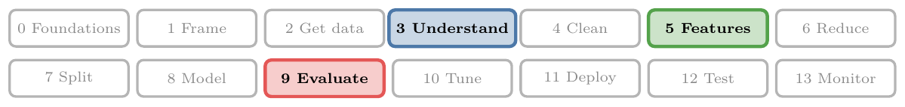
>
> - **Builds on:** [Skewness](../../../ML/02-getting-data/ML-019-univariate-analysis/ML-019-univariate-analysis.md#10-skewness); [Kurtosis and moments](../../../ML/02-getting-data/ML-021-pandas-profiling/ML-021-pandas-profiling.md#42-a-numerical-column-age); [Feature transformation](../../../ML/03-feature-engineering/ML-022-what-is-feature-engineering/ML-022-what-is-feature-engineering.md#6-feature-transformation); [Normal distribution](../../../MA/03-distributions/MA-020-random-variables-and-distributions/MA-020-random-variables-and-distributions.md#6-famous-distributions); [Log-normal distribution](../../../MA/03-distributions/MA-022-pdf-and-continuous-cdf/MA-022-pdf-and-continuous-cdf.md#6-famous-pdfs).
> - **Leads to:** [Power transformer](../../../ML/03-feature-engineering/ML-030-power-transformer/ML-030-power-transformer.md#2-power-transformer-in-scikit-learn); [Grid and random search](../../../ML/04-missing-data-and-outliers/ML-037-missing-indicator-random-sample/ML-037-missing-indicator-random-sample.md#7-choosing-the-imputer-automatically-with-grid-search); [Feature construction and splitting](../../../ML/05-dimensionality/ML-044-feature-construction-splitting/ML-044-feature-construction-splitting.md#2-feature-construction); [Assumptions of linear regression](../../../ML/06-regression/ML-055-linear-regression-assumptions/ML-055-linear-regression-assumptions.md#9-sources); [K-nearest neighbours](../../../ML/07-classification/ML-085-knn/ML-085-knn.md#1-overview); [Voting ensembles](../../../ML/08-trees-and-ensembles/ML-096-voting-ensemble/ML-096-voting-ensemble.md#1-overview).
> - **Compare with:** [Train-test split](../../../ML/01-foundations/ML-012-toy-project/ML-012-toy-project.md#6-training-and-test-sets); [Power transformer](../../../ML/03-feature-engineering/ML-030-power-transformer/ML-030-power-transformer.md#2-power-transformer-in-scikit-learn); [OOB score](../../../ML/08-trees-and-ensembles/ML-099-bagging-intuition/ML-099-bagging-intuition.md#1-overview).
<!-- /where-this-fits -->

## 1. Overview

> **Key point:** A mathematical transformation applies one formula to every value of a feature, usually to make a skewed feature closer to a normal distribution.

A **feature** (G-772) is an input variable (one column of the data table), the **target** (G-1949) is the output we predict, and an **observation** (G-1374) is one record (one row). So far, feature transformation has meant filling missing values, encoding categories and scaling numbers. This Note adds one more kind: **mathematical transformation** (G-1174), where we apply a mathematical formula, such as a logarithm or a square root, to every value of a feature.

Think of a map of India drawn to scale: Delhi, Mumbai and a small village are hard to show together. A log scale works like a map that shrinks the big distances more than the small ones, so everything fits on one page.

Figure 1 shows the whole topic. A skewed feature goes through scikit-learn's `FunctionTransformer`, which applies the formula we choose, and comes out closer to normal. We then check the result with the skewness and a Q-Q plot.

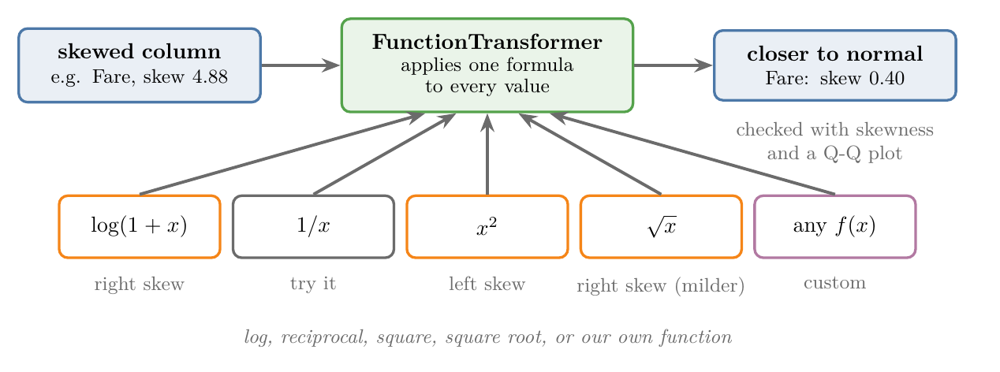

The formulas covered here are the log, reciprocal, square and square root transforms. Two more advanced ones, the Box-Cox and Yeo-Johnson transforms, belong to the [power transformer](../ML-030-power-transformer/ML-030-power-transformer.md#2-power-transformer-in-scikit-learn).

## 2. Why make data normal

> **Key point:** Some algorithms, such as linear and logistic regression, often score better when a skewed feature is brought close to a normal distribution (section 7 measures it); tree-based algorithms do not care.

The **normal distribution** (G-1343) is the symmetric, bell-shaped curve ([what the normal distribution is](../../../MA/03-distributions/MA-024-normal-distribution/MA-024-normal-distribution.md#2-what-the-normal-distribution-is)). **Skewness** (G-1817) is the number that says how lopsided a distribution is ([skewness](../../02-getting-data/ML-019-univariate-analysis/ML-019-univariate-analysis.md#10-skewness)).

Real data is rarely normal. Fares, salaries and house prices are usually right-skewed: most values are small and a few are huge. Figure 2 shows the Titanic fares against the normal curve with the same mean and standard deviation:

- half the passengers paid 14.45 or less, yet the largest fare is 512.33;
- the matching normal curve is far too low at the peak and too high from about 40 to 100, where few passengers paid;
- it even puts over 20 percent of its area below 0, where no fare can be.

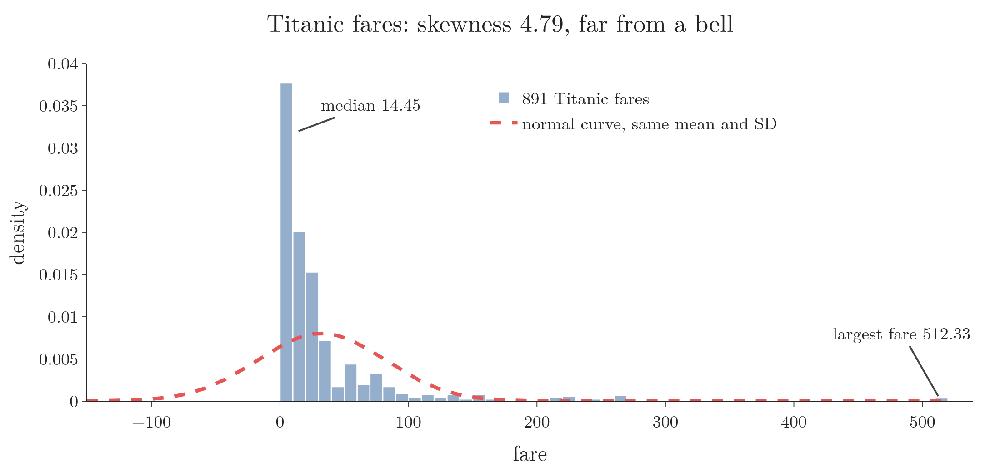

The normal distribution is the most important distribution in statistics. Many statistical methods are built around it, so once data is normal, many problems become easier to solve.

In ML, this matters for the statistical algorithms:

- **Care about the distribution:** **linear regression** (G-1094; a straight line fitted to the data) and **logistic regression** (G-1120; a model for yes-or-no targets, built in [exploring the data](../../01-foundations/ML-012-toy-project/ML-012-toy-project.md#4-exploring-the-data)). They tend to perform better when the features are close to normal.
- **Do not care:** **decision trees** (G-561; a chain of yes-or-no questions on the features, see [a decision tree is nested if-else](../../08-trees-and-ensembles/ML-091-decision-trees-intuition/ML-091-decision-trees-intuition.md#2-a-decision-tree-is-nested-if-else)) and **random forests** (G-1611; many decision trees voting together). Their results hardly change whatever the shape of the data.

So when we use an algorithm of the first kind on a skewed feature, we try to make that feature normal first. The mathematical transformations in this Note do exactly that.

There is no fixed list of transformations. Any formula can be one: $x^2 + 2x$ is a valid transformation too, and we can write our own custom function. The goal is always the same: get a distribution as close to normal as possible.

> **Extra:** Why a long tail hurts a linear model. Linear and logistic regression fit one straight-line formula through all the data. In a feature like fare, a handful of huge values (500 against a typical 15) pull that line towards themselves and squash all the ordinary values together. Pulling the tail in gives the ordinary values room to matter.
>
> Strictly speaking, linear regression's normality assumption is about its errors, not its features (Kutner et al. 2005, §1.8). The practical rule still holds: a feature without a long tail is easier for these models to use, as Section 7 measures.

## 3. Mathematical transformers in scikit-learn

> **Key point:** scikit-learn has three classes for mathematical transformations: the function transformer, the power transformer and the quantile transformer.

scikit-learn offers three classes for this job:

1. **`FunctionTransformer`** (G-819), the most widely used, and the subject of this Note. `FunctionTransformer` can apply the log, reciprocal, square and square root transforms, or any custom function we write.
2. **`PowerTransformer`** (G-1543), which applies the [Box-Cox and Yeo-Johnson transforms](../ML-030-power-transformer/ML-030-power-transformer.md#2-power-transformer-in-scikit-learn).
3. **`QuantileTransformer`** (G-1600), which is used much less and is only shown in Figure 3 below.

Figure 3 runs all three on the Titanic fares with their simplest settings (the quantile transformer set to give a normal-shaped output). Each pulls the long right tail in, from skewness 4.79 to 0.39, $-0.04$ and $-0.93$. In all three, the 15 passengers with a fare of 0 stay apart as a small group on the left; for the quantile transformer that group is what pulls its skewness below 0.

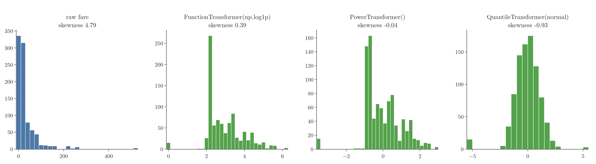

## 4. Checking whether a column is normal

> **Key point:** Three checks: look at the density plot, compute the skewness, and draw a Q-Q plot; the Q-Q plot is the most reliable.

Before transforming a feature, we need to know whether it is normal already. There are three common ways:

1. **Density plot:** draw the histogram with its KDE curve, as in [the density plot](../../02-getting-data/ML-019-univariate-analysis/ML-019-univariate-analysis.md#7-density-plot). The shape gives a first idea of how normal the feature is.
2. **Skewness:** pandas' `skew()`. A value near 0 means symmetric; positive means right-skewed, negative means left-skewed (see [skewness](../../02-getting-data/ML-019-univariate-analysis/ML-019-univariate-analysis.md#10-skewness)).
3. **Q-Q plot:** the most reliable of the three, and the most used. Skewness is one number that measures only lopsidedness, so a symmetric shape with fat tails (the last panel of Figure 5) has a skewness near 0 though it is not normal. The Q-Q plot compares every value with where a normal distribution would put it, so it shows that problem too. The rest of this section explains how it is built and how to read it.

### 4.1 How a Q-Q plot is built

> **Key point:** Sort the data, cut the normal curve into as many equal slices as there are values, and plot the $k$-th smallest value against the $k$-th slice; a straight line of dots means the data has the normal shape.

A **Q-Q plot** (G-1596) (quantile-quantile plot) compares our data with a perfect normal distribution (Wilk and Gnanadesikan 1968). **Quantiles** (G-1599) are the values that cut sorted data into equal-sized groups. The plot asks one question for every value: if the data were normal, where would the smallest value sit, where the second smallest, and so on?

We build one by hand for the five values 1, 2, 3, 4 and 10 from [the skewness example](../../02-getting-data/ML-019-univariate-analysis/ML-019-univariate-analysis.md#10-skewness). Figure 4 animates the steps:

1. **Sort the values:** 1, 2, 3, 4, 10.
2. **Cut the normal curve into five slices of equal probability** (the top panel). Each slice holds one fifth of the area. The edge slices are wide, because values out there are rare; the middle slices are narrow.
3. **Take the $z$-value at the middle of each slice** (the orange diamonds): $-1.28$, $-0.52$, 0, 0.52 and 1.28. These are the places where five values from a perfect normal distribution would sit.
4. **Pair them in order and plot.** The smallest value, 1, goes with the smallest $z$, $-1.28$: a vertical dotted line at $-1.28$ and a horizontal one at 1 meet at the first dot. Then 2 goes with $-0.52$, and so on.
5. **Draw the best straight line through the dots.** The first four dots lie on a straight line of their own; the value 10 jumps far above it and pulls the red best-fit line up towards itself. A dot far above the line at the right end is the mark of a long right tail.


**The formal version.** For the $i$-th of $n$ sorted values, the matching normal quantile is

$$z_i = \Phi^{-1}\left(\frac{i - 0.5}{n}\right),$$

where $\Phi^{-1}$ turns a probability into the $z$-value with that much of the normal curve to its left (the reverse of reading [the z-table](../../../MA/03-distributions/MA-025-standard-normal-and-z-table/MA-025-standard-normal-and-z-table.md#4-the-z-table)). For example, 10 percent of the curve lies to the left of $z = -1.28$, and half lies to the left of $z = 0$:

$$\Phi^{-1}(0.1) = -1.28$$

$$\Phi^{-1}(0.5) = 0$$

With $n = 5$, the formula gives one probability and one $z$ per value:

| $i$ | $(i - 0.5)/5$ | $z_i$ | Sorted value | Pair |
|---|---|---|---|---|
| 1 | 0.1 | $-1.28$ | 1 | $(-1.28, 1)$ |
| 2 | 0.3 | $-0.52$ | 2 | $(-0.52, 2)$ |
| 3 | 0.5 | 0 | 3 | $(0, 3)$ |
| 4 | 0.7 | 0.52 | 4 | $(0.52, 4)$ |
| 5 | 0.9 | 1.28 | 10 | $(1.28, 10)$ |

The same construction works against any distribution: cut that distribution's curve into slices instead. In this Note the comparison is always with the normal.

### 4.2 Reading a Q-Q plot

> **Key point:** The closer the points lie to the straight red line, the closer the data is to a normal distribution.

With hundreds of values the dots merge into a curve, and we read its shape. Each point stands for one value of the feature:

- **horizontal axis (theoretical quantiles, G-1968):** where that value would sit if the data were perfectly normal;
- **vertical axis (sample quantiles):** where the value actually sits in our data.

The red line is the best straight line through the points. If the data is normal, its values sit exactly where a normal distribution predicts, and every point lands on that line.

Figure 5 shows four made-up features, with the histogram on top and the Q-Q plot below.

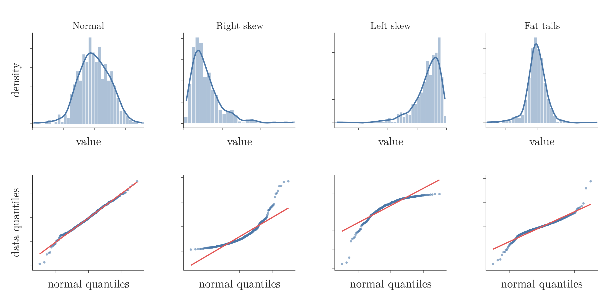{width=100%}

- **Normal:** almost every point lies on the line.
- **Right skew:** the points curve away from the line and leave it upwards at the right end. The long right tail holds values far bigger than a normal distribution would have.
- **Left skew:** the points leave the line downwards at the left end, where the long left tail is.
- **Fat tails:** the data has more extreme values than a normal distribution on both sides, so the points leave the line at both ends.

The further the points stray from the line, the further the data is from normal.

> **Python:** A Q-Q plot with scipy and Plotly.
>
> ```python
> from scipy import stats
> import plotly.graph_objects as go
>
> # osm: normal quantiles, osr: sorted data
> (osm, osr), (slope, intercept, r) = \
>     stats.probplot(x, dist="norm")
> fig = go.Figure()
> fig.add_scatter(x=osm, y=osr, mode="markers")
> fig.add_scatter(x=osm, y=slope * osm + intercept,
>                 mode="lines")   # the red line
> ```
>
> Older code passes `plot=plt` to `probplot` to draw with matplotlib. Without it, `probplot` just returns the numbers, and we can draw them with any library.

## 5. Log transform

> **Key point:** The log transform replaces every value with its logarithm; it pulls a long right tail in, so it is the transform for right-skewed data.

The **log transform** (G-1112) is simple: take the log of every value of the feature. The base can be 10 or $e$; both give the same shape.

The log transform, step by step:

1. **In words:** replace each value with its logarithm. Big values shrink a lot; small values shrink a little.
2. **Formula:**
   $$x' = \log(x)$$
3. **Example:** with base 10, the values 1, 10, 100 and 1000 become
   $$\log_{10} 1 = 0$$
   $$\log_{10} 10 = 1$$
   $$\log_{10} 100 = 2$$
   $$\log_{10} 1000 = 3$$

Figure 6 shows why this helps. On the ordinary scale, 1, 10 and 100 are squeezed together and 1000 lies far away. After the log, the four values sit at equal steps: every multiplication by 10 becomes the same step of $+1$.


**What the log keeps.** A logarithm answers the question "which power of the base gives this number?". With base 2:

$$8 = 2^3 \quad\Rightarrow\quad \log_2 8 = 3$$

$$\frac{1}{8} = 2^{-3} \quad\Rightarrow\quad \log_2 \frac{1}{8} = -3$$

The log keeps only the exponent. Base 10 gives a second example:

$$1000 = 10^3 \quad\Rightarrow\quad \log_{10} 1000 = 3$$

And 1,000,000 gives just 6. The logs used later in this Note are natural logs, whose base is $e \approx 2.718$; they shrink big numbers in the same way.

Figure 7 shows what that does to a number line. On the ordinary line, 8 is far from 1, while 1/8 is squeezed against 0, although both are "8 times" away from 1. On the log axis every doubling is one step to the right and every halving one step to the left, so 8 times up and 8 times down are the same distance from 1: three steps.

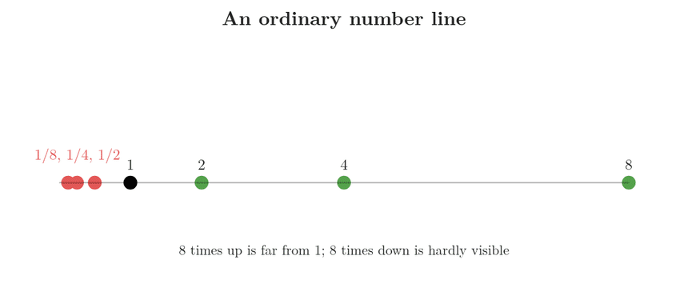

A value much bigger than all the others is therefore brought back near them. The average shows it. The plain mean of 1, 2 and 8 is pulled up by the 8:

$$(1 + 2 + 8)/3 = 3.7$$

Their logs with base 2 are 0, 1 and 3. The mean of the logs, turned back into a number:

$$(0 + 1 + 3)/3 = 1.3$$

$$2^{1.3} = 2.5$$

On the log scale the big value sways the average far less. This log-scale average is the **geometric mean** (G-844).

A long right tail is therefore pulled in, and the distribution starts to look more normal. The result rarely becomes perfectly normal, but it gets much closer than before.

Two rules for using it:

- **Use it on right-skewed data.** It squashes the long right tail and brings the data towards the centre. Asked "which data needs a log transform?", the answer is right-skewed data.
- **Never on negative values.** The log of a negative number does not exist, and the log of 0 is minus infinity.

### 5.1 log(1 + x) for columns with zeros

> **Key point:** `np.log1p` computes $\log(1 + x)$, which works for a value of 0; it is the usual choice in practice.

NumPy has two log functions:

- **`np.log(x)`:** the plain natural log (base $e$). A 0 in the feature breaks it.
- **`np.log1p(x)`** (G-1117)**:** first adds 1, then takes the log. For $x \ge 0$ the number inside the log, $1 + x$, is at least 1, so zeros are safe: a fare of 0 becomes $\ln 1 = 0$.

The $\log(1 + x)$ transform, step by step:

1. **In words:** add 1 to each value, then take the natural log.
2. **Formula:**
   $$x' = \ln(1 + x)$$
3. **Example:** three real Titanic fares, 7.25, 71.28 and 512.33, become
   $$\ln 8.25 = 2.11$$
   $$\ln 72.28 = 4.28$$
   $$\ln 513.33 = 6.24$$
   The ratio of the biggest to the smallest, before and after:
   $$512.33 / 7.25 = 70.7$$
   $$6.24 / 2.11 = 2.96$$

People usually use `np.log1p`. If a feature has no zeros, `np.log` works too. Figure 8 compares the two curves: near 0 the plain log plunges towards minus infinity, while $\log(1 + x)$ starts at 0; above about 10 the two curves almost coincide.

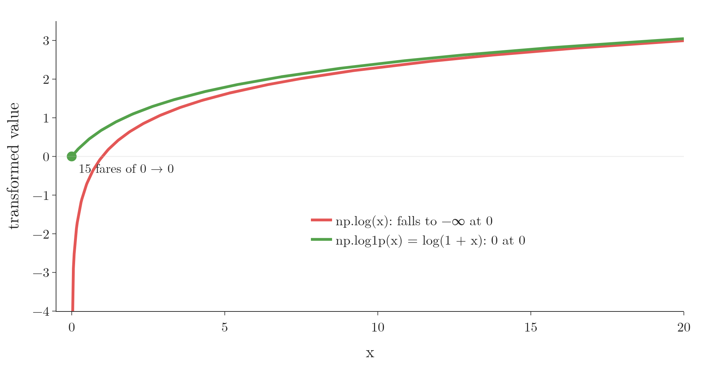{height=34%}

## 6. Reciprocal, square and square root transforms

> **Key point:** Reciprocal turns big values into small ones, square is used for left-skewed data, and square root is a milder version of the log; which one works is found by trying.

### 6.1 Reciprocal transform

> **Key point:** $1/x$ makes big values small and small values big, reversing the order of the data.

The **reciprocal transform** (G-1643), step by step:

1. **In words:** replace each value with 1 divided by it.
2. **Formula:**
   $$x' = \frac{1}{x}$$
3. **Example:** the values 2, 4, 10 and 100 become
   $$\frac{1}{2} = 0.5$$
   $$\frac{1}{4} = 0.25$$
   $$\frac{1}{10} = 0.1$$
   $$\frac{1}{100} = 0.01$$
   The biggest value became the smallest.

The reciprocal is a very different kind of transform from the others, since it flips the order. On some data it gives a close-to-normal result. A 0 in the feature breaks it, because $1/0$ is infinite.

> **Extra:** The reciprocal pulls a right tail in even harder than the log, so it is mainly tried on strongly right-skewed data. Because the reciprocal reverses the order, a model's coefficient for that feature also changes sign: a larger original value now means a smaller transformed one.

### 6.2 Square transform

> **Key point:** $x^2$ stretches big values apart; it is used for left-skewed data.

The **square transform** (G-1861), step by step:

1. **In words:** multiply each value by itself.
2. **Formula:**
   $$x' = x^2$$
3. **Example:** take marks in an easy test, a left-skewed feature: 30, 80 and 90. They become
   $$30^2 = 900$$
   $$80^2 = 6400$$
   $$90^2 = 8100$$
   Compare the gap from 30 to 80 with the gap from 80 to 90, before and after:
   $$\text{before: } 50 / 10 = 5$$
   $$\text{after: } 5500 / 1700 = 3.2$$
   The low marks of the long left tail moved closer to the rest: the tail is pulled in.

So the square is the transform for left-skewed data. On right-skewed data it does the opposite and makes the tail even longer.

### 6.3 Square root transform

> **Key point:** $\sqrt{x}$ pulls a right tail in, but more gently than the log.

The **square root transform** (G-1860), step by step:

1. **In words:** replace each value with its square root.
2. **Formula:**
   $$x' = \sqrt{x}$$
3. **Example:** the same three fares, 7.25, 71.28 and 512.33, become
   $$\sqrt{7.25} = 2.69$$
   $$\sqrt{71.28} = 8.44$$
   $$\sqrt{512.33} = 22.63$$
   The ratio of the biggest to the smallest:
   $$22.63 / 2.69 = 8.4$$
   It was 70.7 before; the log brought it to 2.96 and the square root only to 8.4, so the square root is the milder of the two.

The square root is used less often, but it is worth trying. Like the log, it does not work on negative values.

### 6.4 Choosing a transform

> **Key point:** Right skew: try the log; left skew: try the square; then try them all and keep whichever gives the best result.

We usually cannot tell in advance which transform will work best. What we do know:

- **right-skewed data:** start with the log transform;
- **left-skewed data:** start with the square transform.

Beyond that, each transform is one line of code, so we try them all and keep the one that gives the best result.

Figure 9 puts the four transforms side by side, with the example values of this section on each curve. Read the slope of each curve: where it flattens, big values are squashed together (log, square root); where it steepens, they are pulled apart (square); the reciprocal falls, so it reverses the order.

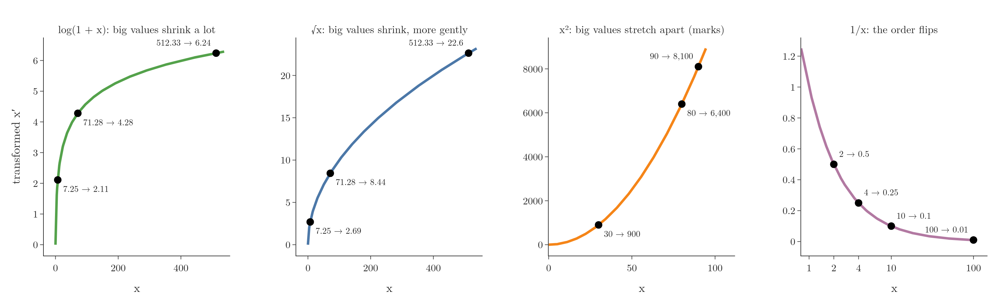

## 7. Function transformer on the Titanic data

> **Key point:** On the Titanic data, a log transform raised logistic regression's accuracy from 65.9% to 67.8% (cross-validated), while the decision tree stayed at about 66%.

### 7.1 The data

> **Key point:** Two numerical features, `Age` and `Fare`, and the target `Survived`.

We use the Titanic training file (891 passengers, one observation each) and keep three columns:

| Survived | Age | Fare |
|---|---|---|
| 0 | 22.0 | 7.2500 |
| 1 | 38.0 | 71.2833 |
| 1 | 26.0 | 7.9250 |

`Survived` is the target: 1 if the passenger survived, 0 if not. `Age` and `Fare` are the features.

`Age` has 177 missing values, and transforms and models need none. We fill each one with the mean age, 29.7.

> **Python:** Loading three columns and filling the missing ages.
>
> ```python
> import pandas as pd
>
> df = pd.read_csv("data/titanic_train.csv",
>                  usecols=["Age", "Fare", "Survived"])
> df.isnull().sum()    # Age: 177
> df["Age"] = df["Age"].fillna(df["Age"].mean())
> ```
>
> Older code writes `df["Age"].fillna(..., inplace=True)`. In pandas 3 that no longer changes `df`, so we assign the result back instead.

As always, we split before anything else (see [training and test sets](../../01-foundations/ML-012-toy-project/ML-012-toy-project.md#6-training-and-test-sets)): 80% for training (712 rows) and 20% for testing (179 rows).

> **Python:** Splitting the data.
>
> ```python
> from sklearn.model_selection import train_test_split
>
> X = df[["Age", "Fare"]]   # inputs
> y = df["Survived"]         # target
> X_train, X_test, y_train, y_test = train_test_split(
>     X, y, test_size=0.2, random_state=42)
> ```

### 7.2 Is each column normal?

> **Key point:** `Age` is close to normal (skewness 0.36); `Fare` is strongly right-skewed (skewness 4.88).

We check both training features with a density plot and a Q-Q plot, as in Section 4. The left halves of Figures 10 and 12 show them.

- **Age:** the density plot looks roughly normal, though not perfectly. In the Q-Q plot, most points lie near the line and stray only in a few places. Skewness: 0.36.
- **Fare:** not normal at all. The density plot has a long right tail: a few passengers paid huge fares, and most paid very little. In the Q-Q plot, the points curve far above the line on the right. Skewness: 4.88.

`Fare` is right-skewed, so the transform to try is the log.

> **Python:** The old `sns.distplot` was removed from seaborn; [the density plot](../../02-getting-data/ML-019-univariate-analysis/ML-019-univariate-analysis.md#7-density-plot) shows the replacements. The Notebook draws every density plot and Q-Q plot with Plotly.

### 7.3 Baseline: no transform

> **Key point:** Without any transform, logistic regression scores 64.8% on the test set and a decision tree 67.0%.

First we train two models on the raw features, to have something to compare with: logistic regression and a decision tree.

| Model | Test accuracy, no transform |
|---|---|
| Logistic regression | 64.8% |
| Decision tree | 67.0% |

> **Python:** Training the two baseline models.
>
> ```python
> from sklearn.linear_model import LogisticRegression
> from sklearn.tree import DecisionTreeClassifier
> from sklearn.metrics import accuracy_score
>
> lr = LogisticRegression()
> dt = DecisionTreeClassifier(random_state=0)
> lr.fit(X_train, y_train)
> dt.fit(X_train, y_train)
> accuracy_score(y_test, lr.predict(X_test))  # 0.648
> accuracy_score(y_test, dt.predict(X_test))  # 0.670
> ```
>
> `random_state=0` fixes how the tree breaks ties, so the numbers repeat on every run. Without it, the tree's accuracy changes a little each time.

### 7.4 Applying the log with FunctionTransformer

> **Key point:** `FunctionTransformer(func=np.log1p)` applies $\log(1 + x)$ to every feature it receives.

**`FunctionTransformer`** (in `sklearn.preprocessing`) applies a function we give it to the data. Its first parameter, **`func`** (G-814), is that function: a built-in one such as `np.log1p`, or our own.

Here we pass `np.log1p` rather than `np.log`, because 15 passengers have a fare of 0. Like every transformer, `FunctionTransformer` is fitted on the training set and then used to transform both sets.

> **Python:** The log transform with `FunctionTransformer`.
>
> ```python
> import numpy as np
> from sklearn.preprocessing import FunctionTransformer
>
> trf = FunctionTransformer(func=np.log1p)
> X_train_transformed = trf.fit_transform(X_train)
> X_test_transformed = trf.transform(X_test)
> ```
>
> The code above transforms both features, Age and Fare.

Training the same two models on the transformed features gives:

| Model | No transform | Log on both columns |
|---|---|---|
| Logistic regression | 64.8% | 68.2% |
| Decision tree | 67.0% | 68.2% |

Logistic regression improved by more than 3 points because the data was transformed. The decision tree barely moved: a tree does not care about the distribution of the data.

> **Extra:** The tree's one-point change is within its run-to-run noise: with 20 different `random_state` values, the untransformed tree alone ranges from 64.8% to 68.7% on this split.

> **Extra:** Why a tree barely notices. The log keeps the order of the values: if one fare is bigger than another, its log is bigger too. A tree only asks questions like "is fare above 50?", and "is log fare above 3.93?" splits the passengers in exactly the same way. The small changes come from where the tree places each split between two training values, which can send a few test passengers the other way.

> **Extra:** `FunctionTransformer` learns nothing in `fit`: the formula has no numbers to learn from the data. So fitting on the training set and transforming the test set gives exactly the same result as transforming each set separately. The habit of fitting on the training set still matters for every other transformer.

### 7.5 Checking with cross-validation

> **Key point:** Cross-validating the log and the model together confirms the gain: logistic regression goes from 65.9% to 67.8%.

One train-test split gives one number, which depends on which passengers landed in the test set, so we check the improvement with 10-fold cross-validation (**cross-validation**, G-510: split the data into 10 parts and test on each part in turn; see [cross-validation with a pipeline](../ML-028-pipelines/ML-028-pipelines.md#8-cross-validation-with-a-pipeline)). As there, the transformer goes inside a pipeline, so it is refitted on the training folds each time.

| Model | No transform | Log on both columns |
|---|---|---|
| Logistic regression | 65.9% | 67.8% |
| Decision tree | 66.0% | 66.1% |

The improvement for logistic regression holds up: about 2 points. The decision tree stays where it was.

> **Python:** 10-fold cross-validation of the log and the model together.
>
> ```python
> from sklearn.model_selection import cross_val_score
> from sklearn.pipeline import make_pipeline
>
> pipe = make_pipeline(FunctionTransformer(np.log1p),
>                      LogisticRegression())
> scores = cross_val_score(pipe, X, y,
>                          scoring="accuracy", cv=10)
> scores.mean()   # 0.678
> ```
>
> `cv=10` makes 10 splits; `scores` holds the 10 accuracies.

> **Extra:** Transforming all of `X` first and cross-validating only the model would let each test fold shape the transform, a form of data leakage. Here it changes nothing, because `FunctionTransformer` learns nothing in `fit`, but the pipeline habit protects every transformer that does learn. The mean age used in section 7.1 was computed from all 891 rows, a small leak of the same kind; putting the imputer inside the pipeline removes it.

### 7.6 Before and after the log

> **Key point:** The log brought `Fare` from skewness 4.88 to 0.40, but pushed `Age` from 0.36 to -2.24.

Figure 10 shows `Fare` before and after the transform. Before, `Fare` was very far from normal; after, the skewness is 0.40 and the points lie much closer to the line. The change in `Fare` is what improved logistic regression, as Section 7.7 confirms.

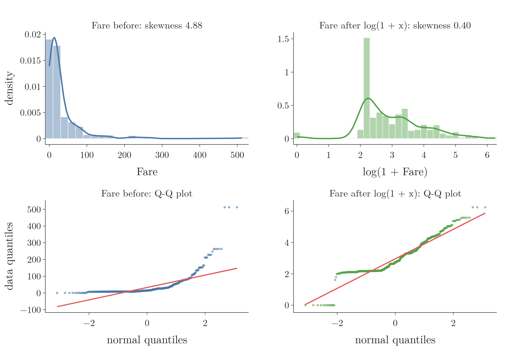{width=100%}

Figure 11 shows the same change as a process: every fare slides from its raw value to its log. Watch the tall bar at the left spread out while the long right tail is pulled in, and the Q-Q curve on the right straighten towards the red line; the skewness in the title falls from 4.88 to 0.40. The small group left behind at 0 is the passengers with a fare of 0.

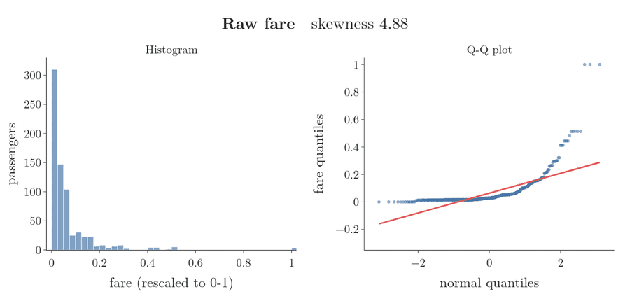

Figure 12 does the same for `Age`. Here the transform made things worse: `Age` was close to normal before, and after the log it has a long left tail, with skewness -2.24.

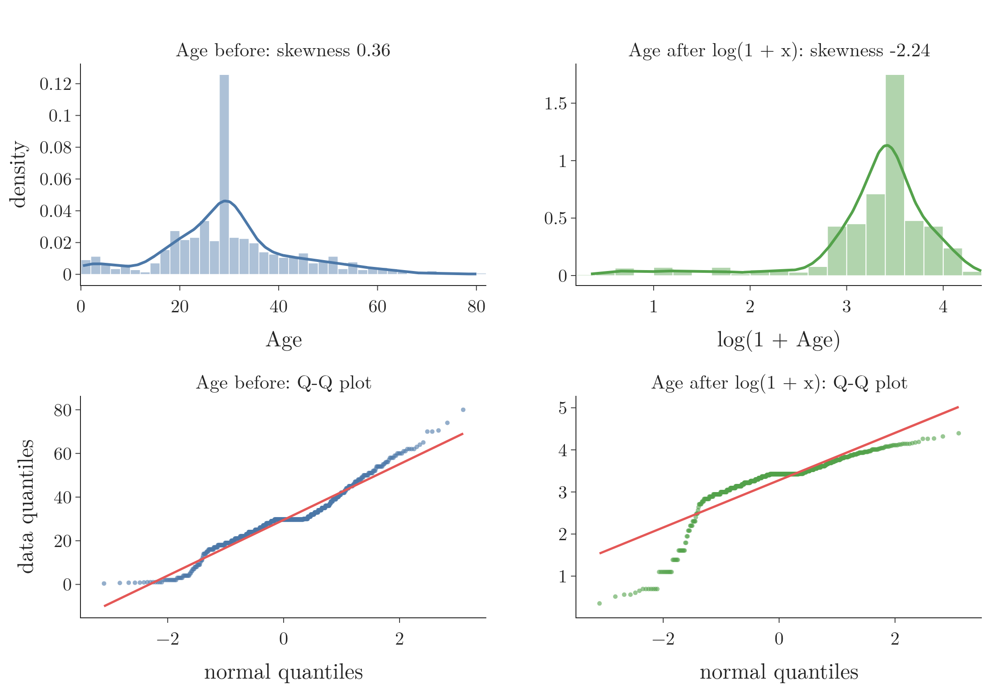{width=100%}

Such damage happens when we force a log onto a feature that is not right-skewed. The log squashes the big ages and stretches the small ones, so the few children become a new left tail.

The tall bar near age 30 in Figure 12 is the 177 passengers whose missing age was filled with the mean. After the log it stays one tall bar, near 3.4.

### 7.7 Log on Fare only, with ColumnTransformer

> **Key point:** `ColumnTransformer` lets us log only `Fare` and pass `Age` through unchanged.

`Age` did not need the log, so the next step is to transform only `Fare` and leave `Age` as it is. A `ColumnTransformer` (see [the transformers list](../ML-027-column-transformer/ML-027-column-transformer.md#51-the-transformers-list)) does exactly this, with `FunctionTransformer` as the transformer and `remainder="passthrough"` for `Age`.

> **Python:** Log on Fare only.
>
> ```python
> from sklearn.compose import ColumnTransformer
>
> trf2 = ColumnTransformer(
>     [("log", FunctionTransformer(np.log1p), ["Fare"])],
>     remainder="passthrough")
> X_train_transformed2 = trf2.fit_transform(X_train)
> X_test_transformed2 = trf2.transform(X_test)
> ```

| Model | No transform | Log on both | Log on Fare only |
|---|---|---|---|
| Logistic regression, test set | 64.8% | 68.2% | 67.0% |
| Logistic regression, cross-validated | 65.9% | 67.8% | 67.1% |
| Decision tree, cross-validated | 66.0% | 66.1% | 65.8% |

Logging only `Fare` keeps most of the gain: 67.1% against 65.9% with no transform. Logging both columns scores slightly higher still, 67.8%, even though `Age` itself got less normal; the difference is about 6 passengers out of 891.

So the improvement comes from `Fare`. Transforming `Age` as well brings no clear benefit and costs extra computation, so transforming only the skewed column is the cleaner choice. The decision tree, once again, does not change.

The overall lesson:

- `Age` was already close to normal; `Fare` was right-skewed.
- A log on `Fare` improved logistic regression.
- The decision tree's results did not change: it does not depend on the distribution of the data. Linear and logistic regression do.

## 8. Trying the other transforms

> **Key point:** On the right-skewed `Fare`, the log gave the best result; square, reciprocal and sine made it worse.

To compare all the transforms quickly, we wrap the steps in one function. The function takes a formula, applies it to `Fare` only, reports the cross-validated accuracy of logistic regression, and draws the Q-Q plot.

> **Python:** One function to try any transform.
>
> ```python
> def apply_transform(transform):
>     trf = ColumnTransformer(
>         [("t", FunctionTransformer(transform), ["Fare"])],
>         remainder="passthrough")
>     pipe = make_pipeline(trf,
>                          LogisticRegression(max_iter=1000))
>     acc = cross_val_score(pipe, X, y,
>         scoring="accuracy", cv=10).mean()
>     print("Accuracy", acc)
>
> apply_transform(np.sqrt)
> apply_transform(lambda x: 1 / (x + 0.1))
> ```
>
> A **lambda** is a one-line function without a name: `lambda x: x**2` means "take x, return x squared". `max_iter=1000` lets logistic regression take more steps, which the square transform's huge numbers need.

Figure 13 shows the Q-Q plot of `Fare` after each transform, with its skewness and accuracy.

{width=100%}

| Transform on Fare | Skewness of Fare | Accuracy (logistic regression, cross-validated) |
|---|---|---|
| none | 4.79 | 65.9% |
| log, $\log(1 + x)$ | 0.39 | 67.1% |
| reciprocal, $1/(x + 0.1)$ | 7.51 | 61.7% |
| square, $x^2$ | 11.93 | 64.3% |
| square root, $\sqrt{x}$ | 2.09 | 66.1% |
| sine, $\sin(x)$ | -0.87 | 62.0% |

The skewness values here are for all 891 fares, so they differ a little from the training-set numbers in Section 7.

What each one did:

- **Log:** the best by far. The skewness dropped to 0.39 and the points follow the line.
- **Square:** worse than nothing. The square is meant for left-skewed data; on right-skewed `Fare` it stretches the tail even further (skewness 11.93).
- **Square root:** a small gain at best. The square root pulls the tail in, but not enough (skewness 2.09).
- **Reciprocal:** the plain $1/x$ fails, because 15 fares are 0 and $1/0$ is infinite. Adding a small 0.1 avoids that, but the result is worse: the zero fares all jump to 10 and form a new tail.
- **Sine:** any function can be passed in, even one with no sense behind it. $\sin(x)$ squeezes every fare into the range -1 to 1, which wipes out the information and drops the accuracy.

So on this data the log transform wins, as expected for a right-skewed column. On other data another transform may win: the only way to know is to try them, and each one takes one line of code.

## 9. Summary

| Transform | Formula | Effect on big values | Use on | Cannot handle |
|---|---|---|---|---|
| Log | $\log(x)$, or $\log(1 + x)$ | squashes them strongly | right-skewed data | negatives (and 0 for $\log x$) |
| Reciprocal | $1/x$ | makes them the smallest; reverses order | strongly right-skewed data (try it) | 0 |
| Square | $x^2$ | stretches them apart | left-skewed data | (works on any number) |
| Square root | $\sqrt{x}$ | squashes them gently | right-skewed data (milder) | negatives |
| Custom | any $f(x)$ | depends on $f$ | try anything | depends on $f$ |

- A mathematical transformation applies one formula to every value of a feature, usually to bring the feature closer to a normal distribution.
- Linear and logistic regression benefit from close-to-normal features, because a few huge values pull their one straight-line formula towards themselves; decision trees and random forests do not care, because the log keeps the order of the values and a tree's questions split the rows the same way.
- Check normality with a density plot, the skewness, and a Q-Q plot: points on the line mean normal. Checking first matters, because forcing a log onto a feature that is not right-skewed (`Age`, 0.36 to -2.24) makes it less normal.
- `FunctionTransformer(func=...)` applies any function; `np.log1p` is safe when a feature has zeros, because it adds 1 before the log, so a fare of 0 becomes 0 instead of minus infinity.
- Combine `FunctionTransformer` with `ColumnTransformer` to transform only the features that need it, so a column that is already close to normal is left alone.
- On the Titanic data, logging `Fare` (skewness 4.88 to 0.40) raised logistic regression from 65.9% to 67.1%; logging `Age` too gave 67.8%, though `Age` itself became skewed. The decision tree stayed at about 66%.
- Which transform is best is found by trying them all, because we usually cannot tell in advance and each one is one line of code.
- So a mathematical transformation is one formula applied to every value of a skewed feature, chosen and checked so that the feature ends up closer to normal for the models that care.

## 10. Sources

**Built from**

- CampusX, "Function Transformer | Log Transform | Reciprocal Transform | Square Root Transform", YouTube, https://www.youtube.com/watch?v=cTjj3LE8E90
- StatQuest with Josh Starmer, "Quantile-Quantile Plots (QQ plots), Clearly Explained!!!", YouTube, https://www.youtube.com/watch?v=okjYjClSjOg (the step-by-step construction of section 4.1)
- StatQuest with Josh Starmer, "Logs (logarithms), Clearly Explained!!!", YouTube, https://www.youtube.com/watch?v=VSi0Z04fWj0 (the exponent view, the log axis and the mean of logs in section 5)

**Other references**

- Kutner, M. H., Nachtsheim, C. J., Neter, J. and Li, W. (2005). *Applied Linear Statistical Models*, 5th ed. McGraw-Hill. Section 1.8, Normal error regression model.
- Wilk, M. B. and Gnanadesikan, R. (1968). Probability Plotting Methods for the Analysis of Data. *Biometrika* 55(1), 1-17.

## 11. Key terms

| Term | Meaning |
|---|---|
| Feature | An input variable, one column of the data table |
| Target | The output we predict |
| Observation | One record, one row of the data table |
| Mathematical transformation | Applying one mathematical formula to every value of a feature |
| Normal distribution | A symmetric, bell-shaped distribution; the target shape of these transformations |
| Q-Q plot | A plot of a feature's sorted values against the values a normal distribution would have; points on the line mean normal |
| Quantiles | Values that cut sorted data into equal-sized groups |
| Theoretical quantile | Where a value would sit if the data were perfectly normal (the horizontal axis of a Q-Q plot) |
| Log transform | Replacing each value with its logarithm; pulls in a long right tail |
| Geometric mean | The average taken on the log scale; less swayed by one big value than the plain mean |
| log1p | NumPy's $\log(1 + x)$, a log transform that also works when a value is 0 |
| Reciprocal transform | Replacing each value with $1/x$; reverses the order of the values |
| Square transform | Replacing each value with $x^2$; used for left-skewed data |
| Square root transform | Replacing each value with $\sqrt{x}$; it pulls a right tail in, more gently than the log. |
| FunctionTransformer | scikit-learn's class that applies any function we give it to the data |
| func | The `FunctionTransformer` parameter that holds the function to apply |
| PowerTransformer | scikit-learn's class for the Box-Cox and Yeo-Johnson transforms |
| QuantileTransformer | scikit-learn's third mathematical transformer, used much less |
| Lambda (G-1040) | A one-line Python function without a name, such as `lambda x: x**2` |
