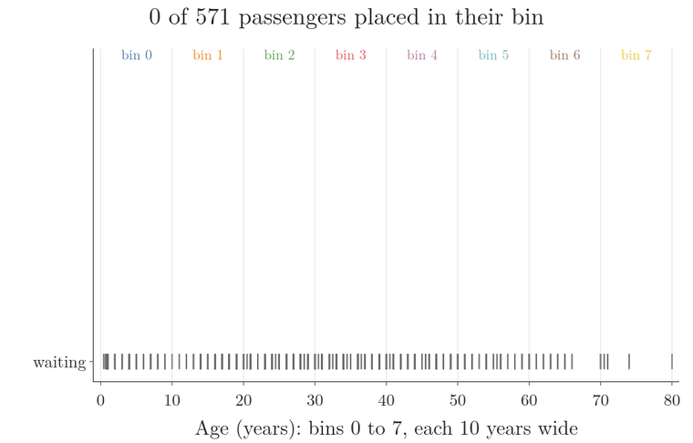
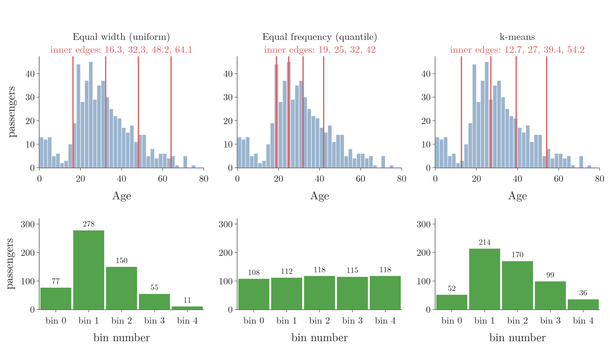
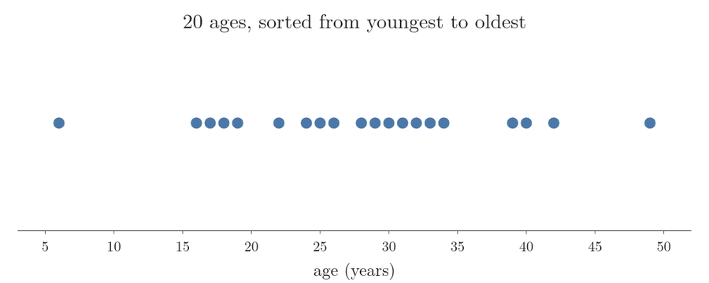
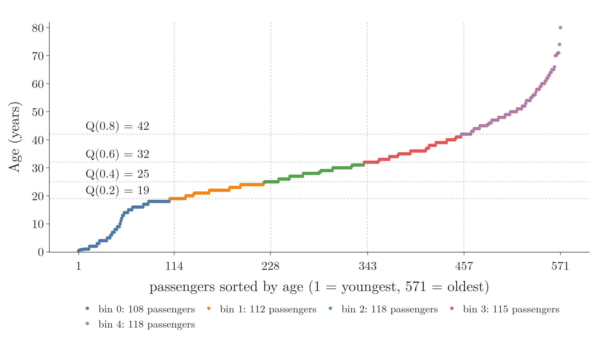
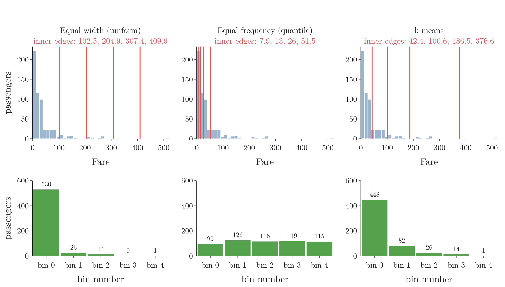
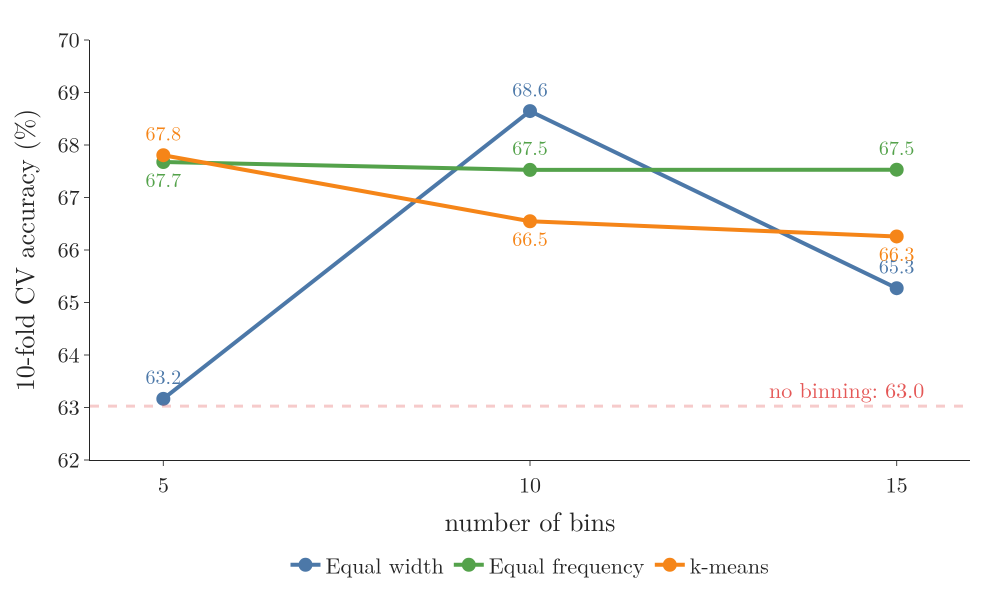
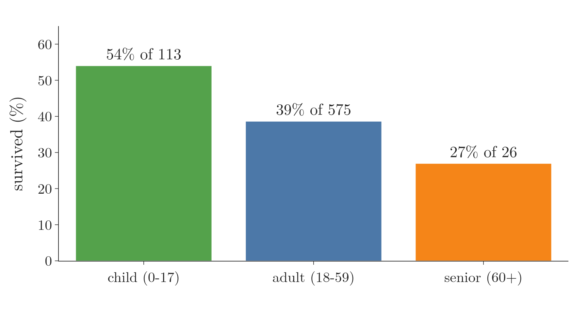
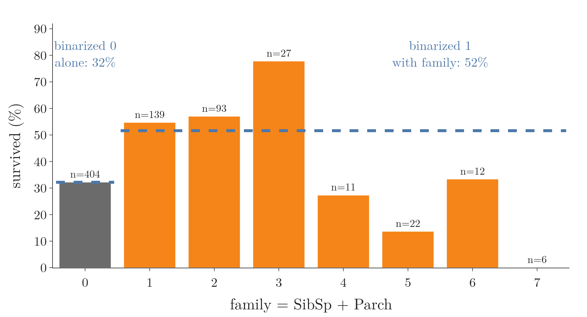

<!-- where-this-fits: generated by course_map/build_map.py; edit concepts.yaml, not this block -->
> **Where this fits:** Pipeline map steps 5 (Engineer features), 8 (Model). See the [Course map](../../../00-course-map/00-course-map.md).
>
> 
>
> - **Builds on:** [Clustering](../../../ML/01-foundations/ML-003-types-of-ml/ML-003-types-of-ml.md#32-clustering); [Feature scaling](../../../ML/01-foundations/ML-006-instance-vs-model-based/ML-006-instance-vs-model-based.md#31-how-it-works); [Outliers](../../../ML/01-foundations/ML-007-challenges-in-ml/ML-007-challenges-in-ml.md#5-poor-quality-data); [Feature engineering](../../../ML/01-foundations/ML-007-challenges-in-ml/ML-007-challenges-in-ml.md#6-irrelevant-features); [Feature transformation](../../../ML/03-feature-engineering/ML-022-what-is-feature-engineering/ML-022-what-is-feature-engineering.md#6-feature-transformation); [Elbow method and WCSS](../../../ML/09-clustering-and-more/ML-122-kmeans-intuition/ML-122-kmeans-intuition.md#5-choosing-k-the-elbow-method).
> - **Leads to:** [Feature construction and splitting](../../../ML/05-dimensionality/ML-044-feature-construction-splitting/ML-044-feature-construction-splitting.md#2-feature-construction); [XGBoost](../../../ML/08-trees-and-ensembles/ML-117-xgboost-intro/ML-117-xgboost-intro.md#3-what-xgboost-is).
> - **Compare with:** [Encoding categorical data](../../../ML/03-feature-engineering/ML-025-ordinal-label-encoding/ML-025-ordinal-label-encoding.md#1-overview); [Hierarchical clustering](../../../ML/09-clustering-and-more/ML-125-hierarchical-clustering/ML-125-hierarchical-clustering.md#4-two-kinds-of-hierarchical-clustering); [DBSCAN](../../../ML/09-clustering-and-more/ML-126-dbscan/ML-126-dbscan.md#8-the-dbscan-algorithm-step-by-step); [Gaussian mixture model (GMM)](../../../MA/08-likelihood/MA-073-gaussian-mixture-models/MA-073-gaussian-mixture-models.md#32-the-standard-terms).
<!-- /where-this-fits -->

## 1. Overview

> **Key point:** Discretization (binning) turns a numerical feature into a few ranges; binarization turns it into just 0 or 1.

A **feature** (G-772) is an input variable (one column of the data table), the **target** (G-1949) is the output we predict, and an **observation** (G-1374) is one record (one row). Earlier Notes encoded categories as numbers. This Note goes the other way: it turns numerical features into categories. The [overview of feature engineering](../ML-022-what-is-feature-engineering/ML-022-what-is-feature-engineering.md#63-binning-numbers-into-categories) introduced the idea briefly as binning; here we cover the techniques in full.

Figure 1 shows the whole topic: one column of numbers, cut either into several bins or into just two values. There are two techniques:

- **Discretization** (G-619), also called **binning** (G-307): cut the range of a feature into several intervals and replace each value with the interval it falls in.
- **Binarization** (G-300): compare each value with one threshold and replace it with 0 or 1.


Discretization has several kinds (Section 4). This Note covers:

- the three unsupervised kinds: equal width (Section 5), equal frequency (Section 6) and k-means (Section 7), all provided by scikit-learn's `KBinsDiscretizer` (Section 9);
- custom binning (Section 11);
- binarization, with scikit-learn's `Binarizer` (Sections 12 and 13).

## 2. Why turn numbers into categories

> **Key point:** Sometimes a feature is easier to use as a few groups than as exact numbers; the benefit depends on the problem.

A numerical feature is usually useful as it is. Sometimes, though, the same information is better represented as categories.

Take the Google Play Store data, with a feature for each app's number of downloads. A few very famous apps have billions of downloads, while most apps have very few. The exact numbers spread over a huge range and are hard for a model to use.

Grouping the feature into categories such as "1,000+ downloads", "10,000+ downloads" and "1 million+ downloads" simplifies the problem. Download ranges are exactly how the Play Store itself shows download counts.

Whether grouping helps is problem-specific. Binning is one more tool to try, not a step every project needs.

## 3. Discretization

> **Key point:** Discretization cuts a feature's range into intervals and replaces each value with the interval it belongs to, just like building a histogram.

**Discretization** is the process of transforming a continuous variable into a discrete one by creating a set of contiguous intervals that span the range of the variable's values. The intervals are called **bins**, so discretization is also called **binning**.

Discretization works like a histogram. Take ages from 0 to 80:

1. Choose the intervals: 0 to 10, 10 to 20, 20 to 30, and so on.
2. Put each person into the interval their age falls in.
3. Each age is now replaced by its interval, or by the interval's number: 0 for "0 to 10", 1 for "10 to 20", and so on.

Counting the people in each interval gives the histogram of the feature. Discretization keeps the interval number for every observation instead of only the counts.

Figure 2 runs these steps on the 571 Titanic training ages with 10-year bins. Watch each passenger leave the waiting line and become a square in its bin's column: the stacks grow into the histogram, and every square keeps its bin number, such as age 33 in bin 3.



### 3.1 What binning is good for

> **Key point:** Binning handles outliers and can make the values spread evenly.

Binning has two benefits:

- **Handles outliers** (G-1420). A very large value lands in the last bin, together with the other large values. The large value is then treated exactly like them, so its extreme size no longer matters.
- **Improves the value spread.** Some kinds of binning put about the same number of observations in every bin. A feature whose values are bunched in one place then becomes spread evenly over its range. This helps because a model can only tell observations apart if they land in different bins: when most observations share one bin, their differences are lost (Galli 2023). [Section 8](#8-the-three-strategies-on-one-feature) shows it on Fare, where equal width bins put 530 of the 571 passengers in the first bin.

## 4. Kinds of discretization

> **Key point:** Unsupervised binning looks only at the feature; supervised binning also uses the target; custom binning uses edges we choose ourselves.

Discretization comes in three kinds, shown in Figure 1:

1. **Unsupervised binning** (G-2057) uses only the values of the feature. Unsupervised binning has three techniques:
   - **equal width binning** (G-701), also called **uniform binning**;
   - **equal frequency binning** (G-699), also called **quantile binning**;
   - **k-means binning** (G-995).
2. **Supervised binning** (G-1918) also uses the target. Its main technique is **decision tree binning**, which needs decision trees and is left for later.
3. **Custom binning** (G-522): we choose the bin edges ourselves, from knowledge of the domain.

In practice, one of the three unsupervised techniques is used most of the time. Sections 5 to 9 cover them, and Section 11 covers custom binning.

## 5. Equal width (uniform) binning

> **Key point:** Every bin has the same width: the range of the feature divided by the number of bins.

In **equal width binning**, we first decide how many bins we want. The feature's range is then cut into that many intervals of the same width.

The bin width, step by step:

1. **In words:** subtract the smallest value from the largest, and divide by the number of bins.
2. **Formula:** with $k$ bins,
   $$\text{width} = \frac{\max - \min}{k}$$
3. **Example:** the ages of the Titanic training passengers run from 0.42 (a baby) to 80. With 5 bins,
   $$\text{width} = \frac{80 - 0.42}{5} = 15.92.$$
   Starting at 0.42 and adding 15.92 each time gives the edges 0.42, 16.34, 32.25, 48.17, 64.08 and 80.

Each age then goes into its bin: an age of 23.1 falls between 16.34 and 32.25, so it lands in bin 1 (counting from 0). The left column of Figure 3 shows these five bins on the real Age feature.

{width=100%}

Equal width binning:

- **handles outliers:** the largest values all land in the last bin and are treated like the rest of it;
- **does not change the spread of the data:** the counts per bin follow the shape of the original histogram. In Figure 3, bin 1 holds 278 passengers and bin 4 only 11.

## 6. Equal frequency (quantile) binning

> **Key point:** Every bin holds about the same number of observations; the edges are the feature's quantiles.

In **equal frequency binning**, we again choose the number of bins. This time each bin holds the same share of the observations: with 10 bins, each one holds 10% of them.

**The plain idea.** Sort the values, then draw lines that cut the sorted values into groups of equal size. Figure 4 does so on 20 Titanic training ages (the first 20 distinct ages in the training set). Watch the red lines:

1. One line with 10 ages on each side is the median, 28.5.
2. Three lines make four groups of 5 ages.
3. Four lines make five groups of 4 ages. These four lines, at 18.8, 25.6, 30.4 and 35, are the edges of 5 equal frequency bins.



**The standard term.** A line that cuts sorted data into equal-sized groups is a **quantile** (G-1599). A quantile is named by the fraction of the values below it: the median is the 0.5 quantile, written $Q(0.5)$. A percentile (Section 7.2 of the [understanding your data](../../02-getting-data/ML-018-understanding-your-data/ML-018-understanding-your-data.md#72-percentiles)) is the same thing written as a percentage: the 0.5 quantile is the 50th percentile.

So the edges of equal frequency bins are the feature's quantiles. With 10 bins, the first edge is the 10th percentile, the second edge the 20th percentile, and so on up to the 90th.

The bin edges, step by step:

1. **In words:** with $k$ bins, the $i$-th inner edge is the value below which a fraction $i/k$ of the observations lie.
2. **Formula:**
   $$e_i = Q\left(\frac{i}{k}\right), \quad i = 1, \dots, k - 1,$$
   where $e_i$ is the $i$-th inner edge and $Q(p)$ is the value with a fraction $p$ of the feature's values below it.
3. **Example:** for Age with 5 bins, the inner edges are the 20th, 40th, 60th and 80th percentiles:
   $$Q(0.2) = 19$$
   $$Q(0.4) = 25$$
   $$Q(0.6) = 32$$
   $$Q(0.8) = 42$$
   So about 20% of passengers are younger than 19, about 40% are younger than 25, and so on.

The middle column of Figure 3 shows the result. The bins have very different widths: 0.42 to 19 is wide, 19 to 25 is narrow. Their counts, though, are almost equal: 108, 112, 118, 115 and 118.

The counts are not exactly equal because many passengers share the same age. All passengers aged exactly 25 must go into the same bin.

Figure 5 shows where the edges come from. We sort the 571 ages from youngest to oldest and cut the sorted list into 5 piles of about 114 passengers each; the age at each cut is a quantile. Watch the flat steps: a run of passengers with the same age cannot be split, which is why the piles hold 108 to 118 passengers instead of exactly 114.

{width=100%}

Equal frequency binning is used more often than equal width binning, for two reasons:

- **Equal frequency handles outliers**, like equal width binning.
- **Equal frequency makes the value spread uniform.** The histogram of the bin numbers is flat, as in the bottom middle of Figure 3.

Equal frequency is also scikit-learn's default strategy (scikit-learn docs, `KBinsDiscretizer`).

## 7. k-means binning

> **Key point:** k-means finds groups of nearby values; the bin edges are placed halfway between the groups' centres.

**k-means binning** uses a clustering algorithm called **k-means** (G-996; see [the five steps of k-means](../../09-clustering-and-more/ML-122-kmeans-intuition/ML-122-kmeans-intuition.md#4-the-five-steps-of-k-means)). Clustering means finding groups of points that lie close together, called clusters. k-means finds them in data of any number of dimensions; here the data is a single feature, so the points lie on a line.

k-means binning works best when the feature's values already form clusters: a group of values, then a gap with no values, then another group. On other data, the first two strategies do the job.

### 7.1 How k-means finds the bins

> **Key point:** Place k centres, assign each value to its nearest centre, move each centre to the mean of its values, and repeat until nothing changes.

Figure 6 runs k-means on 12 values with $k = 3$. The centres are also called **centroids** (G-367).

1. **Place $k$ centres.** k-means places them at random. In Figure 6 they start at 14, 22 and 40.
2. **Assign each value to its nearest centre.** We compute the distance from every value to every centre, and each value joins the closest one.
3. **Move each centre to the mean of its values.** For example, the blue centre's six values are 2, 5, 8, 10, 12 and 15, with mean 8.67, so the centre moves to 8.67.
4. **Repeat steps 2 and 3** until no value changes its group.


In Figure 6, the second round moves 33 and 36 from the green group to the orange one. After the centres move again, to 8.67, 33 and 55.67, no value changes group, so the algorithm stops.

Each final group is one bin. The edge between two neighbouring bins lies halfway between their centres:

$$\frac{8.67 + 33}{2} = 20.83$$

$$\frac{33 + 55.67}{2} = 44.33$$

> **Extra:** scikit-learn's `KBinsDiscretizer` does not start from random centres. The class places the first centres at the middles of equal-width bins, so its result is the same on every run. On the 12 values of Figure 6 the class finds the same edges, 20.83 and 44.33. A badly placed random start can leave k-means stuck in a poor grouping, which this fixed start avoids on simple data.

## 8. The three strategies on one feature

> **Key point:** On a skewed feature, equal width bins leave almost every observation in the first bin, equal frequency bins share the rows out evenly, and k-means falls in between.

Figure 3 compared the strategies on Age, which is close to symmetric. Figure 7 does the same on Fare, which has a long right tail (see [skewness](../../../MA/03-distributions/MA-026-skewness/MA-026-skewness.md#3-the-tail-and-tail-events)): most fares are below 50, and a few reach 512.

{width=100%}

| Strategy | Inner edges of Fare (5 bins) | Passengers per bin |
|---|---|---|
| Equal width (uniform) | 102.5, 204.9, 307.4, 409.9 | 530, 26, 14, 0, 1 |
| Equal frequency (quantile) | 7.9, 13, 26, 51.5 | 95, 126, 116, 119, 115 |
| k-means | 42.4, 100.6, 186.5, 376.6 | 448, 82, 26, 14, 1 |

- **Equal width:** the single fare of 512 stretches the range, so every bin is 102 wide. 530 of the 571 passengers land in the first bin, and one bin is empty.
- **Equal frequency:** the edges crowd together where the fares are dense, and every bin gets about 115 passengers.
- **k-means:** the edges follow the groups of fares. The bins are uneven, but less extreme than with equal width.

## 9. KBinsDiscretizer in scikit-learn

> **Key point:** `KBinsDiscretizer` needs three choices: the number of bins, the strategy and the encoding.

**`KBinsDiscretizer`** (G-1000) (in `sklearn.preprocessing`) performs all three unsupervised strategies. Its three main parameters are:

1. **`n_bins`:** the number of bins. The default is 5.
2. **`strategy`:** `"uniform"`, `"quantile"` (the default) or `"kmeans"`.
3. **`encode`:** how the bin of each value is written in the output.
   - `"ordinal"`: one column holding the bin number, 0, 1, 2, and so on.
   - `"onehot"` (the default): one 0/1 column per bin (as in [one-hot encoding](../ML-026-one-hot-encoding/ML-026-one-hot-encoding.md#22-one-column-per-category)), returned as a **sparse matrix** (a table that stores only its non-zero entries).
   - `"onehot-dense"`: the same one-hot columns as an ordinary array.

The bins are in a natural order, so `"ordinal"` is the usual choice; one-hot encoding is used much less here.

> **Python:** Binning one column with `KBinsDiscretizer`.
>
> ```python
> from sklearn.preprocessing import KBinsDiscretizer
>
> kb = KBinsDiscretizer(n_bins=5, encode="ordinal",
>                       strategy="quantile")
> age_bins = kb.fit_transform(X_train[["Age"]])
> kb.bin_edges_[0]
> # [0.42, 19, 25, 32, 42, 80]
> ```
>
> **`bin_edges_`** (G-299) holds the learned edges, one array per column, so `[0]` picks the first column's edges. `n_bins_` holds the number of bins actually made.

> **Extra:** Details of `KBinsDiscretizer` (scikit-learn docs, `KBinsDiscretizer`).
>
> - **Edge values:** a bin includes its left edge, so a value exactly on an edge goes to the upper bin. With edges 0, 10, 20 and 30, the value 10 lands in bin 1.
> - **Values outside the training range:** the first and last edges are ignored when transforming. A test value below the smallest training value goes into bin 0, and one above the largest into the last bin.
> - **Too-narrow bins are dropped:** with many tied values, two quantiles can be equal. The bin between them would be empty, so it is removed with a warning, and `n_bins_` shows fewer bins than asked for.

## 10. Binning the Titanic data

> **Key point:** Binning Age and Fare into 15 equal-frequency bins raised a decision tree's cross-validated accuracy from 63.0% to 67.5%.

In plain words, why binning can help. A **decision tree** (a model that predicts by asking a series of yes/no questions about the features, such as "is age above 30?"; see [decision trees](../../08-trees-and-ensembles/ML-091-decision-trees-intuition/ML-091-decision-trees-intuition.md#1-overview)) that sees exact ages can cut between two neighbouring ages that happen to differ in survival by chance, and learns that accident. With 15 bins, the cuts can only fall on bin edges, so the tree cannot make such fine cuts (the Extra at the end of Section 10 gives the source).

### 10.1 The data and the baseline

> **Key point:** Two features, `Age` and `Fare`; the 177 observations with a missing age are dropped, leaving 714.

We use the Titanic training file with three columns: the features `Age` and `Fare`, and the target `Survived`. Observations with a missing age are dropped, which leaves 714 passengers; 571 go to training and 143 to testing.

The baseline is a decision tree on the raw numbers:

| Measure | No binning |
|---|---|
| Test accuracy | 62.2% |
| 10-fold cross-validated accuracy | 63.0% |

The test accuracy is measured on the 143 held-out passengers. **Cross-validated accuracy** (G-510) is the average accuracy over several different splits of the data into training and test parts (10 here), so it does not depend on one lucky split (see [cross-validation with a pipeline](../ML-028-pipelines/ML-028-pipelines.md#8-cross-validation-with-a-pipeline)).

> **Python:** Data, split and baseline.
>
> ```python
> df = pd.read_csv("data/titanic_train.csv",
>                  usecols=["Age", "Fare", "Survived"])
> df = df.dropna()
> X, y = df[["Age", "Fare"]], df["Survived"]
> X_train, X_test, y_train, y_test = train_test_split(
>     X, y, test_size=0.2, random_state=42)
> clf = DecisionTreeClassifier(random_state=0)
> clf.fit(X_train, y_train)
> accuracy_score(y_test, clf.predict(X_test))  # 0.622
> ```

### 10.2 Binning both features

> **Key point:** One `KBinsDiscretizer` per feature inside a `ColumnTransformer`, so each feature can get its own settings.

We make two `KBinsDiscretizer` objects, one for `Age` and one for `Fare`, and combine them with a `ColumnTransformer` (which applies a different transformer to each chosen column; see [the easy way](../ML-027-column-transformer/ML-027-column-transformer.md#5-the-easy-way-columntransformer)). Here both use 15 equal-frequency bins, but with two objects each feature could get its own number of bins or strategy.

> **Python:** Binning both columns.
>
> ```python
> kbin_age = KBinsDiscretizer(n_bins=15,
>     encode="ordinal", strategy="quantile")
> kbin_fare = KBinsDiscretizer(n_bins=15,
>     encode="ordinal", strategy="quantile")
> trf = ColumnTransformer([
>     ("age", kbin_age, ["Age"]),
>     ("fare", kbin_fare, ["Fare"])])
> X_train_trf = trf.fit_transform(X_train)
> X_test_trf = trf.transform(X_test)
> trf.named_transformers_["age"].bin_edges_
> ```
>
> `named_transformers_` gives back each fitted transformer by its name, so we can read its edges.

The 16 learned edges of Age are 0.42, 6, 16, 19, 21, 23, 25, 28, 30, 32, 35, 38, 42, 47, 54 and 80. Each age is replaced by its bin number:

| Age | Bin number | Bin range | Fare | Bin number | Bin range |
|---|---|---|---|---|---|
| 35 | 10 | 35 to 38 | 53.10 | 12 | 51.48 to 76.29 |
| 19 | 3 | 19 to 21 | 7.85 | 2 | 7.78 to 7.90 |
| 17 | 2 | 16 to 19 | 10.50 | 5 | 10.50 to 13.00 |

> **Python:** The range of each bin can be shown with pandas' `pd.cut`, which puts values into given intervals.
>
> ```python
> edges = trf.named_transformers_["age"].bin_edges_[0]
> pd.cut(X_train["Age"], bins=edges, right=False)
> ```
>
> `right=False` makes each interval include its left edge, as `KBinsDiscretizer` does. Without it, `pd.cut` includes the right edge instead, and a value sitting exactly on an edge, such as 35, is labelled one bin lower than its bin number.

### 10.3 The result

> **Key point:** With binning inside a pipeline, cross-validation shows a gain of about 4.5 points.

| Measure | No binning | 15 quantile bins |
|---|---|---|
| Test accuracy | 62.2% | 63.6% |
| 10-fold cross-validated accuracy | 63.0% | 67.5% |

For cross-validation, the binning goes inside a pipeline with the model (see [cross-validation with a pipeline](../ML-028-pipelines/ML-028-pipelines.md#8-cross-validation-with-a-pipeline)). Each fold then learns its bin edges from its own training part.

> **Python:** Cross-validating the binning and the model together.
>
> ```python
> pipe = make_pipeline(trf,
>     DecisionTreeClassifier(random_state=0))
> cross_val_score(pipe, X, y, cv=10).mean()  # 0.675
> ```

> **Extra:** A common slip is to bin the data but pass the original `X` to `cross_val_score`. The score then belongs to the model without binning (here 63.0%), and binning seems to change nothing. Passing the pipeline, as above, scores the binned model.

### 10.4 Trying every strategy and number of bins

> **Key point:** Which strategy and how many bins work best can only be found by trying; here several settings reach 67% to 69%.

To compare settings quickly, we wrap the steps in one function, `discretize(bins, strategy)`. The function:

1. bins both features;
2. prints the cross-validated accuracy;
3. plots each feature's histogram before and after.

| Bins | Equal width (uniform) | Equal frequency (quantile) | k-means |
|---|---|---|---|
| 5 | 63.2% | 67.7% | 67.8% |
| 10 | 68.6% | 67.5% | 66.5% |
| 15 | 65.3% | 67.5% | 66.3% |

{height=40%}

Figure 8 draws the table. Watch the green line stay flat while the blue one jumps: equal frequency gives about the same result whatever the number of bins, and its histograms after binning are flat, as expected. Equal width depends strongly on the number of bins: its histograms keep the shape of the original feature. The table is the only reliable guide.

> **Python:** Part of the comparison function (the Notebook has the plots too).
>
> ```python
> def discretize(bins, strategy):
>     kb = lambda: KBinsDiscretizer(n_bins=bins,
>         encode="ordinal", strategy=strategy)
>     trf = ColumnTransformer([("age", kb(), ["Age"]),
>                              ("fare", kb(), ["Fare"])])
>     pipe = make_pipeline(trf,
>         DecisionTreeClassifier(random_state=0))
>     print(cross_val_score(pipe, X, y, cv=10).mean())
>
> discretize(5, "kmeans")   # 0.678
> ```

> **Extra:** A decision tree is an odd model for showing binning, since a tree already cuts each feature into ranges. Binning still changes where those cuts can go, which can stop the tree from making very fine cuts that only fit the training data. Linear models can gain more: binning lets them give each range its own weight. scikit-learn's own example puts it this way: after binning, a linear model becomes much more flexible, while a decision tree becomes much less flexible (scikit-learn example, "Using KBinsDiscretizer to discretize continuous features").

## 11. Custom binning

> **Key point:** In custom binning we choose the bin edges ourselves from domain knowledge; scikit-learn has no class for it, so we use pandas.

In **custom binning**, also called **domain-based binning**, we set the edges ourselves, based on our knowledge of the problem. For ages, for example:

| Age | Group | Reason |
|---|---|---|
| 0 to 17 | child | not yet an adult |
| 18 to 59 | adult | working age |
| 60 and over | senior | retirement age |

None of the three strategies would find these edges: they come from knowing what the ages mean. `KBinsDiscretizer` cannot take edges we choose, so we do it with pandas.

> **Python:** Custom bins with `pd.cut`.
>
> ```python
> import numpy as np
>
> age_group = pd.cut(df["Age"],
>     bins=[0, 18, 60, np.inf], right=False,
>     labels=["child", "adult", "senior"])
> ```
>
> `bins` lists the edges; `np.inf` (infinity) makes the last bin open-ended. `labels` names the bins.

On the Titanic passengers these groups matter (Figure 9): 54% of the 113 children survived, against 39% of the 575 adults and 27% of the 26 seniors. Watch the bars fall step by step from child to senior.

{height=35%}

> **Extra:** To use custom bins inside a scikit-learn pipeline, wrap the binning in a `FunctionTransformer` (a transformer that applies any function to the data; see [applying the log with FunctionTransformer](../ML-029-function-transformer/ML-029-function-transformer.md#74-applying-the-log-with-functiontransformer)), for example `FunctionTransformer(lambda x: np.digitize(x, [18, 60]))`. NumPy's `np.digitize` returns each value's bin number for the edges we give.

## 12. Binarization

> **Key point:** Binarization compares every value with one threshold: above it becomes 1, otherwise 0.

**Binarization** turns a continuous value into a binary one, 0 or 1. Binarization is a special case of discretization with only two bins and one edge, the **threshold** (G-1971).

Take a feature of annual income. Suppose income above 600,000 rupees is taxable:

- income above 600,000 rupees becomes 1 (taxable);
- income of 600,000 rupees or less becomes 0 (not taxable).

The income feature has become a taxable or not taxable feature.

Binarization is needed in a few specific cases. A well-known one is image processing.

A greyscale image stores each pixel as a number from 0 (black) to 255 (white). With a threshold of 127.5, every pixel at or below it becomes 0 (black) and every pixel above it becomes 1 (white). Figure 10 shows the result: a black-and-white image.

{width=100%}

### 12.1 Binarizer in scikit-learn

> **Key point:** `Binarizer` has two parameters: `threshold` and `copy`.

**`Binarizer`** (G-301) (in `sklearn.preprocessing`) performs binarization. Its two parameters are:

- **`threshold`** (default 0): values strictly above it become 1; values equal to it or below become 0.
- **`copy`** (default `True`): when `True`, the result is a new array and the input is left alone. When `False`, the transformer may change the input array itself.

> **Python:** Binarizing pixel values.
>
> ```python
> from sklearn.preprocessing import Binarizer
>
> Binarizer(threshold=127.5).fit_transform(
>     [[0, 100, 127.5, 128, 255]])
> # [[0, 0, 0, 1, 1]]
> ```
>
> 127.5 itself becomes 0: only values strictly above the threshold become 1.

> **Extra:** `copy=False` saves memory but is risky. With pandas 3 and scikit-learn 1.9, `ColumnTransformer([("bin", Binarizer(copy=False), ["family"])])` overwrote the `family` column of the input DataFrame itself with 0s and 1s. Running the same code twice then binarizes data that is already binarized, and the original family sizes are lost. We keep the default, `copy=True`.

## 13. Binarization on the Titanic data

> **Key point:** Turning family size into "alone (0) or with family (1)" helps logistic regression, because survival rises and then falls with family size, a shape a straight-line model cannot follow.

We use `Age`, `Fare`, `SibSp` and `Parch`, and again drop the observations with a missing age (714 remain). As in the [family size example](../ML-022-what-is-feature-engineering/ML-022-what-is-feature-engineering.md#71-family-size-on-the-titanic), we add `SibSp` (siblings and spouses on board) and `Parch` (parents and children on board) into one feature, `family`, and drop the two originals.

| Age | Fare | family |
|---|---|---|
| 31.0 | 20.53 | 2 |
| 26.0 | 14.45 | 1 |
| 33.0 | 7.78 | 0 |

The question we want the feature to answer is: was this passenger travelling alone? A family of 0 means alone; anything above 0 means with family. Answering a yes/no question with one cut-off is binarization with threshold 0.

> **Python:** Binarizing only the `family` feature.
>
> ```python
> trf = ColumnTransformer(
>     [("bin", Binarizer(threshold=0), ["family"])],
>     remainder="passthrough")
> X_train_trf = trf.fit_transform(X_train)
> X_test_trf = trf.transform(X_test)
> ```
>
> `remainder="passthrough"` keeps `Age` and `Fare` unchanged. The `family` column comes first in the output, because transformed columns are placed before the passed-through ones.

After the transform, the passengers with families of 2 and 1 have `family` = 1, and the passenger travelling alone has 0.

### 13.1 Why a linear model gains

> **Key point:** Survival is low for passengers alone, high for small families and low again for big ones; the 0/1 feature captures the main jump.

Think of a light switch versus a dimmer. Survival behaves more like a switch: 32% of passengers travelling alone survived, against 52% of those with family. Logistic regression (a linear model that predicts a probability from a weighted sum of the features) can only draw one steady trend through the raw family size, like a dimmer turned one way. Passengers with 4 or more relatives on board survived only about 20% of the time, which drags that trend flat. The binarized feature hands the model the switch directly.

Figure 11 shows the survival rate for each family size. Watch the jump between family 0 (grey) and family 1, and the drop again from 4 relatives on; the two dashed lines are what the binarized feature keeps: 32% alone and 52% with family.

{height=40%}

We give logistic regression the `family` feature alone, first as a number, then binarized, and cross-validate each inside a pipeline:

| Logistic regression on `family` | Accuracy (10-fold, cross-validated) | ROC AUC |
|---|---|---|
| family as a number | 58.4% | 0.585 |
| family binarized | 60.1% | 0.599 |

Binarizing raises both scores. [ROC AUC](../../07-classification/ML-077-roc-auc/ML-077-roc-auc.md#5-auc-the-area-under-the-curve) (area under the ROC curve), a ranking score, measures how well the model ranks survivors above non-survivors, with 0.5 meaning no better than guessing. The scikit-learn example on binning makes the same point: cutting a feature into ranges makes a linear model more flexible (scikit-learn example, "Using KBinsDiscretizer to discretize continuous features").

> **Extra:** The numbers are averaged over 10 different shuffles of the 10-fold split, so they do not depend on one lucky split.

> **Extra:** A decision tree does not gain. On `Age`, `Fare` and `family`, a decision tree scored 65.4% cross-validated with `family` as a number and 62.6% with it binarized (test set: 60.8% and 61.5%). The tree could already ask "is family above 0?" on the original feature, and binarizing removes the family size, which the tree was also using. The same scikit-learn example notes that binning makes a tree *less* flexible.

So binarization pays off when the model cannot draw the cut-off itself, as with linear models. Whether it helps must still be tested on each problem, as with every transformation.

## 14. Summary

| Technique | Bins | How the edges are chosen | Spread after | Best when |
|---|---|---|---|---|
| Equal width (uniform) | $k$ | range divided into $k$ equal widths | unchanged | values spread fairly evenly |
| Equal frequency (quantile) | $k$ | quantiles: same number of rows per bin | uniform | most cases; the default |
| k-means | $k$ | halfway between k-means centres | uneven | values form clusters |
| Custom | any | chosen by us from domain knowledge | depends | the meaning of the ranges is known |
| Binarization | 2 | one threshold | 0 or 1 | a yes/no question about the value |

- Discretization (binning) replaces each value with the interval it falls in; binarization replaces it with 0 or 1. Both help when a few groups describe a feature better than exact numbers, such as download ranges on the Play Store.
- Binning handles outliers, because a very large value lands in the last bin and is treated like the other large values; equal frequency binning also makes the value spread uniform, because every bin holds about the same number of rows, so no single bin swallows most rows and hides their differences.
- `KBinsDiscretizer(n_bins, encode, strategy)` does equal width, equal frequency and k-means binning; `bin_edges_` shows the learned edges, so we can check which range each bin number stands for.
- Custom bins need `pd.cut` (or `np.digitize`), since `KBinsDiscretizer` does not take our own edges. Custom edges matter when the ranges have a meaning, such as child, adult and senior (54%, 39% and 27% survived).
- `Binarizer(threshold)` makes values above the threshold 1 and the rest 0, so one cut-off answers a yes/no question such as "taxable?" or "travelling alone?".
- On the Titanic data, 15 equal-frequency bins raised a decision tree from 63.0% to 67.5% (cross-validated), because the tree can no longer make very fine cuts that only fit the training data; binarizing family size raised logistic regression from 58.4% to 60.1%, because a straight-line model cannot follow survival rising and then falling with family size, while a decision tree, which can make that cut itself, did not gain.
- Cross-validate a transformation inside a pipeline, so each fold learns its bin edges from its own training part, and try several settings: no strategy is always best.
- So turning numbers into a few ranges, or into 0 and 1, is one more transformation to try: it pays off when groups carry the meaning better than exact values, and only testing shows whether it does.

## 15. Sources

**Built from**

- CampusX, "Binning and Binarization | Discretization | Quantile Binning | KMeans Binning", YouTube, https://www.youtube.com/watch?v=kKWsJGKcMvo
- StatQuest with Josh Starmer, "Quantiles and Percentiles, Clearly Explained!!!", YouTube, https://www.youtube.com/watch?v=IFKQLDmRK0Y

**Other references**

- Galli, S. (2023). "Master Data Binning in Python using Pandas". Train in Data blog, 23 February 2023. https://blog.trainindata.com/master-data-binning-in-python-using-pandas/ (equal width binning can put most observations in the same interval and lose information; equal frequency binning improves the value spread).
- scikit-learn documentation. `sklearn.preprocessing.KBinsDiscretizer`; example "Using KBinsDiscretizer to discretize continuous features". scikit-learn.org.

## 16. Key terms

| Term | Meaning |
|---|---|
| Feature | An input variable, one column of the data table |
| Target | The output we predict |
| Observation | One record, one row of the data table |
| Discretization | Turning a continuous feature into a discrete one by cutting its range into intervals |
| Binning | Another name for discretization |
| Bin | One interval of a binned feature |
| Bin edge | A boundary between two neighbouring bins |
| Unsupervised binning | Binning that uses only the feature's own values |
| Supervised binning | Binning that also uses the target, such as decision tree binning |
| Quantile (G-1599) | A value that cuts sorted data at a given fraction: a fraction $p$ of the values lie below $Q(p)$ |
| Equal width binning | Binning into bins of the same width, $(\max - \min)/k$; also called uniform binning |
| Equal frequency binning | Binning into bins holding the same number of observations, with the quantiles as edges; also called quantile binning |
| k-means binning | Binning whose edges lie halfway between the centres of the groups found by k-means |
| k-means | A clustering algorithm that repeatedly assigns points to the nearest centre and moves each centre to the mean of its points |
| Centroid | The centre of one group in k-means |
| Custom binning | Binning with edges we choose from domain knowledge; also called domain-based binning |
| KBinsDiscretizer | scikit-learn's class for equal width, equal frequency and k-means binning |
| n_bins | The `KBinsDiscretizer` parameter for the number of bins |
| strategy (G-149) | The `KBinsDiscretizer` parameter choosing uniform, quantile or kmeans |
| encode | The `KBinsDiscretizer` parameter choosing ordinal (bin numbers) or one-hot output |
| bin_edges_ | The fitted `KBinsDiscretizer` attribute holding the learned edges |
| Binarization | Turning a continuous feature into 0 or 1 by comparing it with one threshold |
| Threshold (G-1971) | The value that separates 0 from 1 in binarization |
| Binarizer | scikit-learn's class for binarization, with parameters `threshold` and `copy` |
| pd.cut | The pandas function that puts values into intervals we give it |
