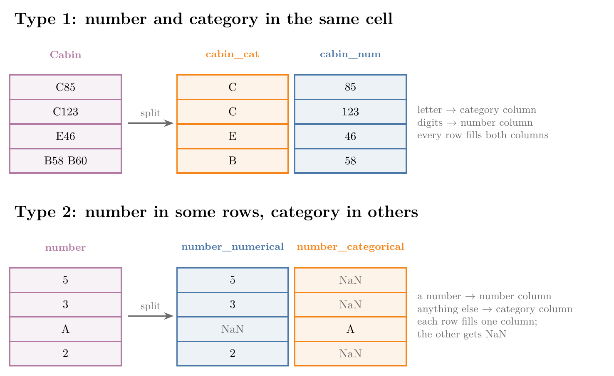
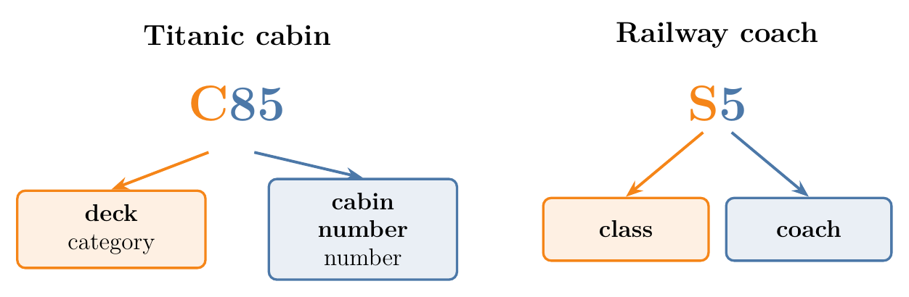
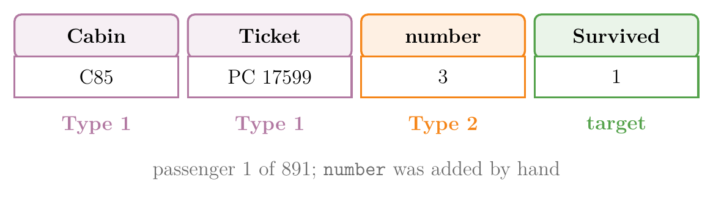
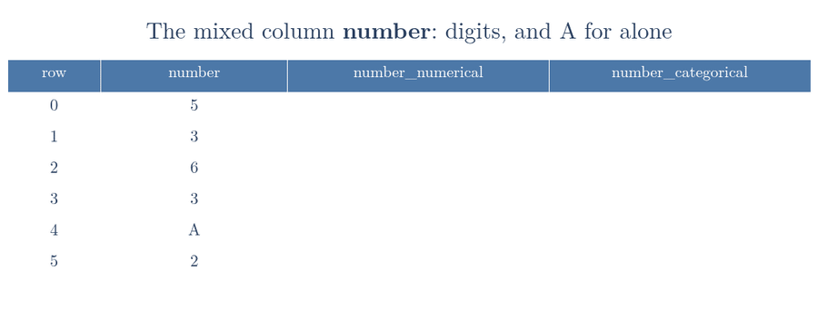
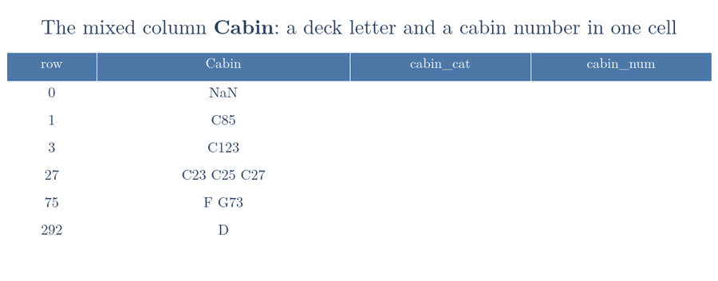
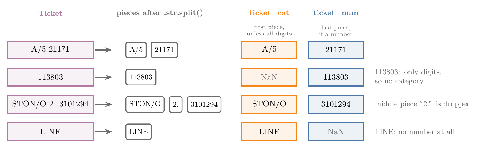
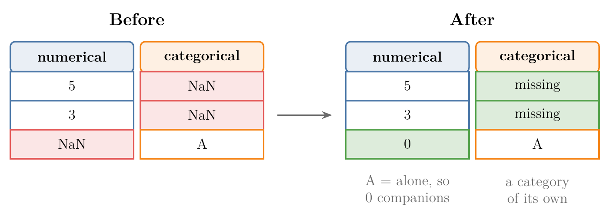

<!-- where-this-fits: generated by course_map/build_map.py; edit concepts.yaml, not this block -->
> **Where this fits:** Pipeline map step 5 (Engineer features). See the [Course map](../../../00-course-map/00-course-map.md).
>
> 
>
> - **Builds on:** [Feature engineering](../../../ML/03-feature-engineering/ML-022-what-is-feature-engineering/ML-022-what-is-feature-engineering.md#2-what-feature-engineering-is).
> - **Leads to:** [Feature construction and splitting](../../../ML/05-dimensionality/ML-044-feature-construction-splitting/ML-044-feature-construction-splitting.md#2-feature-construction).
<!-- /where-this-fits -->

## 1. Overview

> **Key point:** A mixed variable holds numbers and categories in the same column; we split it into one numerical feature and one categorical feature.

A **feature** (G-772) is an input variable (one column of the data table), the **target** (G-1949) is the output we predict, and an **observation** (G-1374) is one record (one row). Every feature so far has been either numerical or categorical. Some real features are both at once. This Note shows the two ways a feature can be mixed and how to split each one.

Think of a postal address such as "Flat 12B": a number and a letter packed into one label. To sort flats by floor or by block, we first pull the two parts apart.

Figure 1 shows both types and what splitting produces. The work is all done with pandas string tools.

{width=100%}

## 2. What a mixed variable is

> **Key point:** In Type 1, one cell holds a category and a number together; in Type 2, some cells hold a number and others a category.

A **mixed variable** (G-1237) is a feature whose values contain both numerical and categorical data. A model cannot use such a feature as it is: the values are neither clean numbers nor a short list of categories.

Mixed variables come in two types.

### 2.1 Type 1: number and category in the same cell

> **Key point:** Each value carries two pieces of information, a letter part and a number part.

The Titanic `Cabin` column holds values such as `C85` and `C123`. Each value packs two facts together:

- the letter is the **deck**, a category (C);
- the digits are the **cabin number** on that deck (85, 123).

Indian Railways coach labels work the same way: in `S5` or `B2`, the letter gives the class and the number gives the coach.

{width=75%}

Figure 2 pulls the two parts of each value apart.

Treating `C85` as one category gives far too many categories, since almost every cabin is different. The fix is to split each value into two new features: a categorical feature for the letter and a numerical feature for the number. Breaking one feature into one new feature per fact it holds is called **[feature splitting](../../05-dimensionality/ML-044-feature-construction-splitting/ML-044-feature-construction-splitting.md#52-splitting-a-feature)** (G-769, taught in full later).

### 2.2 Type 2: number in some rows, category in others

> **Key point:** The column holds whole numbers in most rows and a text label in a few rows.

In the second type, each cell holds only one thing, but not always the same kind of thing. A column might read `5, 3, A, 2, 1, A`: numbers in most rows, the letter `A` in others.

The fix is again two columns:

- where the value is a number, put it in the numerical column, and leave the categorical column empty (**NaN**, "not a number": the marker pandas uses for a missing value, see [handling missing values](../ML-022-what-is-feature-engineering/ML-022-what-is-feature-engineering.md#61-handling-missing-values));
- where the value is a category, do the opposite.

These two types cover most mixed data met in practice. Anything else must be handled by studying the data and writing a fix for it.

## 3. The data

> **Key point:** 891 Titanic passengers with three mixed columns: `Cabin` and `Ticket` (Type 1) and `number` (Type 2).

The data has four columns for the 891 passengers of the Titanic training file:

| Column | Meaning | Type |
|---|---|---|
| `Cabin` | deck letter and cabin number, e.g. `C85` | mixed, Type 1 |
| `Ticket` | ticket code, e.g. `A/5 21171` | mixed, Type 1 |
| `number` | how many people the passenger travelled with; `A` = alone | mixed, Type 2 |
| `Survived` | 1 if the passenger survived, 0 if not | target |

`Cabin` and `Ticket` are the real Titanic columns. The `number` column was added by hand to build a Type 2 example, so its values are made up and say nothing about survival.

{width=85%}

Figure 3 tags each column with its type.

The first five rows:

| | Cabin | Ticket | number | Survived |
|---|---|---|---|---|
| 0 | NaN | A/5 21171 | 5 | 0 |
| 1 | C85 | PC 17599 | 3 | 1 |
| 2 | NaN | STON/O2. 3101282 | 6 | 1 |
| 3 | C123 | 113803 | 3 | 1 |
| 4 | NaN | 373450 | A | 0 |

> **Python:** Loading the data.
>
> ```python
> import pandas as pd
>
> df = pd.read_csv("data/titanic.csv")
> df.dtypes
> # Cabin, Ticket, number: str    Survived: int64
> ```
>
> Since pandas 3, text columns get the dtype **`str`** (pandas' string type) instead of the old `object` (pandas release notes, What's new in 3.0.0). All three mixed columns are text, because every one of them contains at least one letter.

## 4. Splitting a Type 2 column

> **Key point:** Convert the column to numbers, letting failures become NaN; the rows that failed are the categorical part.

The `number` column has seven values: `1` to `6` and `A`. `A` (alone) is the most common value, with 139 passengers; the numbers each have 117 to 131 (left of Figure 4).

{width=100%}

### 4.1 The numerical part

> **Key point:** `pd.to_numeric(..., errors="coerce")` turns every value it can read into a number and every other value into NaN.

**`pd.to_numeric`** (G-1473) converts values to numbers. By default it stops with an error at the first value it cannot read, such as `A`. With **`errors="coerce"`** (G-707), it writes NaN for that value instead and carries on.

So `5` becomes 5, and `A` becomes NaN. The result is exactly the numerical column we want.

### 4.2 The categorical part

> **Key point:** Keep the original value only in the rows where the number conversion failed.

The categorical column is the mirror image. Wherever the numerical part is NaN, the original value was not a number, so it goes into the categorical column. Everywhere else, the categorical column is NaN.

Figure 5 splits the first six rows one at a time. Watch row 4: `A` cannot be read as a number, so the numerical column gets NaN there and the categorical column gets `A`. In every other row it is the other way round.



> **Python:** Splitting `number` into two columns.
>
> ```python
> num = pd.to_numeric(df["number"], errors="coerce")
> df["number_numerical"] = num.astype("Int64")
> # keep the text only where num is NaN
> df["number_categorical"] = df["number"].where(num.isna())
> ```
>
> `s.where(cond)` keeps each value of `s` where `cond` is True and puts NaN everywhere else.

The result on the first six rows:

| | number | number_numerical | number_categorical |
|---|---|---|---|
| 0 | 5 | 5 | NaN |
| 1 | 3 | 3 | NaN |
| 2 | 6 | 6 | NaN |
| 3 | 3 | 3 | NaN |
| 4 | A | \<NA\> | A |
| 5 | 2 | 2 | NaN |

> **Extra:** Why `.astype("Int64")`. A NumPy integer column cannot hold NaN, so `pd.to_numeric` returns floats: 5.0, 3.0, NaN. The option `downcast="integer"`, often seen in older code, cannot change this while a NaN is present, and the column stays float. **`Int64`** (capital I) is pandas' **nullable integer** (G-1363) type: whole numbers plus a missing marker, shown as `<NA>` (pandas user guide, "Nullable integer data type").

## 5. Splitting a Type 1 column: Cabin

> **Key point:** A regular expression pulls out the digits; the first character gives the deck letter.

`Cabin` has 147 different values, and 687 of the 891 passengers have no cabin at all (NaN). With 147 categories for only 204 known cabins, the feature is useless as it stands.

### 5.1 The number part

> **Key point:** `.str.extract(r"(\d+)")` finds the first run of digits in each value.

The **`.str`** (G-47) accessor applies a text method to every value of a column at once. The accessor is how pandas reaches string tools such as `extract`, `split` and `isdigit`.

A **regular expression** (G-1656) (regex) is a short pattern that describes text. The pattern `\d+` means "one or more digits", and the brackets mark the part to keep. So `str.extract(r"(\d+)")` returns `85` from `C85` and `123` from `C123`. Two more values, to see the rule at work: from `B57 B59` it returns `57` (only the first run of digits is taken), and from `F G73` it returns `73` (letters and spaces before the digits are skipped).

### 5.2 The category part

> **Key point:** `.str[0]` takes the first character of each value: the deck letter.

`.str[0]` picks character number 0 of every value: `C` from `C85`, `E` from `E46`. A missing cabin stays NaN in both new columns.

> **Python:** Splitting `Cabin`.
>
> ```python
> num = df["Cabin"].str.extract(r"(\d+)")[0]
> df["cabin_num"] = pd.to_numeric(num).astype("Int64")
> df["cabin_cat"] = df["Cabin"].str[0]
> ```
>
> `str.extract` returns a table with one column per bracket, so `[0]` takes its first column. The `r` before the quotes makes it a **raw string** (G-1638), where `\d` reaches the regex unchanged.

The result, on some first rows and on every unusual kind of value:

| | Cabin | cabin_num | cabin_cat |
|---|---|---|---|
| 0 | NaN | \<NA\> | NaN |
| 1 | C85 | 85 | C |
| 3 | C123 | 123 | C |
| 27 | C23 C25 C27 | 23 | C |
| 75 | F G73 | 73 | F |
| 292 | D | \<NA\> | D |

{width=75%}

Figure 6 shows the same rows as the table: watch the unusual values, where only the first deck letter and the first number survive.

Figure 7 runs the split one row at a time. Each row's first character lands in `cabin_cat` and its first run of digits in `cabin_num`; the heading says what happens to each unusual value.



After the split, `cabin_cat` has only 8 categories, the decks A to G and T (right of Figure 4). C is the most common deck, then B.

> **Extra:** Some values break the simple rule. A passenger booked into several cabins, such as `C23 C25 C27`, keeps only the first number, 23. `F G73` gives deck F, although the cabin is G73. `D` and `T` have no number, so `cabin_num` is missing. These are 14 of the 147 values; check them before relying on the split.

> **Extra:** `str.extract` returns text, so on its own `cabin_num` would hold the strings `"85"` and `"123"`. `pd.to_numeric` turns them into numbers.

## 6. Splitting a Type 1 column: Ticket

> **Key point:** Split each ticket at its spaces; the last piece is the number and the first piece is the category.

`Ticket` is messier: 681 different values in 891 rows. Most tickets are a prefix and a number, such as `A/5 21171` or `PC 17599`, but many are digits only, such as `113803`.

The rule, shown in Figure 8:

1. Split the value at its spaces into pieces.
2. **Number part:** the last piece, converted with `pd.to_numeric(..., errors="coerce")`.
3. **Category part:** the first piece, unless it is all digits; then there is no category (NaN).

{width=100%}

> **Python:** Splitting `Ticket`.
>
> ```python
> parts = df["Ticket"].str.split()
> df["ticket_num"] = pd.to_numeric(
>     parts.str[-1], errors="coerce").astype("Int64")
> first = parts.str[0]
> df["ticket_cat"] = first.where(~first.str.isdigit())
> ```
>
> `str.split()` turns each value into a list of pieces; `.str[-1]` and `.str[0]` then take the last and first piece. `str.isdigit()` is True when a value is all digits, and `~` flips True and False.

The result:

| | Ticket | ticket_num | ticket_cat |
|---|---|---|---|
| 0 | A/5 21171 | 21171 | A/5 |
| 1 | PC 17599 | 17599 | PC |
| 2 | STON/O2. 3101282 | 3101282 | STON/O2. |
| 3 | 113803 | 113803 | NaN |
| 115 | STON/O 2. 3101294 | 3101294 | STON/O |
| 179 | LINE | \<NA\> | LINE |

The 681 tickets have become 43 ticket categories plus a number. Four tickets read just `LINE`, so they have a category but no number.

> **Extra:** The 43 categories still repeat themselves. `A/5`, `A/5.`, `A./5.` and `A.5.` are the same prefix written four ways, and so are `SC/Paris` and `SC/PARIS`. Removing dots and slashes and upper-casing, `.str.replace(r"[./]", "", regex=True).str.upper()`, cuts the 43 down to 29. `STON/O 2.` and `STON/O2.` still differ, because the space split the first one into two pieces.

## 7. Filling the gaps the split leaves

> **Key point:** Splitting creates NaNs on purpose; fill the numerical ones with a value that makes sense and the categorical ones with a label such as "missing".

Splitting always leaves gaps. In Type 2, every row is missing one of its two new columns. In Type 1, a value with no number or no letter leaves a gap too.

Many scikit-learn models do not accept missing values (scikit-learn User Guide, "Imputation of missing values"), so we fill them:

- **Numerical feature:** a value that makes sense for the data. In `number_numerical`, NaN came from `A`, alone, so it means 0 companions: fill with 0.
- **Categorical feature:** a new category of its own, such as `"missing"`.

{width=90%}

Figure 9 shows both fills on three rows of the `number` split.

> **Python:** Filling the gaps.
>
> ```python
> df["number_numerical"] = df["number_numerical"].fillna(0)
> for col in ["number_categorical", "cabin_cat",
>             "ticket_cat"]:
>     df[col] = df[col].fillna("missing")
> ```

The first five rows, with all the new columns filled:

| | number_numerical | number_categorical | cabin_cat |
|---|---|---|---|
| 0 | 5 | missing | missing |
| 1 | 3 | missing | C |
| 2 | 6 | missing | missing |
| 3 | 3 | missing | C |
| 4 | 0 | A | missing |

| | cabin_num | ticket_num | ticket_cat |
|---|---|---|---|
| 0 | \<NA\> | 21171 | A/5 |
| 1 | 85 | 17599 | PC |
| 2 | \<NA\> | 3101282 | STON/O2. |
| 3 | 123 | 113803 | missing |
| 4 | \<NA\> | 373450 | missing |

`cabin_num` is left unfilled here: no single number stands for "no cabin". Filling it is a missing-values question: see [imputing, filling in the gaps](../../04-missing-data-and-outliers/ML-034-complete-case-analysis/ML-034-complete-case-analysis.md#32-imputing-filling-in-the-gaps).

The new features are then ready for the usual tools: [one-hot encoding](../ML-026-one-hot-encoding/ML-026-one-hot-encoding.md#22-one-column-per-category) for the categorical ones, [standardization](../ML-023-standardization/ML-023-standardization.md#42-the-formula) for the numerical ones.

> **Extra:** The split features carry information the raw ones hid. Survival rate by deck:
>
> | Deck | B | C | D | E | no cabin |
> |---|---|---|---|---|---|
> | Passengers | 47 | 59 | 33 | 32 | 687 |
> | Survived | 74% | 59% | 76% | 75% | 30% |
>
> Passengers with a known cabin survived far more often. Even "missing" is a useful category here.

## 8. Summary

| | Type 1 | Type 2 |
|---|---|---|
| What the cells look like | category and number together: `C85`, `A/5 21171` | a number in some rows, a category in others: `5`, `A` |
| Examples in the data | `Cabin`, `Ticket` | `number` |
| Number column | the digits of every value | the value where it is a number, else NaN |
| Category column | the letters of every value | the value where it is not a number, else NaN |
| pandas tools | `.str.extract`, `.str[0]`, `.str.split()` | `pd.to_numeric(errors="coerce")`, `.where` |

- A mixed variable holds numerical and categorical data in one feature; we split it into one numerical and one categorical feature, because a model cannot use values that are neither clean numbers nor a short list of categories.
- `pd.to_numeric(errors="coerce")` keeps what is a number and turns the rest into NaN, so the rows that failed mark exactly where the categorical part goes.
- The `.str` accessor applies text methods (extract, split, first character) to a whole column at once, so one line splits every value of the column.
- Use the nullable `Int64` type for whole numbers with gaps, because a NumPy integer column cannot hold NaN and would turn 5 into 5.0.
- Splitting cut `Cabin` from 147 values to 8 decks, and `Ticket` from 681 values to 43 prefixes, so the categorical parts become usable features (deck survival rates range from 30% with no cabin to 76%).
- Splitting leaves NaNs: fill numbers with a sensible value and categories with `"missing"`, because many scikit-learn models do not accept missing values.
- Check the unusual values, because no simple rule fits every one (`C23 C25 C27` keeps only 23, `F G73` gives deck F).
- So a column that mixes numbers and categories becomes two clean features, ready for the usual encoding and scaling.

## 9. Sources

**Built from**

- CampusX, "Handling Mixed Variables | Feature Engineering", YouTube, https://www.youtube.com/watch?v=9xiX-I5_LQY

**Other references**

- pandas release notes. What's new in 3.0.0 (dedicated string data type by default). pandas.pydata.org/docs/whatsnew.
- pandas user guide. Nullable integer data type. pandas.pydata.org/docs/user_guide/integer_na.html.
- scikit-learn User Guide. Imputation of missing values. scikit-learn.org.

## 10. Key terms

Terms taught in this Note come first; linked terms are recaps, taught in the Note the link opens.

| Term | Meaning |
|---|---|
| Mixed variable (G-1237) | A column holding both numerical and categorical data. |
| pd.to_numeric (G-1473) | The pandas function that converts values to numbers. |
| errors="coerce" (G-707) | The `pd.to_numeric` option that turns values it cannot convert into NaN instead of stopping. |
| Nullable integer (Int64) (G-1363) | The pandas integer type that can also hold a missing value, `<NA>`. |
| .str accessor (G-47) | The pandas tool that applies a text method to every value of a column. |
| Regular expression (G-1656) | A short pattern that describes text, such as `\d+` for "one or more digits". |
| Raw string (G-1638) | A Python string written `r"..."`, in which a backslash is kept as it is. |
| str dtype (G-1895) | The pandas 3 type for text columns, replacing `object`. |
| str.extract (G-1896) | The pandas method that returns the part of each value matching a regular expression. |
| Type 1 mixed variable (G-2030) | A column whose cells each contain a category and a number together, such as `C85`. |
| Type 2 mixed variable (G-2031) | A column with a number in some rows and a category in others. |
| [Feature](../../../ML/01-foundations/ML-002-ai-vs-ml-vs-dl/ML-002-ai-vs-ml-vs-dl.md#52-features-chosen-by-us-or-learned) (G-772) | One piece of information about each example that a model uses (e.g. a student's CGPA). |
| [Target](../../../ML/01-foundations/ML-003-types-of-ml/ML-003-types-of-ml.md#21-learning-from-inputs-and-outputs) (G-1949) | The output column we predict, such as the class; also called the label. |
| [Observation](../../../ML/01-foundations/ML-003-types-of-ml/ML-003-types-of-ml.md#21-learning-from-inputs-and-outputs) (G-1374) | One record of a dataset: one row of the data table. |
| [Feature splitting](../../../ML/05-dimensionality/ML-044-feature-construction-splitting/ML-044-feature-construction-splitting.md#52-splitting-a-feature) (G-769) | Breaking a column that holds several facts into one column per fact. |
