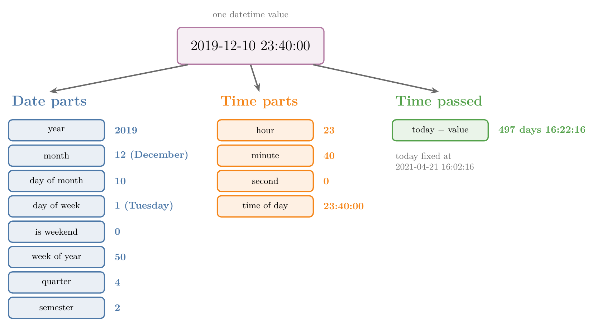
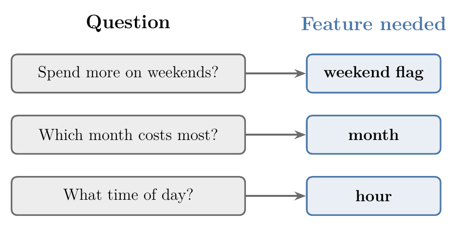
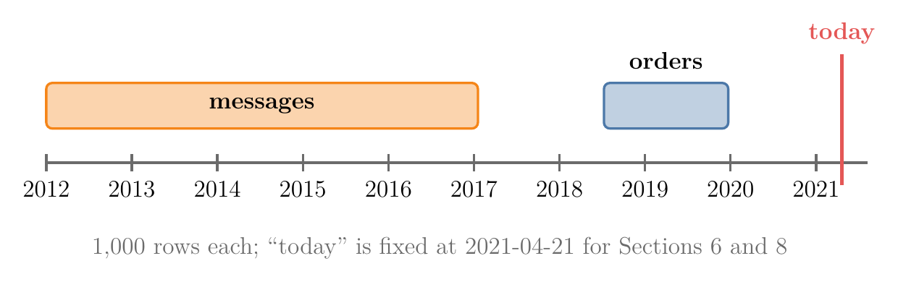
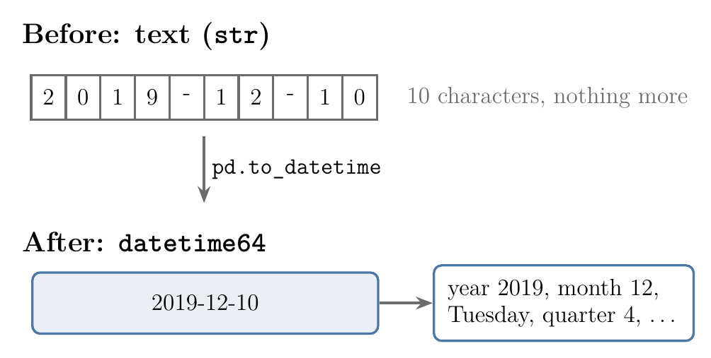
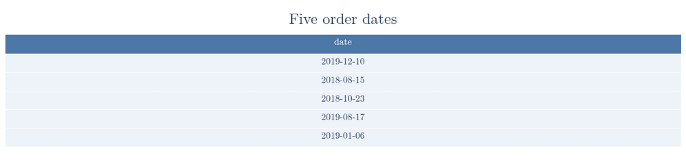
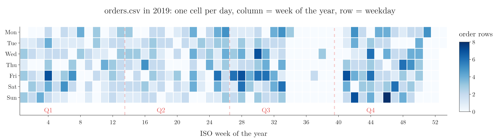
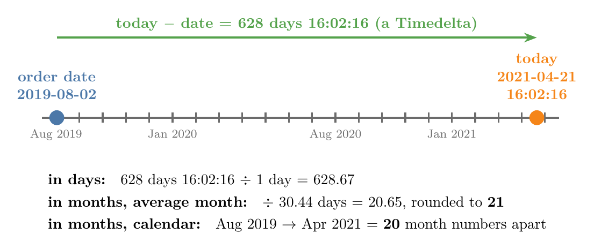
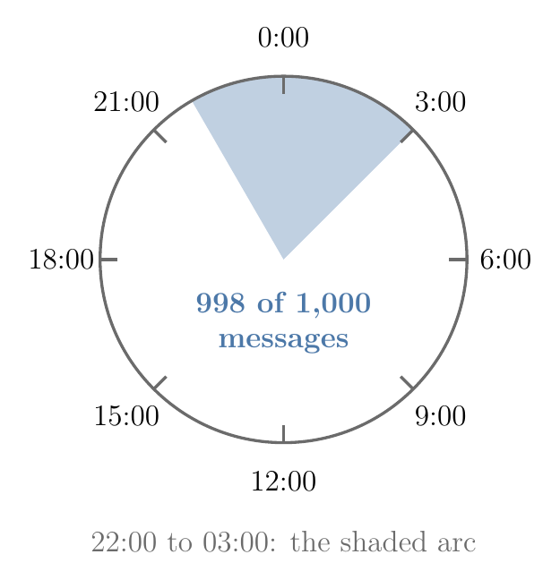
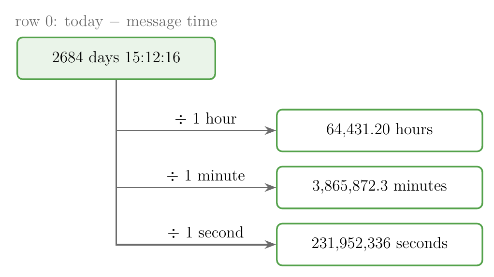

<!-- where-this-fits: generated by course_map/build_map.py; edit concepts.yaml, not this block -->
> **Where this fits:** Pipeline map step 5 (Engineer features). See the [Course map](../../../00-course-map/00-course-map.md).
>
> 
>
> - **Builds on:** [CSV files](../../../ML/02-getting-data/ML-014-working-with-csv/ML-014-working-with-csv.md#2-csv-and-tsv-files); [Feature engineering](../../../ML/03-feature-engineering/ML-022-what-is-feature-engineering/ML-022-what-is-feature-engineering.md#2-what-feature-engineering-is).
<!-- /where-this-fits -->

## 1. Overview

> **Key point:** A date or time column hides many useful features (year, month, weekday, hour, time passed); we convert the column to a datetime type and pull each one out with `.dt`.

A **feature** (G-772) is an input variable (one column of the data table), and an **observation** (G-1374) is one record (one row). A single value such as `2019-12-10 23:40:00` looks like one piece of information. The value actually holds a dozen, like a train ticket that also tells the day, the season and whether you travel at night: the year, the month, the weekday, whether it is a weekend, the hour, and more.

Figure 1 shows one value split into these features. The rest of the Note shows the pandas code for each one. The Notebook (`ML-033-date-and-time.ipynb`) runs every example.

{width=100%}

## 2. Why date and time columns are useful

> **Key point:** The hidden parts of a date (weekday, month, weekend) often explain behaviour better than the raw date does.

Take the date 23 August 2012. From it we can read:

- the day of the month (23), the month (August) and the year (2012);
- the day of the week (Thursday), and whether it is a weekend;
- the quarter of the year and the half of the year (semester).

A time such as `16:02:58` holds the hour, the minute and the second in the same way.

Consider an expense-tracker app that reports how a user spends money. The raw date of each payment says little. The extracted parts answer real questions:

- Does the user spend more on weekends than on weekdays?
- In which month does the user spend the most?
- At what time of day does most spending happen?

Each question needs one extracted feature: a weekend flag, the month, the hour. Building such columns is a kind of feature engineering.

{width=70%}

Figure 2 pairs each question with its feature.

## 3. The data

> **Key point:** Two small files: `orders.csv` holds dates only, `messages.csv` holds dates with times.

We use two files of 1,000 rows each.

{width=90%}

Figure 3 places the two files on one time line; the gap to "today" is why the elapsed times in Sections 6 and 8 are so large.

| File | Columns | Range |
|---|---|---|
| `orders.csv` | `date`, `product_id`, `city_id`, `orders` | 2018-07-10 to 2019-12-16 |
| `messages.csv` | `date` (date and time) | 2012-01-01 to 2017-01-18 |

`orders.csv` comes from an online shop: on which date, which product, in which city, how many orders. `messages.csv` gives the send time of 1,000 chat messages from a messaging app. The original file also holds the message text; we drop it, since only the times are used.

The first rows:

| | date | product_id | city_id | orders |
|---|---|---|---|---|
| 0 | 2019-12-10 | 5628 | 25 | 3 |
| 1 | 2018-08-15 | 3646 | 14 | 157 |
| 2 | 2018-10-23 | 1859 | 25 | 1 |
| 3 | 2019-08-17 | 7292 | 25 | 1 |
| 4 | 2019-01-06 | 4344 | 25 | 3 |

| | date (messages) |
|---|---|
| 0 | 2013-12-15 00:50:00 |
| 1 | 2014-04-29 23:40:00 |
| 2 | 2012-12-30 00:21:00 |
| 3 | 2014-11-28 00:31:00 |
| 4 | 2013-10-26 23:11:00 |

## 4. Converting text to a datetime type

> **Key point:** `read_csv` reads dates as text; `pd.to_datetime` converts them, and only then do the date tools work.

When pandas loads a CSV file, a date column arrives as plain text (dtype `str`). As text, `2019-12-10` is just ten characters: pandas cannot tell its month or weekday. So the first step is always to change the column's type.

{width=75%}

Figure 4 shows what the conversion buys us.

**`pd.to_datetime`** (G-1472) converts text into **datetime** (G-545) values: values that pandas understands as points in time.

> **Python:** Converting the column.
>
> ```python
> import numpy as np
> import pandas as pd
>
> orders = pd.read_csv("data/orders.csv")
> orders["date"].dtype      # str
>
> orders["date"] = pd.to_datetime(orders["date"])
> orders["date"].dtype      # datetime64[us]
> ```

| | dtype of `date` | Date tools available? |
|---|---|---|
| Before | `str` | no |
| After | `datetime64[us]` | yes |

The table itself looks the same before and after: only `orders.info()` shows the new type. `to_datetime` reads the text by a *format*, a pattern in which `%Y` stands for the four-digit year, `%m` the month and `%d` the day. The text `2019-12-10` fits the pattern `%Y-%m-%d`, so it is read as 10 December 2019. When day and month are written the other way round, we tell pandas the pattern (see the Extra below). The same conversion can be done while reading the file, with `parse_dates=["date"]` in `read_csv` (see [reading dates](../../02-getting-data/ML-014-working-with-csv/ML-014-working-with-csv.md#15-reading-dates-parse_dates)).

> **Extra:** How `pd.to_datetime` reads the text. Since pandas 2 it guesses one format from the first value and applies it to every row (pandas release notes, 2.0.0, "Datetimes are now parsed with a consistent format"). The single guessed format causes two surprises with day/month dates:
>
> - `"10/12/2019"` is read month first, as 12 October 2019.
> - `["10/12/2019", "25/12/2019"]` stops with `ValueError: time data "25/12/2019" doesn't match format "%m/%d/%Y"`, because there is no month 25.
>
> The fix is to state the format: `pd.to_datetime(s, format="%d/%m/%Y")` gives 10 and 25 December. Here `%d` is the day, `%m` the month and `%Y` the four-digit year. Two more options help with messy columns:
>
> - `format="mixed"` guesses the format separately for each value.
> - `errors="coerce"` turns a value that cannot be read into **NaT** (G-1304) ("not a time"), the datetime version of NaN.

## 5. Extracting parts of a date

> **Key point:** `column.dt.<part>` returns one part of every date in the column at once.

The **`.dt` accessor** (G-46) gives a datetime column its date tools, the way `.str` gives a text column its text tools. Each tool returns a new column with one value per observation. We store each one as a new feature. Figure 5 adds the features of this section one at a time to the first five orders.



### 5.1 Year

> **Key point:** `.dt.year` gives the year as a number.

> **Python:** Year.
>
> ```python
> orders["date_year"] = orders["date"].dt.year
> ```

The orders cover two years: 355 rows from 2018 and 645 from 2019.

### 5.2 Month

> **Key point:** `.dt.month` gives the month number (1 to 12); `.dt.month_name()` gives its name.

`month` is an attribute, written without brackets. `month_name()` is a method, written with brackets.

> **Python:** Month number and name.
>
> ```python
> orders["date_month_no"] = orders["date"].dt.month
> orders["date_month_name"] = orders["date"].dt.month_name()
> ```

### 5.3 Day of the month

> **Key point:** `.dt.day` gives the day of the month (1 to 31).

> **Python:** Day of the month.
>
> ```python
> orders["date_day"] = orders["date"].dt.day
> ```

The results so far:

| | date | date_year | date_month_no | date_month_name | date_day |
|---|---|---|---|---|---|
| 0 | 2019-12-10 | 2019 | 12 | December | 10 |
| 1 | 2018-08-15 | 2018 | 8 | August | 15 |
| 2 | 2018-10-23 | 2018 | 10 | October | 23 |
| 3 | 2019-08-17 | 2019 | 8 | August | 17 |
| 4 | 2019-01-06 | 2019 | 1 | January | 6 |

### 5.4 Day of the week

> **Key point:** `.dt.dayofweek` numbers the days from Monday = 0 to Sunday = 6; `.dt.day_name()` gives the name.

The numbering starts at Monday, with 0, and ends at Sunday, with 6. So 10 December 2019, a Tuesday, gets 1.

> **Python:** Day of the week.
>
> ```python
> orders["date_dow"] = orders["date"].dt.dayofweek
> orders["date_dow_name"] = orders["date"].dt.day_name()
> ```

### 5.5 Weekend or not

> **Key point:** A weekend flag is 1 for Saturday and Sunday and 0 for the other days.

There is no ready-made `.dt` tool for this, so we build it from the weekday. Saturday and Sunday are the only days numbered 5 or more.

> **Python:** Weekend flag.
>
> ```python
> orders["date_is_weekend"] = (orders["date_dow"] >= 5).astype(int)
> ```
>
> `orders["date_dow"] >= 5` gives True or False for each row; `.astype(int)` turns True into 1 and False into 0.

| | date | date_dow | date_dow_name | date_is_weekend |
|---|---|---|---|---|
| 0 | 2019-12-10 | 1 | Tuesday | 0 |
| 1 | 2018-08-15 | 2 | Wednesday | 0 |
| 2 | 2018-10-23 | 1 | Tuesday | 0 |
| 3 | 2019-08-17 | 5 | Saturday | 1 |
| 4 | 2019-01-06 | 6 | Sunday | 1 |

284 of the 1,000 orders fall on a weekend. Figure 6 (left) shows the rows per weekday.

{width=100%}

> **Extra:** Older code builds the same flag from the names: `np.where(orders["date_dow_name"].isin(["Saturday", "Sunday"]), 1, 0)`. `np.where(condition, a, b)` gives `a` where the condition is True and `b` elsewhere. Both ways give the same column; the number comparison does not depend on the names being in English.

### 5.6 Week of the year

> **Key point:** `.dt.isocalendar().week` gives the week number (1 to 53); the older `.dt.week` no longer exists.

A year has 52 weeks, and sometimes 53. The week number tells us where in the year a date falls: 10 December 2019 is in week 50, 6 January 2019 in week 1.

> **Python:** Week of the year.
>
> ```python
> orders["date_week"] = orders["date"].dt.isocalendar().week
> ```
>
> `.dt.isocalendar()` returns a table with three columns, `year`, `week` and `day`; `.week` takes the week column.

Older code writes `orders["date"].dt.week`. `.dt.week` was deprecated in pandas 1.1 and removed in pandas 2, so it now fails with `AttributeError: 'DatetimeProperties' object has no attribute 'week'`. The new way gives exactly the same numbers.

> **Extra:** The week numbers follow the **ISO calendar** (G-975): weeks run Monday to Sunday, and week 1 is the week that contains the year's first Thursday (ISO 8601), so the last days of December can belong to week 1 of the next year.

### 5.7 Quarter

> **Key point:** `.dt.quarter` splits the year into four parts of three months: January to March is quarter 1, and so on.

> **Python:** Quarter.
>
> ```python
> orders["quarter"] = orders["date"].dt.quarter
> ```

December and October fall in quarter 4, August in quarter 3, January in quarter 1. Companies often report sales by quarter, so this feature matches how business data is usually grouped.

Figure 7 lays out the 2019 orders as a calendar: each column is one week of the year, each row a weekday, and the dashed lines start each quarter. Every date's week and quarter can be read off its position.



### 5.8 Semester

> **Key point:** A semester is half a year: quarters 1 and 2 are semester 1, quarters 3 and 4 are semester 2.

pandas has no semester tool, so we build it from the quarter.

> **Python:** Semester.
>
> ```python
> orders["semester"] = np.where(
>     orders["quarter"].isin([1, 2]), 1, 2)
> ```
>
> `.isin([1, 2])` is True where the quarter is 1 or 2.

| | date | date_week | quarter | semester |
|---|---|---|---|---|
| 0 | 2019-12-10 | 50 | 4 | 2 |
| 1 | 2018-08-15 | 33 | 3 | 2 |
| 2 | 2018-10-23 | 43 | 4 | 2 |
| 3 | 2019-08-17 | 33 | 3 | 2 |
| 4 | 2019-01-06 | 1 | 1 | 1 |

## 6. Time passed since a date

> **Key point:** Subtracting two datetimes gives a Timedelta; dividing it by a unit turns it into a number of days, hours or months.

How long ago an order was placed is often a useful feature, for example "days since the last purchase". We get it by subtracting the date from today's date.

### 6.1 Fixing "today"

> **Key point:** We write today's date as a fixed value, so the results stay the same whenever the code runs.

`pd.Timestamp.now()` (or `datetime.datetime.today()`) returns the moment the code runs, so every run gives different numbers. In this Note "today" is fixed at 21 April 2021, 16:02:16.

> **Python:** A fixed "today".
>
> ```python
> today = pd.Timestamp("2021-04-21 16:02:16")
> ```
>
> A **Timestamp** (G-1978) is pandas' type for one single point in time; a datetime column is a column of Timestamps.

### 6.2 The Timedelta

> **Key point:** `today - orders["date"]` gives one Timedelta per row: a length of time in days, hours, minutes and seconds.

A **Timedelta** (G-1977) is a length of time, such as `498 days 16:02:16`. Subtracting one Timestamp from another gives one. Figure 8 shows it for one order, row 11 (2 August 2019), which section 6.3 comes back to.

{width=100%}

> **Python:** Time passed.
>
> ```python
> elapsed = today - orders["date"]
> elapsed.dt.days                    # whole days
> elapsed / np.timedelta64(1, "D")   # days, with fractions
> ```

| | date | elapsed | .dt.days | / 1 day |
|---|---|---|---|---|
| 0 | 2019-12-10 | 498 days 16:02:16 | 498 | 498.668 |
| 1 | 2018-08-15 | 980 days 16:02:16 | 980 | 980.668 |
| 2 | 2018-10-23 | 911 days 16:02:16 | 911 | 911.668 |
| 3 | 2019-08-17 | 613 days 16:02:16 | 613 | 613.668 |
| 4 | 2019-01-06 | 836 days 16:02:16 | 836 | 836.668 |

There are two ways to get days:

- **`.dt.days`** keeps only the whole days and drops the hours.
- **Dividing by one day**, `np.timedelta64(1, "D")`, keeps the fraction: 16 hours 2 minutes is 0.668 of a day.

`np.timedelta64(1, "D")` is NumPy's way of writing a Timedelta of one day. `pd.Timedelta(days=1)` means the same.

### 6.3 Months passed

> **Key point:** A month has no fixed length, so "months passed" must be computed with an average month or by counting calendar months.

To get months, older code divides by `np.timedelta64(1, "M")`, one month. Current pandas refuses: `ValueError: Unit M is not supported. Only unambiguous timedelta values durations are supported.` A month can be 28, 29, 30 or 31 days long, so "one month" is not a fixed length of time.

**Way 1: divide by an average month.** In words: the months passed are the days passed divided by the length of an average month, rounded to a whole number.

$$\text{months} = \text{round}\left(\frac{\text{days passed}}{30.436875}\right)$$

The 30.436875 days are the average length of a calendar year, 365.2425 days, divided by 12:

$$365.2425 / 12 = 30.436875$$

The same average month is exactly the length `np.timedelta64(1, "M")` used to stand for: NumPy converts `np.timedelta64(1, "M")` to exactly 30.436875 days.

For row 0, ordered on 10 December 2019:

$$\frac{498.668}{30.436875} = 16.38 \thickspace\rightarrow\thickspace16 \text{ months}$$

**Way 2: count calendar months.** Subtract the month numbers, counting 12 for each year in between.

$$\text{months} = 12 \times (\text{year of today} - \text{year of date})$$

$$+ (\text{month of today} - \text{month of date})$$

For row 0:

$$12 \times (2021 - 2019) + (4 - 12)$$

$$= 24 - 8$$

$$= 16 \text{ months}$$

> **Python:** Months passed, both ways.
>
> ```python
> # way 1: average month length
> avg = pd.Timedelta(days=30.436875)
> months_avg = (elapsed / avg).round()
>
> # way 2: calendar months
> d = orders["date"]
> months_cal = ((today.year - d.dt.year) * 12
>               + (today.month - d.dt.month))
> ```

| | date | average month | calendar months |
|---|---|---|---|
| 0 | 2019-12-10 | 16 | 16 |
| 1 | 2018-08-15 | 32 | 32 |
| 2 | 2018-10-23 | 30 | 30 |
| 3 | 2019-08-17 | 20 | 20 |
| 4 | 2019-01-06 | 27 | 27 |
| 11 | 2019-08-02 | 21 | 20 |

The two ways agree on the first five rows, but disagree on 205 of the 1,000. Row 11 shows why (Figure 8): from 2 August 2019 to 21 April 2021 is 20 months and 19 days. The average-month way gives 20.65 and rounds it up to 21; the calendar way counts 20.

> **Extra:** Neither way is wrong; they answer slightly different questions. The average-month way measures a length of time, the calendar way counts month changes. Pick one and use it for every row. For a model, days passed (`.dt.days`) is often the simplest choice: it is exact and needs no rounding.

## 7. Extracting parts of a time

> **Key point:** With a time in the column, `.dt.hour`, `.dt.minute` and `.dt.second` work just like the date parts.

`messages.csv` holds dates with times. The conversion is the same `pd.to_datetime`, and the time parts come from the same `.dt` accessor.

> **Python:** Hour, minute, second and time of day.
>
> ```python
> messages = pd.read_csv("data/messages.csv")
> messages["date"] = pd.to_datetime(messages["date"])
>
> messages["hour"] = messages["date"].dt.hour
> messages["min"] = messages["date"].dt.minute
> messages["sec"] = messages["date"].dt.second
> messages["time"] = messages["date"].dt.time
> ```

| | date | hour | min | sec | time |
|---|---|---|---|---|---|
| 0 | 2013-12-15 00:50:00 | 0 | 50 | 0 | 00:50:00 |
| 1 | 2014-04-29 23:40:00 | 23 | 40 | 0 | 23:40:00 |
| 2 | 2012-12-30 00:21:00 | 0 | 21 | 0 | 00:21:00 |
| 3 | 2014-11-28 00:31:00 | 0 | 31 | 0 | 00:31:00 |
| 4 | 2013-10-26 23:11:00 | 23 | 11 | 0 | 23:11:00 |

`.dt.time` keeps only the time of day and drops the date. The time of day is useful when only the clock time matters.

The hour feature already tells a story. Figure 6 (right) shows that 998 of the 1,000 messages were sent between 22:00 and 03:00: the app is used for night-time chat.

{width=45%}

Figure 9 wraps the hours around a clock, so the arc from 22:00 to 03:00 reads as one stretch of night.

> **Extra:** `.dt.time` returns a column of Python `datetime.time` objects (dtype `object`), not a datetime column. The `.dt` tools no longer work on it, and a model cannot use it directly. For a model, the `hour` and `min` numbers are the better features.

## 8. Time passed in seconds, minutes and hours

> **Key point:** Divide the Timedelta by one second, one minute or one hour to get the time passed in that unit.

The subtraction works as in Section 6, now with times included. Only the unit we divide by changes.

> **Python:** Time passed in three units.
>
> ```python
> since = today - messages["date"]
> since / np.timedelta64(1, "s")   # seconds
> since / np.timedelta64(1, "m")   # minutes
> since / np.timedelta64(1, "h")   # hours
> ```

| | elapsed | seconds | minutes | hours |
|---|---|---|---|---|
| 0 | 2684 days 15:12:16 | 231,952,336 | 3,865,872.3 | 64,431.20 |
| 1 | 2548 days 16:22:16 | 220,206,136 | 3,670,102.3 | 61,168.37 |
| 2 | 3034 days 15:41:16 | 262,194,076 | 4,369,901.3 | 72,831.69 |
| 3 | 2336 days 15:31:16 | 201,886,276 | 3,364,771.3 | 56,079.52 |
| 4 | 2733 days 16:51:16 | 236,191,876 | 3,936,531.3 | 65,608.85 |

Check row 0 in hours. The 2684 days are:

$$2684 \times 24 = 64{,}416 \text{ hours}$$

The time 15:12:16 adds 15.20 hours:

$$64{,}416 + 15.20 = 64{,}431.20 \text{ hours}$$

{width=70%}

Figure 10 shows the three divisions for row 0.

The unit letters are case-sensitive:

| Letter | Unit |
|---|---|
| `"D"` | day |
| `"h"` | hour |
| `"m"` | minute |
| `"s"` | second |
| `"M"` | month: no longer allowed (Section 6.3) |

> **Extra:** `since.dt.total_seconds()` gives the same seconds without NumPy. Dividing by `pd.Timedelta(hours=1)` or `pd.Timedelta(minutes=1)` works too, and reads more clearly than the single letters.

> **Extra:** Dates and times can also carry a **time zone**, such as India's +05:30. Mixing values from different time zones needs extra care (`.dt.tz_localize` and `.dt.tz_convert`). Time zones rarely matter in our ML datasets; our two files have no time zone.

## 9. Summary

| Feature | Code | Row 0 of `orders` |
|---|---|---|
| Convert text | `pd.to_datetime(col)` | `2019-12-10` |
| Year | `.dt.year` | 2019 |
| Month | `.dt.month`, `.dt.month_name()` | 12, December |
| Day of month | `.dt.day` | 10 |
| Day of week | `.dt.dayofweek`, `.dt.day_name()` | 1, Tuesday |
| Weekend | `(dayofweek >= 5).astype(int)` | 0 |
| Week of year | `.dt.isocalendar().week` | 50 |
| Quarter, semester | `.dt.quarter`, from the quarter | 4, 2 |
| Days passed | `(today - col).dt.days` | 498 |
| Months passed | `/ pd.Timedelta(days=30.436875)`, rounded | 16 |
| Hour, minute, second | `.dt.hour`, `.dt.minute`, `.dt.second` | (messages) 0, 50, 0 |

- Each extracted part in the table is worth a feature of its own, because it answers its own question (weekend spending, the busiest month, the time of day) that the raw date cannot.
- Dates arrive as text; convert them with `pd.to_datetime` (or `parse_dates` in `read_csv`) before anything else, because as text `2019-12-10` is just ten characters and the date tools do not work.
- The `.dt` accessor pulls out each part of a date or time as a new feature, for every row of the column at once.
- Weekend and semester flags are built from the weekday and the quarter, because pandas has no ready-made tool for them.
- `.dt.week` was removed: use `.dt.isocalendar().week`, because older code with `.dt.week` now fails with an `AttributeError`.
- Subtracting datetimes gives a Timedelta; divide it by a unit to get a number, so a model can use the time passed, such as days since the last purchase.
- A month has no fixed length: use an average month of 30.436875 days, or count calendar months. That is why current pandas refuses `np.timedelta64(1, "M")`, and why the two ways disagree on 205 of the 1,000 orders.
- Fix "today" as a constant so that results do not change between runs, because `pd.Timestamp.now()` gives a different moment every time the code runs.
- Give `pd.to_datetime` a `format` when dates are written day first, because pandas guesses one format from the first value: `10/12/2019` is read as 12 October, and `25/12/2019` stops with an error.
- So one date or time column becomes many useful features once it is converted to a datetime type and its parts are pulled out with `.dt`.

## 10. Sources

**Built from**

- CampusX, "Handling Date and Time Variables | Day 34 | 100 Days of Machine Learning", YouTube, https://www.youtube.com/watch?v=J73mvgG9fFs

**Other references**

- ISO 8601-1:2019. Date and time: Representations for information interchange, Part 1 (week dates). International Organization for Standardization.
- pandas release notes. What's new in 1.1.0 and 2.0.0. pandas.pydata.org/docs/whatsnew.

## 11. Key terms

Terms taught in this Note come first; linked terms are recaps, taught in the Note the link opens.

| Term | Meaning |
|---|---|
| pd.to_datetime (G-1472) | The pandas function that converts text to datetime values. |
| Datetime (G-545) | A value pandas understands as a point in time, with date and time parts, so we can pull out parts such as the year or weekday and compute the time between two dates. |
| NaT (G-1304) | "Not a time": the missing value of a datetime column. |
| .dt accessor (G-46) | The pandas tool that applies date and time methods to every value of a datetime column. |
| ISO week (G-975) | The week number of the ISO calendar, from `.dt.isocalendar().week`; week 1 holds the year's first Thursday. |
| Timestamp (G-1978) | pandas' type for a single point in time. |
| Timedelta (G-1977) | A length of time, the result of subtracting two datetimes. |
| datetime64 (G-546) | The pandas column type for datetimes; `[us]` means microsecond resolution. |
| Day of week (G-547) | The weekday as a number, Monday = 0 to Sunday = 6 (`.dt.dayofweek`). |
| Format string (G-795) | A pattern such as `"%d/%m/%Y"` telling `pd.to_datetime` how dates are written. |
| Quarter (G-1601) | One of four three-month parts of a year. |
| Semester (G-1767) | One of two six-month halves of a year. |
| [Feature](../../../ML/01-foundations/ML-002-ai-vs-ml-vs-dl/ML-002-ai-vs-ml-vs-dl.md#52-features-chosen-by-us-or-learned) (G-772) | One piece of information about each example that a model uses (e.g. a student's CGPA). |
| [Observation](../../../ML/01-foundations/ML-003-types-of-ml/ML-003-types-of-ml.md#21-learning-from-inputs-and-outputs) (G-1374) | One record of a dataset: one row of the data table. |
